## 1 MySQL概述

在这一章节，我们主要介绍两个部分，数据库相关概念及MySQL数据库的介绍、下载、安装、启动及连接。

### 1.1 数据库相关概念

在这一部分，我们先来讲解三个概念：数据库、数据库管理系统、SQL。

| **名称**       | **全称**                                                     | **简称**                            |
| -------------- | ------------------------------------------------------------ | ----------------------------------- |
| 数据库         | 存储数据的仓库，数据是有组织的进行存储                       | DataBase（DB）                      |
| 数据库管理系统 | 操纵和管理数据库的大型软件                                   | DataBase  Management System  (DBMS) |
| SQL            | 操作关系型数据库的编程语言，定义了一套操作 关系型数据库统一**标准** | Structured Query Language (SQL)     |

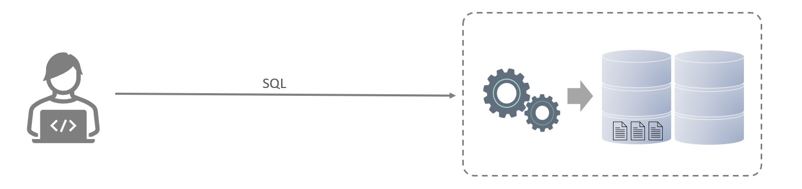

而目前主流的关系型数据库管理系统的市场占有率排名如下：

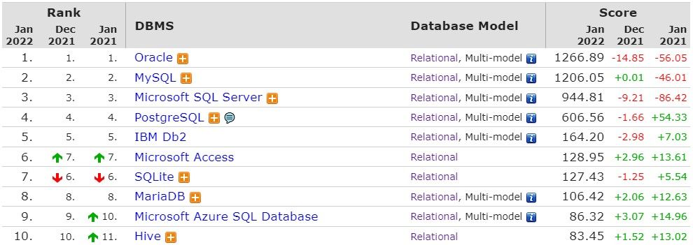

- Oracle：大型的收费数据库，Oracle公司产品，价格昂贵。

- MySQL：开源免费的中小型数据库，后来Sun公司收购了MySQL，而Oracle又收购了Sun公司。

- 目前Oracle推出了收费版本的MySQL，也提供了免费的社区版本。

- SQL Server：Microsoft 公司推出的收费的中型数据库，C#、.net等语言常用。

- PostgreSQL：开源免费的中小型数据库。

- DB2：IBM公司的大型收费数据库产品。

- SQLLite：嵌入式的微型数据库。Android内置的数据库采用的就是该数据库。

- MariaDB：开源免费的中小型数据库。是MySQL数据库的另外一个分支、另外一个衍生产品，与

MySQL数据库有很好的兼容性。

而不论我们使用的是上面的哪一个关系型数据库，最终在操作时，都是使用SQL语言来进行统一操作， 因为我们前面讲到SQL语言，是操作关系型数据库的 **统一标准** 。所以即使我们现在学习的是MySQL， 假如我们以后到了公司，使用的是别的关系型数据库，如：Oracle、DB2、SQLServer，也完全不用 担心，因为操作的方式都是一致的。

### 1.2 MySQL数据库

#### 1.2.1 版本

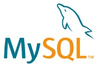

官方： <https://www.mysql.com/>

MySQL官方提供了两种不同的版本：

- 社区版本（MySQL Community Server）
  - 免费， MySQL不提供任何技术支持

- 商业版本（MySQL Enterprise Edition）
  - 收费，可以使用30天，官方提供技术支持

本课程采用的是MySQL最新的社区版-MySQL Community Server 8.0.26

#### 1.2.2 下载

下载地址： <https://downloads.mysql.com/archives/installer/>

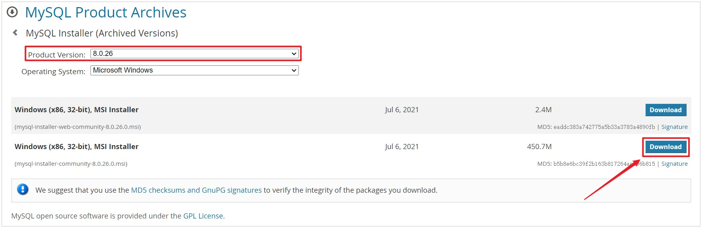

也可以使用课程资料中提供的MySQL的安装包：


#### 1.2.3 安装

要想使用MySQL，我们首先先得将MySQL安装好，我们可以根据下面的步骤，一步一步的完成MySQL的 安装。

##### 1). 双击官方下来的安装包文件


##### 2). 根据安装提示进行安装

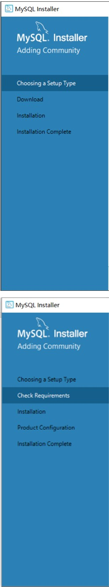

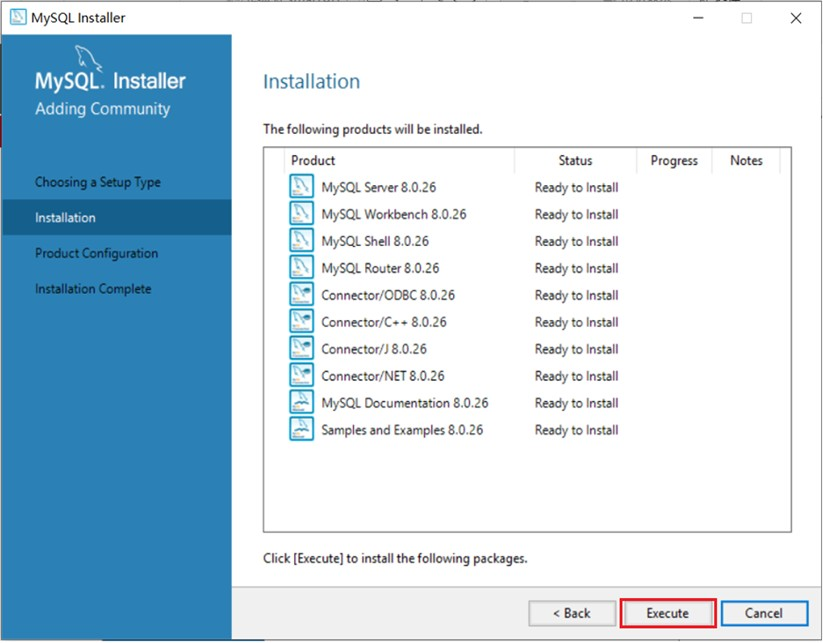

安装MySQL的相关组件，这个过程可能需要耗时几分钟，耐心等待。


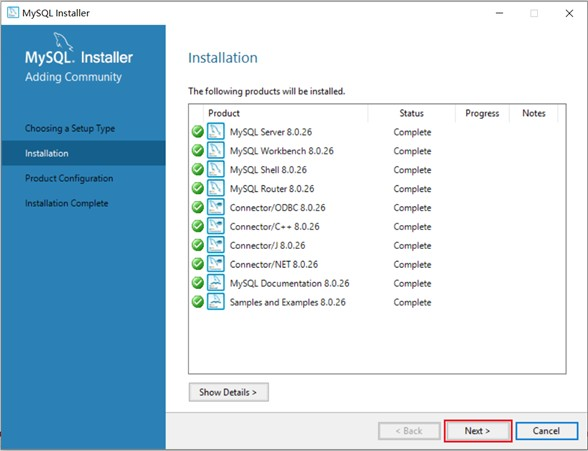


输入MySQL中root用户的密码,一定记得记住该密码

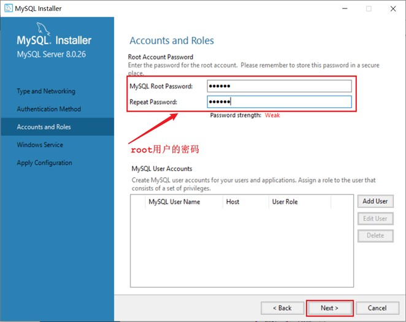


##### 3). 配置

安装好MySQL之后，还需要配置环境变量，这样才可以在任何目录下连接MySQL。

A. 在此电脑上，右键选择属性

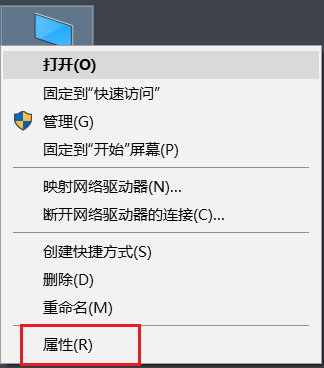

B. 点击左侧的 "高级系统设置"，选择环境变量

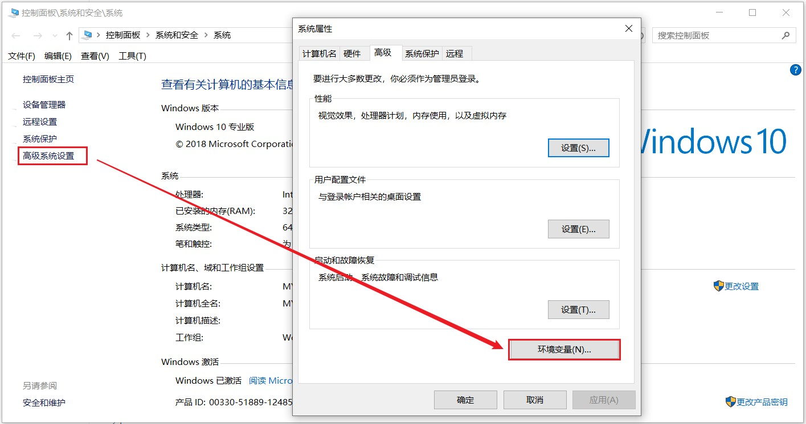

C. 找到 Path 系统变量, 点击 "编辑"


D. 选择 "新建" , 将MySQL Server的安装目录下的bin目录添加到环境变量

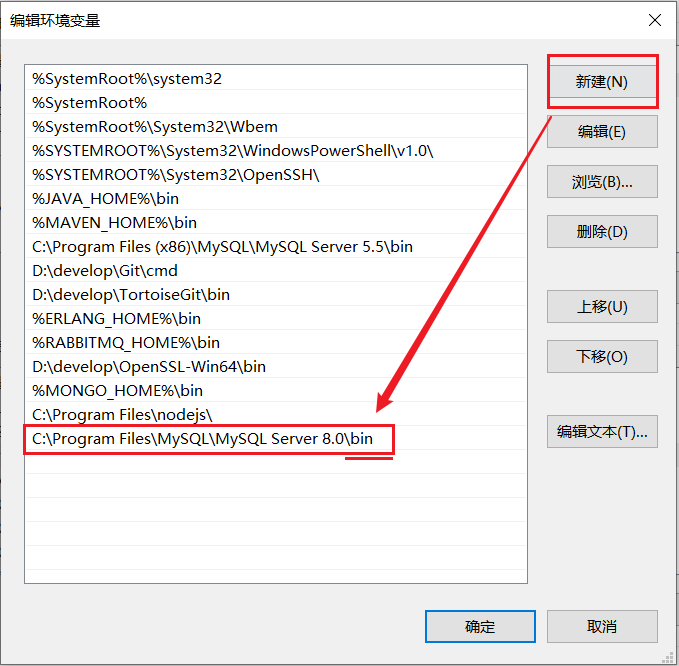

#### 1.2.4 启动停止

MySQL安装完成之后，在系统启动时，会自动启动MySQL服务，我们无需手动启动了。

当然，也可以手动的通过指令启动停止，以管理员身份运行cmd，进入命令行执行如下指令：

```shell
net start mysql80
net stop mysql80
```


> 注意 ： 上述的 mysql80 是我们在安装MySQL时，默认指定的mysql的系统服务名，不是固定的，如果未改动，默认就是mysql80。


#### 1.2.5 客户端连接

##### 1). 方式一：使用MySQL提供的客户端命令行工具

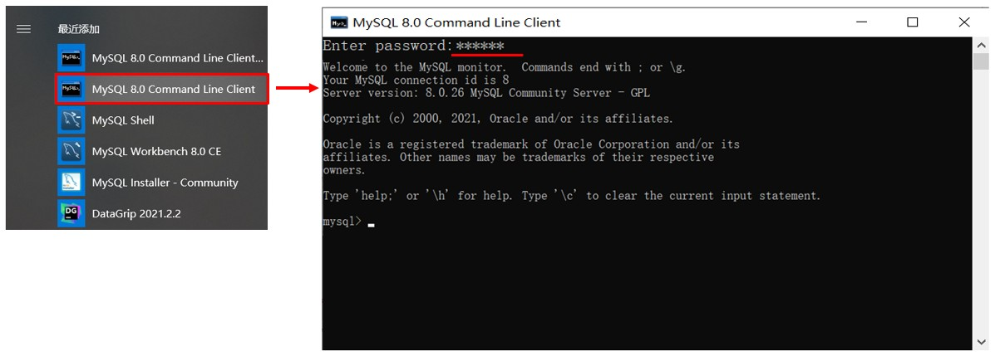

##### 2). 方式二：使用系统自带的命令行工具执行指令

```shell
mysql [-h 127.0.0.1] [-P 3306] -u root -p

参数：
    -h : MySQL服务所在的主机IP
    -P : MySQL服务端口号， 默认3306
    -u : MySQL数据库用户名
    -p : MySQL数据库用户名对应的密码
```


`[]`内为可选参数，如果需要连接远程的MySQL，需要加上这两个参数来指定远程主机IP、端口，如果连接本地的MySQL，则无需指定这两个参数。

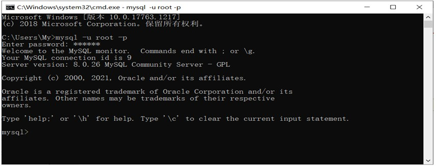

> 注意： 使用这种方式进行连接时，需要安装完毕后配置PATH环境变量。

#### 1.2.6 数据模型

##### 1). 关系型数据库（RDBMS） 概念：建立在关系模型基础上，由多张相互连接的二维表组成的数据库。

而所谓二维表，指的是由行和列组成的表，如下图（就类似于Excel表格数据，有表头、有列、有行， 还可以通过一列关联另外一个表格中的某一列数据）。我们之前提到的MySQL、Oracle、DB2、 SQLServer这些都是属于关系型数据库，里面都是基于二维表存储数据的。简单说，基于二维表存储 数据的数据库就成为关系型数据库，不是基于二维表存储数据的数据库，就是非关系型数据库。


特点：

A. 使用表存储数据，格式统一，便于维护。

B. 使用SQL语言操作，标准统一，使用方便。

##### 2). 数据模型

MySQL是关系型数据库，是基于二维表进行数据存储的，具体的结构图下:

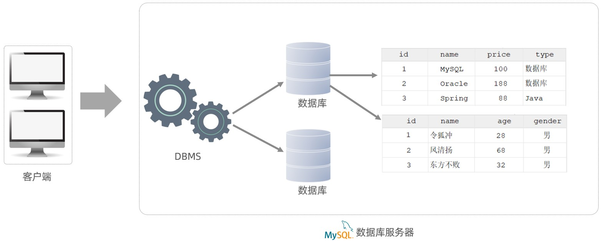

- 我们可以通过MySQL客户端连接数据库管理系统DBMS，然后通过DBMS操作数据库。

- 可以使用SQL语句，通过数据库管理系统操作数据库，以及操作数据库中的表结构及数据。

- 一个数据库服务器中可以创建多个数据库，一个数据库中也可以包含多张表，而一张表中又可以包含多行记录。