## 2 SQL

全称 Structured Query Language，结构化查询语言。操作关系型数据库的编程语言，定义了 一套操作关系型数据库统一**标准** 。

### 2.1 SQL通用语法

在学习具体的SQL语句之前，先来了解一下SQL语言的同于语法。

1). SQL语句可以单行或多行书写，以分号结尾。

2). SQL语句可以使用空格/缩进来增强语句的可读性。

3). MySQL数据库的SQL语句不区分大小写，关键字建议使用大写。

4). 注释：

- 单行注释

  ```mysql
  -- 注释内容
  
  # 注释内容（mysql专有）
  ```

- 多行注释

  ```mysql
  /*
  	多行注释
  */
  ```

### 2.2 SQL分类

SQL语句，根据其功能，主要分为四类：DDL、DML、DQL、DCL。

| **分类** | **全称**                   | **说明**                                               |
| -------- | -------------------------- | ------------------------------------------------------ |
| DDL      | Data Definition Language   | 数据定义语言，用来定义数据库对象(数据库，表，字段)     |
| DML      | Data Manipulation Language | 数据操作语言，用来对数据库表中的数据进行增删改         |
| DQL      | Data Query Language        | 数据查询语言，用来查询数据库中表的记录                 |
| DCL      | Data Control Language      | 数据控制语言，用来创建数据库用户、控制数据库的访问权限 |

### 2.3 DDL

Data Definition Language，数据定义语言，用来定义数据库对象(数据库，表，字段) 。

#### 2.3.1 数据库操作

##### 1). 查询所有数据库

```mysql
SHOW DATABASES;
```

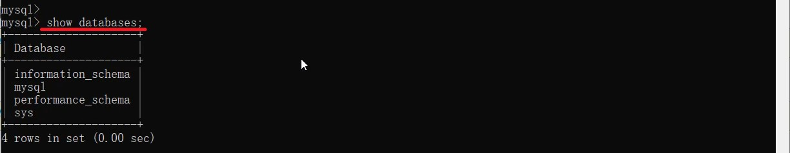

##### 2). 查询当前数据库

```mysql
select database();
```

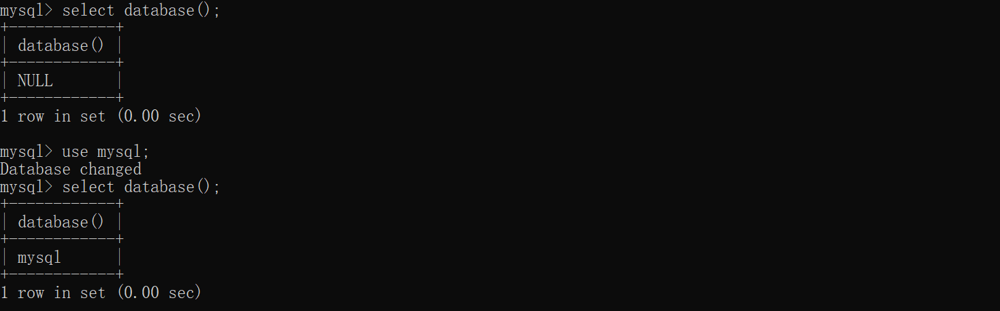

##### 3). 创建数据库

```mysql
create database [ if not exists ] 数据库名 [ default charset 字符集 ] [ collate 排序规则 ] ;
```

案例：

A. 创建一个itcast数据库, 使用数据库默认的字符集。

```mysql
create database itcast;
```

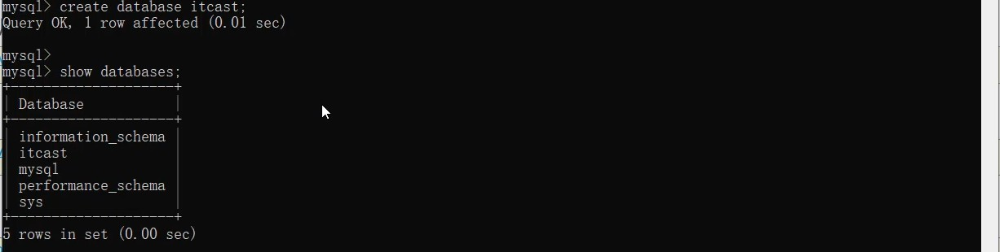

在同一个数据库服务器中，不能创建两个名称相同的数据库，否则将会报错。

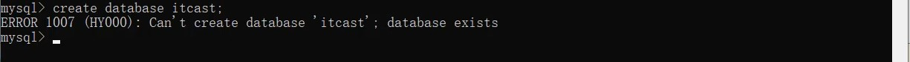

可以通过`if not exists` 参数来解决这个问题，数据库不存在, 则创建该数据库，如果存在，则不创建。

```mysql
create database if not extists itcast;
```


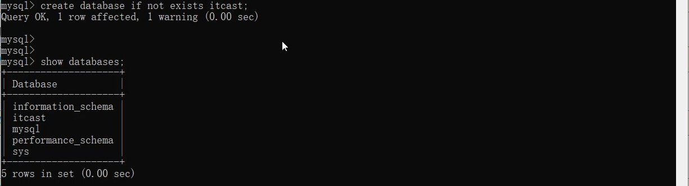

B. 创建一个itheima数据库，并且指定字符集

```mysql
create database itheima default charset utf8mb4;
```

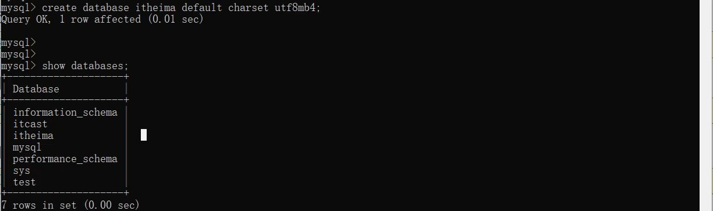

##### 4). 删除数据库

```mysql
drop database [ if exists ] 数据库名 ;
```

如果删除一个不存在的数据库，将会报错。此时，可以加上参数 `if exists` ，如果数据库存在，再执行删除，否则不执行删除。

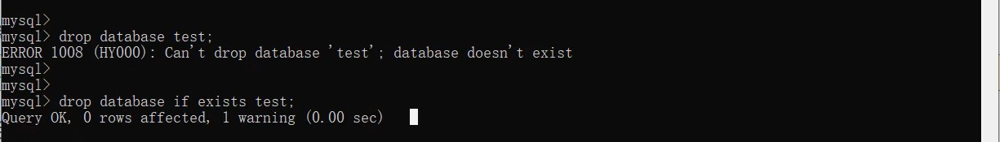

##### 5). 切换数据库

```mysql
use 数据库名 ;
```

我们要操作某一个数据库下的表时，就需要通过该指令，切换到对应的数据库下，否则是不能操作的。

比如，切换到itcast数据，执行如下SQL：

```mysql
use itcast;
```


#### 2.3.2 表操作

##### 2.3.2.1 表操作-查询创建

###### 1). 查询当前数据库所有表

```mysql
show tables;
```


比如,我们可以切换到sys这个系统数据库,并查看系统数据库中的所有表结构。

```mysql
-- 切换到系统表
use sys;

-- 查看当前数据库的所有表
show tables;
```


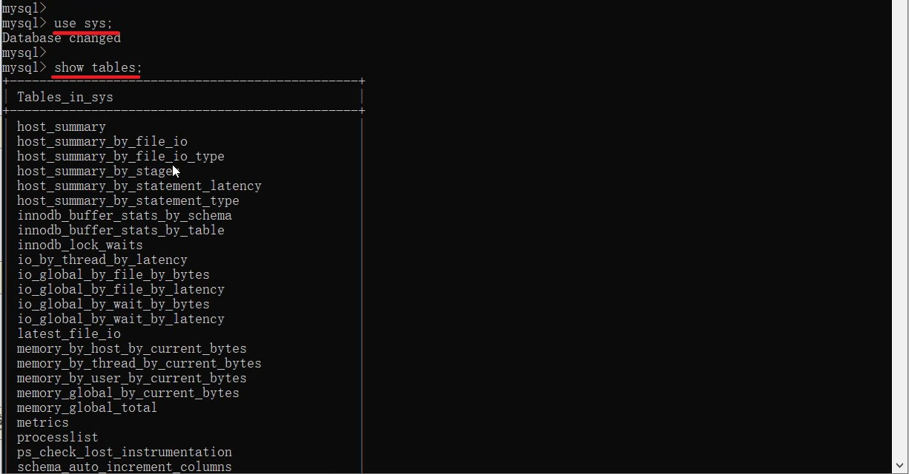

###### 2). 查看指定表结构

```mysql
desc 表名 ;
```

通过这条指令，我们可以查看到指定表的字段，字段的类型、是否可以为NULL，是否存在默认值等信息。

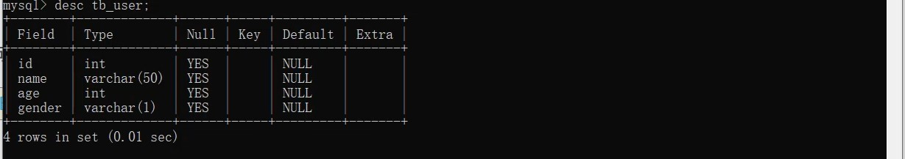

###### 3). 查询指定表的建表语句

```mysql
show create table 表名 ;
```

通过这条指令，主要是用来查看建表语句的，而有部分参数我们在创建表的时候，并未指定也会查询到，因为这部分是数据库的默认值，如：存储引擎、字符集等。

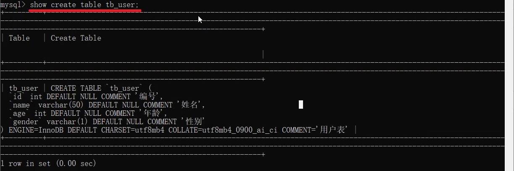

###### 4). 创建表结构

```mysql
create table 表名 (
    
	字段1 字段1类型 [ COMMENT 字段1注释 ],
    
    字段2 字段2类型 [ COMMENT 字段2注释 ],
    
    字段3 字段3类型 [ COMMENT 字段3注释 ],
    
    ...
    
    字段n 字段n类型 [ COMMENT 字段n注释 ]
    
) [ COMMENT 表注释 ] ;
```

> 注意：[ ... ] 内为可选参数，最后一个字段后面没有逗号

比如，我们创建一张表 tb_user ，对应的结构如下，那么建表语句为：

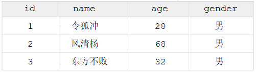

```mysql
CREATE TABLE tb_user (
	id INT COMMENT "用户编号",
	name VARCHAR ( 50 ) COMMENT "用户名称",
	age TINYINT UNSIGNED COMMENT "用户年龄",
gender CHAR ( 1 ) COMMENT "用户性别"
) COMMENT "用户信息表" ;
```

> 注意：在建表之前需要切换到相应的数据库先

##### 2.3.2.2 表操作-数据类型

在上述的建表语句中，我们在指定字段的数据类型时，用到了int ，varchar，那么在MySQL中除了 以上的数据类型，还有哪些常见的数据类型呢？ 接下来,我们就来详细介绍一下MySQL的数据类型。

MySQL中的数据类型有很多，主要分为三类：数值类型、字符串类型、日期时间类型。 

###### 1). 数值类型

| **类型**    | **大小** | **有符号(SIGNED)范围**                                  | **无符号(UNSIGNED)范围**                                     | **描述**                |
| ----------- | -------- | ------------------------------------------------------- | ------------------------------------------------------------ | ----------------------- |
| TINYINT     | 1byte    | (-128，127)                                             | (0，255)                                                     | 小整  数值              |
| SMALLINT    | 2bytes   | (-32768，32767)                                         | (0，65535)                                                   | 大整  数值              |
| MEDIUMINT   | 3bytes   | (-8388608，8388607)                                     | (0，16777215)                                                | 大整  数值              |
| INT/INTEGER | 4bytes   | (-2147483648，  2147483647)                             | (0，4294967295)                                              | 大整  数值              |
| BIGINT      | 8bytes   | (-2^63，2^63-1)                                         | (0，2^64-1)                                                  | 极大  整数 值           |
| FLOAT       | 4bytes   | (-3.402823466  E+38，     3.402823466351 E+38)          | 0 和 (1.175494351 E-  38，3.402823466 E+38)                  | 单精  度浮 点数 值      |
| DOUBLE      | 8bytes   | (-1.7976931348623157  E+308， 1.7976931348623157 E+308) | 0 和     (2.2250738585072014  E-308， 1.7976931348623157 E+308) | 双精  度浮 点数 值      |
| DECIMAL     |          | 依赖于M(精度)和D(标度) 的值                             | 依赖于M(精度)和D(标度)的 值                                  | 小数  值(精  确定 点数) |

```mysql
-- 1. 年龄字段 不会出现负数，而且人的年龄不会太大
age tinyint unsigned


-- 分数 总分100分，最多出现一位小数
score double (4, 1)

```


###### 2). 字符串类型

| **类型**   | **大小**              | **描述**                     |
| ---------- | --------------------- | ---------------------------- |
| CHAR       | 0-255 bytes           | 定长字符串(需要指定长度)     |
| VARCHAR    | 0-65535 bytes         | 变长字符串(需要指定长度)     |
| TINYBLOB   | 0-255 bytes           | 不超过255个字符的二进制数据  |
| TINYTEXT   | 0-255 bytes           | 短文本字符串                 |
| BLOB       | 0-65 535 bytes        | 二进制形式的长文本数据       |
| TEXT       | 0-65 535 bytes        | 长文本数据                   |
| MEDIUMBLOB | 0-16 777 215 bytes    | 二进制形式的中等长度文本数据 |
| MEDIUMTEXT | 0-16 777 215 bytes    | 中等长度文本数据             |
| LONGBLOB   | 0-4 294 967 295 bytes | 二进制形式的极大文本数据     |
| LONGTEXT   | 0-4 294 967 295 bytes | 极大文本数据                 |

char 与 varchar 都可以描述字符串，char是定长字符串，指定长度多长，就占用多少个字符，和字段值的长度无关 。而varchar是变长字符串，指定的长度为最大占用长度 。相对来说，char的性能会更高些。

```mysql
-- 1). 用户名 username ------> 长度不定, 最长不会超过50
username varchar(50)

-- 2). 性别 gender ---------> 存储值, 不是男,就是女
gender char(1)

-- 3). 手机号 phone --------> 固定长度为11
phone char(11)
```


###### 3). 日期时间类型

| **类型**  | **大小** | **范围**                                       | **格式**            | **描述**                 |
| --------- | -------- | ---------------------------------------------- | ------------------- | ------------------------ |
| DATE      | 3        | 1000-01-01 至  9999-12-31                      | YYYY-MM-DD          | 日期值                   |
| TIME      | 3        | -838:59:59 至 838:59:59                        | HH:MM:SS            | 时间值或持续时间         |
| YEAR      | 1        | 1901 至  2155                                  | YYYY                | 年份值                   |
| DATETIME  | 8        | 1000-01-01 00:00:00 至     9999-12-31 23:59:59 | YYYY-MM-DD HH:MM:SS | 混合日期和时间值         |
| TIMESTAMP | 4        | 1970-01-01 00:00:01 至     2038-01-19 03:14:07 | YYYY-MM-DD HH:MM:SS | 混合日期和时间值，时间戳 |

```mysql
-- 1). 生日字段 birthday
birthday date

-- 2). 创建时间 createtime
createtime datetime
```


##### 2.3.2.3 表操作-案例

设计一张员工信息表，要求如下：

> 1. 编号（纯数字）
> 2. 员工工号 (字符串类型，长度不超过10位)
> 3. 员工姓名（字符串类型，长度不超过10位）
> 4. 性别（男/女，存储一个汉字）
> 5. 年龄（正常人年龄，不可能存储负数）
> 6. 身份证号（二代身份证号均为18位，身份证中有X这样的字符）
> 7. 入职时间（取值年月日即可）

对应的建表语句如下:

```mysql
CREATE TABLE emp (
	id INT COMMENT '编号',
	workno VARCHAR ( 10 ) COMMENT '员工工号',
	name VARCHAR ( 10 ) COMMENT '员工姓名',
	gender CHAR ( 1 ) COMMENT '性别（存储男或女）',
	age TINYINT UNSIGNED COMMENT '年龄大于0',
	idcard CHAR ( 18 ) COMMENT '身份证号（二代身份证号均为18位，身份证中有X这样的字符）',
entrydate date COMMENT '入职时间（取值年月日即可）' 
) COMMENT '员工信息表';
```


SQL语句编写完毕之后，就可以在MySQL的命令行中执行SQL，然后也可以通过 desc 指令查询表结构信息：

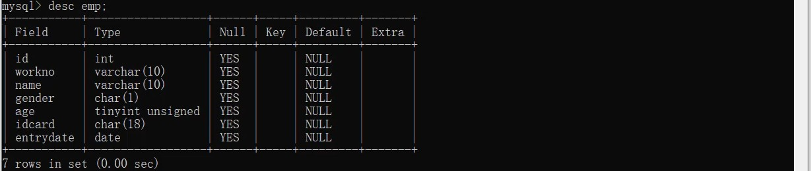

表结构创建好了，里面的name字段是varchar类型，最大长度为10，也就意味着如果超过10将会报 错，如果我们想修改这个字段的类型 或 修改字段的长度该如何操作呢？接下来再来讲解DDL语句中， 如何操作表字段。

##### 2.3.2.4 表操作-修改

###### 1). 添加字段

```mysql
ALTER TABLE  表名  ADD 字段名  类型 (长度)  [ COMMENT 注释 ]  [ 约束 ];
```

案例:

为emp表增加一个新的字段"昵称"为nickname，类型为varchar(20)

```mysql
ALTER TABLE emp ADD nickname varchar(20) COMMENT '昵称';
```


###### 2). 修改数据类型

```mysql
ALTER TABLE 表名 MODIFY 字段名 新数据类型 (长度);
```


###### 3). 修改字段名和字段类型

```mysql
ALTER TABLE 表名 CHANGE 旧字段名 新字段名 类型 (长度) [ COMMENT 注释 ] [ 约束 ];
```


案例:

将emp表的nickname字段修改为username，类型为varchar(30)

```mysql
ALTER TABLE emp CHANGE nickname username varchar(30) COMMENT '用户名';
```


###### 4). 删除字段

```mysql
ALTER TABLE 表名 DROP 字段名;
```

案例:

将emp表的字段username删除

```mysql
ALTER TABLE emp DROP username;
```


###### 5). 修改表名

```mysql
ALTER TABLE 表名 RENAME TO 新表名;
```

案例:

将emp表的表名修改为 employee

```mysql
ALTER TABLE emp RENAME TO employee;
```


##### 2.3.2.5 表操作-删除

###### 1). 删除表

```mysql
DROP TABLE [ IF EXISTS ] 表名;
```

可选项 IF EXISTS 代表，只有表名存在时才会删除该表，表名不存在，则不执行删除操作(如果不

加该参数项，删除一张不存在的表，执行将会报错)。 案例:

如果tb_user表存在，则删除tb_user表

```mysql
DROP TABLE IF EXISTS tb_user;
```


###### 2). 删除指定表, 并重新创建表

```mysql
TRUNCATE TABLE 表名;
```

> 注意：在删除表的时候，表中的全部数据也都会被删除。

### 2.4 图形化界面工具

上述，我们已经讲解了通过DDL语句，如何操作数据库、操作表、操作表中的字段，而通过DDL语句执 行在命令进行操作，主要存在以下两点问题：

1).会影响开发效率 ;

2). 使用起来，并不直观，并不方便 ； 所以呢，我们在日常的开发中，会借助于MySQL的图形化界面，来简化开发，提高开发效率。而目前

mysql主流的图形化界面工具，有以下几种：


而本次课程中，选择最后一种DataGrip，这种图形化界面工具，功能更加强大，界面提示更加友好， 是我们使用MySQL的不二之选。接下来，我们来介绍一下DataGrip该如何安装、使用。

#### 2.4.1 安装

##### 1). 找到资料中准备好的安装包，双击开始安装


##### 2). 点击next，一步一步的完成安装

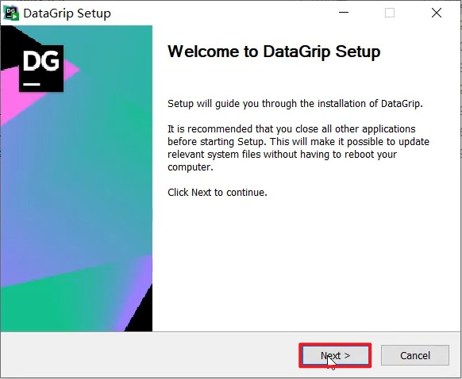

##### 3). 选择DataGrip的安装目录，然后选择下一步

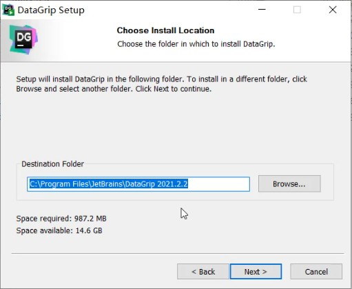


##### 4). 下一步，执行安装


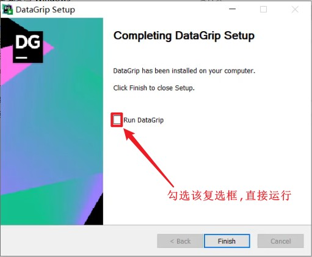

#### 2.4.2 使用

##### 1). 添加数据源

参考图示, 一步步操作即可

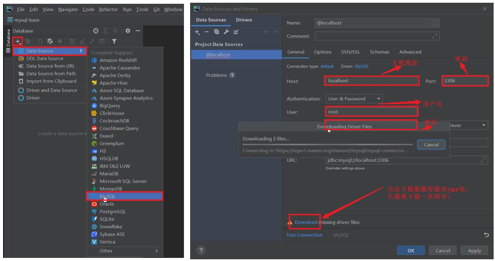

配置以及驱动jar包下载完毕之后，就可以点击 "Test Connection" 就可以测试，是否可以连接MySQL，如果出现 "Successed"，就表名连接成功了 。


##### 2). 展示所有数据库

连接上了MySQL服务之后，并未展示出所有的数据库，此时，我们需要设置，展示所有的数据库，具体操作如下：

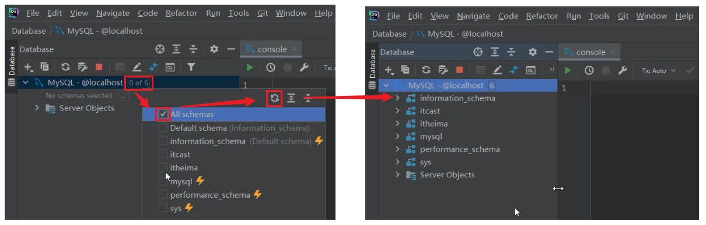

##### 3). 创建数据库

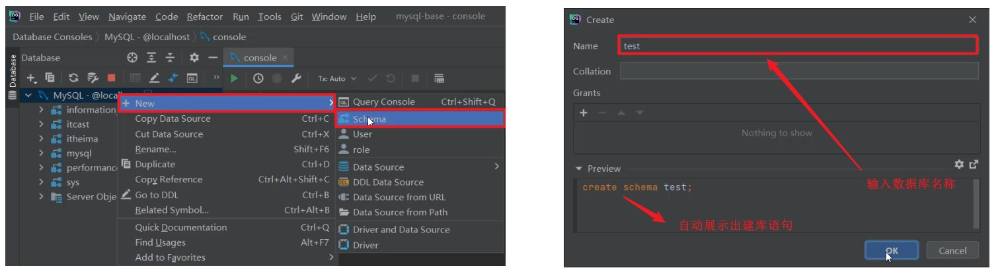

> 注意：
>
> 以下两种方式都可以创建数据库：
>
> A. create database db01;
>
> B. create schema db01;


##### 4). 创建表

在指定的数据库上面右键，选择`new --> Table`

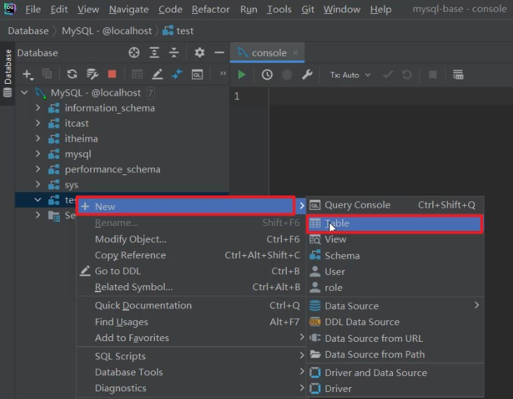

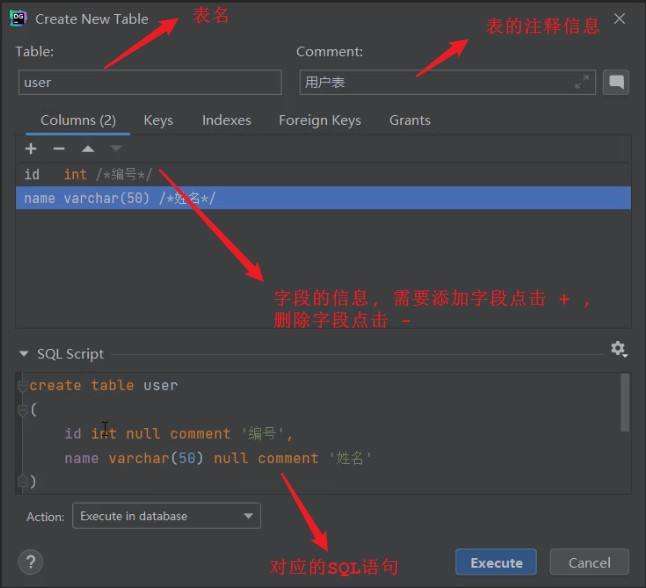

##### 5). 修改表结构

在需要修改的表上，右键选择 "Modify Table..."

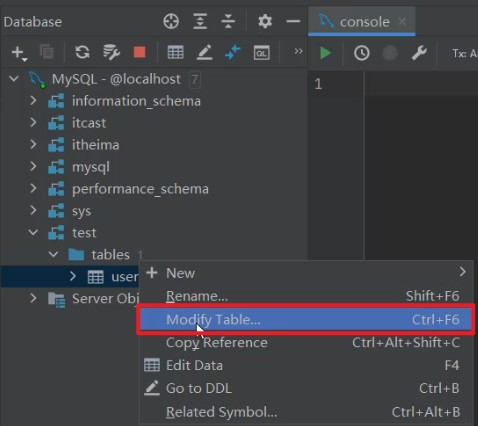

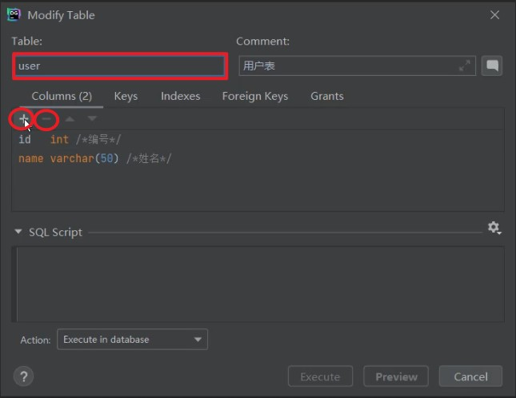

- 如果想增加字段，直接点击+号，录入字段信息，然后点击Execute即可。
- 如果想删除字段，直接点击-号，就可以删除字段，然后点击Execute即可。
- 如果想修改字段，双击对应的字段，修改字段信息，然后点击Execute即可。
- 如果要修改表名，或表的注释，直接在输入框修改，然后点击Execute即可。

##### 6). 在DataGrip中执行SQL语句

在指定的数据库上，右键，选择 `New --> Query Console`

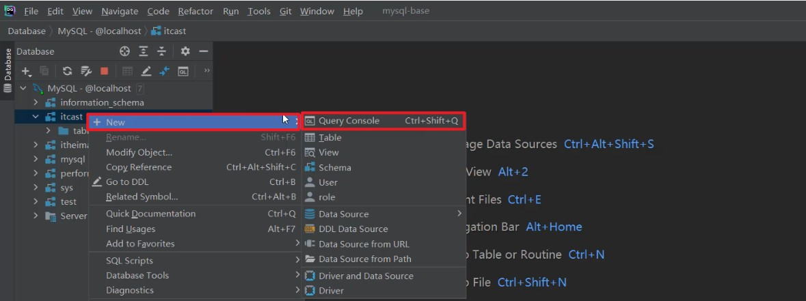

然后就可以在打开的Query Console控制台，并在控制台中编写SQL，执行SQL。


### 2.5 DML

DML英文全称是Data Manipulation Language(数据操作语言)，用来对数据库中表的数据记录进 行增、删、改操作。

- 添加数据（INSERT） 
- 修改数据（UPDATE）
- 删除数据（DELETE）

#### 2.5.1 添加数据

##### 1). 给指定字段添加数据

```sql
INSERT INTO 表名 (字段名1, 字段名2, ...) VALUES (值1, 值2, ...);
```


案例: 给employee表所有的字段添加数据 ；

```sql
INSERT INTO employee ( id, workno, name, gender, age, idcard, entrydate )
VALUES
	( 1, '1', 'Itcast', '男', 10, '123456789012345678', '2000-01-01' );
```


插入数据完成之后，我们有两种方式，查询数据库的数据：

A. 方式一 在左侧的表名上双击，就可以查看这张表的数据。

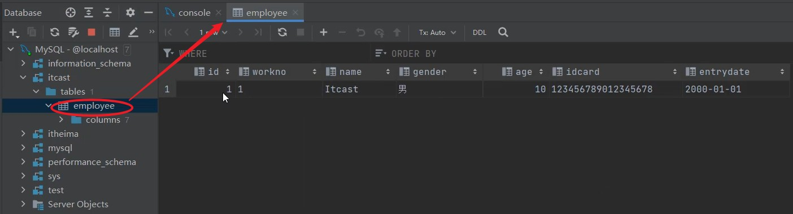

B. 方式二

可以直接一条查询数据的SQL语句, 语句如下:

```sql
SELECT * FROM employee;
```


案例: 给employee表所有的字段添加数据

执行如下SQL，添加的年龄字段值为-1。

```sql
INSERT INTO employee ( id, workno, name, gender, age, idcard, entrydate )
VALUES
	( 1, '1', 'Itcast', '男', -1, '123456789012345678', '2000-01-01' );
```


执行上述的SQL语句时，报错了，具体的错误信息如下：


因为 employee 表的age字段类型为 tinyint，而且还是无符号的 unsigned ，所以取值只能在0-255 之间。

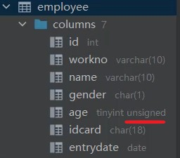

##### 2). 给全部字段添加数据

```sql
INSERT INTO 表名 VALUES (值1, 值2, ...);
```


案例：插入数据到employee表，具体的SQL如下：

```sql
INSERT INTO employee
VALUES
	( 2, '2', '令狐冲', '男', 25, '123456789012345678', '2011-11-11' );
```


##### 3). 批量添加数据

```sql
INSERT INTO 表名 (字段名1, 字段名2, ...) VALUES (值1, 值2, ...), (值1, 值2, ...), (值1, 值2, ...) ;
```

```sql
INSERT INTO 表名 VALUES (值1, 值2, ...), (值1, 值2, ...), (值1, 值2, ...) ;
```

案例：批量插入数据到employee表，具体的SQL如下：

```sql
insert into employee values(3,'3','韦一笑','男',38,'123456789012345670','2005-01-01'),(4,'4','赵敏','女',18,'123456789012345670','2005-01-01');
```

> 注意事项
>
> - 插入数据时，指定的字段顺序需要与值的顺序是一一对应的。
> - 字符串和日期型数据应该包含在引号中。
> - 插入的数据大小，应该在字段的规定范围内。


#### 2.5.2 修改数据

修改数据的具体语法为:

```sql
UPDATE 表名 SET 字段名1 = 值1 , 字段名2 = 值2 , .... [ WHERE 条件 ] ;
```


案例:

A. 修改id为1的数据，将name修改为itheima

```sql
UPDATE employee SET `name` = 'itheima' WHERE id = 1;
```


B. 修改id为1的数据, 将name修改为小昭, gender修改为 女

```sql
UPDATE employee SET `name` = '小昭', `gender` = '女' WHERE `id` = 1;
```


C. 将所有的员工入职日期修改为 2008-01-01

```sql
UPDATE employee SET `entrydate` = '2008-01-01';
```

> 注意事项:
> 修改语句的条件可以有，也可以没有，如果没有条件，则会修改整张表的所有数据。

#### 2.5.3 删除数据

删除数据的具体语法为：

```sql
DELETE FROM 表名 [ WHERE 条件 ] ;
```


案例:

A. 删除gender为女的员工

```sql
DELETE FROM `employee` WHERE `gender` = '女';
```


B. 删除所有员工

```sql
DELETE FROM `employee`;
```

> 注意事项:
>
> - DELETE 语句的条件可以有，也可以没有，如果没有条件，则会删除整张表的所有数据。
>
> - DELETE 语句不能删除某一个字段的值(可以使用UPDATE，将该字段值置为NULL即可)。
>
> - 当进行删除全部数据操作时，datagrip会提示我们，询问是否确认删除，我们直接点击Execute即可。
>
>   

### 2.6 DQL

DQL英文全称是Data Query Language(数据查询语言)，数据查询语言，用来查询数据库中表的记录。

查询关键字: SELECT

在一个正常的业务系统中，查询操作的频次是要远高于增删改的，当我们去访问企业官网、电商网站， 在这些网站中我们所看到的数据，实际都是需要从数据库中查询并展示的。而且在查询的过程中，可能还会涉及到条件、排序、分页等操作。


那么，本小节我们主要学习的就是如何进行数据的查询操作。 我们先来完成如下数据准备工作:

```sql
-- 如果employee表存在的话，则将其删除
DROP TABLE IF EXISTS employee;
DROP TABLE IF EXISTS emp;

-- 创建emp表
CREATE TABLE emp (
	id INT COMMENT '编号',
	workno VARCHAR ( 10 ) COMMENT '工号',
	NAME VARCHAR ( 10 ) COMMENT '姓名',
	gender CHAR ( 1 ) COMMENT '性别',
	age TINYINT UNSIGNED COMMENT '年龄',
	idcard CHAR ( 18 ) COMMENT '身份证号',
	workaddress VARCHAR ( 50 ) COMMENT '工作地址',
entrydate date COMMENT '入职时间' 
) COMMENT '员工表';

-- 插入表数据
INSERT INTO `emp` ( `id`, `workno`, `name`, `gender`, `age`, `idcard`, `workaddress`, `entrydate` ) VALUES (1, '00001', '柳岩666', '女', 20, '123456789012345678', '北京', '2000-01-01');
INSERT INTO `emp` ( `id`, `workno`, `name`, `gender`, `age`, `idcard`, `workaddress`, `entrydate` ) VALUES (2, '00002', '张无忌', '男', 18, '123456789012345670', '北京', '2005-09-01');
INSERT INTO `emp` ( `id`, `workno`, `name`, `gender`, `age`, `idcard`, `workaddress`, `entrydate` ) VALUES (3, '00003', '韦一笑', '男', 38, '123456789712345670', '上海', '2005-08-01');
INSERT INTO `emp` ( `id`, `workno`, `name`, `gender`, `age`, `idcard`, `workaddress`, `entrydate` ) VALUES (4, '00004', '赵敏', '女', 18, '123456757123845670', '北京', '2009-12-01');
INSERT INTO `emp` ( `id`, `workno`, `name`, `gender`, `age`, `idcard`, `workaddress`, `entrydate` ) VALUES (5, '00005', '小昭', '女', 16, '123456769012345678', '上海', '2007-07-01');
INSERT INTO `emp` ( `id`, `workno`, `name`, `gender`, `age`, `idcard`, `workaddress`, `entrydate` ) VALUES (6, '00006', '杨逍', '男', 28, '12345678931234567X', '北京', '2006-01-01');
INSERT INTO `emp` ( `id`, `workno`, `name`, `gender`, `age`, `idcard`, `workaddress`, `entrydate` ) VALUES (7, '00007', '范瑶', '男', 40, '123456789212345670', '北京', '2005-05-01');
INSERT INTO `emp` ( `id`, `workno`, `name`, `gender`, `age`, `idcard`, `workaddress`, `entrydate` ) VALUES (8, '00008', '黛绮丝', '女', 38, '123456157123645670', '天津', '2015-05-01');
INSERT INTO `emp` ( `id`, `workno`, `name`, `gender`, `age`, `idcard`, `workaddress`, `entrydate` ) VALUES (9, '00009', '范凉凉', '女', 45, '123156789012345678', '北京', '2010-04-01');
INSERT INTO `emp` ( `id`, `workno`, `name`, `gender`, `age`, `idcard`, `workaddress`, `entrydate` ) VALUES (10, '00010', '陈友谅', '男', 53, '123456789012345670', '上海', '2011-01-01');
INSERT INTO `emp` ( `id`, `workno`, `name`, `gender`, `age`, `idcard`, `workaddress`, `entrydate` ) VALUES (11, '00011', '张士诚', '男', 55, '123567897123465670', '江苏', '2015-05-01');
INSERT INTO `emp` ( `id`, `workno`, `name`, `gender`, `age`, `idcard`, `workaddress`, `entrydate` ) VALUES (12, '00012', '常遇春', '男', 32, '123446757152345670', '北京', '2004-02-01');
INSERT INTO `emp` ( `id`, `workno`, `name`, `gender`, `age`, `idcard`, `workaddress`, `entrydate` ) VALUES (13, '00013', '张三丰', '男', 88, '123656789012345678', '江苏', '2020-11-01');
INSERT INTO `emp` ( `id`, `workno`, `name`, `gender`, `age`, `idcard`, `workaddress`, `entrydate` ) VALUES (14, '00014', '灭绝', '女', 65, '123456719012345670', '西安', '2019-05-01');
INSERT INTO `emp` ( `id`, `workno`, `name`, `gender`, `age`, `idcard`, `workaddress`, `entrydate` ) VALUES (15, '00015', '胡青牛', '男', 70, '12345674971234567X', '西安', '2018-04-01');
INSERT INTO `emp` ( `id`, `workno`, `name`, `gender`, `age`, `idcard`, `workaddress`, `entrydate` ) VALUES (16, '00016', '周芷若', '女', 18, NULL, '北京', '2012-06-01');
```


准备完毕后，我们就可以看到emp表中准备的16条数据。接下来，我们再来完成DQL语法的学习。

#### 2.6.1 基本语法

DQL 查询语句，语法结构如下：

```sql
SELECT
	字段列表
FROM
	表名列表
WHERE
	条件列表
GROUP BY
	分组字段列表
HAVING
	分组后条件列表
ORDER BY
	排序字段列表
LIMIT
	分页参数
```

我们在讲解这部分内容的时候，会将上面的完整语法进行拆分，分为以下几个部分：

- 基本查询（不带任何条件）
- 条件查询（WHERE）
- 聚合函数（count、max、min、avg、sum）
- 分组查询（group by）
- 排序查询（order by）
- 分页查询（limit）

#### 2.6.2 基础查询 

在基本查询的DQL语句中，不带任何的查询条件，查询的语法如下： 

##### 1). 查询多个字段

```sql
SELECT 字段1, 字段2, 字段3 ... FROM 表名;
```

```sql
SELECT * FROM 表名;
```

> 注意 : `*` 号代表查询所有字段，在实际开发中尽量少用（不直观、影响效率）。

##### 2). 字段设置别名

- 使用`AS`修饰

```sql
SELECT 字段1 [ AS 别名1 ], 字段2 [ AS 别名2 ] ... FROM 表名;
```

- 省略`AS`

```sql
SELECT 字段1 [ 别名1 ], 字段2 [ 别名2 ] ... FROM 表名;
```

##### 3). 去除重复记录

```sql
SELECT DISTINCT 字段列表 FROM 表名;
```


案例：

A. 查询指定字段 name, workno, age并返回

```sql
SELECT `name`, `workno`, `age` FROM `emp`;
```


B. 查询返回所有字段

```sql
SELECT `id`, `workno`, `name`, `gender`, `age`, `idcard`, `workaddress`, `entrydate` FROM `emp`;
```

```sql
SELECT * FROM `emp`;
```


C. 查询所有员工的工作地址,起别名

```sql
SELECT `workaddress` AS '工作地址' FROM `emp`;
```

```sql
-- 省略AS
SELECT `workaddress` '工作地址' FROM `emp`;
```


D. 查询公司员工的上班地址有哪些(不要重复)

```sql
SELECT DISTINCT `workaddress` '工作地址' FROM `emp`;
```


#### 2.6.3 条件查询

##### 2.6.3.1 语法

```sql
SELECT 字段列表  FROM 表名 WHERE 条件列表 ;
```


##### 2.6.3.2 条件

###### 1、常用的比较运算符如下:

| **比较运算符**      | **功能**                                  |
| ------------------- | ----------------------------------------- |
| >                   | 大于                                      |
| >=                  | 大于等于                                  |
| <                   | 小于                                      |
| <=                  | 小于等于                                  |
| =                   | 等于                                      |
| <> 或  !=           | 不等于                                    |
| BETWEEN ... AND ... | 在某个范围之内(含最小、最大值)            |
| IN(...)             | 在in之后的列表中的值，多选一              |
| LIKE 占位符         | 模糊匹配(_匹配单个字符,  %匹配任意个字符) |
| IS NULL             | 是NULL                                    |

###### 2、常用的逻辑运算符如下:

| **逻辑运算符** | **功能**                    |
| -------------- | --------------------------- |
| AND 或  &&     | 并且 (多个条件同时成立)     |
| OR 或 \|\|     | 或者 (多个条件任意一个成立) |
| NOT 或  !      | 非, 不是                    |

###### 3、案例:

A. 查询年龄等于 88 的员工

```sql
select * from emp where age = 88;
```


B. 查询年龄小于 20 的员工信息

```sql
select * from emp where age < 20;
```


C. 查询年龄小于等于 20 的员工信息

```sql
select * from emp where age <= 20;
```


D. 查询没有身份证号的员工信息

```sql
select * from emp where idcard is null;
```


E. 查询有身份证号的员工信息

```sql
select * from emp where idcard is not null;
```


F. 查询年龄不等于 88 的员工信息

```sql
select * from emp where age != 88;
select * from emp where age <> 88;
```


G. 查询年龄在15岁(包含) 到 20岁(包含)之间的员工信息

```sql
select * from emp where age >= 15 && age <= 20;
select * from emp where age >= 15 and age <= 20;
select * from emp where age between 15 and 20;
```


H. 查询性别为 女 且年龄小于 25岁的员工信息

```sql
SELECT * FROM emp WHERE gender = '女' and age  < 25;
```


I. 查询年龄等于18 或 20 或 40 的员工信息

```sql
select * from emp where age = 18 or age = 20 or age = 40;
SELECT * FROM emp where age in (18,20,40);
```


J. 查询姓名为两个字的员工信息 `__%`

```sql
SELECT * FROM emp WHERE `NAME` LIKE '__';
```


K. 查询身份证号最后一位是X的员工信息

```sql
SELECT * FROM emp WHERE idcard LIKE '%X';
select * from emp where idcard like '_________________X';
```


#### 2.6.4 聚合函数

1). 介绍 将一列数据作为一个整体，进行纵向计算 。 

2). 常见的聚合函数

| **函数** | **功能** |
| -------- | -------- |
| count    | 统计数量 |
| max      | 最大值   |
| min      | 最小值   |
| avg      | 平均值   |
| sum      | 求和     |

3). 语法

```sql
SELECT 聚合函数(字段列表) FROM 表名;
```

> 注意：NULL值是不参与所有聚合函数运算的。

案例：

A. 统计该企业员工数量

```sql
select count(*) from emp; -- 统计的是总记录数
select count(idcard) from emp; -- 统计的是idcard字段不为null的记录数
```


对于count聚合函数，统计符合条件的总记录数，还可以通过 count(数字/字符串)的形式进行统计查询，比如：

```sql
select count(1) from emp;
```

> 对于count(*) 、count(字段)、 count(1) 的具体原理，我们在进阶篇中SQL优化部分会详细讲解，此处大家只需要知道如何使用即可。

B. 统计该企业员工的平均年龄

```sql
select avg(age) from emp;
```


C. 统计该企业员工的最大年龄

```sql
select max(age) from emp;
```


D. 统计该企业员工的最小年龄

```sql
select min(age) from emp;
```


E. 统计西安地区员工的年龄之和

```sql
select sum(age) from emp where workaddress = '西安';
```


#### 2.6.5 分组查询

##### 1). 语法

```sql
SELECT 字段列表 FROM  表名 [ WHERE  条件 ] GROUP BY 分组字段名 [ HAVING 分组后过滤条件 ];
```


##### 2). where与having区别

- 执行时机不同：where是分组之前进行过滤，不满足where条件，不参与分组；而having是分组 之后对结果进行过滤。

- 判断条件不同：where不能对聚合函数进行判断，而having可以。

> 注意事项:
>
> - 分组之后，查询的字段一般为聚合函数和分组字段，查询其他字段无任何意义。
> - 执行顺序: where > 聚合函数 > having 。
> - 支持多字段分组, 具体语法为 : group by columnA,columnB

##### 3). 案例:

A. 根据性别分组 , 统计男性员工 和 女性员工的数量

```sql
select gender, count(*) from emp group by gender ;
```


B. 根据性别分组 , 统计男性员工 和 女性员工的平均年龄

```sql
select gender, avg(age) from emp group by gender ;
```


C. 查询年龄小于45的员工 , 并根据工作地址分组 , 获取员工数量大于等于3的工作地址

```sql
select workaddress, count(*) address_count from emp where age < 45 group by workaddress having address_count >= 3;
```


D. 统计各个工作地址上班的男性及女性员工的数量

```sql
select workaddress, gender, count(*) '数量' from emp group by gender , workaddress;
```


#### 2.6.6 排序查询

排序在日常开发中是非常常见的一个操作，有升序排序，也有降序排序。

> 

##### 1). 语法

```sql
select 字段列表 from 表名 order by 字段1 排序方式1, 字段2 排序方式2;
```


##### 2). 排序方式

- ASC : 升序(默认值)
- DESC: 降序

> 注意事项：
>
> - 如果是升序, 可以不指定排序方式ASC ;
> - 如果是多字段排序，当第一个字段值相同时，才会根据第二个字段进行排序 ;

##### 3). 案例:

A. 根据年龄对公司的员工进行升序排序

```sql
select * from emp order by age asc;
select * from emp order by age;
```


B. 根据入职时间, 对员工进行降序排序

```sql
select * from emp order by entrydate desc;
```


C. 根据年龄对公司的员工进行升序排序 , 年龄相同 , 再按照入职时间进行降序排序

```sql
select * from emp order by age asc , entrydate desc;
```


#### 2.6.7 分页查询

分页操作在业务系统开发时，也是非常常见的一个功能，我们在网站中看到的各种各样的分页条，后台 都需要借助于数据库的分页操作。

> 

##### 1). 语法

```sql
SELECT 字段列表 FROM 表名 LIMIT 起始索引, 查询记录数 ;
```

> 注意事项:
>
> - 起始索引从0开始，起始索引 = （查询页码 - 1）* 每页显示记录数。
> - 分页查询是数据库的方言，不同的数据库有不同的实现，MySQL中是LIMIT。
> - 如果查询的是第一页数据，起始索引可以省略，直接简写为 limit 10。

##### 2). 案例:

A. 查询第1页员工数据, 每页展示10条记录

```sql
select * from emp limit 0,10;
select * from emp limit 10;
```


B. 查询第2页员工数据, 每页展示10条记录 `-------->`  `(页码-1)*页展示记录数`

```sql
select * from emp limit 10,10;
```


#### 2.6.8 案例

1). 查询年龄为20,21,22,23岁的员工信息。

```sql
select * from emp where gender = '女' and age in(20,21,22,23);
```


2). 查询性别为 男 ，并且年龄在 20-40 岁(含)以内的姓名为三个字的员工。

```sql
select * from emp where gender = '男' and ( age between 20 and 40 ) and name like '___';
```


3). 统计员工表中, 年龄小于60岁的 , 男性员工和女性员工的人数。

```sql
select gender, count(*) from emp where age < 60 group by gender;
```


4). 查询所有年龄小于等于35岁员工的姓名和年龄，并对查询结果按年龄升序排序，如果年龄相同按入职时间降序排序。

```sql
select name , age from emp where age <= 35 order by age asc , entrydate desc;
```


5). 查询性别为男，且年龄在20-40 岁(含)以内的前5个员工信息，对查询的结果按年龄升序排序，年龄相同按入职时间升序排序。

```sql
select * from emp where gender = '男' and age between 20 and 40 order by age asc, entrydate asc limit 5 ;
```


#### 2.6.9 执行顺序

在讲解DQL语句的具体语法之前，我们已经讲解了DQL语句的完整语法，及编写顺序，接下来，我们要来说明的是DQL语句在执行时的执行顺序，也就是先执行那一部分，后执行那一部分。

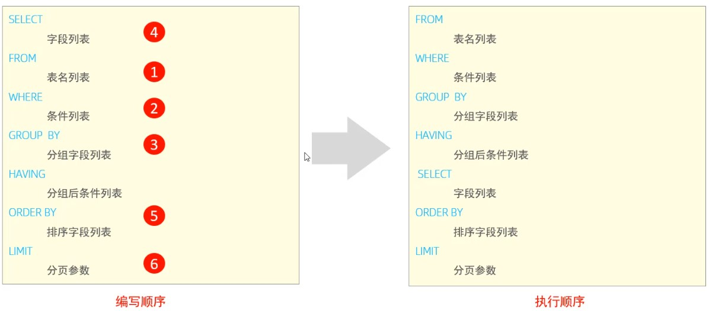

##### 2.6.9.1 验证： 

查询年龄大于15的员工姓名、年龄，并根据年龄进行升序排序。

```sql
select name , age from emp where age > 15 order by age asc;
```


在查询时，我们给emp表起一个别名 e，然后在select 及 where中使用该别名。

```sql
select e.name , e.age from emp e where e.age > 15 order by age asc;
```


执行上述SQL语句后，我们看到依然可以正常的查询到结果，此时就说明： from 先执行, 然后where 和 select 执行。那 where 和 select 到底哪个先执行呢?

此时，此时我们可以给select后面的字段起别名，然后在 where 中使用这个别名，然后看看是否可 以执行成功。

```sql
select e.name ename , e.age eage from emp e where eage > 15 order by age asc;
```


执行上述SQL报错了:


由此我们可以得出结论: from 先执行，然后执行 where ， 再执行select 。

接下来，我们再执行如下SQL语句，查看执行效果：

```sql
select e.name ename , e.age eage from emp e where e.age > 15 order by eage asc;
```


结果执行成功。 那么也就验证了: order by 是在select 语句之后执行的。

综上所述，我们可以看到DQL语句的执行顺序为： from ... where ... group by ... having ... select ... order by ... limit ...

### 2.7 DCL

DCL英文全称是**Data Control Language**(数据控制语言)，用来管理数据库用户、控制数据库的访问权限。

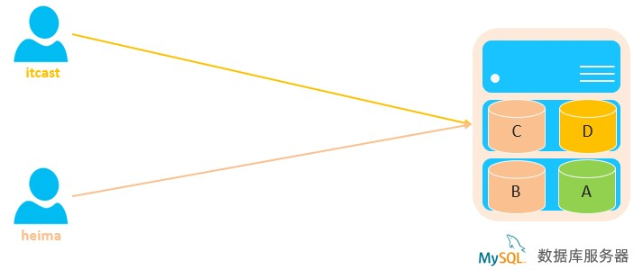

#### 2.7.1 管理用户

##### 1). 查询用户

```sql
select * from mysql.user;
```


查询的结果如下:

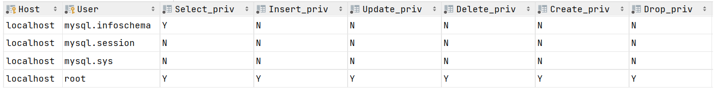

其中 Host代表当前用户访问的主机, 如果为localhost, 仅代表只能够在当前本机访问，是不可以 远程访问的。 User代表的是访问该数据库的用户名。在MySQL中需要通过Host和User来唯一标识一 个用户。

##### 2). 创建用户

```sql
CREATE USER '用户名'@'主机名' IDENTIFIED BY '密码';
```


##### 3). 修改用户密码

```sql
ALTER USER '用户名'@'主机名' IDENTIFIED WITH mysql_native_password BY '新密码' ;
```


##### 4). 删除用户

```sql
DROP USER '用户名'@'主机名' ;
```

> 注意事项：
>
> - 在MySQL中需要通过用户名@主机名的方式，来标识唯一一个用户
> - 主机名可以使用 % 通配。
> - 这类SQL开发人员操作的比较少，主要是DBA(Database Administrator 数据库管理员) 使用。

##### 5). 案例：

A. 创建用户itcast, 只能够在当前主机localhost访问, 密码123456;

```sql
create user 'itcast'@'localhost' identified by '123456';
```


B. 创建用户heima, 可以在任意主机访问该数据库, 密码123456;

```sql
create user 'heima'@'%' identified by '123456';
```


C. 修改用户heima的访问密码为1234;

```sql
alter user 'heima'@'%' identified with mysql_native_password by '1234';
```


D. 删除 itcast@localhost 用户

```sql
drop user 'itcast'@'localhost';
```


#### 2.7.2 权限控制

MySQL中定义了很多种权限，但是常用的就以下几种：

| **权限**            | **说明**           |
| ------------------- | ------------------ |
| ALL, ALL PRIVILEGES | 所有权限           |
| SELECT              | 查询数据           |
| INSERT              | 插入数据           |
| UPDATE              | 修改数据           |
| DELETE              | 删除数据           |
| ALTER               | 修改表             |
| DROP                | 删除数据库/表/视图 |
| CREATE              | 创建数据库/表      |

上述只是简单罗列了常见的几种权限描述，其他权限描述及含义，可以直接参考 **[官方文档](https://dev.mysql.com/doc/refman/8.0/en/privileges-provided.html)** 。

##### 1). 查询权限

```sql
SHOW GRANTS FOR '用户名'@'主机名' ;
```


##### 2). 授予权限

```sql
GRANT 权限列表 ON 数据库名.表名 TO '用户名'@'主机名';
```


##### 3). 撤销权限

```sql
REVOKE 权限列表 ON 数据库名.表名 FROM '用户名'@'主机名';
```

> 注意事项：
>
> - 多个权限之间，使用逗号分隔
> - 授权时， 数据库名和表名可以使用 * 进行通配，代表所有。

##### 4). 案例:

A. 查询 'heima'@'%' 用户的权限

```sql
show grants for 'heima'@'%';
```


B. 授予 'heima'@'%' 用户itcast数据库所有表的所有操作权限

```sql
grant all on itcast.* to 'heima'@'%';
```


C. 撤销 'heima'@'%' 用户的itcast数据库的所有权限

```sql
revoke all on itcast.* from 'heima'@'%';
```

