## 3. 函数

函数是指一段可以直接被另一段程序调用的程序或代码。 也就意味着，这一段程序或代码在MySQL中已经给我们提供了，我们要做的就是在合适的业务场景调用对应的函数完成对应的业务需求即可。 那么，函数到底在哪儿使用呢？

我们先来看两个场景：

​				 									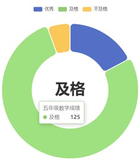

1). 在企业的OA或其他的人力系统中，经常会提供的有这样一个功能，每一个员工登录上来之后都能 够看到当前员工入职的天数。 而在数据库中，存储的都是入职日期，如 2000-11-12，那如果快速计算出天数呢？

2). 在做报表这类的业务需求中,我们要展示出学员的分数等级分布。而在数据库中，存储的是学生的分数值，如98/75，如何快速判定分数的等级呢？

其实，上述的这一类的需求呢，我们通过MySQL中的函数都可以很方便的实现 。

MySQL中的函数主要分为以下四类： 字符串函数、数值函数、日期函数、流程函数。

### 3.1 字符串函数

MySQL中内置了很多字符串函数，常用的几个如下：

| **函数**                 | **功能**                                                  |
| ------------------------ | --------------------------------------------------------- |
| CONCAT(S1,S2,...Sn)      | 字符串拼接，将S1，S2，...  Sn拼接成一个字符串             |
| LOWER(str)               | 将字符串str全部转为小写                                   |
| UPPER(str)               | 将字符串str全部转为大写                                   |
| LPAD(str,n,pad)          | 左填充，用字符串pad对str的左边进行填充，达到n个字符串长度 |
| RPAD(str,n,pad)          | 右填充，用字符串pad对str的右边进行填充，达到n个字符串长度 |
| TRIM(str)                | 去掉字符串头部和尾部的空格                                |
| SUBSTRING(str,start,len) | 返回从字符串str从start位置起的len个长度的字符串           |

演示如下：

1、concat : 字符串拼接

```sql
select concat('Hello' , ' MySQL');
```


2、lower : 全部转小写

```sql
select lower('Hello');
```


3、upper : 全部转大写

```sql
select upper('Hello');
```


4、lpad : 左填充

```sql
select lpad('01', 5, '-');
```


5、rpad : 右填充

```sql
select rpad('01', 5, '-');
```


6、trim : 去除空格

```sql
select trim(' Hello MySQL ');
```


7、substring : 截取子字符串

```sql
-- 索引是从1开始的，并不是0
select substring('Hello MySQL',1,5);
```

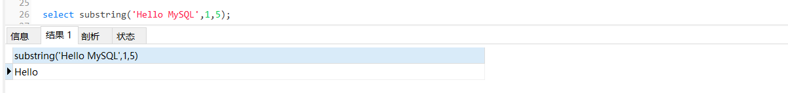

#### 3.1.1 案例:

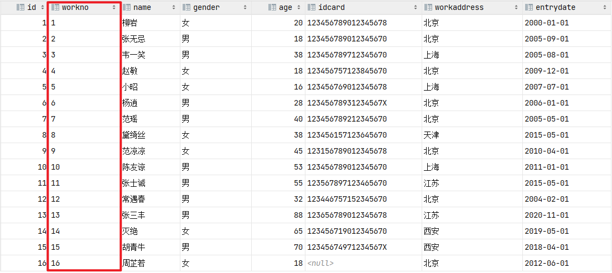

由于业务需求变更，企业员工的工号，统一为5位数，目前不足5位数的全部在前面补0。比如： 1号员 工的工号应该为00001。

```sql
update emp set workno = lpad(workno, 5, '0');
```

> ps:
>
> 去除字符前补位0的sql
>
> ```sql
> UPDATE `emp` SET `workno` = trim(LEADING '0' FROM `workno`);
> ```
>
> 

处理完毕后, 具体的数据为:

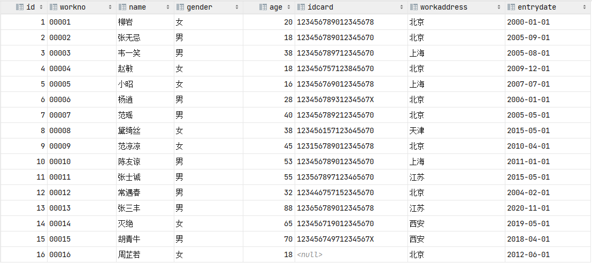

### 3.2 数值函数

常见的数值函数如下：

| **函数**   | **功能**                           |
| ---------- | ---------------------------------- |
| CEIL(x)    | 向上取整                           |
| FLOOR(x)   | 向下取整                           |
| MOD(x,y)   | 返回x/y的模                        |
| RAND()     | 返回0~1内的随机数                  |
| ROUND(x,y) | 求参数x的四舍五入的值，保留y位小数 |

演示如下：

#### 1、ceil：向上取整

```sql
SELECT CEIL(1.1);
```

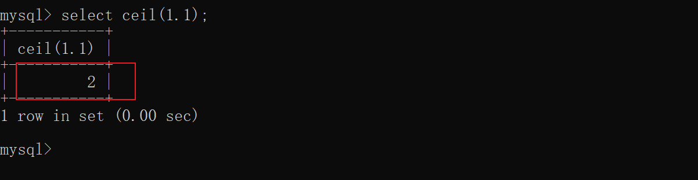

#### 2、floor：向下取整

```sql
select floor(1.9);
```

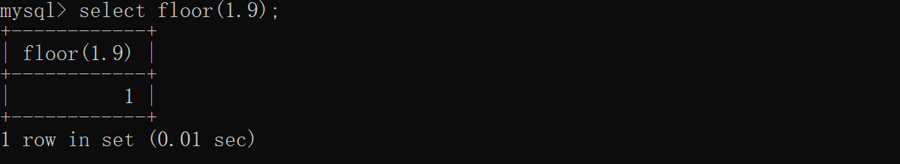

#### 3、mod：取模

```sql
select mod(7, 4);
```

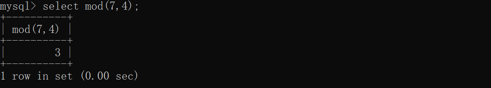

#### 4、rand：获取随机数

```sql
select rand();
```

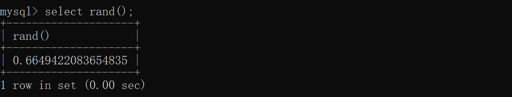

#### 5、round：四舍五入

```sql
select round(2.357, 2);
```

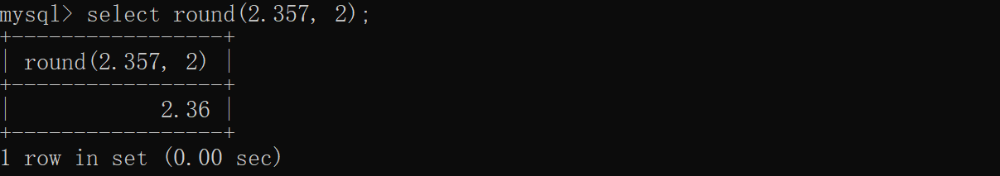

#### 6、针对rand() 的四舍五入

```sql
select r.num, round(r.num, 2) from (select rand() num) as r;
```

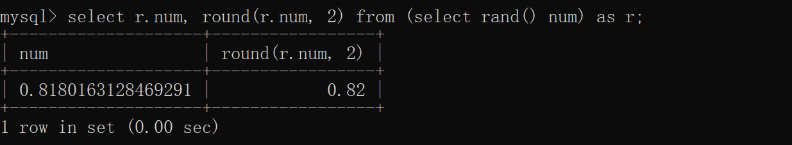

#### 7、案例：

通过数据库的函数，生成一个六位数的随机验证码。

思路： 获取随机数可以通过rand()函数，但是获取出来的随机数是在0-1之间的，所以可以在其基础 上乘以1000000，然后舍弃小数部分，如果长度不足6位，补0

```sql
SELECT lpad(round(rand() * 1000000, 0), 6, '0');
```


### 3.3 日期函数

常见的日期函数如下：

| **函数**                           | **功能**                                           |
| ---------------------------------- | -------------------------------------------------- |
| CURDATE()                          | 返回当前日期                                       |
| CURTIME()                          | 返回当前时间                                       |
| NOW()                              | 返回当前日期和时间                                 |
| YEAR(date)                         | 获取指定date的年份                                 |
| MONTH(date)                        | 获取指定date的月份                                 |
| DAY(date)                          | 获取指定date的日期                                 |
| DATE_ADD(date, INTERVAL expr type) | 返回一个日期/时间值加上一个时间间隔expr后的 时间值 |
| DATEDIFF(date1,date2)              | 返回起始时间date1 和结束时间date2之间的天数        |

演示如下：

A. curdate：当前日期

```sql
select curdate();
```


B. curtime：当前时间

```sql
select curtime();
```


C. now：当前日期和时间

```sql
select now();
```


D. YEAR , MONTH , DAY：当前年、月、日

```sql
select YEAR(now());
select MONTH(now());
select DAY(now());
```


E. date_add：增加指定的时间间隔

```sql
select date_add(now(), INTERVAL 70 YEAR );
```


F. datediff：获取两个日期相差的天数

```sql
select datediff('2021-10-01', '2021-12-01');
```


案例：

查询所有员工的入职天数，并根据入职天数倒序排序。

思路： 入职天数，就是通过当前日期 - 入职日期，所以需要使用datediff函数来完成。

```sql
SELECT
	`name`,
	DATEDIFF( CURDATE( ), entrydate ) AS 'entrydays' 
FROM
	emp 
ORDER BY
	entrydays DESC;
```


### 3.4 流程函数

流程函数也是很常用的一类函数，可以在SQL语句中实现条件筛选，从而提高语句的效率。

| **函数**                                                     | **功能**                                                    |
| ------------------------------------------------------------ | ----------------------------------------------------------- |
| IF(value , t , f)                                            | 如果value为true，则返回t，否则返回f                         |
| IFNULL(value1 , value2)                                      | 如果value1不为空，返回value1，否则 返回value2               |
| CASE WHEN [ val1 ] THEN [res1]  ...     ELSE [ default ] END | 如果val1为true，返回res1，... 否 则返回default默认值        |
| CASE [ expr ] WHEN  [ val1 ] THEN     [res1] ... ELSE [ default ] END | 如果expr的值等于val1，返回  res1，... 否则返回default默认值 |

演示如下：

#### 3.4.1 if

```sql
select if(false, 'Ok', 'Error');
```

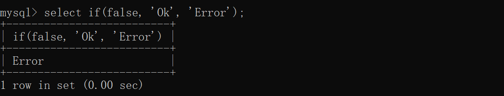

#### 3.4.2 ifnull

```sql
select ifnull('Ok','Default');
select ifnull('','Default');
select ifnull(null,'Default');
```

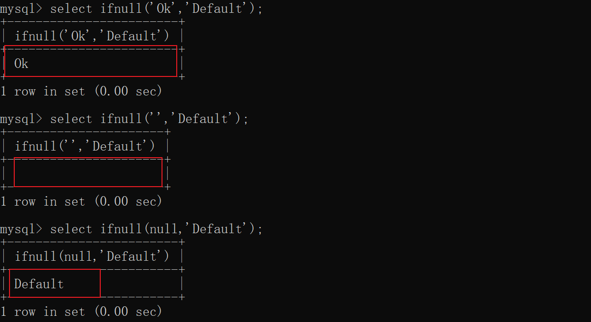

#### 3.4.3 case when then else end

需求: 查询emp表的员工姓名和工作地址 (`北京/上海 ----> 一线城市 , 其他 ----> 二线城市`)

```sql
SELECT
	`name` AS '员工姓名',
	( CASE WHEN `workaddress` IN ( '北京', '上海' ) THEN '一线城市' ELSE '二线城市' END ) AS '工作地址' 
FROM
	emp;
```


#### 3.4.4 案例:

统计各科优秀，及格，与不及格的学员信息

分数大于等于85为优秀

大于等于60为及格

其余为不及格

```sql
CREATE TABLE score (
	id INT COMMENT 'ID',
	name VARCHAR ( 20 ) COMMENT '姓名',
	math INT COMMENT '数学',
	english INT COMMENT '英语',
	chinese INT COMMENT '语文' 
) COMMENT '学员成绩表';
INSERT INTO score ( id, name, math, english, chinese )
VALUES
	( 1, 'Tom', 67, 88, 95 ),
	( 2, 'Rose', 23, 66, 90 ),
	( 3, 'Jack', 56, 98, 76 );
```

具体的SQL语句如下:

```sql
SELECT
	`name` AS '姓名',
	( CASE WHEN math >= 85 THEN '优秀' WHEN math >= 60 THEN '及格' ELSE '不及格' END ) AS '数学',
	( CASE WHEN english >= 85 THEN '优秀' WHEN english >= 60 THEN '及格' ELSE '不及格' END ) AS '英语',
	( CASE WHEN chinese >= 85 THEN '优秀' WHEN chinese >= 60 THEN '及格' ELSE '不及格' END ) AS '语文' 
FROM
	score;
```


MySQL的常见函数我们学习完了，那接下来，我们就来分析一下，在前面讲到的两个函数的案例场景， 思考一下需要用到什么样的函数来实现?

1). 数据库中，存储的是入职日期，如 2000-01-01，如何快速计算出入职天数呢？ 

答案: datediff

2). 数据库中，存储的是学生的分数值，如98、75，如何快速判定分数的等级呢？ 

答案: case ... when ...
