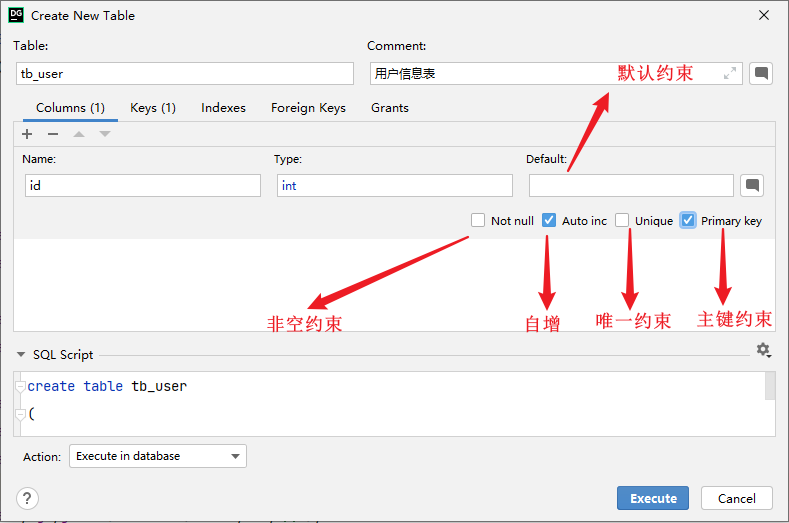
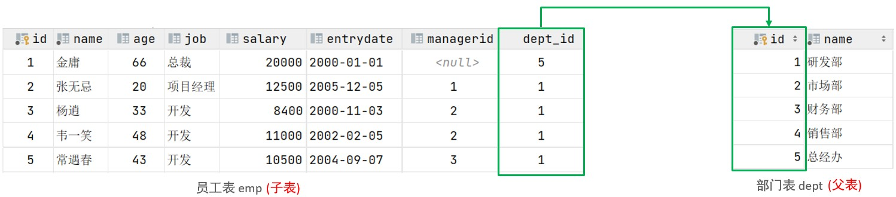
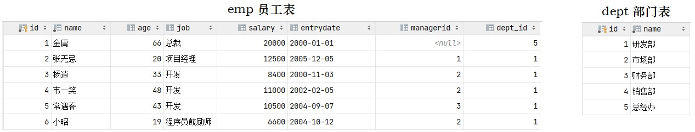
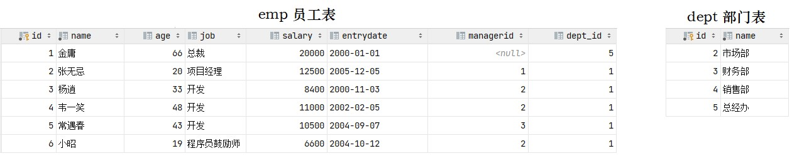
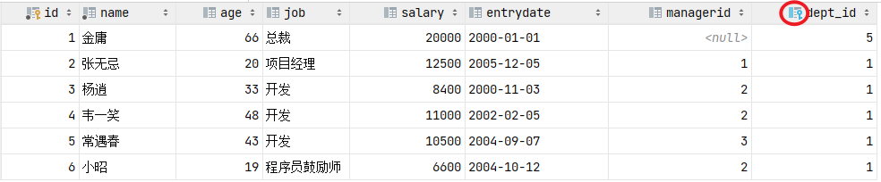
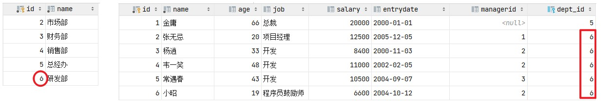
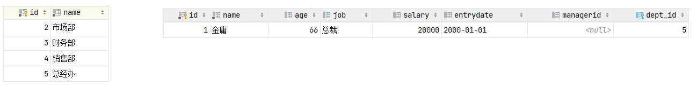
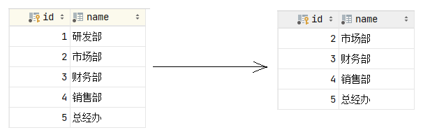
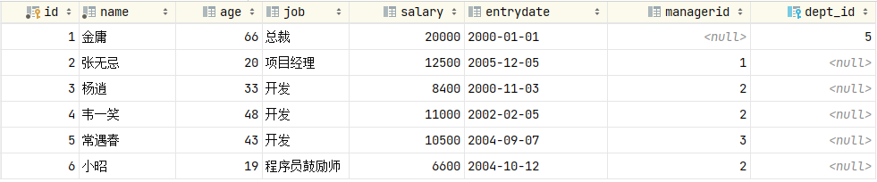

## 4. 约束

### 4.1 概述

概念：约束是作用于表中字段上的规则，用于限制存储在表中的数据。 目的：保证数据库中数据的正确、有效性和完整性。

分类:

| **约束**                  | **描述**                                                 | **关键字**  |
| ------------------------- | -------------------------------------------------------- | ----------- |
| 非空约束                  | 限制该字段的数据不能为null                               | NOT NULL    |
| 唯一约束                  | 保证该字段的所有数据都是唯一、不重复的                   | UNIQUE      |
| 主键约束                  | 主键是一行数据的唯一标识，要求非空且唯一                 | PRIMARY KEY |
| 默认约束                  | 保存数据时，如果未指定该字段的值，则采用默认值           | DEFAULT     |
| 检查约束(8.0.16版本 之后) | 保证字段值满足某一个条件                                 | CHECK       |
| 外键约束                  | 用来让两张表的数据之间建立连接，保证数据的一致性和完整性 | FOREIGN KEY |

> 注意：约束是作用于表中字段上的，可以在创建表/修改表的时候添加约束。

### 4.2 约束演示

上面我们介绍了数据库中常见的约束，以及约束涉及到的关键字，那这些约束我们到底如何在创建表、 修改表的时候来指定呢，接下来我们就通过一个案例，来演示一下。

案例需求： 根据需求，完成表结构的创建。需求如下：

| **字段名** | **字段含 义** | **字段类型** | **约束条件**               | **约束关键字**               |
| ---------- | ------------- | ------------ | -------------------------- | ---------------------------- |
| id         | ID唯一  标识  | int          | 主键，并且自动增长         | PRIMARY  KEY, AUTO_INCREMENT |
| name       | 姓名          | varchar(10)  | 不为空，并且唯一           | NOT NULL , UNIQUE            |
| age        | 年龄          | int          | 大于0，并且小于等 于120    | CHECK                        |
| status     | 状态          | char(1)      | 如果没有指定该值， 默认为1 | DEFAULT                      |
| gender     | 性别          | char(1)      | 无                         |                              |

对应的建表语句为：

```sql
CREATE TABLE `tb_user` (
	`id` INT PRIMARY KEY AUTO_INCREMENT COMMENT 'ID唯一标识',
	`name` VARCHAR ( 10 ) NOT NULL UNIQUE COMMENT '姓名',
	`age` INT CHECK ( age > 0 AND age <= 120 ) COMMENT '年龄',
	`status` CHAR ( 1 ) DEFAULT '1' COMMENT '状态',
	`gender` CHAR ( 1 ) COMMENT '性别' 
) COMMENT '用户信息表';
```

> 注意：必须要在MySQL8.0版本才能执行成功

在为字段添加约束时，我们只需要在字段之后加上约束的关键字即可，需要关注其语法。我们执行上面的SQL把表结构创建完成，然后接下来，就可以通过一组数据进行测试，从而验证一下，约束是否可以生效。

```sql
insert into tb_user(name,age,status,gender) values ('Tom1',19,'1','男'),('Tom2',25,'0','男');
insert into tb_user(name,age,status,gender) values ('Tom3',19,'1','男');
insert into tb_user(name,age,status,gender) values (null,19,'1','男');
insert into tb_user(name,age,status,gender) values ('Tom3',19,'1','男');
insert into tb_user(name,age,status,gender) values ('Tom4',80,'1','男');
insert into tb_user(name,age,status,gender) values ('Tom5',-1,'1','男');
insert into tb_user(name,age,status,gender) values ('Tom5',121,'1','男');
insert into tb_user(name,age,gender) values ('Tom5',120,'男');
insert into tb_user(name,age,status,gender) values ('Tom1',19,'1','男'),('Tom2',25,'0','男');
insert into tb_user(name,age,status,gender) values ('Tom3',19,'1','男');
insert into tb_user(name,age,status,gender) values (null,19,'1','男');
insert into tb_user(name,age,status,gender) values ('Tom3',19,'1','男');
insert into tb_user(name,age,status,gender) values ('Tom4',80,'1','男');
insert into tb_user(name,age,status,gender) values ('Tom5',-1,'1','男');
insert into tb_user(name,age,status,gender) values ('Tom5',121,'1','男');
insert into tb_user(name,age,gender) values ('Tom5',120,'男');
```


上面，我们是通过编写SQL语句的形式来完成约束的指定，那加入我们是通过图形化界面来创建表结构时，又该如何来指定约束呢？ 只需要在创建表的时候，根据我们的需要选择对应的约束即可。



### 4.3 外键约束

#### 4.3.1 介绍

外键：用来让两张表的数据之间建立连接，从而保证数据的一致性和完整性。 我们来看一个例子：



左侧的emp表是员工表，里面存储员工的基本信息，包含员工的ID、姓名、年龄、职位、薪资、入职日 期、上级主管ID、部门ID，在员工的信息中存储的是部门的ID dept_id，而这个部门的ID是关联的 部门表dept的主键id，那emp表的dept_id就是外键,关联的是另一张表的主键。

> 注意：目前上述两张表，只是在逻辑上存在这样一层关系；在数据库层面，并未建立外键关联，所以是无法保证数据的一致性和完整性的。

没有数据库外键关联的情况下，能够保证一致性和完整性呢，我们来测试一下。

准备数据

```sql
CREATE TABLE `dept` (
`id` INT AUTO_INCREMENT COMMENT 'ID' PRIMARY KEY, 
`name` VARCHAR ( 50 ) NOT NULL COMMENT '部门名称' 
) COMMENT '部门表';

INSERT INTO dept ( id, NAME ) VALUES
	( 1, '研发部' ),
	( 2, '市场部' ),
	( 3, '财务部' ),
	( 4, '销售部' ),
	( 5, '总经办' );
	

create table `emp`(
`id` int auto_increment comment 'ID' primary key,
`name` varchar(50) not null comment '姓名',
`age` int comment '年龄',
`job` varchar(20) comment '职位',
`salary` int comment '薪资',
`entrydate` date comment '入职时间',
`managerid` int comment '直属领导ID',
`dept_id` int comment '部门ID'
)comment '员工表';


INSERT INTO emp ( `id`, `name`, `age`, `job`, `salary`, `entrydate`, `managerid`, `dept_id` )
VALUES
	( 1, '金庸', 66, '总裁', 20000, '2000-01-01', NULL, 5 ),
	( 2, '张无忌', 20, '项目经理', 12500, '2005-12-05', 1, 1 ),
	( 3, '杨逍', 33, '开发', 8400, '2000-11-03', 2, 1 ),
	( 4, '韦一笑', 48, '开
	发', 11000, '2002-02-05', 2, 1 ),
	( 5, '常遇春', 43, '开发', 10500, '2004-09-07', 3, 1 ),
	( 6, '小昭', 19, '程
	序员鼓励师', 6600, '2004-10-12', 2, 1 );
```




接下来，我们可以做一个测试，删除id为1的部门信息。



结果，我们看到删除成功，而删除成功之后，部门表不存在id为1的部门，而在emp表中还有很多的员工，关联的为id为1的部门，此时就出现了数据的不完整性。 而要想解决这个问题就得通过数据库的 外键约束。

### 4.3.2 语法

#### 1). 添加外键

```sql
CREATE TABLE 表名(
    
    字段名 数据类型,
    ...
	[CONSTRAINT] [外键名称] FOREIGN KEY (外键字段名) REFERENCES 主表 (主表列名)
);
```

```sql
ALTER TABLE 表名 ADD CONSTRAINT 外键名称 FOREIGN KEY (外键字段名) REFERENCES 主表 （主表列名）;
```


案例:

为emp表的dept_id字段添加外键约束,关联dept表的主键id。

```sql
ALTER TABLE emp ADD CONSTRAINT fk_emp_dept_id FOREIGN KEY (dept_id) REFERENCES dept (id);
```




添加了外键约束之后，我们再到dept表(父表)删除id为1的记录，然后看一下会发生什么现象。 此时

将会报错，不能删除或更新父表记录，因为存在外键约束。


#### 2). 删除外键

```sql
ALTER TABLE 表名 DROP FOREIGN KEY 外键名称;
```


#### 3). 案例：

删除emp表的外键fk_emp_dept_id。

```sql
alter table emp drop foreign key fk_emp_dept_id;
```


### 4.3.3 删除/更新行为

添加了外键之后，再删除父表数据时产生的约束行为，我们就称为删除/更新行为。具体的删除/更新行为有以下几种:

| **行为**    | **说明**                                                     |
| ----------- | ------------------------------------------------------------ |
| NO ACTION   | 当在父表中删除/更新对应记录时，首先检查该记录是否有对应外键，如果有则不允许删除/更新。 (与 RESTRICT 一致) 默认行为 |
| RESTRICT    | 当在父表中删除/更新对应记录时，首先检查该记录是否有对应外键，如果有则不允许删除/更新。 (与 NO ACTION 一致) 默认行为 |
| CASCADE     | 当在父表中删除/更新对应记录时，首先检查该记录是否有对应外键，如果有，则也删除/更新外键在子表中的记录。 |
| SET NULL    | 当在父表中删除对应记录时，首先检查该记录是否有对应外键，如果有则设置子表中该外键值为null（这就要求该外键允许取null）。 |
| SET DEFAULT | 父表有变更时，子表将外键列设置成一个默认的值   (Innodb不支持) |

具体语法为:

```sql
ALTER TABLE 表名 ADD CONSTRAINT 外键名称 FOREIGN KEY (外键字段) REFERENCES 主表名 (主表字段名) ON UPDATE CASCADE ON DELETE CASCADE;
```


演示如下：

由于NO ACTION 是默认行为，我们前面语法演示的时候，已经测试过了，就不再演示了，这里我们再演示其他的两种行为：CASCADE、SET NULL。 

#### 1). CASCADE

```sql
alter table emp add constraint fk_emp_dept_id foreign key (dept_id) references dept(id) on update cascade on delete cascade ;
```


A. 修改父表id为1的记录，将id修改为6



我们发现，原来在子表中dept_id值为1的记录，现在也变为6了，这就是cascade级联的效果。

> 在一般的业务系统中，不会修改一张表的主键值。

B. 删除父表id为6的记录



我们发现，父表的数据删除成功了，但是子表中关联的记录也被级联删除了。

2). SET NULL

在进行测试之前，我们先需要删除上面建立的外键 fk_emp_dept_id。然后再通过数据脚本，将 emp、dept表的数据恢复了。

```sql
alter table emp add constraint fk_emp_dept_id foreign key (dept_id) references dept(id) on update set null on delete set null ;
```


接下来，我们删除id为1的数据，看看会发生什么样的现象。



我们发现父表的记录是可以正常的删除的，父表的数据删除之后，再打开子表 emp，我们发现子表emp的dept_id字段，原来dept_id为1的数据，现在都被置为NULL了。



这就是SET NULL这种删除/更新行为的效果。