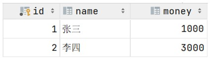
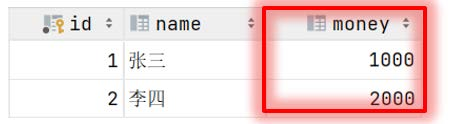
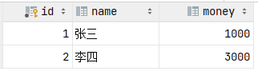
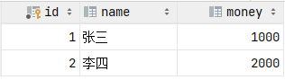
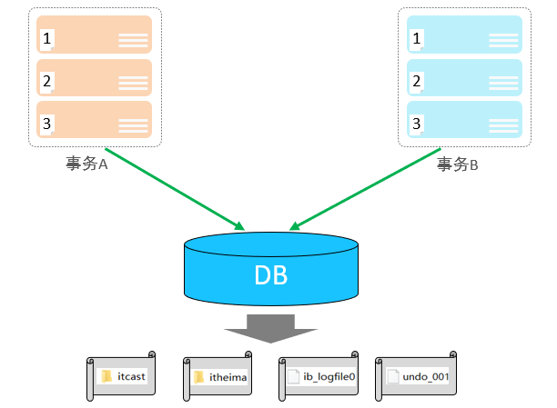
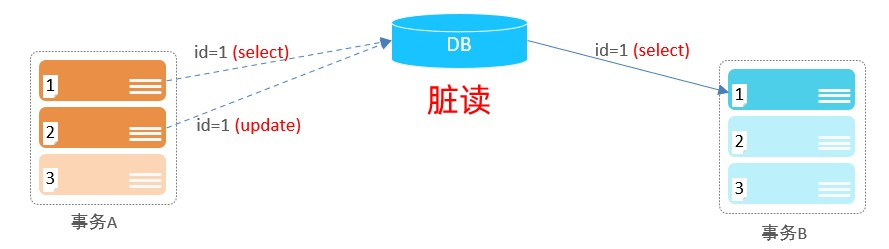
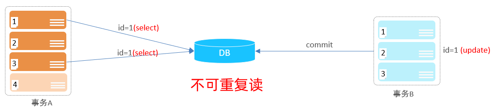
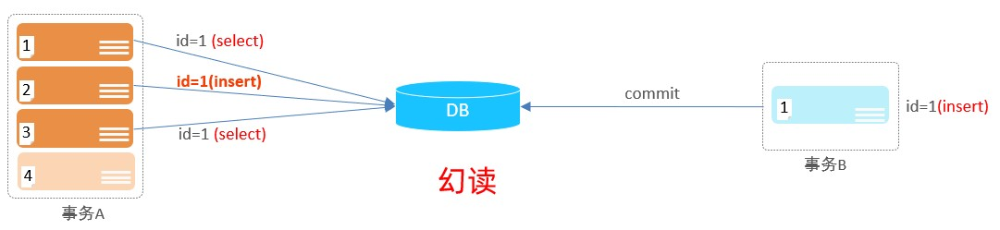

## 6. 事务

### 6.1 事务简介

事务是一组操作的集合，它是一个不可分割的工作单位，事务会把所有的操作作为一个整体一起向系统提交或撤销操作请求，即这些操作要么同时成功，要么同时失败。

就比如: 张三给李四转账1000块钱，张三银行账户的钱减少1000，而李四银行账户的钱要增加

1000。 这一组操作就必须在一个事务的范围内，要么都成功，要么都失败。


正常情况: 转账这个操作, 需要分为以下这么三步来完成 , 三步完成之后, 张三减少1000, 而李四 增加1000, 转账成功 :

 

异常情况: 转账这个操作, 也是分为以下这么三步来完成 , 在执行第三步是报错了, 这样就导致张三减少1000块钱, 而李四的金额没变, 这样就造成了数据的不一致, 就出现问题了。




为了解决上述的问题，就需要通过数据的事务来完成，我们只需要在业务逻辑执行之前开启事务，执行完毕后提交事务。如果执行过程中报错，则回滚事务，把数据恢复到事务开始之前的状态。


> 注意： 默认MySQL的事务是自动提交的，也就是说，当执行完一条DML语句时，MySQL会立即隐式的提交事务。

### 6.2 事务操作

数据准备：

```sql
-- 删除account表	
DROP TABLE IF	EXISTS `account`;

-- 创建account表
CREATE TABLE `account` ( 
`id` INT PRIMARY KEY AUTO_INCREMENT COMMENT 'ID',
`name` VARCHAR ( 10 ) COMMENT '姓名',
`money` DOUBLE ( 10, 2 ) COMMENT '余额' 
) COMMENT '账户表';

-- 插入数据
INSERT INTO `account` ( `name`, `money` )
VALUES
	( '张三', 2000 ),
	( '李四', 2000 );
```


#### 6.2.1 未控制事务

1). 测试正常情况

```sql
-- 1. 查询张三余额
select * from account where name = '张三';
-- 2. 张三的余额减少1000
update account set money = money - 1000 where name = '张三';
-- 3. 李四的余额增加1000
update account set money = money + 1000 where name = '李四';
```


测试完毕之后检查数据的状态, 可以看到数据操作前后是一致的。



2). 测试异常情况

```sql
-- 1. 查询张三余额
select * from account where name = '张三';
-- 2. 张三的余额减少1000
update account set money = money - 1000 where name = '张三';
出错了....
-- 3. 李四的余额增加1000
update account set money = money + 1000 where name = '李四';
```


我们把数据都恢复到2000， 然后再次一次性执行上述的SQL语句(出错了.... 这句话不符合SQL语法,执行就会报错)，检查最终的数据情况, 发现数据在操作前后不一致了。



#### 6.2.2 控制事务一

1). 查看/设置事务提交方式

```sql
SELECT @@autocommit ;
SET @@autocommit = 0 ;
```


2). 提交事务

```sql
COMMIT;
```


3). 回滚事务

```sql
ROLLBACK;
```

> 注意：上述的这种方式，我们是修改了事务的自动提交行为, 把默认的自动提交修改为了手动提交, 此时我们执行的DML语句都不会提交, 需要手动的执行commit进行提交。

#### 6.2.3 控制事务二

1). 开启事务

```sql
START TRANSACTION 或 BEGIN ;
```


2). 提交事务

```sql
COMMIT;
```


3). 回滚事务

```sql
ROLLBACK;
```


#### 6.2.4 转账案例：

```sql
-- 开启事务
start transaction
-- 1. 查询张三余额
select * from account where name = '张三';
-- 2. 张三的余额减少1000
update account set money = money - 1000 where name = '张三';
-- 3. 李四的余额增加1000
update account set money = money + 1000 where name = '李四';
-- 如果正常执行完毕, 则提交事务
commit;
-- 如果执行过程中报错, 则回滚事务
-- rollback;
```


### 6.3 事务四大特性

- 原子性（Atomicity）：事务是不可分割的最小操作单元，要么全部成功，要么全部失败。 
- 一致性（Consistency）：事务完成时，必须使所有的数据都保持一致状态。 
- 隔离性（Isolation）：数据库系统提供的隔离机制，保证事务在不受外部并发操作影响的独立环境下运行。 
- 持久性（Durability）：事务一旦提交或回滚，它对数据库中的数据的改变就是永久的。

上述就是事务的四大特性，简称ACID。



### 6.4 并发事务问题

#### 1). 赃读：一个事务读到另外一个事务还没有提交的数据。



比如B读取到了A未提交的数据。

#### 2). 不可重复读：一个事务先后读取同一条记录，但两次读取的数据不同，称之为不可重复读。



事务A两次读取同一条记录，但是读取到的数据却是不一样的。

#### 3). 幻读：一个事务按照条件查询数据时，没有对应的数据行，但是在插入数据时，又发现这行数据已经存在，好像出现了 "幻影"。



### 6.5 事务隔离级别

为了解决并发事务所引发的问题，在数据库中引入了事务隔离级别。主要有以下几种：

| **隔离级别**          | **脏读** | **不可重复读** | **幻读** |
| --------------------- | -------- | -------------- | -------- |
| Read uncommitted      | √        | √              | √        |
| Read committed        | ×        | √              | √        |
| Repeatable Read(默认) | ×        | ×              | √        |
| Serializable          | ×        | ×              | ×        |

#### 1). 查看事务隔离级别

```sql
SELECT @@TRANSACTION_ISOLATION;
```


#### 2). 设置事务隔离级别

```sql
SET [ SESSION | GLOBAL ] TRANSACTION ISOLATION LEVEL { READ UNCOMMITTED | READ COMMITTED | REPEATABLE READ | SERIALIZABLE }
```

> 注意：事务隔离级别越高，数据越安全，但是性能越低。