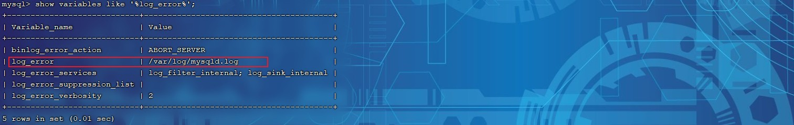
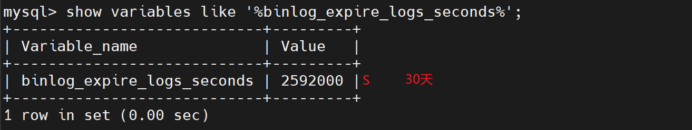

# 1. 日志

## 1.1 错误日志

错误日志是 MySQL 中最重要的日志之一，它记录了当 mysqld 启动和停止时，以及服务器在运行过 程中发生任何严重错误时的相关信息。当数据库出现任何故障导致无法正常使用时，建议首先查看此日志。

该日志是默认开启的，默认存放目录 /var/log/，默认的日志文件名为 mysqld.log 。查看日志位置：

```sql
show variables like '%log_error%';
```



## 1.2 二进制日志

### 1.2.1 介绍

二进制日志（BINLOG）记录了所有的 DDL（数据定义语言）语句和 DML（数据操纵语言）语句，但不包括数据查询（SELECT、SHOW）语句。

作用：①. 灾难时的数据恢复；②. MySQL的主从复制。在MySQL8版本中，默认二进制日志是开启着 的，涉及到的参数如下：

```sql
show variables like '%log_bin%';
```


参数说明：

- log_bin_basename：当前数据库服务器的binlog日志的基础名称(前缀)，具体的binlog文件名需要再该basename的基础上加上编号(编号从000001开始)。

- log_bin_index：binlog的索引文件，里面记录了当前服务器关联的binlog文件有哪些。

### 1.2.2 格式

MySQL服务器中提供了多种格式来记录二进制日志，具体格式及特点如下：

| **日志格式** | **含义**                                                     |
| ------------ | ------------------------------------------------------------ |
| STATEMENT    | 基于SQL语句的日志记录，记录的是SQL语句，对数据进行修改的SQL都会记录在日志文件中。 |
| ROW          | 基于行的日志记录，记录的是每一行的数据变更。（默认）         |
| MIXED        | 混合了STATEMENT和ROW两种格式，默认采用STATEMENT，在某些特殊情况下会 自动切换为ROW进行记录。 |

```sql
show variables like '%binlog_format%';
```


如果我们需要配置二进制日志的格式，只需要在 /etc/my.cnf 中配置 binlog_format 参数即可。

### 1.2.3 查看

由于日志是以二进制方式存储的，不能直接读取，需要通过二进制日志查询工具 mysqlbinlog 来查 看，具体语法：

```shell
mysqlbinlog [ 参数选项 ] logfilename

参数选项：
    -d 指定数据库名称，只列出指定的数据库相关操作。
    -o 忽略掉日志中的前n行命令。
    -v 将行事件(数据变更)重构为SQL语句
    -vv 将行事件(数据变更)重构为SQL语句，并输出注释信息
```


### 1.2.4 删除

对于比较繁忙的业务系统，每天生成的binlog数据巨大，如果长时间不清除，将会占用大量磁盘空间。可以通过以下几种方式清理日志：

| **指令**                                         | **含义**                                                     |
| ------------------------------------------------ | ------------------------------------------------------------ |
| reset master                                     | 删除全部 binlog 日志，删除之后，日志编号，将 从 binlog.000001重新开始 |
| purge master logs to 'binlog.*'                  | 删除 * 编号之前的所有日志                                    |
| purge master logs before 'yyyy-mm-dd hh24:mi:ss' | 删除日志为 "yyyy-mm-dd  hh24:mi:ss" 之前 产生的所有日志      |

也可以在mysql的配置文件中配置二进制日志的过期时间，设置了之后，二进制日志过期会自动删除。

```sql
show variables like '%binlog_expire_logs_seconds%';
```



## 1.3 查询日志

查询日志中记录了客户端的所有操作语句，而二进制日志不包含查询数据的SQL语句。默认情况下， 查询日志是未开启的。

```sql
show variables like '%general%';
```


如果需要开启查询日志，可以修改MySQL的配置文件 /etc/my.cnf 文件，添加如下内容：

```properties
#该选项用来开启查询日志 ， 可选值 ： 0 或者 1 ； 0 代表关闭， 1 代表开启
general_log=1
#设置日志的文件名 ， 如果没有指定， 默认的文件名为 host_name.log
general_log_file=mysql_query.log
```

开启了查询日志之后，在MySQL的数据存放目录，也就是 /var/lib/mysql/ 目录下就会出现mysql_query.log 文件。之后所有的客户端的增删改查操作都会记录在该日志文件之中，长时间运 行后，该日志文件将会非常大。

## 1.4 慢查询日志

慢查询日志记录了所有执行时间超过参数 long_query_time 设置值并且扫描记录数不小于 min_examined_row_limit 的所有的SQL语句的日志，默认未开启。long_query_time 默认为 10 秒，最小为 0， 精度可以到微秒。

如果需要开启慢查询日志，需要在MySQL的配置文件 /etc/my.cnf 中配置如下参数：

```properties
#慢查询日志
slow_query_log=1

#执行时间参数
long_query_time=2
```


默认情况下，不会记录管理语句，也不会记录不使用索引进行查找的查询。可以使用log_slow_admin_statements和 更改此行为 log_queries_not_using_indexes，如下所 述。

```properties
#记录执行较慢的管理语句
log_slow_admin_statements =1

#记录执行较慢的未使用索引的语句
log_queries_not_using_indexes = 1
```

> 上述所有的参数配置完成之后，都需要重新启动MySQL服务器才可以生效。