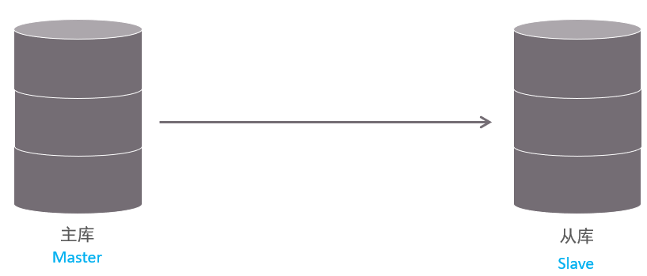
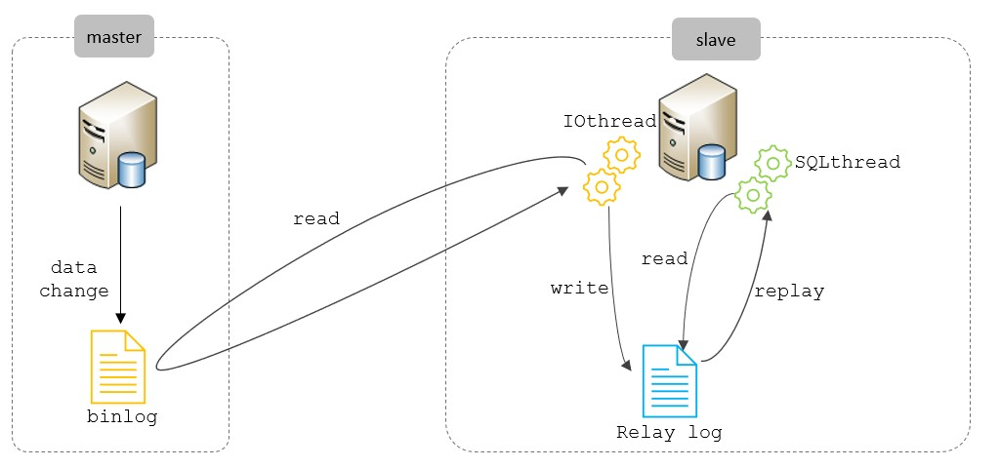
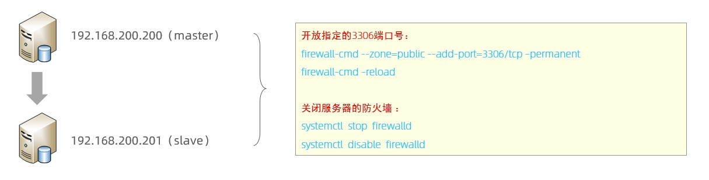

# 2. 主从复制

## 2.1 概述

主从复制是指将主数据库的 DDL 和 DML 操作通过二进制日志传到从库服务器中，然后在从库上对这 些日志重新执行（也叫重做），从而使得从库和主库的数据保持同步。

MySQL支持一台主库同时向多台从库进行复制， 从库同时也可以作为其他从服务器的主库，实现链状复制。



MySQL 复制的优点主要包含以下三个方面：

- 主库出现问题，可以快速切换到从库提供服务。

- 实现读写分离，降低主库的访问压力。

- 可以在从库中执行备份，以避免备份期间影响主库服务。

## 2.2 原理

MySQL主从复制的核心就是 二进制日志，具体的过程如下：



从上图来看，复制分成三步：

1. Master 主库在事务提交时，会把数据变更记录在二进制日志文件 Binlog 中。
2. 从库读取主库的二进制日志文件 Binlog ，写入到从库的中继日志 Relay Log 。
3. slave重做中继日志中的事件，将改变修改到它自己的数据中。

## 2.3 搭建

### 2.3.1 准备



```shell
firewall-cmd --zone=public --add-port=3306/tcp --permanent
firewall-cmd --reload


命令含义
-- zone # 作用域
--add-port=3306/tcp # 添加端口，格式为：端口/通讯协议
--permanent # 永久生效，没有此参数重启后失效
```


准备好两台服务器之后，在上述的两台服务器中分别安装好MySQL，并完成基础的初始化准备(安装、 密码配置等操作)工作。 

其中：

- 192.168.200.200 作为主服务器master

- 192.168.200.201 作为从服务器slave

### 2.3.2 主库配置

#### 1、修改配置文件 /etc/my.cnf

```properties
# mysql 服务ID，保证整个集群环境中唯一，取值范围：1 – 232-1，默认为1
server-id=1

# 是否只读,1 代表只读, 0 代表读写
read-only=0

# 忽略的数据, 指不需要同步的数据库
# binlog-ignore-db=mysql

# 指定同步的数据库
# binlog-do-db=db01
```


#### 2、重启MySQL服务器

```shell
systemctl restart mysqld
```


#### 3、登录mysql，创建远程连接的账号，并授予主从复制权限

```sql
#创建itcast用户，并设置密码，该用户可在任意主机连接该MySQL服务
CREATE USER 'itcast'@'%' IDENTIFIED WITH mysql_native_password BY 'Root@123456';

#为 'itcast'@'%' 用户分配主从复制权限
GRANT REPLICATION SLAVE ON *.* TO 'itcast'@'%';
```


#### 4、通过指令，查看二进制日志坐标

```sql
show master status ;
```


字段含义说明：

- file : 从哪个日志文件开始推送日志文件
- position ： 从哪个位置开始推送日志
- binlog_ignore_db : 指定不需要同步的数据库

### 2.3.3 从库配置

#### 1、修改配置文件 /etc/my.cnf

```properties
# mysql 服务ID，保证整个集群环境中唯一，取值范围：1 – 2^32-1，和主库不一样即可
server-id=2

# 是否只读,1 代表只读, 0 代表读写
read-only=1
```


#### 2、重新启动MySQL服务

```shell
systemctl restart mysqld
```


#### 3、登录mysql，设置主库配置

```sql
CHANGE REPLICATION SOURCE TO SOURCE_HOST='192.168.200.200', SOURCE_USER='itcast',SOURCE_PASSWORD='Root@123456', SOURCE_LOG_FILE='binlog.000004',SOURCE_LOG_POS=663;
```


上述是8.0.23中的语法。如果mysql是 8.0.23 之前的版本，执行如下SQL：

```sql
CHANGE MASTER TO MASTER_HOST='192.168.200.200', MASTER_USER='itcast',MASTER_PASSWORD='Root@123456', MASTER_LOG_FILE='binlog.000004',MASTER_LOG_POS=663;
```

| 参数名          | 含义               | 8.0.23之前      |
| --------------- | ------------------ | --------------- |
| SOURCE_HOST     | 主库IP地址         | MASTER_HOST     |
| SOURCE_USER     | 连接主库的用户名   | MASTER_USER     |
| SOURCE_PASSWORD | 连接主库的密码     | MASTER_PASSWORD |
| SOURCE_LOG_FILE | binlog日志文件名   | MASTER_LOG_FILE |
| SOURCE_LOG_POS  | binlog日志文件位置 | MASTER_LOG_POS  |

#### 4、开启同步操作

```sql
start replica ; #8.0.22之后
start slave ; #8.0.22之前
```


#### 5、 查看主从同步状态

```sql
show replica status ; #8.0.22之后
show slave status ; #8.0.22之前
```


### 2.3.4 测试

#### 1、在主库 192.168.200.200 上创建数据库、表，并插入数据

```sql
create database db01;
use db01;

create table tb_user(
    id int(11) primary key not null auto_increment,
    name varchar(50) not null,
    sex varchar(1)
)engine=innodb default charset=utf8mb4;

insert into tb_user(id,name,sex) values(null,'Tom', '1'),(null,'Trigger','0'),(null,'Dawn','1');
```


#### 2、在从库 192.168.200.201 中查询数据，验证主从是否同步