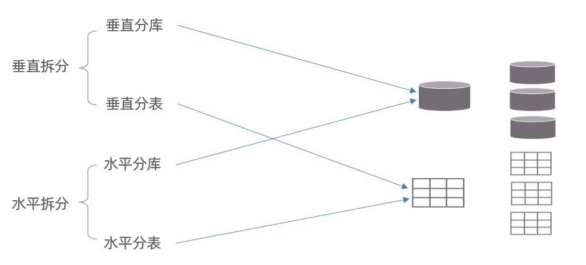
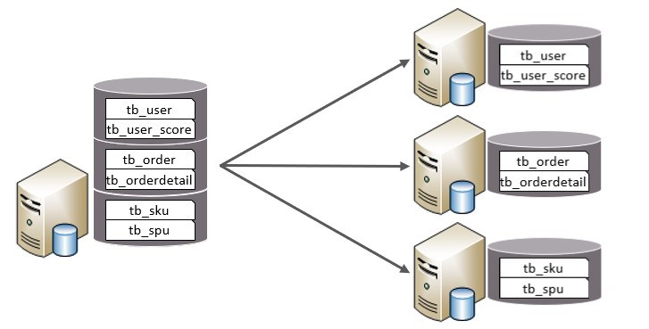
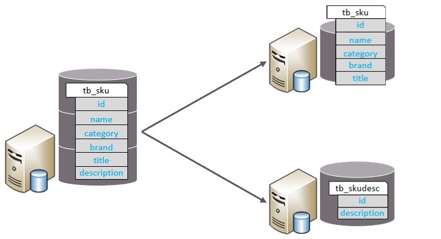
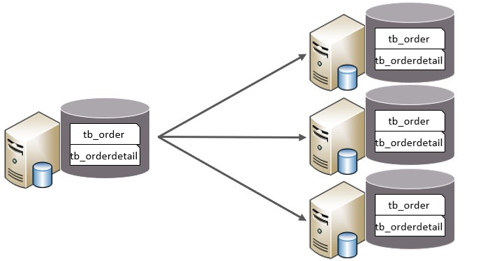
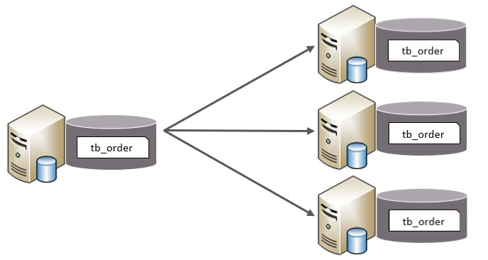

# 3. 分库分表

## 3.1 介绍

### 3.1.1 问题分析

随着互联网及移动互联网的发展，应用系统的数据量也是成指数式增长，若采用单数据库进行数据存 储，存在以下性能瓶颈：

1、IO瓶颈：热点数据太多，数据库缓存不足，产生大量磁盘IO，效率较低。 请求数据太多，带宽不够，网络IO瓶颈。

2、CPU瓶颈：排序、分组、连接查询、聚合统计等SQL会耗费大量的CPU资源，请求数太多，CPU出现瓶颈。

为了解决上述问题，我们需要对数据库进行分库分表处理。

分库分表的中心思想都是将数据分散存储，使得单一数据库/表的数据量变小来缓解单一数据库的性能问题，从而达到提升数据库性能的目的。

### 3.1.2 拆分策略

分库分表的形式，主要是两种：垂直拆分和水平拆分。而拆分的粒度，一般又分为分库和分表，所以组成的拆分策略最终如下：

### 3.1.3 垂直拆分

#### 1、垂直分库

垂直分库：以表为依据，根据业务将不同表拆分到不同库中。 

特点：

- 每个库的表结构都不一样。

- 每个库的数据也不一样。

- 所有库的并集是全量数据。

#### 2、垂直分表

垂直分表：以字段为依据，根据字段属性将不同字段拆分到不同表中。

特点：

- 每个表的结构都不一样。

- 每个表的数据也不一样，一般通过一列（主键/外键）关联。

- 所有表的并集是全量数据。

### 3.1.4 水平拆分

#### 1、水平分库

水平分库：以字段为依据，按照一定策略，将一个库的数据拆分到多个库中。 

特点：

- 每个库的表结构都一样。

- 每个库的数据都不一样。

- 所有库的并集是全量数据。

#### 2、水平分表

水平分表：以字段为依据，按照一定策略，将一个表的数据拆分到多个表中。 

特点：

- 每个表的表结构都一样。

- 每个表的数据都不一样。

- 所有表的并集是全量数据。

> 在业务系统中，为了缓解磁盘IO及CPU的性能瓶颈，到底是垂直拆分，还是水平拆分；具体是分库，还是分表，都需要根据具体的业务需求具体分析。

### 3.1.5 实现技术

- shardingJDBC：基于AOP原理，在应用程序中对本地执行的SQL进行拦截，解析、改写、路由处理。需要自行编码配置实现，只支持java语言，性能较高。

- MyCat：数据库分库分表中间件，不用调整代码即可实现分库分表，支持多种语言，性能不及前者。

本次课程，我们选择了是MyCat数据库中间件，通过MyCat中间件来完成分库分表操作。

