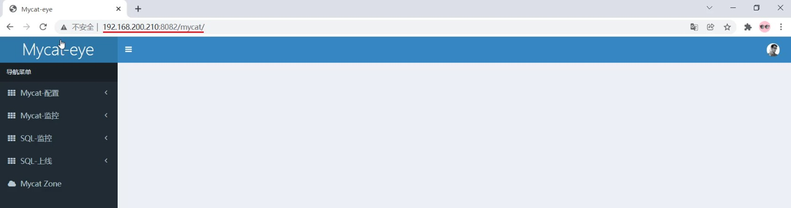
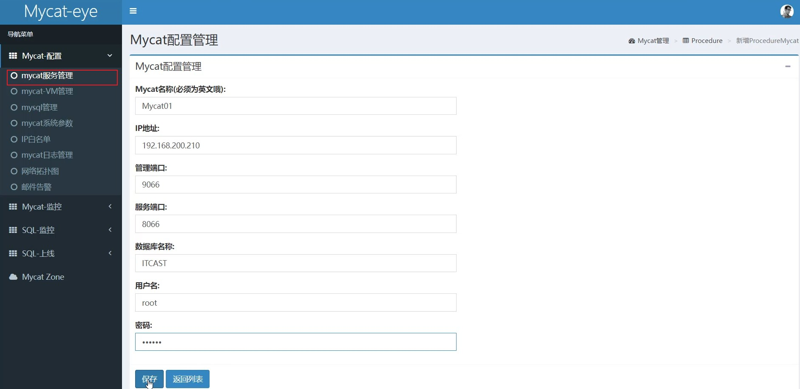

# 4 MyCat

## 4.1 MyCat概述

### 4.1.1 介绍

Mycat是开源的、活跃的、基于Java语言编写的MySQL数据库中间件。可以像使用mysql一样来使用 mycat，对于开发人员来说根本感觉不到mycat的存在。

开发人员只需要连接MyCat即可，而具体底层用到几台数据库，每一台数据库服务器里面存储了什么数据，都无需关心。 具体的分库分表的策略，只需要在MyCat中配置即可。


优势：

- 性能可靠稳定

- 强大的技术团队

- 体系完善

- 社区活跃

### 4.1.2 下载

官网

http://www.mycat.org.cn/mycat1.html

下载地址： [**http://dl.mycat.org.cn/**](http://dl.mycat.org.cn/)


### 4.1.3 安装

Mycat是采用java语言开发的开源的数据库中间件，支持Windows和Linux运行环境，下面介绍 MyCat的Linux中的环境搭建。我们需要在准备好的服务器中安装如下软件。

- MySQL

- JDK

- Mycat

| **服务器**      | **安装软件** | **说明**          |
| --------------- | ------------ | ----------------- |
| 192.168.200.210 | JDK、Mycat   | MyCat中间件服务器 |
| 192.168.200.210 | MySQL        | 分片服务器        |
| 192.168.200.213 | MySQL        | 分片服务器        |
| 192.168.200.214 | MySQL        | 分片服务器        |

具体的安装步骤： 参考资料中提供的 《MyCat安装文档》即可，里面有详细的安装及配置步骤。

### 4.1.4 目录介绍


- bin : 存放可执行文件，用于启动停止mycat

- conf：存放mycat的配置文件

- lib：存放mycat的项目依赖包（jar）

- logs：存放mycat的日志文件

### 4.1.5 概念介绍

在MyCat的整体结构中，分为两个部分：上面的逻辑结构、下面的物理结构。


在MyCat的逻辑结构主要负责逻辑库、逻辑表、分片规则、分片节点等逻辑结构的处理，而具体的数据 存储还是在物理结构，也就是数据库服务器中存储的。

在后面讲解MyCat入门以及MyCat分片时，还会讲到上面所提到的概念。

## 4.2 MyCat入门

### 4.2.1 需求

由于 tb_order 表中数据量很大，磁盘IO及容量都到达了瓶颈，现在需要对 tb_order 表进行数 据分片，分为三个数据节点，每一个节点主机位于不同的服务器上, 具体的结构，参考下图：


### 4.2.2 环境准备

准备3台服务器：

- 192.168.200.210：MyCat中间件服务器，同时也是第一个分片服务器。

- 192.168.200.213：第二个分片服务器。

- 192.168.200.214：第三个分片服务器。


并且在上述3台数据库中创建数据库 db01 。

### 4.2.3 配置

#### 1、schema.xml

在schema.xml中配置逻辑库、逻辑表、数据节点、节点主机等相关信息。具体的配置如下：

```xml
<?xml version="1.0"?>
<!DOCTYPE mycat:schema SYSTEM "schema.dtd">
<mycat:schema xmlns:mycat="http://io.mycat/">

    <schema name="DB01" checkSQLschema="true" sqlMaxLimit="100">
        <table name="TB_ORDER" dataNode="dn1,dn2,dn3" rule="auto-sharding-long"/>
    </schema>

    <dataNode name="dn1" dataHost="dhost1" database="db01"/>
    <dataNode name="dn2" dataHost="dhost2" database="db01"/>
    <dataNode name="dn3" dataHost="dhost3" database="db01"/>

    <dataHost name="dhost1" maxCon="1000" minCon="10" balance="0"
              writeType="0" dbType="mysql" dbDriver="jdbc" switchType="1" slaveThreshold="100">
        <heartbeat>select user()</heartbeat>
        <writeHost host="master"
                   url="jdbc:mysql://192.168.200.210:3306?useSSL=false&amp;serverTimezone=Asia/Shanghai&amp;characterEncoding=utf8"
                   user="root" password="1234"/>
    </dataHost>

    <dataHost name="dhost2" maxCon="1000" minCon="10" balance="0"
              writeType="0" dbType="mysql" dbDriver="jdbc" switchType="1" slaveThreshold="100">
        <heartbeat>select user()</heartbeat>
        <writeHost host="master"
                   url="jdbc:mysql://192.168.200.213:3306?useSSL=false&amp;serverTimezone=Asia/Shanghai&amp;characterEncoding=utf8"
                   user="root" password="1234"/>
    </dataHost>

    <dataHost name="dhost3" maxCon="1000" minCon="10" balance="0"
              writeType="0" dbType="mysql" dbDriver="jdbc" switchType="1" slaveThreshold="100">
        <heartbeat>select user()</heartbeat>
        <writeHost host="master"
                   url="jdbc:mysql://192.168.200.214:3306?useSSL=false&amp;serverTimezone=Asia/Shanghai&amp;characterEncoding=utf8"
                   user="root" password="1234"/>
    </dataHost>
</mycat:schema>
```


#### 2、server.xml

需要在server.xml中配置用户名、密码，以及用户的访问权限信息，具体的配置如下：

```xml
<user name="root" defaultAccount="true">
    <property name="password">123456</property>
    <property name="schemas">DB01</property>
    
    <!-- 表级 DML 权限设置 -->
    <!--
    <privileges check="true">
    <schema name="DB01" dml="0110" >
    <table name="TB_ORDER" dml="1110"></table>
    </schema>
    </privileges>
    -->
</user>
<user name="user">
    <property name="password">123456</property>
    <property name="schemas">DB01</property>
    <property name="readOnly">true</property>
</user>
```

上述的配置表示，定义了两个用户 root 和 user ，这两个用户都可以访问 DB01 这个逻辑库，访问密码都是123456，但是root用户访问DB01逻辑库，既可以读，又可以写，但是 user用户访问 DB01逻辑库是只读的。

### 4.2.4 测试

#### 4.2.4.1 启动

配置完毕后，先启动涉及到的3台分片服务器，然后启动MyCat服务器。切换到Mycat的安装目录，执 行如下指令，启动Mycat：

```shell
#启动
bin/mycat start

#停止
bin/mycat stop
```

Mycat启动之后，占用端口号 8066。

启动完毕之后，可以查看logs目录下的启动日志，查看Mycat是否启动完成。


#### 4.2.4.2 测试

##### 1). 连接MyCat

通过如下指令，就可以连接并登陆MyCat。

```shell
mysql -h 192.168.200.210 -P 8066 -uroot -p123456
```

我们看到我们是通过MySQL的指令来连接的MyCat，因为MyCat在底层实际上是模拟了MySQL的协议。

##### 2). 数据测试

然后就可以在MyCat中来创建表，并往表结构中插入数据，查看数据在MySQL中的分布情况。

```sql
CREATE TABLE TB_ORDER (
	id BIGINT(20) NOT NULL,
    title VARCHAR(100) NOT NULL ,
	PRIMARY KEY (id)
) ENGINE=INNODB DEFAULT CHARSET=utf8 ;

INSERT INTO TB_ORDER(id,title) VALUES(1,'goods1');
INSERT INTO TB_ORDER(id,title) VALUES(2,'goods2');
INSERT INTO TB_ORDER(id,title) VALUES(3,'goods3');
INSERT INTO TB_ORDER(id,title) VALUES(5000000,'goods5000000');
INSERT INTO TB_ORDER(id,title) VALUES(10000000,'goods10000000');
INSERT INTO TB_ORDER(id,title) VALUES(10000001,'goods10000001');
INSERT INTO TB_ORDER(id,title) VALUES(15000000,'goods15000000');
INSERT INTO TB_ORDER(id,title) VALUES(15000001,'goods15000001');
```


经过测试，我们发现，在往 TB_ORDER 表中插入数据时：

- 如果id的值在1-500w之间，数据将会存储在第一个分片数据库中。
- 如果id的值在500w-1000w之间，数据将会存储在第二个分片数据库中。
- 如果id的值在1000w-1500w之间，数据将会存储在第三个分片数据库中。
- 如果id的值超出1500w，在插入数据时，将会报错。

为什么会出现这种现象，数据到底落在哪一个分片服务器到底是如何决定的呢？ 这是由逻辑表配置时 的一个参数 rule 决定的，而这个参数配置的就是分片规则，关于分片规则的配置，在后面的课程中 会详细讲解。

## 4.3 MyCat配置

### 4.3.1 schema.xml

schema.xml 作为MyCat中最重要的配置文件之一 , 涵盖了MyCat的逻辑库、逻辑表、分片规则、分片节点及数据源的配置。


```xml
<?xml version="1.0"?>
<!DOCTYPE mycat:schema SYSTEM "schema.dtd">
<mycat:schema xmlns:mycat="http://io.mycat/">

    <schema name="DB01" checkSQLschema="true" sqlMaxLimit="100">
        <table name="TB_ORDER" dataNode="dn1,dn2,dn3" rule="auto-sharding-long"/>
    </schema>

    <dataNode name="dn1" dataHost="dhost1" database="db01"/>
    <dataNode name="dn2" dataHost="dhost2" database="db01"/>
    <dataNode name="dn3" dataHost="dhost3" database="db01"/>

    <dataHost name="dhost1" maxCon="1000" minCon="10" balance="0"
              writeType="0" dbType="mysql" dbDriver="jdbc" switchType="1" slaveThreshold="100">
        <heartbeat>select user()</heartbeat>
        <writeHost host="master"
                   url="jdbc:mysql://192.168.200.210:3306?useSSL=false&amp;serverTimezone=Asia/Shanghai&amp;characterEncoding=utf8"
                   user="root" password="1234"/>
    </dataHost>

    <dataHost name="dhost2" maxCon="1000" minCon="10" balance="0"
              writeType="0" dbType="mysql" dbDriver="jdbc" switchType="1" slaveThreshold="100">
        <heartbeat>select user()</heartbeat>
        <writeHost host="master"
                   url="jdbc:mysql://192.168.200.213:3306?useSSL=false&amp;serverTimezone=Asia/Shanghai&amp;characterEncoding=utf8"
                   user="root" password="1234"/>
    </dataHost>

    <dataHost name="dhost3" maxCon="1000" minCon="10" balance="0"
              writeType="0" dbType="mysql" dbDriver="jdbc" switchType="1" slaveThreshold="100">
        <heartbeat>select user()</heartbeat>
        <writeHost host="master"
                   url="jdbc:mysql://192.168.200.214:3306?useSSL=false&amp;serverTimezone=Asia/Shanghai&amp;characterEncoding=utf8"
                   user="root" password="1234"/>
    </dataHost>
</mycat:schema>
```


主要包含以下三组标签：

- schema标签
- datanode标签
- datahost标签

#### 4.3.1.1 schema标签

##### 1). schema 定义逻辑库


```xml
    <schema name="DB01" checkSQLschema="true" sqlMaxLimit="100">
        <table name="TB_ORDER" dataNode="dn1,dn2,dn3" rule="auto-sharding-long"/>
    </schema>
```

schema 标签用于定义 MyCat实例中的逻辑库 , 一个MyCat实例中, 可以有多个逻辑库 , 可以通过 schema 标签来划分不同的逻辑库。MyCat中的逻辑库的概念，等同于MySQL中的database概念, 需要操作某个逻辑库下的表时, 也需要切换逻辑库(use xxx)。

核心属性：

- name：指定自定义的逻辑库库名
- checkSQLschema：在SQL语句操作时指定了数据库名称，执行时是否自动去除；true：自动去 除，false：不自动去除
- sqlMaxLimit：如果未指定limit进行查询，列表查询模式查询多少条记录

##### 2). schema 中的table定义逻辑表


table 标签定义了MyCat中逻辑库schema下的逻辑表 , 所有需要拆分的表都需要在table标签中定义 。

核心属性：

- name：定义逻辑表表名，在该逻辑库下唯一
- dataNode：定义逻辑表所属的dataNode，该属性需要与dataNode标签中name对应；多个 dataNode逗号分隔

- rule：分片规则的名字，分片规则名字是在rule.xml中定义的
- primaryKey：逻辑表对应真实表的主键
- type：逻辑表的类型，目前逻辑表只有全局表和普通表，如果未配置，就是普通表；全局表，配置为 global

#### 4.3.1.2 datanode标签


```xml
    <dataNode name="dn1" dataHost="dhost1" database="db01"/>
    <dataNode name="dn2" dataHost="dhost2" database="db01"/>
    <dataNode name="dn3" dataHost="dhost3" database="db01"/>
```

核心属性：

- name：定义数据节点名称

- dataHost：数据库实例主机名称，引用自 dataHost 标签中name属性

- database：定义分片所属数据库

#### 4.3.1.3 datahost标签


```xml
    <dataHost name="dhost1" maxCon="1000" minCon="10" balance="0"
              writeType="0" dbType="mysql" dbDriver="jdbc" switchType="1" slaveThreshold="100">
        <heartbeat>select user()</heartbeat>
        <writeHost host="master"
                   url="jdbc:mysql://192.168.200.210:3306?useSSL=false&amp;serverTimezone=Asia/Shanghai&amp;characterEncoding=utf8"
                   user="root" password="1234"/>
    </dataHost>
```

该标签在MyCat逻辑库中作为底层标签存在, 直接定义了具体的数据库实例、读写分离、心跳语句。 核心属性：

- name：唯一标识，供上层标签使用
- maxCon/minCon：最大连接数/最小连接数
- balance：负载均衡策略，取值 0,1,2,3

- writeType：写操作分发方式（0：写操作转发到第一个writeHost，第一个挂了，切换到第二 个；1：写操作随机分发到配置的writeHost）

- dbDriver：数据库驱动，支持 native、jdbc

### 4.3.2 rule.xml

rule.xml中定义所有拆分表的规则, 在使用过程中可以灵活的使用分片算法, 或者对同一个分片算法 使用不同的参数, 它让分片过程可配置化。主要包含两类标签：tableRule、Function。


```xml
<?xml version="1.0" encoding="UTF-8"?>
<!DOCTYPE mycat:rule SYSTEM "rule.dtd">
<mycat:rule xmlns:mycat="http://io.mycat/">
	<tableRule name="rule1">
		<rule>
			<columns>id</columns>
			<algorithm>func1</algorithm>
		</rule>
	</tableRule>

	<tableRule name="rule2">
		<rule>
			<columns>user_id</columns>
			<algorithm>func1</algorithm>
		</rule>
	</tableRule>

	<tableRule name="sharding-by-intfile">
		<rule>
			<columns>sharding_id</columns>
			<algorithm>hash-int</algorithm>
		</rule>
	</tableRule>
	<tableRule name="auto-sharding-long">
		<rule>
			<columns>id</columns>
			<algorithm>rang-long</algorithm>
		</rule>
	</tableRule>
	<tableRule name="mod-long">
		<rule>
			<columns>id</columns>
			<algorithm>mod-long</algorithm>
		</rule>
	</tableRule>
	<tableRule name="sharding-by-murmur">
		<rule>
			<columns>id</columns>
			<algorithm>murmur</algorithm>
		</rule>
	</tableRule>
	<tableRule name="crc32slot">
		<rule>
			<columns>id</columns>
			<algorithm>crc32slot</algorithm>
		</rule>
	</tableRule>
	<tableRule name="sharding-by-month">
		<rule>
			<columns>create_time</columns>
			<algorithm>partbymonth</algorithm>
		</rule>
	</tableRule>
	<tableRule name="latest-month-calldate">
		<rule>
			<columns>calldate</columns>
			<algorithm>latestMonth</algorithm>
		</rule>
	</tableRule>
	
	<tableRule name="auto-sharding-rang-mod">
		<rule>
			<columns>id</columns>
			<algorithm>rang-mod</algorithm>
		</rule>
	</tableRule>
	
	<tableRule name="jch">
		<rule>
			<columns>id</columns>
			<algorithm>jump-consistent-hash</algorithm>
		</rule>
	</tableRule>

	<function name="murmur"
		class="io.mycat.route.function.PartitionByMurmurHash">
		<property name="seed">0</property><!-- 默认是0 -->
		<property name="count">2</property><!-- 要分片的数据库节点数量，必须指定，否则没法分片 -->
		<property name="virtualBucketTimes">160</property><!-- 一个实际的数据库节点被映射为这么多虚拟节点，默认是160倍，也就是虚拟节点数是物理节点数的160倍 -->
		<!-- <property name="weightMapFile">weightMapFile</property> 节点的权重，没有指定权重的节点默认是1。以properties文件的格式填写，以从0开始到count-1的整数值也就是节点索引为key，以节点权重值为值。所有权重值必须是正整数，否则以1代替 -->
		<!-- <property name="bucketMapPath">/etc/mycat/bucketMapPath</property> 
			用于测试时观察各物理节点与虚拟节点的分布情况，如果指定了这个属性，会把虚拟节点的murmur hash值与物理节点的映射按行输出到这个文件，没有默认值，如果不指定，就不会输出任何东西 -->
	</function>

	<function name="crc32slot"
			  class="io.mycat.route.function.PartitionByCRC32PreSlot">
	</function>
	<function name="hash-int"
		class="io.mycat.route.function.PartitionByFileMap">
		<property name="mapFile">partition-hash-int.txt</property>
	</function>
	<function name="rang-long"
		class="io.mycat.route.function.AutoPartitionByLong">
		<property name="mapFile">autopartition-long.txt</property>
	</function>
	<function name="mod-long" class="io.mycat.route.function.PartitionByMod">
		<!-- how many data nodes -->
		<property name="count">3</property>
	</function>

	<function name="func1" class="io.mycat.route.function.PartitionByLong">
		<property name="partitionCount">8</property>
		<property name="partitionLength">128</property>
	</function>
	<function name="latestMonth"
		class="io.mycat.route.function.LatestMonthPartion">
		<property name="splitOneDay">24</property>
	</function>
	<function name="partbymonth"
		class="io.mycat.route.function.PartitionByMonth">
		<property name="dateFormat">yyyy-MM-dd</property>
		<property name="sBeginDate">2015-01-01</property>
	</function>
	
	<function name="rang-mod" class="io.mycat.route.function.PartitionByRangeMod">
        	<property name="mapFile">partition-range-mod.txt</property>
	</function>
	
	<function name="jump-consistent-hash" class="io.mycat.route.function.PartitionByJumpConsistentHash">
		<property name="totalBuckets">3</property>
	</function>
</mycat:rule>

```


### 4.3.3 server.xml 

server.xml配置文件包含了MyCat的系统配置信息，主要有两个重要的标签：system、user。 

#### 1). system标签


主要配置MyCat中的系统配置信息，对应的系统配置项及其含义，如下：

| **属性**                  | **取值**   | **含义**                                                     |
| ------------------------- | ---------- | ------------------------------------------------------------ |
| charset                   | utf8       | 设置Mycat的字符集, 字符集需要与MySQL的 字符集保持一致        |
| nonePasswordLogin         | 0,1        | 0为需要密码登陆、1为不需要密码登陆 ,默认 为0，设置为1则需要指定默认账户 |
| useHandshakeV10           | 0,1        | 使用该选项主要的目的是为了能够兼容高版本 的jdbc驱动, 是否采用 HandshakeV10Packet来与client进行通 信, 1:是, 0:否 |
| useSqlStat                | 0,1        | 开启SQL实时统计, 1 为开启 , 0 为关闭 ; 开启之后, MyCat会自动统计SQL语句的执行 情况 ; mysql -h 127.0.0.1  -P 9066  -u root -p 查看MyCat执行的SQL, 执行  效率比较低的SQL , SQL的整体执行情况、读 写比例等 ; show @@sql ; show  @@sql.slow ;  show @@sql.sum ; |
| useGlobleTableCheck       | 0,1        | 是否开启全局表的一致性检测。1为开启 ，0 为关闭  。           |
| sqlExecuteTimeout         | 1000       | SQL语句执行的超时时间 , 单位为 s ;                           |
| sequnceHandlerType        | 0,1,2      | 用来指定Mycat全局序列类型，0 为本地文 件，1  为数据库方式，2 为时间戳列方式，默 认使用本地文件方式，文件方式主要用于测试 |
| sequnceHandlerPattern     | 正则表达式 | 必须带有MYCATSEQ或者 mycatseq进入序列 匹配流程  注意MYCATSEQ_有空格的情况 |
| subqueryRelationshipCheck | true,false | 子查询中存在关联查询的情况下,检查关联字 段中是否有分片字段  .默认  false |
| useCompression            | 0,1        | 开启mysql压缩协议 , 0 : 关闭, 1 : 开  启                     |
| fakeMySQLVersion          | 5.5,5.6    | 设置模拟的MySQL版本号          | 
| defaultSqlParser     |          | 由于MyCat的最初版本使用了FoundationDB 的SQL解析器, 在MyCat1.3后增加了Druid 解析器, 所以要设置defaultSqlParser属 性来指定默认的解析器; 解析器有两个 : druidparser  和 fdbparser, 在  MyCat1.4之后,默认是druidparser, fdbparser已经废除了 |
| processors           | 1,2....  | 指定系统可用的线程数量, 默认值为CPU核心 x 每个核心运行线程数量; processors 会  影响processorBufferPool,  processorBufferLocalPercent, processorExecutor属性, 所有, 在性能  调优时, 可以适当地修改processors值 |
| processorBufferChunk |          | 指定每次分配Socket Direct Buffer默认  值为4096字节, 也会影响BufferPool长度, 如果一次性获取字节过多而导致buffer不够  用,  则会出现警告, 可以调大该值 |
| processorExecutor    |          | 指定NIOProcessor上共享  businessExecutor固定线程池的大小; MyCat把异步任务交给 businessExecutor 线程池中, 在新版本的MyCat中这个连接池使 用频次不高, 可以适当地把该值调小 |
| packetHeaderSize     |          | 指定MySQL协议中的报文头长度,  默认4个字 节                   |
| maxPacketSize        |          | 指定MySQL协议可以携带的数据最大大小,  默 认值为16M           |
| idleTimeout          | 30       | 指定连接的空闲时间的超时长度;如果超时,将 关闭资源并回收, 默认30分钟 |
|txIsolation       | 1,2,3,4  | 初始化前端连接的事务隔离级别,默认为  REPEATED_READ , 对应数字为3 READ_UNCOMMITED=1; READ_COMMITTED=2; REPEATED_READ=3; SERIALIZABLE=4; |
| sqlExecuteTimeout | 300      | 执行SQL的超时时间, 如果SQL语句执行超时, 将关闭连接; 默认300秒; |
| serverPort        | 8066     | 定义MyCat的使用端口,  默认8066                               |
| managerPort       | 9066     | 定义MyCat的管理端口,  默认9066                               |

#### 2). user标签

配置MyCat中的用户、访问密码，以及用户针对于逻辑库、逻辑表的权限信息，具体的权限描述方式及 配置说明如下：


在测试权限操作时，我们只需要将 privileges 标签的注释放开。 在 privileges 下的schema 标签中配置的dml属性配置的是逻辑库的权限。 在privileges的schema下的table标签的dml属性 中配置逻辑表的权限。


## 4.4 MyCat 分片

### 4.4.1 垂直拆分

#### 4.4.1.1 场景

在业务系统中, 涉及以下表结构 ,但是由于用户与订单每天都会产生大量的数据, 单台服务器的数据存储及处理能力是有限的, 可以对数据库表进行拆分, 原有的数据库表如下。


现在考虑将其进行垂直分库操作，将商品相关的表拆分到一个数据库服务器，订单表拆分的一个数据库服务器，用户及省市区表拆分到一个服务器。最终结构如下：


#### 4.4.1.2 准备

准备三台服务器，IP地址如图所示：


并且在192.168.91.166，192.168.91.167, 192.168.91.168上面创建数据库shopping。

#### 4.4.1.3 配置

##### 1). schema.xml

```xml
<?xml version="1.0"?>
<!DOCTYPE mycat:schema SYSTEM "schema.dtd">
<mycat:schema xmlns:mycat="http://io.mycat/">
    <schema name="SHOPPING" checkSQLschema="true" sqlMaxLimit="100">
        <table name="tb_goods_base" dataNode="dn1" primaryKey="id"/>
        <table name="tb_goods_brand" dataNode="dn1" primaryKey="id"/>
        <table name="tb_goods_cat" dataNode="dn1" primaryKey="id"/>
        <table name="tb_goods_desc" dataNode="dn1" primaryKey="goods_id"/>
        <table name="tb_goods_item" dataNode="dn1" primaryKey="id"/>
        
        <table name="tb_order_item" dataNode="dn2" primaryKey="id" />
        <table name="tb_order_master" dataNode="dn2" primaryKey="order_id" />
        <table name="tb_order_pay_log" dataNode="dn2" primaryKey="out_trade_no" />
        <table name="tb_user" dataNode="dn3" primaryKey="id" />
        <table name="tb_user_address" dataNode="dn3" primaryKey="id" />
        
        <table name="tb_areas_provinces" dataNode="dn3" primaryKey="id"/>
        <table name="tb_areas_city" dataNode="dn3" primaryKey="id"/>
        <table name="tb_areas_region" dataNode="dn3" primaryKey="id"/>

    </schema>
    <dataNode name="dn1" dataHost="dhost1" database="shopping"/>
    <dataNode name="dn2" dataHost="dhost2" database="shopping"/>
    <dataNode name="dn3" dataHost="dhost3" database="shopping"/>
    <dataHost name="dhost1" maxCon="1000" minCon="10" balance="0" writeType="0" dbType="mysql" dbDriver="jdbc" switchType="1" slaveThreshold="100">
        <heartbeat>select user()</heartbeat>
        <writeHost host="master" url="jdbc:mysql://192.168.91.166:3306?useSSL=false&amp;serverTimezone=Asia/Shanghai&amp;characterEncoding=utf8" user="root" password="123456"/>
    </dataHost>
    <dataHost name="dhost2" maxCon="1000" minCon="10" balance="0" writeType="0" dbType="mysql" dbDriver="jdbc" switchType="1" slaveThreshold="100">
        <heartbeat>select user()</heartbeat>
        <writeHost host="master" url="jdbc:mysql://192.168.91.167:3306?useSSL=false&amp;serverTimezone=Asia/Shanghai&amp;characterEncoding=utf8" user="root" password="123456"/>
    </dataHost>
    <dataHost name="dhost3" maxCon="1000" minCon="10" balance="0" writeType="0" dbType="mysql" dbDriver="jdbc" switchType="1" slaveThreshold="100">
        <heartbeat>select user()</heartbeat>
        <writeHost host="master" url="jdbc:mysql://192.168.91.168:3306?useSSL=false&amp;serverTimezone=Asia/Shanghai&amp;characterEncoding=utf8" user="root" password="123456"/>
    </dataHost>
</mycat:schema>
```

##### 2). server.xml

```xml
<user name="root" defaultAccount="true">
	<property name="password">123456</property>
	<property name="schemas">SHOPPING</property>
	<!-- 表级 DML 权限设置 -->
	<!--
	<privileges check="true">
		<schema name="DB01" dml="0110" >
			<table name="TB_ORDER" dml="1110"></table>
		</schema>
	</privileges>
-->
</user>
<user name="user">
	<property name="password">123456</property>
	<property name="schemas">SHOPPING</property>
	<property name="readOnly">true</property>
</user>
```

#### 4.4.1.4 测试

##### 1). 上传测试SQL脚本到服务器的/root目录

```sh
-rw-r--r--  1 root root    233274 10月  7 16:03 shopping-insert.sql
-rw-r--r--  1 root root      9194 10月  7 16:03 shopping-table.sql
```

##### 2). 执行指令导入测试数据

重新启动MyCat后，在mycat的命令行中，通过source指令导入表结构，以及对应的数据，查看数据分布情况。

将表结构及对应的测试数据导入之后，可以检查一下各个数据库服务器中的表结构分布情况。 检查是否和我们准备工作中规划的服务器一致。


##### 3). 查询用户的收件人及收件人地址信息(包含省、市、区)。

在MyCat的命令行中，当我们执行以下多表联查的SQL语句时，可以正常查询出数据。

```sql
select ua.user_id, ua.contact, p.province, c.city, r.area , ua.address from tb_user_address ua ,tb_areas_city c , tb_areas_provinces p ,tb_areas_region r where ua.province_id = p.provinceid and ua.city_id = c.cityid and ua.town_id = r.areaid ;
```

```sql
mysql> select ua.user_id, ua.contact, p.province, c.city, r.area , ua.address from tb_user_address ua ,tb_areas_city c , tb_areas_provinces p ,tb_areas_region r where ua.province_id = p.provinceid and ua.city_id = c.cityid and ua.town_id = r.areaid ;
+-----------+-----------+-----------+-----------+-----------+--------------------+
| user_id   | contact   | province  | city      | area      | address            |
+-----------+-----------+-----------+-----------+-----------+--------------------+
| deng      | 叶问      | 北京市    | 市辖区    | 西城区    | 咏春武馆总部       |
| deng      | 李小龙    | 北京市    | 市辖区    | 崇文区    | 永春武馆           |
| java00001 | 李佳红    | 北京市    | 市辖区    | 崇文区    | 修正大厦           |
| zhaoliu   | 赵三      | 北京市    | 市辖区    | 宣武区    | 西直门             |
| java00001 | 李佳星    | 北京市    | 市辖区    | 朝阳区    | 中腾大厦           |
| java00001 | 李嘉诚    | 北京市    | 市辖区    | 朝阳区    | 金燕龙办公楼       |
+-----------+-----------+-----------+-----------+-----------+--------------------+
6 rows in set (0.08 sec)
```

##### 4). 查询每一笔订单及订单的收件地址信息(包含省、市、区)。

```sql
SELECT order_id , payment ,receiver, province , city , area FROM tb_order_master o, tb_areas_provinces p , tb_areas_city c , tb_areas_region r WHERE o.receiver_province = p.provinceid AND o.receiver_city = c.cityid AND o.receiver_region = r.areaid ;
```

但是现在存在一个问题，订单相关的表结构是在 192.168.91.167 数据库服务器中，而省市区的数据库表是在 192.168.91.168 数据库服务器中。那么在MyCat中执行是否可以成功呢？

```sql
mysql> SELECT order_id , payment ,receiver, province , city , area FROM tb_order_master o, tb_areas_provinces p , tb_areas_city c , tb_areas_region r WHERE o.receiver_province = p.provinceid AND o.receiver_city = c.cityid AND o.receiver_region = r.areaid ;
ERROR 1064 (HY000): invalid route in sql, multi tables found but datanode has no intersection  sql:SELECT order_id , payment ,receiver, province , city , area FROM tb_order_master o, tb_areas_provinces p , tb_areas_city c , tb_areas_region r WHERE o.receiver_province = p.provinceid AND o.receiver_city = c.cityid AND o.receiver_region = r.areaid
```

经过测试，我们看到，SQL语句执行报错。原因就是因为MyCat在执行该SQL语句时，需要往具体的数据库服务器中路由，而当前没有一个数据库服务器完全包含了订单以及省市区的表结构，造成SQL语句失败，报错。

对于上述的这种现象，我们如何来解决呢？ 下面我们介绍的全局表，就可以轻松解决这个问题。

#### 4.4.1.5 全局表

对于省、市、区/县表tb_areas_provinces , tb_areas_city , tb_areas_region，是属于数据字典表，在多个业务模块中都可能会遇到，可以将其设置为全局表，利于业务操作。

修改schema.xml中的逻辑表的配置，修改 tb_areas_provinces、tb_areas_city、tb_areas_region 三个逻辑表，增加 type 属性，配置为global，就代表该表是全局表，就会在所涉及到的dataNode中创建给表。对于当前配置来说，也就意味着所有的节点中都有该表了。

```xml
<table name="tb_areas_provinces" dataNode="dn1,dn2,dn3" primaryKey="id" type="global"/>
<table name="tb_areas_city" dataNode="dn1,dn2,dn3" primaryKey="id" type="global"/>
<table name="tb_areas_region" dataNode="dn1,dn2,dn3" primaryKey="id" type="global"/>
```


配置完毕后，重新启动MyCat。

1). 删除原来每一个数据库服务器中的所有表结构

2). 通过source指令，导入表及数据

```sql
source /root/shopping-table.sql
source /root/shopping-insert.sql
```

3). 检查每一个数据库服务器中的表及数据分布，看到三个节点中都有这三张全局表

4). 然后再次执行上面的多表联查的SQL语句

```sql
SELECT order_id , payment ,receiver, province , city , area FROM tb_order_master o, tb_areas_provinces p , tb_areas_city c , tb_areas_region r WHERE o.receiver_province = p.provinceid AND o.receiver_city = c.cityid AND o.receiver_region = r.areaid ;
```


是可以正常执行成功的。

5). 当在MyCat中更新全局表的时候，我们可以看到，所有分片节点中的数据都发生了变化，每个节点的全局表数据时刻保持一致。

### 4.4.2 水平拆分

#### 4.4.2.1 场景

在业务系统中, 有一张表(日志表), 业务系统每天都会产生大量的日志数据 , 单台服务器的数据存储及处理能力是有限的, 可以对数据库表进行拆分。


#### 4.4.2.2 准备

准备三台服务器，具体的结构如下：


并且，在三台数据库服务器中分表创建一个数据库itcast。

#### 4.4.2.3 配置

##### 1). schema.xml

```xml
<schema name="ITCAST" checkSQLschema="true" sqlMaxLimit="100">
	<table name="tb_log" dataNode="dn4,dn5,dn6" primaryKey="id" rule="mod-long" />
</schema>

<dataNode name="dn4" dataHost="dhost1" database="itcast" />
<dataNode name="dn5" dataHost="dhost2" database="itcast" />
<dataNode name="dn6" dataHost="dhost3" database="itcast" />
```

tb_log表最终落在3个节点中，分别是 dn4、dn5、dn6 ，而具体的数据分别存储在 dhost1、dhost2、dhost3的itcast数据库中。

##### 2). server.xml

配置root用户既可以访问 SHOPPING 逻辑库，又可以访问ITCAST逻辑库。

```xml
<user name="root" defaultAccount="true">
	<property name="password">123456</property>
	<property name="schemas">SHOPPING,ITCAST</property>
	<!-- 表级 DML 权限设置 -->
	<!--
	<privileges check="true">
		<schema name="DB01" dml="0110" >
			<table name="TB_ORDER" dml="1110"></table>
		</schema>
	</privileges>
	-->
</user>
```

#### 4.4.2.4 测试

配置完毕后，重新启动MyCat，然后在mycat的命令行中，执行如下SQL创建表、并插入数据，查看数据分布情况。

```sql
CREATE TABLE tb_log (
	id bigint(20) NOT NULL COMMENT 'ID',
	model_name varchar(200) DEFAULT NULL COMMENT '模块名',
	model_value varchar(200) DEFAULT NULL COMMENT '模块值',
	return_value varchar(200) DEFAULT NULL COMMENT '返回值',
	return_class varchar(200) DEFAULT NULL COMMENT '返回值类型',
	operate_user varchar(20) DEFAULT NULL COMMENT '操作用户',
	operate_time varchar(20) DEFAULT NULL COMMENT '操作时间',
	param_and_value varchar(500) DEFAULT NULL COMMENT '请求参数名及参数值',
	operate_class varchar(200) DEFAULT NULL COMMENT '操作类',
	operate_method varchar(200) DEFAULT NULL COMMENT '操作方法',
	cost_time bigint(20) DEFAULT NULL COMMENT '执行方法耗时, 单位 ms',
	source int(1) DEFAULT NULL COMMENT '来源 : 1 PC , 2 Android , 3 IOS',
	PRIMARY KEY (id)
) ENGINE=InnoDB DEFAULT CHARSET=utf8mb4;
INSERT INTO tb_log (id, model_name, model_value, return_value, return_class,operate_user, operate_time, param_and_value, operate_class,operate_method,cost_time，source) VALUES('1','user','insert','success','java.lang.String','10001','2022-01-06 18:12:28','{\"age\":\"20\",\"name\":\"Tom\",\"gender\":\"1\"}','cn.itcast.controller.UserController','insert','10',1);
INSERT INTO tb_log (id, model_name, model_value, return_value, return_class, operate_user, operate_time, param_and_value, operate_class, operate_method,cost_time，source)VALUES('2','user','insert','success','java.lang.String','10001','2022-01-06 18:12:27','{\"age\":\"20\",\"name\":\"Tom\",\"gender\":\"1\"}','cn.itcast.controller.UserController','insert','23',1);
INSERT INTO tb_log (id, model_name, model_value, return_value, return_class,operate_user, operate_time, param_and_value, operate_class, operate_method,cost_time，source)VALUES('3','user','update','success','java.lang.String','10001','2022-01-06 18:16:45','{\"age\":\"20\",\"name\":\"Tom\",\"gender\":\"1\"}','cn.itcast.controller.UserController','update','34',1);
INSERT INTO tb_log (id, model_name, model_value, return_value, return_class, operate_user, operate_time, param_and_value, operate_class, operate_method, cost_time，source)VALUES('4','user','update','success','java.lang.String','10001','2022-01-06 18:16:45','{\"age\":\"20\",\"name\":\"Tom\",\"gender\":\"1\"}','cn.itcast.controller.UserController','update','13',2);
INSERT INTO tb_log (id, model_name, model_value, return_value, return_class, operate_user, operate_time, param_and_value, operate_class, operate_method, cost_time，source) VALUES('5','user','insert','success','java.lang.String','10001','2022-01-06 18:30:31','{\"age\":\"200\",\"name\":\"TomCat\",\"gender\":\"0\"}','cn.itcast.controller.UserController','insert','29',3);
INSERT INTO tb_log (id, model_name, model_value, return_value, return_class, operate_user, operate_time, param_and_value, operate_class, operate_method, cost_time，source)VALUES('6','user','find','success','java.lang.String','10001','2022-01-06 18:30:31','{\"age\":\"200\",\"name\":\"TomCat\",\"gender\":\"0\"}','cn.itcast.controller.UserController','find','29',2);
```


> 取模，id%(节点总数),结果为0落在第一个节点。结果为1落在第二个节点。结果为2落在第三个节点。

### 4.4.3 分片规则

#### 4.4.3.1 范围分片

##### 1). 介绍

根据指定的字段及其配置的范围与数据节点的对应情况， 来决定该数据属于哪一个分片。


##### 2). 配置

schema.xml逻辑表配置：

```xml
<table name="TB_ORDER" dataNode="dn1,dn2,dn3" rule="auto-sharding-long" />
```

schema.xml数据节点配置：

```xml
<dataNode name="dn1" dataHost="dhost1" database="db01" />
<dataNode name="dn2" dataHost="dhost2" database="db01" />
<dataNode name="dn3" dataHost="dhost3" database="db01" />
```

rule.xml分片规则配置：

```xml
<tableRule name="auto-sharding-long">
	<rule>
		<columns>id</columns>
		<algorithm>rang-long</algorithm>
	</rule>
</tableRule>

<function name="rang-long" class="io.mycat.route.function.AutoPartitionByLong">
	<property name="mapFile">autopartition-long.txt</property>
	<property name="defaultNode">0</property>
</function>
```

分片规则配置属性含义：

| 属性        | 描述                                                         |
| ----------- | ------------------------------------------------------------ |
| columns     | 标识将要分片的表字段                                         |
| algorithm   | 指定分片函数与function的对应关系                             |
| class       | 指定该分片算法对应的类                                       |
| mapFile     | 对应的外部配置文件                                           |
| type        | 默认值为0 ; 0 表示Integer , 1 表示String                     |
| defaultNode | 默认节点 默认节点的所用:枚举分片时,如果碰到不识别的枚举值, 就让它路由到默认节点 ; 如果没有默认值,碰到不识别的则报错 。 |

在rule.xml中配置分片规则时，关联了一个映射配置文件 autopartition-long.txt，该配置文件的配置如下：

```properties
# range start-end ,data node index
# K=1000,M=10000.
0-500M=0
500M-1000M=1
1000M-1500M=2
```

含义：0-500万之间的值，存储在0号数据节点(数据节点的索引从0开始) ； 500万-1000万之间的数据存储在1号数据节点 ； 1000万-1500万的数据节点存储在2号节点 ；

该分片规则，主要是针对于数字类型的字段适用。 在MyCat的入门程序中，我们使用的就是该分片规则。

#### 4.4.3.2 取模分片

##### 1). 介绍

根据指定的字段值与节点数量进行求模运算，根据运算结果， 来决定该数据属于哪一个分片。


##### 2). 配置

schema.xml逻辑表配置：

```xml
<table name="tb_log" dataNode="dn4,dn5,dn6" primaryKey="id" rule="mod-long" />
```

schema.xml数据节点配置：

```xml
<dataNode name="dn4" dataHost="dhost1" database="itcast" />
<dataNode name="dn5" dataHost="dhost2" database="itcast" />
<dataNode name="dn6" dataHost="dhost3" database="itcast" />
```

rule.xml分片规则配置：

```xml
<tableRule name="mod-long">
	<rule>
		<columns>id</columns>
		<algorithm>mod-long</algorithm>
	</rule>
</tableRule>

<function name="mod-long" class="io.mycat.route.function.PartitionByMod">
	<property name="count">3</property>
</function>
```

分片规则属性说明如下：

| 属性      | 描述                             |
| --------- | -------------------------------- |
| columns   | 标识将要分片的表字段             |
| algorithm | 指定分片函数与function的对应关系 |
| class     | 指定该分片算法对应的类           |
| count     | 数据节点的数量                   |

该分片规则，主要是针对于数字类型的字段适用。 在前面水平拆分的演示中，我们选择的就是取模分片。

3. 测试

配置完毕后，重新启动MyCat，然后在mycat的命令行中，执行如下SQL创建表、并插入数据，查看数据分布情况。

#### 4.4.3.3 一致性hash分片

##### 1). 介绍

所谓一致性哈希，相同的哈希因子计算值总是被划分到相同的分区表中，不会因为分区节点的增加而改变原来数据的分区位置，有效的解决了分布式数据的拓容问题。


##### 2). 配置

schema.xml中逻辑表配置：

```xml
<!-- 一致性hash -->
<table name="tb_order" dataNode="dn4,dn5,dn6" rule="sharding-by-murmur" />
```

schema.xml中数据节点配置：

```xml
<dataNode name="dn4" dataHost="dhost1" database="itcast" />
<dataNode name="dn5" dataHost="dhost2" database="itcast" />
<dataNode name="dn6" dataHost="dhost3" database="itcast" />
```

rule.xml中分片规则配置：

```xml {10}
<tableRule name="sharding-by-murmur">
	<rule>
		<columns>id</columns>
		<algorithm>murmur</algorithm>
	</rule>
</tableRule>

<function name="murmur" class="io.mycat.route.function.PartitionByMurmurHash">
	<property name="seed">0</property><!-- 默认是0 -->
	<property name="count">3</property>
	<property name="virtualBucketTimes">160</property>
</function>
```

分片规则属性含义：

| 属性               | 描述                                                         |
| ------------------ | ------------------------------------------------------------ |
| columns            | 标识将要分片的表字段                                         |
| algorithm          | 指定分片函数与function的对应关系                             |
| class              | 指定该分片算法对应的类                                       |
| seed               | 创建murmur_hash对象的种子，默认0                             |
| count              | 要分片的数据库节点数量，必须指定，否则没法分片               |
| virtualBucketTimes | 一个实际的数据库节点被映射为这么多虚拟节点，默认是160倍，也就是虚拟节点数是物理节点数的160倍;virtualBucketTimes*count就是虚拟结点数量 ; |
| weightMapFile      | 节点的权重，没有指定权重的节点默认是1。以properties文件的格式填写，以从0开始到count-1的整数值也就是节点索引为key，以节点权重值为值。所有权重值必须是正整数，否则以1代替 |
| bucketMapPath      | 用于测试时观察各物理节点与虚拟节点的分布情况，如果指定了这个属性，会把虚拟节点的murmur hash值与物理节点的映射按行输出到这个文件，没有默认值，如果不指定，就不会输出任何东西 |

##### 3). 测试

配置完毕后，重新启动MyCat，然后在mycat的命令行中，执行如下SQL创建表、并插入数据，查看数据分布情况。

```sql
create table tb_order(
	id varchar(100) not null primary key,
	money int null,
	content varchar(200) null
);
INSERT INTO tb_order (id, money, content) VALUES ('b92fdaaf-6fc4-11ec-b831- 482ae33c4a2d', 10, 'b92fdaf8-6fc4-11ec-b831-482ae33c4a2d');
INSERT INTO tb_order (id, money, content) VALUES ('b93482b6-6fc4-11ec-b831-482ae33c4a2d', 20, 'b93482d5-6fc4-11ec-b831-482ae33c4a2d');
INSERT INTO tb_order (id, money, content) VALUES ('b937e246-6fc4-11ec-b831-482ae33c4a2d', 50, 'b937e25d-6fc4-11ec-b831-482ae33c4a2d');
INSERT INTO tb_order (id, money, content) VALUES ('b93be2dd-6fc4-11ec-b831-482ae33c4a2d', 100, 'b93be2f9-6fc4-11ec-b831-482ae33c4a2d');
INSERT INTO tb_order (id, money, content) VALUES ('b93f2d68-6fc4-11ec-b831-482ae33c4a2d', 130, 'b93f2d7d-6fc4-11ec-b831-482ae33c4a2d');
INSERT INTO tb_order (id, money, content) VALUES ('b9451b98-6fc4-11ec-b831-482ae33c4a2d', 30, 'b9451bcc-6fc4-11ec-b831-482ae33c4a2d');
INSERT INTO tb_order (id, money, content) VALUES ('b9488ec1-6fc4-11ec-b831-482ae33c4a2d', 560, 'b9488edb-6fc4-11ec-b831-482ae33c4a2d');
INSERT INTO tb_order (id, money, content) VALUES ('b94be6e6-6fc4-11ec-b831-482ae33c4a2d', 10, 'b94be6ff-6fc4-11ec-b831-482ae33c4a2d');
INSERT INTO tb_order (id, money, content) VALUES ('b94ee10d-6fc4-11ec-b831-482ae33c4a2d', 123, 'b94ee12c-6fc4-11ec-b831-482ae33c4a2d');
INSERT INTO tb_order (id, money, content) VALUES ('b952492a-6fc4-11ec-b831-482ae33c4a2d', 145, 'b9524945-6fc4-11ec-b831-482ae33c4a2d');
INSERT INTO tb_order (id, money, content) VALUES ('b95553ac-6fc4-11ec-b831-482ae33c4a2d', 543, 'b95553c8-6fc4-11ec-b831-482ae33c4a2d');
INSERT INTO tb_order (id, money, content) VALUES ('b9581cdd-6fc4-11ec-b831-482ae33c4a2d', 17, 'b9581cfa-6fc4-11ec-b831-482ae33c4a2d');
INSERT INTO tb_order (id, money, content) VALUES ('b95afc0f-6fc4-11ec-b831-482ae33c4a2d', 18, 'b95afc2a-6fc4-11ec-b831-482ae33c4a2d');
INSERT INTO tb_order (id, money, content) VALUES ('b95daa99-6fc4-11ec-b831-482ae33c4a2d', 134, 'b95daab2-6fc4-11ec-b831-482ae33c4a2d');
INSERT INTO tb_order (id, money, content) VALUES ('b9667e3c-6fc4-11ec-b831-482ae33c4a2d', 156, 'b9667e60-6fc4-11ec-b831-482ae33c4a2d');
INSERT INTO tb_order (id, money, content) VALUES ('b96ab489-6fc4-11ec-b831-482ae33c4a2d', 175, 'b96ab4a5-6fc4-11ec-b831-482ae33c4a2d');
INSERT INTO tb_order (id, money, content) VALUES ('b96e2942-6fc4-11ec-b831-482ae33c4a2d', 180, 'b96e295b-6fc4-11ec-b831-482ae33c4a2d');
INSERT INTO tb_order (id, money, content) VALUES ('b97092ec-6fc4-11ec-b831-482ae33c4a2d', 123, 'b9709306-6fc4-11ec-b831-482ae33c4a2d');
INSERT INTO tb_order (id, money, content) VALUES ('b973727a-6fc4-11ec-b831-482ae33c4a2d', 230, 'b9737293-6fc4-11ec-b831-482ae33c4a2d');
INSERT INTO tb_order (id, money, content) VALUES ('b978840f-6fc4-11ec-b831-482ae33c4a2d', 560, 'b978843c-6fc4-11ec-b831-482ae33c4a2d');
```

+ 落在第一个节点的数据


+ 落在第二个节点的数据


+ 落在第三个节点的数据


#### 4.4.3.4 枚举分片

##### 1). 介绍

通过在配置文件中配置可能的枚举值, 指定数据分布到不同数据节点上, 本规则适用于按照省份、性别、状态拆分数据等业务 。


##### 2). 配置

schema.xml中逻辑表配置：

```xml
<!-- 枚举 -->
<table name="tb_user" dataNode="dn4,dn5,dn6" rule="sharding-by-intfile-enumstatus"/>
```

schema.xml中数据节点配置：

```xml
<dataNode name="dn4" dataHost="dhost1" database="itcast" />
<dataNode name="dn5" dataHost="dhost2" database="itcast" />
<dataNode name="dn6" dataHost="dhost3" database="itcast" />
```

rule.xml中分片规则配置：

```xml {17}
<tableRule name="sharding-by-intfile">
	<rule>
		<columns>sharding_id</columns>
		<algorithm>hash-int</algorithm>
	</rule>
</tableRule>

<!-- 自己增加 tableRule -->
<tableRule name="sharding-by-intfile-enumstatus">
	<rule>
		<columns>status</columns>
		<algorithm>hash-int</algorithm>
	</rule>
</tableRule>

<function name="hash-int" class="io.mycat.route.function.PartitionByFileMap">
	<property name="defaultNode">2</property>
	<property name="mapFile">partition-hash-int.txt</property>
</function>
```

partition-hash-int.txt ，内容如下 :

```properties
1=0
2=1
3=2
```

分片规则属性含义：

| 属性        | 描述                                                         |
| ----------- | ------------------------------------------------------------ |
| columns     | 标识将要分片的表字段                                         |
| algorithm   | 指定分片函数与function的对应关系                             |
| class       | 指定该分片算法对应的类                                       |
| mapFile     | 对应的外部配置文件                                           |
| type        | 默认值为0 ; 0 表示Integer , 1 表示String                     |
| defaultNode | 默认节点 ; 小于0 标识不设置默认节点 , 大于等于0代表设置默认节点 ;默认节点的所用:枚举分片时,如果碰到不识别的枚举值, 就让它路由到默认节点 ; 如果没有默认值,碰到不识别的则报错 。 |

##### 3). 测试

配置完毕后，重新启动MyCat，然后在mycat的命令行中，执行如下SQL创建表、并插入数据，查看数据分布情况。

```sql
CREATE TABLE tb_user (
	id bigint(20) NOT NULL COMMENT 'ID',
	username varchar(200) DEFAULT NULL COMMENT '姓名',
	status int(2) DEFAULT '1' COMMENT '1: 未启用, 2: 已启用, 3: 已关闭',
	PRIMARY KEY (`id`)
) ENGINE=InnoDB DEFAULT CHARSET=utf8mb4;

insert into tb_user (id,username ,status) values(1,'Tom',1);
insert into tb_user (id,username ,status) values(2,'Cat',2);
insert into tb_user (id,username ,status) values(3,'Rose',3);
insert into tb_user (id,username ,status) values(4,'Coco',2);
insert into tb_user (id,username ,status) values(5,'Lily',1);
insert into tb_user (id,username ,status) values(6,'Tom',1);
insert into tb_user (id,username ,status) values(7,'Cat',2);
insert into tb_user (id,username ,status) values(8,'Rose',3);
insert into tb_user (id,username ,status) values(9,'Coco',2);
insert into tb_user (id,username ,status) values(10,'Lily',1);
```

+ 落在第一个节点上的数据:


+ 落在第二个节点上的数据


+ 落在第三个节点上的数据


#### 4.4.3.5 应用指定算法

##### 1). 介绍

运行阶段由应用自主决定路由到那个分片 , 直接根据**字符子串（必须是数字）**计算分片号。


##### 2). 配置

schema.xml中逻辑表配置：

```xml
<!-- 应用指定算法 -->
<table name="tb_app" dataNode="dn4,dn5,dn6" rule="sharding-by-substring" />
```

schema.xml中数据节点配置：

```xml
<dataNode name="dn4" dataHost="dhost1" database="itcast" />
<dataNode name="dn5" dataHost="dhost2" database="itcast" />
<dataNode name="dn6" dataHost="dhost3" database="itcast" />
```

rule.xml中分片规则配置：

```xml
<tableRule name="sharding-by-substring">
	<rule>
		<columns>id</columns>
		<algorithm>sharding-by-substring</algorithm>
	</rule>
</tableRule>
<function name="sharding-by-substring" class="io.mycat.route.function.PartitionDirectBySubString">
	<property name="startIndex">0</property> <!-- zero-based -->
	<property name="size">2</property>
	<property name="partitionCount">3</property>
	<property name="defaultPartition">0</property>
</function>
```

分片规则属性含义：

| 属性             | 描述                                                         |
| ---------------- | ------------------------------------------------------------ |
| columns          | 标识将要分片的表字段                                         |
| algorithm        | 指定分片函数与function的对应关系                             |
| class            | 指定该分片算法对应的类                                       |
| startIndex       | 字符子串起始索引                                             |
| size             | 字符长度                                                     |
| partitionCount   | 分区(分片)数量                                               |
| defaultPartition | 默认分片(在分片数量定义时, 字符标示的分片编号不在分片数量内时,使用默认分片) |

示例说明 :

id=05-100000002 , 在此配置中代表根据id中从 startIndex=0，开始，截取siz=2位数字即05，05就是获取的分区，如果没找到对应的分片则默认分配到defaultPartition 。

##### 3). 测试

配置完毕后，重新启动MyCat，然后在mycat的命令行中，执行如下SQL创建表、并插入数据，查看数据分布情况。

```sql
CREATE TABLE tb_app (
	id varchar(10) NOT NULL COMMENT 'ID',
	name varchar(200) DEFAULT NULL COMMENT '名称',
	PRIMARY KEY (`id`)
) ENGINE=InnoDB DEFAULT CHARSET=utf8mb4;

insert into tb_app (id,name) values('0000001','Testx00001');
insert into tb_app (id,name) values('0100001','Test100001');
insert into tb_app (id,name) values('0100002','Test200001');
insert into tb_app (id,name) values('0200001','Test300001');
insert into tb_app (id,name) values('0200002','TesT400001');
```

+ 落在第一个节点的数据


+ 落在第二个节点的数据


+ 落在第三个节点的数据


#### 4.4.3.6 固定分片hash算法

##### 1). 介绍

该算法类似于十进制的求模运算，但是为二进制的操作，例如，**取 id 的二进制低 10 位 与1111111111 进行位 & 运算**，位与运算最小值为0000000000，最大值为1111111111，转换为十进制，也就是位于0-1023之间。


特点：

+ 如果是求模，连续的值，分别分配到各个不同的分片；但是此算法会将连续的值可能分配到相同的分片，降低事务处理的难度。
+ 可以均匀分配，也可以非均匀分配。
+ 分片字段必须为数字类型。

##### 2). 配置

schema.xml中逻辑表配置：

```xml
<!-- 固定分片hash算法 -->
<table name="tb_longhash" dataNode="dn4,dn5,dn6" rule="sharding-by-long-hash" />
```

schema.xml中数据节点配置：

```xml
<dataNode name="dn4" dataHost="dhost1" database="itcast" />
<dataNode name="dn5" dataHost="dhost2" database="itcast" />
<dataNode name="dn6" dataHost="dhost3" database="itcast" />
```

rule.xml中分片规则配置：

```xml
<tableRule name="sharding-by-long-hash">
	<rule>
		<columns>id</columns>
		<algorithm>sharding-by-long-hash</algorithm>
	</rule>
</tableRule>

<!-- 分片总长度为1024，count与length数组长度必须一致； -->
<function name="sharding-by-long-hash" class="io.mycat.route.function.PartitionByLong">
	<property name="partitionCount">2,1</property>
	<property name="partitionLength">256,512</property>
</function>
```

分片规则属性含义：

| 属性            | 描述                             |
| --------------- | -------------------------------- |
| columns         | 标识将要分片的表字段名           |
| algorithm       | 指定分片函数与function的对应关系 |
| class           | 指定该分片算法对应的类           |
| partitionCount  | 分片个数列表                     |
| partitionLength | 分片范围列表                     |

约束 :

1. 分片长度 : 默认最大2^10 , 为 1024 ;
2. count, length的数组长度必须是一致的 ;

以上分为三个分区:`0-255`,`256-511`,`512-1023`

示例说明 :


##### 3). 测试

配置完毕后，重新启动MyCat，然后在mycat的命令行中，执行如下SQL创建表、并插入数据，查看数据分布情况。

```sql
CREATE TABLE tb_longhash (
	id int(11) NOT NULL COMMENT 'ID',
	name varchar(200) DEFAULT NULL COMMENT '名称',
	firstChar char(1) COMMENT '首字母',
	PRIMARY KEY (`id`)
) ENGINE=InnoDB DEFAULT CHARSET=utf8mb4;

insert into tb_longhash (id,name,firstChar) values(1,'七匹狼','Q');
insert into tb_longhash (id,name,firstChar) values(2,'八匹狼','B');
insert into tb_longhash (id,name,firstChar) values(3,'九匹狼','J');
insert into tb_longhash (id,name,firstChar) values(4,'十匹狼','S');
insert into tb_longhash (id,name,firstChar) values(5,'六匹狼','L');
insert into tb_longhash (id,name,firstChar) values(6,'五匹狼','W');
insert into tb_longhash (id,name,firstChar) values(7,'四匹狼','S');
insert into tb_longhash (id,name,firstChar) values(8,'三匹狼','S');
insert into tb_longhash (id,name,firstChar) values(9,'两匹狼','L');
```

+ 落在第一个节点的数据


+ 落在第二个节点的数据


+ 落在第三个节点的数据


#### 4.4.3.7 字符串hash解析算法

##### 1). 介绍

截取字符串中的指定位置的子字符串, 进行hash算法， 算出分片。


##### 2). 配置

schema.xml中逻辑表配置：

```xml
<!-- 字符串hash解析算法 -->
<table name="tb_strhash" dataNode="dn4,dn5" rule="sharding-by-stringhash" />
```

schema.xml中数据节点配置：

```xml
<dataNode name="dn4" dataHost="dhost1" database="itcast" />
<dataNode name="dn5" dataHost="dhost2" database="itcast" />
```

rule.xml中分片规则配置：

```xml
<tableRule name="sharding-by-stringhash">
	<rule>
		<columns>name</columns>
		<algorithm>sharding-by-stringhash</algorithm>
	</rule>
</tableRule>

<function name="sharding-by-stringhash" class="io.mycat.route.function.PartitionByString">
	<property name="partitionLength">512</property> <!-- zero-based -->
	<property name="partitionCount">2</property>
	<property name="hashSlice">0:2</property>
</function>
```

分片规则属性含义：

| 属性            | 含义                                                         |
| --------------- | ------------------------------------------------------------ |
| columns         | 标识将要分片的表字段                                         |
| algorithm       | 指定分片函数与function的对应关系                             |
| class           | 指定该分片算法对应的类                                       |
| partitionLength | hash求模基数 ; length*count=1024 (出于性能考虑)              |
| partitionCount  | 分区数                                                       |
| hashSlice       | hash运算位 , 根据子字符串的hash运算 ; 0 代表 str.length(), -1 代表 str.length()-1 , 大于0只代表数字自身 ; 可以理解为substring（start，end），start为0则只表示0 |

示例说明：


##### 3). 测试

配置完毕后，重新启动MyCat，然后在mycat的命令行中，执行如下SQL创建表、并插入数据，查看数据分布情况。

```sql
create table tb_strhash(
	name varchar(20) primary key,
	content varchar(100)
)engine=InnoDB DEFAULT CHARSET=utf8mb4;

INSERT INTO tb_strhash (name,content) VALUES('T1001', UUID());
INSERT INTO tb_strhash (name,content) VALUES('ROSE', UUID());
INSERT INTO tb_strhash (name,content) VALUES('JERRY', UUID());
INSERT INTO tb_strhash (name,content) VALUES('CRISTINA', UUID());
INSERT INTO tb_strhash (name,content) VALUES('TOMCAT', UUID());
```

+ 落在第一个节点的数据


+ 落在第二个节点的数据


#### 4.4.3.8 按天分片算法

##### 1). 介绍

按照日期及对应的时间周期来分片。


##### 2). 配置

schema.xml中逻辑表配置：

```xml
<!-- 按天分片 -->
<table name="tb_datepart" dataNode="dn4,dn5,dn6" rule="sharding-by-date" />
```

schema.xml中数据节点配置：

```xml
<dataNode name="dn4" dataHost="dhost1" database="itcast" />
<dataNode name="dn5" dataHost="dhost2" database="itcast" />
<dataNode name="dn6" dataHost="dhost3" database="itcast" />
```

rule.xml中分片规则配置：

```xml
<tableRule name="sharding-by-date">
	<rule>
		<columns>create_time</columns>
		<algorithm>sharding-by-date</algorithm>
	</rule>
</tableRule>

<function name="sharding-by-date" class="io.mycat.route.function.PartitionByDate">
	<property name="dateFormat">yyyy-MM-dd</property>
	<property name="sBeginDate">2022-01-01</property>
	<property name="sEndDate">2022-01-30</property>
	<property name="sPartionDay">10</property>
</function>
<!--
从开始时间开始，每10天为一个分片，到达结束时间之后，会重复开始分片插入
配置表的 dataNode 的分片，必须和分片规则数量一致，例如 2022-01-01 到 2022-12-31 ，每
10天一个分片，一共需要37个分片。
-->
```

分片规则属性含义：

| 属性        | 描述                                                         |
| ----------- | ------------------------------------------------------------ |
| columns     | 标识将要分片的表字段                                         |
| algorithm   | 指定分片函数与function的对应关系                             |
| class       | 指定该分片算法对应的类                                       |
| dateFormat  | 日期格式                                                     |
| sBeginDate  | 开始日期                                                     |
| sEndDate    | 结束日期，如果配置了结束日期，则代码数据到达了这个日期的分片后，会重复从开始分片插入 |
| sPartionDay | 分区天数，默认值 10 ，从开始日期算起，每个10天一个分区       |

##### 3). 测试

配置完毕后，重新启动MyCat，然后在mycat的命令行中，执行如下SQL创建表、并插入数据，查看数据分布情况。

```sql
create table tb_datepart(
	id bigint not null comment 'ID' primary key,
	name varchar(100) null comment '姓名',
	create_time date null
);

insert into tb_datepart(id,name ,create_time) values(1,'Tom','2022-01-01');
insert into tb_datepart(id,name ,create_time) values(2,'Cat','2022-01-10');
insert into tb_datepart(id,name ,create_time) values(3,'Rose','2022-01-11');
insert into tb_datepart(id,name ,create_time) values(4,'Coco','2022-01-20');
insert into tb_datepart(id,name ,create_time) values(5,'Rose2','2022-01-21');
insert into tb_datepart(id,name ,create_time) values(6,'Coco2','2022-01-30');
insert into tb_datepart(id,name ,create_time) values(7,'Coco3','2022-01-31');
```

+ 落在第一个节点的数据


+ 落在第二个节点的数据


+ 落在第三个节点的数据


#### 4.4.3.9 自然月分片

##### 1). 介绍

使用场景为按照月份来分片, 每个自然月为一个分片。


##### 2). 配置

schema.xml中逻辑表配置：

```xml
<!-- 按自然月分片 -->
<table name="tb_monthpart" dataNode="dn4,dn5,dn6" rule="sharding-by-month" />
```

schema.xml中数据节点配置：

```xml
<dataNode name="dn4" dataHost="dhost1" database="itcast" />
<dataNode name="dn5" dataHost="dhost2" database="itcast" />
<dataNode name="dn6" dataHost="dhost3" database="itcast" />
```

rule.xml中分片规则配置：

```xml
<tableRule name="sharding-by-month">
	<rule>
		<columns>create_time</columns>
		<algorithm>partbymonth</algorithm>
	</rule>
</tableRule>
<function name="partbymonth" class="io.mycat.route.function.PartitionByMonth">
	<property name="dateFormat">yyyy-MM-dd</property>
	<property name="sBeginDate">2022-01-01</property>
	<property name="sEndDate">2022-03-31</property>
</function>
<!--
从开始时间开始，一个月为一个分片，到达结束时间之后，会重复开始分片插入
配置表的 dataNode 的分片，必须和分片规则数量一致，例如 2022-01-01 到 2022-12-31 ，一
共需要12个分片。
-->
```

分片规则属性含义：

| 属性       | 描述                                                         |
| ---------- | ------------------------------------------------------------ |
| columns    | 标识将要分片的表字段                                         |
| algorithm  | 指定分片函数与function的对应关系                             |
| class      | 指定该分片算法对应的类                                       |
| dateFormat | 日期格式                                                     |
| sBeginDate | 开始日期                                                     |
| sEndDate   | 结束日期，如果配置了结束日期，则代码数据到达了这个日期的分片后，会重复从开始分片插入 |

##### 3). 测试

配置完毕后，重新启动MyCat，然后在mycat的命令行中，执行如下SQL创建表、并插入数据，查看数据分布情况。

```sql
create table tb_monthpart(
	id bigint not null comment 'ID' primary key,
	name varchar(100) null comment '姓名',
	create_time date null
);

insert into tb_monthpart(id,name ,create_time) values(1,'Tom','2022-01-01');
insert into tb_monthpart(id,name ,create_time) values(2,'Cat','2022-01-10');
insert into tb_monthpart(id,name ,create_time) values(3,'Rose','2022-01-31');
insert into tb_monthpart(id,name ,create_time) values(4,'Coco','2022-02-20');
insert into tb_monthpart(id,name ,create_time) values(5,'Rose2','2022-02-25');
insert into tb_monthpart(id,name ,create_time) values(6,'Coco2','2022-03-10');
insert into tb_monthpart(id,name ,create_time) values(7,'Coco3','2022-03-31');
insert into tb_monthpart(id,name ,create_time) values(8,'Coco4','2022-04-10');
insert into tb_monthpart(id,name ,create_time) values(9,'Coco5','2022-04-30');
```

+ 落在第一个节点的数据


+ 落在第二个节点的数据


+ 落在第三个节点的数据


## 4.5 MyCat 管理及监控

### 4.5.1 MyCat 原理


在MyCat中，当执行一条SQL语句时，MyCat需要进行SQL解析、分片分析、路由分析、读写分离分析等操作，最终经过一系列的分析决定将当前的SQL语句到底路由到那几个(或哪一个)节点数据库，数据库将数据执行完毕后，如果有返回的结果，则将结果返回给MyCat，最终还需要在MyCat中进行结果合并、聚合处理、排序处理、分页处理等操作，最终再将结果返回给客户端。

而在MyCat的使用过程中，MyCat官方也提供了一个管理监控平台MyCat-Web（MyCat-eye）。Mycat-web 是 Mycat 可视化运维的管理和监控平台，弥补了 Mycat 在监控上的空白。帮 Mycat分担统计任务和配置管理任务。Mycat-web 引入了 ZooKeeper 作为配置中心，可以管理多个节点。Mycat-web 主要管理和监控 Mycat 的流量、连接、活动线程和内存等，具备 IP 白名单、邮件告警等模块，还可以统计 SQL 并分析慢 SQL 和高频 SQL 等。为优化 SQL 提供依据。

### 4.5.2 MyCat 管理

Mycat默认开通2个端口，可以在server.xml中进行修改。

+ 8066 数据访问端口，即进行 DML 和 DDL 操作。
+ 9066 数据库管理端口，即 mycat 服务管理控制功能，用于管理mycat的整个集群状态

连接MyCat的管理控制台：

```sh
mysql -h 192.168.91.166 -p9066 -u root -p 123456
```

| 命令              | 含义                        |
| ----------------- | --------------------------- |
| show @@help       | 查看Mycat管理工具帮助文档   |
| show @@version    | 查看Mycat的版本             |
| reload @@config   | 重新加载Mycat的配置文件     |
| show @@datasource | 查看Mycat的数据源信息       |
| show @@datanode   | 查看MyCat现有的分片节点信息 |
| show @@threadpool | 查看Mycat的线程池信息       |
| show @@sql        | 查看执行的SQL               |
| show @@sql.sum    | 查看执行的SQL统计           |

### 4.5.3 MyCat-eye

#### 4.5.3.1 介绍

Mycat-web(Mycat-eye)是对mycat-server提供监控服务，功能不局限于对mycat-server使用。他通过JDBC连接对Mycat、Mysql监控，监控远程服务器(目前仅限于linux系统)的cpu、内存、网络、磁盘。

Mycat-eye运行过程中需要依赖zookeeper，因此需要先安装zookeeper。

#### 4.5.3.2 安装

##### 1). zookeeper安装,上传安装包


##### 2). 解压

```sh
tar -zxvf zookeeper-3.4.6.tar.gz -C /usr/local/
```

##### 3). 创建数据存放目录

```sh
cd /usr/local/zookeeper-3.4.6/
mkdir data
```

##### 4). 修改配置文件名称并配置

```sh
cd conf
mv zoo_sample.cfg zoo.cfg
```

##### 5). 配置数据存放目录

```sh
dataDir=/usr/local/zookeeper-3.4.6/data
```

##### 6). 启动Zookeeper

```sh
bin/zkServer.sh start

bin/zkServer.sh status
```

##### 7). mycat-web安装包已经上传过了，解压

```sh
cd /opt/Mycat/
tar -zxvf Mycat-web.tar.gz -C /usr/local/
```

##### 8). 目录介绍

```sh
etc         ----> jetty配置文件
lib         ----> 依赖jar包
mycat-web   ----> mycat-web项目
readme.txt
start.jar   ----> 启动jar
start.sh    ----> linux启动脚本
```

##### 9). 启动mycat-web

```sh
sh start.sh
```

#### 4.5.3.3 访问

[http://192.168.91.166:8082/mycat](http://192.168.91.166:8082/mycat)

##### 1). tip 备注

如果Zookeeper与Mycat-web不在同一台服务器上 , 需要设置Zookeeper的地址 ; 在/usr/local/mycat-web/mycat-web/WEB-INF/classes/mycat.properties文件中配置 : 

```properties
zookeepr=localhost:2181 #进行修改
```


##### 2). 访问测试



#### 4.5.3.4 配置

##### 1). 开始MyCat的实时统计功能

```xml
<property name="useSqlStat">1</property> <!-- 1为开启实时统计、0为关闭 -->
```

##### 2). 在Mycat监控界面配置服务地址



#### 4.5.3.5 测试

配置好了之后，我们可以通过MyCat执行一系列的增删改查的测试，然后过一段时间之后，打开mycat-eye的管理界面，查看mycat-eye监控到的数据信息。

A. 性能监控


B. 物理节点


C. SQL统计


D. SQL表分析


E. SQL监控


F. 高频SQL

