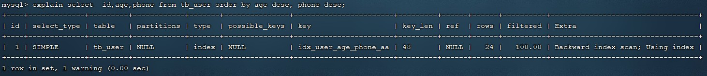
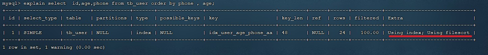
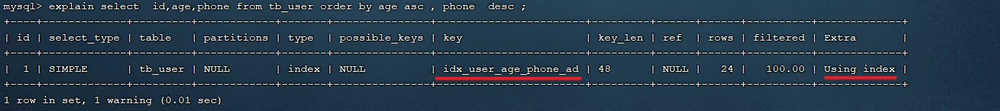
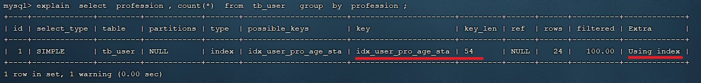

# 3. SQL优化

## 3.1 插入数据

### 3.1.1 insert

如果我们需要一次性往数据库表中插入多条记录，可以从以下三个方面进行优化。

```sql
insert into tb_test values(1,'tom');
insert into tb_test values(2,'cat');
insert into tb_test values(3,'jerry');
.....
```


#### 1). 优化方案一

批量插入数据

```sql
Insert into tb_test values(1,'Tom'),(2,'Cat'),(3,'Jerry');
```

#### 2). 优化方案二

手动控制事务

```sql
start transaction;
insert into tb_test values(1,'Tom'),(2,'Cat'),(3,'Jerry');
insert into tb_test values(4,'Tom'),(5,'Cat'),(6,'Jerry');
insert into tb_test values(7,'Tom'),(8,'Cat'),(9,'Jerry');
commit;
```


#### 3). 优化方案三

主键顺序插入，性能要高于乱序插入。

```sql
主键乱序插入 : 8 1 9 21 88 2 4 15 89 5 7 3
主键顺序插入 : 1 2 3 4 5 7 8 9 15 21 88 89
```


### 3.1.2 大批量插入数据

如果一次性需要插入大批量数据(比如: 几百万的记录)，使用insert语句插入性能较低，此时可以使 用MySQL数据库提供的load指令进行插入。操作如下：


可以执行如下指令，将数据脚本文件中的数据加载到表结构中：

```sql
-- 客户端连接服务端时，加上参数 -–local-infile
mysql –-local-infile -u root -p
-- 设置全局参数local_infile为1，开启从本地加载文件导入数据的开关
set global local_infile = 1;
-- 执行load指令将准备好的数据，加载到表结构中
load data local infile '/root/sql1.log' into table tb_user fields terminated by ',' lines terminated by '\n' ;
```

> 主键顺序插入性能高于乱序插入

#### 3.1.2.1 示例演示:

##### A. 创建表结构

```sql
CREATE TABLE `tb_user` (
    `id` INT(11) NOT NULL AUTO_INCREMENT,
    `username` VARCHAR(50) NOT NULL,
    `password` VARCHAR(50) NOT NULL,
    `name` VARCHAR(20) NOT NULL,
    `birthday` DATE DEFAULT NULL,
    `sex` CHAR(1) DEFAULT NULL,
    PRIMARY KEY (`id`),
    UNIQUE KEY `unique_user_username` (`username`)
) ENGINE=INNODB DEFAULT CHARSET=utf8 ;
```


##### B. 设置参数

```sql
-- 客户端连接服务端时，加上参数 -–local-infile
mysql –-local-infile -u root -p

-- 设置全局参数local_infile为1，开启从本地加载文件导入数据的开关
set global local_infile = 1;
```


##### C. load加载数据

```sql
load data local infile '/root/load_user_100w_sort.sql' into table tb_user fields terminated by ',' lines terminated by '\n' ;
```


我们看到，插入100w的记录，17s就完成了，性能很好。

> 在load时，主键顺序插入性能高于乱序插入

## 3.2 主键优化

在上一小节，我们提到，主键顺序插入的性能是要高于乱序插入的。 这一小节，就来介绍一下具体的原因，然后再分析一下主键又该如何设计。

### 3.2.1 数据组织方式 

在InnoDB存储引擎中，表数据都是根据主键顺序组织存放的，这种存储方式的表称为索引组织表(index organized table IOT)。


行数据，都是存储在聚集索引的叶子节点上的。而我们之前也讲解过InnoDB的逻辑结构图：


在InnoDB引擎中，数据行是记录在逻辑结构 page 页中的，而每一个页的大小是固定的，默认16K。 那也就意味着， 一个页中所存储的行也是有限的，如果插入的数据行row在该页存储不下，将会存储 到下一个页中，页与页之间会通过指针连接。

### 3.2.2 页分裂

页可以为空，也可以填充一半，也可以填充100%。每个页包含了2-N行数据(如果一行数据过大，会行溢出)，根据主键排列。

#### A. 主键顺序插入效果

①. 从磁盘中申请页， 主键顺序插入


②. 第一个页没有满，继续往第一页插入


③. 当第一个也写满之后，再写入第二个页，页与页之间会通过指针连接


④. 当第二页写满了，再往第三页写入


#### B. 主键乱序插入效果

①. 加入1#,2#页都已经写满了，存放了如图所示的数据


②. 此时再插入id为50的记录，我们来看看会发生什么现象 会再次开启一个页，写入新的页中吗？


不会。因为，索引结构的叶子节点是有顺序的。按照顺序，应该存储在47之后。


但是47所在的1#页，已经写满了，存储不了50对应的数据了。 那么此时会开辟一个新的页 3#。


但是并不会直接将50存入3#页，而是会将1#页后一半的数据，移动到3#页，然后在3#页，插入50。


移动数据，并插入id为50的数据之后，那么此时，这三个页之间的数据顺序是有问题的。 1#的下一个 页，应该是3#， 3#的下一个页是2#。 所以，此时，需要重新设置链表指针。


上述的这种现象，称之为 "页分裂"，是比较耗费性能的操作。

### 3.2.3 页合并

目前表中已有数据的索引结构(叶子节点)如下：


当我们对已有数据进行删除时，具体的效果如下:

当删除一行记录时，实际上记录并没有被物理删除，只是记录被标记（flaged）为删除并且它的空间变得允许被其他记录声明使用。


当我们继续删除2#的数据记录


当页中删除的记录达到 MERGE_THRESHOLD（默认为页的50%），InnoDB会开始寻找最靠近的页（前或后）看看是否可以将两个页合并以优化空间使用。


删除数据，并将页合并之后，再次插入新的数据21，则直接插入3#页


这个里面所发生的合并页的这个现象，就称之为 "页合并"。

> 知识小贴士：
> MERGE_THRESHOLD：合并页的阈值，可以自己设置，在创建表或者创建索引时指定。

### 3.2.4 索引设计原则

- 满足业务需求的情况下，尽量降低主键的长度。 
- 插入数据时，尽量选择顺序插入，选择使用AUTO_INCREMENT自增主键。

- 尽量不要使用UUID做主键或者是其他自然主键，如身份证号。

- 业务操作时，避免对主键的修改。


## 3.3 order by优化

MySQL的排序，有两种方式：

Using filesort : 通过表的索引或全表扫描，读取满足条件的数据行，然后在排序缓冲区sort buffer中完成排序操作，所有不是通过索引直接返回排序结果的排序都叫 FileSort 排序。

Using index : 通过有序索引顺序扫描直接返回有序数据，这种情况即为 using index，不需要额外排序，操作效率高。

对于以上的两种排序方式，Using index的性能高，而Using filesort的性能低，我们在优化排序操作时，尽量要优化为 Using index。

接下来，我们来做一个测试：

### 3.3.1 数据准备 

把之前测试时，为tb_user表所建立的部分索引直接删除掉

```sql
drop index idx_user_phone on tb_user;
drop index idx_user_phone_name on tb_user;
drop index idx_user_name on tb_user;
```


### 3.3.2 执行排序SQL

```sql
explain select id,age,phone from tb_user order by age ;
```


```sql
explain select id,age,phone from tb_user order by age, phone ;
```


由于 age, phone 都没有索引，所以此时再排序时，出现Using filesort， 排序性能较低。

### 3.3.3 创建索引

```sql
-- 创建索引
create index idx_user_age_phone_aa on tb_user(age,phone);
```


### 3.3.4 创建索引后，根据age, phone进行升序排序

```sql
explain select id,age,phone from tb_user order by age;
```


```sql
explain select id,age,phone from tb_user order by age, phone;
```


建立索引之后，再次进行排序查询，就由原来的Using filesort， 变为了 Using index，性能就是比较高的了。

### 3.3.5 创建索引后，根据age, phone进行降序排序

```sql
explain select id, age, phone from tb_user order by age desc, phone desc;
```



也出现 Using index， 但是此时Extra中出现了 `Backward index scan`，这个**代表反向扫描索引**，因为在MySQL中我们创建的索引，默认索引的叶子节点是从小到大排序的，而此时我们查询排序时，是从大到小，所以，在扫描时，就是反向扫描，就会出现 `Backward index scan`。 在 MySQL8版本中，支持降序索引，我们也可以创建降序索引。

### 3.3.6 根据phone，age进行升序排序，phone在前，age在后。



排序时,也需要满足最左前缀法则,否则也会出现 filesort。因为在创建索引的时候， age是第一个字段，phone是第二个字段，所以排序时，也就该按照这个顺序来，否则就会出现 Using filesort。

### 3.3.7 根据age, phone进行降序一个升序，一个降序

```sql
explain select id,age,phone from tb_user order by age asc , phone desc ;
```


因为创建索引时，如果未指定顺序，默认都是按照升序排序的，而查询时，一个升序，一个降序，此时就会出现Using filesort。


为了解决上述的问题，我们可以创建一个索引，这个联合索引中 age 升序排序，phone 倒序排序。

### 3.3.8 创建联合索引(age 升序排序，phone 倒序排序)

```sql
create index idx_user_age_phone_ad on tb_user(age asc ,phone desc);
```


### 3.3.9 然后再次执行如下SQL

```sql
explain select id,age,phone from tb_user order by age asc , phone desc ;
```



升序/降序联合索引结构图示:


### 3.3.10 order by 优化原则

由上述的测试,我们得出order by优化原则:

A. 根据排序字段建立合适的索引，多字段排序时，也遵循最左前缀法则。

B. 尽量使用覆盖索引。

C. 多字段排序, 一个升序一个降序，此时需要注意联合索引在创建时的规则（ASC/DESC）。

D. 如果不可避免的出现filesort，大数据量排序时，可以适当增大排序缓冲区大小sort_buffer_size(默认256k)。

## 3.4 group by优化

分组操作，我们主要来看看索引对于分组操作的影响。

首先我们先将 tb_user 表的索引全部删除掉 。

```sql
drop index idx_user_pro_age_sta on tb_user;
drop index idx_email_5 on tb_user;
drop index idx_user_age_phone_aa on tb_user;
drop index idx_user_age_phone_ad on tb_user;
```


接下来，在没有索引的情况下，执行如下SQL，查询执行计划：

```sql
explain select profession , count(*) from tb_user group by profession ;
```


然后，我们在针对于 profession ， age， status 创建一个联合索引。

```sql
create index idx_user_pro_age_sta on tb_user(profession, age , status);
```

紧接着，再执行前面相同的SQL查看执行计划。

```sql
explain select profession , count(*) from tb_user group by profession ;
```



再执行如下的分组查询SQL，查看执行计划：

```sql
EXPLAIN SELECT profession, count(*) FROM tb_user group by profession, age;
```


```sql
explain select age, count(*) from tb_user group by age;
```


我们发现，如果仅仅根据age分组，就会出现 Using temporary ；而如果是 根据 profession,age两个字段同时分组，则不会出现 Using temporary。原因是因为对于分组操作， 在联合索引中，也是符合最左前缀法则的。

### 3.4.1 group by 优化总结

所以，在分组操作中，我们需要通过以下两点进行优化，以提升性能：

A. 在分组操作时，可以通过索引来提高效率。

B. 分组操作时，索引的使用也是满足最左前缀法则的。

## 3.5 limit优化

在数据量比较大时，如果进行limit分页查询，在查询时，越往后，分页查询效率越低。

我们一起来看看执行limit分页查询耗时对比：


通过测试我们会看到，越往后，分页查询效率越低，这就是分页查询的问题所在。

因为，当在进行分页查询时，如果执行 limit 2000000,10 ，此时需要MySQL排序前2000010 记 录，仅仅返回 2000000 - 2000010 的记录，其他记录丢弃，查询排序的代价非常大 。

优化思路: 一般分页查询时，通过创建 覆盖索引 能够比较好地提高性能，可以通过覆盖索引加子查询形式进行优化。

```sql
explain select * from tb_sku t , (select id from tb_sku order by id limit 2000000,10) a where t.id = a.id;
```


## 3.6 count优化

### 3.6.1 概述

```sql
select count(*) from tb_user;
```

在之前的测试中，我们发现，如果数据量很大，在执行count操作时，是非常耗时的。

- MyISAM 引擎把一个表的总行数存在了磁盘上，因此执行 `count(*)` 的时候会直接返回这个数，效率很高； 但是如果是带条件的count，MyISAM也慢。

- InnoDB 引擎就麻烦了，它执行 `count(*)` 的时候，需要把数据一行一行地从引擎里面读出来，然后累积计数。

如果说要大幅度提升InnoDB表的count效率，主要的优化思路：自己计数(可以借助于redis这样的数据库进行,但是如果是带条件的count又比较麻烦了)。

### 3.6.2 count用法

count() 是一个聚合函数，对于返回的结果集，一行行地判断，如果 count 函数的参数不是NULL，累计值就加 1，否则不加，最后返回累计值。 

用法：count（*）、count（主键）、count（字段）、count（数字）

| **count用法** | **含义**                                                     |
| :------------ | ------------------------------------------------------------ |
| count(主键)   | InnoDB 引擎会遍历整张表，把每一行的 主键id 值都取出来，返回给服务层。 服务层拿到主键后，直接按行进行累加(主键不可能为null) |
| count(字段)   | 没有not null 约束 : InnoDB 引擎会遍历整张表把每一行的字段值都取出 来，返回给服务层，服务层判断是否为null，不为null，计数累加。  有not null 约束：InnoDB 引擎会遍历整张表把每一行的字段值都取出来，返 回给服务层，直接按行进行累加。 |
| count(数字)   | InnoDB 引擎遍历整张表，但不取值。服务层对于返回的每一行，放一个数字“1” 进去，直接按行进行累加。 |
| count(*)      | InnoDB引擎并不会把全部字段取出来，而是专门做了优化，不取值，服务层直接 按行进行累加。 |

> 按照效率排序的话，`count(字段) < count(主键 id) < count(1) ≈ count(*)`，所以尽量使用 count(*)。

## 3.7 update优化

我们主要需要注意一下update语句执行时的注意事项。

```sql
update course set name = 'javaEE' where id = 1 ;
```

当我们在执行这条SQL语句时，会锁定id为1这一行的数据，然后事务提交之后，行锁释放。

> id是主键，是聚簇索引，所以会将行锁

但是当我们在执行如下SQL时。

```sql
update course set name = 'SpringBoot' where name = 'PHP' ;
```

当我们开启多个事务，在执行上述的SQL时，我们发现行锁升级为了表锁。 导致该update语句的性能大大降低。

> 那么字段是普通字段，没有加索引，所以对其进行更新时会加表锁，而不是行锁

> InnoDB的行锁是针对索引加的锁，不是针对记录加的锁 ,并且该索引不能失效，否则会从行锁升级为表锁 。