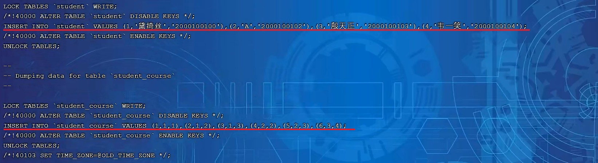

# 7 MySQL管理

## 7.1 系统数据库

Mysql数据库安装完成后，自带了一下四个数据库，具体作用如下：

| **数据库**         | **含义**                                                     |
| ------------------ | ------------------------------------------------------------ |
| mysql              | 存储MySQL服务器正常运行所需要的各种信息 （时区、主从、用 户、权限等） |
| information_schema | 提供了访问数据库元数据的各种表和视图，包含数据库、表、字段类 型及访问权限等 |
| performance_schema | 为MySQL服务器运行时状态提供了一个底层监控功能，主要用于收集 数据库服务器性能参数 |
| sys                | 包含了一系列方便 DBA 和开发人员利用 performance_schema  性能数据库进行性能调优和诊断的视图 |

## 7.2 常用工具

### 7.2.1 mysql

该mysql不是指mysql服务，而是指mysql的客户端工具。

```sql
语法 ：
	mysql [options] [database]

选项 ：
    -u, --user=name #指定用户名
    -p, --password[=name] #指定密码
    -h, --host=name #指定服务器IP或域名
    -P, --port=port #指定连接端口
    -e, --execute=name #执行SQL语句并退出
```

-e选项可以在Mysql客户端执行SQL语句，而不用连接到MySQL数据库再执行，对于一些批处理脚本，这种方式尤其方便。

示例：

```shell
mysql -h192.168.200.202 -P3306 -uroot -p1234 itcast -e "select * from stu"
```


### 7.2.2 mysqladmin

mysqladmin 是一个执行管理操作的客户端程序。可以用它来检查服务器的配置和当前状态、创建并删除数据库等。

> 通过帮助文档查看选项：
> mysqladmin --help


#### 7.2.2.1 完整信息

```shell
root@2e14de596b72:/# mysqladmin --help
mysqladmin  Ver 8.0.29 for Linux on x86_64 (MySQL Community Server - GPL)
Copyright (c) 2000, 2022, Oracle and/or its affiliates.

Oracle is a registered trademark of Oracle Corporation and/or its
affiliates. Other names may be trademarks of their respective
owners.

Administration program for the mysqld daemon.
Usage: mysqladmin [OPTIONS] command command....
  --bind-address=name IP address to bind to.
  -c, --count=#       Number of iterations to make. This works with -i
                      (--sleep) only.
  -#, --debug[=#]     This is a non-debug version. Catch this and exit.
  --debug-check       This is a non-debug version. Catch this and exit.
  --debug-info        This is a non-debug version. Catch this and exit.
  -f, --force         Don't ask for confirmation on drop database; with
                      multiple commands, continue even if an error occurs.
  -C, --compress      Use compression in server/client protocol.
  --character-sets-dir=name
                      Directory for character set files.
  --default-character-set=name
                      Set the default character set.
  -?, --help          Display this help and exit.
  -h, --host=name     Connect to host.
  -b, --no-beep       Turn off beep on error.
  -p, --password[=name]
                      Password to use when connecting to server. If password is
                      not given it's asked from the tty.
  -,, --password1[=name]
                      Password for first factor authentication plugin.
  -,, --password2[=name]
                      Password for second factor authentication plugin.
  -,, --password3[=name]
                      Password for third factor authentication plugin.
  -P, --port=#        Port number to use for connection or 0 for default to, in
                      order of preference, my.cnf, $MYSQL_TCP_PORT,
                      /etc/services, built-in default (3306).
  --protocol=name     The protocol to use for connection (tcp, socket, pipe,
                      memory).
  -r, --relative      Show difference between current and previous values when
                      used with -i. Currently only works with extended-status.
  -s, --silent        Silently exit if one can't connect to server.
  -S, --socket=name   The socket file to use for connection.
  -i, --sleep=#       Execute commands repeatedly with a sleep between.
  --ssl-mode=name     SSL connection mode.
  --ssl-ca=name       CA file in PEM format.
  --ssl-capath=name   CA directory.
  --ssl-cert=name     X509 cert in PEM format.
  --ssl-cipher=name   SSL cipher to use.
  --ssl-key=name      X509 key in PEM format.
  --ssl-crl=name      Certificate revocation list.
  --ssl-crlpath=name  Certificate revocation list path.
  --tls-version=name  TLS version to use, permitted values are: TLSv1.2,
                      TLSv1.3
  --ssl-fips-mode=name
                      SSL FIPS mode (applies only for OpenSSL); permitted
                      values are: OFF, ON, STRICT
  --tls-ciphersuites=name
                      TLS v1.3 cipher to use.
  --ssl-session-data=name
                      Session data file to use to enable ssl session reuse
  --ssl-session-data-continue-on-failed-reuse
                      If set to ON, this option will allow connection to
                      succeed even if session data cannot be reused.
  --server-public-key-path=name
                      File path to the server public RSA key in PEM format.
  --get-server-public-key
                      Get server public key
  -u, --user=name     User for login if not current user.
  -v, --verbose       Write more information.
  -V, --version       Output version information and exit.
  -E, --vertical      Print output vertically. Is similar to --relative, but
                      prints output vertically.
  -w, --wait[=#]      Wait and retry if connection is down.
  --connect-timeout=#
  --shutdown-timeout=#
  --plugin-dir=name   Directory for client-side plugins.
  --default-auth=name Default authentication client-side plugin to use.
  --enable-cleartext-plugin
                      Enable/disable the clear text authentication plugin.
  --show-warnings     Show warnings after execution
  --compression-algorithms=name
                      Use compression algorithm in server/client protocol.
                      Valid values are any combination of
                      'zstd','zlib','uncompressed'.
  --zstd-compression-level=#
                      Use this compression level in the client/server protocol,
                      in case --compression-algorithms=zstd. Valid range is
                      between 1 and 22, inclusive. Default is 3.

Variables (--variable-name=value)
and boolean options {FALSE|TRUE}          Value (after reading options)
----------------------------------------- --------------------------------
bind-address                              (No default value)
count                                     0
force                                     FALSE
compress                                  FALSE
character-sets-dir                        (No default value)
default-character-set                     auto
host                                      (No default value)
no-beep                                   FALSE
port                                      0
relative                                  FALSE
socket                                    (No default value)
sleep                                     0
ssl-ca                                    (No default value)
ssl-capath                                (No default value)
ssl-cert                                  (No default value)
ssl-cipher                                (No default value)
ssl-key                                   (No default value)
ssl-crl                                   (No default value)
ssl-crlpath                               (No default value)
tls-version                               (No default value)
tls-ciphersuites                          (No default value)
ssl-session-data                          (No default value)
ssl-session-data-continue-on-failed-reuse FALSE
server-public-key-path                    (No default value)
get-server-public-key                     FALSE
user                                      (No default value)
verbose                                   FALSE
vertical                                  FALSE
connect-timeout                           43200
shutdown-timeout                          3600
plugin-dir                                (No default value)
default-auth                              (No default value)
enable-cleartext-plugin                   FALSE
show-warnings                             FALSE
compression-algorithms                    (No default value)
zstd-compression-level                    3

Default options are read from the following files in the given order:
/etc/my.cnf /etc/mysql/my.cnf ~/.my.cnf
The following groups are read: mysqladmin client
The following options may be given as the first argument:
--print-defaults        Print the program argument list and exit.
--no-defaults           Don't read default options from any option file,
                        except for login file.
--defaults-file=#       Only read default options from the given file #.
--defaults-extra-file=# Read this file after the global files are read.
--defaults-group-suffix=#
                        Also read groups with concat(group, suffix)
--login-path=#          Read this path from the login file.

Where command is a one or more of: (Commands may be shortened)
  create databasename   Create a new database
  debug                 Instruct server to write debug information to log
  drop databasename     Delete a database and all its tables
  extended-status       Gives an extended status message from the server
  flush-hosts           Flush all cached hosts
  flush-logs            Flush all logs
  flush-status          Clear status variables
  flush-tables          Flush all tables
  flush-threads         Flush the thread cache
  flush-privileges      Reload grant tables (same as reload)
  kill id,id,...        Kill mysql threads
  password [new-password] Change old password to new-password in current format
  ping                  Check if mysqld is alive
  processlist           Show list of active threads in server
  reload                Reload grant tables
  refresh               Flush all tables and close and open logfiles
  shutdown              Take server down
  status                Gives a short status message from the server
  start-replica         Start replication
  start-slave           Deprecated: use start-replica instead
  stop-replica          Stop replication
  stop-slave            Deprecated: use stop-replica instead
  variables             Prints variables available
  version               Get version info from server

```

#### 7.2.2.2 语法

```sql
语法:
	mysqladmin [options] command ...
选项:
    -u, --user=name #指定用户名
    -p, --password[=name] #指定密码
    -h, --host=name #指定服务器IP或域名
    -P, --port=port #指定连接端口
```


示例：

```sql
mysqladmin -uroot –p1234 drop 'test01';
mysqladmin -uroot –p1234 version;
```


### 7.2.3 mysqlbinlog

由于服务器生成的二进制日志文件以二进制格式保存，所以如果想要检查这些文本的文本格式，就会使用到mysqlbinlog 日志管理工具。

```
语法 ：
	mysqlbinlog [options] log-files1 log-files2 ...
	
选项 ：
    -d, --database=name 							指定数据库名称，只列出指定的数据库相关操作。
    -o, --offset=#      							忽略掉日志中的前n行命令。
    -r,--result-file=name 							将输出的文本格式日志输出到指定文件。
    -s, --short-form 								显示简单格式， 省略掉一些信息。
    --start-datatime=date1 --stop-datetime=date2 	指定日期间隔内的所有日志。
    --start-position=pos1 --stop-position=pos2 		指定位置间隔内的所有日志。
```


#### 7.2.3.1 示例:

##### A. 查看 binlog.000008这个二进制文件中的数据信息

```shell
mysqlbinlog binlog.000008
```


上述查看到的二进制日志文件数据信息量太多了，不方便查询。 我们可以加上一个参数 -s 来显示简 单格式。

```shell
mysqlbinlog -s binlog.000008
```


### 7.2.4 mysqlshow

mysqlshow 客户端对象查找工具，用来很快地查找存在哪些数据库、数据库中的表、表中的列或者索引。

```shell
语法 ：
	mysqlshow [options] [db_name [table_name [col_name]]]

选项 ：
    --count 显示数据库及表的统计信息（数据库，表 均可以不指定）
    -i 显示指定数据库或者指定表的状态信息

示例：
    #查询test库中每个表中的字段书，及行数
    mysqlshow -uroot -p2143 test --count
    #查询test库中book表的详细情况
    mysqlshow -uroot -p2143 test book --count
```


#### 7.2.4.1 示例：

##### A. 查询每个数据库的表的数量及表中记录的数量

```shell
mysqlshow -uroot -p1234 --count
```


##### B. 查看数据库db01的统计信息

```shell
mysqlshow -uroot -p1234 db01 --count
```


##### C. 查看数据库db01中的course表的信息

```sql
mysqlshow -uroot -p1234 db01 course --count
```


##### D. 查看数据库db01中的course表的id字段的信息

```sql
mysqlshow -uroot -p1234 db01 course id --count
```


### 7.2.5 mysqldump

mysqldump 客户端工具用来备份数据库或在不同数据库之间进行数据迁移。备份内容包含创建表，及插入表的SQL语句。

```sql
语法 ：
    mysqldump [options] db_name [tables]
    mysqldump [options] --database/-B db1 [db2 db3...]
    mysqldump [options] --all-databases/-A

连接选项 ：
    -u, --user=name 		指定用户名
    -p, --password[=name] 	指定密码
    -h, --host=name 		指定服务器ip或域名
    -P, --port=# 			指定连接端口

输出选项：
--add-drop-database 在每个数据库创建语句前加上 drop database 语句
--add-drop-table 在每个表创建语句前加上 drop table 语句 , 默认开启 ; 不开启 (--skip-add-drop-table)
-n, --no-create-db 不包含数据库的创建语句
-t, --no-create-info 不包含数据表的创建语句
-d --no-data 不包含数据
-T, --tab=name 自动生成两个文件：一个.sql文件，创建表结构的语句；一个.txt文件，数据文件

```


#### 7.2.5.1 示例:

##### A. 备份db01数据库

```sql
mysqldump -uroot -p1234 db01 > db01.sql
```


可以直接打开db01.sql，来查看备份出来的数据到底什么样。


```sql
-- MySQL dump 10.13  Distrib 8.0.29, for Linux (x86_64)
--
-- Host: localhost    Database: db01
-- ------------------------------------------------------
-- Server version       8.0.29

/*!40101 SET @OLD_CHARACTER_SET_CLIENT=@@CHARACTER_SET_CLIENT */;
/*!40101 SET @OLD_CHARACTER_SET_RESULTS=@@CHARACTER_SET_RESULTS */;
/*!40101 SET @OLD_COLLATION_CONNECTION=@@COLLATION_CONNECTION */;
/*!50503 SET NAMES utf8mb4 */;
/*!40103 SET @OLD_TIME_ZONE=@@TIME_ZONE */;
/*!40103 SET TIME_ZONE='+00:00' */;
/*!40014 SET @OLD_UNIQUE_CHECKS=@@UNIQUE_CHECKS, UNIQUE_CHECKS=0 */;
/*!40014 SET @OLD_FOREIGN_KEY_CHECKS=@@FOREIGN_KEY_CHECKS, FOREIGN_KEY_CHECKS=0 */;
/*!40101 SET @OLD_SQL_MODE=@@SQL_MODE, SQL_MODE='NO_AUTO_VALUE_ON_ZERO' */;
/*!40111 SET @OLD_SQL_NOTES=@@SQL_NOTES, SQL_NOTES=0 */;

--
-- Table structure for table `employee`
--

DROP TABLE IF EXISTS `employee`;
/*!40101 SET @saved_cs_client     = @@character_set_client */;
/*!50503 SET character_set_client = utf8mb4 */;
CREATE TABLE `employee` (
  `id` int DEFAULT NULL,
  `name` varchar(100) DEFAULT NULL
) ENGINE=InnoDB DEFAULT CHARSET=utf8mb4 COLLATE=utf8mb4_0900_ai_ci;
/*!40101 SET character_set_client = @saved_cs_client */;

--
-- Dumping data for table `employee`
--

LOCK TABLES `employee` WRITE;
/*!40000 ALTER TABLE `employee` DISABLE KEYS */;
/*!40000 ALTER TABLE `employee` ENABLE KEYS */;
UNLOCK TABLES;

--
-- Table structure for table `stu`
--

DROP TABLE IF EXISTS `stu`;
/*!40101 SET @saved_cs_client     = @@character_set_client */;
/*!50503 SET character_set_client = utf8mb4 */;
CREATE TABLE `stu` (
  `id` int NOT NULL AUTO_INCREMENT,
  `name` varchar(255) DEFAULT NULL,
  `age` int NOT NULL,
  PRIMARY KEY (`id`),
  KEY `idx_stu_name` (`name`),
  KEY `idx_stu_age` (`age`)
) ENGINE=InnoDB AUTO_INCREMENT=26 DEFAULT CHARSET=utf8mb4 COLLATE=utf8mb4_0900_ai_ci;
/*!40101 SET character_set_client = @saved_cs_client */;

--
-- Dumping data for table `stu`
--

LOCK TABLES `stu` WRITE;
/*!40000 ALTER TABLE `stu` DISABLE KEYS */;
INSERT INTO `stu` VALUES (1,'Java',1),(3,'cat',3),(7,'mayun',7),(8,'rose',8),(11,'jetty',11),(19,'lily',19),(25,'luci',25);
/*!40000 ALTER TABLE `stu` ENABLE KEYS */;
UNLOCK TABLES;

--
-- Table structure for table `tb_user`
--

DROP TABLE IF EXISTS `tb_user`;
/*!40101 SET @saved_cs_client     = @@character_set_client */;
/*!50503 SET character_set_client = utf8mb4 */;
CREATE TABLE `tb_user` (
  `id` int NOT NULL AUTO_INCREMENT COMMENT '主键',
  `name` varchar(50) NOT NULL COMMENT '用户名',
  `phone` varchar(11) NOT NULL COMMENT '手机号',
  `email` varchar(100) DEFAULT NULL COMMENT '邮箱',
  `profession` varchar(11) DEFAULT NULL COMMENT '专业',
  `age` tinyint unsigned DEFAULT NULL COMMENT '年龄',
  `gender` char(1) DEFAULT NULL COMMENT '性别 , 1: 男, 2: 女',
  `status` char(1) DEFAULT NULL COMMENT '状态',
  `createtime` datetime DEFAULT NULL COMMENT '创建时间',
  PRIMARY KEY (`id`),
  KEY `idx_user_pro_age_sta` (`profession`,`age`,`status`)
) ENGINE=InnoDB AUTO_INCREMENT=27 DEFAULT CHARSET=utf8mb4 COLLATE=utf8mb4_0900_ai_ci COMMENT='系统用户表';
/*!40101 SET character_set_client = @saved_cs_client */;

--
-- Dumping data for table `tb_user`
--

LOCK TABLES `tb_user` WRITE;
/*!40000 ALTER TABLE `tb_user` DISABLE KEYS */;
INSERT INTO `tb_user` VALUES (1,'吕布','17799990000','lvbu666@163.com','软件工程',33,'1','6','2001-02-02 00:00:00'),(2,'曹操','17799990001','caocao666@qq.com','通讯工程',34,'1','0','2001-03-05 00:00:00'),(3,'赵云','17799990002','17799990@139.com','英语',47,'1','2','2002-03-02 00:00:00'),(4,'孙悟空','17799990003','17799990@sina.com','工程造价',50,'1','0','2001-07-02 00:00:00'),(5,'花木兰','17799990004','19980729@sina.com','软件工程',23,'2','1','2001-04-22 00:00:00'),(6,'大乔','17799990005','daqiao666@sina.com','舞蹈',22,'2','0','2001-02-07 00:00:00'),(7,'露娜','17799990006','luna_love@sina.com','应用数学',24,'2','0','2001-02-08 00:00:00'),(8,'程咬金','17799990007','chengyaojin@163.com','化工',38,'1','5','2001-05-23 00:00:00'),(9,'项羽','17799990008','xiaoyu666@qq.com','金属材料',43,'1','0','2001-09-18 00:00:00'),(10,'白起','17799990009','baiqi666@sina.com','机械工程及其自动\r\n化',27,'1','2','2001-08-16 00:00:00'),(11,'韩信','17799990010','hanxin520@163.com','无机非金属材料工\r\n程',27,'1','0','2001-06-12 00:00:00'),(12,'荆轲','17799990011','jingke123@163.com','会计',29,'1','0','2001-05-11 00:00:00'),(13,'兰陵王','17799990012','lanlinwang666@126.com','工程造价',44,'1','1','2001-04-09 00:00:00'),(14,'狂铁','17799990013','kuangtie@sina.com','应用数学',43,'1','2','2001-04-10 00:00:00'),(15,'貂蝉','17799990014','84958948374@qq.com','软件工程',40,'2','3','2001-02-12 00:00:00'),(16,'妲己','17799990015','2783238293@qq.com','软件工程',31,'2','0','2001-01-30 00:00:00'),(17,'芈月','17799990016','xiaomin2001@sina.com','工业经济',35,'2','0','2000-05-03 00:00:00'),(18,'嬴政','17799990017','8839434342@qq.com','化工',38,'1','1','2001-08-08 00:00:00'),(19,'狄仁杰','17799990018','jujiamlm8166@163.com','国际贸易',30,'1','0','2007-03-12 00:00:00'),(20,'安琪拉','17799990019','jdodm1h@126.com','城市规划',51,'2','0','2001-08-15 00:00:00'),(21,'典韦','17799990020','ycaunanjian@163.com','城市规划',52,'1','2','2000-04-12 00:00:00'),(22,'廉颇','17799990021','lianpo321@126.com','土木工程',19,'1','3','2002-07-18 00:00:00'),(23,'后羿','17799990022','altycj2000@139.com','城市园林',20,'1','0','2002-03-10 00:00:00'),(24,'姜子牙','17799990023','37483844@qq.com','工程造价',29,'1','4','2003-05-26 00:00:00'),(26,'三皇子','18809091212','erhuangzi@163.com','软件工程',23,'1','1','2022-10-12 11:21:05');
/*!40000 ALTER TABLE `tb_user` ENABLE KEYS */;
UNLOCK TABLES;
/*!40103 SET TIME_ZONE=@OLD_TIME_ZONE */;

/*!40101 SET SQL_MODE=@OLD_SQL_MODE */;
/*!40014 SET FOREIGN_KEY_CHECKS=@OLD_FOREIGN_KEY_CHECKS */;
/*!40014 SET UNIQUE_CHECKS=@OLD_UNIQUE_CHECKS */;
/*!40101 SET CHARACTER_SET_CLIENT=@OLD_CHARACTER_SET_CLIENT */;
/*!40101 SET CHARACTER_SET_RESULTS=@OLD_CHARACTER_SET_RESULTS */;
/*!40101 SET COLLATION_CONNECTION=@OLD_COLLATION_CONNECTION */;
/*!40111 SET SQL_NOTES=@OLD_SQL_NOTES */;

-- Dump completed on 2022-10-12 21:45:36

```

备份出来的数据包含：

- 删除表的语句
- 创建表的语句
- 数据插入语句

如果我们在数据备份时，不需要创建表，或者不需要备份数据，只需要备份表结构，都可以通过对应的 参数来实现。

B. 备份db01数据库中的表数据，不备份表结构(-t) 

```sql
mysqldump -uroot -p1234 -t db01 > db01.sql
```


打开 db02.sql ，来查看备份的数据，只有insert语句，没有备份表结构。



```sql
-- MySQL dump 10.13  Distrib 8.0.29, for Linux (x86_64)
--
-- Host: localhost    Database: db01
-- ------------------------------------------------------
-- Server version       8.0.29

/*!40101 SET @OLD_CHARACTER_SET_CLIENT=@@CHARACTER_SET_CLIENT */;
/*!40101 SET @OLD_CHARACTER_SET_RESULTS=@@CHARACTER_SET_RESULTS */;
/*!40101 SET @OLD_COLLATION_CONNECTION=@@COLLATION_CONNECTION */;
/*!50503 SET NAMES utf8mb4 */;
/*!40103 SET @OLD_TIME_ZONE=@@TIME_ZONE */;
/*!40103 SET TIME_ZONE='+00:00' */;
/*!40014 SET @OLD_UNIQUE_CHECKS=@@UNIQUE_CHECKS, UNIQUE_CHECKS=0 */;
/*!40014 SET @OLD_FOREIGN_KEY_CHECKS=@@FOREIGN_KEY_CHECKS, FOREIGN_KEY_CHECKS=0 */;
/*!40101 SET @OLD_SQL_MODE=@@SQL_MODE, SQL_MODE='NO_AUTO_VALUE_ON_ZERO' */;
/*!40111 SET @OLD_SQL_NOTES=@@SQL_NOTES, SQL_NOTES=0 */;

--
-- Dumping data for table `employee`
--

LOCK TABLES `employee` WRITE;
/*!40000 ALTER TABLE `employee` DISABLE KEYS */;
/*!40000 ALTER TABLE `employee` ENABLE KEYS */;
UNLOCK TABLES;

--
-- Dumping data for table `stu`
--

LOCK TABLES `stu` WRITE;
/*!40000 ALTER TABLE `stu` DISABLE KEYS */;
INSERT INTO `stu` VALUES (1,'Java',1),(3,'cat',3),(7,'mayun',7),(8,'rose',8),(11,'jetty',11),(19,'lily',19),(25,'luci',25);
/*!40000 ALTER TABLE `stu` ENABLE KEYS */;
UNLOCK TABLES;

--
-- Dumping data for table `tb_user`
--

LOCK TABLES `tb_user` WRITE;
/*!40000 ALTER TABLE `tb_user` DISABLE KEYS */;
INSERT INTO `tb_user` VALUES (1,'吕布','17799990000','lvbu666@163.com','软件工程',33,'1','6','2001-02-02 00:00:00'),(2,'曹操','17799990001','caocao666@qq.com','通讯工程',34,'1','0','2001-03-05 00:00:00'),(3,'赵云','17799990002','17799990@139.com','英语',47,'1','2','2002-03-02 00:00:00'),(4,'孙悟空','17799990003','17799990@sina.com','工程造价',50,'1','0','2001-07-02 00:00:00'),(5,'花木兰','17799990004','19980729@sina.com','软件工程',23,'2','1','2001-04-22 00:00:00'),(6,'大乔','17799990005','daqiao666@sina.com','舞蹈',22,'2','0','2001-02-07 00:00:00'),(7,'露娜','17799990006','luna_love@sina.com','应用数学',24,'2','0','2001-02-08 00:00:00'),(8,'程咬金','17799990007','chengyaojin@163.com','化工',38,'1','5','2001-05-23 00:00:00'),(9,'项羽','17799990008','xiaoyu666@qq.com','金属材料',43,'1','0','2001-09-18 00:00:00'),(10,'白起','17799990009','baiqi666@sina.com','机械工程及其自动\r\n化',27,'1','2','2001-08-16 00:00:00'),(11,'韩信','17799990010','hanxin520@163.com','无机非金属材料工\r\n程',27,'1','0','2001-06-12 00:00:00'),(12,'荆轲','17799990011','jingke123@163.com','会计',29,'1','0','2001-05-11 00:00:00'),(13,'兰陵王','17799990012','lanlinwang666@126.com','工程造价',44,'1','1','2001-04-09 00:00:00'),(14,'狂铁','17799990013','kuangtie@sina.com','应用数学',43,'1','2','2001-04-10 00:00:00'),(15,'貂蝉','17799990014','84958948374@qq.com','软件工程',40,'2','3','2001-02-12 00:00:00'),(16,'妲己','17799990015','2783238293@qq.com','软件工程',31,'2','0','2001-01-30 00:00:00'),(17,'芈月','17799990016','xiaomin2001@sina.com','工业经济',35,'2','0','2000-05-03 00:00:00'),(18,'嬴政','17799990017','8839434342@qq.com','化工',38,'1','1','2001-08-08 00:00:00'),(19,'狄仁杰','17799990018','jujiamlm8166@163.com','国际贸易',30,'1','0','2007-03-12 00:00:00'),(20,'安琪拉','17799990019','jdodm1h@126.com','城市规划',51,'2','0','2001-08-15 00:00:00'),(21,'典韦','17799990020','ycaunanjian@163.com','城市规划',52,'1','2','2000-04-12 00:00:00'),(22,'廉颇','17799990021','lianpo321@126.com','土木工程',19,'1','3','2002-07-18 00:00:00'),(23,'后羿','17799990022','altycj2000@139.com','城市园林',20,'1','0','2002-03-10 00:00:00'),(24,'姜子牙','17799990023','37483844@qq.com','工程造价',29,'1','4','2003-05-26 00:00:00'),(26,'三皇子','18809091212','erhuangzi@163.com','软件工程',23,'1','1','2022-10-12 11:21:05');
/*!40000 ALTER TABLE `tb_user` ENABLE KEYS */;
UNLOCK TABLES;
/*!40103 SET TIME_ZONE=@OLD_TIME_ZONE */;

/*!40101 SET SQL_MODE=@OLD_SQL_MODE */;
/*!40014 SET FOREIGN_KEY_CHECKS=@OLD_FOREIGN_KEY_CHECKS */;
/*!40014 SET UNIQUE_CHECKS=@OLD_UNIQUE_CHECKS */;
/*!40101 SET CHARACTER_SET_CLIENT=@OLD_CHARACTER_SET_CLIENT */;
/*!40101 SET CHARACTER_SET_RESULTS=@OLD_CHARACTER_SET_RESULTS */;
/*!40101 SET COLLATION_CONNECTION=@OLD_COLLATION_CONNECTION */;
/*!40111 SET SQL_NOTES=@OLD_SQL_NOTES */;

-- Dump completed on 2022-10-12 21:48:11

```

#### C. 将db01数据库的表的表结构与数据分开备份(-T)

```sql
mysqldump -uroot -p1234 -T /root db01 score
```


执行上述指令，会出错，数据不能完成备份，原因是因为我们所指定的数据存放目录/root，MySQL认为是不安全的，需要存储在MySQL信任的目录下。那么，哪个目录才是MySQL信任的目录呢，可以查看 一下系统变量 secure_file_priv 。执行结果如下：

```sql
 show variables like '%secure_file_priv%';
```


上述的两个文件 score.sql 中记录的就是表结构文件，而 score.txt 就是表数据文件，但是需 要注意表数据文件，并不是记录一条条的insert语句，而是按照一定的格式记录表结构中的数据。如 下：


### 7.2.6 mysqlimport/source

#### 7.2.6.1 mysqlimport

mysqlimport 是客户端数据导入工具，用来导入mysqldump 加 -T 参数后导出的文本文件。

```shell
语法 ：
	mysqlimport [options] db_name textfile1 [textfile2...]

示例 ：
	mysqlimport -uroot -p2143 test /tmp/city.txt
```


#### 7.2.6.2 source

如果需要导入sql文件,可以使用mysql中的source 指令 :

```sql
语法 ：
	source /root/xxxxx.sql
```

