# 二、Redis7-高级篇

## 1 Redis单线程 VS 多线程

### 1.1 从几道简单的面试题说起

- **Redis到底是单线程还是多线程？**
- **IO多路复用听说过吗？**
- **Redis为什么这么快？**

### 1.2 为什么Redis在4.0版本之前都是单线程

#### 1.2.1 是什么？

这种问法其实并不严谨，为啥这么说呢?

> Redis的版本很多3.x、4.x、6.x，版本不同架构也是不同的，不限定版本问是否单线程也不太严谨。
>
> 1 版本3.x ，最早版本，也就是大家口口相传的redis是单线程，阳哥2016年讲解的redis就是3.X的版本。 
>
> 2 版本4.x，严格意义来说也不是单线程，而是负责处理客户端请求的线程是单线程，但是**开始加了点多线程的东西(异步删除)**。---貌似 
>
> 3 2020年5月版本的6.0.x后及2022年出的7.0版本后，**告别了大家印象中的单线程，用一种全新的多线程来解决问题。**---实锤

**有几个里程碑式的重要版本**

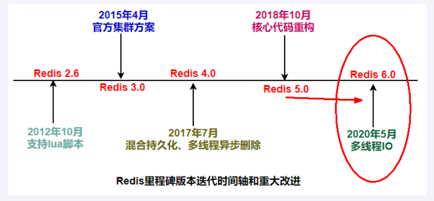

> 5.0版本是直接升级到6.0版本，对于这个激进的升级，Redis之父antirez表现得很有信心和兴奋，
>
> 所以第一时间发文来阐述6.0的一些重大功能"Redis 6.0.0 GA is out!"
>
> **当然，Redis7.0后版本更加厉害**

#### 1.2.2 这里我们需要厘清一个定义: 为什么说Redis单线程的

**Redis是单线程**：**主要是指Redis的网络IO和键值对读写是由一个线程来完成的**，Redis在处理客户端的请求时包括获取 (socket 读)、解析、执行、内容返回 (socket 写) 等都**由一个顺序串行的主线程处理，这就是所谓的“单线程”**。这也是Redis对外提供键值存储服务的主要流程。

> ps: 实际就是指命令的执行是单线程执行的

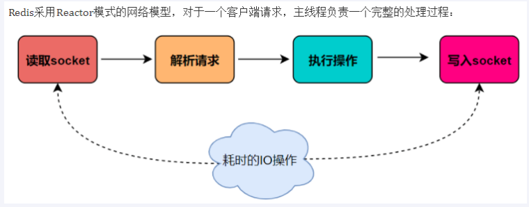

但Redis的其他功能，**比如持久化RDB、AOF、异步删除、集群数据同步等等，其实是由额外的线程执行的。**

**Redis命令工作线程是单线程的，但是，整个Redis来说，是多线程的；**

#### 1.2.3 为什么4.0版本之前要采用单线程的原因（或者：为什么单线程Redis的性能非常强大，或者说速度很快）

- **基于内存的操作**：Redis的所有数据都是存储在内存中的，因此所有的运算都是内存级别的，所以它的性能非常高
- **高效的数据结构**：Redis的数据结构都是专门设计的，而这些简单的数据结构的查找和操作的时间大部分的复杂度都是O(1),因此性能比较高
- **多路复用和非阻塞`I/O`**：Redis使用`I/O`多路复用功能来监听多个socket连接客户端，这样就可以使用一个线程连接来处理多个请求，减少线程创建和切换带来的开销，同时也避免了`I/O`阻塞操作
- **避免了线程的上下文切换**：因为是单线程模型，因此就避免了不必要的线程上下文切换和多线程竞争，这就省去了多线程切换带来的时间和性能上的消耗，而单线程不会有线程安全问题，比如不会死锁的问题。

#### 1.2.4 官网

##### 1.2.4.1 旧版官网

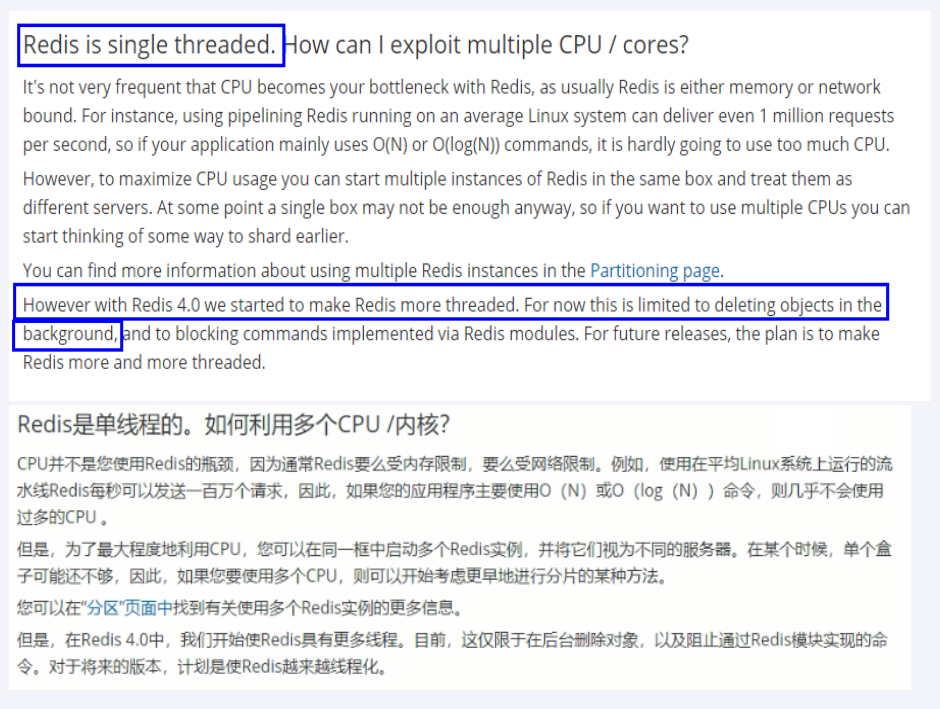

> 他的大体意思是说 Redis 是基于内存操作的，**因此他的瓶颈可能是机器的内存或者网络带宽而并非 CPU**，既然 CPU 不是瓶颈，那么自然就采用单线程的解决方案了，况且使用多线程比较麻烦。**但是在 Redis 4.0 中开始支持多线程了，例如后台删除、备份等功能。**

[redis中文官网关于此的解释](http://redis.cn/topics/faq.html)

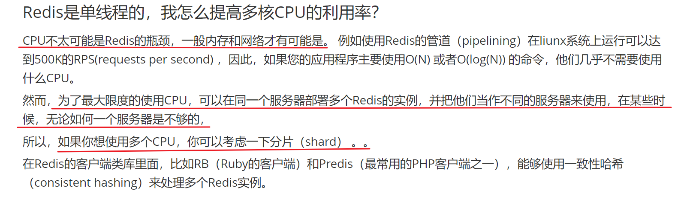

##### 1.2.4.2 新版官网

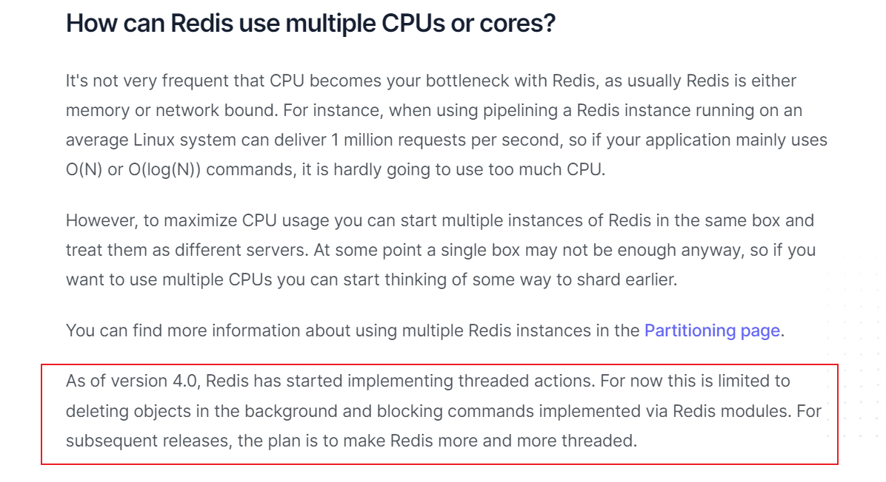

#### 1.2.5 Redis 4.x之前使用单线程的原因

简单来说，Redis4.0之前一直采用单线程的主要原因有以下三个：

1、使用单线程模型是 Redis 的开发和维护更简单，因为单线程模型方便开发和调试；

2、即使使用单线程模型也并发的处理多客户端的请求，主要使用的是IO多路复用和非阻塞IO；

3、对于Redis系统来说，**主要的性能瓶颈是内存或者网络带宽而并非CPU。**

### 1.3 单线程的Redis都已经这么优秀了，为什么从4.x开始逐渐引入多线程特性

#### 1.3.1 单线程存在的问题

正常情况下使用 del 指令可以很快的删除数据，而当被删除的 key 是一个非常大的对象时，例如是包含了成千上万个元素的 hash 集合时，那么 del 指令就会造成 Redis 主线程卡顿。

**这就是redis3.x单线程时代最经典的故障，大key删除的头疼问题，**

由于redis是单线程的，del bigKey .....

等待很久这个线程才会释放，类似加了一个synchronized锁，你可以想象高并发下，程序堵成什么样子？

#### 1.3.2 如何解决

##### 1、适应惰性删除可以有效的避免Redis卡顿的问题

##### 2、案例

比如当我（Redis）需要删除一个很大的数据时，因为是单线程原子命令操作，这就会导致 Redis 服务卡顿，于是在 Redis 4.0 中就新增了多线程的模块，当然此版本中的多线程主要是为了解决删除数据效率比较低的问题的。

```sh
unlink key # 删除大key
flushdb async # 异步的删除当前库
flushall async # 异步的删除所有库
# 把删除工作交给了后台的小弟（子线程）异步来删除数据了。
```

因为Redis是单个主线程处理，redis之父antirez一直强调"Lazy Redis is better Redis".

而lazy free的本质就是把某些cost(主要时间复制度，占用主线程cpu时间片)较高删除操作，

从redis主线程剥离让bio子线程来处理，极大地减少主线阻塞时间。从而减少删除导致性能和稳定性问题。

##### 3、在Redis4.0就引入了多线程来实现数据的异步惰性删除等功能，但是其处理读写请求仍然只有一个线程，所以仍然算是狭义上的单线程。

### 1.4 Redis6/7的多线程特性和`I/O`多路复用入门篇

#### 1.4.1 对于Redis**主要的性能瓶颈是内存或者网络带宽而非CPU**

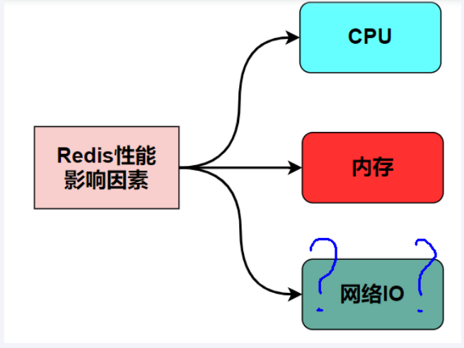

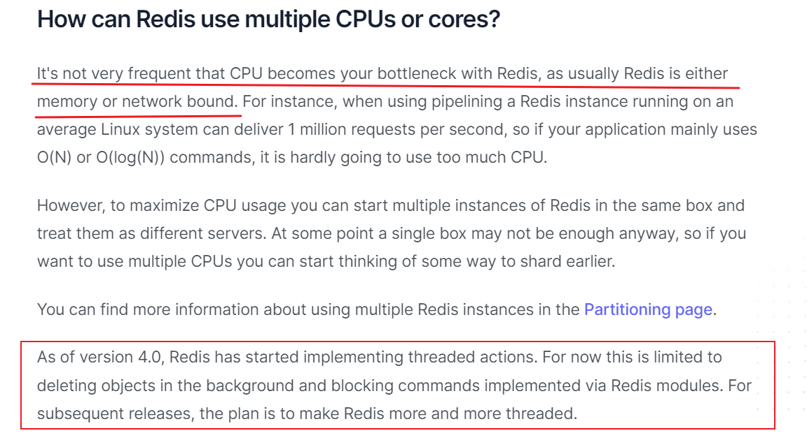

上述百度翻译结果

> CPU成为Redis的瓶颈并不常见，因为Redis通常是内存或网络绑定的。例如，当使用流水线时，在平均Linux系统上运行的Redis实例每秒可以发送100万个请求，因此如果您的应用程序主要使用O（N）或O（log（N））命令，那么它几乎不会使用太多CPU。
>
> 然而，为了最大限度地提高CPU使用率，您可以在同一个盒子中启动多个Redis实例，并将它们视为不同的服务器。在某种程度上，一个盒子可能是不够的，所以如果你想使用多个CPU，你可以早点开始考虑一些分片的方法。
>
> 您可以在分区页面中找到有关使用多个Redis实例的更多信息。
>
> 从4.0版本开始，Redis已经开始实现线程操作。目前，这仅限于删除后台的对象和阻止通过Redis模块实现的命令。对于后续版本，计划是让Redis变得越来越线程化。

随着硬件的不断发展，内存的价格不断下降，内存也不在是redis的主要性能瓶颈了，所以说现在Redis的性能瓶颈是网络`I/O`

#### 1.4.2 Redis的性能瓶颈可以初步认定为网络`I/O`

**在`Redis6/7`中，非常受关注的第一个新特性就是多线程。**

这是因为，Redis一直被大家熟知的就是它的单线程架构，虽然有些命令操作可以用后台线程或子进程执行（比如数据删除、快照生成、AOF重写）。但是，从网络IO处理到实际的读写命令处理，都是由单个线程完成的。 

随着网络硬件的性能提升，Redis的性能瓶颈有时会出现在网络IO的处理上，也就是说，单个主线程处理网络请求的速度跟不上底层网络硬件的速度, 

为了应对这个问题:

**采用多个IO线程来处理网络请求，提高网络请求处理的并行度，`Redis6/7`就是采用的这种方法。**

但是，Redis的多IO线程只是用来处理网络请求的，**对于读写操作命令Redis仍然使用单线程来处理**。这是因为，Redis处理请求时，网络处理经常是瓶颈，通过多个IO线程并行处理网络操作，可以提升实例的整体处理性能。而继续使用单线程执行命令操作，就不用为了保证Lua脚本、事务的原子性，额外开发多线程**互斥加锁机制了(不管加锁操作处理)**，这样一来，Redis线程模型实现就简单了

#### 1.4.3 Redis的主线程和`I/O`线程是怎么协作完成请求处理的

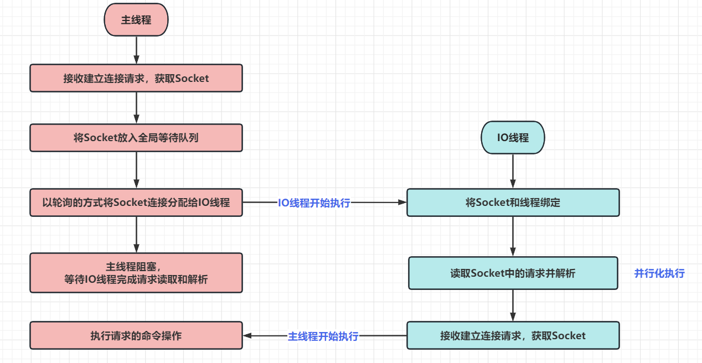


- **阶段一：服务端和客户端建立Socket连接，并分配处理线程**
  - 首先，主线程负责接收建立连接请求。当有客户端请求和实例建立Socket连接时，主线程会创建和客户端的连接，并把Socket放入全局等待队列中。紧接着，主线程通过轮询的方法把Socket连接分配给IO线程。
- **阶段二：IO线程读取并解析请求**
  - 主线程一旦把Socket分配给IO线程，就会进入阻塞状态，等待IO线程完成客户端请求读取和解析。因为有多个IO线程在并行处理，所以，这个过程很快就可以完成。
- **阶段三：主线程执行请求操作**
  - 等待IO线程解析完请求，主线程还是会以单线程的方式执行这些命令操作。
- **阶段四：IO线程回写Socket和主线程清空全局队列**
  - 当主线程执行完请求操作后，会把需要返回的结果写入缓冲区，然后，主线程会阻塞等待IO线程，把这些结果回写到Socket中，并返回给客户端。和IO线程读取和解析请求一样，IO线程回写Socket时，也是有多个线程在并发执行，所以回写Socket的速度也很快。等到IO线程回写Socket完毕，主线程会清空全局队列，等待客户端的后续请求。

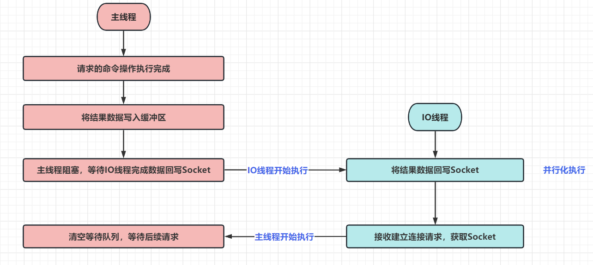


### 1.5 Unix网络编程中的五种`I/O`模型

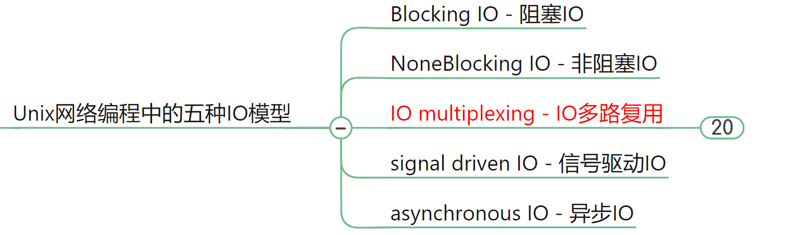

- Blocking IO - 阻塞IO
- NoneBlocking IO - 非阻塞IO
- **IO multiplexing - IO多路复用**
- signal driver IO - 信号驱动IO
- asynchronous IO - 异步IO

> ps: 阳哥在这块只讲了IO 多路复用，有兴趣的小伙伴可以自行了解其他4种IO模型

#### 1.5.1 IO multiplexing - IO多路复用

##### 1.5.1.1 先理解一个概念: `Linux系统的一切皆文件`

###### 1、文件描述符、简称FD，句柄

文件描述符（File descriptor）是计算机科学中的一个术语，是一个用于表述指向文件的引用的抽象化概念。文件描述符在形式上是一个非负整数。实际上，它是一个索引值，指向内核为每一个进程所维护的该进程打开文件的记录表。当程序打开一个现有文件或者创建一个新文件时，内核向进程返回一个文件描述符。在程序设计中，文件描述符这一概念往往只适用于UNIX、Linux这样的操作系统。

###### 2、Java关于文件描述符的定义`java.io.FileDescriptor`

```java
package java.io;

import java.util.ArrayList;
import java.util.List;

/**
 * Instances of the file descriptor class serve as an opaque handle
 * to the underlying machine-specific structure representing an
 * open file, an open socket, or another source or sink of bytes.
 * The main practical use for a file descriptor is to create a
 * {@link FileInputStream} or {@link FileOutputStream} to contain it.
 *
 * <p>Applications should not create their own file descriptors.
 *
 * @author  Pavani Diwanji
 * @since   JDK1.0
 */
public final class FileDescriptor {

    private int fd;

    private long handle;

    private Closeable parent;
    private List<Closeable> otherParents;
    private boolean closed;
    
 	// ... 省略后续代码   
    
}
```

##### 1.5.1.2 IO多路复用是什么？

###### 1、定义简述

一种同步的IO模型，实现**一个线程**监视**多个文件句柄**，**一旦某个文件句柄就绪**，就能够通知到对应的应用程序进行相应的读写操作，**没有文件句柄就绪时**就会阻塞应用程序，从而释放CPU资源。

###### 2、概念说明

- **`I/O`**：网络`I/O`，尤其是在操作系统层面，指数据在内核态和用户态之间的读写操作。

- **多路**：多个客户端连接（连接就是套接字描述符，即Socket或者Channel）

- **复用**：复用一个或几个线程。

- **`I/O`多路复用**：也就是说一个或一组线程处理多个TCP连接，使用单进程就能够同时处理多个客户端的连接，**无需创建或者维护过多的`进程/线程`**
- **总结**：
  - 一个服务端进程可以同时处理多个套接字描述符
  - 实现`I/O`多路复用的模型有3种：可以分`select->poll->epoll`三个阶段来描述

##### 1.5.1.3 通过场景引出epoll

###### 1、场景说明

模拟一个tcp服务器处理30个客户socket。

假设你是一个监考老师，让30个学生解答一道竞赛考题，然后负责验收学生答卷，你有下面几个选择： 

**第一种选择(轮询)**：按顺序逐个验收，先验收A，然后是B，之后是C、D。。。这中间如果有一个学生卡住，全班都会被耽误,你用循环挨个处理socket，根本不具有并发能力。 

**第二种选择(来一个new一个，1对1服务)**：你创建30个分身线程，每个分身线程检查一个学生的答案是否正确。 这种类似于为每一个用户创建一个进程或者线程处理连接。 

**第三种选择(响应式处理，1对多服务)**，你站在讲台上等，谁解答完谁举手。这时C、D举手，表示他们解答问题完毕，你下去依次检查C、D的答案，然后继续回到讲台上等。此时E、A又举手，然后去处理E和A。。。这种就是IO复用模型。Linux下的select、poll和epoll就是干这个的。

###### 2、IO多路复用模型小总结

将用户socket对应的文件描述符(FileDescriptor)注册进epoll，然后epoll帮你监听哪些socket上有消息到达，这样就避免了大量的无用操作。此时的socket应该采用非阻塞模式。这样，整个过程只在调用select、poll、epoll这些调用的时候才会阻塞，收发客户消息是不会阻塞的，整个进程或者线程就被充分利用起来，这就是**事件驱动，所谓的reactor反应模式**。

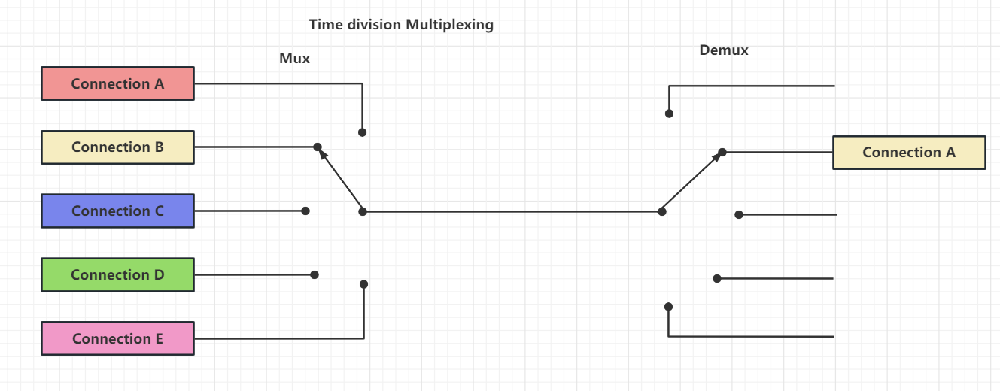

**在单个线程通过记录跟踪每一个Sockek(`I/O`流)的状态来同时管理多个`I/O`流**。一个服务端进程可以同时处理多个套接字描述符。

目的是尽量多的提高服务器的吞吐能力。

大家都用过nginx，nginx使用epoll接收请求，ngnix会有很多链接进来， epoll会把他们都监视起来，然后像拨开关一样，谁有数据就拨向谁，然后调用相应的代码处理。redis类似同理，这就是IO多路复用原理，有请求就响应，没请求不打扰。

##### 1.5.1.4 小总结

只使用一个服务端进程就可以同时处理多个套接字描述符连接


客户端请求服务端时，实际就是在服务端的Socket文件中写入客户端对应的文件描述符（FileDescriptor），如果有多个客户端同时请求服务端，为每次请求分配一个线程，类似每次来都new一个，这样的话就会比较耗费服务端的资源。因此，Redis是使用一个线程来监听多个文件描述符，这就是IO多路复用。

**采用多路`I/O`复用技术就可以让单个线程高效的处理多个请求连接，一个服务端进程就可以同时处理多个套接字描述符。**

##### 1.5.1.5 面试题Redis为什么这么快

IO多路复用+epoll函数使用，才是redis为什么这么快的直接原因，而不是仅仅单线程命令+redis安装在内存中。

#### 1.5.2 小总结

##### 1.5.2.1 概括

Redis的工作线程是单线程的，但是整个Redis架构来说，是多线程的

##### 1.5.2.2 主线程和IO线程是怎么协作完成请求处理的-`精简版`

`I/O` 的读和写本身是堵塞的，比如当 socket 中有数据时，Redis 会通过调用先将数据从内核态空间拷贝到用户态空间，再交给 Redis 调用，而这个拷贝的过程就是阻塞的，当数据量越大时拷贝所需要的时间就越多，而这些操作都是基于单线程完成的。

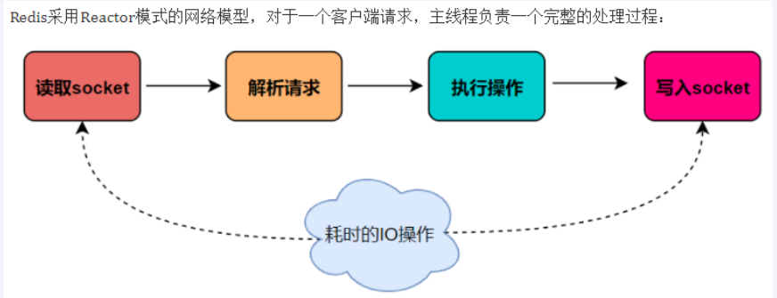

从Redis6开始，就新增了多线程的功能来提高 `I/O` 的读写性能，他的主要实现思路是将**主线程的 IO 读写任务拆分给一组独立的线程去执行**，这样就可以使多个 socket 的读写可以并行化了，**采用多路 `I/O` 复用技术可以让单个线程高效的处理多个连接请求**（尽量减少网络IO的时间消耗），**将最耗时的Socket的读取、请求解析、写入单独外包出去**，剩下的命令执行仍然由主线程串行执行并和内存的数据交互。

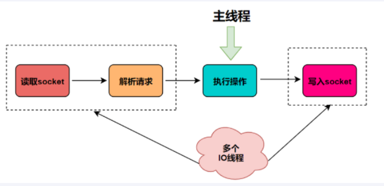

结合上图可知，网络IO操作就变成多线程化了，其他核心部分仍然是线程安全的，是个不错的折中办法。

##### 1.5.2.3 结论

Redis6→7将网络数据读写、请求协议解析通过多个IO线程的来处理，对于真正的命令执行来说，仍然使用主线程操作，一举两得，便宜占尽！！！ o(￣▽￣)ｄ

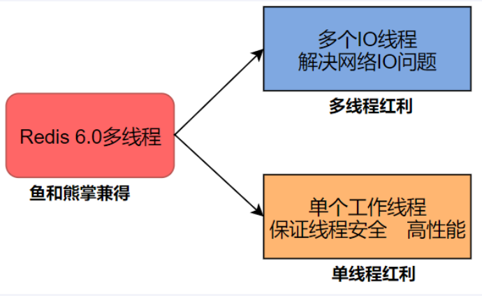

### 1.6 Redis是否默认开启了多线程呢？

> 如果你在实际的应用中，发现Redis实例的**CPU开销不大但吞吐量却没有太大的提升**，可以考虑使用Redis7的多线程机制，加速网络处理，进而提升实例的吞吐量。

Redis7将所有数据放在内存中，内存的响应时长大约为100纳秒，对于小数据包，Redis服务器可以处理8W到10W的QPS，这也是Redis处理的极限了，对于80%的公司来说，单线程的Redis已经足够使用了。

在Redis6.0及7后，多线程机制默认是关闭的，如果需要使用多线程功能，需要在redis.conf中完成两个设置

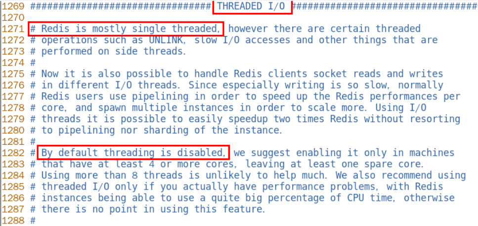

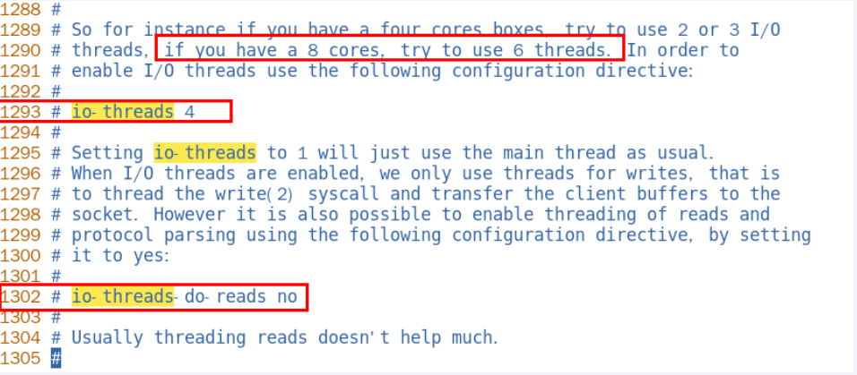

1. 设置io-thread-do-reads配置项为yes，表示启动多线程。
2. 设置线程个数。关于线程数的设置，官方的建议是如果为4核的 CPU，建议线程数设置为 2或3，**如果为 8 核 CPU 建议线程数设置为 6**，线程数一定要小于机器核数，线程数并不是越大越好。

### 1.7 Redis架构设计的演变目的：为了使Redis更快

Redis自身出道就是优秀，基于内存操作、数据结构简单、多路复用和非阻塞 `I/O`、避免了不必要的线程上下文切换等特性，在单线程的环境下依然很快； 

但对于大数据的 key 删除还是卡顿厉害，因此在 Redis 4.0 引入了多线程`unlink key/flushall async` 等命令，主要用于 Redis 数据的异步删除；

而在 `Redis6/7`中引入了 `I/O` 多线程的读写，这样就可以更加高效的处理更多的任务了，Redis 只是将 `I/O` 读写变成了多线程，而命令的执行依旧是由主线程串行执行的，因此在多线程下操作 Redis 不会出现线程安全的问题。

**Redis 无论是当初的单线程设计，还是如今与当初设计相背的多线程，目的只有一个：让 Redis 变得越来越快。**

所以 Redis 依旧没变，他还是那个曾经的少年，O(∩_∩)O哈哈~

## 2 BigKey

### 2.1 面试题

- 阿里广告平台，海量数据里查询某一固定前缀的key
- 小红书，你如何生产上限制`keys */ flushdb / flushall`等危险命令以防止误删误用？
- 美团，`Memory usage` 命令你用过吗？
- BigKey问题，多大算big？你如何发现？如何删除？如何处理？

- BigKey你做过调优吗？惰性释放lazyfree了解过吗？
- MoreKey问题，生产上Redis数据库有1000W记录，你如何遍历？`Keys *`可以吗？

### 2.2 More Key案例演示

#### 2.2.1 插入100w的模拟数据到Redis数据库

- Linux Bash下面执行，插入100W的模拟数据

```bash
# 生成100W条redis批量设置kv的语句(key=kn,value=vn)写入到/tmp目录下的redisTest.txt文件中

for((i=1;i<=100*10000;i++)); do echo "set k$i v$i" >> /tmp/redisTest.txt ;done;
```

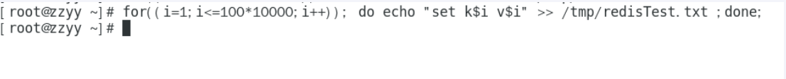

- 通过Redis提供的管道--pipe命令插入100W的大批量数据

```bash
# 结合自己机器的地址：

cat /tmp/redisTest.txt | /opt/redis-7.0.0/src/redis-cli -h 127.0.0.1 -p 6379 -a 111111 --pipe

# 多出来的5条，是之前阳哥自己的其它测试数据 ，参考阳哥机器硬件，100w数据插入redis花费5.8秒左右
```

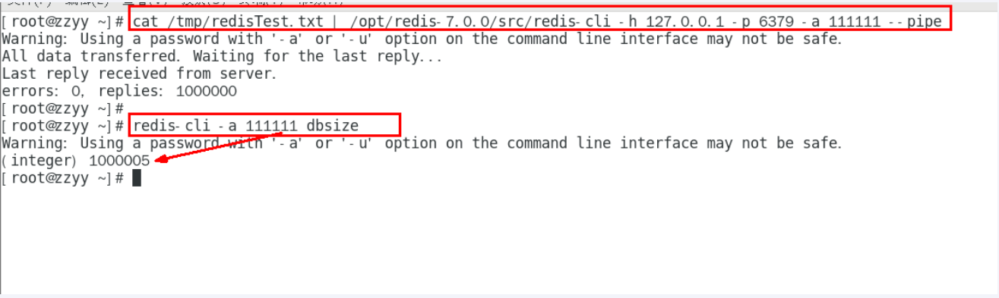

> ps: 感兴趣的小伙伴，可以测试下，往Redis里面插入2000W的测试数据Key

#### 2.2.2 某快递巨头的真实生产案例新闻

##### 2.2.2.1 新闻

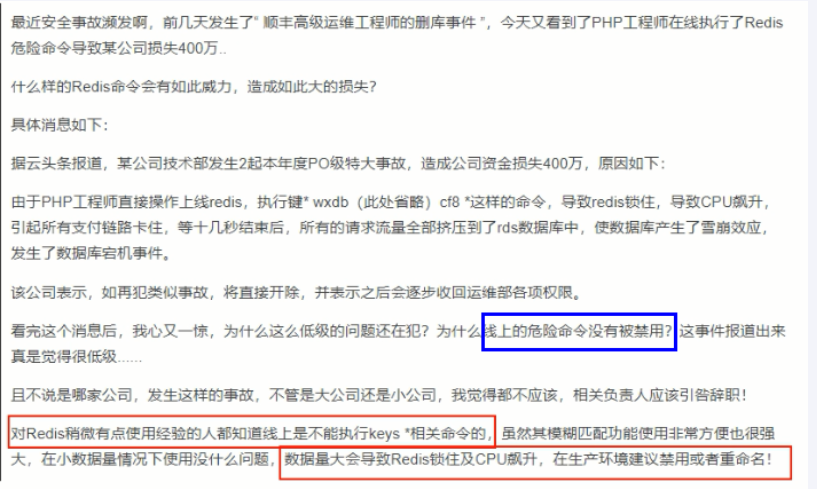

##### 2.2.2.2 你可以测试下100W条数据下`keys *` 会花费多少时间

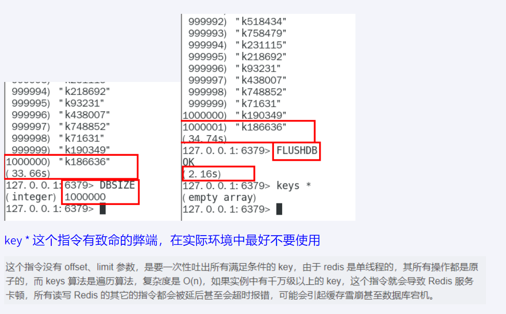


##### 2.2.2.3 生产上如何限制使用`keys * /flushdb / flushall等危险命令以防止误删误用？`

可以通过在Redis的配置文件redis.conf中的SECURITY这一项中禁用这些命令

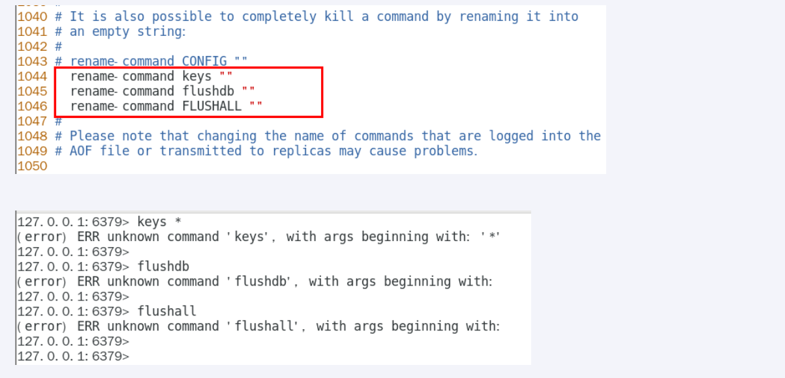

#### 2.2.3 不用`Keys *`避免卡顿，那该用什么？（SCAN命令）

##### 2.2.3.1 SCAN命令登场

[Redis官网关于SCAN命令的介绍](https://redis.io/commands/scan/)

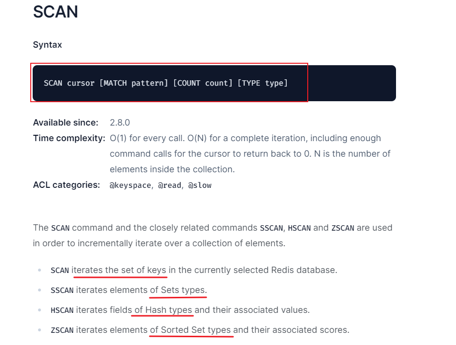

[Redis中文官网关于SCAN命令的介绍](https://redis.com.cn/commands/scan.html)

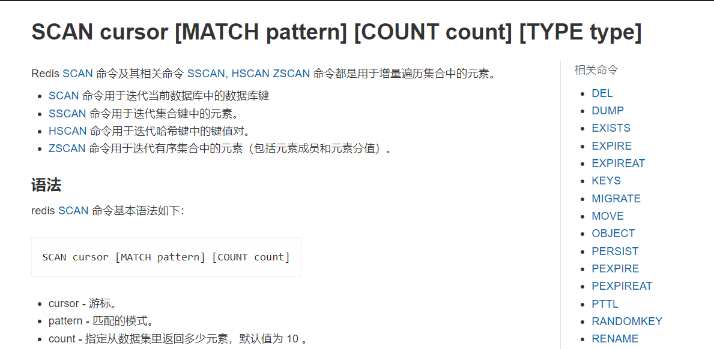

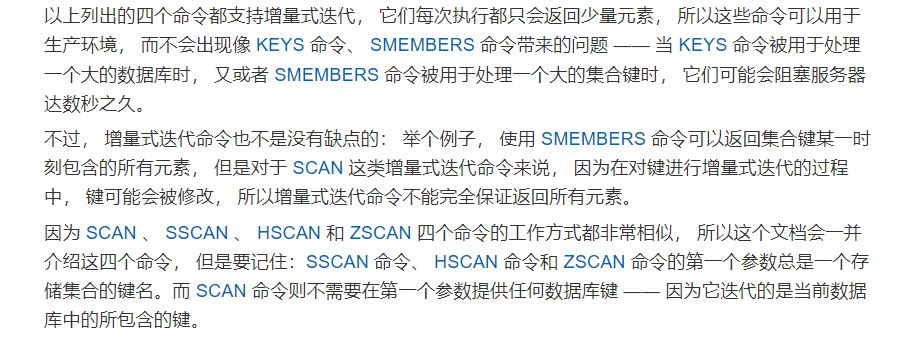


```bash
redis 127.0.0.1:6379> scan 0
1) "17"
2)  1) "key:12"
    2) "key:8"
    3) "key:4"
    4) "key:14"
    5) "key:16"
    6) "key:17"
    7) "key:15"
    8) "key:10"
    9) "key:3"
   10) "key:7"
   11) "key:1"
redis 127.0.0.1:6379> scan 17
1) "0"
2) 1) "key:5"
   2) "key:18"
   3) "key:0"
   4) "key:2"
   5) "key:19"
   6) "key:13"
   7) "key:6"
   8) "key:9"
   9) "key:11"
```


一句话，类似于MySQL的LIMIT命令，**但不完全相同**

##### 2.2.3.2 SCAN命令用于迭代数据库中的数据库中的键

###### 1、语法

```bash
SCAN cursor [MATCH pattern] [COUNT count] [TYPE type]
```

SCAN命令是基于游标的迭代器，需要基于上一次的游标延续之前的迭代过程，以0作为游标开始一次新的迭代，直到命令返回的游标0，这样才算完成一次遍历。不保证每次执行都返回某个给定数量的元素，支持模糊查询，一次返回的数量不可控，只能是大概率符合count参数。

###### 2、特点

redis SCAN 命令基本语法如下：

```
SCAN cursor [MATCH pattern] [COUNT count]
```

- cursor - 游标。
- pattern - 匹配的模式。
- count - 指定从数据集里返回多少元素，默认值为 10 。

SCAN 命令是一个基于游标的迭代器，每次被调用之后， 都会向用户返回一个新的游标， **用户在下次迭代时需要使用这个新游标作为 SCAN 命令的游标参数**， 以此来延续之前的迭代过程。

SCAN 返回一个包含**两个元素的数组**， 

第一个元素是用于进行下一次迭代的新游标， 

第二个元素则是一个数组， 这个数组中包含了所有被迭代的元素。如果**新游标返回零表示迭代已结束。** 

SCAN的遍历顺序

**非常特别，它不是从第一维数组的第零位一直遍历到末尾，而是采用了高位进位加法来遍历。之所以使用这样特殊的方式进行遍历，是考虑到字典的扩容和缩容时避免槽位的遍历重复和遗漏。**

###### 3、使用

```bash
redis 127.0.0.1:6379> scan 0
1) "17"
2)  1) "key:12"
    2) "key:8"
    3) "key:4"
    4) "key:14"
    5) "key:16"
    6) "key:17"
    7) "key:15"
    8) "key:10"
    9) "key:3"
   10) "key:7"
   11) "key:1"
redis 127.0.0.1:6379> scan 17
1) "0"
2) 1) "key:5"
   2) "key:18"
   3) "key:0"
   4) "key:2"
   5) "key:19"
   6) "key:13"
   7) "key:6"
   8) "key:9"
   9) "key:11"
```

在上面这个例子中， 第一次迭代使用 `0` 作为游标， 表示开始一次新的迭代。第二次迭代使用的是第一次迭代时返回的游标， 也就是命令回复第一个元素的值 —— `17` 。


### 2.3 Big Key案例

#### 2.3.1 多大算Big

##### 2.3.1.1 参考《阿里云Redis开发手册》

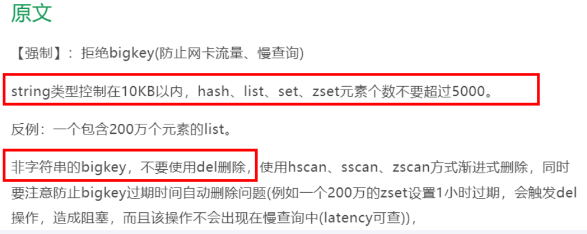

##### 2.3.1.2 string和二级结构

- string是value，最大是512M，但是达到10KB就是bigkey了
- list、hash、set和zset，里面存储的元素超过5000个就是bigkey了

  - list：一个列表最多可包含`2^32-1`个元素（4294967295，每个列表超过40亿个元素）。
  - hash：Redis中的每个hash可以存储`2^32-1`个键值对（40多亿）
  - set：集合中的最大成员数为`2^32-1`（4294967295，每个列表超过40亿个元素）

#### 2.3.2 哪些危害

- 内存不均，集群迁移困难
- 超时删除，大key删除做梗
- 网络流量阻塞

#### 2.3.3 如何产生

- 社交类
  - 王心凌粉丝列表，典型案例粉丝逐步递增
- 汇总统计
  - 某个报表，年月日经年累月的积累

#### 2.3.4 如何发现

##### 2.3.4.1 `redis-cli --bigkeys`

```sh
redis-cli --bigkeys
```

###### 1、好处

给出每种数据结构Top 1 bigkey，同时给出每种数据类型的键值个数+平均大小

```sh
[root@localhost redis]# redis-cli --bigkeys

# Scanning the entire keyspace to find biggest keys as well as
# average sizes per key type.  You can use -i 0.1 to sleep 0.1 sec
# per 100 SCAN commands (not usually needed).

[00.00%] Biggest string found so far '"k150090"' with 7 bytes
[09.51%] Biggest string found so far '"k1000000"' with 8 bytes
[100.00%] Sampled 1000000 keys so far

-------- summary -------

Sampled 1000000 keys in the keyspace!
Total key length in bytes is 6888896 (avg len 6.89)

Biggest string found '"k1000000"' has 8 bytes

0 lists with 0 items (00.00% of keys, avg size 0.00)
0 hashs with 0 fields (00.00% of keys, avg size 0.00)
1000000 strings with 6888896 bytes (100.00% of keys, avg size 6.89)
0 streams with 0 entries (00.00% of keys, avg size 0.00)
0 sets with 0 members (00.00% of keys, avg size 0.00)
0 zsets with 0 members (00.00% of keys, avg size 0.00)
[root@localhost redis]#

```

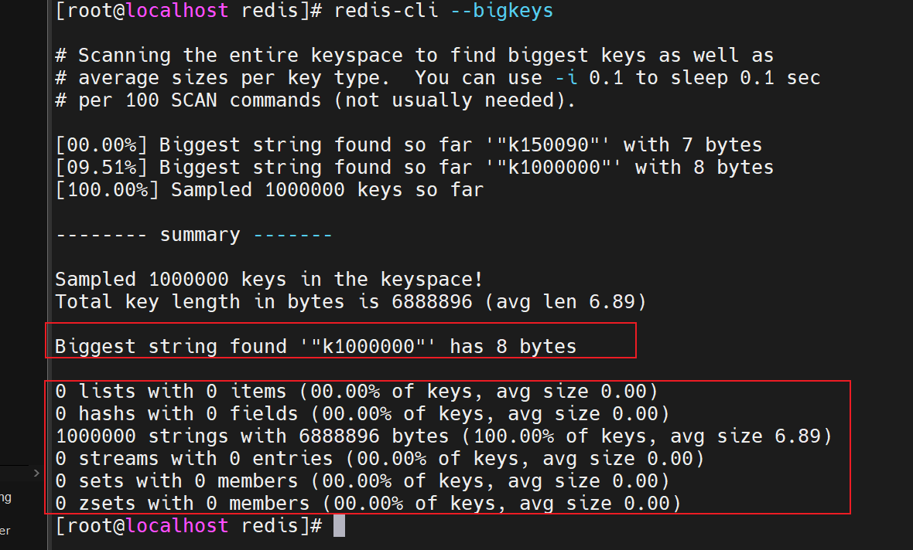

###### 2、不足

想查询大于10kb的所有key，--bigkeys参数就无能为力了，**需要用到memory usage来计算每个键值的字节数**

```sh
redis-cli –-bigkeys
# 每隔 100 条 scan 指令就会休眠 0.1s，ops 就不会剧烈抬升，但是扫描的时间会变长
redis-cli –-bigkeys -i 0.1
```


##### 2.3.4.2 `MEMORY USAGE`键

1、[官网](https://redis.com.cn/commands/memory-usage.html)

2、**计算每个键值的字节数**

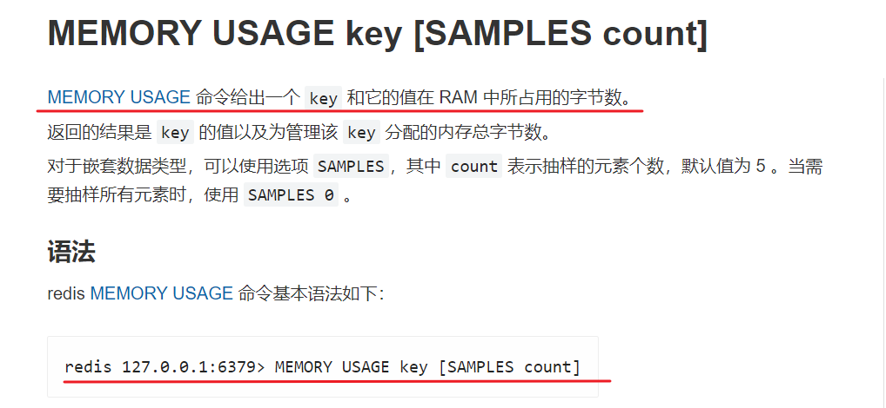

```sh
127.0.0.1:6379> memory usage k1
(integer) 56
127.0.0.1:6379> memory usage k999999
(integer) 72

```

#### 2.3.5 如何删除

- 参考《阿里云Redis开发规范》

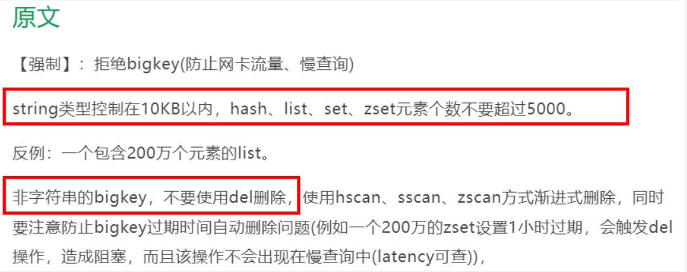

- [scan命令中文网](https://redis.com.cn/commands/scan.html)

##### 2.3.5.1 普通命令

###### 1、string

一般使用del，如果过于庞大的话，使用unlink

###### 2、hash

- 使用hscan每次获取少量的field-value，再使用hdel删除每个field

- 命令

  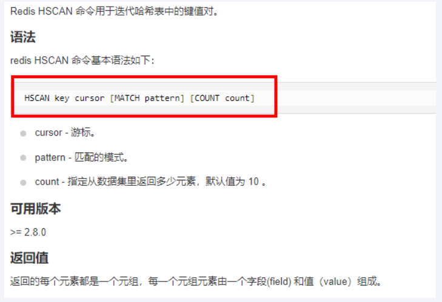

- 删除大的HashKey的Java方法

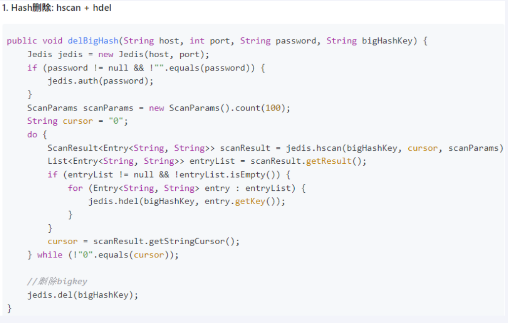

```java
    public static void deleteBigHash(String host, int port, String password, String bigHashKey) throws IllegalArgumentException {
        Jedis jedis = new Jedis(host, port);

        if (password != null && !"".equals(password)) {
            jedis.auth(password);
        }

        ScanParams scanParams = new ScanParams().count(100);
        String cursor = "0";

        do {
            ScanResult<Map.Entry<String, String>> scanResult = jedis.hscan(bigHashKey, cursor, scanParams);
            List<Map.Entry<String, String>> resultList = scanResult.getResult();
            if (resultList != null && !resultList.isEmpty()) {
                // resultList不为空时，则需要删除查询到的key
                for (Map.Entry<String, String> entry : resultList) {
                    jedis.hdel(bigHashKey, entry.getKey());
                }
            }
            // 更新游标
            cursor = scanResult.getCursor();
        } while (!"0".equals(cursor));

        // 最后再删除bigHashKey
        jedis.del(bigHashKey);
    }
```


###### 3、list

3.1、使用ltrim渐进式逐步删除，直到全部删除完成

3.2、命令

> LTRIM key start stop
>
> 让列表只保留指定区间内的元素，不在指定区间内的元素都将会被删除。

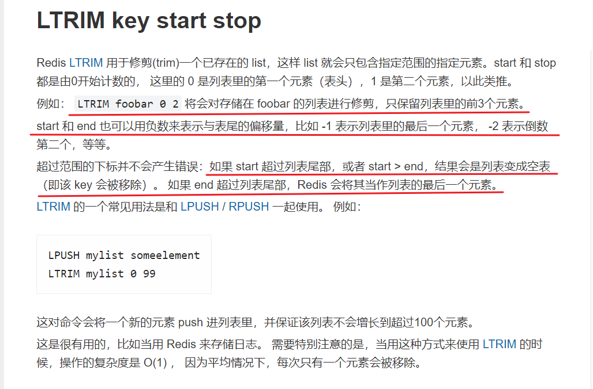

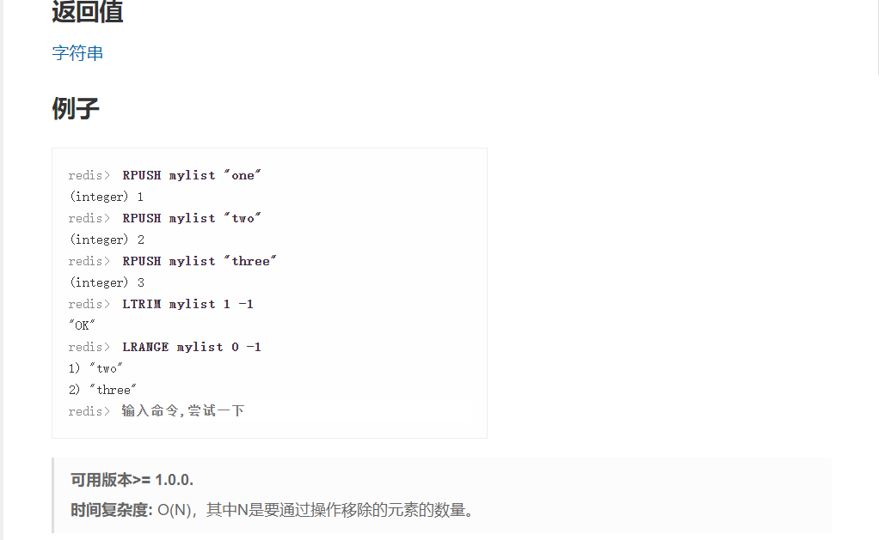

3.3、Java代码写法

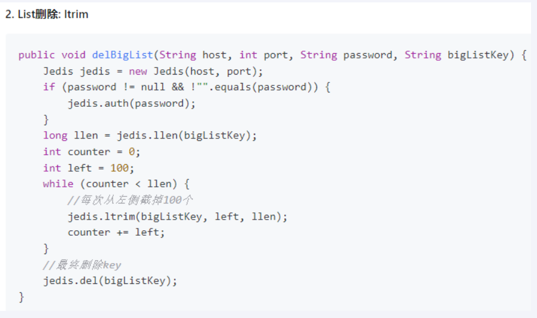

```java
    public static void deleteBigList(String host, int port, String password, String bigListKey) {
        Jedis jedis = new Jedis(host, port);


        if (password != null && !"".equals(password)) {
            jedis.auth(password);
        }

        // 获取list的长度
        Long listLength = jedis.llen(bigListKey);
        if (listLength == null || listLength == 0) {
            // 这表明list里面没有数据，可以被直接删除
            jedis.del(bigListKey);
            return;
        }

        // 定义一个计数器
        int count = 0;
        int left = 100;
        while (count < listLength) {
            // 每次从左边截掉100个
            jedis.ltrim(bigListKey, left, listLength);
            count += left;
        }

        // 最后再删除key
        jedis.del(bigListKey);
    }
```

###### 4、set

4.1、使用sscan每次获取部分元素，然后再使用srem命令删除每个元素

4.2 命令

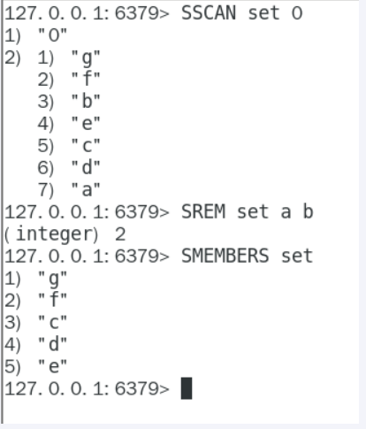

4.3 Java代码实现

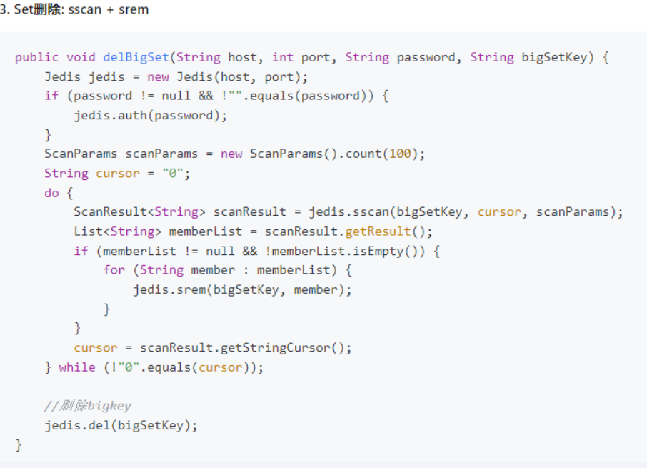

```java
    public void delBigSet(String host, int port, String password, String bigSetKey) {
        Jedis jedis = new Jedis(host, port);
        if (password != null && !(password.length() == 0)) {
            jedis.auth(password);
        }

        ScanParams scanParams = new ScanParams().count(100);
        String cursor = "0";

        do {
            ScanResult<String> scanResult = jedis.sscan(bigSetKey, cursor, scanParams);
            List<String> memberList = scanResult.getResult();
            if (memberList != null && !memberList.isEmpty()) {
                for (String member : memberList) {
                    jedis.srem(bigSetKey, member);
                }

                cursor = scanResult.getCursor();
            }
        } while (!"0".equals(cursor));

        // 删除bigKey
        jedis.del(bigSetKey);
    }
```


###### 5、zset

5.1、使用zscan每次获取部分元素，然后再使用`ZREMRANGEBYRANK`命令删除每个元素

5.2 命令

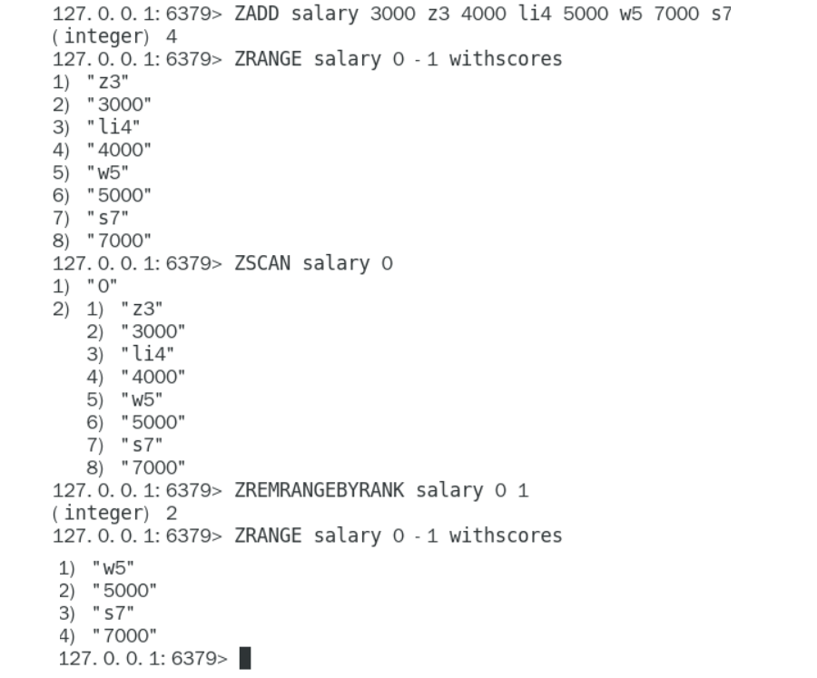

5.3 Java代码实现

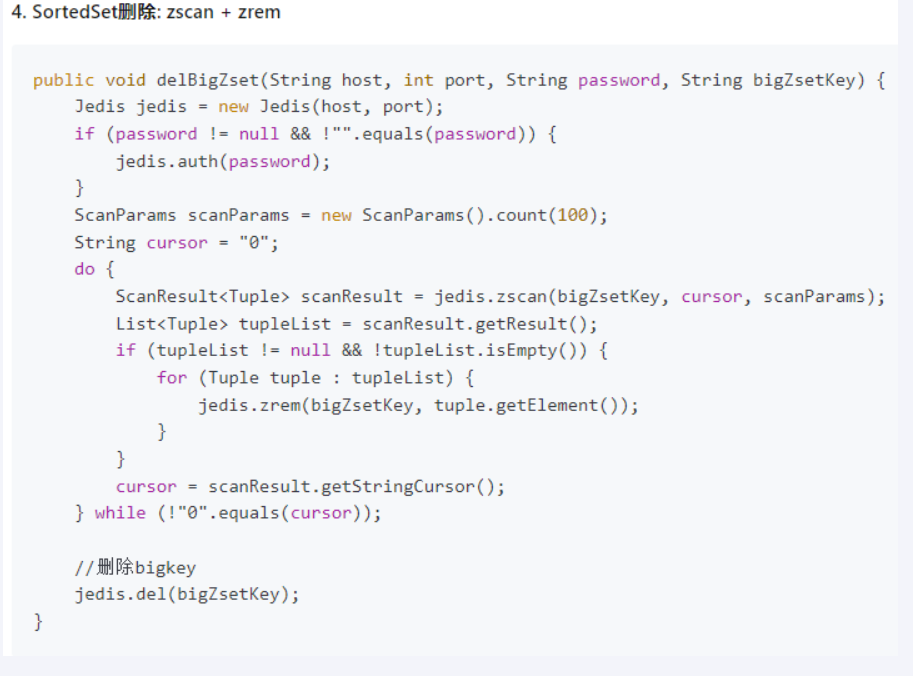

```java
    public void delBigZset(String host, int port, String password, String bigZsetKey) {
        Jedis jedis = new Jedis(host, port);
        if (password != null && !(password.length() == 0)) {
            jedis.auth(password);
        }

        ScanParams scanParams = new ScanParams().count(100);
        String cursor = "0";

        do {
            ScanResult<Tuple> scanResult = jedis.zscan(bigZsetKey, cursor, scanParams);
            List<Tuple> tupleList = scanResult.getResult();
            if (tupleList != null && !tupleList.isEmpty()) {
                for (Tuple tuple : tupleList) {
                    jedis.zrem(bigZsetKey, tuple.getElement());
                }

                cursor = scanResult.getCursor();
            }
        } while (!"0".equals(cursor));

        // 删除bigKey
        jedis.del(bigZsetKey);
    }
```

###### 6、hash、set、zset代码抽取封装

```java
package cn.hutool.custom.redis;


import cn.hutool.core.collection.CollectionUtils;
import cn.hutool.core.util.StringUtils;
import lombok.extern.slf4j.Slf4j;
import redis.clients.jedis.Jedis;
import redis.clients.jedis.ScanParams;
import redis.clients.jedis.ScanResult;

import java.util.List;

/**
 * @author lyf
 * @description Jedis 删除大key和模糊删除多个key
 * @since 2023/5/11 16:25:01
 */
@Slf4j
public final class JedisUtil {

    public static final String SCAN_DEFAULT_PATTERN = "*";

    public static final String CURSOR_START_POS = "0";
    /**
     * "none" if the key does not exist
     */
    public static final String REDIS_TYPE_NONE = "none";

    /**
     * "string" if the key contains a String value
     */
    public static final String REDIS_TYPE_STRING = "string";

    /**
     * "list" if the key contains a list value
     */
    public static final String REDIS_TYPE_LIST = "list";

    /**
     * "set" if the key contains a set value
     */
    public static final String REDIS_TYPE_SET = "set";

    /**
     * "zset" if the key contains a zset value
     */
    public static final String REDIS_TYPE_ZSET = "zset";

    /**
     * "hash" if the key contains a hash value
     */
    public static final String REDIS_TYPE_HASH = "hash";

    private JedisUtil() {
    }


    /**
     * 对bigKey和moreKey的统一处理方法
     *
     * @param host     redis主机
     * @param port     redis端口号
     * @param password 密码
     * @param bigKey   需要删除的大key或者多个key的前缀+*
     */
    public static void deleteBigKeyOrMoreKey(String host, int port, String password, String bigKey) {
        deleteBigKeyOrMoreKey(host, port, password, bigKey, false);
    }

    /**
     * 对bigKey和moreKey的统一处理方法
     *
     * @param host     redis主机
     * @param port     redis端口号
     * @param password 密码
     * @param bigKey   需要删除的大key或者多个key的前缀+*
     */
    public static void deleteBigKeyOrMoreKey(String host, int port, String password, String bigKey, boolean isMoreKey) {
        // 先对bigkey做个非空校验
        if (StringUtils.isEmpty(bigKey)) {
            log.info("bigKey is empty");
            return;
        }

        try (Jedis jedis = new Jedis(host, port)) {
            // 登录验证
            if (StringUtils.isNotEmpty(password)) {
                jedis.auth(password);
            }

            if (isMoreKey) {
                // 这里的bigKey就相当于keyPattern
                deleteMoreKey(jedis, bigKey);
                return;
            }


            // 校验数据类型
            String type = jedis.type(bigKey);
            switch (type) {
                case REDIS_TYPE_STRING:
                    deleteBigString(jedis, bigKey);
                    break;
                case REDIS_TYPE_LIST:
                    deleteBigList(jedis, bigKey);
                    break;
                case REDIS_TYPE_SET:
                    deleteBigSet(jedis, bigKey);
                    break;
                case REDIS_TYPE_ZSET:
                    deleteBigZSet(jedis, bigKey);
                    break;
                case REDIS_TYPE_HASH:
                    deleteBigHash(jedis, bigKey);
                    break;
                case REDIS_TYPE_NONE:
                    log.info("{} has deleted", bigKey);
                    break;
                default:
                    throw new IllegalArgumentException(String.format("未知的redis类型: %s", type));
            }
        }
    }

    private static void deleteBigString(Jedis jedis, String bigKey) {
        jedis.unlink(bigKey);
    }

    private static void deleteBigList(Jedis jedis, String bigKey) {
        // 获取list的长度
        Long listLength = jedis.llen(bigKey);
        if (listLength == null || listLength == 0) {
            // 这表明list里面没有数据，可以被直接删除
            jedis.del(bigKey);
            return;
        }

        // 定义一个计数器
        int count = 0;
        int left = 100;
        while (count < listLength) {
            // 每次从左边截掉100个
            jedis.ltrim(bigKey, left, listLength);
            count += left;
        }

        // 最后再删除key
        jedis.del(bigKey);
    }

    private static boolean deleteBigHash(Jedis jedis, String bigKey) {
        return scanDelete(jedis,
                bigKey,
                null,
                Jedis::hscan,
                (jedis1, bigKey1, stringStringEntry) -> jedis1.hdel(bigKey1, stringStringEntry.getKey()));
    }

    private static boolean deleteBigZSet(Jedis jedis, String bigKey) {
        return scanDelete(jedis,
                bigKey,
                null,
                Jedis::zscan,
                (jedis1, bigKey1, tuple) -> jedis1.zrem(bigKey1, tuple.getElement()));
    }

    private static boolean deleteBigSet(Jedis jedis, String bigKey) {
        return scanDelete(jedis,
                bigKey,
                null,
                Jedis::sscan,
                Jedis::srem
        );
    }

    /**
     * 删除多个key
     *
     * @param jedis      jedis客户端
     * @param keyPattern key模糊匹配的规则
     */
    private static void deleteMoreKey(Jedis jedis, String keyPattern) {
        if (StringUtils.isEmpty(keyPattern)) {
            throw new IllegalArgumentException("keyPattern is null, the keyPattern is not null");
        }

        ScanParams scanParams = new ScanParams();
        scanParams.count(100);
        scanParams.match(keyPattern);
        scanDelete(jedis,
                keyPattern,
                scanParams,
                (jedis1, bigKey, cursor, scanParams1) -> jedis1.scan(cursor, scanParams1),
                (jedis2, bigKey, s) -> jedis2.del(s));
    }

    /**
     * 内部方法使用函数，用于执行
     * set: jedis.sscan(key, cursor, scanParams)
     * zset: jedis.zscan(key, cursor, scanParams)
     * hash: jedis.hscan(key, cursor, scanParams)
     * 普通key: jedis.scan(key, cursor, scanParams)
     *
     * @param <R> : ScanResult<T>
     */
    @FunctionalInterface
    private interface ScanFunction<R> {
        R apply(Jedis jedis, String bigKey, String cursor, ScanParams scanParams);
    }

    /**
     * 内部方法使用函数, 用于执行
     * set: jedis.srem(bigKey, member)
     * zset: jedis.zrem(bigKey, tuple.getElement())
     * hash: jedis.hdel(bigKey, entry.getKey)
     * 普通key: jedis.del(bigKey, key)
     *
     * @param <T>
     */
    @FunctionalInterface
    private interface ScanDeleteFunction<T> {
        void accept(Jedis jedis, String bigKey, T t);
    }


    private static <T> boolean scanDelete(Jedis jedis, String bigKey, ScanParams scanParams,
                                          ScanFunction<ScanResult<T>> scanFunction, ScanDeleteFunction<T> scanDeleteFunction) {
        if (scanParams == null) {
            scanParams = new ScanParams().count(100);
        }
        String cursor = CURSOR_START_POS;
        do {
            // 执行scan
            ScanResult<T> scanResult = scanFunction.apply(jedis, bigKey, cursor, scanParams);

            // 获取scan的结果
            List<T> resultList = scanResult.getResult();

            if (CollectionUtils.isNotEmpty(resultList)) {
                // 获取的结果不为空时，则开始逐一删除元素
                for (T element : resultList) {
                    scanDeleteFunction.accept(jedis, bigKey, element);
                }
            }

            // 更新游标
            cursor = scanResult.getCursor();
        } while (!CURSOR_START_POS.equals(cursor));
        // 最后在删除bigkey
        jedis.del(bigKey);
        return true;
    }
}

```


### 2.4 BigKey生产调优

#### 2.4.1 redis.conf配置文件中LAZY FREEING相关说明

##### 2.4.1.1 阻塞与非阻塞删除命令

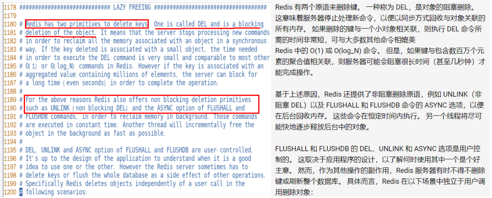

##### 2.4.1.2 优化配置

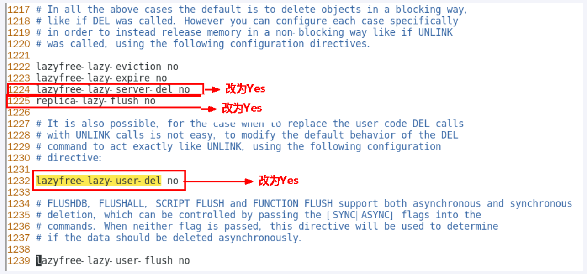

```properties
lazyfree-lazy-eviction no
lazyfree-lazy-expire no
lazyfree-lazy-server-del no
slave-lazy-flush no
```

###### 1、lazyfree-lazy-eviction

针对redis内存使用达到maxmeory，并设置有淘汰策略时；在被动淘汰键时，是否采用lazy free机制； 因为此场景开启lazy free, 可能使用淘汰键的内存释放不及时，导致redis内存超用，超过maxmemory的限制。

###### 2、lazyfree-lazy-expire

针对设置有TTL的键，达到过期后，被redis清理删除时是否采用lazy free机制；

###### 3、lazyfree-lazy-server-del

针对有些指令在处理已存在的键时，会带有一个隐式的DEL键的操作。如rename命令，当目标键已存在, redis会先删除目标键，如果这些目标键是一个big key, 那就会引入阻塞删除的性能问题。 此参数设置就是解决这类问题，建议可开启。

###### 4、slave-lazy-flush

针对slave进行全量数据同步，slave在加载master的RDB文件前，会运行flushall来清理自己的数据场景， 参数设置决定是否采用异常flush机制。

如果内存变动不大，建议可开启。可减少全量同步耗时，从而减少主库因输出缓冲区爆涨引起的内存使用增长。


## 3 缓存双写一致性之更新策略探讨

### 3.1 面试题

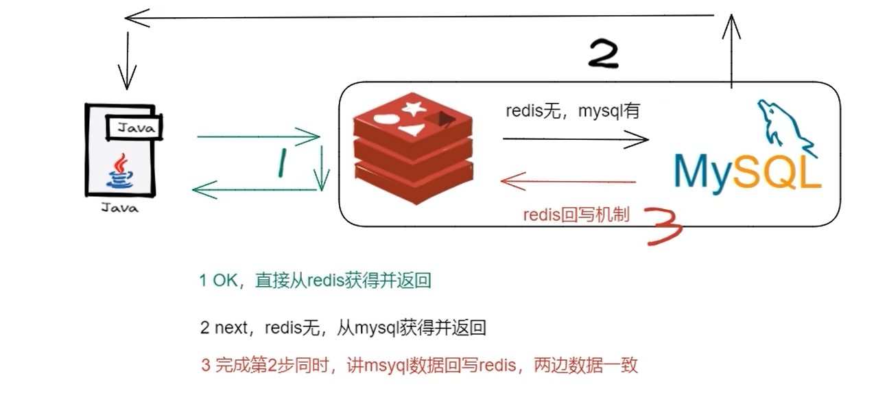

1、上图，你用Java代码怎么实现

2、你只要使用缓存，就可能会涉及到redis缓存与数据库双写问题，你只要是双写，就一定会存在数据一致性问题，那么你如何解决一致性问题呢？

3、双写一致性，你先动缓存redis还是数据库mysql哪一个？why？

4、**延时双删**你做过吗？会存在哪些问题？

5、有这么一种情况，微服务查询redis无mysql有，为了保证数据双写一致性回写redis你需要注意什么？**双检加锁**你了解过吗？如何尽量避免缓存击穿？

6、redis和mysql双写，能保证强一致性吗？如果做不到强一致性的话，**那么如何保证最终一致性**？

### 3.2 缓存与数据库双写一致性，谈谈你的理解

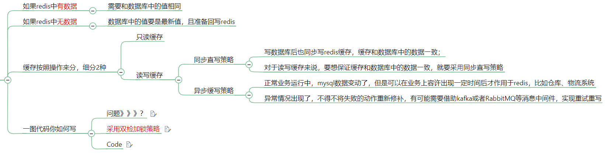

1. 如果redis中**有数据**，需要和数据库中的值相同
2. 如果redis中**没有数据**，数据库中的值要是最新值，且准备回写到redis中
3. 缓存按操作来细分：
   1. 只读缓存（这里就不涉及双写）
   2. 读写缓存
      1. 同步直写
         1. 写数据库后也同步redis缓存数据，保证缓存和数据库中的数据一致
         2. 对于读写缓存来说，要想保证缓存和数据库中的数据一致，就要采用同步直写策略
      2. 异步缓写
         1. 正常业务运行中，mysql数据变动了，但是可以在业务上容许出现一定时间后才写向redis，比如仓库，物流系统
         2. 异常情况出现了，不得不执行业务补偿，有可能需要借助Kafka或者RabbitMQ等消息中间件，实现重试重写
4. 下图代码该如何实现


4.1 双检加锁策略

多个线程同时去查询数据库的这条数据，那么我们可以在第一个查询数据的请求上使用一个互斥锁来锁住它。

其他的线程走到这一步拿不到锁就等着，等第一个线程查询到了数据，然后做缓存。

后面的线程进来发现已经有缓存了，就直接走缓存。 

```java
    public String get(String key) {
        try (Jedis jedis = new Jedis()) {
            String value = jedis.get(key); // 查询缓存
            if (value != null && value.length() > 0) {
                // 缓存存在的话，那么就直接返回
                return value;
            }

            // 缓存不存在则对需要加锁
            // 假设请求量很大，则缓存需要设置自动过期时间
            synchronized (JedisUtils.class) {
                // 这里加锁的目的是为了防止高并发下有其余线程修改了redis中的值
                value = jedis.get(key);
                if (value != null && value.length() > 0) {
                    return value;
                }

                // 经过两次查询redis之后，都没数据，就从mysql中查询
                value = dao.get(key);

                // 将数据写入缓存
                jedis.setex(key, KEY_TTL, value);
                return value;
            }
        }
    }
```

4.2 代码

```java
package cn.hutool.custom.redis;

import com.atguigu.redis.entities.User;
import com.atguigu.redis.mapper.UserMapper;
import lombok.extern.slf4j.Slf4j;
import org.springframework.data.redis.core.RedisTemplate;
import org.springframework.stereotype.Service;

import javax.annotation.Resource;
import java.util.concurrent.TimeUnit;

/**
 * @auther zzyy
 * @create 2021-05-01 14:58
 */
@Service
@Slf4j
public class UserService {
    public static final String CACHE_KEY_USER = "user:";
    @Resource
    private UserMapper userMapper;
    @Resource
    private RedisTemplate redisTemplate;

    /**
     * 业务逻辑没有写错，对于小厂中厂(QPS《=1000)可以使用，但是大厂不行
     *
     * @param id
     * @return
     */
    public User findUserById(Integer id) {
        User user = null;
        String key = CACHE_KEY_USER + id;

        //1 先从redis里面查询，如果有直接返回结果，如果没有再去查询mysql
        user = (User) redisTemplate.opsForValue().get(key);

        if (user == null) {
            //2 redis里面无，继续查询mysql
            user = userMapper.selectByPrimaryKey(id);
            if (user == null) {
                //3.1 redis+mysql 都无数据
                //你具体细化，防止多次穿透，我们业务规定，记录下导致穿透的这个key回写redis
                return user;
            } else {
                //3.2 mysql有，需要将数据写回redis，保证下一次的缓存命中率
                redisTemplate.opsForValue().set(key, user);
            }
        }
        return user;
    }


    /**
     * 加强补充，避免突然key失效了，打爆mysql，做一下预防，尽量不出现击穿的情况。
     *
     * @param id
     * @return
     */
    public User findUserById2(Integer id) {
        User user = null;
        String key = CACHE_KEY_USER + id;

        //1 先从redis里面查询，如果有直接返回结果，如果没有再去查询mysql，
        // 第1次查询redis，加锁前
        user = (User) redisTemplate.opsForValue().get(key);
        if (user == null) {
            //2 大厂用，对于高QPS的优化，进来就先加锁，保证一个请求操作，让外面的redis等待一下，避免击穿mysql
            synchronized (UserService.class) {
                //第2次查询redis，加锁后
                user = (User) redisTemplate.opsForValue().get(key);
                //3 二次查redis还是null，可以去查mysql了(mysql默认有数据)
                if (user == null) {
                    //4 查询mysql拿数据(mysql默认有数据)
                    user = userMapper.selectByPrimaryKey(id);
                    if (user == null) {
                        return null;
                    } else {
                        //5 mysql里面有数据的，需要回写redis，完成数据一致性的同步工作
                        redisTemplate.opsForValue().setIfAbsent(key, user, 7L, TimeUnit.DAYS);
                    }
                }
            }
        }
        return user;
    }

}
```

### 3.3 数据库与缓存一致性的几种更新策略

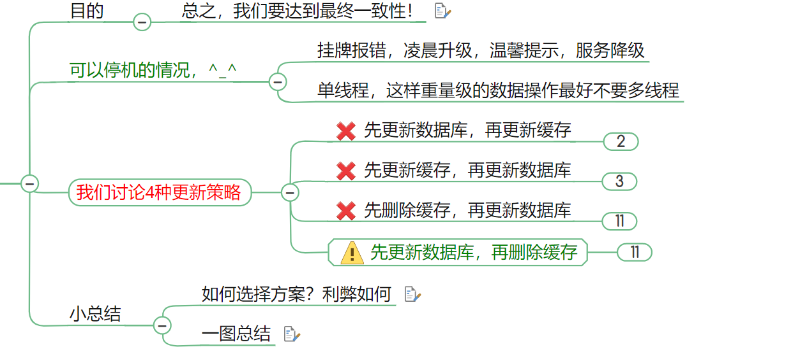

#### 3.3.1 目的

总之我么要达到最终一致性！

**给缓存设置过期时间，定期清理缓存并回写，是保证最终一致性的解决方案。**

我们可以对存入缓存的数据设置过期时间，所有的**写操作以数据库为准**，对缓存操作只是尽最大努力即可。也就是说如果数据库写成功，缓存更新失败，那么只要到达过期时间，则后面的读请求自然会从数据库中读取新值然后回填缓存，达到一致性，**切记，要以mysql的数据库写入库为准。**

上述方案和后续落地案例是调研后的主流+成熟的做法，但是考虑到各个公司业务系统的差距，**不是100%绝对正确，不保证绝对适配全部情况**，请同学们自行酌情选择打法，合适自己的最好。

#### 3.3.2 可以停机的情况

- 挂牌报错，凌晨升级，温馨提示，服务降级
- 单线程，这样重量级的数据操作最好不要多线程

#### 3.3.3 四种更新策略

##### 3.3.3.1 先更新数据库，再更新缓存

###### 1、单线程下可能会存在的问题

1. 先更新mysql的某商品的库存，当前商品的库存是100，更新为99个。
2. 先更新mysql修改为99成功，然后更新redis。
3. **此时假设异常出现**，更新redis失败了，这导致mysql里面的库存是99而redis里面的还是100 。
4. 上述发生，会让数据库里面和缓存redis里面数据不一致，**读到redis脏数据**

| 线程  | 缓存                                | 数据库                |
| ----- | ----------------------------------- | --------------------- |
|       | 库存100                             | 库存100               |
| 线程A | 库存100                             | 库存100 -> 99，库存99 |
| 线程A | 库存100 -> 99(更新失败),库存还是100 | 库存99                |

这样数据就出现了不一致问题

###### 2、多线程下可能存在的问题

【先更新数据库，再更新缓存】，A、B两个线程发起调用

**【正常逻辑】**

1 A update mysql 100

2 A update redis 100

3 B update mysql 80

4 B update redis 80

=============================

**【异常逻辑】多线程环境下，A、B两个线程有快有慢，有前有后有并行**

1 A update mysql 100

3 B update mysql 80

4 B update redis 80

2 A update redis 100

 =============================

最终结果，mysql和redis数据不一致，o(╥﹏╥)o，

mysql80,redis100

**个人版理解**

| 线程  | 缓存                  | 数据库                |
| ----- | --------------------- | --------------------- |
|       | 库存100               | 库存100               |
| 线程A | 库存100               | 库存100 -> 99，库存99 |
| 线程B | 库存100               | 库存99 -> 98，库存98  |
| 线程B | 库存100 -> 98, 库存98 | 库存98                |
| 线程A | 库存98 -> 99, 库存99  | 库存98                |

这样缓存与数据库数据存在了不一致的情况

##### 3.3.3.2 先更新缓存库，再更新数据库

不太推荐，业务上一般把mysql作为底单数据库，保证最后解释

存在的问题

【先更新缓存，再更新数据库】，A、B两个线程发起调用

**【正常逻辑】**

1 A update redis 100

2 A update mysql 100

3 B update redis 80

4 B update mysql 80

====================================

**【异常逻辑】多线程环境下，A、B两个线程有快有慢有并行**

A update redis  100

B update redis  80

B update mysql 80

A update mysql 100

----mysql100,redis80

**个人版理解**

| 线程  | 缓存                  | 数据库                |
| ----- | --------------------- | --------------------- |
|       | 库存100               | 库存100               |
| 线程A | 库存100 -> 99，库存99 | 库存100               |
| 线程B | 库存99 -> 98，库存98  | 库存100               |
| 线程B | 库存98                | 库存100 -> 98, 库存98 |
| 线程A | 库存98                | 库存98 -> 99, 库存99  |


##### 3.3.3.1 先删缓存，再更新数据库

###### 1、问题分析

> 阳哥自己这里写20秒，是自己故意乱写的，表示更新数据库可能失败，实际中不可能

1、A线程先成功删除了redis里面的数据，然后去更新mysql，此时mysql正在更新中，还没有结束。（比如网络延时） B突然出现要来读取缓存数据。

```java
    public void deleteOrderData(Order order) {
        try (Jedis jedis = RedisUtils.getJedis()) {
            // 1 线程A先删除redis缓存
            jedis.del(order.getId() + "");
            // 2 线程A再更新mysql
            orderDao.update(order);

            // 暂停20秒，其它业务逻辑导致耗时，20是随便乱写的，只是为了讲解技术方便
            try {
                TimeUnit.SECONDS.sleep(20L);
            } catch (InterruptedException e) {
                e.printStackTrace();
            }
        }
    }
```

2、此时redis里面的数据是空的，B线程来读取，先去读redis里数据(已经被A线程delete掉了)，此处出来2个问题：

​	2.1、B从mysql获得了旧值，B线程发现redis里没有(缓存缺失)马上去mysql里面读取，从数据库里面读取来的是旧值。

​    2.2、B会把获得的旧值写回redis，获得旧值数据后返回前台并回写进redis(刚被A线程删除的旧数据有极大可能又被写回了)。

```java
    public Order seletcOrderData(Order order) {
        try (Jedis jedis = RedisUtils.getJedis()) {
            // 1 先去redis中查找，找不到再去mysql中查找
            String result = jedis.get(order.getId() + "");

            if (result != null && !result.isEmpty()) {
                return (Order) JSON.parse(result);
            }

            // 2 线程B会将mysql中查到的旧数据回写到redis
            order = orderDao.get(order.getId() + "", order.toString());
            return order;

        } catch (Exception e) {
            e.printStackTrace();
        }
        return null;
    }
```

3、A线程更新完mysql，发现redis里面的缓存是脏数据，A线程直接懵逼，两个并发操作，一个是更新操作，另一个是查询操作，A删除缓存后，B查询操作没有命中缓存，B先把老数据读出来后放到缓存中，然后A更新操作更新了数据库。 

于是，在缓存中的数据还是老的数据，导致缓存中的数据是脏的，而且还一直这样脏下去了。

4、总结流程：

（1）请求A进行写操作，删除redis缓存后，工作正在进行中，更新mysql......A还么有彻底更新完mysql，还没commit

（2）请求B开工查询，查询redis发现缓存不存在(被A从redis中删除了)

（3）请求B继续，去数据库查询得到了mysql中的旧值(A还没有更新完)

（4）请求B将旧值写回redis缓存

（5）请求A将新值写入mysql数据库 

上述情况就会导致不一致的情形出现。 

| 时间 | 线程A                                                        | 线程B                                                        | 出现的问题                                                   |
| ---- | ------------------------------------------------------------ | ------------------------------------------------------------ | ------------------------------------------------------------ |
| t1   | 线程A进行写操作，删除缓存成功后，更新MySQL的工作还在执行中... |                                                              |                                                              |
| t2   |                                                              | 1、由于缓存已经删除了数据，所以会请求mysql，但是A的更新操作还未执行完成，所以此时读取到的还是旧值<br>2、将从MySQL读取的旧值，写回到了redis | 1、A还未更新完mysql，导致B读到了旧值<br>2、线程B遵守回写机制，把旧值写回redis，导致其它请求读取的还是旧值，产生了脏写问题 |
| t3   | A更新完MySQL中的值，执行完成                                 |                                                              | **此时redis中存的是B线程写回的旧值<br>mysql中存的是被A线程更新过的值<br>出现了数据不一致的问题** |

**总结一下**：先删缓存，再更新数据库

如果数据库更新失败或超时或返回不及时，导致线程B请求redis，发现redis中没有数据，线程B再去读MySQL时，从数据库读到旧值，并回写到redis中，产生了脏写问题。

###### 2、问题解决: 延迟双删

```java
    public void deleteOrderData(Order order) {
        try (Jedis jedis = RedisUtils.getJedis()) {
            // 1 线程A先删除redis缓存
            jedis.del(order.getId() + "");
            // 2 线程A再更新mysql
            orderDao.update(order);

            // 暂停2秒，其它业务逻辑导致耗时
            try {
                TimeUnit.SECONDS.sleep(2L);
            } catch (InterruptedException e) {
                e.printStackTrace();
            }
            // 删两次，以确保数据库和缓存中的数据能够达到最终一致
            jedis.del(order.getId() + "");
        }
    }
```

这段代码sleep的这段时间，就是为了让线程B能够先从数据库读取数据，再把缺失的数据写入缓存，然后线程A再进行删除。所以，线程A sleep的时间，就需要大于线程B读取数据再写入缓存的时间。这样一来，其它线程读取数据时，就会发现缓存缺失，所以会从数据库中读取最新值。因为这个方案会在第一次删除缓存值后，延迟一段时间再次进行删除，所以我们也把它叫做“延迟双删”

###### 3、延迟双删存在的问题

**3.1、这个删除该休眠多久呢？**

线程A sleep的时间，就需要大于线程B读取数据再写入缓存的时间。

这个时间怎么确定呢？

**第一种方法：**

在业务程序运行的时候，统计下线程读数据和写缓存的操作时间，自行评估自己的项目的读数据业务逻辑的耗时，以此为基础来进行估算。然后写数据的休眠时间则在读数据业务逻辑的耗时基础上加**百毫秒**即可。这么做的目的，就是确保读请求结束，写请求可以删除读请求造成的缓存脏数据。

**第二种方法**：

新启动一个后台监控程序，比如后面要讲解的WatchDog监控程序，会加时

**3.2 这种同步淘汰策略，会造成吞吐量降低怎么办？**

```java
    public void deleteDoubleOrderDelay(Order order) {
        try (Jedis jedis = RedisUtils.getJedis()) {
            // 1 线程A先删除redis缓存
            jedis.del(order.getId() + "");
            // 2 线程A再更新mysql
            orderDao.update(order);

            // 第二次删除作为异步操作。自己起一个线程，异步删除
            // 这样，写的请求就不用再沉睡一段时间后，再返回了，这么做，提升了吞吐量
            CompletableFuture.supplyAsync(() -> jedis.del(order.getId() + "")).whenComplete((t, u) -> {
                System.out.printf("-------t: %s\n", t);
                System.out.printf("-------t: %s\n", u);
            }).exceptionally(throwable -> {
                System.out.printf("-------t: %s\n", throwable);
                return 44L;
            }).get();
        } catch (Exception e) {
            e.printStackTrace();
        }
    }

```


**3.3 后续的看门狗WatchDog源码分析**


##### 3.3.3.1 先更新数据库，再删除缓存

###### 1、存在的问题

| 时间 | 线程A                  | 线程B                                     | 出现的问题                                         |
| ---- | ---------------------- | ----------------------------------------- | -------------------------------------------------- |
| t1   | 更新数据库中值         |                                           |                                                    |
| t2   |                        | 缓存立刻命中，此时B读取的是缓存中的旧值。 | A还没有来得及删除缓存中的值，导致B命中缓存中的旧值 |
| t3   | 更新缓存中的数据，over |                                           |                                                    |

> **先更新数据库，再删除缓存**
>
> 假如缓存删除失败或者来不及，导致请求再次访问redis时缓存命中，读取到的是缓存旧值。

###### 2、指导思想

2.1、[微软云](https://learn.microsoft.com/en-us/azure/architecture/patterns/cache-aside)

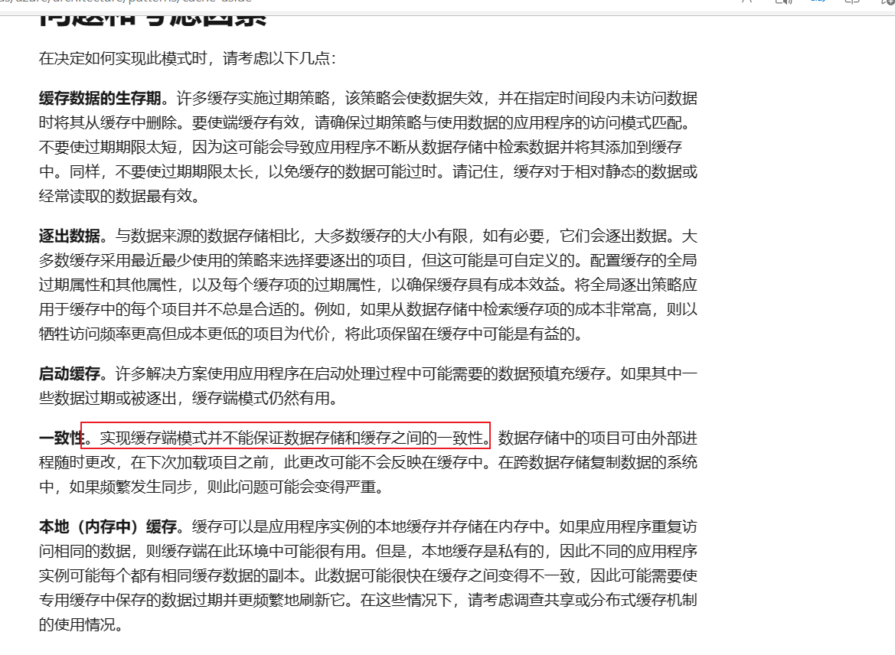

2.2 **阿里的canal**

通过canal订阅MySQL的binlog日志

###### 3、解决方案

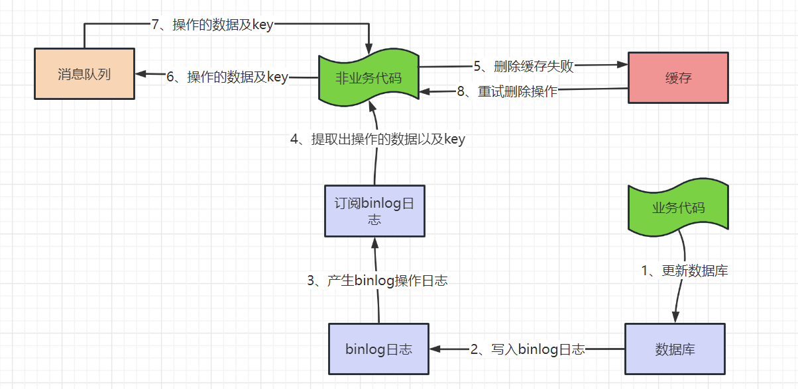

> 流程图解释：
>
> 1. 更新数据库
> 2. 数据库会将操作信息写入binlog日志当中
> 3. 订阅程序会提取出所需要的数据及key
> 4. 另起一段非业务代码，获得该信息
> 5. 尝试删除缓存操作，发现删除失败
> 6. 将这些信息发送到消息队列
> 7. 重新从消息队列中获得该数据，然后进行重试操作

**补充说明**

> 1 可以把要删除的缓存值或者是要更新的数据库值暂存到消息队列中（例如使用`Kafka/RabbitMQ`等）。
>
> 2 当程序没有能够成功地删除缓存值或者是更新数据库值时，可以从消息队列中重新读取这些值，然后再次进行删除或更新。
>
> 3 如果能够成功地删除或更新，我们就要把这些值从消息队列中去除，以免重复操作，此时，我们也可以保证数据库和缓存的数据一致了，否则还需要再次进行重试
>
> 4 如果重试超过的一定次数后还是没有成功，我们就需要向业务层发送报错信息了，通知运维人员。


###### 4、类似经典的分布式事务问题，只有一个权威答案：最终一致性

- 流量充值，先下发短信实际充值可能滞后5分钟，可以接受
- 电商发货，短信下发但是物流明天见


#### 3.3.4 小总结

**1、如何选择，利弊如何**

在大多数业务场景下， 

阳哥个人建议是(仅代表我个人，不权威)，优先**使用先更新数据库，再删除缓存的方案(先更库→后删存)**。理由如下：

1 先删除缓存值再更新数据库，有可能导致请求因缓存缺失而访问数据库，给数据库带来压力导致打满mysql。

2 如果业务应用中读取数据库和写缓存的时间不好估算，那么，延迟双删中的等待时间就不好设置。

多补充一句：如果**使用先更新数据库，再删除缓存的方案**

如果业务层要求必须读取一致性的数据，那么我们就需要在更新数据库时，先在Redis缓存客户端暂停并发读请求，等数据库更新完、缓存值删除后，再读取数据，从而保证数据一致性，这是理论可以达到的效果，但实际，不推荐，因为真实生产环境中，分布式下很难做到实时一致性，**一般都是最终一致性**，请大家参考。

**2、一图总结**

| 策略                         | 高并发多线程条件下 | 问题                                                 | 现象                                                         | 解决方案                                                |
| ---------------------------- | ------------------ | ---------------------------------------------------- | ------------------------------------------------------------ | ------------------------------------------------------- |
| 先删redis，再更新mysql       | 无                 | 缓存删除成功，但数据库更新失败                       | 存在从数据库中读取到旧值的问题                               | 再次更新数据库，重试                                    |
|                              | 有                 | 缓存删除成功，但数据库更新过程中存在并发读请求       | 并发读请求从数据库读到旧值并回写到redis，导致后续都是从redis中读取到旧值 | 延迟双删                                                |
| **先更新mysql，再删除redis** | 无                 | 数据库更新成功，但缓存删除失败                       | 从redis中读取到旧值                                          | 再次删除缓存，重试                                      |
|                              | 有                 | 数据库更新成功，但是在缓存删除的过程中存在并发读请求 | 并发读请求从缓存中读到旧值                                   | 等redis删除完成，这段时间存在数据不一致的问题，短暂存在 |


## 4 Redis与MySQL数据双写一致性工程落地案例

### 4.1 复习

1、先动MySQL，再动redis，两害相衡取其轻，避免redis业务key突然消失，多线程请求直接打满MySQL

2、先更新数据库，再删除缓存。尝试采用双检加锁机制锁住mysql，只让一个请求线程回写redis，完成数据一致性。

3、面试题提问：我想只要mysql有记录改动了（有增删改的操作），立刻同步到redis中，该如何实现？

4、双检加锁策略

多个线程同时去查询数据库的这条数据，那么我们可以在第一个查询数据的请求上使用一个互斥锁来锁住它。

其他的线程走到这一步拿不到锁就等着，等第一个线程查询到了数据，然后写入缓存。

后面的线程进来发现已经有缓存了，就直接走缓存。 

```java
    public String get(String key) {
        try (Jedis jedis = new Jedis()) {
            String value = jedis.get(key); // 查询缓存
            if (value != null && value.length() > 0) {
                // 缓存存在的话，那么就直接返回
                return value;
            }

            // 缓存不存在则对需要加锁
            // 假设请求量很大，则缓存需要设置自动过期时间
            synchronized (JedisUtils.class) {
                // 这里加锁的目的是为了防止高并发下有其余线程修改了redis中的值
                value = jedis.get(key);
                if (value != null && value.length() > 0) {
                    return value;
                }

                // 经过两次查询redis之后，都没数据，就从mysql中查询
                value = dao.get(key);

                // 将数据写入缓存
                jedis.setex(key, KEY_TTL, value);
                return value;
            }
        }
    }
```

### 4.2 canal简介

#### 4.2.1 canal是什么

> `canal [kə'næl]`，中文翻译为 水道/管道/沟渠/运河，主要用途是用于 MySQL 数据库增量日志数据的订阅、消费和解析，是阿里巴巴开发并开源的，采用Java语言开发；
>
> 历史背景是早期阿里巴巴因为杭州和美国双机房部署，存在跨机房数据同步的业务需求，实现方式主要是基于业务 trigger（触发器） 获取增量变更。从2010年开始，阿里巴巴逐步尝试采用解析数据库日志获取增量变更进行同步，由此衍生出了canal项目；

[canal官网](https://github.com/alibaba/canal/wiki)


`canal [kə'næl]`，译意为水道/管道/沟渠，主要用途是基于 MySQL 数据库增量日志解析，提供增量数据订阅和消费

**工作原理**

- canal 模拟 MySQL slave 的交互协议，伪装自己为 MySQL slave ，向 MySQL master 发送 dump 协议
- MySQL master 收到 dump 请求，开始推送 binary log 给 slave (即 canal )
- canal 解析 binary log 对象(原始为 byte 流)

#### 4.2.2 canal能干嘛

- 数据库镜像
- 数据库实时备份
- 索引构建和实时维护（拆分异构索引、倒排索引等）
- 业务cache刷新
- 带业务逻辑的增量数据处理

#### 4.2.3 canal去哪下载

[canal-1.1.6](https://github.com/alibaba/canal/releases/tag/canal-1.1.6)

#### 4.2.4 工作原理，面试回答

##### 4.2.4.1 传统MySQL主从复制的工作原理

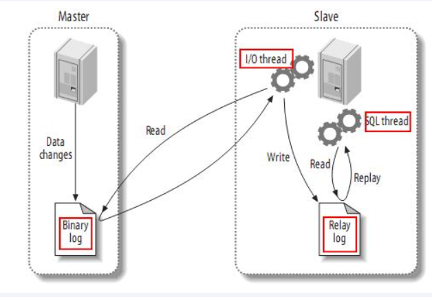

MySQL的主从复制将经过如下步骤：

1、当 master 主服务器上的数据发生改变时，则将其改变写入二进制事件日志文件中；

2、salve 从服务器会在一定时间间隔内对 master 主服务器上的二进制日志进行探测，探测其是否发生过改变，如果探测到 master 主服务器的二进制事件日志发生了改变，则开始一个 `I/O Thread` 请求 master 二进制事件日志；

3、同时 master 主服务器为每个 `I/O Thread` 启动一个dump Thread，用于向其发送二进制事件日志；

4、slave 从服务器将接收到的二进制事件日志保存至自己本地的中继日志文件中；

5、salve 从服务器将启动 SQL Thread 从中继日志中读取二进制日志，在本地重放，使得其数据和主服务器保持一致；

6、最后 `I/O Thread` 和 SQL Thread 将进入睡眠状态，等待下一次被唤醒；

##### 4.2.4.2  canal工作原理


**工作原理**

- canal 模拟 MySQL slave 的交互协议，伪装自己为 MySQL slave ，向 MySQL master 发送 dump 协议
- MySQL master 收到 dump 请求，开始推送 binary log 给 slave (即 canal )
- canal 解析 binary log 对象(原始为 byte 流)

### 4.3 使用canal完成的双写一致性编码

#### 4.3.1 案例来源

[案例来源](https://github.com/alibaba/canal/wiki/ClientExample)

##### 1、添加依赖

```
<dependency>
    <groupId>com.alibaba.otter</groupId>
    <artifactId>canal.client</artifactId>
    <version>1.1.0</version>
</dependency>
```

##### 2、编码

```java
package com.alibaba.otter.canal.sample;
import java.net.InetSocketAddress;
import java.util.List;


import com.alibaba.otter.canal.client.CanalConnectors;
import com.alibaba.otter.canal.client.CanalConnector;
import com.alibaba.otter.canal.common.utils.AddressUtils;
import com.alibaba.otter.canal.protocol.Message;
import com.alibaba.otter.canal.protocol.CanalEntry.Column;
import com.alibaba.otter.canal.protocol.CanalEntry.Entry;
import com.alibaba.otter.canal.protocol.CanalEntry.EntryType;
import com.alibaba.otter.canal.protocol.CanalEntry.EventType;
import com.alibaba.otter.canal.protocol.CanalEntry.RowChange;
import com.alibaba.otter.canal.protocol.CanalEntry.RowData;


public class SimpleCanalClientExample {


public static void main(String args[]) {
    // 创建链接
    CanalConnector connector = CanalConnectors.newSingleConnector(new InetSocketAddress(AddressUtils.getHostIp(),
                                                                                        11111), "example", "", "");
    int batchSize = 1000;
    int emptyCount = 0;
    try {
        connector.connect();
        connector.subscribe(".*\\..*");
        connector.rollback();
        int totalEmptyCount = 120;
        while (emptyCount < totalEmptyCount) {
            Message message = connector.getWithoutAck(batchSize); // 获取指定数量的数据
            long batchId = message.getId();
            int size = message.getEntries().size();
            if (batchId == -1 || size == 0) {
                emptyCount++;
                System.out.println("empty count : " + emptyCount);
                try {
                    Thread.sleep(1000);
                } catch (InterruptedException e) {
                }
            } else {
                emptyCount = 0;
                // System.out.printf("message[batchId=%s,size=%s] \n", batchId, size);
                printEntry(message.getEntries());
            }

            connector.ack(batchId); // 提交确认
            // connector.rollback(batchId); // 处理失败, 回滚数据
        }

        System.out.println("empty too many times, exit");
    } finally {
        connector.disconnect();
    }
}

private static void printEntry(List<Entry> entrys) {
    for (Entry entry : entrys) {
        if (entry.getEntryType() == EntryType.TRANSACTIONBEGIN || entry.getEntryType() == EntryType.TRANSACTIONEND) {
            continue;
        }

        RowChange rowChage = null;
        try {
            rowChage = RowChange.parseFrom(entry.getStoreValue());
        } catch (Exception e) {
            throw new RuntimeException("ERROR ## parser of eromanga-event has an error , data:" + entry.toString(),
                                       e);
        }

        EventType eventType = rowChage.getEventType();
        System.out.println(String.format("================&gt; binlog[%s:%s] , name[%s,%s] , eventType : %s",
                                         entry.getHeader().getLogfileName(), entry.getHeader().getLogfileOffset(),
                                         entry.getHeader().getSchemaName(), entry.getHeader().getTableName(),
                                         eventType));

        for (RowData rowData : rowChage.getRowDatasList()) {
            if (eventType == EventType.DELETE) {
                printColumn(rowData.getBeforeColumnsList());
            } else if (eventType == EventType.INSERT) {
                printColumn(rowData.getAfterColumnsList());
            } else {
                System.out.println("-------&gt; before");
                printColumn(rowData.getBeforeColumnsList());
                System.out.println("-------&gt; after");
                printColumn(rowData.getAfterColumnsList());
            }
        }
    }
}

private static void printColumn(List<Column> columns) {
    for (Column column : columns) {
        System.out.println(column.getName() + " : " + column.getValue() + "    update=" + column.getUpdated());
    }
}

    
  

}
```

#### 4.3.2 MySQL准备工作

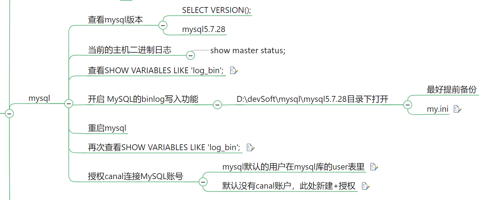

##### 1、查看MySQL版本

> ps: 版本大于5.7.28

```mysql
mysql> select version();
+-----------+
| version() |
+-----------+
| 8.0.33    |
+-----------+
1 row in set (0.00 sec)

mysql>
```

##### 2、当前的主机二进制日志

```mysql
show master status;
```

```mysql
mysql> show master status;
+---------------+----------+--------------+------------------+-------------------+
| File          | Position | Binlog_Do_DB | Binlog_Ignore_DB | Executed_Gtid_Set |
+---------------+----------+--------------+------------------+-------------------+
| binlog.000004 |   397437 |              |                  |                   |
+---------------+----------+--------------+------------------+-------------------+
1 row in set (0.01 sec)

mysql>
```

##### 3、查看binlog是否开启

```mysql
show variables like 'log_bin';
```

```mysql
mysql> show variables like 'log_bin';
+---------------+-------+
| Variable_name | Value |
+---------------+-------+
| log_bin       | OFF    |
+---------------+-------+
1 row in set, 1 warning (0.00 sec)
```

##### 4、如何开启MySQL的binlog写入功能

在MySQL的安装目录，本人本机是:`C:\DISH\JavaAPP\MySQL\mysql-8.0.33-winx64`

> 最好是备份下`my.ini`

my.ini配置说明

```ini
log-bin=mysql-bin #开启 binlog
binlog-format=ROW #选择 ROW 模式
server_id=1    #配置MySQL replaction需要定义，不要和canal的 slaveId重复
```

> - **ROW模式**：除了记录sql语句之外，还会记录每个字段的变化情况，能够清楚的记录每行数据的变化历史，但会占用较多的空间
> - **STATEMENT模式**：只记录了sql语句，但是没有记录上下文信息，在进行数据恢复的时候可能会导致数据的丢失情况；
> - **MIX模式**：比较灵活的记录，理论上说当遇到了表结构变更的时候，就会记录为statement模式。当遇到了数据更新或者删除情况下就会变为row模式；

##### 5、重启MySQL

```bash
# 停止MySQL
net stop mysql

# 启动MySQL
net start mysql
```

```bash
C:\WINDOWS\system32>net stop mysql
MySQL 服务正在停止..
MySQL 服务已成功停止。


C:\WINDOWS\system32>net start mysql
MySQL 服务正在启动 .
MySQL 服务已经启动成功。


C:\WINDOWS\system32>
```

##### 6、再次查看`show variables like 'log_bin';`

```mysql
show variables like 'log_bin';
```

```mysql
mysql> show variables like 'log_bin';
+---------------+-------+
| Variable_name | Value |
+---------------+-------+
| log_bin       | ON    |
+---------------+-------+
1 row in set, 1 warning (0.01 sec)

mysql>
```

##### 7、授权canal连接MySQL账号

###### 7.1、MySQL默认的用户在mysql库的user表中

```mysql
 SELECT mu.Host, mu.User, mu.plugin, mu.authentication_string, mu.password_expired, mu.password_last_changed, mu.account_locked FROM mysql.user AS mu;
```

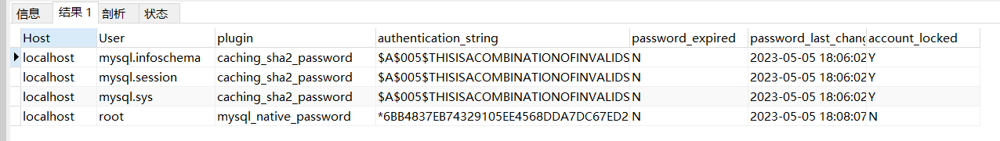

###### 7.2、默认是没有canal账户的，此处需要创建canal用户和授权

**ps: MySQL5.* 版本写法**

```mysql
USE mysql;

SELECT host, user, plugin FROM user;

DROP USER IF EXISTS 'canal'@'%';
CREATE USER 'canal'@'%' IDENTIFIED BY 'canal';  
GRANT ALL PRIVILEGES ON *.* TO 'canal'@'%' IDENTIFIED BY 'canal';  
FLUSH PRIVILEGES;

SELECT host, user, plugin FROM user;
```

ps：MySQL8.*版本写法

```mysql
USE mysql;

SELECT host, user, plugin FROM user;

DROP USER IF EXISTS 'canal'@'%';
ALTER user 'canal'@'%' IDENTIFIED WITH mysql_native_password BY 'canal';
GRANT ALL PRIVILEGES ON *.* TO 'canal'@'%';  
FLUSH PRIVILEGES;


SELECT host, user, plugin FROM user;
```

```mysql
mysql> USE mysql;
Database changed
mysql> SELECT host, user, plugin FROM user;
+-----------+------------------+-----------------------+
| host      | user             | plugin                |
+-----------+------------------+-----------------------+
| localhost | mysql.infoschema | caching_sha2_password |
| localhost | mysql.session    | caching_sha2_password |
| localhost | mysql.sys        | caching_sha2_password |
| localhost | root             | mysql_native_password |
+-----------+------------------+-----------------------+
5 rows in set (0.00 sec)

mysql> DROP USER IF EXISTS 'canal'@'%';
Query OK, 0 rows affected (0.00 sec)

mysql>
mysql> ALTER user 'canal'@'%' IDENTIFIED WITH mysql_native_password BY 'canal';
Query OK, 0 rows affected (0.00 sec)

mysql>  FLUSH PRIVILEGES;
Query OK, 0 rows affected (0.00 sec)

mysql>  SELECT host, user, plugin FROM user;
+-----------+------------------+-----------------------+
| host      | user             | plugin                |
+-----------+------------------+-----------------------+
| %         | canal            | mysql_native_password |
| localhost | mysql.infoschema | caching_sha2_password |
| localhost | mysql.session    | caching_sha2_password |
| localhost | mysql.sys        | caching_sha2_password |
| localhost | root             | mysql_native_password |
+-----------+------------------+-----------------------+
5 rows in set (0.00 sec)

mysql>
```

#### 4.3.3 canal的下载与安装

##### 1、下载

```bash
wget https://github.com/alibaba/canal/releases/download/canal-1.1.6/canal.deployer-1.1.6.tar.gz -O ./canal-1.1.6.tar.gz
```

##### 2、解压到`/usr/local/canal`

##### 3、修改`/usr/local/canal/conf/example`路径下的`instance.properties`文件

将下图的所示的内容替换成自己的MySQL主机master的IP地址

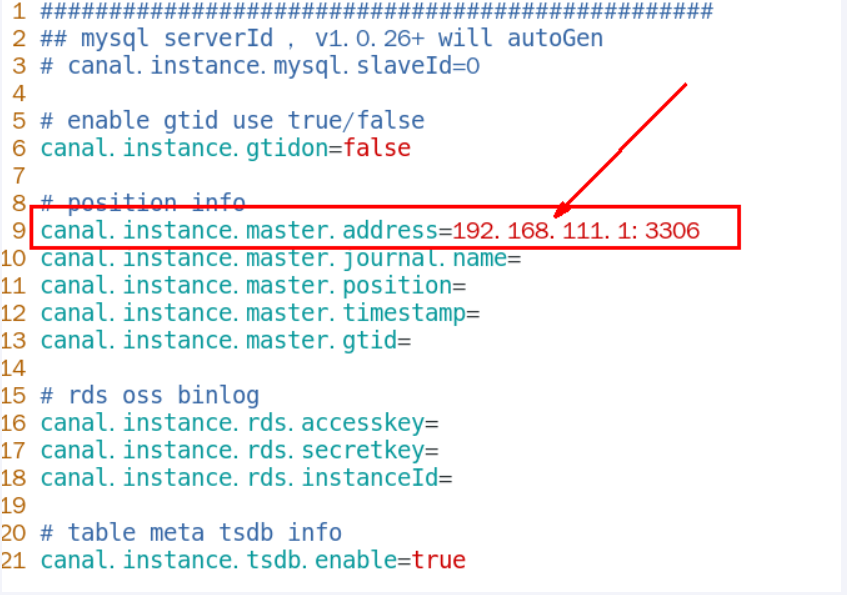

将下图的中账号替换成自己在MySQL中创建的canal账户

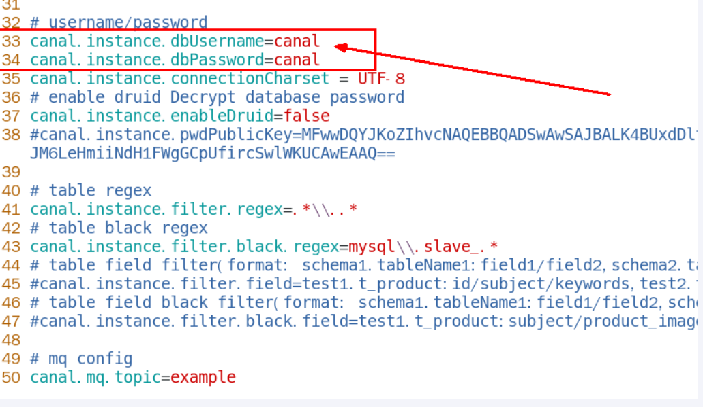

建议配置只监听特定的表或库

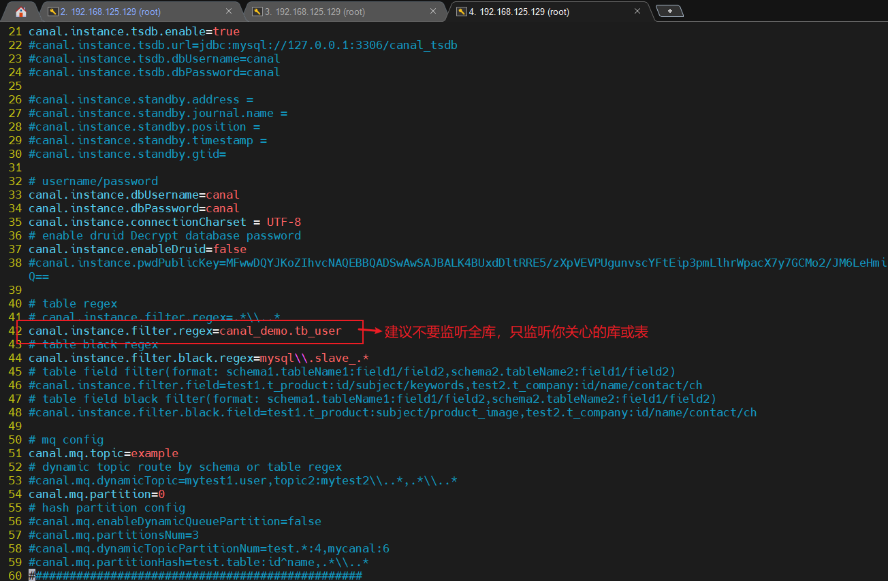

##### 4、启动，在`/usr/local/canal/bin`下启动`./startup.sh`脚本

##### 5、判断是否启动成功

###### 5.1、查看server日志

```sh
[root@localhost bin]# cd /usr/local/canal/logs/canal/
[root@localhost canal]# ll
总用量 8
-rw-r--r--. 1 root root 636 5月  15 16:39 canal.log
-rw-r--r--. 1 root root 972 5月  15 16:39 canal_stdout.log
-rw-r--r--. 1 root root   0 5月  15 16:39 rocketmq_client.log
[root@localhost canal]# pwd
/usr/local/canal/logs/canal
[root@localhost canal]# cat canal.log
2023-05-15 16:39:43.794 [main] INFO  com.alibaba.otter.canal.deployer.CanalLauncher - ## set default uncaught exception handler
2023-05-15 16:39:43.812 [main] INFO  com.alibaba.otter.canal.deployer.CanalLauncher - ## load canal configurations
2023-05-15 16:39:43.820 [main] INFO  com.alibaba.otter.canal.deployer.CanalStarter - ## start the canal server.
2023-05-15 16:39:43.884 [main] INFO  com.alibaba.otter.canal.deployer.CanalController - ## start the canal server[192.168.125.129(192.168.125.129):11111]
2023-05-15 16:39:45.596 [main] INFO  com.alibaba.otter.canal.deployer.CanalStarter - ## the canal server is running now ......
[root@localhost canal]#

```


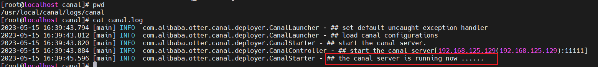

###### 5.2、查看样例example的日志

```sh
[root@localhost example]# pwd
/usr/local/canal/logs/example
[root@localhost example]# ll
总用量 40
-rw-r--r--. 1 root root 38055 5月  15 16:42 example.log

```


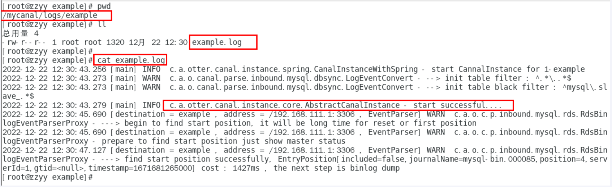

#### 4.3.4 canal客户端（Java编写业务程序）

##### 1、SQL脚本

1 随便选个数据库，以你自己为主，本例bigdata，按照下面建表

```mysql
-- ----------------------------
-- Table structure for tb_user
-- ----------------------------
DROP TABLE IF EXISTS `tb_user`;
CREATE TABLE `tb_user`  (
  `id` bigint(0) NOT NULL AUTO_INCREMENT,
  `user_name` varchar(255) CHARACTER SET utf8mb4 COLLATE utf8mb4_0900_ai_ci NULL DEFAULT NULL,
  PRIMARY KEY (`id`) USING BTREE
) ENGINE = InnoDB CHARACTER SET = utf8mb4 COLLATE = utf8mb4_0900_ai_ci ROW_FORMAT = Dynamic;

SET FOREIGN_KEY_CHECKS = 1;

```


##### 2、建module

canal-demo

##### 3、改pom

```xml
<?xml version="1.0" encoding="UTF-8"?>
<project xmlns="http://maven.apache.org/POM/4.0.0" xmlns:xsi="http://www.w3.org/2001/XMLSchema-instance"
         xsi:schemaLocation="http://maven.apache.org/POM/4.0.0 https://maven.apache.org/xsd/maven-4.0.0.xsd">
    <modelVersion>4.0.0</modelVersion>

    <groupId>com.atguigu.canal</groupId>
    <artifactId>canal-demo02</artifactId>
    <version>1.0-SNAPSHOT</version>

    <parent>
        <groupId>org.springframework.boot</groupId>
        <artifactId>spring-boot-starter-parent</artifactId>
        <version>2.5.14</version>
        <relativePath/>
    </parent>

    <properties>
        <project.build.sourceEncoding>UTF-8</project.build.sourceEncoding>
        <maven.compiler.source>1.8</maven.compiler.source>
        <maven.compiler.target>1.8</maven.compiler.target>
        <junit.version>4.12</junit.version>
        <log4j.version>1.2.17</log4j.version>
        <lombok.version>1.16.18</lombok.version>
        <mysql.version>5.1.47</mysql.version>
        <druid.version>1.1.16</druid.version>
        <mapper.version>4.1.5</mapper.version>
        <mybatis.spring.boot.version>1.3.0</mybatis.spring.boot.version>
    </properties>

    <dependencies>
        <!--canal-->
        <dependency>
            <groupId>com.alibaba.otter</groupId>
            <artifactId>canal.client</artifactId>
            <version>1.1.0</version>
        </dependency>
        <!--SpringBoot通用依赖模块-->
        <dependency>
            <groupId>org.springframework.boot</groupId>
            <artifactId>spring-boot-starter-web</artifactId>
        </dependency>
        <dependency>
            <groupId>org.springframework.boot</groupId>
            <artifactId>spring-boot-starter-actuator</artifactId>
        </dependency>
        <!--swagger2-->
        <dependency>
            <groupId>io.springfox</groupId>
            <artifactId>springfox-swagger2</artifactId>
            <version>2.9.2</version>
        </dependency>
        <dependency>
            <groupId>io.springfox</groupId>
            <artifactId>springfox-swagger-ui</artifactId>
            <version>2.9.2</version>
        </dependency>
        <!--SpringBoot与Redis整合依赖-->
        <dependency>
            <groupId>org.springframework.boot</groupId>
            <artifactId>spring-boot-starter-data-redis</artifactId>
        </dependency>
        <dependency>
            <groupId>org.apache.commons</groupId>
            <artifactId>commons-pool2</artifactId>
        </dependency>
        <!--SpringBoot与AOP-->
        <dependency>
            <groupId>org.springframework.boot</groupId>
            <artifactId>spring-boot-starter-aop</artifactId>
        </dependency>
        <dependency>
            <groupId>org.aspectj</groupId>
            <artifactId>aspectjweaver</artifactId>
        </dependency>
        <!--Mysql数据库驱动-->
        <dependency>
            <groupId>mysql</groupId>
            <artifactId>mysql-connector-java</artifactId>
            <version>5.1.47</version>
        </dependency>
        <!--SpringBoot集成druid连接池-->
        <dependency>
            <groupId>com.alibaba</groupId>
            <artifactId>druid-spring-boot-starter</artifactId>
            <version>1.1.10</version>
        </dependency>
        <dependency>
            <groupId>com.alibaba</groupId>
            <artifactId>druid</artifactId>
            <version>${druid.version}</version>
        </dependency>
        <!--mybatis和springboot整合-->
        <dependency>
            <groupId>org.mybatis.spring.boot</groupId>
            <artifactId>mybatis-spring-boot-starter</artifactId>
            <version>${mybatis.spring.boot.version}</version>
        </dependency>
        <!--通用基础配置junit/devtools/test/log4j/lombok/hutool-->
        <!--hutool-->
        <dependency>
            <groupId>cn.hutool</groupId>
            <artifactId>hutool-all</artifactId>
            <version>5.2.3</version>
        </dependency>
        <dependency>
            <groupId>junit</groupId>
            <artifactId>junit</artifactId>
            <version>${junit.version}</version>
        </dependency>
        <dependency>
            <groupId>org.springframework.boot</groupId>
            <artifactId>spring-boot-starter-test</artifactId>
            <scope>test</scope>
        </dependency>
        <dependency>
            <groupId>log4j</groupId>
            <artifactId>log4j</artifactId>
            <version>${log4j.version}</version>
        </dependency>
        <dependency>
            <groupId>org.projectlombok</groupId>
            <artifactId>lombok</artifactId>
            <version>${lombok.version}</version>
            <optional>true</optional>
        </dependency>
        <!--persistence-->
        <dependency>
            <groupId>javax.persistence</groupId>
            <artifactId>persistence-api</artifactId>
            <version>1.0.2</version>
        </dependency>
        <!--通用Mapper-->
        <dependency>
            <groupId>tk.mybatis</groupId>
            <artifactId>mapper</artifactId>
            <version>${mapper.version}</version>
        </dependency>
        <dependency>
            <groupId>org.springframework.boot</groupId>
            <artifactId>spring-boot-autoconfigure</artifactId>
        </dependency>
        <dependency>
            <groupId>redis.clients</groupId>
            <artifactId>jedis</artifactId>
            <version>3.8.0</version>
        </dependency>
    </dependencies>

    <build>
        <plugins>
            <plugin>
                <groupId>org.springframework.boot</groupId>
                <artifactId>spring-boot-maven-plugin</artifactId>
            </plugin>
        </plugins>
    </build>

</project>


```


##### 4、写yaml

```properties
server.port=5555

# ========================alibaba.druid=====================
spring.datasource.type=com.alibaba.druid.pool.DruidDataSource
spring.datasource.driver-class-name=com.mysql.jdbc.Driver
spring.datasource.url=jdbc:mysql://localhost:3306/canal_demo?useUnicode=true&characterEncoding=utf-8&useSSL=false
spring.datasource.username=root
spring.datasource.password=123456
spring.datasource.druid.test-while-idle=false
```


##### 5、主启动类

```java
package cn.lyf;

import org.springframework.boot.SpringApplication;
import org.springframework.boot.autoconfigure.SpringBootApplication;

/**
 * @author liuyangfang
 * @description
 * @since 2023/5/15 17:29:03
 */
@SpringBootApplication
public class CanalDemoApplication {
    public static void main(String[] args) {
        // SpringApplication.run(CanalDemoApplication.class, args);
    }
}

```


##### 6、业务类

###### 6.1、JedisUtils

```java
package cn.lyf.util;


import redis.clients.jedis.Jedis;
import redis.clients.jedis.JedisPool;
import redis.clients.jedis.JedisPoolConfig;

/**
 * @author liuyangfang
 * @description
 * @since 2023/5/15 17:30:09
 */
public final class JedisUtils {
    private JedisUtils() {
    }

    public static final String REDIS_IP_ADDR = "192.168.125.129";
    public static JedisPool jedisPool;

    static {
        JedisPoolConfig jedisPoolConfig = new JedisPoolConfig();
        jedisPoolConfig.setMaxTotal(20);
        jedisPoolConfig.setMaxIdle(10);
        jedisPool = new JedisPool(jedisPoolConfig, REDIS_IP_ADDR, 6379, 10000);
    }

    public static Jedis getJedis() throws Exception {
        if (jedisPool == null) {
            throw new RuntimeException("Jedis pool is not ok");
        }

        return jedisPool.getResource();
    }
}

```

###### 6.2、RedisCanalClientExample

```java
package cn.lyf.canal.example;

import cn.lyf.util.JedisUtils;
import com.alibaba.fastjson.JSONObject;
import com.alibaba.otter.canal.client.CanalConnector;
import com.alibaba.otter.canal.client.CanalConnectors;
import com.alibaba.otter.canal.protocol.CanalEntry.*;
import com.alibaba.otter.canal.protocol.Message;
import redis.clients.jedis.Jedis;

import java.net.InetSocketAddress;
import java.util.List;
import java.util.UUID;
import java.util.concurrent.TimeUnit;

/**
 * @auther zzyy
 * @create 2022-12-22 12:43
 */
public class RedisCanalClientExample {
    public static final Integer _60SECONDS = 60;
    public static final String REDIS_IP_ADDR = "192.168.125.129";

    private static void redisInsert(List<Column> columns) {
        JSONObject jsonObject = new JSONObject();
        for (Column column : columns) {
            System.out.println(column.getName() + " : " + column.getValue() + "    update=" + column.getUpdated());
            jsonObject.put(column.getName(), column.getValue());
        }
        if (columns.size() > 0) {
            try (Jedis jedis = JedisUtils.getJedis()) {
                jedis.set(columns.get(0).getValue(), jsonObject.toJSONString());
            } catch (Exception e) {
                e.printStackTrace();
            }
        }
    }


    private static void redisDelete(List<Column> columns) {
        JSONObject jsonObject = new JSONObject();
        for (Column column : columns) {
            jsonObject.put(column.getName(), column.getValue());
        }
        if (columns.size() > 0) {
            try (Jedis jedis = JedisUtils.getJedis()) {
                jedis.del(columns.get(0).getValue());
            } catch (Exception e) {
                e.printStackTrace();
            }
        }
    }

    private static void redisUpdate(List<Column> columns) {
        JSONObject jsonObject = new JSONObject();
        for (Column column : columns) {
            System.out.println(column.getName() + " : " + column.getValue() + "    update=" + column.getUpdated());
            jsonObject.put(column.getName(), column.getValue());
        }
        if (columns.size() > 0) {
            try (Jedis jedis = JedisUtils.getJedis()) {
                jedis.set(columns.get(0).getValue(), jsonObject.toJSONString());
                System.out.println("---------update after: " + jedis.get(columns.get(0).getValue()));
            } catch (Exception e) {
                e.printStackTrace();
            }
        }
    }

    public static void printEntry(List<Entry> entrys) {
        for (Entry entry : entrys) {
            if (entry.getEntryType() == EntryType.TRANSACTIONBEGIN || entry.getEntryType() == EntryType.TRANSACTIONEND) {
                continue;
            }

            RowChange rowChage = null;
            try {
                //获取变更的row数据
                rowChage = RowChange.parseFrom(entry.getStoreValue());
            } catch (Exception e) {
                throw new RuntimeException("ERROR ## parser of eromanga-event has an error,data:" + entry, e);
            }
            //获取变动类型
            EventType eventType = rowChage.getEventType();
            System.out.printf("================&gt; binlog[%s:%s] , name[%s,%s] , eventType : %s%n",
                    entry.getHeader().getLogfileName(), entry.getHeader().getLogfileOffset(),
                    entry.getHeader().getSchemaName(), entry.getHeader().getTableName(), eventType);

            for (RowData rowData : rowChage.getRowDatasList()) {
                if (eventType == EventType.INSERT) {
                    redisInsert(rowData.getAfterColumnsList());
                } else if (eventType == EventType.DELETE) {
                    redisDelete(rowData.getBeforeColumnsList());
                } else {//EventType.UPDATE
                    redisUpdate(rowData.getAfterColumnsList());
                }
            }
        }
    }


    public static void main(String[] args) {
        System.out.println("---------O(∩_∩)O哈哈~ initCanal() main方法-----------");

        //=================================
        // 创建链接canal服务端
        CanalConnector connector = CanalConnectors.newSingleConnector(new InetSocketAddress(REDIS_IP_ADDR,
                11111), "example", "", "");
        int batchSize = 1000;
        //空闲空转计数器
        int emptyCount = 0;
        System.out.println("---------------------canal init OK，开始监听mysql变化------");
        try {
            connector.connect();
            //connector.subscribe(".*\\..*");
            connector.subscribe("canal_demo.tb_user");
            connector.rollback();
            int totalEmptyCount = 10 * _60SECONDS;
            while (emptyCount < totalEmptyCount) {
                System.out.println("我是canal，每秒一次正在监听:" + UUID.randomUUID());
                Message message = connector.getWithoutAck(batchSize); // 获取指定数量的数据
                long batchId = message.getId();
                int size = message.getEntries().size();
                if (batchId == -1 || size == 0) {
                    emptyCount++;
                    try {
                        TimeUnit.SECONDS.sleep(1);
                    } catch (InterruptedException e) {
                        e.printStackTrace();
                    }
                } else {
                    //计数器重新置零
                    emptyCount = 0;
                    printEntry(message.getEntries());
                }
                connector.ack(batchId); // 提交确认
                // connector.rollback(batchId); // 处理失败, 回滚数据
            }
            System.out.println("已经监听了" + totalEmptyCount + "秒，无任何消息，请重启重试......");
        } finally {
            connector.disconnect();
        }
    }
}


```


##### 7、题外话

###### 7.1、java程序中的`connector.subscribe`配置的过滤正则

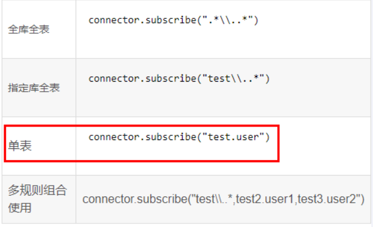

###### 7.2、关闭资源代码简写`try-with-resources`释放资源

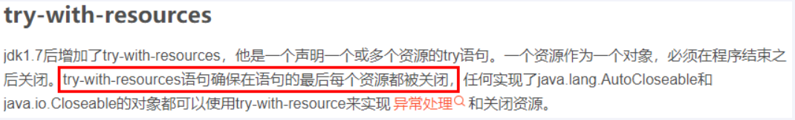


## 5 Redis的高级数据结构bitmap/hyperloglog/GEO

### 5.1 面试题

1、抖音电商直播，主播介绍的商品有评论，1个商品对应一系列评论，排序+展现+取前10条记录

2、用户在手机APP上的签到打卡信息：1天对应1系列用户的签到记录，新浪微博、钉钉打卡签到，来没来如何统计？

3、应用网站上的网页访问信息：1个网页对应1系列的访问点击，淘宝网首页，每天有多少人浏览首页？

4、你们公司系统上线后，说下UV、PV、DAU分别是多少？

5、记录对集合中的数据进行统计 

6、在移动应用中，需要统计每天的新增用户数和第2天的留存用户数；

7、在电商网站的商品评论中，需要统计评论列表中的最新评论；

8、在签到打卡中，需要统计一个月内连续打卡的用户数；

9、在网页访问记录中，需要统计独立访客（Unique Visitor，UV）量。

10、类似今日头条、抖音、淘宝这样的额用户访问级别都是亿级的，请问如何处理？

#### 5.3.1 需求痛点

- 亿级数据的收集+清洗+统计+展现
- 存的块+取得快+多维度
- 真正有价值的是统计

### 5.2 统计的类型

亿级系统中的常见的四种统计

#### 5.2.1 聚合统计

1、统计多个集合元素的聚合结果，就是前面讲解过的**交差并等集合统计**

2、复习命令

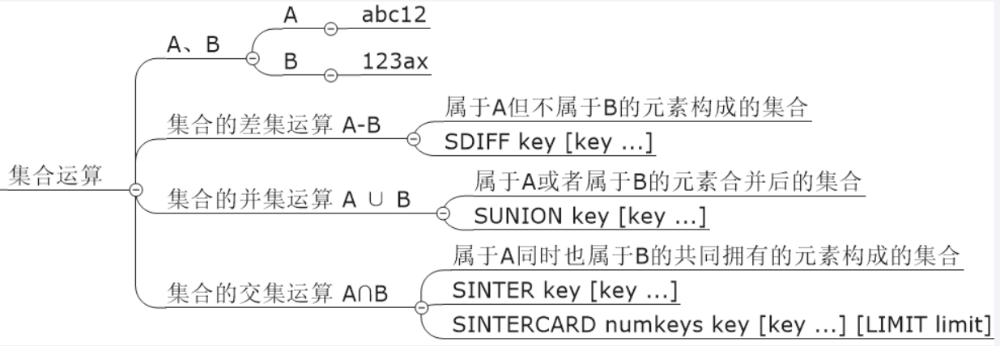

```shell
127.0.0.1:6379> SADD A zhangsan lisi wangwu zhaoliu liudehua
(integer) 5
127.0.0.1:6379> SADD B zhangsan lisi liuyifei zhoujielun zhangjie
(integer) 5
127.0.0.1:6379> SDIFF A B
1) "liudehua"
2) "zhaoliu"
3) "wangwu"
127.0.0.1:6379> SDIFF B A
1) "zhangjie"
2) "zhoujielun"
3) "liuyifei"
127.0.0.1:6379> SUNION A B
1) "zhoujielun"
2) "lisi"
3) "zhaoliu"
4) "liudehua"
5) "wangwu"
6) "zhangsan"
7) "zhangjie"
8) "liuyifei"
127.0.0.1:6379> SINTER A B
1) "lisi"
2) "zhangsan"
127.0.0.1:6379> SINTERCARD 2 A B
(integer) 2
127.0.0.1:6379> SINTERCARD 2 A B limit 1
(integer) 1
127.0.0.1:6379>

```


3、交并差集合聚合函数的应用

#### 5.2.2 排序统计

1、抖音短视频最新评论留言的场景，请你设计一个展现列表。考察你的数据结构和设计思路。

2、设计案例和回答思路

**以抖音vcr最新的留言评价为案例，所有评论需要两个功能，按照时间排序(正序、反序)+分页显示**

**能够排序+分页显示的redis数据结构是什么合适？** 


2.2 answer

zset

```shell
127.0.0.1:6379> ZADD itemz 1684202730683 v1 1684202730690 v2 1684202730699 v3
(integer) 3
127.0.0.1:6379> ZRANGE itemz 0 2
1) "v1"
2) "v2"
3) "v3"
127.0.0.1:6379> ZREVRANGE itemz 0 2
1) "v3"
2) "v2"
3) "v1"
127.0.0.1:6379> ZRANGEBYSCORE itemz 1684202730683 1684202730699
1) "v1"
2) "v2"
3) "v3"
127.0.0.1:6379> ZRANGEBYSCORE itemz 1684202730683 1684202730699 limit 0 5
1) "v1"
2) "v2"
3) "v3"
127.0.0.1:6379>

```


在面对需要展示最新列表，排行榜等场景时，如果数据更新频繁或者需要分页显示，建议使用Zset

#### 5.2.3 二值统计

1、集合元素的取值就只有0和1两种。在钉钉上班签到打卡的场景中，我们只用记录有签到（1）或没签到（0）

2、见bitmap

#### 5.2.4 基数统计

1、**指统计一个集合中不重复的元素个数**

2、见hyperloglog

### 5.3 Hyperloglog

#### 5.3.1 常用网站统计名词解释

##### 1、UV

Unique Visitor，独立访客，一般理解为客户端IP

需要考虑去重

##### 2、PV

Page View，页面浏览量

不用去重

##### 3、DAU

Daily Active User，日活跃用户量

登录或者使用某个产品的用户数（去重后的登录的用户）

常用于反映网站、互联网应用或者网络游戏的运营情况

##### 4、MAU

Monthly Active User，月度活跃用户量

登录或者使用某个产品的用户数（去重后的登录的用户）

常用于反映网站、互联网应用或者网络游戏的运营情况

#### 5.3.2 需求说明

- 很多计数类场景，比如每日注册IP数、每日访问IP数、页面实时访问数PV、访问用户数UV等。
- 因为主要的目标高效、巨量地进行计数，所以对存储的数据的内容并不太关心。
- 也就是说它只能用于统计巨量数量，不太涉及具体的统计对象的内容和精准性。
- 统计单日一个页面的访问量(PV)，单次访问就算一次。
- 统计单日一个页面的用户访问量(UV)，即按照用户为维度计算，单个用户一天内多次访问也只算一次。
- 多个key的合并统计，某个门户网站的所有模块的PV聚合统计就是整个网站的总PV。

#### 5.3.3 HyperLogLog简介（小白篇已经介绍过了，这里是复习一遍）

##### 1、基数

是一种数据集，去重后的真实个数

案例case

```java
    public static void main(String[] args) throws Exception {
        List<Integer> list = new ArrayList<>(Arrays.asList(
                2, 4, 6, 8, 77, 39, 4, 8, 10
        ));

        // 去重后的内容
        Set<Integer> set = new HashSet<>(list);
        System.out.printf("list: %s\n", list);
        System.out.printf("set : %s\n", set);
    }
```

> **运行结果：**
>
> list: [2, 4, 6, 8, 77, 39, 4, 8, 10]
> set : [2, 4, 6, 39, 8, 10, 77]

##### 2、去重统计功能的基数估计算法-就是HyperLogLog

[Redis中文网关于HyperLoglog的介绍](https://redis.com.cn/redis-hyperloglog.html)

###### 2.1、Redis HyperLogLog

Redis HyperLogLog 是用来做基数统计的算法，HyperLogLog 的优点是，在输入元素的数量或者体积非常非常大时，计算基数所需的空间总是固定 的、并且是很小的。

在 Redis 里面，每个 HyperLogLog 键只需要花费 12 KB 内存，就可以计算接近 $$2^{64}$$ 个不同元素的基 数。这和计算基数时，元素越多耗费内存就越多的集合形成鲜明对比。

但是，因为 HyperLogLog 只会根据输入元素来计算基数，而不会储存输入元素本身，所以 HyperLogLog 不能像集合那样，返回输入的各个元素。


###### 2.2、什么是基数?

比如数据集 {1, 3, 5, 7, 5, 7, 8}， 那么这个数据集的基数集为 {1, 3, 5 ,7, 8}, 基数(不重复元素)为5。 基数估计就是在误差可接受的范围内，快速计算基数。


###### 2.3、实例

以下实例演示了 HyperLogLog 的工作过程：

```shell
redis 127.0.0.1:6379> PFADD rediscomcn "redis"
1) (integer) 1
redis 127.0.0.1:6379> PFADD rediscomcn "mongodb"
1) (integer) 1
redis 127.0.0.1:6379> PFADD rediscomcn "mysql"
1) (integer) 1
redis 127.0.0.1:6379> PFCOUNT rediscomcn
(integer) 3
```


###### 2.4 Redis HyperLogLog命令

下表列出了列表相关命令：

| 命令                                                  | 描述                                      |
| :---------------------------------------------------- | :---------------------------------------- |
| [PFADD](https://redis.com.cn/commands/pfadd.html)     | 添加指定元素到 HyperLogLog 中。           |
| [PFCOUNT](https://redis.com.cn/commands/pfcount.html) | 返回给定 HyperLogLog 的基数估算值。       |
| [PFMERGE](https://redis.com.cn/commands/pfmerge.html) | 将多个 HyperLogLog 合并为一个 HyperLogLog |

```shell
127.0.0.1:6379> PFADD hll1 redis mogodb mysql
(integer) 1
127.0.0.1:6379> PFCOUNT hll1
(integer) 3
127.0.0.1:6379> PFADD hll2 redis mongo mysql rabbitmq
(integer) 1
127.0.0.1:6379> PFMERGE hll1 hll2
OK
127.0.0.1:6379> PFCOUNT hll1
(integer) 5
127.0.0.1:6379> PFCOUNT hll2
(integer) 4
127.0.0.1:6379>

```


##### 3、基数统计

用于统计一个集合中不重复的元素的个数，就是对集合去重后剩余元素的计算，即去重脱水后的真实数据

##### 4、基本命令

见 2.4 Redis HyperLogLog命令

#### 5.3.4 HyperLoglog的演化说明

基数统计就是HyperLoglog

##### 1、你能想到的去重方式

###### 1.1、HashSet


###### 1.2、bitmap

> 如果数据显较大亿级统计,使用bitmaps同样会有这个问题。
>
> 
>
> bitmap是通过用位bit数组来表示各元素是否出现，每个元素对应一位，所需的总内存为N个bit。
>
> 基数计数则将每一个元素对应到bit数组中的其中一位，比如bit数组010010101(按照从零开始下标，有的就是1、4、6、8)。
>
> 新进入的元素只需要将已经有的bit数组和新加入的元素进行按位或计算就行。这个方式能大大减少内存占用且位操作迅速。
>
>  
>
> But，假设一个样本案例就是一亿个基数位值数据，一个样本就是一亿
>
> 如果要统计1亿个数据的基数位值,大约需要内存100000000/8/1024/1024约等于12M,内存减少占用的效果显著。
>
> 这样得到统计一个对象样本的基数值需要12M。
>
>  
>
> 如果统计10000个对象样本(1w个亿级),就需要117.1875G将近120G，可见使用bitmaps还是不适用大数据量下(亿级)的基数计数场景，
>
>  
>
> 但是bitmaps方法是精确计算的。

###### 1.3、结论

样本元素越多内存消耗急剧增大，难以管控，对于亿级统计不适用

###### 1.4、办法

概率算法

> 通过牺牲准确率来换取空间，对于不要求绝对准确率的场景下可以使用，因为概率算法不直接存储数据本身，
>
> 通过一定的概率统计方法预估基数值，同时保证误差在一定范围内，由于又不储存数据故此可以大大节约内存。
>
>  
>
> HyperLogLog就是一种概率算法的实现。

##### 2、原理说明

1、只是进行不重复的基数统计，不是集合也不保存数据，只记录数量而不是具体内容

2、有误差

​	2.1、HyperLoglog提供不精确的去重计数方案

​	2.2、牺牲准确率来换取空间，误差仅仅只是0.81%左右

3、这个误差是如何得出的？

​	3.1、[论文地址和出处](http://antirez.com/news/75)

​	3.2、redis作者安特雷兹回答

​	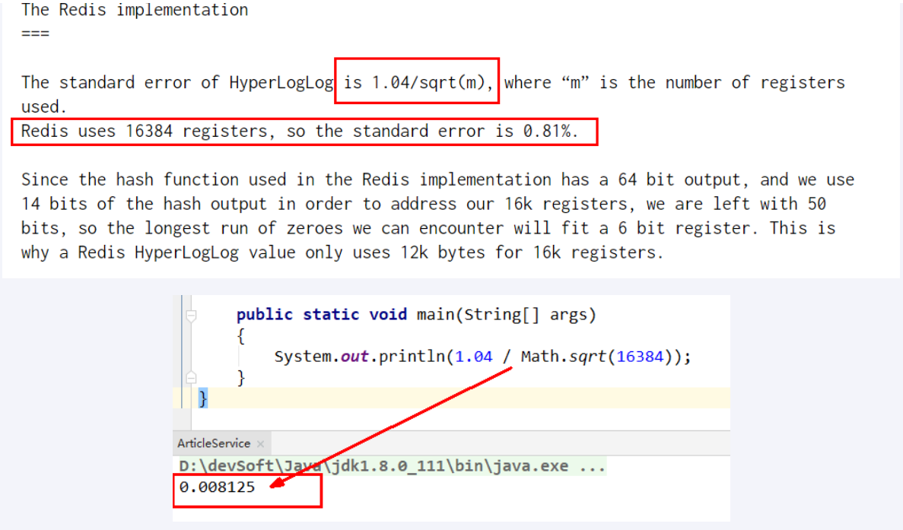


#### 5.3.5 淘宝网首页亿级UV的Redis统计方案

##### 1、需求

- UV的统计需要去重，一个用户一天内的多次访问只能算作一次
- 淘宝，天猫的首页UV，平均每天是1-1.5亿个左右
- 每天存1.5亿个IP，访问者来了后去查是否存在，不存在才加入

##### 2、方案讨论

- 用MySQL，MySQL存储这样量级的数据，MySQL的性能会急剧降低
- 用redis的hash结构存储
  - 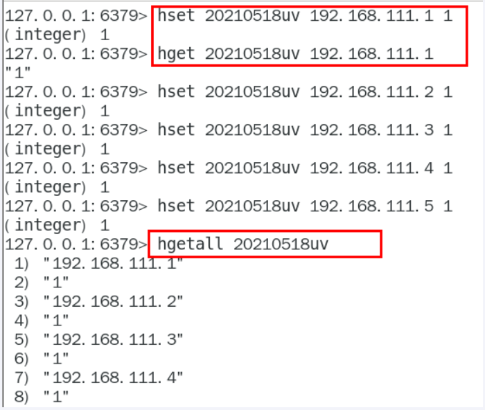
  - `redis——hash = <keyDay,<ip,1>>`，按照ipv4的结构来说明，每个ipv4的地址最多是15个字节(ip = "192.168.111.1"，最多xxx.xxx.xxx.xxx)，某一天的1.5亿 * 15个字节= 2G，一个月60G，redis死定了
- 使用redis的HyperLoglog来统计

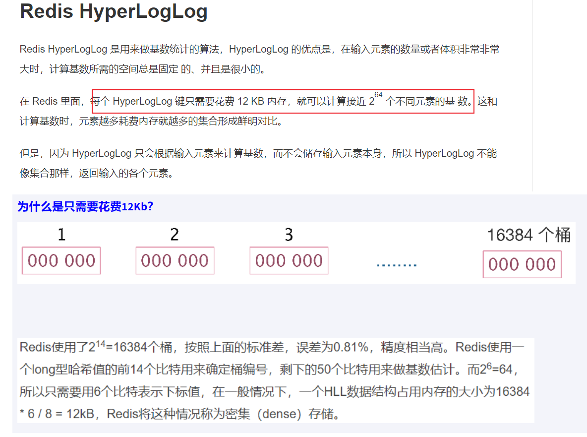

##### 3、代码实现

###### 3.1、HyperLogLogService

```java
package com.atguigu.redis.service;

import lombok.extern.slf4j.Slf4j;
import org.springframework.data.redis.core.RedisTemplate;
import org.springframework.stereotype.Service;

import javax.annotation.PostConstruct;
import javax.annotation.Resource;
import java.util.Random;
import java.util.concurrent.TimeUnit;

/**
 * @auther zzyy
 * @create 2021-05-02 18:16
 */
@Service
@Slf4j
public class HyperLogLogService
{
    @Resource
    private RedisTemplate redisTemplate;

    /**
     * 模拟后台有用户点击首页，每个用户来自不同ip地址
     */
    @PostConstruct
    public void init()
    {
        log.info("------模拟后台有用户点击首页，每个用户来自不同ip地址");
        new Thread(() -> {
            String ip = null;
            for (int i = 1; i <=200; i++) {
                Random r = new Random();
                ip = r.nextInt(256) + "." + r.nextInt(256) + "." + r.nextInt(256) + "." + r.nextInt(256);

                Long hll = redisTemplate.opsForHyperLogLog().add("hll", ip);
                log.info("ip={},该ip地址访问首页的次数={}",ip,hll);
                //暂停几秒钟线程
                try { TimeUnit.SECONDS.sleep(3); } catch (InterruptedException e) { e.printStackTrace(); }
            }
        },"t1").start();
    }

}
```


###### 3.2、HyperLoglogController

```java
package com.atguigu.redis.controller;

import io.swagger.annotations.Api;
import io.swagger.annotations.ApiOperation;
import lombok.extern.slf4j.Slf4j;
import org.springframework.data.redis.core.RedisTemplate;
import org.springframework.web.bind.annotation.RequestMapping;
import org.springframework.web.bind.annotation.RequestMethod;
import org.springframework.web.bind.annotation.RestController;

import javax.annotation.Resource;

/**
 * @auther zzyy
 * @create 2021-05-02 18:16
 */
@Api(description = "淘宝亿级UV的Redis统计方案")
@RestController
@Slf4j
public class HyperLogLogController
{
    @Resource
    private RedisTemplate redisTemplate;

    @ApiOperation("获得IP去重后的首页访问量")
    @RequestMapping(value = "/uv",method = RequestMethod.GET)
    public long uv()
    {
        //pfcount
        return redisTemplate.opsForHyperLogLog().size("hll");
    }

}
```

### 5.4 GEO

#### 5.4.1 redis GEO说明

##### 1、面试题

**面试题说明：**

移动互联网时代LBS应用越来越多，交友软件中附近的小姐姐、外卖软件中附近的美食店铺、打车软件附近的车辆等等。

那这种附近各种形形色色的XXX地址位置选择是如何实现的？

会有什么问题呢？

1.查询性能问题，如果并发高，数据量大这种查询是要搞垮mysql数据库的

2.一般mysql查询的是一个平面矩形访问，而叫车服务要以我为中心N公里为半径的圆形覆盖。

3.精准度的问题，我们知道地球不是平面坐标系，而是一个圆球，这种矩形计算在长距离计算时会有很大误差，mysql不合适

##### 2、地理知识说明

**经纬度**

经度与纬度的合称组成一个坐标系统。又称为地理坐标系统，它是一种利用三度空间的球面来定义地球上的空间的球面坐标系统，能够标示地球上的任何一个位置。

**经线和纬线**

是人们为了在地球上确定位置和方向的，在地球仪和地图上画出来的，地面上并线。

和经线相垂直的线叫做纬线(纬线指示东西方向)。纬线是一条条长度不等的圆圈。最长的纬线就是赤道。 

因为经线指示南北方向，所以经线又叫子午线。 国际上规定，把通过英国格林尼治天文台原址的经线叫做0°所以经线也叫本初子午线。在地球上经线指示南北方向，纬线指示东西方向。

东西半球分界线：东经160° 西经20°

**经度和维度**

经度(longitude)：东经为正数，西经为负数。东西经

纬度(latitude)：北纬为正数，南纬为负数。南北纬


##### 3、如何获取某个地址的经纬度

[百度地图经纬度查询API](http://api.map.baidu.com/lbsapi/getpoint/)

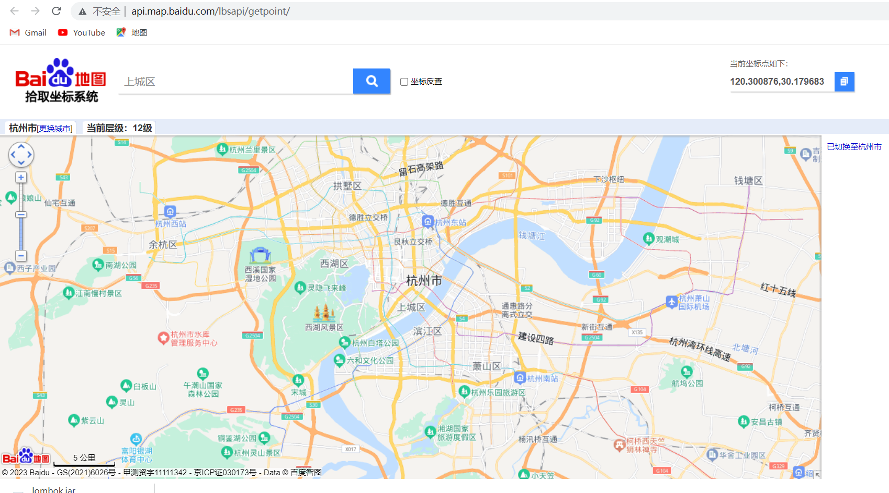

##### 4、GEO相关命令

[redis中文网，GEO相关说明](https://redis.com.cn/redis-geo.html)

Redis GEO 主要用于存储地理位置信息，并对存储的信息进行操作，该功能在 Redis 3.2 版本新增。

Redis GEO 操作方法有：

- geoadd：添加地理位置的坐标。
- geopos：获取地理位置的坐标。
- geodist：计算两个位置之间的距离。
- georadius：根据用户给定的经纬度坐标来获取指定范围内的地理位置集合。
- georadiusbymember：根据储存在位置集合里面的某个地点获取指定范围内的地理位置集合。
- geohash：返回一个或多个位置对象的 geohash 值。

###### 4.1、GEOADD 添加经纬度坐标

geoadd 用于存储指定的地理空间位置，可以将一个或多个经度(longitude)、纬度(latitude)、位置名称(member)添加到指定的 key 中。

geoadd 语法格式如下：

```
GEOADD key longitude latitude member [longitude latitude member ...]
```

```shell
GEOADD city 116.403963 39.915119 "天安门" 116.403414 39.924091 "故宫博物院" 116.024067 40.362639 "八达岭长城"
```

```shell
127.0.0.1:6379> GEOADD city 116.403963 39.915119 "天安门" 116.403414 39.924091 "故宫博物院" 116.024067 40.362639 "八达岭长城"
(integer) 3
127.0.0.1:6379> type city
zset
127.0.0.1:6379> ZRANGE city 0 -1
1) "\xe5\xa4\xa9\xe5\xae\x89\xe9\x97\xa8"
2) "\xe6\x95\x85\xe5\xae\xab\xe5\x8d\x9a\xe7\x89\xa9\xe9\x99\xa2"
3) "\xe5\x85\xab\xe8\xbe\xbe\xe5\xb2\xad\xe9\x95\xbf\xe5\x9f\x8e"

```


4.1.1、中文乱码处理

```shell
redis-cli --raw
```

```shell
127.0.0.1:6379> quit
[root@localhost ~]# redis-cli --raw
127.0.0.1:6379> ZRANGE city 0 -1
天安门
故宫博物院
八达岭长城
127.0.0.1:6379>

```


###### 4.2、GEOPOS 返回经纬度

geopos 用于从给定的 key 里返回所有指定名称(member)的位置（经度和纬度），不存在的返回 nil。

geopos 语法格式如下：

```shell
GEOPOS key member [member ...]
```

```shell
GEOPOS city 天安门 故宫博物院
```

```shell
127.0.0.1:6379> GEOPOS city 天安门 故宫博物院
116.40396326780319214
39.91511970338637383
116.40341609716415405
39.92409008156928252
127.0.0.1:6379>

```

###### 4.3、GEOHASH返回坐标的geohash表示

Redis GEO 使用 geohash 来保存地理位置的坐标。

geohash 用于获取一个或多个位置元素的 geohash 值。

geohash 语法格式如下：

```
GEOHASH key member [member ...]
```

```shell
GEOHASH city "天安门" "故宫博物院" "八达岭长城"
```

```shell
127.0.0.1:6379> GEOHASH city "天安门" "故宫博物院" "八达岭长城"
wx4g0f6f2v0
wx4g0gfqsj0
wx4t85y1kt0
127.0.0.1:6379>

```

**4.3.1 geohash算法生成的base32编码值**

**4.3.2 三维变二维变一维**

主要分为3步：

1. 将三维的地球变为二维的坐标
2. 将二维的坐标转成一维的点块
3. 最后将一维的点块转成二进制再通过base32编码

###### 4.4、GEODIST 两个位置之间的距离

geodist 用于返回两个给定位置之间的距离。

geodist 语法格式如下：

```
GEODIST key member1 member2 [m|km|ft|mi]
```

member1 member2 为两个地理位置。

最后一个距离单位参数说明：

- m ：米，默认单位。
- km ：千米。
- mi ：英里。
- ft ：英尺。

```shell
GEODIST city "天安门" "八达岭长城" M
GEODIST city "天安门" "八达岭长城" KM
GEODIST city "天安门" "八达岭长城" MI
GEODIST city "天安门" "八达岭长城" FT
```

```shell
127.0.0.1:6379> GEODIST city "天安门" "八达岭长城" M
59338.9814
127.0.0.1:6379> GEODIST city "天安门" "八达岭长城" KM
59.3390
127.0.0.1:6379> GEODIST city "天安门" "八达岭长城" FT
194681.6976
127.0.0.1:6379> GEODIST city "天安门" "八达岭长城" MI
36.8716
127.0.0.1:6379>

```


###### 4.5、GEORADIUS 以半径为中心，查找附件的XXX

georadius 以给定的经纬度为中心， 返回键包含的位置元素当中， 与中心的距离不超过给定最大距离的所有位置元素。

```shell
GEORADIUS key longitude latitude radius m|km|ft|mi [WITHCOORD] [WITHDIST] [WITHHASH] [COUNT count] [ASC|DESC] [STORE key] [STOREDIST key]
```

参数说明：

- m ：米，默认单位。
- km ：千米。
- mi ：英里。
- ft ：英尺。
- WITHDIST: 在返回位置元素的同时， 将位置元素与中心之间的距离也一并返回。
- WITHCOORD: 将位置元素的经度和维度也一并返回。
- WITHHASH: 以 52 位有符号整数的形式， 返回位置元素经过原始 geohash 编码的有序集合分值。 这个选项主要用于底层应用或者调试， 实际中的作用并不大。
- COUNT 限定返回的记录数。
- ASC: 查找结果根据距离从近到远排序。
- DESC: 查找结果根据从远到近排序。

```shell
127.0.0.1:6379> GEORADIUS city 116.404177 39.909652 100 KM WITHCOORD WITHDIST WITHHASH COUNT 1 ASC
天安门 # 地点
0.6084 # 距离KM
4069885555089531 # geohash 编码的有序集合分值
116.40396326780319214 # 经度
39.91511970338637383 # 纬度
127.0.0.1:6379>

```


###### 4.6、GEORADIUSBYMEMBER

georadiusbymember 和 GEORADIUS 命令一样， 都可以找出位于指定范围内的元素， 但是 georadiusbymember 的中心点是由给定的位置元素决定的， 而不是使用经度和纬度来决定中心点。

```shell
GEORADIUSBYMEMBER key member radius m|km|ft|mi [WITHCOORD] [WITHDIST] [WITHHASH] [COUNT count] [ASC|DESC] [STORE key] [STOREDIST key]
```

```shell
GEORADIUSBYMEMBER city "天安门" 10 KM WITHCOORD WITHDIST COUNT 10 ASC
```

```shell
127.0.0.1:6379> GEORADIUSBYMEMBER city "天安门" 10 KM WITHCOORD WITHDIST COUNT 10 ASC
天安门
0.0000
116.40396326780319214
39.91511970338637383
故宫博物院
0.9988
116.40341609716415405
39.92409008156928252
127.0.0.1:6379>
```

#### 5.4.2 美团地图位置附件的酒店推送

##### 1、需求分析

###### 1.1、美团APP附件的酒店


###### 1.2、摇一摇，附件的人


###### 1.3、高德地图附件的人或者一公里以内的各种营业厅、加油站、理发店、超市...

###### 1.4、找个单车

##### 2、架构设计

###### 2.1、redis的新类型GEO

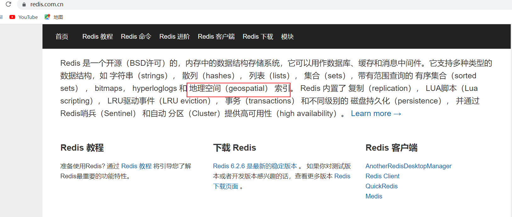

###### 2.2、命令

[redis中文网 GEOADD命令](http://www.redis.cn/commands/geoadd.html)

[redis官网 GEOADD 命令](https://redis.io/commands/geoadd/)

##### 3、编码实现

###### 3.1、关键点

GEORADIUS 以给定的经纬度为中心，找出某一半径内的元素

###### 3.2、GeoController

```java
package com.atguigu.redis7.controller;

import com.atguigu.redis7.service.GeoService;
import io.swagger.annotations.Api;
import io.swagger.annotations.ApiOperation;
import lombok.extern.slf4j.Slf4j;
import org.springframework.data.geo.*;
import org.springframework.data.redis.connection.RedisGeoCommands;
import org.springframework.web.bind.annotation.GetMapping;
import org.springframework.web.bind.annotation.RequestMapping;
import org.springframework.web.bind.annotation.RequestMethod;
import org.springframework.web.bind.annotation.RestController;

import javax.annotation.Resource;
import java.util.HashMap;
import java.util.List;
import java.util.Map;

/**
 * @auther zzyy
 * @create 2022-12-25 12:12
 */
@Api(tags = "美团地图位置附近的酒店推送GEO")
@RestController
@Slf4j
public class GeoController
{
    @Resource
    private GeoService geoService;

    @ApiOperation("添加坐标geoadd")
    @RequestMapping(value = "/geoadd",method = RequestMethod.GET)
    public String geoAdd()
    {
        return geoService.geoAdd();
    }

    @ApiOperation("获取经纬度坐标geopos")
    @RequestMapping(value = "/geopos",method = RequestMethod.GET)
    public Point position(String member)
    {
        return geoService.position(member);
    }

    @ApiOperation("获取经纬度生成的base32编码值geohash")
    @RequestMapping(value = "/geohash",method = RequestMethod.GET)
    public String hash(String member)
    {
        return geoService.hash(member);
    }

    @ApiOperation("获取两个给定位置之间的距离")
    @RequestMapping(value = "/geodist",method = RequestMethod.GET)
    public Distance distance(String member1, String member2)
    {
        return geoService.distance(member1,member2);
    }

    @ApiOperation("通过经度纬度查找北京王府井附近的")
    @RequestMapping(value = "/georadius",method = RequestMethod.GET)
    public GeoResults radiusByxy()
    {
        return geoService.radiusByxy();
    }

    @ApiOperation("通过地方查找附近,本例写死天安门作为地址")
    @RequestMapping(value = "/georadiusByMember",method = RequestMethod.GET)
    public GeoResults radiusByMember()
    {
        return geoService.radiusByMember();
    }

}
```


###### 3.2、GeoService

```java
package com.atguigu.redis7.service;

import lombok.extern.slf4j.Slf4j;
import org.springframework.beans.factory.annotation.Autowired;
import org.springframework.data.geo.Distance;
import org.springframework.data.geo.GeoResults;
import org.springframework.data.geo.Metrics;
import org.springframework.data.geo.Point;
import org.springframework.data.geo.Circle;
import org.springframework.data.redis.connection.RedisGeoCommands;
import org.springframework.data.redis.core.RedisTemplate;
import org.springframework.stereotype.Service;
import org.springframework.web.bind.annotation.GetMapping;
import org.springframework.web.bind.annotation.RequestMapping;

import java.util.HashMap;
import java.util.List;
import java.util.Map;

/**
 * @auther zzyy
 * @create 2022-12-25 12:11
 */
@Service
@Slf4j
public class GeoService
{
    public static final String CITY ="city";

    @Autowired
    private RedisTemplate redisTemplate;

    public String geoAdd()
    {
        Map<String, Point> map= new HashMap<>();
        map.put("天安门",new Point(116.403963,39.915119));
        map.put("故宫",new Point(116.403414 ,39.924091));
        map.put("长城" ,new Point(116.024067,40.362639));

        redisTemplate.opsForGeo().add(CITY,map);

        return map.toString();
    }

    public Point position(String member) {
        //获取经纬度坐标
        List<Point> list= this.redisTemplate.opsForGeo().position(CITY,member);
        return list.get(0);
    }


    public String hash(String member) {
        //geohash算法生成的base32编码值
        List<String> list= this.redisTemplate.opsForGeo().hash(CITY,member);
        return list.get(0);
    }


    public Distance distance(String member1, String member2) {
        //获取两个给定位置之间的距离
        Distance distance= this.redisTemplate.opsForGeo().distance(CITY,member1,member2, RedisGeoCommands.DistanceUnit.KILOMETERS);
        return distance;
    }

    public GeoResults radiusByxy() {
        //通过经度，纬度查找附近的,北京王府井位置116.418017,39.914402
        Circle circle = new Circle(116.418017, 39.914402, Metrics.KILOMETERS.getMultiplier());
        //返回50条
        RedisGeoCommands.GeoRadiusCommandArgs args = RedisGeoCommands.GeoRadiusCommandArgs.newGeoRadiusArgs().includeDistance().includeCoordinates().sortAscending().limit(50);
        GeoResults<RedisGeoCommands.GeoLocation<String>> geoResults= this.redisTemplate.opsForGeo().radius(CITY,circle, args);
        return geoResults;
    }

    public GeoResults radiusByMember() {
        //通过地方查找附近
        String member="天安门";
        //返回50条
        RedisGeoCommands.GeoRadiusCommandArgs args = RedisGeoCommands.GeoRadiusCommandArgs.newGeoRadiusArgs().includeDistance().includeCoordinates().sortAscending().limit(50);
        //半径10公里内
        Distance distance=new Distance(10, Metrics.KILOMETERS);
        GeoResults<RedisGeoCommands.GeoLocation<String>> geoResults= this.redisTemplate.opsForGeo().radius(CITY,member, distance,args);
        return geoResults;
    }
}

```


### 5.5 bitmap

#### 5.5.1 面试题

- 日活统计
- 连续签到打卡
- 最近一周的活跃用户
- 统计指定用户一年之中的登录天数
- 某用户按照一年365天，哪几天登录过？哪几天没有登录？全年中登录的天数共计多少？

#### 5.5.2 是什么

[Redis官网关于bitmap的介绍](https://redis.io/docs/data-types/bitmaps/)

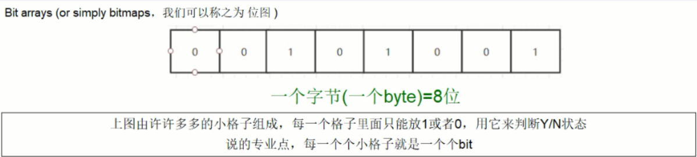

> 说明：用String类型作为底层数据结构实现的一种统计二值状态的数据类型
>
> 位图本质是数组，它是基于String数据类型的按位的操作。该数组由多个二进制位组成，每个二进制位都对应一个偏移量(我们可以称之为一个索引或者位格)。Bitmap支持的最大位数是2^32位，它可以极大的节约存储空间，使用512M内存就可以存储多大42.9亿的字节信息(2^32 = 4294967296)

**总之一句话概括：**由0和1状态表现的二进制位的bit数组

#### 5.5.3 能干嘛

##### 1、用于状态统计

- Y，N，类似AtomicBoolean

##### 2、看需求

- 用户是否登录过Y，N，比如京东的每日签到送京豆
- 电影、广告是否被点击播放过
- 钉钉打卡上下班、签到统计

#### 5.5.4 需求：京东签到领取京豆

##### 1、需求说明


> 签到日历仅展示当月签到数据
>
> 签到日历需展示最近连续签到天数
>
> 假设当前日期是20210618，且20210616未签到
>
> 若20210617已签到且0618未签到，则连续签到天数为1
>
> 若20210617已签到且0618已签到，则连续签到天数为2
>
> 连续签到天数越多，奖励越大
>
> 所有用户均可签到
>
> 截至2020年3月31日的12个月，京东年度活跃用户数3.87亿，同比增长24.8%，环比增长超2500万，此外，2020年3月移动端日均活跃用户数同比增长46%假设10%左右的用户参与签到，签到用户也高达3千万。。。。。。o(╥﹏╥)o


##### 2、小厂方法，传统mysql方式

###### 2.1、建表SQL

```sql
CREATE TABLE user_sign
(
  keyid BIGINT NOT NULL PRIMARY KEY AUTO_INCREMENT,
  user_key VARCHAR(200),#京东用户ID
  sign_date DATETIME,#签到日期(20210618)
  sign_count INT #连续签到天数
)


INSERT INTO user_sign(user_key,sign_date,sign_count)
VALUES ('20210618-xxxx-xxxx-xxxx-xxxxxxxxxxxx','2020-06-18 15:11:12',1);


SELECT
    sign_count
FROM
    user_sign
WHERE
    user_key = '20210618-xxxx-xxxx-xxxx-xxxxxxxxxxxx'
    AND sign_date BETWEEN '2020-06-17 00:00:00' AND '2020-06-18 23:59:59'
ORDER BY
    sign_date DESC
    LIMIT 1;
 
```


###### 2.2、困难和解决思路

> 方法正确但是难以落地实现，o(╥﹏╥)o。 
>
> 签到用户量较小时这么设计能行，但京东这个体量的用户（估算3000W签到用户，一天一条数据，一个月就是9亿数据）
>
> 对于京东这样的体量，如果一条签到记录对应着当日用记录，那会很恐怖......
>
>  
>
> 如何解决这个痛点？
>
>  
>
> 1 一条签到记录对应一条记录，会占据越来越大的空间。
>
> 2 一个月最多31天，刚好我们的int类型是32位，那这样一个int类型就可以搞定一个月，32位大于31天，当天来了位是1没来就是0。
>
> 3 一条数据直接存储一个月的签到记录，不再是存储一天的签到记录。

##### 3、大厂方法，基于Redis的Bitmaps实现签到日历

###### 3.1、建表-按位-redis bitmaps

> 在签到统计时，每个用户一天的签到用1个bit位就能表示，
>
> 一个月（假设是31天）的签到情况用31个bit位就可以，一年的签到也只需要用365个bit位，根本不用太复杂的集合类型

#### 5.5.5 命令复习

##### 1、setbit

```shell
# setbit 键   偏移位 只能是0或1
  setbit key offset  value
```

bitmap的偏移量是从零开始算的

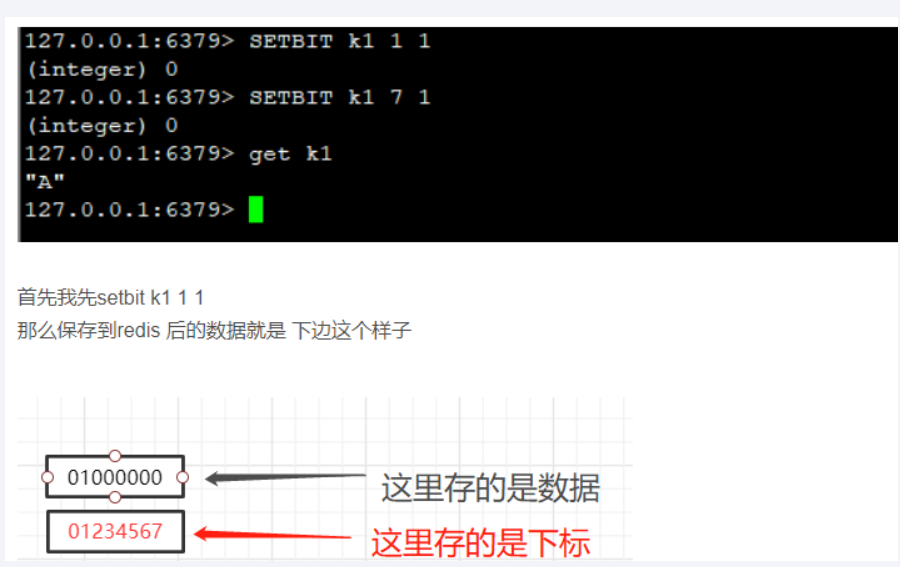

##### 2、getbit

```shell
getbit key offset
```

```shell
127.0.0.1:6379> SETBIT k1 1 1
0
127.0.0.1:6379> SETBIT k1 7 1
0
127.0.0.1:6379> get k1
A
127.0.0.1:6379> type k1
string
127.0.0.1:6379> GETBIT k1 1
1
127.0.0.1:6379> GETBIT k1 7
1
127.0.0.1:6379> GETBIT k1 2
0
127.0.0.1:6379> GETBIT k1 100000000000000000
ERR bit offset is not an integer or out of range

127.0.0.1:6379> GETBIT k1 1000000
0
127.0.0.1:6379>

```


##### 3、setbit和getbit案例说明

###### 3.1、按照天

```shell
127.0.0.1:6379> SETBIT sign:u1:2023:05 0 1
0
127.0.0.1:6379> SETBIT sign:u1:2023:05 1 1
0
127.0.0.1:6379> SETBIT sign:u1:2023:05 2 1
0
127.0.0.1:6379> SETBIT sign:u1:2023:05 3 1
0
127.0.0.1:6379> SETBIT sign:u1:2023:05 4 1
0
127.0.0.1:6379> SETBIT sign:u1:2023:05 5 1
0
127.0.0.1:6379> SETBIT sign:u1:2023:05 6 1
0
127.0.0.1:6379> SETBIT sign:u1:2023:05 7 1
0
127.0.0.1:6379> SETBIT sign:u1:2023:05 8 1
0
127.0.0.1:6379> SETBIT sign:u1:2023:05 9 1
0
127.0.0.1:6379> SETBIT sign:u1:2023:05 10 1
0
127.0.0.1:6379> SETBIT sign:u1:2023:05 11 1
0
127.0.0.1:6379> SETBIT sign:u1:2023:05 12 1
0
127.0.0.1:6379> SETBIT sign:u1:2023:05 13 1
0
127.0.0.1:6379> SETBIT sign:u1:2023:05 14 1
0
127.0.0.1:6379> SETBIT sign:u1:2023:05 15 1
0
127.0.0.1:6379> GETBIT sign:u1:2023:05 15
1
127.0.0.1:6379> GETBIT sign:u1:2023:05 16
0
127.0.0.1:6379> BITCOUNT sign:u1:2023:05 0 30
16
127.0.0.1:6379>

```


###### 3.2、按照年

> 按年去存储一个用户的签到情况，365 天只需要 365 / 8 ≈ 46 Byte，1000W 用户量一年也只需要 44 MB 就足够了。
>
>  
>
> 假如是亿级的系统，
>
> 每天使用1个1亿位的Bitmap约占12MB的内存（10^8/8/1024/1024），10天的Bitmap的内存开销约为120MB，内存压力不算太高。在实际使用时，最好对Bitmap设置过期时间，让Redis自动删除不再需要的签到记录以节省内存开销。

##### 4、bitmap的底层编码说明，get命令操作说明

4.1、实质是二进制的ascii编码对应

4.2、redis里用type命令查看bitmap实质是什么类型？

4.3、man ascii

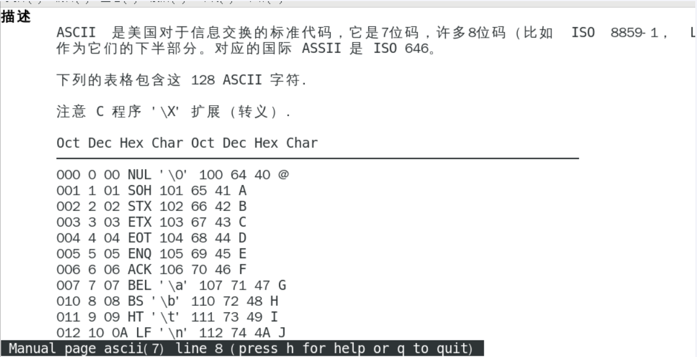

4.4、设置命令

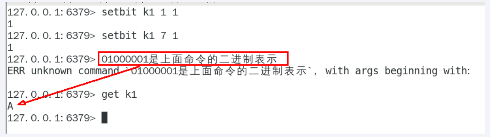

> 两个setbit命令对k1进行设置后，对应的二进制串就是0100 0001
> 二进制串就是0100 0001对应的10进制就是65，所以见下图：

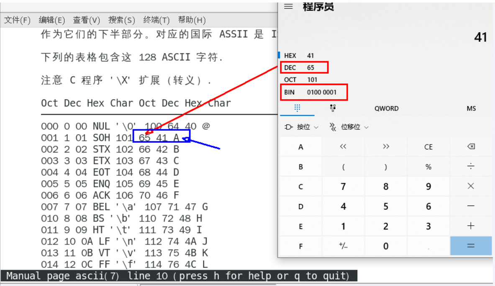

##### 5、strlen

5.1、统计字节数占用多少？

```sh
127.0.0.1:6379> SETBIT k2 0 1
0
127.0.0.1:6379> SETBIT k2 7 1
0
127.0.0.1:6379> STRLEN k2
1
127.0.0.1:6379> SETBIT k2 8 1
0
127.0.0.1:6379> STRLEN k2
2
127.0.0.1:6379>

```


> 不是字符串长度而是占据几个字节，超过8位后自己按照8位一组一byte再扩容

##### 6、bitcount

6.1、全部键里面含有1的有多少？

```sh
127.0.0.1:6379> SETBIT k2 0 1
0
127.0.0.1:6379> SETBIT k2 7 1
0
127.0.0.1:6379> STRLEN k2
1
127.0.0.1:6379> SETBIT k2 8 1
0
127.0.0.1:6379> STRLEN k2
2
127.0.0.1:6379> SETBIT k2 15 1
0
127.0.0.1:6379> BITCOUNT k2
4
127.0.0.1:6379>


```


6.2、一年365天，全年天天登录的占用多少字节？

- 插入365条签到记录

```shell
for((i=1;i<=365;i++)); do echo "setbit k365 1" >> /tmp/redisbit.txt ;done;
cat /tmp/redisbit.txt | redis-cli --pipe
```

- 统计占用的字节数

```shell
127.0.0.1:6379> GETBIT k3 0
1
127.0.0.1:6379> GETBIT k3 364
1
127.0.0.1:6379> GETBIT k3 365
0
127.0.0.1:6379> STRLEN k3
46
127.0.0.1:6379> BITCOUNT k3
365
127.0.0.1:6379>


```


##### 7、bitop

```shell
BITOP <AND | OR | XOR | NOT> destkey key [key ...]
```

> Redis的Bitmaps提供BITOP指令来对一个或多个（除了NOT操作）二进制位的字符串key进行位元操作，操作的结果保存到destkey上，operation是操作类型，有四种分别是：AND、OR、NOT、XOR
>
> - BITOP AND destkey key [key …] ，对一个或多个 key 求逻辑并，并将结果保存到 destkey
> - BITOP OR destkey key [key …] ，对一个或多个 key 求逻辑或，并将结果保存到 destkey
> - BITOP XOR destkey key [key …] ，对一个或多个 key 求逻辑异或，并将结果保存到 destkey
> - BITOP NOT destkey key ，对给定 key 求逻辑非，并将结果保存到 destkey

> 连续2天都签到的用户
>
>  
>
> 加入某个网站或者系统，它的用户有1000W，做个用户id和位置的映射
>
> 比如0号位对应用户id：uid-092iok-lkj
>
> 比如1号位对应用户id：uid-7388c-xxx

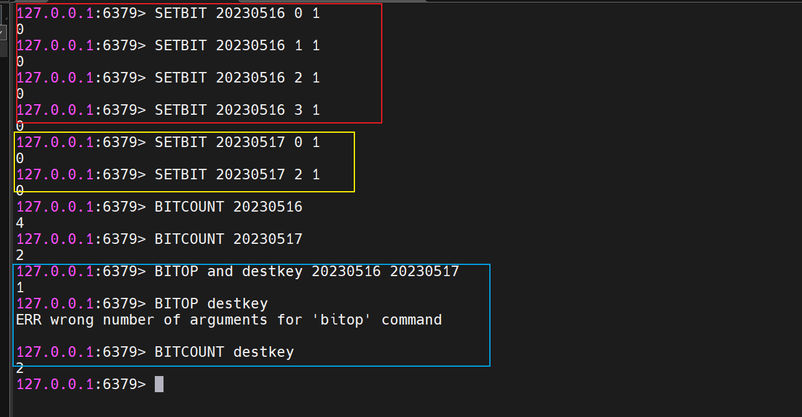

#### 5.5.6 案例实战见下一章，bitmap类型签到+布隆过滤器，案例升级

## 6 布隆过滤器 BloomFilter

### 6.1 面试题

- 号码池中50亿个号码，需要有一批号码，数量在10万左右，如何快速准确的判断这些号码**是否已经存在**？

  - 我让你判断在50亿记录中有没有，不是让你存。 有就返回1，没有返回零。

    - 通过数据库查询-------实现快速有点难。

    - 数据预放到内存集合中：50亿*8字节大约40G，内存太大了。

- 判断是否存在，布隆过滤器了解过吗？

- 安全连接网址，全球数10亿的网址判断

- 黑名单校验，识别垃圾邮件

- 白名单校验，识别出合法用户进行后续处理

### 6.2 是什么

#### 6.2.1 由一个初值都为0的bit数组和多个哈希函数构成，用于快速判断集合中是否存在某个元素

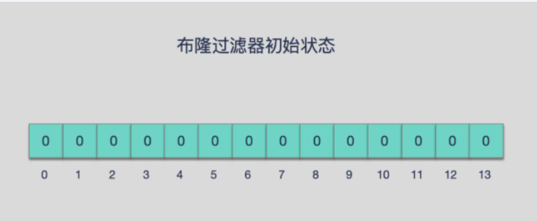

#### 6.2.2 设计思想

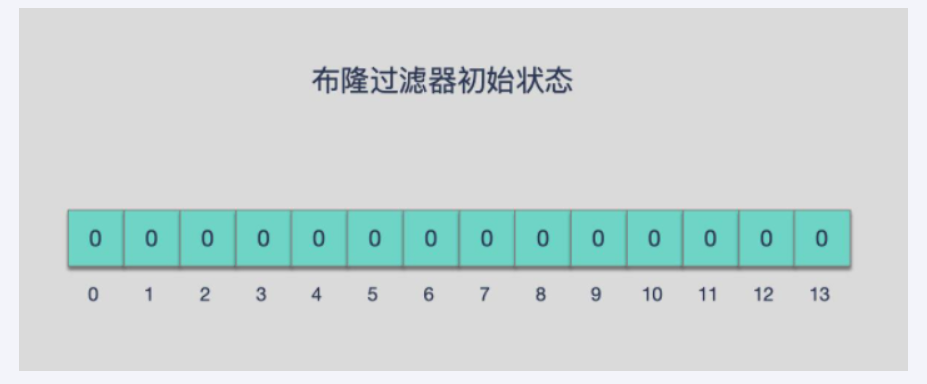

| 概念 | 说明                                                 |
| ---- | ---------------------------------------------------- |
| 目的 | 减少内存占用                                         |
| 方式 | 不保存数据信息，只是在内存中做一个是否存在的标记flag |

本质就是判断具体数据是否存在于一个大的集合中

#### 6.2.3 备注

布隆过滤器是一种类似于set的数据结构，只是在统计结果在巨量数据下有点小瑕疵，不够完美

> 布隆过滤器（英语：Bloom Filter）是 1970 年由布隆提出的。
>
> **它实际上是一个很长的二进制数组(00000000)+一系列随机hash算法映射函数，主要用于判断一个元素是否在集合中。**
>
>  
>
> 通常我们会遇到很多要判断一个元素是否在某个集合中的业务场景，一般想到的是将集合中所有元素保存起来，然后通过比较确定。
>
> 链表、树、哈希表等等数据结构都是这种思路。但是随着集合中元素的增加，我们需要的存储空间也会呈现线性增长，最终达到瓶颈。同时检索速度也越来越慢，上述三种结构的检索时间复杂度分别为O(n),O(logn),O(1)。这个时候，布隆过滤器（Bloom Filter）就应运而生

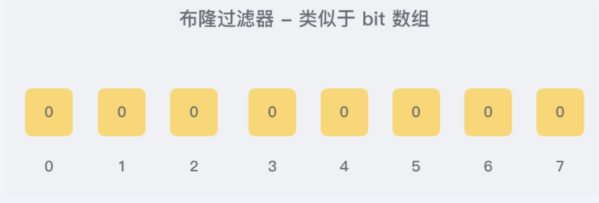


### 6.3 能干嘛

1、高效的插入和查询，占用空间少，返回的结果是不确定性+不够完美。


| 概念 | 说明                                                 |
| ---- | ---------------------------------------------------- |
| 目的 | 减少内存占用                                         |
| 方式 | 不保存数据信息，只是在内存中做一个是否存在的标记flag |

2、重点：一个元素如果判断结果：**存在时，元素不一定存在**，但是判断结果为**不存在时，则一定不存在**。

3、布隆过滤器可以添加元素，但是**不能删除元素**，由于涉及到hashcode判断依据，删除元素会导致误判几率增加

4、小总结

- 有，是可能有
- 无，是肯定无
  - 可以保证的是，如果布隆过滤器判断一个元素不在一个集合中，那这个元素一定不会在该集合中

### 6.4 布隆过滤器原理

#### 6.4.1 布隆过滤器的实现原理和数据结构

##### 1、原理

> 布隆过滤器原理
>
> 布隆过滤器(Bloom Filter) 是一种专门用来解决去重问题的高级数据结构。
>
> 实质就是**一个大型*位数组*和几个不同的无偏hash函数**(无偏表示分布均匀)。由一个初值都为零的bit数组和多个个哈希函数构成，用来快速判断某个数据是否存在。但是跟 HyperLogLog 一样，它也一样有那么一点点不精确，也存在一定的误判概率

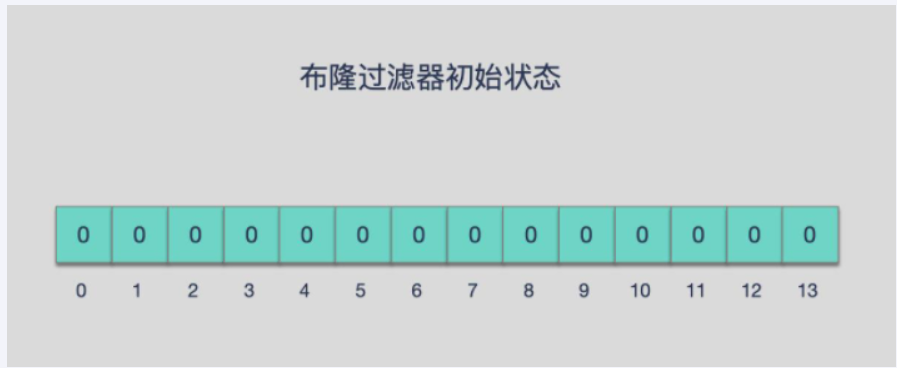

##### 2、添加key和查询key

> **添加key时**
>
> 使用多个hash函数对key进行hash运算得到一个整数索引值，对位数组长度进行取模运算得到一个位置，每个hash函数都会得到一个不同的位置，将这几个位置都置1就完成了add操作。
>
> **查询key时**
>
> 只要有其中一位是零就表示这个key不存在，但如果都是1，**则不一定存在对应的key。**
>
> **结论**：有，是可能有；无，是肯定无

##### 3、hash冲突导致数据不精准1

当有变量被加入集合时，通过N个映射函数将这个变量映射成位图中的N个点，把它们置为 1（假定有两个变量都通过 3 个映射函数）。

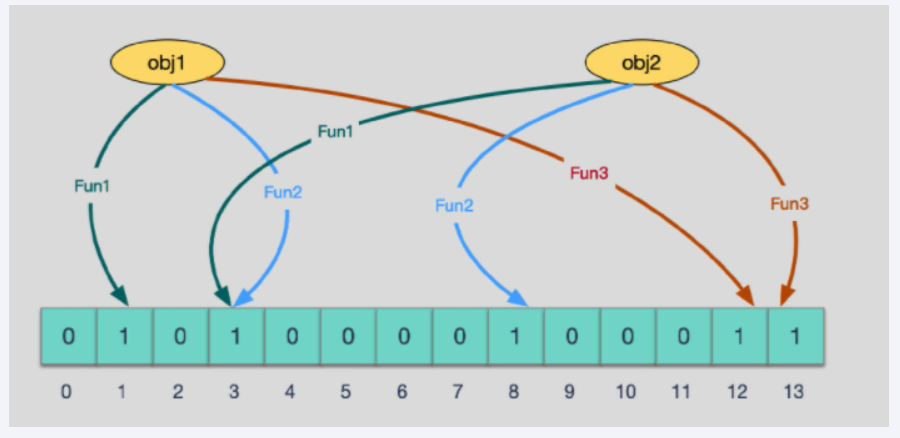

> 查询某个变量的时候我们只要看看这些点是不是都是 1， 就可以大概率知道集合中有没有它了
>
> 如果这些点，**有任何一个为零则被查询变量一定不在，**
>
> 如果都是 1，则被查询变量很可能存在，
>
> 为什么说是可能存在，而不是一定存在呢？那是因为映射函数本身就是散列函数，散列函数是会有碰撞的。（见上图3号坑两个对象都1）


##### 4、hash冲突导致数据不精准2

###### 4.1、hash函数

哈希函数的概念是：将任意大小的输入数据转换成特定大小的输出数据的函数，转换后的数据称为哈希值或哈希编码，也叫散列值

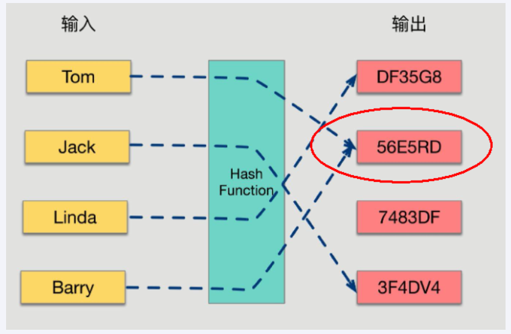

> 如果两个散列值是不相同的（根据同一函数）那么这两个散列值的原始输入也是不相同的。
>
> 这个特性是散列函数具有确定性的结果，具有这种性质的散列函数称为单向散列函数。
>
>  
>
> 散列函数的输入和输出不是唯一对应关系的，如果两个散列值相同，两个输入值很可能是相同的，但也可能不同，
>
> 这种情况称为“散列碰撞（collision）”。
>
>  
>
> 用 hash表存储大数据量时，空间效率还是很低，当只有一个 hash 函数时，还很容易发生哈希碰撞。


###### 4.2、Java中的hash冲突案例

```java
import java.util.HashMap;
import java.util.Map;

/**
 * @author liuyangfang
 * @description 冲突
 * @since 2023/5/16 20:02:28
 */
public class HashCodeConflictDemo {
    public static void main(String[] args) {
        Map<Integer, Integer> map = new HashMap<>();

        Object obj;
        for (int i = 0; i < 200000; i++) {
            obj = new Object();
            int hashCode = obj.hashCode();
            if (!map.containsKey(hashCode)) {
                map.put(hashCode, 1);
                continue;
            }
            map.put(hashCode, map.get(hashCode) + 1);
        }

        for (Map.Entry<Integer, Integer> entry : map.entrySet()) {
            if (entry.getValue() > 1) {
                System.out.printf("hashcode: %s, Conflict times: %s\n", entry.getKey(), entry.getValue());
            }
        }

        System.out.println();
        System.out.println("Aa".hashCode());
        System.out.println("BB".hashCode());
        System.out.println("柳柴".hashCode());
        System.out.println("柴柕".hashCode());
    }
}

```

测试结果

```verilog
hashcode: 2134400190, Conflict times: 2
hashcode: 1872358815, Conflict times: 2
hashcode: 273791087, Conflict times: 2
hashcode: 1164664992, Conflict times: 2
hashcode: 996371445, Conflict times: 2
hashcode: 2038112324, Conflict times: 2
hashcode: 254720071, Conflict times: 2
hashcode: 651156501, Conflict times: 2

2112
2112
851553
851553

```

#### 6.4.2 使用步骤

##### 1、初始化bitmap

布隆过滤器 本质上 是由长度为 m 的位向量或位列表（仅包含 0 或 1 位值的列表）组成，最初所有的值均设置为 0


##### 2、添加占坑位

当我们向布隆过滤器中添加数据时，为了尽量地址不冲突，会使用多个 hash 函数对 key 进行运算，算得一个下标索引值，然后对位数组长度进行取模运算得到一个位置，每个 hash 函数都会算得一个不同的位置。再把位数组的这几个位置都置为 1 就完成了 add 操作。

例如，我们添加一个字符串wmyskxz，对字符串进行多次hash(key) → 取模运行→ 得到坑位

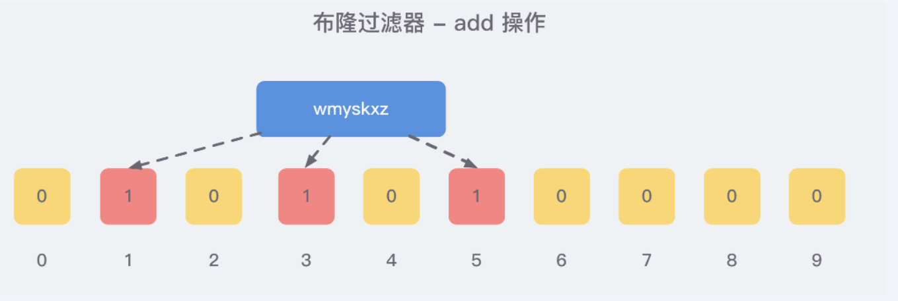

##### 3、判断是否存在

向布隆过滤器查询某个key是否存在时，先把这个 key 通过相同的多个 hash 函数进行运算，查看对应的位置是否都为 1，

只要有一个位为零，那么说明布隆过滤器中这个 key 不存在；

如果这几个位置全都是 1，那么说明极有可能存在；

因为这些位置的 1 可能是因为其他的 key 存在导致的，也就是前面说过的hash冲突。。。。。

 

就比如我们在 add 了字符串wmyskxz数据之后，很明显下面1/3/5 这几个位置的 1 是因为第一次添加的 wmyskxz 而导致的；

此时我们查询一个没添加过的不存在的字符串inexistent-key，它有可能计算后坑位也是1/3/5 ，这就是误判了......笔记见最下面

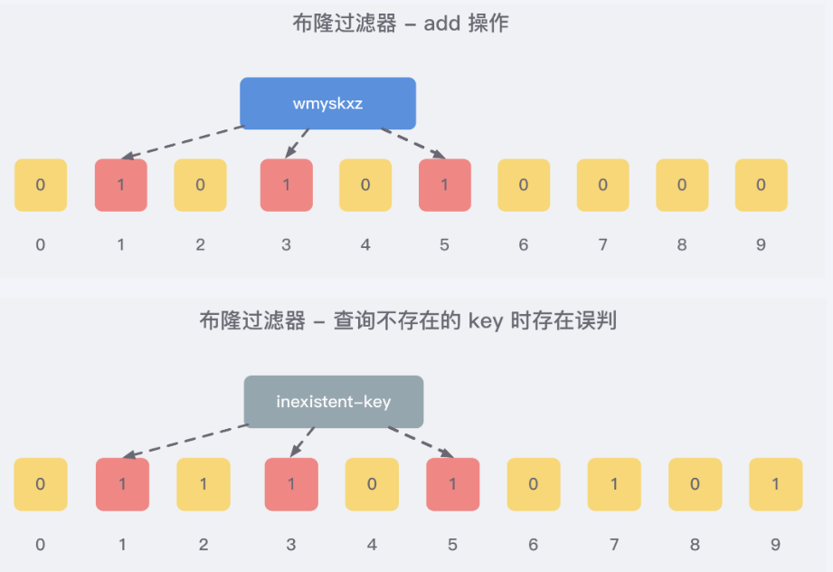

#### 6.4.3 布隆过滤器存在误判率，为什么不要删除

> 布隆过滤器的误判是指多个输入经过哈希之后在相同的bit位置1了，这样就无法判断究竟是哪个输入产生的，
>
> 因此误判的根源在于相同的 bit 位被多次映射且置 1。
>
>  
>
> 这种情况也造成了布隆过滤器的删除问题，因为布隆过滤器的每一个 bit 并不是独占的，很有可能多个元素共享了某一位。
>
> 如果我们直接删除这一位的话，会影响其他的元素
>
>  
>
> **特性**
>
>  
>
> 布隆过滤器可以添加元素，但是不能删除元素。因为删掉元素会导致误判率增加。


#### 6.4.4 小总结

1、是否存在

- 有，是很可能有
- 无，是肯定无

2、使用时最好不要让实际元素个数远大于初始化数量，一次给够避免扩容

3、当实际的元素数量超过初始化数量时，应该对布隆过滤器进行重建，重新分配一个size更大的过滤器，再将所有的历史元素进行批量添加

### 6.5 布隆过滤器的使用场景

#### 6.5.1 解决缓存穿透问题和redis结合bitmap使用

**缓存穿透是什么**

一般情况下，先查询缓存redis是否有该条数据，缓存中没有时，再查询数据库。

当数据库也不存在该条数据时，每次查询都要访问数据库，这就是缓存穿透。

缓存透带来的问题是，当有大量请求查询数据库不存在的数据时，就会给数据库带来压力，甚至会拖垮数据库。

 

**可以使用布隆过滤器解决缓存穿透的问题**

把已存在数据的key存在布隆过滤器中，相当于redis前面挡着一个布隆过滤器。

当有新的请求时，先到布隆过滤器中查询是否存在：

如果布隆过滤器中不存在该条数据则直接返回；

如果布隆过滤器中已存在，才去查询缓存redis，如果redis里没查询到则再查询Mysql数据库

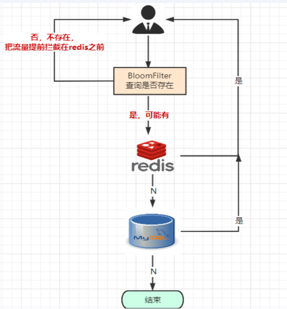

#### 6.5.2 黑名单校验，识别垃圾邮件

发现存在黑名单中的，就执行特定操作。比如：识别垃圾邮件，只要是邮箱在黑名单中的邮件，就识别为垃圾邮件。

假设黑名单的数量是数以亿计的，存放起来就是非常耗费存储空间的，布隆过滤器则是一个较好的解决方案。

把所有黑名单都放在布隆过滤器中，在收到邮件时，判断邮件地址是否在布隆过滤器中即可。

#### 6.5.3 安全连接网址，全球数10亿的网址判断

### 6.6 尝试手写布隆过滤器，结合bitmap体会下思想

#### 6.6.1 架构设计

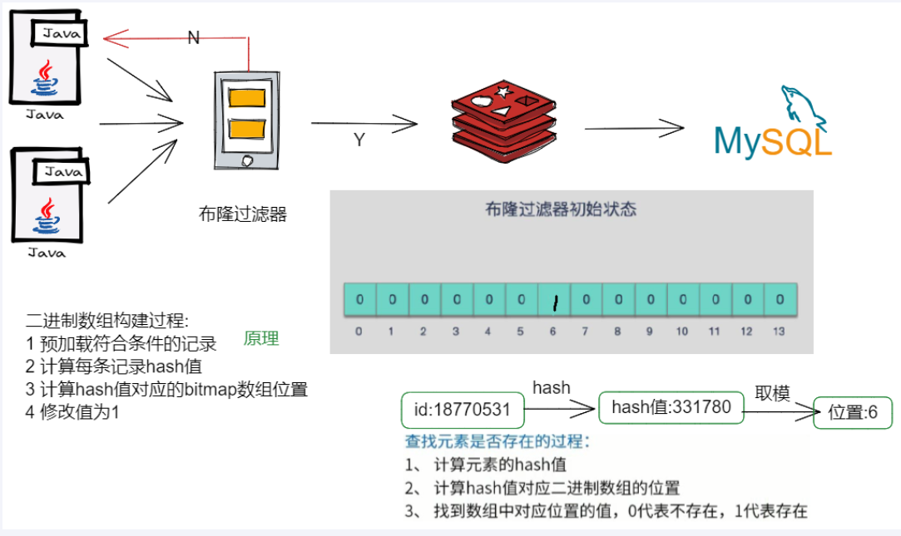

#### 6.6.2 步骤

##### 1、redis的setbit与getbit

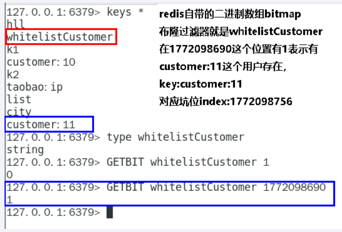

##### 2、setbit的构建过程

2.1、@PostConstruct初始化白名单数据

2.2、计算元素的hash值

2.3、通过上一步的hash值算出对应的二进制数组的坑位

2.4、将对应坑位的值修改为数字1，表示存在

##### 3、getbit查询是否存在

3.1、计算元素的hash值

3.2、通过上一步hash值算出对应的二进制数组的坑位

3.3、返回对应坑位的值，0表示无，1表示有

#### 6.6.3 SpringBoot+Redis+MySQL+MyBatis案例基础与一键编码环境整合

##### 1、MyBatis通用Mapper4

###### 1.1、[MyBatis-generator](http://mybatis.org/generator/)

###### 1.2、[MyBtais 通用 Mapper4 官网](https://github.com/abel533/Mapper)

###### 1.3、一键生成

**1.3.1、t_customer用户表SQL**

```sql
CREATE TABLE `t_customer` (

  `id` int(20) NOT NULL AUTO_INCREMENT,

  `cname` varchar(50) NOT NULL,

  `age` int(10) NOT NULL,

  `phone` varchar(20) NOT NULL,

  `sex` tinyint(4) NOT NULL,

  `birth` timestamp NOT NULL DEFAULT CURRENT_TIMESTAMP ON UPDATE CURRENT_TIMESTAMP,

  PRIMARY KEY (`id`),

  KEY `idx_cname` (`cname`)

) ENGINE=InnoDB AUTO_INCREMENT=10 DEFAULT CHARSET=utf8mb4
```


**1.3.2、建springboot的Module**

mybatis_generator

**1.3.3、改pom**

```xml
<?xml version="1.0" encoding="UTF-8"?>
<project xmlns="http://maven.apache.org/POM/4.0.0"
         xmlns:xsi="http://www.w3.org/2001/XMLSchema-instance"
         xsi:schemaLocation="http://maven.apache.org/POM/4.0.0 http://maven.apache.org/xsd/maven-4.0.0.xsd">
    <modelVersion>4.0.0</modelVersion>

    <groupId>com.atguigu.redis7</groupId>
    <artifactId>mybatis_generator</artifactId>
    <version>1.0-SNAPSHOT</version>

    <parent>
        <groupId>org.springframework.boot</groupId>
        <artifactId>spring-boot-starter-parent</artifactId>
        <version>2.6.10</version>
        <relativePath/>
    </parent>


    <properties>
        <!--  依赖版本号 -->
        <project.build.sourceEncoding>UTF-8</project.build.sourceEncoding>
        <maven.compiler.source>1.8</maven.compiler.source>
        <maven.compiler.target>1.8</maven.compiler.target>
        <java.version>1.8</java.version>
        <hutool.version>5.5.8</hutool.version>
        <druid.version>1.1.18</druid.version>
        <mapper.version>4.1.5</mapper.version>
        <pagehelper.version>5.1.4</pagehelper.version>
        <mysql.version>5.1.39</mysql.version>
        <swagger2.version>2.9.2</swagger2.version>
        <swagger-ui.version>2.9.2</swagger-ui.version>
        <mybatis.spring.version>2.1.3</mybatis.spring.version>
    </properties>


    <dependencies>
        <dependency>
            <groupId>org.springframework.boot</groupId>
            <artifactId>spring-boot-starter-web</artifactId>
        </dependency>

        <!--Mybatis 通用mapper tk单独使用，自己带着版本号-->
        <dependency>
            <groupId>org.mybatis</groupId>
            <artifactId>mybatis</artifactId>
            <version>3.4.6</version>
        </dependency>
        <!--mybatis-spring-->
        <dependency>
            <groupId>org.mybatis.spring.boot</groupId>
            <artifactId>mybatis-spring-boot-starter</artifactId>
            <version>${mybatis.spring.version}</version>
        </dependency>
        <!-- Mybatis Generator -->
        <dependency>
            <groupId>org.mybatis.generator</groupId>
            <artifactId>mybatis-generator-core</artifactId>
            <version>1.4.0</version>
            <scope>compile</scope>
            <optional>true</optional>
        </dependency>
        <!--通用Mapper-->
        <dependency>
            <groupId>tk.mybatis</groupId>
            <artifactId>mapper</artifactId>
            <version>${mapper.version}</version>
        </dependency>
        <!--persistence-->
        <dependency>
            <groupId>javax.persistence</groupId>
            <artifactId>persistence-api</artifactId>
            <version>1.0.2</version>
        </dependency>

        <dependency>
            <groupId>org.projectlombok</groupId>
            <artifactId>lombok</artifactId>
            <optional>true</optional>
        </dependency>
        <dependency>
            <groupId>org.springframework.boot</groupId>
            <artifactId>spring-boot-starter-test</artifactId>
            <scope>test</scope>
            <exclusions>
                <exclusion>
                    <groupId>org.junit.vintage</groupId>
                    <artifactId>junit-vintage-engine</artifactId>
                </exclusion>
            </exclusions>
        </dependency>
    </dependencies>

    <build>
        <resources>
            <resource>
                <directory>${basedir}/src/main/java</directory>
                <includes>
                    <include>**/*.xml</include>
                </includes>
            </resource>
            <resource>
                <directory>${basedir}/src/main/resources</directory>
            </resource>
        </resources>
        <plugins>
            <plugin>
                <groupId>org.springframework.boot</groupId>
                <artifactId>spring-boot-maven-plugin</artifactId>
                <configuration>
                    <excludes>
                        <exclude>
                            <groupId>org.projectlombok</groupId>
                            <artifactId>lombok</artifactId>
                        </exclude>
                    </excludes>
                </configuration>
            </plugin>
            <plugin>
                <groupId>org.mybatis.generator</groupId>
                <artifactId>mybatis-generator-maven-plugin</artifactId>
                <version>1.3.6</version>
                <configuration>
                    <configurationFile>${basedir}/src/main/resources/generatorConfig.xml</configurationFile>
                    <overwrite>true</overwrite>
                    <verbose>true</verbose>
                </configuration>
                <dependencies>
                    <dependency>
                        <groupId>mysql</groupId>
                        <artifactId>mysql-connector-java</artifactId>
                        <version>${mysql.version}</version>
                    </dependency>
                    <dependency>
                        <groupId>tk.mybatis</groupId>
                        <artifactId>mapper</artifactId>
                        <version>${mapper.version}</version>
                    </dependency>
                </dependencies>
            </plugin>
        </plugins>
    </build>
</project>
```


**1.3.4、写YAML**

**1.3.5、mgb配置相关`src/main/resources`路径下新建**

**config.properties**

```properties
#t_customer表包名
package.name=com.atguigu.redis7

jdbc.driverClass = com.mysql.jdbc.Driver
jdbc.url = jdbc:mysql://localhost:3306/bigdata
jdbc.user = root
jdbc.password =123456
```


**generatorConfig.xml**

```xml
<?xml version="1.0" encoding="UTF-8"?>
<!DOCTYPE generatorConfiguration
        PUBLIC "-//mybatis.org//DTD MyBatis Generator Configuration 1.0//EN"
        "http://mybatis.org/dtd/mybatis-generator-config_1_0.dtd">

<generatorConfiguration>
    <properties resource="config.properties"/>

    <context id="Mysql" targetRuntime="MyBatis3Simple" defaultModelType="flat">
        <property name="beginningDelimiter" value="`"/>
        <property name="endingDelimiter" value="`"/>

        <plugin type="tk.mybatis.mapper.generator.MapperPlugin">
            <property name="mappers" value="tk.mybatis.mapper.common.Mapper"/>
            <property name="caseSensitive" value="true"/>
        </plugin>

        <jdbcConnection driverClass="${jdbc.driverClass}"
                        connectionURL="${jdbc.url}"
                        userId="${jdbc.user}"
                        password="${jdbc.password}">
        </jdbcConnection>

        <javaModelGenerator targetPackage="${package.name}.entities" targetProject="src/main/java"/>

        <sqlMapGenerator targetPackage="${package.name}.mapper" targetProject="src/main/java"/>

        <javaClientGenerator targetPackage="${package.name}.mapper" targetProject="src/main/java" type="XMLMAPPER"/>

        <table tableName="t_customer" domainObjectName="Customer">
            <generatedKey column="id" sqlStatement="JDBC"/>
        </table>
    </context>
</generatorConfiguration>
```

1.3.6、一键生成

双击插件`mybatis-generator:gererate`,一键生成entity+mapper接口+xml实现SQL

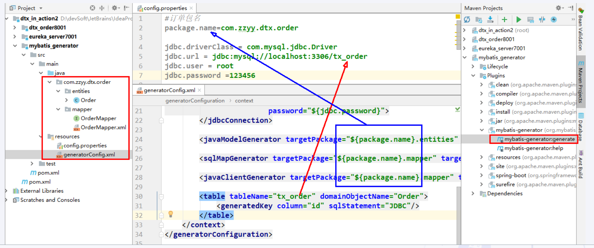

##### 2、SpringBoot+MyBatis+Redis缓存编码实战

###### 2.1、建Module

改造我们的redis7_study工程

###### 2.2、改POM

```xml
<?xml version="1.0" encoding="UTF-8"?>
<project xmlns="http://maven.apache.org/POM/4.0.0"
         xmlns:xsi="http://www.w3.org/2001/XMLSchema-instance"
         xsi:schemaLocation="http://maven.apache.org/POM/4.0.0 http://maven.apache.org/xsd/maven-4.0.0.xsd">
    <modelVersion>4.0.0</modelVersion>

    <groupId>com.atguigu.redis7</groupId>
    <artifactId>redis7_study</artifactId>
    <version>1.0-SNAPSHOT</version>

    <parent>
        <groupId>org.springframework.boot</groupId>
        <artifactId>spring-boot-starter-parent</artifactId>
        <version>2.6.10</version>
        <relativePath/>
    </parent>

    <properties>
        <project.build.sourceEncoding>UTF-8</project.build.sourceEncoding>
        <maven.compiler.source>1.8</maven.compiler.source>
        <maven.compiler.target>1.8</maven.compiler.target>
        <junit.version>4.12</junit.version>
        <log4j.version>1.2.17</log4j.version>
        <lombok.version>1.16.18</lombok.version>
    </properties>

    <dependencies>
        <!--SpringBoot通用依赖模块-->
        <dependency>
            <groupId>org.springframework.boot</groupId>
            <artifactId>spring-boot-starter-web</artifactId>
        </dependency>
        <!--jedis-->
        <dependency>
            <groupId>redis.clients</groupId>
            <artifactId>jedis</artifactId>
            <version>4.3.1</version>
        </dependency>
        <!--lettuce-->
        <!--<dependency>
            <groupId>io.lettuce</groupId>
            <artifactId>lettuce-core</artifactId>
            <version>6.2.1.RELEASE</version>
        </dependency>-->
        <!--SpringBoot与Redis整合依赖-->
        <dependency>
            <groupId>org.springframework.boot</groupId>
            <artifactId>spring-boot-starter-data-redis</artifactId>
        </dependency>
        <dependency>
            <groupId>org.apache.commons</groupId>
            <artifactId>commons-pool2</artifactId>
        </dependency>
        <!--swagger2-->
        <dependency>
            <groupId>io.springfox</groupId>
            <artifactId>springfox-swagger2</artifactId>
            <version>2.9.2</version>
        </dependency>
        <dependency>
            <groupId>io.springfox</groupId>
            <artifactId>springfox-swagger-ui</artifactId>
            <version>2.9.2</version>
        </dependency>
        <!--Mysql数据库驱动-->
        <dependency>
            <groupId>mysql</groupId>
            <artifactId>mysql-connector-java</artifactId>
            <version>5.1.47</version>
        </dependency>
        <!--SpringBoot集成druid连接池-->
        <dependency>
            <groupId>com.alibaba</groupId>
            <artifactId>druid-spring-boot-starter</artifactId>
            <version>1.1.10</version>
        </dependency>
        <dependency>
            <groupId>com.alibaba</groupId>
            <artifactId>druid</artifactId>
            <version>1.1.16</version>
        </dependency>
        <!--mybatis和springboot整合-->
        <dependency>
            <groupId>org.mybatis.spring.boot</groupId>
            <artifactId>mybatis-spring-boot-starter</artifactId>
            <version>1.3.0</version>
        </dependency>
        <!--hutool-->
        <dependency>
            <groupId>cn.hutool</groupId>
            <artifactId>hutool-all</artifactId>
            <version>5.2.3</version>
        </dependency>
        <!--persistence-->
        <dependency>
            <groupId>javax.persistence</groupId>
            <artifactId>persistence-api</artifactId>
            <version>1.0.2</version>
        </dependency>
        <!--通用Mapper-->
        <dependency>
            <groupId>tk.mybatis</groupId>
            <artifactId>mapper</artifactId>
            <version>4.1.5</version>
        </dependency>
        <dependency>
            <groupId>org.springframework.boot</groupId>
            <artifactId>spring-boot-autoconfigure</artifactId>
        </dependency>
        <!--通用基础配置junit/devtools/test/log4j/lombok/-->
        <dependency>
            <groupId>junit</groupId>
            <artifactId>junit</artifactId>
            <version>${junit.version}</version>
        </dependency>
        <dependency>
            <groupId>org.springframework.boot</groupId>
            <artifactId>spring-boot-starter-test</artifactId>
            <scope>test</scope>
        </dependency>
        <dependency>
            <groupId>log4j</groupId>
            <artifactId>log4j</artifactId>
            <version>${log4j.version}</version>
        </dependency>
        <dependency>
            <groupId>org.projectlombok</groupId>
            <artifactId>lombok</artifactId>
            <version>${lombok.version}</version>
            <optional>true</optional>
        </dependency>
    </dependencies>

    <build>
        <plugins>
            <plugin>
                <groupId>org.springframework.boot</groupId>
                <artifactId>spring-boot-maven-plugin</artifactId>
            </plugin>
        </plugins>
    </build>

</project>
```


###### 2.3、写YAMl

```properties
server.port=7777

spring.application.name=redis7_study

# ========================logging=====================
logging.level.root=info
logging.level.com.atguigu.redis7=info
logging.pattern.console=%d{yyyy-MM-dd HH:mm:ss.SSS} [%thread] %-5level %logger- %msg%n 

logging.file.name=D:/mylogs2023/redis7_study.log
logging.pattern.file=%d{yyyy-MM-dd HH:mm:ss.SSS} [%thread] %-5level %logger- %msg%n

# ========================swagger=====================
spring.swagger2.enabled=true
#在springboot2.6.X结合swagger2.9.X会提示documentationPluginsBootstrapper空指针异常，
#原因是在springboot2.6.X中将SpringMVC默认路径匹配策略从AntPathMatcher更改为PathPatternParser，
# 导致出错，解决办法是matching-strategy切换回之前ant_path_matcher
spring.mvc.pathmatch.matching-strategy=ant_path_matcher

# ========================redis单机=====================
spring.redis.database=0
# 修改为自己真实IP
spring.redis.host=192.168.111.185
spring.redis.port=6379
spring.redis.password=111111
spring.redis.lettuce.pool.max-active=8
spring.redis.lettuce.pool.max-wait=-1ms
spring.redis.lettuce.pool.max-idle=8
spring.redis.lettuce.pool.min-idle=0

# ========================alibaba.druid=====================
spring.datasource.type=com.alibaba.druid.pool.DruidDataSource
spring.datasource.driver-class-name=com.mysql.jdbc.Driver
spring.datasource.url=jdbc:mysql://localhost:3306/bigdata?useUnicode=true&characterEncoding=utf-8&useSSL=false
spring.datasource.username=root
spring.datasource.password=123456
spring.datasource.druid.test-while-idle=false

# ========================mybatis===================
mybatis.mapper-locations=classpath:mapper/*.xml
mybatis.type-aliases-package=com.atguigu.redis7.entities

# ========================redis集群=====================
#spring.redis.password=111111
## 获取失败 最大重定向次数
#spring.redis.cluster.max-redirects=3
#spring.redis.lettuce.pool.max-active=8
#spring.redis.lettuce.pool.max-wait=-1ms
#spring.redis.lettuce.pool.max-idle=8
#spring.redis.lettuce.pool.min-idle=0
##支持集群拓扑动态感应刷新,自适应拓扑刷新是否使用所有可用的更新，默认false关闭
#spring.redis.lettuce.cluster.refresh.adaptive=true
##定时刷新
#spring.redis.lettuce.cluster.refresh.period=2000
#spring.redis.cluster.nodes=192.168.111.185:6381,192.168.111.185:6382,192.168.111.172:6383,192.168.111.172:6384,192.168.111.184:6385,192.168.111.184:6386
```


在`src/main/resources/`目录新建mapper文件夹，并拷贝CustomerMapper.xml到mapper文件夹

###### 2.4、主启动

```java
package com.atguigu.redis7;

import org.springframework.boot.SpringApplication;
import org.springframework.boot.autoconfigure.SpringBootApplication;
import tk.mybatis.spring.annotation.MapperScan;

/**
 * @auther zzyy
 * @create 2022-12-10 23:39
 */
@SpringBootApplication
@MapperScan("com.atguigu.redis7.mapper") //import tk.mybatis.spring.annotation.MapperScan;
public class Redis7Study7777
{
    public static void main(String[] args)
    {
        SpringApplication.run(Redis7Study7777.class,args);
    }
}

```


###### 2.5、业务类

2.5.1、数据库表t_customer是否OK

2.5.2、entity

上一步自动生成的拷贝过来的Customer

```java
package com.atguigu.redis7.entities;

import javax.persistence.GeneratedValue;
import javax.persistence.Id;
import javax.persistence.Table;
import java.io.Serializable;
import java.util.Date;

@Table(name = "t_customer")
public class Customer implements Serializable
{
    @Id
    @GeneratedValue(generator = "JDBC")
    private Integer id;

    private String cname;

    private Integer age;

    private String phone;

    private Byte sex;

    private Date birth;

    public Customer()
    {
    }

    public Customer(Integer id, String cname)
    {
        this.id = id;
        this.cname = cname;
    }

    /**
     * @return id
     */
    public Integer getId() {
        return id;
    }

    /**
     * @param id
     */
    public void setId(Integer id) {
        this.id = id;
    }

    /**
     * @return cname
     */
    public String getCname() {
        return cname;
    }

    /**
     * @param cname
     */
    public void setCname(String cname) {
        this.cname = cname;
    }

    /**
     * @return age
     */
    public Integer getAge() {
        return age;
    }

    /**
     * @param age
     */
    public void setAge(Integer age) {
        this.age = age;
    }

    /**
     * @return phone
     */
    public String getPhone() {
        return phone;
    }

    /**
     * @param phone
     */
    public void setPhone(String phone) {
        this.phone = phone;
    }

    /**
     * @return sex
     */
    public Byte getSex() {
        return sex;
    }

    /**
     * @param sex
     */
    public void setSex(Byte sex) {
        this.sex = sex;
    }

    /**
     * @return birth
     */
    public Date getBirth() {
        return birth;
    }

    /**
     * @param birth
     */
    public void setBirth(Date birth) {
        this.birth = birth;
    }

    @Override
    public String toString()
    {
        return "Customer{" +
                "id=" + id +
                ", cname='" + cname + '\'' +
                ", age=" + age +
                ", phone='" + phone + '\'' +
                ", sex=" + sex +
                ", birth=" + birth +
                '}';
    }
}
```


2.5.3、mapper接口

```java
package com.atguigu.redis7.mapper;

import com.atguigu.redis7.entities.Customer;
import tk.mybatis.mapper.common.Mapper;

public interface CustomerMapper extends Mapper<Customer> {
}

```


2.5.4、mapperSQL文件

```xml
<?xml version="1.0" encoding="UTF-8"?>
<!DOCTYPE mapper PUBLIC "-//mybatis.org//DTD Mapper 3.0//EN" "http://mybatis.org/dtd/mybatis-3-mapper.dtd">
<mapper namespace="com.atguigu.redis7.mapper.CustomerMapper">
  <resultMap id="BaseResultMap" type="com.atguigu.redis7.entities.Customer">
    <!--
      WARNING - @mbg.generated
    -->
    <id column="id" jdbcType="INTEGER" property="id" />
    <result column="cname" jdbcType="VARCHAR" property="cname" />
    <result column="age" jdbcType="INTEGER" property="age" />
    <result column="phone" jdbcType="VARCHAR" property="phone" />
    <result column="sex" jdbcType="TINYINT" property="sex" />
    <result column="birth" jdbcType="TIMESTAMP" property="birth" />
  </resultMap>
</mapper>

 
```


2.5.5、service类

```java
package com.atguigu.redis7.service;

import com.atguigu.redis7.entities.Customer;
import com.atguigu.redis7.mapper.CustomerMapper;
import com.atguigu.redis7.utils.CheckUtils;
import lombok.extern.slf4j.Slf4j;
import org.springframework.data.redis.core.RedisTemplate;
import org.springframework.stereotype.Service;

import javax.annotation.PostConstruct;
import javax.annotation.Resource;
import java.util.concurrent.*;
import java.util.concurrent.atomic.AtomicInteger;

/**
 * @auther zzyy
 * @create 2022-07-23 13:55
 */
@Service
@Slf4j
public class CustomerSerivce
{
    public static final String CACHE_KEY_CUSTOMER = "customer:";

    @Resource
    private CustomerMapper customerMapper;
    @Resource
    private RedisTemplate redisTemplate;

    public void addCustomer(Customer customer){
        int i = customerMapper.insertSelective(customer);

        if(i > 0)
        {
            //到数据库里面，重新捞出新数据出来，做缓存
            customer=customerMapper.selectByPrimaryKey(customer.getId());
            //缓存key
            String key=CACHE_KEY_CUSTOMER+customer.getId();
            //往mysql里面插入成功随后再从mysql查询出来，再插入redis
            redisTemplate.opsForValue().set(key,customer);
        }
    }

    public Customer findCustomerById(Integer customerId){
        Customer customer = null;
        //缓存key的名称
        String key=CACHE_KEY_CUSTOMER+customerId;
        //1 查询redis
        customer = (Customer) redisTemplate.opsForValue().get(key);
        //redis无，进一步查询mysql
        if(customer==null){
            //2 从mysql查出来customer
            customer=customerMapper.selectByPrimaryKey(customerId);
            // mysql有，redis无
            if (customer != null) {
                //3 把mysql捞到的数据写入redis，方便下次查询能redis命中。
                redisTemplate.opsForValue().set(key,customer);
            }
        }
        return customer;
    }

}
```


2.5.6、controller

```java
package com.atguigu.redis7.controller;

import com.atguigu.redis7.entities.Customer;
import com.atguigu.redis7.service.CustomerSerivce;
import io.swagger.annotations.Api;
import io.swagger.annotations.ApiOperation;
import lombok.extern.slf4j.Slf4j;
import org.springframework.web.bind.annotation.PathVariable;
import org.springframework.web.bind.annotation.RequestMapping;
import org.springframework.web.bind.annotation.RequestMethod;
import org.springframework.web.bind.annotation.RestController;

import javax.annotation.Resource;
import java.time.LocalDateTime;
import java.time.ZoneId;
import java.util.Random;
import java.util.Date;
import java.util.concurrent.ExecutionException;

/**
 * @auther zzyy
 * @create 2022-07-23 13:55
 */
@Api(tags = "客户Customer接口+布隆过滤器讲解")
@RestController
@Slf4j
public class CustomerController{
    @Resource private CustomerSerivce customerSerivce;

    @ApiOperation("数据库初始化2条Customer数据")
    @RequestMapping(value = "/customer/add", method = RequestMethod.POST)
    public void addCustomer() {
        for (int i = 0; i < 2; i++) {
            Customer customer = new Customer();
            customer.setCname("customer"+i);
            customer.setAge(new Random().nextInt(30)+1);
            customer.setPhone("1381111xxxx");
            customer.setSex((byte) new Random().nextInt(2));
            customer.setBirth(Date.from(LocalDateTime.now().atZone(ZoneId.systemDefault()).toInstant()));
            customerSerivce.addCustomer(customer);
        }
    }
    @ApiOperation("单个用户查询，按customerid查用户信息")
    @RequestMapping(value = "/customer/{id}", method = RequestMethod.GET)
    public Customer findCustomerById(@PathVariable int id) {
        return customerSerivce.findCustomerById(id);
    }
}
 
```


###### 2.6、启动测试Swagger是否OK

`http://localhost:{port}/swagger-ui.html#/`

`http://localhost:7777/swagger-ui.html`


#### 6.6.4 新增布隆过滤器案例

##### 1、编码

###### 1.1、BloomFilterInit(白名单)

```java
package com.atguigu.redis7.filter;

import lombok.extern.slf4j.Slf4j;
import org.springframework.data.redis.core.RedisTemplate;
import org.springframework.stereotype.Component;

import javax.annotation.PostConstruct;
import javax.annotation.Resource;

/**
 * @auther zzyy
 * @create 2022-12-27 14:55
 * 布隆过滤器白名单初始化工具类，一开始就设置一部分数据为白名单所有，
 * 白名单业务默认规定：布隆过滤器有，redis也有。
 */
@Component
@Slf4j
public class BloomFilterInit
{
    @Resource
    private RedisTemplate redisTemplate;

    @PostConstruct//初始化白名单数据，故意差异化数据演示效果......
    public void init()
    {
        //白名单客户预加载到布隆过滤器
        String uid = "customer:12";
        //1 计算hashcode，由于可能有负数，直接取绝对值
        int hashValue = Math.abs(uid.hashCode());
        //2 通过hashValue和2的32次方取余后，获得对应的下标坑位
        long index = (long) (hashValue % Math.pow(2, 32));
        log.info(uid+" 对应------坑位index:{}",index);
        //3 设置redis里面bitmap对应坑位，该有值设置为1
        redisTemplate.opsForValue().setBit("whitelistCustomer",index,true);
    }
}
 
```


> ps: @PostConstruct初始化白名单数据，故意差异化数据演示效果

###### 1.2、CheckUtils

```java
package com.atguigu.redis7.utils;

import lombok.extern.slf4j.Slf4j;
import org.springframework.data.redis.core.RedisTemplate;
import org.springframework.stereotype.Component;

import javax.annotation.Resource;

/**
 * @auther zzyy
 * @create 2022-12-27 14:56
 */
@Component
@Slf4j
public class CheckUtils
{
    @Resource
    private RedisTemplate redisTemplate;

    public boolean checkWithBloomFilter(String checkItem,String key)
    {
        int hashValue = Math.abs(key.hashCode());
        long index = (long) (hashValue % Math.pow(2, 32));
        boolean existOK = redisTemplate.opsForValue().getBit(checkItem, index);
        log.info("----->key:"+key+"\t对应坑位index:"+index+"\t是否存在:"+existOK);
        return existOK;
    }
}

```


###### 1.3、CustomerService

```java
package com.atguigu.redis7.service;

import com.atguigu.redis7.entities.Customer;
import com.atguigu.redis7.mapper.CustomerMapper;
import com.atguigu.redis7.utils.CheckUtils;
import lombok.extern.slf4j.Slf4j;
import org.springframework.data.redis.core.RedisTemplate;
import org.springframework.stereotype.Service;

import javax.annotation.PostConstruct;
import javax.annotation.Resource;
import java.util.concurrent.*;
import java.util.concurrent.atomic.AtomicInteger;

/**
 * @auther zzyy
 * @create 2022-07-23 13:55
 */
@Service
@Slf4j
public class CustomerSerivce
{
    public static final String CACHE_KEY_CUSTOMER = "customer:";

    @Resource
    private CustomerMapper customerMapper;
    @Resource
    private RedisTemplate redisTemplate;

    @Resource
    private CheckUtils checkUtils;

    public void addCustomer(Customer customer){
        int i = customerMapper.insertSelective(customer);

        if(i > 0)
        {
            //到数据库里面，重新捞出新数据出来，做缓存
            customer=customerMapper.selectByPrimaryKey(customer.getId());
            //缓存key
            String key=CACHE_KEY_CUSTOMER+customer.getId();
            //往mysql里面插入成功随后再从mysql查询出来，再插入redis
            redisTemplate.opsForValue().set(key,customer);
        }
    }

    public Customer findCustomerById(Integer customerId){
        Customer customer = null;

        //缓存key的名称
        String key=CACHE_KEY_CUSTOMER+customerId;

        //1 查询redis
        customer = (Customer) redisTemplate.opsForValue().get(key);

        //redis无，进一步查询mysql
        if(customer==null)
        {
            //2 从mysql查出来customer
            customer=customerMapper.selectByPrimaryKey(customerId);
            // mysql有，redis无
            if (customer != null) {
                //3 把mysql捞到的数据写入redis，方便下次查询能redis命中。
                redisTemplate.opsForValue().set(key,customer);
            }
        }
        return customer;
    }

    /**
     * BloomFilter → redis → mysql
     * 白名单：whitelistCustomer
     * @param customerId
     * @return
     */

    @Resource
    private CheckUtils checkUtils;
    public Customer findCustomerByIdWithBloomFilter (Integer customerId)
    {
        Customer customer = null;

        //缓存key的名称
        String key = CACHE_KEY_CUSTOMER + customerId;

        //布隆过滤器check，无是绝对无，有是可能有
        //===============================================
        if(!checkUtils.checkWithBloomFilter("whitelistCustomer",key))
        {
            log.info("白名单无此顾客信息:{}",key);
            return null;
        }
        //===============================================

        //1 查询redis
        customer = (Customer) redisTemplate.opsForValue().get(key);
        //redis无，进一步查询mysql
        if (customer == null) {
            //2 从mysql查出来customer
            customer = customerMapper.selectByPrimaryKey(customerId);
            // mysql有，redis无
            if (customer != null) {
                //3 把mysql捞到的数据写入redis，方便下次查询能redis命中。
                redisTemplate.opsForValue().set(key, customer);
            }
        }
        return customer;
    }
}
```


###### 1.4、CustomerController

```java
package com.atguigu.redis7.controller;

import com.atguigu.redis7.entities.Customer;
import com.atguigu.redis7.service.CustomerSerivce;
import io.swagger.annotations.Api;
import io.swagger.annotations.ApiOperation;
import lombok.extern.slf4j.Slf4j;
import org.springframework.web.bind.annotation.PathVariable;
import org.springframework.web.bind.annotation.RequestMapping;
import org.springframework.web.bind.annotation.RequestMethod;
import org.springframework.web.bind.annotation.RestController;

import javax.annotation.Resource;
import java.time.LocalDateTime;
import java.time.ZoneId;
import java.util.Random;
import java.util.Date;
import java.util.concurrent.ExecutionException;

/**
 * @auther zzyy
 * @create 2022-07-23 13:55
 */
@Api(tags = "客户Customer接口+布隆过滤器讲解")
@RestController
@Slf4j
public class CustomerController
{
    @Resource private CustomerSerivce customerSerivce;

    @ApiOperation("数据库初始化2条Customer数据")
    @RequestMapping(value = "/customer/add", method = RequestMethod.POST)
    public void addCustomer() {
        for (int i = 0; i < 2; i++) {
            Customer customer = new Customer();

            customer.setCname("customer"+i);
            customer.setAge(new Random().nextInt(30)+1);
            customer.setPhone("1381111xxxx");
            customer.setSex((byte) new Random().nextInt(2));
            customer.setBirth(Date.from(LocalDateTime.now().atZone(ZoneId.systemDefault()).toInstant()));

            customerSerivce.addCustomer(customer);
        }
    }

    @ApiOperation("单个用户查询，按customerid查用户信息")
    @RequestMapping(value = "/customer/{id}", method = RequestMethod.GET)
    public Customer findCustomerById(@PathVariable int id) {
        return customerSerivce.findCustomerById(id);
    }

    @ApiOperation("BloomFilter案例讲解")
    @RequestMapping(value = "/customerbloomfilter/{id}", method = RequestMethod.GET)
    public Customer findCustomerByIdWithBloomFilter(@PathVariable int id) throws ExecutionException, InterruptedException
    {
        return customerSerivce.findCustomerByIdWithBloomFilter(id);
    }
}
```


##### 2、测试说明

###### 2.1、布隆过滤器里有，redis里面是可能有

###### 2.2、布隆过滤器里面没有的话，直接返回

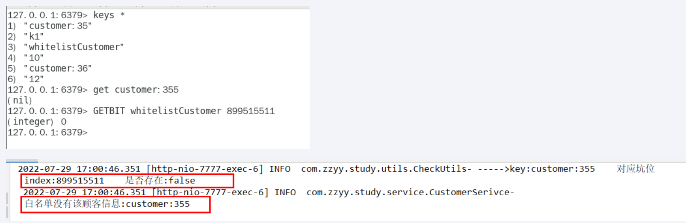

#### 6.6.5 布隆过滤器的优缺点

##### 1、优点

高效的插入和查询，内存占用bit空间少

##### 2、缺点

- 不能删除元素，因为删除元素会导致误判几率增加，因为hash冲突同一个位置是可能存的东西是多个共用的，你删除一个元素的同时也可能把其它的删除了
- 存在误判，不能精准过滤
  - 有，是很可能有（取决于你的hash函数是否分布均匀，分布越均匀，hash碰撞记录约下）
  - 无，是肯定无，100%无

#### 6.6.6 布谷鸟过滤器

为了解决布隆过滤器不能删除元素的问题，布谷鸟过滤器横空出世。

[论文《Cuckoo Filter：Better Than Bloom》](https://www.cs.cmu.edu/~binfan/papers/conext14_cuckoofilter.pdf#:~:text=Cuckoo%20%EF%AC%81lters%20support%20adding%20and%20removing%20items%20dynamically,have%20lower%20space%20overhead%20than%20space-optimized%20Bloom%20%EF%AC%81lters.)

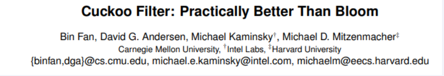

> 作者将布谷鸟过滤器和布隆过滤器进行了深入的对比，有兴趣的同学可以自己看看。不过，
>
> 按照阳哥企业调研，目前用的比较多比较成熟的就是布隆过滤器，
>
> 企业暂时没有升级换代的需求，考虑到上课时间有限，在此不再展开。

## 7 Redis的生产环境问题（缓存预热、缓存雪崩、缓存击穿、缓存穿透）

### 7.1 面试题

- 缓存预热、雪崩、穿透、击穿分别是什么？你遇到那几个情况？
- 缓存预热你是怎么做的
- 如何避免或减少缓存雪崩
- 穿透和击穿有什么区别？它两个是一个意思还是截然不同？
- 穿透和击穿你有什么解决方案？如何避免？
- 假如出现了缓存不一致，你有哪些修补方案？

### 7.2 缓存预热

@PostConstruct初始化白名单数据

或者是在活动前，提前使用脚本将数据导入的Redis等

### 7.3 缓存雪崩

#### 7.3.1 造成原因

1、Redis的主机宕机了

2、Redis中有大量的热点key同时过期

#### 7.3.2 预防+解决

##### 1、针对Redis的主机宕机原因

我们可以使用Redis的主从架构或者Redis的集群架构，从而避免单点故障，并开启Redis的持久化机制`AOF/RDB`,尽快恢复缓存集群

##### 2、针对Redis有大量的热点key同时过期

2.1、我们可以设置key永不过期，或过期时间增加一个五分钟内的随机值，使过期时间分散开

2.2、多级缓存技术：ehcache本地缓存+redis缓存

2.3、服务降级：使用Hystrix或者阿里的sentinel限流和服务降级


2.4、也可以使用[《阿里云的-云数据库Redis版》](https://www.aliyun.com/product/kvstore?spm=a2cls.b92374736.0.0.6da950797PGcuV)

### 7.4 缓存穿透

#### 7.4.1 定义

请求去查询一条数据，先从redis中查询，redis中查询不到，然后去MySQL中找，MySQL中也没有这条数据，在普通场景下并没有太大的问题，但是在高并发下，所有的请求就会都打到MySQL上，导致MySQL的访问压力巨大。这种现象我们称之为缓存穿透，这里的Redis就变成了一个摆设，不起任何作用。

**简而言之，数据即不存在与redis，也不存在于MySQL，MySQL存在被暴击的风险。**

#### 7.4.2 解决


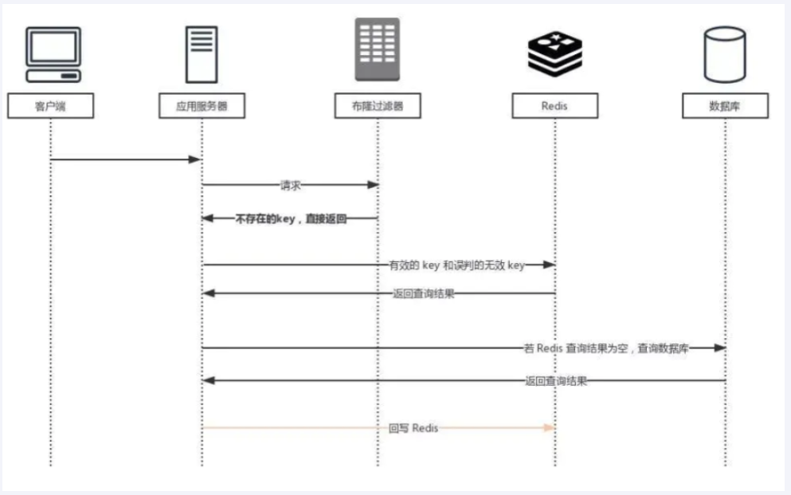

##### 1、方案1：缓存空对象或者缺省值

###### 1.1、一般来说也是OK的

> **第一种解决方案，回写增强**
>
> 如果发生了缓存穿透，我们可以针对要查询的数据，在Redis里存一个和业务部门商量后确定的缺省值(比如，零、负数、defaultNull等)。
>
> 比如，键uid:abcdxxx，值defaultNull作为案例的key和value
>
> 先去redis查键uid:abcdxxx没有，再去mysql查没有获得 ，这就发生了一次穿透现象。
>
>  
>
> but，可以增强回写机制
>
>  
>
> mysql也查不到的话也让redis存入刚刚查不到的key并保护mysql。
>
> 第一次来查询uid:abcdxxx，redis和mysql都没有，返回null给调用者，但是增强回写后第二次来查uid:abcdxxx，此时redis就有值了。
>
> 可以直接从Redis中读取default缺省值返回给业务应用程序，避免了把大量请求发送给mysql处理，打爆mysql。
>
>  
>
> 但是，此方法架不住黑客的恶意攻击，有缺陷......，只能解决key相同的情况


###### 1.2、但是存在一种可能，黑客或者恶意攻击

- 黑客会对你的系统进行攻击，拿一个不存在的id去查询数据，会产生大量的请求打到数据库，这就有可能会导致你的数据库由于访问压力太大了而宕机。
- **key相同**攻击你的系统
  - 第一次打到MySQL，缓存空对象后，第二次就返回defaultNull缺省值，就不用再访问MySQL，避免MySQL被攻击
- **key不同**攻击你的系统
  - 由于存在缓存空对象缓存和缓存回写（主要看业务），redis中的无关紧要的key也会越写越多（这里需要给redis的key设置过期时间）


##### 2、方案二：Google的布隆过滤器Guava解决缓存穿透

###### 2.1、Guava中的布隆过滤器的实现算是比较权威的，所以实际项目中我们可以直接使用Guava的布隆过滤器

###### 2.2、[Guava布隆过滤器(BloomFilter)源码出处](https://github.com/google/guava/blob/master/guava/src/com/google/common/hash/BloomFilter.java)

###### 2.3、Guava版的白名单过滤器

**2.3.1、架构说明**

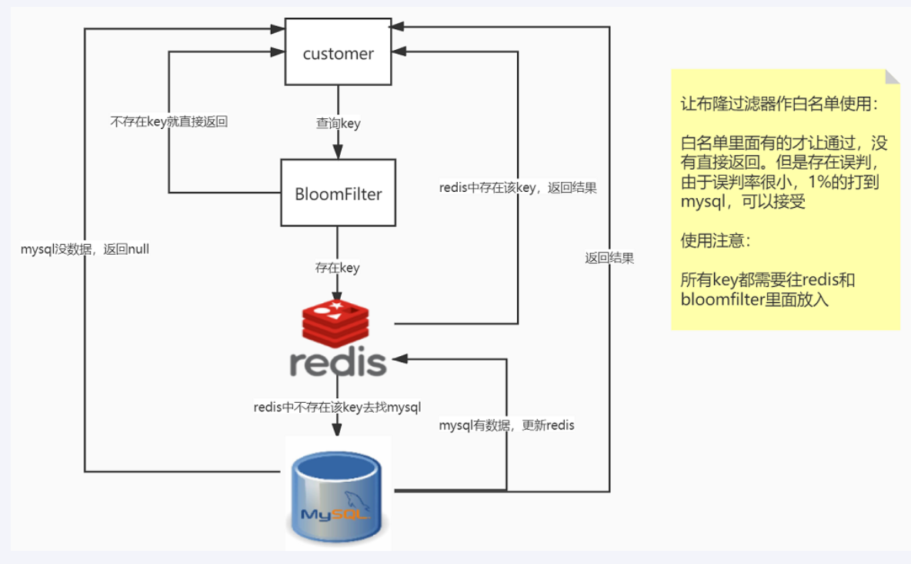

**2.3.2、误判问题，但是概率小可以接受，不能从布隆过滤中删除**

**2.3.3、全部合法的key都需要放入Guava版的布隆过滤器+redis里面，不然数据就返回null**

**2.3.4、编码实战**

**1、建Module**

**2、改POM**

```xml
<?xml version="1.0" encoding="UTF-8"?>
<project xmlns="http://maven.apache.org/POM/4.0.0"
         xmlns:xsi="http://www.w3.org/2001/XMLSchema-instance"
         xsi:schemaLocation="http://maven.apache.org/POM/4.0.0 http://maven.apache.org/xsd/maven-4.0.0.xsd">
    <modelVersion>4.0.0</modelVersion>

    <groupId>com.atguigu.redis7</groupId>
    <artifactId>redis7_study</artifactId>
    <version>1.0-SNAPSHOT</version>

    <parent>
        <groupId>org.springframework.boot</groupId>
        <artifactId>spring-boot-starter-parent</artifactId>
        <version>2.6.10</version>
        <relativePath/>
    </parent>

    <properties>
        <project.build.sourceEncoding>UTF-8</project.build.sourceEncoding>
        <maven.compiler.source>1.8</maven.compiler.source>
        <maven.compiler.target>1.8</maven.compiler.target>
        <junit.version>4.12</junit.version>
        <log4j.version>1.2.17</log4j.version>
        <lombok.version>1.16.18</lombok.version>
    </properties>

    <dependencies>
        <!--guava Google 开源的 Guava 中自带的布隆过滤器-->
        <dependency>
            <groupId>com.google.guava</groupId>
            <artifactId>guava</artifactId>
            <version>23.0</version>
        </dependency>
        <!--SpringBoot通用依赖模块-->
        <dependency>
            <groupId>org.springframework.boot</groupId>
            <artifactId>spring-boot-starter-web</artifactId>
        </dependency>
        <!--jedis-->
        <dependency>
            <groupId>redis.clients</groupId>
            <artifactId>jedis</artifactId>
            <version>4.3.1</version>
        </dependency>
        <!--lettuce-->
        <!--<dependency>
            <groupId>io.lettuce</groupId>
            <artifactId>lettuce-core</artifactId>
            <version>6.2.1.RELEASE</version>
        </dependency>-->
        <!--SpringBoot与Redis整合依赖-->
        <dependency>
            <groupId>org.springframework.boot</groupId>
            <artifactId>spring-boot-starter-data-redis</artifactId>
        </dependency>
        <dependency>
            <groupId>org.apache.commons</groupId>
            <artifactId>commons-pool2</artifactId>
        </dependency>
        <!--swagger2-->
        <dependency>
            <groupId>io.springfox</groupId>
            <artifactId>springfox-swagger2</artifactId>
            <version>2.9.2</version>
        </dependency>
        <dependency>
            <groupId>io.springfox</groupId>
            <artifactId>springfox-swagger-ui</artifactId>
            <version>2.9.2</version>
        </dependency>
        <!--Mysql数据库驱动-->
        <dependency>
            <groupId>mysql</groupId>
            <artifactId>mysql-connector-java</artifactId>
            <version>5.1.47</version>
        </dependency>
        <!--SpringBoot集成druid连接池-->
        <dependency>
            <groupId>com.alibaba</groupId>
            <artifactId>druid-spring-boot-starter</artifactId>
            <version>1.1.10</version>
        </dependency>
        <dependency>
            <groupId>com.alibaba</groupId>
            <artifactId>druid</artifactId>
            <version>1.1.16</version>
        </dependency>
        <!--mybatis和springboot整合-->
        <dependency>
            <groupId>org.mybatis.spring.boot</groupId>
            <artifactId>mybatis-spring-boot-starter</artifactId>
            <version>1.3.0</version>
        </dependency>
        <!--hutool-->
        <dependency>
            <groupId>cn.hutool</groupId>
            <artifactId>hutool-all</artifactId>
            <version>5.2.3</version>
        </dependency>
        <!--persistence-->
        <dependency>
            <groupId>javax.persistence</groupId>
            <artifactId>persistence-api</artifactId>
            <version>1.0.2</version>
        </dependency>
        <!--通用Mapper-->
        <dependency>
            <groupId>tk.mybatis</groupId>
            <artifactId>mapper</artifactId>
            <version>4.1.5</version>
        </dependency>
        <dependency>
            <groupId>org.springframework.boot</groupId>
            <artifactId>spring-boot-autoconfigure</artifactId>
        </dependency>
        <!--通用基础配置junit/devtools/test/log4j/lombok/-->
        <dependency>
            <groupId>junit</groupId>
            <artifactId>junit</artifactId>
            <version>${junit.version}</version>
        </dependency>
        <dependency>
            <groupId>org.springframework.boot</groupId>
            <artifactId>spring-boot-starter-test</artifactId>
            <scope>test</scope>
        </dependency>
        <dependency>
            <groupId>log4j</groupId>
            <artifactId>log4j</artifactId>
            <version>${log4j.version}</version>
        </dependency>
        <dependency>
            <groupId>org.projectlombok</groupId>
            <artifactId>lombok</artifactId>
            <version>${lombok.version}</version>
            <optional>true</optional>
        </dependency>
    </dependencies>

    <build>
        <plugins>
            <plugin>
                <groupId>org.springframework.boot</groupId>
                <artifactId>spring-boot-maven-plugin</artifactId>
            </plugin>
        </plugins>
    </build>

</project>

```


**3、写YAML**

```properties
server.port=7777

spring.application.name=redis7_study

# ========================logging=====================
logging.level.root=info
logging.level.com.atguigu.redis7=info
logging.pattern.console=%d{yyyy-MM-dd HH:mm:ss.SSS} [%thread] %-5level %logger- %msg%n 

logging.file.name=D:/mylogs2023/redis7_study.log
logging.pattern.file=%d{yyyy-MM-dd HH:mm:ss.SSS} [%thread] %-5level %logger- %msg%n

# ========================swagger=====================
spring.swagger2.enabled=true
#在springboot2.6.X结合swagger2.9.X会提示documentationPluginsBootstrapper空指针异常，
#原因是在springboot2.6.X中将SpringMVC默认路径匹配策略从AntPathMatcher更改为PathPatternParser，
# 导致出错，解决办法是matching-strategy切换回之前ant_path_matcher
spring.mvc.pathmatch.matching-strategy=ant_path_matcher

# ========================redis单机=====================
spring.redis.database=0
# 修改为自己真实IP
spring.redis.host=192.168.111.185
spring.redis.port=6379
spring.redis.password=111111
spring.redis.lettuce.pool.max-active=8
spring.redis.lettuce.pool.max-wait=-1ms
spring.redis.lettuce.pool.max-idle=8
spring.redis.lettuce.pool.min-idle=0

# ========================alibaba.druid=====================
spring.datasource.type=com.alibaba.druid.pool.DruidDataSource
spring.datasource.driver-class-name=com.mysql.jdbc.Driver
spring.datasource.url=jdbc:mysql://localhost:3306/bigdata?useUnicode=true&characterEncoding=utf-8&useSSL=false
spring.datasource.username=root
spring.datasource.password=123456
spring.datasource.druid.test-while-idle=false

# ========================mybatis===================
mybatis.mapper-locations=classpath:mapper/*.xml
mybatis.type-aliases-package=com.atguigu.redis7.entities

# ========================redis集群=====================
#spring.redis.password=111111
## 获取失败 最大重定向次数
#spring.redis.cluster.max-redirects=3
#spring.redis.lettuce.pool.max-active=8
#spring.redis.lettuce.pool.max-wait=-1ms
#spring.redis.lettuce.pool.max-idle=8
#spring.redis.lettuce.pool.min-idle=0
##支持集群拓扑动态感应刷新,自适应拓扑刷新是否使用所有可用的更新，默认false关闭
#spring.redis.lettuce.cluster.refresh.adaptive=true
##定时刷新
#spring.redis.lettuce.cluster.refresh.period=2000
#spring.redis.cluster.nodes=192.168.111.185:6381,192.168.111.185:6382,192.168.111.172:6383,192.168.111.172:6384,192.168.111.184:6385,192.168.111.184:6386
```


**4、主启动**

```jav
package com.atguigu.redis7;

import org.springframework.boot.SpringApplication;
import org.springframework.boot.autoconfigure.SpringBootApplication;
import tk.mybatis.spring.annotation.MapperScan;

/**
 * @auther zzyy
 * @create 2022-12-10 23:39
 */
@SpringBootApplication
@MapperScan("com.atguigu.redis7.mapper") //import tk.mybatis.spring.annotation.MapperScan;
public class Redis7Study7777
{
    public static void main(String[] args)
    {
        SpringApplication.run(Redis7Study7777.class,args);
    }
}
```


**5、业务类**

**5.1、BloomFilter HelloWorld**

```java
	@Test
    public void testGuavaWithBloomFilter()
    {
		// 创建布隆过滤器对象
        BloomFilter<Integer> filter = BloomFilter.create(Funnels.integerFunnel(), 100);
		// 判断指定元素是否存在
        System.out.println(filter.mightContain(1));
        System.out.println(filter.mightContain(2));
	   // 将元素添加进布隆过滤器
        filter.put(1);
        filter.put(2);
        System.out.println(filter.mightContain(1));
        System.out.println(filter.mightContain(2));
    }
```

**5.2、GuavaBloomFilterController**

```java
package com.atguigu.redis7.controller;

import com.atguigu.redis7.service.GuavaBloomFilterService;
import io.swagger.annotations.Api;
import io.swagger.annotations.ApiOperation;
import lombok.extern.slf4j.Slf4j;
import org.springframework.web.bind.annotation.PathVariable;
import org.springframework.web.bind.annotation.RequestMapping;
import org.springframework.web.bind.annotation.RequestMethod;
import org.springframework.web.bind.annotation.RestController;

import javax.annotation.Resource;

/**
 * @auther zzyy
 * @create 2022-12-30 16:50
 */
@Api(tags = "google工具Guava处理布隆过滤器")
@RestController
@Slf4j
public class GuavaBloomFilterController
{
    @Resource
    private GuavaBloomFilterService guavaBloomFilterService;

    @ApiOperation("guava布隆过滤器插入100万样本数据并额外10W测试是否存在")
    @RequestMapping(value = "/guavafilter",method = RequestMethod.GET)
    public void guavaBloomFilter()
    {
        guavaBloomFilterService.guavaBloomFilter();
    }
}
```


**5.3、GuavaBloomFilterService**

```java
package com.atguigu.redis7.service;

import com.google.common.hash.BloomFilter;
import com.google.common.hash.Funnels;
import lombok.extern.slf4j.Slf4j;
import org.springframework.stereotype.Service;

import java.util.ArrayList;
import java.util.List;

/**
 * @auther zzyy
 * @create 2022-12-30 16:50
 */
@Service
@Slf4j
public class GuavaBloomFilterService{
    public static final int _1W = 10000;
    //布隆过滤器里预计要插入多少数据
    public static int size = 100 * _1W;
    //误判率,它越小误判的个数也就越少(思考，是不是可以设置的无限小，没有误判岂不更好)
    //fpp the desired false positive probability
    public static double fpp = 0.03;
    // 构建布隆过滤器
    private static BloomFilter<Integer> bloomFilter = BloomFilter.create(Funnels.integerFunnel(), size,fpp);
    public void guavaBloomFilter(){
        //1 先往布隆过滤器里面插入100万的样本数据
        for (int i = 1; i <=size; i++) {
            bloomFilter.put(i);
        }
        //故意取10万个不在过滤器里的值，看看有多少个会被认为在过滤器里
        List<Integer> list = new ArrayList<>(10 * _1W);
        for (int i = size+1; i <= size + (10 *_1W); i++) {
            if (bloomFilter.mightContain(i)) {
                log.info("被误判了:{}",i);
                list.add(i);
            }
        }
        log.info("误判的总数量：:{}",list.size());
    }
}
```

**5.3.1、取样本100W的数据，查查不在100W范围内的，其它10W数据是否存在**

**5.3.2、结论**

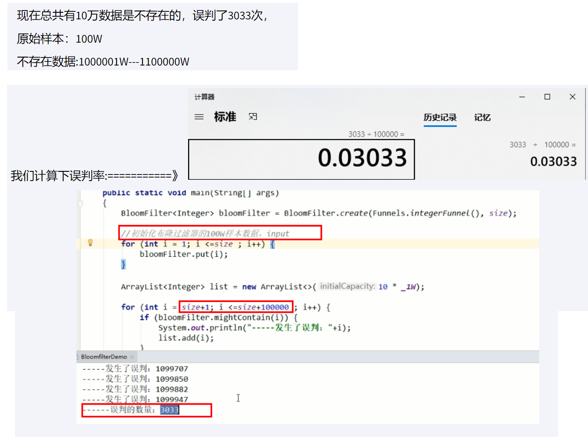

**6、debug源码分析下，看看hash函数**

> ps: 我在这里没有使用Debug，而是使用反射来查看这些数据测试代码如下：

```java
import com.google.common.hash.BloomFilter;
import com.google.common.hash.Funnels;
import org.junit.jupiter.api.Test;

import java.lang.reflect.Field;
import java.lang.reflect.Method;
import java.util.ArrayList;
import java.util.HashMap;
import java.util.List;
import java.util.Map;

/**
 * @author liuyangfang
 * @description
 * @since 2023/5/18 14:30:23
 */
public class BloomFilterTest {
    @Test
    @SuppressWarnings("all")
    public void testGuavaBloomFilterHelloWorld() throws Exception {
        BloomFilter<Integer> bloomFilter = BloomFilter.create(Funnels.integerFunnel(), 100);
        System.out.println(bloomFilter.mightContain(1));
        System.out.println(bloomFilter.mightContain(2));
    }

    @Test
    public void testGuavaBloomFilter() throws Exception {
        final int num_100w = 100_0000;
        guavaBloomFilter(0.10, num_100w, num_100w);
        guavaBloomFilter(0.09, num_100w, num_100w);
        guavaBloomFilter(0.08, num_100w, num_100w);
        guavaBloomFilter(0.07, num_100w, num_100w);
        guavaBloomFilter(0.06, num_100w, num_100w);
        guavaBloomFilter(0.05, num_100w, num_100w);
        guavaBloomFilter(0.04, num_100w, num_100w);
        guavaBloomFilter(0.03, num_100w, num_100w);
        guavaBloomFilter(0.02, num_100w, num_100w);
        guavaBloomFilter(0.01, num_100w, num_100w);
        guavaBloomFilter(0.001, num_100w, num_100w);
        guavaBloomFilter(0.0001, num_100w, num_100w);
        guavaBloomFilter(0.00001, num_100w, num_100w);
        guavaBloomFilter(0.000001, num_100w, num_100w);
        guavaBloomFilter(0.0000001, num_100w, num_100w);
        guavaBloomFilter(0.00000001, num_100w, num_100w);
        guavaBloomFilter(0.000000001, num_100w, num_100w);
        guavaBloomFilter(0.0000000001, num_100w, num_100w);
        guavaBloomFilter(0.00000000001, num_100w, num_100w);
        guavaBloomFilter(0.000000000001, num_100w, num_100w);


    }

    @SuppressWarnings("all")
    private void guavaBloomFilter(double fpp, int totalSize, int testCount) throws Exception {
        long start = System.currentTimeMillis();
        BloomFilter<Integer> bloomFilter = BloomFilter.create(Funnels.integerFunnel(), totalSize, fpp);

        // 插入100w条记录
        for (int i = 1; i <= totalSize; i++) {
            bloomFilter.put(i);
        }


        // 在模拟判断10w条不在布隆过滤器里面的数据
        List<Integer> list = new ArrayList<>();

        for (int i = totalSize + 1; i <= totalSize + testCount; i++) {
            boolean result = bloomFilter.mightContain(i);
            if (result) {// 误判了
                list.add(i);
            }
        }

        long end = System.currentTimeMillis();
        long cost = end - start;
        Map<String, Object> map = getBloomFilterInfoByReflect(bloomFilter);

        System.out.printf("样本总数: %s, 测试总数: %s, 设置误判率: %s, 误判数: %s, 实际误判率: %s, 耗时: %sms, 哈希函数个数: %s, bitSize: %s, bitCount: %s\n",
                totalSize,
                testCount,
                fpp,
                list.size(),
                (list.size() * 1.0d / totalSize),
                cost,
                map.get("numHashFunctions"),
                map.get("bitSize"),
                map.get("bitCount")
        );
    }

    public Map<String, Object> getBloomFilterInfoByReflect(BloomFilter bloomFilter) throws Exception {
        Map<String, Object> map = new HashMap<>();
        Class<? extends BloomFilter> bloomFilterClass = bloomFilter.getClass();

        Field numHashFunctionsField = bloomFilterClass.getDeclaredField("numHashFunctions");
        numHashFunctionsField.setAccessible(true);
        int numHashFunctions = (int) numHashFunctionsField.get(bloomFilter);
        map.put("numHashFunctions", numHashFunctions);
        numHashFunctionsField.setAccessible(false);

        Field bits = bloomFilterClass.getDeclaredField("bits");
        bits.setAccessible(true);
        Object bitsObj = bits.get(bloomFilter);
        Class<?> bitsClass = bitsObj.getClass();
        Method bitSizeMethod = bitsClass.getDeclaredMethod("bitSize");
        bitSizeMethod.setAccessible(true);
        long bitSize = (long) bitSizeMethod.invoke(bitsObj);
        map.put("bitSize", bitSize);
        bitSizeMethod.setAccessible(false);

        Method bitCountMethod = bitsClass.getDeclaredMethod("bitCount");
        bitCountMethod.setAccessible(true);
        long bitCount = (long) bitCountMethod.invoke(bitsObj);
        map.put("bitCount", bitCount);
        bitCountMethod.setAccessible(false);

        bits.setAccessible(false);

        return map;
    }
}

```

**测试结果**

| 样本总数 | 测试总数 | 设置的误判率 | 实际误判数 | 实际误判率 | 耗时/ms | hash函数个数 | bitSize  | bitCount |
| -------- | -------- | ------------ | ---------- | ---------- | ------- | ------------ | -------- | -------- |
| 1000000  | 1000000  | 0.10         | 100233     | 0.10       | 446     | 3            | 4792576  | 2229550  |
| 1000000  | 1000000  | 0.09         | 91296      | 0.09       | 310     | 3            | 5011840  | 2255916  |
| 1000000  | 1000000  | 0.08         | 80384      | 0.08       | 261     | 4            | 5257024  | 2800771  |
| 1000000  | 1000000  | 0.07         | 69883      | 0.07       | 333     | 4            | 5534912  | 2848085  |
| 1000000  | 1000000  | 0.06         | 59777      | 0.06       | 287     | 4            | 5855808  | 2898519  |
| 1000000  | 1000000  | 0.05         | 50521      | 0.05       | 255     | 4            | 6235264  | 2952537  |
| 1000000  | 1000000  | 0.04         | 39993      | 0.04       | 279     | 5            | 6699712  | 3522599  |
| 1000000  | 1000000  | 0.03         | 30155      | 0.03       | 285     | 5            | 7298496  | 3620398  |
| 1000000  | 1000000  | 0.02         | 20035      | 0.02       | 323     | 6            | 8142400  | 4244731  |
| 1000000  | 1000000  | 0.01         | 10314      | 0.01       | 444     | 7            | 9585088  | 4967801  |
| 1000000  | 1000000  | 0.001        | 994        | 0.00       | 455     | 10           | 14377600 | 7206707  |
| 1000000  | 1000000  | 1.0E-4       | 102        | 0.00       | 485     | 13           | 19170176 | 9441597  |
| 1000000  | 1000000  | 1.0E-5       | 7          | 0.00       | 599     | 17           | 23962688 | 12177587 |
| 1000000  | 1000000  | 1.0E-6       | 1          | 0.00       | 711     | 20           | 28755200 | 14409568 |
| 1000000  | 1000000  | 1.0E-7       | 0          | 0.00       | 808     | 23           | 33547712 | 16644179 |
| 1000000  | 1000000  | 1.0E-8       | 0          | 0.00       | 975     | 27           | 38340288 | 19381890 |
| 1000000  | 1000000  | 1.0E-9       | 0          | 0.00       | 1073    | 30           | 43132800 | 21618077 |
| 1000000  | 1000000  | 1.0E-10      | 0          | 0.00       | 1231    | 33           | 47925312 | 23852862 |
| 1000000  | 1000000  | 1.0E-11      | 0          | 0.00       | 1434    | 37           | 52717824 | 26587135 |
| 1000000  | 1000000  | 1.0E-12      | 0          | 0.00       | 1597    | 40           | 57510400 | 28822929 |


**7、布隆过滤器说明**

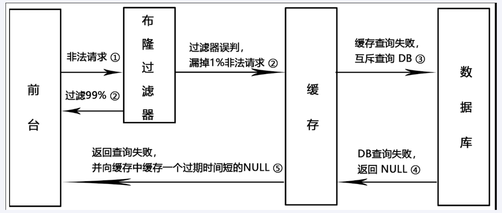

###### 2.4、Guava的黑名单过滤器（//TODO 自己编码实现）

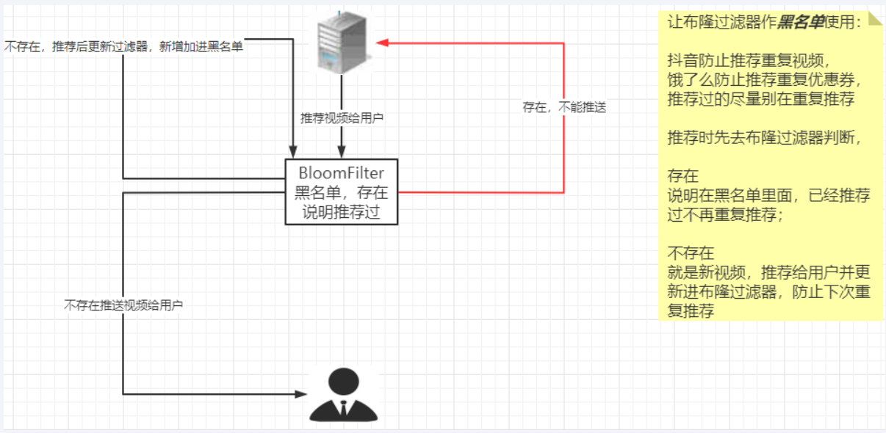


### 7.5 缓存击穿

#### 7.5.1 是什么

大量的请求同时查询一个key时，此时这个key正好失效了，就会导致大量的请求都打到数据库上面去了。

简而言之，就是热点key突然失效了，暴打MySQL

> ps: 穿透和击穿，截然不同

#### 7.5.2 危害

- 会造成某一时刻数据库请求量过大，压力剧增。
- 一般技术部分需要知道**热点key是哪些个**？做到心里有数防止击穿

#### 7.5.3 解决


**1、热点Key失效**

- 时间到了自然清除但还被访问到了
- delete掉的key，刚巧又被访问到了

**2、方案1**

- 差异失效时间，对于访问频繁的热点key，干脆就不要设置过期时间

**3、方案2**

- 互斥更新，采用双检加锁策略

> 多个线程同时去查询数据库的这条数据，那么我们可以在第一个查询数据的请求上使用一个 互斥锁来锁住它。
>
> 其他的线程走到这一步拿不到锁就等着，等第一个线程查询到了数据，然后做缓存。后面的线程进来发现已经有缓存了，就直接走缓存。
>
> ```java
>     public String get(String key) {
>         try (Jedis jedis = new Jedis()) {
>             String value = jedis.get(key); // 查询缓存
>             if (value != null && value.length() > 0) {
>                 // 缓存存在的话，那么就直接返回
>                 return value;
>             }
> 
>             // 缓存不存在则对需要加锁
>             // 假设请求量很大，则缓存需要设置自动过期时间
>             synchronized (JedisUtils.class) {
>                 // 这里加锁的目的是为了防止高并发下有其余线程修改了redis中的值
>                 value = jedis.get(key);
>                 if (value != null && value.length() > 0) {
>                     return value;
>                 }
> 
>                 // 经过两次查询redis之后，都没数据，就从mysql中查询
>                 value = dao.get(key);
> 
>                 // 将数据写入缓存
>                 jedis.setex(key, KEY_TTL, value);
>                 return value;
>             }
>         }
>     }
> ```
>
> 

#### 7.5.4 案例：模拟天猫聚划算功能+防止缓存击穿


**问题，热点key突然失效导致了缓存击穿**

##### 1、技术分析

| 步骤 | 说明                                                         |
| ---- | ------------------------------------------------------------ |
| 1    | 100%高并发，绝对不可以用mysql实现                            |
| 2    | 先把mysql里面参加活动的数据抽取进redis，一般采用定时器扫描来决定上线活动还是下线取消。 |
| 3    | 支持分页功能，一页20条记录                                   |
|      | 请大家思考，redis里面什么样子的数据类型支持上述功能？        |

> 高并发+定时任务+分页显示。。。。

##### 2、redis的数据类型选择

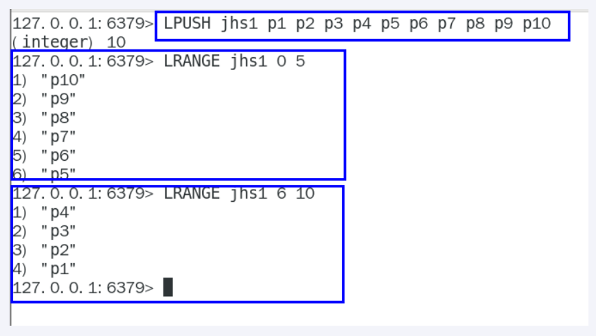

##### 3、业务实现

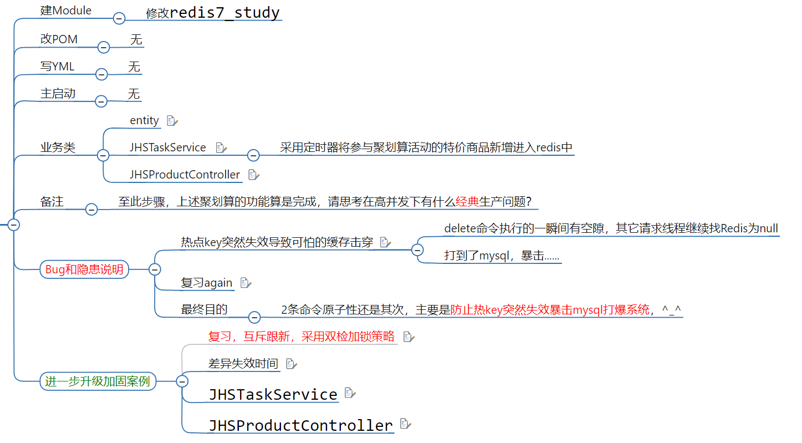

###### 3.1、业务类

**1、entity**

```java
package com.atguigu.redis7.entities;

import io.swagger.annotations.ApiModel;
import lombok.AllArgsConstructor;
import lombok.Data;
import lombok.NoArgsConstructor;

/**
 * @auther zzyy
 * @create 2022-12-31 14:24
 */
@Data
@AllArgsConstructor
@NoArgsConstructor
@ApiModel(value = "聚划算活动producet信息")
public class Product
{
    //产品ID
    private Long id;
    //产品名称
    private String name;
    //产品价格
    private Integer price;
    //产品详情
    private String detail;
}
```

**2、JHSTaskService**

```java
package com.atguigu.redis7.service;

import cn.hutool.core.date.DateUtil;
import com.atguigu.redis7.entities.Product;
import lombok.extern.slf4j.Slf4j;
import org.springframework.beans.factory.annotation.Autowired;
import org.springframework.data.redis.core.RedisTemplate;
import org.springframework.stereotype.Service;

import javax.annotation.PostConstruct;
import java.util.ArrayList;
import java.util.List;
import java.util.Random;
import java.util.concurrent.TimeUnit;

/**
 * @auther zzyy
 * @create 2022-12-31 14:26
 */
@Service
@Slf4j
public class JHSTaskService
{
    public  static final String JHS_KEY="jhs";
    public  static final String JHS_KEY_A="jhs:a";
    public  static final String JHS_KEY_B="jhs:b";

    @Autowired
    private RedisTemplate redisTemplate;

    /**
     * 偷个懒不加mybatis了，模拟从数据库读取100件特价商品，用于加载到聚划算的页面中
     * @return
     */
    private List<Product> getProductsFromMysql() {
        List<Product> list=new ArrayList<>();
        for (int i = 1; i <=20; i++) {
            Random rand = new Random();
            int id= rand.nextInt(10000);
            Product obj=new Product((long) id,"product"+i,i,"detail");
            list.add(obj);
        }
        return list;
    }

    @PostConstruct
    public void initJHS(){
        log.info("启动定时器淘宝聚划算功能模拟.........."+ DateUtil.now());
        new Thread(() -> {
            //模拟定时器一个后台任务，定时把数据库的特价商品，刷新到redis中
            while (true){
                //模拟从数据库读取100件特价商品，用于加载到聚划算的页面中
                List<Product> list=this.getProductsFromMysql();
                //采用redis list数据结构的lpush来实现存储
                this.redisTemplate.delete(JHS_KEY);
                //lpush命令
                this.redisTemplate.opsForList().leftPushAll(JHS_KEY,list);
                //间隔一分钟 执行一遍，模拟聚划算每3天刷新一批次参加活动
                try { TimeUnit.MINUTES.sleep(1); } catch (InterruptedException e) { e.printStackTrace(); }

                log.info("runJhs定时刷新..............");
            }
        },"t1").start();
    }
}

```

> 采用定时器将参与聚划算活动的商品新增进入redis中

3、JHSProductController

```java
package com.atguigu.redis7.controller;

import com.atguigu.redis7.entities.Product;
import io.swagger.annotations.Api;
import io.swagger.annotations.ApiOperation;
import lombok.extern.slf4j.Slf4j;
import org.springframework.beans.factory.annotation.Autowired;
import org.springframework.data.redis.core.RedisTemplate;
import org.springframework.util.CollectionUtils;
import org.springframework.web.bind.annotation.RequestMapping;
import org.springframework.web.bind.annotation.RequestMethod;
import org.springframework.web.bind.annotation.RestController;

import java.util.List;

/**
 * @auther zzyy
 * @create 2022-12-31 14:29
 */
@RestController
@Slf4j
@Api(tags = "聚划算商品列表接口")
public class JHSProductController
{
    public  static final String JHS_KEY="jhs";
    public  static final String JHS_KEY_A="jhs:a";
    public  static final String JHS_KEY_B="jhs:b";

    @Autowired
    private RedisTemplate redisTemplate;

    /**
     * 分页查询：在高并发的情况下，只能走redis查询，走db的话必定会把db打垮
     * @param page
     * @param size
     * @return
     */
    @RequestMapping(value = "/pruduct/find",method = RequestMethod.GET)
    @ApiOperation("按照分页和每页显示容量，点击查看")
    public List<Product> find(int page, int size) {
        List<Product> list=null;

        long start = (page - 1) * size;
        long end = start + size - 1;

        try {
            //采用redis list数据结构的lrange命令实现分页查询
            list = this.redisTemplate.opsForList().range(JHS_KEY, start, end);
            if (CollectionUtils.isEmpty(list)) {
                //TODO 走DB查询
            }
            log.info("查询结果：{}", list);
        } catch (Exception ex) {
            //这里的异常，一般是redis瘫痪 ，或 redis网络timeout
            log.error("exception:", ex);
            //TODO 走DB查询
        }

        return list;
    }
}
```

> ps: 完成上述步骤之后，上述的聚划算功能算是基本完成，请思考其在高并发环境下有什么**经典**的生产问题？


###### 3.2、Bug和隐患说明

1、热点key突然失效，导致缓存击穿

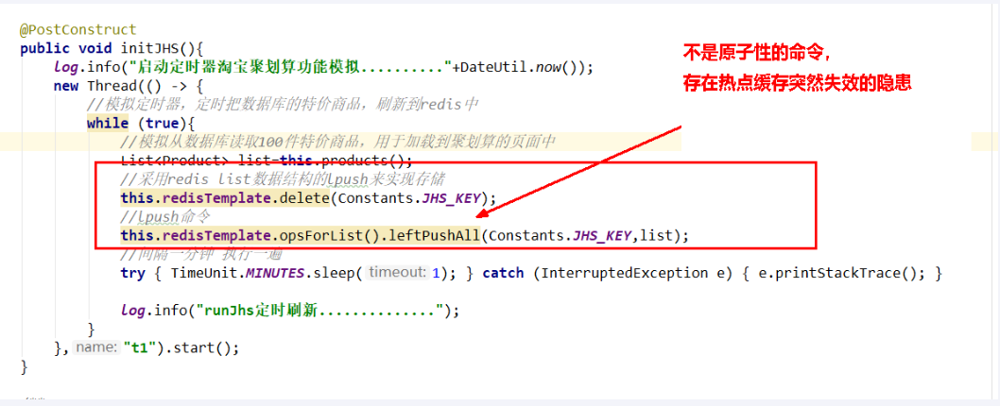

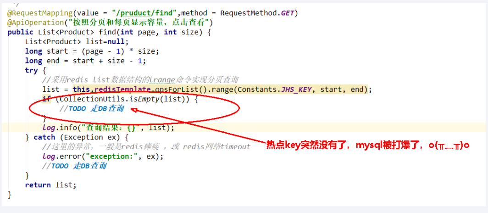

delete命令执行的一瞬间有空隙，其它请求线程继续找redis为null，从而击穿了Redis，访问到了MySQL

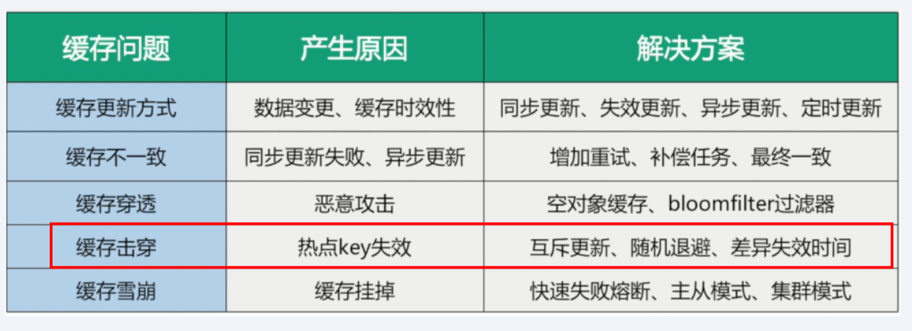

最终目的，2条命令原子性还是其次，主要是为了防止热key突然失效，导致缓存击穿的发送，从而增加MySQL服务器的压力

###### 3.3、案例升级

**1、复习、互斥更新，采用双检加锁策略**

多个线程同时去查询数据库的这条数据，那么我们可以在第一个查询数据的请求上**使用一个互斥锁来锁住它。**

其他的线程走到这一步拿不到锁就等着，等第一个线程查询到了数据，然后做缓存。后面的线程进来发现已经有缓存了，就直接走缓存。

```java
 public String get(String key) {
     try (Jedis jedis = new Jedis()) {
         String value = jedis.get(key); // 查询缓存
         if (value != null && value.length() > 0) {
             // 缓存存在的话，那么就直接返回
             return value;
         }

         // 缓存不存在则对需要加锁
         // 假设请求量很大，则缓存需要设置自动过期时间
         synchronized (JedisUtils.class) {
             // 这里加锁的目的是为了防止高并发下有其余线程修改了redis中的值
             value = jedis.get(key);
             if (value != null && value.length() > 0) {
                 return value;
             }

             // 经过两次查询redis之后，都没数据，就从mysql中查询
             value = dao.get(key);

             // 将数据写入缓存
             jedis.setex(key, KEY_TTL, value);
             return value;
         }
     }
 }
```


**2、双缓存+差异失效时间**

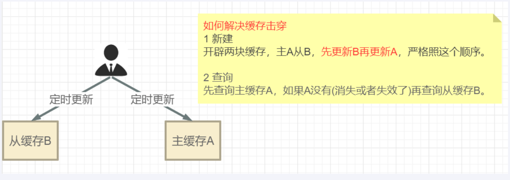

**3、JHSTaskService**

```java
package com.atguigu.redis7.service;

import cn.hutool.core.date.DateUtil;
import com.atguigu.redis7.entities.Product;
import lombok.extern.slf4j.Slf4j;
import org.springframework.beans.factory.annotation.Autowired;
import org.springframework.data.redis.core.RedisTemplate;
import org.springframework.stereotype.Service;

import javax.annotation.PostConstruct;
import java.util.ArrayList;
import java.util.List;
import java.util.Random;
import java.util.concurrent.TimeUnit;

/**
 * @auther zzyy
 * @create 2022-12-31 14:26
 */
@Service
@Slf4j
public class JHSTaskService
{
    public  static final String JHS_KEY="jhs";
    public  static final String JHS_KEY_A="jhs:a";
    public  static final String JHS_KEY_B="jhs:b";

    @Autowired
    private RedisTemplate redisTemplate;

    /**
     * 偷个懒不加mybatis了，模拟从数据库读取100件特价商品，用于加载到聚划算的页面中
     * @return
     */
    private List<Product> getProductsFromMysql() {
        List<Product> list=new ArrayList<>();
        for (int i = 1; i <=20; i++) {
            Random rand = new Random();
            int id= rand.nextInt(10000);
            Product obj=new Product((long) id,"product"+i,i,"detail");
            list.add(obj);
        }
        return list;
    }

    //@PostConstruct
    public void initJHS(){
        log.info("启动定时器淘宝聚划算功能模拟.........."+ DateUtil.now());
        new Thread(() -> {
            //模拟定时器，定时把数据库的特价商品，刷新到redis中
            while (true){
                //模拟从数据库读取100件特价商品，用于加载到聚划算的页面中
                List<Product> list=this.getProductsFromMysql();
                //采用redis list数据结构的lpush来实现存储
                this.redisTemplate.delete(JHS_KEY);
                //lpush命令
                this.redisTemplate.opsForList().leftPushAll(JHS_KEY,list);
                //间隔一分钟 执行一遍
                try { TimeUnit.MINUTES.sleep(1); } catch (InterruptedException e) { e.printStackTrace(); }

                log.info("runJhs定时刷新..............");
            }
        },"t1").start();
    }

    @PostConstruct
    public void initJHSAB(){
        log.info("启动AB定时器计划任务淘宝聚划算功能模拟.........."+DateUtil.now());
        new Thread(() -> {
            //模拟定时器，定时把数据库的特价商品，刷新到redis中
            while (true){
                //模拟从数据库读取100件特价商品，用于加载到聚划算的页面中
                List<Product> list=this.getProductsFromMysql();
                //先更新B缓存
                this.redisTemplate.delete(JHS_KEY_B);
                this.redisTemplate.opsForList().leftPushAll(JHS_KEY_B,list);
                this.redisTemplate.expire(JHS_KEY_B,20L,TimeUnit.DAYS);
                //再更新A缓存
                this.redisTemplate.delete(JHS_KEY_A);
                this.redisTemplate.opsForList().leftPushAll(JHS_KEY_A,list);
                this.redisTemplate.expire(JHS_KEY_A,15L,TimeUnit.DAYS);
                //间隔一分钟 执行一遍
                try { TimeUnit.MINUTES.sleep(1); } catch (InterruptedException e) { e.printStackTrace(); }

                log.info("runJhs定时刷新双缓存AB两层..............");
            }
        },"t1").start();
    }
}
```


**4、JHSProductController**

```java
package com.atguigu.redis7.controller;

import com.atguigu.redis7.entities.Product;
import io.swagger.annotations.Api;
import io.swagger.annotations.ApiOperation;
import lombok.extern.slf4j.Slf4j;
import org.springframework.beans.factory.annotation.Autowired;
import org.springframework.data.redis.core.RedisTemplate;
import org.springframework.util.CollectionUtils;
import org.springframework.web.bind.annotation.RequestMapping;
import org.springframework.web.bind.annotation.RequestMethod;
import org.springframework.web.bind.annotation.RestController;

import java.util.List;

/**
 * @auther zzyy
 * @create 2022-12-31 14:29
 */
@RestController
@Slf4j
@Api(tags = "聚划算商品列表接口")
public class JHSProductController
{
    public  static final String JHS_KEY="jhs";
    public  static final String JHS_KEY_A="jhs:a";
    public  static final String JHS_KEY_B="jhs:b";

    @Autowired
    private RedisTemplate redisTemplate;

    /**
     * 分页查询：在高并发的情况下，只能走redis查询，走db的话必定会把db打垮
     * @param page
     * @param size
     * @return
     */
    @RequestMapping(value = "/pruduct/find",method = RequestMethod.GET)
    @ApiOperation("按照分页和每页显示容量，点击查看")
    public List<Product> find(int page, int size) {
        List<Product> list=null;

        long start = (page - 1) * size;
        long end = start + size - 1;

        try {
            //采用redis list数据结构的lrange命令实现分页查询
            list = this.redisTemplate.opsForList().range(JHS_KEY, start, end);
            if (CollectionUtils.isEmpty(list)) {
                //TODO 走DB查询
            }
            log.info("查询结果：{}", list);
        } catch (Exception ex) {
            //这里的异常，一般是redis瘫痪 ，或 redis网络timeout
            log.error("exception:", ex);
            //TODO 走DB查询
        }

        return list;
    }

    @RequestMapping(value = "/pruduct/findab",method = RequestMethod.GET)
    @ApiOperation("防止热点key突然失效，AB双缓存架构")
    public List<Product> findAB(int page, int size) {
        List<Product> list=null;
        long start = (page - 1) * size;
        long end = start + size - 1;
        try {
            //采用redis list数据结构的lrange命令实现分页查询
            list = this.redisTemplate.opsForList().range(JHS_KEY_A, start, end);
            if (CollectionUtils.isEmpty(list)) {
                log.info("=========A缓存已经失效了，记得人工修补，B缓存自动延续5天");
                //用户先查询缓存A(上面的代码)，如果缓存A查询不到（例如，更新缓存的时候删除了），再查询缓存B
                this.redisTemplate.opsForList().range(JHS_KEY_B, start, end);
                //TODO 走DB查询
            }
            log.info("查询结果：{}", list);
        } catch (Exception ex) {
            //这里的异常，一般是redis瘫痪 ，或 redis网络timeout
            log.error("exception:", ex);
            //TODO 走DB查询
        }
        return list;
    }
}
```


### 7.6 总结

| 缓存问题     | 产生原因               | 解决方案                                                     |
| ------------ | ---------------------- | ------------------------------------------------------------ |
| 缓存更新方式 | 数据变更、缓存时效性   | 同步更新、失效更新、异步更新、定时更新                       |
| 缓存不一致   | 同步更新失败、异步更新 | 增加重试、补偿任务、最终一致                                 |
| 缓存穿透     | 恶意攻击               | 缓存空对象、BloomFilter（布隆过滤器）                        |
| 缓存击穿     | 热点key失效            | 互斥更新、随机退避、双缓存+差异失效时间                      |
| 缓存雪崩     | 大批热点key同时失效    | 给这批同时失效的key增加随机的失效时间<br>快速失败熔断、主从模式、集群模式 |

## 8 手写Redis的分布式锁

### 8.1 面试题

- Redis除了拿来做缓存，你还见过基于Redis的什么用法

  - 数据共享，分布式Session

  - 分布式锁

  - 全局ID

  - 计数器，点赞功能

  - HyperLogLog完成UV统计

  - hash用作购物车

  - 使用list或者stream用作轻量级的消息队列

  - 使用set完成抽奖功能

  - bitmap签到、打卡

  - 使用set完成差集、交集、并集，好友共同关注、可能认识的人、好友推荐

  - 使用zset完成热点新闻、热搜排行榜

  - 使用Redis的GEO完成附件的人、附件的酒店等

- Redis做分布式锁的时候需要有哪些注意的问题？

- 你们公司自己实现的分布式锁是否使用setnx命令实现？这个是最合适的吗？你们是如何考虑分布式锁的可重入问题呢？

- 如果redis是单点部署的，会带来什么问题？那么你准备如何解决单点问题呢？

- Redis集群模式下，比如主从模式，CAP方面有没有什么问题呢？

- 那你简单的介绍一下RedLock吧，你简历上写了redisson，你谈谈

- Redis分布式锁如何续期？看门狗知道吗？

### 8.2 锁按是否集群模式分为

- 单机版，同一个JVM内的，synchronized或者Lock接口
- 分布式，多个JVM虚拟机，单机的线程锁机制不再起作用，资源类在不同的服务器不能共享了。这时候就需要一个中间人来协调，控制资源的共享，常见的分布式锁的实现有

| 锁的分类      | 实现方式                                       | 可靠性 | 可用性 | 理解难易度 | 实现难易度 |
| ------------- | ---------------------------------------------- | ------ | ------ | ---------- | ---------- |
| Redis实现     | 基于(set nx + expire) <br>基于hincrby + expire | 高     | 高     | 一般       | 一般       |
| MySQL实现     | 悲观锁、乐观锁                                 | 低     | 最低   | 容易       | 难         |
| Zookeeper实现 | 基于节点间的一致性                             | 最高   | 低     | 难         | 低         |

### 8.3 一个可靠的分布式需要满足以下的条件

- 独占性
  - 在任何时候，都只能有且只有一个线程持有锁
- 高可用
  - 在redis集群环境下，不能因为某一个节点挂了，而出现获取锁和释放锁失败的情况
  - 高并发请求下，性能依旧优秀
- 防止死锁
  - 必须要有防止死锁的措施，即必须有超时控制机制和过期删除锁的操作，有个兜底释放锁的方案
- 不能乱删他人的锁
  - 这里是自己的锁只能自己删，不能乱删他人的锁
- 可重入性
  - 一个线程获得锁后，还可以继续获得这把锁

### 8.4 Redis实现分布式锁

#### 8.4.1 setnx命令简介

##### 1、setnx key value

```shell
set key value [EX seconds][PX milliseconds][NX|XX]
```


```shell
127.0.0.1:6379> setnx k1 true
1
127.0.0.1:6379> setnx k1 false
0
127.0.0.1:6379> expire k1 60
1
127.0.0.1:6379> ttl k1
56
127.0.0.1:6379> ttl k1
55
127.0.0.1:6379> ttl k1
54
127.0.0.1:6379> ttl k1
53
127.0.0.1:6379> ttl k1
52

```

> 存在的问题：setnx与expire是两条命令不是一个原子的操作

#### 8.4.2 重点

JUC中的AQS锁的规范落地参考+可重入锁考虑+Lua脚本+Redis命令一步步实现分布式锁

#### 8.4.3 基础案例

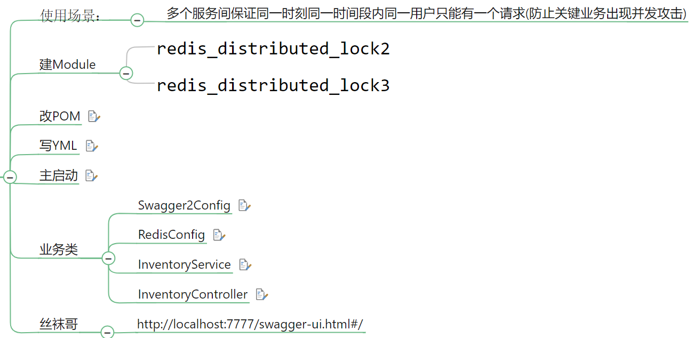

##### 1、pom

```xml
<?xml version="1.0" encoding="UTF-8"?>
<project xmlns="http://maven.apache.org/POM/4.0.0"
         xmlns:xsi="http://www.w3.org/2001/XMLSchema-instance"
         xsi:schemaLocation="http://maven.apache.org/POM/4.0.0 http://maven.apache.org/xsd/maven-4.0.0.xsd">
    <modelVersion>4.0.0</modelVersion>

    <groupId>com.atguigu.redislock</groupId>
    <artifactId>redis_distributed_lock2</artifactId>
    <version>1.0-SNAPSHOT</version>


    <parent>
        <groupId>org.springframework.boot</groupId>
        <artifactId>spring-boot-starter-parent</artifactId>
        <version>2.6.12</version>
        <relativePath/> <!-- lookup parent from repository -->
    </parent>


    <properties>
        <project.build.sourceEncoding>UTF-8</project.build.sourceEncoding>
        <maven.compiler.source>8</maven.compiler.source>
        <maven.compiler.target>8</maven.compiler.target>
        <lombok.version>1.16.18</lombok.version>
    </properties>


    <dependencies>
        <!--SpringBoot通用依赖模块-->
        <dependency>
            <groupId>org.springframework.boot</groupId>
            <artifactId>spring-boot-starter-web</artifactId>
        </dependency>
        <!--SpringBoot与Redis整合依赖-->
        <dependency>
            <groupId>org.springframework.boot</groupId>
            <artifactId>spring-boot-starter-data-redis</artifactId>
        </dependency>
        <dependency>
            <groupId>org.apache.commons</groupId>
            <artifactId>commons-pool2</artifactId>
        </dependency>
        <!--swagger2-->
        <dependency>
            <groupId>io.springfox</groupId>
            <artifactId>springfox-swagger2</artifactId>
            <version>2.9.2</version>
        </dependency>
        <dependency>
            <groupId>io.springfox</groupId>
            <artifactId>springfox-swagger-ui</artifactId>
            <version>2.9.2</version>
        </dependency>
        <!--通用基础配置boottest/lombok/hutool-->
        <dependency>
            <groupId>org.springframework.boot</groupId>
            <artifactId>spring-boot-starter-test</artifactId>
            <scope>test</scope>
        </dependency>
        <dependency>
            <groupId>org.projectlombok</groupId>
            <artifactId>lombok</artifactId>
            <version>${lombok.version}</version>
            <optional>true</optional>
        </dependency>
        <dependency>
            <groupId>cn.hutool</groupId>
            <artifactId>hutool-all</artifactId>
            <version>5.8.8</version>
        </dependency>
    </dependencies>

    <build>
        <plugins>
            <plugin>
                <groupId>org.springframework.boot</groupId>
                <artifactId>spring-boot-maven-plugin</artifactId>
            </plugin>
        </plugins>
    </build>

</project>
```


##### 2、yaml

```properties
server.port=7777

spring.application.name=redis_distributed_lock
# ========================swagger2=====================
# http://localhost:7777/swagger-ui.html
swagger2.enabled=true
spring.mvc.pathmatch.matching-strategy=ant_path_matcher

# ========================redis单机=====================
spring.redis.database=0
spring.redis.host=192.168.111.185
spring.redis.port=6379
spring.redis.password=111111
spring.redis.lettuce.pool.max-active=8
spring.redis.lettuce.pool.max-wait=-1ms
spring.redis.lettuce.pool.max-idle=8
spring.redis.lettuce.pool.min-idle=0
```


##### 3、启动类

```java
package com.atguigu.redislock;

import org.springframework.boot.SpringApplication;
import org.springframework.boot.autoconfigure.SpringBootApplication;

/**
 * @auther zzyy
 * @create 2022-10-12 22:20
 */
@SpringBootApplication
public class RedisDistributedLockApp7777
{
    public static void main(String[] args)
    {
        SpringApplication.run(RedisDistributedLockApp7777.class,args);
    }
}
```


##### 4、业务类

###### 4.1、Swagger2Config

```java
package com.atguigu.redislock.config;

import org.springframework.beans.BeansException;
import org.springframework.beans.factory.annotation.Value;
import org.springframework.beans.factory.config.BeanPostProcessor;
import org.springframework.context.annotation.Bean;
import org.springframework.context.annotation.Configuration;
import org.springframework.web.servlet.mvc.method.RequestMappingInfoHandlerMapping;
import springfox.documentation.builders.ApiInfoBuilder;
import springfox.documentation.builders.PathSelectors;
import springfox.documentation.builders.RequestHandlerSelectors;
import springfox.documentation.service.ApiInfo;
import springfox.documentation.spi.DocumentationType;
import springfox.documentation.spring.web.plugins.Docket;
import springfox.documentation.spring.web.plugins.WebMvcRequestHandlerProvider;
import springfox.documentation.swagger2.annotations.EnableSwagger2;

import java.time.LocalDateTime;
import java.time.format.DateTimeFormatter;
import java.util.List;
import java.util.stream.Collectors;

/**
 * @auther zzyy
 * @create 2022-10-12 21:55
 */
@Configuration
@EnableSwagger2
public class Swagger2Config
{
    @Value("${swagger2.enabled}")
    private Boolean enabled;

    @Bean
    public Docket createRestApi() {
        return new Docket(DocumentationType.SWAGGER_2)
                .apiInfo(apiInfo())
                .enable(enabled)
                .select()
                .apis(RequestHandlerSelectors.basePackage("com.atguigu.redislock")) //你自己的package
                .paths(PathSelectors.any())
                .build();
    }
    private ApiInfo apiInfo() {
        return new ApiInfoBuilder()
                .title("springboot利用swagger2构建api接口文档 "+"\t"+ DateTimeFormatter.ofPattern("yyyy-MM-dd").format(LocalDateTime.now()))
                .description("springboot+redis整合")
                .version("1.0")
                .termsOfServiceUrl("https://www.baidu.com/")
                .build();
    }

}


 
```


###### 4.2、RedisConfig

```java
package com.atguigu.redislock.config;

import org.springframework.context.annotation.Bean;
import org.springframework.context.annotation.Configuration;
import org.springframework.data.redis.connection.lettuce.LettuceConnectionFactory;
import org.springframework.data.redis.core.RedisTemplate;
import org.springframework.data.redis.serializer.GenericJackson2JsonRedisSerializer;
import org.springframework.data.redis.serializer.StringRedisSerializer;

/**
 * @auther zzyy
 * @create 2022-07-02 11:25
 */
@Configuration
public class RedisConfig
{
    @Bean
    public RedisTemplate<String, Object> redisTemplate(LettuceConnectionFactory lettuceConnectionFactory)
    {
        RedisTemplate<String,Object> redisTemplate = new RedisTemplate<>();
        redisTemplate.setConnectionFactory(lettuceConnectionFactory);
        //设置key序列化方式string
        redisTemplate.setKeySerializer(new StringRedisSerializer());
        //设置value的序列化方式json
        redisTemplate.setValueSerializer(new GenericJackson2JsonRedisSerializer());

        redisTemplate.setHashKeySerializer(new StringRedisSerializer());
        redisTemplate.setHashValueSerializer(new GenericJackson2JsonRedisSerializer());

        redisTemplate.afterPropertiesSet();

        return redisTemplate;
    }
}

```


###### 4.3、InventoryService

```java
package com.atguigu.redislock.service;

import cn.hutool.core.util.IdUtil;
import lombok.extern.slf4j.Slf4j;
import org.springframework.beans.factory.annotation.Autowired;
import org.springframework.beans.factory.annotation.Value;
import org.springframework.data.redis.core.StringRedisTemplate;
import org.springframework.stereotype.Service;

import java.util.concurrent.locks.Lock;
import java.util.concurrent.locks.ReentrantLock;

/**
 * @auther zzyy
 * @create 2022-10-22 15:14
 */
@Service
@Slf4j
public class InventoryService
{
    @Autowired
    private StringRedisTemplate stringRedisTemplate;
    @Value("${server.port}")
    private String port;

    private Lock lock = new ReentrantLock();

    public String sale()
    {
        String retMessage = "";
        lock.lock();
        try
        {
            //1 查询库存信息
            String result = stringRedisTemplate.opsForValue().get("inventory001");
            //2 判断库存是否足够
            Integer inventoryNumber = result == null ? 0 : Integer.parseInt(result);
            //3 扣减库存
            if(inventoryNumber > 0) {
                stringRedisTemplate.opsForValue().set("inventory001",String.valueOf(--inventoryNumber));
                retMessage = "成功卖出一个商品，库存剩余: "+inventoryNumber;
                System.out.println(retMessage);
            }else{
                retMessage = "商品卖完了，o(╥﹏╥)o";
            }
        }finally {
            lock.unlock();
        }
        return retMessage+"\t"+"服务端口号："+port;
    }
}
```


###### 4.4、InventoryController

```java
package com.atguigu.redislock.controller;

import cn.hutool.core.util.IdUtil;
import com.atguigu.redislock.service.InventoryService;
import io.swagger.annotations.Api;
import io.swagger.annotations.ApiOperation;
import lombok.Getter;
import org.springframework.beans.factory.annotation.Autowired;
import org.springframework.web.bind.annotation.GetMapping;
import org.springframework.web.bind.annotation.ResponseStatus;
import org.springframework.web.bind.annotation.RestController;

import java.util.concurrent.atomic.AtomicInteger;

/**
 * @auther zzyy
 * @create 2022-10-12 17:05
 */
@RestController
@Api(tags = "redis分布式锁测试")
public class InventoryController
{
    @Autowired
    private InventoryService inventoryService;

    @ApiOperation("扣减库存，一次卖一个")
    @GetMapping(value = "/inventory/sale")
    public String sale()
    {
        return inventoryService.sale();
    }
}
```


##### 5、测试：http://localhost:7777/swagger-ui.html#/

### 8.5 单机锁

#### 8.5.1 初始版本简单添加

业务类

InventoryService

```java
package com.atguigu.redislock.service;

import cn.hutool.core.util.IdUtil;
import lombok.extern.slf4j.Slf4j;
import org.springframework.beans.factory.annotation.Autowired;
import org.springframework.beans.factory.annotation.Value;
import org.springframework.data.redis.core.StringRedisTemplate;
import org.springframework.stereotype.Service;

import java.util.concurrent.locks.Lock;
import java.util.concurrent.locks.ReentrantLock;

/**
 * @auther zzyy
 * @create 2022-10-22 15:14
 */
@Service
@Slf4j
public class InventoryService
{
    @Autowired
    private StringRedisTemplate stringRedisTemplate;
    @Value("${server.port}")
    private String port;

    private Lock lock = new ReentrantLock();

    public String sale()
    {
        String retMessage = "";
        lock.lock();
        try
        {
            //1 查询库存信息
            String result = stringRedisTemplate.opsForValue().get("inventory001");
            //2 判断库存是否足够
            Integer inventoryNumber = result == null ? 0 : Integer.parseInt(result);
            //3 扣减库存
            if(inventoryNumber > 0) {
                stringRedisTemplate.opsForValue().set("inventory001",String.valueOf(--inventoryNumber));
                retMessage = "成功卖出一个商品，库存剩余: "+inventoryNumber;
                System.out.println(retMessage);
            }else{
                retMessage = "商品卖完了，o(╥﹏╥)o";
            }
        }finally {
            lock.unlock();
        }
        return retMessage+"\t"+"服务端口号："+port;
    }
}
```


使用idea的Edit Configurations来配置并启动多实例

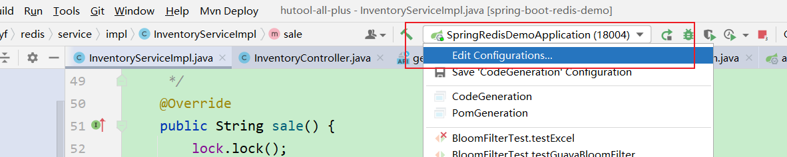

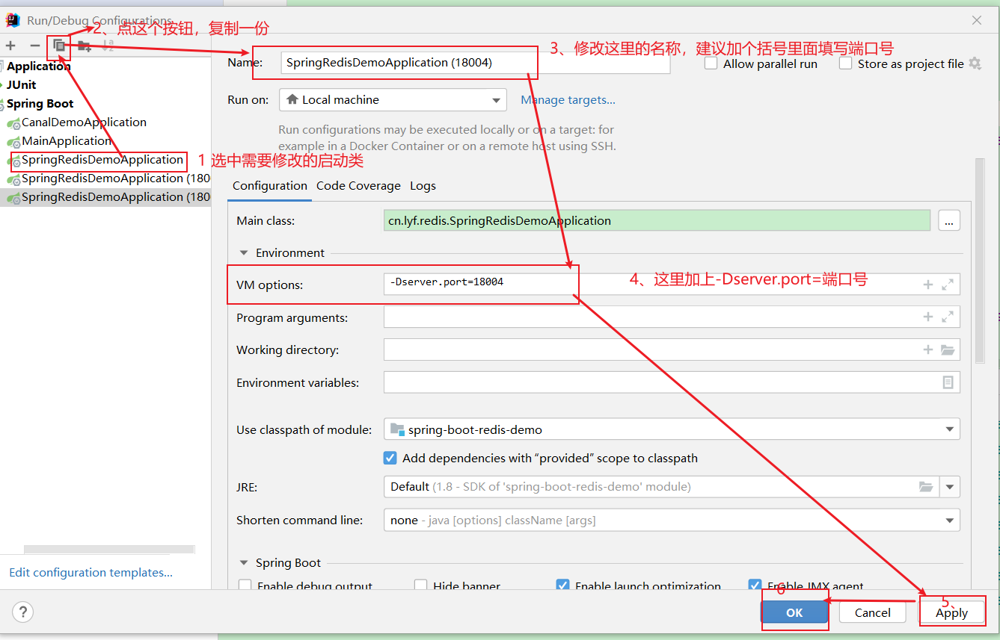

**加synchronized或者Lock**

#### 8.5.2 nginx，分布式微服务集群架构

ps：补充一个centos7 安装nginx脚本

```shell
#! /bin/sh
# 脚本安装nginx

# 先判断是否为root用户，不是root用户则不给执行


if [ $UID -ne 0 ];then
    echo "is not root"
    exit
else
    echo "is root!"
    echo "install nginx start"
fi


# 如果/usr/local/apps不存在则直接创建
if [ ! -d "/usr/local/apps" ]; then
    mkdir -p /usr/local/apps
fi

# 先删除nginx
rm -rf /usr/local/nginx

# 创建/usr/local/nginx
mkdir -p /usr/local/nginx


cd /usr/local/apps
# 判断/usr/local/apps是否有nginx-1.20.2.tar.gz
if [ ! -f "/usr/local/apps/nginx-1.20.2.tar.gz" ]; then
  wget http://nginx.org/download/nginx-1.20.2.tar.gz
fi

# 安装nginx依赖
yum -y install gcc pcre-devel zlib-devel openssl openssl-devel

# 解压nginx
# 如果目录已经存在了的话，那么删除该目录
if [ -d "/usr/local/apps/nginx-1.20.2" ]; then
    rm -rf /usr/local/apps/nginx-1.20.2
fi

tar -zxvf nginx-1.20.2.tar.gz

cd ./nginx-1.20.2


./configure --prefix=/usr/local/nginx


make
make install

if [! -d "/etc/systemd/system" ]; then
    mkdir -p /etc/systemd/system
fi


if [ ! -f "/etc/systemd/system/nginx.service" ]; then
  tee /etc/systemd/system/nginx.service <<-'EOF'
[Unit]
Description=The Nginx HTTP Server
After=network.target remote-fs.target nss-lookup.target

[Service]
Type=forking
PIDFile=/usr/local/nginx/logs/nginx.pid
ExecStart=/usr/local/nginx/sbin/nginx
ExecReload=/usr/local/nginx/sbin/nginx -s reload
ExecStop=/usr/local/nginx/sbin/nginx -s stop
PrivateTmp=true

[Install]
WantedBy=multi-user.target
EOF
fi

systemctl enable nginx.service
systemctl restart nginx.service
systemctl status nginx.service

# 开放80端口
lsof -i:80
firewall-cmd --zone=public --add-port=80/tcp --permanent
firewall-cmd --reload
firewall-cmd --zone=public --list-ports

echo "nginx install completed"
```

V2.0版本代码分布式部署后，单机锁还是出现了超卖现象，需要分布式锁

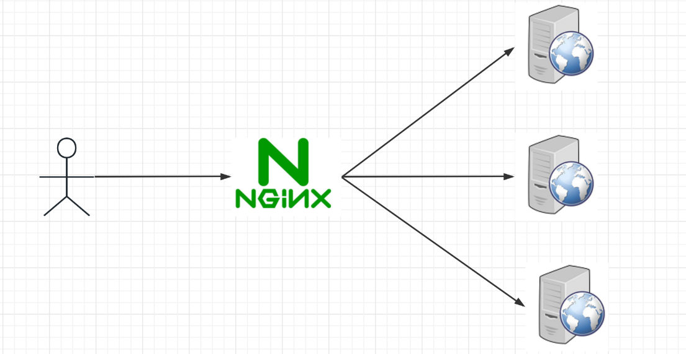

##### 1、Nginx配置负载均衡

###### 1.1、命令地址

```shell
/usr/local/nginx/sbin
```

###### 1.2、配置地址

```shell
/usr/local/nginx/conf
```

###### 1.3、启动

```shell
cd /usr/local/nginx/sbin
./nginx
```

启动Nginx并测试通过，浏览器看到Nginx欢迎welcome页面

###### **1.4、修改配置文件**

新增反向代理与负载均衡配置

```shell
vim /usr/local/nginx/conf/redis.conf
```

```
    upstream mynginx {
        server 192.168.0.106:18002 weight=1;
        server 192.168.0.106:18003 weight=1;
        server 192.168.0.106:18004 weight=1;
    }

    server {
        location / {
           # root   html;
            proxy_pass  http://mynginx;
            index  index.html index.htm;
        }
```

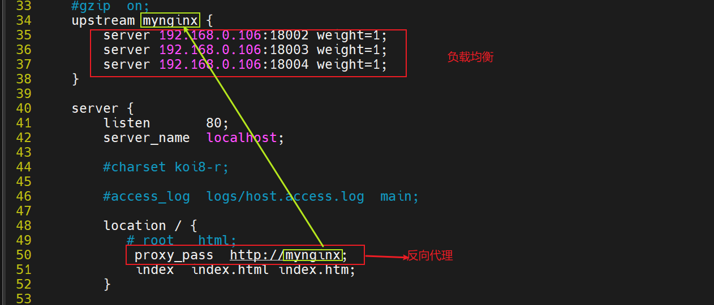

###### 1.5、关闭

```shell
cd /usr/local/nginx/sbin
./nginx -s stop
```

###### 1.6、指定配置启动

```shell
./nginx -c /usr/local/nginx/conf/nginx.conf
```

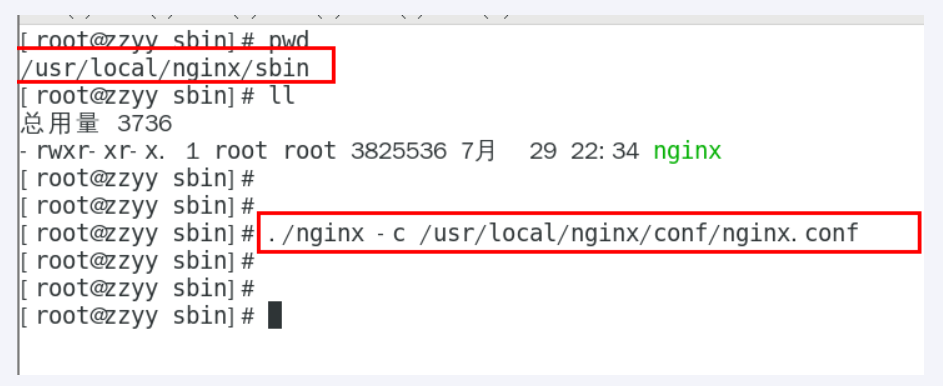

###### 1.7、重启

```shell
cd /usr/local/nginx/sbin
./nginx -s reload
```


##### 2、启动多个实例

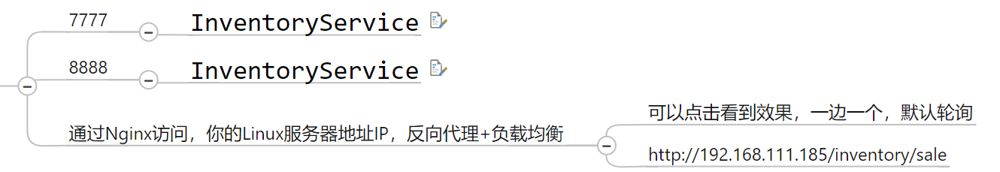

##### 3、使用Jmeter压测

[Jmeter官网](https://jmeter.apache.org/)

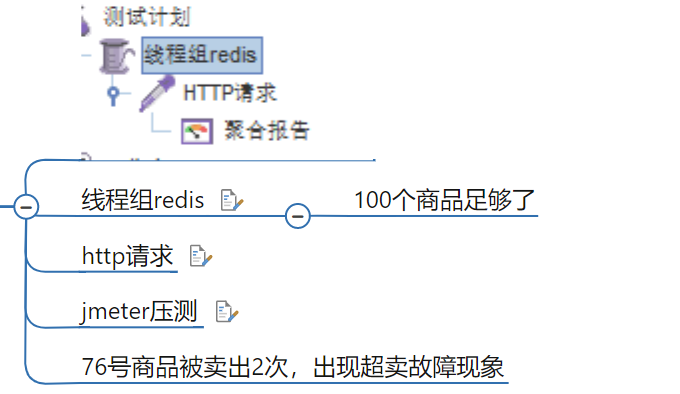

3.1、线程组

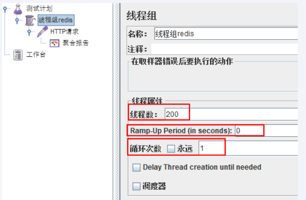

3.2、http请求

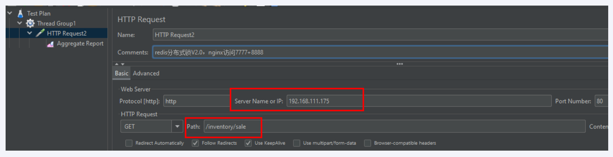

3.3、jmeter压测

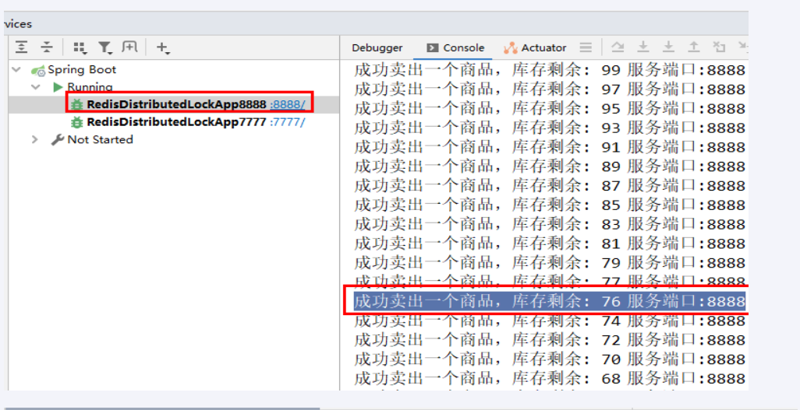

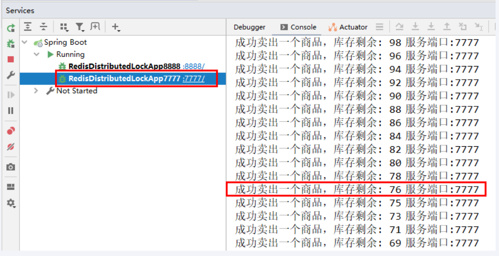

> 76号商品被卖出2次，出现了超卖现象。

##### 4、为什么加了synchronized或者Lock锁，还是会产生超卖现象？

在单机环境下，可以使用synchronized或Lock来实现。

但是在分布式系统中，因为竞争的线程可能不在同一个节点上（同一个jvm中），

所以需要一个让所有进程都能访问到的锁来实现(比如redis或者zookeeper来构建)

不同进程jvm层面的锁就不管用了，那么可以利用第三方的一个组件，来获取锁，未获取到锁，则阻塞当前想要运行的线程

##### 5、分布式锁的出现

- 能干嘛
  - 跨进程+跨服务
  - 解决超卖
  - 防止缓存击穿

##### 6、解决

[set命令官网地址](https://redis.io/commands/set/)

上redis分布式锁（setnx + expire）

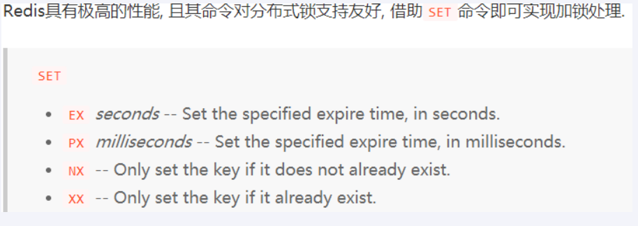


### 8.6 redis 分布式锁V1.0

#### 8.6.1、V1.1 递归重试

```java
package com.atguigu.redislock.service;

import cn.hutool.core.util.IdUtil;
import lombok.extern.slf4j.Slf4j;
import org.springframework.beans.factory.annotation.Autowired;
import org.springframework.beans.factory.annotation.Value;
import org.springframework.data.redis.core.StringRedisTemplate;
import org.springframework.stereotype.Service;

import java.util.concurrent.TimeUnit;
import java.util.concurrent.locks.Lock;
import java.util.concurrent.locks.ReentrantLock;

/**
 * @auther zzyy
 * @create 2022-10-22 15:14
 */
@Service
@Slf4j
public class InventoryService
{
    @Autowired
    private StringRedisTemplate stringRedisTemplate;
    @Value("${server.port}")
    private String port;

    private Lock lock = new ReentrantLock();

    public String sale()
    {
        String retMessage = "";
        String key = "zzyyRedisLock";
        String uuidValue = IdUtil.simpleUUID()+":"+Thread.currentThread().getId();

        Boolean flag = stringRedisTemplate.opsForValue().setIfAbsent(key, uuidValue);
        if(!flag){
            //暂停20毫秒后递归调用
            try { TimeUnit.MILLISECONDS.sleep(20); } catch (InterruptedException e) { e.printStackTrace(); }
            sale();
        }else{
            try{
                //1 查询库存信息
                String result = stringRedisTemplate.opsForValue().get("inventory001");
                //2 判断库存是否足够
                Integer inventoryNumber = result == null ? 0 : Integer.parseInt(result);
                //3 扣减库存
                if(inventoryNumber > 0) {
                    stringRedisTemplate.opsForValue().set("inventory001",String.valueOf(--inventoryNumber));
                    retMessage = "成功卖出一个商品，库存剩余: "+inventoryNumber;
                    System.out.println(retMessage);
                }else{
                    retMessage = "商品卖完了，o(╥﹏╥)o";
                }
            }finally {
                stringRedisTemplate.delete(key);
            }
        }
        return retMessage+"\t"+"服务端口号："+port;
    }
}
```


存在的问题：递归容易导致StackOverflowError，一般不推荐使用这个方法


#### 8.6.2、V1.2 用自旋替代递归重试

```java
package com.atguigu.redislock.service;

import cn.hutool.core.util.IdUtil;
import lombok.extern.slf4j.Slf4j;
import org.springframework.beans.factory.annotation.Autowired;
import org.springframework.beans.factory.annotation.Value;
import org.springframework.data.redis.core.StringRedisTemplate;
import org.springframework.stereotype.Service;

import java.util.concurrent.TimeUnit;
import java.util.concurrent.locks.Lock;
import java.util.concurrent.locks.ReentrantLock;

/**
 * @auther zzyy
 * @create 2022-10-22 15:14
 */
@Service
@Slf4j
public class InventoryService
{
    @Autowired
    private StringRedisTemplate stringRedisTemplate;
    @Value("${server.port}")
    private String port;

    private Lock lock = new ReentrantLock();

    public String sale()
    {
        String retMessage = "";
        String key = "zzyyRedisLock";
        String uuidValue = IdUtil.simpleUUID()+":"+Thread.currentThread().getId();
        while(!stringRedisTemplate.opsForValue().setIfAbsent(key, uuidValue)){
            //暂停20毫秒，类似CAS自旋
            try { TimeUnit.MILLISECONDS.sleep(20); } catch (InterruptedException e) { e.printStackTrace(); }
        }
        try
        {
            //1 查询库存信息
            String result = stringRedisTemplate.opsForValue().get("inventory001");
            //2 判断库存是否足够
            Integer inventoryNumber = result == null ? 0 : Integer.parseInt(result);
            //3 扣减库存
            if(inventoryNumber > 0) {
                stringRedisTemplate.opsForValue().set("inventory001",String.valueOf(--inventoryNumber));
                retMessage = "成功卖出一个商品，库存剩余: "+inventoryNumber;
                System.out.println(retMessage);
            }else{
                retMessage = "商品卖完了，o(╥﹏╥)o";
            }
        }finally {
            stringRedisTemplate.delete(key);
        }
        return retMessage+"\t"+"服务端口号："+port;
    }
}
```


多线程判断，想想JUC里面说过的虚假唤醒，用while替代if

### 8.7 redis分布式锁V2.0 考虑宕机的情况，防止死锁

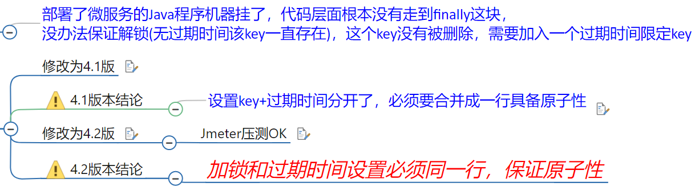

- 部署了微服务的Java程序宕机了，代码层面还没有走到finally块中，导致锁没有办法被释放，这样就会阻塞后续的线程，所以这个key必须有一个自动过期删除的策略。

#### 8.7.1 修改为V2.1 版

```java
while(!stringRedisTemplate.opsForValue().setIfAbsent(key, uuidValue))
{
    //暂停20毫秒，进行递归重试.....
    try { TimeUnit.MILLISECONDS.sleep(20); } catch (InterruptedException e) { e.printStackTrace(); }
}

stringRedisTemplate.expire(key,30L,TimeUnit.SECONDS);
```

##### 1、该版结论

设置key+过期时间不是一个原子的操作，必须要合成一行具备原子性

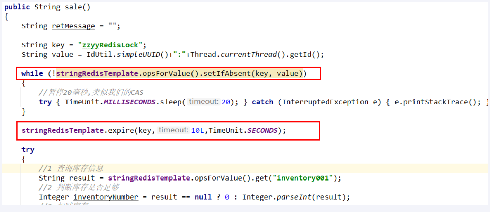

#### 8.7.2 修改为2.2版

```java
package com.atguigu.redislock.service;

import cn.hutool.core.util.IdUtil;
import lombok.extern.slf4j.Slf4j;
import org.springframework.beans.factory.annotation.Autowired;
import org.springframework.beans.factory.annotation.Value;
import org.springframework.data.redis.core.StringRedisTemplate;
import org.springframework.stereotype.Service;

import java.util.concurrent.TimeUnit;
import java.util.concurrent.locks.Lock;
import java.util.concurrent.locks.ReentrantLock;

/**
 * @auther zzyy
 * @create 2022-10-22 15:14
 */
@Service
@Slf4j
public class InventoryService
{
    @Autowired
    private StringRedisTemplate stringRedisTemplate;
    @Value("${server.port}")
    private String port;

    private Lock lock = new ReentrantLock();

    public String sale()
    {
        String retMessage = "";
        String key = "zzyyRedisLock";
        String uuidValue = IdUtil.simpleUUID()+":"+Thread.currentThread().getId();

        while(!stringRedisTemplate.opsForValue().setIfAbsent(key, uuidValue,30L,TimeUnit.SECONDS))
        {
            //暂停毫秒
            try { TimeUnit.MILLISECONDS.sleep(20); } catch (InterruptedException e) { e.printStackTrace(); }
        }

        try
        {
            //1 查询库存信息
            String result = stringRedisTemplate.opsForValue().get("inventory001");
            //2 判断库存是否足够
            Integer inventoryNumber = result == null ? 0 : Integer.parseInt(result);
            //3 扣减库存
            if(inventoryNumber > 0) {
                stringRedisTemplate.opsForValue().set("inventory001",String.valueOf(--inventoryNumber));
                retMessage = "成功卖出一个商品，库存剩余: "+inventoryNumber;
                System.out.println(retMessage);
            }else{
                retMessage = "商品卖完了，o(╥﹏╥)o";
            }
        }finally {
            stringRedisTemplate.delete(key);
        }
        return retMessage+"\t"+"服务端口号："+port;
    }
}
```

##### 1、Jmeter压测OK

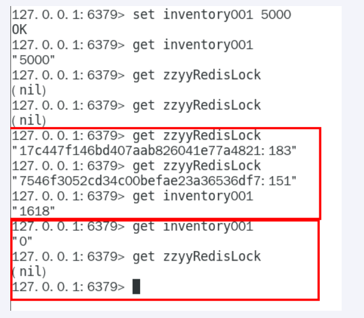

##### 2、改版结论

加锁和过期时间必须是一个原子的操作

### 8.8 redis分布式锁V3.0，防止误删别的线程的key的

#### 8.8.1 问题

- 实际业务的处理时间，超过了key设置的默认的过期时间？
- 实际就是张冠李戴，删除了别人的锁

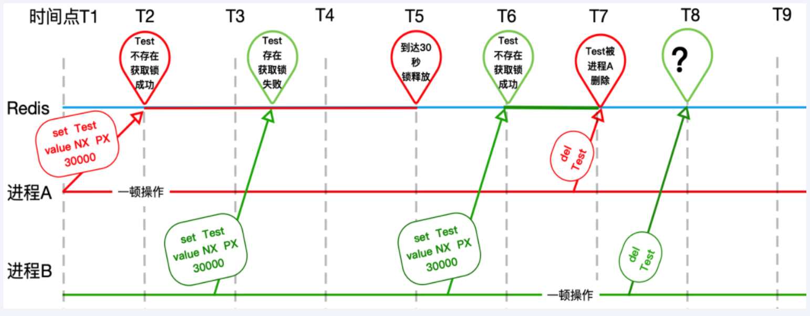

#### 8.8.2 解决

- 只能自己删除自己的，不许动别人的
- 修改为V3.0版

```java
package com.atguigu.redislock.service;

import cn.hutool.core.util.IdUtil;
import lombok.extern.slf4j.Slf4j;
import org.springframework.beans.factory.annotation.Autowired;
import org.springframework.beans.factory.annotation.Value;
import org.springframework.data.redis.core.StringRedisTemplate;
import org.springframework.stereotype.Service;

import java.util.concurrent.TimeUnit;
import java.util.concurrent.locks.Lock;
import java.util.concurrent.locks.ReentrantLock;

/**
 * @auther zzyy
 * @create 2022-10-22 15:14
 */
@Service
@Slf4j
public class InventoryService
{
    @Autowired
    private StringRedisTemplate stringRedisTemplate;
    @Value("${server.port}")
    private String port;

    private Lock lock = new ReentrantLock();

    public String sale()
    {
        String retMessage = "";
        String key = "zzyyRedisLock";
        String uuidValue = IdUtil.simpleUUID()+":"+Thread.currentThread().getId();

        while(!stringRedisTemplate.opsForValue().setIfAbsent(key, uuidValue,30L,TimeUnit.SECONDS))
        {
            //暂停毫秒
            try { TimeUnit.MILLISECONDS.sleep(20); } catch (InterruptedException e) { e.printStackTrace(); }
        }
        try
        {
            //1 查询库存信息
            String result = stringRedisTemplate.opsForValue().get("inventory001");
            //2 判断库存是否足够
            Integer inventoryNumber = result == null ? 0 : Integer.parseInt(result);
            //3 扣减库存
            if(inventoryNumber > 0) {
                stringRedisTemplate.opsForValue().set("inventory001",String.valueOf(--inventoryNumber));
                retMessage = "成功卖出一个商品，库存剩余: "+inventoryNumber+"\t"+uuidValue;
                System.out.println(retMessage);
            }else{
                retMessage = "商品卖完了，o(╥﹏╥)o";
            }
        }finally {
            // v5.0判断加锁与解锁是不是同一个客户端，同一个才行，自己只能删除自己的锁，不误删他人的
            if(stringRedisTemplate.opsForValue().get(key).equalsIgnoreCase(uuidValue)){
                stringRedisTemplate.delete(key);
            }
        }
        return retMessage+"\t"+"服务端口号："+port;
    }
}
 
```

### 8.9 redis分布式锁V4.0，删除锁的逻辑不是原子的，需要使用Lua脚本来保证原子性

#### 8.9.1 finally块的判断和del删除操作不是原子的

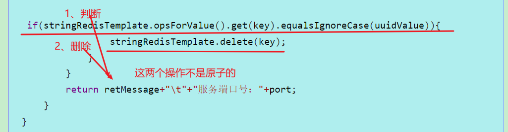

#### 8.9.2 Lua脚本

##### 1、[lua官网介绍](http://www.lua.org/about.html)


##### 2、lua脚本说明

redis调用Lua脚本通过eval命令保证代码执行的原子性。直接用return返回脚本执行后的结果值

redis中lua脚本使用命令

```shell
eval script numkeys [key [key ...]] [arg [arg ...]]
```

##### 3、lua脚本的入门小case

- hello lua

```shell
EVAL "return 'hello lua'" 0
```

- set k1 v1 get k1

```shell
EVAL "redis.call('set', 'k1', 'v1') return redis.call('get', 'k1')" 0
```

- mset

```shell
EVAL "return redis.call('mset', KEYS[1], ARGV[1], KEYS[2], ARGV[2])" 2 k3 k4 v3 v4
```

- 执行结果

```shell
127.0.0.1:6379> EVAL "return 'hello lua'" 0
hello lua
127.0.0.1:6379> EVAL "redis.call('set', 'k1', 'v1') return redis.call('get', 'k1')" 0
v1
127.0.0.1:6379> EVAL "return redis.call('mset', KEYS[1], ARGV[1], KEYS[2], ARGV[2])" 2 k3 k4 v3 v4
OK
127.0.0.1:6379> mget k1 k2 k3 k4
v1
v2
v3
v4
127.0.0.1:6379>
```


##### 4、lua脚本的高级用法

- 练习[redis官网关于分布式锁删除的lua脚本](https://redis.io/docs/manual/patterns/distributed-locks/)

```shell
if redis.call('get', KEYS[1]) == ARGV[1] then
    return redis.call('del', KEYS[1])
else
    return 0
end
```

- 简化成一行

```shell
"if redis.call('get', KEYS[1]) == ARGV[1] then return redis.call('del', KEYS[1]) else return 0 end"
```

```shell
127.0.0.1:6379> SET redis:lock lock:001 NX EX 3000
OK
127.0.0.1:6379> ttl redis:lock
2991
127.0.0.1:6379> EVAL "if redis.call('get', KEYS[1]) == ARGV[1] then return redis.call('del', KEYS[1]) else return 0 end" 1 'redis:lock' 'lock:001'
1
127.0.0.1:6379> ttl redis:lock
-2
127.0.0.1:6379>

```


- 条件判断语法

```shell
if (布尔条件) then
	业务代码
elseif (布尔条件) then
	业务代码
else
	业务代码
end
```


- 条件判断案例

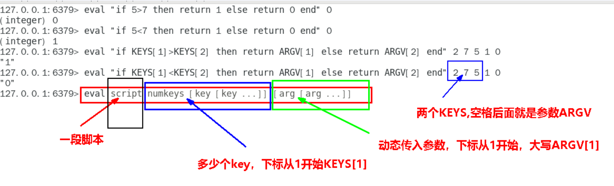

> ps: 使用lua脚本完成一例子输入分数，输出等级的案例
>
> 比如大于等于90分为优秀
>
> 大于等于80分为良
>
> 大于等于60分为及格
>
> 小于60分为差
>
> <strong><font color='red' size='5'>补充：除了KEY[?]和ARGV[?]其余参数都需要添加单引号</font></strong>

```lua
if KEYS[1] >= '90' then
    return '优秀'
elseif KEYS[1] >= '80' then
    return '良' 
elseif KEYS[1] >= '60' then
    return '及格'
else
    return '差'
end
```

```shell
"if KEYS[1] >= '90' then return '优秀' elseif KEYS[1] >= '80' then return '良' elseif KEYS[1] >= '60' then return '及格' else return '差' end"
```

```shell
127.0.0.1:6379> EVAL "if KEYS[1] >= '90' then return '优秀' elseif KEYS[1] >= '80' then return '良' elseif KEYS[1] >= '60' then return '及格' else return '差' end" 1 99
优秀
127.0.0.1:6379> EVAL "if KEYS[1] >= '90' then return '优秀' elseif KEYS[1] >= '80' then return '良' elseif KEYS[1] >= '60' then return '及格' else return '差' end" 1 88
良
127.0.0.1:6379> EVAL "if KEYS[1] >= '90' then return '优秀' elseif KEYS[1] >= '80' then return '良' elseif KEYS[1] >= '60' then return '及格' else return '差' end" 1 77
及格
127.0.0.1:6379> EVAL "if KEYS[1] >= '90' then return '优秀' elseif KEYS[1] >= '80' then return '良' elseif KEYS[1] >= '60' then return '及格' else return '差' end" 1 66
及格
127.0.0.1:6379> EVAL "if KEYS[1] >= '90' then return '优秀' elseif KEYS[1] >= '80' then return '良' elseif KEYS[1] >= '60' then return '及格' else return '差' end" 1 55
差
127.0.0.1:6379>

```

#### 8.9.3 编码实现

```java
package com.atguigu.redislock.service;

import cn.hutool.core.util.IdUtil;
import lombok.extern.slf4j.Slf4j;
import org.springframework.beans.factory.annotation.Autowired;
import org.springframework.beans.factory.annotation.Value;
import org.springframework.data.redis.core.StringRedisTemplate;
import org.springframework.data.redis.core.script.DefaultRedisScript;
import org.springframework.stereotype.Service;

import java.util.Arrays;
import java.util.concurrent.TimeUnit;
import java.util.concurrent.locks.Lock;
import java.util.concurrent.locks.ReentrantLock;

/**
 * @auther zzyy
 * @create 2022-10-22 15:14
 */
@Service
@Slf4j
public class InventoryService
{
    @Autowired
    private StringRedisTemplate stringRedisTemplate;
    @Value("${server.port}")
    private String port;

    private Lock lock = new ReentrantLock();

    public String sale()
    {
        String retMessage = "";
        String key = "zzyyRedisLock";
        String uuidValue = IdUtil.simpleUUID()+":"+Thread.currentThread().getId();

        while(!stringRedisTemplate.opsForValue().setIfAbsent(key, uuidValue,30L,TimeUnit.SECONDS))
        {
            //暂停毫秒
                     try { TimeUnit.MILLISECONDS.sleep(20); } catch (InterruptedException e) { e.printStackTrace(); }
        }

        try
        {
            //1 查询库存信息
            String result = stringRedisTemplate.opsForValue().get("inventory001");
            //2 判断库存是否足够
            Integer inventoryNumber = result == null ? 0 : Integer.parseInt(result);
            //3 扣减库存
            if(inventoryNumber > 0) {
                stringRedisTemplate.opsForValue().set("inventory001",String.valueOf(--inventoryNumber));
                retMessage = "成功卖出一个商品，库存剩余: "+inventoryNumber+"\t"+uuidValue;
                System.out.println(retMessage);
            }else{
                retMessage = "商品卖完了，o(╥﹏╥)o";
            }
        }finally {
            //V6.0 将判断+删除自己的合并为lua脚本保证原子性
            String luaScript =
                    "if (redis.call('get',KEYS[1]) == ARGV[1]) then " +
                        "return redis.call('del',KEYS[1]) " +
                    "else " +
                        "return 0 " +
                    "end";
            stringRedisTemplate.execute(new DefaultRedisScript<>(luaScript, Boolean.class), Arrays.asList(key), uuidValue);
        }
        return retMessage+"\t"+"服务端口号："+port;
    }
}


```


##### 1、bug说明

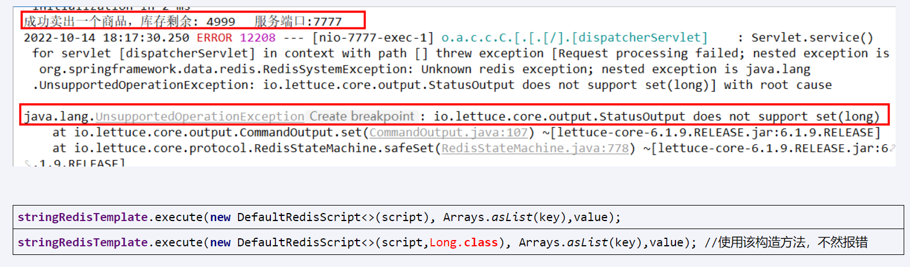

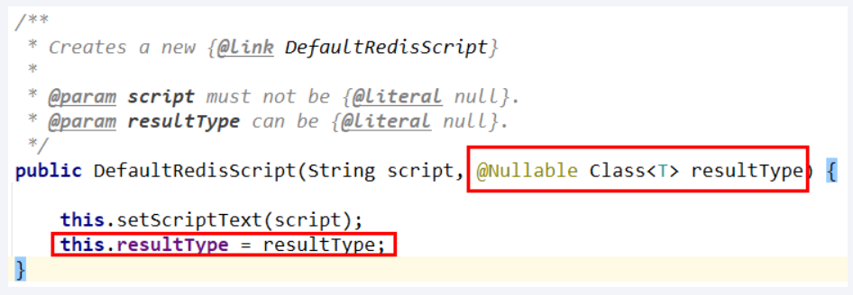

### 8.10 实现锁的重入+工厂设计模式

#### 8.10.1 前言

- while判断代替自旋+setnx+expire+lua脚本删除锁

- 存在的问题
  - 以上实现的锁，不是一个可重入的锁
- 复习写好一个锁的条件和规约
  - 独占性
  - 高可用
  - 防死锁
  - 不乱抢
  - 可重入

#### 8.10.2 可重入锁

##### 1、定义：

**可重入锁又名递归锁**

是指在同一个线程在外层方法获取锁的时候，再进入该线程的内层方法会自动获取锁(前提，锁对象得是同一个对象)，不会因为之前已经获取过还没释放而阻塞。

如果是1个有 synchronized 修饰的递归调用方法，**程序第2次进入被自己阻塞了岂不是天大的笑话，出现了作茧自缚。**

所以**Java中ReentrantLock和synchronized都是可重入锁**，可重入锁的一个优点是可一定程度避免死锁。

##### 2、可重入锁的分开解释

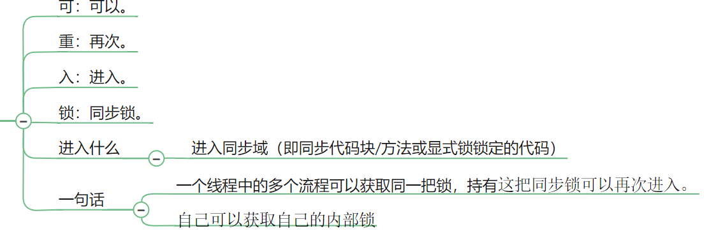

##### 3、JUC知识复习，可重入锁出BUG会如何影响程序

##### 4、可重入锁的种类

###### 4.1、隐式锁（即synchronized关键字使用的锁）默认是可重入锁

的是可重复可递归调用的锁，在外层使用锁之后，在内层仍然可以使用，并且不发生死锁，这样的锁就叫做可重入锁。

简单的来说就是：**在一个synchronized修饰的方法或代码块的内部调用本类的其他synchronized修饰的方法或代码块时，是永远可以得到锁的**

与可重入锁相反，不可重入锁不可递归调用，递归调用就发生死锁。

- 同步块

```java
package com.atguigu.juc.senior.prepare;

/**
 * @auther zzyy
 * @create 2020-05-14 11:59
 */
public class ReEntryLockDemo
{
    public static void main(String[] args)
    {
        final Object objectLockA = new Object();

        new Thread(() -> {
            synchronized (objectLockA)
            {
                System.out.println("-----外层调用");
                synchronized (objectLockA)
                {
                    System.out.println("-----中层调用");
                    synchronized (objectLockA)
                    {
                        System.out.println("-----内层调用");
                    }
                }
            }
        },"a").start();
    }
}
```


- 同步方法

```java
package com.atguigu.juc.senior.prepare;

/**
 * @auther zzyy
 * @create 2020-05-14 11:59
 * 在一个Synchronized修饰的方法或代码块的内部调用本类的其他Synchronized修饰的方法或代码块时，是永远可以得到锁的
 */
public class ReEntryLockDemo
{
    public synchronized void m1()
    {
        System.out.println("-----m1");
        m2();
    }
    public synchronized void m2()
    {
        System.out.println("-----m2");
        m3();
    }
    public synchronized void m3()
    {
        System.out.println("-----m3");
    }

    public static void main(String[] args)
    {
        ReEntryLockDemo reEntryLockDemo = new ReEntryLockDemo();

        reEntryLockDemo.m1();
    }
}
```


###### 4.2、synchronized的重入实现原理

**每个锁对象拥有一个锁计数器和一个指向持有该锁的线程的指针。**

当执行monitorenter时，如果目标锁对象的计数器为零，那么说明它没有被其他线程所持有，Java虚拟机会将该锁对象的持有线程设置为当前线程，并且将其计数器加1。

在目标锁对象的计数器不为零的情况下，如果锁对象的持有线程是当前线程，那么 Java 虚拟机可以将其计数器加1，否则需要等待，直至持有线程释放该锁。

当执行monitorexit时，Java虚拟机则需将锁对象的计数器减1。计数器为零代表锁已被释放。

###### 4.3、显示锁（即Lock接口）里面的ReentrantLock这样的可重入锁。

```java
package com.atguigu.juc.senior.prepare;

import java.util.concurrent.locks.Lock;
import java.util.concurrent.locks.ReentrantLock;

/**
 * @auther zzyy
 * @create 2020-05-14 11:59
 * 在一个Synchronized修饰的方法或代码块的内部调用本类的其他Synchronized修饰的方法或代码块时，是永远可以得到锁的
 */
public class ReEntryLockDemo
{
    static Lock lock = new ReentrantLock();

    public static void main(String[] args)
    {
        new Thread(() -> {
            lock.lock();
            try
            {
                System.out.println("----外层调用lock");
                lock.lock();
                try
                {
                    System.out.println("----内层调用lock");
                }finally {
                    // 这里故意注释，实现加锁次数和释放次数不一样
                    // 由于加锁次数和释放次数不一样，第二个线程始终无法获取到锁，导致一直在等待。
                    lock.unlock(); // 正常情况，加锁几次就要解锁几次
                }
            }finally {
                lock.unlock();
            }
        },"a").start();

        new Thread(() -> {
            lock.lock();
            try
            {
                System.out.println("b thread----外层调用lock");
            }finally {
                lock.unlock();
            }
        },"b").start();

    }
}
```

> ps:
>
> lock与unlock需要配合可重入锁进行AQS源码分析讲解（自己看阳哥的JUC2022版），切记，一般而言，你LOCK了几次就要unlock几次

#### 8.10.3 思考，上述的可重入锁计数问题，redis中的哪个数据类型可以替代

##### 1、hash最适合K, K, V

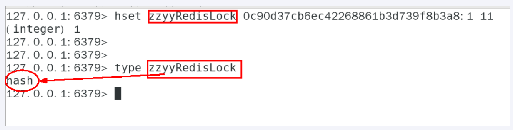

```shell
hset  zzyyRedisLock 29f0ee01ac77414fb8b0861271902a94:1
```


##### 2、Map<String, Map<Object, Object>>

##### 3、案例命令

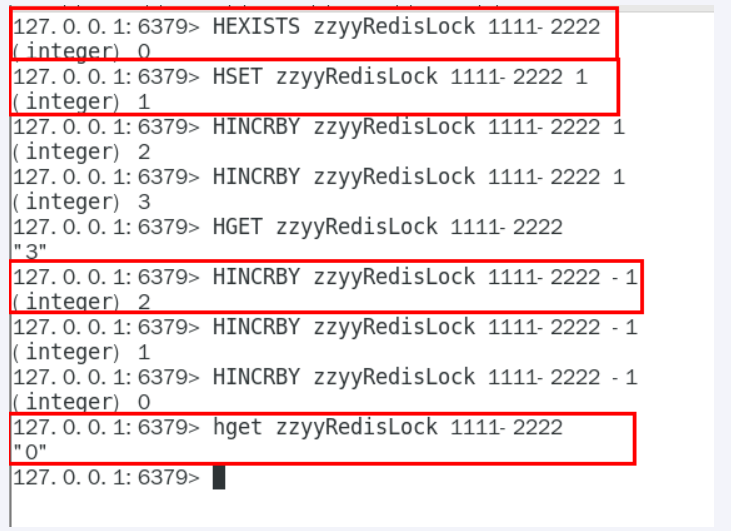

hset key field value
hset redis锁名字(zzyyRedisLock)  某个请求线程的UUID+ThreadID  加锁的次数

##### 4、小总结

setnx,只能解决有无的问题, 无法实现锁的可重入问题

hset，不但解决有无，还可解决可重入问题 

#### 8.10.4 思考+设计重点

1、目前有两条支线，目的是保证同一个时候只能有一个线程持有锁进行redis做扣减库存动作

2、两个分支

2.1、保证加锁（lock）与解锁（unlock）

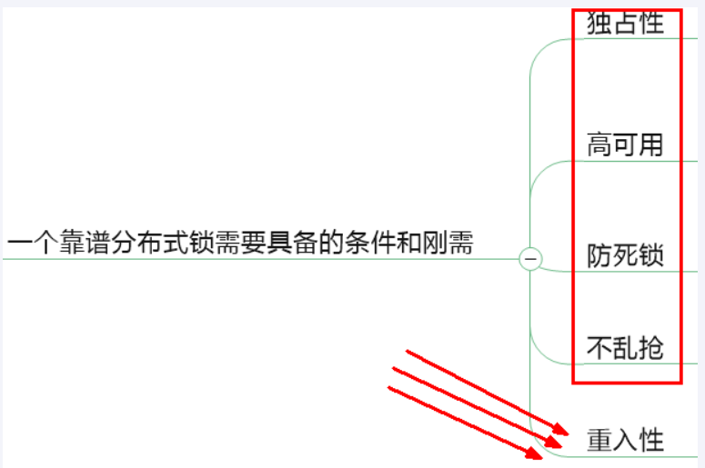

2.2、扣减库存redis命令的原子性

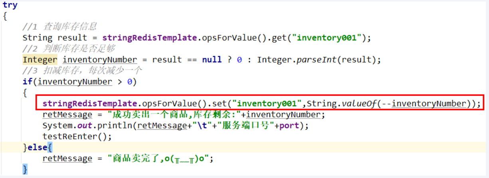

#### 8.10.5 lua脚本

##### 1、redis命令过程分析

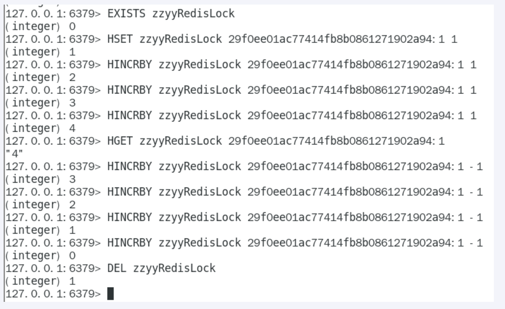

##### 2、加锁（lock）lua脚本

2.1、先判断redis分布式锁这个key是否存在

```shell
exists key
```

```shell
127.0.0.1:6379> EXISTS zzyyRedisLock
0
127.0.0.1:6379>
```


返回0说明不存在，hset新建当前线程属于自己的锁BY `UUID:ThreadID`

```shell
127.0.0.1:6379> HSET zzyyRedisLock 0c90d37cb6ec42268861b3d739f8b3a8:1 1
1
127.0.0.1:6379>
```


返回1说明key已经存在(即锁已经存在),需要进一步判断是不是当前线程自己的

```shell
hexists key uuid:ThreadID
```

```shell
HEXISTS zzyyRedisLock 0c90d37cb6ec42268861b3d739f8b3a8:1
```

```shell
127.0.0.1:6379> HEXISTS zzyyRedisLock 0c90d37cb6ec42268861b3d739f8b3a8:1
1
127.0.0.1:6379>

```

返回0说明不是自己的

返回1说明是自己的锁，这时就可以自增1次表示重入

```shell
HINCRBY key field increment
HINCRBY zzyyRedisLock 0c90d37cb6ec42268861b3d739f8b3a8:1 1
```

```shell
127.0.0.1:6379> HINCRBY zzyyRedisLock 0c90d37cb6ec42268861b3d739f8b3a8:1 1
2
127.0.0.1:6379>

```

###### 2.1、加锁V1版本

```shell
if redis.call('exists','key') == 0 then
    redis.call('hset','key','uuid:threadid',1)
    redis.call('expire','key',30)
    return 1
elseif redis.call('hexists','key','uuid:threadid') == 1 then
    redis.call('hincrby','key','uuid:threadid',1)
    redis.call('expire','key',30)
    return 1
else
    return 0
end
```

> 相同部分是否可以替换处理？？？
>
> hincrby命令可否替代hset命令

###### 2.2、加锁V2版本

```java
if redis.call('exists','key') == 0 or redis.call('hexists','key','uuid:threadid') == 1 then
    redis.call('hincrby','key','uuid:threadid',1)
    redis.call('expire','key',30)
    return 1
else
    return 0
end
```

###### 2.3、加锁V3版本

| Redis相关  | 占位值  | 实际值                             |
| ---------- | ------- | ---------------------------------- |
| key        | KEYS[1] | zzyyRedisLock                      |
| value      | ARGV[1] | 2f586ae740a94736894ab9d51880ed9d:1 |
| 过期时间值 | ARGV[2] | 30  秒                             |

```shell
if redis.call('exists',KEYS[1]) == 0 or redis.call('hexists',KEYS[1],ARGV[1]) == 1 then 
    redis.call('hincrby',KEYS[1],ARGV[1],1) 
    redis.call('expire',KEYS[1],ARGV[2]) 
    return 1 
else
    return 0
end
```


2.4、测试

```shell
EVAL "if redis.call('exists',KEYS[1]) == 0 or redis.call('hexists',KEYS[1],ARGV[1]) == 1 then redis.call('hincrby',KEYS[1],ARGV[1],1) redis.call('expire',KEYS[1],ARGV[2]) return 1 else return 0 end" 1 zzyyRedisLock 0c90d37cb6ec42268861b3d739f8b3a8:1 30
```

```shell
HGET zzyyRedisLock 0c90d37cb6ec42268861b3d739f8b3a8:1
```

```shell
ll('expire',KEYS[1],ARGV[2]) return 1 else return 0 end" 1 zzyyRedisLock 0c90d37cb6ec42268861b3d739f8b3a8:1 30
1
127.0.0.1:6379> HGET zzyyRedisLock 0c90d37cb6ec42268861b3d739f8b3a8:1
3
127.0.0.1:6379> EVAL "if redis.call('exists',KEYS[1]) == 0 or redis.call('hexists',KEYS[1],ARGV[1]) == 1 then redis.call('hincrby',KEYS[1],ARGV[1],1) redis.call('expire',KEYS[1],ARGV[2]) return 1 else return 0 end" 1 zzyyRedisLock 0c90d37cb6ec42268861b3d739f8b3a8:1 30
1
127.0.0.1:6379> HGET zzyyRedisLock 0c90d37cb6ec42268861b3d739f8b3a8:1
4
127.0.0.1:6379> EVAL "if redis.call('exists',KEYS[1]) == 0 or redis.call('hexists',KEYS[1],ARGV[1]) == 1 then redis.call('hincrby',KEYS[1],ARGV[1],1) redis.call('expire',KEYS[1],ARGV[2]) return 1 else return 0 end" 1 zzyyRedisLock 0c90d37cb6ec42268861b3d739f8b3a8:1 30
1
127.0.0.1:6379> HGET zzyyRedisLock 0c90d37cb6ec42268861b3d739f8b3a8:1
5
127.0.0.1:6379>

```


##### 3、解锁（unlock）lua脚本 

###### 2.1、涉及思路：有锁而且还是自己的锁

```shell
HEXISTS key uuid:ThreadID
```

```shell
HEXISTS zzyyRedisLock 0c90d37cb6ec42268861b3d739f8b3a8:1
```

```shell
127.0.0.1:6379> HEXISTS zzyyRedisLock 0c90d37cb6ec42268861b3d739f8b3a8:1
0

```


- 返回0，说明根本没有锁，程序返回nil

- 非0时，说明有锁，而且还是自己的锁，直接调用`hincrby -1`表示每次减1，解锁1次，直到它变为0，这时就表示这个锁是可以被删除了，del这个锁

###### 2.2、**全套流程**

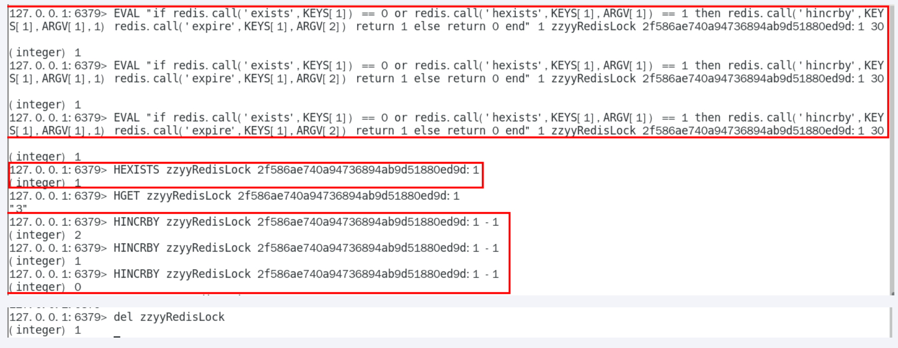

###### 2.3 将上述设计用lua脚本进行实现

**V1版本**

```shell
if redis.call('HEXISTS',lock,uuid:threadID) == 0 then
    return nil
elseif redis.call('HINCRBY',lock,uuid:threadID,-1) == 0 then
    return redis.call('del',lock)
else 
    return 0
end
```


**V2版本**

```shell
if redis.call('HEXISTS',KEYS[1],ARGV[1]) == 0 then
    return nil
elseif redis.call('HINCRBY',KEYS[1],ARGV[1],-1) == 0 then
    return redis.call('del',KEYS[1])
else
    return 0
end
```

```shell
eval "if redis.call('HEXISTS',KEYS[1],ARGV[1]) == 0 then return nil elseif redis.call('HINCRBY',KEYS[1],ARGV[1],-1) == 0 then return redis.call('del',KEYS[1]) else return 0 end" 1 zzyyRedisLock 2f586ae740a94736894ab9d51880ed9d:1
```


###### 2.4 测试全套流程

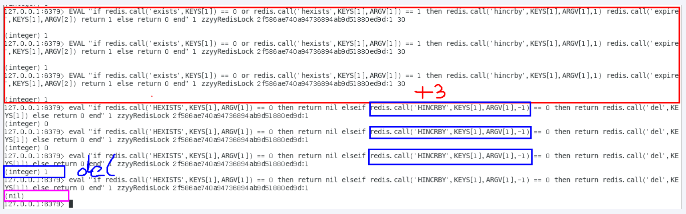

#### 8.10.6 lua脚本与Java代码结合

##### 1、复原程序初始无锁版

```java
package com.atguigu.redislock.service;

import lombok.extern.slf4j.Slf4j;
import org.springframework.beans.factory.annotation.Autowired;
import org.springframework.beans.factory.annotation.Value;
import org.springframework.data.redis.core.StringRedisTemplate;
import org.springframework.stereotype.Service;

/**
 * @auther zzyy
 * @create 2022-10-22 15:14
 */
@Service
@Slf4j
public class InventoryService
{
    @Autowired
    private StringRedisTemplate stringRedisTemplate;
    @Value("${server.port}")
    private String port;

    public String sale()
    {
        String retMessage = "";
        //1 查询库存信息
        String result = stringRedisTemplate.opsForValue().get("inventory001");
        //2 判断库存是否足够
        Integer inventoryNumber = result == null ? 0 : Integer.parseInt(result);
        //3 扣减库存
        if(inventoryNumber > 0) {
            stringRedisTemplate.opsForValue().set("inventory001",String.valueOf(--inventoryNumber));
            retMessage = "成功卖出一个商品，库存剩余: "+inventoryNumber+"\t";
            System.out.println(retMessage);
        }else{
            retMessage = "商品卖完了，o(╥﹏╥)o";
        }
        return retMessage+"\t"+"服务端口号："+port;
    }
}

```

##### 2、先建RedisDistributedLock类并实现JUC里面的Lock接口

```java
package com.atguigu.redislock.mylock;

import java.util.concurrent.TimeUnit;
import java.util.concurrent.locks.Condition;
import java.util.concurrent.locks.Lock;

/**
 * @auther zzyy
 * @create 2022-10-18 18:32
 */
public class RedisDistributedLock implements Lock {
    @Override
    public void lock() {
        
    }

    @Override
    public void lockInterruptibly() throws InterruptedException {

    }

    @Override
    public boolean tryLock() {
        return false;
    }

    @Override
    public boolean tryLock(long time, TimeUnit unit) throws InterruptedException {
        return false;
    }

    @Override
    public void unlock() {

    }

    @Override
    public Condition newCondition() {
        return null;
    }
}

```

##### 3、满足JUC里面AQS对Lock锁接口规范定义来实现落地代码

```java
package com.atguigu.redislock.mylock;

import cn.hutool.core.util.IdUtil;
import org.springframework.beans.factory.annotation.Autowired;
import org.springframework.data.redis.core.StringRedisTemplate;
import org.springframework.data.redis.core.script.DefaultRedisScript;
import org.springframework.data.redis.support.collections.DefaultRedisList;
import org.springframework.stereotype.Component;

import java.util.Arrays;
import java.util.concurrent.TimeUnit;
import java.util.concurrent.locks.Condition;
import java.util.concurrent.locks.Lock;

/**
 * @auther zzyy
 * @create 2022-10-18 18:32
 */
//@Component 引入DistributedLockFactory工厂模式，从工厂获得而不再从spring拿到
public class RedisDistributedLock implements Lock
{
    private StringRedisTemplate stringRedisTemplate;

    private String lockName;//KEYS[1]
    private String uuidValue;//ARGV[1]
    private long   expireTime;//ARGV[2]
    public RedisDistributedLock(StringRedisTemplate stringRedisTemplate, String lockName)
    {
        this.stringRedisTemplate = stringRedisTemplate;
        this.lockName = lockName;
        this.uuidValue = IdUtil.simpleUUID()+":"+Thread.currentThread().getId();//UUID:ThreadID
        this.expireTime = 30L;
    }
    @Override
    public void lock()
    {
        tryLock();
    }
    @Override
    public boolean tryLock()
    {
        try {tryLock(-1L,TimeUnit.SECONDS);} catch (InterruptedException e) {e.printStackTrace();}
        return false;
    }

    /**
     * 干活的，实现加锁功能，实现这一个干活的就OK，全盘通用
     * @param time
     * @param unit
     * @return
     * @throws InterruptedException
     */
    @Override
    public boolean tryLock(long time, TimeUnit unit) throws InterruptedException{
        if(time != -1L){
            this.expireTime = unit.toSeconds(time);
        }
        String script =
                "if redis.call('exists',KEYS[1]) == 0 or redis.call('hexists',KEYS[1],ARGV[1]) == 1 then " +
                        "redis.call('hincrby',KEYS[1],ARGV[1],1) " +
                        "redis.call('expire',KEYS[1],ARGV[2]) " +
                        "return 1 " +
                "else " +
                        "return 0 " +
                "end";

        System.out.println("script: "+script);
        System.out.println("lockName: "+lockName);
        System.out.println("uuidValue: "+uuidValue);
        System.out.println("expireTime: "+expireTime);

        while (!stringRedisTemplate.execute(new DefaultRedisScript<>(script,Boolean.class), Arrays.asList(lockName),uuidValue,String.valueOf(expireTime))) {
            TimeUnit.MILLISECONDS.sleep(50);
        }
        return true;
    }

    /**
     *干活的，实现解锁功能
     */
    @Override
    public void unlock()
    {
        String script =
                "if redis.call('HEXISTS',KEYS[1],ARGV[1]) == 0 then " +
                "   return nil " +
                "elseif redis.call('HINCRBY',KEYS[1],ARGV[1],-1) == 0 then " +
                "   return redis.call('del',KEYS[1]) " +
                "else " +
                "   return 0 " +
                "end";
        // nil = false 1 = true 0 = false
        System.out.println("lockName: "+lockName);
        System.out.println("uuidValue: "+uuidValue);
        System.out.println("expireTime: "+expireTime);
        Long flag = stringRedisTemplate.execute(new DefaultRedisScript<>(script, Long.class), Arrays.asList(lockName),uuidValue,String.valueOf(expireTime));
        if(flag == null)
        {
            throw new RuntimeException("This lock doesn't EXIST");
        }

    }

    //===下面的redis分布式锁暂时用不到=======================================
    //===下面的redis分布式锁暂时用不到=======================================
    //===下面的redis分布式锁暂时用不到=======================================
    @Override
    public void lockInterruptibly() throws InterruptedException
    {

    }

    @Override
    public Condition newCondition()
    {
        return null;
    }
}
```

##### 4、结合设计模式开发属于自己的Redis分布式锁工具类

###### 4.1、lock方法的全盘通用讲解

###### 4.2、lua脚本

**加锁lock**

```shell
if redis.call('exists',KEYS[1]) == 0 or redis.call('hexists',KEYS[1],ARGV[1]) == 1 then 
    redis.call('hincrby',KEYS[1],ARGV[1],1) 
    redis.call('expire',KEYS[1],ARGV[2]) 
    return 1 
else
    return 0
end
```


**解锁unlock**

```shell
if redis.call('HEXISTS',KEYS[1],ARGV[1]) == 0 then
    return nil
elseif redis.call('HINCRBY',KEYS[1],ARGV[1],-1) == 0 then
    return redis.call('del',KEYS[1])
else
    return 0
end
```

###### 4.3、工厂设计模式的引入

1、通过实现JUC里面的Lock接口，实现Redis分布式锁RedisDistributedLock

```java
package com.atguigu.redislock.mylock;

import cn.hutool.core.util.IdUtil;
import org.springframework.beans.factory.annotation.Autowired;
import org.springframework.data.redis.core.StringRedisTemplate;
import org.springframework.data.redis.core.script.DefaultRedisScript;
import org.springframework.data.redis.support.collections.DefaultRedisList;
import org.springframework.stereotype.Component;

import java.util.Arrays;
import java.util.concurrent.TimeUnit;
import java.util.concurrent.locks.Condition;
import java.util.concurrent.locks.Lock;

/**
 * @auther zzyy
 * @create 2022-10-18 18:32
 */
//@Component 引入DistributedLockFactory工厂模式，从工厂获得而不再从spring拿到
public class RedisDistributedLock implements Lock
{
    private StringRedisTemplate stringRedisTemplate;

    private String lockName;//KEYS[1]
    private String uuidValue;//ARGV[1]
    private long   expireTime;//ARGV[2]
    public RedisDistributedLock(StringRedisTemplate stringRedisTemplate, String lockName)
    {
        this.stringRedisTemplate = stringRedisTemplate;
        this.lockName = lockName;
        this.uuidValue = IdUtil.simpleUUID()+":"+Thread.currentThread().getId();//UUID:ThreadID
        this.expireTime = 30L;
    }
    @Override
    public void lock()
    {
        tryLock();
    }
    @Override
    public boolean tryLock()
    {
        try {tryLock(-1L,TimeUnit.SECONDS);} catch (InterruptedException e) {e.printStackTrace();}
        return false;
    }

    /**
     * 干活的，实现加锁功能，实现这一个干活的就OK，全盘通用
     * @param time
     * @param unit
     * @return
     * @throws InterruptedException
     */
    @Override
    public boolean tryLock(long time, TimeUnit unit) throws InterruptedException{
        if(time != -1L){
            this.expireTime = unit.toSeconds(time);
        }
        String script =
                "if redis.call('exists',KEYS[1]) == 0 or redis.call('hexists',KEYS[1],ARGV[1]) == 1 then " +
                        "redis.call('hincrby',KEYS[1],ARGV[1],1) " +
                        "redis.call('expire',KEYS[1],ARGV[2]) " +
                        "return 1 " +
                "else " +
                        "return 0 " +
                "end";

        System.out.println("script: "+script);
        System.out.println("lockName: "+lockName);
        System.out.println("uuidValue: "+uuidValue);
        System.out.println("expireTime: "+expireTime);

        while (!stringRedisTemplate.execute(new DefaultRedisScript<>(script,Boolean.class), Arrays.asList(lockName),uuidValue,String.valueOf(expireTime))) {
            TimeUnit.MILLISECONDS.sleep(50);
        }
        return true;
    }

    /**
     *干活的，实现解锁功能
     */
    @Override
    public void unlock()
    {
        String script =
                "if redis.call('HEXISTS',KEYS[1],ARGV[1]) == 0 then " +
                "   return nil " +
                "elseif redis.call('HINCRBY',KEYS[1],ARGV[1],-1) == 0 then " +
                "   return redis.call('del',KEYS[1]) " +
                "else " +
                "   return 0 " +
                "end";
        // nil = false 1 = true 0 = false
        System.out.println("lockName: "+lockName);
        System.out.println("uuidValue: "+uuidValue);
        System.out.println("expireTime: "+expireTime);
        Long flag = stringRedisTemplate.execute(new DefaultRedisScript<>(script, Long.class), Arrays.asList(lockName),uuidValue,String.valueOf(expireTime));
        if(flag == null)
        {
            throw new RuntimeException("This lock doesn't EXIST");
        }

    }

    //===下面的redis分布式锁暂时用不到=======================================
    //===下面的redis分布式锁暂时用不到=======================================
    //===下面的redis分布式锁暂时用不到=======================================
    @Override
    public void lockInterruptibly() throws InterruptedException
    {

    }

    @Override
    public Condition newCondition()
    {
        return null;
    }
}
```

2、InventoryService直接使用上面的代码设计，有什么问题？

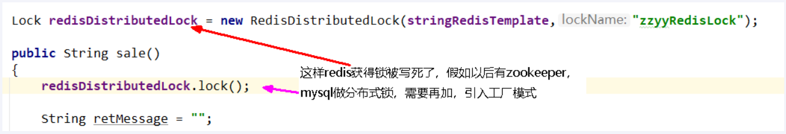

3、考虑扩展，本次是Redis实现分布式锁，以后Zookeeper，MySQL实现怎么办？

4、引入工厂模式改造代码

4.1、DistributedLockFactory

```java
package com.atguigu.redislock.mylock;

import org.springframework.beans.factory.annotation.Autowired;
import org.springframework.data.redis.core.StringRedisTemplate;
import org.springframework.stereotype.Component;

import java.util.concurrent.locks.Lock;

/**
 * @auther zzyy
 * @create 2022-10-18 18:53
 */
@Component
public class DistributedLockFactory
{
    @Autowired
    private StringRedisTemplate stringRedisTemplate;
    private String lockName;

    public Lock getDistributedLock(String lockType)
    {
        if(lockType == null) return null;

        if(lockType.equalsIgnoreCase("REDIS")){
            lockName = "zzyyRedisLock";
            return new RedisDistributedLock(stringRedisTemplate,lockName);
        } else if(lockType.equalsIgnoreCase("ZOOKEEPER")){
            //TODO zookeeper版本的分布式锁实现
            return new ZookeeperDistributedLock();
        } else if(lockType.equalsIgnoreCase("MYSQL")){
            //TODO mysql版本的分布式锁实现
            return null;
        }

        return null;
    }
}
```


4.2、RedisDistributedLock

```java
package com.atguigu.redislock.mylock;

import cn.hutool.core.util.IdUtil;
import org.springframework.beans.factory.annotation.Autowired;
import org.springframework.data.redis.core.StringRedisTemplate;
import org.springframework.data.redis.core.script.DefaultRedisScript;
import org.springframework.data.redis.support.collections.DefaultRedisList;
import org.springframework.stereotype.Component;

import java.util.Arrays;
import java.util.concurrent.TimeUnit;
import java.util.concurrent.locks.Condition;
import java.util.concurrent.locks.Lock;

/**
 * @auther zzyy
 * @create 2022-10-18 18:32
 */
//@Component 引入DistributedLockFactory工厂模式，从工厂获得而不再从spring拿到
public class RedisDistributedLock implements Lock
{
    private StringRedisTemplate stringRedisTemplate;

    private String lockName;//KEYS[1]
    private String uuidValue;//ARGV[1]
    private long   expireTime;//ARGV[2]

    public RedisDistributedLock(StringRedisTemplate stringRedisTemplate, String lockName){
        this.stringRedisTemplate = stringRedisTemplate;
        this.lockName = lockName;
        this.uuidValue = IdUtil.simpleUUID()+":"+Thread.currentThread().getId();//UUID:ThreadID
        this.expireTime = 30L;
    }
    @Override
    public void lock(){
        tryLock();
    }
    @Override
    public boolean tryLock(){
        try {tryLock(-1L,TimeUnit.SECONDS);} catch (InterruptedException e) {e.printStackTrace();}
        return false;
    }

    /**
     * 干活的，实现加锁功能，实现这一个干活的就OK，全盘通用
     * @param time
     * @param unit
     * @return
     * @throws InterruptedException
     */
    @Override
    public boolean tryLock(long time, TimeUnit unit) throws InterruptedException{
        if(time != -1L){
            this.expireTime = unit.toSeconds(time);
        }
        String script =
                "if redis.call('exists',KEYS[1]) == 0 or redis.call('hexists',KEYS[1],ARGV[1]) == 1 then " +
                        "redis.call('hincrby',KEYS[1],ARGV[1],1) " +
                        "redis.call('expire',KEYS[1],ARGV[2]) " +
                        "return 1 " +
                "else " +
                        "return 0 " +
                "end";
        System.out.println("script: "+script);
        System.out.println("lockName: "+lockName);
        System.out.println("uuidValue: "+uuidValue);
        System.out.println("expireTime: "+expireTime);
        while (!stringRedisTemplate.execute(new DefaultRedisScript<>(script,Boolean.class), Arrays.asList(lockName),uuidValue,String.valueOf(expireTime))) {
            TimeUnit.MILLISECONDS.sleep(50);
        }
        return true;
    }

    /**
     *干活的，实现解锁功能
     */
    @Override
    public void unlock()
    {
        String script =
                "if redis.call('HEXISTS',KEYS[1],ARGV[1]) == 0 then " +
                "   return nil " +
                "elseif redis.call('HINCRBY',KEYS[1],ARGV[1],-1) == 0 then " +
                "   return redis.call('del',KEYS[1]) " +
                "else " +
                "   return 0 " +
                "end";
        // nil = false 1 = true 0 = false
        System.out.println("lockName: "+lockName);
        System.out.println("uuidValue: "+uuidValue);
        System.out.println("expireTime: "+expireTime);
        Long flag = stringRedisTemplate.execute(new DefaultRedisScript<>(script, Long.class), Arrays.asList(lockName),uuidValue,String.valueOf(expireTime));
        if(flag == null)
        {
            throw new RuntimeException("This lock doesn't EXIST");
        }

    }

    //===下面的redis分布式锁暂时用不到=======================================
    //===下面的redis分布式锁暂时用不到=======================================
    //===下面的redis分布式锁暂时用不到=======================================
    @Override
    public void lockInterruptibly() throws InterruptedException
    {

    }

    @Override
    public Condition newCondition()
    {
        return null;
    }
}
```


4.3、InventoryService使用工厂模式

```java
package com.atguigu.redislock.service;

import ch.qos.logback.core.joran.conditional.ThenAction;
import cn.hutool.core.util.IdUtil;
import cn.hutool.core.util.StrUtil;
import com.atguigu.redislock.mylock.DistributedLockFactory;
import com.atguigu.redislock.mylock.RedisDistributedLock;
import lombok.extern.slf4j.Slf4j;
import org.omg.IOP.TAG_RMI_CUSTOM_MAX_STREAM_FORMAT;
import org.springframework.beans.factory.annotation.Autowired;
import org.springframework.beans.factory.annotation.Value;
import org.springframework.data.redis.core.RedisTemplate;
import org.springframework.data.redis.core.StringRedisTemplate;
import org.springframework.data.redis.core.script.DefaultRedisScript;
import org.springframework.stereotype.Service;

import java.util.Arrays;
import java.util.concurrent.TimeUnit;
import java.util.concurrent.atomic.AtomicInteger;
import java.util.concurrent.locks.Lock;
import java.util.concurrent.locks.ReentrantLock;

/**
 * @auther zzyy
 * @create 2022-10-12 17:04
 */
@Service
@Slf4j
public class InventoryService
{
    @Autowired
    private StringRedisTemplate stringRedisTemplate;
    @Value("${server.port}")
    private String port;
    @Autowired
    private DistributedLockFactory distributedLockFactory;
    
    public String sale()
    {

        String retMessage = "";

        Lock redisLock = distributedLockFactory.getDistributedLock("redis");
        redisLock.lock();
        try
        {
            //1 查询库存信息
            String result = stringRedisTemplate.opsForValue().get("inventory001");
            //2 判断库存是否足够
            Integer inventoryNumber = result == null ? 0 : Integer.parseInt(result);
            //3 扣减库存
            if(inventoryNumber > 0)
            {
                inventoryNumber = inventoryNumber - 1;
                stringRedisTemplate.opsForValue().set("inventory001",String.valueOf(inventoryNumber));
                retMessage = "成功卖出一个商品，库存剩余: "+inventoryNumber+"\t服务端口:" +port;
                System.out.println(retMessage);
                return retMessage;
            }
            retMessage = "商品卖完了，o(╥﹏╥)o"+"\t服务端口:" +port;
        }catch (Exception e){
            e.printStackTrace();
        }finally {
            redisLock.unlock();
        }
        return retMessage;
    }
}
```


5、单机+并发测试通过

http://localhost:7777/inventory/sale

#### 8.10.7 <strong><font color='red'>可重入测试</font></strong>

##### 1、可重入测试

###### 1.1、InventoryService类新增可重入测试方法

```java
package com.atguigu.redislock.service;

import com.atguigu.redislock.mylock.DistributedLockFactory;
import lombok.extern.slf4j.Slf4j;
import org.springframework.beans.factory.annotation.Autowired;
import org.springframework.beans.factory.annotation.Value;
import org.springframework.data.redis.core.StringRedisTemplate;
import org.springframework.stereotype.Service;

import javax.annotation.Resource;
import java.util.concurrent.locks.Lock;

/**
 * @auther zzyy
 * @create 2022-10-30 12:28
 */
@Service
@Slf4j
public class InventoryService
{
    @Autowired
    private StringRedisTemplate stringRedisTemplate;
    @Value("${server.port}")
    private String port;
    @Autowired
    private DistributedLockFactory distributedLockFactory;

    public String sale()
    {
        String retMessage = "";
        Lock redisLock = distributedLockFactory.getDistributedLock("redis");
        redisLock.lock();
        try
        {
            //1 查询库存信息
            String result = stringRedisTemplate.opsForValue().get("inventory001");
            //2 判断库存是否足够
            Integer inventoryNumber = result == null ? 0 : Integer.parseInt(result);
            //3 扣减库存
            if(inventoryNumber > 0) {
                stringRedisTemplate.opsForValue().set("inventory001",String.valueOf(--inventoryNumber));
                retMessage = "成功卖出一个商品，库存剩余: "+inventoryNumber+"\t";
                System.out.println(retMessage);
                testReEnter();
            }else{
                retMessage = "商品卖完了，o(╥﹏╥)o";
            }
        }catch (Exception e){
            e.printStackTrace();
        }finally {
            redisLock.unlock();
        }
        return retMessage+"\t"+"服务端口号："+port;
    }

    private void testReEnter()
    {
        Lock redisLock = distributedLockFactory.getDistributedLock("redis");
        redisLock.lock();
        try
        {
            System.out.println("################测试可重入锁#######");
        }finally {
            redisLock.unlock();
        }
    }
}


/**

 //1 查询库存信息
 String result = stringRedisTemplate.opsForValue().get("inventory001");
 //2 判断库存是否足够
 Integer inventoryNumber = result == null ? 0 : Integer.parseInt(result);
 //3 扣减库存
 if(inventoryNumber > 0) {
 stringRedisTemplate.opsForValue().set("inventory001",String.valueOf(--inventoryNumber));
 retMessage = "成功卖出一个商品，库存剩余: "+inventoryNumber+"\t";
 System.out.println(retMessage);
 }else{
 retMessage = "商品卖完了，o(╥﹏╥)o";
 }
 */
```


###### 1.2、测试接口

```
http://localhost:7777/inventory/sale
```

###### 1.3、结果

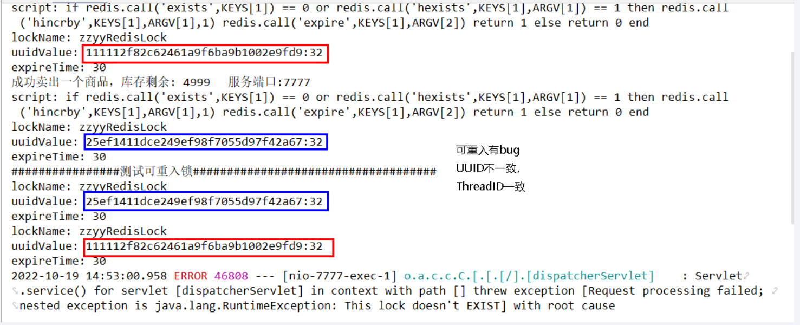

ThreadID一致了，但UUID不OK

##### 2、引入工厂模式改造代码

###### 2.1、DistributedLockFactory

```java
package com.atguigu.redislock.mylock;

import cn.hutool.core.util.IdUtil;
import org.springframework.beans.factory.annotation.Autowired;
import org.springframework.data.redis.core.StringRedisTemplate;
import org.springframework.stereotype.Component;

import java.util.concurrent.locks.Lock;

/**
 * @auther zzyy
 * @create 2022-10-23 22:40
 */
@Component
public class DistributedLockFactory
{
    @Autowired
    private StringRedisTemplate stringRedisTemplate;
    private String lockName;
    private String uuidValue;

    public DistributedLockFactory()
    {
        this.uuidValue = IdUtil.simpleUUID();//UUID
    }

    public Lock getDistributedLock(String lockType)
    {
        if(lockType == null) return null;

        if(lockType.equalsIgnoreCase("REDIS")){
            lockName = "zzyyRedisLock";
            return new RedisDistributedLock(stringRedisTemplate,lockName,uuidValue);
        } else if(lockType.equalsIgnoreCase("ZOOKEEPER")){
            //TODO zookeeper版本的分布式锁实现
            return new ZookeeperDistributedLock();
        } else if(lockType.equalsIgnoreCase("MYSQL")){
            //TODO mysql版本的分布式锁实现
            return null;
        }
        return null;
    }
}
```


###### 2.2、RedisDistributedLock

```java
package com.atguigu.redislock.mylock;

import cn.hutool.core.util.IdUtil;
import lombok.SneakyThrows;
import org.springframework.data.redis.core.StringRedisTemplate;
import org.springframework.data.redis.core.script.DefaultRedisScript;

import java.util.Arrays;
import java.util.Timer;
import java.util.TimerTask;
import java.util.concurrent.TimeUnit;
import java.util.concurrent.locks.Condition;
import java.util.concurrent.locks.Lock;

/**
 * @auther zzyy
 * @create 2022-10-23 22:36
 */
public class RedisDistributedLock implements Lock
{
    private StringRedisTemplate stringRedisTemplate;
    private String lockName;
    private String uuidValue;
    private long   expireTime;

    public RedisDistributedLock(StringRedisTemplate stringRedisTemplate, String lockName,String uuidValue)
    {
        this.stringRedisTemplate = stringRedisTemplate;
        this.lockName = lockName;
        this.uuidValue = uuidValue+":"+Thread.currentThread().getId();
        this.expireTime = 30L;
    }

    @Override
    public void lock()
    {
        this.tryLock();
    }
    @Override
    public boolean tryLock()
    {
        try
        {
            return this.tryLock(-1L,TimeUnit.SECONDS);
        } catch (InterruptedException e) {
            e.printStackTrace();
        }
        return false;
    }

    @Override
    public boolean tryLock(long time, TimeUnit unit) throws InterruptedException
    {
        if(time != -1L)
        {
            expireTime = unit.toSeconds(time);
        }

        String script =
                "if redis.call('exists',KEYS[1]) == 0 or redis.call('hexists',KEYS[1],ARGV[1]) == 1 then " +
                    "redis.call('hincrby',KEYS[1],ARGV[1],1) " +
                    "redis.call('expire',KEYS[1],ARGV[2]) " +
                    "return 1 " +
                "else " +
                    "return 0 " +
                "end";
        System.out.println("lockName: "+lockName+"\t"+"uuidValue: "+uuidValue);

        while (!stringRedisTemplate.execute(new DefaultRedisScript<>(script, Boolean.class), Arrays.asList(lockName), uuidValue, String.valueOf(expireTime)))
        {
            try { TimeUnit.MILLISECONDS.sleep(60); } catch (InterruptedException e) { e.printStackTrace(); }
        }

        return true;
    }

    @Override
    public void unlock()
    {
        String script =
                "if redis.call('HEXISTS',KEYS[1],ARGV[1]) == 0 then " +
                    "return nil " +
                "elseif redis.call('HINCRBY',KEYS[1],ARGV[1],-1) == 0 then " +
                    "return redis.call('del',KEYS[1]) " +
                "else " +
                        "return 0 " +
                "end";
        System.out.println("lockName: "+lockName+"\t"+"uuidValue: "+uuidValue);
        Long flag = stringRedisTemplate.execute(new DefaultRedisScript<>(script, Long.class), Arrays.asList(lockName), uuidValue, String.valueOf(expireTime));
        if(flag == null)
        {
            throw new RuntimeException("没有这个锁，HEXISTS查询无");
        }
    }

    //=========================================================
    @Override
    public void lockInterruptibly() throws InterruptedException
    {

    }
    @Override
    public Condition newCondition()
    {
        return null;
    }
}
```


###### 2.3、InventoryService类新增可重入测试方法

```java
package com.atguigu.redislock.service;

import cn.hutool.core.util.IdUtil;
import com.atguigu.redislock.mylock.DistributedLockFactory;
import lombok.extern.slf4j.Slf4j;
import org.springframework.beans.factory.annotation.Autowired;
import org.springframework.beans.factory.annotation.Value;
import org.springframework.data.redis.core.StringRedisTemplate;
import org.springframework.data.redis.core.script.DefaultRedisScript;
import org.springframework.stereotype.Service;

import java.util.Arrays;
import java.util.concurrent.TimeUnit;
import java.util.concurrent.locks.Lock;
import java.util.concurrent.locks.ReentrantLock;

/**
 * @auther zzyy
 * @create 2022-10-22 15:14
 */
@Service
@Slf4j
public class InventoryService
{
    @Autowired
    private StringRedisTemplate stringRedisTemplate;
    @Value("${server.port}")
    private String port;
    @Autowired
    private DistributedLockFactory distributedLockFactory;

    public String sale()
    {
        String retMessage = "";
        Lock redisLock = distributedLockFactory.getDistributedLock("redis");
        redisLock.lock();
        try
        {
            //1 查询库存信息
            String result = stringRedisTemplate.opsForValue().get("inventory001");
            //2 判断库存是否足够
            Integer inventoryNumber = result == null ? 0 : Integer.parseInt(result);
            //3 扣减库存
            if(inventoryNumber > 0) {
                stringRedisTemplate.opsForValue().set("inventory001",String.valueOf(--inventoryNumber));
                retMessage = "成功卖出一个商品，库存剩余: "+inventoryNumber;
                System.out.println(retMessage);
                this.testReEnter();
            }else{
                retMessage = "商品卖完了，o(╥﹏╥)o";
            }
        }catch (Exception e){
            e.printStackTrace();
        }finally {
            redisLock.unlock();
        }
        return retMessage+"\t"+"服务端口号："+port;
    }


    private void testReEnter()
    {
        Lock redisLock = distributedLockFactory.getDistributedLock("redis");
        redisLock.lock();
        try
        {
            System.out.println("################测试可重入锁####################################");
        }finally {
            redisLock.unlock();
        }
    }
}
```


##### 3、单机+并发+可重入，测试通过

### 8.11 自动续期

确保RedisLock过期时间大于业务执行时间的问题，Redis分布式锁如何续期？

#### 8.11.1 CAP定理简单说明

##### 1、Redis集群是AP

**Redis异步复制造成的锁丢失**

比如：主节点没来的及把刚刚set进来的这条数据给从节点，master就挂了，从机上位但从机上无该数据

##### 2、Zookeeper集群是CP

###### 2.1、CP

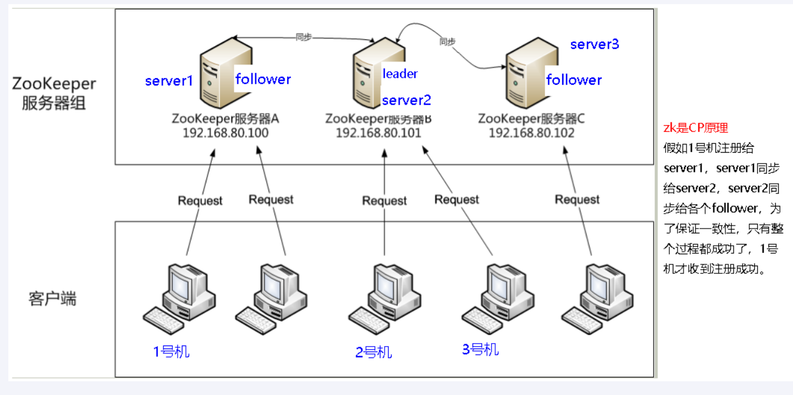

###### 2.2、故障

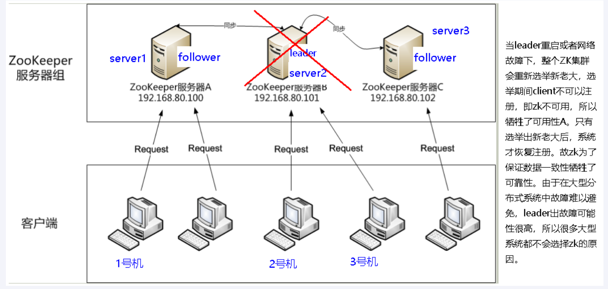

##### 3、Eureka集群是AP

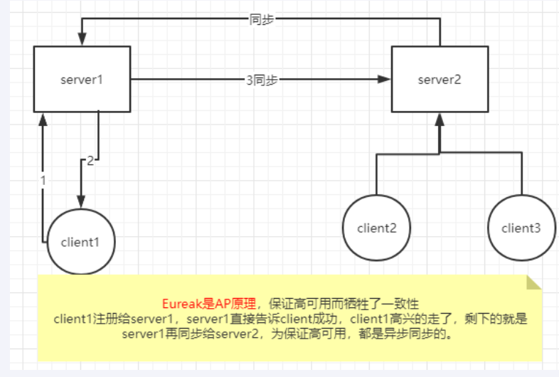

##### 4、Nacos集群是AP（Nacos也可配置成CP）

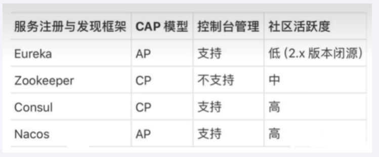

#### 8.11.2 续期的lua脚本

```shell
hset zzyyRedisLock 111122223333:11 3
EXPIRE zzyyRedisLock 30
ttl zzyyRedisLock
。。。。。
eval "if redis.call('HEXISTS',KEYS[1],ARGV[1]) == 1 then return redis.call('expire',KEYS[1],ARGV[2]) else return 0 end" 1 zzyyRedisLock 111122223333:11 30
ttl zzyyRedisLock

 
//==============自动续期
if redis.call('HEXISTS',KEYS[1],ARGV[1]) == 1 then
  	return redis.call('expire',KEYS[1],ARGV[2])
else
  	return 0
end
```


#### 8.11.3 V6.0版新增自动续期功能

先del掉之前的lockName zzyyRedisLock

##### 1、RedisDistributedLock

```java
package com.atguigu.redislock.mylock;

import cn.hutool.core.util.IdUtil;
import org.springframework.beans.factory.annotation.Autowired;
import org.springframework.data.redis.core.StringRedisTemplate;
import org.springframework.data.redis.core.script.DefaultRedisScript;
import org.springframework.data.redis.support.collections.DefaultRedisList;
import org.springframework.stereotype.Component;

import java.util.Arrays;
import java.util.Timer;
import java.util.TimerTask;
import java.util.concurrent.TimeUnit;
import java.util.concurrent.locks.Condition;
import java.util.concurrent.locks.Lock;

/**
 * @auther zzyy
 * @create 2022-10-18 18:32
 */
public class RedisDistributedLock implements Lock
{
    private StringRedisTemplate stringRedisTemplate;

    private String lockName;//KEYS[1]
    private String uuidValue;//ARGV[1]
    private long   expireTime;//ARGV[2]

    public RedisDistributedLock(StringRedisTemplate stringRedisTemplate,String lockName,String uuidValue)
    {
        this.stringRedisTemplate = stringRedisTemplate;
        this.lockName = lockName;
        this.uuidValue = uuidValue+":"+Thread.currentThread().getId();
        this.expireTime = 30L;
    }
    @Override
    public void lock()
    {
        tryLock();
    }

    @Override
    public boolean tryLock()
    {
        try {tryLock(-1L,TimeUnit.SECONDS);} catch (InterruptedException e) {e.printStackTrace();}
        return false;
    }

    /**
     * 干活的，实现加锁功能，实现这一个干活的就OK，全盘通用
     * @param time
     * @param unit
     * @return
     * @throws InterruptedException
     */
    @Override
    public boolean tryLock(long time, TimeUnit unit) throws InterruptedException
    {
        if(time != -1L)
        {
            this.expireTime = unit.toSeconds(time);
        }

        String script =
                "if redis.call('exists',KEYS[1]) == 0 or redis.call('hexists',KEYS[1],ARGV[1]) == 1 then " +
                        "redis.call('hincrby',KEYS[1],ARGV[1],1) " +
                        "redis.call('expire',KEYS[1],ARGV[2]) " +
                        "return 1 " +
                        "else " +
                        "return 0 " +
                        "end";

        System.out.println("script: "+script);
        System.out.println("lockName: "+lockName);
        System.out.println("uuidValue: "+uuidValue);
        System.out.println("expireTime: "+expireTime);

        while (!stringRedisTemplate.execute(new DefaultRedisScript<>(script,Boolean.class), Arrays.asList(lockName),uuidValue,String.valueOf(expireTime))) {
            TimeUnit.MILLISECONDS.sleep(50);
        }
        this.renewExpire();
        return true;
    }

    /**
     *干活的，实现解锁功能
     */
    @Override
    public void unlock()
    {
        String script =
                "if redis.call('HEXISTS',KEYS[1],ARGV[1]) == 0 then " +
                        "   return nil " +
                        "elseif redis.call('HINCRBY',KEYS[1],ARGV[1],-1) == 0 then " +
                        "   return redis.call('del',KEYS[1]) " +
                        "else " +
                        "   return 0 " +
                        "end";
        // nil = false 1 = true 0 = false
        System.out.println("lockName: "+lockName);
        System.out.println("uuidValue: "+uuidValue);
        System.out.println("expireTime: "+expireTime);
        Long flag = stringRedisTemplate.execute(new DefaultRedisScript<>(script, Long.class), Arrays.asList(lockName),uuidValue,String.valueOf(expireTime));
        if(flag == null)
        {
            throw new RuntimeException("This lock doesn't EXIST");
        }
    }

    private void renewExpire()
    {
        String script =
                "if redis.call('HEXISTS',KEYS[1],ARGV[1]) == 1 then " +
                        "return redis.call('expire',KEYS[1],ARGV[2]) " +
                        "else " +
                        "return 0 " +
                        "end";

        new Timer().schedule(new TimerTask()
        {
            @Override
            public void run()
            {
                if (stringRedisTemplate.execute(new DefaultRedisScript<>(script, Boolean.class), Arrays.asList(lockName),uuidValue,String.valueOf(expireTime))) {
                    renewExpire();
                }
            }
        },(this.expireTime * 1000)/3);
    }

    //===下面的redis分布式锁暂时用不到=======================================
    //===下面的redis分布式锁暂时用不到=======================================
    //===下面的redis分布式锁暂时用不到=======================================
    @Override
    public void lockInterruptibly() throws InterruptedException
    {

    }

    @Override
    public Condition newCondition()
    {
        return null;
    }
}
```


##### 2、InventoryService

```java
package com.atguigu.redislock.service;

import cn.hutool.core.util.IdUtil;
import com.atguigu.redislock.mylock.DistributedLockFactory;
import lombok.extern.slf4j.Slf4j;
import org.springframework.beans.factory.annotation.Autowired;
import org.springframework.beans.factory.annotation.Value;
import org.springframework.data.redis.core.StringRedisTemplate;
import org.springframework.data.redis.core.script.DefaultRedisScript;
import org.springframework.stereotype.Service;

import java.util.Arrays;
import java.util.concurrent.TimeUnit;
import java.util.concurrent.locks.Lock;
import java.util.concurrent.locks.ReentrantLock;

/**
 * @auther zzyy
 * @create 2022-10-22 15:14
 */
@Service
@Slf4j
public class InventoryService
{
    @Autowired
    private StringRedisTemplate stringRedisTemplate;
    @Value("${server.port}")
    private String port;
    @Autowired
    private DistributedLockFactory distributedLockFactory;

    public String sale()
    {
        String retMessage = "";
        Lock redisLock = distributedLockFactory.getDistributedLock("redis");
        redisLock.lock();
        try
        {
            //1 查询库存信息
            String result = stringRedisTemplate.opsForValue().get("inventory001");
            //2 判断库存是否足够
            Integer inventoryNumber = result == null ? 0 : Integer.parseInt(result);
            //3 扣减库存
            if(inventoryNumber > 0) {
                stringRedisTemplate.opsForValue().set("inventory001",String.valueOf(--inventoryNumber));
                retMessage = "成功卖出一个商品，库存剩余: "+inventoryNumber;
                System.out.println(retMessage);
                //暂停几秒钟线程,为了测试自动续期
                try { TimeUnit.SECONDS.sleep(120); } catch (InterruptedException e) { e.printStackTrace(); }
            }else{
                retMessage = "商品卖完了，o(╥﹏╥)o";
            }
        }catch (Exception e){
            e.printStackTrace();
        }finally {
            redisLock.unlock();
        }
        return retMessage+"\t"+"服务端口号："+port;
    }


    private void testReEnter()
    {
        Lock redisLock = distributedLockFactory.getDistributedLock("redis");
        redisLock.lock();
        try
        {
            System.out.println("################测试可重入锁####################################");
        }finally {
            redisLock.unlock();
        }
    }
}
```


###### 2.1、记得去掉可重入测试的testReEnter()方法

###### 2.2、InventoryService业务逻辑里面自动sleep一段时间测试自动续期功能

### 8.12 总结

1、synchronized单机版OK，但分布式上不行

2、nginx分布式微服务单机锁不行

3、取消单机锁，上redis分布式锁setnx

4、基于setnx的分布式锁-加锁部分

​	4.1、只加了锁，没有释放锁，出现异常的话，可能无法释放锁，必须要在代码层面的finally块	中释放锁

​	4.2、宕机了，部署了微服务代码层面根本没有走到finally这块，没办法保证解锁，这个key没	有被删除，需要有lockKey的过期时间设定

​	4.3、为redis的分布式锁key，增加过期时间之外，还需要保证setnx key + expire key ttl必	须是一个原子的操作

5、基于setnx的分布式锁-解锁部分

​	5.1、必须规定只能自己删除自己的锁，你不能把别人的锁删除了，防止张冠李戴，1删2，2删3

​	5.2、上述的判断+删除不是一个原子的操作，需要使用lua脚本来将其变成一个原子的操作

6、需要考虑锁的可重入问题，这时setnx就不能满足了，必须要使用hset+lua来实现锁的重入功能

7、最后就是实现锁的自动续命功能，防止业务执行超过锁的自动过期时间

## 9 RedLock算法和底层源码解析

### 9.1 面试中关于自研一把分布式的考法回答

#### 9.1.1 按照JUC中的`java.util.concurrent.locks.Lock`接口规范编写

#### 9.1.2 lock加锁的关键逻辑

加锁的Lua脚本，通过redis里面的hash数据模型，加锁和可重入性都要保证
加锁不成，需要while进行重试并自旋
自动续期，加个钟

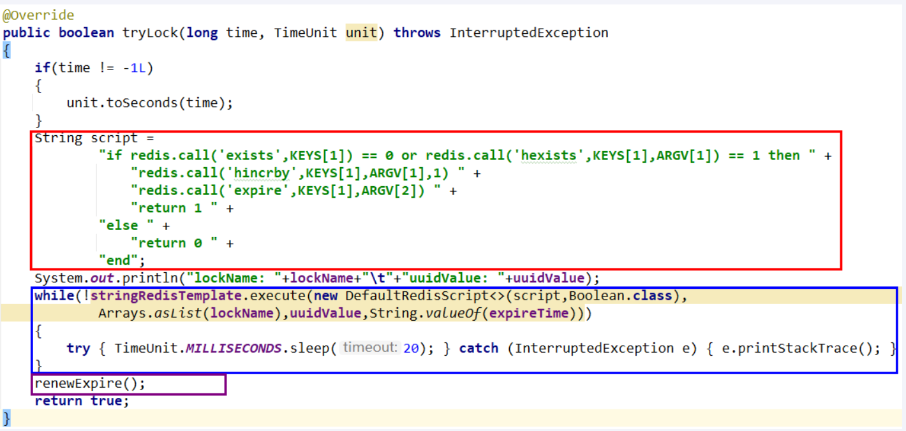


##### 1、加锁

加锁实际上就是在redis中，给key键设置一个值，为避免死锁，并给定一个过期时间

##### 2、自旋

##### 3、续期


#### 9.1.3 unlock解锁的关键逻辑

考虑可重入性的递减，加锁几次就要减锁几次
最后到零了，直接del删除

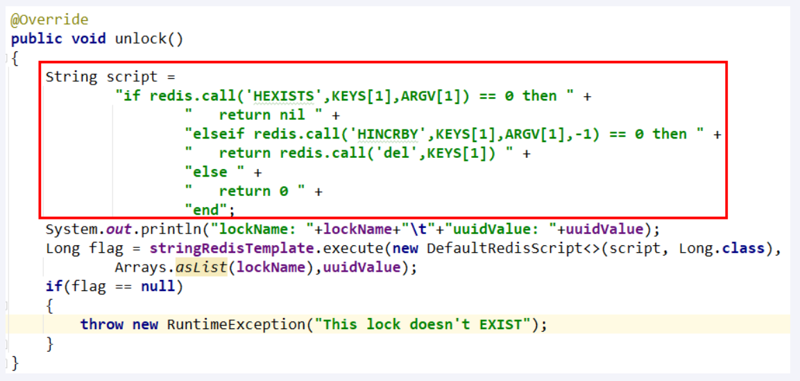

将key删除，但也不能乱删，不能说客户端1的请求将客户端2的锁给删除掉，只能自己删除自己的锁。

#### 9.1.4 上面自研的redis锁对于一般的中小公司，不是特别高并发的场景足够了，单机redis的小业务也撑得住

### 9.2 Redis分布式锁-RedLock红锁算法（Distributed lock with Redis）

#### 9.2.1 官网说明

[Redis RedLock官网](https://redis.io/docs/manual/patterns/distributed-locks/)

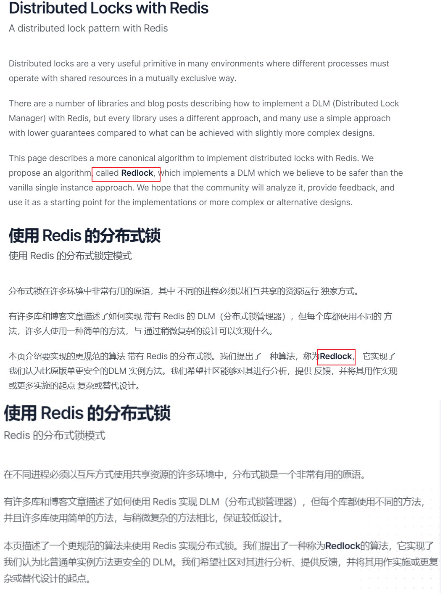

##### 1、为什么要学这个，怎么产生的？

之前我们手写的分布式锁有什么缺点？

###### 1.1、**官网证据**

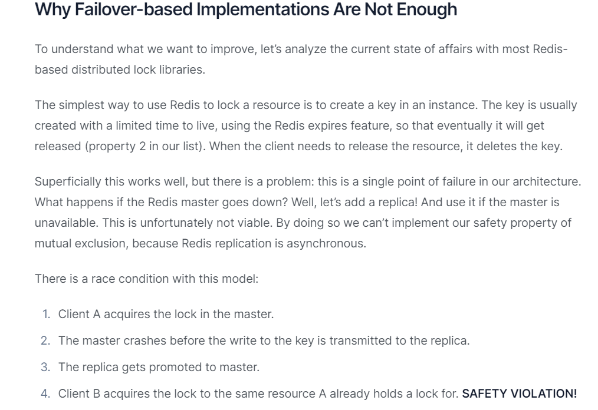

###### 1.2、**翻译版本一**

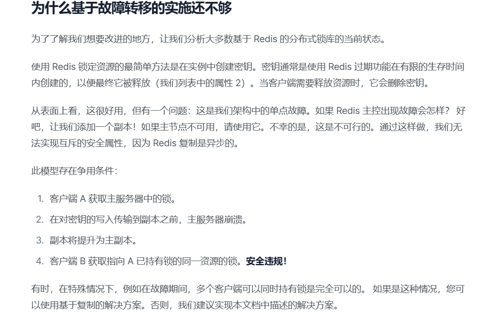

###### 1.3、**翻译版本二**

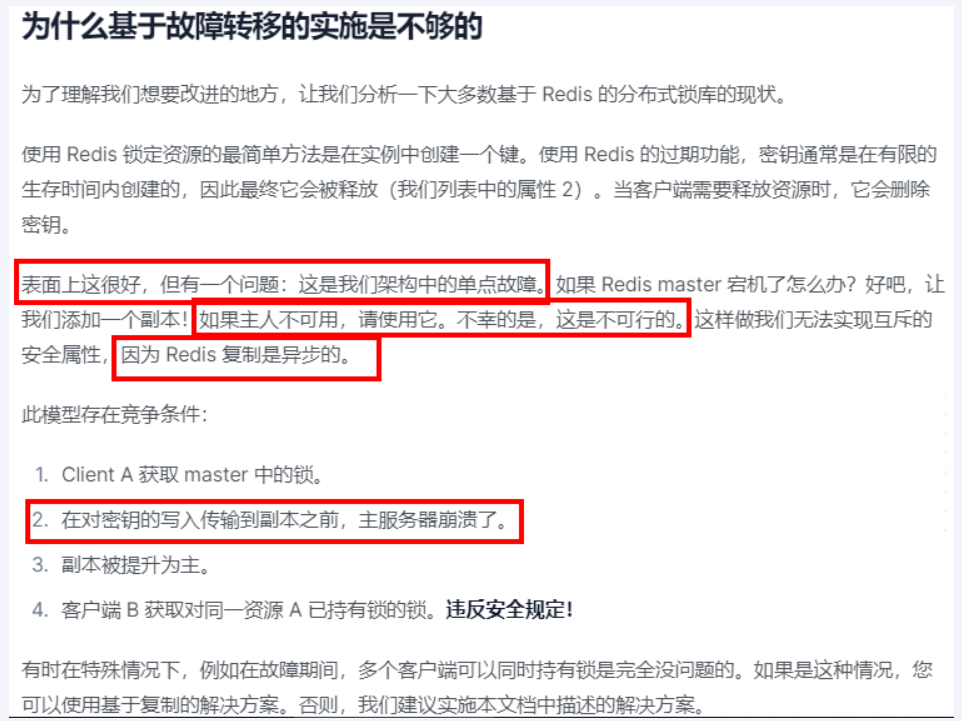

###### **1.4、简而言之**

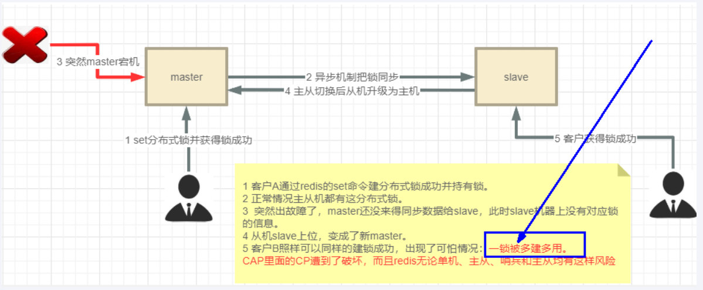

线程 1 首先获取锁成功，将键值对写入 redis 的 master 节点，在 redis 将该键值对同步到 slave 节点之前，master 发生了故障；redis 触发故障转移，其中一个 slave 升级为新的 master，此时新上位的master并不包含线程1写入的键值对，因此线程 2 尝试获取锁也可以成功拿到锁，**此时相当于有两个线程获取到了锁，可能会导致各种预期之外的情况发生，例如最常见的脏数据。**
我们加的是排它独占锁，同一时间只能有一个建redis锁成功并持有锁，**严禁出现2个以上的请求线程拿到锁。危险的操作**

#### 9.2.2 RedLock算法设计理念

##### 1、redis之父提出了RedLock算法来解决这个问题

Redis也提供了Redlock算法，用来实现**基于多个实例的**分布式锁。

锁变量由多个实例维护，即使有实例发生了故障，锁变量仍然是存在的，客户端还是可以完成锁操作。

Redlock算法是实现高可靠分布式锁的一种有效解决方案，可以在实际开发中使用。最下方还有笔记

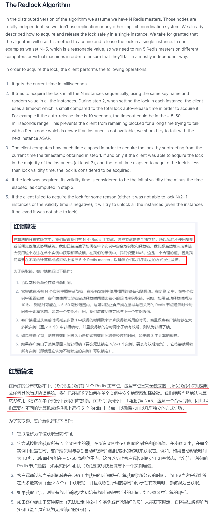

##### 2、涉及理念

该方案也是基于（set 加锁、Lua 脚本解锁）进行改良的，所以redis之父antirez 只描述了差异的地方，大致方案如下。

假设我们有N个Redis主节点，例如 N = 5这些节点是完全独立的，我们不使用复制或任何其他隐式协调系统，

为了取到锁客户端执行以下操作：

| 序号 | 说明                                                         |
| ---- | ------------------------------------------------------------ |
| 1    | 获取当前时间，以毫秒为单位；                                 |
| 2    | 依次尝试从5个实例，使用相同的 key 和随机值（例如 UUID）获取锁。当向Redis 请求获取锁时，客户端应该设置一个超时时间，这个超时时间应该小于锁的失效时间。例如你的锁自动失效时间为 10 秒，则超时时间应该在 5-50 毫秒之间。这样可以防止客户端在试图与一个宕机的 Redis 节点对话时长时间处于阻塞状态。如果一个实例不可用，客户端应该尽快尝试去另外一个 Redis 实例请求获取锁； |
| 3    | 客户端通过当前时间减去步骤 1 记录的时间来计算获取锁使用的时间。当且仅当从大多数（N/2+1，这里是 3 个节点）的 Redis 节点都取到锁，并且获取锁使用的时间小于锁失效时间时，锁才算获取成功； |
| 4    | 如果取到了锁，其真正有效时间等于初始有效时间减去获取锁所使用的时间（步骤 3 计算的结果）。 |
| 5    | 如果由于某些原因未能获得锁（无法在至少 N/2 + 1 个 Redis 实例获取锁、或获取锁的时间超过了有效时间），客户端应该在所有的 Redis 实例上进行解锁（即便某些Redis实例根本就没有加锁成功，防止某些节点获取到锁但是客户端没有得到响应而导致接下来的一段时间不能被重新获取锁）。 |

该方案为了解决数据不一致的问题，**直接舍弃了异步复制只使用 master 节点**，同时由于舍弃了 slave，为了保证可用性，引入了 N 个节点，官方建议是 5。阳哥本次教学演示用3台实例来做说明。

客户端只有在满足下面的这两个条件时，才能认为是加锁成功。

条件1：客户端从超过半数（大于等于N/2+1）的Redis实例上成功获取到了锁；

条件2：客户端获取锁的总耗时没有超过锁的有效时间。


##### 3、解决方案

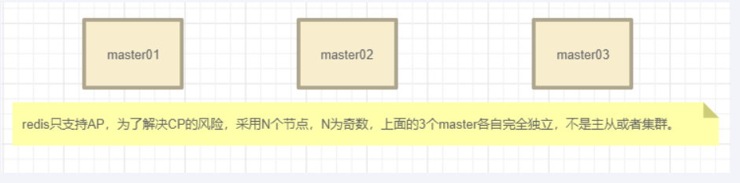

**为什么是奇数？ N = 2X + 1  (N是最终部署机器数，X是容错机器数)**

> **1 先知道什么是容错**
>
> 失败了多少个机器实例后我还是可以容忍的，所谓的容忍就是数据一致性还是可以Ok的，CP数据一致性还是可以满足
>
> 加入在集群环境中，redis失败1台，可接受。2X+1 = 2 * 1+1 =3，部署3台，死了1个剩下2个可以正常工作，那就部署3台。
>
> 加入在集群环境中，redis失败2台，可接受。2X+1 = 2 * 2+1 =5，部署5台，死了2个剩下3个可以正常工作，那就部署5台。
>
> **2 为什么是奇数？**
>
>  最少的机器，最多的产出效果
>
>  加入在集群环境中，redis失败1台，可接受。2N+2= 2 * 1+2 =4，部署4台
>
>  加入在集群环境中，redis失败2台，可接受。2N+2 = 2 * 2+2 =6，部署6台

**容错公式**

#### 9.2.3 RedLock算法理念的对应实现Redisson

1、Redisson是RedLock的Java客户端实现版

2、[Redisson官网](https://redisson.pro/)

3、[Redisson的github地址](https://github.com/redisson/redisson)

4、[redisson的wiki说明](https://github.com/redisson/redisson/wiki/8.-distributed-locks-and-synchronizers)


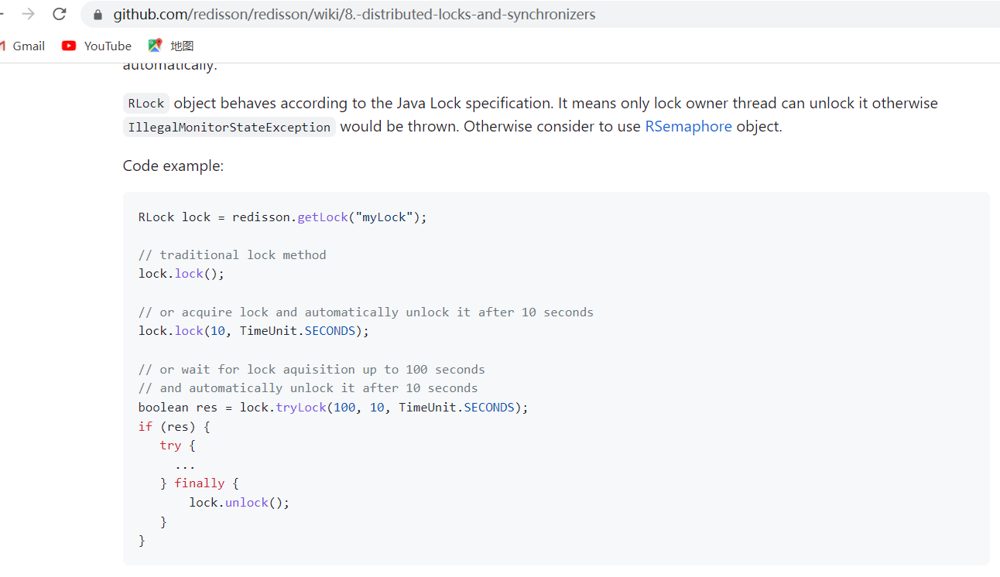

[redisson的中文版wiki说明](https://github.com/redisson/redisson/wiki/8.-分布式锁和同步器)

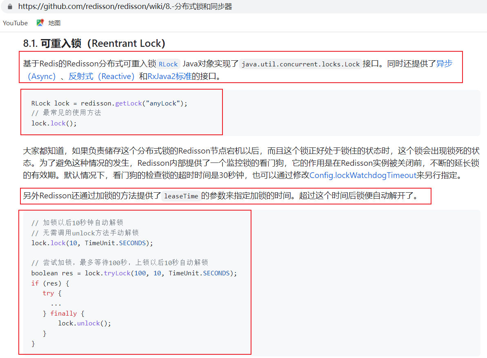

### 9.3 使用Redisson进行编码改造V7.0（对应周阳老师V9.0）

#### 9.3.1 如何使用

##### 1、[GITHUB上英文WIKI](https://github.com/redisson/redisson/wiki/8.-distributed-locks-and-synchronizers)

**8.1. Lock**

Redis based distributed reentrant [Lock](https://static.javadoc.io/org.redisson/redisson/latest/org/redisson/api/RLock.html) object for Java and implements [Lock](https://docs.oracle.com/javase/8/docs/api/java/util/concurrent/locks/Lock.html) interface.

If Redisson instance which acquired lock crashes then such lock could hang forever in acquired state. To avoid this Redisson maintains lock watchdog, it prolongs lock expiration while lock holder Redisson instance is alive. By default lock watchdog timeout is 30 seconds and can be changed through [Config.lockWatchdogTimeout](https://github.com/redisson/redisson/wiki/2.-Configuration#lockwatchdogtimeout) setting.

`leaseTime` parameter during lock acquisition can be defined. After specified time interval locked lock will be released automatically.

`RLock` object behaves according to the Java Lock specification. It means only lock owner thread can unlock it otherwise `IllegalMonitorStateException` would be thrown. Otherwise consider to use [RSemaphore](https://github.com/mrniko/redisson/wiki/8.-distributed-locks-and-synchronizers/#86-semaphore) object.

Code example:

```java
RLock lock = redisson.getLock("myLock");

// traditional lock method
lock.lock();

// or acquire lock and automatically unlock it after 10 seconds
lock.lock(10, TimeUnit.SECONDS);

// or wait for lock aquisition up to 100 seconds 
// and automatically unlock it after 10 seconds
boolean res = lock.tryLock(100, 10, TimeUnit.SECONDS);
if (res) {
   try {
     ...
   } finally {
       lock.unlock();
   }
}
```


##### 2、[github上中文wiki](https://github.com/redisson/redisson/wiki/8.-分布式锁和同步器)

**8.1. 可重入锁（Reentrant Lock）**

基于Redis的Redisson分布式可重入锁[`RLock`](http://static.javadoc.io/org.redisson/redisson/3.10.0/org/redisson/api/RLock.html) Java对象实现了`java.util.concurrent.locks.Lock`接口。同时还提供了[异步（Async）](http://static.javadoc.io/org.redisson/redisson/3.10.0/org/redisson/api/RLockAsync.html)、[反射式（Reactive）](http://static.javadoc.io/org.redisson/redisson/3.10.0/org/redisson/api/RLockReactive.html)和[RxJava2标准](http://static.javadoc.io/org.redisson/redisson/3.10.0/org/redisson/api/RLockRx.html)的接口。

```
RLock lock = redisson.getLock("anyLock");
// 最常见的使用方法
lock.lock();
```

大家都知道，如果负责储存这个分布式锁的Redisson节点宕机以后，而且这个锁正好处于锁住的状态时，这个锁会出现锁死的状态。为了避免这种情况的发生，Redisson内部提供了一个监控锁的看门狗，它的作用是在Redisson实例被关闭前，不断的延长锁的有效期。默认情况下，看门狗的检查锁的超时时间是30秒钟，也可以通过修改[Config.lockWatchdogTimeout](https://github.com/redisson/redisson/wiki/2.-配置方法#lockwatchdogtimeout监控锁的看门狗超时单位毫秒)来另行指定。

另外Redisson还通过加锁的方法提供了`leaseTime`的参数来指定加锁的时间。超过这个时间后锁便自动解开了。

```java
// 加锁以后10秒钟自动解锁
// 无需调用unlock方法手动解锁
lock.lock(10, TimeUnit.SECONDS);

// 尝试加锁，最多等待100秒，上锁以后10秒自动解锁
boolean res = lock.tryLock(100, 10, TimeUnit.SECONDS);
if (res) {
   try {
     ...
   } finally {
       lock.unlock();
   }
}
```

#### 9.3.2 编码实现

##### 1、POM

```xml
<!--redisson-->
<dependency>
    <groupId>org.redisson</groupId>
    <artifactId>redisson</artifactId>
    <version>3.13.4</version>
</dependency>
```


##### 2、RedisConfig

```java
package com.atguigu.redislock.config;

import org.redisson.Redisson;
import org.redisson.api.RedissonClient;
import org.redisson.config.*;
import org.springframework.context.annotation.Bean;
import org.springframework.context.annotation.Configuration;
import org.springframework.data.redis.connection.lettuce.LettuceConnectionFactory;
import org.springframework.data.redis.core.RedisTemplate;
import org.springframework.data.redis.serializer.GenericJackson2JsonRedisSerializer;
import org.springframework.data.redis.serializer.StringRedisSerializer;

/**
 * @auther zzyy
 * @create 2022-10-22 15:14
 */
@Configuration
public class RedisConfig
{
    @Bean
    public RedisTemplate<String, Object> redisTemplate(LettuceConnectionFactory lettuceConnectionFactory)
    {
        RedisTemplate<String,Object> redisTemplate = new RedisTemplate<>();
        redisTemplate.setConnectionFactory(lettuceConnectionFactory);
        //设置key序列化方式string
        redisTemplate.setKeySerializer(new StringRedisSerializer());
        //设置value的序列化方式json
        redisTemplate.setValueSerializer(new GenericJackson2JsonRedisSerializer());

        redisTemplate.setHashKeySerializer(new StringRedisSerializer());
        redisTemplate.setHashValueSerializer(new GenericJackson2JsonRedisSerializer());

        redisTemplate.afterPropertiesSet();

        return redisTemplate;
    }

    //单Redis节点模式
    @Bean
    public Redisson redisson()
    {
        Config config = new Config();
        config.useSingleServer().setAddress("redis://192.168.111.175:6379").setDatabase(0).setPassword("111111");
        return (Redisson) Redisson.create(config);
    }
}


```


##### 3、InventoryController

```java
package com.atguigu.redislock.controller;

import com.atguigu.redislock.service.InventoryService;
import com.atguigu.redislock.service.InventoryService2;
import io.swagger.annotations.Api;
import io.swagger.annotations.ApiOperation;
import org.springframework.beans.factory.annotation.Autowired;
import org.springframework.web.bind.annotation.GetMapping;
import org.springframework.web.bind.annotation.RestController;

/**
 * @auther zzyy
 * @create 2022-10-22 15:23
 */
@RestController
@Api(tags = "redis分布式锁测试")
public class InventoryController
{
    @Autowired
    private InventoryService inventoryService;

    @ApiOperation("扣减库存，一次卖一个")
    @GetMapping(value = "/inventory/sale")
    public String sale()
    {
        return inventoryService.sale();
    }

    @ApiOperation("扣减库存saleByRedisson，一次卖一个")
    @GetMapping(value = "/inventory/saleByRedisson")
    public String saleByRedisson()
    {
        return inventoryService.saleByRedisson();
    }
}
```


##### 4、InventoryService

> 从现在开始就不用使用我们自己手写的锁了

```java
package com.atguigu.redislock.service;

import cn.hutool.core.util.IdUtil;
import com.atguigu.redislock.mylock.DistributedLockFactory;
import com.atguigu.redislock.mylock.RedisDistributedLock;
import lombok.extern.slf4j.Slf4j;
import org.redisson.Redisson;
import org.redisson.api.RLock;
import org.springframework.beans.factory.annotation.Autowired;
import org.springframework.beans.factory.annotation.Value;
import org.springframework.data.redis.core.StringRedisTemplate;
import org.springframework.data.redis.core.script.DefaultRedisScript;
import org.springframework.stereotype.Service;

import java.util.Arrays;
import java.util.concurrent.TimeUnit;
import java.util.concurrent.locks.Lock;

/**
 * @auther zzyy
 * @create 2022-10-25 16:07
 */
@Service
@Slf4j
public class InventoryService2
{
    @Autowired
    private StringRedisTemplate stringRedisTemplate;
    @Value("${server.port}")
    private String port;
    @Autowired
    private DistributedLockFactory distributedLockFactory;

    @Autowired
    private Redisson redisson;
    public String saleByRedisson()
    {
        String retMessage = "";
        String key = "zzyyRedisLock";
        RLock redissonLock = redisson.getLock(key);
        redissonLock.lock();
        try
        {
            //1 查询库存信息
            String result = stringRedisTemplate.opsForValue().get("inventory001");
            //2 判断库存是否足够
            Integer inventoryNumber = result == null ? 0 : Integer.parseInt(result);
            //3 扣减库存
            if(inventoryNumber > 0) {
                stringRedisTemplate.opsForValue().set("inventory001",String.valueOf(--inventoryNumber));
                retMessage = "成功卖出一个商品，库存剩余: "+inventoryNumber;
                System.out.println(retMessage);
            }else{
                retMessage = "商品卖完了，o(╥﹏╥)o";
            }
        }finally {

          redissonLock.unlock();
        }
        return retMessage+"\t"+"服务端口号："+port;
    }
}
```


##### 5、测试

###### 5.1、单机OK


###### 5.2、JMeter 

**5.2.1、BUG**

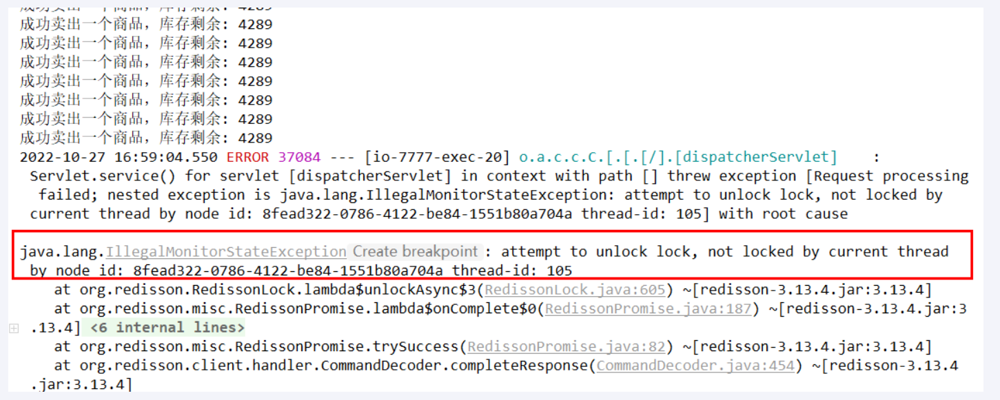

**5.2.2、解决**

```java
		finally {
            if(redissonLock.isLocked() && redissonLock.isHeldByCurrentThread())
            {
                redissonLock.unlock();
            }
        }
```

**完整代码**

```java
package com.atguigu.redislock.service;

import cn.hutool.core.util.IdUtil;
import com.atguigu.redislock.mylock.DistributedLockFactory;
import com.atguigu.redislock.mylock.RedisDistributedLock;
import lombok.extern.slf4j.Slf4j;
import org.redisson.Redisson;
import org.redisson.api.RLock;
import org.springframework.beans.factory.annotation.Autowired;
import org.springframework.beans.factory.annotation.Value;
import org.springframework.data.redis.core.StringRedisTemplate;
import org.springframework.data.redis.core.script.DefaultRedisScript;
import org.springframework.stereotype.Service;

import java.util.Arrays;
import java.util.concurrent.TimeUnit;
import java.util.concurrent.locks.Lock;

/**
 * @auther zzyy
 * @create 2022-10-25 16:07
 */
@Service
@Slf4j
public class InventoryService
{
    @Autowired
    private StringRedisTemplate stringRedisTemplate;
    @Value("${server.port}")
    private String port;
    @Autowired
    private DistributedLockFactory distributedLockFactory;

    @Autowired
    private Redisson redisson;
    public String saleByRedisson()
    {
        String retMessage = "";
        String key = "zzyyRedisLock";
        RLock redissonLock = redisson.getLock(key);
        redissonLock.lock();
        try
        {
            //1 查询库存信息
            String result = stringRedisTemplate.opsForValue().get("inventory001");
            //2 判断库存是否足够
            Integer inventoryNumber = result == null ? 0 : Integer.parseInt(result);
            //3 扣减库存
            if(inventoryNumber > 0) {
                stringRedisTemplate.opsForValue().set("inventory001",String.valueOf(--inventoryNumber));
                retMessage = "成功卖出一个商品，库存剩余: "+inventoryNumber;
                System.out.println(retMessage);
            }else{
                retMessage = "商品卖完了，o(╥﹏╥)o";
            }
        }finally {
            if(redissonLock.isLocked() && redissonLock.isHeldByCurrentThread())
            {
                redissonLock.unlock();
            }
        }
        return retMessage+"\t"+"服务端口号："+port;
    }
}
```

### 9.4 Redisson源码解析

- 加锁
- 可重入
- 续命
- 解锁

- 分析步骤

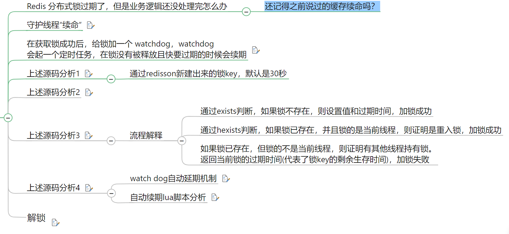


#### 9.4.1 watch dog看门狗机制

Redis分布式锁过期了，但是业务逻辑还没处理完成怎么办？还记得之前说过的缓存续命吗？

**守护线程“续命”**

**额外起一个线程，定期检查线程是否还持有锁，如果有则延长过期时间。**

Redisson 里面就实现了这个方案，使用“看门狗”定期检查（每1/3的锁时间检查1次），如果线程还持有锁，则刷新过期时间；

在获取锁成功后，会给锁加一个watchdog，watchdog会起一个定时任务，在锁没有被释放且快要过期的时候会续期

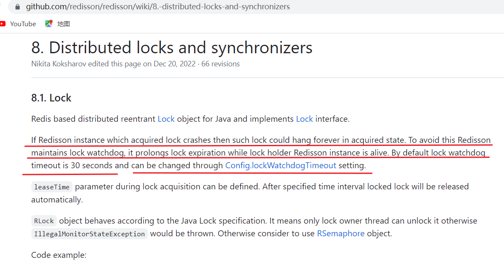

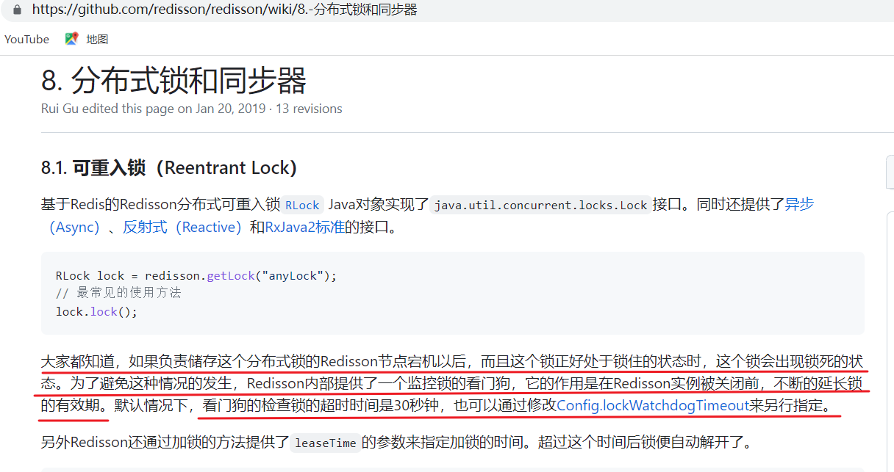

##### 1、watch默认过期时间查看lockWatchdogTimeout

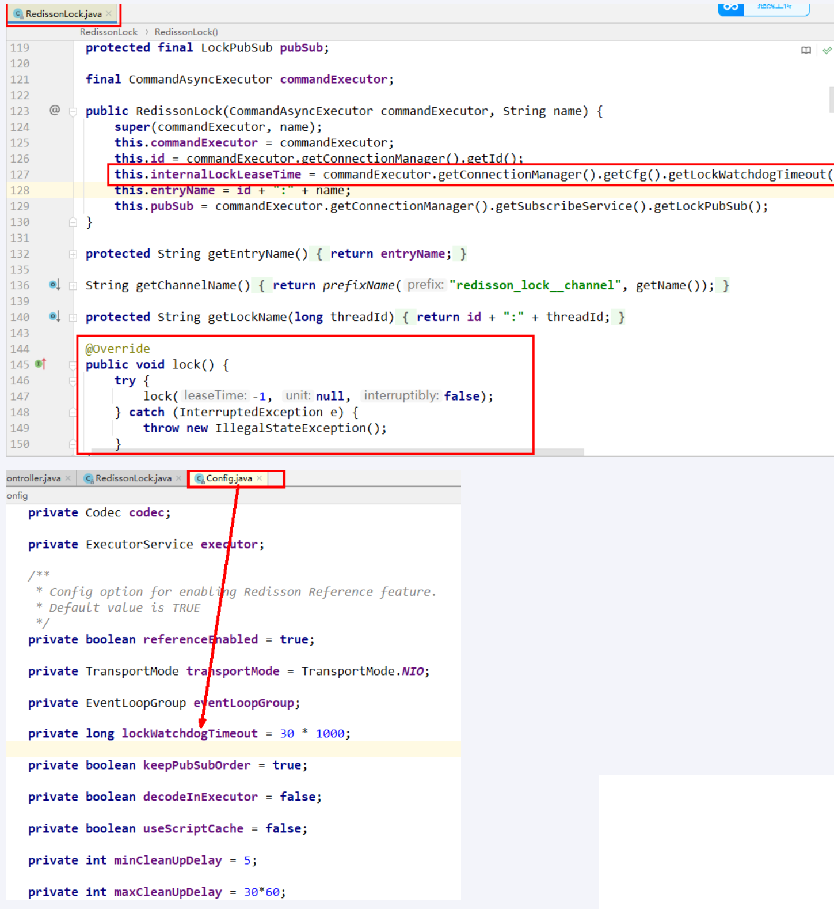

> private long lockWatchdogTimeout = 30 * 1000;
>
> 通过redisson新建出来的锁key，默认是30秒

##### 2、scheduleExpirationRenewal代码分析

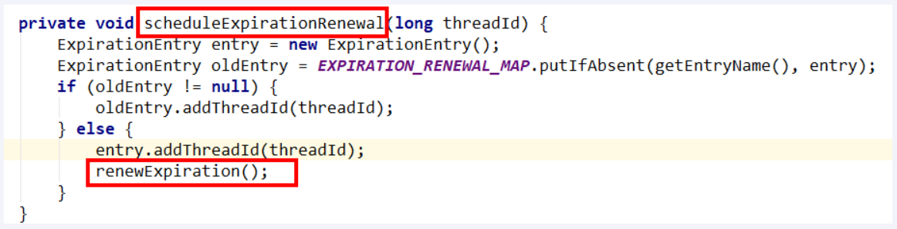

> 这里面初始化了一个定时器，dely 的时间是 internalLockLeaseTime/3。
>
> 在 Redisson 中，internalLockLeaseTime 是 30s，也就是每隔 10s 续期一次，每次 30s。

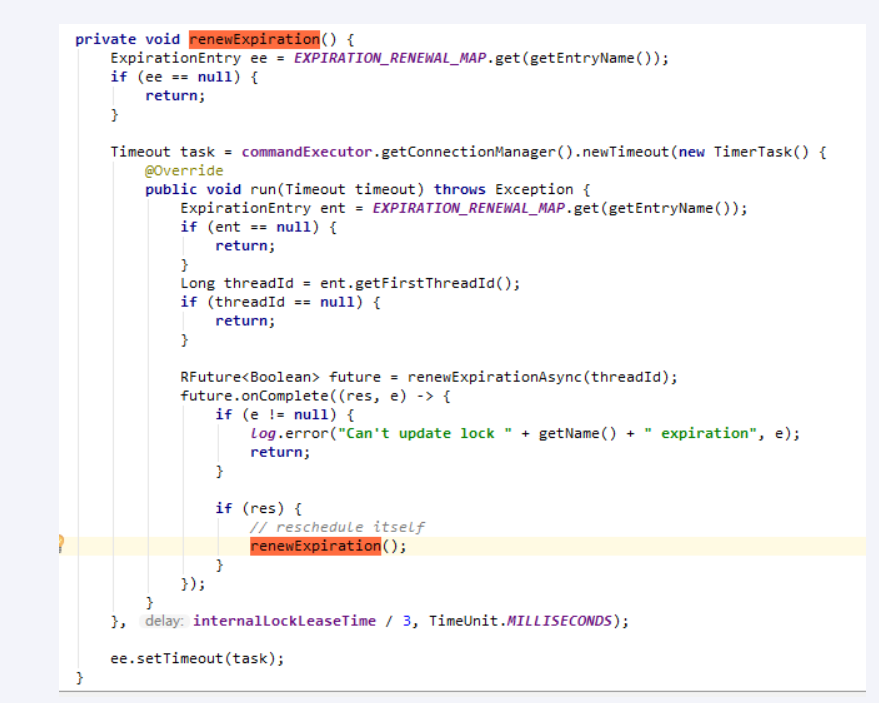

##### 3、watch dog自动延期机制

客户端A加锁成功，就会启动一个watch dog看门狗，他是一个后台线程，会每隔10秒检查一下，如果客户端A还持有锁key，那么就会不断的延长锁key的生存时间，默认每次续命又从30秒新开始

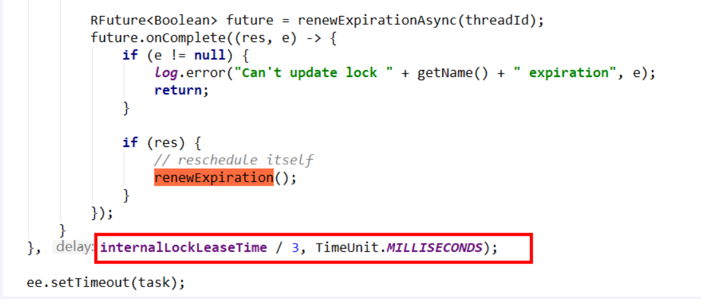


##### 4、自动续期lua脚本分析

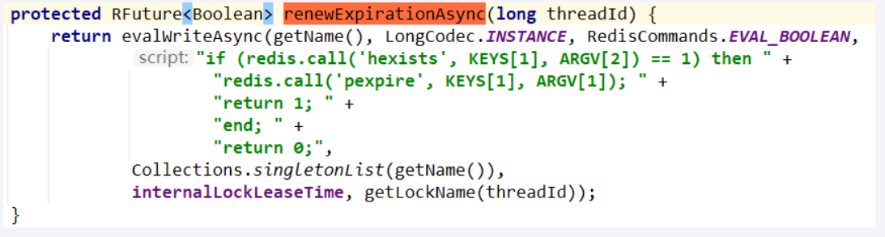

#### 9.4.2 lock加锁机制分析

##### 1、watchdog续命关键代码`scheduleExpirationRenewal(threadId)`

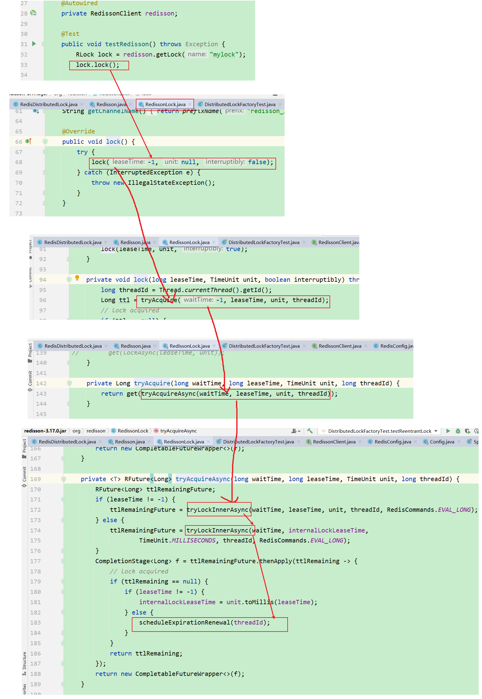

##### 2、tryLockInnerAsync代码分析

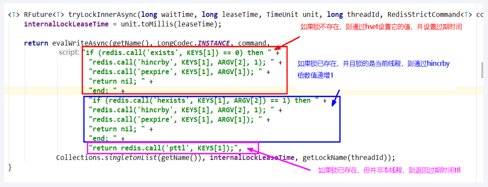

```java
    <T> RFuture<T> tryLockInnerAsync(long waitTime, long leaseTime, TimeUnit unit, long threadId, RedisStrictCommand<T> command) {
        return evalWriteAsync(getRawName(), LongCodec.INSTANCE, command,
                // 如果锁不存在，则通过hset设置它的值，并通过pexpire设置它的过期时间                     "if (redis.call('exists', KEYS[1]) == 0) then " +
                "redis.call('hincrby', KEYS[1], ARGV[2], 1); " +
                        "redis.call('pexpire', KEYS[1], ARGV[1]); " +
                        "return nil; " +
                        "end; " +
                        // 如果锁已经存在，并且锁的是当前线程，则通过hincrby自增1
                        "if (redis.call('hexists', KEYS[1], ARGV[2]) == 1) then " +
                        "redis.call('hincrby', KEYS[1], ARGV[2], 1); " +
                        "redis.call('pexpire', KEYS[1], ARGV[1]); " +
                        "return nil; " +
                        "end; " +
                        // 如果锁已经存在，但是并非本线程，则返回过期时间
                        "return redis.call('pttl', KEYS[1]);",
                Collections.singletonList(getRawName()), unit.toMillis(leaseTime), getLockName(threadId));
    }
```

**流程解释**

- 通过exists判断，如果锁不存在，则设置值和过期时间，加锁成功
- 通过hexists判断，如果锁已经存在，并且锁的是当前线程，则证明是重入锁，加锁成功
- 如果锁已经存在，但是锁的不是当前线程，则证明有其它线程持有锁。返回当前锁的过期时间（代表了锁key的剩余生存时间），加锁失败

#### 9.4.3 unlock解锁机制

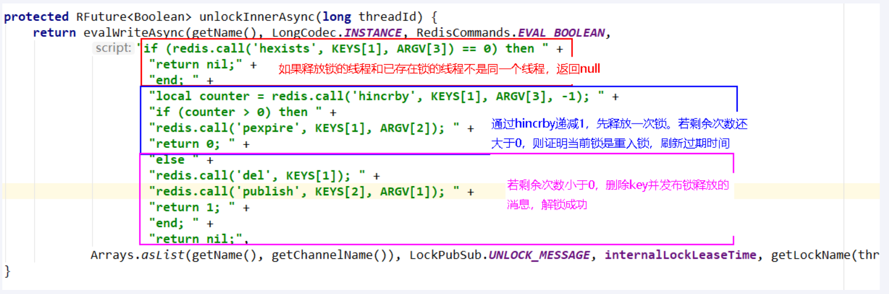

```java
    protected RFuture<Boolean> unlockInnerAsync(long threadId) {
        return evalWriteAsync(getRawName(), LongCodec.INSTANCE, RedisCommands.EVAL_BOOLEAN,
                // 如果释放锁的线程和已存在锁的线程不是同一个线程，则返回nil
                "if (redis.call('hexists', KEYS[1], ARGV[3]) == 0) then " +
                        "return nil;" +
                        "end; " +
                        
                        // 通过hincrby递减1，先释放1次锁，若剩余次数还大于0，则证明当前锁是重入锁，则刷新过期时间
                        "local counter = redis.call('hincrby', KEYS[1], ARGV[3], -1); " +
                        "if (counter > 0) then " +
                        "redis.call('pexpire', KEYS[1], ARGV[2]); " +
                        "return 0; " +

                        // 若剩余次数小于0，则删除key并发布锁释放的消息，解锁成功
                        "else " +
                        "redis.call('del', KEYS[1]); " +
                        "redis.call('publish', KEYS[2], ARGV[1]); " +
                        "return 1; " +
                        "end; " +
                        "return nil;",
                Arrays.asList(getRawName(), getChannelName()), LockPubSub.UNLOCK_MESSAGE, internalLockLeaseTime, getLockName(threadId));
    }
```

### 9.5 Redisson多机案例

#### 9.5.1 理论来源

Redis之父提出了RedLock算法来解决这个问题

##### 1、[官网](https://redis.io/docs/manual/patterns/distributed-locks/)

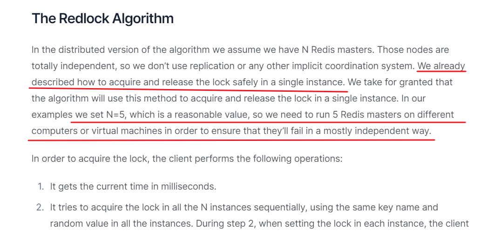

##### 2、具体

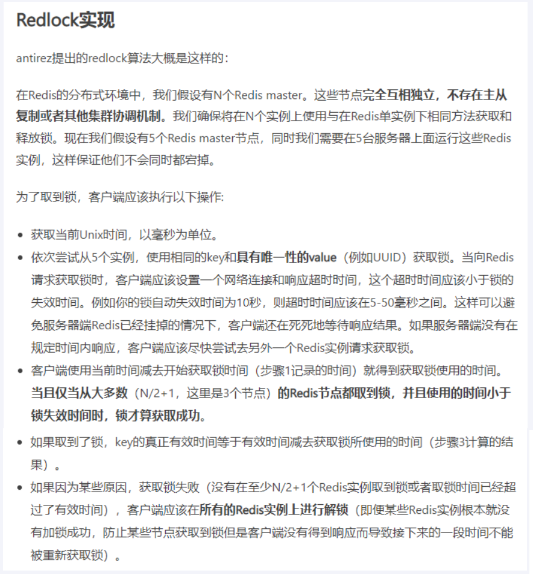

##### 3、小总结

这个锁的算法实现了多redis实例的情况，相对于单redis节点来说，**优点在于 防止了 单节点故障造成整个服务停止运行的情况**且在多节点中锁的设计，及多节点同时崩溃等各种意外情况有自己独特的设计方法。

Redisson 分布式锁支持 MultiLock 机制可以将多个锁合并为一个大锁，对一个大锁进行统一的申请加锁以及释放锁。

 

**最低保证分布式锁的有效性及安全性的要求如下：**

1.互斥；任何时刻只能有一个client获取锁

2.释放死锁；即使锁定资源的服务崩溃或者分区，仍然能释放锁

3.容错性；只要多数redis节点（一半以上）在使用，client就可以获取和释放锁

 

**网上讲的基于故障转移实现的redis主从无法真正实现Redlock:**

因为redis在进行主从复制时是异步完成的，比如在clientA获取锁后，主redis复制数据到从redis过程中崩溃了，导致没有复制到从redis中，然后从redis选举出一个升级为主redis,造成新的主redis没有clientA 设置的锁，这是clientB尝试获取锁，并且能够成功获取锁，导致互斥失效；

#### 9.5.2 代码参考来源

[官网wiki地址](https://github.com/redisson/redisson/wiki/8.-distributed-locks-and-synchronizers)

##### 1、**2022年第8章第4小节**

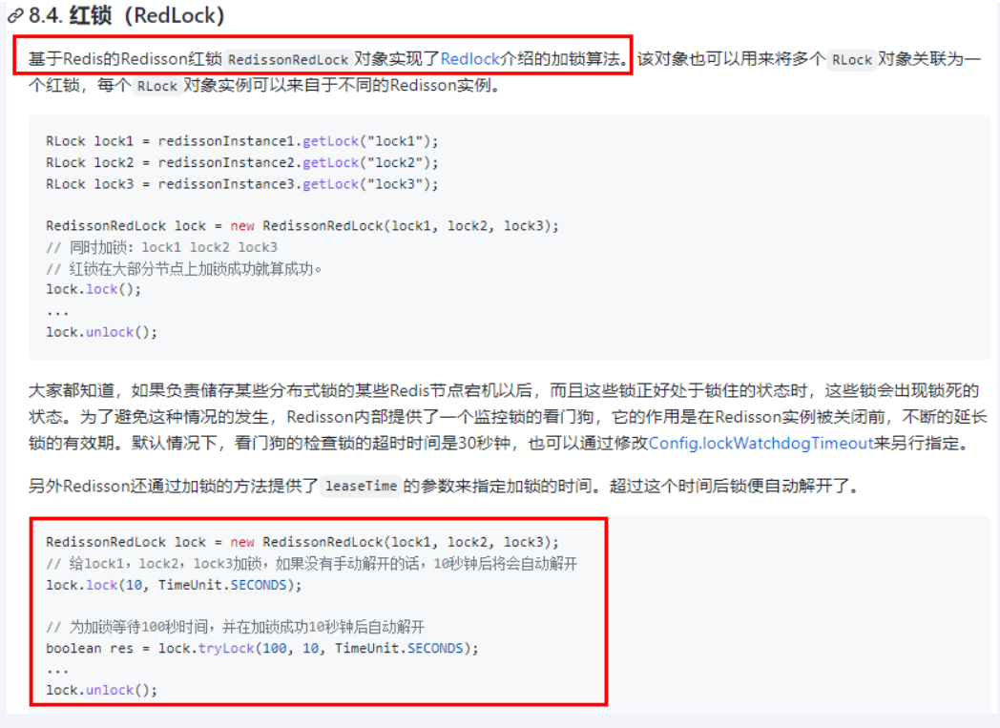


##### 2、**2023年第8章第4小节**

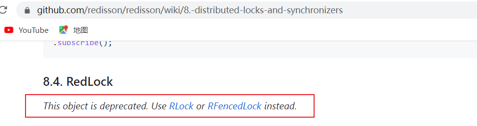

##### 3、2023年第8章第4小节-MultiLock多重锁

###### 8.3. MultiLock

Redis based distributed `MultiLock` object allows to group [Lock](https://static.javadoc.io/org.redisson/redisson/latest/org/redisson/api/RLock.html) objects and handle them as a single lock. Each `RLock` object may belong to different Redisson instances.

If Redisson instance which acquired `MultiLock` crashes then such `MultiLock` could hang forever in acquired state. To avoid this Redisson maintains lock watchdog, it prolongs lock expiration while lock holder Redisson instance is alive. By default lock watchdog timeout is 30 seconds and can be changed through [Config.lockWatchdogTimeout](https://github.com/redisson/redisson/wiki/2.-Configuration#lockwatchdogtimeout) setting.

`leaseTime` parameter during lock acquisition can be defined. After specified time interval locked lock will be released automatically.

`MultiLock` object behaves according to the Java Lock specification. It means only lock owner thread can unlock it otherwise `IllegalMonitorStateException` would be thrown. Otherwise consider to use [RSemaphore](https://github.com/mrniko/redisson/wiki/8.-distributed-locks-and-synchronizers/#86-semaphore) object.

###### 8.3. 多重锁

<font color='red'>**基于Redis的分布式`MultiLock`对象允许将Lock对象分组并将它们作为单个锁处理。每个`RLock`对象可能属于不同的`Redisson`的实例。**</font>

`MultiLock`如果获取崩溃的`Redisson`的实例可能会永远挂在获取的状态。为了避免这种情况。`Redisson`会维护一个锁的看门狗程序。它会在锁的持有者`Redisson`实例处于活动时延长锁的到期时间。默认情况下，锁的看门狗默认超时时间是30秒，可以通过`Config.lockWatchdogTimeout`设置进行修改。

`leaseTime`可以定义获取锁期间的参数。在指定的时间间隔后，锁定的锁将自动释放。

`MultiLock` 对象的行为符号`Java Lock`规范。<font color='red'>**这意味着只有锁的所有者线程才能解锁它**</font>，否则会抛出`IllegalMonitorStateException`。否则请考虑使用`RSemaphore`对象。


Code example:

```java
RLock lock1 = redisson1.getLock("lock1");
RLock lock2 = redisson2.getLock("lock2");
RLock lock3 = redisson3.getLock("lock3");

RLock multiLock = anyRedisson.getMultiLock(lock1, lock2, lock3);

// traditional lock method
multiLock.lock();

// or acquire lock and automatically unlock it after 10 seconds
multiLock.lock(10, TimeUnit.SECONDS);

// or wait for lock aquisition up to 100 seconds 
// and automatically unlock it after 10 seconds
boolean res = multiLock.tryLock(100, 10, TimeUnit.SECONDS);
if (res) {
   try {
     ...
   } finally {
       multiLock.unlock();
   }
}
```

Code example of **[Async](https://static.javadoc.io/org.redisson/redisson/latest/org/redisson/api/RLockAsync.html) interface** usage:

```java
RLock lock1 = redisson1.getLock("lock1");
RLock lock2 = redisson2.getLock("lock2");
RLock lock3 = redisson3.getLock("lock3");

RLock multiLock = anyRedisson.getMultiLock(lock1, lock2, lock3);

RFuture<Void> lockFuture = multiLock.lockAsync();

// or acquire lock and automatically unlock it after 10 seconds
RFuture<Void> lockFuture = multiLock.lockAsync(10, TimeUnit.SECONDS);

// or wait for lock aquisition up to 100 seconds 
// and automatically unlock it after 10 seconds
RFuture<Boolean> lockFuture = multiLock.tryLockAsync(100, 10, TimeUnit.SECONDS);

lockFuture.whenComplete((res, exception) -> {
    // ...
    multiLock.unlockAsync();
});

```

Code example of **[Reactive](https://static.javadoc.io/org.redisson/redisson/latest/org/redisson/api/RLockReactive.html) interface** usage:

```java
RedissonReactiveClient anyRedisson = redissonClient.reactive();

RLockReactive lock1 = redisson1.getLock("lock1");
RLockReactive lock2 = redisson2.getLock("lock2");
RLockReactive lock3 = redisson3.getLock("lock3");

RLockReactive multiLock = anyRedisson.getMultiLock(lock1, lock2, lock3);

Mono<Void> lockMono = multiLock.lock();

// or acquire lock and automatically unlock it after 10 seconds
Mono<Void> lockMono = multiLock.lock(10, TimeUnit.SECONDS);

// or wait for lock aquisition up to 100 seconds 
// and automatically unlock it after 10 seconds
Mono<Boolean> lockMono = multiLock.tryLock(100, 10, TimeUnit.SECONDS);

lockMono.doOnNext(res -> {
   // ...
})
.doFinally(multiLock.unlock())
.subscribe();
```

Code example of **[RxJava3](https://static.javadoc.io/org.redisson/redisson/latest/org/redisson/api/RLockRx.html) interface** usage:

```java
RedissonRxClient anyRedisson = redissonClient.rxJava();

RLockRx lock1 = redisson1.getLock("lock1");
RLockRx lock2 = redisson2.getLock("lock2");
RLockRx lock3 = redisson3.getLock("lock3");

RLockRx multiLock = anyRedisson.getMultiLock(lock1, lock2, lock3);

Completable lockRes = multiLock.lock();

// or acquire lock and automatically unlock it after 10 seconds
Completable lockRes = multiLock.lock(10, TimeUnit.SECONDS);

// or wait for lock aquisition up to 100 seconds 
// and automatically unlock it after 10 seconds
Single<Boolean> lockRes = multiLock.tryLock(100, 10, TimeUnit.SECONDS);

lockRes.doOnSuccess(res -> {
   // ...
})
.doFinally(multiLock.unlock())
.subscribe();
```

#### 9.5.3 代码实现

##### **1、docker起三台redis的master机器，本次设置3台master各自独立无从属关系**

```shell
docker run -p 6381:6379 --name redis-master-1 -d redis
docker run -p 6382:6379 --name redis-master-2 -d redis
docker run -p 6383:6379 --name redis-master-3 -d redis
```

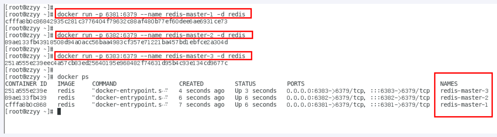

##### **2、进入上一步刚启动的redis容器实例**

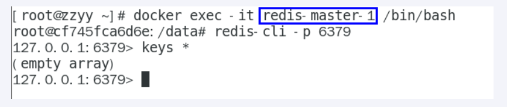

```shell
docker exec -it redis-master-1 /bin/bash   或者 docker exec -it redis-master-1 redis-cli
docker exec -it redis-master-2 /bin/bash   或者 docker exec -it redis-master-2 redis-cli
docker exec -it redis-master-3 /bin/bash   或者 docker exec -it redis-master-3 redis-cli
```

##### 3、建Module

redis_redlock

##### 4、改pom

```xml
<?xml version="1.0" encoding="UTF-8"?>
<project xmlns="http://maven.apache.org/POM/4.0.0" xmlns:xsi="http://www.w3.org/2001/XMLSchema-instance"
         xsi:schemaLocation="http://maven.apache.org/POM/4.0.0 https://maven.apache.org/xsd/maven-4.0.0.xsd">
    <modelVersion>4.0.0</modelVersion>
    <parent>
        <groupId>org.springframework.boot</groupId>
        <artifactId>spring-boot-starter-parent</artifactId>
        <version>2.3.10.RELEASE</version>
        <relativePath/> <!-- lookup parent from repository -->
    </parent>

    <groupId>com.atguigu.redis.redlock</groupId>
    <artifactId>redis_redlock</artifactId>
    <version>0.0.1-SNAPSHOT</version>


    <properties>
        <java.version>1.8</java.version>
    </properties>

    <dependencies>
        <dependency>
            <groupId>org.springframework.boot</groupId>
            <artifactId>spring-boot-starter-web</artifactId>
        </dependency>

        <dependency>
            <groupId>org.springframework.boot</groupId>
            <artifactId>spring-boot-starter-test</artifactId>
            <scope>test</scope>
        </dependency>

        <dependency>
            <groupId>org.redisson</groupId>
            <artifactId>redisson</artifactId>
            <version>3.19.1</version>
        </dependency>

        <dependency>
            <groupId>org.projectlombok</groupId>
            <artifactId>lombok</artifactId>
            <version>1.18.8</version>
        </dependency>
        <!--swagger-->
        <dependency>
            <groupId>io.springfox</groupId>
            <artifactId>springfox-swagger2</artifactId>
            <version>2.9.2</version>
        </dependency>
        <!--swagger-ui-->
        <dependency>
            <groupId>io.springfox</groupId>
            <artifactId>springfox-swagger-ui</artifactId>
            <version>2.9.2</version>
        </dependency>
        <dependency>
            <groupId>org.apache.commons</groupId>
            <artifactId>commons-lang3</artifactId>
            <version>3.4</version>
            <scope>compile</scope>
        </dependency>
        <dependency>
            <groupId>cn.hutool</groupId>
            <artifactId>hutool-all</artifactId>
            <version>5.8.11</version>
        </dependency>
        <dependency>
            <groupId>org.springframework.boot</groupId>
            <artifactId>spring-boot-configuration-processor</artifactId>
            <optional>true</optional>
        </dependency>
    </dependencies>


    <build>
        <plugins>
            <plugin>
                <groupId>org.springframework.boot</groupId>
                <artifactId>spring-boot-maven-plugin</artifactId>
                <configuration>
                    <excludes>
                        <exclude>
                            <groupId>org.springframework.boot</groupId>
                            <artifactId>spring-boot-configuration-processor</artifactId>
                        </exclude>
                    </excludes>
                </configuration>
            </plugin>
        </plugins>
    </build>

</project>
```


##### 5、写yaml

```yaml
server.port=9090
spring.application.name=redlock


spring.swagger2.enabled=true


spring.redis.database=0
spring.redis.password=
spring.redis.timeout=3000
spring.redis.mode=single

spring.redis.pool.conn-timeout=3000
spring.redis.pool.so-timeout=3000
spring.redis.pool.size=10

spring.redis.single.address1=192.168.111.185:6381
spring.redis.single.address2=192.168.111.185:6382
spring.redis.single.address3=192.168.111.185:6383
```


##### 6、主启动

```java
package com.atguigu.redis.redlock;

import org.springframework.boot.SpringApplication;
import org.springframework.boot.autoconfigure.SpringBootApplication;

@SpringBootApplication
public class RedisRedlockApplication
{

    public static void main(String[] args)
    {
        SpringApplication.run(RedisRedlockApplication.class, args);
    }

}
```


##### 7、业务类

###### 7.1、CacheConfiguration
```java
package com.atguigu.redis.redlock.config;

import org.apache.commons.lang3.StringUtils;
import org.redisson.Redisson;
import org.redisson.api.RedissonClient;
import org.redisson.config.*;
import org.springframework.beans.factory.annotation.Autowired;
import org.springframework.boot.autoconfigure.condition.ConditionalOnClass;
import org.springframework.boot.autoconfigure.condition.ConditionalOnExpression;
import org.springframework.boot.autoconfigure.condition.ConditionalOnProperty;
import org.springframework.boot.context.properties.EnableConfigurationProperties;
import org.springframework.context.annotation.Bean;
import org.springframework.context.annotation.Configuration;

import java.util.ArrayList;
import java.util.Arrays;
import java.util.List;

@Configuration
@EnableConfigurationProperties(RedisProperties.class)
public class CacheConfiguration {

    @Autowired
    RedisProperties redisProperties;

    @Bean
    RedissonClient redissonClient1() {
        Config config = new Config();
        String node = redisProperties.getSingle().getAddress1();
        node = node.startsWith("redis://") ? node : "redis://" + node;
        SingleServerConfig serverConfig = config.useSingleServer()
                .setAddress(node)
                .setTimeout(redisProperties.getPool().getConnTimeout())
                .setConnectionPoolSize(redisProperties.getPool().getSize())
                .setConnectionMinimumIdleSize(redisProperties.getPool().getMinIdle());
        if (StringUtils.isNotBlank(redisProperties.getPassword())) {
            serverConfig.setPassword(redisProperties.getPassword());
        }
        return Redisson.create(config);
    }

    @Bean
    RedissonClient redissonClient2() {
        Config config = new Config();
        String node = redisProperties.getSingle().getAddress2();
        node = node.startsWith("redis://") ? node : "redis://" + node;
        SingleServerConfig serverConfig = config.useSingleServer()
                .setAddress(node)
                .setTimeout(redisProperties.getPool().getConnTimeout())
                .setConnectionPoolSize(redisProperties.getPool().getSize())
                .setConnectionMinimumIdleSize(redisProperties.getPool().getMinIdle());
        if (StringUtils.isNotBlank(redisProperties.getPassword())) {
            serverConfig.setPassword(redisProperties.getPassword());
        }
        return Redisson.create(config);
    }

    @Bean
    RedissonClient redissonClient3() {
        Config config = new Config();
        String node = redisProperties.getSingle().getAddress3();
        node = node.startsWith("redis://") ? node : "redis://" + node;
        SingleServerConfig serverConfig = config.useSingleServer()
                .setAddress(node)
                .setTimeout(redisProperties.getPool().getConnTimeout())
                .setConnectionPoolSize(redisProperties.getPool().getSize())
                .setConnectionMinimumIdleSize(redisProperties.getPool().getMinIdle());
        if (StringUtils.isNotBlank(redisProperties.getPassword())) {
            serverConfig.setPassword(redisProperties.getPassword());
        }
        return Redisson.create(config);
    }


    /**
     * 单机
     * @return
     */
    /*@Bean
    public Redisson redisson()
    {
        Config config = new Config();

        config.useSingleServer().setAddress("redis://192.168.111.147:6379").setDatabase(0);

        return (Redisson) Redisson.create(config);
    }*/

}
```

###### 7.2、RedisPoolProperties
```java
package com.atguigu.redis.redlock.config;

import lombok.Data;

@Data
public class RedisPoolProperties {

    private int maxIdle;

    private int minIdle;

    private int maxActive;

    private int maxWait;

    private int connTimeout;

    private int soTimeout;

    /**
     * 池大小
     */
    private  int size;

}
```

###### 7.3、RedisProperties
```java
package com.atguigu.redis.redlock.config;

import lombok.Data;
import lombok.ToString;
import org.springframework.boot.context.properties.ConfigurationProperties;

@ConfigurationProperties(prefix = "spring.redis", ignoreUnknownFields = false)
@Data
public class RedisProperties {

    private int database;

    /**
     * 等待节点回复命令的时间。该时间从命令发送成功时开始计时
     */
    private int timeout;

    private String password;

    private String mode;

    /**
     * 池配置
     */
    private RedisPoolProperties pool;

    /**
     * 单机信息配置
     */
    private RedisSingleProperties single;


}
```

###### 7.4、RedisSingleProperties
```java
package com.atguigu.redis.redlock.config;

import lombok.Data;

@Data
public class RedisSingleProperties {
    private  String address1;
    private  String address2;
    private  String address3;
}
```

###### 7.5、RedLockController
```java
package com.atguigu.redis.redlock.controller;

import cn.hutool.core.util.IdUtil;
import lombok.extern.slf4j.Slf4j;
import org.redisson.Redisson;
import org.redisson.RedissonMultiLock;
import org.redisson.RedissonRedLock;
import org.redisson.api.RLock;
import org.redisson.api.RedissonClient;
import org.redisson.config.Config;
import org.springframework.beans.factory.annotation.Autowired;
import org.springframework.boot.autoconfigure.data.redis.RedisProperties;
import org.springframework.web.bind.annotation.GetMapping;
import org.springframework.web.bind.annotation.RestController;

import java.util.concurrent.TimeUnit;
import java.util.concurrent.locks.Lock;
import java.util.concurrent.locks.ReentrantLock;

@RestController
@Slf4j
public class RedLockController {

    public static final String CACHE_KEY_REDLOCK = "ATGUIGU_REDLOCK";

    @Autowired
    RedissonClient redissonClient1;

    @Autowired
    RedissonClient redissonClient2;

    @Autowired
    RedissonClient redissonClient3;

    boolean isLockBoolean;

    @GetMapping(value = "/multiLock")
    public String getMultiLock() throws InterruptedException
    {
        String uuid =  IdUtil.simpleUUID();
        String uuidValue = uuid+":"+Thread.currentThread().getId();

        RLock lock1 = redissonClient1.getLock(CACHE_KEY_REDLOCK);
        RLock lock2 = redissonClient2.getLock(CACHE_KEY_REDLOCK);
        RLock lock3 = redissonClient3.getLock(CACHE_KEY_REDLOCK);

        RedissonMultiLock redLock = new RedissonMultiLock(lock1, lock2, lock3);
        redLock.lock();
        try
        {
            System.out.println(uuidValue+"\t"+"---come in biz multiLock");
            try { TimeUnit.SECONDS.sleep(30); } catch (InterruptedException e) { e.printStackTrace(); }
            System.out.println(uuidValue+"\t"+"---task is over multiLock");
        } catch (Exception e) {
            e.printStackTrace();
            log.error("multiLock exception ",e);
        } finally {
            redLock.unlock();
            log.info("释放分布式锁成功key:{}", CACHE_KEY_REDLOCK);
        }

        return "multiLock task is over  "+uuidValue;
    }

}
```

#### 9.5.4 测试

##### 1、http://localhost:9090/multilock

##### 2、命令

```shell
ttl ATGUIGU_REDLOCK
HGETALL ATGUIGU_REDLOCK
shutdown
docker start redis-master-1
docker exec -it redis-master-1 redis-cli
```

##### 3、结论

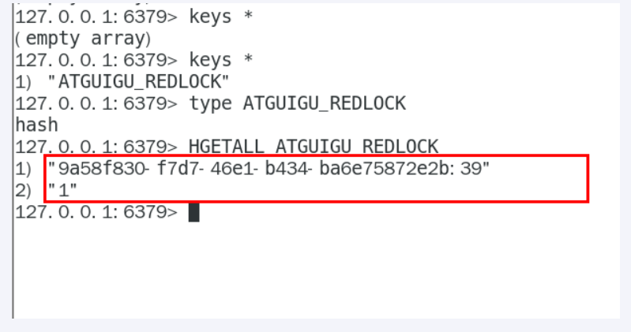

## 10 Redis的缓存过期淘汰策略

### 10.1 粉丝反馈的面试题

- 生产上你们的redis内存设置多少？
- 如何配置、修改redis的内存大小
- 如果内存满了你怎么办
- redis清理内存的方式？定期删除和惰性删除了解过吗？
- redis缓存淘汰策略有哪些？分别是什么？你用哪个？
- redis的LRU算法了解过吗？请手写LRU
  - 这个在阳哥大厂第三季视频
- LRU和LFU算法的区别是什么
  - LRU：最近最少使用的
  - LFU：最不经常使用的

### 10.2 Redis内存满了怎么办

#### 10.2.1 redis默认内存是多少？在哪里查看？如何设置修改？

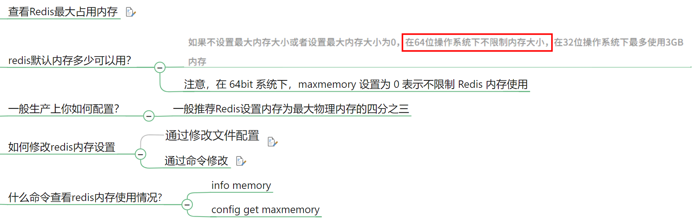

##### 1、查看redis的最大占用内存

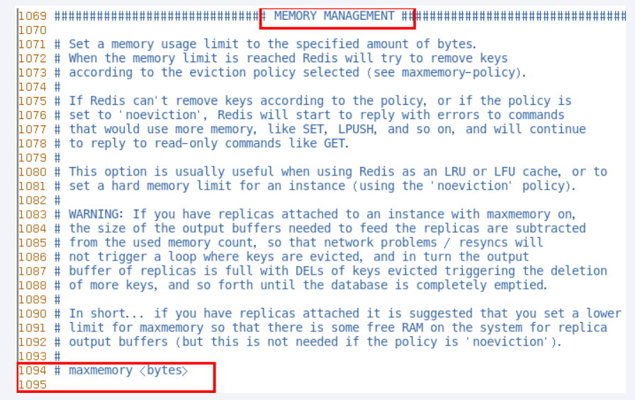

> 打开redis配置文件，设置maxmemory参数，maxmemory是bytes字节类型，注意转换。

##### 2、redis默认内存多少可以用？

如果不设置最大内存大小，或者设置最大内存大小为0，在64位操作系统不限制内存大小，在32位操作系统下最多使用3GB的内存

> ps: 在64位系统下，maxmemory设置为0 表示不限制Redis内存使用

##### 3、一般生产上你如何配置

一般推荐Redis设置内存最大为物理机内存的4分之3，实际可以根据业务灵活配置

##### 4、如何修改redis的内存设置

4.1、通过配置文件修改（永久生效）

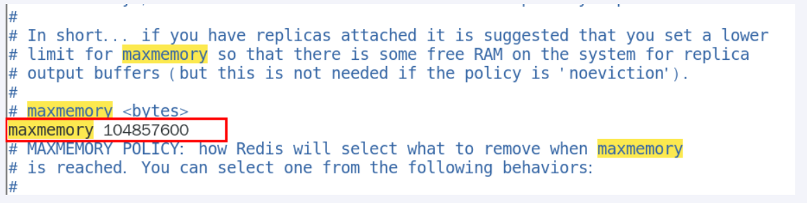

4.2、通过命令修改（当前生效）

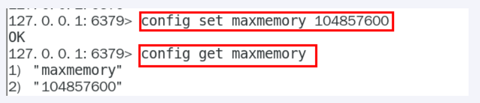

##### 5、什么命令可以查看redis的内存使用情况？

info memory

config get maxmemory

#### 10.2.2 如果打满了会怎么样？如果redis的内存使用超出了设置的最大值会怎么样？

可以通过修改配置，故意把最大值设为1个byte试试

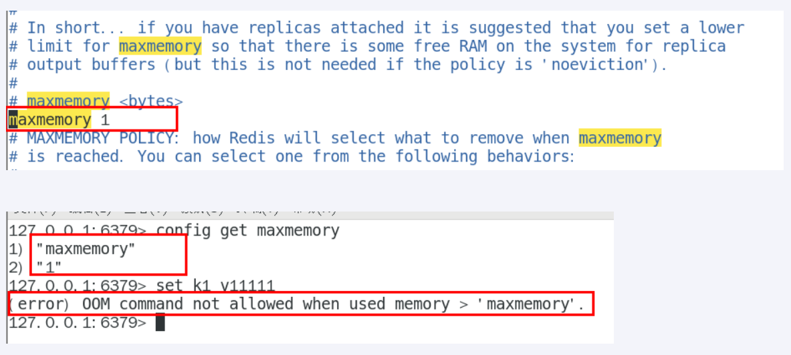

#### 10.2.3 结论

设置了maxmemory的值，假如redis的内存使用达到上限

没有加上过期时间就会导致数据写满maxmemory，为了避免类似的情况，下一节我们会讲解内存淘汰策略

### 10.3 往redis里写的数据是怎么没了的？它如何删除的？

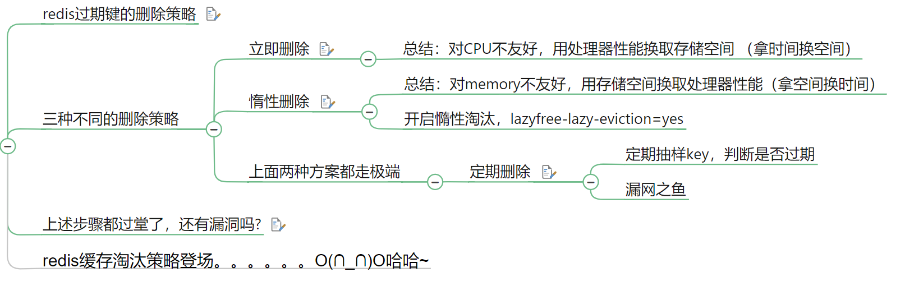

#### 10.3.1 redis的过期键的删除策略

**如果一个键是过期的，那它到了过期时间之后是不是马上就从内存中被被删除呢？**

- 如果回答yes，立即删除，你自己走还是面试官送你走？
- 如果不是，那过期后到底什么时候被删除呢？？是个什么操作？

#### 10.3.2 三种不同的删除策略

##### 1、主动删除（立即删除）

Redis不可能时时刻刻遍历所有被设置了生存时间的key，来检测数据是否已经到达过期时间，然后对它进行删除。

立即删除能保证内存中数据的最大新鲜度，因为它保证过期键值会在过期后马上被删除，其所占用的内存也会随之释放。但是立即删除对cpu是最不友好的。因为删除操作会占用cpu的时间，如果刚好碰上了cpu很忙的时候，比如正在做交集或排序等计算的时候，**就会给cpu造成额外的压力，让CPU心累，时时需要删除，忙死。。。。。。。**

**这会产生大量的性能消耗，同时也会影响数据的读取操作**。

**总结：对CPU不友好，用处理器的性能换取存储空间（？时间换空间）**

##### 2、惰性删除

数据到达过期时间，不做处理。等下次访问该数据时，

如果未过期，返回数据 ；

发现已过期，删除，返回不存在。

惰性删除策略的缺点是，**它对内存是最不友好的。**

如果一个键已经过期，而这个键又仍然保留在redis中，那么只要这个过期键不被删除，它所占用的内存就不会释放。

在使用惰性删除策略时，如果数据库中有非常多的过期键，而**这些过期键又恰好没有被访问到的话**，那么它们也许永远也不会被删除(除非用户手动执行FLUSHDB)，我们甚至可以将这种情况看作是一种内存泄漏–无用的垃圾数据占用了大量的内存，而服务器却不会自己去释放它们，这对于运行状态非常依赖于内存的Redis服务器来说,肯定不是一个好消息

**怎么开启惰性淘汰，redis.conf中将**

```properties
lazyfree-lazy-eviction=yes
```


**总结：对内存不友好，用内存换取处理器的性能（？空间换时间）**

##### 3、上面两种都走极端，中间策略：定期删除

**定期删除策略是前两种策略的折中：**

定期删除策略**每隔一段时间执行一次删除过期键操作**并通过限制删除操作执行时长和频率来减少删除操作对CPU时间的影响。

**举例：**

redis默认每隔100ms检查是否有过期的key，有过期key则删除。**注意**：redis不是每隔100ms将所有的key检查一次而是随机抽取进行检查(**如果每隔100ms,全部key进行检查，redis直接进去ICU**)。因此，如果只采用定期删除策略，会导致很多key到时间没有删除。

**总结：**

定期删除策略的难点是确定删除操作执行的时长和频率：如果删除操作执行得太频繁或者执行的时间太长，定期删除策略就会退化成立即删除策略，以至于将CPU时间过多地消耗在删除过期键上面。如果删除操作执行得太少，或者执行的时间太短，定期删除策略又会和惰性删除束略一样，出现浪费内存的情况。因此，如果采用定期删除策略的话，服务器必须根据情况，合理地设置删除操作的**执行时长和执行频率**。

#### 10.3.3 经过了上述的步骤，还有漏网之鱼吗？

**1、定期删除时，从来没有被抽查到**

**2、惰性删除时，也从来没有被点中使用过**

上述两个步骤======> 大量过期的key堆积在内存中，导致redis内存空间紧张或者很快耗尽

必须要有一个更好的兜底方案......

### 10.4 redis缓存淘汰策略

#### 10.4.1 redis配置文件

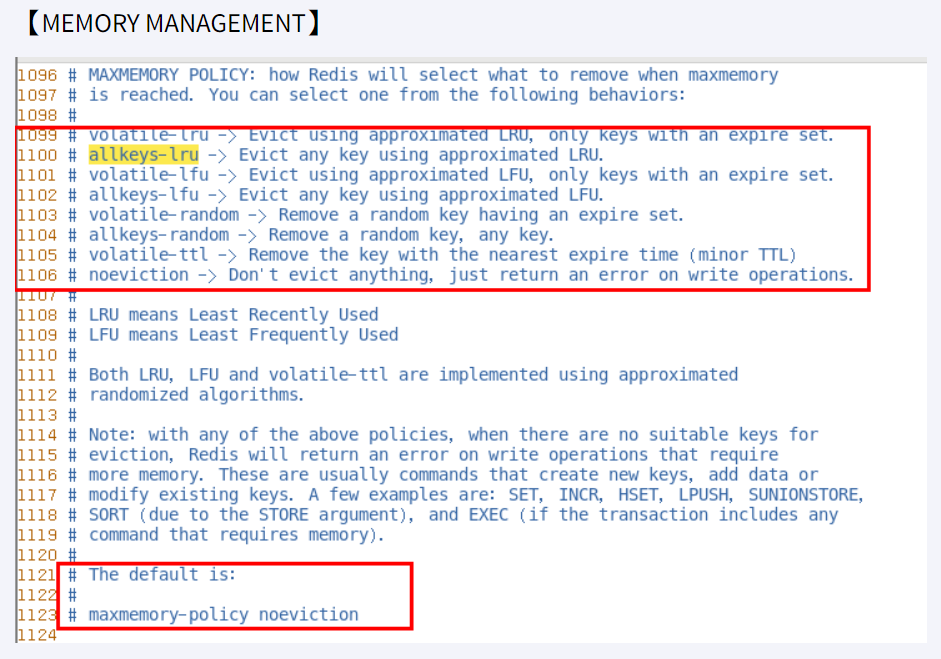

#### 10.4.2 lru和lfu算法的区别是什么


**区别**

LRU：**最近最少使用**页面置换算法，淘汰最长时间未被使用的页面，看页面最后一次被使用到发生调度的时间长短，首先淘汰最长时间未被使用的页面。

LFU：**最近最不常用**页面置换算法，淘汰一定时期内被访问次数最少的页，看一定时间段内页面被使用的频率，淘汰一定时期内被访问次数最少的页

**举个栗子**

某次时期Time为10分钟,如果每分钟进行一次调页,主存块为3,若所需页面走向为2 1 2 1 2 3 4

假设到页面4时会发生缺页中断

若按LRU算法,应换页面1(1页面最久未被使用)，但按LFU算法应换页面3(十分钟内,页面3只使用了一次)

可见LRU关键是看页面最后一次被使用到发生调度的时间长短,而LFU关键是看一定时间段内页面被使用的频率!


#### 10.4.3 有哪些（以redis7版本为例）

1. **noevcition**：禁止驱逐，表示即使内存达到上限也不进行置换，所以能引起内存增加的命令都会返回OOM error
2. **allkeys-lru**：对所有的key使用LRU算法进行删除，优先删除掉最近最不经常使用的key，用以保存新的数据
3. **volatile-lru**：对所有设置了过期时间的key进行LRU算法进行删除
4. **allkeys-random**：对所有的key进行随机删除
5. **volatile-random**：对所有设置了过期时间的key随机删除
6. **volatile-ttl**：删除掉马上要过期的key
7. **allkeys-lfu**：对所有的key使用LFU算法进行删除，即从中挑选最近最不经常使用的key（主要强调使用频次）
8. **volatile-lfu**：对设置了过期时间的key进行LFU算法进行删除。

#### 10.4.4 上面总结

- 2 * 4 得 8
- 2个纬度
  - 所有的key
  - 设置了过期时间的key
- 4个方面
  - `LRU`
  - `LFU`
  - `random`
  - `ttl`
- 8个选项
  - `lru`，`lfu`，`random`是2个纬度都有
  - `ttl`只能是设置了过期时间的key才有
  - 上面已经有7个了，还有一个默认的`noevcition`

#### 10.4.5 你平时用哪一种

- 在所有的key都是最近最经常使用的话，那么就选择allkeys-lru 进行置换最近最不经常使用的key，如果你不确定使用哪种策略，那么推荐使用allkeys-lru
- 如果所有的key的访问概率都是差不多的，那么就可以选用allkeys-random策略去置换数据
- 如果对数据有足够的了解，能够为key指定hint（通过expire/ttl指定），那么可以选择volatile-ttl进行置换

#### 10.4.6 如何配置、修改

- 直接使用config命令

- 在redis.config配置文件中修改

### 10.5 redis缓存淘汰策略配置性能建议

避免存储**bigKey**

开启惰性淘汰，

```properties
lazyfree-lazy-eviction=yes
```


## 11 Redis的五大数据结构的底层源码解读


## 12 Redis为什么这么快？高性能设计之epoll和IO多路复用深度解析


## 13 终章&总结