# day02-MyBatis

# 学习目标

- [ ] 理解Mybatis连接池与事务操作
- [ ] 掌握Mybatis动态SQL
- [ ] 掌握Mybatis多表关联查询
- [ ] 掌握Mybatis多对多关系


# 第一章-日志【会用就可以】

## 知识点-日志的使用

### 1.目标

​	我们在使用MyBatis的时候, 其实MyBatis框架会打印一些必要的日志信息, 在开发阶段这些日志信息对我们分析问题,理解代码的执行是特别有帮助的; 包括项目上线之后,我们也可以收集项目的错误日志到文件里面去;  所有我们采用专门的日志系统来处理.

### 2.步骤

1. 导入坐标
2. 拷贝日志配置文件到项目

### 3.讲解

- 导入坐标

```xml
<!-- log start -->
<dependency>
    <groupId>log4j</groupId>
    <artifactId>log4j</artifactId>
    <version>1.2.12</version>
</dependency>

<dependency>
    <groupId>org.slf4j</groupId>
    <artifactId>slf4j-api</artifactId>
    <version>1.6.6</version>
</dependency>

<dependency>
    <groupId>org.slf4j</groupId>
    <artifactId>slf4j-log4j12</artifactId>
    <version>1.6.6</version>
</dependency>
```

- 拷贝log4j.properties到resources目录

```properties
##设置日志记录到控制台的方式
log4j.appender.std=org.apache.log4j.ConsoleAppender
log4j.appender.std.Target=System.err
log4j.appender.std.layout=org.apache.log4j.PatternLayout
log4j.appender.std.layout.ConversionPattern=%d{yyyy-MM-dd HH:mm:ss} %5p %c{1}:%L - %m%n

##设置日志记录到文件的方式
log4j.appender.file=org.apache.log4j.FileAppender
log4j.appender.file.File=mylog.txt
log4j.appender.file.layout=org.apache.log4j.PatternLayout
log4j.appender.file.layout.ConversionPattern=%d{ABSOLUTE} %5p %c{1}:%L - %m%n

##日志输出的级别，以及配置记录方案
log4j.rootLogger= info,std,file	
```

  级别:error > warn > info>debug>trace  

### 4.小结

1. 日志就是一个工具
   + 添加坐标
   + 拷贝log4j.properties到resources目录
2. 配置文件一般的配置
   + 开发阶段:  log4j.rootLogger= debug,std,file	
   + 上线之后:  log4j.rootLogger= error ,file	


# 第二章-Mybatis 连接池与事务

## 知识点-Mybatis 的连接池技术【了解】

### 1.目标

​	我们在前面的 WEB 课程中也学习过类似的连接池技术，而在 Mybatis 中也有连接池技术，但是它采用的是自己的连接池技术 。在 Mybatis 的 SqlMapConfig.xml 配置文件中， 通过  `<dataSource type=”pooled”>`来实现 Mybatis 中连接池的配置.

### 2.路径

1. Mybatis 连接池的分类 
2. Mybatis 中数据源的配置
3. Mybatis 中 DataSource 配置分析 

### 3.讲解

#### 3.1Mybatis 连接池的分类 

+ 在 Mybatis 中我们将它的数据源 dataSource 分为以下几类 

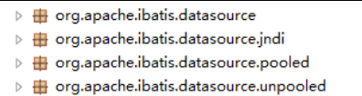

+ 可以看出 Mybatis 将它自己的数据源分为三类：

  +  UNPOOLED 不使用连接池的数据源
  +  POOLED 使用连接池的数据源
  +  JNDI 使用 JNDI 实现的数据源,不要的服务器获得的DataSource是不一样的. 注意: 只有是web项目或者Maven的war工程, 才能使用. 我们用的是tomcat, 用的连接池是dbcp.

  

+ 在这三种数据源中，我们目前阶段一般采用的是 POOLED 数据源（很多时候我们所说的数据源就是为了更好的管理数据库连接，也就是我们所说的连接池技术）,等后续学了Spring之后,会整合一些第三方连接池。 

#### 3.2Mybatis 中数据源的配置 

+ 我们的数据源配置就是在 SqlMapConfig.xml 文件中， 具体配置如下： 

  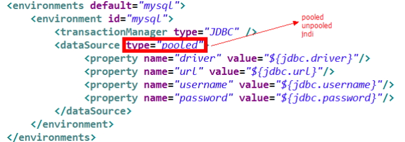

+ MyBatis 在初始化时，解析此文件，根据`<dataSource>`的 type 属性来创建相应类型的的数据源DataSource，即：

  ​	type=”POOLED”： MyBatis 会创建 PooledDataSource 实例, 使用连接池
  ​	type=”UNPOOLED” ： MyBatis 会创建 UnpooledDataSource 实例, 没有使用的,只有一个连接对象的
  ​	type=”JNDI”： MyBatis 会从 JNDI 服务上查找 DataSource 实例，然后返回使用. 只有在web项目里面才有的,用的是服务器里面的.  默认会使用tomcat里面的dbcp

#### 3.3Mybatis 中 DataSource 配置分析 

+ 代码,在21行加一个断点, 当代码执行到21行时候,我们根据不同的配置(POOLED和UNPOOLED)来分析DataSource

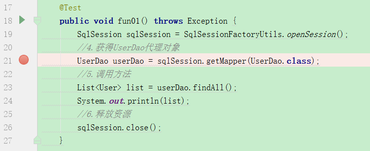

+ 当配置文件配置的是type=”POOLED”, 可以看到数据源连接信息

  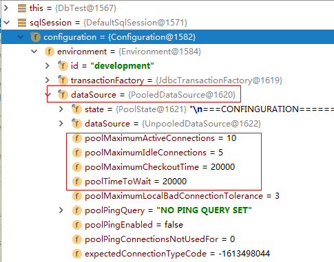


+ 当配置文件配置的是type=”UNPOOLED”, 没有使用连接池

  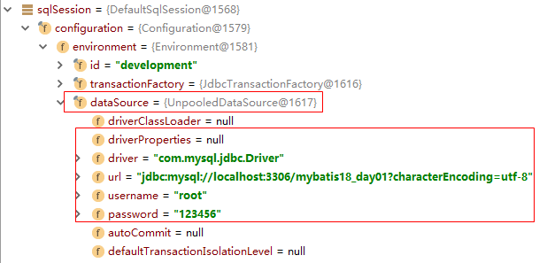

### 4.小结

1. 配置

```
type="POOLED"  使用连接池(MyBatis内置的)
type="UNPOOLED" 不使用连接池
```

2. 后面做项目, 工作里面的连接池, 我们都是使用的第三方的(C3P0,Druid,光连接池), 都有让Spring管理.此章节只做了解


## 知识点-Mybatis 的事务控制 【了解】

### 1.目标

- [ ] 了解MyBatis事务操作

### 2.路径

1. JDBC 中事务的回顾
2. Mybatis 中事务提交方式 
3. Mybatis 自动提交事务的设置

### 3.讲解

#### 3.1JDBC 中事务的回顾 

​	在 JDBC 中我们可以通过手动方式将事务的提交改为手动方式，通过 setAutoCommit()方法就可以调整。通过 JDK 文档，我们找到该方法如下： 

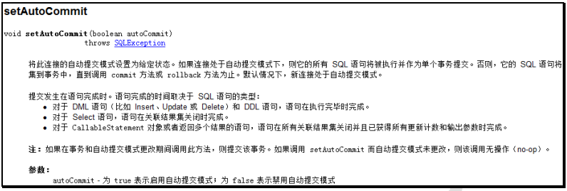

​	那么我们的 Mybatis 框架因为是对 JDBC 的封装，所以 Mybatis 框架的事务控制方式，本身也是用 JDBC的 setAutoCommit()方法来设置事务提交方式的。 

#### 3.2Mybatis 中事务提交方式 

+ Mybatis 中事务的提交方式，本质上就是调用 JDBC 的 setAutoCommit()来实现事务控制。我们运行之前所写的代码： 

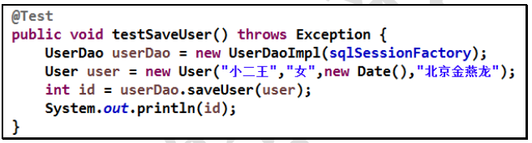

+ userDao 所调用的 saveUser()方法如下： 

  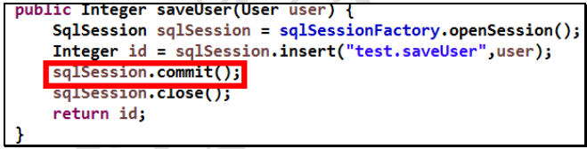

+ 观察在它在控制台输出的结果： 

  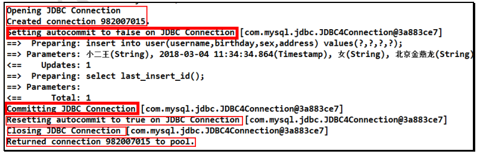

  ​	这是我们的 Connection 的整个变化过程， 通过分析我们能够发现之前的 CUD操作过程中，我们都要手动进行事务的提交，原因是 setAutoCommit()方法，在执行时它的值被设置为 false 了，所以我们在CUD 操作中，必须通过 sqlSession.commit()方法来执行提交操作。 

#### 3.3 Mybatis 自动提交事务的设置 

​	通过上面的研究和分析，现在我们一起思考，为什么 CUD 过程中必须使用 sqlSession.commit()提交事务？主要原因就是在连接池中取出的连接，都会将调用 connection.setAutoCommit(false)方法，这样我们就必须使用 sqlSession.commit()方法，相当于使用了 JDBC 中的 connection.commit()方法实现事务提交。明白这一点后，我们现在一起尝试不进行手动提交，一样实现 CUD 操作。 

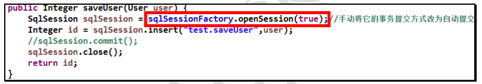

​	我们发现，此时事务就设置为自动提交了，同样可以实现 CUD 操作时记录的保存。虽然这也是一种方式，但就编程而言，设置为自动提交方式为 false 再根据情况决定是否进行提交，这种方式更常用。因为我们可以根据业务情况来决定提交是否进行提交。 

### 4.小结

1. MyBatis的事务使用的是JDBC事务策略. 
   + 如果执行的是写的操作
     + 需要手动提交
     + 获得sqlSession()的时候就直接设置为自动提交
2. 后面做项目, 工作里面的事务管理, 基本上都是交给Spring管理. 所以此章节只做了解

# 第三章-Mybatis 映射文件的 SQL 深入【重点】 

​	Mybatis 的映射文件中，前面我们的 SQL 都是比较简单的，有些时候业务逻辑复杂时，我们的 SQL是动态变化的，此时在前面的学习中我们的 SQL 就不能满足要求了。

## 知识点-动态 SQL 之if标签 

### 1.目标

​	我们根据实体类的不同取值，使用不同的 SQL 语句来进行查询。

​	比如在 id 如果不为空时可以根据 id查询，如果 username 不同空时还要加入用户名作为条件。这种情况在我们的多条件组合查询中经常会碰到

### 2.讲解

+ QueryVo.java

```java
public class QueryVo {
    private User user;
}
```

+ UserDao.java

```java
public interface UserDao {
    /**
     * 复杂参数查询
     * @return
     */
    List<User> findByQueryVo(QueryVo queryVo);
}
```

+ UserDao.xml

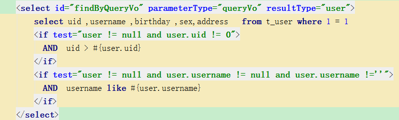

+ 测试

```java
    @Test
    public void fun01() throws Exception {
        SqlSession sqlSession = SqlSessionFactoryUtils.openSession();
        UserDao userDao = sqlSession.getMapper(UserDao.class);

        QueryVo queryVo = new QueryVo();
        User user = new User();
        user.setUid(8);
        user.setUsername("王%");
        queryVo.setUser(user);

        List<User> list = userDao.findByQueryVo(queryVo);
        System.out.println(list);

        sqlSession.close();
    }
```

### 3.小结

1. if适合动态多条件查询
2. 注意事项

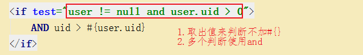 

## 知识点-动态 SQL 之where标签 

### 1.目标

​	为了简化上面 where 1=1 的条件拼装，我们可以采用`<where>`标签来简化开发。

### 2.讲解

修改 UserDao.xml 映射文件如下： 


> 注意: <where />可以自动处理第一个 and 

### 3.小结

1. where标签用在自己写sql语句的时候 where关键字不好处理的情况,代替where '1' = '1'
2. <where />可以自动处理第一个 and , 建议全部加上and

## 知识点-动态标签之foreach标签  

### 1.目标

- [ ] 掌握foreach标签的使用

### 2.讲解

#### 2.1需求一

+ 传入多个 id 查询用户信息，用下边sql 实现：

```
select uid ,username ,birthday ,sex, address from t_user WHERE username LIKE '张%' AND (uid =1 OR uid =2 OR uid=6)
```

这样我们在进行范围查询时，就要将一个集合中的值，作为参数动态添加进来。这样我们将如何进行参数的传递？ 

+ 在QueryVo.java 添加一个集合

```java
public class QueryVo {
    private User user;
    private List<Integer> ids;
	...
}
```

+ UserDao.java

```java
public interface UserDao {

    /**
     * 区间查询
     * @param queryVo
     * @return
     */
    List<User> findRange(QueryVo queryVo);
}
```

+ UserDao.xml

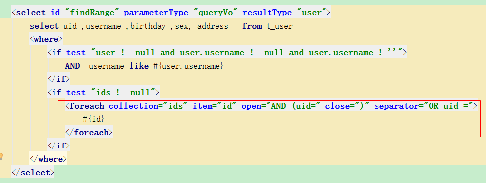


+ 测试

```java
    @Test
    public void fun02() throws Exception {
        SqlSession sqlSession = SqlSessionFactoryUtils.openSession();
        UserDao userDao = sqlSession.getMapper(UserDao.class);

        QueryVo queryVo = new QueryVo();
        List<Integer> ids = new ArrayList<Integer>();
        ids.add(1);
        ids.add(5);
        ids.add(9);
        queryVo.setIds(ids);

        List<User> list = userDao.findRange(queryVo);


        System.out.println(list);

        sqlSession.close();
    }
```

#### 2.2需求二

+ 传入多个 id 查询用户信息，用下边sql 实现：

```
select uid ,username ,birthday ,sex, address from t_user WHERE username LIKE '张%' AND  uid IN (1,7,10,18)
```

+ UserDao.java

```java
public interface UserDao {
    /**
     * 区间查询
     * @param queryVo
     * @return
     */
    List<User> findRange02(QueryVo queryVo);
}
```

+ UserDao.xml

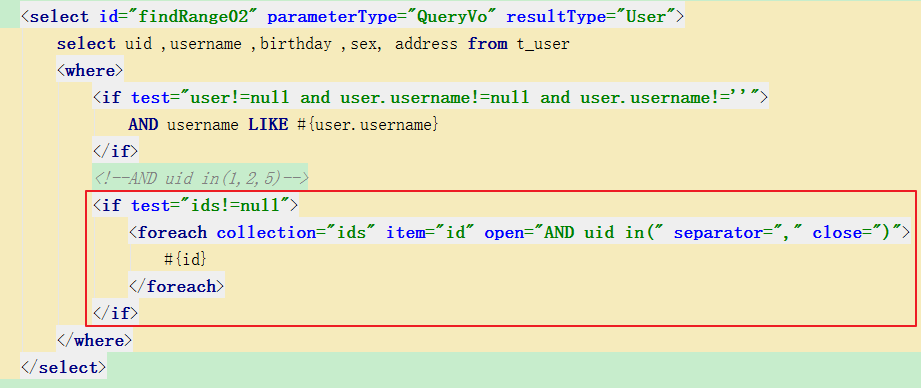

+ 测试

```java
    @Test
    public void fun03() throws Exception {
        SqlSession sqlSession = SqlSessionFactoryUtils.openSession();
        UserDao userDao = sqlSession.getMapper(UserDao.class);

        QueryVo queryVo = new QueryVo();
        List<Integer> ids = new ArrayList<Integer>();
        ids.add(1);
        ids.add(5);
        ids.add(9);
        queryVo.setIds(ids);

        List<User> list = userDao.findRange02(queryVo);


        System.out.println(list);

        sqlSession.close();
    }

```

### 3.小结

foreach标签用于遍历集合，它的属性：

+ collection:代表要遍历的集合元素，注意编写时不要写#{}
+ open:代表语句的开始部分(一直到动态的值之前)
+ close:代表语句结束部分
+ item:代表遍历集合的每个元素，生成的变量名(随便取)
+ sperator:代表分隔符 (动态值之间的分割)

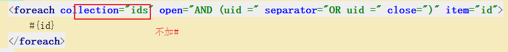 


## 知识点-SQL 片段 

### 1.目标

​	Sql 中可将重复的 sql 提取出来，使用时用 include 引用即可，最终达到 sql 重用的目的。我们先到 UserDao.xml 文件中使用`<sql>`标签，定义出公共部分.

### 2.讲解

+ 使用sql标签抽取

```xml
<sql id="selectUserId">
  	select uid ,username ,birthday ,sex, address   from t_user
</sql>
```

+ 使用include标签引入使用

```xml
    <select id="findRange02" parameterType="queryVo" resultType="user">
        <include refid="selectUserId"></include>
        <where>
            <if test="user != null and user.username != null and user.username !=''">
                AND  username like #{user.username}
            </if>
            <if test="ids != null">
                <foreach collection="ids" item="id" open="uid IN (" close=")" separator="," >
                    #{id}
                </foreach>
            </if>
        </where>
    </select>
```

+ 整个图示

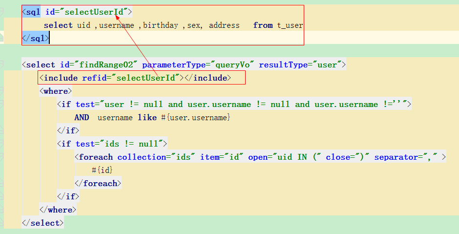

### 3.小结

1. sql标签可以把公共的sql语句进行抽取, 再使用include标签引入. 好处:好维护, 提示效率


# 第四章-Mybatis 的多表关联查询【重点】 

## 知识点-一(多)对一

### 1.需求

​	本次案例以简单的用户和账户的模型来分析 Mybatis 多表关系。用户为 User 表，账户为Account 表。一个用户（User）可以有多个账户（Account）,但是一个账户(Account)只能属于一个用户(User)。具体关系如下： 

 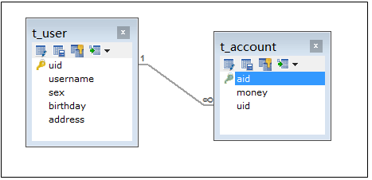

​	==查询所有账户信息， 关联查询账户的用户名和地址==。

​	因为一个账户信息只能供某个用户使用，所以从查询账户信息出发关联查询用户信息为一对一查询。

- 数据库的准备

```java
CREATE TABLE t_account(
		aid INT PRIMARY KEY auto_increment,
		money DOUBLE,
		uid INT
);
ALTER TABLE t_account ADD FOREIGN KEY(uid) REFERENCES t_user(uid);

INSERT INTO `t_account` VALUES (null, '1000', '1');
INSERT INTO `t_account` VALUES (null, '2000', '1');
INSERT INTO `t_account` VALUES (null, '1000', '2');
INSERT INTO `t_account` VALUES (null, '2000', '2');
INSERT INTO `t_account` VALUES (null, '800', '3');
```

### 2.分析

+ 查询语句

```
 SELECT a.*,u.username,u.address FROM t_account a,t_user u WHERE a.uid = u.uid
```

### 3.实现

#### 3.1方式一【了解】

+ Account.java

```java
public class Account {
	private Integer aid;
	private Integer uid;
	private Double money;
}
```

+ AccountCustom.java

  ​	为了能够封装上面 SQL 语句的查询结果，定义 AccountCustom类中要包含账户信息同时还要包含用户信息，所以我们要在定义 AccountCustom类时可以继承 Account类 

```java
public class AccountCustom extends  Account {
    private String username;
    private String address;
 
	//get/set
}
```

+ AccountDao.java

```java
public interface AccountDao {
    /**
     * 查询账户信息(包含用户信息)
     * @return
     */
    List<AccountCustom> findAccountList();

}
```

+ AccountDao.xml

```xml
<mapper namespace="com.itheima.dao.AccountDao">
    <select id="findAccountList" resultType="AccountCustom">
        SELECT a.*,u.username,u.address FROM t_account a,t_user u WHERE a.uid = u.uid
    </select>
</mapper>
```

#### 3.2方式二【重点】

+ 修改Account.java

  在 Account 类中加入 User类的对象作为 Account 类的一个属性。 

 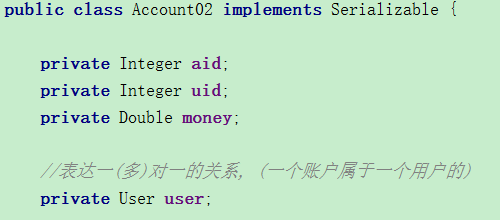

+ AccountDao.java

```java
public interface AccountDao {
    /**
     * 查询账户信息(包含用户信息)
     * @return
     */
    List<Account02> findAccountList02();

}
```

+ AccountDao.xml

```xml
    <select id="findAccountList02" resultMap="accountListMap">
        SELECT a.*,u.username,u.address FROM t_account a, t_user u WHERE a.uid = u.uid
    </select>
    
    <resultMap id="accountListMap" type="Account02">
        <id column="aid" property="aid"></id>
        <result column="money" property="money"></result>
        <result column="uid" property="uid"></result>
        <!--association用于关联加载的对象,property为需要加载对象,javaType为需要加载对应的类型-->
        <association property="user" javaType="User">
            <result column="username" property="username"></result>
            <result column="address" property="address"></result>
        </association>
    </resultMap>
```

### 4.小结

1. 表达关系:

   + 实体类里面:

   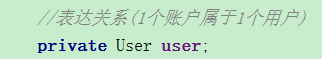 

   + 映射文件

   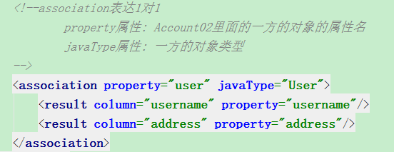 


## 知识点-一对多

### 1.需求

​		查询所有用户信息及用户关联的账户信息。

### 2.分析


​	分析： 用户信息和他的账户信息为一对多关系，并且查询过程中如果用户没有账户信息，此时也要将用户信息查询出来，我们想到了左外连接查询比较合适。 

+ sql语句

```mysql
SELECT u.*, a.aid, a.money  FROM t_user u LEFT OUTER JOIN t_account a ON u.uid = a.uid
```

### 3.实现

+ Account.java

```java
public class Account {
    private Integer aid;
    private Integer uid;
    private Double money;
}
```

+ User.java

  ​	为了能够让查询的 User 信息中，带有他的个人多个账户信息，我们就需要在 User 类中添加一个集合，
  用于存放他的多个账户信息，这样他们之间的关联关系就保存了。 

```java
public class User implements Serializable{
    private int uid;
    private String username;// 用户姓名
    private String sex;// 性别
    private Date birthday;// 生日
    private String address;// 地址

    //表达关系:1个用户对应多个账户
    private List<Account> accounts;
}
```

+ UserDao.java

```java
public interface UserDao {
    /**
     * 查询所有的用户对应的账户信息
     * @return
     */
    List<User> findUserAccountList();

}
```

+ UserDao.xml

```xml
<mapper namespace="com.itheima.dao.UserDao">
    <select id="findUserAccountList" resultMap="userAccountListMap">
        SELECT u.*, a.aid, a.money  FROM t_user u LEFT OUTER JOIN t_account a ON u.uid = a.uid
    </select>
    <resultMap id="userAccountListMap" type="user">
        <id property="uid" column="uid"></id>
        <result property="username" column="username"></result>
        <result property="sex" column="sex"></result>
        <result property="birthday" column="birthday"></result>
        <result property="address" column="address"></result>
        <!--加载多方数据,property属性:一方类里面List集合的属性名; ofType:List中的对象类型-->
        <collection property="accounts" ofType="Account">
            <result property="aid" column="aid"></result>
            <result property="money" column="money"></result>
        </collection>
    </resultMap>
</mapper>
```

### 4.小结

1. 语句, 建议使用外连接. 用户可以没有账户的, 但是用户信息需要查询出来, 账户的个数就为0

```
SELECT u.*, a.aid, a.money  FROM t_user u LEFT OUTER JOIN t_account a ON u.uid = a.uid
```

2. 表达关系

   + 实体类里面

   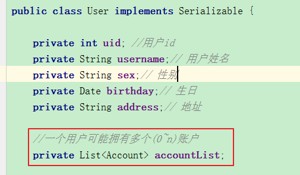 

   + 映射文件

    


## 知识点-多对多

### 1. 需求

​	通过前面的学习，我们使用 Mybatis 实现一对多关系的维护。多对多关系其实我们看成是双向的一对多关系。用户与角色的关系模型就是典型的多对多关系.

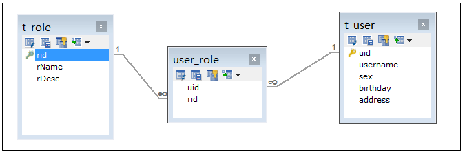

​	需求：实现查询所有角色对象并且加载它所分配的用户信息。 

+ 建表语句

```sql
CREATE TABLE t_role(
	rid INT PRIMARY KEY AUTO_INCREMENT,
	rName varchar(40),
	rDesc varchar(40)
);
INSERT INTO `t_role` VALUES (null, '校长', '负责学校管理工作');
INSERT INTO `t_role` VALUES (null, '副校长', '协助校长负责学校管理');
INSERT INTO `t_role` VALUES (null, '班主任', '负责班级管理工作');
INSERT INTO `t_role` VALUES (null, '教务处主任', '负责教学管理');
INSERT INTO `t_role` VALUES (null, '班主任组长', '负责班主任小组管理');


//中间表(关联表)
CREATE TABLE user_role(
	uid INT,
	rid INT
);

ALTER TABLE  user_role ADD FOREIGN KEY(uid) REFERENCES t_user(uid);
ALTER TABLE  user_role ADD FOREIGN KEY(rid) REFERENCES t_role(rid);

INSERT INTO `user_role` VALUES ('1', '1');
INSERT INTO `user_role` VALUES ('3', '3');
INSERT INTO `user_role` VALUES ('2', '3');
INSERT INTO `user_role` VALUES ('2', '5');
INSERT INTO `user_role` VALUES ('3', '4');
```

### 2.分析

​	查询角色我们需要用到 Role 表，但角色分配的用户的信息我们并不能直接找到用户信息，而是要通过中间表(USER_ROLE 表)才能关联到用户信息。
下面是实现的 SQL 语句： 

```sql
SELECT r.*, u.uid, u.username,u.sex,u.birthday,u.address FROM t_role r INNER JOIN user_role ur
ON r.rid = ur.rid INNER JOIN t_user u ON ur.uid = u.uid
或者
SELECT r.*, u.uid, u.username,u.sex,u.birthday,u.address FROM  t_role r, user_role ur, t_user u
WHERE r.rid = ur.rid AND ur.uid = u.uid
```

### 3.实现

+ User.java

```java
public class User implements Serializable{
    private int uid;
    private String username;// 用户姓名
    private String sex;// 性别
    private Date birthday;// 生日
    private String address;// 地址
}
```

+ Role.java

```java
public class Role {
    private Integer rid;
    private String rName;
    private String rDesc;

    //1个角色对应多个用户
    private List<User> users;
	
}
```

+ RoleDao.java

```java
public interface RoleDao {
    /**
     * 查询角色信息
     * @return
     */
    List<Role> findRoleList();
}
```

+ RoleDao.xml

```xml
<mapper namespace="com.itheima.dao.RoleDao">
    <select id="findRoleList" resultMap="roleListMap">
        SELECT r.*,u.username,u.sex,u.birthday, u.address FROM t_role r,user_role ur,t_user u WHERE r.rid = ur.rid AND ur.uid = u.uid
    </select>

    <resultMap id="roleListMap" type="role">
        <id column="rid" property="rid"></id>
        <result column="rName" property="rName"></result>
        <result column="rDesc" property="rDesc"></result>
        <collection property="users" ofType="user">
            <result property="username" column="username"></result>
            <result property="sex" column="sex"></result>
            <result property="birthday" column="birthday"></result>
            <result property="address" column="address"></result>
        </collection>

    </resultMap>
</mapper>
```

### 4.小结

1. 多对多本质就是两个1对多. 实现起来基本和1对多是一样的

2. 表达关系

   + 实体类

   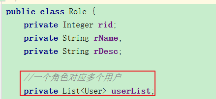 

   + 映射文件

   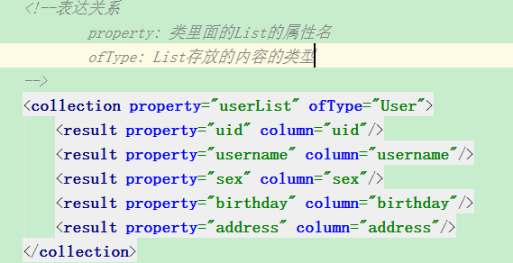 

## 扩展_代理源码

### 1.看源码

+ 找入口
+ 凭经验(不是看整个的, 觉得哪个方法有问题就看, 结合断点)

### 2.代理源码

1. 入口

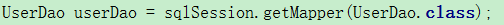 

2. 在入口代码这里加断点

# 总结

## 1.日志(<10分钟)

1. 导入坐标
2. 拷贝配置文件到项目

## 2.Mybatis 连接池与事务(<10分钟)

1. 知道怎么回事, 怎么配就可以了, 不需要深入研究

## 3.Mybatis 映射文件的 SQL 深入【重点】

1. if: 用在动态多条件查询
2. where: 代替where  '1' = '1'
3. foreach: 用在动态多条件查询, 针对集合,数组
4. sql和include: 把sql语句复用

## 4.Mybatis 的多表关联查询【重点】

1. 1对1
   + 一个pojo对象
   + association标签
2. 1对多
   + 一个List对象
   + collection标签
3. 多对多
   - 一个List对象
   - collection标签

