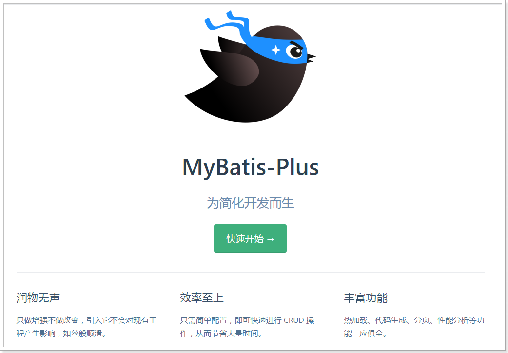
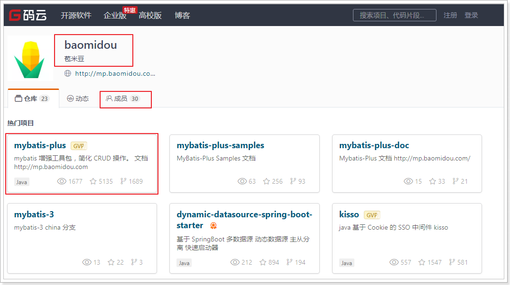
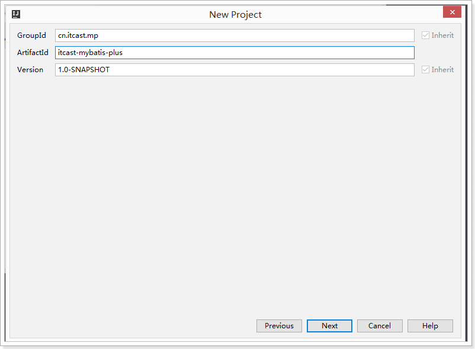
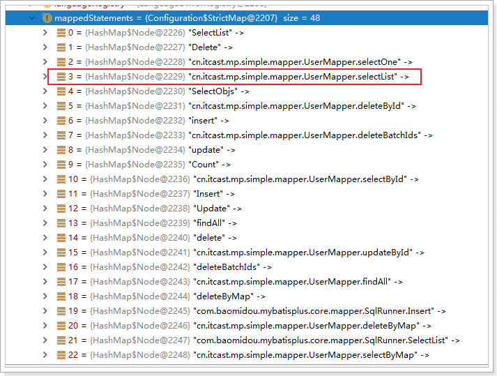
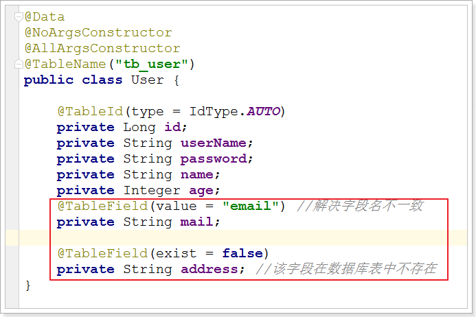
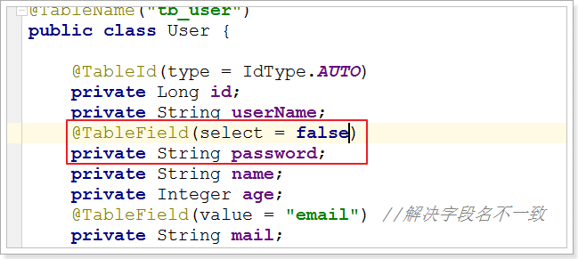

## 课程介绍

- 了解Mybatis-Plus
- 整合Mybatis-Plus
- 通用CRUD
- Mybatis-Plus的配置
- 条件构造器


## 1、了解Mybatis-Plus

### 1.1、Mybatis-Plus介绍

MyBatis-Plus（简称 MP）是一个 MyBatis 的增强工具，在 MyBatis 的基础上只做增强不做改变，为简化开发、提高效率而生。

官网：<https://mybatis.plus/>  或 <https://mp.baomidou.com/>




> **愿景**
>
> 我们的愿景是成为 MyBatis 最好的搭档，就像 魂斗罗 中的 1P、2P，基友搭配，效率翻倍。
>
> 

### 1.2、代码以及文档

文档地址：<https://mybatis.plus/guide/>

源码地址：<https://github.com/baomidou/mybatis-plus>

### 1.3、特性

- **无侵入**：只做增强不做改变，引入它不会对现有工程产生影响，如丝般顺滑
- **损耗小**：启动即会自动注入基本 CURD，性能基本无损耗，直接面向对象操作
- **强大的 CRUD 操作**：内置通用 Mapper、通用 Service，仅仅通过少量配置即可实现单表大部分 CRUD 操作，更有强大的条件构造器，满足各类使用需求
- **支持 Lambda 形式调用**：通过 Lambda 表达式，方便的编写各类查询条件，无需再担心字段写错
- **支持多种数据库**：支持 MySQL、MariaDB、Oracle、DB2、H2、HSQL、SQLite、Postgre、SQLServer2005、SQLServer 等多种数据库
- **支持主键自动生成**：支持多达 4 种主键策略（内含分布式唯一 ID 生成器 - Sequence），可自由配置，完美解决主键问题
- **支持 XML 热加载**：Mapper 对应的 XML 支持热加载，对于简单的 CRUD 操作，甚至可以无 XML 启动
- **支持 ActiveRecord 模式**：支持 ActiveRecord 形式调用，实体类只需继承 Model 类即可进行强大的 CRUD 操作
- **支持自定义全局通用操作**：支持全局通用方法注入（ Write once, use anywhere ）
- **支持关键词自动转义**：支持数据库关键词（order、key......）自动转义，还可自定义关键词
- **内置代码生成器**：采用代码或者 Maven 插件可快速生成 Mapper 、 Model 、 Service 、 Controller 层代码，支持模板引擎，更有超多自定义配置等您来使用
- **内置分页插件**：基于 MyBatis 物理分页，开发者无需关心具体操作，配置好插件之后，写分页等同于普通 List 查询
- **内置性能分析插件**：可输出 Sql 语句以及其执行时间，建议开发测试时启用该功能，能快速揪出慢查询
- **内置全局拦截插件**：提供全表 delete 、 update 操作智能分析阻断，也可自定义拦截规则，预防误操作
- **内置 Sql 注入剥离器**：支持 Sql 注入剥离，有效预防 Sql 注入攻击

### 1.4、架构


### 1.5、作者

Mybatis-Plus是由baomidou（苞米豆）组织开发并且开源的，目前该组织大概有30人左右。

码云地址：<https://gitee.com/organizations/baomidou>



## 2、快速开始

对于Mybatis整合MP有常常有三种用法，分别是Mybatis+MP、Spring+Mybatis+MP、Spring Boot+Mybatis+MP。

### 2.1、创建数据库以及表

 								

~~~sql
-- 创建测试表
CREATE TABLE `tb_user` (
  `id` bigint(20) NOT NULL AUTO_INCREMENT COMMENT '主键ID',
  `user_name` varchar(20) NOT NULL COMMENT '用户名',
  `password` varchar(20) NOT NULL COMMENT '密码',
  `name` varchar(30) DEFAULT NULL COMMENT '姓名',
  `age` int(11) DEFAULT NULL COMMENT '年龄',
  `email` varchar(50) DEFAULT NULL COMMENT '邮箱',
  PRIMARY KEY (`id`)
) ENGINE=InnoDB AUTO_INCREMENT=1 DEFAULT CHARSET=utf8;

-- 插入测试数据
INSERT INTO `tb_user` (`id`, `user_name`, `password`, `name`, `age`, `email`) VALUES ('1', 'zhangsan', '123456', '张三', '18', 'test1@itcast.cn');
INSERT INTO `tb_user` (`id`, `user_name`, `password`, `name`, `age`, `email`) VALUES ('2', 'lisi', '123456', '李四', '20', 'test2@itcast.cn');
INSERT INTO `tb_user` (`id`, `user_name`, `password`, `name`, `age`, `email`) VALUES ('3', 'wangwu', '123456', '王五', '28', 'test3@itcast.cn');
INSERT INTO `tb_user` (`id`, `user_name`, `password`, `name`, `age`, `email`) VALUES ('4', 'zhaoliu', '123456', '赵六', '21', 'test4@itcast.cn');
INSERT INTO `tb_user` (`id`, `user_name`, `password`, `name`, `age`, `email`) VALUES ('5', 'sunqi', '123456', '孙七', '24', 'test5@itcast.cn');
~~~

### 2.2、创建工程



导入依赖：

~~~xml
<?xml version="1.0" encoding="UTF-8"?>
<project xmlns="http://maven.apache.org/POM/4.0.0"
         xmlns:xsi="http://www.w3.org/2001/XMLSchema-instance"
         xsi:schemaLocation="http://maven.apache.org/POM/4.0.0 http://maven.apache.org/xsd/maven-4.0.0.xsd">
    <modelVersion>4.0.0</modelVersion>

    <groupId>cn.itcast.mp</groupId>
    <artifactId>itcast-mybatis-plus</artifactId>
    <version>1.0-SNAPSHOT</version>
    <modules>
        <module>itcast-mybatis-plus-simple</module>
    </modules>
    <packaging>pom</packaging>

    <dependencies>
        <!-- mybatis-plus插件依赖 -->
        <dependency>
            <groupId>com.baomidou</groupId>
            <artifactId>mybatis-plus</artifactId>
            <version>3.1.1</version>
        </dependency>
        <!-- MySql -->
        <dependency>
            <groupId>mysql</groupId>
            <artifactId>mysql-connector-java</artifactId>
            <version>5.1.47</version>
        </dependency>
        <!-- 连接池 -->
        <dependency>
            <groupId>com.alibaba</groupId>
            <artifactId>druid</artifactId>
            <version>1.0.11</version>
        </dependency>
        <!--简化bean代码的工具包-->
        <dependency>
            <groupId>org.projectlombok</groupId>
            <artifactId>lombok</artifactId>
            <optional>true</optional>
            <version>1.18.4</version>
        </dependency>
        <dependency>
            <groupId>junit</groupId>
            <artifactId>junit</artifactId>
            <version>4.12</version>
        </dependency>
        <dependency>
            <groupId>org.slf4j</groupId>
            <artifactId>slf4j-log4j12</artifactId>
            <version>1.6.4</version>
        </dependency>
    </dependencies>

    <build>
        <plugins>
            <plugin>
                <groupId>org.apache.maven.plugins</groupId>
                <artifactId>maven-compiler-plugin</artifactId>
                <configuration>
                    <source>1.8</source>
                    <target>1.8</target>
                </configuration>
            </plugin>
        </plugins>
    </build>

</project>
~~~

### 2.3、Mybatis + MP

下面演示，通过纯Mybatis与Mybatis-Plus整合。

#### 2.3.1、创建子Module

~~~xml
<?xml version="1.0" encoding="UTF-8"?>
<project xmlns="http://maven.apache.org/POM/4.0.0"
         xmlns:xsi="http://www.w3.org/2001/XMLSchema-instance"
         xsi:schemaLocation="http://maven.apache.org/POM/4.0.0 http://maven.apache.org/xsd/maven-4.0.0.xsd">
    <parent>
        <artifactId>itcast-mybatis-plus</artifactId>
        <groupId>cn.itcast.mp</groupId>
        <version>1.0-SNAPSHOT</version>
    </parent>
    <modelVersion>4.0.0</modelVersion>
    <packaging>jar</packaging>

    <artifactId>itcast-mybatis-plus-simple</artifactId>

</project>
~~~

log4j.properties：

```properties
log4j.rootLogger=DEBUG,A1

log4j.appender.A1=org.apache.log4j.ConsoleAppender
log4j.appender.A1.layout=org.apache.log4j.PatternLayout
log4j.appender.A1.layout.ConversionPattern=[%t] [%c]-[%p] %m%n
```

#### 2.3.2、Mybatis实现查询User

> **第一步，编写mybatis-config.xml文件：**

~~~xml
<?xml version="1.0" encoding="UTF-8" ?>
<!DOCTYPE configuration
        PUBLIC "-//mybatis.org//DTD Config 3.0//EN"
        "http://mybatis.org/dtd/mybatis-3-config.dtd">
<configuration>
    <environments default="development">
        <environment id="development">
            <transactionManager type="JDBC"/>
            <dataSource type="POOLED">
                <property name="driver" value="com.mysql.jdbc.Driver"/>
                <property name="url" value="jdbc:mysql://127.0.0.1:3306/mp?useUnicode=true&amp;characterEncoding=utf8&amp;autoReconnect=true&amp;allowMultiQueries=true&amp;useSSL=false"/>
                <property name="username" value="root"/>
                <property name="password" value="root"/>
            </dataSource>
        </environment>
    </environments>
    <mappers>
        <mapper resource="UserMapper.xml"/>
    </mappers>
</configuration>
~~~

> **第二步，编写User实体对象：（这里使用lombok进行了进化bean操作）**

~~~java
package cn.itcast.mp.simple.pojo;

import lombok.AllArgsConstructor;
import lombok.Data;
import lombok.NoArgsConstructor;

@Data
@NoArgsConstructor
@AllArgsConstructor
public class User {

    private Long id;
    private String userName;
    private String password;
    private String name;
    private Integer age;
    private String email;
}

~~~

> **第三步，编写UserMapper接口：**

~~~java
package cn.itcast.mp.simple.mapper;

import cn.itcast.mp.simple.pojo.User;

import java.util.List;

public interface UserMapper {

    List<User> findAll();

}

~~~

> **第四步，编写UserMapper.xml文件：**

~~~xml
<?xml version="1.0" encoding="UTF-8" ?>
<!DOCTYPE mapper
        PUBLIC "-//mybatis.org//DTD Mapper 3.0//EN"
        "http://mybatis.org/dtd/mybatis-3-mapper.dtd">
<mapper namespace="cn.itcast.mp.simple.mapper.UserMapper">

    <select id="findAll" resultType="cn.itcast.mp.simple.pojo.User">
      select * from tb_user
    </select>

</mapper>
~~~

> **第五步，编写TestMybatis测试用例：**

~~~java
package cn.itcast.mp.simple;

import cn.itcast.mp.simple.mapper.UserMapper;
import cn.itcast.mp.simple.pojo.User;
import org.apache.ibatis.io.Resources;
import org.apache.ibatis.session.SqlSession;
import org.apache.ibatis.session.SqlSessionFactory;
import org.apache.ibatis.session.SqlSessionFactoryBuilder;
import org.junit.Test;

import java.io.InputStream;
import java.util.List;

public class TestMybatis {

    @Test
    public void testUserList() throws Exception{
        String resource = "mybatis-config.xml";
        InputStream inputStream = Resources.getResourceAsStream(resource);
        SqlSessionFactory sqlSessionFactory = new SqlSessionFactoryBuilder().build(inputStream);
        SqlSession sqlSession = sqlSessionFactory.openSession();

        UserMapper userMapper = sqlSession.getMapper(UserMapper.class);
        List<User> list = userMapper.findAll();
        for (User user : list) {
            System.out.println(user);
        }

    }

}

~~~

测试结果：

~~~shell
[main] [cn.itcast.mp.simple.mapper.UserMapper.findAll]-[DEBUG] ==> Parameters: 
[main] [cn.itcast.mp.simple.mapper.UserMapper.findAll]-[DEBUG] <==      Total: 5
User(id=1, userName=null, password=123456, name=张三, age=18, email=test1@itcast.cn)
User(id=2, userName=null, password=123456, name=李四, age=20, email=test2@itcast.cn)
User(id=3, userName=null, password=123456, name=王五, age=28, email=test3@itcast.cn)
User(id=4, userName=null, password=123456, name=赵六, age=21, email=test4@itcast.cn)
User(id=5, userName=null, password=123456, name=孙七, age=24, email=test5@itcast.cn)
~~~

#### 2.3.3、Mybatis+MP实现查询User

> **第一步，将UserMapper继承BaseMapper，将拥有了BaseMapper中的所有方法：**

~~~java
package cn.itcast.mp.simple.mapper;

import cn.itcast.mp.simple.pojo.User;
import com.baomidou.mybatisplus.core.mapper.BaseMapper;

import java.util.List;

public interface UserMapper extends BaseMapper<User> {

    List<User> findAll();

}

~~~

第二步，使用MP中的MybatisSqlSessionFactoryBuilder进程构建：

~~~java
package cn.itcast.mp.simple;

import cn.itcast.mp.simple.mapper.UserMapper;
import cn.itcast.mp.simple.pojo.User;
import com.baomidou.mybatisplus.core.MybatisSqlSessionFactoryBuilder;
import org.apache.ibatis.io.Resources;

import org.apache.ibatis.session.SqlSession;
import org.apache.ibatis.session.SqlSessionFactory;
import org.apache.ibatis.session.SqlSessionFactoryBuilder;
import org.junit.Test;

import java.io.InputStream;
import java.util.List;

public class TestMybatisPlus {

    @Test
    public void testUserList() throws Exception{
        String resource = "mybatis-config.xml";
        InputStream inputStream = Resources.getResourceAsStream(resource);
        //这里使用的是MP中的MybatisSqlSessionFactoryBuilder
        SqlSessionFactory sqlSessionFactory = new MybatisSqlSessionFactoryBuilder().build(inputStream);
        SqlSession sqlSession = sqlSessionFactory.openSession();

        UserMapper userMapper = sqlSession.getMapper(UserMapper.class);

        // 可以调用BaseMapper中定义的方法
        List<User> list = userMapper.selectList(null);
        for (User user : list) {
            System.out.println(user);
        }

    }

}

~~~

运行报错：


解决：在User对象中添加@TableName，指定数据库表名

 

测试：

~~~shell
[main] [cn.itcast.mp.simple.mapper.UserMapper.selectList]-[DEBUG] ==>  Preparing: SELECT id,user_name,password,name,age,email FROM tb_user 
[main] [cn.itcast.mp.simple.mapper.UserMapper.selectList]-[DEBUG] ==> Parameters: 
[main] [cn.itcast.mp.simple.mapper.UserMapper.selectList]-[DEBUG] <==      Total: 5
User(id=1, userName=zhangsan, password=123456, name=张三, age=18, email=test1@itcast.cn)
User(id=2, userName=lisi, password=123456, name=李四, age=20, email=test2@itcast.cn)
User(id=3, userName=wangwu, password=123456, name=王五, age=28, email=test3@itcast.cn)
User(id=4, userName=zhaoliu, password=123456, name=赵六, age=21, email=test4@itcast.cn)
User(id=5, userName=sunqi, password=123456, name=孙七, age=24, email=test5@itcast.cn)
~~~

简单说明：

- 由于使用了MybatisSqlSessionFactoryBuilder进行了构建，继承的BaseMapper中的方法就载入到了SqlSession中，所以就可以直接使用相关的方法；
-  如图：

### 2.4、Spring + Mybatis + MP

引入了Spring框架，数据源、构建等工作就交给了Spring管理。

#### 2.4.1、创建子Module

~~~xml
<?xml version="1.0" encoding="UTF-8"?>
<project xmlns="http://maven.apache.org/POM/4.0.0"
         xmlns:xsi="http://www.w3.org/2001/XMLSchema-instance"
         xsi:schemaLocation="http://maven.apache.org/POM/4.0.0 http://maven.apache.org/xsd/maven-4.0.0.xsd">
    <parent>
        <artifactId>itcast-mybatis-plus</artifactId>
        <groupId>cn.itcast.mp</groupId>
        <version>1.0-SNAPSHOT</version>
    </parent>
    <modelVersion>4.0.0</modelVersion>

    <artifactId>itcast-mybatis-plus-spring</artifactId>

    <properties>
        <spring.version>5.1.6.RELEASE</spring.version>
    </properties>

    <dependencies>
        <dependency>
            <groupId>org.springframework</groupId>
            <artifactId>spring-webmvc</artifactId>
            <version>${spring.version}</version>
        </dependency>
        <dependency>
            <groupId>org.springframework</groupId>
            <artifactId>spring-jdbc</artifactId>
            <version>${spring.version}</version>
        </dependency>
        <dependency>
            <groupId>org.springframework</groupId>
            <artifactId>spring-test</artifactId>
            <version>${spring.version}</version>
        </dependency>
    </dependencies>


</project>
~~~

#### 2.4.2、实现查询User

第一步，编写jdbc.properties

~~~properties
jdbc.driver=com.mysql.jdbc.Driver
jdbc.url=jdbc:mysql://127.0.0.1:3306/mp?useUnicode=true&characterEncoding=utf8&autoReconnect=true&allowMultiQueries=true&useSSL=false
jdbc.username=root
jdbc.password=root
~~~

第二步，编写applicationContext.xml

~~~xml
<?xml version="1.0" encoding="UTF-8"?>
<beans xmlns="http://www.springframework.org/schema/beans"
       xmlns:xsi="http://www.w3.org/2001/XMLSchema-instance"
       xmlns:context="http://www.springframework.org/schema/context"
       xsi:schemaLocation="http://www.springframework.org/schema/beans
		http://www.springframework.org/schema/beans/spring-beans.xsd
        http://www.springframework.org/schema/context
        http://www.springframework.org/schema/context/spring-context.xsd">

    <context:property-placeholder location="classpath:*.properties"/>

    <!-- 定义数据源 -->
    <bean id="dataSource" class="com.alibaba.druid.pool.DruidDataSource"
          destroy-method="close">
        <property name="url" value="${jdbc.url}"/>
        <property name="username" value="${jdbc.username}"/>
        <property name="password" value="${jdbc.password}"/>
        <property name="driverClassName" value="${jdbc.driver}"/>
        <property name="maxActive" value="10"/>
        <property name="minIdle" value="5"/>
    </bean>

    <!--这里使用MP提供的sqlSessionFactory，完成了Spring与MP的整合-->
    <bean id="sqlSessionFactory" class="com.baomidou.mybatisplus.extension.spring.MybatisSqlSessionFactoryBean">
        <property name="dataSource" ref="dataSource"/>
    </bean>

    <!--扫描mapper接口，使用的依然是Mybatis原生的扫描器-->
    <bean class="org.mybatis.spring.mapper.MapperScannerConfigurer">
        <property name="basePackage" value="cn.itcast.mp.simple.mapper"/>
    </bean>

</beans>

~~~

第三步，编写User对象以及UserMapper接口：

~~~java
package cn.itcast.mp.simple.pojo;

import com.baomidou.mybatisplus.annotation.TableName;
import lombok.AllArgsConstructor;
import lombok.Data;
import lombok.NoArgsConstructor;

@Data
@NoArgsConstructor
@AllArgsConstructor
@TableName("tb_user")
public class User {

    private Long id;
    private String userName;
    private String password;
    private String name;
    private Integer age;
    private String email;
}

~~~

```java
package cn.itcast.mp.simple.mapper;

import cn.itcast.mp.simple.pojo.User;
import com.baomidou.mybatisplus.core.mapper.BaseMapper;

public interface UserMapper extends BaseMapper<User> {

}
```

第四步，编写测试用例：

~~~java
package cn.itcast.mp.simple;

import cn.itcast.mp.simple.mapper.UserMapper;
import cn.itcast.mp.simple.pojo.User;
import org.junit.Test;
import org.junit.runner.RunWith;
import org.springframework.beans.factory.annotation.Autowired;
import org.springframework.test.context.ContextConfiguration;
import org.springframework.test.context.junit4.SpringJUnit4ClassRunner;

import java.util.List;

@RunWith(SpringJUnit4ClassRunner.class)
@ContextConfiguration(locations = "classpath:applicationContext.xml")
public class TestSpringMP {

    @Autowired
    private UserMapper userMapper;

    @Test
    public void testSelectList(){
        List<User> users = this.userMapper.selectList(null);
        for (User user : users) {
            System.out.println(user);
        }
    }

}

~~~

测试：

~~~shell
[main] [cn.itcast.mp.simple.mapper.UserMapper.selectList]-[DEBUG] ==>  Preparing: SELECT id,user_name,password,name,age,email FROM tb_user 
[main] [cn.itcast.mp.simple.mapper.UserMapper.selectList]-[DEBUG] ==> Parameters: 
[main] [cn.itcast.mp.simple.mapper.UserMapper.selectList]-[DEBUG] <==      Total: 5
[main] [org.mybatis.spring.SqlSessionUtils]-[DEBUG] Closing non transactional SqlSession [org.apache.ibatis.session.defaults.DefaultSqlSession@74287ea3]
User(id=1, userName=zhangsan, password=123456, name=张三, age=18, email=test1@itcast.cn)
User(id=2, userName=lisi, password=123456, name=李四, age=20, email=test2@itcast.cn)
User(id=3, userName=wangwu, password=123456, name=王五, age=28, email=test3@itcast.cn)
User(id=4, userName=zhaoliu, password=123456, name=赵六, age=21, email=test4@itcast.cn)
User(id=5, userName=sunqi, password=123456, name=孙七, age=24, email=test5@itcast.cn)

~~~

### 2.5、SpringBoot + Mybatis + MP

使用SpringBoot将进一步的简化MP的整合，需要注意的是，由于使用SpringBoot需要继承parent，所以需要重新创建工程，并不是创建子Module。

#### 2.5.1、创建工程


#### 2.5.2、导入依赖

~~~xml
<?xml version="1.0" encoding="UTF-8"?>
<project xmlns="http://maven.apache.org/POM/4.0.0"
         xmlns:xsi="http://www.w3.org/2001/XMLSchema-instance"
         xsi:schemaLocation="http://maven.apache.org/POM/4.0.0 http://maven.apache.org/xsd/maven-4.0.0.xsd">
    <modelVersion>4.0.0</modelVersion>

    <parent>
        <groupId>org.springframework.boot</groupId>
        <artifactId>spring-boot-starter-parent</artifactId>
        <version>2.1.4.RELEASE</version>
    </parent>

    <groupId>cn.itcast.mp</groupId>
    <artifactId>itcast-mp-springboot</artifactId>
    <version>1.0-SNAPSHOT</version>

    <dependencies>
        <dependency>
            <groupId>org.springframework.boot</groupId>
            <artifactId>spring-boot-starter</artifactId>
            <exclusions>
                <exclusion>
                    <groupId>org.springframework.boot</groupId>
                    <artifactId>spring-boot-starter-logging</artifactId>
                </exclusion>
            </exclusions>
        </dependency>
        <dependency>
            <groupId>org.springframework.boot</groupId>
            <artifactId>spring-boot-starter-test</artifactId>
            <scope>test</scope>
        </dependency>

        <!--简化代码的工具包-->
        <dependency>
            <groupId>org.projectlombok</groupId>
            <artifactId>lombok</artifactId>
            <optional>true</optional>
        </dependency>
        <!--mybatis-plus的springboot支持-->
        <dependency>
            <groupId>com.baomidou</groupId>
            <artifactId>mybatis-plus-boot-starter</artifactId>
            <version>3.1.1</version>
        </dependency>
        <!--mysql驱动-->
        <dependency>
            <groupId>mysql</groupId>
            <artifactId>mysql-connector-java</artifactId>
            <version>5.1.47</version>
        </dependency>
        <dependency>
            <groupId>org.slf4j</groupId>
            <artifactId>slf4j-log4j12</artifactId>
        </dependency>

    </dependencies>

    <build>
        <plugins>
            <plugin>
                <groupId>org.springframework.boot</groupId>
                <artifactId>spring-boot-maven-plugin</artifactId>
            </plugin>
        </plugins>
    </build>

</project>
~~~

log4j.properties：

```properties
log4j.rootLogger=DEBUG,A1

log4j.appender.A1=org.apache.log4j.ConsoleAppender
log4j.appender.A1.layout=org.apache.log4j.PatternLayout
log4j.appender.A1.layout.ConversionPattern=[%t] [%c]-[%p] %m%n
```

#### 2.5.3、编写application.properties

```properties
spring.application.name = itcast-mp-springboot

spring.datasource.driver-class-name=com.mysql.jdbc.Driver
spring.datasource.url=jdbc:mysql://127.0.0.1:3306/mp?useUnicode=true&characterEncoding=utf8&autoReconnect=true&allowMultiQueries=true&useSSL=false
spring.datasource.username=root
spring.datasource.password=root
```

#### 2.5.4、编写pojo

```java
package cn.itcast.mp.pojo;

import com.baomidou.mybatisplus.annotation.TableName;
import lombok.AllArgsConstructor;
import lombok.Data;
import lombok.NoArgsConstructor;

@Data
@NoArgsConstructor
@AllArgsConstructor
@TableName("tb_user")
public class User {

    private Long id;
    private String userName;
    private String password;
    private String name;
    private Integer age;
    private String email;
}
```

#### 2.5.5、编写mapper

~~~java
package cn.itcast.mp.mapper;

import cn.itcast.mp.pojo.User;
import com.baomidou.mybatisplus.core.mapper.BaseMapper;

public interface UserMapper extends BaseMapper<User> {
}

~~~

#### 2.5.6、编写启动类

```java
package cn.itcast.mp;

import org.mybatis.spring.annotation.MapperScan;
import org.springframework.boot.SpringApplication;
import org.springframework.boot.WebApplicationType;
import org.springframework.boot.autoconfigure.SpringBootApplication;
import org.springframework.boot.builder.SpringApplicationBuilder;

@MapperScan("cn.itcast.mp.mapper") //设置mapper接口的扫描包
@SpringBootApplication
public class MyApplication {

    public static void main(String[] args) {
        SpringApplication.run(MyApplication.class, args);
    }

}
```

#### 2.5.7、编写测试用例

```java
package cn.itcast.mp;

import cn.itcast.mp.mapper.UserMapper;
import cn.itcast.mp.pojo.User;
import org.junit.Test;
import org.junit.runner.RunWith;
import org.springframework.beans.factory.annotation.Autowired;
import org.springframework.boot.test.context.SpringBootTest;
import org.springframework.test.context.junit4.SpringRunner;

import java.util.List;

@RunWith(SpringRunner.class)
@SpringBootTest
public class UserMapperTest {

    @Autowired
    private UserMapper userMapper;

    @Test
    public void testSelect() {
        List<User> userList = userMapper.selectList(null);
        for (User user : userList) {
            System.out.println(user);
        }
    }

}
```

测试：

~~~shell
[main] [cn.itcast.mp.mapper.UserMapper.selectList]-[DEBUG] ==>  Preparing: SELECT id,user_name,password,name,age,email FROM tb_user 
[main] [cn.itcast.mp.mapper.UserMapper.selectList]-[DEBUG] ==> Parameters: 
[main] [cn.itcast.mp.mapper.UserMapper.selectList]-[DEBUG] <==      Total: 5
[main] [org.mybatis.spring.SqlSessionUtils]-[DEBUG] Closing non transactional SqlSession [org.apache.ibatis.session.defaults.DefaultSqlSession@14faa38c]
User(id=1, userName=zhangsan, password=123456, name=张三, age=18, email=test1@itcast.cn)
User(id=2, userName=lisi, password=123456, name=李四, age=20, email=test2@itcast.cn)
User(id=3, userName=wangwu, password=123456, name=王五, age=28, email=test3@itcast.cn)
User(id=4, userName=zhaoliu, password=123456, name=赵六, age=21, email=test4@itcast.cn)
User(id=5, userName=sunqi, password=123456, name=孙七, age=24, email=test5@itcast.cn)
~~~

## 3、通用CRUD

通过前面的学习，我们了解到通过继承BaseMapper就可以获取到各种各样的单表操作，接下来我们将详细讲解这些操作。

 

### 3.1、插入操作

#### 3.1.1、方法定义

~~~java
    /**
     * 插入一条记录
     *
     * @param entity 实体对象
     */
    int insert(T entity);
~~~

#### 3.1.2、测试用例

```java
package cn.itcast.mp;

import cn.itcast.mp.mapper.UserMapper;
import cn.itcast.mp.pojo.User;
import org.junit.Test;
import org.junit.runner.RunWith;
import org.springframework.beans.factory.annotation.Autowired;
import org.springframework.boot.test.context.SpringBootTest;
import org.springframework.test.context.junit4.SpringRunner;

import java.util.List;

@RunWith(SpringRunner.class)
@SpringBootTest
public class UserMapperTest {

    @Autowired
    private UserMapper userMapper;

    @Test
    public void testInsert(){
        User user = new User();
        user.setAge(20);
        user.setEmail("test@itcast.cn");
        user.setName("曹操");
        user.setUserName("caocao");
        user.setPassword("123456");

        int result = this.userMapper.insert(user); //返回的result是受影响的行数，并不是自增后的id
        System.out.println("result = " + result); 

        System.out.println(user.getId()); //自增后的id会回填到对象中
    }

}
```

#### 3.1.3、测试

~~~shell
[main] [cn.itcast.mp.mapper.UserMapper.insert]-[DEBUG] ==>  Preparing: INSERT INTO tb_user ( id, user_name, password, name, age, email ) VALUES ( ?, ?, ?, ?, ?, ? ) 
[main] [cn.itcast.mp.mapper.UserMapper.insert]-[DEBUG] ==> Parameters: 1122045867793072130(Long), caocao(String), 123456(String), 曹操(String), 20(Integer), test@itcast.cn(String)
[main] [cn.itcast.mp.mapper.UserMapper.insert]-[DEBUG] <==    Updates: 1
[main] [org.mybatis.spring.SqlSessionUtils]-[DEBUG] Closing non transactional SqlSession [org.apache.ibatis.session.defaults.DefaultSqlSession@411291e5]
result = 1
1122045867793072130
~~~

 

可以看到，数据已经写入到了数据库，但是，id的值不正确，我们期望的是数据库自增长，实际是MP生成了id的值写入到了数据库。

如何设置id的生成策略呢？

MP支持的id策略：

~~~java
package com.baomidou.mybatisplus.annotation;

import lombok.Getter;

/**
 * 生成ID类型枚举类
 *
 * @author hubin
 * @since 2015-11-10
 */
@Getter
public enum IdType {
    /**
     * 数据库ID自增
     */
    AUTO(0),
    /**
     * 该类型为未设置主键类型
     */
    NONE(1),
    /**
     * 用户输入ID
     * <p>该类型可以通过自己注册自动填充插件进行填充</p>
     */
    INPUT(2),

    /* 以下3种类型、只有当插入对象ID 为空，才自动填充。 */
    /**
     * 全局唯一ID (idWorker)
     */
    ID_WORKER(3),
    /**
     * 全局唯一ID (UUID)
     */
    UUID(4),
    /**
     * 字符串全局唯一ID (idWorker 的字符串表示)
     */
    ID_WORKER_STR(5);

    private final int key;

    IdType(int key) {
        this.key = key;
    }
}

~~~

修改User对象：

~~~java
package cn.itcast.mp.pojo;

import com.baomidou.mybatisplus.annotation.IdType;
import com.baomidou.mybatisplus.annotation.TableId;
import com.baomidou.mybatisplus.annotation.TableName;
import lombok.AllArgsConstructor;
import lombok.Data;
import lombok.NoArgsConstructor;

@Data
@NoArgsConstructor
@AllArgsConstructor
@TableName("tb_user")
public class User {

    @TableId(type = IdType.AUTO) //指定id类型为自增长
    private Long id;
    private String userName;
    private String password;
    private String name;
    private Integer age;
    private String email;
}
~~~

数据插入成功：

 

#### 3.1.4、@TableField

在MP中通过@TableField注解可以指定字段的一些属性，常常解决的问题有2个：

1、对象中的属性名和字段名不一致的问题（非驼峰）

2、对象中的属性字段在表中不存在的问题 

使用：

 

其他用法，如大字段不加入查询字段：

 

效果：


### 3.2、更新操作

在MP中，更新操作有2种，一种是根据id更新，另一种是根据条件更新。

#### 3.2.1、根据id更新

方法定义：

~~~java
    /**
     * 根据 ID 修改
     *
     * @param entity 实体对象
     */
    int updateById(@Param(Constants.ENTITY) T entity);
~~~

测试：

~~~java
@RunWith(SpringRunner.class)
@SpringBootTest
public class UserMapperTest {

    @Autowired
    private UserMapper userMapper;

    @Test
    public void testUpdateById() {
        User user = new User();
        user.setId(6L); //主键
        user.setAge(21); //更新的字段

        //根据id更新，更新不为null的字段
        this.userMapper.updateById(user);
    }

}
~~~

结果：

~~~shell
[main] [cn.itcast.mp.mapper.UserMapper.updateById]-[DEBUG] ==>  Preparing: UPDATE tb_user SET age=? WHERE id=? 
[main] [cn.itcast.mp.mapper.UserMapper.updateById]-[DEBUG] ==> Parameters: 21(Integer), 6(Long)
[main] [cn.itcast.mp.mapper.UserMapper.updateById]-[DEBUG] <==    Updates: 1
~~~

 

#### 3.2.2、根据条件更新

方法定义：

~~~java
    /**
     * 根据 whereEntity 条件，更新记录
     *
     * @param entity        实体对象 (set 条件值,可以为 null)
     * @param updateWrapper 实体对象封装操作类（可以为 null,里面的 entity 用于生成 where 语句）
     */
    int update(@Param(Constants.ENTITY) T entity, @Param(Constants.WRAPPER) Wrapper<T> updateWrapper);

~~~

测试用例：

```java
package cn.itcast.mp;

import cn.itcast.mp.mapper.UserMapper;
import cn.itcast.mp.pojo.User;
import com.baomidou.mybatisplus.core.conditions.Wrapper;
import com.baomidou.mybatisplus.core.conditions.query.QueryWrapper;
import com.baomidou.mybatisplus.core.conditions.update.UpdateWrapper;
import net.minidev.json.writer.UpdaterMapper;
import org.junit.Test;
import org.junit.runner.RunWith;
import org.springframework.beans.factory.annotation.Autowired;
import org.springframework.boot.test.context.SpringBootTest;
import org.springframework.test.context.junit4.SpringRunner;

import java.util.List;

@RunWith(SpringRunner.class)
@SpringBootTest
public class UserMapperTest {

    @Autowired
    private UserMapper userMapper;

    @Test
    public void testUpdate() {
        User user = new User();
        user.setAge(22); //更新的字段

        //更新的条件
        QueryWrapper<User> wrapper = new QueryWrapper<>();
        wrapper.eq("id", 6);

        //执行更新操作
        int result = this.userMapper.update(user, wrapper);
        System.out.println("result = " + result);
    }

}
```

或者，通过UpdateWrapper进行更新：

~~~java
    @Test
    public void testUpdate() {
        //更新的条件以及字段
        UpdateWrapper<User> wrapper = new UpdateWrapper<>();
        wrapper.eq("id", 6).set("age", 23);

        //执行更新操作
        int result = this.userMapper.update(null, wrapper);
        System.out.println("result = " + result);
    }
~~~

测试结果：

~~~shell
[main] [cn.itcast.mp.mapper.UserMapper.update]-[DEBUG] ==>  Preparing: UPDATE tb_user SET age=? WHERE id = ? 
[main] [cn.itcast.mp.mapper.UserMapper.update]-[DEBUG] ==> Parameters: 23(Integer), 6(Integer)
[main] [cn.itcast.mp.mapper.UserMapper.update]-[DEBUG] <==    Updates: 1
~~~

均可达到更新的效果。

关于wrapper更多的用法后面会详细讲解。

### 3.3、删除操作

#### 3.3.1、deleteById

方法定义：

```java
/**
 * 根据 ID 删除
 *
 * @param id 主键ID
 */
int deleteById(Serializable id);
```

测试用例：

~~~java
package cn.itcast.mp;

import cn.itcast.mp.mapper.UserMapper;
import org.junit.Test;
import org.junit.runner.RunWith;
import org.springframework.beans.factory.annotation.Autowired;
import org.springframework.boot.test.context.SpringBootTest;
import org.springframework.test.context.junit4.SpringRunner;

@RunWith(SpringRunner.class)
@SpringBootTest
public class UserMapperTest {

    @Autowired
    private UserMapper userMapper;

    @Test
    public void testDeleteById() {
        //执行删除操作
        int result = this.userMapper.deleteById(6L);
        System.out.println("result = " + result);
    }

}
~~~

结果：

~~~shell
[main] [cn.itcast.mp.mapper.UserMapper.deleteById]-[DEBUG] ==>  Preparing: DELETE FROM tb_user WHERE id=? 
[main] [cn.itcast.mp.mapper.UserMapper.deleteById]-[DEBUG] ==> Parameters: 6(Long)
[main] [cn.itcast.mp.mapper.UserMapper.deleteById]-[DEBUG] <==    Updates: 1
~~~

 

数据被删除。

#### 3.3.2、deleteByMap

方法定义：

~~~java
    /**
     * 根据 columnMap 条件，删除记录
     *
     * @param columnMap 表字段 map 对象
     */
    int deleteByMap(@Param(Constants.COLUMN_MAP) Map<String, Object> columnMap);
~~~

测试用例：

~~~java
package cn.itcast.mp;

import cn.itcast.mp.mapper.UserMapper;
import org.junit.Test;
import org.junit.runner.RunWith;
import org.springframework.beans.factory.annotation.Autowired;
import org.springframework.boot.test.context.SpringBootTest;
import org.springframework.test.context.junit4.SpringRunner;

import java.util.HashMap;
import java.util.Map;

@RunWith(SpringRunner.class)
@SpringBootTest
public class UserMapperTest {

    @Autowired
    private UserMapper userMapper;

    @Test
    public void testDeleteByMap() {
        Map<String, Object> columnMap = new HashMap<>();
        columnMap.put("age",20);
        columnMap.put("name","张三");

        //将columnMap中的元素设置为删除的条件，多个之间为and关系
        int result = this.userMapper.deleteByMap(columnMap);
        System.out.println("result = " + result);
    }

}
~~~

结果：

~~~shell
[main] [cn.itcast.mp.mapper.UserMapper.deleteByMap]-[DEBUG] ==>  Preparing: DELETE FROM tb_user WHERE name = ? AND age = ? 
[main] [cn.itcast.mp.mapper.UserMapper.deleteByMap]-[DEBUG] ==> Parameters: 张三(String), 20(Integer)
[main] [cn.itcast.mp.mapper.UserMapper.deleteByMap]-[DEBUG] <==    Updates: 0
~~~


#### 3.3.3、delete

方法定义：

```java
/**
 * 根据 entity 条件，删除记录
 *
 * @param wrapper 实体对象封装操作类（可以为 null）
 */
int delete(@Param(Constants.WRAPPER) Wrapper<T> wrapper);
```

测试用例：

```java
package cn.itcast.mp;

import cn.itcast.mp.mapper.UserMapper;
import cn.itcast.mp.pojo.User;
import com.baomidou.mybatisplus.core.conditions.query.QueryWrapper;
import org.junit.Test;
import org.junit.runner.RunWith;
import org.springframework.beans.factory.annotation.Autowired;
import org.springframework.boot.test.context.SpringBootTest;
import org.springframework.test.context.junit4.SpringRunner;

import java.util.HashMap;
import java.util.Map;

@RunWith(SpringRunner.class)
@SpringBootTest
public class UserMapperTest {

    @Autowired
    private UserMapper userMapper;

    @Test
    public void testDeleteByMap() {
        User user = new User();
        user.setAge(20);
        user.setName("张三");

        //将实体对象进行包装，包装为操作条件
        QueryWrapper<User> wrapper = new QueryWrapper<>(user);

        int result = this.userMapper.delete(wrapper);
        System.out.println("result = " + result);
    }

}
```

结果：

~~~shell
[main] [cn.itcast.mp.mapper.UserMapper.delete]-[DEBUG] ==>  Preparing: DELETE FROM tb_user WHERE name=? AND age=? 
[main] [cn.itcast.mp.mapper.UserMapper.delete]-[DEBUG] ==> Parameters: 张三(String), 20(Integer)
[main] [cn.itcast.mp.mapper.UserMapper.delete]-[DEBUG] <==    Updates: 0
~~~

#### 3.3.4、deleteBatchIds

方法定义：

~~~java
    /**
     * 删除（根据ID 批量删除）
     *
     * @param idList 主键ID列表(不能为 null 以及 empty)
     */
    int deleteBatchIds(@Param(Constants.COLLECTION) Collection<? extends Serializable> idList);
~~~

测试用例：

```java
package cn.itcast.mp;

import cn.itcast.mp.mapper.UserMapper;
import org.junit.Test;
import org.junit.runner.RunWith;
import org.springframework.beans.factory.annotation.Autowired;
import org.springframework.boot.test.context.SpringBootTest;
import org.springframework.test.context.junit4.SpringRunner;

import java.util.Arrays;

@RunWith(SpringRunner.class)
@SpringBootTest
public class UserMapperTest {

    @Autowired
    private UserMapper userMapper;

    @Test
    public void testDeleteByMap() {
        //根据id集合批量删除
        int result = this.userMapper.deleteBatchIds(Arrays.asList(1L,10L,20L));
        System.out.println("result = " + result);
    }

}
```

结果：

~~~shell
[main] [cn.itcast.mp.mapper.UserMapper.deleteBatchIds]-[DEBUG] ==>  Preparing: DELETE FROM tb_user WHERE id IN ( ? , ? , ? ) 
[main] [cn.itcast.mp.mapper.UserMapper.deleteBatchIds]-[DEBUG] ==> Parameters: 1(Long), 10(Long), 20(Long)
[main] [cn.itcast.mp.mapper.UserMapper.deleteBatchIds]-[DEBUG] <==    Updates: 1
~~~

### 3.4、查询操作

MP提供了多种查询操作，包括根据id查询、批量查询、查询单条数据、查询列表、分页查询等操作。

#### 3.4.1、selectById

方法定义：

~~~java
    /**
     * 根据 ID 查询
     *
     * @param id 主键ID
     */
    T selectById(Serializable id);
~~~

测试用例：

~~~java
package cn.itcast.mp;

import cn.itcast.mp.mapper.UserMapper;
import cn.itcast.mp.pojo.User;
import org.junit.Test;
import org.junit.runner.RunWith;
import org.springframework.beans.factory.annotation.Autowired;
import org.springframework.boot.test.context.SpringBootTest;
import org.springframework.test.context.junit4.SpringRunner;

@RunWith(SpringRunner.class)
@SpringBootTest
public class UserMapperTest {

    @Autowired
    private UserMapper userMapper;

    @Test
    public void testSelectById() {
        //根据id查询数据
        User user = this.userMapper.selectById(2L);
        System.out.println("result = " + user);
    }

}
~~~

结果：

~~~shell
[main] [cn.itcast.mp.mapper.UserMapper.selectById]-[DEBUG] ==>  Preparing: SELECT id,user_name,password,name,age,email FROM tb_user WHERE id=? 
[main] [cn.itcast.mp.mapper.UserMapper.selectById]-[DEBUG] ==> Parameters: 2(Long)
[main] [cn.itcast.mp.mapper.UserMapper.selectById]-[DEBUG] <==      Total: 1

result = User(id=2, userName=lisi, password=123456, name=李四, age=20, email=test2@itcast.cn, address=null)
~~~

#### 3.4.2、selectBatchIds

方法定义：

```java
/**
 * 查询（根据ID 批量查询）
 *
 * @param idList 主键ID列表(不能为 null 以及 empty)
 */
List<T> selectBatchIds(@Param(Constants.COLLECTION) Collection<? extends Serializable> idList);
```

测试用例：

```java
package cn.itcast.mp;

import cn.itcast.mp.mapper.UserMapper;
import cn.itcast.mp.pojo.User;
import org.junit.Test;
import org.junit.runner.RunWith;
import org.springframework.beans.factory.annotation.Autowired;
import org.springframework.boot.test.context.SpringBootTest;
import org.springframework.test.context.junit4.SpringRunner;

import java.util.Arrays;
import java.util.List;

@RunWith(SpringRunner.class)
@SpringBootTest
public class UserMapperTest {

    @Autowired
    private UserMapper userMapper;

    @Test
    public void testSelectBatchIds() {
        //根据id集合批量查询
        List<User> users = this.userMapper.selectBatchIds(Arrays.asList(2L, 3L, 10L));
        for (User user : users) {
            System.out.println(user);
        }
    }

}
```

结果：

~~~shell
[main] [cn.itcast.mp.mapper.UserMapper.selectBatchIds]-[DEBUG] ==>  Preparing: SELECT id,user_name,password,name,age,email FROM tb_user WHERE id IN ( ? , ? , ? ) 
[main] [cn.itcast.mp.mapper.UserMapper.selectBatchIds]-[DEBUG] ==> Parameters: 2(Long), 3(Long), 10(Long)
[main] [cn.itcast.mp.mapper.UserMapper.selectBatchIds]-[DEBUG] <==      Total: 2

User(id=2, userName=lisi, password=123456, name=李四, age=20, email=test2@itcast.cn, address=null)
User(id=3, userName=wangwu, password=123456, name=王五, age=28, email=test3@itcast.cn, address=null)
~~~

#### 3.4.3、selectOne

方法定义：

```java
/**
 * 根据 entity 条件，查询一条记录
 *
 * @param queryWrapper 实体对象封装操作类（可以为 null）
 */
T selectOne(@Param(Constants.WRAPPER) Wrapper<T> queryWrapper);
```

测试用例：

```java
package cn.itcast.mp;

import cn.itcast.mp.mapper.UserMapper;
import cn.itcast.mp.pojo.User;
import com.baomidou.mybatisplus.core.conditions.query.QueryWrapper;
import org.junit.Test;
import org.junit.runner.RunWith;
import org.springframework.beans.factory.annotation.Autowired;
import org.springframework.boot.test.context.SpringBootTest;
import org.springframework.test.context.junit4.SpringRunner;

@RunWith(SpringRunner.class)
@SpringBootTest
public class UserMapperTest {

    @Autowired
    private UserMapper userMapper;

    @Test
    public void testSelectOne() {
        QueryWrapper<User> wrapper = new QueryWrapper<User>();
        wrapper.eq("name", "李四");

        //根据条件查询一条数据，如果结果超过一条会报错
        User user = this.userMapper.selectOne(wrapper);
        System.out.println(user);
    }

}
```

结果：

~~~shell
[main] [cn.itcast.mp.mapper.UserMapper.selectOne]-[DEBUG] ==>  Preparing: SELECT id,user_name,password,name,age,email FROM tb_user WHERE name = ? 
[main] [cn.itcast.mp.mapper.UserMapper.selectOne]-[DEBUG] ==> Parameters: 李四(String)
[main] [cn.itcast.mp.mapper.UserMapper.selectOne]-[DEBUG] <==      Total: 1

User(id=2, userName=lisi, password=123456, name=李四, age=20, email=test2@itcast.cn, address=null)
~~~

#### 3.4.4、selectCount

方法定义：

```java
/**
 * 根据 Wrapper 条件，查询总记录数
 *
 * @param queryWrapper 实体对象封装操作类（可以为 null）
 */
Integer selectCount(@Param(Constants.WRAPPER) Wrapper<T> queryWrapper);
```

测试用例：

```java
package cn.itcast.mp;

import cn.itcast.mp.mapper.UserMapper;
import cn.itcast.mp.pojo.User;
import com.baomidou.mybatisplus.core.conditions.query.QueryWrapper;
import org.junit.Test;
import org.junit.runner.RunWith;
import org.springframework.beans.factory.annotation.Autowired;
import org.springframework.boot.test.context.SpringBootTest;
import org.springframework.test.context.junit4.SpringRunner;

@RunWith(SpringRunner.class)
@SpringBootTest
public class UserMapperTest {

    @Autowired
    private UserMapper userMapper;

    @Test
    public void testSelectCount() {
        QueryWrapper<User> wrapper = new QueryWrapper<User>();
        wrapper.gt("age", 23); //年龄大于23岁

        //根据条件查询数据条数
        Integer count = this.userMapper.selectCount(wrapper);
        System.out.println("count = " + count);
    }

}
```

结果：

~~~shell
[main] [cn.itcast.mp.mapper.UserMapper.selectCount]-[DEBUG] ==>  Preparing: SELECT COUNT( 1 ) FROM tb_user WHERE age > ? 
[main] [cn.itcast.mp.mapper.UserMapper.selectCount]-[DEBUG] ==> Parameters: 23(Integer)
[main] [cn.itcast.mp.mapper.UserMapper.selectCount]-[DEBUG] <==      Total: 1

count = 2
~~~

#### 3.4.5、selectList

方法定义：

```java
/**
 * 根据 entity 条件，查询全部记录
 *
 * @param queryWrapper 实体对象封装操作类（可以为 null）
 */
List<T> selectList(@Param(Constants.WRAPPER) Wrapper<T> queryWrapper);
```

测试用例：

~~~java
package cn.itcast.mp;

import cn.itcast.mp.mapper.UserMapper;
import cn.itcast.mp.pojo.User;
import com.baomidou.mybatisplus.core.conditions.query.QueryWrapper;
import org.junit.Test;
import org.junit.runner.RunWith;
import org.springframework.beans.factory.annotation.Autowired;
import org.springframework.boot.test.context.SpringBootTest;
import org.springframework.test.context.junit4.SpringRunner;

import java.util.List;

@RunWith(SpringRunner.class)
@SpringBootTest
public class UserMapperTest {

    @Autowired
    private UserMapper userMapper;

    @Test
    public void testSelectList() {
        QueryWrapper<User> wrapper = new QueryWrapper<User>();
        wrapper.gt("age", 23); //年龄大于23岁

        //根据条件查询数据
        List<User> users = this.userMapper.selectList(wrapper);
        for (User user : users) {
            System.out.println("user = " + user);
        }
    }

}
~~~

结果：

~~~shell
[main] [cn.itcast.mp.mapper.UserMapper.selectList]-[DEBUG] ==>  Preparing: SELECT id,user_name,password,name,age,email FROM tb_user WHERE age > ? 
[main] [cn.itcast.mp.mapper.UserMapper.selectList]-[DEBUG] ==> Parameters: 23(Integer)
[main] [cn.itcast.mp.mapper.UserMapper.selectList]-[DEBUG] <==      Total: 2

user = User(id=3, userName=wangwu, password=123456, name=王五, age=28, email=test3@itcast.cn, address=null)
user = User(id=5, userName=sunqi, password=123456, name=孙七, age=24, email=test5@itcast.cn, address=null)
~~~

#### 3.4.6、selectPage

方法定义：

```java
/**
 * 根据 entity 条件，查询全部记录（并翻页）
 *
 * @param page         分页查询条件（可以为 RowBounds.DEFAULT）
 * @param queryWrapper 实体对象封装操作类（可以为 null）
 */
IPage<T> selectPage(IPage<T> page, @Param(Constants.WRAPPER) Wrapper<T> queryWrapper);
```

配置分页插件：

```java
package cn.itcast.mp;

import com.baomidou.mybatisplus.extension.plugins.PaginationInterceptor;
import org.mybatis.spring.annotation.MapperScan;
import org.springframework.context.annotation.Bean;
import org.springframework.context.annotation.Configuration;

@Configuration
@MapperScan("cn.itcast.mp.mapper") //设置mapper接口的扫描包
public class MybatisPlusConfig {

    /**
     * 分页插件
     */
    @Bean
    public PaginationInterceptor paginationInterceptor() {
        return new PaginationInterceptor();
    }
}
```

测试用例：

```java
package cn.itcast.mp;

import cn.itcast.mp.mapper.UserMapper;
import cn.itcast.mp.pojo.User;
import com.baomidou.mybatisplus.core.conditions.query.QueryWrapper;
import com.baomidou.mybatisplus.core.metadata.IPage;
import com.baomidou.mybatisplus.extension.plugins.pagination.Page;
import org.junit.Test;
import org.junit.runner.RunWith;
import org.springframework.beans.factory.annotation.Autowired;
import org.springframework.boot.test.context.SpringBootTest;
import org.springframework.test.context.junit4.SpringRunner;

import java.util.List;

@RunWith(SpringRunner.class)
@SpringBootTest
public class UserMapperTest {

    @Autowired
    private UserMapper userMapper;

    @Test
    public void testSelectPage() {
        QueryWrapper<User> wrapper = new QueryWrapper<User>();
        wrapper.gt("age", 20); //年龄大于20岁

        Page<User> page = new Page<>(1,1);

        //根据条件查询数据
        IPage<User> iPage = this.userMapper.selectPage(page, wrapper);
        System.out.println("数据总条数：" + iPage.getTotal());
        System.out.println("总页数：" + iPage.getPages());


        List<User> users = iPage.getRecords();
        for (User user : users) {
            System.out.println("user = " + user);
        }
    }

}
```

结果：

~~~shell
[main] [cn.itcast.mp.mapper.UserMapper.selectPage]-[DEBUG] ==>  Preparing: SELECT COUNT(1) FROM tb_user WHERE age > ? 
[main] [cn.itcast.mp.mapper.UserMapper.selectPage]-[DEBUG] ==> Parameters: 20(Integer)
[main] [cn.itcast.mp.mapper.UserMapper.selectPage]-[DEBUG] ==>  Preparing: SELECT id,user_name,password,name,age,email FROM tb_user WHERE age > ? LIMIT ?,? 
[main] [cn.itcast.mp.mapper.UserMapper.selectPage]-[DEBUG] ==> Parameters: 20(Integer), 0(Long), 1(Long)
[main] [cn.itcast.mp.mapper.UserMapper.selectPage]-[DEBUG] <==      Total: 1
[main] [org.mybatis.spring.SqlSessionUtils]-[DEBUG] Closing non transactional SqlSession [org.apache.ibatis.session.defaults.DefaultSqlSession@6ecd665]
数据总条数：3
总页数：3
user = User(id=3, userName=wangwu, password=123456, name=王五, age=28, email=test3@itcast.cn, address=null)
~~~

### 3.5、SQL注入的原理

前面我们已经知道，MP在启动后会将BaseMapper中的一系列的方法注册到meppedStatements中，那么究竟是如何注入的呢？流程又是怎么样的？下面我们将一起来分析下。

在MP中，ISqlInjector负责SQL的注入工作，它是一个接口，AbstractSqlInjector是它的实现类，实现关系如下：

 

在AbstractSqlInjector中，主要是由inspectInject()方法进行注入的，如下：

```java
@Override
public void inspectInject(MapperBuilderAssistant builderAssistant, Class<?> mapperClass) {
    Class<?> modelClass = extractModelClass(mapperClass);
    if (modelClass != null) {
        String className = mapperClass.toString();
        Set<String> mapperRegistryCache = GlobalConfigUtils.getMapperRegistryCache(builderAssistant.getConfiguration());
        if (!mapperRegistryCache.contains(className)) {
            List<AbstractMethod> methodList = this.getMethodList();
            if (CollectionUtils.isNotEmpty(methodList)) {
                TableInfo tableInfo = TableInfoHelper.initTableInfo(builderAssistant, modelClass);
                // 循环注入自定义方法
                methodList.forEach(m -> m.inject(builderAssistant, mapperClass, modelClass, tableInfo));
            } else {
                logger.debug(mapperClass.toString() + ", No effective injection method was found.");
            }
            mapperRegistryCache.add(className);
        }
    }
}
```

在实现方法中，`methodList.forEach(m -> m.inject(builderAssistant, mapperClass, modelClass, tableInfo));`是关键，循环遍历方法，进行注入。

最终调用抽象方法injectMappedStatement进行真正的注入：

~~~java
    /**
     * 注入自定义 MappedStatement
     *
     * @param mapperClass mapper 接口
     * @param modelClass  mapper 泛型
     * @param tableInfo   数据库表反射信息
     * @return MappedStatement
     */
    public abstract MappedStatement injectMappedStatement(Class<?> mapperClass, Class<?> modelClass, TableInfo tableInfo);
~~~

查看该方法的实现：

 

以SelectById为例查看：

```java
public class SelectById extends AbstractMethod {

    @Override
    public MappedStatement injectMappedStatement(Class<?> mapperClass, Class<?> modelClass, TableInfo tableInfo) {
        SqlMethod sqlMethod = SqlMethod.LOGIC_SELECT_BY_ID;
        SqlSource sqlSource = new RawSqlSource(configuration, String.format(sqlMethod.getSql(),
            sqlSelectColumns(tableInfo, false),
            tableInfo.getTableName(), tableInfo.getKeyColumn(), tableInfo.getKeyProperty(),
            tableInfo.getLogicDeleteSql(true, false)), Object.class);
        return this.addSelectMappedStatement(mapperClass, sqlMethod.getMethod(), sqlSource, modelClass, tableInfo);
    }
}
```

可以看到，生成了SqlSource对象，再将SQL通过addSelectMappedStatement方法添加到meppedStatements中。

 

## 4、配置

在MP中有大量的配置，其中有一部分是Mybatis原生的配置，另一部分是MP的配置，详情：<https://mybatis.plus/config/>

下面我们对常用的配置做讲解。

### 4.1、基本配置

#### 4.1.1、configLocation

MyBatis 配置文件位置，如果您有单独的 MyBatis 配置，请将其路径配置到 configLocation 中。 MyBatis Configuration 的具体内容请参考MyBatis 官方文档

Spring Boot：

```properties
mybatis-plus.config-location = classpath:mybatis-config.xml
```

Spring MVC：

```xml
<bean id="sqlSessionFactory" class="com.baomidou.mybatisplus.extension.spring.MybatisSqlSessionFactoryBean">
    <property name="configLocation" value="classpath:mybatis-config.xml"/>
</bean>
```

#### 4.1.2、mapperLocations

MyBatis Mapper 所对应的 XML 文件位置，如果您在 Mapper 中有自定义方法（XML 中有自定义实现），需要进行该配置，告诉 Mapper 所对应的 XML 文件位置。

Spring Boot：

```properties
mybatis-plus.mapper-locations = classpath*:mybatis/*.xml
```

Spring MVC：

```xml
<bean id="sqlSessionFactory" class="com.baomidou.mybatisplus.extension.spring.MybatisSqlSessionFactoryBean">
    <property name="mapperLocations" value="classpath*:mybatis/*.xml"/>
</bean>
```

> **Maven 多模块项目的扫描路径需以 `classpath*:` 开头 （即加载多个 jar 包下的 XML 文件）**

> 测试：

UserMapper.xml：

```xml
<?xml version="1.0" encoding="UTF-8" ?>
<!DOCTYPE mapper
        PUBLIC "-//mybatis.org//DTD Mapper 3.0//EN"
        "http://mybatis.org/dtd/mybatis-3-mapper.dtd">
<mapper namespace="cn.itcast.mp.mapper.UserMapper">

    <select id="findById" resultType="cn.itcast.mp.pojo.User">
      select * from tb_user where id = #{id}
    </select>

</mapper>
```

```java
package cn.itcast.mp.mapper;

import cn.itcast.mp.pojo.User;
import com.baomidou.mybatisplus.core.mapper.BaseMapper;

public interface UserMapper extends BaseMapper<User> {

    User findById(Long id);
}
```

测试用例：

```java
package cn.itcast.mp;

import cn.itcast.mp.mapper.UserMapper;
import cn.itcast.mp.pojo.User;
import org.junit.Test;
import org.junit.runner.RunWith;
import org.springframework.beans.factory.annotation.Autowired;
import org.springframework.boot.test.context.SpringBootTest;
import org.springframework.test.context.junit4.SpringRunner;

@RunWith(SpringRunner.class)
@SpringBootTest
public class UserMapperTest {

    @Autowired
    private UserMapper userMapper;

    @Test
    public void testSelectPage() {
        User user = this.userMapper.findById(2L);
        System.out.println(user);

    }

}
```

运行结果：

 

#### 4.1.3、typeAliasesPackage

MyBaits 别名包扫描路径，通过该属性可以给包中的类注册别名，注册后在 Mapper 对应的 XML 文件中可以直接使用类名，而不用使用全限定的类名（即 XML 中调用的时候不用包含包名）。

Spring Boot：

```properties
mybatis-plus.type-aliases-package = cn.itcast.mp.pojo
```

Spring MVC：

```xml
<bean id="sqlSessionFactory" class="com.baomidou.mybatisplus.extension.spring.MybatisSqlSessionFactoryBean">
    <property name="typeAliasesPackage" value="com.baomidou.mybatisplus.samples.quickstart.entity"/>
</bean>
```

### 4.2、进阶配置

本部分（Configuration）的配置大都为 MyBatis 原生支持的配置，这意味着您可以通过 MyBatis XML 配置文件的形式进行配置。

#### 4.2.1、mapUnderscoreToCamelCase

- 类型：`boolean`
- 默认值：`true`

是否开启自动驼峰命名规则（camel case）映射，即从经典数据库列名 A_COLUMN（下划线命名） 到经典 Java 属性名 aColumn（驼峰命名） 的类似映射。

> 注意：
>
> 此属性在 MyBatis 中原默认值为 false，在 MyBatis-Plus 中，此属性也将用于生成最终的 SQL 的 select body
>
> 如果您的数据库命名符合规则无需使用 `@TableField` 注解指定数据库字段名

示例（SpringBoot）：

~~~properties
#关闭自动驼峰映射，该参数不能和mybatis-plus.config-location同时存在
mybatis-plus.configuration.map-underscore-to-camel-case=false
~~~

#### 4.2.2、cacheEnabled

- 类型：`boolean`
- 默认值：`true`

全局地开启或关闭配置文件中的所有映射器已经配置的任何缓存，默认为 true。

示例：

~~~properties
mybatis-plus.configuration.cache-enabled=false
~~~

### 4.3、DB 策略配置

#### 4.3.1、idType

- 类型：`com.baomidou.mybatisplus.annotation.IdType`
- 默认值：`ID_WORKER`

全局默认主键类型，设置后，即可省略实体对象中的@TableId(type = IdType.AUTO)配置。

示例：

SpringBoot：

~~~properties
mybatis-plus.global-config.db-config.id-type=auto
~~~

SpringMVC：

~~~xml
<!--这里使用MP提供的sqlSessionFactory，完成了Spring与MP的整合-->
    <bean id="sqlSessionFactory" class="com.baomidou.mybatisplus.extension.spring.MybatisSqlSessionFactoryBean">
        <property name="dataSource" ref="dataSource"/>
        <property name="globalConfig">
            <bean class="com.baomidou.mybatisplus.core.config.GlobalConfig">
                <property name="dbConfig">
                    <bean class="com.baomidou.mybatisplus.core.config.GlobalConfig$DbConfig">
                        <property name="idType" value="AUTO"/>
                    </bean>
                </property>
            </bean>
        </property>
    </bean>
~~~

#### 4.3.2、tablePrefix

- 类型：`String`
- 默认值：`null`

表名前缀，全局配置后可省略@TableName()配置。

SpringBoot：

~~~properties
mybatis-plus.global-config.db-config.table-prefix=tb_
~~~

SpringMVC：

~~~xml
 <bean id="sqlSessionFactory" class="com.baomidou.mybatisplus.extension.spring.MybatisSqlSessionFactoryBean">
        <property name="dataSource" ref="dataSource"/>
        <property name="globalConfig">
            <bean class="com.baomidou.mybatisplus.core.config.GlobalConfig">
                <property name="dbConfig">
                    <bean class="com.baomidou.mybatisplus.core.config.GlobalConfig$DbConfig">
                        <property name="idType" value="AUTO"/>
                        <property name="tablePrefix" value="tb_"/>
                    </bean>
                </property>
            </bean>
        </property>
    </bean>
~~~

## 5、条件构造器

在MP中，Wrapper接口的实现类关系如下：

 

可以看到，AbstractWrapper和AbstractChainWrapper是重点实现，接下来我们重点学习AbstractWrapper以及其子类。

> 说明:
>
> QueryWrapper(LambdaQueryWrapper) 和 UpdateWrapper(LambdaUpdateWrapper) 的父类
> 用于生成 sql 的 where 条件, entity 属性也用于生成 sql 的 where 条件
> 注意: entity 生成的 where 条件与 使用各个 api 生成的 where 条件**没有任何关联行为**

官网文档地址：<https://mybatis.plus/guide/wrapper.html>

### 5.1、allEq

#### 5.1.1、说明

```java
allEq(Map<R, V> params)
allEq(Map<R, V> params, boolean null2IsNull)
allEq(boolean condition, Map<R, V> params, boolean null2IsNull)
```

- 全部[eq](https://mybatis.plus/guide/wrapper.html#eq)(或个别[isNull](https://mybatis.plus/guide/wrapper.html#isnull))

> 个别参数说明:
> `params` : `key`为数据库字段名,`value`为字段值
> `null2IsNull` : 为`true`则在`map`的`value`为`null`时调用 [isNull](https://mybatis.plus/guide/wrapper.html#isnull) 方法,为`false`时则忽略`value`为`null`的
>
> - 例1: `allEq({id:1,name:"老王",age:null})`--->`id = 1 and name = '老王' and age is null`
> - 例2: `allEq({id:1,name:"老王",age:null}, false)`--->`id = 1 and name = '老王'`

 

```java
allEq(BiPredicate<R, V> filter, Map<R, V> params)
allEq(BiPredicate<R, V> filter, Map<R, V> params, boolean null2IsNull)
allEq(boolean condition, BiPredicate<R, V> filter, Map<R, V> params, boolean null2IsNull) 
```

> 个别参数说明:
> `filter` : 过滤函数,是否允许字段传入比对条件中
> `params` 与 `null2IsNull` : 同上
> - 例1: `allEq((k,v) -> k.indexOf("a") > 0, {id:1,name:"老王",age:null})`--->`name = '老王' and age is null`
> - 例2: `allEq((k,v) -> k.indexOf("a") > 0, {id:1,name:"老王",age:null}, false)`--->`name = '老王'`

#### 5.1.2、测试用例

```java
package cn.itcast.mp;

import cn.itcast.mp.mapper.UserMapper;
import cn.itcast.mp.pojo.User;
import com.baomidou.mybatisplus.core.conditions.query.QueryWrapper;
import org.junit.Test;
import org.junit.runner.RunWith;
import org.springframework.beans.factory.annotation.Autowired;
import org.springframework.boot.test.context.SpringBootTest;
import org.springframework.test.context.junit4.SpringRunner;

import java.util.HashMap;
import java.util.List;
import java.util.Map;

@RunWith(SpringRunner.class)
@SpringBootTest
public class UserMapperTest {

    @Autowired
    private UserMapper userMapper;

    @Test
    public void testWrapper() {
        QueryWrapper<User> wrapper = new QueryWrapper<>();

        //设置条件
        Map<String,Object> params = new HashMap<>();
        params.put("name", "曹操");
        params.put("age", "20");
        params.put("password", null);

//        wrapper.allEq(params);//SELECT * FROM tb_user WHERE password IS NULL AND name = ? AND age = ?
//        wrapper.allEq(params,false); //SELECT * FROM tb_user WHERE name = ? AND age = ?

//        wrapper.allEq((k, v) -> (k.equals("name") || k.equals("age")) ,params);//SELECT * FROM tb_user WHERE name = ? AND age = ?

        List<User> users = this.userMapper.selectList(wrapper);
        for (User user : users) {
            System.out.println(user);
        }

    }

}
```

### 5.2、基本比较操作

- eq
  - 等于 =
- ne
  - 不等于 <>
- gt
  - 大于 >
- ge
  - 大于等于 >=
- lt
  - 小于 <
- le
  - 小于等于 <=
- between
  - BETWEEN 值1 AND 值2
- notBetween
  - NOT BETWEEN 值1 AND 值2
- in
  - 字段 IN (value.get(0), value.get(1), ...)
- notIn
  - 字段 NOT IN (v0, v1, ...)

测试用例：

~~~java
package cn.itcast.mp;

import cn.itcast.mp.mapper.UserMapper;
import cn.itcast.mp.pojo.User;
import com.baomidou.mybatisplus.core.conditions.query.QueryWrapper;
import org.junit.Test;
import org.junit.runner.RunWith;
import org.springframework.beans.factory.annotation.Autowired;
import org.springframework.boot.test.context.SpringBootTest;
import org.springframework.test.context.junit4.SpringRunner;

import java.util.List;

@RunWith(SpringRunner.class)
@SpringBootTest
public class UserMapperTest {

    @Autowired
    private UserMapper userMapper;

    @Test
    public void testEq() {
        QueryWrapper<User> wrapper = new QueryWrapper<>();

        //SELECT id,user_name,password,name,age,email FROM tb_user WHERE password = ? AND age >= ? AND name IN (?,?,?)
        wrapper.eq("password", "123456")
               .ge("age", 20)
               .in("name", "李四", "王五", "赵六");

        List<User> users = this.userMapper.selectList(wrapper);
        for (User user : users) {
            System.out.println(user);
        }

    }

}
~~~

### 5.3、模糊查询

- like
  - LIKE '%值%'
  - 例: `like("name", "王")`--->`name like '%王%'`
- notLike
  - NOT LIKE '%值%'
  - 例: `notLike("name", "王")`--->`name not like '%王%'`
- likeLeft
  - LIKE '%值'
  - 例: `likeLeft("name", "王")`--->`name like '%王'`
- likeRight
  - LIKE '值%'
  - 例: `likeRight("name", "王")`--->`name like '王%'`

测试用例：

~~~java
package cn.itcast.mp;

import cn.itcast.mp.mapper.UserMapper;
import cn.itcast.mp.pojo.User;
import com.baomidou.mybatisplus.core.conditions.query.QueryWrapper;
import org.junit.Test;
import org.junit.runner.RunWith;
import org.springframework.beans.factory.annotation.Autowired;
import org.springframework.boot.test.context.SpringBootTest;
import org.springframework.test.context.junit4.SpringRunner;

import java.util.List;

@RunWith(SpringRunner.class)
@SpringBootTest
public class UserMapperTest {

    @Autowired
    private UserMapper userMapper;

    @Test
    public void testWrapper() {
        QueryWrapper<User> wrapper = new QueryWrapper<>();

        //SELECT id,user_name,password,name,age,email FROM tb_user WHERE name LIKE ?
        //Parameters: %曹%(String)
        wrapper.like("name", "曹");

        List<User> users = this.userMapper.selectList(wrapper);
        for (User user : users) {
            System.out.println(user);
        }

    }

}
~~~

### 5.4、排序

- orderBy
  - 排序：ORDER BY 字段, ...
  - 例: `orderBy(true, true, "id", "name")`--->`order by id ASC,name ASC`
- orderByAsc
  - 排序：ORDER BY 字段, ... ASC
  - 例: `orderByAsc("id", "name")`--->`order by id ASC,name ASC`
- orderByDesc
  - 排序：ORDER BY 字段, ... DESC
  - 例: `orderByDesc("id", "name")`--->`order by id DESC,name DESC`

测试用例：

~~~java
package cn.itcast.mp;

import cn.itcast.mp.mapper.UserMapper;
import cn.itcast.mp.pojo.User;
import com.baomidou.mybatisplus.core.conditions.query.QueryWrapper;
import org.junit.Test;
import org.junit.runner.RunWith;
import org.springframework.beans.factory.annotation.Autowired;
import org.springframework.boot.test.context.SpringBootTest;
import org.springframework.test.context.junit4.SpringRunner;

import java.util.List;

@RunWith(SpringRunner.class)
@SpringBootTest
public class UserMapperTest {

    @Autowired
    private UserMapper userMapper;

    @Test
    public void testWrapper() {
        QueryWrapper<User> wrapper = new QueryWrapper<>();

        //SELECT id,user_name,password,name,age,email FROM tb_user ORDER BY age DESC
        wrapper.orderByDesc("age");

        List<User> users = this.userMapper.selectList(wrapper);
        for (User user : users) {
            System.out.println(user);
        }

    }

}
~~~

### 5.5、逻辑查询

- or
  - 拼接 OR
  - 主动调用`or`表示紧接着下一个**方法**不是用`and`连接!(不调用`or`则默认为使用`and`连接)
- and
  - AND 嵌套
  - 例: `and(i -> i.eq("name", "李白").ne("status", "活着"))`--->`and (name = '李白' and status <> '活着')`

测试用例：

```java
package cn.itcast.mp;

import cn.itcast.mp.mapper.UserMapper;
import cn.itcast.mp.pojo.User;
import com.baomidou.mybatisplus.core.conditions.query.QueryWrapper;
import org.junit.Test;
import org.junit.runner.RunWith;
import org.springframework.beans.factory.annotation.Autowired;
import org.springframework.boot.test.context.SpringBootTest;
import org.springframework.test.context.junit4.SpringRunner;

import java.util.List;

@RunWith(SpringRunner.class)
@SpringBootTest
public class UserMapperTest {

    @Autowired
    private UserMapper userMapper;

    @Test
    public void testWrapper() {
        QueryWrapper<User> wrapper = new QueryWrapper<>();

        //SELECT id,user_name,password,name,age,email FROM tb_user WHERE name = ? OR age = ?
        wrapper.eq("name","李四").or().eq("age", 24);

        List<User> users = this.userMapper.selectList(wrapper);
        for (User user : users) {
            System.out.println(user);
        }

    }

}
```

### 5.6、select

在MP查询中，默认查询所有的字段，如果有需要也可以通过select方法进行指定字段。

```java
package cn.itcast.mp;

import cn.itcast.mp.mapper.UserMapper;
import cn.itcast.mp.pojo.User;
import com.baomidou.mybatisplus.core.conditions.query.QueryWrapper;
import org.junit.Test;
import org.junit.runner.RunWith;
import org.springframework.beans.factory.annotation.Autowired;
import org.springframework.boot.test.context.SpringBootTest;
import org.springframework.test.context.junit4.SpringRunner;

import java.util.List;

@RunWith(SpringRunner.class)
@SpringBootTest
public class UserMapperTest {

    @Autowired
    private UserMapper userMapper;

    @Test
    public void testWrapper() {
        QueryWrapper<User> wrapper = new QueryWrapper<>();

        //SELECT id,name,age FROM tb_user WHERE name = ? OR age = ?
        wrapper.eq("name", "李四")
                .or()
                .eq("age", 24)
                .select("id", "name", "age");

        List<User> users = this.userMapper.selectList(wrapper);
        for (User user : users) {
            System.out.println(user);
        }

    }

}
```

