# 一 容器与 bean

## 1 容器接口

* BeanFactory 接口，典型功能有：
  * getBean

* ApplicationContext 接口，是 BeanFactory 的子接口。它扩展了 BeanFactory 接口的功能，如：
  * 国际化
  * 通配符方式获取一组 Resource 资源
  * 整合 Environment 环境（能通过它获取各种来源的配置信息）
  * 事件发布与监听，实现组件之间的解耦

可以看到，我们课上讲的，都是 BeanFactory 提供的基本功能，ApplicationContext 中的扩展功能都没有用到。


### 1.1 演示1 - BeanFactory 与 ApplicationContext 的区别

#### 1.1.1 代码参考 

https://gitee.com/liuyangfang/java-face/tree/master/spring-demo

**com.itheima.a01** 包

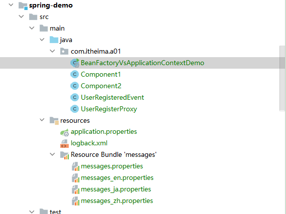

##### 1、pom.xml

```xml
<?xml version="1.0" encoding="UTF-8"?>
<project xmlns="http://maven.apache.org/POM/4.0.0"
         xmlns:xsi="http://www.w3.org/2001/XMLSchema-instance"
         xsi:schemaLocation="http://maven.apache.org/POM/4.0.0 http://maven.apache.org/xsd/maven-4.0.0.xsd">
    <modelVersion>4.0.0</modelVersion>

    <groupId>com.itheima</groupId>
    <artifactId>spring-demo</artifactId>
    <version>1.0-SNAPSHOT</version>

    <properties>
        <maven.compiler.source>8</maven.compiler.source>
        <maven.compiler.target>8</maven.compiler.target>
    </properties>

    <parent>
        <groupId>org.springframework.boot</groupId>
        <artifactId>spring-boot-starter-parent</artifactId>
        <version>2.6.7</version>
    </parent>

    <dependencies>
        <dependency>
            <groupId>org.springframework.boot</groupId>
            <artifactId>spring-boot-starter</artifactId>
        </dependency>
        <dependency>
            <groupId>org.springframework.boot</groupId>
            <artifactId>spring-boot-starter-web</artifactId>
        </dependency>
        <dependency>
            <groupId>org.springframework.boot</groupId>
            <artifactId>spring-boot-starter-test</artifactId>
        </dependency>
        <dependency>
            <groupId>org.projectlombok</groupId>
            <artifactId>lombok</artifactId>
        </dependency>
        <dependency>
            <groupId>org.aspectj</groupId>
            <artifactId>aspectjweaver</artifactId>
        </dependency>
    </dependencies>
</project>
```

##### 2、application.properties

```properties
server.port=8080
goods.name=小米12
```

##### 3、logback.xml

```xml
<configuration>

    <appender name="boldRed" class="ch.qos.logback.core.ConsoleAppender">
        <encoder>
            <pattern>%highlight([%level]) %d{HH:mm:ss.SSS} %boldRed([%thread]) - %msg %n</pattern>
        </encoder>
    </appender>

    <appender name="boldBlue" class="ch.qos.logback.core.ConsoleAppender">
        <encoder>
            <pattern>%highlight([%level]) %d{HH:mm:ss.SSS} %boldBlue([%thread]) - %msg %n</pattern>
        </encoder>
    </appender>

    <appender name="boldGreen" class="ch.qos.logback.core.ConsoleAppender">
        <encoder>
            <pattern>%highlight([%level]) %d{HH:mm:ss.SSS} %boldGreen([%thread]) - %msg %n</pattern>
        </encoder>
    </appender>

    <appender name="boldYellow" class="ch.qos.logback.core.ConsoleAppender">
        <encoder>
            <pattern>%highlight([%level]) %d{HH:mm:ss.SSS} %boldYellow([%thread]) - %msg %n</pattern>
        </encoder>
    </appender>

    <appender name="boldMagenta" class="ch.qos.logback.core.ConsoleAppender">
        <encoder>
            <pattern>%highlight([%level]) %d{HH:mm:ss.SSS} %boldMagenta([%thread]) - %msg %n</pattern>
        </encoder>
    </appender>

    <appender name="boldCyan" class="ch.qos.logback.core.ConsoleAppender">
        <encoder>
            <pattern>%highlight([%level]) %d{HH:mm:ss.SSS} %boldCyan([%thread]) - %msg %n</pattern>
        </encoder>
    </appender>

    <appender name="boldWhite" class="ch.qos.logback.core.ConsoleAppender">
        <encoder>
            <pattern>%highlight([%level]) %d{HH:mm:ss.SSS} %boldWhite([%thread]) - %msg %n</pattern>
        </encoder>
    </appender>

    <appender name="STDOUT" class="ch.qos.logback.classic.sift.SiftingAppender">
        <discriminator>
            <key>color</key>
            <defaultValue>cyan</defaultValue>
        </discriminator>
        <sift>
            <appender name="thread-${thread}" class="ch.qos.logback.core.ConsoleAppender">
                <encoder>
                    <pattern>%highlight([%-5level]) %d{HH:mm:ss.SSS} %boldWhite([%thread]) %-35logger{35} - %${color}(%msg) %n</pattern>
                </encoder>
            </appender>
        </sift>
    </appender>

    <logger name="A" level="DEBUG" additivity="false">
        <appender-ref ref="boldRed"/>
    </logger>

    <logger name="B" level="DEBUG" additivity="false">
        <appender-ref ref="boldBlue"/>
    </logger>

    <logger name="C" level="DEBUG" additivity="false">
        <appender-ref ref="boldGreen"/>
    </logger>

    <logger name="D" level="DEBUG" additivity="false">
        <appender-ref ref="boldYellow"/>
    </logger>

    <logger name="E" level="DEBUG" additivity="false">
        <appender-ref ref="boldMagenta"/>
    </logger>

    <logger name="F" level="DEBUG" additivity="false">
        <appender-ref ref="boldCyan"/>
    </logger>

    <logger name="G" level="DEBUG" additivity="false">
        <appender-ref ref="boldWhite"/>
    </logger>

    <logger name="com.itheima" level="debug" additivity="false">
        <appender-ref ref="STDOUT"/>
    </logger>

    <logger name="org.springframework.web.servlet.resource" level="trace" additivity="false">
        <appender-ref ref="STDOUT"/>
    </logger>

    <logger name="org.springframework.web.servlet.DispatcherServlet" level="trace" additivity="false">
        <appender-ref ref="STDOUT"/>
    </logger>

    <logger name="org.springframework.aop.aspectj.annotation.AnnotationAwareAspectJAutoProxyCreator" level="trace" additivity="false">
        <appender-ref ref="STDOUT"/>
    </logger>

    <root level="INFO">
        <appender-ref ref="STDOUT"/>
    </root>
</configuration>
```

##### 4、message.properties

```properties

```


##### 5、message_en.properties

```properties
hi=Hello
```


##### 6、message_ja.properties

```properties
hi=こんにちは
```


##### 7、message_zh.properties

```properties
hi=你好
```


##### 8、Component1

```java
package com.itheima.a01;

import lombok.extern.slf4j.Slf4j;
import org.springframework.beans.factory.annotation.Autowired;
import org.springframework.context.ApplicationEventPublisher;
import org.springframework.stereotype.Component;

@Component
@Slf4j
public class Component1 {
    @Autowired
    private ApplicationEventPublisher context;

    public void register() {
        log.debug("用户注册");
        context.publishEvent(new UserRegisteredEvent(this));
    }

    public void register_v2() {
        log.debug("用户注册v2");
    }
}

```

##### 9、Component2

```java
package com.itheima.a01;

import lombok.extern.slf4j.Slf4j;
import org.springframework.context.event.EventListener;
import org.springframework.stereotype.Component;

@Component
@Slf4j
public class Component2 {

    @EventListener
    public void eventListener(UserRegisteredEvent userRegisteredEvent) {
        log.debug("{}", userRegisteredEvent);
        log.debug("发送短信");
    }
}

```

##### 10、UserRegisteredEvent

```java
package com.itheima.a01;

import lombok.extern.slf4j.Slf4j;
import org.springframework.context.ApplicationEvent;
import org.springframework.stereotype.Component;

import java.time.Clock;

/**
 * @author lyf
 * @version 1.0
 * @classname UserRegisteredEvent
 * @description 用户注册事件
 * @since 2022/12/4 13:19
 */
@Slf4j
public class UserRegisteredEvent extends ApplicationEvent {
    private static final long serialVersionUID = -7132864640360398406L;

    public UserRegisteredEvent(Object source) {
        super(source);
    }

    public UserRegisteredEvent(Object source, Clock clock) {
        super(source, clock);
    }
}

```

##### 11、UserRegisterProxy

```java
package com.itheima.a01;

import lombok.extern.slf4j.Slf4j;
import org.aspectj.lang.annotation.After;
import org.aspectj.lang.annotation.Aspect;
import org.springframework.stereotype.Component;

/**
 * @author lyf
 * @version 1.0
 * @classname UserRegisterProxy
 * @description
 * @since 2022/12/4 13:37
 */
@Slf4j
@Component
@Aspect
public class UserRegisterProxy {

    /**
    * AOP完成注册与发短信之间的解耦
    */
    @After(value = "execution(* com.itheima.a01.Component1.register_v2(..))")
    public void after() {
        log.debug("发短信v2");
    }
}

```

##### 12、**BeanFactoryVsApplicationContextDemo**

```java
package com.itheima.a01;

import lombok.extern.slf4j.Slf4j;
import org.springframework.beans.factory.config.ConfigurableListableBeanFactory;
import org.springframework.beans.factory.support.DefaultSingletonBeanRegistry;
import org.springframework.boot.SpringApplication;
import org.springframework.boot.autoconfigure.SpringBootApplication;
import org.springframework.context.ConfigurableApplicationContext;
import org.springframework.core.env.ConfigurableEnvironment;
import org.springframework.core.io.Resource;

import java.lang.reflect.Field;
import java.nio.charset.StandardCharsets;
import java.util.Locale;
import java.util.Map;
import java.util.Objects;

/**
 * @author lyf
 * @version 1.0
 * @classname BeanFactoryVsApplicationContextDemo
 * @description BeanFactory与ApplicationContext的区别
 * @since 2022/12/4 12:36
 */
@Slf4j
@SpringBootApplication
public class BeanFactoryVsApplicationContextDemo {
    public static void main(String[] args) throws Exception {
        ConfigurableApplicationContext applicationContext = SpringApplication.run(BeanFactoryVsApplicationContextDemo.class, args);

        /*
            1. 到底什么是 BeanFactory
                - 它是 ApplicationContext 的父接口
                - 它才是 Spring 的核心容器, 主要的 ApplicationContext 实现都【组合】了它的功能
         */
        System.out.println(applicationContext);

        /*
            2. BeanFactory 能干点啥
                - 表面上只有 getBean
                - 实际上控制反转、基本的依赖注入、直至 Bean 的生命周期的各种功能，都由它的实现类提供
                - 例子中通过反射查看了它的成员变量 singletonObjects，内部包含了所有的单例 bean
         */
        Field singletonObjects = DefaultSingletonBeanRegistry.class.getDeclaredField("singletonObjects");
        singletonObjects.setAccessible(true);
        ConfigurableListableBeanFactory beanFactory = applicationContext.getBeanFactory();
        Map<String, Object> map = (Map<String, Object>) singletonObjects.get(beanFactory);
        map.entrySet().stream().filter(entry -> entry.getKey().startsWith("component")).forEach(entry -> {
            System.out.println(entry.getKey() + "=" + entry.getValue());
        });

         /*
            3. ApplicationContext 比 BeanFactory 多点啥
            国际化、通配符方式获取一组 Resource 资源、整合 Environment 环境、事件发布与监听
         */
        // 3.1 国际化
        String message1 = applicationContext.getMessage("hi", null, Locale.ENGLISH);
        String message2 = applicationContext.getMessage("hi", null, Locale.CHINESE);
        String message3 = applicationContext.getMessage("hi", null, Locale.JAPANESE);
        System.out.println(message1);
        System.out.println(message2);
        System.out.println(message3);

        // 3.2 通配符方式获取一组 Resource 资源
        Resource[] resources = applicationContext.getResources("classpath*:META-INF/spring.factories");
        for (Resource resource : resources) {
            System.out.println(resource);
        }

        // 3.3 整合 Environment 环境
        ConfigurableEnvironment environment = applicationContext.getEnvironment();
        System.out.println(environment.getProperty("java_home"));
        System.out.println(environment.getProperty("server.port"));
        System.out.println(new String(Objects.requireNonNull(environment.getProperty("goods.name")).getBytes(StandardCharsets.ISO_8859_1), StandardCharsets.UTF_8));

        // 3.4 事件发布与监听
        // applicationContext.publishEvent(new UserRegisteredEvent(applicationContext));
        Component1 component1 = applicationContext.getBean(Component1.class);
        component1.register();

         /*
            4. 学到了什么
                a. BeanFactory 与 ApplicationContext 并不仅仅是简单接口继承的关系, ApplicationContext 组合并扩展了 BeanFactory 的功能
                b. 又新学一种代码之间解耦途径
            练习：完成用户注册与发送短信之间的解耦, 用事件方式、和 AOP 方式分别实现
         */
        // 使用AOP的方式完成注册与发送短信之间的解耦
        component1.register_v2();
    }
}

```

##### 13、收获💡

通过这个示例结合 debug 查看 ApplicationContext 对象的内部结构，学到：

1. 到底什么是 BeanFactory

   - 它是 ApplicationContext 的父接口
   - 它才是 Spring 的核心容器, 主要的 ApplicationContext 实现都【组合】了它的功能，【组合】是指 ApplicationContext 的一个重要成员变量就是 BeanFactory

   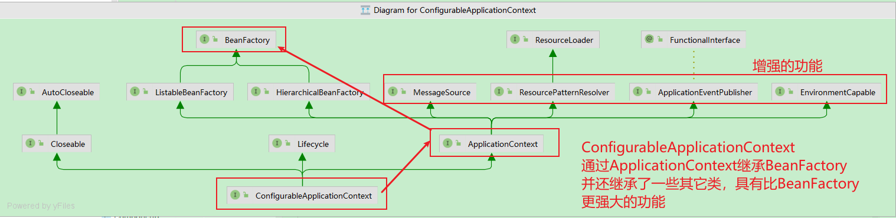

2. BeanFactory 能干点啥

   - 表面上只有 getBean
   - 实际上控制反转、基本的依赖注入、直至 Bean 的生命周期的各种功能，都由它的实现类提供
   - 例子中通过反射查看了它的成员变量 singletonObjects，内部包含了所有的单例 bean

3. ApplicationContext 比 BeanFactory 多点啥

   * ApplicationContext 组合并扩展了 BeanFactory 的功能
   * 国际化、通配符方式获取一组 Resource 资源、整合 Environment 环境、事件发布与监听
   * 新学一种代码之间解耦途径，事件解耦

建议练习：完成用户注册与发送短信之间的解耦，用事件方式、和 AOP 方式分别实现

> ***注意***
>
> * 如果 jdk > 8, 运行时请添加 --add-opens java.base/java.lang=ALL-UNNAMED，这是因为这些版本的 jdk 默认不允许跨 module 反射
> * 事件发布还可以异步，这个视频中没有展示，请自行查阅 @EnableAsync，@Async 的用法


### 1.2 演示2 - 国际化

```java
public class TestMessageSource {
    public static void main(String[] args) {
        GenericApplicationContext context = new GenericApplicationContext();

        context.registerBean("messageSource", MessageSource.class, () -> {
            ResourceBundleMessageSource ms = new ResourceBundleMessageSource();
            ms.setDefaultEncoding("utf-8");
            ms.setBasename("messages");
            return ms;
        });

        context.refresh();

        System.out.println(context.getMessage("hi", null, Locale.ENGLISH));
        System.out.println(context.getMessage("hi", null, Locale.CHINESE));
        System.out.println(context.getMessage("hi", null, Locale.JAPANESE));
    }
}
```

国际化文件均在 src/resources 目录下

messages.properties（空）

messages_en.properties

```properties
hi=Hello
```

messages_ja.properties

```properties
hi=こんにちは
```

messages_zh.properties

```properties
hi=你好
```

> ***注意***
>
> * ApplicationContext 中 MessageSource bean 的名字固定为 messageSource
> * 使用 SpringBoot 时，国际化文件名固定为 messages
> * 空的 messages.properties 也必须存在


## 2 容器实现

Spring 的发展历史较为悠久，因此很多资料还在讲解它较旧的实现，这里出于怀旧的原因，把它们都列出来，供大家参考

* DefaultListableBeanFactory，是 BeanFactory 最重要的实现，像**控制反转**和**依赖注入**功能，都是它来实现
* ClassPathXmlApplicationContext，从类路径查找 XML 配置文件，创建容器（旧）
* FileSystemXmlApplicationContext，从磁盘路径查找 XML 配置文件，创建容器（旧）
* XmlWebApplicationContext，传统 SSM 整合时，基于 XML 配置文件的容器（旧）
* AnnotationConfigWebApplicationContext，传统 SSM 整合时，基于 java 配置类的容器（旧）
* AnnotationConfigApplicationContext，Spring boot 中非 web 环境容器（新）
* AnnotationConfigServletWebServerApplicationContext，Spring boot 中 servlet web 环境容器（新）
* AnnotationConfigReactiveWebServerApplicationContext，Spring boot 中 reactive web 环境容器（新）

另外要注意的是，后面这些带有 ApplicationContext 的类都是 ApplicationContext 接口的实现，但它们是**组合**了 DefaultListableBeanFactory 的功能，并非继承而来


### 2.1 演示1 - DefaultListableBeanFactory

#### 2.1.1 代码参考 

**com.itheima.a02.TestBeanFactory**

```java
package com.itheima.a02;

import lombok.extern.slf4j.Slf4j;
import org.slf4j.Logger;
import org.slf4j.LoggerFactory;
import org.springframework.beans.factory.annotation.Autowired;
import org.springframework.beans.factory.config.BeanFactoryPostProcessor;
import org.springframework.beans.factory.config.BeanPostProcessor;
import org.springframework.beans.factory.support.AbstractBeanDefinition;
import org.springframework.beans.factory.support.BeanDefinitionBuilder;
import org.springframework.beans.factory.support.DefaultListableBeanFactory;
import org.springframework.context.annotation.AnnotationConfigUtils;
import org.springframework.context.annotation.Bean;
import org.springframework.context.annotation.Configuration;
import org.springframework.core.Ordered;

import javax.annotation.Resource;

/**
 * @author lyf
 * @version 1.0
 * @classname TestBeanFactory
 * @description
 * @since 2022/12/4 16:02
 */
@Slf4j
public class TestBeanFactory {
    /**
     * 学到了什么:
     * a. beanFactory 不会做的事
     * 1. 不会主动调用 BeanFactory 后处理器
     * 2. 不会主动添加 Bean 后处理器
     * 3. 不会主动初始化单例
     * 4. 不会解析beanFactory 还不会解析 ${ } 与 #{ }
     * b. bean 后处理器会有排序的逻辑
     */
    public static void main(String[] args) {
        method5();
    }


    /**
     * 打印结果：
     * <p>
     * config
     */
    private static void method1() {
        // 1 DefaultListableBeanFactory 是BeanFactory的最重要的实现，像控制反转和依赖注入
        DefaultListableBeanFactory beanFactory = new DefaultListableBeanFactory();

        // 2 bean的定义(class, scope, 初始化和销毁)
        AbstractBeanDefinition beanDefinition =
                BeanDefinitionBuilder.genericBeanDefinition(Config.class).setScope("singleton").getBeanDefinition();
        beanFactory.registerBeanDefinition("config", beanDefinition);

        // 打印Bean的定义信息
        printBeanNames(beanFactory);
    }


    /**
     * 打印结果：
     * <p>
     * config
     * org.springframework.context.annotation.internalConfigurationAnnotationProcessor
     * org.springframework.context.annotation.internalAutowiredAnnotationProcessor
     * org.springframework.context.annotation.internalCommonAnnotationProcessor
     * org.springframework.context.event.internalEventListenerProcessor
     * org.springframework.context.event.internalEventListenerFactory
     */
    private static void method2() {
        // 1 DefaultListableBeanFactory 是BeanFactory的最重要的实现，像控制反转和依赖注入
        DefaultListableBeanFactory beanFactory = new DefaultListableBeanFactory();

        // 2 bean的定义(class, scope, 初始化和销毁)
        AbstractBeanDefinition beanDefinition =
                BeanDefinitionBuilder.genericBeanDefinition(Config.class).setScope("singleton").getBeanDefinition();
        beanFactory.registerBeanDefinition("config", beanDefinition);

        // 3 想要解析到@Bean注解需要先添加一些后处理器
        AnnotationConfigUtils.registerAnnotationConfigProcessors(beanFactory);

        // 打印Bean的定义信息
        printBeanNames(beanFactory);
    }

    /**
     * 打印结果
     * <p>
     * config
     * org.springframework.context.annotation.internalConfigurationAnnotationProcessor
     * org.springframework.context.annotation.internalAutowiredAnnotationProcessor
     * org.springframework.context.annotation.internalCommonAnnotationProcessor
     * org.springframework.context.event.internalEventListenerProcessor
     * org.springframework.context.event.internalEventListenerFactory
     * bean1
     * bean2
     * bean3
     * bean4
     */
    private static void method3() {
        // 1 DefaultListableBeanFactory 是BeanFactory的最重要的实现，像控制反转和依赖注入
        DefaultListableBeanFactory beanFactory = new DefaultListableBeanFactory();

        // 2 bean的定义(class, scope, 初始化和销毁)
        AbstractBeanDefinition beanDefinition =
                BeanDefinitionBuilder.genericBeanDefinition(Config.class).setScope("singleton").getBeanDefinition();
        beanFactory.registerBeanDefinition("config", beanDefinition);

        // 3 想要解析到@Bean注解需要先添加一些后处理器 (这里只是添加，还未建立与BeanFactory之间的关联)
        AnnotationConfigUtils.registerAnnotationConfigProcessors(beanFactory);

        // 4 建立BeanFactory后处理器
        // 这里就能解析到bean1,bean2,bean3,bean4但是bean1中@Autowrite注解还是未被解析到
        beanFactory.getBeansOfType(BeanFactoryPostProcessor.class).values().forEach(
                beanFactoryPostProcessor -> beanFactoryPostProcessor.postProcessBeanFactory(beanFactory));

        // 打印Bean的定义信息
        printBeanNames(beanFactory);
    }


    /**
     * 打印结果
     * <p>
     * =============================================
     * config
     * org.springframework.context.annotation.internalConfigurationAnnotationProcessor
     * org.springframework.context.annotation.internalAutowiredAnnotationProcessor
     * org.springframework.context.annotation.internalCommonAnnotationProcessor
     * org.springframework.context.event.internalEventListenerProcessor
     * org.springframework.context.event.internalEventListenerFactory
     * bean1
     * bean2
     * bean3
     * bean4
     * =============================================
     * [DEBUG] 16:41:21.654 [main] c.itheima.a02.TestBeanFactory$Bean1 - 构造 Bean1()
     * null
     */
    private static void method4() {
        // 1 DefaultListableBeanFactory 是BeanFactory的最重要的实现，像控制反转和依赖注入
        DefaultListableBeanFactory beanFactory = new DefaultListableBeanFactory();

        // 2 bean的定义(class, scope, 初始化和销毁)
        AbstractBeanDefinition beanDefinition =
                BeanDefinitionBuilder.genericBeanDefinition(Config.class).setScope("singleton").getBeanDefinition();
        beanFactory.registerBeanDefinition("config", beanDefinition);

        // 3 想要解析到@Bean注解需要先添加一些后处理器 (这里只是添加，还未建立与BeanFactory之间的关联)
        AnnotationConfigUtils.registerAnnotationConfigProcessors(beanFactory);

        // 4 建立BeanFactory后处理器
        // 这里就能解析到bean1,bean2,bean3,bean4但是bean1中@Autowrite注解还是未被解析到
        beanFactory.getBeansOfType(BeanFactoryPostProcessor.class).values().forEach(
                beanFactoryPostProcessor -> beanFactoryPostProcessor.postProcessBeanFactory(beanFactory));

        // 打印Bean的定义信息
        System.out.println("=============================================");
        printBeanNames(beanFactory);
        System.out.println("=============================================");

        System.out.println(beanFactory.getBean(Bean1.class).getInter());
    }

    /**
     * 打印结果
     * <p></p>
     * =============================================
     * config
     * org.springframework.context.annotation.internalConfigurationAnnotationProcessor
     * org.springframework.context.annotation.internalAutowiredAnnotationProcessor
     * org.springframework.context.annotation.internalCommonAnnotationProcessor
     * org.springframework.context.event.internalEventListenerProcessor
     * org.springframework.context.event.internalEventListenerFactory
     * bean1
     * bean2
     * bean3
     * bean4
     * =============================================
     * >>>>org.springframework.beans.factory.annotation.AutowiredAnnotationBeanPostProcessor@be64738
     * >>>>org.springframework.context.annotation.CommonAnnotationBeanPostProcessor@3ba9ad43
     * [DEBUG] 16:49:11.064 [main] c.itheima.a02.TestBeanFactory$Bean1 - 构造 Bean1()
     * [DEBUG] 16:49:11.082 [main] c.itheima.a02.TestBeanFactory$Bean2 - 构造 Bean2()
     * com.itheima.a02.TestBeanFactory$Bean3@479d31f3
     * >>>>>>>>>>>>>>>>>>>>>
     * >>>>>>>>>>>>>>>>>>>>>
     * Resource:2147483644
     * Autowired:2147483645
     */
    private static void method5() {
        // 1 DefaultListableBeanFactory 是BeanFactory的最重要的实现，像控制反转和依赖注入
        DefaultListableBeanFactory beanFactory = new DefaultListableBeanFactory();

        // 2 bean的定义(class, scope, 初始化和销毁)
        AbstractBeanDefinition beanDefinition =
                BeanDefinitionBuilder.genericBeanDefinition(Config.class).setScope("singleton").getBeanDefinition();
        beanFactory.registerBeanDefinition("config", beanDefinition);

        // 3 想要解析到@Bean注解需要先添加一些后处理器 (这里只是添加，还未建立与BeanFactory之间的关联)
        AnnotationConfigUtils.registerAnnotationConfigProcessors(beanFactory);

        // 4 建立BeanFactory后处理器
        // 这里就能解析到bean1,bean2,bean3,bean4但是bean1中@Autowrite注解还是未被解析到
        beanFactory.getBeansOfType(BeanFactoryPostProcessor.class).values().forEach(
                beanFactoryPostProcessor -> beanFactoryPostProcessor.postProcessBeanFactory(beanFactory));

        // 打印Bean的定义信息
        System.out.println("=============================================");
        printBeanNames(beanFactory);
        System.out.println("=============================================");

        // 5 建立Bean的后处理器(这里@Autowrite的优先级会比@Resource的优先级更高)
        beanFactory.getBeansOfType(BeanPostProcessor.class).values().forEach(beanPostProcessor -> {
            System.out.println(">>>>" + beanPostProcessor);
            beanFactory.addBeanPostProcessor(beanPostProcessor);
        });


        // 下面这种写法可以改变@Autowrite和@Resource的优先级，使得@Resource具有更高的优先级
       /* beanFactory.getBeansOfType(BeanPostProcessor.class).values().stream()
                .sorted(Objects.requireNonNull(beanFactory.getDependencyComparator()))
                .forEach(beanPostProcessor -> {
            System.out.println(">>>>" + beanPostProcessor);
            beanFactory.addBeanPostProcessor(beanPostProcessor);
        });*/


        // 依赖注入的部分在使用到时才真正的创建
        // 预先创建所有的单例bean
        // beanFactory.preInstantiateSingletons();
        System.out.println(beanFactory.getBean(Bean1.class).getInter());

        System.out.println(">>>>>>>>>>>>>>>>>>>>>");
        System.out.println(">>>>>>>>>>>>>>>>>>>>>");
        System.out.println("Resource:" + (Ordered.LOWEST_PRECEDENCE - 3));
        System.out.println("Autowired:" + (Ordered.LOWEST_PRECEDENCE - 2));
    }

    private static void printBeanNames(DefaultListableBeanFactory beanFactory) {
        String[] beanDefinitionNames = beanFactory.getBeanDefinitionNames();
        for (String beanName : beanDefinitionNames) {
            System.out.println(beanName);
        }
    }

    @Configuration
    static class Config {
        @Bean
        public Bean1 bean1() {
            return new Bean1();
        }

        @Bean
        public Bean2 bean2() {
            return new Bean2();
        }

        @Bean
        public Bean3 bean3() {
            return new Bean3();
        }

        @Bean
        public Bean4 bean4() {
            return new Bean4();
        }
    }

    interface Inter {

    }

    static class Bean3 implements Inter {

    }

    static class Bean4 implements Inter {

    }

    static class Bean1 {
        private static final Logger log = LoggerFactory.getLogger(Bean1.class);

        public Bean1() {
            log.debug("构造 Bean1()");
        }

        @Autowired
        private Bean2 bean2;

        public Bean2 getBean2() {
            return bean2;
        }

        @Autowired
        @Resource(name = "bean4")
        private Inter bean3;

        public Inter getInter() {
            return bean3;
        }
    }

    static class Bean2 {
        private static final Logger log = LoggerFactory.getLogger(Bean2.class);

        public Bean2() {
            log.debug("构造 Bean2()");
        }
    }
}

```


#### 2.1.2 收获💡

* beanFactory 可以通过 registerBeanDefinition 注册一个 bean definition 对象
  * 我们平时使用的配置类、xml、组件扫描等方式都是生成 bean definition 对象注册到 beanFactory 当中
  * bean definition 描述了这个 bean 的创建蓝图：scope 是什么、用构造还是工厂创建、初始化销毁方法是什么，等等
* beanFactory 需要手动调用 beanFactory 后处理器对它做增强
  * 例如通过解析 @Bean、@ComponentScan 等注解，来补充一些 bean definition
* beanFactory 需要手动添加 bean 后处理器，以便对后续 bean 的创建过程提供增强
  * 例如 @Autowired，@Resource 等注解的解析都是 bean 后处理器完成的
  * bean 后处理的添加顺序会对解析结果有影响，见视频中同时加 @Autowired，@Resource 的例子
* beanFactory 需要手动调用方法来初始化单例
* beanFactory 需要额外设置才能解析 ${} 与 #{}


### 2.2 演示2 - 常见 ApplicationContext 实现

#### 2.2.1 代码参考 

**com.itheima.a02.TestApplicationContext**

```java
package com.itheima.a02;

import lombok.extern.slf4j.Slf4j;
import org.springframework.boot.autoconfigure.web.servlet.DispatcherServletRegistrationBean;
import org.springframework.boot.web.embedded.tomcat.TomcatServletWebServerFactory;
import org.springframework.boot.web.servlet.context.AnnotationConfigServletWebApplicationContext;
import org.springframework.boot.web.servlet.context.AnnotationConfigServletWebServerApplicationContext;
import org.springframework.boot.web.servlet.server.ServletWebServerFactory;
import org.springframework.context.annotation.AnnotationConfigApplicationContext;
import org.springframework.context.annotation.Bean;
import org.springframework.context.annotation.Configuration;
import org.springframework.context.support.ClassPathXmlApplicationContext;
import org.springframework.context.support.FileSystemXmlApplicationContext;
import org.springframework.web.servlet.DispatcherServlet;
import org.springframework.web.servlet.mvc.Controller;

import java.io.IOException;
import java.nio.charset.StandardCharsets;

import static com.itheima.util.BeanUtil.printBeanNames;

/**
 * @author lyf
 * @version 1.0
 * @classname TestApplicationContext
 * @description 测试常见的几种ApplicationContext
 * @since 2022/12/4 16:54
 */
@Slf4j
public class TestApplicationContext {
    public static void main(String[] args) throws IOException {

        // 较为经典的容器, 基于 classpath 下 xml 格式的配置文件来创建
        // testClassPathXmlApplicationContext();

        // 基于磁盘路径下 xml 格式的配置文件来创建
        // testFileSystemXmlApplicationContext();

        // 较为经典的容器, 基于 java 配置类来创建
        // testAnnotationConfigApplicationContext();

        // 较为经典的容器, 基于 java 配置类来创建, 用于 web 环境
        testAnnotationConfigServletWebServerApplicationContext();
    }

    /**
     * 较为经典的容器, 基于 classpath 下 xml 格式的配置文件来创建
     */
    private static void testClassPathXmlApplicationContext() {
        ClassPathXmlApplicationContext applicationContext = new ClassPathXmlApplicationContext("a02.xml");
        printBeanNames(applicationContext);
        System.out.println(applicationContext.getBean(Bean2.class).getBean1());
    }

    /**
     * 基于磁盘路径下 xml 格式的配置文件来创建
     */
    private static void testFileSystemXmlApplicationContext() {
        FileSystemXmlApplicationContext applicationContext = new FileSystemXmlApplicationContext("spring-demo/src/main/resources/a02.xml");
        printBeanNames(applicationContext);
        System.out.println(applicationContext.getBean(Bean2.class).getBean1());
    }

    /**
     * 较为经典的容器, 基于 java 配置类来创建
     */
    private static void testAnnotationConfigApplicationContext() {
        AnnotationConfigApplicationContext applicationContext = new AnnotationConfigApplicationContext(Config.class);
        printBeanNames(applicationContext);
        System.out.println(applicationContext.getBean(Bean2.class).getBean1());
    }

    /**
     * 较为经典的容器, 基于 java 配置类来创建, 用于 web 环境
     */
    private static void testAnnotationConfigServletWebServerApplicationContext() {
        AnnotationConfigServletWebServerApplicationContext applicationContext =
                new AnnotationConfigServletWebServerApplicationContext(WebConfig.class);
        printBeanNames(applicationContext);
    }

    static class Bean1 {
    }

    static class Bean2 {

        private Bean1 bean1;

        public void setBean1(Bean1 bean1) {
            this.bean1 = bean1;
        }

        public Bean1 getBean1() {
            return bean1;
        }
    }

    @Configuration
    static class Config {

        @Bean
        public Bean1 bean1() {
            return new Bean1();
        }

        @Bean
        public Bean2 bean2(Bean1 bean1) {
            Bean2 bean2 = new Bean2();
            bean2.setBean1(bean1);
            return bean2;
        }
    }

    @Configuration
    static class WebConfig {
        /**
         * 注入一个Tomcat内嵌工厂
         *
         * @return ServletWebServerFactory
         */
        @Bean
        public ServletWebServerFactory servletWebServerFactory() {
            return new TomcatServletWebServerFactory();
        }

        /**
         * 注入Web程序的核心处理类，web程序的入口
         *
         * @return DispatcherServlet
         */
        @Bean
        public DispatcherServlet dispatcherServlet() {
            return new DispatcherServlet();
        }

        /**
         * 将DispatcherServlet进行注册
         *
         * @param dispatcherServlet dispatcherServlet
         * @return DispatcherServletRegistrationBean
         */
        @Bean
        public DispatcherServletRegistrationBean registrationBean(DispatcherServlet dispatcherServlet) {
            return new DispatcherServletRegistrationBean(dispatcherServlet, "/");
        }

        @Bean("/hello")
        public Controller helloController() {
            return ((request, response) -> {
                // 解决中文乱码问题
                response.setContentType("text/html; charset=UTF-8");
                response.getWriter().print(new String("你好".getBytes(StandardCharsets.UTF_8)));
                return null;
            });
        }
    }
}

```


#### 2.2.2 收获💡

1. 常见的 ApplicationContext 容器实现
2. 内嵌容器、DispatcherServlet 的创建方法、作用


## 3 Bean 的生命周期

一个受 Spring 管理的 bean，生命周期主要阶段有

1. 创建：根据 bean 的构造方法或者工厂方法来创建 bean 实例对象
2. 依赖注入：根据 @Autowired，@Value 或其它一些手段，为 bean 的成员变量填充值、建立关系
3. 初始化：回调各种 Aware 接口，调用对象的各种初始化方法
4. 销毁：在容器关闭时，会销毁所有单例对象（即调用它们的销毁方法）
   * prototype 对象也能够销毁，不过需要容器这边主动调用

一些资料会提到，生命周期中还有一类 bean 后处理器：BeanPostProcessor，会在 bean 的初始化的前后，提供一些扩展逻辑。但这种说法是不完整的，见下面的演示1


### 3.1 演示1 - bean 生命周期

#### 3.1.1 代码参考 

**com.itheima.a03** 包

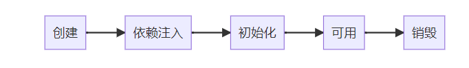

##### 1、LifeCycleBean

```java
package com.itheima.a03;

import lombok.extern.slf4j.Slf4j;
import org.springframework.beans.factory.annotation.Autowired;
import org.springframework.beans.factory.annotation.Value;
import org.springframework.stereotype.Component;

import javax.annotation.PostConstruct;
import javax.annotation.PreDestroy;

/**
 * @author lyf
 * @version 1.0
 * @classname LifeCycleBean
 * @description
 * @since 2022/12/6 9:40
 */
@Slf4j
@Component
public class LifeCycleBean {
    public LifeCycleBean() {
        log.debug("构造");
    }

    @Autowired
    public void autowire(@Value("${JAVA_HOME}") String home) {
        log.debug("依赖注入{}", home);
    }

    @PostConstruct
    public void init() {
        log.debug("初始化");
    }

    @PreDestroy
    public void destroy() {
        log.debug("销毁");
    }
}

```

##### 2、MyBeanPostProcessor

```java
package com.itheima.a03;

import lombok.extern.slf4j.Slf4j;
import org.springframework.beans.BeansException;
import org.springframework.beans.PropertyValues;
import org.springframework.beans.factory.config.DestructionAwareBeanPostProcessor;
import org.springframework.beans.factory.config.InstantiationAwareBeanPostProcessor;
import org.springframework.stereotype.Component;

/**
 * @author lyf
 * @version 1.0
 * @classname MyBeanPostProcessor
 * @description 自定义Bean后处理器
 * @since 2022/12/6 9:47
 */
@Slf4j
@Component
public class MyBeanPostProcessor implements InstantiationAwareBeanPostProcessor, DestructionAwareBeanPostProcessor {

    private static final String LIFE_CYCLE_BEAN = "lifeCycleBean";

    /**
     * bean销毁之前执行的方法
     *
     * @param bean     bean对象
     * @param beanName bean在容器中名称
     * @throws BeansException BeansException
     */
    @Override
    public void postProcessBeforeDestruction(Object bean, String beanName) throws BeansException {
        if (LIFE_CYCLE_BEAN.equalsIgnoreCase(beanName)) {
            log.debug("{}{}", "<<<<<<", "bean销毁之前执行的方法");
        }
    }

    /**
     * 确定给定的bean实例是否需要通过此 后处理器。
     *
     * @param bean bean
     * @return 默认为true
     */
    @Override
    public boolean requiresDestruction(Object bean) {
        return DestructionAwareBeanPostProcessor.super.requiresDestruction(bean);
    }

    @Override
    public Object postProcessBeforeInstantiation(Class<?> beanClass, String beanName) throws BeansException {
        if (LIFE_CYCLE_BEAN.equalsIgnoreCase(beanName)) {
            log.debug("{}{}", "<<<<<<", "实例化之前执行，这里返回的对象会替换掉原本的bean");
        }
        return null;
    }

    @Override
    public boolean postProcessAfterInstantiation(Object bean, String beanName) throws BeansException {
        if (LIFE_CYCLE_BEAN.equalsIgnoreCase(beanName)) {
            log.debug("{}{}", "<<<<<<", "实例化之后执行，如果返回false会跳过依赖注入阶段");
        }
        return true;
    }

    @Override
    public PropertyValues postProcessProperties(PropertyValues pvs, Object bean, String beanName) throws BeansException {
        if (LIFE_CYCLE_BEAN.equalsIgnoreCase(beanName)) {
            log.debug("{}{}", "<<<<<<", "依赖注入阶段执行，如@Autowired、@Value、@Resource");
        }
        return pvs;
    }

    @Override
    public Object postProcessBeforeInitialization(Object bean, String beanName) throws BeansException {
        if (LIFE_CYCLE_BEAN.equalsIgnoreCase(beanName)) {
            log.debug("{}{}", "<<<<<<", "初始化之前执行, 这里返回的对象会替换掉原本的 bean, 如 @PostConstruct、@ConfigurationProperties");
        }
        return bean;
    }

    @Override
    public Object postProcessAfterInitialization(Object bean, String beanName) throws BeansException {
        if (LIFE_CYCLE_BEAN.equalsIgnoreCase(beanName)) {
            log.debug("{}{}", "<<<<<<", "初始化之后执行, 这里返回的对象会替换掉原本的 bean, 如代理增强");
        }
        return bean;
    }
}

```

##### 3、TestSpringBeanLifeCycle

```java
package com.itheima.a03;

import lombok.extern.slf4j.Slf4j;
import org.springframework.boot.SpringApplication;
import org.springframework.boot.autoconfigure.SpringBootApplication;
import org.springframework.context.ConfigurableApplicationContext;

/**
 * @author lyf
 * @version 1.0
 * @classname TestSpringBeanLifeCycle
 * @description 测试Spring bean的生命周期
 * @since 2022/12/6 9:35
 */
@Slf4j
@SpringBootApplication
public class TestSpringBeanLifeCycle {
    /**
     * bean的生命周期，以及bean的后处理器
     * <p>
     * 学到了什么
     * a. Spring bean生命周期的各个阶段
     * b.模板设计模式，大流程已经固定好了，通过接口回调(bean 后处理器)扩展
     *
     * @param args args
     */
    public static void main(String[] args) {
        ConfigurableApplicationContext applicationContext = SpringApplication.run(TestSpringBeanLifeCycle.class, args);
        applicationContext.close();
    }
}

```

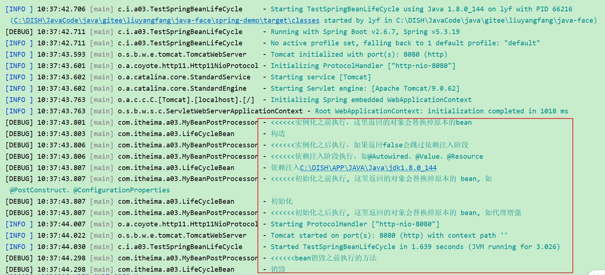

##### 4、总结

创建前后的增强

* postProcessBeforeInstantiation
  * 这里返回的对象若不为 null 会替换掉原本的 bean，并且仅会走 postProcessAfterInitialization 流程
* postProcessAfterInstantiation
  * 这里如果返回 false 会跳过依赖注入阶段

依赖注入前的增强

* postProcessProperties
  * 如 @Autowired、@Value、@Resource 

初始化前后的增强

* postProcessBeforeInitialization
  * 这里返回的对象会替换掉原本的 bean
  * 如 @PostConstruct、@ConfigurationProperties
* postProcessAfterInitialization 
  * 这里返回的对象会替换掉原本的 bean
  * 如代理增强

销毁之前的增强

* postProcessBeforeDestruction
  * 如 @PreDestroy 

#### 3.3.2 收获💡

1. Spring bean 生命周期各个阶段
2. 模板设计模式, 指大流程已经固定好了, 通过接口回调（bean 后处理器）在一些关键点前后提供扩展


### 3.2 演示2 - 模板方法设计模式

#### 3.2.1 关键代码

```java
package com.itheima.a03;

import lombok.extern.slf4j.Slf4j;

import java.util.ArrayList;
import java.util.Arrays;
import java.util.List;

/**
 * @author lyf
 * @version 1.0
 * @classname TestMethodTemplate
 * @description 测试模板方法
 * @since 2022/12/6 10:03
 */
@Slf4j
public class TestMethodTemplate {
    public static void main(String[] args) {
        MyBeanFactory beanFactory = new MyBeanFactory();
        beanFactory.add(bean -> log.debug("解析@Autowired, {}", bean), bean -> log.debug("解析@Resource, {}", bean));
        beanFactory.getBean();
    }

    public static class MyBeanFactory {

        public Object getBean() {
            Object bean = new Object();
            log.debug("构造, {}", bean);
            log.debug("依赖注入, {}", bean);

            // 模板方法增强代码
            for (BeanPostProcessor beanPostProcessor : beanPostProcessorList) {
                beanPostProcessor.inject(bean);
            }

            log.debug("初始化, {}", bean);
            return bean;
        }

        private List<BeanPostProcessor> beanPostProcessorList = new ArrayList<>();

        public void add(BeanPostProcessor... beanPostProcessor) {
            beanPostProcessorList.addAll(Arrays.asList(beanPostProcessor));
        }
    }

    public interface BeanPostProcessor {
        /**
         * 对依赖注入的扩展
         */
        public void inject(Object bean);
    }
}

```

```verilog
[DEBUG] 10:36:57.549 [main] com.itheima.a03.TestMethodTemplate  - 构造, java.lang.Object@5a61f5df 
[DEBUG] 10:36:57.557 [main] com.itheima.a03.TestMethodTemplate  - 依赖注入, java.lang.Object@5a61f5df 
[DEBUG] 10:36:57.558 [main] com.itheima.a03.TestMethodTemplate  - 解析@Autowired, java.lang.Object@5a61f5df 
[DEBUG] 10:36:57.558 [main] com.itheima.a03.TestMethodTemplate  - 解析@Resource, java.lang.Object@5a61f5df 
[DEBUG] 10:36:57.558 [main] com.itheima.a03.TestMethodTemplate  - 初始化, java.lang.Object@5a61f5df 
```


### 3.3 演示3 - bean 后处理器排序

#### 3.3.1 代码参考 

**com.itheima.a03.TestBeanPostProcessorOrder**

```java
package com.itheima.a03;

import lombok.extern.slf4j.Slf4j;
import org.springframework.beans.BeansException;
import org.springframework.beans.factory.config.BeanPostProcessor;
import org.springframework.beans.factory.support.DefaultListableBeanFactory;
import org.springframework.context.annotation.AnnotationConfigUtils;
import org.springframework.core.Ordered;
import org.springframework.core.PriorityOrdered;
import org.springframework.core.annotation.Order;

import java.util.ArrayList;
import java.util.Arrays;
import java.util.List;

/**
 * @author lyf
 * @version 1.0
 * @classname TestBeanPostProcessorOrder
 * @description 测试Bean的后处理器的排序
 * @since 2022/12/6 10:17
 */
@Slf4j
public class TestBeanPostProcessorOrder {
    public static void main(String[] args) {
        DefaultListableBeanFactory beanFactory = new DefaultListableBeanFactory();
        AnnotationConfigUtils.registerAnnotationConfigProcessors(beanFactory);

        List<BeanPostProcessor> list = new ArrayList<>(Arrays.asList(new P1(), new P2(), new P3(), new P4(), new P5()));
        list.sort(beanFactory.getDependencyComparator());

        for (BeanPostProcessor beanPostProcessor : list) {
            beanPostProcessor.postProcessBeforeInitialization(new Object(), "");
        }

        /*
            学到了什么
                1. 实现了 PriorityOrdered接口的优先级最高
                2. 实现了Ordered 接口与 Order注解的平级，按数字升序
                3. 其它的排在最后
         */
    }

    @Order(1)
    static class P1 implements BeanPostProcessor {
        @Override
        public Object postProcessBeforeInitialization(Object bean, String beanName) throws BeansException {
            log.debug("postProcessBeforeInitialization  @Order(1)");
            return bean;
        }
    }

    @Order(2)
    static class P2 implements BeanPostProcessor {
        @Override
        public Object postProcessBeforeInitialization(Object bean, String beanName) throws BeansException {
            log.debug("postProcessBeforeInitialization  @Order(2)");
            return bean;
        }
    }

    static class P3 implements BeanPostProcessor, PriorityOrdered {

        @Override
        public int getOrder() {
            return 200;
        }

        @Override
        public Object postProcessBeforeInitialization(Object bean, String beanName) throws BeansException {
            log.debug("postProcessBeforeInitialization PriorityOrdered 200");
            return bean;
        }
    }

    static class P4 implements BeanPostProcessor, Ordered {
        @Override
        public int getOrder() {
            return 0;
        }

        @Override
        public Object postProcessBeforeInitialization(Object bean, String beanName) throws BeansException {
            log.debug("postProcessBeforeInitialization Ordered 0");
            return bean;
        }
    }

    static class P5 implements BeanPostProcessor {
        @Override
        public Object postProcessBeforeInitialization(Object bean, String beanName) throws BeansException {
            log.debug("postProcessBeforeInitialization");
            return bean;
        }
    }
}

```

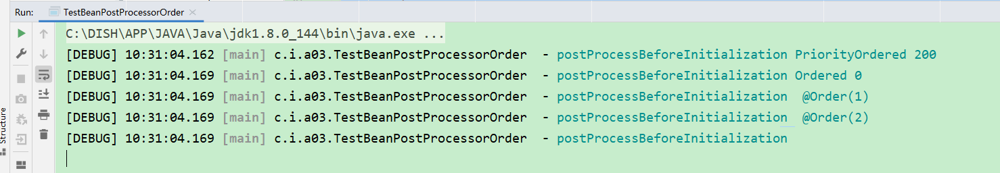

#### 3.3.2 收获💡

1. 实现了 PriorityOrdered 接口的优先级最高
2. 实现了 Ordered 接口与加了 @Order 注解的平级, 按数字升序
3. 其它的排在最后


## 4 Bean 后处理器

### 4.1 演示1 - 后处理器作用

#### 4.1.1 代码参考 

##### 1、准备代码

###### 1.1 Bean1

```java
package com.itheima.a04.bean;

import lombok.extern.slf4j.Slf4j;
import org.springframework.beans.factory.annotation.Autowired;
import org.springframework.beans.factory.annotation.Value;

import javax.annotation.PostConstruct;
import javax.annotation.PreDestroy;
import javax.annotation.Resource;

/**
 * @author lyf
 * @version 1.0
 * @classname Bean1
 * @description
 * @since 2022/12/6 11:18
 */
@Slf4j
public class Bean1 {
    private Bean2 bean2;

    @Autowired
    public void setBean2(Bean2 bean2) {
        log.debug("@Autowired 生效: {}", bean2);
        this.bean2 = bean2;
    }

    @Autowired
    private Bean3 bean3;

    @Resource
    public void setBean3(Bean3 bean3) {
        log.debug("@Resource 生效: {}", bean3);
        this.bean3 = bean3;
    }

    private String home;

    @Autowired
    public void setHome(@Value("${JAVA_HOME}") String home) {
        log.debug("@Value 生效: {}", home);
        this.home = home;
    }

    @PostConstruct
    public void init() {
        log.debug("@PostConstruct 生效");
    }

    @PreDestroy
    public void destroy() {
        log.debug("@PreDestroy 生效");
    }

    @Override
    public String toString() {
        return "Bean1{" +
                "bean2=" + bean2 +
                ", bean3=" + bean3 +
                ", home=\"" + home + "\"}";
    }
}

```

###### 1.2 Bean2

```java
package com.itheima.a04.bean;

import lombok.extern.slf4j.Slf4j;

/**
 * @author lyf
 * @version 1.0
 * @classname Bean2
 * @description
 * @since 2022/12/6 11:19
 */
@Slf4j
public class Bean2 {
}

```


###### 1.3 Bean3

```java
package com.itheima.a04.bean;

import lombok.extern.slf4j.Slf4j;

/**
 * @author lyf
 * @version 1.0
 * @classname Bean3
 * @description
 * @since 2022/12/6 11:19
 */
@Slf4j
public class Bean3 {
}

```


###### 1.4 Bean4

```java
package com.itheima.a04.bean;

import lombok.Getter;
import lombok.Setter;
import lombok.extern.slf4j.Slf4j;
import org.springframework.boot.context.properties.ConfigurationProperties;

/**
 * @author lyf
 * @version 1.0
 * @classname Bean4
 * @description 解析java.home, java.version
 * @since 2022/12/6 11:19
 */
@Slf4j
@ConfigurationProperties(prefix = "java")
@Getter
@Setter
public class Bean4 {
    private String home;

    private String version;

    @Override
    public String toString() {
        return "Bean4{home=\"" + home + "\", version=\"" + version + "\"}";
    }
}

```

##### 2、不添加Bean的后处理器

```java
package com.itheima.a04.bean;

import lombok.extern.slf4j.Slf4j;
import org.springframework.context.support.GenericApplicationContext;

/**
 * @author lyf
 * @version 1.0
 * @classname TestBeanPostProcessor
 * @description 测试常见Bean后处理器的功能
 * @since 2022/12/6 11:27
 */
@Slf4j
public class TestBeanPostProcessor {
    public static void main(String[] args) {
        // 1 GenericApplicationContext 是一个【干净】的容器
        GenericApplicationContext applicationContext = new GenericApplicationContext();

        // 2 用原始的方法注入4个Bean
        applicationContext.registerBean("bean1", Bean1.class);
        applicationContext.registerBean("bean2", Bean2.class);
        applicationContext.registerBean("bean3", Bean3.class);
        applicationContext.registerBean("bean4", Bean4.class);

        // 初始化容器
        applicationContext.refresh(); // 执行beanFactory后处理器, 添加bean后处理器, 初始化所有单例

        log.debug("Bean1={}", applicationContext.getBean(Bean1.class));
        log.debug("Bean2={}", applicationContext.getBean(Bean2.class));
        log.debug("Bean3={}", applicationContext.getBean(Bean3.class));
        log.debug("Bean4={}", applicationContext.getBean(Bean4.class));
        // 销毁容器
        applicationContext.close();
    }
}

```

###### 2.1 结果

```verilog
[DEBUG] 11:39:16.488 [main] c.i.a04.bean.TestBeanPostProcessor  - Bean1=Bean1{bean2=null, bean3=null, home="null"} 
[DEBUG] 11:39:16.497 [main] c.i.a04.bean.TestBeanPostProcessor  - Bean2=com.itheima.a04.bean.Bean2@23bb8443 
[DEBUG] 11:39:16.497 [main] c.i.a04.bean.TestBeanPostProcessor  - Bean3=com.itheima.a04.bean.Bean3@1176dcec 
[DEBUG] 11:39:16.498 [main] c.i.a04.bean.TestBeanPostProcessor  - Bean4=Bean4{home="null", version="null"} 
```

##### 3、添加`AutowiredAnnotationBeanPostProcessor `Bean后处理器，解析@Autowired、@Value注解

```java
package com.itheima.a04.bean;

import lombok.extern.slf4j.Slf4j;
import org.springframework.beans.factory.annotation.AutowiredAnnotationBeanPostProcessor;
import org.springframework.context.support.GenericApplicationContext;

/**
 * @author lyf
 * @version 1.0
 * @classname TestBeanPostProcessor
 * @description 测试常见Bean后处理器的功能
 * @since 2022/12/6 11:27
 */
@Slf4j
public class TestBeanPostProcessor {
    public static void main(String[] args) {
        // 1 GenericApplicationContext 是一个【干净】的容器
        GenericApplicationContext applicationContext = new GenericApplicationContext();

        // 2 用原始的方法注入4个Bean
        applicationContext.registerBean("bean1", Bean1.class);
        applicationContext.registerBean("bean2", Bean2.class);
        applicationContext.registerBean("bean3", Bean3.class);
        applicationContext.registerBean("bean4", Bean4.class);

        // 3 添加AutowiredAnnotationBeanPostProcessor
        applicationContext.registerBean(AutowiredAnnotationBeanPostProcessor.class); // 解析@Autowired 和 @Value注解

        // 初始化容器
        applicationContext.refresh(); // 执行beanFactory后处理器, 添加bean后处理器, 初始化所有单例

        log.debug("Bean1={}", applicationContext.getBean(Bean1.class));
        log.debug("Bean2={}", applicationContext.getBean(Bean2.class));
        log.debug("Bean3={}", applicationContext.getBean(Bean3.class));
        log.debug("Bean4={}", applicationContext.getBean(Bean4.class));
        // 销毁容器
        applicationContext.close();
    }
}

```

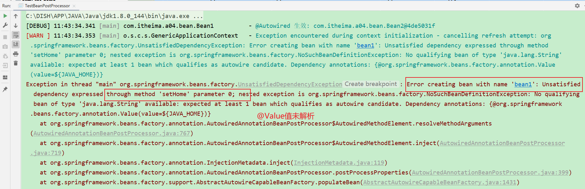

##### 4、解决3的报错，添加@Value解析器

```java
package com.itheima.a04.bean;

import lombok.extern.slf4j.Slf4j;
import org.springframework.beans.factory.annotation.AutowiredAnnotationBeanPostProcessor;
import org.springframework.context.annotation.ContextAnnotationAutowireCandidateResolver;
import org.springframework.context.support.GenericApplicationContext;

/**
 * @author lyf
 * @version 1.0
 * @classname TestBeanPostProcessor
 * @description 测试常见Bean后处理器的功能
 * @since 2022/12/6 11:27
 */
@Slf4j
public class TestBeanPostProcessor {
    public static void main(String[] args) {
        // 1 GenericApplicationContext 是一个【干净】的容器
        GenericApplicationContext applicationContext = new GenericApplicationContext();

        // 2 用原始的方法注入4个Bean
        applicationContext.registerBean("bean1", Bean1.class);
        applicationContext.registerBean("bean2", Bean2.class);
        applicationContext.registerBean("bean3", Bean3.class);
        applicationContext.registerBean("bean4", Bean4.class);

        // 3.1 解决@Value解析报错，负责获取 @Value 的值，解析 @Qualifier、泛型、@Lazy 
        applicationContext.getDefaultListableBeanFactory()
                .setAutowireCandidateResolver(new ContextAnnotationAutowireCandidateResolver());
        // 3.2 添加AutowiredAnnotationBeanPostProcessor
        applicationContext.registerBean(AutowiredAnnotationBeanPostProcessor.class); // 解析@Autowired 和 @Value注解

        // 初始化容器
        applicationContext.refresh(); // 执行beanFactory后处理器, 添加bean后处理器, 初始化所有单例

        log.debug("Bean1={}", applicationContext.getBean(Bean1.class));
        log.debug("Bean2={}", applicationContext.getBean(Bean2.class));
        log.debug("Bean3={}", applicationContext.getBean(Bean3.class));
        log.debug("Bean4={}", applicationContext.getBean(Bean4.class));
        // 销毁容器
        applicationContext.close();
    }
}

```

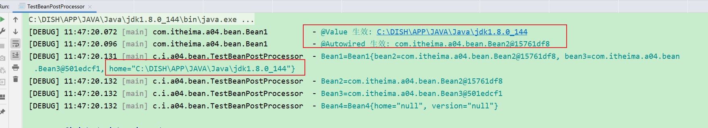

##### 5、添加`CommonAnnotationBeanPostProcessor` 解析@Resource @PostConstruct(实例化前) @PostDestroy(销毁方法)

```java
package com.itheima.a04.bean;

import lombok.extern.slf4j.Slf4j;
import org.springframework.beans.factory.annotation.AutowiredAnnotationBeanPostProcessor;
import org.springframework.context.annotation.CommonAnnotationBeanPostProcessor;
import org.springframework.context.annotation.ContextAnnotationAutowireCandidateResolver;
import org.springframework.context.support.GenericApplicationContext;

/**
 * @author lyf
 * @version 1.0
 * @classname TestBeanPostProcessor
 * @description 测试常见Bean后处理器的功能
 * @since 2022/12/6 11:27
 */
@Slf4j
public class TestBeanPostProcessor {
    public static void main(String[] args) {
        // 1 GenericApplicationContext 是一个【干净】的容器
        GenericApplicationContext applicationContext = new GenericApplicationContext();

        // 2 用原始的方法注入4个Bean
        applicationContext.registerBean("bean1", Bean1.class);
        applicationContext.registerBean("bean2", Bean2.class);
        applicationContext.registerBean("bean3", Bean3.class);
        applicationContext.registerBean("bean4", Bean4.class);

        // 3.1 解决@Value解析报错，负责获取 @Value 的值，解析 @Qualifier、泛型、@Lazy 
        applicationContext.getDefaultListableBeanFactory()
                .setAutowireCandidateResolver(new ContextAnnotationAutowireCandidateResolver());
        // 3.2 添加AutowiredAnnotationBeanPostProcessor
        applicationContext.registerBean(AutowiredAnnotationBeanPostProcessor.class); // 解析@Autowired 和 @Value注解

        // 3.3 添加CommonAnnotationBeanPostProcessor
        applicationContext.registerBean(CommonAnnotationBeanPostProcessor.class); // 解析 @Resource @PostConstruct(实例化前) @PostDestroy(销毁方法)

        // 4 初始化容器
        applicationContext.refresh(); // 执行beanFactory后处理器, 添加bean后处理器, 初始化所有单例

        log.debug("Bean1={}", applicationContext.getBean(Bean1.class));
        /*log.debug("Bean2={}", applicationContext.getBean(Bean2.class));
        log.debug("Bean3={}", applicationContext.getBean(Bean3.class));
        log.debug("Bean4={}", applicationContext.getBean(Bean4.class));*/
        // 5 销毁容器
        applicationContext.close();
    }
}

```

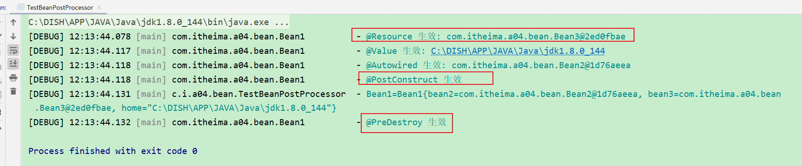

##### 6、注册ConfigurationPropertiesBindingPostProcessor，用来解析SpringBoot的`@ConfigurationProperties`注解

```java
package com.itheima.a04.bean;

import lombok.extern.slf4j.Slf4j;
import org.springframework.beans.factory.annotation.AutowiredAnnotationBeanPostProcessor;
import org.springframework.boot.context.properties.ConfigurationPropertiesBindingPostProcessor;
import org.springframework.context.annotation.CommonAnnotationBeanPostProcessor;
import org.springframework.context.annotation.ContextAnnotationAutowireCandidateResolver;
import org.springframework.context.support.GenericApplicationContext;

/**
 * @author lyf
 * @version 1.0
 * @classname TestBeanPostProcessor
 * @description 测试常见Bean后处理器的功能
 * @since 2022/12/6 11:27
 */
@Slf4j
public class TestBeanPostProcessor {
    public static void main(String[] args) {
        // 1 GenericApplicationContext 是一个【干净】的容器
        GenericApplicationContext applicationContext = new GenericApplicationContext();

        // 2 用原始的方法注入4个Bean
        applicationContext.registerBean("bean1", Bean1.class);
        applicationContext.registerBean("bean2", Bean2.class);
        applicationContext.registerBean("bean3", Bean3.class);
        applicationContext.registerBean("bean4", Bean4.class);

        // 3.1 解决@Value解析报错，负责获取 @Value 的值，解析 @Qualifier、泛型、@Lazy 
        applicationContext.getDefaultListableBeanFactory()
                .setAutowireCandidateResolver(new ContextAnnotationAutowireCandidateResolver());
        // 3.2 添加AutowiredAnnotationBeanPostProcessor
        applicationContext.registerBean(AutowiredAnnotationBeanPostProcessor.class); // 解析@Autowired 和 @Value注解

        // 3.3 添加CommonAnnotationBeanPostProcessor
        applicationContext.registerBean(CommonAnnotationBeanPostProcessor.class); // 解析 @Resource @PostConstruct(实例化前) @PostDestroy(销毁方法)

        // 3.4 注册ConfigurationPropertiesBindingPostProcessor，用来解析SpringBoot的@ConfigurationProperties 注解
        // 构造方法需传入BeanFactory
        ConfigurationPropertiesBindingPostProcessor.register(applicationContext.getDefaultListableBeanFactory());

        // 4 初始化容器
        applicationContext.refresh(); // 执行beanFactory后处理器, 添加bean后处理器, 初始化所有单例

        // log.debug("Bean1= {}", applicationContext.getBean(Bean1.class));
        log.debug("Bean4= {}", applicationContext.getBean(Bean4.class));
        // 5 销毁容器
        applicationContext.close();
    }
}

```

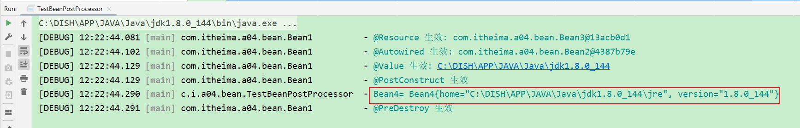

#### 4.1.2 收获💡

1. @Autowired 等注解的解析属于 bean 生命周期阶段（依赖注入, 初始化）的扩展功能，这些扩展功能由 bean 后处理器来完成
2. 每个后处理器各自增强什么功能
   * AutowiredAnnotationBeanPostProcessor 解析 @Autowired 与 @Value
   * CommonAnnotationBeanPostProcessor 解析 @Resource、@PostConstruct、@PreDestroy
   * ConfigurationPropertiesBindingPostProcessor 解析 @ConfigurationProperties
3. 另外 ContextAnnotationAutowireCandidateResolver 负责获取 @Value 的值，解析 @Qualifier、泛型、@Lazy 等


### 4.2 演示2 - @Autowired bean 后处理器运行分析

#### 4.2.1 代码参考 

##### 1、手动使用`AutowiredAnnotationBeanPostProcessor`来解析@Autowired和@Value注解

```java
package com.itheima.a04.bean;

import lombok.extern.slf4j.Slf4j;
import org.springframework.beans.factory.annotation.AutowiredAnnotationBeanPostProcessor;
import org.springframework.beans.factory.support.DefaultListableBeanFactory;

/**
 * @author lyf
 * @version 1.0
 * @classname DigInAutowired
 * @description @Autowired的运行分析
 * @since 2022/12/6 12:28
 */
@Slf4j
public class DigInAutowired {
    public static void main(String[] args) {
        // 1 获取默认的线程Bean工厂
        DefaultListableBeanFactory beanFactory = new DefaultListableBeanFactory();

        // 2 主持两个单例bean
        beanFactory.registerSingleton("bean2", new Bean2()); // 创建过程,依赖注入,初始化---> 此时的bean2和bean3是成品bean，不会执行上述过程
        beanFactory.registerSingleton("bean3", new Bean3());

        // 3.1 查找哪些属性，哪些方法添加了@Autowired，这称之为InjectionMetadata
        AutowiredAnnotationBeanPostProcessor processor = new AutowiredAnnotationBeanPostProcessor();
        processor.setBeanFactory(beanFactory);

        Bean1 bean1 = new Bean1();
        log.debug("依赖注入前, bean1= {}", bean1);
        processor.postProcessProperties(null, bean1, "bean1"); // 执行依赖注入@Autowired @Value
        log.debug("依赖注入后, bean1= {}", bean1);
    }
}

```

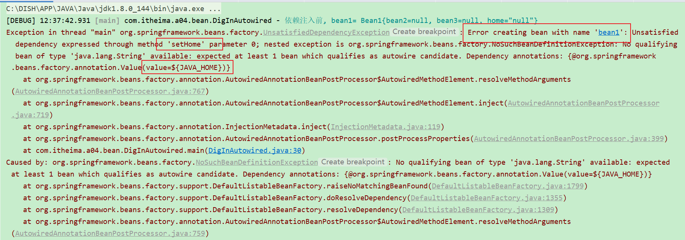

##### 2、解决1的报错

```java
package com.itheima.a04.bean;

import lombok.extern.slf4j.Slf4j;
import org.springframework.beans.factory.annotation.AutowiredAnnotationBeanPostProcessor;
import org.springframework.beans.factory.support.DefaultListableBeanFactory;
import org.springframework.context.annotation.ContextAnnotationAutowireCandidateResolver;
import org.springframework.core.env.StandardEnvironment;

/**
 * @author lyf
 * @version 1.0
 * @classname DigInAutowired
 * @description @Autowired的运行分析
 * @since 2022/12/6 12:28
 */
@Slf4j
public class DigInAutowired {
    public static void main(String[] args) {
        // 1 获取默认的线程Bean工厂
        DefaultListableBeanFactory beanFactory = new DefaultListableBeanFactory();

        // 2 主持两个单例bean
        beanFactory.registerSingleton("bean2", new Bean2()); // 创建过程,依赖注入,初始化---> 此时的bean2和bean3是成品bean，不会执行上述过程
        beanFactory.registerSingleton("bean3", new Bean3());

        // 3 解决@Value解析报错问题
        beanFactory.setAutowireCandidateResolver(new ContextAnnotationAutowireCandidateResolver()); // @Value
        beanFactory.addEmbeddedValueResolver(new StandardEnvironment()::resolvePlaceholders); // ${} 的解析器

        // 4.1 查找哪些属性，哪些方法添加了@Autowired，这称之为InjectionMetadata
        AutowiredAnnotationBeanPostProcessor processor = new AutowiredAnnotationBeanPostProcessor();
        processor.setBeanFactory(beanFactory);

        Bean1 bean1 = new Bean1();
        log.debug("依赖注入前, bean1= {}", bean1);
        processor.postProcessProperties(null, bean1, "bean1"); // 执行依赖注入@Autowired @Value
        log.debug("依赖注入后, bean1= {}", bean1);
    }
}

```

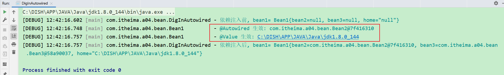


##### 3、通过反射来获取InjectionMetadata

```java
package com.itheima.a04.bean;

import lombok.extern.slf4j.Slf4j;
import org.springframework.beans.PropertyValues;
import org.springframework.beans.factory.annotation.AutowiredAnnotationBeanPostProcessor;
import org.springframework.beans.factory.annotation.InjectionMetadata;
import org.springframework.beans.factory.support.DefaultListableBeanFactory;
import org.springframework.context.annotation.ContextAnnotationAutowireCandidateResolver;
import org.springframework.core.env.StandardEnvironment;

import java.lang.reflect.Method;

/**
 * @author lyf
 * @version 1.0
 * @classname DigInAutowired
 * @description @Autowired的运行分析
 * @since 2022/12/6 12:28
 */
@Slf4j
public class DigInAutowired {
    public static void main(String[] args) throws Exception {
        // 1 获取默认的线程Bean工厂
        DefaultListableBeanFactory beanFactory = new DefaultListableBeanFactory();

        // 2 主持两个单例bean
        beanFactory.registerSingleton("bean2", new Bean2()); // 创建过程,依赖注入,初始化---> 此时的bean2和bean3是成品bean，不会执行上述过程
        beanFactory.registerSingleton("bean3", new Bean3());

        // 3 解决@Value解析报错问题
        beanFactory.setAutowireCandidateResolver(new ContextAnnotationAutowireCandidateResolver()); // @Value
        beanFactory.addEmbeddedValueResolver(new StandardEnvironment()::resolvePlaceholders); // ${} 的解析器

        // 4.1 查找哪些属性，哪些方法添加了@Autowired，这称之为InjectionMetadata
        AutowiredAnnotationBeanPostProcessor processor = new AutowiredAnnotationBeanPostProcessor();
        processor.setBeanFactory(beanFactory);

        Bean1 bean1 = new Bean1();
        log.debug("依赖注入前, bean1= {}", bean1);
        processor.postProcessProperties(null, bean1, "bean1"); // 执行依赖注入@Autowired @Value
        log.debug("依赖注入后, bean1= {}", bean1);

        // 4.2 通过反射来调用 findAutowiringMetadata
        Method findAutowiringMetadata = AutowiredAnnotationBeanPostProcessor.class.getDeclaredMethod("findAutowiringMetadata", String.class, Class.class, PropertyValues.class);
        findAutowiringMetadata.setAccessible(true);
        // 4.2.1 执行findAutowiringMetadata
        // 获取 Bean1 上加了 @Value @Autowired 的成员变量，方法参数信息
        InjectionMetadata bean1InjectionMetadata = (InjectionMetadata) findAutowiringMetadata.invoke(processor, "bean1", Bean1.class, null);
        log.debug("bean1InjectionMetadata: {}", bean1InjectionMetadata);
    }
}

```

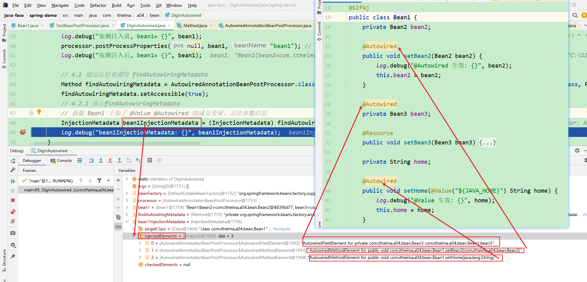

##### 4、手动调用InjectionMetadata的inject来进行依赖注入

```java
package com.itheima.a04.bean;

import lombok.extern.slf4j.Slf4j;
import org.springframework.beans.PropertyValues;
import org.springframework.beans.factory.annotation.AutowiredAnnotationBeanPostProcessor;
import org.springframework.beans.factory.annotation.InjectionMetadata;
import org.springframework.beans.factory.support.DefaultListableBeanFactory;
import org.springframework.context.annotation.ContextAnnotationAutowireCandidateResolver;
import org.springframework.core.env.StandardEnvironment;

import java.lang.reflect.Method;

/**
 * @author lyf
 * @version 1.0
 * @classname DigInAutowired
 * @description @Autowired的运行分析
 * @since 2022/12/6 12:28
 */
@Slf4j
public class DigInAutowired {
    public static void main(String[] args) throws Throwable {
        // 1 获取默认的线程Bean工厂
        DefaultListableBeanFactory beanFactory = new DefaultListableBeanFactory();

        // 2 主持两个单例bean
        beanFactory.registerSingleton("bean2", new Bean2()); // 创建过程,依赖注入,初始化---> 此时的bean2和bean3是成品bean，不会执行上述过程
        beanFactory.registerSingleton("bean3", new Bean3());

        // 3 解决@Value解析报错问题
        beanFactory.setAutowireCandidateResolver(new ContextAnnotationAutowireCandidateResolver()); // @Value
        beanFactory.addEmbeddedValueResolver(new StandardEnvironment()::resolvePlaceholders); // ${} 的解析器

        // 4.1 查找哪些属性，哪些方法添加了@Autowired，这称之为InjectionMetadata
        AutowiredAnnotationBeanPostProcessor processor = new AutowiredAnnotationBeanPostProcessor();
        processor.setBeanFactory(beanFactory);

        Bean1 bean1 = new Bean1();
        log.debug("依赖注入前, bean1= {}", bean1);
       /* log.debug("依赖注入前, bean1= {}", bean1);
        processor.postProcessProperties(null, bean1, "bean1"); // 执行依赖注入@Autowired @Value
        log.debug("依赖注入后, bean1= {}", bean1);*/

        // 4.2 通过反射来调用 findAutowiringMetadata
        Method findAutowiringMetadata = AutowiredAnnotationBeanPostProcessor.class.getDeclaredMethod("findAutowiringMetadata", String.class, Class.class, PropertyValues.class);
        findAutowiringMetadata.setAccessible(true);
        // 4.2.1 执行findAutowiringMetadata
        // 获取 Bean1 上加了 @Value @Autowired 的成员变量，方法参数信息
        InjectionMetadata bean1InjectionMetadata = (InjectionMetadata) findAutowiringMetadata.invoke(processor, "bean1", Bean1.class, null);
        log.debug("bean1InjectionMetadata: {}", bean1InjectionMetadata);

        // 4.2.2 调用InjectionMetadata 来进行依赖注入，注入时按类型进行查找值
        bean1InjectionMetadata.inject(bean1, "bean1", null);
        log.debug("手动调用InjectionMetadata的inject后, bean1= {}", bean1);
    }
}

```

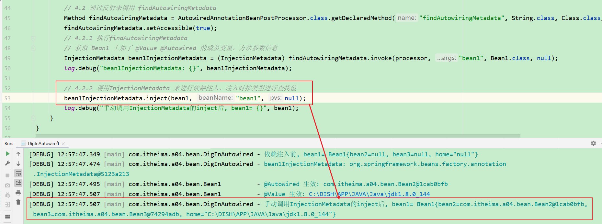

##### 5、如何按类型查找值

```java
package com.itheima.a04.bean;

import lombok.extern.slf4j.Slf4j;
import org.springframework.beans.PropertyValues;
import org.springframework.beans.factory.annotation.AutowiredAnnotationBeanPostProcessor;
import org.springframework.beans.factory.annotation.InjectionMetadata;
import org.springframework.beans.factory.config.DependencyDescriptor;
import org.springframework.beans.factory.support.DefaultListableBeanFactory;
import org.springframework.context.annotation.ContextAnnotationAutowireCandidateResolver;
import org.springframework.core.MethodParameter;
import org.springframework.core.env.StandardEnvironment;

import java.lang.reflect.Field;
import java.lang.reflect.Method;

/**
 * @author lyf
 * @version 1.0
 * @classname DigInAutowired
 * @description @Autowired的运行分析
 * @since 2022/12/6 12:28
 */
@Slf4j
public class DigInAutowired {
    public static void main(String[] args) throws Throwable {
        // 1 获取默认的线程Bean工厂
        DefaultListableBeanFactory beanFactory = new DefaultListableBeanFactory();

        // 2 主持两个单例bean
        beanFactory.registerSingleton("bean2", new Bean2()); // 创建过程,依赖注入,初始化---> 此时的bean2和bean3是成品bean，不会执行上述过程
        beanFactory.registerSingleton("bean3", new Bean3());

        // 3 解决@Value解析报错问题
        beanFactory.setAutowireCandidateResolver(new ContextAnnotationAutowireCandidateResolver()); // @Value
        beanFactory.addEmbeddedValueResolver(new StandardEnvironment()::resolvePlaceholders); // ${} 的解析器

        // 4.1 查找哪些属性，哪些方法添加了@Autowired，这称之为InjectionMetadata
        AutowiredAnnotationBeanPostProcessor processor = new AutowiredAnnotationBeanPostProcessor();
        processor.setBeanFactory(beanFactory);

        Bean1 bean1 = new Bean1();
        /*log.debug("依赖注入前, bean1= {}", bean1);*/
       /* log.debug("依赖注入前, bean1= {}", bean1);
        processor.postProcessProperties(null, bean1, "bean1"); // 执行依赖注入@Autowired @Value
        log.debug("依赖注入后, bean1= {}", bean1);*/

        /*// 4.2 通过反射来调用 findAutowiringMetadata
        Method findAutowiringMetadata = AutowiredAnnotationBeanPostProcessor.class.getDeclaredMethod("findAutowiringMetadata", String.class, Class.class, PropertyValues.class);
        findAutowiringMetadata.setAccessible(true);
        // 4.2.1 执行findAutowiringMetadata
        // 获取 Bean1 上加了 @Value @Autowired 的成员变量，方法参数信息
        InjectionMetadata bean1InjectionMetadata = (InjectionMetadata) findAutowiringMetadata.invoke(processor, "bean1", Bean1.class, null);
        log.debug("bean1InjectionMetadata: {}", bean1InjectionMetadata);

        // 4.2.2 调用InjectionMetadata 来进行依赖注入，注入时按类型进行查找值
        bean1InjectionMetadata.inject(bean1, "bean1", null);
        log.debug("手动调用InjectionMetadata的inject后, bean1= {}", bean1);*/

        // 4.3 如何按类型查找值
        /*
            解析
                @Autowired
                private Bean3 bean3;
         */
        Field bean3 = Bean1.class.getDeclaredField("bean3");
        DependencyDescriptor dd1 = new DependencyDescriptor(bean3, false);
        Object obj1 = beanFactory.doResolveDependency(dd1, null, null, null);
        log.debug("obj1= {}", obj1);

        /*
            解析
                @Autowired
                public void setBean2(Bean2 bean2) {
                    log.debug("@Autowired 生效: {}", bean2);
                    this.bean2 = bean2;
                }
         */
        Method setBean2 = Bean1.class.getDeclaredMethod("setBean2", Bean2.class);
        DependencyDescriptor dd2 = new DependencyDescriptor(new MethodParameter(setBean2, 0), false);
        Object obj2 = beanFactory.doResolveDependency(dd2, null, null, null);
        log.debug("obj2= {}", obj2);

        /*
            解析
                @Autowired
                public void setHome(@Value("${JAVA_HOME}") String home) {
                    log.debug("@Value 生效: {}", home);
                    this.home = home;
                }
         */
        Method setHome = Bean1.class.getDeclaredMethod("setHome", String.class);
        DependencyDescriptor dd3 = new DependencyDescriptor(new MethodParameter(setHome, 0), false);
        Object obj3 = beanFactory.doResolveDependency(dd3, null, null, null);
        log.debug("obj3= {}", obj3);
    }
}

```

```verilog
[DEBUG] 13:07:47.504 [main] com.itheima.a04.bean.DigInAutowired - obj1= com.itheima.a04.bean.Bean3@33723e30 
[DEBUG] 13:07:47.521 [main] com.itheima.a04.bean.DigInAutowired - obj2= com.itheima.a04.bean.Bean2@43738a82 
[DEBUG] 13:07:47.532 [main] com.itheima.a04.bean.DigInAutowired - obj3= C:\DISH\APP\JAVA\Java\jdk1.8.0_144 
```

#### 4.2.2 收获💡

1. AutowiredAnnotationBeanPostProcessor.findAutowiringMetadata 用来获取某个 bean 上加了 @Value @Autowired 的成员变量，方法参数的信息，表示为 InjectionMetadata
2. InjectionMetadata 可以完成依赖注入
3. InjectionMetadata 内部根据成员变量，方法参数封装为 DependencyDescriptor 类型
4. 有了 DependencyDescriptor，就可以利用 beanFactory.doResolveDependency 方法进行基于类型的查找


## 5 BeanFactory 后处理器

### 5.1 演示1 - BeanFactory 后处理器的作用

#### 5.1.1 代码参考

##### 1、更新pom

```xml

        <dependency>
            <groupId>org.mybatis.spring.boot</groupId>
            <artifactId>mybatis-spring-boot-starter</artifactId>
            <version>2.2.0</version>
        </dependency>

        <dependency>
            <groupId>com.alibaba</groupId>
            <artifactId>druid-spring-boot-starter</artifactId>
            <version>1.2.8</version>
        </dependency>

        <dependency>
            <groupId>mysql</groupId>
            <artifactId>mysql-connector-java</artifactId>
        </dependency>
        <dependency>
            <groupId>org.springframework</groupId>
            <artifactId>spring-test</artifactId>
        </dependency>

        <dependency>
            <groupId>org.springframework.boot</groupId>
            <artifactId>spring-boot-starter-freemarker</artifactId>
        </dependency>
        <dependency>
            <groupId>com.fasterxml.jackson.dataformat</groupId>
            <artifactId>jackson-dataformat-xml</artifactId>
        </dependency>

        <!--<dependency>
            <groupId>org.springframework</groupId>
            <artifactId>spring-context-indexer</artifactId>
            <optional>true</optional>
        </dependency>-->

        <dependency>
            <groupId>org.apache.tomcat</groupId>
            <artifactId>tomcat-dbcp</artifactId>
            <version>9.0.53</version>
        </dependency>

        <dependency>
            <groupId>org.springframework.boot</groupId>
            <artifactId>spring-boot-starter-cache</artifactId>
        </dependency>

        <!--<dependency>
            <groupId>org.apache.tomcat.embed</groupId>
            <artifactId>tomcat-embed-jasper</artifactId>
            <scope>provided</scope>
        </dependency>-->
```

##### 2、前置准备代码

###### 2.1 Bean1

```java
package com.itheima.a05.bean;

import lombok.extern.slf4j.Slf4j;

/**
 * @author lyf
 * @version 1.0
 * @classname Bean1
 * @description
 * @since 2022/12/6 15:10
 */
@Slf4j
public class Bean1 {
    public Bean1() {
        log.debug("我被Spring容器管理了");
    }
}

```

###### 2.2 Config

```java
package com.itheima.a05.config;

import com.alibaba.druid.pool.DruidDataSource;
import com.itheima.a05.bean.Bean1;
import lombok.extern.slf4j.Slf4j;
import org.mybatis.spring.SqlSessionFactoryBean;
import org.springframework.context.annotation.Bean;
import org.springframework.context.annotation.ComponentScan;
import org.springframework.context.annotation.Configuration;

import javax.sql.DataSource;

/**
 * @author lyf
 * @version 1.0
 * @classname Config
 * @description
 * @since 2022/12/6 15:10
 */
@Slf4j
@Configuration
@ComponentScan("com.itheima.a05.component")
public class Config {
    @Bean
    public Bean1 bean1() {
        return new Bean1();
    }

    @Bean
    public SqlSessionFactoryBean sqlSessionFactoryBean(DataSource dataSource) {
        SqlSessionFactoryBean sqlSessionFactoryBean = new SqlSessionFactoryBean();
        sqlSessionFactoryBean.setDataSource(dataSource);
        return sqlSessionFactoryBean;
    }

    @Bean(initMethod = "init")
    public DruidDataSource dataSource() {
        DruidDataSource dataSource = new DruidDataSource();
        dataSource.setUrl("jdbc:mysql://127.0.0.1:3306/test?serverTimezone=Asia/Shanghai&useUnicode=true&characterEncoding=utf-8&zeroDateTimeBehavior=convertToNull&useSSL=false&allowPublicKeyRetrieval=true");
        dataSource.setUsername("root");
        dataSource.setPassword("123456");
        return dataSource;
    }
}

```

###### 2.3 BeanUtil

```java
package com.itheima.util;

import lombok.extern.slf4j.Slf4j;
import org.springframework.beans.factory.BeanFactory;
import org.springframework.beans.factory.support.DefaultListableBeanFactory;
import org.springframework.context.ApplicationContext;

/**
 * @author lyf
 * @version 1.0
 * @classname BeanUtil
 * @description
 * @date 2022/12/4 17:01
 */
@Slf4j
public final class BeanUtil {
    /**
     * 私有构造器
     */
    private BeanUtil() {
    }

    /**
     * 打印beanDefinitionNames中所有Bean的名称
     *
     * @param beanFactory beanFactory
     */
    public static void printBeanNames(ApplicationContext beanFactory) {
        System.out.println("=====================print start=========================");
        String[] beanDefinitionNames = beanFactory.getBeanDefinitionNames();
        for (String beanName : beanDefinitionNames) {
            System.out.println(beanName);
        }
        System.out.println("=====================print end===========================");
    }
}

```


##### 3、不添加任何的BeanFactory后处理器

```java
package com.itheima.a05;

import com.itheima.a05.config.Config;
import lombok.extern.slf4j.Slf4j;
import org.springframework.context.support.GenericApplicationContext;

/**
 * @author lyf
 * @version 1.0
 * @classname TestBeanFactoryPostProcessor
 * @description 测试Bean工厂后处理器
 * @since 2022/12/6 15:06
 */
@Slf4j
public class TestBeanFactoryPostProcessor {
    public static void main(String[] args) {
        // 创建一个干净的容器
        GenericApplicationContext applicationContext = new GenericApplicationContext();

        applicationContext.registerBean(Config.class);

        // 容器刷新，执行beanFactory后处理器, 添加bean后处理器, 初始化所有单例
        applicationContext.refresh();

        // 打印容器中定义的bean的名称
        for (String beanDefinitionName : applicationContext.getBeanDefinitionNames()) {
            System.out.println(beanDefinitionName);
        }

        // 销毁容器
        applicationContext.close();
    }
}

```

```verilog
com.itheima.a05.config.Config
```

##### 4、添加`ConfigurationClassPostProcessor`后BeanFactory处理器

###### 4.1 Bean2

```java
package com.itheima.a05.component;

import lombok.extern.slf4j.Slf4j;
import org.springframework.stereotype.Component;

/**
 * @author lyf
 * @version 1.0
 * @classname Bean2
 * @description
 * @since 2022/12/6 15:24
 */
@Slf4j
@Component
public class Bean2 {
    public Bean2() {
        log.debug("我被Spring容器管理了");
    }
}

```

###### 4.2 Bean3

```java
package com.itheima.a05.component;

import lombok.extern.slf4j.Slf4j;
import org.springframework.stereotype.Controller;

/**
 * @author lyf
 * @version 1.0
 * @classname Bean1
 * @description
 * @since 2022/12/6 15:10
 */
@Slf4j
@Controller
public class Bean3 {
    public Bean3() {
        log.debug("我被Spring容器管理了");
    }
}

```

###### 4.3 Bean4

```java
package com.itheima.a05.component;

import lombok.extern.slf4j.Slf4j;
import org.springframework.stereotype.Controller;

/**
 * @author lyf
 * @version 1.0
 * @classname Bean1
 * @description
 * @since 2022/12/6 15:10
 */
@Slf4j
public class Bean4 {
    public Bean4() {
        log.debug("我被Spring容器管理了");
    }
}

```

###### 测试代码

```java
package com.itheima.a05;

import com.itheima.a05.config.Config;
import com.itheima.util.BeanUtil;
import lombok.extern.slf4j.Slf4j;
import org.springframework.context.annotation.ConfigurationClassPostProcessor;
import org.springframework.context.support.GenericApplicationContext;

/**
 * @author lyf
 * @version 1.0
 * @classname TestBeanFactoryPostProcessor
 * @description 测试Bean工厂后处理器
 * @since 2022/12/6 15:06
 */
@Slf4j
public class TestBeanFactoryPostProcessor {
    public static void main(String[] args) {
        // 创建一个干净的容器
        GenericApplicationContext applicationContext = new GenericApplicationContext();

        applicationContext.registerBean(Config.class);

        // 添加ConfigurationClassPostProcessor 后处理器
        applicationContext.registerBean(ConfigurationClassPostProcessor.class); // @ComponentScan @Bean @Import @ImportResource

        // 容器刷新，执行beanFactory后处理器, 添加bean后处理器, 初始化所有单例
        applicationContext.refresh();

        // 打印容器中定义的bean的名称
        BeanUtil.printBeanNames(applicationContext);

        // 销毁容器
        applicationContext.close();
    }
}

```

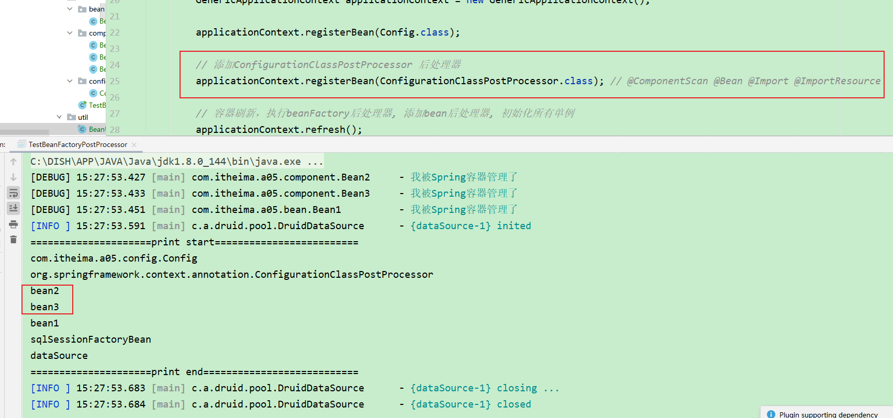

##### 5、添加`MapperScannerConfigurer` 解析Mapper接口

###### 5.1 Mapper1

```java
package com.itheima.a05.mapper;

import org.apache.ibatis.annotations.Mapper;

/**
 * @author lyf
 * @version 1.0
 * @classname Mapper1
 * @description
 * @since 2022/12/6 15:34
 */
@Mapper
public interface Mapper1 {
}

```

###### 5.2 Mapper2

```java
package com.itheima.a05.mapper;

import org.apache.ibatis.annotations.Mapper;

/**
 * @author lyf
 * @version 1.0
 * @classname Mapper1
 * @description
 * @since 2022/12/6 15:34
 */
@Mapper
public interface Mapper2 {
}

```

###### 5.3 Mapper3

```java
package com.itheima.a05.mapper;

/**
 * @author lyf
 * @version 1.0
 * @classname Mapper1
 * @description
 * @since 2022/12/6 15:34
 */
public class Mapper3 {
}

```

###### 5.4 测试代码

```java
package com.itheima.a05;

import com.itheima.a05.config.Config;
import com.itheima.util.BeanUtil;
import lombok.extern.slf4j.Slf4j;
import org.mybatis.spring.mapper.MapperScannerConfigurer;
import org.springframework.context.annotation.ConfigurationClassPostProcessor;
import org.springframework.context.support.GenericApplicationContext;

/**
 * @author lyf
 * @version 1.0
 * @classname TestBeanFactoryPostProcessor
 * @description 测试Bean工厂后处理器
 * @since 2022/12/6 15:06
 */
@Slf4j
public class TestBeanFactoryPostProcessor {
    public static void main(String[] args) {
        // 创建一个干净的容器
        GenericApplicationContext applicationContext = new GenericApplicationContext();

        applicationContext.registerBean(Config.class);

        // 添加ConfigurationClassPostProcessor 后处理器
        applicationContext.registerBean(ConfigurationClassPostProcessor.class); // @ComponentScan @Bean @Import @ImportResource

        // 添加MapperScannerConfigurer 解析Mapper接口
        applicationContext.registerBean(MapperScannerConfigurer.class, bd -> {
            bd.getPropertyValues().add("basePackage", "com.itheima.a05.mapper");
        });

        // 容器刷新，执行beanFactory后处理器, 添加bean后处理器, 初始化所有单例
        applicationContext.refresh();

        // 打印容器中定义的bean的名称
        BeanUtil.printBeanNames(applicationContext);

        // 销毁容器
        applicationContext.close();
    }
}

```

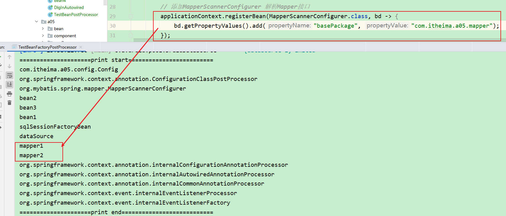

##### 6、小结

* ConfigurationClassPostProcessor 可以解析
  * @ComponentScan
  * @Bean
  * @Import
  * @ImportResource
* MapperScannerConfigurer 可以解析
  * Mapper 接口

#### 5.1.2 收获💡

1. @ComponentScan, @Bean, @Mapper 等注解的解析属于核心容器（即 BeanFactory）的扩展功能
2. 这些扩展功能由不同的 BeanFactory 后处理器来完成，其实主要就是补充了一些 bean 定义


### 5.2 演示2 - 模拟解析 @ComponentScan

#### 5.2.1 代码参考 

**com.itheima.a05.annotation.ComponentScanPostProcessor**

```java
package com.itheima.a05.annotation;

import com.itheima.a05.config.Config;
import lombok.extern.slf4j.Slf4j;
import org.springframework.beans.BeansException;
import org.springframework.beans.factory.config.ConfigurableListableBeanFactory;
import org.springframework.beans.factory.support.AbstractBeanDefinition;
import org.springframework.beans.factory.support.BeanDefinitionBuilder;
import org.springframework.beans.factory.support.BeanDefinitionRegistry;
import org.springframework.beans.factory.support.BeanDefinitionRegistryPostProcessor;
import org.springframework.context.annotation.AnnotationBeanNameGenerator;
import org.springframework.context.annotation.ComponentScan;
import org.springframework.core.annotation.AnnotationUtils;
import org.springframework.core.io.Resource;
import org.springframework.core.io.support.PathMatchingResourcePatternResolver;
import org.springframework.core.type.AnnotationMetadata;
import org.springframework.core.type.classreading.CachingMetadataReaderFactory;
import org.springframework.core.type.classreading.MetadataReader;
import org.springframework.stereotype.Component;

import java.io.IOException;

/**
 * @author lyf
 * @version 1.0
 * @classname ComponentScanPostProcessor
 * @description @ComponentScan注解BeanFactory后处理器，用于解析此
 * @since 2022/12/6 16:10
 */
@Slf4j
public class ComponentScanPostProcessor implements BeanDefinitionRegistryPostProcessor {

    @Override
    public void postProcessBeanDefinitionRegistry(BeanDefinitionRegistry registry) throws BeansException {
        try {
            // 1 通过AnnotationUtils.findAnnotation方法获取ComponentScan注解对象
            ComponentScan componentScan = AnnotationUtils.findAnnotation(Config.class, ComponentScan.class);
            // 2 ComponentScan注解对象不为空则执行后续代码
            if (componentScan == null) {
                log.debug("{} 没有@ComponentScan注解", Config.class.getName());
                return;
            }
            // 3 获取basePackages，并遍历它
            String[] packages = componentScan.basePackages();

            CachingMetadataReaderFactory readerFactory = new CachingMetadataReaderFactory();
            for (String myPackage : packages) {
                // 4 将全限定路径转换成文件路径：classpath*:xxx/xxx/**/*.class
                String resourcePath = "classpath*:" + myPackage.replace(".", "/") + "**/*.class";
                // 5 通过PathMatchingResourcePatternResolver的getResource方法获取所有的.class文件
                Resource[] resources = new PathMatchingResourcePatternResolver().getResources(resourcePath);
                // 6 遍历Resources
                for (Resource resource : resources) {
                    // 7 通过CachingMetadataReaderFactory的getMetadataReader方法读取resource
                    MetadataReader metadataReader = readerFactory.getMetadataReader(resource);
                    // 8 通过reader的getAnnotationMetadata方法拿到AnnotationMetadata
                    AnnotationMetadata annotationMetadata = metadataReader.getAnnotationMetadata();
                    // 9 通过判断是否有Component注解或者是它的派生注解
                    if (annotationMetadata.hasAnnotation(Component.class.getName()) // 是否有@Component注解
                            || annotationMetadata.hasMetaAnnotation(Component.class.getName())) { // 是否有@Component的派生注解
                        // 10 有的话，则需要将其进行注册
                        // 10.1 获取BeanDefinition
                        AbstractBeanDefinition beanDefinition = BeanDefinitionBuilder.genericBeanDefinition(
                                metadataReader.getClassMetadata().getClassName()).getBeanDefinition();
                        // 10.2 构造beanName
                        String beanName = AnnotationBeanNameGenerator.INSTANCE.generateBeanName(beanDefinition, registry);
                        // 10.3 注册bean
                        registry.registerBeanDefinition(beanName, beanDefinition);
                    }
                }
            }
        } catch (IOException e) {
            log.error("", e);
        }
    }

    @Override // context.refresh()
    public void postProcessBeanFactory(ConfigurableListableBeanFactory beanFactory) throws BeansException {

    }
}

```

##### 5.2.1.1 测试代码

```java
package com.itheima.a05;

import com.itheima.a05.annotation.ComponentScanPostProcessor;
import com.itheima.a05.config.Config;
import com.itheima.util.BeanUtil;
import lombok.extern.slf4j.Slf4j;
import org.mybatis.spring.mapper.MapperScannerConfigurer;
import org.springframework.context.annotation.ConfigurationClassPostProcessor;
import org.springframework.context.support.GenericApplicationContext;

/**
 * @author lyf
 * @version 1.0
 * @classname TestBeanFactoryPostProcessor
 * @description 测试Bean工厂后处理器
 * @since 2022/12/6 15:06
 */
@Slf4j
public class TestBeanFactoryPostProcessor {
    public static void main(String[] args) {
        // 创建一个干净的容器
        GenericApplicationContext applicationContext = new GenericApplicationContext();

        applicationContext.registerBean(Config.class);

       /* // 添加ConfigurationClassPostProcessor 后处理器
        applicationContext.registerBean(ConfigurationClassPostProcessor.class); // @ComponentScan @Bean @Import @ImportResource

        // 添加MapperScannerConfigurer 解析Mapper接口
        applicationContext.registerBean(MapperScannerConfigurer.class, bd -> {
            bd.getPropertyValues().add("basePackage", "com.itheima.a05.mapper");
        });*/

        // 注入自定义的ComponentScanPostProcessor用于解析@ComponentScan注解
        applicationContext.registerBean(ComponentScanPostProcessor.class);

        // 容器刷新，执行beanFactory后处理器, 添加bean后处理器, 初始化所有单例
        applicationContext.refresh();

        // 打印容器中定义的bean的名称
        BeanUtil.printBeanNames(applicationContext);

        // 销毁容器
        applicationContext.close();
    }
}

```

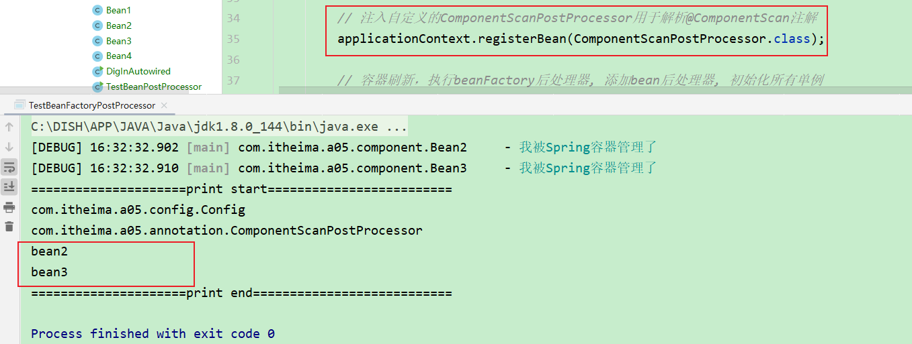

#### 5.2.2 收获💡

1. Spring 操作元数据的工具类 CachingMetadataReaderFactory
2. 通过注解元数据（AnnotationMetadata）获取直接或间接标注的注解信息
3. 通过类元数据（ClassMetadata）获取类名，AnnotationBeanNameGenerator 生成 bean 名
4. 解析元数据是基于 ASM 技术(一种字节码增强技术)


### 5.3 演示3 - 模拟解析 @Bean

#### 5.3.1 代码参考 

**com.itheima.a05.annotation.AtBeanPostProcessor**

```java
package com.itheima.a05.annotation;

import lombok.extern.slf4j.Slf4j;
import org.springframework.beans.BeansException;
import org.springframework.beans.factory.config.ConfigurableListableBeanFactory;
import org.springframework.beans.factory.support.AbstractBeanDefinition;
import org.springframework.beans.factory.support.BeanDefinitionBuilder;
import org.springframework.beans.factory.support.BeanDefinitionRegistry;
import org.springframework.beans.factory.support.BeanDefinitionRegistryPostProcessor;
import org.springframework.context.annotation.Bean;
import org.springframework.core.io.ClassPathResource;
import org.springframework.core.type.MethodMetadata;
import org.springframework.core.type.classreading.CachingMetadataReaderFactory;
import org.springframework.core.type.classreading.MetadataReader;
import org.springframework.util.ObjectUtils;

import java.io.IOException;
import java.util.Map;
import java.util.Set;

/**
 * @author lyf
 * @version 1.0
 * @classname AtBeanPostProcessor
 * @description 解析@Bean注解的BeanFactory后处理器
 * @since 2022/12/6 16:36
 */
@Slf4j
public class AtBeanPostProcessor implements BeanDefinitionRegistryPostProcessor {
    @Override
    public void postProcessBeanDefinitionRegistry(BeanDefinitionRegistry registry) throws BeansException {
        try {
            // 1 通过CachingMetadataReaderFactory的getMetadataReader方法拿到com/itheima/a05/config/Config.java的字节码文件
            CachingMetadataReaderFactory factory = new CachingMetadataReaderFactory();
            MetadataReader reader = factory.getMetadataReader(new ClassPathResource("com/itheima/a05/config/Config.class"));

            // 2 先理清楚一点概念，Config现在是个工厂，其中@Bean注解标识的方法为工厂方法
            // 2.1 获取所有@Bean注解标识的方法
            Set<MethodMetadata> methods = reader.getAnnotationMetadata().getAnnotatedMethods(Bean.class.getName());
            // 3 遍历methods
            for (MethodMetadata method : methods) {
                BeanDefinitionBuilder builder = BeanDefinitionBuilder.genericBeanDefinition();

                // 4 设置工厂方法模板
                builder.setFactoryMethodOnBean(method.getMethodName(), "config");

                /*
                    5 解决方法参数自动装配问题
                        @Bean
                        public SqlSessionFactoryBean sqlSessionFactoryBean(DataSource dataSource) {
                            SqlSessionFactoryBean sqlSessionFactoryBean = new SqlSessionFactoryBean();
                            sqlSessionFactoryBean.setDataSource(dataSource);
                            return sqlSessionFactoryBean;
                        }
                 */
                builder.setAutowireMode(AbstractBeanDefinition.AUTOWIRE_CONSTRUCTOR);

                /*  
                    6 获取@Bean的参数initMethod
                        @Bean(initMethod = "init")
                        public DruidDataSource dataSource() {
                            ...
                        }
                 */
                Map<String, Object> attributes = method.getAnnotationAttributes(Bean.class.getName());
                if (attributes != null) {
                    String initMethod = attributes.get("initMethod").toString();
                    if (!ObjectUtils.isEmpty(initMethod)) {
                        builder.setInitMethodName(initMethod);
                    }
                }

                // 7 获取AbstractBeanDefinition
                AbstractBeanDefinition beanDefinition = builder.getBeanDefinition();
                // 8 将Bean注入到容器中, bean的名称就是方法名
                registry.registerBeanDefinition(method.getMethodName(), beanDefinition);
            }

        } catch (IOException e) {
            e.printStackTrace();
        }
    }

    @Override
    public void postProcessBeanFactory(ConfigurableListableBeanFactory beanFactory) throws BeansException {

    }
}

```

##### 1、测试代码

```java
package com.itheima.a05;

import com.itheima.a05.annotation.AtBeanPostProcessor;
import com.itheima.a05.config.Config;
import com.itheima.util.BeanUtil;
import lombok.extern.slf4j.Slf4j;
import org.springframework.context.support.GenericApplicationContext;

/**
 * @author lyf
 * @version 1.0
 * @classname TestBeanFactoryPostProcessor
 * @description 测试Bean工厂后处理器
 * @since 2022/12/6 15:06
 */
@Slf4j
public class TestBeanFactoryPostProcessor {
    public static void main(String[] args) {
        // 创建一个干净的容器
        GenericApplicationContext applicationContext = new GenericApplicationContext();
        applicationContext.registerBean("config", Config.class);
        // 注入自定义的AtBeanPostProcessor用于解析@Bean注解
        applicationContext.registerBean(AtBeanPostProcessor.class);
        // 容器刷新，执行beanFactory后处理器, 添加bean后处理器, 初始化所有单例
        applicationContext.refresh();
        // 打印容器中定义的bean的名称
        BeanUtil.printBeanNames(applicationContext);
        // 销毁容器
        applicationContext.close();
    }
}
```

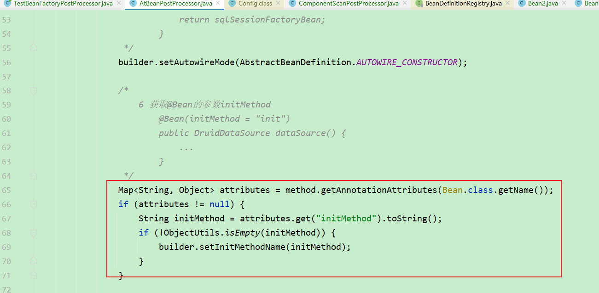

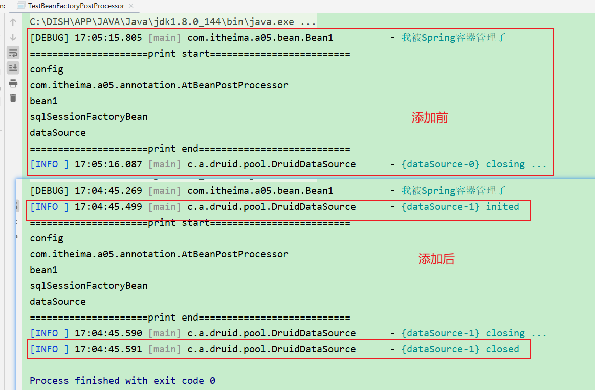

#### 5.3.2 收获💡

1. 进一步熟悉注解元数据（AnnotationMetadata）获取方法上注解信息

### 5.4 演示4 - 模拟解析 Mapper 接口

#### 5.4.1 代码参考 

##### 1、在Config添加如下代码

```java

    @Bean
    public MapperFactoryBean<Mapper1> mapper1(SqlSessionFactory sqlSessionFactory) {
        MapperFactoryBean<Mapper1> factoryBean = new MapperFactoryBean<>(Mapper1.class);
        factoryBean.setSqlSessionFactory(sqlSessionFactory);
        return factoryBean;
    }

    @Bean
    public MapperFactoryBean<Mapper2> mapper2(SqlSessionFactory sqlSessionFactory) {
        MapperFactoryBean<Mapper2> factoryBean = new MapperFactoryBean<>(Mapper2.class);
        factoryBean.setSqlSessionFactory(sqlSessionFactory);
        return factoryBean;
    }
```

###### 1.1、测试

```java
package com.itheima.a05;

import com.itheima.a05.annotation.AtBeanPostProcessor;
import com.itheima.a05.config.Config;
import com.itheima.util.BeanUtil;
import lombok.extern.slf4j.Slf4j;
import org.springframework.context.support.GenericApplicationContext;

/**
 * @author lyf
 * @version 1.0
 * @classname TestBeanFactoryPostProcessor
 * @description 测试Bean工厂后处理器
 * @since 2022/12/6 15:06
 */
@Slf4j
public class TestBeanFactoryPostProcessor {
    public static void main(String[] args) {
        // 创建一个干净的容器
        GenericApplicationContext applicationContext = new GenericApplicationContext();
        applicationContext.registerBean("config", Config.class);
        // 注入自定义的AtBeanPostProcessor用于解析@Bean注解
        applicationContext.registerBean(AtBeanPostProcessor.class);
        // 容器刷新，执行beanFactory后处理器, 添加bean后处理器, 初始化所有单例
        applicationContext.refresh();
        // 打印容器中定义的bean的名称
        BeanUtil.printBeanNames(applicationContext);
        // 销毁容器
        applicationContext.close();
    }
}
```

###### 1.2、结果

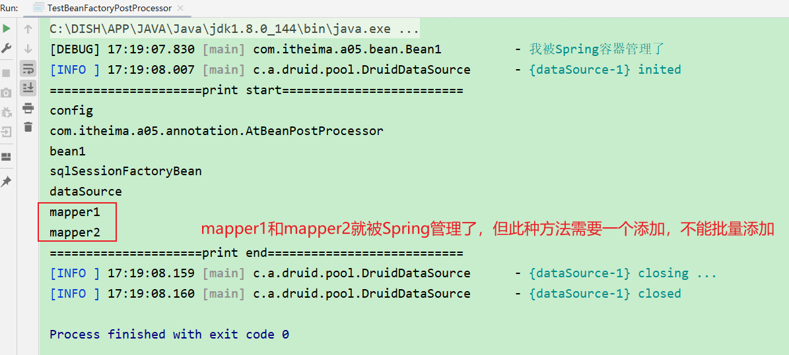

> mapper1和mapper2就被Spring管理了，但此种方法需要一个添加，不能批量添加

##### 2、模拟MapperScannerConfigurer我们来写一个自定义版的MapperScanner解析器

> ps: 先注释掉先前在Config中添加的两个Mapper
>
> ```java
> /* @Bean
>     public MapperFactoryBean<Mapper1> mapper1(SqlSessionFactory sqlSessionFactory) {
>         MapperFactoryBean<Mapper1> factoryBean = new MapperFactoryBean<>(Mapper1.class);
>         factoryBean.setSqlSessionFactory(sqlSessionFactory);
>         return factoryBean;
>     }
> 
>     @Bean
>     public MapperFactoryBean<Mapper2> mapper2(SqlSessionFactory sqlSessionFactory) {
>         MapperFactoryBean<Mapper2> factoryBean = new MapperFactoryBean<>(Mapper2.class);
>         factoryBean.setSqlSessionFactory(sqlSessionFactory);
>         return factoryBean;
>     }*/
> ```
>
> 

**com.itheima.a05.annotation.MapperPostProcessor**

```java
package com.itheima.a05.annotation;

import lombok.extern.slf4j.Slf4j;
import org.apache.ibatis.annotations.Mapper;
import org.mybatis.spring.mapper.MapperFactoryBean;
import org.springframework.beans.BeansException;
import org.springframework.beans.factory.config.ConfigurableListableBeanFactory;
import org.springframework.beans.factory.support.AbstractBeanDefinition;
import org.springframework.beans.factory.support.BeanDefinitionBuilder;
import org.springframework.beans.factory.support.BeanDefinitionRegistry;
import org.springframework.beans.factory.support.BeanDefinitionRegistryPostProcessor;
import org.springframework.context.annotation.AnnotationBeanNameGenerator;
import org.springframework.core.io.Resource;
import org.springframework.core.io.support.PathMatchingResourcePatternResolver;
import org.springframework.core.type.AnnotationMetadata;
import org.springframework.core.type.ClassMetadata;
import org.springframework.core.type.classreading.CachingMetadataReaderFactory;
import org.springframework.core.type.classreading.MetadataReader;

import java.io.IOException;

/**
 * @author lyf
 * @version 1.0
 * @classname MapperPostProcessor
 * @description 模拟解析MapperScan
 * @since 2022/12/6 17:11
 */
@Slf4j
public class MapperPostProcessor implements BeanDefinitionRegistryPostProcessor {

    @Override
    public void postProcessBeanDefinitionRegistry(BeanDefinitionRegistry registry) throws BeansException {
        try {
            CachingMetadataReaderFactory readerFactory = new CachingMetadataReaderFactory();
            PathMatchingResourcePatternResolver pathResolver = new PathMatchingResourcePatternResolver();
            Resource[] resources = pathResolver.getResources("classpath:com/itheima/a05/mapper/**/*.class");
            for (Resource resource : resources) {
                MetadataReader reader = readerFactory.getMetadataReader(resource);
                ClassMetadata classMetadata = reader.getClassMetadata(); // 获取类的元信息
                AnnotationMetadata annotationMetadata = reader.getAnnotationMetadata(); // 获取注解的元信息
                // 是个接口，并且有@Mapper注解，则表示这是一个Mapper接口
                if (classMetadata.isInterface() && annotationMetadata.hasAnnotation(Mapper.class.getName())) {
                    // 先获取beanName
                    AbstractBeanDefinition beanNameBeanDefinition = BeanDefinitionBuilder.genericBeanDefinition(classMetadata.getClassName()).getBeanDefinition();
                    String beanName = AnnotationBeanNameGenerator.INSTANCE.generateBeanName(beanNameBeanDefinition, registry);

                    // 获取beanDefinition
                    AbstractBeanDefinition beanDefinition = BeanDefinitionBuilder.genericBeanDefinition(MapperFactoryBean.class)
                            .addConstructorArgValue(classMetadata.getClassName())
                            .setAutowireMode(AbstractBeanDefinition.AUTOWIRE_BY_TYPE)
                            .getBeanDefinition();
                    registry.registerBeanDefinition(beanName, beanDefinition);
                }
            }
        } catch (IOException e) {
            e.printStackTrace();
        }
    }

    @Override
    public void postProcessBeanFactory(ConfigurableListableBeanFactory beanFactory) throws BeansException {

    }
}

```

###### 1、测试代码

```java
package com.itheima.a05;

import com.itheima.a05.annotation.AtBeanPostProcessor;
import com.itheima.a05.annotation.MapperPostProcessor;
import com.itheima.a05.config.Config;
import com.itheima.util.BeanUtil;
import lombok.extern.slf4j.Slf4j;
import org.springframework.context.support.GenericApplicationContext;

/**
 * @author lyf
 * @version 1.0
 * @classname TestBeanFactoryPostProcessor
 * @description 测试Bean工厂后处理器
 * @since 2022/12/6 15:06
 */
@Slf4j
public class TestBeanFactoryPostProcessor {
    public static void main(String[] args) {
        // 创建一个干净的容器
        GenericApplicationContext applicationContext = new GenericApplicationContext();
        applicationContext.registerBean("config", Config.class);
        // 注入自定义的AtBeanPostProcessor用于解析@Bean注解
        applicationContext.registerBean(AtBeanPostProcessor.class); // 解析@Bean
        applicationContext.registerBean(MapperPostProcessor.class); // 解析@Mapper
        // 容器刷新，执行beanFactory后处理器, 添加bean后处理器, 初始化所有单例
        applicationContext.refresh();
        // 打印容器中定义的bean的名称
        BeanUtil.printBeanNames(applicationContext);
        // 销毁容器
        applicationContext.close();
    }
}

```

###### 2、测试结果

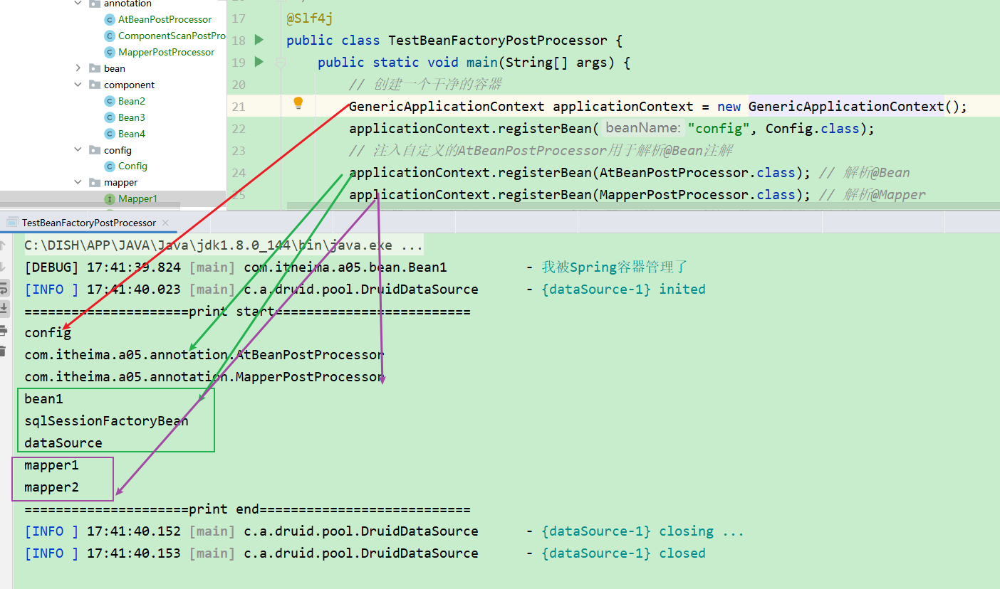

#### 5.4.2 收获💡

1. Mapper 接口被 Spring 管理的本质：实际是被作为 MapperFactoryBean 注册到容器中
2. Spring 的诡异做法，根据接口生成的 BeanDefinition 仅为根据接口名生成 bean 名


## 6 Aware 接口

### 6.1 演示 - Aware 接口及 InitializingBean 接口

#### 6.1.1 代码参考 

##### 1、BeanNameAware, ApplicationContextAware, InitializingBean的基本使用

###### 1.1 MyBean

```java
package com.itheima.a06.bean;

import lombok.extern.slf4j.Slf4j;
import org.springframework.beans.BeansException;
import org.springframework.beans.factory.BeanNameAware;
import org.springframework.beans.factory.InitializingBean;
import org.springframework.context.ApplicationContext;
import org.springframework.context.ApplicationContextAware;

/**
 * @author lyf
 * @version 1.0
 * @classname MyBean
 * @description
 * @since 2022/12/6 18:38
 */
@Slf4j
public class MyBean implements BeanNameAware, ApplicationContextAware, InitializingBean {
    @Override
    public void setBeanName(String name) {
        log.debug("实现了BeanNameAware接口, 当前 {} beanName is {}", this, name);
    }

    @Override
    public void setApplicationContext(ApplicationContext applicationContext) throws BeansException {
        log.debug("实现了ApplicationContextAware接口, 当前 {} 容器 is {}", this, applicationContext);
    }

    @Override
    public void afterPropertiesSet() throws Exception {
        log.debug("实现了InitializingBean接口, 当前 {} 初始化", this);
    }
}

```

###### 1.2 测试代码

```java
package com.itheima.a06;

import com.itheima.a06.bean.MyBean;
import lombok.extern.slf4j.Slf4j;
import org.springframework.context.support.GenericApplicationContext;

/**
 * @author lyf
 * @version 1.0
 * @classname TestAwareAndInitializingBean
 * @description 测试Aware接口和InitializingBean
 * @since 2022/12/6 18:37
 */
@Slf4j
public class TestAwareAndInitializingBean {
    public static void main(String[] args) {
        GenericApplicationContext applicationContext = new GenericApplicationContext();

        applicationContext.registerBean("myBean", MyBean.class);

        applicationContext.refresh();
        applicationContext.close();
    }
}

```

###### 1.3 测试结果

```verilog
[DEBUG] 18:43:21.987 [main] com.itheima.a06.bean.MyBean         - 实现了BeanNameAware接口, 当前 com.itheima.a06.bean.MyBean@4bb4de6a beanName is myBean 
[DEBUG] 18:43:21.996 [main] com.itheima.a06.bean.MyBean         - 实现了ApplicationContextAware接口, 当前 com.itheima.a06.bean.MyBean@4bb4de6a 容器 is org.springframework.context.support.GenericApplicationContext@5d5eef3d, started on Tue Dec 06 18:43:21 CST 2022 
[DEBUG] 18:43:21.997 [main] com.itheima.a06.bean.MyBean         - 实现了InitializingBean接口, 当前 com.itheima.a06.bean.MyBean@4bb4de6a 初始化 
```

##### 2、通过@Autowired和PostStructer

###### 2.1、MyBean

```java
package com.itheima.a06.bean;

import lombok.extern.slf4j.Slf4j;
import org.springframework.beans.BeansException;
import org.springframework.beans.factory.BeanNameAware;
import org.springframework.beans.factory.InitializingBean;
import org.springframework.beans.factory.annotation.Autowired;
import org.springframework.context.ApplicationContext;
import org.springframework.context.ApplicationContextAware;

import javax.annotation.PostConstruct;

/**
 * @author lyf
 * @version 1.0
 * @classname MyBean
 * @description
 * @since 2022/12/6 18:38
 */
@Slf4j
public class MyBean implements BeanNameAware, ApplicationContextAware, InitializingBean {
    @Override
    public void setBeanName(String name) {
        log.debug("实现了BeanNameAware接口, 当前 {} beanName is {}", this, name);
    }

    @Override
    public void setApplicationContext(ApplicationContext applicationContext) throws BeansException {
        log.debug("实现了ApplicationContextAware接口, 当前 {} 容器 is {}", this, applicationContext);
    }

    @Override
    public void afterPropertiesSet() throws Exception {
        log.debug("实现了InitializingBean接口, 当前 {} 初始化", this);
    }

    @Autowired
    public void initApplicationContext(ApplicationContext applicationContext) {
        log.debug("通过@Autowired注入ApplicationContext, 当前 {} 容器 is {}", this, applicationContext);
    }

    @PostConstruct
    public void init() {
        log.debug("通过@PostConstruct初始化, 当前 {} 初始化", this);
    }
}

```

###### 2.2、测试代码

```java
package com.itheima.a06;

import com.itheima.a06.bean.MyBean;
import lombok.extern.slf4j.Slf4j;
import org.springframework.context.support.GenericApplicationContext;

/**
 * @author lyf
 * @version 1.0
 * @classname TestAwareAndInitializingBean
 * @description 测试Aware接口和InitializingBean
 * @since 2022/12/6 18:37
 */
@Slf4j
public class TestAwareAndInitializingBean {
    public static void main(String[] args) {
        GenericApplicationContext applicationContext = new GenericApplicationContext();

        applicationContext.registerBean("myBean", MyBean.class);

        applicationContext.refresh();
        applicationContext.close();
    }
}

```

**2.2.1、结果**

```verilog
[DEBUG] 18:48:16.558 [main] com.itheima.a06.bean.MyBean         - 实现了BeanNameAware接口, 当前 com.itheima.a06.bean.MyBean@4bb4de6a beanName is myBean 
[DEBUG] 18:48:16.567 [main] com.itheima.a06.bean.MyBean         - 实现了ApplicationContextAware接口, 当前 com.itheima.a06.bean.MyBean@4bb4de6a 容器 is org.springframework.context.support.GenericApplicationContext@5d5eef3d, started on Tue Dec 06 18:48:16 CST 2022 
[DEBUG] 18:48:16.570 [main] com.itheima.a06.bean.MyBean         - 实现了InitializingBean接口, 当前 com.itheima.a06.bean.MyBean@4bb4de6a 初始化 
```

> 可以发现@Autowired和@PostConstruct标识的方法，都没有被解析
>
> @Autowired和@PostConstruct需要加入相应的后处理器，才能被正确解析
>
> 而BeanNameAware, ApplicationContextAware, InitializingBean
>
> 能一直被执行

###### 2.3 测试代码2（添加相应的后处理器）

```java
package com.itheima.a06;

import com.itheima.a06.bean.MyBean;
import lombok.extern.slf4j.Slf4j;
import org.springframework.beans.factory.annotation.AutowiredAnnotationBeanPostProcessor;
import org.springframework.context.annotation.CommonAnnotationBeanPostProcessor;
import org.springframework.context.support.GenericApplicationContext;

/**
 * @author lyf
 * @version 1.0
 * @classname TestAwareAndInitializingBean
 * @description 测试Aware接口和InitializingBean
 * @since 2022/12/6 18:37
 */
@Slf4j
public class TestAwareAndInitializingBean {
    public static void main(String[] args) {
        GenericApplicationContext applicationContext = new GenericApplicationContext();

        applicationContext.registerBean("myBean", MyBean.class);

        // 加入相应的后处理器
        applicationContext.registerBean(AutowiredAnnotationBeanPostProcessor.class); // 解析@Autowired和@Value注解
        applicationContext.registerBean(CommonAnnotationBeanPostProcessor.class); // 解析@Resource、@PostConstruct、@PreDestroy

        applicationContext.refresh();
        applicationContext.close();
    }
}

```

**2.3.1 测试结果**

```verilog
[DEBUG] 18:52:54.772 [main] com.itheima.a06.bean.MyBean         - 通过@Autowired注入ApplicationContext, 当前 com.itheima.a06.bean.MyBean@23282c25 容器 is org.springframework.context.support.GenericApplicationContext@5d5eef3d, started on Tue Dec 06 18:52:54 CST 2022 
[DEBUG] 18:52:54.783 [main] com.itheima.a06.bean.MyBean         - 实现了BeanNameAware接口, 当前 com.itheima.a06.bean.MyBean@23282c25 beanName is myBean 
[DEBUG] 18:52:54.783 [main] com.itheima.a06.bean.MyBean         - 实现了ApplicationContextAware接口, 当前 com.itheima.a06.bean.MyBean@23282c25 容器 is org.springframework.context.support.GenericApplicationContext@5d5eef3d, started on Tue Dec 06 18:52:54 CST 2022 
[DEBUG] 18:52:54.783 [main] com.itheima.a06.bean.MyBean         - 通过@PostConstruct初始化, 当前 com.itheima.a06.bean.MyBean@23282c25 初始化 
[DEBUG] 18:52:54.783 [main] com.itheima.a06.bean.MyBean         - 实现了InitializingBean接口, 当前 com.itheima.a06.bean.MyBean@23282c25 初始化 

```

##### 3、@Autowired和@PostConstruct 失效演示

###### 3.1 MyConfig1

```java
package com.itheima.a06.config;

import lombok.extern.slf4j.Slf4j;
import org.springframework.beans.factory.annotation.Autowired;
import org.springframework.beans.factory.config.BeanFactoryPostProcessor;
import org.springframework.context.ApplicationContext;
import org.springframework.context.annotation.Bean;
import org.springframework.context.annotation.Configuration;

import javax.annotation.PostConstruct;

/**
 * @author lyf
 * @version 1.0
 * @classname MyConfig1
 * @description
 * @since 2022/12/6 18:56
 */
@Slf4j
@Configuration
public class MyConfig1 {
    @Autowired
    public void setApplicationContext(ApplicationContext applicationContext) {
        log.debug("注入 ApplicationContext");
    }

    @PostConstruct
    public void init() {
        log.debug("初始化");
    }

    /**
     * beanFactory 后处理器
     *
     * @return BeanFactoryPostProcessor
     */
    @Bean
    public BeanFactoryPostProcessor processor1() {
        return beanFactory -> {
            log.debug("执行 processor1");
        };
    }
}

```

###### 3.2 MyConfig2

```java
package com.itheima.a06.config;

import lombok.extern.slf4j.Slf4j;
import org.springframework.beans.BeansException;
import org.springframework.beans.factory.InitializingBean;
import org.springframework.beans.factory.config.BeanFactoryPostProcessor;
import org.springframework.context.ApplicationContext;
import org.springframework.context.ApplicationContextAware;
import org.springframework.context.annotation.Bean;
import org.springframework.context.annotation.Configuration;

/**
 * @author lyf
 * @version 1.0
 * @classname MyConfig2
 * @description
 * @since 2022/12/6 18:57
 */
@Slf4j
@Configuration
public class MyConfig2 implements InitializingBean, ApplicationContextAware {
    @Override
    public void afterPropertiesSet() throws Exception {
        log.debug("初始化");
    }

    @Override
    public void setApplicationContext(ApplicationContext applicationContext) throws BeansException {
        log.debug("注入 ApplicationContext");
    }

    /**
     * beanFactory 后处理器
     *
     * @return BeanFactoryPostProcessor
     */
    @Bean
    public BeanFactoryPostProcessor processor2() {
        return beanFactory -> {
            log.debug("执行 processor2");
        };
    }
}

```

###### 3.2 测试代码

```java
package com.itheima.a06;

import com.itheima.a05.annotation.ComponentScanPostProcessor;
import com.itheima.a06.bean.MyBean;
import com.itheima.a06.config.MyConfig1;
import com.itheima.a06.config.MyConfig2;
import lombok.extern.slf4j.Slf4j;
import org.springframework.beans.factory.annotation.AutowiredAnnotationBeanPostProcessor;
import org.springframework.context.annotation.CommonAnnotationBeanPostProcessor;
import org.springframework.context.annotation.ConfigurationClassPostProcessor;
import org.springframework.context.support.GenericApplicationContext;

/**
 * @author lyf
 * @version 1.0
 * @classname TestAwareAndInitializingBean
 * @description 测试Aware接口和InitializingBean
 * @since 2022/12/6 18:37
 */
@Slf4j
public class TestAwareAndInitializingBean {
    public static void main(String[] args) {
          /*
            1. Aware 接口用于注入一些与容器相关信息, 例如
                a. BeanNameAware 注入 bean 的名字
                b. BeanFactoryAware 注入 BeanFactory 容器
                c. ApplicationContextAware 注入 ApplicationContext 容器
                d. EmbeddedValueResolverAware ${}
             2. 有同学说: b、c、d 的功能用 @Autowired 就能实现啊, 为啥还要用 Aware 接口呢
                简单地说:
                    a. @Autowired 的解析需要用到 bean 后处理器, 属于扩展功能
                    b. 而 Aware 接口属于内置功能, 不加任何扩展, Spring 就能识别
                某些情况下, 扩展功能会失效, 而内置功能不会失效

                例1: 你会发现用 Aware 注入 ApplicationContext 成功, 而 @Autowired 注入 ApplicationContext 失败

                例2: Java 配置类在添加了 bean 工厂后处理器后,
                你会发现用传统接口方式的注入和初始化仍然成功, 而 @Autowired 和 @PostConstruct 的注入和初始化失败

           3. 学到了什么
                a. Aware 接口提供了一种【内置】 的注入手段, 可以注入 BeanFactory, ApplicationContext
                b. InitializingBean 接口提供了一种【内置】的初始化手段
                c. 内置的注入和初始化不受扩展功能的影响, 总会被执行, 因此 Spring 框架内部的类常用它们

         */
        GenericApplicationContext applicationContext = new GenericApplicationContext();

        // applicationContext.registerBean("myBean", MyBean.class);
        applicationContext.registerBean("myConfig1", MyConfig1.class);
        applicationContext.registerBean("myConfig2", MyConfig2.class);

        // 加入相应的后处理器
        applicationContext.registerBean(AutowiredAnnotationBeanPostProcessor.class); // 解析@Autowired和@Value注解
        applicationContext.registerBean(CommonAnnotationBeanPostProcessor.class); // 解析@Resource、@PostConstruct、@PreDestroy
        applicationContext.registerBean(ConfigurationClassPostProcessor.class); // 解析@Configuration注解

        applicationContext.refresh();
        applicationContext.close();
    }
}

```

###### 3.3 测试结果

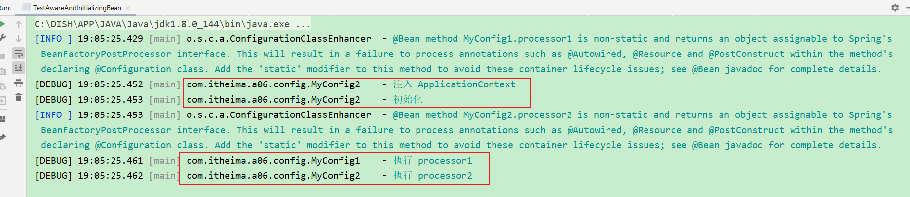

> @Autowired和@PostConstruct 注解标注的方法失效了

#### 6.1.2 收获💡

1. Aware 接口提供了一种【内置】 的注入手段，例如
   * BeanNameAware 注入 bean 的名字
   * BeanFactoryAware 注入 BeanFactory 容器
   * ApplicationContextAware 注入 ApplicationContext 容器
   * EmbeddedValueResolverAware 注入 ${} 解析器
2. InitializingBean 接口提供了一种【内置】的初始化手段
3. 对比
   * 内置的注入和初始化不受扩展功能的影响，总会被执行
   * 而扩展功能受某些情况影响可能会失效
   * 因此 Spring 框架内部的类常用内置注入和初始化


#### 6.1.3 配置类 @Autowired 失效分析

Java 配置类不包含 BeanFactoryPostProcessor 的情况

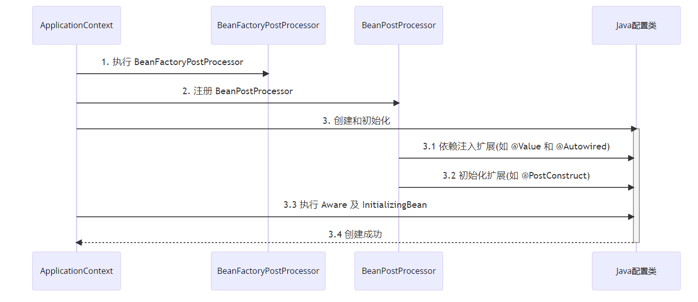

Java 配置类包含 BeanFactoryPostProcessor 的情况，因此要创建其中的 BeanFactoryPostProcessor 必须提前创建 Java 配置类，而此时的 BeanPostProcessor 还未准备好，导致 @Autowired 等注解失效

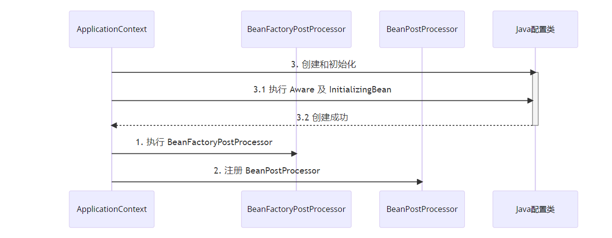

对应代码

```java
@Configuration
public class MyConfig1 {

    private static final Logger log = LoggerFactory.getLogger(MyConfig1.class);

    @Autowired
    public void setApplicationContext(ApplicationContext applicationContext) {
        log.debug("注入 ApplicationContext");
    }

    @PostConstruct
    public void init() {
        log.debug("初始化");
    }

    @Bean //  ⬅️ 注释或添加 beanFactory 后处理器对应上方两种情况
    public BeanFactoryPostProcessor processor1() {
        return beanFactory -> {
            log.debug("执行 processor1");
        };
    }

}
```

> ***注意***
>
> 解决方法：
>
> * 用内置依赖注入和初始化取代扩展依赖注入和初始化
> * 用静态工厂方法代替实例工厂方法，避免工厂对象提前被创建


## 7 初始化与销毁

### 7.1 演示 - 初始化销毁顺序

#### 7.1.1 代码参考 

##### 1、测试Bean的初始化

###### 1.1、Bean1

```java
package com.itheima.a07.bean;

import lombok.extern.slf4j.Slf4j;
import org.springframework.beans.factory.InitializingBean;

import javax.annotation.PostConstruct;

/**
 * @author lyf
 * @version 1.0
 * @classname Bean1
 * @description
 * @since 2022/12/6 19:16
 */
@Slf4j
public class Bean1 implements InitializingBean {
    @PostConstruct
    public void init1() {
        log.debug("@PostConstruct, {}, init1", this);
    }

    @Override
    public void afterPropertiesSet() throws Exception {
        log.debug("实现接口InitializingBean, {}, init2", this);
    }

    public void init3() {
        log.debug("通过@Bean(initMethod = \"init3\")指定初始化方法, {}, init3", this);
    }
}

```


##### 2、测试Bean的销毁

###### 2.1、Bean2

```java
package com.itheima.a07.bean;

import lombok.extern.slf4j.Slf4j;
import org.springframework.beans.factory.DisposableBean;
import org.springframework.beans.factory.InitializingBean;

import javax.annotation.PostConstruct;
import javax.annotation.PreDestroy;

/**
 * @author lyf
 * @version 1.0
 * @classname Bean1
 * @description
 * @since 2022/12/6 19:16
 */
@Slf4j
public class Bean2 implements DisposableBean {
    @PreDestroy
    public void destroy1() {
        log.debug("@PreDestroy, {}, destroy1", this);
    }

    @Override
    public void destroy() throws Exception {
        log.debug("通过实现DisposableBean接口, {}, destroy2", this);
    }

    public void destroy3() {
        log.debug("通过@Bean(destroyMethod = \"destroy3\")指定销毁方法, {}, destroy3", this);
    }
}

```

##### 3、MyConfig

```java
package com.itheima.a07.config;

import com.itheima.a07.bean.Bean1;
import com.itheima.a07.bean.Bean2;
import lombok.extern.slf4j.Slf4j;
import org.springframework.context.annotation.Bean;
import org.springframework.stereotype.Component;

/**
 * @author lyf
 * @version 1.0
 * @classname MyConfig
 * @description
 * @since 2022/12/6 19:43
 */
@Slf4j
public class MyConfig {
    @Bean(initMethod = "init3")
    public Bean1 getBean1() {
        return new Bean1();
    }

    @Bean(destroyMethod = "destroy3")
    public Bean2 getBean2() {
        return new Bean2();
    }
}

```

##### 4、测试代码

```java
package com.itheima.a07;

import com.itheima.a07.config.MyConfig;
import lombok.extern.slf4j.Slf4j;
import org.springframework.beans.factory.annotation.AutowiredAnnotationBeanPostProcessor;
import org.springframework.context.annotation.CommonAnnotationBeanPostProcessor;
import org.springframework.context.annotation.ConfigurationClassPostProcessor;
import org.springframework.context.support.GenericApplicationContext;

/**
 * @author lyf
 * @version 1.0
 * @classname TestBeanConstructAndDestroy
 * @description
 * @since 2022/12/6 19:23
 */
@Slf4j
public class TestBeanConstructAndDestroy {
    public static void main(String[] args) {
        GenericApplicationContext applicationContext = new GenericApplicationContext();

        applicationContext.registerBean("myConfig", MyConfig.class);

        applicationContext.registerBean(AutowiredAnnotationBeanPostProcessor.class);
        applicationContext.registerBean(CommonAnnotationBeanPostProcessor.class);
        applicationContext.registerBean(ConfigurationClassPostProcessor.class);
        applicationContext.refresh();
        applicationContext.close();
    }
}

```

##### 5、测试结果

```verilog
[DEBUG] 19:48:13.775 [main] com.itheima.a07.bean.Bean1          - @PostConstruct, com.itheima.a07.bean.Bean1@43301423, init1 
[DEBUG] 19:48:13.783 [main] com.itheima.a07.bean.Bean1          - 实现接口InitializingBean, com.itheima.a07.bean.Bean1@43301423, init2 
[DEBUG] 19:48:13.784 [main] com.itheima.a07.bean.Bean1          - 通过@Bean(initMethod = "init3")指定初始化方法, com.itheima.a07.bean.Bean1@43301423, init3 
[DEBUG] 19:48:13.829 [main] com.itheima.a07.bean.Bean2          - @PreDestroy, com.itheima.a07.bean.Bean2@3ba9ad43, destroy1 
[DEBUG] 19:48:13.830 [main] com.itheima.a07.bean.Bean2          - 通过实现DisposableBean接口, com.itheima.a07.bean.Bean2@3ba9ad43, destroy2 
[DEBUG] 19:48:13.830 [main] com.itheima.a07.bean.Bean2          - 通过@Bean(destroyMethod = "destroy3")指定销毁方法, com.itheima.a07.bean.Bean2@3ba9ad43, destroy3 
```

#### 7.1.2 收获💡

Spring 提供了多种初始化手段，除了课堂上讲的 @PostConstruct，@Bean(initMethod) 之外，还可以实现 InitializingBean 接口来进行初始化，如果同一个 bean 用了以上手段声明了 3 个初始化方法，那么它们的执行顺序是

1. @PostConstruct 标注的初始化方法
2. InitializingBean 接口的初始化方法
3. @Bean(initMethod) 指定的初始化方法

与初始化类似，Spring 也提供了多种销毁手段，执行顺序为

1. @PreDestroy 标注的销毁方法
2. DisposableBean 接口的销毁方法
3. @Bean(destroyMethod) 指定的销毁方法


## 8 Scope 

在当前版本的 Spring 和 Spring Boot 程序中，支持五种 Scope

* singleton，容器启动时创建（未设置延迟），容器关闭时销毁
* prototype，每次使用时创建，不会自动销毁，需要调用 DefaultListableBeanFactory.destroyBean(bean) 销毁
* request，每次请求用到此 bean 时创建，请求结束时销毁
* session，每个会话用到此 bean 时创建，会话结束时销毁
* application，web 容器用到此 bean 时创建，容器停止时销毁

有些文章提到有 globalSession 这一 Scope，也是陈旧的说法，目前 Spring 中已废弃

但要注意，如果在 singleton 注入其它 scope 都会有问题，解决方法有

* @Lazy
* @Scope(proxyMode = ScopedProxyMode.TARGET_CLASS)
* ObjectFactory
* ApplicationContext.getBean


### 8.1 演示1 - request, session, application 作用域

#### 8.1.1 代码参考 

##### 1、BeanForApplication

```java
package com.itheima.a08.bean;

import org.slf4j.Logger;
import org.slf4j.LoggerFactory;
import org.springframework.context.annotation.Scope;
import org.springframework.stereotype.Component;

import javax.annotation.PreDestroy;

@Scope("application")
@Component
public class BeanForApplication {
    private static final Logger log = LoggerFactory.getLogger(BeanForApplication.class);

    @PreDestroy
    public void destroy() {
        log.debug("destroy");
    }
}
```

##### 2、BeanForRequest

```java
package com.itheima.a08.bean;

import org.slf4j.Logger;
import org.slf4j.LoggerFactory;
import org.springframework.context.annotation.Scope;
import org.springframework.stereotype.Component;

import javax.annotation.PreDestroy;

@Scope("request")
@Component
public class BeanForRequest {
    private static final Logger log = LoggerFactory.getLogger(BeanForRequest.class);

    @PreDestroy
    public void destroy() {
        log.debug("destroy");
    }

}

```

##### 3、BeanForSession

```java
package com.itheima.a08.bean;

import org.slf4j.Logger;
import org.slf4j.LoggerFactory;
import org.springframework.context.annotation.Scope;
import org.springframework.stereotype.Component;

import javax.annotation.PreDestroy;

@Scope("session")
@Component
public class BeanForSession {
    private static final Logger log = LoggerFactory.getLogger(BeanForSession.class);

    @PreDestroy
    public void destroy() {
        log.debug("destroy");
    }
}

```

##### 4、MyController

```java
package com.itheima.a08.bean;

import org.springframework.beans.factory.annotation.Autowired;
import org.springframework.context.annotation.Lazy;
import org.springframework.web.bind.annotation.GetMapping;
import org.springframework.web.bind.annotation.RestController;

import javax.servlet.ServletContext;
import javax.servlet.http.HttpServletRequest;
import javax.servlet.http.HttpSession;

@RestController
public class MyController {

    @Lazy
    @Autowired
    private BeanForRequest beanForRequest;

    @Lazy
    @Autowired
    private BeanForSession beanForSession;

    @Lazy
    @Autowired
    private BeanForApplication beanForApplication;

    @GetMapping(value = "/test", produces = "text/html")
    public String test(HttpServletRequest request, HttpSession session) {
        ServletContext sc = request.getServletContext();
        String sb = "<ul>" +
                    "<li>" + "request scope:" + beanForRequest + "</li>" +
                    "<li>" + "session scope:" + beanForSession + "</li>" +
                    "<li>" + "application scope:" + beanForApplication + "</li>" +
                    "</ul>";
        return sb;
    }

}

```

* 打开不同的浏览器, 刷新 http://localhost:8080/test 即可查看效果
* 如果 jdk > 8, 运行时请添加 --add-opens java.base/java.lang=ALL-UNNAMED

#### 8.1.2 收获💡

1. 有几种 scope
2. 在 singleton 中使用其它几种 scope 的方法
3. 其它 scope 的销毁时机
   * 可以将通过 server.servlet.session.timeout=30s 观察 session bean 的销毁
   * ServletContextScope 销毁机制疑似实现有误


#### 8.1.3 分析 - singleton 注入其它 scope 失效

##### 1、以单例注入多例为例，有一个单例对象 E

```java
@Component
public class E {
    private static final Logger log = LoggerFactory.getLogger(E.class);

    private F f;

    public E() {
        log.info("E()");
    }

    @Autowired
    public void setF(F f) {
        this.f = f;
        log.info("setF(F f) {}", f.getClass());
    }

    public F getF() {
        return f;
    }
}
```

##### 2、要注入的对象 F 期望是多例

```java
@Component
@Scope("prototype")
public class F {
    private static final Logger log = LoggerFactory.getLogger(F.class);

    public F() {
        log.info("F()");
    }
}
```

##### 3、测试

```java
E e = context.getBean(E.class);
F f1 = e.getF();
F f2 = e.getF();
System.out.println(f1);
System.out.println(f2);
```

##### 4、输出

```
com.itheima.demo.cycle.F@6622fc65
com.itheima.demo.cycle.F@6622fc65
```

发现它们是同一个对象，而不是期望的多例对象


对于单例对象来讲，依赖注入仅发生了一次，后续再没有用到多例的 F，因此 E 用的始终是第一次依赖注入的 F


##### 5、解决

* 仍然使用 @Lazy 生成代理
* 代理对象虽然还是同一个，但当每次**使用代理对象的任意方法**时，由代理创建新的 f 对象

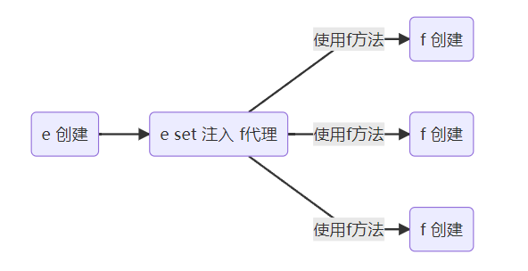


```java
@Component
public class E {

    @Autowired
    @Lazy
    public void setF(F f) {
        this.f = f;
        log.info("setF(F f) {}", f.getClass());
    }

    // ...
}
```

> ***注意***
>
> * @Lazy 加在也可以加在成员变量上，但加在 set 方法上的目的是可以观察输出，加在成员变量上就不行了
> * @Autowired 加在 set 方法的目的类似

##### 6、输出

```
E: setF(F f) class com.itheima.demo.cycle.F$$EnhancerBySpringCGLIB$$8b54f2bc
F: F()
com.itheima.demo.cycle.F@3a6f2de3
F: F()
com.itheima.demo.cycle.F@56303b57
```

从输出日志可以看到调用 setF 方法时，f 对象的类型是代理类型


### 8.2 演示2 - 4种解决方法

#### 8.2.1 代码参考 

##### 1、F1

```java
package com.itheima.a08.sub;

import org.springframework.context.annotation.Scope;
import org.springframework.stereotype.Component;

@Scope("prototype")
@Component
public class F1 {
}

```

##### 2、F2

```java
package com.itheima.a08.sub;

import org.springframework.context.annotation.Scope;
import org.springframework.context.annotation.ScopedProxyMode;
import org.springframework.stereotype.Component;

@Scope(value = "prototype", proxyMode = ScopedProxyMode.TARGET_CLASS)
@Component
public class F2 {
}

```

##### 3、F3

```java
package com.itheima.a08.sub;

import org.springframework.context.annotation.Scope;
import org.springframework.stereotype.Component;

@Scope("prototype")
@Component
public class F3 {
}

```


##### 4、F4

```java
package com.itheima.a08.sub;

import org.springframework.context.annotation.Scope;
import org.springframework.stereotype.Component;

@Scope("prototype")
@Component
public class F4 {
}

```

##### 5、E

```java
package com.itheima.a08.sub;

import org.springframework.beans.factory.ObjectFactory;
import org.springframework.beans.factory.annotation.Autowired;
import org.springframework.context.ApplicationContext;
import org.springframework.context.annotation.Lazy;
import org.springframework.stereotype.Component;

@Component
public class E {

    @Lazy
    @Autowired
    private F1 f1;

    @Autowired
    private F2 f2;

    @Autowired
    private ObjectFactory<F3> f3;

    @Autowired
    private ApplicationContext context;

    public F1 getF1() {
        return f1;
    }

    public F2 getF2() {
        return f2;
    }

    public F3 getF3() {
        return f3.getObject();
    }

    public F4 getF4() {
        return context.getBean(F4.class);
    }
}

```

##### 6、测试代码

```java
package com.itheima.a08;

import com.itheima.a08.sub.E;
import lombok.extern.slf4j.Slf4j;
import org.springframework.context.annotation.AnnotationConfigApplicationContext;
import org.springframework.context.annotation.ComponentScan;

/**
 * @author lyf
 * @version 1.0
 * @classname TestScopeLoseEfficacyResolve
 * @description
 * @since 2022/12/6 20:04
 */
@Slf4j
@ComponentScan(basePackages = "com.itheima.a08.sub")
public class TestScopeLoseEfficacyResolve {
    public static void main(String[] args) {
        AnnotationConfigApplicationContext context =
                new AnnotationConfigApplicationContext(TestScopeLoseEfficacyResolve.class);

        E e = context.getBean(E.class);
        log.debug("{}", e.getF1().getClass());
        log.debug("{}", e.getF1());
        log.debug("{}", e.getF1());
        log.debug("{}", e.getF1());

        log.debug("{}", e.getF2().getClass());
        log.debug("{}", e.getF2());
        log.debug("{}", e.getF2());
        log.debug("{}", e.getF2());

        log.debug("{}", e.getF3());
        log.debug("{}", e.getF3());

        log.debug("{}", e.getF4());
        log.debug("{}", e.getF4());

        context.close();
        /*
            学到了什么
                a. 单例注入其它 scope 的四种解决方法
                b. 解决方法虽然不同, 但理念上殊途同归: 都是推迟其它 scope bean 的获取
         */
    }
}

```

##### 7、测试结果

```verilog
[DEBUG] 20:14:42.968 [main] c.i.a.TestScopeLoseEfficacyResolve  - class com.itheima.a08.sub.F1$$EnhancerBySpringCGLIB$$21b324fd 
[DEBUG] 20:14:42.974 [main] c.i.a.TestScopeLoseEfficacyResolve  - com.itheima.a08.sub.F1@73ee04c8 
[DEBUG] 20:14:42.977 [main] c.i.a.TestScopeLoseEfficacyResolve  - com.itheima.a08.sub.F1@49dc7102 
[DEBUG] 20:14:42.977 [main] c.i.a.TestScopeLoseEfficacyResolve  - com.itheima.a08.sub.F1@68c72235 
[DEBUG] 20:14:42.977 [main] c.i.a.TestScopeLoseEfficacyResolve  - class com.itheima.a08.sub.F2$$EnhancerBySpringCGLIB$$32e1a695 
[DEBUG] 20:14:42.977 [main] c.i.a.TestScopeLoseEfficacyResolve  - com.itheima.a08.sub.F2@34f7cfd9 
[DEBUG] 20:14:42.978 [main] c.i.a.TestScopeLoseEfficacyResolve  - com.itheima.a08.sub.F2@65f095f8 
[DEBUG] 20:14:42.978 [main] c.i.a.TestScopeLoseEfficacyResolve  - com.itheima.a08.sub.F2@59af0466 
[DEBUG] 20:14:42.978 [main] c.i.a.TestScopeLoseEfficacyResolve  - com.itheima.a08.sub.F3@346d61be 
[DEBUG] 20:14:42.978 [main] c.i.a.TestScopeLoseEfficacyResolve  - com.itheima.a08.sub.F3@747edf66 
[DEBUG] 20:14:42.978 [main] c.i.a.TestScopeLoseEfficacyResolve  - com.itheima.a08.sub.F4@3d1cfad4 
[DEBUG] 20:14:42.979 [main] c.i.a.TestScopeLoseEfficacyResolve  - com.itheima.a08.sub.F4@62230c58 
```

* 如果 jdk > 8, 运行时请添加 --add-opens java.base/java.lang=ALL-UNNAMED

#### 8.2.2 收获💡

1. 单例注入其它 scope 的四种解决方法
   * @Lazy
   * @Scope(value = "prototype", proxyMode = ScopedProxyMode.TARGET_CLASS)
   * ObjectFactory
   * ApplicationContext
2. 解决方法虽然不同，但理念上殊途同归: 都是推迟其它 scope bean 的获取


