# AOP

AOP 底层实现方式之一是代理，由代理结合通知和目标，提供增强功能

除此以外，aspectj 提供了两种另外的 AOP 底层实现：

* 第一种是通过 ajc 编译器在**编译** class 类文件时，就把通知的增强功能，织入到目标类的字节码中

* 第二种是通过 agent 在**加载**目标类时，修改目标类的字节码，织入增强功能
* 作为对比，之前学习的代理是**运行**时生成新的字节码

简单比较的话：

* aspectj 在编译和加载时，修改目标字节码，性能较高
* aspectj 因为不用代理，能突破一些技术上的限制，例如对构造、对静态方法、对 final 也能增强
* 但 aspectj 侵入性较强，且需要学习新的 aspectj 特有语法，因此没有广泛流行


## 9 AOP 实现之 ajc 编译器

### 9.1 测试代码

#### 9.1.1 pom(ps：编译时一定要使用maven插件进行编译之后才能运行)

```xml
<?xml version="1.0" encoding="UTF-8"?>
<project xmlns="http://maven.apache.org/POM/4.0.0"
         xmlns:xsi="http://www.w3.org/2001/XMLSchema-instance"
         xsi:schemaLocation="http://maven.apache.org/POM/4.0.0 http://maven.apache.org/xsd/maven-4.0.0.xsd">
    <modelVersion>4.0.0</modelVersion>

    <groupId>com.itheima</groupId>
    <artifactId>spring-aspectj-demo1</artifactId>
    <version>1.0-SNAPSHOT</version>


    <parent>
        <groupId>org.springframework.boot</groupId>
        <artifactId>spring-boot-starter-parent</artifactId>
        <version>2.6.7</version>
    </parent>

    <properties>
        <maven.compiler.source>8</maven.compiler.source>
        <maven.compiler.target>8</maven.compiler.target>
        <java.version>8</java.version>
    </properties>

    <dependencies>
        <dependency>
            <groupId>org.springframework.boot</groupId>
            <artifactId>spring-boot-starter</artifactId>
        </dependency>

        <dependency>
            <groupId>org.springframework.boot</groupId>
            <artifactId>spring-boot-starter-web</artifactId>
        </dependency>

        <dependency>
            <groupId>org.springframework.boot</groupId>
            <artifactId>spring-boot-starter-test</artifactId>
            <scope>test</scope>
        </dependency>

        <dependency>
            <groupId>org.aspectj</groupId>
            <artifactId>aspectjweaver</artifactId>
        </dependency>

        <dependency>
            <groupId>org.aspectj</groupId>
            <artifactId>aspectjrt</artifactId>
        </dependency>

        <dependency>
            <groupId>org.projectlombok</groupId>
            <artifactId>lombok</artifactId>
        </dependency>

    </dependencies>

    <build>
        <plugins>
            <plugin>
                <groupId>org.springframework.boot</groupId>
                <artifactId>spring-boot-maven-plugin</artifactId>
            </plugin>
            <plugin>
                <groupId>org.codehaus.mojo</groupId>
                <artifactId>aspectj-maven-plugin</artifactId>
                <version>1.14.0</version>
                <configuration>
                    <complianceLevel>1.8</complianceLevel>
                    <source>8</source>
                    <target>8</target>
                    <showWeaveInfo>true</showWeaveInfo>
                    <verbose>true</verbose>
                    <Xlint>ignore</Xlint>
                    <encoding>UTF-8</encoding>
                </configuration>
                <executions>
                    <execution>
                        <goals>
                            <!-- use this goal to weave all your main classes -->
                            <goal>compile</goal>
                            <!-- use this goal to weave all your test classes -->
                            <goal>test-compile</goal>
                        </goals>
                    </execution>
                </executions>
            </plugin>
        </plugins>
    </build>
</project>
```

#### 9.1.2 MyAspect

```java
package com.itheima.aop;

import org.aspectj.lang.annotation.Aspect;
import org.aspectj.lang.annotation.Before;
import org.slf4j.Logger;
import org.slf4j.LoggerFactory;

/**
 * @author lyf
 * @version 1.0
 * @classname MyAspect
 * @description
 * @since 2022/12/7 12:34
 */
@Aspect
public class MyAspect {
    private static final Logger log = LoggerFactory.getLogger(MyAspect.class);

    @Before("execution(* com.itheima.service.MyService.foo())")
    public void before() {
        log.debug("before...");
    }
}

```

#### 9.1.3 MyService

```java
package com.itheima.service;

import org.slf4j.Logger;
import org.slf4j.LoggerFactory;
import org.springframework.stereotype.Service;

/**
 * @author lyf
 * @version 1.0
 * @classname MyService
 * @description
 * @since 2022/12/7 12:43
 */
@Service
public class MyService {
    private static final Logger log = LoggerFactory.getLogger(MyService.class);

    public void foo() {
        log.debug("foo...");
    }
}

```

#### 9.1.4 测试类

```java
package com.itheima;

import com.itheima.service.MyService;
import org.springframework.boot.SpringApplication;
import org.springframework.boot.autoconfigure.SpringBootApplication;
import org.springframework.context.ConfigurableApplicationContext;

/**
 * @author lyf
 * @version 1.0
 * @classname AspectDemo1Application
 * @description
 * @since 2022/12/7 12:45
 */
@SpringBootApplication
public class AspectDemo1Application {

    public static void main(String[] args) {
        ConfigurableApplicationContext applicationContext = SpringApplication.run(AspectDemo1Application.class, args);
        MyService service = applicationContext.getBean(MyService.class);
        service.foo();
        applicationContext.close();
    }
}

```

#### 9.1.5 测试结果

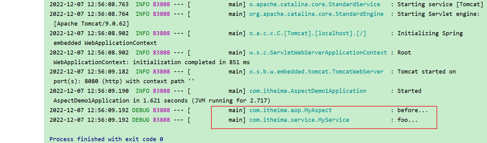

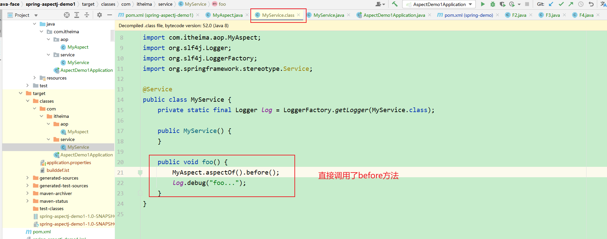

#### 9.1.6 也可直接调用MyService的foo方法（不经过Spring容器）

```java
package com.itheima;

import com.itheima.service.MyService;
import org.springframework.boot.SpringApplication;
import org.springframework.boot.autoconfigure.SpringBootApplication;
import org.springframework.context.ConfigurableApplicationContext;

/**
 * @author lyf
 * @version 1.0
 * @classname AspectDemo1Application
 * @description
 * @since 2022/12/7 12:45
 */
@SpringBootApplication
public class AspectDemo1Application {

    public static void main(String[] args) {
        /*ConfigurableApplicationContext applicationContext = SpringApplication.run(AspectDemo1Application.class, args);
        MyService service = applicationContext.getBean(MyService.class);
        service.foo();
        applicationContext.close();*/
        // 也可直接调用
        new MyService().foo();
    }
}

```

##### 调用结果

```java
13:58:47.166 [main] DEBUG com.itheima.aop.MyAspect - before...
13:58:47.169 [main] DEBUG com.itheima.service.MyService - foo...
```


### 9.2 收获💡

1. 编译器也能修改 class 实现增强
2. 编译器增强能突破代理仅能通过方法重写增强的限制：可以对构造方法、静态方法等实现增强

> ***注意***
>
> * 版本选择了 java 8, 因为目前的 aspectj-maven-plugin 1.14.0 最高只支持到 java 16
> * 一定要用 maven 的 compile 来编译, idea 不会调用 ajc 编译器


## 10 AOP 实现之 agent 类加载

### 10.1 测试代码

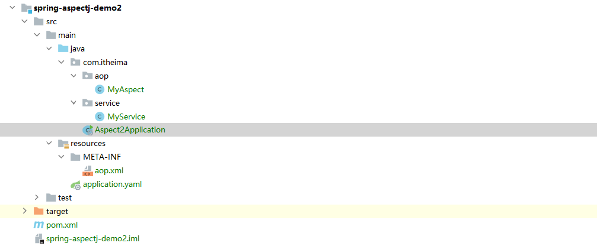

#### 10.1.1 pom

```xml
<?xml version="1.0" encoding="UTF-8"?>
<project xmlns="http://maven.apache.org/POM/4.0.0"
         xmlns:xsi="http://www.w3.org/2001/XMLSchema-instance"
         xsi:schemaLocation="http://maven.apache.org/POM/4.0.0 http://maven.apache.org/xsd/maven-4.0.0.xsd">
    <modelVersion>4.0.0</modelVersion>

    <parent>
        <groupId>org.springframework.boot</groupId>
        <artifactId>spring-boot-starter-parent</artifactId>
        <version>2.6.7</version>
    </parent>

    <groupId>com.itheima</groupId>
    <artifactId>spring-aspectj-demo2</artifactId>
    <version>1.0-SNAPSHOT</version>

    <properties>
        <maven.compiler.source>8</maven.compiler.source>
        <maven.compiler.target>8</maven.compiler.target>
        <java.version>8</java.version>
    </properties>

    <dependencies>
        <dependency>
            <groupId>org.springframework.boot</groupId>
            <artifactId>spring-boot-starter</artifactId>
        </dependency>

        <dependency>
            <groupId>org.springframework.boot</groupId>
            <artifactId>spring-boot-starter-web</artifactId>
        </dependency>

        <dependency>
            <groupId>org.springframework.boot</groupId>
            <artifactId>spring-boot-starter-test</artifactId>
            <scope>test</scope>
        </dependency>

        <dependency>
            <groupId>org.aspectj</groupId>
            <artifactId>aspectjweaver</artifactId>
        </dependency>

        <dependency>
            <groupId>org.aspectj</groupId>
            <artifactId>aspectjrt</artifactId>
        </dependency>


    </dependencies>

    <build>
        <plugins>
            <plugin>
                <groupId>org.springframework.boot</groupId>
                <artifactId>spring-boot-maven-plugin</artifactId>
            </plugin>
        </plugins>
    </build>
</project>
```

#### 10.1.2 MyAspect

```java
package com.itheima.aop;


import org.aspectj.lang.annotation.Aspect;
import org.aspectj.lang.annotation.Before;
import org.slf4j.Logger;
import org.slf4j.LoggerFactory;

/**
 * @author lyf
 * @version 1.0
 * @classname MyAspect
 * @description
 * @since 2022/12/7 14:03
 */
@Aspect
public class MyAspect {
    private static final Logger log = LoggerFactory.getLogger(MyAspect.class);

    @Before("execution(* com.itheima.service.MyService.*())")
    public void before() {
        log.debug("before...");
    }
}

```

#### 10.1.3 MyService

```java
package com.itheima.service;

import org.slf4j.Logger;
import org.slf4j.LoggerFactory;
import org.springframework.stereotype.Service;

/**
 * @author lyf
 * @version 1.0
 * @classname MyService
 * @description
 * @since 2022/12/7 14:14
 */
@Service
public class MyService {
    private static final Logger log = LoggerFactory.getLogger(MyService.class);

    public void foo() {
        log.debug("foo...");
        bar();
    }

    public void bar() {
        log.debug("bar...");
    }
}

```

#### 10.1.4 aop.xml

```xml
<aspectj>
    <aspects>
        <aspect name="com.itheima.aop.MyAspect"/>
        <weaver options="-verbose -showWeaveInfo">
            <include within="com.itheima.service.MyService"/>
            <include within="com.itheima.aop.MyAspect"/>
        </weaver>
    </aspects>
</aspectj>
```

#### 10.1.5 测试代码

```java
package com.itheima;

import com.itheima.service.MyService;
import org.slf4j.Logger;
import org.slf4j.LoggerFactory;
import org.springframework.boot.SpringApplication;
import org.springframework.boot.autoconfigure.SpringBootApplication;
import org.springframework.context.ConfigurableApplicationContext;

/**
 * @author lyf
 * @version 1.0
 * @classname Aspect2Application
 * @description
 *         -javaagent:C:/Users/manyh/.m2/repository/org/aspectj/aspectjweaver/1.9.7/aspectjweaver-1.9.7.jar
 * VM 添加 -javaagent:C:/DISH/JavaTools/SpringBootRepository/org/aspectj/aspectjweaver/1.9.7/aspectjweaver-1.9.7.jar
 * @since 2022/12/7 14:18
 */
@SpringBootApplication
public class Aspect2Application {
    private static final Logger log = LoggerFactory.getLogger(Aspect2Application.class);
    public static void main(String[] args) {
        ConfigurableApplicationContext applicationContext = SpringApplication.run(Aspect2Application.class, args);
        MyService service = applicationContext.getBean(MyService.class);

        // ⬇️MyService 并非代理, 但 foo 方法也被增强了, 做增强的 java agent, 在加载类时, 修改了 class 字节码
        log.debug("MyService class is {}", service.getClass());
        service.foo();
        applicationContext.close();
    }
}

```

#### 10.1.6 测试结果

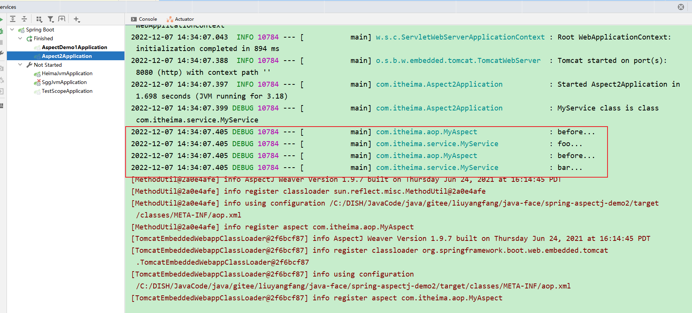

### 10.2 使用`arthas`来查看运行时java源码

```shell
# 先进入 C:\DISH\APP\JAVA\arthas（arthas的解压目录）
# 1、启动 arthas-boot
java -jar ./arthas-boot.jar

# 2 根据相应的类选择对应的数字

# 3 使用jad + 类的全限定名来查看反编译的源码

```


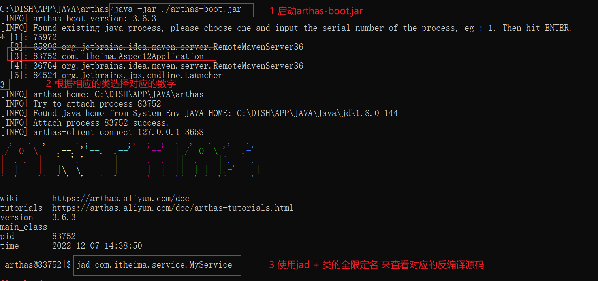

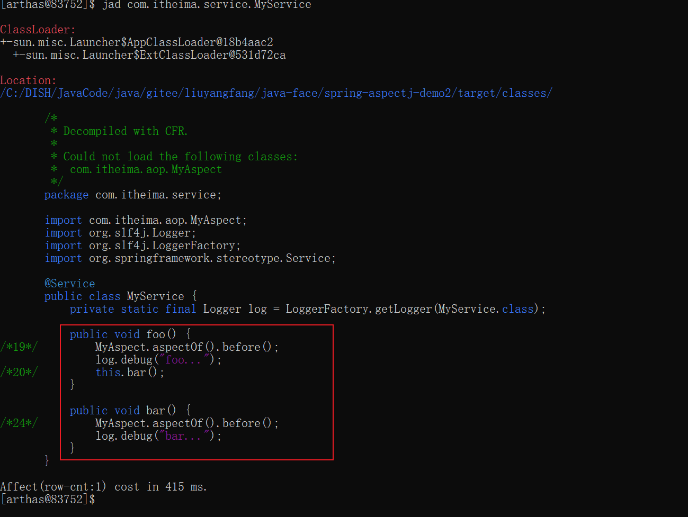

```java
[arthas@83752]$ jad com.itheima.service.MyService

ClassLoader:
+-sun.misc.Launcher$AppClassLoader@18b4aac2
  +-sun.misc.Launcher$ExtClassLoader@531d72ca

Location:
/C:/DISH/JavaCode/java/gitee/liuyangfang/java-face/spring-aspectj-demo2/target/classes/

       /*
        * Decompiled with CFR.
        *
        * Could not load the following classes:
        *  com.itheima.aop.MyAspect
        */
       package com.itheima.service;

       import com.itheima.aop.MyAspect;
       import org.slf4j.Logger;
       import org.slf4j.LoggerFactory;
       import org.springframework.stereotype.Service;

       @Service
       public class MyService {
           private static final Logger log = LoggerFactory.getLogger(MyService.class);

           public void foo() {
/*19*/         MyAspect.aspectOf().before();
               log.debug("foo...");
/*20*/         this.bar();
           }

           public void bar() {
/*24*/         MyAspect.aspectOf().before();
               log.debug("bar...");
           }
       }

Affect(row-cnt:1) cost in 415 ms.
```

### 10.3 收获💡

1. 类加载时可以通过 agent 修改 class 实现增强

## 11 AOP 实现之 proxy

### 11.1 演示1 - jdk 动态代理

```java
public class JdkProxyDemo {

    interface Foo {
        void foo();
    }

    static class Target implements Foo {
        public void foo() {
            System.out.println("target foo");
        }
    }

    public static void main(String[] param) {
        // 目标对象
        Target target = new Target();
        // 代理对象
        Foo proxy = (Foo) Proxy.newProxyInstance(
                Target.class.getClassLoader(), new Class[]{Foo.class},
                (p, method, args) -> {
                    System.out.println("proxy before...");
                    Object result = method.invoke(target, args);
                    System.out.println("proxy after...");
                    return result;
                });
        // 调用代理
        proxy.foo();
    }
}
```

#### 11.1.1 运行结果

```
proxy before...
target foo
proxy after...
```

#### 11.1.2 收获💡

* jdk 动态代理要求目标**必须**实现接口，生成的代理类实现相同接口，因此**代理与目标之间是平级兄弟关系**


### 11.2 演示2 - cglib 代理

```java
package com.itheima.a11;

import lombok.extern.slf4j.Slf4j;
import org.springframework.cglib.proxy.Enhancer;
import org.springframework.cglib.proxy.MethodInterceptor;
import org.springframework.cglib.proxy.MethodProxy;

import java.lang.reflect.Method;

/**
 * @author lyf
 * @version 1.0
 * @classname CglibProxyDemo
 * @description 演示cglib代理，cglib代理与JDK代理的最大区别是cglib可以没有接口
 * @since 2022/12/7 14:55
 */
@Slf4j
public class CglibProxyDemo {
    static class Target {
        public void foo() {
            log.debug("foo...");
        }
    }
    public static void main(String[] args) {
        // 目标对象
        Target target = new Target();

        // 代理对象
        /*
            proxy：代理对象本身
            method：需要被增强的方法
            params：方法参数
            methodProxy：方法代理
         */
        Target proxyObj = (Target) Enhancer.create(Target.class, (MethodInterceptor) (proxy, method, params, methodProxy) -> {
            log.debug("before...");
            // 方式1 基于反射调用
            // Object result = method.invoke(target, params);
            // 方式2 methodProxy调用目标对象，不基于反射调用（Spring使用这种）
            // Object result = methodProxy.invoke(target, params);
            // 方式3 methodProxy调用代理对象，不基于反射调用
            Object result = methodProxy.invokeSuper(proxy, params);
            log.debug("after...");
            return result;
        });

        proxyObj.foo();
    }
}

```

运行结果与 jdk 动态代理相同

#### 11.2.1 收获💡

* cglib 不要求目标实现接口，它生成的代理类是目标的子类，因此**代理与目标之间是子父关系**
* 限制⛔：根据上述分析 **final 类无法被 cglib 增强**


## 12 jdk 动态代理进阶

### 12.1 演示1 - 模拟 jdk 动态代理

```java
public class A12 {

    interface Foo {
        void foo();
        int bar();
    }

    static class Target implements Foo {
        public void foo() {
            System.out.println("target foo");
        }

        public int bar() {
            System.out.println("target bar");
            return 100;
        }
    }

    public static void main(String[] param) {
        // ⬇️1. 创建代理，这时传入 InvocationHandler
        Foo proxy = new $Proxy0(new InvocationHandler() {    
            // ⬇️5. 进入 InvocationHandler
            public Object invoke(Object proxy, Method method, Object[] args) throws Throwable{
                // ⬇️6. 功能增强
                System.out.println("before...");
                // ⬇️7. 反射调用目标方法
                return method.invoke(new Target(), args);
            }
        });
        // ⬇️2. 调用代理方法
        proxy.foo();
        proxy.bar();
    }
}
```

#### 12.1.1 模拟代理实现

```java
import java.lang.reflect.InvocationHandler;
import java.lang.reflect.Method;
import java.lang.reflect.Proxy;
import java.lang.reflect.UndeclaredThrowableException;

// ⬇️这就是 jdk 代理类的源码, 秘密都在里面
public class $Proxy0 extends Proxy implements A12.Foo {

    public $Proxy0(InvocationHandler h) {
        super(h);
    }
    // ⬇️3. 进入代理方法
    public void foo() {
        try {
            // ⬇️4. 回调 InvocationHandler
            h.invoke(this, foo, new Object[0]);
        } catch (RuntimeException | Error e) {
            throw e;
        } catch (Throwable e) {
            throw new UndeclaredThrowableException(e);
        }
    }

    @Override
    public int bar() {
        try {
            Object result = h.invoke(this, bar, new Object[0]);
            return (int) result;
        } catch (RuntimeException | Error e) {
            throw e;
        } catch (Throwable e) {
            throw new UndeclaredThrowableException(e);
        }
    }

    static Method foo;
    static Method bar;
    static {
        try {
            foo = A12.Foo.class.getMethod("foo");
            bar = A12.Foo.class.getMethod("bar");
        } catch (NoSuchMethodException e) {
            throw new NoSuchMethodError(e.getMessage());
        }
    }
}
```

#### 12.1.2 真实的JDK代理类

##### 1、原始类（Target）

```java

package com.itheima.a11;

import lombok.extern.slf4j.Slf4j;

import java.lang.reflect.Proxy;

/**
 * @author lyf
 * @version 1.0
 * @classname JdkProxyDemo
 * @description JDK的动态代理演示
 * @since 2022/12/7 14:47
 */
@Slf4j
public class JdkProxyDemo {
    interface FooInterface {
        void foo();
    }

    static class Target implements FooInterface {

        @Override
        public void foo() {
            log.debug("foo...");
        }
    }

    public static void main(String[] args) throws Throwable{
        Target target = new Target();

        FooInterface proxyObj = (FooInterface) Proxy.newProxyInstance(target.getClass().getClassLoader(), target.getClass().getInterfaces(), (proxy, method, args1) -> {
            log.debug("before...");
            Object result = method.invoke(target, args1);
            log.debug("after...");
            return result;
        });

        proxyObj.foo();

        System.in.read();
    }
}

```

##### 2、真实的代理类

```java

/*
 * Decompiled with CFR.
 *
 * Could not load the following classes:
 *  com.itheima.a11.JdkProxyDemo$FooInterface
 */
package com.itheima.a11;

import com.itheima.a11.JdkProxyDemo;
import java.lang.reflect.InvocationHandler;
import java.lang.reflect.Method;
import java.lang.reflect.Proxy;
import java.lang.reflect.UndeclaredThrowableException;

final class $Proxy2
extends Proxy
implements JdkProxyDemo.FooInterface {
    private static Method m1;
    private static Method m2;
    private static Method m3;
    private static Method m0;

    public $Proxy2(InvocationHandler invocationHandler) {
        super(invocationHandler);
    }

    static {
        try {
            m1 = Class.forName("java.lang.Object").getMethod("equals", Class.forName("java.lang.Object"));
            m2 = Class.forName("java.lang.Object").getMethod("toString", new Class[0]);
            m3 = Class.forName("com.itheima.a11.JdkProxyDemo$FooInterface").getMethod("foo", new Class[0]);
            m0 = Class.forName("java.lang.Object").getMethod("hashCode", new Class[0]);
            return;
        }
        catch (NoSuchMethodException noSuchMethodException) {
            throw new NoSuchMethodError(noSuchMethodException.getMessage());
        }
        catch (ClassNotFoundException classNotFoundException) {
            throw new NoClassDefFoundError(classNotFoundException.getMessage());
        }
    }

    public final boolean equals(Object object) {
        try {
            return (Boolean)this.h.invoke(this, m1, new Object[]{object});
        }
        catch (Error | RuntimeException throwable) {
            throw throwable;
        }
        catch (Throwable throwable) {
            throw new UndeclaredThrowableException(throwable);
        }
    }

    public final String toString() {
        try {
            return (String)this.h.invoke(this, m2, null);
        }
        catch (Error | RuntimeException throwable) {
            throw throwable;
        }
        catch (Throwable throwable) {
            throw new UndeclaredThrowableException(throwable);
        }
    }

    public final int hashCode() {
        try {
            return (Integer)this.h.invoke(this, m0, null);
        }
        catch (Error | RuntimeException throwable) {
            throw throwable;
        }
        catch (Throwable throwable) {
            throw new UndeclaredThrowableException(throwable);
        }
    }

    public final void foo() {
        try {
            this.h.invoke(this, m3, null);
            return;
        }
        catch (Error | RuntimeException throwable) {
            throw throwable;
        }
        catch (Throwable throwable) {
            throw new UndeclaredThrowableException(throwable);
        }
    }
}
```


#### 12.1.3 收获💡

代理一点都不难，无非就是利用了多态、反射的知识

1. 方法重写可以增强逻辑，只不过这【增强逻辑】千变万化，不能写死在代理内部
2. 通过接口回调将【增强逻辑】置于代理类之外
3. 配合接口方法反射（是多态调用），就可以再联动调用目标方法
4. 会用 arthas 的 jad 工具反编译代理类
5. 限制⛔：代理增强是借助多态来实现，因此成员变量、静态方法、final 方法均不能通过代理实现


### 12.2 演示2 - 方法反射优化

#### 12.2.1 代码参考 

**com.itheima.a12.TestMethodInvoke**

```java
package com.itheima.a12;

import lombok.extern.slf4j.Slf4j;

import java.lang.reflect.Field;
import java.lang.reflect.Method;

/**
 * @author lyf
 * @version 1.0
 * @classname TestMethodInvoke
 * @description 测试方法的反射调用
 * @since 2022/12/7 15:52
 */
@Slf4j
public class TestMethodInvoke {

    public static void main(String[] args) throws Throwable {
        Method fooMethod = TestMethodInvoke.class.getDeclaredMethod("foo", int.class);

        for (int i = 1; i <= 17; i++) {
            show(i, fooMethod);
            fooMethod.invoke(null, i);
        }

        System.in.read();
    }

    /**
     * 方法反射调用时, 底层 MethodAccessor 的实现类
     *
     * @param count     count
     * @param fooMethod fooMethod
     */
    private static void show(int count, Method fooMethod) throws Throwable{
        Method getMethodAccessor = Method.class.getDeclaredMethod("getMethodAccessor");
        getMethodAccessor.setAccessible(true);
        Object result = getMethodAccessor.invoke(fooMethod);
        if (result == null) {
            log.debug("result is null, {} : {}", count, null);
            return;
        }

        Field delegate = Class.forName("sun.reflect.DelegatingMethodAccessorImpl").getDeclaredField("delegate");
        delegate.setAccessible(true);
        log.debug("result not null, {} : {}", count, delegate.get(result));
    }

    public static void foo(int count) {
        log.debug("{} : foo", count);
    }
}

```

#### 12.2.2 运行结果

```java
[DEBUG] 16:07:29.146 [main] com.itheima.a12.TestMethodInvoke    - result is null, 1 : null 
[DEBUG] 16:07:29.165 [main] com.itheima.a12.TestMethodInvoke    - 1 : foo 
[DEBUG] 16:07:29.166 [main] com.itheima.a12.TestMethodInvoke    - result not null, 2 : sun.reflect.NativeMethodAccessorImpl@7a5d012c 
[DEBUG] 16:07:29.166 [main] com.itheima.a12.TestMethodInvoke    - 2 : foo 
[DEBUG] 16:07:29.166 [main] com.itheima.a12.TestMethodInvoke    - result not null, 3 : sun.reflect.NativeMethodAccessorImpl@7a5d012c 
[DEBUG] 16:07:29.166 [main] com.itheima.a12.TestMethodInvoke    - 3 : foo 
[DEBUG] 16:07:29.166 [main] com.itheima.a12.TestMethodInvoke    - result not null, 4 : sun.reflect.NativeMethodAccessorImpl@7a5d012c 
[DEBUG] 16:07:29.166 [main] com.itheima.a12.TestMethodInvoke    - 4 : foo 
[DEBUG] 16:07:29.167 [main] com.itheima.a12.TestMethodInvoke    - result not null, 5 : sun.reflect.NativeMethodAccessorImpl@7a5d012c 
[DEBUG] 16:07:29.167 [main] com.itheima.a12.TestMethodInvoke    - 5 : foo 
[DEBUG] 16:07:29.167 [main] com.itheima.a12.TestMethodInvoke    - result not null, 6 : sun.reflect.NativeMethodAccessorImpl@7a5d012c 
[DEBUG] 16:07:29.167 [main] com.itheima.a12.TestMethodInvoke    - 6 : foo 
[DEBUG] 16:07:29.167 [main] com.itheima.a12.TestMethodInvoke    - result not null, 7 : sun.reflect.NativeMethodAccessorImpl@7a5d012c 
[DEBUG] 16:07:29.167 [main] com.itheima.a12.TestMethodInvoke    - 7 : foo 
[DEBUG] 16:07:29.167 [main] com.itheima.a12.TestMethodInvoke    - result not null, 8 : sun.reflect.NativeMethodAccessorImpl@7a5d012c 
[DEBUG] 16:07:29.167 [main] com.itheima.a12.TestMethodInvoke    - 8 : foo 
[DEBUG] 16:07:29.167 [main] com.itheima.a12.TestMethodInvoke    - result not null, 9 : sun.reflect.NativeMethodAccessorImpl@7a5d012c 
[DEBUG] 16:07:29.168 [main] com.itheima.a12.TestMethodInvoke    - 9 : foo 
[DEBUG] 16:07:29.168 [main] com.itheima.a12.TestMethodInvoke    - result not null, 10 : sun.reflect.NativeMethodAccessorImpl@7a5d012c 
[DEBUG] 16:07:29.168 [main] com.itheima.a12.TestMethodInvoke    - 10 : foo 
[DEBUG] 16:07:29.168 [main] com.itheima.a12.TestMethodInvoke    - result not null, 11 : sun.reflect.NativeMethodAccessorImpl@7a5d012c 
[DEBUG] 16:07:29.168 [main] com.itheima.a12.TestMethodInvoke    - 11 : foo 
[DEBUG] 16:07:29.168 [main] com.itheima.a12.TestMethodInvoke    - result not null, 12 : sun.reflect.NativeMethodAccessorImpl@7a5d012c 
[DEBUG] 16:07:29.169 [main] com.itheima.a12.TestMethodInvoke    - 12 : foo 
[DEBUG] 16:07:29.169 [main] com.itheima.a12.TestMethodInvoke    - result not null, 13 : sun.reflect.NativeMethodAccessorImpl@7a5d012c 
[DEBUG] 16:07:29.169 [main] com.itheima.a12.TestMethodInvoke    - 13 : foo 
[DEBUG] 16:07:29.169 [main] com.itheima.a12.TestMethodInvoke    - result not null, 14 : sun.reflect.NativeMethodAccessorImpl@7a5d012c 
[DEBUG] 16:07:29.169 [main] com.itheima.a12.TestMethodInvoke    - 14 : foo 
[DEBUG] 16:07:29.173 [main] com.itheima.a12.TestMethodInvoke    - result not null, 15 : sun.reflect.NativeMethodAccessorImpl@7a5d012c 
[DEBUG] 16:07:29.173 [main] com.itheima.a12.TestMethodInvoke    - 15 : foo 
[DEBUG] 16:07:29.176 [main] com.itheima.a12.TestMethodInvoke    - result not null, 16 : sun.reflect.NativeMethodAccessorImpl@7a5d012c 
[DEBUG] 16:07:29.177 [main] com.itheima.a12.TestMethodInvoke    - 16 : foo 
[DEBUG] 16:07:29.177 [main] com.itheima.a12.TestMethodInvoke    - result not null, 17 : sun.reflect.GeneratedMethodAccessor2@79698539 
[DEBUG] 16:07:29.177 [main] com.itheima.a12.TestMethodInvoke    - 17 : foo 

```

> 可以看到第17次结果，发生了变化
>
> 不再是sun.reflect.NativeMethodAccessorImpl而变为了sun.reflect.GeneratedMethodAccessor2

我们可以通过arthas来查看这两个类在运行时的代码

##### 1、`sun.reflect.NativeMethodAccessorImpl`

```java
 /*
        * Decompiled with CFR.
        */
       package sun.reflect;

       import java.lang.reflect.InvocationTargetException;
       import java.lang.reflect.Method;
       import sun.reflect.DelegatingMethodAccessorImpl;
       import sun.reflect.MethodAccessorGenerator;
       import sun.reflect.MethodAccessorImpl;
       import sun.reflect.ReflectionFactory;
       import sun.reflect.misc.ReflectUtil;

       class NativeMethodAccessorImpl
       extends MethodAccessorImpl {
           private final Method method;
           private DelegatingMethodAccessorImpl parent;
           private int numInvocations;

           @Override
           public Object invoke(Object object, Object[] objectArray) throws IllegalArgumentException, InvocationTargetException {
               if (++this.numInvocations > ReflectionFactory.inflationThreshold() && !ReflectUtil.isVMAnonymousClass(this.method.getDeclaringClass())) {
                   MethodAccessorImpl methodAccessorImpl = (MethodAccessorImpl)new MethodAccessorGenerator().generateMethod(this.method.getDeclaringClass(), this.method.getName(), this.method.getParameterTypes(), this.method.getReturnType(), this.method.getExceptionTypes(), this.method.getModifiers());
/*59*/             this.parent.setDelegate(methodAccessorImpl);
               }
/*62*/         return NativeMethodAccessorImpl.invoke0(this.method, object, objectArray);
           }

           NativeMethodAccessorImpl(Method method) {
/*40*/         this.method = method;
           }

           void setParent(DelegatingMethodAccessorImpl delegatingMethodAccessorImpl) {
/*66*/         this.parent = delegatingMethodAccessorImpl;
           }

           private static native Object invoke0(Method var0, Object var1, Object[] var2);
       }
```

##### 2、`sun.reflect.GeneratedMethodAccessor2`

```java
/*
 * Decompiled with CFR.
 *
 * Could not load the following classes:
 *  com.itheima.a12.TestMethodInvoke
 */
package sun.reflect;

import com.itheima.a12.TestMethodInvoke;
import java.lang.reflect.InvocationTargetException;
import sun.reflect.MethodAccessorImpl;

public class GeneratedMethodAccessor2
extends MethodAccessorImpl {
    /*
     * Loose catch block
     */
    public Object invoke(Object object, Object[] objectArray) throws InvocationTargetException {
        char c;
        block9: {
            if (objectArray.length != 1) {
                throw new IllegalArgumentException();
            }
            Object object2 = objectArray[0];
            if (object2 instanceof Byte) {
                c = ((Byte)object2).byteValue();
                break block9;
            }
            if (object2 instanceof Character) {
                c = ((Character)object2).charValue();
                break block9;
            }
            if (object2 instanceof Short) {
                c = (char)((Short)object2).shortValue();
                break block9;
            }
            if (object2 instanceof Integer) {
                c = (char)((Integer)object2).intValue();
                break block9;
            }
            throw new IllegalArgumentException();
        }
        try {
            TestMethodInvoke.foo((int)c);
            return null;
        }
        catch (Throwable throwable) {
            throw new InvocationTargetException(throwable);
        }
        catch (ClassCastException | NullPointerException runtimeException) {
            throw new IllegalArgumentException(super.toString());
        }
    }
}
```

#### 12.3 收获💡

1. 前 16 次反射性能较低
2. 第 17 次调用会生成代理类，优化为非反射调用
3. 会用 arthas 的 jad 工具反编译第 17 次调用生成的代理类

> ***注意***
>
> java 版本大于等于9时需要添加
>
> 运行时请添加 --add-opens java.base/java.lang.reflect=ALL-UNNAMED --add-opens java.base/jdk.internal.reflect=ALL-UNNAMED


## 13 cglib 代理进阶

### 13.1 cglib 测试代码

```java
package com.itheima.a11;

import lombok.extern.slf4j.Slf4j;
import org.springframework.cglib.proxy.Enhancer;
import org.springframework.cglib.proxy.MethodInterceptor;
import org.springframework.cglib.proxy.MethodProxy;

import java.lang.reflect.Method;

/**
 * @author lyf
 * @version 1.0
 * @classname CglibProxyDemo
 * @description 演示cglib代理，cglib代理与JDK代理的最大区别是cglib可以没有接口
 * @since 2022/12/7 14:55
 */
@Slf4j
public class CglibProxyDemo {
    static class Target {
        public void foo() {
            log.debug("foo...");
        }
    }
    public static void main(String[] args) throws Exception{
        // 目标对象
        Target target = new Target();

        // 代理对象
        /*
            proxy：代理对象本身
            method：需要被增强的方法
            params：方法参数
            methodProxy：方法代理
         */
        Target proxyObj = (Target) Enhancer.create(Target.class, (MethodInterceptor) (proxy, method, params, methodProxy) -> {
            log.debug("before...");
            // 方式1 基于反射调用
            // Object result = method.invoke(target, params);
            // 方式2 methodProxy调用目标对象，不基于反射调用（Spring使用这种）
            // Object result = methodProxy.invoke(target, params);
            // 方式3 methodProxy调用代理对象，不基于反射调用
            log.debug("{}", proxy.getClass());
            log.debug("{}", proxy.getClass().getName());
            Object result = methodProxy.invokeSuper(proxy, params);
            log.debug("after...");
            return result;
        });

        proxyObj.foo();
        System.in.read();
    }
}

```

#### 13.1.1 cglib代理生成的类

```java
/*
 * Decompiled with CFR.
 */
package com.itheima.a11;

import com.itheima.a11.CglibProxyDemo;
import java.lang.reflect.Method;
import org.springframework.cglib.core.ReflectUtils;
import org.springframework.cglib.core.Signature;
import org.springframework.cglib.proxy.Callback;
import org.springframework.cglib.proxy.Factory;
import org.springframework.cglib.proxy.MethodInterceptor;
import org.springframework.cglib.proxy.MethodProxy;

public class CglibProxyDemo$Target$$EnhancerByCGLIB$$880f2c29
extends CglibProxyDemo.Target
implements Factory {
    private boolean CGLIB$BOUND;
    public static Object CGLIB$FACTORY_DATA;
    private static final ThreadLocal CGLIB$THREAD_CALLBACKS;
    private static final Callback[] CGLIB$STATIC_CALLBACKS;
    private MethodInterceptor CGLIB$CALLBACK_0;
    private static Object CGLIB$CALLBACK_FILTER;
    private static final Method CGLIB$foo$0$Method;
    private static final MethodProxy CGLIB$foo$0$Proxy;
    private static final Object[] CGLIB$emptyArgs;
    private static final Method CGLIB$equals$1$Method;
    private static final MethodProxy CGLIB$equals$1$Proxy;
    private static final Method CGLIB$toString$2$Method;
    private static final MethodProxy CGLIB$toString$2$Proxy;
    private static final Method CGLIB$hashCode$3$Method;
    private static final MethodProxy CGLIB$hashCode$3$Proxy;
    private static final Method CGLIB$clone$4$Method;
    private static final MethodProxy CGLIB$clone$4$Proxy;

    public CglibProxyDemo$Target$$EnhancerByCGLIB$$880f2c29() {
        CglibProxyDemo$Target$$EnhancerByCGLIB$$880f2c29 cglibProxyDemo$Target$$EnhancerByCGLIB$$880f2c29 = this;
        CglibProxyDemo$Target$$EnhancerByCGLIB$$880f2c29.CGLIB$BIND_CALLBACKS(cglibProxyDemo$Target$$EnhancerByCGLIB$$880f2c29);
    }

    static {
        CglibProxyDemo$Target$$EnhancerByCGLIB$$880f2c29.CGLIB$STATICHOOK1();
    }

    public final boolean equals(Object object) {
        MethodInterceptor methodInterceptor = this.CGLIB$CALLBACK_0;
        if (methodInterceptor == null) {
            CglibProxyDemo$Target$$EnhancerByCGLIB$$880f2c29.CGLIB$BIND_CALLBACKS(this);
            methodInterceptor = this.CGLIB$CALLBACK_0;
        }
        if (methodInterceptor != null) {
            Object object2 = methodInterceptor.intercept(this, CGLIB$equals$1$Method, new Object[]{object}, CGLIB$equals$1$Proxy);
            return object2 == null ? false : (Boolean)object2;
        }
        return super.equals(object);
    }

    public final String toString() {
        MethodInterceptor methodInterceptor = this.CGLIB$CALLBACK_0;
        if (methodInterceptor == null) {
            CglibProxyDemo$Target$$EnhancerByCGLIB$$880f2c29.CGLIB$BIND_CALLBACKS(this);
            methodInterceptor = this.CGLIB$CALLBACK_0;
        }
        if (methodInterceptor != null) {
            return (String)methodInterceptor.intercept(this, CGLIB$toString$2$Method, CGLIB$emptyArgs, CGLIB$toString$2$Proxy);
        }
        return super.toString();
    }

    public final int hashCode() {
        MethodInterceptor methodInterceptor = this.CGLIB$CALLBACK_0;
        if (methodInterceptor == null) {
            CglibProxyDemo$Target$$EnhancerByCGLIB$$880f2c29.CGLIB$BIND_CALLBACKS(this);
            methodInterceptor = this.CGLIB$CALLBACK_0;
        }
        if (methodInterceptor != null) {
            Object object = methodInterceptor.intercept(this, CGLIB$hashCode$3$Method, CGLIB$emptyArgs, CGLIB$hashCode$3$Proxy);
            return object == null ? 0 : ((Number)object).intValue();
        }
        return super.hashCode();
    }

    protected final Object clone() throws CloneNotSupportedException {
        MethodInterceptor methodInterceptor = this.CGLIB$CALLBACK_0;
        if (methodInterceptor == null) {
            CglibProxyDemo$Target$$EnhancerByCGLIB$$880f2c29.CGLIB$BIND_CALLBACKS(this);
            methodInterceptor = this.CGLIB$CALLBACK_0;
        }
        if (methodInterceptor != null) {
            return methodInterceptor.intercept(this, CGLIB$clone$4$Method, CGLIB$emptyArgs, CGLIB$clone$4$Proxy);
        }
        return super.clone();
    }

    @Override
    public Object newInstance(Callback[] callbackArray) {
        CglibProxyDemo$Target$$EnhancerByCGLIB$$880f2c29.CGLIB$SET_THREAD_CALLBACKS(callbackArray);
        CglibProxyDemo$Target$$EnhancerByCGLIB$$880f2c29 cglibProxyDemo$Target$$EnhancerByCGLIB$$880f2c29 = new CglibProxyDemo$Target$$EnhancerByCGLIB$$880f2c29();
        CglibProxyDemo$Target$$EnhancerByCGLIB$$880f2c29.CGLIB$SET_THREAD_CALLBACKS(null);
        return cglibProxyDemo$Target$$EnhancerByCGLIB$$880f2c29;
    }

    @Override
    public Object newInstance(Callback callback) {
        CglibProxyDemo$Target$$EnhancerByCGLIB$$880f2c29.CGLIB$SET_THREAD_CALLBACKS(new Callback[]{callback});
        CglibProxyDemo$Target$$EnhancerByCGLIB$$880f2c29 cglibProxyDemo$Target$$EnhancerByCGLIB$$880f2c29 = new CglibProxyDemo$Target$$EnhancerByCGLIB$$880f2c29();
        CglibProxyDemo$Target$$EnhancerByCGLIB$$880f2c29.CGLIB$SET_THREAD_CALLBACKS(null);
        return cglibProxyDemo$Target$$EnhancerByCGLIB$$880f2c29;
    }

    @Override
    public Object newInstance(Class[] classArray, Object[] objectArray, Callback[] callbackArray) {
        CglibProxyDemo$Target$$EnhancerByCGLIB$$880f2c29 cglibProxyDemo$Target$$EnhancerByCGLIB$$880f2c29;
        CglibProxyDemo$Target$$EnhancerByCGLIB$$880f2c29.CGLIB$SET_THREAD_CALLBACKS(callbackArray);
        Class[] classArray2 = classArray;
        switch (classArray.length) {
            case 0: {
                cglibProxyDemo$Target$$EnhancerByCGLIB$$880f2c29 = new CglibProxyDemo$Target$$EnhancerByCGLIB$$880f2c29();
                break;
            }
            default: {
                throw new IllegalArgumentException("Constructor not found");
            }
        }
        CglibProxyDemo$Target$$EnhancerByCGLIB$$880f2c29.CGLIB$SET_THREAD_CALLBACKS(null);
        return cglibProxyDemo$Target$$EnhancerByCGLIB$$880f2c29;
    }

    @Override
    public final void foo() {
        MethodInterceptor methodInterceptor = this.CGLIB$CALLBACK_0;
        if (methodInterceptor == null) {
            CglibProxyDemo$Target$$EnhancerByCGLIB$$880f2c29.CGLIB$BIND_CALLBACKS(this);
            methodInterceptor = this.CGLIB$CALLBACK_0;
        }
        if (methodInterceptor != null) {
            Object object = methodInterceptor.intercept(this, CGLIB$foo$0$Method, CGLIB$emptyArgs, CGLIB$foo$0$Proxy);
            return;
        }
        super.foo();
    }

    public static MethodProxy CGLIB$findMethodProxy(Signature signature) {
        String string = ((Object)signature).toString();
        switch (string.hashCode()) {
            case -1268936465: {
                if (!string.equals("foo()V")) break;
                return CGLIB$foo$0$Proxy;
            }
            case -508378822: {
                if (!string.equals("clone()Ljava/lang/Object;")) break;
                return CGLIB$clone$4$Proxy;
            }
            case 1826985398: {
                if (!string.equals("equals(Ljava/lang/Object;)Z")) break;
                return CGLIB$equals$1$Proxy;
            }
            case 1913648695: {
                if (!string.equals("toString()Ljava/lang/String;")) break;
                return CGLIB$toString$2$Proxy;
            }
            case 1984935277: {
                if (!string.equals("hashCode()I")) break;
                return CGLIB$hashCode$3$Proxy;
            }
        }
        return null;
    }

    final int CGLIB$hashCode$3() {
        return super.hashCode();
    }

    final Object CGLIB$clone$4() throws CloneNotSupportedException {
        return super.clone();
    }

    @Override
    public void setCallback(int n, Callback callback) {
        switch (n) {
            case 0: {
                this.CGLIB$CALLBACK_0 = (MethodInterceptor)callback;
                break;
            }
        }
    }

    @Override
    public void setCallbacks(Callback[] callbackArray) {
        Callback[] callbackArray2 = callbackArray;
        CglibProxyDemo$Target$$EnhancerByCGLIB$$880f2c29 cglibProxyDemo$Target$$EnhancerByCGLIB$$880f2c29 = this;
        this.CGLIB$CALLBACK_0 = (MethodInterceptor)callbackArray[0];
    }

    @Override
    public Callback getCallback(int n) {
        MethodInterceptor methodInterceptor;
        CglibProxyDemo$Target$$EnhancerByCGLIB$$880f2c29.CGLIB$BIND_CALLBACKS(this);
        switch (n) {
            case 0: {
                methodInterceptor = this.CGLIB$CALLBACK_0;
                break;
            }
            default: {
                methodInterceptor = null;
            }
        }
        return methodInterceptor;
    }

    @Override
    public Callback[] getCallbacks() {
        CglibProxyDemo$Target$$EnhancerByCGLIB$$880f2c29.CGLIB$BIND_CALLBACKS(this);
        CglibProxyDemo$Target$$EnhancerByCGLIB$$880f2c29 cglibProxyDemo$Target$$EnhancerByCGLIB$$880f2c29 = this;
        return new Callback[]{this.CGLIB$CALLBACK_0};
    }

    public static void CGLIB$SET_STATIC_CALLBACKS(Callback[] callbackArray) {
        CGLIB$STATIC_CALLBACKS = callbackArray;
    }

    public static void CGLIB$SET_THREAD_CALLBACKS(Callback[] callbackArray) {
        CGLIB$THREAD_CALLBACKS.set(callbackArray);
    }

    final void CGLIB$foo$0() {
        super.foo();
    }

    final boolean CGLIB$equals$1(Object object) {
        return super.equals(object);
    }

    final String CGLIB$toString$2() {
        return super.toString();
    }

    static void CGLIB$STATICHOOK1() {
        CGLIB$THREAD_CALLBACKS = new ThreadLocal();
        CGLIB$emptyArgs = new Object[0];
        Class<?> clazz = Class.forName("com.itheima.a11.CglibProxyDemo$Target$$EnhancerByCGLIB$$880f2c29");
        Class<?> clazz2 = Class.forName("java.lang.Object");
        Method[] methodArray = ReflectUtils.findMethods(new String[]{"equals", "(Ljava/lang/Object;)Z", "toString", "()Ljava/lang/String;", "hashCode", "()I", "clone", "()Ljava/lang/Object;"}, clazz2.getDeclaredMethods());
        CGLIB$equals$1$Method = methodArray[0];
        CGLIB$equals$1$Proxy = MethodProxy.create(clazz2, clazz, "(Ljava/lang/Object;)Z", "equals", "CGLIB$equals$1");
        CGLIB$toString$2$Method = methodArray[1];
        CGLIB$toString$2$Proxy = MethodProxy.create(clazz2, clazz, "()Ljava/lang/String;", "toString", "CGLIB$toString$2");
        CGLIB$hashCode$3$Method = methodArray[2];
        CGLIB$hashCode$3$Proxy = MethodProxy.create(clazz2, clazz, "()I", "hashCode", "CGLIB$hashCode$3");
        CGLIB$clone$4$Method = methodArray[3];
        CGLIB$clone$4$Proxy = MethodProxy.create(clazz2, clazz, "()Ljava/lang/Object;", "clone", "CGLIB$clone$4");
        clazz2 = Class.forName("com.itheima.a11.CglibProxyDemo$Target");
        CGLIB$foo$0$Method = ReflectUtils.findMethods(new String[]{"foo", "()V"}, clazz2.getDeclaredMethods())[0];
        CGLIB$foo$0$Proxy = MethodProxy.create(clazz2, clazz, "()V", "foo", "CGLIB$foo$0");
    }

    private static final void CGLIB$BIND_CALLBACKS(Object object) {
        block2: {
            Object object2;
            block3: {
                CglibProxyDemo$Target$$EnhancerByCGLIB$$880f2c29 cglibProxyDemo$Target$$EnhancerByCGLIB$$880f2c29 = (CglibProxyDemo$Target$$EnhancerByCGLIB$$880f2c29)object;
                if (cglibProxyDemo$Target$$EnhancerByCGLIB$$880f2c29.CGLIB$BOUND) break block2;
                cglibProxyDemo$Target$$EnhancerByCGLIB$$880f2c29.CGLIB$BOUND = true;
                object2 = CGLIB$THREAD_CALLBACKS.get();
                if (object2 != null) break block3;
                object2 = CGLIB$STATIC_CALLBACKS;
                if (CGLIB$STATIC_CALLBACKS == null) break block2;
            }
            cglibProxyDemo$Target$$EnhancerByCGLIB$$880f2c29.CGLIB$CALLBACK_0 = (MethodInterceptor)((Callback[])object2)[0];
        }
    }
}
```

### 13.2 演示 - 模拟 cglib 代理

#### 13.2.2 代码参考 

##### 1、实现cglib反射调用

###### 1.1、Target

```java
package com.itheima.a13;

import lombok.extern.slf4j.Slf4j;

/**
 * @author lyf
 * @version 1.0
 * @classname Target
 * @description
 * @since 2022/12/7 16:29
 */
@Slf4j
public class Target {
    public void save() {
        log.debug("save()");
    }

    public void save(int i) {
        log.debug("save(int)");
    }

    public void save(long j) {
        log.debug("save(long)");
    }
}

```

###### 1.2、Proxy

```java
package com.itheima.a13;

import lombok.Setter;
import lombok.extern.slf4j.Slf4j;
import org.springframework.cglib.proxy.MethodInterceptor;

import java.lang.reflect.Method;
import java.lang.reflect.UndeclaredThrowableException;

/**
 * @author lyf
 * @version 1.0
 * @classname Proxy
 * @description
 * @since 2022/12/7 16:29
 */
@Slf4j
public class Proxy extends Target {
    private static Method save;
    private static Method saveInt;
    private static Method saveLong;
    
    
    @Setter
    private MethodInterceptor methodInterceptor;

    public Proxy() {
        
    }

    public Proxy(MethodInterceptor methodInterceptor) {
        this.methodInterceptor = methodInterceptor;
    }

    static {
        try {
            save = Target.class.getMethod("save");
            saveInt = Target.class.getMethod("save", int.class);
            saveLong = Target.class.getMethod("save", long.class);
        } catch (NoSuchMethodException e) {
            throw new NoSuchMethodError(e.getMessage());
        }
    }


    // <<<<<<<<<<<<<<<<<<<<<<<<<被代理增强的方法<<<<<<<<<<<<<<<<<<<<<
    @Override
    public void save() {
        try {
            this.methodInterceptor.intercept(this, save, new Object[0], null);
        } catch (Throwable e) {
            throw new UndeclaredThrowableException(e);
        }
    }

    @Override
    public void save(int i) {
        try {
            this.methodInterceptor.intercept(this, saveInt, new Object[] {i}, null);
        } catch (Throwable e) {
            throw new UndeclaredThrowableException(e);
        }
    }

    @Override
    public void save(long j) {
        try {
            this.methodInterceptor.intercept(this, saveLong, new Object[] {j}, null);
        } catch (Throwable e) {
            throw new UndeclaredThrowableException(e);
        }
    }
}

```

###### 3、测试代码

```java
package com.itheima.a13;

import lombok.extern.slf4j.Slf4j;
import org.springframework.cglib.proxy.MethodInterceptor;
import org.springframework.cglib.proxy.MethodProxy;

import java.lang.reflect.Method;

/**
 * @author lyf
 * @version 1.0
 * @classname TestCglibProxy
 * @description
 * @since 2022/12/7 16:40
 */
@Slf4j
public class TestCglibProxy {
    public static void main(String[] args) {
        Target target = new Target();

        Target proxyObj = new Proxy((proxy, method, params, methodProxy) -> {
            log.debug("before...");
            Object result = method.invoke(target, params);
            log.debug("after...");
            return result;
        });

        proxyObj.save();
        proxyObj.save(1);
        proxyObj.save(2L);
    }
}

```

###### 4、测试结果

```java
[DEBUG] 16:47:43.106 [main] com.itheima.a13.TestCglibProxy      - before... 
[DEBUG] 16:47:43.121 [main] com.itheima.a13.Target              - save() 
[DEBUG] 16:47:43.122 [main] com.itheima.a13.TestCglibProxy      - after... 
[DEBUG] 16:47:43.122 [main] com.itheima.a13.TestCglibProxy      - before... 
[DEBUG] 16:47:43.122 [main] com.itheima.a13.Target              - save(int) 
[DEBUG] 16:47:43.122 [main] com.itheima.a13.TestCglibProxy      - after... 
[DEBUG] 16:47:43.122 [main] com.itheima.a13.TestCglibProxy      - before... 
[DEBUG] 16:47:43.122 [main] com.itheima.a13.Target              - save(long) 
[DEBUG] 16:47:43.122 [main] com.itheima.a13.TestCglibProxy      - after... 
```

##### 2、实现cglib的MethodProxy调用

###### 2.1、Proxy

```java
package com.itheima.a13;

import lombok.Setter;
import lombok.extern.slf4j.Slf4j;
import org.springframework.cglib.proxy.MethodInterceptor;
import org.springframework.cglib.proxy.MethodProxy;

import java.lang.reflect.Method;
import java.lang.reflect.UndeclaredThrowableException;

/**
 * @author lyf
 * @version 1.0
 * @classname Proxy
 * @description
 * @since 2022/12/7 16:29
 */
@Slf4j
public class Proxy extends Target {
    private static Method save;
    private static Method saveInt;
    private static Method saveLong;

    // 下面这三个方法是为了使用MethodInterceptor的第4个参数
    private static MethodProxy saveProxy;
    private static MethodProxy saveIntProxy;
    private static MethodProxy saveLongProxy;


    @Setter
    private MethodInterceptor methodInterceptor;

    public Proxy() {

    }

    public Proxy(MethodInterceptor methodInterceptor) {
        this.methodInterceptor = methodInterceptor;
    }

    static {
        try {
            save = Target.class.getMethod("save");
            saveInt = Target.class.getMethod("save", int.class);
            saveLong = Target.class.getMethod("save", long.class);

            /*
                Class c1：目标类
                Class c2：代理类
                String desc：方法参数描述 ()V 表示无参，无返回值，(I)V表示参数为int，无返回值，(J)V 表示参数为long，无返回值
                String name1：代理增强的方法
                String name2：带原始功能的方法
             */
            saveProxy = MethodProxy.create(Target.class, Proxy.class, "()V", "save", "saveSuper");
            saveIntProxy = MethodProxy.create(Target.class, Proxy.class, "(I)V", "save", "saveSuper");
            saveLongProxy = MethodProxy.create(Target.class, Proxy.class, "(J)V", "save", "saveSuper");
        } catch (NoSuchMethodException e) {
            throw new NoSuchMethodError(e.getMessage());
        }
    }

    // <<<<<<<<<<<<<<<<<<<<<<<<<带原始功能的方法<<<<<<<<<<<<<<<<<<<<<
    public void saveSuper() {
        super.save();
    }

    public void saveSuper(int i) {
        super.save(i);
    }

    public void saveSuper(long j) {
        super.save(j);
    }

    // <<<<<<<<<<<<<<<<<<<<<<<<<被代理增强的方法<<<<<<<<<<<<<<<<<<<<<
    @Override
    public void save() {
        try {
            this.methodInterceptor.intercept(this, save, new Object[0], saveProxy);
        } catch (Throwable e) {
            throw new UndeclaredThrowableException(e);
        }
    }

    @Override
    public void save(int i) {
        try {
            this.methodInterceptor.intercept(this, saveInt, new Object[]{i}, saveIntProxy);
        } catch (Throwable e) {
            throw new UndeclaredThrowableException(e);
        }
    }

    @Override
    public void save(long j) {
        try {
            this.methodInterceptor.intercept(this, saveLong, new Object[]{j}, saveLongProxy);
        } catch (Throwable e) {
            throw new UndeclaredThrowableException(e);
        }
    }
}

```

###### 2.2、测试方法

```java
package com.itheima.a13;

import lombok.extern.slf4j.Slf4j;
import org.springframework.cglib.proxy.MethodInterceptor;
import org.springframework.cglib.proxy.MethodProxy;

import java.lang.reflect.Method;

/**
 * @author lyf
 * @version 1.0
 * @classname TestCglibProxy
 * @description
 * @since 2022/12/7 16:40
 */
@Slf4j
public class TestCglibProxy {
    public static void main(String[] args) {
        Target target = new Target();

        Target proxyObj = new Proxy((proxy, method, params, methodProxy) -> {
            log.debug("before...");
            // Object result = methodProxy.invoke(target, params);
            Object result = methodProxy.invokeSuper(proxy, params);
            log.debug("after...");
            return result;
        });

        proxyObj.save();
        proxyObj.save(1);
        proxyObj.save(2L);
    }
}

```

###### 2.3、测试结果

```java
[DEBUG] 17:01:03.031 [main] com.itheima.a13.TestCglibProxy      - before... 
[DEBUG] 17:01:03.129 [main] com.itheima.a13.Target              - save() 
[DEBUG] 17:01:03.129 [main] com.itheima.a13.TestCglibProxy      - after... 
[DEBUG] 17:01:03.129 [main] com.itheima.a13.TestCglibProxy      - before... 
[DEBUG] 17:01:03.129 [main] com.itheima.a13.Target              - save(int) 
[DEBUG] 17:01:03.129 [main] com.itheima.a13.TestCglibProxy      - after... 
[DEBUG] 17:01:03.129 [main] com.itheima.a13.TestCglibProxy      - before... 
[DEBUG] 17:01:03.129 [main] com.itheima.a13.Target              - save(long) 
[DEBUG] 17:01:03.129 [main] com.itheima.a13.TestCglibProxy      - after... 
```

#### 13.2.3 收获💡

和 jdk 动态代理原理查不多

1. 回调的接口换了一下，InvocationHandler 改成了 MethodInterceptor
2. 调用目标时有所改进，见下面代码片段
   1. method.invoke 是反射调用，必须调用到足够次数才会进行优化
   2. methodProxy.invoke 是不反射调用，它会正常（间接）调用目标对象的方法（Spring 采用）
   3. methodProxy.invokeSuper 也是不反射调用，它会正常（间接）调用代理对象的方法，可以省略目标对象


```java
public class A14Application {
    public static void main(String[] args) throws InvocationTargetException {

        Target target = new Target();
        Proxy proxy = new Proxy();
        
        proxy.setCallbacks(new Callback[]{(MethodInterceptor) (p, m, a, mp) -> {
            System.out.println("proxy before..." + mp.getSignature());
            // ⬇️调用目标方法(三种)
//            Object result = m.invoke(target, a);  // ⬅️反射调用
//            Object result = mp.invoke(target, a); // ⬅️非反射调用, 结合目标用
            Object result = mp.invokeSuper(p, a);   // ⬅️非反射调用, 结合代理用
            System.out.println("proxy after..." + mp.getSignature());
            return result;
        }});
        
        // ⬇️调用代理方法
        proxy.save();
    }
}
```

> ***注意***
>
> * 调用 Object 的方法, 后两种在 jdk >= 9 时都有问题, 需要 --add-opens java.base/java.lang=ALL-UNNAMED


## 14 cglib 避免反射调用

### 14.1 演示 - cglib 如何避免反射

#### 14.1.1 关键类`org.springframework.cglib.reflect.FastClass`

- 关键的几个抽象方法

```java
    public abstract int getIndex(String var1, Class[] var2);

    public abstract int getIndex(Class[] var1);

    /**
     * 根据方法编号，正常调用目标对象方法
     */
	public abstract Object invoke(int var1, Object var2, Object[] var3) throws InvocationTargetException;

    public abstract Object newInstance(int var1, Object[] var2) throws InvocationTargetException;

	/**
	 * 获取方法签名对应的索引，获取代理方法的编号
	 */
    public abstract int getIndex(Signature var1);

    public abstract int getMaxIndex();

```


#### 14.1.1 代码参考 

##### 1、SimpleFastClass继承了FastClass

```java
package com.itheima.a13.fast_class;

import lombok.extern.slf4j.Slf4j;
import org.springframework.cglib.reflect.FastClass;

import java.lang.reflect.InvocationTargetException;

/**
 * @author lyf
 * @version 1.0
 * @classname SimpleFastClass
 * @description
 * @since 2022/12/7 17:38
 */
@Slf4j
public abstract class SimpleFastClass extends FastClass {
    public SimpleFastClass(Class type) {
        super(type);
    }

    @Override
    public int getIndex(String s, Class[] classes) {
        return 0;
    }

    @Override
    public int getIndex(Class[] classes) {
        return 0;
    }

    @Override
    public Object newInstance(int i, Object[] objects) throws InvocationTargetException {
        return null;
    }

    @Override
    public int getMaxIndex() {
        return 0;
    }
}

```


##### 2、TargetFastClass(`等价于methodProxy.invoke(target, params);`)

```java
package com.itheima.a13.fast_class;

import com.itheima.a13.Proxy;
import com.itheima.a13.Target;
import lombok.extern.slf4j.Slf4j;
import org.springframework.asm.Type;
import org.springframework.cglib.core.Signature;

import java.lang.reflect.InvocationTargetException;

/**
 * @author lyf
 * @version 1.0
 * @classname TargetFastClass
 * @description 等价于methodProxy.invoke(target, params);
 * @since 2022/12/7 17:07
 */
@Slf4j
public class TargetFastClass extends SimpleFastClass {
    private static final int signatureSaveIndex = 1;
    private static final int signatureSaveIntIndex = 2;
    private static final int signatureSaveLongIndex = 3;
    private static final Signature signatureSave = new Signature("save", Type.VOID_TYPE, new Type[0]);
    private static final Signature signatureSaveInt = new Signature("save", Type.VOID_TYPE, new Type[] {Type.INT_TYPE});
    private static final Signature signatureSaveLong = new Signature("save", Type.VOID_TYPE, new Type[] {Type.LONG_TYPE});;

    public TargetFastClass(Class type) {
        super(type);
    }


    public static void main(String[] args) throws InvocationTargetException {
        Target target = new Target();
        TargetFastClass targetFastClass = new TargetFastClass(Target.class);
        int index = targetFastClass.getIndex(new Signature("save", "(I)V"));
        log.debug("index: {}", index);
        Object result = targetFastClass.invoke(index, target, new Object[]{100});
        log.debug("result: {}", result);
    }

    /**
     * 根据方法编号，正常调用目标对象方法
     *
     * @param i       方法编号
     * @param o       目标对象
     * @param objects 参数
     * @return 执行结果
     * @throws InvocationTargetException InvocationTargetException
     */
    @Override
    public Object invoke(int i, Object o, Object[] objects) throws InvocationTargetException {
        switch (i) {
            case signatureSaveIndex:
                ((Target) o).save();
                break;
            case signatureSaveIntIndex:
                ((Target) o).save((int) objects[0]);
                break;
            case signatureSaveLongIndex:
                ((Target) o).save((long) objects[0]);
                break;
            default:
                throw new IllegalArgumentException("方法不存在");
        }
        return null;
    }

    /**
     * 获取代理方法的编号
     *
     * @param signature 方法签名
     * @return 代理方法的编号
     */
    @Override
    public int getIndex(Signature signature) {
        if (signatureSave.equals(signature)) {
            return signatureSaveIndex;
        } else if (signatureSaveInt.equals(signature)) {
            return signatureSaveIntIndex;
        } else if (signatureSaveLong.equals(signature)) {
            return signatureSaveLongIndex;
        }
        return -1;
    }
}

```

###### 2.1、结果

```java
[DEBUG] 18:22:01.225 [main] c.i.a13.fast_class.TargetFastClass  - index: 2 
[DEBUG] 18:22:01.292 [main] com.itheima.a13.Target              - save(int) 
[DEBUG] 18:22:01.292 [main] c.i.a13.fast_class.TargetFastClass  - result: null 
```

##### 3、ProxyFastClass（`等价于 methodProxy.invokeSuper(proxy, params);`）

```java
package com.itheima.a13.fast_class;

import com.itheima.a13.Proxy;
import com.itheima.a13.Target;
import lombok.extern.slf4j.Slf4j;
import org.springframework.asm.Type;
import org.springframework.cglib.core.Signature;

import java.lang.reflect.InvocationTargetException;

/**
 * @author lyf
 * @version 1.0
 * @classname ProxyFastClass
 * @description 等价于 methodProxy.invokeSuper(proxy, params);
 * @since 2022/12/7 17:07
 */
@Slf4j
public class ProxyFastClass extends SimpleFastClass {
    private static final int signatureSaveIndex = 1;
    private static final int signatureSaveIntIndex = 2;
    private static final int signatureSaveLongIndex = 3;
    private static final Signature signatureSave = new Signature("saveSuper", Type.VOID_TYPE, new Type[0]);
    private static final Signature signatureSaveInt = new Signature("saveSuper", Type.VOID_TYPE, new Type[] {Type.INT_TYPE});
    private static final Signature signatureSaveLong = new Signature("saveSuper", Type.VOID_TYPE, new Type[] {Type.LONG_TYPE});;


    public ProxyFastClass(Class type) {
        super(type);
    }

    public static void main(String[] args) throws InvocationTargetException {
        Proxy proxy = new Proxy();
        ProxyFastClass proxyFastClass = new ProxyFastClass(Proxy.class);
        int index = proxyFastClass.getIndex(new Signature("saveSuper", "(J)V"));
        log.debug("index: {}", index);
        Object result = proxyFastClass.invoke(index, proxy, new Object[]{100L});
        log.debug("result: {}", result);
    }

    /**
     * 根据方法编号，正常调用目标对象方法
     *
     * @param i 方法编号
     * @param o 代理对象
     * @param objects 参数
     * @return 执行结果
     * @throws InvocationTargetException InvocationTargetException
     */
    @Override
    public Object invoke(int i, Object o, Object[] objects) throws InvocationTargetException {
        switch (i) {
            case signatureSaveIndex:
                ((Proxy) o).saveSuper();
                break;
            case signatureSaveIntIndex:
                ((Proxy) o).saveSuper((int) objects[0]);
                break;
            case signatureSaveLongIndex:
                ((Proxy) o).saveSuper((long) objects[0]);
                break;
            default:
                throw new IllegalArgumentException("方法不存在");
        }
        return null;
    }

    /**
     * 获取代理方法的编号
     *
     * @param signature 方法签名
     * @return 代理方法的编号
     */
    @Override
    public int getIndex(Signature signature) {
        if (signatureSave.equals(signature)) {
            return signatureSaveIndex;
        } else if (signatureSaveInt.equals(signature)) {
            return signatureSaveIntIndex;
        } else if (signatureSaveLong.equals(signature)) {
            return signatureSaveLongIndex;
        }
        return -1;
    }
}

```

###### 3.1、结果

```java
[DEBUG] 18:24:24.397 [main] c.i.a13.fast_class.ProxyFastClass   - index: 3 
[DEBUG] 18:24:24.500 [main] com.itheima.a13.Target              - save(long) 
[DEBUG] 18:24:24.500 [main] c.i.a13.fast_class.ProxyFastClass   - result: null 
```


#### 14.1.2 收获💡

1. 当调用 MethodProxy 的 invoke 或 invokeSuper 方法时, 会动态生成两个类
   * ProxyFastClass 配合代理对象一起使用, 避免反射
   * TargetFastClass 配合目标对象一起使用, 避免反射 (Spring 用的这种)
2. TargetFastClass 记录了 Target 中方法与编号的对应关系
   - save(long) 编号 2
   - save(int) 编号 1
   - save() 编号 0
   - 首先根据方法名和参数个数、类型, 用 switch 和 if 找到这些方法编号
   - 然后再根据编号去调用目标方法, 又用了一大堆 switch 和 if, 但避免了反射
3. ProxyFastClass 记录了 Proxy 中方法与编号的对应关系，不过 Proxy 额外提供了下面几个方法
   * saveSuper(long) 编号 2，不增强，仅是调用 super.save(long)
   * saveSuper(int) 编号 1，不增强, 仅是调用 super.save(int)
   * saveSuper() 编号 0，不增强, 仅是调用 super.save()
   * 查找方式与 TargetFastClass 类似
4. 为什么有这么麻烦的一套东西呢？
   * 避免反射, 提高性能, 代价是一个代理类配两个 FastClass 类, 代理类中还得增加仅调用 super 的一堆方法
   * 用编号处理方法对应关系比较省内存, 另外, 最初获得方法顺序是不确定的, 这个过程没法固定死


## 15 jdk 和 cglib 在 Spring 中的统一

Spring 中对切点、通知、切面的抽象如下

* 切点：接口 Pointcut，典型实现 AspectJExpressionPointcut
* 通知：典型接口为 MethodInterceptor 代表环绕通知
* 切面：Advisor，包含一个 Advice 通知，PointcutAdvisor 包含一个 Advice 通知和一个 Pointcut

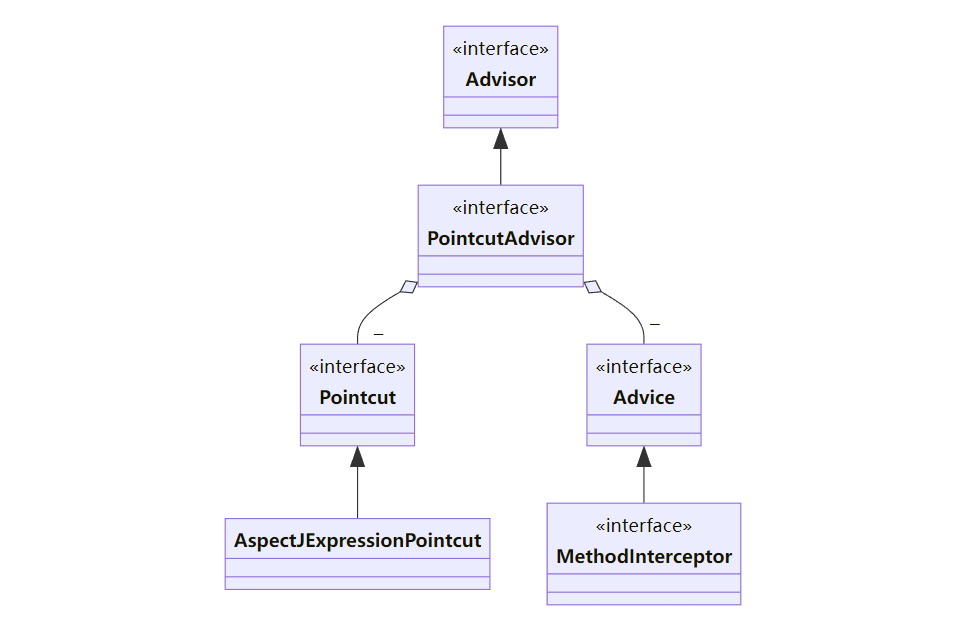


代理相关类图

* AopProxyFactory 根据 proxyTargetClass 等设置选择 AopProxy 实现
* AopProxy 通过 getProxy 创建代理对象
* 图中 Proxy 都实现了 Advised 接口，能够获得关联的切面集合与目标（其实是从 ProxyFactory 取得）
* 调用代理方法时，会借助 ProxyFactory 将通知统一转为环绕通知：MethodInterceptor

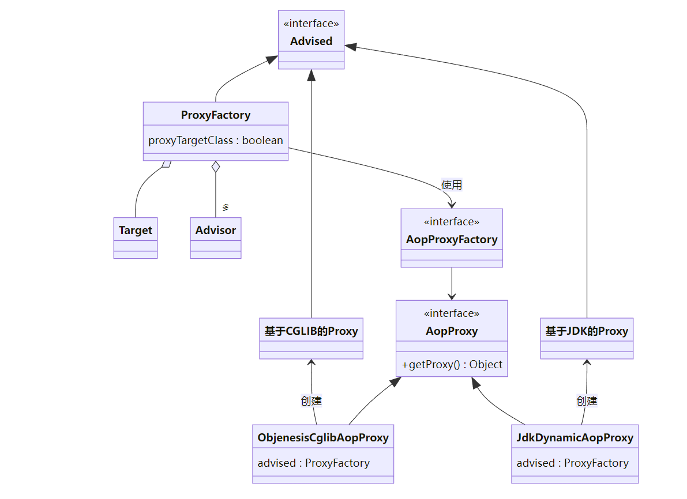


### 15.1 演示 - 底层切点、通知、切面

#### 15.1.1 代码参考

##### 1、代理是否可以被重复代理（可以）

```java
package com.itheima.a15;

import lombok.extern.slf4j.Slf4j;
import org.aspectj.lang.ProceedingJoinPoint;
import org.aspectj.lang.annotation.Around;
import org.aspectj.lang.annotation.Aspect;
import org.springframework.aop.aspectj.annotation.AnnotationAwareAspectJAutoProxyCreator;
import org.springframework.beans.factory.config.ConfigurableBeanFactory;
import org.springframework.context.annotation.Bean;
import org.springframework.context.annotation.ConfigurationClassPostProcessor;
import org.springframework.context.annotation.Scope;
import org.springframework.context.annotation.ScopedProxyMode;
import org.springframework.context.support.GenericApplicationContext;

/**
 * @author lyf
 * @version 1.0
 * @classname TestAspect1
 * @description 代理能否重复被代理(可以)
 * @since 2022/12/8 15:36
 */
@Slf4j
public class TestAspect1 {

    public static void main(String[] args) {
        GenericApplicationContext applicationContext = new GenericApplicationContext();
        applicationContext.registerBean("myConfig", MyConfig.class);
        applicationContext.registerBean(ConfigurationClassPostProcessor.class); // 解析@Bean注解
        applicationContext.registerBean("aspect1", Aspect1.class);
        applicationContext.registerBean(AnnotationAwareAspectJAutoProxyCreator.class); // 解析AspectJ 相关注解

        applicationContext.refresh();

        Bean1 bean1 = applicationContext.getBean(Bean1.class);
        bean1.foo();
        log.debug("bean1 class is {}", bean1.getClass());

        // 此代理是为了解决功能增强问题
        log.debug("scopedTarget.bean1 class is {}", applicationContext.getBean("scopedTarget.bean1").getClass());
        log.debug("scopedTarget.bean1 is {}", applicationContext.getBean("scopedTarget.bean1"));
        log.debug("scopedTarget.bean1 is {}", applicationContext.getBean("scopedTarget.bean1"));
        applicationContext.close();
    }


    static class MyConfig {

        /**
         * 此代理是为了解决单例注入多例问题
         *
         * @return
         */
        @Bean
        @Scope(value = ConfigurableBeanFactory.SCOPE_PROTOTYPE, proxyMode = ScopedProxyMode.TARGET_CLASS)
        public Bean1 bean1() {
            return new Bean1();
        }
    }

    static class Bean1 {
        public void foo() {
            log.debug("bean1 foo");
        }
    }

    @Aspect
    static class Aspect1 {
        @Around("execution(* foo())")
        public Object before(ProceedingJoinPoint point) throws Throwable {
            log.debug("aspect1 around");
            return point.proceed();
        }
    }
}

```

###### 1.1、结果

```java
[TRACE] 15:55:27.394 [main] o.s.a.a.a.AnnotationAwareAspectJAutoProxyCreator - Did not attempt to auto-proxy infrastructure class [org.springframework.aop.scope.ScopedProxyFactoryBean] 
[TRACE] 15:55:27.572 [main] o.s.a.a.a.AnnotationAwareAspectJAutoProxyCreator - Did not attempt to auto-proxy infrastructure class [com.itheima.a15.TestAspect1$Bean1$$EnhancerBySpringCGLIB$$18116dbd] 
[TRACE] 15:55:27.579 [main] o.s.a.a.a.AnnotationAwareAspectJAutoProxyCreator - Creating implicit proxy for bean 'scopedTarget.bean1' with 0 common interceptors and 2 specific interceptors 
[DEBUG] 15:55:27.601 [main] com.itheima.a15.TestAspect1         - aspect1 around 
[DEBUG] 15:55:27.605 [main] com.itheima.a15.TestAspect1         - bean1 foo 
[DEBUG] 15:55:27.606 [main] com.itheima.a15.TestAspect1         - bean1 class is class com.itheima.a15.TestAspect1$Bean1$$EnhancerBySpringCGLIB$$18116dbd 
[TRACE] 15:55:27.607 [main] o.s.a.a.a.AnnotationAwareAspectJAutoProxyCreator - Creating implicit proxy for bean 'scopedTarget.bean1' with 0 common interceptors and 2 specific interceptors 
[DEBUG] 15:55:27.608 [main] com.itheima.a15.TestAspect1         - scopedTarget.bean1 class is class com.itheima.a15.TestAspect1$Bean1$$EnhancerBySpringCGLIB$$1f128c29 
[TRACE] 15:55:27.608 [main] o.s.a.a.a.AnnotationAwareAspectJAutoProxyCreator - Creating implicit proxy for bean 'scopedTarget.bean1' with 0 common interceptors and 2 specific interceptors 
[DEBUG] 15:55:27.608 [main] com.itheima.a15.TestAspect1         - scopedTarget.bean1 is com.itheima.a15.TestAspect1$Bean1@3e8c3cb 
[TRACE] 15:55:27.608 [main] o.s.a.a.a.AnnotationAwareAspectJAutoProxyCreator - Creating implicit proxy for bean 'scopedTarget.bean1' with 0 common interceptors and 2 specific interceptors 
[DEBUG] 15:55:27.608 [main] com.itheima.a15.TestAspect1         - scopedTarget.bean1 is com.itheima.a15.TestAspect1$Bean1@563f38c4 

```

##### 2、测试Aspect执行顺序

```java
package com.itheima.a15;

import lombok.extern.slf4j.Slf4j;
import org.aspectj.lang.annotation.Aspect;
import org.aspectj.lang.annotation.Before;
import org.springframework.aop.Advisor;
import org.springframework.aop.aspectj.annotation.AnnotationAwareAspectJAutoProxyCreator;
import org.springframework.aop.aspectj.autoproxy.AspectJAwareAdvisorAutoProxyCreator;
import org.springframework.aop.framework.autoproxy.AbstractAdvisorAutoProxyCreator;
import org.springframework.beans.factory.support.BeanDefinitionBuilder;
import org.springframework.beans.factory.support.DefaultListableBeanFactory;
import org.springframework.core.annotation.Order;

import java.lang.reflect.Field;
import java.lang.reflect.InvocationTargetException;
import java.lang.reflect.Method;
import java.util.Comparator;
import java.util.List;

/**
 * @author lyf
 * @version 1.0
 * @classname TestAspect2
 * @description
 * @since 2022/12/8 15:58
 */
@Slf4j
public class TestAspect2 {

    public static void main(String[] args) throws NoSuchMethodException, InvocationTargetException, IllegalAccessException, NoSuchFieldException {
        DefaultListableBeanFactory beanFactory = new DefaultListableBeanFactory();

        beanFactory.registerBeanDefinition("aspect2", BeanDefinitionBuilder.genericBeanDefinition(Aspect2.class).getBeanDefinition());
        beanFactory.registerBeanDefinition("aspect1", BeanDefinitionBuilder.genericBeanDefinition(Aspect1.class).getBeanDefinition());
        AnnotationAwareAspectJAutoProxyCreator creator = new AnnotationAwareAspectJAutoProxyCreator();
        creator.setBeanFactory(beanFactory);
        Method findEligibleAdvisors = AbstractAdvisorAutoProxyCreator.class.getDeclaredMethod("findEligibleAdvisors", Class.class, String.class);
        findEligibleAdvisors.setAccessible(true);
        List list = (List) findEligibleAdvisors.invoke(creator, Bean1.class, "bean1");


        Field default_precedence_comparator = AspectJAwareAdvisorAutoProxyCreator.class.getDeclaredField("DEFAULT_PRECEDENCE_COMPARATOR");
        default_precedence_comparator.setAccessible(true);
        Comparator<Advisor> comparator = (Comparator<Advisor>) default_precedence_comparator.get(creator);
        list.sort(comparator);

        for (Object o : list) {
            log.debug("{}", o);
        }
    }


    static class Bean1 {
        public void foo() {

        }
    }

    @Order(1)
    @Aspect
    static class Aspect1 {
        @Before("execution(* foo())")
        public void before1() {

        }
    }

    @Order(2)
    @Aspect
    static class Aspect2 {
        @Before("execution(* foo())")
        public void before2() {

        }
    }
}

```

###### 2.1 执行结果

```java
[DEBUG] 16:10:09.468 [main] com.itheima.a15.TestAspect2         - org.springframework.aop.interceptor.ExposeInvocationInterceptor.ADVISOR 
[DEBUG] 16:10:09.476 [main] com.itheima.a15.TestAspect2         - InstantiationModelAwarePointcutAdvisor: expression [execution(* foo())]; advice method [public void com.itheima.a15.TestAspect2$Aspect1.before1()]; perClauseKind=SINGLETON 
[DEBUG] 16:10:09.476 [main] com.itheima.a15.TestAspect2         - InstantiationModelAwarePointcutAdvisor: expression [execution(* foo())]; advice method [public void com.itheima.a15.TestAspect2$Aspect2.before2()]; perClauseKind=SINGLETON 
```

##### 3、TestAdvisor

```java
package com.itheima.a15;

import lombok.extern.slf4j.Slf4j;
import org.aopalliance.intercept.MethodInterceptor;
import org.springframework.aop.aspectj.AspectJExpressionPointcut;
import org.springframework.aop.framework.ProxyFactory;
import org.springframework.aop.support.DefaultPointcutAdvisor;

/**
 * @author lyf
 * @version 1.0
 * @classname TestAdvisor
 * @description 编程的方式添加底层切点
 * @since 2022/12/7 18:51
 */
@Slf4j
public class TestAdvisor {
    public static void main(String[] args) {
        /*
            两个切面概念
            aspect =
                通知1(advice) +  切点1(pointcut)
                通知2(advice) +  切点2(pointcut)
                通知3(advice) +  切点3(pointcut)
                ...
            advisor = 更细粒度的切面，包含一个通知和切点
         */
        // 1 准备切点

        AspectJExpressionPointcut pointcut = new AspectJExpressionPointcut();
        pointcut.setExpression("execution(* foo())");

        // 2 备好通知使用的是MethodInterceptor
        MethodInterceptor advice = invocation -> {
            log.debug("before...");
            Object result = invocation.proceed();
            log.debug("after...");
            return result;
        };
        // 3 准备好切面 DefaultPointcutAdvisor
        DefaultPointcutAdvisor advisor = new DefaultPointcutAdvisor(pointcut, advice);
        /*
            4 通过代理工厂创建代理对象
                a. proxyTargetClass = false, 目标实现了接口, 用 jdk 实现
                b. proxyTargetClass = false,  目标没有实现接口, 用 cglib 实现
                c. proxyTargetClass = true, 总是使用 cglib 实现
         */
        ProxyFactory factory = getProxyFactory3(advisor);

        MyInterface proxyObj = (MyInterface) factory.getProxy();
        log.debug("proxyTargetClass value is {}", factory.isProxyTargetClass());
        log.debug("proxyObj class is {}", proxyObj.getClass());
        // 5 调用方法
        proxyObj.foo();
        proxyObj.bar();
    }

    /**
     * b. proxyTargetClass = false,  目标没有实现接口, 用 cglib 实现
     * <p>
     * [DEBUG] 15:30:04.649 [main] com.itheima.a15.TestAdvisor         - proxyTargetClass value is false
     * [DEBUG] 15:30:04.657 [main] com.itheima.a15.TestAdvisor         - proxyObj class is class com.itheima.a15.TestAdvisor$Target1$$EnhancerBySpringCGLIB$$618f640
     * [DEBUG] 15:30:04.659 [main] com.itheima.a15.TestAdvisor         - before...
     * [DEBUG] 15:30:04.674 [main] com.itheima.a15.TestAdvisor         - foo target1
     * [DEBUG] 15:30:04.674 [main] com.itheima.a15.TestAdvisor         - after...
     * [DEBUG] 15:30:04.675 [main] com.itheima.a15.TestAdvisor         - bar target1
     *
     * @param advisor
     * @return
     */
    private static ProxyFactory getProxyFactory(DefaultPointcutAdvisor advisor) {
        ProxyFactory factory = new ProxyFactory();
        Target1 target1 = new Target1();
        factory.setTarget(target1);
        factory.addAdvisor(advisor);
        return factory;
    }

    /**
     * a. proxyTargetClass = false, 目标实现了接口, 用 jdk 实现
     * <p>
     * [DEBUG] 15:31:38.725 [main] com.itheima.a15.TestAdvisor         - proxyTargetClass value is false
     * [DEBUG] 15:31:38.735 [main] com.itheima.a15.TestAdvisor         - proxyObj class is class com.itheima.a15.$Proxy2
     * [DEBUG] 15:31:38.997 [main] com.itheima.a15.TestAdvisor         - before...
     * [DEBUG] 15:31:38.997 [main] com.itheima.a15.TestAdvisor         - foo target1
     * [DEBUG] 15:31:38.997 [main] com.itheima.a15.TestAdvisor         - after...
     * [DEBUG] 15:31:38.998 [main] com.itheima.a15.TestAdvisor         - bar target1
     *
     * @param advisor
     * @return
     */
    private static ProxyFactory getProxyFactory2(DefaultPointcutAdvisor advisor) {
        ProxyFactory factory = new ProxyFactory();
        Target1 target1 = new Target1();
        factory.setTarget(target1);
        factory.addAdvisor(advisor);
        factory.setInterfaces(target1.getClass().getInterfaces());
        return factory;
    }

    /**
     * c. proxyTargetClass = true, 总是使用 cglib 实现
     * <p>
     * [DEBUG] 15:32:55.387 [main] com.itheima.a15.TestAdvisor         - proxyTargetClass value is true
     * [DEBUG] 15:32:55.395 [main] com.itheima.a15.TestAdvisor         - proxyObj class is class com.itheima.a15.TestAdvisor$Target1$$EnhancerBySpringCGLIB$$9df79a4
     * [DEBUG] 15:32:55.398 [main] com.itheima.a15.TestAdvisor         - before...
     * [DEBUG] 15:32:55.410 [main] com.itheima.a15.TestAdvisor         - foo target1
     * [DEBUG] 15:32:55.410 [main] com.itheima.a15.TestAdvisor         - after...
     * [DEBUG] 15:32:55.410 [main] com.itheima.a15.TestAdvisor         - bar target1
     *
     * @param advisor
     * @return
     */
    private static ProxyFactory getProxyFactory3(DefaultPointcutAdvisor advisor) {
        ProxyFactory factory = new ProxyFactory();
        Target1 target1 = new Target1();
        factory.setTarget(target1);
        factory.addAdvisor(advisor);
        factory.setInterfaces(target1.getClass().getInterfaces());
        factory.setProxyTargetClass(true); // 强制使用cglib代理
        return factory;
    }

    interface MyInterface {
        void foo();

        void bar();
    }

    static class Target1 implements MyInterface {

        @Override
        public void foo() {
            log.debug("foo target1");
        }

        @Override
        public void bar() {
            log.debug("bar target1");
        }
    }

    static class Target2 implements MyInterface {

        @Override
        public void foo() {
            log.debug("foo target2");
        }

        @Override
        public void bar() {
            log.debug("bar target2");
        }
    }
}

```

#### 15.1.2 收获💡

1. 底层的切点实现
2. 底层的通知实现
3. 底层的切面实现
4. ProxyFactory 用来创建代理
   * 如果指定了接口，且 proxyTargetClass = false，使用 JdkDynamicAopProxy
   * 如果没有指定接口，或者 proxyTargetClass = true，使用 ObjenesisCglibAopProxy
     * 例外：如果目标是接口类型或已经是 Jdk 代理，使用 JdkDynamicAopProxy

> ***注意***
>
> * 要区分本章节提到的 MethodInterceptor，它与之前 cglib 中用的的 MethodInterceptor 是不同的接口


## 16 切点匹配

### 16.1 演示 - 切点匹配

#### 16.1.1 代码参考

##### 1、根据expression表达式解析切点方法和解析@Transaction注解标注的方法

```java
package com.itheima.a16;

import lombok.extern.slf4j.Slf4j;
import org.springframework.aop.aspectj.AspectJExpressionPointcut;
import org.springframework.transaction.annotation.Transactional;

/**
 * @author lyf
 * @version 1.0
 * @classname TestAspectjMethodMatch
 * @description
 * @since 2022/12/9 10:25
 */
@Slf4j
public class TestAspectjMethodMatch {
    public static void main(String[] args) throws Throwable{
        // 解析Aspectj 切点表达式的工具类
        AspectJExpressionPointcut pointcut1 = new AspectJExpressionPointcut();
        pointcut1.setExpression("execution(* bar())");
        log.debug("foo: {}", pointcut1.matches(Target1.class.getMethod("foo"), Target1.class));
        log.debug("bar: {}", pointcut1.matches(Target1.class.getMethod("bar"), Target1.class));

        AspectJExpressionPointcut pointcut2 = new AspectJExpressionPointcut();
        pointcut2.setExpression("@annotation(org.springframework.transaction.annotation.Transactional)");
        log.debug("foo: {}", pointcut2.matches(Target1.class.getMethod("foo"), Target1.class));
        log.debug("bar: {}", pointcut2.matches(Target1.class.getMethod("bar"), Target1.class));
    }

    static class Target1 {
        // Transactional加在方法上
        @Transactional
        public void foo() {
            log.debug("target1 foo...");
        }

        public void bar() {
            log.debug("target1 bar...");
        }
    }

    // Transactional加在类上
    @Transactional
    static class Target2 {

        public void foo() {
            log.debug("target2 foo...");
        }
    }

    // Transactional加在接口上
    @Transactional
    interface MyInterface1 {
        void foo();
    }

    static class Target3 implements MyInterface1 {

        @Override
        public void foo() {
            log.debug("target3 foo...");
        }
    }
}


```

###### 1.1、测试结果

```java
[DEBUG] 10:36:01.722 [main] c.i.a16.TestAspectjMethodMatch      - foo: false 
[DEBUG] 10:36:01.730 [main] c.i.a16.TestAspectjMethodMatch      - bar: true 
[DEBUG] 10:36:01.801 [main] c.i.a16.TestAspectjMethodMatch      - foo: true 
[DEBUG] 10:36:01.801 [main] c.i.a16.TestAspectjMethodMatch      - bar: false 
```

##### 2、测试PointCut查找切点方法的`MethodMatcher`接口, @Transactional 切点实现

```java
package com.itheima.a16;

import lombok.extern.slf4j.Slf4j;
import org.springframework.aop.aspectj.AspectJExpressionPointcut;
import org.springframework.aop.support.StaticMethodMatcherPointcut;
import org.springframework.core.annotation.MergedAnnotations;
import org.springframework.transaction.annotation.Transactional;

import java.lang.reflect.Method;

/**
 * @author lyf
 * @version 1.0
 * @classname TestAspectjMethodMatch
 * @description
 * @since 2022/12/9 10:25
 */
@Slf4j
public class TestAspectjMethodMatch {
    public static void main(String[] args) throws Throwable{
        StaticMethodMatcherPointcut matcherPointcut = new StaticMethodMatcherPointcut() {
            @Override
            public boolean matches(Method method, Class<?> targetClass) {
                MergedAnnotations mergedAnnotations = MergedAnnotations.from(method);
                // 先判断方法上是否有@Transaction注解
                if (mergedAnnotations.isPresent(Transactional.class)) {
                    return true;
                }

                // 这种写法，只能匹配当前类上是否有@Transaction注解，而不能判断接口上是否有@Transaction注解
                // mergedAnnotations = MergedAnnotations.from(targetClass);
                // MergedAnnotations.SearchStrategy.TYPE_HIERARCHY 对整个类型层次结构执行完整搜索，包括 超类和实现的接口。
                mergedAnnotations = MergedAnnotations.from(targetClass, MergedAnnotations.SearchStrategy.TYPE_HIERARCHY);
                // 再判断类上是否有@Transaction注解
                return mergedAnnotations.isPresent(Transactional.class);
                // 再类的接口上是否有@Transaction注解
            }
        };

        log.debug("foo: {}", matcherPointcut.matches(Target1.class.getMethod("foo"), Target1.class));
        log.debug("bar: {}", matcherPointcut.matches(Target1.class.getMethod("bar"), Target1.class));
        log.debug("foo: {}", matcherPointcut.matches(Target2.class.getMethod("foo"), Target2.class));
        log.debug("bar: {}", matcherPointcut.matches(Target3.class.getMethod("foo"), Target3.class));

    }

    private static void method1() throws NoSuchMethodException {
        // 解析Aspectj 切点表达式的工具类
        AspectJExpressionPointcut pointcut1 = new AspectJExpressionPointcut();
        pointcut1.setExpression("execution(* bar())");
        log.debug("foo: {}", pointcut1.matches(Target1.class.getMethod("foo"), Target1.class));
        log.debug("bar: {}", pointcut1.matches(Target1.class.getMethod("bar"), Target1.class));

        AspectJExpressionPointcut pointcut2 = new AspectJExpressionPointcut();
        pointcut2.setExpression("@annotation(org.springframework.transaction.annotation.Transactional)");
        log.debug("foo: {}", pointcut2.matches(Target1.class.getMethod("foo"), Target1.class));
        log.debug("bar: {}", pointcut2.matches(Target1.class.getMethod("bar"), Target1.class));
    }

    static class Target1 {
        // Transactional加在方法上
        @Transactional
        public void foo() {
            log.debug("target1 foo...");
        }

        public void bar() {
            log.debug("target1 bar...");
        }
    }

    // Transactional加在类上
    @Transactional
    static class Target2 {

        public void foo() {
            log.debug("target2 foo...");
        }
    }

    // Transactional加在接口上
    @Transactional
    interface MyInterface1 {
        void foo();
    }

    static class Target3 implements MyInterface1 {

        @Override
        public void foo() {
            log.debug("target3 foo...");
        }
    }
}


```

###### 2.1 测试结果

```java
[DEBUG] 10:49:16.794 [main] c.i.a16.TestAspectjMethodMatch      - foo: true 
[DEBUG] 10:49:16.803 [main] c.i.a16.TestAspectjMethodMatch      - bar: false 
[DEBUG] 10:49:16.804 [main] c.i.a16.TestAspectjMethodMatch      - foo: true 
[DEBUG] 10:49:16.806 [main] c.i.a16.TestAspectjMethodMatch      - bar: true 
```


#### 16.1.2 收获💡

1. 常见 aspectj 切点用法
2. aspectj 切点的局限性，实际的 @Transactional 切点实现


## 17 从 @Aspect 到 Advisor

### 17.1 演示1 - 代理创建器

#### 17.1.1 代码参考

**org.springframework.aop.framework.autoproxy** 包

##### 1、TestAspectAndAdvisor

```java
package org.springframework.aop.framework.autoproxy;

import lombok.extern.slf4j.Slf4j;
import org.aopalliance.intercept.MethodInterceptor;
import org.aspectj.lang.annotation.Aspect;
import org.aspectj.lang.annotation.Before;
import org.springframework.aop.Advisor;
import org.springframework.aop.aspectj.AspectJExpressionPointcut;
import org.springframework.aop.aspectj.annotation.AnnotationAwareAspectJAutoProxyCreator;
import org.springframework.aop.support.DefaultPointcutAdvisor;
import org.springframework.context.annotation.Bean;
import org.springframework.context.annotation.Configuration;
import org.springframework.context.annotation.ConfigurationClassPostProcessor;
import org.springframework.context.support.GenericApplicationContext;

import java.util.List;

/**
 * @author lyf
 * @version 1.0
 * @classname TestAspectAndAdvisor
 * @description
 * @since 2022/12/9 10:55
 */
@Slf4j
public class TestAspectAndAdvisor {
    public static void main(String[] args) {
        GenericApplicationContext applicationContext = new GenericApplicationContext();
        applicationContext.registerBean("myAspect1", MyAspect1.class);
        applicationContext.registerBean("config", Config.class);
        applicationContext.registerBean(ConfigurationClassPostProcessor.class);
        applicationContext.registerBean(AnnotationAwareAspectJAutoProxyCreator.class);


        // BeanPostProcessor
        // 创建 -> (*) 依赖注入 -> 初始化 (*)
        applicationContext.refresh();

        // BeanUtil.printBeanNames(applicationContext);

       /*
            第一个重要方法 findEligibleAdvisors 找到有【资格】的 Advisors
                 a. 有【资格】的 Advisor 一部分是低级的, 可以由自己编写, 如下例中的 advisor3
                 b. 有【资格】的 Advisor 另一部分是高级的, 由本章的主角解析 @Aspect 后获得
         */
        AnnotationAwareAspectJAutoProxyCreator creator = applicationContext.getBean(AnnotationAwareAspectJAutoProxyCreator.class);
        List<Advisor> advisorList = creator.findEligibleAdvisors(Target1.class, "target1");
        for (Advisor advisor : advisorList) {
            log.debug("{}", advisor);
        }

        System.out.println(">>>>>>>>>>>>>>>>>>>>>>>>>>>>>>>>>>>>>>>>>>>>>>>>>>>>>>>>>>>>>>>>>>>>>>>>>>>>>>>>>>>>>");
        System.out.println(">>>>>>>>>>>>>>>>>>>>>>>>>>>>>>>>>>>>>>>>>>>>>>>>>>>>>>>>>>>>>>>>>>>>>>>>>>>>>>>>>>>>>");
        System.out.println(">>>>>>>>>>>>>>>>>>>>>>>>>>>>>>>>>>>>>>>>>>>>>>>>>>>>>>>>>>>>>>>>>>>>>>>>>>>>>>>>>>>>>");

         /*
            第二个重要方法 wrapIfNecessary
                a. 它内部调用 findEligibleAdvisors, 只要返回集合不空, 则表示需要创建代理
         */
        Object target1Obj = creator.wrapIfNecessary(new Target1(), "target1", "target1");
        Object target2Obj = creator.wrapIfNecessary(new Target2(), "target2", "target2");

        log.debug("target1: {}", target1Obj.getClass());
        log.debug("target2: {}", target2Obj.getClass());

        ((Target1) target1Obj).foo();

         /*
            学到了什么
                a. 自动代理后处理器 AnnotationAwareAspectJAutoProxyCreator 会帮我们创建代理
                b. 通常代理创建的活在原始对象初始化后执行, 但碰到循环依赖会提前至依赖注入之前执行
                c. 高级的 @Aspect 切面会转换为低级的 Advisor 切面, 理解原理, 大道至简
         */

        applicationContext.close();
    }

    static class Target1 {
        public void foo() {
            log.debug("target1 foo...");
        }
    }

    static class Target2 {
        public void bar() {
            log.debug("target2 bar...");
        }
    }

    /**
     * 高级切面类
     */
    @Aspect
    static class MyAspect1 {
        @Before("execution(* foo())")
        public void before1() {
            log.debug("myAspect1 before1...");
        }

        @Before("execution(* foo())")
        public void before2() {
            log.debug("myAspect1 before2...");
        }
    }

    /**
     * 低级切面类
     */
    @Configuration
    static class Config {
        @Bean
        public Advisor advisor3(MethodInterceptor advice3) {
            AspectJExpressionPointcut pointcut = new AspectJExpressionPointcut();
            pointcut.setExpression("execution(* foo())");
            return new DefaultPointcutAdvisor(pointcut, advice3);
        }

        @Bean
        public MethodInterceptor advice3() {
            return invocation -> {
                log.debug("before...");
                Object result = invocation.proceed();
                log.debug("after...");
                return result;
            };
        }
    }
}

```


###### 1.2、测试结果

```java
[TRACE] 11:32:26.214 [main] o.s.a.a.a.AnnotationAwareAspectJAutoProxyCreator - Did not attempt to auto-proxy infrastructure class [org.springframework.aop.Advisor] 
[TRACE] 11:32:26.351 [main] o.s.a.a.a.AnnotationAwareAspectJAutoProxyCreator - Did not attempt to auto-proxy infrastructure class [org.aopalliance.intercept.MethodInterceptor] 
[DEBUG] 11:32:26.392 [main] o.s.a.f.a.TestAspectAndAdvisor      - org.springframework.aop.interceptor.ExposeInvocationInterceptor.ADVISOR 
[DEBUG] 11:32:26.394 [main] o.s.a.f.a.TestAspectAndAdvisor      - org.springframework.aop.support.DefaultPointcutAdvisor: pointcut [AspectJExpressionPointcut: () execution(* foo())]; advice [org.springframework.aop.framework.autoproxy.TestAspectAndAdvisor$Config$$Lambda$56/1714113641@47e2e487] 
[DEBUG] 11:32:26.394 [main] o.s.a.f.a.TestAspectAndAdvisor      - InstantiationModelAwarePointcutAdvisor: expression [execution(* foo())]; advice method [public void org.springframework.aop.framework.autoproxy.TestAspectAndAdvisor$MyAspect1.before1()]; perClauseKind=SINGLETON 
[DEBUG] 11:32:26.394 [main] o.s.a.f.a.TestAspectAndAdvisor      - InstantiationModelAwarePointcutAdvisor: expression [execution(* foo())]; advice method [public void org.springframework.aop.framework.autoproxy.TestAspectAndAdvisor$MyAspect1.before2()]; perClauseKind=SINGLETON 
>>>>>>>>>>>>>>>>>>>>>>>>>>>>>>>>>>>>>>>>>>>>>>>>>>>>>>>>>>>>>>>>>>>>>>>>>>>>>>>>>>>>>
>>>>>>>>>>>>>>>>>>>>>>>>>>>>>>>>>>>>>>>>>>>>>>>>>>>>>>>>>>>>>>>>>>>>>>>>>>>>>>>>>>>>>
>>>>>>>>>>>>>>>>>>>>>>>>>>>>>>>>>>>>>>>>>>>>>>>>>>>>>>>>>>>>>>>>>>>>>>>>>>>>>>>>>>>>>
[TRACE] 11:32:26.399 [main] o.s.a.a.a.AnnotationAwareAspectJAutoProxyCreator - Creating implicit proxy for bean 'target1' with 0 common interceptors and 4 specific interceptors 
[DEBUG] 11:32:26.413 [main] o.s.a.f.a.TestAspectAndAdvisor      - target1: class org.springframework.aop.framework.autoproxy.TestAspectAndAdvisor$Target1$$EnhancerBySpringCGLIB$$ec7814b 
[DEBUG] 11:32:26.413 [main] o.s.a.f.a.TestAspectAndAdvisor      - target2: class org.springframework.aop.framework.autoproxy.TestAspectAndAdvisor$Target2 
[DEBUG] 11:32:26.415 [main] o.s.a.f.a.TestAspectAndAdvisor      - before... 
[DEBUG] 11:32:26.419 [main] o.s.a.f.a.TestAspectAndAdvisor      - myAspect1 before1... 
[DEBUG] 11:32:26.419 [main] o.s.a.f.a.TestAspectAndAdvisor      - myAspect1 before2... 
[DEBUG] 11:32:26.427 [main] o.s.a.f.a.TestAspectAndAdvisor      - target1 foo... 
[DEBUG] 11:32:26.427 [main] o.s.a.f.a.TestAspectAndAdvisor      - after... 
```


#### 17.1.2 收获💡

1. AnnotationAwareAspectJAutoProxyCreator 的作用
   * 将高级 @Aspect 切面统一为低级 Advisor 切面
   * 在合适的时机创建代理
2. findEligibleAdvisors 找到有【资格】的 Advisors
   * 有【资格】的 Advisor 一部分是低级的, 可以由自己编写, 如本例 A17 中的 advisor3
   * 有【资格】的 Advisor 另一部分是高级的, 由解析 @Aspect 后获得
3. wrapIfNecessary
   * 它内部调用 findEligibleAdvisors, 只要返回集合不空, 则表示需要创建代理
   * 它的调用时机通常在原始对象初始化后执行, 但碰到循环依赖会提前至依赖注入之前执行


### 17.2 演示2 - 代理创建时机

#### 17.2.1 代码参考

##### 1、无循环依赖时

```java
package org.springframework.aop.framework.autoproxy;

import lombok.extern.slf4j.Slf4j;
import org.aopalliance.intercept.MethodInterceptor;
import org.aopalliance.intercept.MethodInvocation;
import org.springframework.aop.Advisor;
import org.springframework.aop.aspectj.AspectJExpressionPointcut;
import org.springframework.aop.aspectj.annotation.AnnotationAwareAspectJAutoProxyCreator;
import org.springframework.aop.support.DefaultPointcutAdvisor;
import org.springframework.beans.factory.annotation.Autowired;
import org.springframework.beans.factory.annotation.AutowiredAnnotationBeanPostProcessor;
import org.springframework.context.annotation.Bean;
import org.springframework.context.annotation.CommonAnnotationBeanPostProcessor;
import org.springframework.context.annotation.Configuration;
import org.springframework.context.annotation.ConfigurationClassPostProcessor;
import org.springframework.context.support.GenericApplicationContext;

import javax.annotation.PostConstruct;

/**
 * @author lyf
 * @version 1.0
 * @classname TestAopProxyCreateTime
 * @description 测试Aop代理创建时机
 * @since 2022/12/9 11:35
 */
@Slf4j
public class TestAopProxyCreateTime {
    public static void main(String[] args) {
        // 创建 -> (*) 依赖注入 -> 初始化 (*)
        /*
            学到了什么
                a. 代理的创建时机
                    1. 初始化之后 (无循环依赖时)
                    2. 实例创建后, 依赖注入前 (有循环依赖时), 并暂存于二级缓存
                b. 依赖注入与初始化不应该被增强, 仍应被施加于原始对象
         */

        GenericApplicationContext applicationContext = new GenericApplicationContext();
        applicationContext.registerBean("config1", Config.class);

        // 解析@Bean注解
        applicationContext.registerBean(ConfigurationClassPostProcessor.class);


        applicationContext.refresh();
        applicationContext.close();
    }

    @Configuration
    static class Config {
        /**
         * 产生AspectJ代理
         *
         * @return
         */
        @Bean
        public AnnotationAwareAspectJAutoProxyCreator annotationAwareAspectJAutoProxyCreator() {
            return new AnnotationAwareAspectJAutoProxyCreator();
        }

        /**
         * 解析@Autowired注解
         *
         * @return
         */
        @Bean
        public AutowiredAnnotationBeanPostProcessor autowiredAnnotationBeanPostProcessor() {
            return new AutowiredAnnotationBeanPostProcessor();
        }

        /**
         * 解析 @PostConstruct
         *
         * @return
         */
        @Bean
        public CommonAnnotationBeanPostProcessor commonAnnotationBeanPostProcessor() {
            return new CommonAnnotationBeanPostProcessor();
        }

        @Bean
        public Advisor advisor(MethodInterceptor advice) {
            AspectJExpressionPointcut pointcut = new AspectJExpressionPointcut();
            pointcut.setExpression("execution(* foo())");
            return new DefaultPointcutAdvisor(pointcut, advice);
        }

        @Bean
        public MethodInterceptor advice() {
            return invocation -> {
                log.debug("before...");
                Object result = invocation.proceed();
                log.debug("after");
                return result;
            };
        }

        @Bean
        public Bean1 bean1() {
            return new Bean1();
        }

        @Bean
        public Bean2 bean2() {
            return new Bean2();
        }
    }


    static class Bean1 {
        public Bean1() {
            log.debug("bean1 construct...");
        }

        @Autowired
        public void setBean2(Bean2 bean2) {
            log.debug("bean1 set Bean2, the bean2 class is {}", bean2.getClass());
        }

        public void foo() {
            log.debug("bean1 foo...");
        }

        @PostConstruct
        public void init() {
            log.debug("bean1 init...");
        }
    }

    static class Bean2 {

        public Bean2() {
            log.debug("bean2 construct...");
        }

       /* @Autowired
        public void setBean1(Bean1 bean1) {
            log.debug("bean2 set Bean1, the bean1 class is {}", bean1.getClass());
        }*/

        @PostConstruct
        public void init() {
            log.debug("bean2 init...");
        }
    }
}

```

###### 1.1、测试结果

```java
INFO ] 11:55:40.371 [main] o.s.c.s.PostProcessorRegistrationDelegate$BeanPostProcessorChecker - Bean 'config1' of type [org.springframework.aop.framework.autoproxy.TestAopProxyCreateTime$Config$$EnhancerBySpringCGLIB$$9df9bcef] is not eligible for getting processed by all BeanPostProcessors (for example: not eligible for auto-proxying) 
[TRACE] 11:55:40.441 [main] o.s.a.a.a.AnnotationAwareAspectJAutoProxyCreator - Did not attempt to auto-proxy infrastructure class [org.springframework.aop.Advisor] 
[TRACE] 11:55:40.445 [main] o.s.a.a.a.AnnotationAwareAspectJAutoProxyCreator - Did not attempt to auto-proxy infrastructure class [org.aopalliance.intercept.MethodInterceptor] 
[DEBUG] 11:55:40.461 [main] o.s.a.f.a.TestAopProxyCreateTime    - bean1 construct... 
[DEBUG] 11:55:40.499 [main] o.s.a.f.a.TestAopProxyCreateTime    - bean2 construct... 
[DEBUG] 11:55:40.500 [main] o.s.a.f.a.TestAopProxyCreateTime    - bean2 init... 
[DEBUG] 11:55:40.596 [main] o.s.a.f.a.TestAopProxyCreateTime    - bean1 set Bean2, the bean2 class is class org.springframework.aop.framework.autoproxy.TestAopProxyCreateTime$Bean2 
[DEBUG] 11:55:40.597 [main] o.s.a.f.a.TestAopProxyCreateTime    - bean1 init... 
[TRACE] 11:55:40.603 [main] o.s.a.a.a.AnnotationAwareAspectJAutoProxyCreator - Creating implicit proxy for bean 'bean1' with 0 common interceptors and 2 specific interceptors 
```

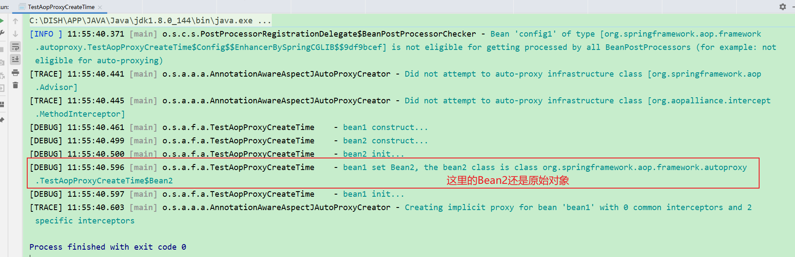

##### 2、有循环依赖时

```java
	static class Bean2 {

        public Bean2() {
            log.debug("bean2 construct...");
        }

        @Autowired
        public void setBean1(Bean1 bean1) {
            log.debug("bean2 set Bean1, the bean1 class is {}", bean1.getClass());
        }

        @PostConstruct
        public void init() {
            log.debug("bean2 init...");
        }
    }
```

###### 2.1、测试结果

```java
[INFO ] 11:57:14.557 [main] o.s.c.s.PostProcessorRegistrationDelegate$BeanPostProcessorChecker - Bean 'config1' of type [org.springframework.aop.framework.autoproxy.TestAopProxyCreateTime$Config$$EnhancerBySpringCGLIB$$9df9bcef] is not eligible for getting processed by all BeanPostProcessors (for example: not eligible for auto-proxying) 
[TRACE] 11:57:14.628 [main] o.s.a.a.a.AnnotationAwareAspectJAutoProxyCreator - Did not attempt to auto-proxy infrastructure class [org.springframework.aop.Advisor] 
[TRACE] 11:57:14.632 [main] o.s.a.a.a.AnnotationAwareAspectJAutoProxyCreator - Did not attempt to auto-proxy infrastructure class [org.aopalliance.intercept.MethodInterceptor] 
[DEBUG] 11:57:14.652 [main] o.s.a.f.a.TestAopProxyCreateTime    - bean1 construct... 
[DEBUG] 11:57:14.700 [main] o.s.a.f.a.TestAopProxyCreateTime    - bean2 construct... 
[TRACE] 11:57:14.807 [main] o.s.a.a.a.AnnotationAwareAspectJAutoProxyCreator - Creating implicit proxy for bean 'bean1' with 0 common interceptors and 2 specific interceptors 
[DEBUG] 11:57:14.822 [main] o.s.a.f.a.TestAopProxyCreateTime    - bean2 set Bean1, the bean1 class is class org.springframework.aop.framework.autoproxy.TestAopProxyCreateTime$Bean1$$EnhancerBySpringCGLIB$$68c6bc80 
[DEBUG] 11:57:14.823 [main] o.s.a.f.a.TestAopProxyCreateTime    - bean2 init... 
[DEBUG] 11:57:14.825 [main] o.s.a.f.a.TestAopProxyCreateTime    - bean1 set Bean2, the bean2 class is class org.springframework.aop.framework.autoproxy.TestAopProxyCreateTime$Bean2 
[DEBUG] 11:57:14.825 [main] o.s.a.f.a.TestAopProxyCreateTime    - bean1 init... 

```

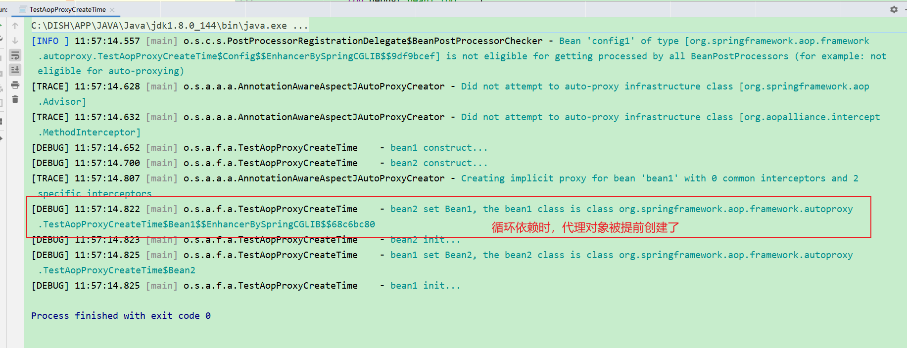

#### 17.2.2 收获💡

1. 代理的创建时机
   * 初始化之后 (无循环依赖时)
   * 实例创建后, 依赖注入前 (有循环依赖时), 并暂存于二级缓存
2. 依赖注入与初始化不应该被增强, 仍应被施加于原始对象


### 17.3 演示3 - @Before 对应的低级通知

#### 17.3.1 代码参考

##### 1、测试代码-@Before对应的低级通知

```java
package org.springframework.aop.framework.autoproxy;

import lombok.extern.slf4j.Slf4j;
import org.aspectj.lang.ProceedingJoinPoint;
import org.aspectj.lang.annotation.Aspect;
import org.aspectj.lang.annotation.Before;
import org.springframework.aop.Advisor;
import org.springframework.aop.aspectj.AspectInstanceFactory;
import org.springframework.aop.aspectj.AspectJExpressionPointcut;
import org.springframework.aop.aspectj.AspectJMethodBeforeAdvice;
import org.springframework.aop.aspectj.SingletonAspectInstanceFactory;
import org.springframework.aop.support.DefaultPointcutAdvisor;
import org.springframework.util.ObjectUtils;
import org.springframework.util.StringUtils;

import java.lang.reflect.Method;
import java.util.ArrayList;
import java.util.List;

/**
 * @author lyf
 * @version 1.0
 * @classname TestAspectToAdvisor
 * @description 高级切面类Aspect最终会转换为低级切面类Advisor
 * @since 2022/12/9 12:05
 */
@Slf4j
public class TestAspectToAdvisor {
    public static void main(String[] args) {
        /*
            @Before 前置通知会被转换为下面原始的 AspectJMethodBeforeAdvice 形式, 该对象包含了如下信息
                a. 通知代码从哪儿来
                b. 切点是什么(这里为啥要切点, 后面解释)
                c. 通知对象如何创建, 本例共用同一个 Aspect 对象
            类似的通知还有
                1. AspectJAroundAdvice (环绕通知)
                2. AspectJAfterReturningAdvice
                3. AspectJAfterThrowingAdvice
                4. AspectJAfterAdvice (环绕通知)
         */
        // 准备一个AspectJ工厂
        AspectInstanceFactory factory = new SingletonAspectInstanceFactory(new Aspect1());
        List<Advisor> advisorList = new ArrayList<>();
        // 1 解析Aspect1
        for (Method method : Aspect1.class.getDeclaredMethods()) {
            // 2 判断方法上是否存在@Before注解
            if (method.isAnnotationPresent(Before.class)) {
                // 3 解析切点
                String expression = method.getAnnotation(Before.class).value();
                if (!ObjectUtils.isEmpty(expression)) {
                    AspectJExpressionPointcut pointcut = new AspectJExpressionPointcut();
                    pointcut.setExpression(expression);

                    // 4 准备通知
                    AspectJMethodBeforeAdvice beforeAdvice = new AspectJMethodBeforeAdvice(method, pointcut, factory);
                    // 5 准备切面
                    DefaultPointcutAdvisor advisor = new DefaultPointcutAdvisor(pointcut, beforeAdvice);
                    advisorList.add(advisor);
                }
            }

        }

        // 打印所有的底层切面
        for (Advisor advisor : advisorList) {
            System.out.println(advisor);
        }

    }

    @Aspect
    static class Aspect1 {
        @Before("execution(* foo())")
        public void before1() {
            log.debug("before1...");
        }

        @Before("execution(* foo())")
        public void before2() {
            log.debug("before2...");
        }

        /**
         * 后置通知
         */
        public void after() {
            log.debug("after...");
        }


        /**
         * 返回通知
         *
         * @param obj
         */
        public void afterReturning(Object obj) {
            log.debug("afterReturning...{}", obj);
        }

        /**
         * 异常通知
         *
         * @param e
         */
        public void afterThrowing(Exception e) {
            log.debug("afterThrowing...{}", e);
        }

        /**
         * 环绕通知
         *
         * @param point
         * @return
         * @throws Throwable
         */
        public Object around(ProceedingJoinPoint point) throws Throwable {
            try {
                log.debug("around...before");
                return point.proceed();
            } finally {
                log.debug("around...after");
            }
        }
    }

    static class Target1 {
        public void foo() {
            log.debug("foo...");
        }
    }
}

```

###### 1.1、测试结果

```java
org.springframework.aop.support.DefaultPointcutAdvisor: pointcut [AspectJExpressionPointcut: () execution(* foo())]; advice [org.springframework.aop.aspectj.AspectJMethodBeforeAdvice: advice method [public void org.springframework.aop.framework.autoproxy.TestAspectToAdvisor$Aspect1.before1()]; aspect name '']
org.springframework.aop.support.DefaultPointcutAdvisor: pointcut [AspectJExpressionPointcut: () execution(* foo())]; advice [org.springframework.aop.aspectj.AspectJMethodBeforeAdvice: advice method [public void org.springframework.aop.framework.autoproxy.TestAspectToAdvisor$Aspect1.before2()]; aspect name '']

```


#### 17.3.2 收获💡

1. @Before 前置通知会被转换为原始的 AspectJMethodBeforeAdvice 形式, 该对象包含了如下信息
   1. 通知代码从哪儿来
   2. 切点是什么(这里为啥要切点, 后面解释)
   3. 通知对象如何创建, 本例共用同一个 Aspect 对象
2. 类似的还有
   1. AspectJAroundAdvice (环绕通知)
   2. AspectJAfterReturningAdvice
   3. AspectJAfterThrowingAdvice (环绕通知)
   4. AspectJAfterAdvice (环绕通知)


## 18 静态通知调用

代理对象调用流程如下（以 JDK 动态代理实现为例）

* 从 ProxyFactory 获得 Target 和环绕通知链，根据他俩创建 MethodInvocation，简称 mi
* 首次执行 mi.proceed() 发现有下一个环绕通知，调用它的 invoke(mi)
* 进入环绕通知1，执行前增强，再次调用 mi.proceed() 发现有下一个环绕通知，调用它的 invoke(mi)
* 进入环绕通知2，执行前增强，调用 mi.proceed() 发现没有环绕通知，调用 mi.invokeJoinPoint() 执行目标方法
* 目标方法执行结束，将结果返回给环绕通知2，执行环绕通知2 的后增强
* 环绕通知2继续将结果返回给环绕通知1，执行环绕通知1 的后增强
* 环绕通知1返回最终的结果

图中不同颜色对应一次环绕通知或目标的调用起始至终结

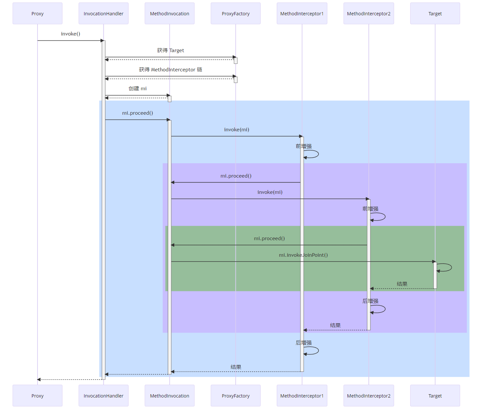

### 18.1 演示1 - 通知调用过程

#### 18.1.1 代码参考

##### 1、测试代码

```java
package org.springframework.aop.framework;

import lombok.extern.slf4j.Slf4j;
import org.aopalliance.intercept.MethodInvocation;
import org.aspectj.lang.ProceedingJoinPoint;
import org.aspectj.lang.annotation.*;
import org.springframework.aop.Advisor;
import org.springframework.aop.aspectj.*;
import org.springframework.aop.framework.ProxyFactory;
import org.springframework.aop.framework.ReflectiveMethodInvocation;
import org.springframework.aop.interceptor.ExposeInvocationInterceptor;
import org.springframework.aop.support.DefaultPointcutAdvisor;
import org.springframework.expression.spel.support.ReflectiveMethodExecutor;
import org.springframework.lang.Nullable;
import org.springframework.util.ObjectUtils;

import java.lang.annotation.Annotation;
import java.lang.reflect.Method;
import java.util.ArrayList;
import java.util.List;

/**
 * @author lyf
 * @version 1.0
 * @classname TestAspectToAdvisor
 * @description 高级切面类Aspect最终会转换为低级切面类Advisor
 * @since 2022/12/9 12:05
 */
@Slf4j
public class TestAspectToAdvisor2 {

    public static void main(String[] args) throws Throwable {
        /*
            @Before 前置通知会被转换为下面原始的 AspectJMethodBeforeAdvice 形式, 该对象包含了如下信息
                a. 通知代码从哪儿来
                b. 切点是什么(这里为啥要切点, 后面解释)
                c. 通知对象如何创建, 本例共用同一个 Aspect 对象
            类似的通知还有
                1. AspectJAroundAdvice (环绕通知)
                2. AspectJAfterReturningAdvice
                3. AspectJAfterThrowingAdvice
                4. AspectJAfterAdvice (环绕通知)
         */
        // 准备一个AspectJ工厂
        AspectInstanceFactory factory = new SingletonAspectInstanceFactory(new Aspect1());
        List<Advisor> advisorList = new ArrayList<>();
        // 1 解析Aspect1
        for (Method method : Aspect1.class.getDeclaredMethods()) {
            // 2 判断方法上是否存在@Before注解
            Advisor advisor = getAdvisor(method, factory);
            if (advisor != null) {
                advisorList.add(advisor);
            }
        }

        // 打印所有的底层切面
        for (Advisor advisor : advisorList) {
            System.out.println(advisor);
        }
        
                /*
            @Before 前置通知会被转换为下面原始的 AspectJMethodBeforeAdvice 形式, 该对象包含了如下信息
                a. 通知代码从哪儿来
                b. 切点是什么
                c. 通知对象如何创建, 本例共用同一个 Aspect 对象
            类似的通知还有
                1. AspectJAroundAdvice (环绕通知)
                2. AspectJAfterReturningAdvice
                3. AspectJAfterThrowingAdvice (环绕通知)
                4. AspectJAfterAdvice (环绕通知)
         */

        // 2. 通知统一转换为环绕通知 MethodInterceptor
        /*

            其实无论 ProxyFactory 基于哪种方式创建代理, 最后干活(调用 advice)的是一个 MethodInvocation 对象
                a. 因为 advisor 有多个, 且一个套一个调用, 因此需要一个调用链对象, 即 MethodInvocation
                b. MethodInvocation 要知道 advice 有哪些, 还要知道目标, 调用次序如下

                将 MethodInvocation 放入当前线程
                    |-> before1 ----------------------------------- 从当前线程获取 MethodInvocation
                    |                                             |
                    |   |-> before2 --------------------          | 从当前线程获取 MethodInvocation
                    |   |                              |          |
                    |   |   |-> target ------ 目标   advice2    advice1
                    |   |                              |          |
                    |   |-> after2 ---------------------          |
                    |                                             |
                    |-> after1 ------------------------------------
                c. 从上图看出, 环绕通知才适合作为 advice, 因此其他 before、afterReturning 都会被转换成环绕通知
                d. 统一转换为环绕通知, 体现的是设计模式中的适配器模式
                    - 对外是为了方便使用要区分 before、afterReturning
                    - 对内统一都是环绕通知, 统一用 MethodInterceptor 表示

            此步获取所有执行时需要的 advice (静态)
                a. 即统一转换为 MethodInterceptor 环绕通知, 这体现在方法名中的 Interceptors 上
                b. 适配如下
                  - MethodBeforeAdviceAdapter 将 @Before AspectJMethodBeforeAdvice 适配为 MethodBeforeAdviceInterceptor
                  - AfterReturningAdviceAdapter 将 @AfterReturning AspectJAfterReturningAdvice 适配为 AfterReturningAdviceInterceptor
         */

        Target1 target1 = new Target1();
        ProxyFactory proxyFactory = new ProxyFactory();
        proxyFactory.setTarget(target1);
        proxyFactory.addAdvisors(advisorList);
        System.out.println(">>>>>>>>>>>>>>>>>>>>>>>>>>>>>>>>>>>>>>>>>>>>>>>>>>>>>>>>>>>>>>>>>");
        List<Object> objectList = proxyFactory.getInterceptorsAndDynamicInterceptionAdvice(Target1.class.getMethod("foo"), Target1.class);
        for (Object obj : objectList) {
            System.out.println(obj);
        }

        System.out.println(">>>>>>>>>>>>>>>>>>>>>>>>>>>>>>>>>>>>>>>>>>>>>>>>>>>>>>>>>>>>>>>>>");

    }

    @Nullable
    public static Advisor getAdvisor(Method method, AspectInstanceFactory factory) {
        if (method.isAnnotationPresent(Before.class)) {
            // 3 解析切点
            String expression = method.getAnnotation(Before.class).value();

            if (!ObjectUtils.isEmpty(expression)) {
                AspectJExpressionPointcut pointcut = new AspectJExpressionPointcut();
                pointcut.setExpression(expression);

                // 4 准备通知
                AspectJMethodBeforeAdvice advice = new AspectJMethodBeforeAdvice(method, pointcut, factory);
                // 5 准备切面
                return new DefaultPointcutAdvisor(pointcut, advice);
            }
        } else if (method.isAnnotationPresent(After.class)) {
            String expression = method.getAnnotation(After.class).value();

            if (!ObjectUtils.isEmpty(expression)) {
                AspectJExpressionPointcut pointcut = new AspectJExpressionPointcut();
                pointcut.setExpression(expression);

                // 4 准备通知
                AspectJAfterAdvice advice = new AspectJAfterAdvice(method, pointcut, factory);
                // 5 准备切面
                return new DefaultPointcutAdvisor(pointcut, advice);
            }

        } else if (method.isAnnotationPresent(AfterReturning.class)) {
            String expression = method.getAnnotation(AfterReturning.class).value();

            if (!ObjectUtils.isEmpty(expression)) {
                AspectJExpressionPointcut pointcut = new AspectJExpressionPointcut();
                pointcut.setExpression(expression);

                // 4 准备通知
                AspectJAfterReturningAdvice advice = new AspectJAfterReturningAdvice(method, pointcut, factory);
                // 5 准备切面
                return new DefaultPointcutAdvisor(pointcut, advice);
            }
        } else if (method.isAnnotationPresent(AfterThrowing.class)) {
            String expression = method.getAnnotation(AfterThrowing.class).value();

            if (!ObjectUtils.isEmpty(expression)) {
                AspectJExpressionPointcut pointcut = new AspectJExpressionPointcut();
                pointcut.setExpression(expression);

                // 4 准备通知
                AspectJAfterThrowingAdvice advice = new AspectJAfterThrowingAdvice(method, pointcut, factory);
                // 5 准备切面
                return new DefaultPointcutAdvisor(pointcut, advice);
            }
        } else if (method.isAnnotationPresent(Around.class)) {
            String expression = method.getAnnotation(Around.class).value();

            if (!ObjectUtils.isEmpty(expression)) {
                AspectJExpressionPointcut pointcut = new AspectJExpressionPointcut();
                pointcut.setExpression(expression);

                // 4 准备通知
                AspectJAroundAdvice advice = new AspectJAroundAdvice(method, pointcut, factory);
                // 5 准备切面
                return new DefaultPointcutAdvisor(pointcut, advice);
            }
        }
        return null;
    }

    @Aspect
    static class Aspect1 {

        private static final String EXECUTION_FOO = "execution(* foo())";

        @Before(EXECUTION_FOO)
        public void before1() {
            log.debug("before1...");
        }

        @Before(EXECUTION_FOO)
        public void before2() {
            log.debug("before2...");
        }

        /**
         * 后置通知
         */
        @After(EXECUTION_FOO)
        public void after() {
            log.debug("after...");
        }


        /**
         * 返回通知
         *
         */
        @AfterReturning(EXECUTION_FOO)
        public void afterReturning() {
            log.debug("afterReturning...");
        }

        /**
         * 异常通知
         *
         * @param e
         */
        @AfterThrowing(EXECUTION_FOO)
        public void afterThrowing(Exception e) {
            log.debug("afterThrowing...", e);
        }

        /**
         * 环绕通知
         *
         * @param point
         * @return
         * @throws Throwable
         */
        @Around(EXECUTION_FOO)
        public Object around(ProceedingJoinPoint point) throws Throwable {
            try {
                log.debug("around...before");
                return point.proceed();
            } finally {
                log.debug("around...after");
            }
        }
    }

    static class Target1 {
        public void foo() {
            log.debug("foo...");
        }
    }
}

```


###### 1.1、测试结果

```java
org.springframework.aop.support.DefaultPointcutAdvisor: pointcut [AspectJExpressionPointcut: () execution(* foo())]; advice [org.springframework.aop.aspectj.AspectJAfterAdvice: advice method [public void org.springframework.aop.framework.TestAspectToAdvisor2$Aspect1.after()]; aspect name '']
org.springframework.aop.support.DefaultPointcutAdvisor: pointcut [AspectJExpressionPointcut: () execution(* foo())]; advice [org.springframework.aop.aspectj.AspectJAroundAdvice: advice method [public java.lang.Object org.springframework.aop.framework.TestAspectToAdvisor2$Aspect1.around(org.aspectj.lang.ProceedingJoinPoint) throws java.lang.Throwable]; aspect name '']
org.springframework.aop.support.DefaultPointcutAdvisor: pointcut [AspectJExpressionPointcut: () execution(* foo())]; advice [org.springframework.aop.aspectj.AspectJMethodBeforeAdvice: advice method [public void org.springframework.aop.framework.TestAspectToAdvisor2$Aspect1.before2()]; aspect name '']
org.springframework.aop.support.DefaultPointcutAdvisor: pointcut [AspectJExpressionPointcut: () execution(* foo())]; advice [org.springframework.aop.aspectj.AspectJAfterThrowingAdvice: advice method [public void org.springframework.aop.framework.TestAspectToAdvisor2$Aspect1.afterThrowing(java.lang.Exception)]; aspect name '']
org.springframework.aop.support.DefaultPointcutAdvisor: pointcut [AspectJExpressionPointcut: () execution(* foo())]; advice [org.springframework.aop.aspectj.AspectJAfterReturningAdvice: advice method [public void org.springframework.aop.framework.TestAspectToAdvisor2$Aspect1.afterReturning()]; aspect name '']
org.springframework.aop.support.DefaultPointcutAdvisor: pointcut [AspectJExpressionPointcut: () execution(* foo())]; advice [org.springframework.aop.aspectj.AspectJMethodBeforeAdvice: advice method [public void org.springframework.aop.framework.TestAspectToAdvisor2$Aspect1.before1()]; aspect name '']
>>>>>>>>>>>>>>>>>>>>>>>>>>>>>>>>>>>>>>>>>>>>>>>>>>>>>>>>>>>>>>>>>
org.springframework.aop.interceptor.ExposeInvocationInterceptor@727803de
org.springframework.aop.aspectj.AspectJAfterAdvice: advice method [public void org.springframework.aop.framework.TestAspectToAdvisor2$Aspect1.after()]; aspect name ''
org.springframework.aop.aspectj.AspectJAroundAdvice: advice method [public java.lang.Object org.springframework.aop.framework.TestAspectToAdvisor2$Aspect1.around(org.aspectj.lang.ProceedingJoinPoint) throws java.lang.Throwable]; aspect name ''
org.springframework.aop.framework.adapter.MethodBeforeAdviceInterceptor@704921a5
org.springframework.aop.aspectj.AspectJAfterThrowingAdvice: advice method [public void org.springframework.aop.framework.TestAspectToAdvisor2$Aspect1.afterThrowing(java.lang.Exception)]; aspect name ''
org.springframework.aop.framework.adapter.AfterReturningAdviceInterceptor@df27fae
org.springframework.aop.framework.adapter.MethodBeforeAdviceInterceptor@24a35978
```

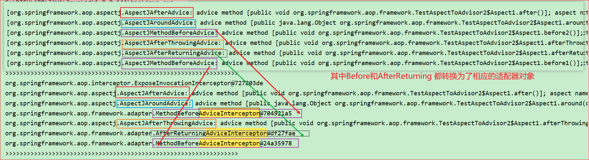

> ps补充下：
>
> 上图红色字体，描述有误
>
> **应该是Before和AfterReturning相关的通知对象，经过相应的适配器对象转成另外一套接口对象**

#### 18.1.2 适配器

##### 1、MethodBeforeAdviceAdapter

```java
/*
 * Copyright 2002-2012 the original author or authors.
 *
 * Licensed under the Apache License, Version 2.0 (the "License");
 * you may not use this file except in compliance with the License.
 * You may obtain a copy of the License at
 *
 *      https://www.apache.org/licenses/LICENSE-2.0
 *
 * Unless required by applicable law or agreed to in writing, software
 * distributed under the License is distributed on an "AS IS" BASIS,
 * WITHOUT WARRANTIES OR CONDITIONS OF ANY KIND, either express or implied.
 * See the License for the specific language governing permissions and
 * limitations under the License.
 */

package org.springframework.aop.framework.adapter;

import java.io.Serializable;

import org.aopalliance.aop.Advice;
import org.aopalliance.intercept.MethodInterceptor;

import org.springframework.aop.Advisor;
import org.springframework.aop.MethodBeforeAdvice;

/**
 * Adapter to enable {@link org.springframework.aop.MethodBeforeAdvice}
 * to be used in the Spring AOP framework.
 *
 * @author Rod Johnson
 * @author Juergen Hoeller
 */
@SuppressWarnings("serial")
class MethodBeforeAdviceAdapter implements AdvisorAdapter, Serializable {

	@Override
	public boolean supportsAdvice(Advice advice) {
		return (advice instanceof MethodBeforeAdvice);
	}

	@Override
	public MethodInterceptor getInterceptor(Advisor advisor) {
		MethodBeforeAdvice advice = (MethodBeforeAdvice) advisor.getAdvice();
		return new MethodBeforeAdviceInterceptor(advice);
	}

}

```

###### 1.1、MethodBeforeAdviceInterceptor

```java
/*
 * Copyright 2002-2020 the original author or authors.
 *
 * Licensed under the Apache License, Version 2.0 (the "License");
 * you may not use this file except in compliance with the License.
 * You may obtain a copy of the License at
 *
 *      https://www.apache.org/licenses/LICENSE-2.0
 *
 * Unless required by applicable law or agreed to in writing, software
 * distributed under the License is distributed on an "AS IS" BASIS,
 * WITHOUT WARRANTIES OR CONDITIONS OF ANY KIND, either express or implied.
 * See the License for the specific language governing permissions and
 * limitations under the License.
 */

package org.springframework.aop.framework.adapter;

import java.io.Serializable;

import org.aopalliance.intercept.MethodInterceptor;
import org.aopalliance.intercept.MethodInvocation;

import org.springframework.aop.BeforeAdvice;
import org.springframework.aop.MethodBeforeAdvice;
import org.springframework.lang.Nullable;
import org.springframework.util.Assert;

/**
 * Interceptor to wrap a {@link MethodBeforeAdvice}.
 * <p>Used internally by the AOP framework; application developers should not
 * need to use this class directly.
 *
 * @author Rod Johnson
 * @see AfterReturningAdviceInterceptor
 * @see ThrowsAdviceInterceptor
 */
@SuppressWarnings("serial")
public class MethodBeforeAdviceInterceptor implements MethodInterceptor, BeforeAdvice, Serializable {

	private final MethodBeforeAdvice advice;


	/**
	 * Create a new MethodBeforeAdviceInterceptor for the given advice.
	 * @param advice the MethodBeforeAdvice to wrap
	 */
	public MethodBeforeAdviceInterceptor(MethodBeforeAdvice advice) {
		Assert.notNull(advice, "Advice must not be null");
		this.advice = advice;
	}


	@Override
	@Nullable
	public Object invoke(MethodInvocation mi) throws Throwable {
		this.advice.before(mi.getMethod(), mi.getArguments(), mi.getThis());
		return mi.proceed();
	}

}

```

##### 2、AfterReturningAdviceAdapter

```java
/*
 * Copyright 2002-2012 the original author or authors.
 *
 * Licensed under the Apache License, Version 2.0 (the "License");
 * you may not use this file except in compliance with the License.
 * You may obtain a copy of the License at
 *
 *      https://www.apache.org/licenses/LICENSE-2.0
 *
 * Unless required by applicable law or agreed to in writing, software
 * distributed under the License is distributed on an "AS IS" BASIS,
 * WITHOUT WARRANTIES OR CONDITIONS OF ANY KIND, either express or implied.
 * See the License for the specific language governing permissions and
 * limitations under the License.
 */

package org.springframework.aop.framework.adapter;

import java.io.Serializable;

import org.aopalliance.aop.Advice;
import org.aopalliance.intercept.MethodInterceptor;

import org.springframework.aop.Advisor;
import org.springframework.aop.AfterReturningAdvice;

/**
 * Adapter to enable {@link org.springframework.aop.AfterReturningAdvice}
 * to be used in the Spring AOP framework.
 *
 * @author Rod Johnson
 * @author Juergen Hoeller
 */
@SuppressWarnings("serial")
class AfterReturningAdviceAdapter implements AdvisorAdapter, Serializable {

	@Override
	public boolean supportsAdvice(Advice advice) {
		return (advice instanceof AfterReturningAdvice);
	}

	@Override
	public MethodInterceptor getInterceptor(Advisor advisor) {
		AfterReturningAdvice advice = (AfterReturningAdvice) advisor.getAdvice();
		return new AfterReturningAdviceInterceptor(advice);
	}

}

```

###### 2.1、AfterReturningAdviceInterceptor

```java
/*
 * Copyright 2002-2020 the original author or authors.
 *
 * Licensed under the Apache License, Version 2.0 (the "License");
 * you may not use this file except in compliance with the License.
 * You may obtain a copy of the License at
 *
 *      https://www.apache.org/licenses/LICENSE-2.0
 *
 * Unless required by applicable law or agreed to in writing, software
 * distributed under the License is distributed on an "AS IS" BASIS,
 * WITHOUT WARRANTIES OR CONDITIONS OF ANY KIND, either express or implied.
 * See the License for the specific language governing permissions and
 * limitations under the License.
 */

package org.springframework.aop.framework.adapter;

import java.io.Serializable;

import org.aopalliance.intercept.MethodInterceptor;
import org.aopalliance.intercept.MethodInvocation;

import org.springframework.aop.AfterAdvice;
import org.springframework.aop.AfterReturningAdvice;
import org.springframework.lang.Nullable;
import org.springframework.util.Assert;

/**
 * Interceptor to wrap an {@link org.springframework.aop.AfterReturningAdvice}.
 * Used internally by the AOP framework; application developers should not need
 * to use this class directly.
 *
 * @author Rod Johnson
 * @see MethodBeforeAdviceInterceptor
 * @see ThrowsAdviceInterceptor
 */
@SuppressWarnings("serial")
public class AfterReturningAdviceInterceptor implements MethodInterceptor, AfterAdvice, Serializable {

	private final AfterReturningAdvice advice;


	/**
	 * Create a new AfterReturningAdviceInterceptor for the given advice.
	 * @param advice the AfterReturningAdvice to wrap
	 */
	public AfterReturningAdviceInterceptor(AfterReturningAdvice advice) {
		Assert.notNull(advice, "Advice must not be null");
		this.advice = advice;
	}


	@Override
	@Nullable
	public Object invoke(MethodInvocation mi) throws Throwable {
		Object retVal = mi.proceed();
		this.advice.afterReturning(retVal, mi.getMethod(), mi.getArguments(), mi.getThis());
		return retVal;
	}

}

```

#### 18.1.3 模拟调用链

##### 1、测试代码

```java
package org.springframework.aop.framework;

import lombok.extern.slf4j.Slf4j;
import org.aopalliance.intercept.MethodInvocation;
import org.aspectj.lang.ProceedingJoinPoint;
import org.aspectj.lang.annotation.*;
import org.springframework.aop.Advisor;
import org.springframework.aop.aspectj.*;
import org.springframework.aop.framework.ProxyFactory;
import org.springframework.aop.framework.ReflectiveMethodInvocation;
import org.springframework.aop.interceptor.ExposeInvocationInterceptor;
import org.springframework.aop.support.DefaultPointcutAdvisor;
import org.springframework.expression.spel.support.ReflectiveMethodExecutor;
import org.springframework.lang.Nullable;
import org.springframework.util.ObjectUtils;

import java.lang.annotation.Annotation;
import java.lang.reflect.Method;
import java.util.ArrayList;
import java.util.List;

/**
 * @author lyf
 * @version 1.0
 * @classname TestAspectToAdvisor
 * @description 高级切面类Aspect最终会转换为低级切面类Advisor
 * @since 2022/12/9 12:05
 */
@Slf4j
public class TestAspectToAdvisor2 {

    public static void main(String[] args) throws Throwable {
        /*
            @Before 前置通知会被转换为下面原始的 AspectJMethodBeforeAdvice 形式, 该对象包含了如下信息
                a. 通知代码从哪儿来
                b. 切点是什么(这里为啥要切点, 后面解释)
                c. 通知对象如何创建, 本例共用同一个 Aspect 对象
            类似的通知还有
                1. AspectJAroundAdvice (环绕通知)
                2. AspectJAfterReturningAdvice
                3. AspectJAfterThrowingAdvice
                4. AspectJAfterAdvice (环绕通知)
         */
        // 准备一个AspectJ工厂
        AspectInstanceFactory factory = new SingletonAspectInstanceFactory(new Aspect1());
        List<Advisor> advisorList = new ArrayList<>();
        // 1 解析Aspect1
        for (Method method : Aspect1.class.getDeclaredMethods()) {
            // 2 判断方法上是否存在@Before注解
            Advisor advisor = getAdvisor(method, factory);
            if (advisor != null) {
                advisorList.add(advisor);
            }
        }

        // 打印所有的底层切面
        for (Advisor advisor : advisorList) {
            System.out.println(advisor);
        }

                /*
            @Before 前置通知会被转换为下面原始的 AspectJMethodBeforeAdvice 形式, 该对象包含了如下信息
                a. 通知代码从哪儿来
                b. 切点是什么
                c. 通知对象如何创建, 本例共用同一个 Aspect 对象
            类似的通知还有
                1. AspectJAroundAdvice (环绕通知)
                2. AspectJAfterReturningAdvice
                3. AspectJAfterThrowingAdvice (环绕通知)
                4. AspectJAfterAdvice (环绕通知)
         */

        // 2. 通知统一转换为环绕通知 MethodInterceptor
        /*

            其实无论 ProxyFactory 基于哪种方式创建代理, 最后干活(调用 advice)的是一个 MethodInvocation 对象
                a. 因为 advisor 有多个, 且一个套一个调用, 因此需要一个调用链对象, 即 MethodInvocation
                b. MethodInvocation 要知道 advice 有哪些, 还要知道目标, 调用次序如下

                将 MethodInvocation 放入当前线程
                    |-> before1 ----------------------------------- 从当前线程获取 MethodInvocation
                    |                                             |
                    |   |-> before2 --------------------          | 从当前线程获取 MethodInvocation
                    |   |                              |          |
                    |   |   |-> target ------ 目标   advice2    advice1
                    |   |                              |          |
                    |   |-> after2 ---------------------          |
                    |                                             |
                    |-> after1 ------------------------------------
                c. 从上图看出, 环绕通知才适合作为 advice, 因此其他 before、afterReturning 都会被转换成环绕通知
                d. 统一转换为环绕通知, 体现的是设计模式中的适配器模式
                    - 对外是为了方便使用要区分 before、afterReturning
                    - 对内统一都是环绕通知, 统一用 MethodInterceptor 表示

            此步获取所有执行时需要的 advice (静态)
                a. 即统一转换为 MethodInterceptor 环绕通知, 这体现在方法名中的 Interceptors 上
                b. 适配如下
                  - MethodBeforeAdviceAdapter 将 @Before AspectJMethodBeforeAdvice 适配为 MethodBeforeAdviceInterceptor
                  - AfterReturningAdviceAdapter 将 @AfterReturning AspectJAfterReturningAdvice 适配为 AfterReturningAdviceInterceptor
         */

        Target1 target1 = new Target1();
        ProxyFactory proxyFactory = new ProxyFactory();
        proxyFactory.setTarget(target1);
        proxyFactory.addAdvisors(advisorList);
        System.out.println(">>>>>>>>>>>>>>>>>>>>>>>>>>>>>>>>>>>>>>>>>>>>>>>>>>>>>>>>>>>>>>>>>");
        List<Object> interceptorAdviceList = proxyFactory.getInterceptorsAndDynamicInterceptionAdvice(Target1.class.getMethod("foo"), Target1.class);
        for (Object obj : interceptorAdviceList) {
            System.out.println(obj);
        }

        System.out.println(">>>>>>>>>>>>>>>>>>>>>>>>>>>>>>>>>>>>>>>>>>>>>>>>>>>>>>>>>>>>>>>>>");

        // 3 模拟调用链
        MethodInvocation methodInvocation = new ReflectiveMethodInvocation(
                null, target1, Target1.class.getMethod("foo"), new Object[0], Target1.class, interceptorAdviceList
        );

        methodInvocation.proceed();
    }

    @Nullable
    public static Advisor getAdvisor(Method method, AspectInstanceFactory factory) {
        if (method.isAnnotationPresent(Before.class)) {
            // 3 解析切点
            String expression = method.getAnnotation(Before.class).value();

            if (!ObjectUtils.isEmpty(expression)) {
                AspectJExpressionPointcut pointcut = new AspectJExpressionPointcut();
                pointcut.setExpression(expression);

                // 4 准备通知
                AspectJMethodBeforeAdvice advice = new AspectJMethodBeforeAdvice(method, pointcut, factory);
                // 5 准备切面
                return new DefaultPointcutAdvisor(pointcut, advice);
            }
        } else if (method.isAnnotationPresent(After.class)) {
            String expression = method.getAnnotation(After.class).value();

            if (!ObjectUtils.isEmpty(expression)) {
                AspectJExpressionPointcut pointcut = new AspectJExpressionPointcut();
                pointcut.setExpression(expression);

                // 4 准备通知
                AspectJAfterAdvice advice = new AspectJAfterAdvice(method, pointcut, factory);
                // 5 准备切面
                return new DefaultPointcutAdvisor(pointcut, advice);
            }

        } else if (method.isAnnotationPresent(AfterReturning.class)) {
            String expression = method.getAnnotation(AfterReturning.class).value();

            if (!ObjectUtils.isEmpty(expression)) {
                AspectJExpressionPointcut pointcut = new AspectJExpressionPointcut();
                pointcut.setExpression(expression);

                // 4 准备通知
                AspectJAfterReturningAdvice advice = new AspectJAfterReturningAdvice(method, pointcut, factory);
                // 5 准备切面
                return new DefaultPointcutAdvisor(pointcut, advice);
            }
        } else if (method.isAnnotationPresent(AfterThrowing.class)) {
            String expression = method.getAnnotation(AfterThrowing.class).value();

            if (!ObjectUtils.isEmpty(expression)) {
                AspectJExpressionPointcut pointcut = new AspectJExpressionPointcut();
                pointcut.setExpression(expression);

                // 4 准备通知
                AspectJAfterThrowingAdvice advice = new AspectJAfterThrowingAdvice(method, pointcut, factory);
                // 5 准备切面
                return new DefaultPointcutAdvisor(pointcut, advice);
            }
        } else if (method.isAnnotationPresent(Around.class)) {
            String expression = method.getAnnotation(Around.class).value();

            if (!ObjectUtils.isEmpty(expression)) {
                AspectJExpressionPointcut pointcut = new AspectJExpressionPointcut();
                pointcut.setExpression(expression);

                // 4 准备通知
                AspectJAroundAdvice advice = new AspectJAroundAdvice(method, pointcut, factory);
                // 5 准备切面
                return new DefaultPointcutAdvisor(pointcut, advice);
            }
        }
        return null;
    }

    @Aspect
    static class Aspect1 {

        private static final String EXECUTION_FOO = "execution(* foo())";

        @Before(EXECUTION_FOO)
        public void before1() {
            log.debug("before1...");
        }

        @Before(EXECUTION_FOO)
        public void before2() {
            log.debug("before2...");
        }

        /**
         * 后置通知
         */
        @After(EXECUTION_FOO)
        public void after() {
            log.debug("after...");
        }


        /**
         * 返回通知
         */
        @AfterReturning(EXECUTION_FOO)
        public void afterReturning() {
            log.debug("afterReturning...");
        }

        /**
         * 异常通知
         *
         * @param e
         */
        @AfterThrowing(EXECUTION_FOO)
        public void afterThrowing(Exception e) {
            log.debug("afterThrowing...", e);
        }

        /**
         * 环绕通知
         *
         * @param point
         * @return
         * @throws Throwable
         */
        @Around(EXECUTION_FOO)
        public Object around(ProceedingJoinPoint point) throws Throwable {
            try {
                log.debug("around...before");
                return point.proceed();
            } finally {
                log.debug("around...after");
            }
        }
    }

    static class Target1 {
        public void foo() {
            log.debug("foo...");
        }
    }
}

```

###### 1.1、测试结果

```java
org.springframework.aop.support.DefaultPointcutAdvisor: pointcut [AspectJExpressionPointcut: () execution(* foo())]; advice [org.springframework.aop.aspectj.AspectJAfterAdvice: advice method [public void org.springframework.aop.framework.TestAspectToAdvisor2$Aspect1.after()]; aspect name '']
org.springframework.aop.support.DefaultPointcutAdvisor: pointcut [AspectJExpressionPointcut: () execution(* foo())]; advice [org.springframework.aop.aspectj.AspectJMethodBeforeAdvice: advice method [public void org.springframework.aop.framework.TestAspectToAdvisor2$Aspect1.before2()]; aspect name '']
org.springframework.aop.support.DefaultPointcutAdvisor: pointcut [AspectJExpressionPointcut: () execution(* foo())]; advice [org.springframework.aop.aspectj.AspectJAroundAdvice: advice method [public java.lang.Object org.springframework.aop.framework.TestAspectToAdvisor2$Aspect1.around(org.aspectj.lang.ProceedingJoinPoint) throws java.lang.Throwable]; aspect name '']
org.springframework.aop.support.DefaultPointcutAdvisor: pointcut [AspectJExpressionPointcut: () execution(* foo())]; advice [org.springframework.aop.aspectj.AspectJAfterReturningAdvice: advice method [public void org.springframework.aop.framework.TestAspectToAdvisor2$Aspect1.afterReturning()]; aspect name '']
org.springframework.aop.support.DefaultPointcutAdvisor: pointcut [AspectJExpressionPointcut: () execution(* foo())]; advice [org.springframework.aop.aspectj.AspectJMethodBeforeAdvice: advice method [public void org.springframework.aop.framework.TestAspectToAdvisor2$Aspect1.before1()]; aspect name '']
org.springframework.aop.support.DefaultPointcutAdvisor: pointcut [AspectJExpressionPointcut: () execution(* foo())]; advice [org.springframework.aop.aspectj.AspectJAfterThrowingAdvice: advice method [public void org.springframework.aop.framework.TestAspectToAdvisor2$Aspect1.afterThrowing(java.lang.Exception)]; aspect name '']
>>>>>>>>>>>>>>>>>>>>>>>>>>>>>>>>>>>>>>>>>>>>>>>>>>>>>>>>>>>>>>>>>
org.springframework.aop.aspectj.AspectJAfterAdvice: advice method [public void org.springframework.aop.framework.TestAspectToAdvisor2$Aspect1.after()]; aspect name ''
org.springframework.aop.framework.adapter.MethodBeforeAdviceInterceptor@4d1b0d2a
org.springframework.aop.aspectj.AspectJAroundAdvice: advice method [public java.lang.Object org.springframework.aop.framework.TestAspectToAdvisor2$Aspect1.around(org.aspectj.lang.ProceedingJoinPoint) throws java.lang.Throwable]; aspect name ''
org.springframework.aop.framework.adapter.AfterReturningAdviceInterceptor@954b04f
org.springframework.aop.framework.adapter.MethodBeforeAdviceInterceptor@149494d8
org.springframework.aop.aspectj.AspectJAfterThrowingAdvice: advice method [public void org.springframework.aop.framework.TestAspectToAdvisor2$Aspect1.afterThrowing(java.lang.Exception)]; aspect name ''
>>>>>>>>>>>>>>>>>>>>>>>>>>>>>>>>>>>>>>>>>>>>>>>>>>>>>>>>>>>>>>>>>
Exception in thread "main" java.lang.IllegalStateException: No MethodInvocation found: Check that an AOP invocation is in progress and that the ExposeInvocationInterceptor is upfront in the interceptor chain. Specifically, note that advices with order HIGHEST_PRECEDENCE will execute before ExposeInvocationInterceptor! In addition, ExposeInvocationInterceptor and ExposeInvocationInterceptor.currentInvocation() must be invoked from the same thread.
	at org.springframework.aop.interceptor.ExposeInvocationInterceptor.currentInvocation(ExposeInvocationInterceptor.java:74)
	at org.springframework.aop.aspectj.AbstractAspectJAdvice.getJoinPointMatch(AbstractAspectJAdvice.java:658)
	at org.springframework.aop.aspectj.AspectJAfterAdvice.invoke(AspectJAfterAdvice.java:52)
	at org.springframework.aop.framework.ReflectiveMethodInvocation.proceed(ReflectiveMethodInvocation.java:186)
	at org.springframework.aop.framework.TestAspectToAdvisor2.main(TestAspectToAdvisor2.java:119)
```

> 报错原因是因为某些通知内部需要用到MethodInvocation对象，所以需要将MethodInvocation放入当前线程，这样所有的方法都可以调用到MethodInvocation

##### 2、修正代码

```java
package org.springframework.aop.framework;

import lombok.extern.slf4j.Slf4j;
import org.aopalliance.intercept.MethodInvocation;
import org.aspectj.lang.ProceedingJoinPoint;
import org.aspectj.lang.annotation.*;
import org.springframework.aop.Advisor;
import org.springframework.aop.aspectj.*;
import org.springframework.aop.framework.ProxyFactory;
import org.springframework.aop.framework.ReflectiveMethodInvocation;
import org.springframework.aop.interceptor.ExposeInvocationInterceptor;
import org.springframework.aop.support.DefaultPointcutAdvisor;
import org.springframework.expression.spel.support.ReflectiveMethodExecutor;
import org.springframework.lang.Nullable;
import org.springframework.util.ObjectUtils;

import java.lang.annotation.Annotation;
import java.lang.reflect.Method;
import java.util.ArrayList;
import java.util.List;

/**
 * @author lyf
 * @version 1.0
 * @classname TestAspectToAdvisor
 * @description 高级切面类Aspect最终会转换为低级切面类Advisor
 * @since 2022/12/9 12:05
 */
@Slf4j
public class TestAspectToAdvisor2 {

    public static void main(String[] args) throws Throwable {
        /*
            @Before 前置通知会被转换为下面原始的 AspectJMethodBeforeAdvice 形式, 该对象包含了如下信息
                a. 通知代码从哪儿来
                b. 切点是什么(这里为啥要切点, 后面解释)
                c. 通知对象如何创建, 本例共用同一个 Aspect 对象
            类似的通知还有
                1. AspectJAroundAdvice (环绕通知)
                2. AspectJAfterReturningAdvice
                3. AspectJAfterThrowingAdvice
                4. AspectJAfterAdvice (环绕通知)
         */
        // 准备一个AspectJ工厂
        AspectInstanceFactory factory = new SingletonAspectInstanceFactory(new Aspect1());
        List<Advisor> advisorList = new ArrayList<>();
        // 1 解析Aspect1
        for (Method method : Aspect1.class.getDeclaredMethods()) {
            // 2 判断方法上是否存在@Before注解
            Advisor advisor = getAdvisor(method, factory);
            if (advisor != null) {
                advisorList.add(advisor);
            }
        }

        // 打印所有的底层切面
        for (Advisor advisor : advisorList) {
            System.out.println(advisor);
        }

                /*
            @Before 前置通知会被转换为下面原始的 AspectJMethodBeforeAdvice 形式, 该对象包含了如下信息
                a. 通知代码从哪儿来
                b. 切点是什么
                c. 通知对象如何创建, 本例共用同一个 Aspect 对象
            类似的通知还有
                1. AspectJAroundAdvice (环绕通知)
                2. AspectJAfterReturningAdvice
                3. AspectJAfterThrowingAdvice (环绕通知)
                4. AspectJAfterAdvice (环绕通知)
         */

        // 2. 通知统一转换为环绕通知 MethodInterceptor
        /*

            其实无论 ProxyFactory 基于哪种方式创建代理, 最后干活(调用 advice)的是一个 MethodInvocation 对象
                a. 因为 advisor 有多个, 且一个套一个调用, 因此需要一个调用链对象, 即 MethodInvocation
                b. MethodInvocation 要知道 advice 有哪些, 还要知道目标, 调用次序如下

                将 MethodInvocation 放入当前线程
                    |-> before1 ----------------------------------- 从当前线程获取 MethodInvocation
                    |                                             |
                    |   |-> before2 --------------------          | 从当前线程获取 MethodInvocation
                    |   |                              |          |
                    |   |   |-> target ------ 目标   advice2    advice1
                    |   |                              |          |
                    |   |-> after2 ---------------------          |
                    |                                             |
                    |-> after1 ------------------------------------
                c. 从上图看出, 环绕通知才适合作为 advice, 因此其他 before、afterReturning 都会被转换成环绕通知
                d. 统一转换为环绕通知, 体现的是设计模式中的适配器模式
                    - 对外是为了方便使用要区分 before、afterReturning
                    - 对内统一都是环绕通知, 统一用 MethodInterceptor 表示

            此步获取所有执行时需要的 advice (静态)
                a. 即统一转换为 MethodInterceptor 环绕通知, 这体现在方法名中的 Interceptors 上
                b. 适配如下
                  - MethodBeforeAdviceAdapter 将 @Before AspectJMethodBeforeAdvice 适配为 MethodBeforeAdviceInterceptor
                  - AfterReturningAdviceAdapter 将 @AfterReturning AspectJAfterReturningAdvice 适配为 AfterReturningAdviceInterceptor
         */

        Target1 target1 = new Target1();
        ProxyFactory proxyFactory = new ProxyFactory();
        proxyFactory.setTarget(target1);
        proxyFactory.addAdvice(ExposeInvocationInterceptor.INSTANCE); // 准备将MethodInvocation放入当前线程
        proxyFactory.addAdvisors(advisorList);
        System.out.println(">>>>>>>>>>>>>>>>>>>>>>>>>>>>>>>>>>>>>>>>>>>>>>>>>>>>>>>>>>>>>>>>>");
        List<Object> interceptorAdviceList = proxyFactory.getInterceptorsAndDynamicInterceptionAdvice(Target1.class.getMethod("foo"), Target1.class);
        for (Object obj : interceptorAdviceList) {
            System.out.println(obj);
        }

        System.out.println(">>>>>>>>>>>>>>>>>>>>>>>>>>>>>>>>>>>>>>>>>>>>>>>>>>>>>>>>>>>>>>>>>");

        // 3. 创建并执行调用链 (环绕通知s + 目标)
        MethodInvocation methodInvocation = new ReflectiveMethodInvocation(
                null, target1, Target1.class.getMethod("foo"), new Object[0], Target1.class, interceptorAdviceList
        );

        methodInvocation.proceed();
        
           /*
            学到了什么
                a. 无参数绑定的通知如何被调用
                b. MethodInvocation 编程技巧: 拦截器、过滤器等等实现都与此类似
                c. 适配器模式在 Spring 中的体现
         */
    }

    @Nullable
    public static Advisor getAdvisor(Method method, AspectInstanceFactory factory) {
        if (method.isAnnotationPresent(Before.class)) {
            // 3 解析切点
            String expression = method.getAnnotation(Before.class).value();

            if (!ObjectUtils.isEmpty(expression)) {
                AspectJExpressionPointcut pointcut = new AspectJExpressionPointcut();
                pointcut.setExpression(expression);

                // 4 准备通知
                AspectJMethodBeforeAdvice advice = new AspectJMethodBeforeAdvice(method, pointcut, factory);
                // 5 准备切面
                return new DefaultPointcutAdvisor(pointcut, advice);
            }
        } else if (method.isAnnotationPresent(After.class)) {
            String expression = method.getAnnotation(After.class).value();

            if (!ObjectUtils.isEmpty(expression)) {
                AspectJExpressionPointcut pointcut = new AspectJExpressionPointcut();
                pointcut.setExpression(expression);

                // 4 准备通知
                AspectJAfterAdvice advice = new AspectJAfterAdvice(method, pointcut, factory);
                // 5 准备切面
                return new DefaultPointcutAdvisor(pointcut, advice);
            }

        } else if (method.isAnnotationPresent(AfterReturning.class)) {
            String expression = method.getAnnotation(AfterReturning.class).value();

            if (!ObjectUtils.isEmpty(expression)) {
                AspectJExpressionPointcut pointcut = new AspectJExpressionPointcut();
                pointcut.setExpression(expression);

                // 4 准备通知
                AspectJAfterReturningAdvice advice = new AspectJAfterReturningAdvice(method, pointcut, factory);
                // 5 准备切面
                return new DefaultPointcutAdvisor(pointcut, advice);
            }
        } else if (method.isAnnotationPresent(AfterThrowing.class)) {
            String expression = method.getAnnotation(AfterThrowing.class).value();

            if (!ObjectUtils.isEmpty(expression)) {
                AspectJExpressionPointcut pointcut = new AspectJExpressionPointcut();
                pointcut.setExpression(expression);

                // 4 准备通知
                AspectJAfterThrowingAdvice advice = new AspectJAfterThrowingAdvice(method, pointcut, factory);
                // 5 准备切面
                return new DefaultPointcutAdvisor(pointcut, advice);
            }
        } else if (method.isAnnotationPresent(Around.class)) {
            String expression = method.getAnnotation(Around.class).value();

            if (!ObjectUtils.isEmpty(expression)) {
                AspectJExpressionPointcut pointcut = new AspectJExpressionPointcut();
                pointcut.setExpression(expression);

                // 4 准备通知
                AspectJAroundAdvice advice = new AspectJAroundAdvice(method, pointcut, factory);
                // 5 准备切面
                return new DefaultPointcutAdvisor(pointcut, advice);
            }
        }
        return null;
    }

    @Aspect
    static class Aspect1 {

        private static final String EXECUTION_FOO = "execution(* foo())";

        @Before(EXECUTION_FOO)
        public void before1() {
            log.debug("before1...");
        }

        @Before(EXECUTION_FOO)
        public void before2() {
            log.debug("before2...");
        }

        /**
         * 后置通知
         */
        @After(EXECUTION_FOO)
        public void after() {
            log.debug("after...");
        }


        /**
         * 返回通知
         */
        @AfterReturning(EXECUTION_FOO)
        public void afterReturning() {
            log.debug("afterReturning...");
        }

        /**
         * 异常通知
         *
         * @param e
         */
        @AfterThrowing(EXECUTION_FOO)
        public void afterThrowing(Exception e) {
            log.debug("afterThrowing...", e);
        }

        /**
         * 环绕通知
         *
         * @param point
         * @return
         * @throws Throwable
         */
        @Around(EXECUTION_FOO)
        public Object around(ProceedingJoinPoint point) throws Throwable {
            try {
                log.debug("around...before");
                return point.proceed();
            } finally {
                log.debug("around...after");
            }
        }
    }

    static class Target1 {
        public void foo() {
            log.debug("foo...");
        }
    }
}

```

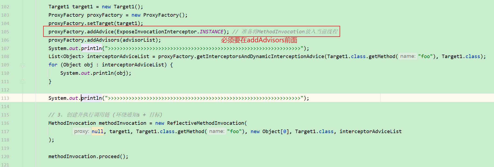

###### 2.1、执行结果

```java
org.springframework.aop.support.DefaultPointcutAdvisor: pointcut [AspectJExpressionPointcut: () execution(* foo())]; advice [org.springframework.aop.aspectj.AspectJAfterAdvice: advice method [public void org.springframework.aop.framework.TestAspectToAdvisor2$Aspect1.after()]; aspect name '']
org.springframework.aop.support.DefaultPointcutAdvisor: pointcut [AspectJExpressionPointcut: () execution(* foo())]; advice [org.springframework.aop.aspectj.AspectJAfterReturningAdvice: advice method [public void org.springframework.aop.framework.TestAspectToAdvisor2$Aspect1.afterReturning()]; aspect name '']
org.springframework.aop.support.DefaultPointcutAdvisor: pointcut [AspectJExpressionPointcut: () execution(* foo())]; advice [org.springframework.aop.aspectj.AspectJMethodBeforeAdvice: advice method [public void org.springframework.aop.framework.TestAspectToAdvisor2$Aspect1.before2()]; aspect name '']
org.springframework.aop.support.DefaultPointcutAdvisor: pointcut [AspectJExpressionPointcut: () execution(* foo())]; advice [org.springframework.aop.aspectj.AspectJAfterThrowingAdvice: advice method [public void org.springframework.aop.framework.TestAspectToAdvisor2$Aspect1.afterThrowing(java.lang.Exception)]; aspect name '']
org.springframework.aop.support.DefaultPointcutAdvisor: pointcut [AspectJExpressionPointcut: () execution(* foo())]; advice [org.springframework.aop.aspectj.AspectJMethodBeforeAdvice: advice method [public void org.springframework.aop.framework.TestAspectToAdvisor2$Aspect1.before1()]; aspect name '']
org.springframework.aop.support.DefaultPointcutAdvisor: pointcut [AspectJExpressionPointcut: () execution(* foo())]; advice [org.springframework.aop.aspectj.AspectJAroundAdvice: advice method [public java.lang.Object org.springframework.aop.framework.TestAspectToAdvisor2$Aspect1.around(org.aspectj.lang.ProceedingJoinPoint) throws java.lang.Throwable]; aspect name '']
>>>>>>>>>>>>>>>>>>>>>>>>>>>>>>>>>>>>>>>>>>>>>>>>>>>>>>>>>>>>>>>>>
org.springframework.aop.interceptor.ExposeInvocationInterceptor@727803de
org.springframework.aop.aspectj.AspectJAfterAdvice: advice method [public void org.springframework.aop.framework.TestAspectToAdvisor2$Aspect1.after()]; aspect name ''
org.springframework.aop.framework.adapter.AfterReturningAdviceInterceptor@704921a5
org.springframework.aop.framework.adapter.MethodBeforeAdviceInterceptor@df27fae
org.springframework.aop.aspectj.AspectJAfterThrowingAdvice: advice method [public void org.springframework.aop.framework.TestAspectToAdvisor2$Aspect1.afterThrowing(java.lang.Exception)]; aspect name ''
org.springframework.aop.framework.adapter.MethodBeforeAdviceInterceptor@24a35978
org.springframework.aop.aspectj.AspectJAroundAdvice: advice method [public java.lang.Object org.springframework.aop.framework.TestAspectToAdvisor2$Aspect1.around(org.aspectj.lang.ProceedingJoinPoint) throws java.lang.Throwable]; aspect name ''
>>>>>>>>>>>>>>>>>>>>>>>>>>>>>>>>>>>>>>>>>>>>>>>>>>>>>>>>>>>>>>>>>
[DEBUG] 16:59:05.469 [main] o.s.a.f.TestAspectToAdvisor2        - before2... 
[DEBUG] 16:59:05.477 [main] o.s.a.f.TestAspectToAdvisor2        - before1... 
[DEBUG] 16:59:05.477 [main] o.s.a.f.TestAspectToAdvisor2        - around...before 
[DEBUG] 16:59:05.478 [main] o.s.a.f.TestAspectToAdvisor2        - foo... 
[DEBUG] 16:59:05.478 [main] o.s.a.f.TestAspectToAdvisor2        - around...after 
[DEBUG] 16:59:05.478 [main] o.s.a.f.TestAspectToAdvisor2        - afterReturning... 
[DEBUG] 16:59:05.478 [main] o.s.a.f.TestAspectToAdvisor2        - after... 
```


#### 18.1.3 收获💡

代理方法执行时会做如下工作

1. 通过 proxyFactory 的 getInterceptorsAndDynamicInterceptionAdvice() 将其他通知统一转换为 MethodInterceptor 环绕通知
   - MethodBeforeAdviceAdapter 将 @Before AspectJMethodBeforeAdvice 适配为 MethodBeforeAdviceInterceptor
   - AfterReturningAdviceAdapter 将 @AfterReturning AspectJAfterReturningAdvice 适配为 AfterReturningAdviceInterceptor
   - 这体现的是适配器设计模式
2. 所谓静态通知，体现在上面方法的 Interceptors 部分，这些通知调用时无需再次检查切点，直接调用即可
3. 结合目标与环绕通知链，创建 MethodInvocation 对象，通过它完成整个调用


### 18.2 演示2 - 模拟 MethodInvocation

#### 18.2.1 代码参考

##### 1、测试代码

```java
package org.springframework.aop.framework;

import lombok.extern.slf4j.Slf4j;
import org.aopalliance.intercept.MethodInterceptor;
import org.aopalliance.intercept.MethodInvocation;

import java.lang.reflect.AccessibleObject;
import java.lang.reflect.Method;
import java.util.ArrayList;
import java.util.Arrays;
import java.util.List;

/**
 * @author lyf
 * @version 1.0
 * @classname TestMethodInvocation
 * @description 模拟一个调用链
 * @since 2022/12/9 17:05
 */
@Slf4j
public class TestMethodInvocation {
    public static void main(String[] args) throws Throwable {
        /*
            模拟调用链过程, 是一个简单的递归过程
                1. proceed() 方法调用链中下一个环绕通知
                2. 每个环绕通知内部继续调用 proceed()
                3. 调用到没有更多通知了, 就调用目标方法
         */
        Target target = new Target();
        List<MethodInterceptor> list = new ArrayList<>(Arrays.asList(new MyAdvisor1(), new MyAdvisor2()));
        MyInvocation invocation = new MyInvocation(target, Target.class.getMethod("foo"), new Object[0], list);
        invocation.proceed();
    }

    static class Target {
        public void foo() {
            log.debug("foo...");
        }
    }

    static class MyAdvisor1 implements MethodInterceptor {

        @Override
        public Object invoke(MethodInvocation invocation) throws Throwable {
            log.debug("MyAdvisor1 before...");
            Object result = invocation.proceed();
            log.debug("MyAdvisor1 after...");
            return result;
        }
    }

    static class MyAdvisor2 implements MethodInterceptor {

        @Override
        public Object invoke(MethodInvocation invocation) throws Throwable {
            log.debug("MyAdvisor2 before...");
            Object result = invocation.proceed();
            log.debug("MyAdvisor2 after...");
            return result;
        }
    }

    static class MyInvocation implements MethodInvocation {
        private Object target;
        private Method method;
        private Object[] args;
        private List<MethodInterceptor> methodInterceptorList;
        private int count = 1; // 调用次数

        public MyInvocation(Object target, Method method, Object[] args, List<MethodInterceptor> methodInterceptorList) {
            this.target = target;
            this.method = method;
            this.args = args;
            this.methodInterceptorList = methodInterceptorList;
        }

        @Override
        public Method getMethod() {
            return method;
        }

        @Override
        public Object[] getArguments() {
            return args;
        }

        /**
         * 核心方法
         *
         * @return
         * @throws Throwable
         */
        @Override
        public Object proceed() throws Throwable { // 调用每一个环绕通知
            if (count > methodInterceptorList.size()) { // 集合长度+1次调用时，刚好是遍历完集合
                return method.invoke(target, args);
            }
            // 这里才是真正的遍历环绕通知集合
            return methodInterceptorList.get(count++ - 1).invoke(this);
        }

        @Override
        public Object getThis() {
            return target;
        }

        @Override
        public AccessibleObject getStaticPart() {
            return method;
        }
    }
}

```

###### 1.1、测试结果

```java
[DEBUG] 17:24:02.594 [main] o.s.a.f.TestMethodInvocation        - MyAdvisor1 before... 
[DEBUG] 17:24:02.648 [main] o.s.a.f.TestMethodInvocation        - MyAdvisor2 before... 
[DEBUG] 17:24:02.649 [main] o.s.a.f.TestMethodInvocation        - foo... 
[DEBUG] 17:24:02.649 [main] o.s.a.f.TestMethodInvocation        - MyAdvisor2 after... 
[DEBUG] 17:24:02.649 [main] o.s.a.f.TestMethodInvocation        - MyAdvisor1 after... 
```


#### 18.2.2 收获💡

1. proceed() 方法调用链中下一个环绕通知
2. 每个环绕通知内部继续调用 proceed()
3. 调用到没有更多通知了, 就调用目标方法

MethodInvocation 的编程技巧在实现拦截器、过滤器时能用上


## 19 动态通知调用

### 19.1 演示 - 带参数绑定的通知方法调用

#### 19.1.1 代码参考

```java
package org.springframework.aop.framework.autoproxy;

import lombok.extern.slf4j.Slf4j;
import org.aopalliance.intercept.MethodInvocation;
import org.aspectj.lang.annotation.Aspect;
import org.aspectj.lang.annotation.Before;
import org.springframework.aop.Advisor;
import org.springframework.aop.aspectj.annotation.AnnotationAwareAspectJAutoProxyCreator;
import org.springframework.aop.framework.ProxyFactory;
import org.springframework.aop.framework.ReflectiveMethodInvocation;
import org.springframework.context.annotation.Bean;
import org.springframework.context.annotation.Configuration;
import org.springframework.context.annotation.ConfigurationClassPostProcessor;
import org.springframework.context.support.GenericApplicationContext;

import java.lang.reflect.Field;
import java.util.List;

/**
 * @author lyf
 * @version 1.0
 * @classname TestDynamicAdvice
 * @description 测试动态绑定，也就是带参数的绑定
 * @since 2022/12/9 17:30
 */
@Slf4j
public class TestDynamicAdvice {
    public static void main(String[] args) throws Throwable {
        GenericApplicationContext applicationContext = new GenericApplicationContext();
        applicationContext.registerBean(ConfigurationClassPostProcessor.class);
        applicationContext.registerBean("myConfig", MyConfig.class);

        applicationContext.refresh();

        AnnotationAwareAspectJAutoProxyCreator creator = applicationContext.getBean(AnnotationAwareAspectJAutoProxyCreator.class);
        List<Advisor> advisorList = creator.findEligibleAdvisors(Target.class, "target");
        for (Advisor advisor : advisorList) {
            System.out.println(advisor);
        }

        Target target = new Target();
        ProxyFactory proxyFactory = new ProxyFactory();
        proxyFactory.setTarget(target);
        proxyFactory.addAdvisors(advisorList);

        // 获取代理
        Object proxy = proxyFactory.getProxy();

        List<Object> objectList = proxyFactory.getInterceptorsAndDynamicInterceptionAdvice(Target.class.getMethod("foo", int.class), Target.class);
        // 通过反射打印动态通知的切点和通知
        for (Object object : objectList) {
            showDetails(object);
        }

        System.out.println(">>>>>>>>>>>>>>>>>>>>>>>>>>>>>>>>>>>>>>>>>>>>>>>>>>>>>>>>>>>>>>>>>>>>>>");
        // 执行调用链
        MethodInvocation methodInvocation = new ReflectiveMethodInvocation(
                proxy, target, Target.class.getMethod("foo", int.class), new Object[]{100}, Target.class, objectList
        ) {
        };
        methodInvocation.proceed();
        applicationContext.close();
    }

    static void showDetails(Object obj) {
        try {
            Class<?> clazz = Class.forName("org.springframework.aop.framework.InterceptorAndDynamicMethodMatcher");
            if (clazz.isInstance(obj)) {// 如果对象obj是动态绑定的通知
                Field methodMatcher = clazz.getDeclaredField("methodMatcher");
                methodMatcher.setAccessible(true);
                Field methodInterceptor = clazz.getDeclaredField("interceptor");
                methodInterceptor.setAccessible(true);
                log.debug("动态通知: {}\t切点: {}\t通知: {}", obj, methodMatcher.get(obj), methodInterceptor.get(obj));
            } else {
                log.debug("静态通知: {}", obj);

            }

        } catch (Exception e) {
            e.printStackTrace();
        }

    }

    static class Target {
        public void foo(int x) {
            log.debug("foo..., the param is {}", x);
        }
    }

    @Aspect
    static class MyAspect {
        /**
         * 静态通知调用，不带参数绑定，执行时不需要切点
         */
        @Before("execution(* foo(..))")
        public void before1() {
            log.debug("before1...");
        }

        /**
         * 动态通知调用，需要参数绑定，执行时还需要切点对象
         *
         * @param x x
         */
        @Before("execution(* foo(..)) && args(x)")
        public void before2(int x) {
            log.debug("before2...");
        }
    }

    @Configuration
    static class MyConfig {
        /**
         * 解析AspectJ
         *
         * @return
         */
        @Bean
        public AnnotationAwareAspectJAutoProxyCreator annotationAwareAspectJAutoProxyCreator() {
            return new AnnotationAwareAspectJAutoProxyCreator();
        }

        /**
         * 切面类
         *
         * @return
         */
        @Bean
        public MyAspect myAspect() {
            return new MyAspect();
        }
    }
}

```

##### 1、测试结果

```java
[INFO ] 18:11:56.975 [main] o.s.c.s.PostProcessorRegistrationDelegate$BeanPostProcessorChecker - Bean 'myConfig' of type [org.springframework.aop.framework.autoproxy.TestDynamicAdvice$MyConfig$$EnhancerBySpringCGLIB$$249d24cb] is not eligible for getting processed by all BeanPostProcessors (for example: not eligible for auto-proxying) 
org.springframework.aop.interceptor.ExposeInvocationInterceptor.ADVISOR
InstantiationModelAwarePointcutAdvisor: expression [execution(* foo(..))]; advice method [public void org.springframework.aop.framework.autoproxy.TestDynamicAdvice$MyAspect.before1()]; perClauseKind=SINGLETON
InstantiationModelAwarePointcutAdvisor: expression [execution(* foo(..)) && args(x)]; advice method [public void org.springframework.aop.framework.autoproxy.TestDynamicAdvice$MyAspect.before2(int)]; perClauseKind=SINGLETON
[DEBUG] 18:11:57.256 [main] o.s.a.f.autoproxy.TestDynamicAdvice - 静态通知: org.springframework.aop.interceptor.ExposeInvocationInterceptor@6221a451 
[DEBUG] 18:11:57.257 [main] o.s.a.f.autoproxy.TestDynamicAdvice - 静态通知: org.springframework.aop.framework.adapter.MethodBeforeAdviceInterceptor@4a883b15 
[DEBUG] 18:11:57.258 [main] o.s.a.f.autoproxy.TestDynamicAdvice - 动态通知: org.springframework.aop.framework.InterceptorAndDynamicMethodMatcher@7b36aa0c	切点: AspectJExpressionPointcut: (int x) execution(* foo(..)) && args(x)	通知: org.springframework.aop.framework.adapter.MethodBeforeAdviceInterceptor@5824a83d 
>>>>>>>>>>>>>>>>>>>>>>>>>>>>>>>>>>>>>>>>>>>>>>>>>>>>>>>>>>>>>>>>>>>>>>
[DEBUG] 18:11:57.261 [main] o.s.a.f.autoproxy.TestDynamicAdvice - before1... 
[DEBUG] 18:11:57.264 [main] o.s.a.f.autoproxy.TestDynamicAdvice - before2... 
[DEBUG] 18:11:57.264 [main] o.s.a.f.autoproxy.TestDynamicAdvice - foo..., the param is 100 
```


#### 19.1.2 收获💡

1. 通过 proxyFactory 的 getInterceptorsAndDynamicInterceptionAdvice() 将其他通知统一转换为 MethodInterceptor 环绕通知
2. 所谓动态通知，体现在上面方法的 DynamicInterceptionAdvice 部分，这些通知调用时因为要为通知方法绑定参数，还需再次利用切点表达式
3. 动态通知调用复杂程度高，性能较低