# 20 RequestMappingHandlerMapping 与 RequestMappingHandlerAdapter

RequestMappingHandlerMapping 与 RequestMappingHandlerAdapter 俩是一对，分别用来

* 处理 @RequestMapping 映射
* 调用控制器方法、并处理方法参数与方法返回值

## 20.1 演示1 - DispatcherServlet 初始化

### 20.1.1 代码参考

#### 1、DispatcherServlet 是在第一次被访问时执行初始化 验证

##### 1.1、WebConfig

```java
package com.itheima.a20.config;

import lombok.extern.slf4j.Slf4j;
import org.springframework.boot.autoconfigure.web.servlet.DispatcherServletRegistrationBean;
import org.springframework.boot.web.embedded.tomcat.TomcatServletWebServerFactory;
import org.springframework.boot.web.servlet.server.ServletWebServerFactory;
import org.springframework.context.annotation.Bean;
import org.springframework.context.annotation.ComponentScan;
import org.springframework.context.annotation.Configuration;
import org.springframework.web.servlet.DispatcherServlet;
import org.springframework.web.servlet.mvc.Controller;

import java.nio.charset.StandardCharsets;

/**
 * @author lyf
 * @version 1.0
 * @classname WebConfig
 * @description
 * @since 2022/12/9 18:45
 */
@Slf4j
@Configuration
@ComponentScan(basePackages = {"com.itheima.a20"})
public class WebConfig {

    /**
     * 注入一个Tomcat内嵌工厂
     *
     * @return ServletWebServerFactory
     */
    @Bean
    public ServletWebServerFactory servletWebServerFactory() {
        return new TomcatServletWebServerFactory();
    }

    /**
     * 注入DispatchServlet，web程序的入口
     *
     * @return DispatcherServlet
     */
    @Bean
    public DispatcherServlet dispatcherServlet() {
        return new DispatcherServlet();
    }

    /**
     * 将DispatchServlet注入到WEB 容器中
     *
     * @return DispatcherServletRegistrationBean
     */
    @Bean
    public DispatcherServletRegistrationBean registrationBean(DispatcherServlet dispatcherServlet) {
        return new DispatcherServletRegistrationBean(dispatcherServlet, "/");
    }

    @Bean("/hello")
    public Controller sayHello() {
        return (request, response) -> {
            response.setContentType("text/html; charset=UTF-8");
            response.getWriter().println(new String("你好".getBytes(StandardCharsets.UTF_8)));
            return null;
        };
    }
}

```

##### 1.2、测试代码

```java
package com.itheima.a20;

import com.itheima.a20.config.WebConfig;
import lombok.extern.slf4j.Slf4j;
import org.springframework.boot.web.servlet.context.AnnotationConfigServletWebServerApplicationContext;

/**
 * @author lyf
 * @version 1.0
 * @classname TestDispatchServlet
 * @description 测试DispatchServlet流程
 * @since 2022/12/9 18:42
 */
@Slf4j
public class TestDispatchServlet {
    public static void main(String[] args) {
        AnnotationConfigServletWebServerApplicationContext applicationContext
                = new AnnotationConfigServletWebServerApplicationContext(WebConfig.class);

    }
}

```

##### 1.3、启动日志

```verilog
[INFO ] 09:35:18.421 [main] o.s.b.w.e.tomcat.TomcatWebServer    - Tomcat initialized with port(s): 8080 (http) 
十二月 10, 2022 9:35:18 上午 org.apache.coyote.AbstractProtocol init
信息: Initializing ProtocolHandler ["http-nio-8080"]
十二月 10, 2022 9:35:18 上午 org.apache.catalina.core.StandardService startInternal
信息: Starting service [Tomcat]
十二月 10, 2022 9:35:18 上午 org.apache.catalina.core.StandardEngine startInternal
信息: Starting Servlet engine: [Apache Tomcat/9.0.62]
十二月 10, 2022 9:35:18 上午 org.apache.catalina.core.ApplicationContext log
信息: Initializing Spring embedded WebApplicationContext
[INFO ] 09:35:18.751 [main] o.s.b.w.s.c.ServletWebServerApplicationContext - Root WebApplicationContext: initialization completed in 1189 ms 
十二月 10, 2022 9:35:18 上午 org.apache.coyote.AbstractProtocol start
信息: Starting ProtocolHandler ["http-nio-8080"]
[INFO ] 09:35:18.866 [main] o.s.b.w.e.tomcat.TomcatWebServer    - Tomcat started on port(s): 8080 (http) with context path '' 
```

##### 1.3、在浏览器输入`http://localhost:8080/hello` 之后的日志

```verilog
十二月 10, 2022 9:36:24 上午 org.apache.catalina.core.ApplicationContext log
信息: Initializing Spring DispatcherServlet 'dispatcherServlet'
[INFO ] 09:36:24.269 [http-nio-8080-exec-1] o.s.web.servlet.DispatcherServlet   - Initializing Servlet 'dispatcherServlet' 
[TRACE] 09:36:24.270 [http-nio-8080-exec-1] o.s.web.servlet.DispatcherServlet   - No MultipartResolver 'multipartResolver' declared 
[TRACE] 09:36:24.273 [http-nio-8080-exec-1] o.s.web.servlet.DispatcherServlet   - No LocaleResolver 'localeResolver': using default [AcceptHeaderLocaleResolver] 
[TRACE] 09:36:24.274 [http-nio-8080-exec-1] o.s.web.servlet.DispatcherServlet   - No ThemeResolver 'themeResolver': using default [FixedThemeResolver] 
[TRACE] 09:36:24.660 [http-nio-8080-exec-1] o.s.web.servlet.DispatcherServlet   - No HandlerMappings declared for servlet 'dispatcherServlet': using default strategies from DispatcherServlet.properties 
[TRACE] 09:36:24.716 [http-nio-8080-exec-1] o.s.web.servlet.DispatcherServlet   - No HandlerAdapters declared for servlet 'dispatcherServlet': using default strategies from DispatcherServlet.properties 
[TRACE] 09:36:24.723 [http-nio-8080-exec-1] o.s.web.servlet.DispatcherServlet   - No HandlerExceptionResolvers declared in servlet 'dispatcherServlet': using default strategies from DispatcherServlet.properties 
[TRACE] 09:36:24.725 [http-nio-8080-exec-1] o.s.web.servlet.DispatcherServlet   - No RequestToViewNameTranslator 'viewNameTranslator': using default [DefaultRequestToViewNameTranslator] 
[TRACE] 09:36:24.733 [http-nio-8080-exec-1] o.s.web.servlet.DispatcherServlet   - No ViewResolvers declared for servlet 'dispatcherServlet': using default strategies from DispatcherServlet.properties 
[TRACE] 09:36:24.736 [http-nio-8080-exec-1] o.s.web.servlet.DispatcherServlet   - No FlashMapManager 'flashMapManager': using default [SessionFlashMapManager] 
[DEBUG] 09:36:24.736 [http-nio-8080-exec-1] o.s.web.servlet.DispatcherServlet   - enableLoggingRequestDetails='false': request parameters and headers will be masked to prevent unsafe logging of potentially sensitive data 
[INFO ] 09:36:24.736 [http-nio-8080-exec-1] o.s.web.servlet.DispatcherServlet   - Completed initialization in 466 ms 
[TRACE] 09:36:24.751 [http-nio-8080-exec-1] o.s.web.servlet.DispatcherServlet   - GET "/hello", parameters={}, headers={masked} in DispatcherServlet 'dispatcherServlet' 
[TRACE] 09:36:24.760 [http-nio-8080-exec-1] o.s.web.servlet.DispatcherServlet   - No view rendering, null ModelAndView returned. 
[DEBUG] 09:36:24.760 [http-nio-8080-exec-1] o.s.web.servlet.DispatcherServlet   - Completed 200 OK, headers={} 
[TRACE] 09:36:24.797 [http-nio-8080-exec-2] o.s.web.servlet.DispatcherServlet   - GET "/favicon.ico", parameters={}, headers={masked} in DispatcherServlet 'dispatcherServlet' 
[WARN ] 09:36:24.803 [http-nio-8080-exec-2] o.s.web.servlet.PageNotFound        - No mapping for GET /favicon.ico 
[DEBUG] 09:36:24.804 [http-nio-8080-exec-2] o.s.web.servlet.DispatcherServlet   - Completed 404 NOT_FOUND, headers={} 
```

> 可以看出明显的有信息: Initializing Spring DispatcherServlet 'dispatcherServlet'
>
> 因此，DispatchServlet是在第一次使用到时才会创建

#### 2、DispatcherServlet 也可以通过配置修改为 Tomcat 启动后就初始化

##### 2.1、在WebConfig中修改DispatcherServletRegistrationBean的代码

```java
   /**
     * 将DispatchServlet注入到WEB 容器中
     *
     * @return DispatcherServletRegistrationBean
     */
    @Bean
    public DispatcherServletRegistrationBean registrationBean(DispatcherServlet dispatcherServlet) {
        DispatcherServletRegistrationBean registrationBean = new DispatcherServletRegistrationBean(dispatcherServlet, "/");
        // 默认值是-1，我们将其修改为1
        registrationBean.setLoadOnStartup(1);
        return registrationBean;
    }
```

##### 2.2、启动日志

```verilog
[INFO ] 09:41:59.530 [main] o.s.b.w.e.tomcat.TomcatWebServer    - Tomcat initialized with port(s): 8080 (http) 
十二月 10, 2022 9:41:59 上午 org.apache.coyote.AbstractProtocol init
信息: Initializing ProtocolHandler ["http-nio-8080"]
十二月 10, 2022 9:41:59 上午 org.apache.catalina.core.StandardService startInternal
信息: Starting service [Tomcat]
十二月 10, 2022 9:41:59 上午 org.apache.catalina.core.StandardEngine startInternal
信息: Starting Servlet engine: [Apache Tomcat/9.0.62]
十二月 10, 2022 9:41:59 上午 org.apache.catalina.core.ApplicationContext log
信息: Initializing Spring embedded WebApplicationContext
[INFO ] 09:41:59.752 [main] o.s.b.w.s.c.ServletWebServerApplicationContext - Root WebApplicationContext: initialization completed in 1139 ms 
十二月 10, 2022 9:41:59 上午 org.apache.coyote.AbstractProtocol start
信息: Starting ProtocolHandler ["http-nio-8080"]
十二月 10, 2022 9:41:59 上午 org.apache.catalina.core.ApplicationContext log
信息: Initializing Spring DispatcherServlet 'dispatcherServlet'
[INFO ] 09:41:59.838 [main] o.s.web.servlet.DispatcherServlet   - Initializing Servlet 'dispatcherServlet' 
[TRACE] 09:41:59.839 [main] o.s.web.servlet.DispatcherServlet   - No MultipartResolver 'multipartResolver' declared 
[TRACE] 09:41:59.843 [main] o.s.web.servlet.DispatcherServlet   - No LocaleResolver 'localeResolver': using default [AcceptHeaderLocaleResolver] 
[TRACE] 09:41:59.844 [main] o.s.web.servlet.DispatcherServlet   - No ThemeResolver 'themeResolver': using default [FixedThemeResolver] 
[TRACE] 09:42:00.320 [main] o.s.web.servlet.DispatcherServlet   - No HandlerMappings declared for servlet 'dispatcherServlet': using default strategies from DispatcherServlet.properties 
[TRACE] 09:42:00.370 [main] o.s.web.servlet.DispatcherServlet   - No HandlerAdapters declared for servlet 'dispatcherServlet': using default strategies from DispatcherServlet.properties 
[TRACE] 09:42:00.378 [main] o.s.web.servlet.DispatcherServlet   - No HandlerExceptionResolvers declared in servlet 'dispatcherServlet': using default strategies from DispatcherServlet.properties 
[TRACE] 09:42:00.379 [main] o.s.web.servlet.DispatcherServlet   - No RequestToViewNameTranslator 'viewNameTranslator': using default [DefaultRequestToViewNameTranslator] 
[TRACE] 09:42:00.385 [main] o.s.web.servlet.DispatcherServlet   - No ViewResolvers declared for servlet 'dispatcherServlet': using default strategies from DispatcherServlet.properties 
[TRACE] 09:42:00.387 [main] o.s.web.servlet.DispatcherServlet   - No FlashMapManager 'flashMapManager': using default [SessionFlashMapManager] 
[DEBUG] 09:42:00.387 [main] o.s.web.servlet.DispatcherServlet   - enableLoggingRequestDetails='false': request parameters and headers will be masked to prevent unsafe logging of potentially sensitive data 
[INFO ] 09:42:00.387 [main] o.s.web.servlet.DispatcherServlet   - Completed initialization in 549 ms 
[INFO ] 09:42:00.389 [main] o.s.b.w.e.tomcat.TomcatWebServer    - Tomcat started on port(s): 8080 (http) with context path '' 
```

> 可以看出，DispatcherServlet在容器启动时就初始化了

#### 3、将代码中一些易变的地方，通过读取配置文件的形式来赋值

##### 3.1、application.properties

```properties
# 修改端口号，改为9090
server.port=9090
goods.name=小米12
spring.datasource.druid.url=jdbc:mysql://127.0.0.1:3306/test?serverTimezone=Asia/Shanghai&useUnicode=true&characterEncoding=utf-8&zeroDateTimeBehavior=convertToNull&useSSL=false&allowPublicKeyRetrieval=true
spring.datasource.druid.username=root
spring.datasource.driver-class-name=com.mysql.cj.jdbc.Driver
spring.datasource.password=123456

server.servlet.session.timeout=10s
# 配置DispatchServlet初始化时机
spring.mvc.servlet.load-on-startup=1
```

##### 3.2、WebConfig

```java
package com.itheima.a20.config;

import lombok.extern.slf4j.Slf4j;
import org.springframework.boot.autoconfigure.EnableAutoConfiguration;
import org.springframework.boot.autoconfigure.web.ServerProperties;
import org.springframework.boot.autoconfigure.web.servlet.DispatcherServletRegistrationBean;
import org.springframework.boot.autoconfigure.web.servlet.WebMvcProperties;
import org.springframework.boot.context.properties.EnableConfigurationProperties;
import org.springframework.boot.web.embedded.tomcat.TomcatServletWebServerFactory;
import org.springframework.boot.web.servlet.server.ServletWebServerFactory;
import org.springframework.context.annotation.Bean;
import org.springframework.context.annotation.ComponentScan;
import org.springframework.context.annotation.Configuration;
import org.springframework.context.annotation.PropertySource;
import org.springframework.web.servlet.DispatcherServlet;
import org.springframework.web.servlet.mvc.Controller;

import java.nio.charset.StandardCharsets;

/**
 * @author lyf
 * @version 1.0
 * @classname WebConfig
 * @description
 * @since 2022/12/9 18:45
 */
@Slf4j
@Configuration
@ComponentScan(basePackages = {"com.itheima.a20"})
@PropertySource(value = {"classpath:application.properties"}) // 加载application.properties
@EnableConfigurationProperties(value = {WebMvcProperties.class, ServerProperties.class}) // 导入自动配置类
public class WebConfig {

    /**
     * 注入一个Tomcat内嵌工厂
     *
     * @return ServletWebServerFactory
     */
    @Bean
    public ServletWebServerFactory servletWebServerFactory(ServerProperties serverProperties) {
        return new TomcatServletWebServerFactory(serverProperties.getPort());
    }

    /**
     * 注入DispatchServlet，web程序的入口
     *
     * @return DispatcherServlet
     */
    @Bean
    public DispatcherServlet dispatcherServlet() {
        return new DispatcherServlet();
    }

    /**
     * 将DispatchServlet注入到WEB 容器中
     *
     * @return DispatcherServletRegistrationBean
     */
    @Bean
    public DispatcherServletRegistrationBean registrationBean(DispatcherServlet dispatcherServlet, WebMvcProperties webMvcProperties) {
        DispatcherServletRegistrationBean registrationBean = new DispatcherServletRegistrationBean(dispatcherServlet, "/");
        // 默认值是-1，我们将其修改为1
        // registrationBean.setLoadOnStartup(1); 这是硬编码的形式，我们需要将其改为读配置类的形式
        registrationBean.setLoadOnStartup(webMvcProperties.getServlet().getLoadOnStartup());
        return registrationBean;
    }

    @Bean("/hello")
    public Controller sayHello() {
        return (request, response) -> {
            response.setContentType("text/html; charset=UTF-8");
            response.getWriter().println(new String("你好".getBytes(StandardCharsets.UTF_8)));
            return null;
        };
    }
}

```

##### 3.3、启动日志

```verilog
[INFO ] 09:52:13.704 [main] o.s.b.w.e.tomcat.TomcatWebServer    - Tomcat initialized with port(s): 9090 (http) 
十二月 10, 2022 9:52:13 上午 org.apache.coyote.AbstractProtocol init
信息: Initializing ProtocolHandler ["http-nio-9090"]
十二月 10, 2022 9:52:13 上午 org.apache.catalina.core.StandardService startInternal
信息: Starting service [Tomcat]
十二月 10, 2022 9:52:13 上午 org.apache.catalina.core.StandardEngine startInternal
信息: Starting Servlet engine: [Apache Tomcat/9.0.62]
十二月 10, 2022 9:52:13 上午 org.apache.catalina.core.ApplicationContext log
信息: Initializing Spring embedded WebApplicationContext
[INFO ] 09:52:13.943 [main] o.s.b.w.s.c.ServletWebServerApplicationContext - Root WebApplicationContext: initialization completed in 1314 ms 
十二月 10, 2022 9:52:14 上午 org.apache.coyote.AbstractProtocol start
信息: Starting ProtocolHandler ["http-nio-9090"]
十二月 10, 2022 9:52:14 上午 org.apache.catalina.core.ApplicationContext log
信息: Initializing Spring DispatcherServlet 'dispatcherServlet'
[INFO ] 09:52:14.065 [main] o.s.web.servlet.DispatcherServlet   - Initializing Servlet 'dispatcherServlet' 
[TRACE] 09:52:14.066 [main] o.s.web.servlet.DispatcherServlet   - No MultipartResolver 'multipartResolver' declared 
[TRACE] 09:52:14.067 [main] o.s.web.servlet.DispatcherServlet   - No LocaleResolver 'localeResolver': using default [AcceptHeaderLocaleResolver] 
[TRACE] 09:52:14.068 [main] o.s.web.servlet.DispatcherServlet   - No ThemeResolver 'themeResolver': using default [FixedThemeResolver] 
[TRACE] 09:52:14.325 [main] o.s.web.servlet.DispatcherServlet   - No HandlerMappings declared for servlet 'dispatcherServlet': using default strategies from DispatcherServlet.properties 
[TRACE] 09:52:14.377 [main] o.s.web.servlet.DispatcherServlet   - No HandlerAdapters declared for servlet 'dispatcherServlet': using default strategies from DispatcherServlet.properties 
[TRACE] 09:52:14.385 [main] o.s.web.servlet.DispatcherServlet   - No HandlerExceptionResolvers declared in servlet 'dispatcherServlet': using default strategies from DispatcherServlet.properties 
[TRACE] 09:52:14.386 [main] o.s.web.servlet.DispatcherServlet   - No RequestToViewNameTranslator 'viewNameTranslator': using default [DefaultRequestToViewNameTranslator] 
[TRACE] 09:52:14.393 [main] o.s.web.servlet.DispatcherServlet   - No ViewResolvers declared for servlet 'dispatcherServlet': using default strategies from DispatcherServlet.properties 
[TRACE] 09:52:14.395 [main] o.s.web.servlet.DispatcherServlet   - No FlashMapManager 'flashMapManager': using default [SessionFlashMapManager] 
[DEBUG] 09:52:14.396 [main] o.s.web.servlet.DispatcherServlet   - enableLoggingRequestDetails='false': request parameters and headers will be masked to prevent unsafe logging of potentially sensitive data 
[INFO ] 09:52:14.396 [main] o.s.web.servlet.DispatcherServlet   - Completed initialization in 331 ms 
[INFO ] 09:52:14.397 [main] o.s.b.w.e.tomcat.TomcatWebServer    - Tomcat started on port(s): 9090 (http) with context path '' 
```

> - 可以看到启动日志变为了9090
>
> - DispatchServlet也在Tomcat启动时就进行了初始化
> - 所以我们可以将一些代码中易变的地方，写在配置文件中，然后通过读取配置文件来进行赋值

#### 4、RequestMappingHandlerMapping 

##### 4.1、RequestMappingHandlerMapping 如果我们没有创建这个类的化，那么会创建默认的RequestMappingHandlerMapping 

这个类在org.springframework.web.servlet.DispatcherServlet.properties有配置

如果用 DispatcherServlet 初始化时默认添加的组件, 并不会作为 bean, 给测试带来困扰

```properties
# Default implementation classes for DispatcherServlet's strategy interfaces.
# Used as fallback when no matching beans are found in the DispatcherServlet context.
# Not meant to be customized by application developers.

org.springframework.web.servlet.LocaleResolver=org.springframework.web.servlet.i18n.AcceptHeaderLocaleResolver

org.springframework.web.servlet.ThemeResolver=org.springframework.web.servlet.theme.FixedThemeResolver

org.springframework.web.servlet.HandlerMapping=org.springframework.web.servlet.handler.BeanNameUrlHandlerMapping,\
	org.springframework.web.servlet.mvc.method.annotation.RequestMappingHandlerMapping,\
	org.springframework.web.servlet.function.support.RouterFunctionMapping

org.springframework.web.servlet.HandlerAdapter=org.springframework.web.servlet.mvc.HttpRequestHandlerAdapter,\
	org.springframework.web.servlet.mvc.SimpleControllerHandlerAdapter,\
	org.springframework.web.servlet.mvc.method.annotation.RequestMappingHandlerAdapter,\
	org.springframework.web.servlet.function.support.HandlerFunctionAdapter


org.springframework.web.servlet.HandlerExceptionResolver=org.springframework.web.servlet.mvc.method.annotation.ExceptionHandlerExceptionResolver,\
	org.springframework.web.servlet.mvc.annotation.ResponseStatusExceptionResolver,\
	org.springframework.web.servlet.mvc.support.DefaultHandlerExceptionResolver

org.springframework.web.servlet.RequestToViewNameTranslator=org.springframework.web.servlet.view.DefaultRequestToViewNameTranslator

org.springframework.web.servlet.ViewResolver=org.springframework.web.servlet.view.InternalResourceViewResolver

org.springframework.web.servlet.FlashMapManager=org.springframework.web.servlet.support.SessionFlashMapManager
```

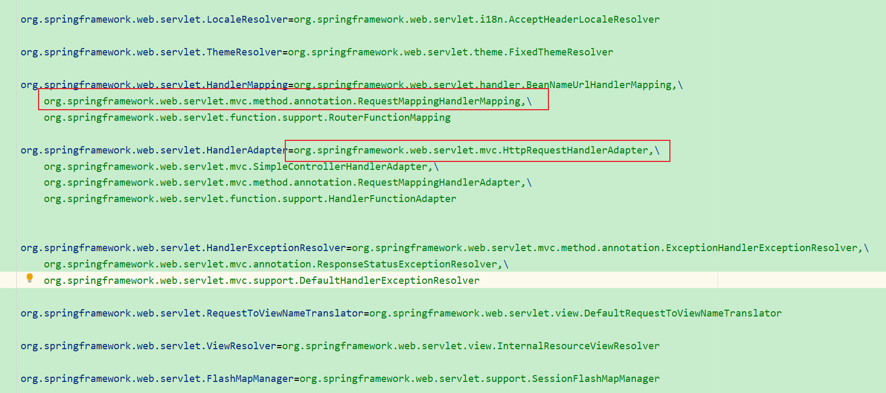

##### 4.2、我们在WebConfig中自定义一个RequestMappingHandlerMapping 

```java
    /**
     * 如果用 DispatcherServlet 初始化时默认添加的组件, 并不会作为 bean, 给测试带来困扰
     * ⬅️1. 加入RequestMappingHandlerMapping
     *
     * @return RequestMappingHandlerMapping
     */
    @Bean
    public RequestMappingHandlerMapping requestMappingHandlerMapping() {
        return new RequestMappingHandlerMapping();
    }
```

##### 4.3、定义一个HelloController

```java
package com.itheima.a20.controller;

import lombok.extern.slf4j.Slf4j;
import org.springframework.stereotype.Controller;
import org.springframework.web.bind.annotation.*;
import org.springframework.web.servlet.ModelAndView;
import org.yaml.snakeyaml.Yaml;

/**
 * @author lyf
 * @version 1.0
 * @classname HelloController
 * @description
 * @since 2022/12/10 10:04
 */
@Slf4j
@Controller("/hello")
public class HelloController {
    @GetMapping("/test1")
    public ModelAndView test1() throws Exception {
        log.debug("test1()");
        return null;
    }

    @PostMapping("/test2")
    public ModelAndView test2(@RequestParam("name") String name) {
        log.debug("test2({})", name);
        return null;
    }

    @PutMapping("/test3")
    public ModelAndView test3(String token) {
        log.debug("test3({})", token);
        return null;
    }

    @RequestMapping("/test4")
    public User test4() {
        log.debug("test4");
        return new User("张三", 18);
    }

    public static class User {
        private String name;
        private int age;

        public User(String name, int age) {
            this.name = name;
            this.age = age;
        }

        public String getName() {
            return name;
        }

        public int getAge() {
            return age;
        }

        public void setName(String name) {
            this.name = name;
        }

        public void setAge(int age) {
            this.age = age;
        }
    }

    public static void main(String[] args) {
        String str = new Yaml().dump(new User("张三", 18));
        System.out.println(str);
    }
}

```

##### 4.4、测试代码

```java
package com.itheima.a20;

import com.itheima.a20.config.WebConfig;
import lombok.extern.slf4j.Slf4j;
import org.springframework.boot.web.servlet.context.AnnotationConfigServletWebServerApplicationContext;
import org.springframework.web.method.HandlerMethod;
import org.springframework.web.servlet.mvc.method.RequestMappingInfo;
import org.springframework.web.servlet.mvc.method.annotation.RequestMappingHandlerMapping;

import java.util.Map;

/**
 * @author lyf
 * @version 1.0
 * @classname TestDispatchServlet
 * @description 测试DispatchServlet流程
 * @since 2022/12/9 18:42
 */
@Slf4j
public class TestDispatchServlet {
    public static void main(String[] args) {
        AnnotationConfigServletWebServerApplicationContext applicationContext
                = new AnnotationConfigServletWebServerApplicationContext(WebConfig.class);

        // 1 作用 解析 @RequestMapping 以及派生注解，生成路径与控制器方法的映射关系, 在初始化时就生成
        RequestMappingHandlerMapping requestMapping = applicationContext.getBean(RequestMappingHandlerMapping.class);
        // 2 获取所有的Handler 方法
        Map<RequestMappingInfo, HandlerMethod> handlerMethods = requestMapping.getHandlerMethods();
        handlerMethods.forEach((key, value)-> {
            log.debug("{}={}", key, value);
        });

    }
}

```

##### 4.5、测试结果

```verilog
[INFO ] 10:13:02.037 [main] o.s.b.w.e.tomcat.TomcatWebServer    - Tomcat initialized with port(s): 9090 (http) 
十二月 10, 2022 10:13:02 上午 org.apache.coyote.AbstractProtocol init
信息: Initializing ProtocolHandler ["http-nio-9090"]
十二月 10, 2022 10:13:02 上午 org.apache.catalina.core.StandardService startInternal
信息: Starting service [Tomcat]
十二月 10, 2022 10:13:02 上午 org.apache.catalina.core.StandardEngine startInternal
信息: Starting Servlet engine: [Apache Tomcat/9.0.62]
十二月 10, 2022 10:13:02 上午 org.apache.catalina.core.ApplicationContext log
信息: Initializing Spring embedded WebApplicationContext
[INFO ] 10:13:02.323 [main] o.s.b.w.s.c.ServletWebServerApplicationContext - Root WebApplicationContext: initialization completed in 1292 ms 
十二月 10, 2022 10:13:02 上午 org.apache.coyote.AbstractProtocol start
信息: Starting ProtocolHandler ["http-nio-9090"]
十二月 10, 2022 10:13:02 上午 org.apache.catalina.core.ApplicationContext log
信息: Initializing Spring DispatcherServlet 'dispatcherServlet'
[INFO ] 10:13:02.450 [main] o.s.web.servlet.DispatcherServlet   - Initializing Servlet 'dispatcherServlet' 
[TRACE] 10:13:02.450 [main] o.s.web.servlet.DispatcherServlet   - No MultipartResolver 'multipartResolver' declared 
[TRACE] 10:13:02.453 [main] o.s.web.servlet.DispatcherServlet   - No LocaleResolver 'localeResolver': using default [AcceptHeaderLocaleResolver] 
[TRACE] 10:13:02.453 [main] o.s.web.servlet.DispatcherServlet   - No ThemeResolver 'themeResolver': using default [FixedThemeResolver] 
[TRACE] 10:13:02.726 [main] o.s.web.servlet.DispatcherServlet   - No HandlerAdapters declared for servlet 'dispatcherServlet': using default strategies from DispatcherServlet.properties 
[TRACE] 10:13:02.736 [main] o.s.web.servlet.DispatcherServlet   - No HandlerExceptionResolvers declared in servlet 'dispatcherServlet': using default strategies from DispatcherServlet.properties 
[TRACE] 10:13:02.737 [main] o.s.web.servlet.DispatcherServlet   - No RequestToViewNameTranslator 'viewNameTranslator': using default [DefaultRequestToViewNameTranslator] 
[TRACE] 10:13:02.743 [main] o.s.web.servlet.DispatcherServlet   - No ViewResolvers declared for servlet 'dispatcherServlet': using default strategies from DispatcherServlet.properties 
[TRACE] 10:13:02.745 [main] o.s.web.servlet.DispatcherServlet   - No FlashMapManager 'flashMapManager': using default [SessionFlashMapManager] 
[DEBUG] 10:13:02.745 [main] o.s.web.servlet.DispatcherServlet   - enableLoggingRequestDetails='false': request parameters and headers will be masked to prevent unsafe logging of potentially sensitive data 
[INFO ] 10:13:02.745 [main] o.s.web.servlet.DispatcherServlet   - Completed initialization in 295 ms 
[INFO ] 10:13:02.746 [main] o.s.b.w.e.tomcat.TomcatWebServer    - Tomcat started on port(s): 9090 (http) with context path '' 
[DEBUG] 10:13:02.761 [main] com.itheima.a20.TestDispatchServlet - {PUT [/test3]}=com.itheima.a20.controller.HelloController#test3(String) 
[DEBUG] 10:13:02.763 [main] com.itheima.a20.TestDispatchServlet - {GET [/test1]}=com.itheima.a20.controller.HelloController#test1() 
[DEBUG] 10:13:02.763 [main] com.itheima.a20.TestDispatchServlet - {POST [/test2]}=com.itheima.a20.controller.HelloController#test2(String) 
[DEBUG] 10:13:02.763 [main] com.itheima.a20.TestDispatchServlet - { [/test4]}=com.itheima.a20.controller.HelloController#test4() 
```

- RequestMappingHandlerMapping相关的日志

```verilog
[DEBUG] 10:13:02.761 [main] com.itheima.a20.TestDispatchServlet - {PUT [/test3]}=com.itheima.a20.controller.HelloController#test3(String) 
[DEBUG] 10:13:02.763 [main] com.itheima.a20.TestDispatchServlet - {GET [/test1]}=com.itheima.a20.controller.HelloController#test1() 
[DEBUG] 10:13:02.763 [main] com.itheima.a20.TestDispatchServlet - {POST [/test2]}=com.itheima.a20.controller.HelloController#test2(String) 
[DEBUG] 10:13:02.763 [main] com.itheima.a20.TestDispatchServlet - { [/test4]}=com.itheima.a20.controller.HelloController#test4() 
```

> 生成路径与控制器方法的映射关系

#### 5、测试RequestMappingHandlerAdapter 

##### 5.1、MyRequestMappingHandlerAdapter

```java
package com.itheima.a20.adapter;

import lombok.extern.slf4j.Slf4j;
import org.springframework.web.method.HandlerMethod;
import org.springframework.web.servlet.ModelAndView;
import org.springframework.web.servlet.mvc.method.annotation.RequestMappingHandlerAdapter;

import javax.servlet.http.HttpServletRequest;
import javax.servlet.http.HttpServletResponse;

/**
 * @author lyf
 * @version 1.0
 * @classname MyRequestMappingHandlerAdapter
 * @description MyRequestMappingHandlerAdapter继承RequestMappingHandlerAdapter，
 * 并重写invokeHandlerMethod，将其访问控制符修改为public
 * 以便我们的后续访问
 * @since 2022/12/10 10:27
 */
@Slf4j
public class MyRequestMappingHandlerAdapter extends RequestMappingHandlerAdapter {
    @Override
    public ModelAndView invokeHandlerMethod(HttpServletRequest request, HttpServletResponse response, HandlerMethod handlerMethod) throws Exception {
        return super.invokeHandlerMethod(request, response, handlerMethod);
    }
}

```

##### 5.2、在WebConfig中注入自定义的Adapter

```java
    /**
     * 2. 继续加入RequestMappingHandlerAdapter, 会替换掉 DispatcherServlet 默认的 4 个 HandlerAdapter
     * <p>
     * 这里注入自定义的MyRequestMappingHandlerAdapter是为了调用
     * org.springframework.web.servlet.mvc.method.annotation.RequestMappingHandlerAdapter#invokeHandlerMethod(javax.servlet.http.HttpServletRequest, javax.servlet.http.HttpServletResponse, org.springframework.web.method.HandlerMethod)
     * 中受保护的方法
     *
     * @return RequestMappingHandlerAdapter
     */
    @Bean
    public MyRequestMappingHandlerAdapter myRequestMappingHandlerAdapter() {
        MyRequestMappingHandlerAdapter handlerAdapter = new MyRequestMappingHandlerAdapter();
        return handlerAdapter;
    }
```

##### 5.3、测试代码

```java
package com.itheima.a20;

import com.itheima.a20.adapter.MyRequestMappingHandlerAdapter;
import com.itheima.a20.config.WebConfig;
import lombok.extern.slf4j.Slf4j;
import org.springframework.boot.web.servlet.context.AnnotationConfigServletWebServerApplicationContext;
import org.springframework.mock.web.MockHttpServletRequest;
import org.springframework.mock.web.MockHttpServletResponse;
import org.springframework.web.method.HandlerMethod;
import org.springframework.web.servlet.HandlerExecutionChain;
import org.springframework.web.servlet.mvc.method.RequestMappingInfo;
import org.springframework.web.servlet.mvc.method.annotation.RequestMappingHandlerMapping;

import java.nio.charset.StandardCharsets;
import java.util.Map;

/**
 * @author lyf
 * @version 1.0
 * @classname TestDispatchServlet
 * @description 测试DispatchServlet流程
 * @since 2022/12/9 18:42
 */
@Slf4j
public class TestDispatchServlet {
    public static void main(String[] args) throws Exception {
        AnnotationConfigServletWebServerApplicationContext applicationContext
                = new AnnotationConfigServletWebServerApplicationContext(WebConfig.class);

        // 1 作用 解析 @RequestMapping 以及派生注解，生成路径与控制器方法的映射关系, 在初始化时就生成
        RequestMappingHandlerMapping requestMapping = applicationContext.getBean(RequestMappingHandlerMapping.class);
        // 2 获取所有的Handler 方法
        Map<RequestMappingInfo, HandlerMethod> handlerMethods = requestMapping.getHandlerMethods();
        handlerMethods.forEach((key, value)-> {
            log.debug("{}={}", key, value);
        });

        // 3 请求来了，获取控制器方法，返回处理器链执行对象
        MockHttpServletRequest request = new MockHttpServletRequest("GET", "/test1");
        MockHttpServletResponse response = new MockHttpServletResponse();
        response.setContentType("text/html; charset=utf-8");
        response.getWriter().write("你好啊");
        HandlerExecutionChain handlerExecutionChain = requestMapping.getHandler(request);
        log.debug("{}", handlerExecutionChain);

        System.out.println(">>>>>>>>>>>>>>>>>>>>>>>>>>>>>>>>>>>>>>>>>>>>>>>>>>>>>>>>>>>>>>>>>>>>");
        // 4 RequestMappingHandlerAdapter 处理 处理器链执行对象
        MyRequestMappingHandlerAdapter handlerAdapter = applicationContext.getBean(MyRequestMappingHandlerAdapter.class);
        assert handlerExecutionChain != null;
        handlerAdapter.invokeHandlerMethod(request, response, (HandlerMethod) handlerExecutionChain.getHandler());

        // 5 处理响应结果
        byte[] byteArray = response.getContentAsByteArray();
        log.debug("response result is {}", new String(byteArray, StandardCharsets.UTF_8));
    }
}

```

##### 5.4、测试结果

```verilog
[INFO ] 10:36:07.025 [main] o.s.b.w.e.tomcat.TomcatWebServer    - Tomcat initialized with port(s): 9090 (http) 
十二月 10, 2022 10:36:07 上午 org.apache.coyote.AbstractProtocol init
信息: Initializing ProtocolHandler ["http-nio-9090"]
十二月 10, 2022 10:36:07 上午 org.apache.catalina.core.StandardService startInternal
信息: Starting service [Tomcat]
十二月 10, 2022 10:36:07 上午 org.apache.catalina.core.StandardEngine startInternal
信息: Starting Servlet engine: [Apache Tomcat/9.0.62]
十二月 10, 2022 10:36:07 上午 org.apache.catalina.core.ApplicationContext log
信息: Initializing Spring embedded WebApplicationContext
[INFO ] 10:36:07.299 [main] o.s.b.w.s.c.ServletWebServerApplicationContext - Root WebApplicationContext: initialization completed in 1522 ms 
[DEBUG] 10:36:07.643 [main] c.i.a.a.MyRequestMappingHandlerAdapter - ControllerAdvice beans: none 
十二月 10, 2022 10:36:07 上午 org.apache.coyote.AbstractProtocol start
信息: Starting ProtocolHandler ["http-nio-9090"]
[INFO ] 10:36:07.702 [main] o.s.web.servlet.DispatcherServlet   - Initializing Servlet 'dispatcherServlet' 
[TRACE] 10:36:07.702 [main] o.s.web.servlet.DispatcherServlet   - No MultipartResolver 'multipartResolver' declared 
[TRACE] 10:36:07.704 [main] o.s.web.servlet.DispatcherServlet   - No LocaleResolver 'localeResolver': using default [AcceptHeaderLocaleResolver] 
[TRACE] 10:36:07.705 [main] o.s.web.servlet.DispatcherServlet   - No ThemeResolver 'themeResolver': using default [FixedThemeResolver] 
[TRACE] 10:36:07.713 [main] o.s.web.servlet.DispatcherServlet   - No HandlerExceptionResolvers declared in servlet 'dispatcherServlet': using default strategies from DispatcherServlet.properties 
十二月 10, 2022 10:36:07 上午 org.apache.catalina.core.ApplicationContext log
信息: Initializing Spring DispatcherServlet 'dispatcherServlet'
[TRACE] 10:36:07.714 [main] o.s.web.servlet.DispatcherServlet   - No RequestToViewNameTranslator 'viewNameTranslator': using default [DefaultRequestToViewNameTranslator] 
[TRACE] 10:36:07.720 [main] o.s.web.servlet.DispatcherServlet   - No ViewResolvers declared for servlet 'dispatcherServlet': using default strategies from DispatcherServlet.properties 
[TRACE] 10:36:07.722 [main] o.s.web.servlet.DispatcherServlet   - No FlashMapManager 'flashMapManager': using default [SessionFlashMapManager] 
[DEBUG] 10:36:07.723 [main] o.s.web.servlet.DispatcherServlet   - enableLoggingRequestDetails='false': request parameters and headers will be masked to prevent unsafe logging of potentially sensitive data 
[INFO ] 10:36:07.723 [main] o.s.web.servlet.DispatcherServlet   - Completed initialization in 21 ms 
[INFO ] 10:36:07.724 [main] o.s.b.w.e.tomcat.TomcatWebServer    - Tomcat started on port(s): 9090 (http) with context path '' 
[DEBUG] 10:36:07.741 [main] com.itheima.a20.TestDispatchServlet - {PUT [/test3]}=com.itheima.a20.controller.HelloController#test3(String) 
[DEBUG] 10:36:07.743 [main] com.itheima.a20.TestDispatchServlet - {GET [/test1]}=com.itheima.a20.controller.HelloController#test1() 
[DEBUG] 10:36:07.743 [main] com.itheima.a20.TestDispatchServlet - {POST [/test2]}=com.itheima.a20.controller.HelloController#test2(String) 
[DEBUG] 10:36:07.743 [main] com.itheima.a20.TestDispatchServlet - { [/test4]}=com.itheima.a20.controller.HelloController#test4() 
[DEBUG] 10:36:07.762 [main] com.itheima.a20.TestDispatchServlet - HandlerExecutionChain with [com.itheima.a20.controller.HelloController#test1()] and 0 interceptors 
>>>>>>>>>>>>>>>>>>>>>>>>>>>>>>>>>>>>>>>>>>>>>>>>>>>>>>>>>>>>>>>>>>>>
[DEBUG] 10:36:07.773 [main] c.i.a20.controller.HelloController  - test1() 
[DEBUG] 10:36:07.774 [main] com.itheima.a20.TestDispatchServlet - response result is 你好啊 
```

- 简易结果

```verilog
[DEBUG] 10:36:07.773 [main] c.i.a20.controller.HelloController  - test1() 
[DEBUG] 10:36:07.774 [main] com.itheima.a20.TestDispatchServlet - response result is 你好啊 
```

> 我们调用到了test1，也拿到了我们写入的响应结果

### 20.1.2 收获💡

1. DispatcherServlet 是在第一次被访问时执行初始化, 也可以通过配置修改为 Tomcat 启动后就初始化
2. 在初始化时会从 Spring 容器中找一些 Web 需要的组件, 如 HandlerMapping、HandlerAdapter 等，并逐一调用它们的初始化
3. RequestMappingHandlerMapping 初始化时，会收集所有 @RequestMapping 映射信息，封装为 Map，其中
   * key 是 RequestMappingInfo 类型，包括请求路径、请求方法等信息
   * value 是 HandlerMethod 类型，包括控制器方法对象、控制器对象
   * 有了这个 Map，就可以在请求到达时，快速完成映射，找到 HandlerMethod 并与匹配的拦截器一起返回给 DispatcherServlet
4. RequestMappingHandlerAdapter 初始化时，会准备 HandlerMethod 调用时需要的各个组件，如：
   * HandlerMethodArgumentResolver 解析控制器方法参数
   * HandlerMethodReturnValueHandler 处理控制器方法返回值


## 20.2 演示2 - 自定义参数与返回值处理器

### 20.2.1 代码参考

#### 1、参数解析器

##### 1.1、@Token

```java
package com.itheima.a20.annotation;

import java.lang.annotation.ElementType;
import java.lang.annotation.Retention;
import java.lang.annotation.RetentionPolicy;
import java.lang.annotation.Target;

/**
 * @author lyf
 * @version 1.0
 * @classname Token
 * @description 例如经常需要用到请求头中的 token 信息, 用下面注解来标注由哪个参数来获取它
 * token=令牌
 * @since 2022/12/10 10:41
 */
@Target(ElementType.PARAMETER) // 表示此参数是加在方法参数上的
@Retention(RetentionPolicy.RUNTIME) // 运行期有效
public @interface Token {
}

```

##### 1.2、TokenArgumentResolver

```java
package com.itheima.a20.resolver;

import com.itheima.a20.annotation.Token;
import lombok.extern.slf4j.Slf4j;
import org.springframework.core.MethodParameter;
import org.springframework.web.bind.support.WebDataBinderFactory;
import org.springframework.web.context.request.NativeWebRequest;
import org.springframework.web.method.support.HandlerMethodArgumentResolver;
import org.springframework.web.method.support.ModelAndViewContainer;

/**
 * @author lyf
 * @version 1.0
 * @classname TokenArgumentResolver
 * @description Token参数解析器
 * @since 2022/12/10 10:46
 */
@Slf4j
public class TokenArgumentResolver implements HandlerMethodArgumentResolver {
    /**
     * 判断方法参数上是否有此注解
     *
     * @param parameter 方法参数
     * @return true 有此注解，false：无此注解
     */
    @Override
    public boolean supportsParameter(MethodParameter parameter) {
        Token token = parameter.getParameterAnnotation(Token.class);
        return token != null;
    }

    /**
     * 解析Token
     *
     * @param parameter     参数
     * @param mavContainer  容器
     * @param webRequest    webRequest
     * @param binderFactory binderFactory
     * @return Object
     * @throws Exception Exception
     */
    @Override
    public Object resolveArgument(MethodParameter parameter, ModelAndViewContainer mavContainer, NativeWebRequest webRequest, WebDataBinderFactory binderFactory) throws Exception {
        return webRequest.getHeader("token");
    }
}

```

#### 2、返回值处理器

##### 2.1、@Yml

```java
package com.itheima.a20.annotation;

import java.lang.annotation.ElementType;
import java.lang.annotation.Retention;
import java.lang.annotation.RetentionPolicy;
import java.lang.annotation.Target;

/**
 * @author lyf
 * @version 1.0
 * @classname Yml
 * @description 将方法的返回值，变成yml进行返回
 * @since 2022/12/10 10:44
 */
@Target(ElementType.METHOD)
@Retention(RetentionPolicy.RUNTIME)
public @interface Yml {
}

```


##### 2.2、YmlReturnValueHandler

```java
package com.itheima.a20.handler;

import com.itheima.a20.annotation.Yml;
import lombok.extern.slf4j.Slf4j;
import org.springframework.core.MethodParameter;
import org.springframework.web.context.request.NativeWebRequest;
import org.springframework.web.method.support.HandlerMethodReturnValueHandler;
import org.springframework.web.method.support.ModelAndViewContainer;
import org.yaml.snakeyaml.Yaml;

import javax.servlet.http.HttpServletResponse;

/**
 * @author lyf
 * @version 1.0
 * @classname YmlReturnValueHandler
 * @description
 * @since 2022/12/10 10:51
 */
@Slf4j
public class YmlReturnValueHandler implements HandlerMethodReturnValueHandler {
    /**
     * 判断方法参数上是否有此注解
     *
     * @param returnType 方法的返回值参数
     * @return true 有此注解，false：无此注解
     */
    @Override
    public boolean supportsReturnType(MethodParameter returnType) {
        Yml yml = returnType.getMethodAnnotation(Yml.class);
        return yml != null;
    }

    @Override
    public void handleReturnValue(Object returnValue, MethodParameter returnType, ModelAndViewContainer mavContainer, NativeWebRequest webRequest) throws Exception {
        // 1 将响应结果，转成yaml形式
        String yamlStr = new Yaml().dump(returnValue);

        // 2 将转好的yaml字符串写入响应中
        HttpServletResponse response = (HttpServletResponse) webRequest.getNativeResponse();
        assert response != null;
        response.setContentType("text/html; charset=utf-8");
        response.getWriter().write(yamlStr);
        // 3 告诉mvc容器，响应已经完成
        mavContainer.setRequestHandled(true);
    }
}

```

#### 3、测试参数解析器和返回值处理器

##### 3.1、HelloController

```java
   @PutMapping("/test3")
    public ModelAndView test3(@Token String token) {
        log.debug("test3({})", token);
        return null;
    }

    @RequestMapping("/test4")
    @Yml
    public User test4() {
        log.debug("test4");
        return new User("张三", 18);
    }
```


##### 3.2、WebConfig

```java
    /**
     * 2. 继续加入RequestMappingHandlerAdapter, 会替换掉 DispatcherServlet 默认的 4 个 HandlerAdapter
     * <p>
     * 这里注入自定义的MyRequestMappingHandlerAdapter是为了调用
     * org.springframework.web.servlet.mvc.method.annotation.RequestMappingHandlerAdapter#invokeHandlerMethod(javax.servlet.http.HttpServletRequest, javax.servlet.http.HttpServletResponse, org.springframework.web.method.HandlerMethod)
     * 中受保护的方法
     *
     * @return RequestMappingHandlerAdapter
     */
    @Bean
    public MyRequestMappingHandlerAdapter myRequestMappingHandlerAdapter() {
        MyRequestMappingHandlerAdapter handlerAdapter = new MyRequestMappingHandlerAdapter();
        // 将token解析器和yaml解析器都添加到MyRequestMappingHandlerAdapter中
        // token解析器
        TokenArgumentResolver tokenArgumentResolver = new TokenArgumentResolver();
        
        // yaml解析器
        YmlReturnValueHandler ymlReturnValueHandler = new YmlReturnValueHandler();
        handlerAdapter.setCustomArgumentResolvers(Collections.singletonList(tokenArgumentResolver));
        handlerAdapter.setCustomReturnValueHandlers(Collections.singletonList(ymlReturnValueHandler));
        return handlerAdapter;
    }
```


##### 3.3、解析token

```java
    /**
     * 解析token
     *
     * @param applicationContext applicationContext
     * @param requestMapping     requestMapping
     * @throws Exception Exception
     */
    private static void resolverToken(AnnotationConfigServletWebServerApplicationContext applicationContext, RequestMappingHandlerMapping requestMapping) throws Exception {
        System.out.println(">>>>>>>>>>>>>>>>>>>>>>>>>>>>>>>>>>>>>>token 解析开始>>>>>>>>>>>>>>>>>>>>>>>>>>>>>>>>>>>>>>>>>>>>>>>>>");
        // 3 请求来了，获取控制器方法，返回处理器链执行对象
        MockHttpServletRequest request = new MockHttpServletRequest(HttpMethod.PUT.toString(), "/test3");
        request.addHeader("token", UUID.randomUUID().toString());
        MockHttpServletResponse response = new MockHttpServletResponse();
        // 3.1 获取执行器链对象
        HandlerExecutionChain chain = requestMapping.getHandler(request);

        // 4 RequestMappingHandlerAdapter 处理 处理器链执行对象
        MyRequestMappingHandlerAdapter handlerAdapter = applicationContext.getBean(MyRequestMappingHandlerAdapter.class);
        assert chain != null;
        handlerAdapter.invokeHandlerMethod(request, response, ((HandlerMethod) chain.getHandler()));
        // 5 处理响应结果
        System.out.println(">>>>>>>>>>>>>>>>>>>>>>>>>>>>>>>>>>>>>token 解析结束>>>>>>>>>>>>>>>>>>>>>>>>>>>>>>>>>>>>>>>>>>>>>>>>>>");
    }

```

##### 3.4、解析yml

```java
    /**
     * 解析yml
     *
     * @param applicationContext applicationContext
     * @param requestMapping     requestMapping
     * @throws Exception Exception
     */
    private static void resolverYml(AnnotationConfigServletWebServerApplicationContext applicationContext, RequestMappingHandlerMapping requestMapping) throws Exception {
        System.out.println(">>>>>>>>>>>>>>>>>>>>>>>>>>>>>>>>>>>>>>yml 解析开始>>>>>>>>>>>>>>>>>>>>>>>>>>>>>>>>>>>>>>>>>>>>>>>>>");
        // 3 获取执行器链对象
        MockHttpServletRequest request = new MockHttpServletRequest(HttpMethod.GET.toString(), "/test4");
        MockHttpServletResponse response = new MockHttpServletResponse();
        MyRequestMappingHandlerAdapter handlerAdapter = applicationContext.getBean(MyRequestMappingHandlerAdapter.class);
        HandlerExecutionChain chain = requestMapping.getHandler(request);
        assert chain != null;
        // 4 解析执行器链对象
        handlerAdapter.invokeHandlerMethod(request, response, ((HandlerMethod) chain.getHandler()));

        // 5 解析响应结果
        byte[] byteArray = response.getContentAsByteArray();
        log.debug("解析结果: {}", new String(byteArray, StandardCharsets.UTF_8));

        System.out.println(">>>>>>>>>>>>>>>>>>>>>>>>>>>>>>>>>>>>>>yml 解析结束>>>>>>>>>>>>>>>>>>>>>>>>>>>>>>>>>>>>>>>>>>>>>>>>>");
    }

```

##### 3.5、完整的测试代码

```java
package com.itheima.a20;

import com.itheima.a20.adapter.MyRequestMappingHandlerAdapter;
import com.itheima.a20.config.WebConfig;
import lombok.extern.slf4j.Slf4j;
import org.springframework.boot.web.servlet.context.AnnotationConfigServletWebServerApplicationContext;
import org.springframework.http.HttpMethod;
import org.springframework.mock.web.MockHttpServletRequest;
import org.springframework.mock.web.MockHttpServletResponse;
import org.springframework.web.method.HandlerMethod;
import org.springframework.web.servlet.HandlerExecutionChain;
import org.springframework.web.servlet.mvc.method.RequestMappingInfo;
import org.springframework.web.servlet.mvc.method.annotation.RequestMappingHandlerMapping;

import java.nio.charset.StandardCharsets;
import java.util.Map;
import java.util.UUID;

/**
 * @author lyf
 * @version 1.0
 * @classname TestDispatchServlet
 * @description 测试DispatchServlet流程
 * @since 2022/12/9 18:42
 */
@Slf4j
public class TestDispatchServlet {
    public static void main(String[] args) throws Exception {
        AnnotationConfigServletWebServerApplicationContext applicationContext
                = new AnnotationConfigServletWebServerApplicationContext(WebConfig.class);

        // 1 作用 解析 @RequestMapping 以及派生注解，生成路径与控制器方法的映射关系, 在初始化时就生成
        RequestMappingHandlerMapping requestMapping = applicationContext.getBean(RequestMappingHandlerMapping.class);
        // 2 获取所有的Handler 方法
        Map<RequestMappingInfo, HandlerMethod> handlerMethods = requestMapping.getHandlerMethods();
        handlerMethods.forEach((key, value) -> {
            log.debug("{}={}", key, value);
        });

        // 解析token
        resolverToken(applicationContext, requestMapping);

        // 解析yml
        resolverYml(applicationContext, requestMapping);
    }

    /**
     * 解析yml
     *
     * @param applicationContext applicationContext
     * @param requestMapping     requestMapping
     * @throws Exception Exception
     */
    private static void resolverYml(AnnotationConfigServletWebServerApplicationContext applicationContext, RequestMappingHandlerMapping requestMapping) throws Exception {
        System.out.println(">>>>>>>>>>>>>>>>>>>>>>>>>>>>>>>>>>>>>>yml 解析开始>>>>>>>>>>>>>>>>>>>>>>>>>>>>>>>>>>>>>>>>>>>>>>>>>");
        // 3 获取执行器链对象
        MockHttpServletRequest request = new MockHttpServletRequest(HttpMethod.GET.toString(), "/test4");
        MockHttpServletResponse response = new MockHttpServletResponse();
        MyRequestMappingHandlerAdapter handlerAdapter = applicationContext.getBean(MyRequestMappingHandlerAdapter.class);
        HandlerExecutionChain chain = requestMapping.getHandler(request);
        assert chain != null;
        // 4 解析执行器链对象
        handlerAdapter.invokeHandlerMethod(request, response, ((HandlerMethod) chain.getHandler()));

        // 5 解析响应结果
        byte[] byteArray = response.getContentAsByteArray();
        log.debug("解析结果: {}", new String(byteArray, StandardCharsets.UTF_8));

        System.out.println(">>>>>>>>>>>>>>>>>>>>>>>>>>>>>>>>>>>>>>yml 解析结束>>>>>>>>>>>>>>>>>>>>>>>>>>>>>>>>>>>>>>>>>>>>>>>>>");
    }

    /**
     * 解析token
     *
     * @param applicationContext applicationContext
     * @param requestMapping     requestMapping
     * @throws Exception Exception
     */
    private static void resolverToken(AnnotationConfigServletWebServerApplicationContext applicationContext, RequestMappingHandlerMapping requestMapping) throws Exception {
        System.out.println(">>>>>>>>>>>>>>>>>>>>>>>>>>>>>>>>>>>>>>token 解析开始>>>>>>>>>>>>>>>>>>>>>>>>>>>>>>>>>>>>>>>>>>>>>>>>>");
        // 3 请求来了，获取控制器方法，返回处理器链执行对象
        MockHttpServletRequest request = new MockHttpServletRequest(HttpMethod.PUT.toString(), "/test3");
        request.addHeader("token", UUID.randomUUID().toString());
        MockHttpServletResponse response = new MockHttpServletResponse();
        // 3.1 获取执行器链对象
        HandlerExecutionChain chain = requestMapping.getHandler(request);

        // 4 RequestMappingHandlerAdapter 处理 处理器链执行对象
        MyRequestMappingHandlerAdapter handlerAdapter = applicationContext.getBean(MyRequestMappingHandlerAdapter.class);
        assert chain != null;
        handlerAdapter.invokeHandlerMethod(request, response, ((HandlerMethod) chain.getHandler()));
        // 5 处理响应结果
        System.out.println(">>>>>>>>>>>>>>>>>>>>>>>>>>>>>>>>>>>>>token 解析结束>>>>>>>>>>>>>>>>>>>>>>>>>>>>>>>>>>>>>>>>>>>>>>>>>>");
    }

    private static void test1(AnnotationConfigServletWebServerApplicationContext applicationContext, RequestMappingHandlerMapping requestMapping) throws Exception {
        // 3 请求来了，获取控制器方法，返回处理器链执行对象
        MockHttpServletRequest request = new MockHttpServletRequest("GET", "/test1");
        MockHttpServletResponse response = new MockHttpServletResponse();
        response.setContentType("text/html; charset=utf-8");
        response.getWriter().write("你好啊");
        HandlerExecutionChain handlerExecutionChain = requestMapping.getHandler(request);
        log.debug("{}", handlerExecutionChain);

        System.out.println(">>>>>>>>>>>>>>>>>>>>>>>>>>>>>>>>>>>>>>>>>>>>>>>>>>>>>>>>>>>>>>>>>>>>");
        // 4 RequestMappingHandlerAdapter 处理 处理器链执行对象
        MyRequestMappingHandlerAdapter handlerAdapter = applicationContext.getBean(MyRequestMappingHandlerAdapter.class);
        assert handlerExecutionChain != null;
        handlerAdapter.invokeHandlerMethod(request, response, (HandlerMethod) handlerExecutionChain.getHandler());

        // 5 处理响应结果
        byte[] byteArray = response.getContentAsByteArray();
        log.debug("response result is {}", new String(byteArray, StandardCharsets.UTF_8));
    }
}

```


##### 3.6、测试结果(截取关键日志)

```verilog
>>>>>>>>>>>>>>>>>>>>>>>>>>>>>>>>>>>>>>token 解析开始>>>>>>>>>>>>>>>>>>>>>>>>>>>>>>>>>>>>>>>>>>>>>>>>>
[DEBUG] 11:21:50.059 [main] c.i.a20.controller.HelloController  - test3(ce2ad4cd-4a3f-4da2-8d43-ad97923166cb) 
>>>>>>>>>>>>>>>>>>>>>>>>>>>>>>>>>>>>>token 解析结束>>>>>>>>>>>>>>>>>>>>>>>>>>>>>>>>>>>>>>>>>>>>>>>>>>
>>>>>>>>>>>>>>>>>>>>>>>>>>>>>>>>>>>>>>yml 解析开始>>>>>>>>>>>>>>>>>>>>>>>>>>>>>>>>>>>>>>>>>>>>>>>>>
[DEBUG] 11:21:50.060 [main] c.i.a20.controller.HelloController  - test4 
[DEBUG] 11:21:50.111 [main] com.itheima.a20.TestDispatchServlet - 解析结果: !!com.itheima.a20.controller.HelloController$User {age: 18, name: 张三}
 
>>>>>>>>>>>>>>>>>>>>>>>>>>>>>>>>>>>>>>yml 解析结束>>>>>>>>>>>>>>>>>>>>>>>>>>>>>>>>>>>>>>>>>>>>>>>>>
```


### 20.2.2 收获💡

1. 体会参数解析器的作用
2. 体会返回值处理器的作用


# 21 参数解析器

## 21.1 演示 - 常见参数解析器

### 21.1.1 Spring中常见的参数解析器

```java
org.springframework.web.method.annotation.RequestParamMethodArgumentResolver@abbc908
org.springframework.web.method.annotation.RequestParamMapMethodArgumentResolver@44afefd5
org.springframework.web.servlet.mvc.method.annotation.PathVariableMethodArgumentResolver@9a7a808
org.springframework.web.servlet.mvc.method.annotation.PathVariableMapMethodArgumentResolver@72209d93
org.springframework.web.servlet.mvc.method.annotation.MatrixVariableMethodArgumentResolver@2687f956
org.springframework.web.servlet.mvc.method.annotation.MatrixVariableMapMethodArgumentResolver@1ded7b14
org.springframework.web.servlet.mvc.method.annotation.ServletModelAttributeMethodProcessor@29be7749
org.springframework.web.servlet.mvc.method.annotation.RequestResponseBodyMethodProcessor@5f84abe8
org.springframework.web.servlet.mvc.method.annotation.RequestPartMethodArgumentResolver@4650a407
org.springframework.web.method.annotation.RequestHeaderMethodArgumentResolver@30135202
org.springframework.web.method.annotation.RequestHeaderMapMethodArgumentResolver@6a4d7f76
org.springframework.web.servlet.mvc.method.annotation.ServletCookieValueMethodArgumentResolver@10ec523c
org.springframework.web.method.annotation.ExpressionValueMethodArgumentResolver@53dfacba
org.springframework.web.servlet.mvc.method.annotation.SessionAttributeMethodArgumentResolver@79767781
org.springframework.web.servlet.mvc.method.annotation.RequestAttributeMethodArgumentResolver@78411116
org.springframework.web.servlet.mvc.method.annotation.ServletRequestMethodArgumentResolver@aced190
org.springframework.web.servlet.mvc.method.annotation.ServletResponseMethodArgumentResolver@245a060f
org.springframework.web.servlet.mvc.method.annotation.HttpEntityMethodProcessor@6edaa77a
org.springframework.web.servlet.mvc.method.annotation.RedirectAttributesMethodArgumentResolver@1e63d216
org.springframework.web.method.annotation.ModelMethodProcessor@62ddd21b
org.springframework.web.method.annotation.MapMethodProcessor@16c3ca31
org.springframework.web.method.annotation.ErrorsMethodArgumentResolver@2d195ee4
org.springframework.web.method.annotation.SessionStatusMethodArgumentResolver@2d6aca33
org.springframework.web.servlet.mvc.method.annotation.UriComponentsBuilderMethodArgumentResolver@21ab988f
org.springframework.web.servlet.mvc.method.annotation.PrincipalMethodArgumentResolver@29314cc9
org.springframework.web.method.annotation.RequestParamMethodArgumentResolver@4e38d975
org.springframework.web.servlet.mvc.method.annotation.ServletModelAttributeMethodProcessor@35f8a9d3
```


### 21.1.2 代码参考

#### 1、WebConfig

```java
package com.itheima.a21.config;

import lombok.extern.slf4j.Slf4j;
import org.springframework.context.annotation.Configuration;

/**
 * @author lyf
 * @version 1.0
 * @classname WebConfig
 * @description
 * @since 2022/12/10 15:09
 */
@Slf4j
@Configuration
public class WebConfig {
}

```

#### 2、核心代码

```java
package com.itheima.a21;

import com.itheima.a21.config.WebConfig;
import lombok.Data;
import lombok.extern.slf4j.Slf4j;
import org.springframework.beans.factory.annotation.Value;
import org.springframework.beans.factory.support.DefaultListableBeanFactory;
import org.springframework.context.annotation.AnnotationConfigApplicationContext;
import org.springframework.core.DefaultParameterNameDiscoverer;
import org.springframework.core.MethodParameter;
import org.springframework.http.converter.json.MappingJackson2HttpMessageConverter;
import org.springframework.mock.web.MockHttpServletRequest;
import org.springframework.mock.web.MockPart;
import org.springframework.util.AntPathMatcher;
import org.springframework.web.bind.annotation.*;
import org.springframework.web.context.request.ServletWebRequest;
import org.springframework.web.method.HandlerMethod;
import org.springframework.web.method.annotation.ExpressionValueMethodArgumentResolver;
import org.springframework.web.method.annotation.RequestHeaderMethodArgumentResolver;
import org.springframework.web.method.annotation.RequestParamMethodArgumentResolver;
import org.springframework.web.method.support.HandlerMethodArgumentResolverComposite;
import org.springframework.web.method.support.ModelAndViewContainer;
import org.springframework.web.multipart.MultipartFile;
import org.springframework.web.multipart.support.StandardServletMultipartResolver;
import org.springframework.web.servlet.HandlerMapping;
import org.springframework.web.servlet.mvc.method.annotation.*;

import javax.servlet.http.Cookie;
import javax.servlet.http.HttpServletRequest;
import java.nio.charset.StandardCharsets;
import java.util.Collections;
import java.util.Map;
import java.util.UUID;

/**
 * @author lyf
 * @version 1.0
 * @classname TestArgumentResolver
 * @description 测试各类参数解析器
 * Spring中常见的参数解析器
 * 目标: 解析控制器方法的参数值
 * <p>
 * 常见的参数处理器如下:
 * org.springframework.web.method.annotation.RequestParamMethodArgumentResolver@abbc908
 * org.springframework.web.method.annotation.RequestParamMapMethodArgumentResolver@44afefd5
 * org.springframework.web.servlet.mvc.method.annotation.PathVariableMethodArgumentResolver@9a7a808
 * org.springframework.web.servlet.mvc.method.annotation.PathVariableMapMethodArgumentResolver@72209d93
 * org.springframework.web.servlet.mvc.method.annotation.MatrixVariableMethodArgumentResolver@2687f956
 * org.springframework.web.servlet.mvc.method.annotation.MatrixVariableMapMethodArgumentResolver@1ded7b14
 * org.springframework.web.servlet.mvc.method.annotation.ServletModelAttributeMethodProcessor@29be7749
 * org.springframework.web.servlet.mvc.method.annotation.RequestResponseBodyMethodProcessor@5f84abe8
 * org.springframework.web.servlet.mvc.method.annotation.RequestPartMethodArgumentResolver@4650a407
 * org.springframework.web.method.annotation.RequestHeaderMethodArgumentResolver@30135202
 * org.springframework.web.method.annotation.RequestHeaderMapMethodArgumentResolver@6a4d7f76
 * org.springframework.web.servlet.mvc.method.annotation.ServletCookieValueMethodArgumentResolver@10ec523c
 * org.springframework.web.method.annotation.ExpressionValueMethodArgumentResolver@53dfacba
 * org.springframework.web.servlet.mvc.method.annotation.SessionAttributeMethodArgumentResolver@79767781
 * org.springframework.web.servlet.mvc.method.annotation.RequestAttributeMethodArgumentResolver@78411116
 * org.springframework.web.servlet.mvc.method.annotation.ServletRequestMethodArgumentResolver@aced190
 * org.springframework.web.servlet.mvc.method.annotation.ServletResponseMethodArgumentResolver@245a060f
 * org.springframework.web.servlet.mvc.method.annotation.HttpEntityMethodProcessor@6edaa77a
 * org.springframework.web.servlet.mvc.method.annotation.RedirectAttributesMethodArgumentResolver@1e63d216
 * org.springframework.web.method.annotation.ModelMethodProcessor@62ddd21b
 * org.springframework.web.method.annotation.MapMethodProcessor@16c3ca31
 * org.springframework.web.method.annotation.ErrorsMethodArgumentResolver@2d195ee4
 * org.springframework.web.method.annotation.SessionStatusMethodArgumentResolver@2d6aca33
 * org.springframework.web.servlet.mvc.method.annotation.UriComponentsBuilderMethodArgumentResolver@21ab988f
 * org.springframework.web.servlet.mvc.method.annotation.PrincipalMethodArgumentResolver@29314cc9
 * org.springframework.web.method.annotation.RequestParamMethodArgumentResolver@4e38d975
 * org.springframework.web.servlet.mvc.method.annotation.ServletModelAttributeMethodProcessor@35f8a9d3
 * @since 2022/12/10 14:32
 */
@Slf4j
public class TestArgumentResolver {
    public static void main(String[] args) throws Exception {
        // 准备容器
        AnnotationConfigApplicationContext applicationContext = new AnnotationConfigApplicationContext(WebConfig.class);
        // 获取beanFactory
        DefaultListableBeanFactory beanFactory = applicationContext.getDefaultListableBeanFactory();
        // 构建请求
        HttpServletRequest request = mockRequest();
        // 要点1. 控制器方法被封装为 HandlerMethod
        HandlerMethod handlerMethod = initHandlerMethod();

        // 要点2. 准备对象绑定与类型转换
        ServletRequestDataBinderFactory dataBinderFactory = new ServletRequestDataBinderFactory(null, null);

        // 要点3. 准备 ModelAndViewContainer 用来存储中间 Model 结果
        ModelAndViewContainer container = new ModelAndViewContainer();

        // 要点4. 准备好万能解析器
        HandlerMethodArgumentResolverComposite resolver = getHandlerMethodArgumentResolverComposite(beanFactory);

        // 要点5. 解析每个参数值
        resolverParameters(request, handlerMethod, dataBinderFactory, container, resolver);
    }

    /**
     * @param request                 模拟请求
     * @param handlerMethod           控制器方法
     * @param dataBinderFactory       对象绑定与类型转换工厂
     * @param container               model容器，ModelAndViewContainer 用来存储中间 Model 结果
     * @param resolver，万能解析器，用于解析各种参数
     * @throws Exception Exception
     */
    private static void resolverParameters(HttpServletRequest request,
                                           HandlerMethod handlerMethod,
                                           ServletRequestDataBinderFactory dataBinderFactory,
                                           ModelAndViewContainer container,
                                           HandlerMethodArgumentResolverComposite resolver) throws Exception {
        // 遍历参数集合
        // 拿到所有的参数信息
        MethodParameter[] methodParameters = handlerMethod.getMethodParameters();
        for (MethodParameter methodParameter : methodParameters) {
            boolean supportsParameter = resolver.supportsParameter(methodParameter);

            /*
            [DEBUG] 16:00:28.158 [main] c.itheima.a21.TestArgumentResolver  - 0 String null -> 张三
            Exception in thread "main" java.lang.IllegalArgumentException: Name for argument of type [java.lang.String] not specified, and parameter name information not found in class file either.
                at org.springframework.web.method.annotation.AbstractNamedValueMethodArgumentResolver.updateNamedValueInfo(AbstractNamedValueMethodArgumentResolver.java:177)
                at org.springframework.web.method.annotation.AbstractNamedValueMethodArgumentResolver.getNamedValueInfo(AbstractNamedValueMethodArgumentResolver.java:154)
                at org.springframework.web.method.annotation.AbstractNamedValueMethodArgumentResolver.resolveArgument(AbstractNamedValueMethodArgumentResolver.java:99)
                at org.springframework.web.method.support.HandlerMethodArgumentResolverComposite.resolveArgument(HandlerMethodArgumentResolverComposite.java:122)
                at com.itheima.a21.TestArgumentResolver.main(TestArgumentResolver.java:165)

                这里添加参数名称解析器
             */
            methodParameter.initParameterNameDiscovery(new DefaultParameterNameDiscoverer());

            if (supportsParameter) {// 支持此参数的，我们将value解析出来
                /*
                    Exception in thread "main" java.lang.IllegalStateException: ModelAttributeMethodProcessor requires ModelAndViewContainer
                        at org.springframework.util.Assert.state(Assert.java:76)
                        at org.springframework.web.method.annotation.ModelAttributeMethodProcessor.resolveArgument(ModelAttributeMethodProcessor.java:129)
                        at org.springframework.web.method.support.HandlerMethodArgumentResolverComposite.resolveArgument(HandlerMethodArgumentResolverComposite.java:122)
                        at com.itheima.a21.TestArgumentResolver.main(TestArgumentResolver.java:138)

                        所以需要准备一个ModelAndViewContainer
                 */
                Object value = resolver.resolveArgument(methodParameter, container, new ServletWebRequest(request), dataBinderFactory);
                log.debug("{} {} {} -> {}", methodParameter.getParameterIndex(), methodParameter.getParameterType().getSimpleName(), methodParameter.getParameterName(), value);
            } else {
                log.debug("{} {} {}", methodParameter.getParameterIndex(), methodParameter.getParameterType().getSimpleName(), methodParameter.getParameterName());
            }
        }
    }


    private static HandlerMethod initHandlerMethod() throws NoSuchMethodException {
        HandlerMethod handlerMethod = new HandlerMethod(new MyController(), MyController.class.getMethod(
                "test",
                String.class,
                String.class,
                int.class,
                String.class,
                MultipartFile.class,
                int.class,
                String.class,
                String.class,
                String.class,
                HttpServletRequest.class,
                User.class,
                User.class,
                User.class));
        return handlerMethod;
    }

    /**
     * 准备万能解析器
     *
     * @param beanFactory beanFactory
     * @return 万能解析器
     */
    private static HandlerMethodArgumentResolverComposite getHandlerMethodArgumentResolverComposite(DefaultListableBeanFactory beanFactory) {
    /*
        目前存在的问题，一种类型参数需要一种类型解析器，这样需要添加多个参数解析器，解析的时候也需要一个一个判断
        那么是否存在一种万能解析器呢？
        可以满足所有的参数解析需求
        这里就存在一种组合器的设计模式
     */
        HandlerMethodArgumentResolverComposite resolver = new HandlerMethodArgumentResolverComposite();
        // 我们只需要往这个万能的解析器中添加对应类型的解析器，这个万能解析器就能正常的工作了
        resolver.addResolvers(
                // 解析@RequestParam
                // 第一个参数是bean工厂，第二个参数 false 表示必须有 @RequestParam
                new RequestParamMethodArgumentResolver(beanFactory, false),
                // 解析@PathVariable
                new PathVariableMethodArgumentResolver(),
                // 解析@RequestHeader
                new RequestHeaderMethodArgumentResolver(beanFactory),
                // 解析@CookieValue
                new ServletCookieValueMethodArgumentResolver(beanFactory),
                // 解析El表达式
                new ExpressionValueMethodArgumentResolver(beanFactory),
                // 解析HttpServletRequest对象
                new ServletRequestMethodArgumentResolver(),
                // 解析带有@ModelAttribute注解的对象, false表示必须要带此注解
                new ServletModelAttributeMethodProcessor(false),
                // 解析@RequestBody
                new RequestResponseBodyMethodProcessor(Collections.singletonList(new MappingJackson2HttpMessageConverter())),
                // 解析带有@ModelAttribute注解的对象, true表示必须此注解可以省略
                new ServletModelAttributeMethodProcessor(true),

                // 这个如果放在new ServletModelAttributeMethodProcessor(true), 后面的话，会因为先解析ModelAttribute，而导致后面的@RequestBody解析失效
                // new RequestResponseBodyMethodProcessor(Collections.singletonList(new MappingJackson2HttpMessageConverter()))

                // 解析最后不带@RequestParam注解的参数，注意此解析器必须放在最后
                new RequestParamMethodArgumentResolver(beanFactory, true)
        );
        return resolver;
    }

    /**
     * 准备请求参数
     *
     * @return HttpServletRequest
     */
    private static HttpServletRequest mockRequest() {
        MockHttpServletRequest request = new MockHttpServletRequest();
        // 设置name1
        request.setParameter("name1", "张三");
        // 设置name2
        request.setParameter("name2", "李四");
        // 构建MultipartFile对象
        request.addPart(new MockPart("file", "abc.txt", "正在学习Spring".getBytes(StandardCharsets.UTF_8)));
        // 模拟RestFul请求
        Map<String, String> map = new AntPathMatcher().extractUriTemplateVariables("/test/{id}", "/test/1234");
        request.setAttribute(HandlerMapping.URI_TEMPLATE_VARIABLES_ATTRIBUTE, map);
        // 设置Content-Type
        request.setContentType("application/json"); // 请求内容格式为json
        // 设置cookie
        request.setCookies(new Cookie("token", UUID.randomUUID().toString()));
        // 设置name和age
        request.setParameter("name", "zs");
        request.setParameter("age", "18");
        // 设置容器内容
        String json = "{\n" +
                "    \"name\" : \"lisi\",\n" +
                "    \"age\" : 18\n" +
                "}";
        request.setContent(json.getBytes(StandardCharsets.UTF_8));
        /*
        不能直接返回Request, 因为有文件上传参数，需要使用Multipart
        Exception in thread "main" org.springframework.web.multipart.MultipartException: Current request is not a multipart request
            at org.springframework.web.method.annotation.RequestParamMethodArgumentResolver.handleMissingValueInternal(RequestParamMethodArgumentResolver.java:210)
            at org.springframework.web.method.annotation.RequestParamMethodArgumentResolver.handleMissingValue(RequestParamMethodArgumentResolver.java:193)
            at org.springframework.web.method.annotation.AbstractNamedValueMethodArgumentResolver.resolveArgument(AbstractNamedValueMethodArgumentResolver.java:114)
            at com.itheima.a21.TestArgumentResolver.main(TestArgumentResolver.java:107)
         */
        // return request;
        return new StandardServletMultipartResolver().resolveMultipart(request);
    }

    static class MyController {
        public void test(
                @RequestParam("name1") String name1,            // name1=张三
                String name2,                                   // name2=李四
                @RequestParam("age") int age,                   // age=18
                @RequestParam(name = "home1", defaultValue = "${JAVA_HOME}") String home1, // Spring获取数据
                @RequestParam("file") MultipartFile file,       // 文件上传
                @PathVariable("id") int id,                     // /test/1234 /test/{id}
                @RequestHeader("Content-Type") String header,   // 获取请求头中的Content-Type
                @CookieValue("token") String token,             // 获取Cookie中的token字段
                @Value("${JAVA_HOME}") String home2,            // Spring 获取数据 ${} #{}
                HttpServletRequest request,                     // 解析request, response,session等对象
                @ModelAttribute("user1") User user1,            // name=zs&age=18
                User user2,                                     // name=zs&age=18
                @RequestBody User user3                         // json, name=lisi&age=18
        ) {
        }
    }

    @Data
    static class User {
        private String name;
        private int age;
    }
}

```

#### 3、测试结果

```verilog
[DEBUG] 16:15:01.756 [main] c.itheima.a21.TestArgumentResolver  - 0 String name1 -> 张三 
[DEBUG] 16:15:01.763 [main] c.itheima.a21.TestArgumentResolver  - 1 String name2 -> 李四 
[DEBUG] 16:15:01.768 [main] c.itheima.a21.TestArgumentResolver  - 2 int age -> 18 
[DEBUG] 16:15:01.770 [main] c.itheima.a21.TestArgumentResolver  - 3 String home1 -> C:\DISH\APP\JAVA\Java\jdk1.8.0_144 
[DEBUG] 16:15:01.770 [main] c.itheima.a21.TestArgumentResolver  - 4 MultipartFile file -> org.springframework.web.multipart.support.StandardMultipartHttpServletRequest$StandardMultipartFile@1722011b 
[DEBUG] 16:15:01.772 [main] c.itheima.a21.TestArgumentResolver  - 5 int id -> 1234 
[DEBUG] 16:15:01.774 [main] c.itheima.a21.TestArgumentResolver  - 6 String header -> application/json 
[DEBUG] 16:15:01.777 [main] c.itheima.a21.TestArgumentResolver  - 7 String token -> cfeae2c6-1476-4faf-93fc-4a3543c6e5e2 
[DEBUG] 16:15:01.778 [main] c.itheima.a21.TestArgumentResolver  - 8 String home2 -> C:\DISH\APP\JAVA\Java\jdk1.8.0_144 
[DEBUG] 16:15:01.778 [main] c.itheima.a21.TestArgumentResolver  - 9 HttpServletRequest request -> org.springframework.web.multipart.support.StandardMultipartHttpServletRequest@11bb571c 
[DEBUG] 16:15:01.802 [main] c.itheima.a21.TestArgumentResolver  - 10 User user1 -> TestArgumentResolver.User(name=zs, age=18) 
[DEBUG] 16:15:01.806 [main] c.itheima.a21.TestArgumentResolver  - 11 User user2 -> TestArgumentResolver.User(name=zs, age=18) 
[DEBUG] 16:15:01.879 [main] c.itheima.a21.TestArgumentResolver  - 12 User user3 -> TestArgumentResolver.User(name=lisi, age=18) 
```

#### 4、修改下打印结果代码

```java
    /**
     * @param request                 模拟请求
     * @param handlerMethod           控制器方法
     * @param dataBinderFactory       对象绑定与类型转换工厂
     * @param container               model容器，ModelAndViewContainer 用来存储中间 Model 结果
     * @param resolver，万能解析器，用于解析各种参数
     * @throws Exception Exception
     */
    private static void resolverParameters(HttpServletRequest request,
                                           HandlerMethod handlerMethod,
                                           ServletRequestDataBinderFactory dataBinderFactory,
                                           ModelAndViewContainer container,
                                           HandlerMethodArgumentResolverComposite resolver) throws Exception {
        // 遍历参数集合
        // 拿到所有的参数信息
        MethodParameter[] methodParameters = handlerMethod.getMethodParameters();
        for (MethodParameter methodParameter : methodParameters) {
            boolean supportsParameter = resolver.supportsParameter(methodParameter);

            /*
            [DEBUG] 16:00:28.158 [main] c.itheima.a21.TestArgumentResolver  - 0 String null -> 张三
            Exception in thread "main" java.lang.IllegalArgumentException: Name for argument of type [java.lang.String] not specified, and parameter name information not found in class file either.
                at org.springframework.web.method.annotation.AbstractNamedValueMethodArgumentResolver.updateNamedValueInfo(AbstractNamedValueMethodArgumentResolver.java:177)
                at org.springframework.web.method.annotation.AbstractNamedValueMethodArgumentResolver.getNamedValueInfo(AbstractNamedValueMethodArgumentResolver.java:154)
                at org.springframework.web.method.annotation.AbstractNamedValueMethodArgumentResolver.resolveArgument(AbstractNamedValueMethodArgumentResolver.java:99)
                at org.springframework.web.method.support.HandlerMethodArgumentResolverComposite.resolveArgument(HandlerMethodArgumentResolverComposite.java:122)
                at com.itheima.a21.TestArgumentResolver.main(TestArgumentResolver.java:165)

                这里添加参数名称解析器
             */
            methodParameter.initParameterNameDiscovery(new DefaultParameterNameDiscoverer());

            if (supportsParameter) {// 支持此参数的，我们将value解析出来
                /*
                    Exception in thread "main" java.lang.IllegalStateException: ModelAttributeMethodProcessor requires ModelAndViewContainer
                        at org.springframework.util.Assert.state(Assert.java:76)
                        at org.springframework.web.method.annotation.ModelAttributeMethodProcessor.resolveArgument(ModelAttributeMethodProcessor.java:129)
                        at org.springframework.web.method.support.HandlerMethodArgumentResolverComposite.resolveArgument(HandlerMethodArgumentResolverComposite.java:122)
                        at com.itheima.a21.TestArgumentResolver.main(TestArgumentResolver.java:138)

                        所以需要准备一个ModelAndViewContainer
                 */
                Object value = resolver.resolveArgument(methodParameter, container, new ServletWebRequest(request), dataBinderFactory);
                String annotationNames = getAnnotationSimpleNames(methodParameter);
                log.debug("\n索引: {}, \n注解类型: {} \n参数类型: {}, \n参数名: {}, \n解析出的结果: {}, \n容器中的模型: {}\n", methodParameter.getParameterIndex(), annotationNames, methodParameter.getParameterType().getSimpleName(), methodParameter.getParameterName(), value, container.getModel());
            } else {
                log.debug("\n索引: {}, \n类型: {}, \n参数名: {}\n", methodParameter.getParameterIndex(), methodParameter.getParameterType().getSimpleName(), methodParameter.getParameterName());
            }
        }
    }

    private static String getAnnotationSimpleNames(MethodParameter methodParameter) {
        Annotation[] annotations = methodParameter.getParameter().getAnnotations();
        StringBuilder annotationNameBuilder = new StringBuilder();
        if (annotations != null && annotations.length > 0) {
            for (int i = 0; i < annotations.length; i++) {
                if (i == 0) {
                    annotationNameBuilder.append("@").append(annotations[i].annotationType().getSimpleName());
                } else {
                    annotationNameBuilder.append(", ").append("@").append(annotations[i].annotationType().getSimpleName());
                }
            }
        }
        return annotationNameBuilder.toString();
    }
```

##### 4.1、新打印的结果

```verilog
[DEBUG] 16:34:11.802 [main] c.itheima.a21.TestArgumentResolver  - 
索引: 0, 
注解类型: @RequestParam 
参数类型: String, 
参数名: name1, 
解析出的结果: 张三, 
容器中的模型: {}
 
[DEBUG] 16:34:11.812 [main] c.itheima.a21.TestArgumentResolver  - 
索引: 1, 
注解类型:  
参数类型: String, 
参数名: name2, 
解析出的结果: 李四, 
容器中的模型: {}
 
[DEBUG] 16:34:11.818 [main] c.itheima.a21.TestArgumentResolver  - 
索引: 2, 
注解类型: @RequestParam 
参数类型: int, 
参数名: age, 
解析出的结果: 18, 
容器中的模型: {}
 
[DEBUG] 16:34:11.819 [main] c.itheima.a21.TestArgumentResolver  - 
索引: 3, 
注解类型: @RequestParam 
参数类型: String, 
参数名: home1, 
解析出的结果: C:\DISH\APP\JAVA\Java\jdk1.8.0_144, 
容器中的模型: {}
 
[DEBUG] 16:34:11.820 [main] c.itheima.a21.TestArgumentResolver  - 
索引: 4, 
注解类型: @RequestParam 
参数类型: MultipartFile, 
参数名: file, 
解析出的结果: org.springframework.web.multipart.support.StandardMultipartHttpServletRequest$StandardMultipartFile@1722011b, 
容器中的模型: {}
 
[DEBUG] 16:34:11.823 [main] c.itheima.a21.TestArgumentResolver  - 
索引: 5, 
注解类型: @PathVariable 
参数类型: int, 
参数名: id, 
解析出的结果: 1234, 
容器中的模型: {}
 
[DEBUG] 16:34:11.825 [main] c.itheima.a21.TestArgumentResolver  - 
索引: 6, 
注解类型: @RequestHeader 
参数类型: String, 
参数名: header, 
解析出的结果: application/json, 
容器中的模型: {}
 
[DEBUG] 16:34:11.829 [main] c.itheima.a21.TestArgumentResolver  - 
索引: 7, 
注解类型: @CookieValue 
参数类型: String, 
参数名: token, 
解析出的结果: 7d183278-8782-45e7-bfbe-de056e56fe92, 
容器中的模型: {}
 
[DEBUG] 16:34:11.831 [main] c.itheima.a21.TestArgumentResolver  - 
索引: 8, 
注解类型: @Value 
参数类型: String, 
参数名: home2, 
解析出的结果: C:\DISH\APP\JAVA\Java\jdk1.8.0_144, 
容器中的模型: {}
 
[DEBUG] 16:34:11.832 [main] c.itheima.a21.TestArgumentResolver  - 
索引: 9, 
注解类型:  
参数类型: HttpServletRequest, 
参数名: request, 
解析出的结果: org.springframework.web.multipart.support.StandardMultipartHttpServletRequest@6fa34d52, 
容器中的模型: {}
 
[DEBUG] 16:34:11.853 [main] c.itheima.a21.TestArgumentResolver  - 
索引: 10, 
注解类型: @ModelAttribute 
参数类型: User, 
参数名: user1, 
解析出的结果: TestArgumentResolver.User(name=zs, age=18), 
容器中的模型: {user1=TestArgumentResolver.User(name=zs, age=18), org.springframework.validation.BindingResult.user1=org.springframework.validation.BeanPropertyBindingResult: 0 errors}
 
[DEBUG] 16:34:11.856 [main] c.itheima.a21.TestArgumentResolver  - 
索引: 11, 
注解类型:  
参数类型: User, 
参数名: user2, 
解析出的结果: TestArgumentResolver.User(name=zs, age=18), 
容器中的模型: {user1=TestArgumentResolver.User(name=zs, age=18), org.springframework.validation.BindingResult.user1=org.springframework.validation.BeanPropertyBindingResult: 0 errors, user=TestArgumentResolver.User(name=zs, age=18), org.springframework.validation.BindingResult.user=org.springframework.validation.BeanPropertyBindingResult: 0 errors}
 
[DEBUG] 16:34:11.923 [main] c.itheima.a21.TestArgumentResolver  - 
索引: 12, 
注解类型: @RequestBody 
参数类型: User, 
参数名: user3, 
解析出的结果: TestArgumentResolver.User(name=lisi, age=18), 
容器中的模型: {user1=TestArgumentResolver.User(name=zs, age=18), org.springframework.validation.BindingResult.user1=org.springframework.validation.BeanPropertyBindingResult: 0 errors, user=TestArgumentResolver.User(name=zs, age=18), org.springframework.validation.BindingResult.user=org.springframework.validation.BeanPropertyBindingResult: 0 errors}
 
```


### 21.1.3 收获💡

1. 初步了解 RequestMappingHandlerAdapter 的调用过程
   1. 控制器方法被封装为 HandlerMethod
   2. 准备对象绑定与类型转换
   3. 准备 ModelAndViewContainer 用来存储中间 Model 结果
   4. 解析每个参数值
2. 解析参数依赖的就是各种参数解析器，它们都有两个重要方法
   * supportsParameter 判断是否支持方法参数
   * resolveArgument 解析方法参数
3. 常见参数的解析
   * @RequestParam
   * 省略 @RequestParam
   * @RequestParam(defaultValue)
   * MultipartFile
   * @PathVariable
   * @RequestHeader
   * @CookieValue
   * @Value
   * HttpServletRequest 等
   * @ModelAttribute
   * 省略 @ModelAttribute
   * @RequestBody
4. 组合模式在 Spring 中的体现
5. @RequestParam, @CookieValue 等注解中的参数名、默认值, 都可以写成活的, 即从 ${ } #{ }中获取


# 22 参数名解析

## 22.1 演示 - 两种方法获取参数名

### 22.1.1 代码参考

#### 1. 我们在项目的目录下，src同级目录，新建一个`a22/com/itheima/a22`目录，

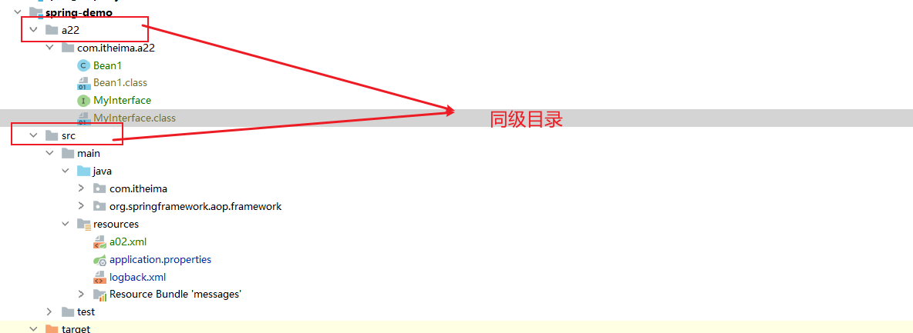

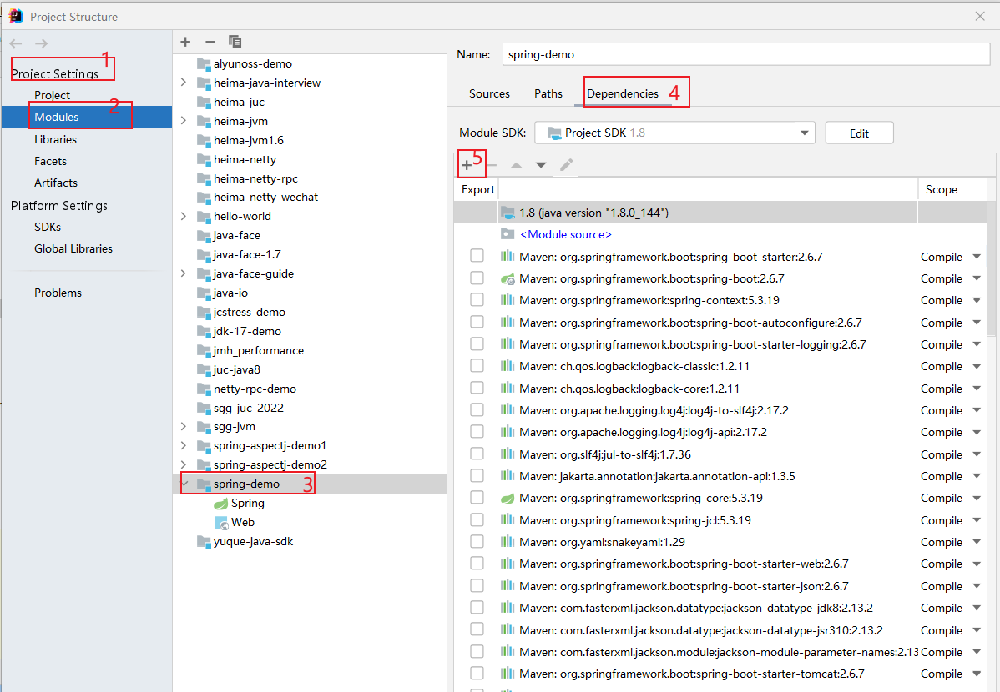

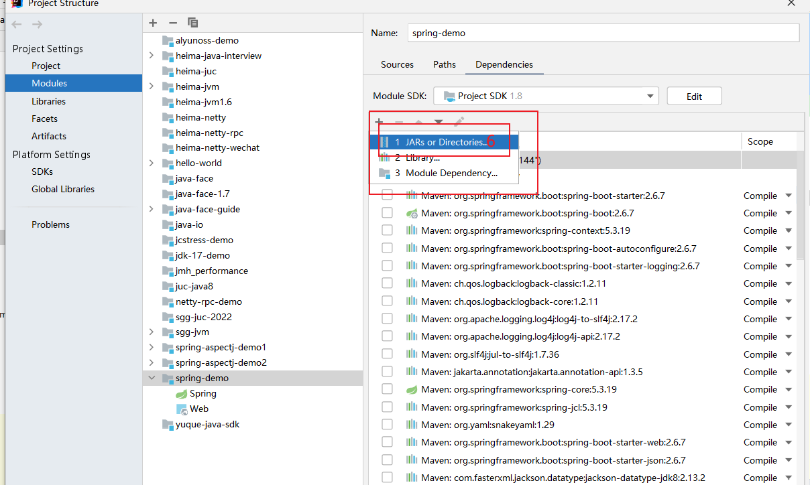

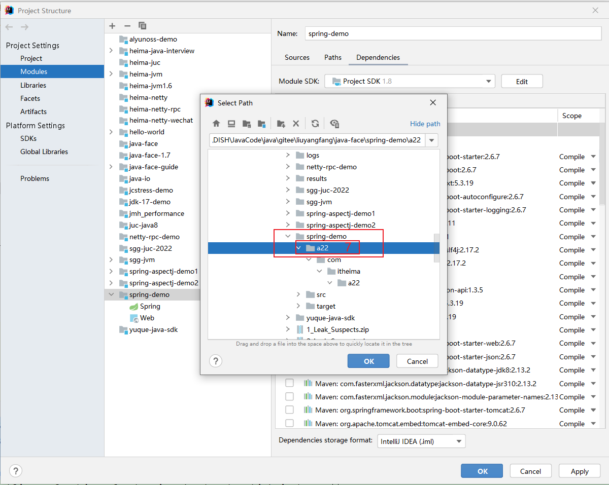

#### 2. 测试普通类

```java
package com.itheima.a22;


/**
 * @author lyf
 * @version 1.0
 * @classname Bean1
 * @description
 * @since 2022/12/10 16:40
 */
public class Bean1 {
    public Bean1() {}

    public void foo(String name, int age) {
    }
}

```


##### 2.1. 然后使用javac对其进行编译，然后我们再看反编译的字节码文件

```java
//
// Source code recreated from a .class file by IntelliJ IDEA
// (powered by FernFlower decompiler)
//

package com.itheima.a22;

public class Bean1 {
    public Bean1() {
    }

    public void foo(String var1, int var2) {
    }
}

```

###### 2.1.1. 再使用javap -c -v 查看反编译的字节码

```java
PS C:\DISH\JavaCode\java\gitee\liuyangfang\java-face\spring-demo\a22\com\itheima\a22> javap -c -v .\Bean1.class
Classfile /C:/DISH/JavaCode/java/gitee/liuyangfang/java-face/spring-demo/a22/com/itheima/a22/Bean1.class
  Last modified 2022-12-10; size 270 bytes
  MD5 checksum 726d4dbfeedfb919b4d338edc749c362
  Compiled from "Bean1.java"
public class com.itheima.a22.Bean1
  minor version: 0
  major version: 52
  flags: ACC_PUBLIC, ACC_SUPER
Constant pool:
   #1 = Methodref          #3.#12         // java/lang/Object."<init>":()V
   #2 = Class              #13            // com/itheima/a22/Bean1
   #3 = Class              #14            // java/lang/Object
   #4 = Utf8               <init>
   #5 = Utf8               ()V
   #6 = Utf8               Code
   #7 = Utf8               LineNumberTable
   #8 = Utf8               foo
   #9 = Utf8               (Ljava/lang/String;I)V
  #10 = Utf8               SourceFile
  #11 = Utf8               Bean1.java
  #12 = NameAndType        #4:#5          // "<init>":()V
  #13 = Utf8               com/itheima/a22/Bean1
  #14 = Utf8               java/lang/Object
{
  public com.itheima.a22.Bean1();
    descriptor: ()V
    flags: ACC_PUBLIC
    Code:
      stack=1, locals=1, args_size=1
         0: aload_0
         1: invokespecial #1                  // Method java/lang/Object."<init>":()V
         4: return
      LineNumberTable:
        line 12: 0

  public void foo(java.lang.String, int);
    descriptor: (Ljava/lang/String;I)V
    flags: ACC_PUBLIC
    Code:
      stack=0, locals=3, args_size=3
         0: return
      LineNumberTable:
        line 15: 0
}
SourceFile: "Bean1.java"

```


###### 1.1.2 结果

> 反编译后方法的参数名没有保留原始的名称

##### 2.2. 我们使用`javac -parameters`再次编译

###### 2.2.1. idea反编译字节码

```java
//
// Source code recreated from a .class file by IntelliJ IDEA
// (powered by FernFlower decompiler)
//

package com.itheima.a22;

public class Bean1 {
    public Bean1() {
    }

    public void foo(String name, int age) {
    }
}

```

###### 2.2.2. javap -c -v 反编译字节码

```java
PS C:\DISH\JavaCode\java\gitee\liuyangfang\java-face\spring-demo\a22\com\itheima\a22> javap -c -v .\Bean1.class
Classfile /C:/DISH/JavaCode/java/gitee/liuyangfang/java-face/spring-demo/a22/com/itheima/a22/Bean1.class
  Last modified 2022-12-10; size 317 bytes
  MD5 checksum d2fbcdf7e9e895e8d6084744442d57c3
  Compiled from "Bean1.java"
public class com.itheima.a22.Bean1
  minor version: 0
  major version: 52
  flags: ACC_PUBLIC, ACC_SUPER
Constant pool:
   #1 = Methodref          #3.#15         // java/lang/Object."<init>":()V
   #2 = Class              #16            // com/itheima/a22/Bean1
   #3 = Class              #17            // java/lang/Object
   #4 = Utf8               <init>
   #5 = Utf8               ()V
   #6 = Utf8               Code
   #7 = Utf8               LineNumberTable
   #8 = Utf8               foo
   #9 = Utf8               (Ljava/lang/String;I)V
  #10 = Utf8               MethodParameters
  #11 = Utf8               name
  #12 = Utf8               age
  #13 = Utf8               SourceFile
  #14 = Utf8               Bean1.java
  #15 = NameAndType        #4:#5          // "<init>":()V
  #16 = Utf8               com/itheima/a22/Bean1
  #17 = Utf8               java/lang/Object
{
  public com.itheima.a22.Bean1();
    descriptor: ()V
    flags: ACC_PUBLIC
    Code:
      stack=1, locals=1, args_size=1
         0: aload_0
         1: invokespecial #1                  // Method java/lang/Object."<init>":()V
         4: return
      LineNumberTable:
        line 12: 0

  public void foo(java.lang.String, int);
    descriptor: (Ljava/lang/String;I)V
    flags: ACC_PUBLIC
    Code:
      stack=0, locals=3, args_size=3
         0: return
      LineNumberTable:
        line 15: 0
    MethodParameters:
      Name                           Flags
      name
      age
}
SourceFile: "Bean1.java"

```


##### 2.3. 我们在编译时添加 -g 

###### 2.3.1 idea反编译字节码

```java
//
// Source code recreated from a .class file by IntelliJ IDEA
// (powered by FernFlower decompiler)
//

package com.itheima.a22;

public class Bean1 {
    public Bean1() {
    }

    public void foo(String name, int age) {
    }
}

```

###### 2.3.2 javap -c -v 反编译字节码

```java
PS C:\DISH\JavaCode\java\gitee\liuyangfang\java-face\spring-demo\a22\com\itheima\a22> javap -c -v .\Bean1.class
Classfile /C:/DISH/JavaCode/java/gitee/liuyangfang/java-face/spring-demo/a22/com/itheima/a22/Bean1.class
  Last modified 2022-12-10; size 418 bytes
  MD5 checksum dffc573cfd79c77f15f3774671abfe11
  Compiled from "Bean1.java"
public class com.itheima.a22.Bean1
  minor version: 0
  major version: 52
  flags: ACC_PUBLIC, ACC_SUPER
Constant pool:
   #1 = Methodref          #3.#19         // java/lang/Object."<init>":()V
   #2 = Class              #20            // com/itheima/a22/Bean1
   #3 = Class              #21            // java/lang/Object
   #4 = Utf8               <init>
   #5 = Utf8               ()V
   #6 = Utf8               Code
   #7 = Utf8               LineNumberTable
   #8 = Utf8               LocalVariableTable
   #9 = Utf8               this
  #10 = Utf8               Lcom/itheima/a22/Bean1;
  #11 = Utf8               foo
  #12 = Utf8               (Ljava/lang/String;I)V
  #13 = Utf8               name
  #14 = Utf8               Ljava/lang/String;
  #15 = Utf8               age
  #16 = Utf8               I
  #17 = Utf8               SourceFile
  #18 = Utf8               Bean1.java
  #19 = NameAndType        #4:#5          // "<init>":()V
  #20 = Utf8               com/itheima/a22/Bean1
  #21 = Utf8               java/lang/Object
{
  public com.itheima.a22.Bean1();
    descriptor: ()V
    flags: ACC_PUBLIC
    Code:
      stack=1, locals=1, args_size=1
         0: aload_0
         1: invokespecial #1                  // Method java/lang/Object."<init>":()V
         4: return
      LineNumberTable:
        line 12: 0
      LocalVariableTable:
        Start  Length  Slot  Name   Signature
            0       5     0  this   Lcom/itheima/a22/Bean1;

  public void foo(java.lang.String, int);
    descriptor: (Ljava/lang/String;I)V
    flags: ACC_PUBLIC
    Code:
      stack=0, locals=3, args_size=3
         0: return
      LineNumberTable:
        line 15: 0
      LocalVariableTable:
        Start  Length  Slot  Name   Signature
            0       1     0  this   Lcom/itheima/a22/Bean1;
            0       1     1  name   Ljava/lang/String;
            0       1     2   age   I
}
SourceFile: "Bean1.java"

```

#### 3. 编译接口

```java
package com.itheima.a22;

/**
 * @author lyf
 * @version 1.0
 * @classname MyInterface
 * @description
 * @date 2022/12/10 16:55
 */
public interface MyInterface {
    void foo(String name, int age);
}

```

##### 3.1 javac 直接编译

###### 3.1.1 idea反编译字节码

```java
//
// Source code recreated from a .class file by IntelliJ IDEA
// (powered by FernFlower decompiler)
//

package com.itheima.a22;

public interface MyInterface {
    void foo(String var1, int var2);
}

```

###### 3.1.2 javap -c -v 反编译字节码

```java
PS C:\DISH\JavaCode\java\gitee\liuyangfang\java-face\spring-demo\a22\com\itheima\a22> javap -c -v .\MyInterface.class
Classfile /C:/DISH/JavaCode/java/gitee/liuyangfang/java-face/spring-demo/a22/com/itheima/a22/MyInterface.class
  Last modified 2022-12-10; size 158 bytes
  MD5 checksum decc7ffc758783df7b9215f7029ebba5
  Compiled from "MyInterface.java"
public interface com.itheima.a22.MyInterface
  minor version: 0
  major version: 52
  flags: ACC_PUBLIC, ACC_INTERFACE, ACC_ABSTRACT
Constant pool:
  #1 = Class              #7              // com/itheima/a22/MyInterface
  #2 = Class              #8              // java/lang/Object
  #3 = Utf8               foo
  #4 = Utf8               (Ljava/lang/String;I)V
  #5 = Utf8               SourceFile
  #6 = Utf8               MyInterface.java
  #7 = Utf8               com/itheima/a22/MyInterface
  #8 = Utf8               java/lang/Object
{
  public abstract void foo(java.lang.String, int);
    descriptor: (Ljava/lang/String;I)V
    flags: ACC_PUBLIC, ACC_ABSTRACT
}
SourceFile: "MyInterface.java"

```

##### 3.2 javac -parameters 编译

###### 3.2.1 idea 反编译字节码

```java
//
// Source code recreated from a .class file by IntelliJ IDEA
// (powered by FernFlower decompiler)
//

package com.itheima.a22;

public interface MyInterface {
    void foo(String name, int age);
}

```


###### 3.2.2 javap -c -v 反编译字节码

```java
PS C:\DISH\JavaCode\java\gitee\liuyangfang\java-face\spring-demo\a22\com\itheima\a22> javap -c -v .\MyInterface.class
Classfile /C:/DISH/JavaCode/java/gitee/liuyangfang/java-face/spring-demo/a22/com/itheima/a22/MyInterface.class
  Last modified 2022-12-10; size 205 bytes
  MD5 checksum 43690d4fb1734e71f3ae7576731a8c30
  Compiled from "MyInterface.java"
public interface com.itheima.a22.MyInterface
  minor version: 0
  major version: 52
  flags: ACC_PUBLIC, ACC_INTERFACE, ACC_ABSTRACT
Constant pool:
   #1 = Class              #10            // com/itheima/a22/MyInterface
   #2 = Class              #11            // java/lang/Object
   #3 = Utf8               foo
   #4 = Utf8               (Ljava/lang/String;I)V
   #5 = Utf8               MethodParameters
   #6 = Utf8               name
   #7 = Utf8               age
   #8 = Utf8               SourceFile
   #9 = Utf8               MyInterface.java
  #10 = Utf8               com/itheima/a22/MyInterface
  #11 = Utf8               java/lang/Object
{
  public abstract void foo(java.lang.String, int);
    descriptor: (Ljava/lang/String;I)V
    flags: ACC_PUBLIC, ACC_ABSTRACT
    MethodParameters:
      Name                           Flags
      name
      age
}
SourceFile: "MyInterface.java"

```

##### 3.3 javac -g 编译

###### 3.3.1 idea反编译字节码

```java
//
// Source code recreated from a .class file by IntelliJ IDEA
// (powered by FernFlower decompiler)
//

package com.itheima.a22;

public interface MyInterface {
    void foo(String var1, int var2);
}

```

###### 3.3.2 javap -c -v 反编译字节码

```java
PS C:\DISH\JavaCode\java\gitee\liuyangfang\java-face\spring-demo\a22\com\itheima\a22> javap -c -v .\MyInterface.class
Classfile /C:/DISH/JavaCode/java/gitee/liuyangfang/java-face/spring-demo/a22/com/itheima/a22/MyInterface.class
  Last modified 2022-12-10; size 158 bytes
  MD5 checksum decc7ffc758783df7b9215f7029ebba5
  Compiled from "MyInterface.java"
public interface com.itheima.a22.MyInterface
  minor version: 0
  major version: 52
  flags: ACC_PUBLIC, ACC_INTERFACE, ACC_ABSTRACT
Constant pool:
  #1 = Class              #7              // com/itheima/a22/MyInterface
  #2 = Class              #8              // java/lang/Object
  #3 = Utf8               foo
  #4 = Utf8               (Ljava/lang/String;I)V
  #5 = Utf8               SourceFile
  #6 = Utf8               MyInterface.java
  #7 = Utf8               com/itheima/a22/MyInterface
  #8 = Utf8               java/lang/Object
{
  public abstract void foo(java.lang.String, int);
    descriptor: (Ljava/lang/String;I)V
    flags: ACC_PUBLIC, ACC_ABSTRACT
}
SourceFile: "MyInterface.java"

```

#### 4. 代码测试

##### 4.1. 测试普通类

```java
package com.itheima.a22;

import com.itheima.a08.sub.E;
import lombok.extern.slf4j.Slf4j;
import org.springframework.core.LocalVariableTableParameterNameDiscoverer;

import java.lang.reflect.Method;
import java.lang.reflect.Parameter;

/**
 * @author lyf
 * @version 1.0
 * @classname TestParameters
 * @description 获取方法的参数名称
 * <p>
 * 目标: 如何获取方法参数名, 注意把 a22 目录添加至模块的类路径
 * 1. a22 不在 src 是避免 idea 自动编译它下面的类
 * 2. spring boot 在编译时会加 -parameters
 * 3. 大部分 IDE 编译时都会加 -g
 * @since 2022/12/10 17:14
 */
@Slf4j
public class TestParameters {
    public static void main(String[] args) throws Exception {
        printParameters(Bean1.class.getMethod("foo", String.class, int.class));
    }

    private static void printParameters(Method method) throws ClassNotFoundException, NoSuchMethodException {
        // 1 通过反射来获取方法参数名
        System.out.println("<<<<<<<<<<<<<<<<<<<<<<<<<<反射获取开始<<<<<<<<<<<<<<<<<<<<<<<<<<<");

        Parameter[] parameters = method.getParameters();
        if (parameters != null && parameters.length > 0) {
            for (Parameter parameter : parameters) {
                System.out.println(parameter.getName());
            }
        }
        System.out.println("<<<<<<<<<<<<<<<<<<<<<<<<<<反射获取结束<<<<<<<<<<<<<<<<<<<<<<<<<<<\n\n\n");

        // 2 通过本地变量表 LocalVariableTable
        LocalVariableTableParameterNameDiscoverer discoverer = new LocalVariableTableParameterNameDiscoverer();
        System.out.println("<<<<<<<<<<<<<<<<<<<<<<<<<<通过本地变量表 LocalVariableTable开始<<<<<<<<<<<<<<<<<<<<<<<<<<<");
        String[] parameterNames = discoverer.getParameterNames(method);
        if (parameterNames != null && parameterNames.length > 0) {
            for (String parameterName : parameterNames) {
                System.out.println(parameterName);
            }
        }
        System.out.println("<<<<<<<<<<<<<<<<<<<<<<<<<<通过本地变量表 LocalVariableTable结束<<<<<<<<<<<<<<<<<<<<<<<<<<<");
    }
            
    	/*
            学到了什么
                a. 如果编译时添加了 -parameters 可以生成参数表, 反射时就可以拿到参数名
                b. 如果编译时添加了 -g 可以生成调试信息, 但分为两种情况
                    1. 普通类, 会包含局部变量表, 用 asm 可以拿到参数名
                    2. 接口, 不会包含局部变量表, 无法获得参数名 (这也是 MyBatis 在实现 Mapper 接口时为何要提供 @Param 注解来辅助获得参数名)
         */

}

```

###### 4.1.1 普通javac

```verilog
<<<<<<<<<<<<<<<<<<<<<<<<<<反射获取开始<<<<<<<<<<<<<<<<<<<<<<<<<<<
arg0
arg1
<<<<<<<<<<<<<<<<<<<<<<<<<<反射获取结束<<<<<<<<<<<<<<<<<<<<<<<<<<<


<<<<<<<<<<<<<<<<<<<<<<<<<<通过本地变量表 LocalVariableTable开始<<<<<<<<<<<<<<<<<<<<<<<<<<<
<<<<<<<<<<<<<<<<<<<<<<<<<<通过本地变量表 LocalVariableTable结束<<<<<<<<<<<<<<<<<<<<<<<<<<<
```


###### 4.1.2 javac -parameters

```verilog
<<<<<<<<<<<<<<<<<<<<<<<<<<反射获取开始<<<<<<<<<<<<<<<<<<<<<<<<<<<
name
age
<<<<<<<<<<<<<<<<<<<<<<<<<<反射获取结束<<<<<<<<<<<<<<<<<<<<<<<<<<<


<<<<<<<<<<<<<<<<<<<<<<<<<<通过本地变量表 LocalVariableTable开始<<<<<<<<<<<<<<<<<<<<<<<<<<<
<<<<<<<<<<<<<<<<<<<<<<<<<<通过本地变量表 LocalVariableTable结束<<<<<<<<<<<<<<<<<<<<<<<<<<<
```


###### 4.1.3 javac -g

```java
<<<<<<<<<<<<<<<<<<<<<<<<<<反射获取开始<<<<<<<<<<<<<<<<<<<<<<<<<<<
arg0
arg1
<<<<<<<<<<<<<<<<<<<<<<<<<<反射获取结束<<<<<<<<<<<<<<<<<<<<<<<<<<<


<<<<<<<<<<<<<<<<<<<<<<<<<<通过本地变量表 LocalVariableTable开始<<<<<<<<<<<<<<<<<<<<<<<<<<<
name
age
<<<<<<<<<<<<<<<<<<<<<<<<<<通过本地变量表 LocalVariableTable结束<<<<<<<<<<<<<<<<<<<<<<<<<<<
```

##### 4.2 测试接口

```java
    public static void main(String[] args) throws Exception {
        printParameters(MyInterface.class.getMethod("foo", String.class, int.class));
    }
```

###### 4.2.1 javac

```verilog
<<<<<<<<<<<<<<<<<<<<<<<<<<反射获取开始<<<<<<<<<<<<<<<<<<<<<<<<<<<
arg0
arg1
<<<<<<<<<<<<<<<<<<<<<<<<<<反射获取结束<<<<<<<<<<<<<<<<<<<<<<<<<<<


<<<<<<<<<<<<<<<<<<<<<<<<<<通过本地变量表 LocalVariableTable开始<<<<<<<<<<<<<<<<<<<<<<<<<<<
<<<<<<<<<<<<<<<<<<<<<<<<<<通过本地变量表 LocalVariableTable结束<<<<<<<<<<<<<<<<<<<<<<<<<<<
```


###### 4.2.2 javac -parameters

```verilog
<<<<<<<<<<<<<<<<<<<<<<<<<<反射获取开始<<<<<<<<<<<<<<<<<<<<<<<<<<<
name
age
<<<<<<<<<<<<<<<<<<<<<<<<<<反射获取结束<<<<<<<<<<<<<<<<<<<<<<<<<<<


<<<<<<<<<<<<<<<<<<<<<<<<<<通过本地变量表 LocalVariableTable开始<<<<<<<<<<<<<<<<<<<<<<<<<<<
<<<<<<<<<<<<<<<<<<<<<<<<<<通过本地变量表 LocalVariableTable结束<<<<<<<<<<<<<<<<<<<<<<<<<<<
```


###### 4.2.3 javac -g

```verilog
<<<<<<<<<<<<<<<<<<<<<<<<<<反射获取开始<<<<<<<<<<<<<<<<<<<<<<<<<<<
arg0
arg1
<<<<<<<<<<<<<<<<<<<<<<<<<<反射获取结束<<<<<<<<<<<<<<<<<<<<<<<<<<<


<<<<<<<<<<<<<<<<<<<<<<<<<<通过本地变量表 LocalVariableTable开始<<<<<<<<<<<<<<<<<<<<<<<<<<<
<<<<<<<<<<<<<<<<<<<<<<<<<<通过本地变量表 LocalVariableTable结束<<<<<<<<<<<<<<<<<<<<<<<<<<<
```


### 22.1.2 收获💡

1. 如果编译时添加了 -parameters 可以生成参数表, 反射时就可以拿到参数名
2. 如果编译时添加了 -g 可以生成调试信息, 但分为两种情况
   * 普通类, 会包含局部变量表, 用 asm 可以拿到参数名
   * 接口, 不会包含局部变量表, 无法获得参数名
     * 这也是 MyBatis 在实现 Mapper 接口时为何要提供 @Param 注解来辅助获得参数名


# 23 对象绑定与类型转换

## 23.1 底层第一套转换接口与实现（Spring实现）

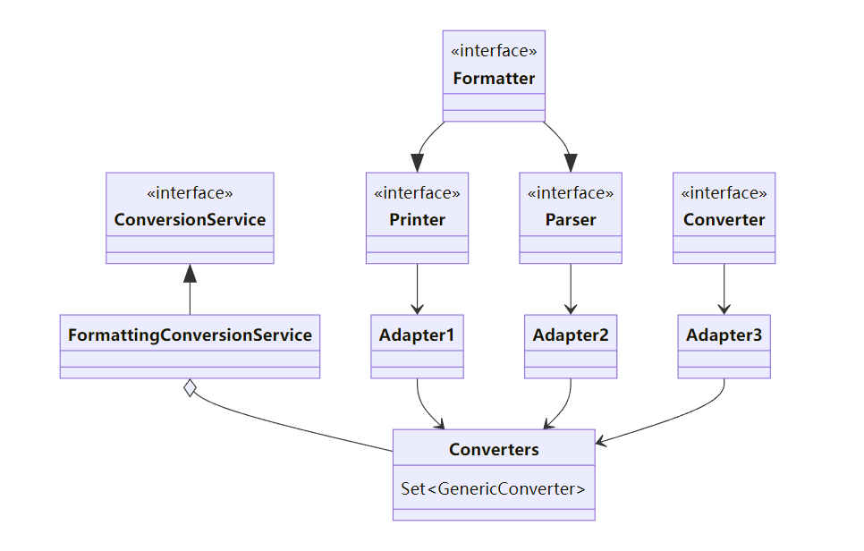

* Printer 把其它类型转为 String
* Parser 把 String 转为其它类型
* Formatter 综合 Printer 与 Parser 功能
* Converter 把类型 S 转为类型 T
* Printer、Parser、Converter 经过适配转换成 GenericConverter 放入 Converters 集合
* FormattingConversionService 利用其它们实现转换


## 23.2 底层第二套转换接口（JDK实现）

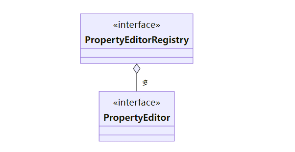

* PropertyEditor 把 String 与其它类型相互转换
* PropertyEditorRegistry 可以注册多个 PropertyEditor 对象
* 与第一套接口直接可以通过 FormatterPropertyEditorAdapter 来进行适配


## 23.3 高层接口与实现

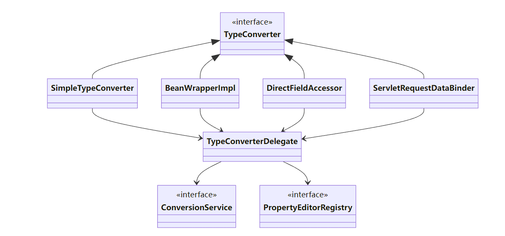

* 它们都实现了 TypeConverter 这个高层转换接口，在转换时，会用到 TypeConverterDelegate 委派ConversionService 与 PropertyEditorRegistry 真正执行转换（Facade 门面模式）
  * 首先看是否有自定义转换器, @InitBinder 添加的即属于这种 (用了适配器模式把 Formatter 转为需要的 PropertyEditor)
  * 再看有没有 ConversionService 转换
  * 再利用默认的 PropertyEditor 转换
  * 最后有一些特殊处理
* SimpleTypeConverter 仅做类型转换
* BeanWrapperImpl 为 bean 的属性赋值，当需要时做类型转换，走 Property
* DirectFieldAccessor 为 bean 的属性赋值，当需要时做类型转换，走 Field
* ServletRequestDataBinder 为 bean 的属性执行绑定，当需要时做类型转换，根据 directFieldAccess 选择走 Property 还是 Field，具备校验与获取校验结果功能


## 23.4 演示1 - 类型转换与数据绑定

### 23.4.1 代码参考

#### 1 SimpleTypeConverter（简单类型转换）

```java
package com.itheima.a23;

import lombok.extern.slf4j.Slf4j;
import org.springframework.beans.SimpleTypeConverter;

import java.util.Date;

/**
 * @author lyf
 * @version 1.0
 * @classname TestSimpleConverter
 * @description SimpleTypeConverter 仅做类型转换
 * @since 2022/12/11 11:20
 */
@Slf4j
public class TestSimpleConverter {
    public static void main(String[] args) {
        SimpleTypeConverter typeConverter = new SimpleTypeConverter();
        Integer result1 = typeConverter.convertIfNecessary("123", int.class);
        log.debug("result1: {}", result1);

        Date date = typeConverter.convertIfNecessary("1993/04/15", Date.class);
        log.debug("date: {}", date);
    }
}

```

##### 1.1 测试结果

```verilog
[DEBUG] 11:28:14.861 [main] com.itheima.a23.TestSimpleConverter - result1: 123 
[DEBUG] 11:28:14.986 [main] com.itheima.a23.TestSimpleConverter - date: Thu Apr 15 00:00:00 CST 1993 

```

#### 2 BeanWrapperImpl 为 bean 的属性赋值，当需要时做类型转换，走 Property (getter setter)

```java
package com.itheima.a22;

import lombok.Data;
import lombok.extern.slf4j.Slf4j;
import org.springframework.beans.BeanWrapperImpl;

import java.util.Date;

/**
 * @author lyf
 * @version 1.0
 * @classname TestBeanWrapper
 * @description  BeanWrapperImpl 为 bean 的属性赋值，当需要时做类型转换，走 Property (getter setter)
 * @since 2022/12/11 11:32
 */
@Slf4j
public class TestBeanWrapper {
    public static void main(String[] args) {
        MyBean target = new MyBean();
        BeanWrapperImpl beanWrapper = new BeanWrapperImpl(target);
        beanWrapper.setPropertyValue("age", 18);
        beanWrapper.setPropertyValue("name", "zhangsan");
        beanWrapper.setPropertyValue("birthday", "1993/04/15");
        log.debug("target: {}", target);
    }

    @Data
    static class MyBean {
        private int age;
        private String name;
        private Date birthday;
    }
}

```

##### 2.1 测试结果

```verilog
[DEBUG] 11:35:52.350 [main] com.itheima.a22.TestBeanWrapper     - target: TestBeanWrapper.MyBean(age=18, name=zhangsan, birthday=Thu Apr 15 00:00:00 CST 1993) 

```


#### 3 DirectFieldAccessor 为 bean 的属性赋值，当需要时做类型转换，走 Field (反射直接获取Field)

```java
package com.itheima.a22;

import lombok.ToString;
import lombok.extern.slf4j.Slf4j;
import org.springframework.beans.DirectFieldAccessor;

import java.util.Date;

/**
 * @author lyf
 * @version 1.0
 * @classname TestDirectFieldAccessor
 * @description 为 bean 的属性赋值，当需要时做类型转换，走 Field (反射直接获取Field)
 * @since 2022/12/11 11:36
 */
@Slf4j
public class TestDirectFieldAccessor {
    public static void main(String[] args) {
        MyBean target = new MyBean();
        DirectFieldAccessor directFieldAccessor = new DirectFieldAccessor(target);
        directFieldAccessor.setPropertyValue("age", 18);
        directFieldAccessor.setPropertyValue("name", "lisi");
        directFieldAccessor.setPropertyValue("birthday", "2022/12/11");

        log.debug("target: {}", target);
    }

    @ToString
    static class MyBean {
        private int age;
        private String name;
        private Date birthday;
    }
}

```

##### 3.1 测试结果

```verilog
[DEBUG] 11:54:22.706 [main] c.i.a22.TestDirectFieldAccessor     - target: TestDirectFieldAccessor.MyBean(age=18, name=lisi, birthday=Sun Dec 11 00:00:00 CST 2022) 

```


#### 4 ServletRequestDataBinder 为 bean 的属性执行绑定，当需要时做类型转换，根据 directFieldAccess 选择走 Property 还是 Field，具备校验与获取校验结果功能

```java
package com.itheima.a22;

import lombok.Getter;
import lombok.Setter;
import lombok.ToString;
import lombok.extern.slf4j.Slf4j;
import org.springframework.beans.MutablePropertyValues;
import org.springframework.validation.DataBinder;

import java.util.Date;

/**
 * @author lyf
 * @version 1.0
 * @classname TestDataBinder
 * @description ServletRequestDataBinder 为 bean 的属性执行绑定，当需要时做类型转换，
 * 根据 directFieldAccess 选择走 Property 还是 Field，具备校验与获取校验结果功能
 * @since 2022/12/11 11:55
 */
@Slf4j
public class TestDataBinder {
    public static void main(String[] args) {
        System.out.println(">>>>>>>>>>>>>>>>>>>>>>>>默认为Property start>>>>>>>>>>>>>>>>>>>>>");
        MyBean1 target1 = new MyBean1();
        DataBinder dataBinder = new DataBinder(target1);
        MutablePropertyValues propertyValues = new MutablePropertyValues();
        propertyValues.add("age", 18);
        propertyValues.add("name", "lisi");
        propertyValues.add("birthday", "2022/12/11");

        dataBinder.bind(propertyValues);
        log.debug("target1: {}", target1);
        System.out.println(">>>>>>>>>>>>>>>>>>>>>>>>默认为Property end>>>>>>>>>>>>>>>>>>>>>");

        System.out.println(">>>>>>>>>>>>>>>>>>>>>>>>>>>>>>>>>>>>>>>>>>>>>");
        System.out.println(">>>>>>>>>>>>>>>>>>>>>>设置为 Field start>>>>>>>>>>>>>>>>>>>>>>>");
        MyBean2 target2 = new MyBean2();
        DataBinder dataBinder2 = new DataBinder(target2);
        dataBinder2.initDirectFieldAccess();
        dataBinder2.bind(propertyValues);
        log.debug("target2: {}", target2);
        System.out.println(">>>>>>>>>>>>>>>>>>>>>>设置为 Field end>>>>>>>>>>>>>>>>>>>>>>>");
    }

    @ToString
    @Getter
    @Setter
    static class MyBean1 {
        private int age;
        private String name;
        private Date birthday;
    }

    @ToString
    static class MyBean2 {
        private int age;
        private String name;
        private Date birthday;
    }
}

```

###### 4.1 测试结果

```verilog
>>>>>>>>>>>>>>>>>>>>>>>>默认为Property start>>>>>>>>>>>>>>>>>>>>>
[DEBUG] 12:03:39.563 [main] com.itheima.a22.TestDataBinder      - target1: TestDataBinder.MyBean1(age=18, name=lisi, birthday=Sun Dec 11 00:00:00 CST 2022) 
>>>>>>>>>>>>>>>>>>>>>>>>默认为Property end>>>>>>>>>>>>>>>>>>>>>
>>>>>>>>>>>>>>>>>>>>>>>>>>>>>>>>>>>>>>>>>>>>>
>>>>>>>>>>>>>>>>>>>>>>设置为 Field start>>>>>>>>>>>>>>>>>>>>>>>
[DEBUG] 12:03:39.578 [main] com.itheima.a22.TestDataBinder      - target2: TestDataBinder.MyBean2(age=18, name=lisi, birthday=Sun Dec 11 00:00:00 CST 2022) 
>>>>>>>>>>>>>>>>>>>>>>设置为 Field end>>>>>>>>>>>>>>>>>>>>>>>

```

> 两者的主要区别是有无getset方法
>
> 走默认的Property 需要属性提供getter 和 setter方法
>
> 而走Field 则无需getter 和 setter方法而是直接访问Field

#### 5 Web环境下的DataBinder

```java
package com.itheima.a22;

import lombok.Data;
import lombok.extern.slf4j.Slf4j;
import org.springframework.mock.web.MockHttpServletRequest;
import org.springframework.web.bind.ServletRequestDataBinder;
import org.springframework.web.bind.ServletRequestParameterPropertyValues;

import javax.servlet.ServletRequestWrapper;
import java.util.Date;

/**
 * @author lyf
 * @version 1.0
 * @classname TestServletDataBinder
 * @description 测试Web环境下的数据绑定
 * @since 2022/12/11 12:45
 */
@Slf4j
public class TestServletDataBinder {
    public static void main(String[] args) {
        Target1 target1 = new Target1();
        // web 环境下数据绑定
        ServletRequestDataBinder dataBinder = new ServletRequestDataBinder(target1);
        MockHttpServletRequest httpServletRequest = new MockHttpServletRequest();
        httpServletRequest.setParameter("age", "18");
        httpServletRequest.setParameter("name", "张三");
        httpServletRequest.setParameter("birthday", "1999/12/12");

        ServletRequestParameterPropertyValues propertyValues = new ServletRequestParameterPropertyValues(new ServletRequestWrapper(httpServletRequest));
        dataBinder.bind(propertyValues);

        log.debug("{}", target1);
    }

    @Data
    static class Target1 {
        private int age;
        private String name;
        private Date birthday;
    }
}

```

##### 5.1 测试结果

```verilog
[DEBUG] 12:50:51.542 [main] c.itheima.a22.TestServletDataBinder - TestServletDataBinder.Target1(age=18, name=张三, birthday=Sun Dec 12 00:00:00 CST 1999) 

```

### 23.4.2 收获💡

基本的类型转换与数据绑定用法

* SimpleTypeConverter
* BeanWrapperImpl
* DirectFieldAccessor
* ServletRequestDataBinder


## 23.5 演示2 - 数据绑定工厂

### 23.5.1 代码参考

#### 1 准备代码

##### 1.1 User

```java
package com.itheima.a22.factory.pojo;

import com.itheima.a22.factory.pojo.Address;
import lombok.Data;
import lombok.extern.slf4j.Slf4j;

import java.util.Date;

/**
 * @author lyf
 * @version 1.0
 * @classname User
 * @description
 * @since 2022/12/11 14:50
 */
@Slf4j
@Data
public class User {
    private Date birthday;
    private Address address;
}

```

##### 1.2 Address

```java
package com.itheima.a22.factory.pojo;

import lombok.Data;
import lombok.extern.slf4j.Slf4j;

/**
 * @author lyf
 * @version 1.0
 * @classname Address
 * @description
 * @since 2022/12/11 14:51
 */
@Slf4j
@Data
public class Address {
    private String name;
}

```


#### 2 原始工厂

##### 2.1 测试代码

```java
package com.itheima.a22.factory.test;

import com.itheima.a22.factory.pojo.User;
import lombok.extern.slf4j.Slf4j;
import org.springframework.mock.web.MockHttpServletRequest;
import org.springframework.web.bind.ServletRequestParameterPropertyValues;
import org.springframework.web.bind.WebDataBinder;
import org.springframework.web.context.request.ServletWebRequest;
import org.springframework.web.servlet.mvc.method.annotation.ServletRequestDataBinderFactory;

/**
 * @author lyf
 * @version 1.0
 * @classname TestServletDataBinderFactoryV1
 * @description 原始工厂
 * @since 2022/12/11 14:52
 */
@Slf4j
public class TestServletDataBinderFactoryV1 {
    public static void main(String[] args) throws Exception {
        // 1 准备请求对象
        MockHttpServletRequest request = new MockHttpServletRequest();
        request.setParameter("birthday", "2009|09|01");
        request.setParameter("address.name", "江西");
        // 2 准备目标对象
        User target = new User();
        // 3 将请求对象封装成ServletRequestParameterPropertyValues
        ServletRequestParameterPropertyValues propertyValues = new ServletRequestParameterPropertyValues(request);
        // 4 创建原始工厂，未添加任何方法和初始化器
        ServletRequestDataBinderFactory factory = new ServletRequestDataBinderFactory(null, null);
        // 5 创建绑定器对象
        WebDataBinder webDataBinder = factory.createBinder(new ServletWebRequest(request), target, "user");
        // 6 将PropertyValues与数据绑定器对象进行绑定
        webDataBinder.bind(propertyValues);
        // 7 处理结果
        log.debug("target: {}", target);
    }
}

```

##### 2.2 测试结果

```verilog
[DEBUG] 15:02:28.729 [main] c.i.a.f.TestServletDataBinderFactoryV1 - target: User(birthday=null, address=Address(name=江西)) 
```

> 不能解析特殊的时间格式，
>
> 但是能解析嵌套对象的属性


#### 3 使用 @InitBinder

##### 3.1 MyDateBinder

```java
package com.itheima.a22.factory.binder;

import com.itheima.a22.factory.format.CustomDateFormatter;
import lombok.extern.slf4j.Slf4j;
import org.springframework.web.bind.WebDataBinder;
import org.springframework.web.bind.annotation.InitBinder;

/**
 * @author lyf
 * @version 1.0
 * @classname MyDateBinder
 * @description
 * @since 2022/12/11 15:11
 */
@Slf4j
public class MyDateBinder {
    @InitBinder
    public void dateResolver(WebDataBinder webDataBinder) {
        // 添加自定义的日期解析器
        webDataBinder.addCustomFormatter(new CustomDateFormatter("yyyy|MM|dd", "使用@InitBinder进行解析"));
    }
}

```

##### 3.2 CustomDateFormatter

```java
package com.itheima.a22.factory.format;

import lombok.extern.slf4j.Slf4j;
import org.springframework.format.Formatter;

import java.text.ParseException;
import java.text.SimpleDateFormat;
import java.util.Date;
import java.util.Locale;

/**
 * @author lyf
 * @version 1.0
 * @classname CustomDateFormatter
 * @description 自定义的日期类型解析器
 * @since 2022/12/11 15:05
 */
@Slf4j
public class CustomDateFormatter implements Formatter<Date> {
    /**
     * 日期解析格式，构造时传入
     */
    private String pattern;

    /**
     * 调试信息，构造时传入
     */
    private String descInfo;

    public CustomDateFormatter(String pattern, String descInfo) {
        this.pattern = pattern;
        this.descInfo = descInfo;
    }

    @Override
    public Date parse(String text, Locale locale) throws ParseException {
        log.debug("parse enter..., {}", descInfo);
        SimpleDateFormat simpleDateFormat = new SimpleDateFormat(pattern);
        return simpleDateFormat.parse(text);
    }

    @Override
    public String print(Date object, Locale locale) {
        SimpleDateFormat simpleDateFormat = new SimpleDateFormat(pattern);
        return simpleDateFormat.format(object);
    }
}

```

##### 3.3 测试代码

```java
package com.itheima.a22.factory.test;

import com.itheima.a22.factory.binder.MyDateBinder;
import com.itheima.a22.factory.pojo.User;
import lombok.extern.slf4j.Slf4j;
import org.springframework.mock.web.MockHttpServletRequest;
import org.springframework.web.bind.ServletRequestParameterPropertyValues;
import org.springframework.web.bind.WebDataBinder;
import org.springframework.web.context.request.ServletWebRequest;
import org.springframework.web.method.support.InvocableHandlerMethod;
import org.springframework.web.servlet.mvc.method.annotation.ServletRequestDataBinderFactory;

import java.util.Collections;

/**
 * @author lyf
 * @version 1.0
 * @classname TestServletDataBinderFactoryV2
 * @description 使用 @InitBinder对象
 * @since 2022/12/11 15:03
 */
@Slf4j
public class TestServletDataBinderFactoryV2 {
    public static void main(String[] args) throws Exception {
        // 1 准备请求对象
        MockHttpServletRequest request = new MockHttpServletRequest();
        request.setParameter("birthday", "2009|09|01");
        request.setParameter("address.name", "江西");
        // 2 准备目标对象
        User target = new User();
        // 3 将请求对象封装成ServletRequestParameterPropertyValues
        ServletRequestParameterPropertyValues propertyValues = new ServletRequestParameterPropertyValues(request);

        // 3.1 封装binderMethod
        InvocableHandlerMethod method = new InvocableHandlerMethod(
                new MyDateBinder(), MyDateBinder.class.getMethod("dateResolver", WebDataBinder.class));
        // 4 创建原始工厂，添加@InitBinder标注的方法
        ServletRequestDataBinderFactory factory
                = new ServletRequestDataBinderFactory(Collections.singletonList(method), null);
        // 5 创建绑定器对象
        WebDataBinder webDataBinder = factory.createBinder(new ServletWebRequest(request), target, "user");
        // 6 将PropertyValues与数据绑定器对象进行绑定
        webDataBinder.bind(propertyValues);
        // 7 处理结果
        log.debug("target: {}", target);
    }
}

```

##### 3.4 测试结果

```verilog
[DEBUG] 15:20:23.950 [main] c.i.a.f.format.CustomDateFormatter  - parse enter..., 使用@InitBinder进行解析 
[DEBUG] 15:20:23.960 [main] c.i.a.f.TestServletDataBinderFactoryV2 - target: User(birthday=Tue Sep 01 00:00:00 CST 2009, address=Address(name=江西)) 
```

#### 4 使用ConvertService

##### 4.1 测试代码

```java
package com.itheima.a22.factory.test;

import com.itheima.a22.factory.format.CustomDateFormatter;
import com.itheima.a22.factory.pojo.User;
import lombok.extern.slf4j.Slf4j;
import org.springframework.format.support.FormattingConversionService;
import org.springframework.mock.web.MockHttpServletRequest;
import org.springframework.web.bind.ServletRequestParameterPropertyValues;
import org.springframework.web.bind.WebDataBinder;
import org.springframework.web.bind.support.ConfigurableWebBindingInitializer;
import org.springframework.web.context.request.ServletWebRequest;
import org.springframework.web.servlet.mvc.method.annotation.ServletRequestDataBinderFactory;

/**
 * @author lyf
 * @version 1.0
 * @classname TestServletDataBinderFactoryV3
 * @description 使用ConversionService
 * @since 2022/12/11 14:52
 */
@Slf4j
public class TestServletDataBinderFactoryV3 {
    public static void main(String[] args) throws Exception {
        // 1 准备请求对象
        MockHttpServletRequest request = new MockHttpServletRequest();
        request.setParameter("birthday", "2009|09|01");
        request.setParameter("address.name", "江西");
        // 2 准备目标对象
        User target = new User();
        // 3 将请求对象封装成ServletRequestParameterPropertyValues
        ServletRequestParameterPropertyValues propertyValues = new ServletRequestParameterPropertyValues(request);

        // 3.1 构建一个ConversionService
        FormattingConversionService conversionService = new FormattingConversionService();
        // 3.2 核心步骤
        conversionService.addFormatter(new CustomDateFormatter("yyyy|MM|dd", "使用ConversionService进行解析"));
        // 3.3 准备WebBindingInitializer
        ConfigurableWebBindingInitializer initializer = new ConfigurableWebBindingInitializer();
        initializer.setConversionService(conversionService);

        // 4 创建原始工厂，添加初始化器
        ServletRequestDataBinderFactory factory = new ServletRequestDataBinderFactory(null, initializer);
        // 5 创建绑定器对象
        WebDataBinder webDataBinder = factory.createBinder(new ServletWebRequest(request), target, "user");
        // 6 将PropertyValues与数据绑定器对象进行绑定
        webDataBinder.bind(propertyValues);
        // 7 处理结果
        log.debug("target: {}", target);
    }
}

```

##### 4.2 测试结果

```verilog
[DEBUG] 15:28:09.980 [main] c.i.a.f.format.CustomDateFormatter  - parse enter..., 使用ConversionService进行解析 
[DEBUG] 15:28:09.991 [main] c.i.a.f.t.TestServletDataBinderFactoryV3 - target: User(birthday=Tue Sep 01 00:00:00 CST 2009, address=Address(name=江西)) 

```

#### 5 使用@InitBinder和ConvertService

##### 5.1 测试代码

```java
package com.itheima.a22.factory.test;

import com.itheima.a22.factory.binder.MyDateBinder;
import com.itheima.a22.factory.format.CustomDateFormatter;
import com.itheima.a22.factory.pojo.User;
import lombok.extern.slf4j.Slf4j;
import org.springframework.format.support.FormattingConversionService;
import org.springframework.mock.web.MockHttpServletRequest;
import org.springframework.web.bind.ServletRequestParameterPropertyValues;
import org.springframework.web.bind.WebDataBinder;
import org.springframework.web.bind.support.ConfigurableWebBindingInitializer;
import org.springframework.web.context.request.ServletWebRequest;
import org.springframework.web.method.support.InvocableHandlerMethod;
import org.springframework.web.servlet.mvc.method.annotation.ServletRequestDataBinderFactory;

import java.util.Collections;

/**
 * @author lyf
 * @version 1.0
 * @classname TestServletDataBinderFactoryV4
 * @description 使用@InitBinder和ConvertService
 * @since 2022/12/11 14:52
 */
@Slf4j
public class TestServletDataBinderFactoryV4 {
    public static void main(String[] args) throws Exception {
        // 1 准备请求对象
        MockHttpServletRequest request = new MockHttpServletRequest();
        request.setParameter("birthday", "2009|09|01");
        request.setParameter("address.name", "江西");
        // 2 准备目标对象
        User target = new User();
        // 3 将请求对象封装成ServletRequestParameterPropertyValues
        ServletRequestParameterPropertyValues propertyValues = new ServletRequestParameterPropertyValues(request);

        // 3.1 构建@InitBinder
        InvocableHandlerMethod method = new InvocableHandlerMethod(
                new MyDateBinder(), MyDateBinder.class.getMethod("dateResolver", WebDataBinder.class));

        // 3.2 准备ConvertService
        FormattingConversionService conversionService = new FormattingConversionService();
        conversionService.addFormatter(new CustomDateFormatter("yyyy|MM|dd", "使用ConvertService进行解析"));
        ConfigurableWebBindingInitializer initializer = new ConfigurableWebBindingInitializer();
        initializer.setConversionService(conversionService);

        // 4 创建原始工厂，同时添加解析方法和初始化器
        ServletRequestDataBinderFactory factory = new ServletRequestDataBinderFactory(
                Collections.singletonList(method), initializer);
        
        // 5 创建绑定器对象
        WebDataBinder webDataBinder = factory.createBinder(new ServletWebRequest(request), target, "user");
        // 6 将PropertyValues与数据绑定器对象进行绑定
        webDataBinder.bind(propertyValues);
        // 7 处理结果
        log.debug("target: {}", target);
    }
}

```

##### 5.2 测试结果

```verilog
[DEBUG] 15:34:28.014 [main] c.i.a.f.format.CustomDateFormatter  - parse enter..., 使用@InitBinder进行解析 
[DEBUG] 15:34:28.026 [main] c.i.a.f.t.TestServletDataBinderFactoryV4 - target: User(birthday=Tue Sep 01 00:00:00 CST 2009, address=Address(name=江西)) 
```

> 两者都配置的话，会使用@InitBinder

#### 6 使用默认 ConversionService 转换

##### 6.1 修改User在birthday属性上添加`@DateTimeFormat(pattern = "yyyy|MM|dd")`

```java
package com.itheima.a22.factory.pojo;

import com.itheima.a22.factory.pojo.Address;
import lombok.Data;
import lombok.extern.slf4j.Slf4j;
import org.springframework.format.annotation.DateTimeFormat;

import java.util.Date;

/**
 * @author lyf
 * @version 1.0
 * @classname User
 * @description
 * @since 2022/12/11 14:50
 */
@Slf4j
@Data
public class User {
    @DateTimeFormat(pattern = "yyyy|MM|dd")
    private Date birthday;
    private Address address;
}

```

##### 6.2 测试代码

```java
package com.itheima.a22.factory.test;

import com.itheima.a22.factory.pojo.User;
import lombok.extern.slf4j.Slf4j;
import org.springframework.core.convert.ConversionService;
import org.springframework.format.support.DefaultFormattingConversionService;
import org.springframework.mock.web.MockHttpServletRequest;
import org.springframework.web.bind.ServletRequestParameterPropertyValues;
import org.springframework.web.bind.WebDataBinder;
import org.springframework.web.bind.support.ConfigurableWebBindingInitializer;
import org.springframework.web.context.request.ServletWebRequest;
import org.springframework.web.servlet.mvc.method.annotation.ServletRequestDataBinderFactory;

/**
 * @author lyf
 * @version 1.0
 * @classname TestServletDataBinderFactoryV5
 * @description 使用默认的ConvertService
 * @since 2022/12/11 14:52
 */
@Slf4j
public class TestServletDataBinderFactoryV5 {
    public static void main(String[] args) throws Exception {
        // 1 准备请求对象
        MockHttpServletRequest request = new MockHttpServletRequest();
        request.setParameter("birthday", "2009|09|01");
        request.setParameter("address.name", "江西");
        // 2 准备目标对象
        User target = new User();
        // 3 将请求对象封装成ServletRequestParameterPropertyValues
        ServletRequestParameterPropertyValues propertyValues = new ServletRequestParameterPropertyValues(request);

        // 3.1 准备默认的ConvertService
        // ps: 非SpringBoot项目使用DefaultFormattingConversionService
        // SpringBoot 项目使用ApplicationConversionService
        ConversionService conversionService = new DefaultFormattingConversionService();
        ConfigurableWebBindingInitializer initializer = new ConfigurableWebBindingInitializer();
        initializer.setConversionService(conversionService);

        // 4 创建原始工厂，未添加任何方法和初始化器
        ServletRequestDataBinderFactory factory = new ServletRequestDataBinderFactory(null, initializer);
        // 5 创建绑定器对象
        WebDataBinder webDataBinder = factory.createBinder(new ServletWebRequest(request), target, "user");
        // 6 将PropertyValues与数据绑定器对象进行绑定
        webDataBinder.bind(propertyValues);
        // 7 处理结果
        log.debug("target: {}", target);
    }
}

```


##### 6.3 测试结果

```verilog
[DEBUG] 15:40:22.514 [main] c.i.a.f.t.TestServletDataBinderFactoryV5 - target: User(birthday=Tue Sep 01 00:00:00 CST 2009, address=Address(name=江西))
```

### 23.5.2 收获💡

ServletRequestDataBinderFactory 的用法和扩展点

1. 可以解析控制器的 @InitBinder 标注方法作为扩展点，添加自定义转换器
   * 控制器私有范围
2. 可以通过 ConfigurableWebBindingInitializer 配置 ConversionService 作为扩展点，添加自定义转换器
   * 公共范围
3. 同时加了 @InitBinder 和 ConversionService 的转换优先级
   1. 优先采用 @InitBinder 的转换器
   2. 其次使用 ConversionService 的转换器
   3. 使用默认转换器
   4. 特殊处理（例如有参构造）


## 23.6 演示3 - 获取泛型参数

### 23.6.1 代码参考

#### 1 测试代码

```java
package com.itheima.a22.sub;

import lombok.Data;
import lombok.extern.slf4j.Slf4j;
import org.springframework.core.GenericTypeResolver;

import java.lang.reflect.ParameterizedType;
import java.lang.reflect.Type;
import java.util.Arrays;

/**
 * @author lyf
 * @version 1.0
 * @classname TestGenericType
 * @description 获取泛型信息
 * @since 2022/12/11 13:39
 */
@Slf4j
public class TestGenericType {
    public static void main(String[] args) {
        System.out.println("<<<<<<<<<<<<<<<<<<<<<<<<<<<<<<<<<通过jdk api 获取 start<<<<<<<<<<<<<<<<<<<<<<<<<<<<<<<<<<<<");
        printParameterizedTypeInfo(StudentDao.class);
        System.out.println();
        System.out.println();
        printParameterizedTypeInfo(EmployeeDao.class);
        System.out.println();
        System.out.println();
        printParameterizedTypeInfo(TeacherDao.class);
        System.out.println("<<<<<<<<<<<<<<<<<<<<<<<<<<<<<<<<<通过jdk api 获取 end<<<<<<<<<<<<<<<<<<<<<<<<<<<<<<<<<<<<");


        System.out.println("<<<<<<<<<<<<<<<<<<<<<<<<<<<<<<<<<通过spring api 获取 end<<<<<<<<<<<<<<<<<<<<<<<<<<<<<<<<<<<<");
        // resolveTypeArgument 只能获取只有一个泛型的类
        Class<?> clazz1 = GenericTypeResolver.resolveTypeArgument(StudentDao.class, BaseDao.class);
        System.out.println(clazz1);
        System.out.println();
        System.out.println();
        Class<?> clazz2 = GenericTypeResolver.resolveTypeArgument(EmployeeDao.class, BaseDao.class);
        System.out.println(clazz2);
        System.out.println();
        System.out.println();
        Class<?> clazz3 = GenericTypeResolver.resolveTypeArgument(TeacherDao.class, BaseDao.class);
        System.out.println(clazz3);
        System.out.println("<<<<<<<<<<<<<<<<<<<<<<<<<<<<<<<<<通过spring api 获取 end<<<<<<<<<<<<<<<<<<<<<<<<<<<<<<<<<<<<");
    }

    static void printParameterizedTypeInfo(Class<?> clazz) {
        Type genericSuperclass = clazz.getGenericSuperclass();
        if (genericSuperclass instanceof ParameterizedType) {
            System.out.println(Arrays.toString(((ParameterizedType) genericSuperclass).getActualTypeArguments()));
        } else {
            System.out.println(clazz.getSimpleName() + ", 不存在任何泛型");
        }
    }

    static class BaseDao<T> {
        T findOne() {
            return null;
        }
    }
    
    static class StudentDao extends BaseDao<Student> {

    }

    static class EmployeeDao extends BaseDao {

    }

    static class TeacherDao extends BaseDao<Teacher> {

    }

    @Data
    static class Student {
        private String name;
        private int age;
        private double score;
    }

    @Data
    static class Teacher {
        private String name;
        private int age;
        private String grade;
    }
}

```

#### 2 测试结果

```java
<<<<<<<<<<<<<<<<<<<<<<<<<<<<<<<<<通过jdk api 获取 start<<<<<<<<<<<<<<<<<<<<<<<<<<<<<<<<<<<<
[class com.itheima.a22.sub.TestGenericType$Student]


EmployeeDao, 不存在任何泛型


[class com.itheima.a22.sub.TestGenericType$Teacher]
<<<<<<<<<<<<<<<<<<<<<<<<<<<<<<<<<通过jdk api 获取 end<<<<<<<<<<<<<<<<<<<<<<<<<<<<<<<<<<<<
<<<<<<<<<<<<<<<<<<<<<<<<<<<<<<<<<通过spring api 获取 end<<<<<<<<<<<<<<<<<<<<<<<<<<<<<<<<<<<<
class com.itheima.a22.sub.TestGenericType$Student


null


class com.itheima.a22.sub.TestGenericType$Teacher
<<<<<<<<<<<<<<<<<<<<<<<<<<<<<<<<<通过spring api 获取 end<<<<<<<<<<<<<<<<<<<<<<<<<<<<<<<<<<<<
```


### 23.6.2 收获💡

1. java api 获取泛型参数
2. spring api 获取泛型参数


# 24 @ControllerAdvice 之 @InitBinder

## 24.1 演示 - 准备 @InitBinder

**准备 @InitBinder** 在整个 HandlerAdapter 调用过程中所处的位置

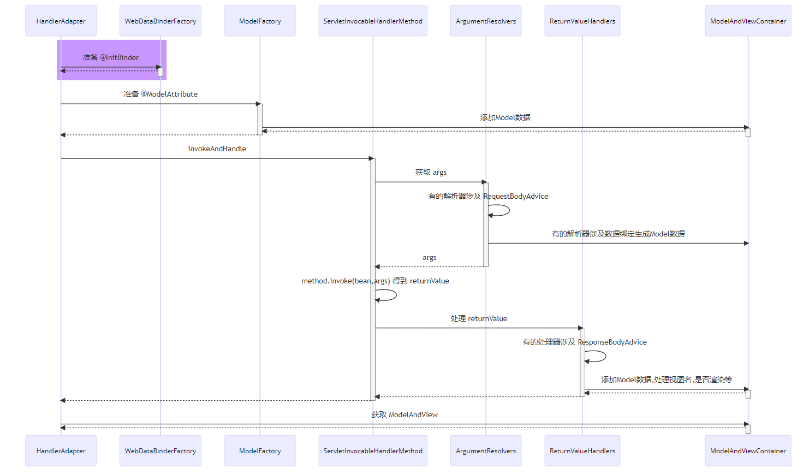

* RequestMappingHandlerAdapter 在图中缩写为 HandlerAdapter
* HandlerMethodArgumentResolverComposite 在图中缩写为 ArgumentResolvers
* HandlerMethodReturnValueHandlerComposite 在图中缩写为 ReturnValueHandlers

## 24.2 代码测试

### 24.2.1 WebConfig

```java
package com.itheima.a24.config;

import com.itheima.a22.factory.format.CustomDateFormatter;
import lombok.extern.slf4j.Slf4j;
import org.springframework.context.annotation.Configuration;
import org.springframework.stereotype.Controller;
import org.springframework.web.bind.WebDataBinder;
import org.springframework.web.bind.annotation.ControllerAdvice;
import org.springframework.web.bind.annotation.InitBinder;

/**
 * @author lyf
 * @version 1.0
 * @classname WebConfig
 * @description
 * @since 2022/12/13 9:30
 */
@Slf4j
@Configuration
public class WebConfig {
    public static final String PATTERN = "yyyy|MM|dd";

    @ControllerAdvice
    public static class MyControllerAdvice {
        @InitBinder
        public void binder3(WebDataBinder webDataBinder) {
            webDataBinder.addCustomFormatter(new CustomDateFormatter(PATTERN, "binder3 执行了..."));
        }
    }

    @Controller
    public static class Controller1 {
        @InitBinder
        public void binder1(WebDataBinder webDataBinder) {
            webDataBinder.addCustomFormatter(new CustomDateFormatter(PATTERN, "binder1 执行了..."));
        }

        public void foo() {

        }
    }

    @Controller
    public static class Controller2 {
        @InitBinder
        public void binder21(WebDataBinder webDataBinder) {
            webDataBinder.addCustomFormatter(new CustomDateFormatter(PATTERN, "binder21 执行了..."));
        }

        @InitBinder
        public void binder22(WebDataBinder webDataBinder) {
            webDataBinder.addCustomFormatter(new CustomDateFormatter(PATTERN, "binder22 执行了..."));
        }

        public void bar() {

        }
    }
}

```

### 24.2.2 测试代码

```java
package com.itheima.a24;

import com.itheima.a24.config.WebConfig;
import lombok.extern.slf4j.Slf4j;
import org.springframework.context.annotation.AnnotationConfigApplicationContext;
import org.springframework.web.method.ControllerAdviceBean;
import org.springframework.web.method.HandlerMethod;
import org.springframework.web.servlet.mvc.method.annotation.RequestMappingHandlerAdapter;

import java.lang.reflect.Field;
import java.lang.reflect.Method;
import java.util.Map;
import java.util.Set;
import java.util.stream.Collectors;

/**
 * @author lyf
 * @version 1.0
 * @classname TestControllerAdviceInitBinder
 * @description 测试@ControllerAdvice标注类上的@InitBinder注解
 * @since 2022/12/13 9:35
 */
@Slf4j
public class TestControllerAdviceInitBinder {
    public static void main(String[] args) throws Throwable {
         /*
            @InitBinder 的来源有两个
            1. @ControllerAdvice 中 @InitBinder 标注的方法，由 RequestMappingHandlerAdapter 在初始化时解析并记录
            2. @Controller 中 @InitBinder 标注的方法，由 RequestMappingHandlerAdapter 会在控制器方法首次执行时解析并记录
         */
        AnnotationConfigApplicationContext applicationContext = new AnnotationConfigApplicationContext(WebConfig.class);

        // 1 创建RequestMappingHandlerAdapter对象
        RequestMappingHandlerAdapter handlerAdapter = new RequestMappingHandlerAdapter();
        // 2 设置RequestMappingHandlerAdapter的容器
        handlerAdapter.setApplicationContext(applicationContext);
        // 3 初始化RequestMappingHandlerAdapter
        handlerAdapter.afterPropertiesSet();
        log.debug("1 初始化RequestMappingHandlerAdapter 时");
        showBindMethods(handlerAdapter);

        // 4 拿到数据绑定工厂，模拟调用Controller1的foo方法
        Method dataBinderFactoryMethod = RequestMappingHandlerAdapter.class.getDeclaredMethod("getDataBinderFactory", HandlerMethod.class);
        dataBinderFactoryMethod.setAccessible(true);
        dataBinderFactoryMethod.invoke(handlerAdapter,
                new HandlerMethod(new WebConfig.Controller1(), WebConfig.Controller1.class.getMethod("foo")));
        log.debug("2 拿到数据绑定工厂，模拟调用Controller1的foo方法时");
        showBindMethods(handlerAdapter);

        // 5 模拟并调用bar方法
        dataBinderFactoryMethod.invoke(handlerAdapter,
                new HandlerMethod(new WebConfig.Controller2(), WebConfig.Controller2.class.getMethod("bar")));
        log.debug("3 拿到数据绑定工厂，模拟调用Controller2的bar方法时");
        showBindMethods(handlerAdapter);
        
         /*
            学到了什么
                a. Method 对象的获取利用了缓存来进行加速
                b. 绑定器工厂的扩展点(advice 之一), 通过 @InitBinder 扩展类型转换器
         */
    }

    /**
     * 存储全局的 @InitBinder 方法
     * private final Map<ControllerAdviceBean, Set<Method>> initBinderAdviceCache = new LinkedHashMap<>();
     * <p>
     * 存储控制器的@InitBinder方法
     * private final Map<Class<?>, Set<Method>> initBinderCache = new ConcurrentHashMap<>(64);
     */
    private static void showBindMethods(RequestMappingHandlerAdapter handlerAdapter)
            throws NoSuchFieldException, IllegalAccessException {
        Field initBinderAdviceCache = RequestMappingHandlerAdapter.class.getDeclaredField("initBinderAdviceCache");
        initBinderAdviceCache.setAccessible(true);
        Map<ControllerAdviceBean, Set<Method>> globalInitBinderMap = (Map<ControllerAdviceBean, Set<Method>>) initBinderAdviceCache.get(handlerAdapter);
        log.debug("全局的 @InitBinder 方法{}", globalInitBinderMap.values().stream().flatMap(ms -> ms.stream().map(Method::getName)).collect(Collectors.toList()));

        Field initBinderCache = RequestMappingHandlerAdapter.class.getDeclaredField("initBinderCache");
        initBinderCache.setAccessible(true);
        Map<Class<?>, Set<Method>> controllerMap = (Map<Class<?>, Set<Method>>) initBinderCache.get(handlerAdapter);
        log.debug("控制器的 @InitBinder 方法{}", controllerMap.values().stream().flatMap(ms -> ms.stream().map(Method::getName)).collect(Collectors.toList()));
    }
}

```

### 24.2.3 测试结果

```verilog
[DEBUG] 10:26:08.736 [main] c.i.a.TestControllerAdviceInitBinder - 1 初始化RequestMappingHandlerAdapter 时 
[DEBUG] 10:26:08.742 [main] c.i.a.TestControllerAdviceInitBinder - 全局的 @InitBinder 方法[binder3] 
[DEBUG] 10:26:08.744 [main] c.i.a.TestControllerAdviceInitBinder - 控制器的 @InitBinder 方法[] 
[DEBUG] 10:26:08.750 [main] c.i.a.TestControllerAdviceInitBinder - 2 拿到数据绑定工厂，模拟调用Controller1的foo方法时 
[DEBUG] 10:26:08.750 [main] c.i.a.TestControllerAdviceInitBinder - 全局的 @InitBinder 方法[binder3] 
[DEBUG] 10:26:08.750 [main] c.i.a.TestControllerAdviceInitBinder - 控制器的 @InitBinder 方法[binder1] 
[DEBUG] 10:26:08.750 [main] c.i.a.TestControllerAdviceInitBinder - 3 拿到数据绑定工厂，模拟调用Controller2的bar方法时 
[DEBUG] 10:26:08.750 [main] c.i.a.TestControllerAdviceInitBinder - 全局的 @InitBinder 方法[binder3] 
[DEBUG] 10:26:08.751 [main] c.i.a.TestControllerAdviceInitBinder - 控制器的 @InitBinder 方法[binder22, binder21, binder1] 
```


## 24.3 收获💡

1. RequestMappingHandlerAdapter 初始化时会解析 @ControllerAdvice 中的 @InitBinder 方法
2. RequestMappingHandlerAdapter 会以类为单位，在该类首次使用时，解析此类的 @InitBinder 方法
3. 以上两种 @InitBinder 的解析结果都会缓存来避免重复解析
4. 控制器方法调用时，会综合利用本类的 @InitBinder 方法和 @ControllerAdvice 中的 @InitBinder 方法创建绑定工厂


# 25 控制器方法执行流程

## 25.1 图1

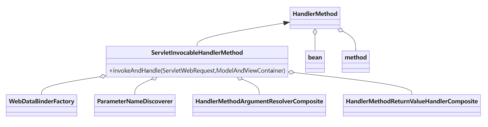

HandlerMethod 需要

* bean 即是哪个 Controller
* method 即是 Controller 中的哪个方法

ServletInvocableHandlerMethod 需要

* WebDataBinderFactory 负责对象绑定、类型转换
* ParameterNameDiscoverer 负责参数名解析
* HandlerMethodArgumentResolverComposite 负责解析参数
* HandlerMethodReturnValueHandlerComposite 负责处理返回值


## 25.2 图2

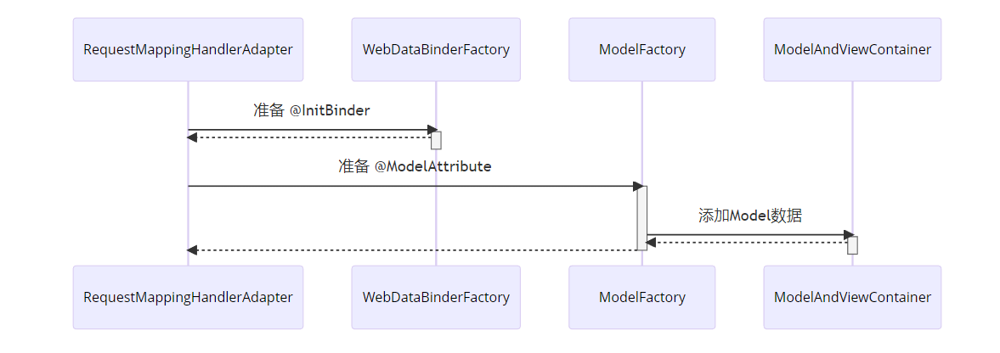


## 25.3 图3

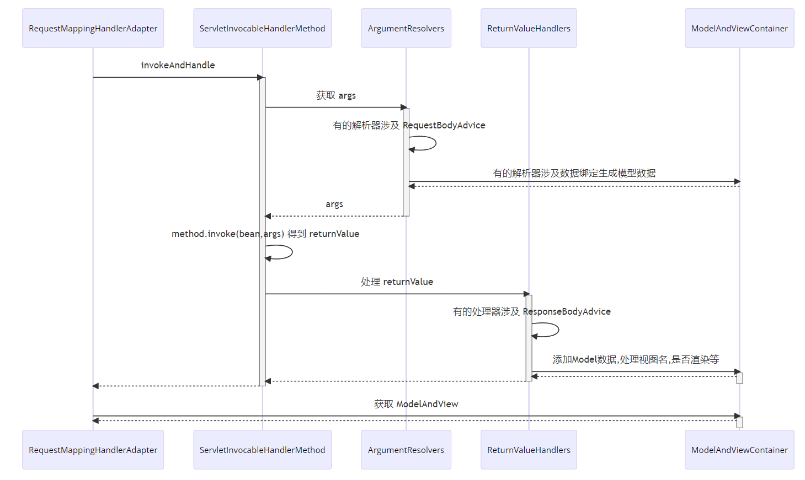

# 26 @ControllerAdvice 之 @ModelAttribute

## 26.1 演示 - 准备 @ModelAttribute

### 26.1.1 代码参考

#### 1 WebConfig

```java
package com.itheima.a25_a26.config;

import lombok.AllArgsConstructor;
import lombok.Data;
import lombok.NoArgsConstructor;
import lombok.extern.slf4j.Slf4j;
import org.springframework.context.annotation.Configuration;
import org.springframework.http.HttpStatus;
import org.springframework.stereotype.Controller;
import org.springframework.web.bind.annotation.ControllerAdvice;
import org.springframework.web.bind.annotation.InitBinder;
import org.springframework.web.bind.annotation.ModelAttribute;
import org.springframework.web.bind.annotation.ResponseStatus;
import org.springframework.web.servlet.ModelAndView;

/**
 * @author lyf
 * @version 1.0
 * @classname WebConfig
 * @description
 * @since 2022/12/13 10:39
 */
@Slf4j
@Configuration
public class WebConfig {
    @ControllerAdvice
    public static class MyControllerAdvice {
        @ModelAttribute("aa")
        public String aa() {
            return "aa";
        }
    }

    @Controller
    public static class Controller1 {
        @ModelAttribute("bb")
        public String bb() {
            return "bb";
        }

        @ResponseStatus(HttpStatus.OK) // 表示响应正常返回
        public ModelAndView foo(@ModelAttribute("user") User user) {
            log.debug("foo invoke...");
            return null;
        }
    }

    @Data
    @AllArgsConstructor
    @NoArgsConstructor
    public static class User {
        private String name;
        private int age;
    }
}

```


#### 2 测试方法

```java
package com.itheima.a25_a26;

import com.itheima.a25_a26.config.WebConfig;
import lombok.extern.slf4j.Slf4j;
import org.springframework.context.annotation.AnnotationConfigApplicationContext;
import org.springframework.core.DefaultParameterNameDiscoverer;
import org.springframework.http.converter.json.MappingJackson2HttpMessageConverter;
import org.springframework.mock.web.MockHttpServletRequest;
import org.springframework.web.bind.support.WebDataBinderFactory;
import org.springframework.web.context.request.ServletWebRequest;
import org.springframework.web.method.HandlerMethod;
import org.springframework.web.method.annotation.ExpressionValueMethodArgumentResolver;
import org.springframework.web.method.annotation.ModelFactory;
import org.springframework.web.method.annotation.RequestHeaderMethodArgumentResolver;
import org.springframework.web.method.annotation.RequestParamMethodArgumentResolver;
import org.springframework.web.method.support.HandlerMethodArgumentResolverComposite;
import org.springframework.web.method.support.ModelAndViewContainer;
import org.springframework.web.servlet.mvc.method.annotation.*;

import java.lang.reflect.Method;
import java.util.Collections;

/**
 * @author lyf
 * @version 1.0
 * @classname TestModelAttribute
 * @description
 * @since 2022/12/13 10:45
 */
@Slf4j
public class TestModelAttribute {
    public static void main(String[] args) throws Throwable {
        AnnotationConfigApplicationContext applicationContext = new AnnotationConfigApplicationContext(WebConfig.class);
        // 1 准备RequestMappingHandlerAdapter
        RequestMappingHandlerAdapter handlerAdapter = new RequestMappingHandlerAdapter();
        handlerAdapter.setApplicationContext(applicationContext);
        handlerAdapter.afterPropertiesSet();
        // 2 准备数据绑定工厂
        ServletRequestDataBinderFactory dataBinderFactory = new ServletRequestDataBinderFactory(null, null);
        // 3 准备模型工厂
        Method getModelFactory = RequestMappingHandlerAdapter.class.getDeclaredMethod("getModelFactory", HandlerMethod.class, WebDataBinderFactory.class);
        getModelFactory.setAccessible(true);
        // 3.1 准备HandlerMethod
        ServletInvocableHandlerMethod handlerMethod = new ServletInvocableHandlerMethod(
                new WebConfig.Controller1(), WebConfig.Controller1.class.getMethod("foo", WebConfig.User.class));
        // 设置数据绑定工厂
        handlerMethod.setDataBinderFactory(dataBinderFactory);
        // 设置参数名解析器
        handlerMethod.setParameterNameDiscoverer(new DefaultParameterNameDiscoverer());
        // 设置方法组合解析器
        handlerMethod.setHandlerMethodArgumentResolvers(getArgumentResolvers(applicationContext));
        // 3.2 获取模型工厂
        ModelFactory modelFactory = (ModelFactory) getModelFactory.invoke(handlerAdapter, handlerMethod, dataBinderFactory);
        // 4 准备Model容器
        // 4.1 准备模拟请求
        MockHttpServletRequest mockHttpServletRequest = new MockHttpServletRequest();
        mockHttpServletRequest.setParameter("name", "刘德华");
        mockHttpServletRequest.setParameter("age", "61");
        ServletWebRequest request = new ServletWebRequest(mockHttpServletRequest);
        // 4.2 准备模型容器
        ModelAndViewContainer container = new ModelAndViewContainer();
        modelFactory.initModel(request, container, handlerMethod);

        // 4.3 执行handle
        handlerMethod.invokeAndHandle(request, container);

        // 4.4 获取模型数据
        log.debug("model: {}", container.getModel());
        applicationContext.close();
    }

    /**
     * 获取参数解析器组合解析器
     *
     * @param context context
     * @return HandlerMethodArgumentResolverComposite
     */
    public static HandlerMethodArgumentResolverComposite getArgumentResolvers(AnnotationConfigApplicationContext context) {
        HandlerMethodArgumentResolverComposite composite = new HandlerMethodArgumentResolverComposite();
        composite.addResolvers(
                new RequestParamMethodArgumentResolver(context.getDefaultListableBeanFactory(), false),
                new PathVariableMethodArgumentResolver(),
                new RequestHeaderMethodArgumentResolver(context.getDefaultListableBeanFactory()),
                new ServletCookieValueMethodArgumentResolver(context.getDefaultListableBeanFactory()),
                new ExpressionValueMethodArgumentResolver(context.getDefaultListableBeanFactory()),
                new ServletRequestMethodArgumentResolver(),
                new ServletModelAttributeMethodProcessor(false),
                new RequestResponseBodyMethodProcessor(Collections.singletonList(new MappingJackson2HttpMessageConverter())),
                new ServletModelAttributeMethodProcessor(true),
                new RequestParamMethodArgumentResolver(context.getDefaultListableBeanFactory(), true)
        );
        return composite;
    }
}

```

#### 3 测试结果

```verilog
[DEBUG] 09:55:09.889 [main] c.itheima.a25_a26.config.WebConfig  - foo invoke... 
[DEBUG] 09:55:09.896 [main] c.i.a25_a26.TestModelAttribute      - model: {aa=aa, bb=bb, user=WebConfig.User(name=刘德华, age=61), org.springframework.validation.BindingResult.user=org.springframework.validation.BeanPropertyBindingResult: 0 errors} 

```

**准备 @ModelAttribute** 在整个 HandlerAdapter 调用过程中所处的位置

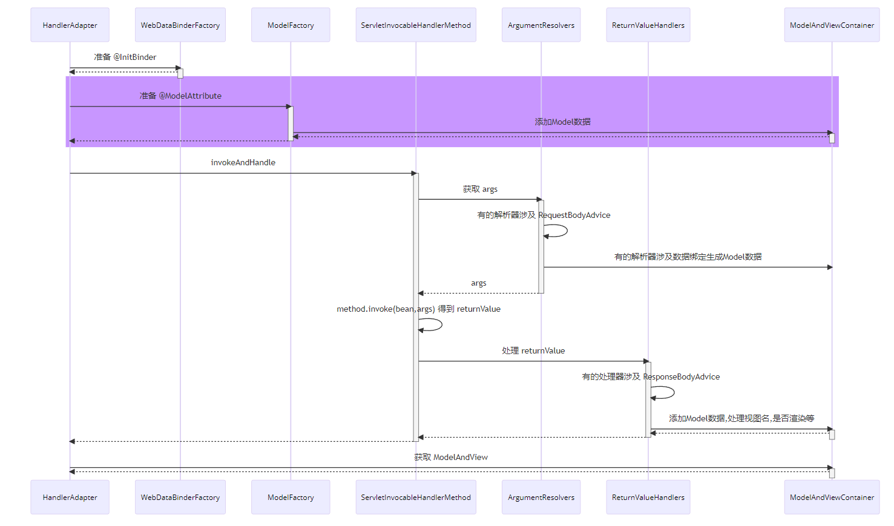

## 26.2 收获💡

1. RequestMappingHandlerAdapter 初始化时会解析 @ControllerAdvice 中的 @ModelAttribute 方法
2. RequestMappingHandlerAdapter 会以类为单位，在该类首次使用时，解析此类的 @ModelAttribute 方法
3. 以上两种 @ModelAttribute 的解析结果都会缓存来避免重复解析
4. 控制器方法调用时，会综合利用本类的 @ModelAttribute 方法和 @ControllerAdvice 中的 @ModelAttribute 方法创建模型工厂


# 27 返回值处理器

## 27.1 演示 - 常见返回值处理器

### 27.1.1 代码参考

#### 1 模板资源

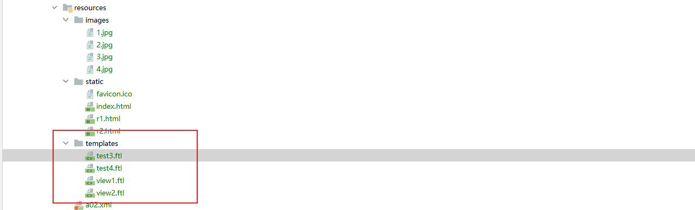

##### 1.1 test3.ftl

```html
<!doctype html>
<html lang="zh">
<head>
    <meta charset="UTF-8">
    <title>test3</title>
</head>
<body>
    <h1>Hello! ${user.name} ${user.age}</h1>
</body>
</html>
```

##### 1.2 test4.ftl

```html
<!doctype html>
<html lang="zh">
<head>
    <meta charset="UTF-8">
    <title>test4</title>
</head>
<body>
    <h1>Hello! ${user.name} ${user.age}</h1>
</body>
</html>
```

##### 1.3 view1.ftl

```html
<!doctype html>
<html lang="zh">
<head>
    <meta charset="UTF-8">
    <title>view1</title>
</head>
<body>
    <h1>Hello! ${name}</h1>
</body>
</html>
```

##### 1.4 view2.ftl

```html
<!doctype html>
<html lang="zh">
<head>
    <meta charset="UTF-8">
    <title>view2</title>
</head>
<body>
    <h1>Hello!</h1>
</body>
</html>
```

#### 2 WebConfig

```java
package com.itheima.a27.config;

import lombok.extern.slf4j.Slf4j;
import org.springframework.context.annotation.Bean;
import org.springframework.context.annotation.Configuration;
import org.springframework.web.servlet.view.AbstractUrlBasedView;
import org.springframework.web.servlet.view.freemarker.FreeMarkerConfigurer;
import org.springframework.web.servlet.view.freemarker.FreeMarkerView;
import org.springframework.web.servlet.view.freemarker.FreeMarkerViewResolver;

/**
 * @author lyf
 * @version 1.0
 * @classname WebConfig
 * @description
 * @since 2022/12/14 10:14
 */
@Slf4j
@Configuration
public class WebConfig {

    @Bean
    public FreeMarkerConfigurer freeMarkerConfigurer() {
        FreeMarkerConfigurer configurer = new FreeMarkerConfigurer();
        configurer.setDefaultEncoding("utf-8");
        configurer.setTemplateLoaderPath("classpath:templates");
        return configurer;
    }

    @Bean // FreeMarkerView 在借助 Spring 初始化时，会要求 web 环境才会走 setConfiguration, 这里想办法去掉了 web 环境的约束
    public FreeMarkerViewResolver viewResolver(FreeMarkerConfigurer configurer) {
        FreeMarkerViewResolver resolver = new FreeMarkerViewResolver() {
            @Override
            protected AbstractUrlBasedView instantiateView() {
                FreeMarkerView view = new FreeMarkerView() {
                    @Override
                    protected boolean isContextRequired() {
                        return false;
                    }
                };
                view.setConfiguration(configurer.getConfiguration());
                return view;
            }
        };
        resolver.setContentType("text/html;charset=utf-8");
        resolver.setPrefix("/");
        resolver.setSuffix(".ftl");
        resolver.setExposeSpringMacroHelpers(false);
        return resolver;
    }
}

```

#### 3 测试代码

```java
package com.itheima.a27.test;

import com.itheima.a27.config.WebConfig;
import lombok.AllArgsConstructor;
import lombok.Data;
import lombok.NoArgsConstructor;
import lombok.extern.slf4j.Slf4j;
import org.springframework.context.annotation.AnnotationConfigApplicationContext;
import org.springframework.core.MethodParameter;
import org.springframework.http.HttpEntity;
import org.springframework.http.HttpHeaders;
import org.springframework.http.converter.json.MappingJackson2HttpMessageConverter;
import org.springframework.mock.web.MockHttpServletRequest;
import org.springframework.mock.web.MockHttpServletResponse;
import org.springframework.web.bind.annotation.ModelAttribute;
import org.springframework.web.bind.annotation.RequestMapping;
import org.springframework.web.bind.annotation.ResponseBody;
import org.springframework.web.context.request.ServletWebRequest;
import org.springframework.web.method.HandlerMethod;
import org.springframework.web.method.support.HandlerMethodReturnValueHandlerComposite;
import org.springframework.web.method.support.ModelAndViewContainer;
import org.springframework.web.servlet.ModelAndView;
import org.springframework.web.servlet.View;
import org.springframework.web.servlet.mvc.method.annotation.*;
import org.springframework.web.servlet.view.DefaultRequestToViewNameTranslator;
import org.springframework.web.servlet.view.freemarker.FreeMarkerViewResolver;
import org.springframework.web.util.UrlPathHelper;

import java.lang.reflect.Method;
import java.nio.charset.StandardCharsets;
import java.util.*;

/**
 * @author lyf
 * @version 1.0
 * @classname TestReturnValueHandler
 * @description 测试返回值处理器
 * @since 2022/12/14 10:16
 */
@Slf4j
public class TestReturnValueHandler {
    public static void main(String[] args) throws Throwable {
        AnnotationConfigApplicationContext applicationContext = new AnnotationConfigApplicationContext(WebConfig.class);
        // 1. 测试返回值类型为 ModelAndView
        // test1(applicationContext);

        // 2. 测试返回值类型为 String 时, 把它当做视图名
        // test2(applicationContext);
        // 3. 测试返回值添加了 @ModelAttribute 注解时, 此时需找到默认视图名
        test3(applicationContext);
        // 4. 测试返回值不加 @ModelAttribute 注解且返回非简单类型时, 此时需找到默认视图名
        // test4(applicationContext);
        // 5. 测试返回值类型为 ResponseEntity 时, 此时不走视图流程
        // test5(applicationContext);
        // 6. 测试返回值类型为 HttpHeaders 时, 此时不走视图流程
        // test6(applicationContext);
        // 7. 测试返回值添加了 @ResponseBody 注解时, 此时不走视图流程
        // test7(applicationContext);

        // 释放资源
        applicationContext.close();
    }

    private static ServletWebRequest getServletWebRequest(String methodName) {
        MockHttpServletRequest request = new MockHttpServletRequest();
        request.setRequestURI(methodName);
        UrlPathHelper.defaultInstance.resolveAndCacheLookupPath(request);
        ServletWebRequest webRequest = new ServletWebRequest(request, new MockHttpServletResponse());
        return webRequest;
    }

    private static void defaultReturnValueHandler(AnnotationConfigApplicationContext applicationContext, String methodName, ServletWebRequest webRequest) throws Exception {
        // 1 准备控制器
        Controller controller = new Controller();
        // 2 获取要执行的控制器方法
        Method method = Controller.class.getMethod(methodName);
        // 3 执行控制器方法
        Object returnValue = method.invoke(controller);
        // 4 获取返回值类型
        HandlerMethod handlerMethod = new HandlerMethod(controller, method);
        MethodParameter returnType = handlerMethod.getReturnType();
        // 5 准备请求和Model容器
        if (webRequest == null) {
            webRequest = new ServletWebRequest(new MockHttpServletRequest(), new MockHttpServletResponse());
        }
        ModelAndViewContainer mavContainer = new ModelAndViewContainer();
        // 6 获取组合器
        HandlerMethodReturnValueHandlerComposite handlerComposite = getHandlerMethodReturnValueHandlerComposite();
        // 7 判断组合器是否支持此类型的解析
        if (handlerComposite.supportsReturnType(returnType)) {
            // 8 处理返回值
            handlerComposite.handleReturnValue(returnValue, returnType, mavContainer, webRequest);
            System.out.println(mavContainer.getModel());
            System.out.println(mavContainer.getViewName());

            // 增加一层判断，看请求是否已经处理完成
            if (!mavContainer.isRequestHandled()) { // 请求还未处理完成
                renderView(applicationContext, mavContainer, webRequest);
            } else { // 请求已经被标注已经完成了
                MockHttpServletResponse response = (MockHttpServletResponse) webRequest.getResponse();
                if (response == null) {
                    throw new IllegalArgumentException("response is null");
                }
                // 打印响应头
                Collection<String> headerNames = response.getHeaderNames();
                StringBuilder sb = new StringBuilder();
                if (!headerNames.isEmpty()) {
                    for (String headerName : headerNames) {
                        sb.append(headerName).append("=").append(response.getHeader(headerName)).append(System.lineSeparator());
                    }
                    log.debug("响应头:\n {}", sb);
                }

                // 打印响应内容
                log.debug("响应体内容: {}", new String(response.getContentAsByteArray(), StandardCharsets.UTF_8));
            }
        }
    }


    private static void defaultReturnValueHandler(AnnotationConfigApplicationContext applicationContext, String methodName) throws Exception {
        defaultReturnValueHandler(applicationContext, methodName, null);
    }


    private static void test1(AnnotationConfigApplicationContext applicationContext) throws Exception {
        defaultReturnValueHandler(applicationContext, "test1");
    }

    private static void test2(AnnotationConfigApplicationContext applicationContext) throws Exception {
        defaultReturnValueHandler(applicationContext, "test2");
    }


    private static void test3(AnnotationConfigApplicationContext applicationContext) throws Exception {
        /*
            [DEBUG] 10:58:59.521 [main] c.i.a27.test.TestReturnValueHandler - test3()
            {user=TestReturnValueHandler.User(name=李四, age=20)}
            null
            [DEBUG] 10:58:59.791 [main] c.i.a27.test.TestReturnValueHandler - >>>>>> 渲染视图
            Exception in thread "main" java.lang.IllegalArgumentException: Neither a pre-parsed RequestPath nor a pre-resolved String lookupPath is available.
                at org.springframework.web.util.ServletRequestPathUtils.getCachedPath(ServletRequestPathUtils.java:144)
                at org.springframework.web.util.ServletRequestPathUtils.getCachedPathValue(ServletRequestPathUtils.java:161)
                at org.springframework.web.servlet.view.DefaultRequestToViewNameTranslator.getViewName(DefaultRequestToViewNameTranslator.java:178)
                at com.itheima.a27.test.TestReturnValueHandler.renderView(TestReturnValueHandler.java:136)
                at com.itheima.a27.test.TestReturnValueHandler.defaultReturnValueHandler(TestReturnValueHandler.java:89)
                at com.itheima.a27.test.TestReturnValueHandler.test3(TestReturnValueHandler.java:104)
                at com.itheima.a27.test.TestReturnValueHandler.main(TestReturnValueHandler.java:54)

                这是因为test3 没有对应的请求路径，也就是没有视图名称
                     @ModelAttribute
                    @RequestMapping("/test3")
                    public User test3() {
                        log.debug("test3()");
                        return new User("李四", 20);
                    }

                解决方法:
                request.setRequestURI("/test3");
                UrlPathHelper.defaultInstance.resolveAndCacheLookupPath(request);

         */
        String methodName = "test3";
        ServletWebRequest webRequest = getServletWebRequest(methodName);
        defaultReturnValueHandler(applicationContext, methodName, webRequest);
    }


    private static void test4(AnnotationConfigApplicationContext applicationContext) throws Exception {
        String methodName = "test4";
        ServletWebRequest webRequest = getServletWebRequest(methodName);
        defaultReturnValueHandler(applicationContext, methodName, webRequest);
    }

    private static void test5(AnnotationConfigApplicationContext applicationContext) throws Exception {
        String methodName = "test5";
        defaultReturnValueHandler(applicationContext, methodName);
    }

    private static void test6(AnnotationConfigApplicationContext applicationContext) throws Exception {
        defaultReturnValueHandler(applicationContext, "test6");
    }

    private static void test7(AnnotationConfigApplicationContext applicationContext) throws Exception {
        defaultReturnValueHandler(applicationContext, "test7");
    }

    /**
     * 渲染视图
     *
     * @param context    bean容器
     * @param container  模型容器
     * @param webRequest web请求
     * @throws Exception Exception
     */
    @SuppressWarnings("all")
    private static void renderView(AnnotationConfigApplicationContext context, ModelAndViewContainer container,
                                   ServletWebRequest webRequest) throws Exception {
        log.debug(">>>>>> 渲染视图");
        FreeMarkerViewResolver resolver = context.getBean(FreeMarkerViewResolver.class);
        String viewName = container.getViewName() != null ? container.getViewName() : new DefaultRequestToViewNameTranslator().getViewName(webRequest.getRequest());
        log.debug("没有获取到视图名, 采用默认视图名: {}", viewName);
        // 每次渲染时, 会产生新的视图对象, 它并非被 Spring 所管理, 但确实借助了 Spring 容器来执行初始化
        View view = resolver.resolveViewName(viewName, Locale.getDefault());
        view.render(container.getModel(), webRequest.getRequest(), webRequest.getResponse());
        System.out.println(new String(((MockHttpServletResponse) webRequest.getResponse()).getContentAsByteArray(), StandardCharsets.UTF_8));
    }

    /**
     * 获取返回值处理器组合器
     *
     * @return HandlerMethodReturnValueHandlerComposite
     */
    public static HandlerMethodReturnValueHandlerComposite getHandlerMethodReturnValueHandlerComposite() {
        HandlerMethodReturnValueHandlerComposite composite = new HandlerMethodReturnValueHandlerComposite();
        composite.addHandlers(new ArrayList<>(Arrays.asList(
                // 分别获取其模型和视图名，放入 ModelAndViewContainer
                new ModelAndViewMethodReturnValueHandler(),
                // 返回值类型为 String 时，把它当做视图名，放入 ModelAndViewContainer
                new ViewNameMethodReturnValueHandler(),
                // 返回值添加了 @ModelAttribute 注解时，将返回值作为模型，放入 ModelAndViewContainer
                // 此时需找到默认视图名
                new ServletModelAttributeMethodProcessor(false),
                // 返回值类型为 ResponseEntity 时
                // 此时走 MessageConverter，并设置 ModelAndViewContainer.requestHandled 为 true
                new HttpEntityMethodProcessor(Collections.singletonList(new MappingJackson2HttpMessageConverter())),

                // 返回值类型为 HttpHeaders 时
                // 会设置 ModelAndViewContainer.requestHandled 为 true
                new HttpHeadersReturnValueHandler(),
                // 返回值添加了 @ResponseBody 注解时
                // 此时走 MessageConverter，并设置 ModelAndViewContainer.requestHandled 为 true
                new RequestResponseBodyMethodProcessor(Collections.singletonList(new MappingJackson2HttpMessageConverter())),

                // 返回值省略 @ModelAttribute 注解且返回非简单类型时，将返回值作为模型，放入 ModelAndViewContainer
                // 此时需找到默认视图名
                new ServletModelAttributeMethodProcessor(true)
        )));

        return composite;
    }

    static class Controller {
        public ModelAndView test1() {
            log.debug("test1()");
            ModelAndView mav = new ModelAndView("view1");
            mav.addObject("name", "张三");
            return mav;
        }

        public String test2() {
            log.debug("test2()");
            return "view2";
        }

        @ModelAttribute
        @RequestMapping("/test3")
        public User test3() {
            log.debug("test3()");
            return new User("李四", 20);
        }

        public User test4() {
            log.debug("test4()");
            return new User("王五", 30);
        }

        public HttpEntity<User> test5() {
            log.debug("test5()");
            return new HttpEntity<>(new User("赵六", 40));
        }

        public HttpHeaders test6() {
            log.debug("test6()");
            HttpHeaders headers = new HttpHeaders();
            headers.add("Content-Type", "text/html");
            headers.add("Server", "itheima2022");
            return headers;
        }

        @ResponseBody
        public User test7() {
            log.debug("test7()");
            return new User("钱七", 50);
        }
    }

    // 必须用 public 修饰, 否则 freemarker 渲染其 name, age 属性时失败
    @Data
    @AllArgsConstructor
    @NoArgsConstructor
    public static class User {
        private String name;
        private int age;
    }
}

```

#### 4 测试结果

##### 4.1 test1 测试返回值类型为 ModelAndView

```verilog
[DEBUG] 12:05:36.409 [main] c.i.a27.test.TestReturnValueHandler - test1() 
{name=张三}
view1
[DEBUG] 12:05:36.711 [main] c.i.a27.test.TestReturnValueHandler - >>>>>> 渲染视图 
[DEBUG] 12:05:36.712 [main] c.i.a27.test.TestReturnValueHandler - 没有获取到视图名, 采用默认视图名: view1 
[DEBUG] 12:05:36.772 [main] c.itheima.a27.config.WebConfig$1$1  - View name 'view1', model {name=张三} 
[DEBUG] 12:05:36.777 [main] c.itheima.a27.config.WebConfig$1$1  - Rendering [/view1.ftl] 
<!doctype html>
<html lang="zh">
<head>
    <meta charset="UTF-8">
    <title>view1</title>
</head>
<body>
    <h1>Hello! 张三</h1>
</body>
</html>

```

##### 4.2 test2 测试返回值类型为 String 时, 把它当做视图名

```verilog
[DEBUG] 12:06:20.156 [main] c.i.a27.test.TestReturnValueHandler - test2() 
{}
view2
[DEBUG] 12:06:20.511 [main] c.i.a27.test.TestReturnValueHandler - >>>>>> 渲染视图 
[DEBUG] 12:06:20.513 [main] c.i.a27.test.TestReturnValueHandler - 没有获取到视图名, 采用默认视图名: view2 
[DEBUG] 12:06:20.581 [main] c.itheima.a27.config.WebConfig$1$1  - View name 'view2', model {} 
[DEBUG] 12:06:20.588 [main] c.itheima.a27.config.WebConfig$1$1  - Rendering [/view2.ftl] 
<!doctype html>
<html lang="zh">
<head>
    <meta charset="UTF-8">
    <title>view2</title>
</head>
<body>
    <h1>Hello!</h1>
</body>
</html>
```

##### 4.3 test3 测试返回值添加了 @ModelAttribute 注解时, 此时需找到默认视图名

```verilog
[DEBUG] 12:06:57.441 [main] c.i.a27.test.TestReturnValueHandler - test3() 
{user=TestReturnValueHandler.User(name=李四, age=20)}
null
[DEBUG] 12:06:57.708 [main] c.i.a27.test.TestReturnValueHandler - >>>>>> 渲染视图 
[DEBUG] 12:06:57.710 [main] c.i.a27.test.TestReturnValueHandler - 没有获取到视图名, 采用默认视图名: test3 
[DEBUG] 12:06:57.772 [main] c.itheima.a27.config.WebConfig$1$1  - View name 'test3', model {user=TestReturnValueHandler.User(name=李四, age=20)} 
[DEBUG] 12:06:57.777 [main] c.itheima.a27.config.WebConfig$1$1  - Rendering [/test3.ftl] 
<!doctype html>
<html lang="zh">
<head>
    <meta charset="UTF-8">
    <title>test3</title>
</head>
<body>
    <h1>Hello! 李四 20</h1>
</body>
</html>
```

##### 4.4 test4 测试返回值不加 @ModelAttribute 注解且返回非简单类型时, 此时需找到默认视图名

```verilog
[DEBUG] 12:07:26.992 [main] c.i.a27.test.TestReturnValueHandler - test4() 
{user=TestReturnValueHandler.User(name=王五, age=30)}
null
[DEBUG] 12:07:27.312 [main] c.i.a27.test.TestReturnValueHandler - >>>>>> 渲染视图 
[DEBUG] 12:07:27.315 [main] c.i.a27.test.TestReturnValueHandler - 没有获取到视图名, 采用默认视图名: test4 
[DEBUG] 12:07:27.405 [main] c.itheima.a27.config.WebConfig$1$1  - View name 'test4', model {user=TestReturnValueHandler.User(name=王五, age=30)} 
[DEBUG] 12:07:27.413 [main] c.itheima.a27.config.WebConfig$1$1  - Rendering [/test4.ftl] 
<!doctype html>
<html lang="zh">
<head>
    <meta charset="UTF-8">
    <title>test4</title>
</head>
<body>
    <h1>Hello! 王五 30</h1>
</body>
</html>
```


##### 4.5 test5 测试返回值类型为 ResponseEntity 时, 此时不走视图流程

```verilog
[DEBUG] 12:07:59.854 [main] c.i.a27.test.TestReturnValueHandler - test5() 
{}
null
[DEBUG] 12:08:00.197 [main] c.i.a27.test.TestReturnValueHandler - 响应头:
 Content-Type=application/json
 
[DEBUG] 12:08:00.198 [main] c.i.a27.test.TestReturnValueHandler - 响应体内容: {"name":"赵六","age":40} 
```

##### 4.6 test6 测试返回值类型为 HttpHeaders 时, 此时不走视图流程

```verilog
[DEBUG] 12:08:25.777 [main] c.i.a27.test.TestReturnValueHandler - test6() 
{}
null
[DEBUG] 12:08:26.113 [main] c.i.a27.test.TestReturnValueHandler - 响应头:
 Content-Type=text/html
Server=itheima2022
 
[DEBUG] 12:08:26.114 [main] c.i.a27.test.TestReturnValueHandler - 响应体内容:  
```

##### 4.7 test7 测试返回值添加了 @ResponseBody 注解时, 此时不走视图流程

```verilog
[DEBUG] 12:09:01.544 [main] c.i.a27.test.TestReturnValueHandler - test7() 
{}
null
[DEBUG] 12:09:01.892 [main] c.i.a27.test.TestReturnValueHandler - 响应头:
 Content-Type=application/json
 
[DEBUG] 12:09:01.893 [main] c.i.a27.test.TestReturnValueHandler - 响应体内容: {"name":"钱七","age":50} 
```


### 27.1.2 收获💡

1. 常见的返回值处理器
   * ModelAndView，分别获取其模型和视图名，放入 ModelAndViewContainer
   * 返回值类型为 String 时，把它当做视图名，放入 ModelAndViewContainer
   * 返回值添加了 @ModelAttribute 注解时，将返回值作为模型，放入 ModelAndViewContainer
     * 此时需找到默认视图名
   * 返回值省略 @ModelAttribute 注解且返回非简单类型时，将返回值作为模型，放入 ModelAndViewContainer
     * 此时需找到默认视图名
   * 返回值类型为 ResponseEntity 时
     * 此时走 MessageConverter，并设置 ModelAndViewContainer.requestHandled 为 true
   * 返回值类型为 HttpHeaders 时
     * 会设置 ModelAndViewContainer.requestHandled 为 true
   * 返回值添加了 @ResponseBody 注解时
     * 此时走 MessageConverter，并设置 ModelAndViewContainer.requestHandled 为 true
2. 组合模式在 Spring 中的体现 + 1


# 28 MessageConverter

## 28.1 演示 - MessageConverter 的作用

### 28.1.1 代码参考

```java
package com.itheima.a28;

import com.fasterxml.jackson.annotation.JsonCreator;
import com.fasterxml.jackson.annotation.JsonProperty;
import lombok.extern.slf4j.Slf4j;
import org.springframework.core.MethodParameter;
import org.springframework.http.MediaType;
import org.springframework.http.converter.json.MappingJackson2HttpMessageConverter;
import org.springframework.http.converter.xml.MappingJackson2XmlHttpMessageConverter;
import org.springframework.mock.http.MockHttpInputMessage;
import org.springframework.mock.http.MockHttpOutputMessage;
import org.springframework.mock.web.MockHttpServletRequest;
import org.springframework.mock.web.MockHttpServletResponse;
import org.springframework.web.bind.annotation.RequestMapping;
import org.springframework.web.bind.annotation.ResponseBody;
import org.springframework.web.context.request.ServletWebRequest;
import org.springframework.web.method.support.ModelAndViewContainer;
import org.springframework.web.servlet.mvc.method.annotation.RequestResponseBodyMethodProcessor;

import java.io.IOException;
import java.nio.charset.StandardCharsets;
import java.util.ArrayList;
import java.util.Arrays;

/**
 * @author lyf
 * @version 1.0
 * @classname TestMessageConverter
 * @description
 * @since 2022/12/14 12:33
 */
@Slf4j
public class TestMessageConverter {

    public static void main(String[] args) throws Throwable {
        // 测试MessageConverter的基本用法
        // 写入json数据
        // test1();
        // 写入xml数据
        // test2();
        // 读取json数据
        // test3();
        // 测试MessageConverter解析顺序
        test4();
    }

    /**
     * 能学到什么
     * a. MessageConverter的作用，@ResponseBody 是返回值处理器解析的，但具体的转换工作是MessageConverter做的
     * b. 如何选择MediaType
     * - 首先看@RequestMapping上有没有指定 (即：response.setContentType("application/json");)
     * - 其次看request的Accept头有没有指定
     * - 最后按MessageConverter解析器的放入顺序，谁能谁先转换
     *
     * @throws Exception Exception
     */
    private static void test4() throws Exception {
        // 1 准备请求响应体方法处理器，并配置json和xml转换器
        RequestResponseBodyMethodProcessor methodProcessor = new RequestResponseBodyMethodProcessor(
                new ArrayList<>(Arrays.asList(
                        new MappingJackson2XmlHttpMessageConverter(), // xml解析器
                        new MappingJackson2HttpMessageConverter() // json解析器
                ))
        );

        // 2 准备请求
        MockHttpServletRequest request = new MockHttpServletRequest();
        MockHttpServletResponse response = new MockHttpServletResponse();
        request.addHeader("Accept", "application/xml");
        response.setContentType("application/json");
        ServletWebRequest webRequest = new ServletWebRequest(request, response);

        // 3 准备容器
        ModelAndViewContainer container = new ModelAndViewContainer();

        // 4 处理返回值
        methodProcessor.handleReturnValue(new User("刘德华", 61),
                new MethodParameter(TestMessageConverter.class.getMethod("user"), -1),
                container,
                webRequest
        );

        // 5 打印响应结果
        log.debug("{}", response.getContentAsString(StandardCharsets.UTF_8));

    }

    @ResponseBody
    @RequestMapping(produces = "application/json") // produces：指定返回值类型，除了设置返回值类型外，还可以设定返回值的字符编码；
    public User user() {
        return null;
    }

    private static void test3() throws IOException {
        String json = "{\n" +
                "    \"name\" : \"赵六\",\n" +
                "    \"age\" : 28\n" +
                "}";
        MockHttpInputMessage message = new MockHttpInputMessage(json.getBytes(StandardCharsets.UTF_8));
        MappingJackson2HttpMessageConverter converter = new MappingJackson2HttpMessageConverter();
        if (converter.canRead(User.class, MediaType.APPLICATION_JSON)) {
            Object result = converter.read(User.class, message);
            log.debug("{}", result);
        }
    }

    private static void test2() throws IOException {
        MockHttpOutputMessage message = new MockHttpOutputMessage();
        MappingJackson2XmlHttpMessageConverter converter = new MappingJackson2XmlHttpMessageConverter();
        if (converter.canWrite(User.class, MediaType.APPLICATION_XML)) {
            converter.write(new User("李四", 27), MediaType.APPLICATION_XML, message);
            log.debug("result: {}", message.getBodyAsString(StandardCharsets.UTF_8));
        }
    }

    private static void test1() throws IOException {
        MockHttpOutputMessage message = new MockHttpOutputMessage();
        MappingJackson2HttpMessageConverter converter = new MappingJackson2HttpMessageConverter();
        if (converter.canWrite(User.class, MediaType.APPLICATION_JSON)) {
            converter.write(new User("张三", 30), MediaType.APPLICATION_JSON, message);
            log.debug("result: {}", message.getBodyAsString(StandardCharsets.UTF_8));
        }
    }


    public static class User {
        private String name;
        private int age;

        @JsonCreator
        public User(@JsonProperty("name") String name, @JsonProperty("age") int age) {
            this.name = name;
            this.age = age;
        }

        public String getName() {
            return name;
        }

        public void setName(String name) {
            this.name = name;
        }

        public int getAge() {
            return age;
        }

        public void setAge(int age) {
            this.age = age;
        }

        @Override
        public String toString() {
            return "User{" +
                    "name='" + name + '\'' +
                    ", age=" + age +
                    '}';
        }
    }
}

```


### 28.1.2 收获💡

1. MessageConverter 的作用
   * @ResponseBody 是返回值处理器解析的
   * 但具体转换工作是 MessageConverter 做的
2. 如何选择 MediaType
   * 首先看 @RequestMapping 上有没有指定 (即相当于：response.setContentType("application/json");)
   * 其次看 request 的 Accept 头有没有指定
   * 最后按 MessageConverter 的顺序, 谁能谁先转换


# 29 @ControllerAdvice 之 ResponseBodyAdvice

## 29.1 演示 - ResponseBodyAdvice 增强

### 29.1.1 代码参考

#### 1 Result

```java
package com.itheima.a29;

import com.fasterxml.jackson.annotation.JsonCreator;
import com.fasterxml.jackson.annotation.JsonInclude;
import com.fasterxml.jackson.annotation.JsonProperty;
import lombok.Data;
import lombok.extern.slf4j.Slf4j;

/**
 * @author lyf
 * @version 1.0
 * @classname Result
 * @description
 * @since 2022/12/14 14:42
 */
@Slf4j
@Data
@JsonInclude(JsonInclude.Include.NON_NULL)
public class Result {
    /**
     * 状态码
     */
    private int code;

    /**
     * 消息说明
     */
    private String msg;

    /**
     * 响应数据
     */
    private Object data;

    @JsonCreator
    private Result(@JsonProperty("code") int code, @JsonProperty("data") Object data) {
        this.code = code;
        this.data = data;
    }

    private Result(int code, String msg) {
        this.code = code;
        this.msg = msg;
    }

    public static Result ok() {
        return new Result(200, null);
    }

    public static Result ok(Object data) {
        return new Result(200, data);
    }

    public static Result error(String msg) {
        return new Result(500, "服务器内部错误:" + msg);
    }
}

```

#### 2 WebConfig

```java
package com.itheima.a29.config;

import com.itheima.a29.Result;
import lombok.AllArgsConstructor;
import lombok.Data;
import lombok.NoArgsConstructor;
import lombok.extern.slf4j.Slf4j;
import org.springframework.context.annotation.Configuration;
import org.springframework.core.MethodParameter;
import org.springframework.core.annotation.AnnotationUtils;
import org.springframework.http.MediaType;
import org.springframework.http.converter.HttpMessageConverter;
import org.springframework.http.server.ServerHttpRequest;
import org.springframework.http.server.ServerHttpResponse;
import org.springframework.stereotype.Controller;
import org.springframework.web.bind.annotation.ControllerAdvice;
import org.springframework.web.bind.annotation.ResponseBody;
import org.springframework.web.bind.annotation.RestController;
import org.springframework.web.servlet.mvc.method.annotation.ResponseBodyAdvice;

/**
 * @author lyf
 * @version 1.0
 * @classname WebConfig
 * @description
 * @since 2022/12/14 14:56
 */
@Slf4j
@Configuration
public class WebConfig {

    @ControllerAdvice
    public static class MyControllerAdvice implements ResponseBodyAdvice<Object> {

        /**
         * 判断是否支持此返回值类型
         *
         * @param returnType    返回值类型
         * @param converterType 转换器类型
         * @return 是否支持此操作
         */
        @Override
        public boolean supports(MethodParameter returnType, Class<? extends HttpMessageConverter<?>> converterType) {
            log.debug("enter..., {}", returnType);
            return returnType.getMethodAnnotation(ResponseBody.class) != null || // 方法上有ResponseBody
                    AnnotationUtils.findAnnotation(returnType.getContainingClass(), ResponseBody.class) != null; // 或者父类注解上有ResponseBody
        }

        /**
         * 将 User 或其它类型统一为 Result 类型
         *
         * @param body                  响应内容
         * @param returnType            返回值类型
         * @param selectedContentType   选择的转换类型
         * @param selectedConverterType 转换器类型
         * @param request               请求
         * @param response              响应
         * @return 增强后的body
         */
        @Override
        public Object beforeBodyWrite(Object body, MethodParameter returnType, MediaType selectedContentType, Class<? extends HttpMessageConverter<?>> selectedConverterType, ServerHttpRequest request, ServerHttpResponse response) {
            if (body instanceof Result) {
                return body;
            }
            return Result.ok(body);
        }
    }

//    @Controller
//    @ResponseBody
    @RestController
    public static class MyController {
        public User user() {
            return new User("张三", 28);
        }
    }

    @Data
    @AllArgsConstructor
    @NoArgsConstructor
    public static class User {
        private String name;
        private int age;
    }
}

```

#### 3 测试代码

```java
package com.itheima.a29;

import com.itheima.a29.config.WebConfig;
import lombok.extern.slf4j.Slf4j;
import org.springframework.context.annotation.AnnotationConfigApplicationContext;
import org.springframework.core.DefaultParameterNameDiscoverer;
import org.springframework.http.converter.json.MappingJackson2HttpMessageConverter;
import org.springframework.mock.web.MockHttpServletRequest;
import org.springframework.mock.web.MockHttpServletResponse;
import org.springframework.web.context.request.ServletWebRequest;
import org.springframework.web.method.ControllerAdviceBean;
import org.springframework.web.method.annotation.ExpressionValueMethodArgumentResolver;
import org.springframework.web.method.annotation.RequestHeaderMethodArgumentResolver;
import org.springframework.web.method.annotation.RequestParamMethodArgumentResolver;
import org.springframework.web.method.support.HandlerMethodArgumentResolverComposite;
import org.springframework.web.method.support.HandlerMethodReturnValueHandlerComposite;
import org.springframework.web.method.support.ModelAndViewContainer;
import org.springframework.web.servlet.mvc.method.annotation.*;

import java.lang.reflect.Method;
import java.nio.charset.StandardCharsets;
import java.util.Collections;
import java.util.List;
import java.util.stream.Collectors;

/**
 * @author lyf
 * @version 1.0
 * @classname TestControllerAdviceAndResponseBodyAdvice
 * @description
 * @since 2022/12/14 15:07
 */
@Slf4j
public class TestControllerAdviceAndResponseBodyAdvice {
    public static void main(String[] args) throws Throwable {
        /*
            能学到了什么
                a. advice 之三, ResponseBodyAdvice 返回响应体前包装
         */
        AnnotationConfigApplicationContext applicationContext = new AnnotationConfigApplicationContext(WebConfig.class);

        WebConfig.MyController myController = new WebConfig.MyController();
        Method method = WebConfig.MyController.class.getMethod("user");

        ServletInvocableHandlerMethod handlerMethod = new ServletInvocableHandlerMethod(myController, method);
        handlerMethod.setDataBinderFactory(new ServletRequestDataBinderFactory(null, null));
        handlerMethod.setParameterNameDiscoverer(new DefaultParameterNameDiscoverer());
        handlerMethod.setHandlerMethodArgumentResolvers(getArgumentResolvers(applicationContext));
        handlerMethod.setHandlerMethodReturnValueHandlers(getReturnValueHandlers(applicationContext));

        MockHttpServletRequest request = new MockHttpServletRequest();
        MockHttpServletResponse response = new MockHttpServletResponse();
        ServletWebRequest webRequest = new ServletWebRequest(request, response);
        ModelAndViewContainer container = new ModelAndViewContainer();

        handlerMethod.invokeAndHandle(webRequest, container);

        log.debug("response: {}", response.getContentAsString(StandardCharsets.UTF_8));

        applicationContext.close();
    }

    public static HandlerMethodArgumentResolverComposite getArgumentResolvers(AnnotationConfigApplicationContext context) {
        HandlerMethodArgumentResolverComposite composite = new HandlerMethodArgumentResolverComposite();
        composite.addResolvers(
                new RequestParamMethodArgumentResolver(context.getDefaultListableBeanFactory(), false),
                new PathVariableMethodArgumentResolver(),
                new RequestHeaderMethodArgumentResolver(context.getDefaultListableBeanFactory()),
                new ServletCookieValueMethodArgumentResolver(context.getDefaultListableBeanFactory()),
                new ExpressionValueMethodArgumentResolver(context.getDefaultListableBeanFactory()),
                new ServletRequestMethodArgumentResolver(),
                new ServletModelAttributeMethodProcessor(false),
                new RequestResponseBodyMethodProcessor(Collections.singletonList(new MappingJackson2HttpMessageConverter())),
                new ServletModelAttributeMethodProcessor(true),
                new RequestParamMethodArgumentResolver(context.getDefaultListableBeanFactory(), true)
        );
        return composite;
    }

    public static HandlerMethodReturnValueHandlerComposite getReturnValueHandlers(AnnotationConfigApplicationContext context) {
        // 添加 advice
        List<ControllerAdviceBean> annotatedBeans = ControllerAdviceBean.findAnnotatedBeans(context);
        List<Object> collect = annotatedBeans.stream().filter(b -> ResponseBodyAdvice.class.isAssignableFrom(b.getBeanType()))
                .collect(Collectors.toList());

        HandlerMethodReturnValueHandlerComposite composite = new HandlerMethodReturnValueHandlerComposite();
        composite.addHandler(new ModelAndViewMethodReturnValueHandler());
        composite.addHandler(new ViewNameMethodReturnValueHandler());
        composite.addHandler(new ServletModelAttributeMethodProcessor(false));
        composite.addHandler(new HttpEntityMethodProcessor(Collections.singletonList(new MappingJackson2HttpMessageConverter())));
        composite.addHandler(new HttpHeadersReturnValueHandler());
        composite.addHandler(new RequestResponseBodyMethodProcessor(Collections.singletonList(new MappingJackson2HttpMessageConverter()), collect));
        composite.addHandler(new ServletModelAttributeMethodProcessor(true));
        return composite;
    }

}

```


#### 4 测试结果

```verilog
[DEBUG] 15:24:47.317 [main] com.itheima.a29.config.WebConfig    - enter..., method 'user' parameter -1 
[DEBUG] 15:24:47.351 [main] c.i.a.TestControllerAdviceAndResponseBodyAdvice - response: {"code":200,"data":{"name":"张三","age":28}} 

```


**ResponseBodyAdvice 增强** 在整个 HandlerAdapter 调用过程中所处的位置

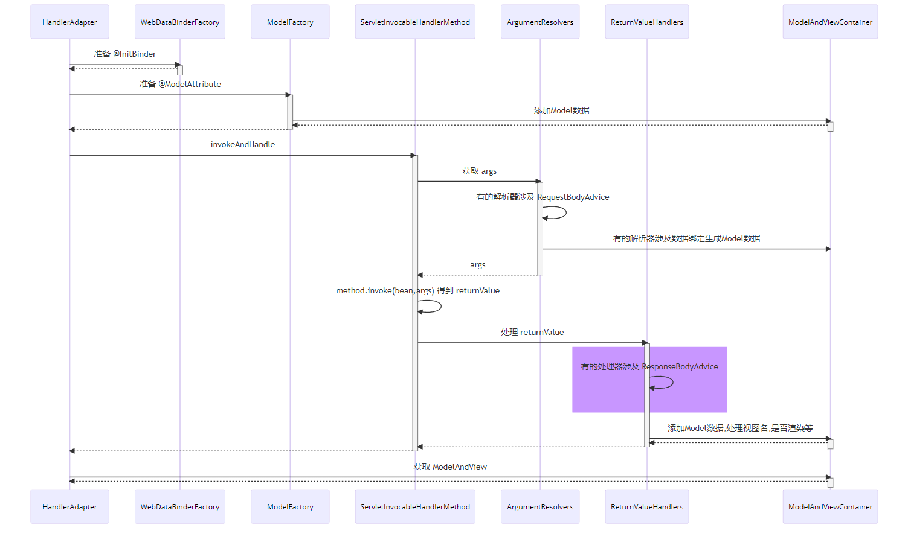

### 29.1.2 收获💡

1. ResponseBodyAdvice 返回响应体前包装


# 30 异常解析器

## 30.1 演示 - ExceptionHandlerExceptionResolver

### 30.1.1 代码参考

```java
package com.itheima.a30;

import lombok.extern.slf4j.Slf4j;
import org.springframework.http.converter.json.MappingJackson2HttpMessageConverter;
import org.springframework.mock.web.MockHttpServletRequest;
import org.springframework.mock.web.MockHttpServletResponse;
import org.springframework.util.ObjectUtils;
import org.springframework.web.bind.annotation.ExceptionHandler;
import org.springframework.web.bind.annotation.ResponseBody;
import org.springframework.web.method.HandlerMethod;
import org.springframework.web.servlet.ModelAndView;
import org.springframework.web.servlet.mvc.method.annotation.ExceptionHandlerExceptionResolver;

import javax.servlet.http.HttpServletRequest;
import java.io.IOException;
import java.io.UnsupportedEncodingException;
import java.nio.charset.StandardCharsets;
import java.util.Collections;
import java.util.Map;

/**
 * @author lyf
 * @version 1.0
 * @classname TestExceptionHandler
 * @description
 * @since 2022/12/14 15:43
 */
@Slf4j
public class TestExceptionHandler {
    public static void main(String[] args) throws NoSuchMethodException, UnsupportedEncodingException {
        // 1 测试Json
        // HandlerMethod handler = new HandlerMethod(new Controller1(), Controller1.class.getMethod("foo"));
        // 2 测试ModelAndView
        // HandlerMethod handler = new HandlerMethod(new Controller2(), Controller2.class.getMethod("foo"));
        // 3 测试嵌套异常
        // HandlerMethod handler = new HandlerMethod(new Controller3(), Controller3.class.getMethod("foo"));
        // 4 测试异常处理方法参数解析
        HandlerMethod handler = new HandlerMethod(new Controller4(), Controller4.class.getMethod("foo"));
        defaultHandler(handler, new Exception("非法的访问异常"));
        
           /*
            学到了什么
                a. ExceptionHandlerExceptionResolver 能够重用参数解析器、返回值处理器，实现组件重用
                b. 能够支持嵌套异常
         */
    }

    private static void defaultHandler(HandlerMethod handler, Exception exception) throws UnsupportedEncodingException {
        // 1 准备异常解析器
        ExceptionHandlerExceptionResolver resolver = new ExceptionHandlerExceptionResolver();
        resolver.setMessageConverters(Collections.singletonList(new MappingJackson2HttpMessageConverter()));
        resolver.afterPropertiesSet();

        // 2 准备模拟请求
        MockHttpServletRequest request = new MockHttpServletRequest();
        MockHttpServletResponse response = new MockHttpServletResponse();

        // 3 准备控制器方法(通过参数传入)


        // 4 准备异常对象
        if (exception == null) {
            exception = new ArithmeticException("被0除");
        }

        // 5 解析异常
        ModelAndView modelAndView = resolver.resolveException(request, response, handler, exception);

        // 6 打印结果
        String content = response.getContentAsString(StandardCharsets.UTF_8);
        if (!ObjectUtils.isEmpty(content)) {
            log.debug("result: {}", content);
        }

        if (modelAndView != null && !ObjectUtils.isEmpty(modelAndView.getViewName())) {
            modelAndView.getModel();
            log.debug("viewName: {}, model: {}", modelAndView.getViewName(), modelAndView.getModel());
        }
    }

    private static void defaultHandler(HandlerMethod handler) throws UnsupportedEncodingException {
        defaultHandler(handler, null);
    }

    /**
     * json
     */
    public static class Controller1 {
        public void foo() {

        }

        @ResponseBody
        @ExceptionHandler
        public Map<String, Object> handle(ArithmeticException exception) {
            return Collections.singletonMap("error", exception.getMessage());
        }
    }

    /**
     * ModelAndView
     */
    public static class Controller2 {
        public void foo() {

        }

        @ExceptionHandler
        public ModelAndView handle(ArithmeticException exception) {
            return new ModelAndView("test2", Collections.singletonMap("error", exception.getMessage()));
        }
    }

    /**
     * 测试嵌套异常
     */
    public static class Controller3 {
        public void foo() {

        }

        @ExceptionHandler
        @ResponseBody
        public Map<String, Object> handle(IOException exception) {
            return Collections.singletonMap("error", exception.getMessage());
        }
    }

    /**
	 * 测试异常处理方法参数解析
	 */
    public static class Controller4 {
        public void foo() {
        }

        @ExceptionHandler
        @ResponseBody
        public Map<String, Object> handler(Exception e, HttpServletRequest request) {
            System.out.println(request);
            return Collections.singletonMap("error", e.getMessage());
        }
    }
}

```


### 30.1.2 收获💡

1. 它能够重用参数解析器、返回值处理器，实现组件重用
2. 它能够支持嵌套异常

# 31 @ControllerAdvice 之 @ExceptionHandler

## 31.1 演示 - 准备 @ExceptionHandler

### 31.1.1 代码参考

```java
package com.itheima.a31;

import com.itheima.a31.config.WebConfig;
import lombok.extern.slf4j.Slf4j;
import org.springframework.context.annotation.AnnotationConfigApplicationContext;
import org.springframework.http.converter.json.MappingJackson2HttpMessageConverter;
import org.springframework.mock.web.MockHttpServletRequest;
import org.springframework.mock.web.MockHttpServletResponse;
import org.springframework.web.method.HandlerMethod;
import org.springframework.web.servlet.mvc.method.annotation.ExceptionHandlerExceptionResolver;

import java.io.UnsupportedEncodingException;
import java.nio.charset.StandardCharsets;
import java.util.Collections;

/**
 * @author lyf
 * @version 1.0
 * @classname TestControllerAdviceAndExceptionHandler
 * @description
 * @since 2022/12/14 16:13
 */
@Slf4j
public class TestControllerAdviceAndExceptionHandler {
    public static void main(String[] args) throws Exception {
        // test1();
        test2();
    }

    /**
     * 运行结果：
     * [DEBUG] 16:38:27.755 [main] c.i.a.TestControllerAdviceAndExceptionHandler - response:{"error":"非法的参数异常"}
     *
     * <p>
     * 通过@ControllerAdvice配置全局的异常处理器来处理Controller未加异常处理器时抛出的异常
     *
     * @throws NoSuchMethodException        NoSuchMethodException
     * @throws UnsupportedEncodingException UnsupportedEncodingException
     */
    private static void test2() throws NoSuchMethodException, UnsupportedEncodingException {
        MockHttpServletRequest request = new MockHttpServletRequest();
        MockHttpServletResponse response = new MockHttpServletResponse();

        AnnotationConfigApplicationContext applicationContext = new AnnotationConfigApplicationContext(WebConfig.class);
        ExceptionHandlerExceptionResolver resolver = applicationContext.getBean(ExceptionHandlerExceptionResolver.class);
        resolver.resolveException(request, response, new HandlerMethod(new Controller(), Controller.class.getMethod("foo")), new IllegalArgumentException("非法的参数异常"));

        log.debug("response:{}", response.getContentAsString(StandardCharsets.UTF_8));
        applicationContext.close();
    }

    /**
     * [DEBUG] 16:30:05.971 [main] c.i.a.TestControllerAdviceAndExceptionHandler - response:
     * 没有异常处理结果
     * 在这个控制器中，我们没有写异常处理器，所以无异常处理结果
     * 但是我们希望，即使我们在这个类中没有写异常处理器，也有一个全局的异常处理器来处理异常
     *
     * @throws NoSuchMethodException        NoSuchMethodException
     * @throws UnsupportedEncodingException UnsupportedEncodingException
     */
    private static void test1() throws NoSuchMethodException, UnsupportedEncodingException {
        MockHttpServletRequest request = new MockHttpServletRequest();
        MockHttpServletResponse response = new MockHttpServletResponse();

        ExceptionHandlerExceptionResolver resolver = new ExceptionHandlerExceptionResolver();
        resolver.setMessageConverters(Collections.singletonList(new MappingJackson2HttpMessageConverter()));
        resolver.afterPropertiesSet();

        HandlerMethod handlerMethod = new HandlerMethod(new Controller(), Controller.class.getMethod("foo"));
        resolver.resolveException(request, response, handlerMethod, new RuntimeException("运行时异常"));
        log.debug("response: {}", response.getContentAsString(StandardCharsets.UTF_8));
    }

    static class Controller {
        public void foo() {
            log.debug("foo...");
        }
    }
}

```


### 31.1.2 收获💡

1. ExceptionHandlerExceptionResolver 初始化时会解析 @ControllerAdvice 中的 @ExceptionHandler 方法
2. ExceptionHandlerExceptionResolver 会以类为单位，在该类首次处理异常时，解析此类的 @ExceptionHandler 方法
3. 以上两种 @ExceptionHandler 的解析结果都会缓存来避免重复解析


# 32 Tomcat 异常处理

* 我们知道 @ExceptionHandler 只能处理发生在 mvc 流程中的异常，例如控制器内、拦截器内，那么如果是 Filter 出现了异常，如何进行处理呢？

* 在 Spring Boot 中，是这么实现的：
  1. 因为内嵌了 Tomcat 容器，因此可以配置 Tomcat 的错误页面，Filter 与 错误页面之间是通过请求转发跳转的，可以在这里做手脚
  2. 先通过 ErrorPageRegistrarBeanPostProcessor 这个后处理器配置错误页面地址，默认为 `/error` 也可以通过 `${server.error.path}` 进行配置
  3. 当 Filter 发生异常时，不会走 Spring 流程，但会走 Tomcat 的错误处理，于是就希望转发至 `/error` 这个地址
     * 当然，如果没有 @ExceptionHandler，那么最终也会走到 Tomcat 的错误处理
  4. Spring Boot 又提供了一个 BasicErrorController，它就是一个标准 @Controller，@RequestMapping 配置为 `/error`，所以处理异常的职责就又回到了 Spring
  5. 异常信息由于会被 Tomcat 放入 request 作用域，因此 BasicErrorController 里也能获取到
  6. 具体异常信息会由 DefaultErrorAttributes 封装好
  7. BasicErrorController 通过 Accept 头判断需要生成哪种 MediaType 的响应
     * 如果要的不是 text/html，走 MessageConverter 流程
     * 如果需要 text/html，走 mvc 流程，此时又分两种情况
       * 配置了 ErrorViewResolver，根据状态码去找 View
       * 没配置或没找到，用 BeanNameViewResolver 根据一个固定为 error 的名字找到 View，即所谓的 WhitelabelErrorView

> ***评价***
>
> * 一个错误处理搞得这么复杂，就问恶心不？

## 32.1 错误现象演示-原始的Tomcat处理异常

### 32.1.1 代码

#### 1 WebConfig

```java
package com.itheima.a32.config;

import lombok.extern.slf4j.Slf4j;
import org.springframework.boot.autoconfigure.web.servlet.DispatcherServletRegistrationBean;
import org.springframework.boot.web.embedded.tomcat.TomcatServletWebServerFactory;
import org.springframework.context.annotation.Bean;
import org.springframework.context.annotation.Configuration;
import org.springframework.stereotype.Controller;
import org.springframework.web.bind.annotation.RequestMapping;
import org.springframework.web.servlet.DispatcherServlet;
import org.springframework.web.servlet.mvc.method.annotation.RequestMappingHandlerMapping;

/**
 * @author lyf
 * @version 1.0
 * @classname WebConfig
 * @description Web容器三部曲，Tomcat工厂，初始化DispatchServlet，将DispatchServlet进行注册
 * @since 2022/12/14 16:43
 */
@Slf4j
@Configuration
public class WebConfig {
    @Bean
    public TomcatServletWebServerFactory tomcatServletWebServerFactory() {
        return new TomcatServletWebServerFactory();
    }

    @Bean
    public DispatcherServlet dispatcherServlet() {
        return new DispatcherServlet();
    }

    @Bean
    public DispatcherServletRegistrationBean registrationBean(DispatcherServlet dispatcherServlet) {
        DispatcherServletRegistrationBean registrationBean = new DispatcherServletRegistrationBean(dispatcherServlet, "/");
        registrationBean.setLoadOnStartup(1);
        return registrationBean;
    }

    @Bean
    public RequestMappingHandlerMapping requestMappingHandlerMapping () {
        return new RequestMappingHandlerMapping();
    }

    @Controller
    public static class MyController {
        @RequestMapping("/hello")
        public String hello() {
            int i = 1 / 0;
            return "hello";
        }
    }
}

```

#### 2 测试代码

```java
package com.itheima.a32.config;

import lombok.extern.slf4j.Slf4j;
import org.springframework.boot.autoconfigure.web.servlet.DispatcherServletRegistrationBean;
import org.springframework.boot.web.embedded.tomcat.TomcatServletWebServerFactory;
import org.springframework.context.annotation.Bean;
import org.springframework.context.annotation.Configuration;
import org.springframework.stereotype.Controller;
import org.springframework.web.bind.annotation.RequestMapping;
import org.springframework.web.servlet.DispatcherServlet;
import org.springframework.web.servlet.mvc.method.annotation.RequestMappingHandlerMapping;

/**
 * @author lyf
 * @version 1.0
 * @classname WebConfig
 * @description Web容器三部曲，Tomcat工厂，初始化DispatchServlet，将DispatchServlet进行注册
 * @since 2022/12/14 16:43
 */
@Slf4j
@Configuration
public class WebConfig {
    @Bean
    public TomcatServletWebServerFactory tomcatServletWebServerFactory() {
        return new TomcatServletWebServerFactory();
    }

    @Bean
    public DispatcherServlet dispatcherServlet() {
        return new DispatcherServlet();
    }

    @Bean
    public DispatcherServletRegistrationBean registrationBean(DispatcherServlet dispatcherServlet) {
        DispatcherServletRegistrationBean registrationBean = new DispatcherServletRegistrationBean(dispatcherServlet, "/");
        registrationBean.setLoadOnStartup(1);
        return registrationBean;
    }

    @Bean
    public RequestMappingHandlerMapping requestMappingHandlerMapping () {
        return new RequestMappingHandlerMapping();
    }

    @Controller
    public static class MyController {
        @RequestMapping("/hello")
        public String hello() {
            int i = 1 / 0;
            return "hello";
        }
    }
}

```

#### 3 测试

在浏览器输入

http://127.0.0.1:8080/hello

##### 3.1 前台显示

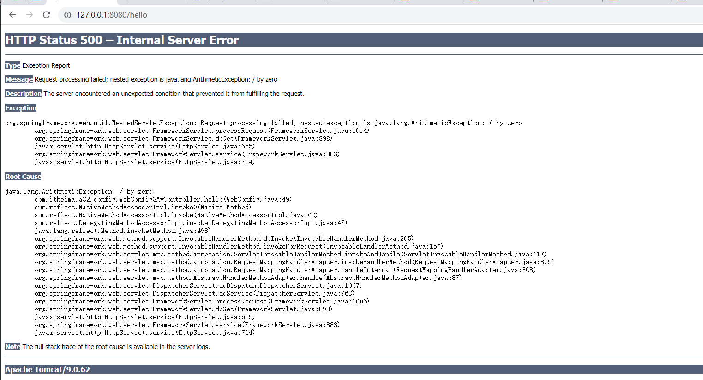

##### 3.2 后台日志

```verilog
[TRACE] 17:02:27.405 [http-nio-8080-exec-3] o.s.web.servlet.DispatcherServlet   - GET "/hello", parameters={}, headers={masked} in DispatcherServlet 'dispatcherServlet' 
[TRACE] 17:02:27.405 [http-nio-8080-exec-3] o.s.web.servlet.DispatcherServlet   - Failed to complete request 
java.lang.ArithmeticException: / by zero
	at com.itheima.a32.config.WebConfig$MyController.hello(WebConfig.java:49)
	at sun.reflect.NativeMethodAccessorImpl.invoke0(Native Method)
	at sun.reflect.NativeMethodAccessorImpl.invoke(NativeMethodAccessorImpl.java:62)
	at sun.reflect.DelegatingMethodAccessorImpl.invoke(DelegatingMethodAccessorImpl.java:43)
	at java.lang.reflect.Method.invoke(Method.java:498)
	at org.springframework.web.method.support.InvocableHandlerMethod.doInvoke(InvocableHandlerMethod.java:205)
	at org.springframework.web.method.support.InvocableHandlerMethod.invokeForRequest(InvocableHandlerMethod.java:150)
	at org.springframework.web.servlet.mvc.method.annotation.ServletInvocableHandlerMethod.invokeAndHandle(ServletInvocableHandlerMethod.java:117)
	at org.springframework.web.servlet.mvc.method.annotation.RequestMappingHandlerAdapter.invokeHandlerMethod(RequestMappingHandlerAdapter.java:895)
	at org.springframework.web.servlet.mvc.method.annotation.RequestMappingHandlerAdapter.handleInternal(RequestMappingHandlerAdapter.java:808)
	at org.springframework.web.servlet.mvc.method.AbstractHandlerMethodAdapter.handle(AbstractHandlerMethodAdapter.java:87)
	at org.springframework.web.servlet.DispatcherServlet.doDispatch(DispatcherServlet.java:1067)
	at org.springframework.web.servlet.DispatcherServlet.doService(DispatcherServlet.java:963)
	at org.springframework.web.servlet.FrameworkServlet.processRequest(FrameworkServlet.java:1006)
	at org.springframework.web.servlet.FrameworkServlet.doGet(FrameworkServlet.java:898)
	at javax.servlet.http.HttpServlet.service(HttpServlet.java:655)
	at org.springframework.web.servlet.FrameworkServlet.service(FrameworkServlet.java:883)
	at javax.servlet.http.HttpServlet.service(HttpServlet.java:764)
	at org.apache.catalina.core.ApplicationFilterChain.internalDoFilter(ApplicationFilterChain.java:227)
	at org.apache.catalina.core.ApplicationFilterChain.doFilter(ApplicationFilterChain.java:162)
	at org.apache.catalina.core.StandardWrapperValve.invoke(StandardWrapperValve.java:197)
	at org.apache.catalina.core.StandardContextValve.invoke(StandardContextValve.java:97)
	at org.apache.catalina.authenticator.AuthenticatorBase.invoke(AuthenticatorBase.java:541)
	at org.apache.catalina.core.StandardHostValve.invoke(StandardHostValve.java:135)
	at org.apache.catalina.valves.ErrorReportValve.invoke(ErrorReportValve.java:92)
	at org.apache.catalina.core.StandardEngineValve.invoke(StandardEngineValve.java:78)
	at org.apache.catalina.connector.CoyoteAdapter.service(CoyoteAdapter.java:360)
	at org.apache.coyote.http11.Http11Processor.service(Http11Processor.java:399)
	at org.apache.coyote.AbstractProcessorLight.process(AbstractProcessorLight.java:65)
	at org.apache.coyote.AbstractProtocol$ConnectionHandler.process(AbstractProtocol.java:890)
	at org.apache.tomcat.util.net.NioEndpoint$SocketProcessor.doRun(NioEndpoint.java:1743)
	at org.apache.tomcat.util.net.SocketProcessorBase.run(SocketProcessorBase.java:49)
	at org.apache.tomcat.util.threads.ThreadPoolExecutor.runWorker(ThreadPoolExecutor.java:1191)
	at org.apache.tomcat.util.threads.ThreadPoolExecutor$Worker.run(ThreadPoolExecutor.java:659)
	at org.apache.tomcat.util.threads.TaskThread$WrappingRunnable.run(TaskThread.java:61)
	at java.lang.Thread.run(Thread.java:748)
十二月 14, 2022 5:02:27 下午 org.apache.catalina.core.StandardWrapperValve invoke
严重: Servlet.service() for servlet [dispatcherServlet] in context with path [] threw exception [Request processing failed; nested exception is java.lang.ArithmeticException: / by zero] with root cause
java.lang.ArithmeticException: / by zero
	at com.itheima.a32.config.WebConfig$MyController.hello(WebConfig.java:49)
	at sun.reflect.NativeMethodAccessorImpl.invoke0(Native Method)
	at sun.reflect.NativeMethodAccessorImpl.invoke(NativeMethodAccessorImpl.java:62)
	at sun.reflect.DelegatingMethodAccessorImpl.invoke(DelegatingMethodAccessorImpl.java:43)
	at java.lang.reflect.Method.invoke(Method.java:498)
	at org.springframework.web.method.support.InvocableHandlerMethod.doInvoke(InvocableHandlerMethod.java:205)
	at org.springframework.web.method.support.InvocableHandlerMethod.invokeForRequest(InvocableHandlerMethod.java:150)
	at org.springframework.web.servlet.mvc.method.annotation.ServletInvocableHandlerMethod.invokeAndHandle(ServletInvocableHandlerMethod.java:117)
	at org.springframework.web.servlet.mvc.method.annotation.RequestMappingHandlerAdapter.invokeHandlerMethod(RequestMappingHandlerAdapter.java:895)
	at org.springframework.web.servlet.mvc.method.annotation.RequestMappingHandlerAdapter.handleInternal(RequestMappingHandlerAdapter.java:808)
	at org.springframework.web.servlet.mvc.method.AbstractHandlerMethodAdapter.handle(AbstractHandlerMethodAdapter.java:87)
	at org.springframework.web.servlet.DispatcherServlet.doDispatch(DispatcherServlet.java:1067)
	at org.springframework.web.servlet.DispatcherServlet.doService(DispatcherServlet.java:963)
	at org.springframework.web.servlet.FrameworkServlet.processRequest(FrameworkServlet.java:1006)
	at org.springframework.web.servlet.FrameworkServlet.doGet(FrameworkServlet.java:898)
	at javax.servlet.http.HttpServlet.service(HttpServlet.java:655)
	at org.springframework.web.servlet.FrameworkServlet.service(FrameworkServlet.java:883)
	at javax.servlet.http.HttpServlet.service(HttpServlet.java:764)
	at org.apache.catalina.core.ApplicationFilterChain.internalDoFilter(ApplicationFilterChain.java:227)
	at org.apache.catalina.core.ApplicationFilterChain.doFilter(ApplicationFilterChain.java:162)
	at org.apache.catalina.core.StandardWrapperValve.invoke(StandardWrapperValve.java:197)
	at org.apache.catalina.core.StandardContextValve.invoke(StandardContextValve.java:97)
	at org.apache.catalina.authenticator.AuthenticatorBase.invoke(AuthenticatorBase.java:541)
	at org.apache.catalina.core.StandardHostValve.invoke(StandardHostValve.java:135)
	at org.apache.catalina.valves.ErrorReportValve.invoke(ErrorReportValve.java:92)
	at org.apache.catalina.core.StandardEngineValve.invoke(StandardEngineValve.java:78)
	at org.apache.catalina.connector.CoyoteAdapter.service(CoyoteAdapter.java:360)
	at org.apache.coyote.http11.Http11Processor.service(Http11Processor.java:399)
	at org.apache.coyote.AbstractProcessorLight.process(AbstractProcessorLight.java:65)
	at org.apache.coyote.AbstractProtocol$ConnectionHandler.process(AbstractProtocol.java:890)
	at org.apache.tomcat.util.net.NioEndpoint$SocketProcessor.doRun(NioEndpoint.java:1743)
	at org.apache.tomcat.util.net.SocketProcessorBase.run(SocketProcessorBase.java:49)
	at org.apache.tomcat.util.threads.ThreadPoolExecutor.runWorker(ThreadPoolExecutor.java:1191)
	at org.apache.tomcat.util.threads.ThreadPoolExecutor$Worker.run(ThreadPoolExecutor.java:659)
	at org.apache.tomcat.util.threads.TaskThread$WrappingRunnable.run(TaskThread.java:61)
	at java.lang.Thread.run(Thread.java:748)

```

#### 4 存在的问题

这种直接在前台页面显示异常不是我们所期待的结果，我们需要显示自定义的错误页面

## 32.2 演示1 - 错误页处理

### 32.1.1 关键代码

```java
@Bean // ⬅️修改了 Tomcat 服务器默认错误地址, 出错时使用请求转发方式跳转
public ErrorPageRegistrar errorPageRegistrar() {
    return webServerFactory -> webServerFactory.addErrorPages(new ErrorPage("/error"));
}

@Bean // ⬅️TomcatServletWebServerFactory 初始化前用它增强, 注册所有 ErrorPageRegistrar
public ErrorPageRegistrarBeanPostProcessor errorPageRegistrarBeanPostProcessor() {
    return new ErrorPageRegistrarBeanPostProcessor();
}
```

### 32.1.2 测试结果

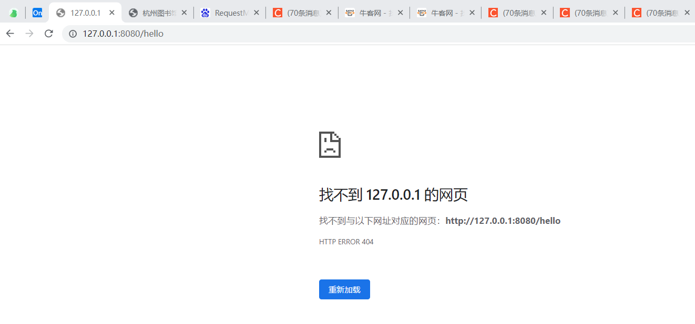

### 32.1.3 解决上述问题

```java
    @Controller
    public static class MyController {
        @RequestMapping("/hello")
        public String hello() {
            int i = 1 / 0;
            return "hello";
        }

        /**
         * 添加自定义的错误信息
         *
         * @param request 请求
         * @return 错误信息
         */
        @RequestMapping("/error")
        @ResponseBody
        public Map<String, Object> error(HttpServletRequest request) {
            Throwable throwable = (Throwable) request.getAttribute(RequestDispatcher.ERROR_EXCEPTION);
            return Collections.singletonMap("error", throwable.getMessage());
        }
    }

    /**
     * 解析控制器方法参数
     * 处理返回值
     *
     * @return RequestMappingHandlerAdapter
     */
    @Bean
    public RequestMappingHandlerAdapter requestMappingHandlerAdapter() {
        RequestMappingHandlerAdapter handlerAdapter = new RequestMappingHandlerAdapter();
        handlerAdapter.setMessageConverters(Collections.singletonList(new MappingJackson2HttpMessageConverter()));
        return handlerAdapter;
    }

```

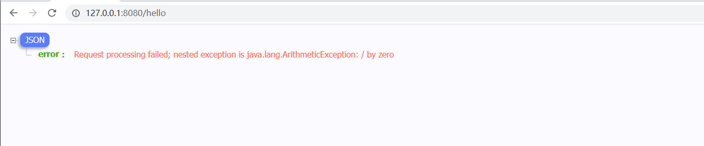

### 32.1.4 收获💡

1. Tomcat 的错误页处理手段

## 32.2 演示2 - BasicErrorController

### 32.2.1 关键代码

```java
    /**
     * ErrorProperties 封装了环境键值，ErrorAttributes控制有哪些错误信息
     * SpringBoot中处理Tomcat异常的流程
     *
     * @return BasicErrorController
     */
    @Bean
    public BasicErrorController basicErrorController() {
        ErrorProperties errorProperties = new ErrorProperties();
        errorProperties.setIncludeException(true);
        return new BasicErrorController(new DefaultErrorAttributes(), errorProperties);
    }

    /**
     * 注意此处的方法名必须为error
     * 方法名就是视图名
     *
     * @return error视图
     */
    @Bean
    public View error() {
        return (model, request, response) -> {
            log.debug("{}", model);
            response.setContentType("text/html;charset=utf-8");
            response.getWriter().print("<h3>服务器内部错误，请联系管理员进行处理</h3>");
        };
    }

    /**
     * 收集容器中所有的View对象，bean的名字作为视图名
     *
     * @return BeanNameViewResolver
     */
    @Bean
    public ViewResolver viewResolver() {
        return new BeanNameViewResolver();
    }

    @Controller
    public static class MyController {
        @RequestMapping("/hello")
        public String hello() {
            int i = 1 / 0;
            return "hello";
        }

        /*   *//**
         * 添加自定义的错误信息
         *
         * @param request 请求
         * @return 错误信息
         *//*
        @RequestMapping("/error")
        @ResponseBody
        public Map<String, Object> error(HttpServletRequest request) {
            Throwable throwable = (Throwable) request.getAttribute(RequestDispatcher.ERROR_EXCEPTION);
            return Collections.singletonMap("error", throwable.getMessage());
        }*/
    }

```

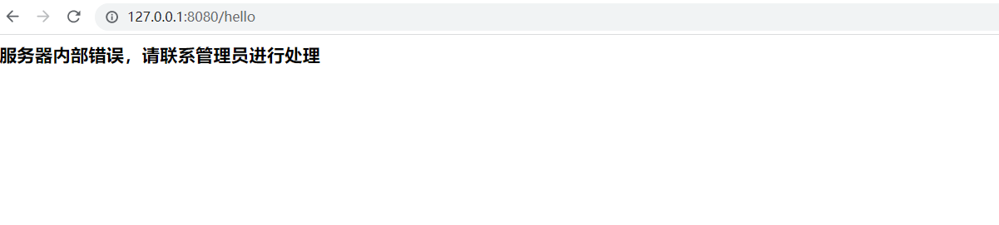

### 32.2.2 完整代码

```java
package com.itheima.a32.config;

import lombok.extern.slf4j.Slf4j;
import org.springframework.boot.autoconfigure.web.ErrorProperties;
import org.springframework.boot.autoconfigure.web.servlet.DispatcherServletRegistrationBean;
import org.springframework.boot.autoconfigure.web.servlet.error.BasicErrorController;
import org.springframework.boot.web.embedded.tomcat.TomcatServletWebServerFactory;
import org.springframework.boot.web.server.ErrorPage;
import org.springframework.boot.web.server.ErrorPageRegistrar;
import org.springframework.boot.web.server.ErrorPageRegistrarBeanPostProcessor;
import org.springframework.boot.web.servlet.error.DefaultErrorAttributes;
import org.springframework.context.annotation.Bean;
import org.springframework.context.annotation.Configuration;
import org.springframework.http.converter.json.MappingJackson2HttpMessageConverter;
import org.springframework.stereotype.Controller;
import org.springframework.web.bind.annotation.RequestMapping;
import org.springframework.web.bind.annotation.ResponseBody;
import org.springframework.web.servlet.DispatcherServlet;
import org.springframework.web.servlet.View;
import org.springframework.web.servlet.ViewResolver;
import org.springframework.web.servlet.mvc.method.annotation.RequestMappingHandlerAdapter;
import org.springframework.web.servlet.mvc.method.annotation.RequestMappingHandlerMapping;
import org.springframework.web.servlet.view.BeanNameViewResolver;

import javax.servlet.RequestDispatcher;
import javax.servlet.http.HttpServletRequest;
import javax.servlet.http.HttpServletResponse;
import java.util.Collections;
import java.util.Map;

/**
 * @author lyf
 * @version 1.0
 * @classname WebConfig
 * @description Web容器三部曲，Tomcat工厂，初始化DispatchServlet，将DispatchServlet进行注册
 * @since 2022/12/14 16:43
 */
@Slf4j
@Configuration
public class WebConfig {
    @Bean
    public TomcatServletWebServerFactory tomcatServletWebServerFactory() {
        return new TomcatServletWebServerFactory();
    }

    @Bean
    public DispatcherServlet dispatcherServlet() {
        return new DispatcherServlet();
    }

    @Bean
    public DispatcherServletRegistrationBean registrationBean(DispatcherServlet dispatcherServlet) {
        DispatcherServletRegistrationBean registrationBean = new DispatcherServletRegistrationBean(dispatcherServlet, "/");
        registrationBean.setLoadOnStartup(1);
        return registrationBean;
    }


    @Bean
    public RequestMappingHandlerMapping requestMappingHandlerMapping() {
        return new RequestMappingHandlerMapping();
    }

    /**
     * 解析控制器方法参数
     * 处理返回值
     *
     * @return RequestMappingHandlerAdapter
     */
    @Bean
    public RequestMappingHandlerAdapter requestMappingHandlerAdapter() {
        RequestMappingHandlerAdapter handlerAdapter = new RequestMappingHandlerAdapter();
        handlerAdapter.setMessageConverters(Collections.singletonList(new MappingJackson2HttpMessageConverter()));
        return handlerAdapter;
    }

    /**
     * 修改了Tomcat服务器默认的错误地址，出错时使用请求转发的方式进行跳转
     *
     * @return ErrorPageRegistrar
     */
    @Bean
    public ErrorPageRegistrar errorPageRegistrar() {
        return webServletFactory -> webServletFactory.addErrorPages(new ErrorPage("/error"));
    }


    /**
     * TomcatServletWebServerFactory 初始化前用它增强，注册所有的 ErrorPageRegistrar
     *
     * @return ErrorPageRegistrarBeanPostProcessor
     */
    @Bean
    public ErrorPageRegistrarBeanPostProcessor errorPageRegistrarBeanPostProcessor() {
        return new ErrorPageRegistrarBeanPostProcessor();
    }

    /**
     * ErrorProperties 封装了环境键值，ErrorAttributes控制有哪些错误信息
     * SpringBoot中处理Tomcat异常的流程
     *
     * @return BasicErrorController
     */
    @Bean
    public BasicErrorController basicErrorController() {
        ErrorProperties errorProperties = new ErrorProperties();
        errorProperties.setIncludeException(true);
        return new BasicErrorController(new DefaultErrorAttributes(), errorProperties);
    }

    /**
     * 注意此处的方法名必须为error
     * 方法名就是视图名
     *
     * @return error视图
     */
    @Bean
    public View error() {
        return (model, request, response) -> {
            log.debug("{}", model);
            response.setContentType("text/html;charset=utf-8");
            response.getWriter().print("<h3>服务器内部错误，请联系管理员进行处理</h3>");
        };
    }

    /**
     * 收集容器中所有的View对象，bean的名字作为视图名
     *
     * @return BeanNameViewResolver
     */
    @Bean
    public ViewResolver viewResolver() {
        return new BeanNameViewResolver();
    }

    @Controller
    public static class MyController {
        @RequestMapping("/hello")
        public String hello() {
            int i = 1 / 0;
            return "hello";
        }

        /*   *//**
         * 添加自定义的错误信息
         *
         * @param request 请求
         * @return 错误信息
         *//*
        @RequestMapping("/error")
        @ResponseBody
        public Map<String, Object> error(HttpServletRequest request) {
            Throwable throwable = (Throwable) request.getAttribute(RequestDispatcher.ERROR_EXCEPTION);
            return Collections.singletonMap("error", throwable.getMessage());
        }*/
    }
}

```

#### 测试代码

```java
package com.itheima.a32;

import com.itheima.a32.config.WebConfig;
import lombok.extern.slf4j.Slf4j;
import org.springframework.boot.web.servlet.context.AnnotationConfigServletWebServerApplicationContext;
import org.springframework.context.annotation.AnnotationConfigApplicationContext;
import org.springframework.web.servlet.mvc.method.annotation.RequestMappingHandlerMapping;

/**
 * @author lyf
 * @version 1.0
 * @classname TestTomcatExceptionHandler
 * @description 测试Tomcat的异常处理流程
 * @since 2022/12/14 16:42
 */
@Slf4j
public class TestTomcatExceptionHandler {
    public static void main(String[] args) {
        AnnotationConfigServletWebServerApplicationContext applicationContext
                = new AnnotationConfigServletWebServerApplicationContext(WebConfig.class);

        RequestMappingHandlerMapping handlerMapping = applicationContext.getBean(RequestMappingHandlerMapping.class);
        handlerMapping.getHandlerMethods().forEach((key, value) -> {
            System.out.println(key + "=" + value);
        });
    }
}

```


### 32.2.3 收获💡

1. Spring Boot 中 BasicErrorController 如何工作


# 33 BeanNameUrlHandlerMapping 与 SimpleControllerHandlerAdapter

## 33.1 测试BeanNameUrlHandlerMapping 和SimpleControllerHandlerAdapter

### 33.1.1 WebConfig

```java
package com.itheima.a33.config;

import lombok.extern.slf4j.Slf4j;
import org.springframework.boot.autoconfigure.web.servlet.DispatcherServletRegistrationBean;
import org.springframework.boot.web.embedded.tomcat.TomcatServletWebServerFactory;
import org.springframework.context.annotation.Bean;
import org.springframework.context.annotation.Configuration;
import org.springframework.stereotype.Component;
import org.springframework.web.servlet.DispatcherServlet;
import org.springframework.web.servlet.ModelAndView;
import org.springframework.web.servlet.handler.BeanNameUrlHandlerMapping;
import org.springframework.web.servlet.mvc.Controller;
import org.springframework.web.servlet.mvc.SimpleControllerHandlerAdapter;

import javax.servlet.http.HttpServletRequest;
import javax.servlet.http.HttpServletResponse;

/**
 * @author lyf
 * @version 1.0
 * @classname WebConfig
 * @description
 * @since 2022/12/14 17:47
 */
@Configuration
@Slf4j
public class WebConfig {
    @Bean
    public TomcatServletWebServerFactory tomcatServletWebServerFactory() {
        return new TomcatServletWebServerFactory();
    }

    @Bean
    public DispatcherServlet dispatcherServlet() {
        return new DispatcherServlet();
    }

    @Bean
    public DispatcherServletRegistrationBean dispatcherServletRegistrationBean(DispatcherServlet dispatcherServlet) {
        DispatcherServletRegistrationBean registrationBean = new DispatcherServletRegistrationBean(dispatcherServlet, "/");
        registrationBean.setLoadOnStartup(1);
        return registrationBean;
    }

    @Bean
    public BeanNameUrlHandlerMapping beanNameUrlHandlerMapping() {
        return new BeanNameUrlHandlerMapping();
    }

    @Bean
    public SimpleControllerHandlerAdapter simpleControllerHandlerAdapter() {
        return new SimpleControllerHandlerAdapter();
    }

    @Component("/c1")
    public static class Controller1 implements Controller {
        @Override
        public ModelAndView handleRequest(HttpServletRequest request, HttpServletResponse response) throws Exception {
            response.getWriter().print("this is c1");
            return null;
        }
    }

    @Component("/c2")
    public static class Controller2 implements Controller {
        @Override
        public ModelAndView handleRequest(HttpServletRequest request, HttpServletResponse response) throws Exception {
            response.getWriter().print("this is c2");
            return null;
        }
    }

    @Bean("/c3")
    public Controller controller3() {
        return (request, response) -> {
            response.getWriter().print("this is c3");
            return null;
        };
    }
}

```

### 33.1.2 测试代码

```java
package com.itheima.a33;

import com.itheima.a33.config.WebConfig;
import lombok.extern.slf4j.Slf4j;
import org.springframework.boot.web.servlet.context.AnnotationConfigServletWebServerApplicationContext;

/**
 * @author lyf
 * @version 1.0
 * @classname TestBeanNameUrlHandlerMappingAndSimpleControllerHandlerAdapter
 * @description
 * @since 2022/12/14 17:45
 */
@Slf4j
public class TestBeanNameUrlHandlerMappingAndSimpleControllerHandlerAdapter {
    public static void main(String[] args) {
        AnnotationConfigServletWebServerApplicationContext applicationContext
                = new AnnotationConfigServletWebServerApplicationContext(WebConfig.class);

         /*
            学到了什么
                a. BeanNameUrlHandlerMapping, 以 / 开头的 bean 的名字会被当作映射路径
                b. 这些 bean 本身当作 handler, 要求实现 Controller 接口
                c. SimpleControllerHandlerAdapter, 调用 handler

            对比
                a. RequestMappingHandlerAdapter, 以 @RequestMapping 作为映射路径
                b. 控制器的具体方法会被当作 handler
                c. RequestMappingHandlerAdapter, 调用 handler
         */
    }
}

```


## 33.2 演示 - 本组映射器和适配器

### 33.2.1 关键代码

```java
@Bean
public BeanNameUrlHandlerMapping beanNameUrlHandlerMapping() {
    return new BeanNameUrlHandlerMapping();
}

@Bean
public SimpleControllerHandlerAdapter simpleControllerHandlerAdapter() {
    return new SimpleControllerHandlerAdapter();
}

@Bean("/c3")
public Controller controller3() {
    return (request, response) -> {
        response.getWriter().print("this is c3");
        return null;
    };
}
```

## 33.3 自定义实现此组Mapping和Adapter

### 33.3.1 MyBeanNameUrlHandlerMapping

```java
package com.itheima.a33.custom;

import lombok.extern.slf4j.Slf4j;
import org.springframework.beans.factory.annotation.Autowired;
import org.springframework.context.ApplicationContext;
import org.springframework.web.servlet.HandlerExecutionChain;
import org.springframework.web.servlet.HandlerMapping;
import org.springframework.web.servlet.mvc.Controller;

import javax.annotation.PostConstruct;
import javax.servlet.http.HttpServletRequest;
import java.util.HashMap;
import java.util.Map;
import java.util.stream.Collectors;

/**
 * @author lyf
 * @version 1.0
 * @classname MyBeanNameUrlHandlerMapping
 * @description
 * @since 2022/12/14 18:05
 */
@Slf4j
public class MyBeanNameUrlHandlerMapping implements HandlerMapping {
    @Override
    public boolean usesPathPatterns() {
        return HandlerMapping.super.usesPathPatterns();
    }

    @Override
    public HandlerExecutionChain getHandler(HttpServletRequest request) throws Exception {
        // 获取请求路径
        String uri = request.getRequestURI();
        log.debug("{}", controllerMap);
        // 从Map中获取Controller
        Controller controller = controllerMap.get(uri);
        if (controller == null) {
            return null;
        }
        
        // 返回执行器链
        return new HandlerExecutionChain(controller);
    }

    @Autowired
    private ApplicationContext applicationContext;

    /**
     * 存储所有以 "/" 开头的Controller
     */
    private Map<String, Controller> controllerMap = new HashMap<>();


    @PostConstruct
    public void init() {
        /*
         * 将所有以"/" 开头的Controller放入Map集合之中
         */
        controllerMap.putAll(
                applicationContext
                        .getBeansOfType(Controller.class)
                        .entrySet()
                        .stream()
                        .filter(entry -> entry.getKey().startsWith("/"))
                        .collect(Collectors.toMap(Map.Entry::getKey, Map.Entry::getValue))
        );
    }
}

```


### 33.3.2 MySimpleHandlerMappingAdapter

```java
package com.itheima.a33.custom;

import lombok.extern.slf4j.Slf4j;
import org.springframework.web.servlet.HandlerAdapter;
import org.springframework.web.servlet.ModelAndView;
import org.springframework.web.servlet.mvc.Controller;

import javax.servlet.http.HttpServletRequest;
import javax.servlet.http.HttpServletResponse;

/**
 * @author lyf
 * @version 1.0
 * @classname MySimpleHandlerMappingAdapter
 * @description
 * @since 2022/12/14 18:06
 */
@Slf4j
public class MySimpleHandlerMappingAdapter implements HandlerAdapter {
    @Override
    public boolean supports(Object handler) {
        // 只支持Controller对象
        return handler instanceof Controller;
    }

    @Override
    public ModelAndView handle(HttpServletRequest request, HttpServletResponse response, Object handler) throws Exception {
        if (handler instanceof Controller) {
            return ((Controller) handler).handleRequest(request, response);
        }
        return null;
    }

    /**
     * 此方法已经被废弃了，所以无需在意
     *
     * @param request
     * @param handler
     * @return
     */
    @Override
    @Deprecated
    public long getLastModified(HttpServletRequest request, Object handler) {
        return -1;
    }
}

```

### 33.3.3 WebConfig2

```java
package com.itheima.a33.config;

import com.itheima.a33.custom.MyBeanNameUrlHandlerMapping;
import com.itheima.a33.custom.MySimpleHandlerMappingAdapter;
import lombok.extern.slf4j.Slf4j;
import org.springframework.boot.autoconfigure.web.servlet.DispatcherServletRegistrationBean;
import org.springframework.boot.web.embedded.tomcat.TomcatServletWebServerFactory;
import org.springframework.context.annotation.Bean;
import org.springframework.context.annotation.Configuration;
import org.springframework.stereotype.Component;
import org.springframework.web.servlet.DispatcherServlet;
import org.springframework.web.servlet.ModelAndView;
import org.springframework.web.servlet.mvc.Controller;

import javax.servlet.http.HttpServletRequest;
import javax.servlet.http.HttpServletResponse;

/**
 * @author lyf
 * @version 1.0
 * @classname WebConfig
 * @description
 * @since 2022/12/14 17:47
 */
@Configuration
@Slf4j
public class WebConfig2 {
    @Bean
    public TomcatServletWebServerFactory tomcatServletWebServerFactory() {
        return new TomcatServletWebServerFactory();
    }

    @Bean
    public DispatcherServlet dispatcherServlet() {
        return new DispatcherServlet();
    }

    @Bean
    public DispatcherServletRegistrationBean dispatcherServletRegistrationBean(DispatcherServlet dispatcherServlet) {
        DispatcherServletRegistrationBean registrationBean = new DispatcherServletRegistrationBean(dispatcherServlet, "/");
        registrationBean.setLoadOnStartup(1);
        return registrationBean;
    }

    @Bean
    public MyBeanNameUrlHandlerMapping myBeanNameUrlHandlerMapping() {
        return new MyBeanNameUrlHandlerMapping();
    }

    @Bean
    public MySimpleHandlerMappingAdapter mySimpleHandlerMappingAdapter() {
        return new MySimpleHandlerMappingAdapter();
    }

    @Component("/c1")
    public static class Controller1 implements Controller {
        @Override
        public ModelAndView handleRequest(HttpServletRequest request, HttpServletResponse response) throws Exception {
            response.getWriter().print("this is c1");
            return null;
        }
    }

    @Component("/c2")
    public static class Controller2 implements Controller {
        @Override
        public ModelAndView handleRequest(HttpServletRequest request, HttpServletResponse response) throws Exception {
            response.getWriter().print("this is c2");
            return null;
        }
    }

    @Bean("/c3")
    public Controller controller3() {
        return (request, response) -> {
            response.getWriter().print("this is c3");
            return null;
        };
    }

    @Bean("c4")
    public Controller controller4() {
        return (request, response) -> {
            response.getWriter().print("this is c4");
            return null;
        };
    }
}

```


### 33.3.4 测试代码

```java
package com.itheima.a33;

import com.itheima.a33.config.WebConfig2;
import lombok.extern.slf4j.Slf4j;
import org.springframework.boot.web.servlet.context.AnnotationConfigServletWebServerApplicationContext;

/**
 * @author lyf
 * @version 1.0
 * @classname TestBeanNameUrlHandlerMappingAndSimpleControllerHandlerAdapter
 * @description
 * @since 2022/12/14 17:45
 */
@Slf4j
public class TestBeanNameUrlHandlerMappingAndSimpleControllerHandlerAdapter2 {
    public static void main(String[] args) {
        AnnotationConfigServletWebServerApplicationContext applicationContext
                = new AnnotationConfigServletWebServerApplicationContext(WebConfig2.class);

         /*
            学到了什么
                a. BeanNameUrlHandlerMapping, 以 / 开头的 bean 的名字会被当作映射路径
                b. 这些 bean 本身当作 handler, 要求实现 Controller 接口
                c. SimpleControllerHandlerAdapter, 调用 handler

            对比
                a. RequestMappingHandlerAdapter, 以 @RequestMapping 作为映射路径
                b. 控制器的具体方法会被当作 handler
                c. RequestMappingHandlerAdapter, 调用 handler
         */
    }
}

```


## 33.4 收获💡

1. BeanNameUrlHandlerMapping，以 / 开头的 bean 的名字会被当作映射路径
2. 这些 bean 本身当作 handler，要求实现 Controller 接口
3. SimpleControllerHandlerAdapter，调用 handler
4. 模拟实现这组映射器和适配器


# 34 RouterFunctionMapping 与 HandlerFunctionAdapter

## 34.1 演示 - 本组映射器和适配器

### 34.1.1 完整代码

#### 1 WebConfig

```java
package com.itheima.a34.config;

import lombok.extern.slf4j.Slf4j;
import org.springframework.boot.autoconfigure.web.servlet.DispatcherServletRegistrationBean;
import org.springframework.boot.web.embedded.tomcat.TomcatServletWebServerFactory;
import org.springframework.context.annotation.Bean;
import org.springframework.context.annotation.Configuration;
import org.springframework.web.servlet.DispatcherServlet;
import org.springframework.web.servlet.function.*;
import org.springframework.web.servlet.function.support.HandlerFunctionAdapter;
import org.springframework.web.servlet.function.support.RouterFunctionMapping;

import java.util.Optional;

/**
 * @author lyf
 * @version 1.0
 * @classname WebConfig
 * @description
 * @since 2022/12/14 18:32
 */
@Slf4j
@Configuration
public class WebConfig {
    @Bean
    public TomcatServletWebServerFactory tomcatServletWebServerFactory() {
        return new TomcatServletWebServerFactory();
    }

    @Bean
    public DispatcherServlet dispatcherServlet() {
        return new DispatcherServlet();
    }

    @Bean
    public DispatcherServletRegistrationBean dispatcherServletRegistrationBean(DispatcherServlet dispatcherServlet) {
        DispatcherServletRegistrationBean registrationBean = new DispatcherServletRegistrationBean(dispatcherServlet, "/");
        registrationBean.setLoadOnStartup(1);
        return registrationBean;
    }

    @Bean
    public RouterFunctionMapping routerFunctionMapping() {
        return new RouterFunctionMapping();
    }

    @Bean
    public HandlerFunctionAdapter handlerFunctionAdapter() {
        return new HandlerFunctionAdapter();
    }

    @Bean
    public RouterFunction<ServerResponse> r1() {
        return RouterFunctions.route(RequestPredicates.GET("/r1"), request -> ServerResponse.ok().body("this is r1"));
    }

    @Bean
    public RouterFunction<ServerResponse> r2() {
        return RouterFunctions.route(RequestPredicates.GET("/r2"), request -> ServerResponse.ok().body("this is r2"));
    }
}

```


#### 2 测试代码

```java
package com.itheima.a34;

import com.itheima.a34.config.WebConfig;
import lombok.extern.slf4j.Slf4j;
import org.springframework.boot.web.servlet.context.AnnotationConfigServletWebServerApplicationContext;

/**
 * @author lyf
 * @version 1.0
 * @classname TestRouterFunctionMappingAndHandlerFunctionAdapter
 * @description
 * @since 2022/12/14 18:31
 */
@Slf4j
public class TestRouterFunctionMappingAndHandlerFunctionAdapter {
    public static void main(String[] args) {
        AnnotationConfigServletWebServerApplicationContext applicationContext
                = new AnnotationConfigServletWebServerApplicationContext(WebConfig.class);
    }
}

```

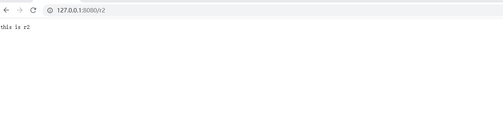

### 34.1.2 关键代码

```java
@Bean
public RouterFunctionMapping routerFunctionMapping() {
    return new RouterFunctionMapping();
}

@Bean
public HandlerFunctionAdapter handlerFunctionAdapter() {
    return new HandlerFunctionAdapter();
}

@Bean
public RouterFunction<ServerResponse> r1() {
    //           ⬇️映射条件   ⬇️handler
    return route(GET("/r1"), request -> ok().body("this is r1"));
}
```

## 34.2 收获💡

1. RouterFunctionMapping, 通过 RequestPredicate 条件映射
2. handler 要实现 HandlerFunction 接口
3. HandlerFunctionAdapter, 调用 handler


# 35 SimpleUrlHandlerMapping 与 HttpRequestHandlerAdapter

## 35.1 演示1 - 本组映射器和适配器

### 35.1.1 代码参考

> ps 必须要放在org.springframework.boot.autoconfigure.web.servlet包中
>
> 不然欢迎页无法配置
>
> WelcomePageHandlerMapping

#### 1 WebConfig

```java
package org.springframework.boot.autoconfigure.web.servlet;

import lombok.extern.slf4j.Slf4j;
import org.springframework.boot.autoconfigure.web.servlet.DispatcherServletRegistrationBean;
import org.springframework.boot.web.embedded.tomcat.TomcatServletWebServerFactory;
import org.springframework.cache.concurrent.ConcurrentMapCache;
import org.springframework.context.ApplicationContext;
import org.springframework.context.annotation.Bean;
import org.springframework.context.annotation.Configuration;
import org.springframework.core.io.ClassPathResource;
import org.springframework.core.io.Resource;
import org.springframework.util.FileCopyUtils;
import org.springframework.web.servlet.DispatcherServlet;
import org.springframework.web.servlet.handler.SimpleUrlHandlerMapping;
import org.springframework.web.servlet.mvc.HttpRequestHandlerAdapter;
import org.springframework.web.servlet.mvc.SimpleControllerHandlerAdapter;
import org.springframework.web.servlet.resource.CachingResourceResolver;
import org.springframework.web.servlet.resource.EncodedResourceResolver;
import org.springframework.web.servlet.resource.PathResourceResolver;
import org.springframework.web.servlet.resource.ResourceHttpRequestHandler;

import javax.annotation.PostConstruct;
import java.io.File;
import java.io.FileInputStream;
import java.io.FileOutputStream;
import java.io.IOException;
import java.util.*;
import java.util.zip.GZIPOutputStream;

/**
 * @author lyf
 * @version 1.0
 * @classname WebConfig
 * @description
 * @since 2022/12/14 18:51
 */
@Slf4j
@Configuration
public class WebConfig {
    @Bean
    public TomcatServletWebServerFactory tomcatServletWebServerFactory() {
        return new TomcatServletWebServerFactory();
    }

    @Bean
    public DispatcherServlet dispatcherServlet() {
        return new DispatcherServlet();
    }

    @Bean
    public DispatcherServletRegistrationBean dispatcherServletRegistrationBean(DispatcherServlet dispatcherServlet) {
        DispatcherServletRegistrationBean registrationBean = new DispatcherServletRegistrationBean(dispatcherServlet, "/");
        registrationBean.setLoadOnStartup(1);
        return registrationBean;
    }

    /**
     * 1 SimpleUrlHandlerMapping 不会在初始化的时收集映射信息，需要手动收集
     * 2 SimpleUrlHandlerMapping 映射路径
     * 3 ResourceHttpRequestHandler 作为静态资源的handler
     * 4 HttpRequestHandlerAdapter 会调用ResourceHttpRequestHandler
     *
     * @param applicationContext applicationContext
     * @return SimpleUrlHandlerMapping
     */
    @Bean
    public SimpleUrlHandlerMapping simpleUrlHandlerMapping(ApplicationContext applicationContext) {
        SimpleUrlHandlerMapping handlerMapping = new SimpleUrlHandlerMapping();
        Map<String, ResourceHttpRequestHandler> urlMap = applicationContext.getBeansOfType(ResourceHttpRequestHandler.class);
        handlerMapping.setUrlMap(urlMap);
        log.debug("urlMap: {}", urlMap);
        return handlerMapping;
    }

    /**
     * 4 HttpRequestHandlerAdapter 会调用ResourceHttpRequestHandler
     *
     * @return HttpRequestHandlerAdapter
     */
    @Bean
    public HttpRequestHandlerAdapter httpRequestHandlerAdapter() {
        return new HttpRequestHandlerAdapter();
    }

    /**
     * /index.html
     * /r1.html
     * /r2.html
     * <p>
     * /**
     */
    @Bean("/**")
    public ResourceHttpRequestHandler handler1() {
        ResourceHttpRequestHandler handler = new ResourceHttpRequestHandler();
        // 设置静态资源的路径
        handler.setLocations(Collections.singletonList(new ClassPathResource("static/")));
        // 设置静态资源的解析器
        handler.setResourceResolvers(new ArrayList<>(Arrays.asList(
                new CachingResourceResolver(new ConcurrentMapCache("cache1")), // 缓存
                new EncodedResourceResolver(), // 编码资源解析器
                new PathResourceResolver() // 路径资源解析器
        )));
        return handler;
    }

    /**
     * /img/1.jpg
     * /img/2.jpg
     * /img/3.jpg
     * <p>
     * /img/**
     */
    @Bean("/img/**")
    public ResourceHttpRequestHandler handler2() {
        ResourceHttpRequestHandler handler = new ResourceHttpRequestHandler();
        handler.setLocations(Collections.singletonList(new ClassPathResource("images/")));
        return handler;
    }

    /**
     * 配置欢迎页需配合SimpleControllerHandlerAdapter使用
     *
     * @param applicationContext applicationContext
     * @return WelcomePageHandlerMapping
     */
    @Bean
    public WelcomePageHandlerMapping WelcomePageHandlerMapping(ApplicationContext applicationContext) {
        Resource resource = applicationContext.getResource("classpath:static/index.html");
        return new WelcomePageHandlerMapping(null, applicationContext, resource, "/**");
    }

    @Bean
    public SimpleControllerHandlerAdapter simpleControllerHandlerAdapter() {
        return new SimpleControllerHandlerAdapter();
    }

    /**
     * 压缩文本
     *
     * @throws IOException IOException
     */
    @PostConstruct
    public void initGZip() throws IOException {
        Resource resource = new ClassPathResource("static");
        File file = resource.getFile();
        File[] files = file.listFiles(pathname -> pathname.getName().endsWith(".html"));
        if (files != null) {
            for (File htmlFile : files) {
                try (FileInputStream fis = new FileInputStream(htmlFile);
                     GZIPOutputStream zipOs = new GZIPOutputStream(new FileOutputStream(htmlFile.getCanonicalPath() + ".gz"));) {
                    FileCopyUtils.copy(fis, zipOs);
                }
            }
        }
    }
}

```

#### 2 测试代码

```java
package org.springframework.boot.autoconfigure.web.servlet;

import org.springframework.boot.autoconfigure.web.servlet.WebConfig;
import lombok.extern.slf4j.Slf4j;
import org.springframework.boot.web.servlet.context.AnnotationConfigServletWebServerApplicationContext;

/**
 * @author lyf
 * @version 1.0
 * @classname TestSimpleUrlHandlerMappingAndHttpRequestHandlerAdapter
 * @description
 * @since 2022/12/14 18:51
 */
@Slf4j
public class TestSimpleUrlHandlerMappingAndHttpRequestHandlerAdapter {
    public static void main(String[] args) {
        AnnotationConfigServletWebServerApplicationContext applicationContext
                = new AnnotationConfigServletWebServerApplicationContext(WebConfig.class);

          /*
            学到了什么
            静态资源处理
                a. SimpleUrlHandlerMapping 映射路径
                b. ResourceHttpRequestHandler 作为静态资源 handler
                c. HttpRequestHandlerAdapter, 调用此 handler

            欢迎页处理
                a. WelcomePageHandlerMapping, 映射欢迎页(即只映射 '/')
                    - 它内置了 handler ParameterizableViewController 作用是不执行逻辑, 仅根据视图名找视图
                    - 视图名固定为 forward:index.html       /**
                b. SimpleControllerHandlerAdapter, 调用 handler
                    - 转发至 /index.html
                    - 处理 /index.html 又会走上面的静态资源处理流程

        */

        /*
            小结
                a. HandlerMapping 负责建立请求与控制器之间的映射关系
                    - RequestMappingHandlerMapping (与 @RequestMapping 匹配)
                    - WelcomePageHandlerMapping    (/)
                    - BeanNameUrlHandlerMapping    (与 bean 的名字匹配 以 / 开头)
                    - RouterFunctionMapping        (函数式 RequestPredicate, HandlerFunction)
                    - SimpleUrlHandlerMapping      (静态资源 通配符 /** /img/**)
                    之间也会有顺序问题, boot 中默认顺序如上
                b. HandlerAdapter 负责实现对各种各样的 handler 的适配调用
                    - RequestMappingHandlerAdapter 处理：@RequestMapping 方法
                           参数解析器、返回值处理器体现了组合模式
                    - SimpleControllerHandlerAdapter 处理：Controller 接口
                    - HandlerFunctionAdapter 处理：HandlerFunction 函数式接口
                    - HttpRequestHandlerAdapter 处理：HttpRequestHandler 接口 (静态资源处理)
                    这也是典型适配器模式体现
                c. ResourceHttpRequestHandler.setResourceResolvers 这是典型责任链模式体现
         */
    }
}

```


### 35.1.2 关键代码

```java
@Bean
public SimpleUrlHandlerMapping simpleUrlHandlerMapping(ApplicationContext context) {
    SimpleUrlHandlerMapping handlerMapping = new SimpleUrlHandlerMapping();
    Map<String, ResourceHttpRequestHandler> map 
        = context.getBeansOfType(ResourceHttpRequestHandler.class);
    handlerMapping.setUrlMap(map);
    return handlerMapping;
}

@Bean
public HttpRequestHandlerAdapter httpRequestHandlerAdapter() {
    return new HttpRequestHandlerAdapter();
}

@Bean("/**")
public ResourceHttpRequestHandler handler1() {
    ResourceHttpRequestHandler handler = new ResourceHttpRequestHandler();
    handler.setLocations(List.of(new ClassPathResource("static/")));
    return handler;
}

@Bean("/img/**")
public ResourceHttpRequestHandler handler2() {
    ResourceHttpRequestHandler handler = new ResourceHttpRequestHandler();
    handler.setLocations(List.of(new ClassPathResource("images/")));
    return handler;
}
```

### 35.1.3 收获💡

1. SimpleUrlHandlerMapping 不会在初始化时收集映射信息，需要手动收集
2. SimpleUrlHandlerMapping 映射路径
3. ResourceHttpRequestHandler 作为静态资源 handler
4. HttpRequestHandlerAdapter, 调用此 handler


## 35.2 演示2 - 静态资源解析优化

### 35.2.1 关键代码

```java
@Bean("/**")
public ResourceHttpRequestHandler handler1() {
    ResourceHttpRequestHandler handler = new ResourceHttpRequestHandler();
    handler.setLocations(List.of(new ClassPathResource("static/")));
    handler.setResourceResolvers(List.of(
        	// ⬇️缓存优化
            new CachingResourceResolver(new ConcurrentMapCache("cache1")),
        	// ⬇️压缩优化
            new EncodedResourceResolver(),
        	// ⬇️原始资源解析
            new PathResourceResolver()
    ));
    return handler;
}
```

### 35.2.2 收获💡

1. 责任链模式体现
2. 压缩文件需要手动生成


## 35.3 演示3 - 欢迎页

### 35.3.1 关键代码

```java
@Bean
public WelcomePageHandlerMapping welcomePageHandlerMapping(ApplicationContext context) {
    Resource resource = context.getResource("classpath:static/index.html");
    return new WelcomePageHandlerMapping(null, context, resource, "/**");
}

@Bean
public SimpleControllerHandlerAdapter simpleControllerHandlerAdapter() {
    return new SimpleControllerHandlerAdapter();
}
```

### 35.3.2 收获💡

1. 欢迎页支持静态欢迎页与动态欢迎页
2. WelcomePageHandlerMapping 映射欢迎页（即只映射 '/'）
   * 它内置的 handler ParameterizableViewController 作用是不执行逻辑，仅根据视图名找视图
   * 视图名固定为 forward:index.html
3. SimpleControllerHandlerAdapter, 调用 handler
   * 转发至 /index.html
   * 处理 /index.html 又会走上面的静态资源处理流程


## 35.4 映射器与适配器小结

1. HandlerMapping 负责建立请求与控制器之间的映射关系
   * RequestMappingHandlerMapping (与 @RequestMapping 匹配)
   * WelcomePageHandlerMapping    (/)
   * BeanNameUrlHandlerMapping    (与 bean 的名字匹配 以 / 开头)
   * RouterFunctionMapping        (函数式 RequestPredicate, HandlerFunction)
   * SimpleUrlHandlerMapping      (静态资源 通配符 /** /img/**)
   * 之间也会有顺序问题, boot 中默认顺序如上
2. HandlerAdapter 负责实现对各种各样的 handler 的适配调用
   * RequestMappingHandlerAdapter 处理：@RequestMapping 方法
     * 参数解析器、返回值处理器体现了组合模式
   * SimpleControllerHandlerAdapter 处理：Controller 接口
   * HandlerFunctionAdapter 处理：HandlerFunction 函数式接口
   * HttpRequestHandlerAdapter 处理：HttpRequestHandler 接口 (静态资源处理)
   * 这也是典型适配器模式体现


# 36 mvc 处理流程

## 36.1 MVC 流程图解描述


**流程说明（重要）：**

1. 客户端（浏览器）发送请求， `DispatcherServlet`拦截请求。
2. `DispatcherServlet` 根据请求信息调用 `HandlerMapping` 。`HandlerMapping` 根据 uri 去匹配查找能处理的 `Handler`（也就是我们平常说的 `Controller` 控制器） ，并会将请求涉及到的拦截器和 `Handler` 一起封装。
3. `DispatcherServlet` 调用 `HandlerAdapter`适配执行 `Handler` 。
4. `Handler` 完成对用户请求的处理后，会返回一个 `ModelAndView` 对象给`DispatcherServlet`，`ModelAndView` 顾名思义，包含了数据模型以及相应的视图的信息。`Model` 是返回的数据对象，`View` 是个逻辑上的 `View`。
5. `ViewResolver` 会根据逻辑 `View` 查找实际的 `View`。
6. `DispaterServlet` 把返回的 `Model` 传给 `View`（视图渲染）。
7. 把 `View` 返回给请求者（浏览器）

## 36.2 MVC 流程详细描述

当浏览器发送一个请求 `http://localhost:8080/hello` 后，请求到达服务器，其处理流程是：

1. 服务器提供了 DispatcherServlet，它使用的是标准 Servlet 技术

   * 路径：默认映射路径为 `/`，即会匹配到所有请求 URL，可作为请求的统一入口，也被称之为**前控制器**
     * jsp 不会匹配到 DispatcherServlet
     * 其它有路径的 Servlet 匹配优先级也高于 DispatcherServlet
   * 创建：在 Boot 中，由 DispatcherServletAutoConfiguration 这个自动配置类提供 DispatcherServlet 的 bean
   * 初始化：DispatcherServlet 初始化时会优先到容器里寻找各种组件，作为它的成员变量
     * HandlerMapping，初始化时记录映射关系
     * HandlerAdapter，初始化时准备参数解析器、返回值处理器、消息转换器
     * HandlerExceptionResolver，初始化时准备参数解析器、返回值处理器、消息转换器
     * ViewResolver
2. DispatcherServlet 会利用 RequestMappingHandlerMapping 查找控制器方法

   * 例如根据 /hello 路径找到 @RequestMapping("/hello") 对应的控制器方法

   * 控制器方法会被封装为 HandlerMethod 对象，并结合匹配到的拦截器一起返回给 DispatcherServlet 

   * HandlerMethod 和拦截器合在一起称为 HandlerExecutionChain（调用链）对象
3. DispatcherServlet 接下来会：

   1. 调用拦截器的 preHandle 方法
   2. RequestMappingHandlerAdapter 调用 handle 方法，准备数据绑定工厂、模型工厂、ModelAndViewContainer、将 HandlerMethod 完善为 ServletInvocableHandlerMethod
      * @ControllerAdvice 全局增强点1️⃣：补充模型数据
      * @ControllerAdvice 全局增强点2️⃣：补充自定义类型转换器
      * 使用 HandlerMethodArgumentResolver 准备参数
        * @ControllerAdvice 全局增强点3️⃣：RequestBody 增强
      * 调用 ServletInvocableHandlerMethod 
      * 使用 HandlerMethodReturnValueHandler 处理返回值
        * @ControllerAdvice 全局增强点4️⃣：ResponseBody 增强
      * 根据 ModelAndViewContainer 获取 ModelAndView
        * 如果返回的 ModelAndView 为 null，不走第 4 步视图解析及渲染流程
          * 例如，有的返回值处理器调用了 HttpMessageConverter 来将结果转换为 JSON，这时 ModelAndView 就为 null
        * 如果返回的 ModelAndView 不为 null，会在第 4 步走视图解析及渲染流程
   3. 调用拦截器的 postHandle 方法
   4. 处理异常或视图渲染
      * 如果 1~3 出现异常，走 ExceptionHandlerExceptionResolver 处理异常流程
        * @ControllerAdvice 全局增强点5️⃣：@ExceptionHandler 异常处理
      * 正常，走视图解析及渲染流程
   5. 调用拦截器的 afterCompletion 方法

