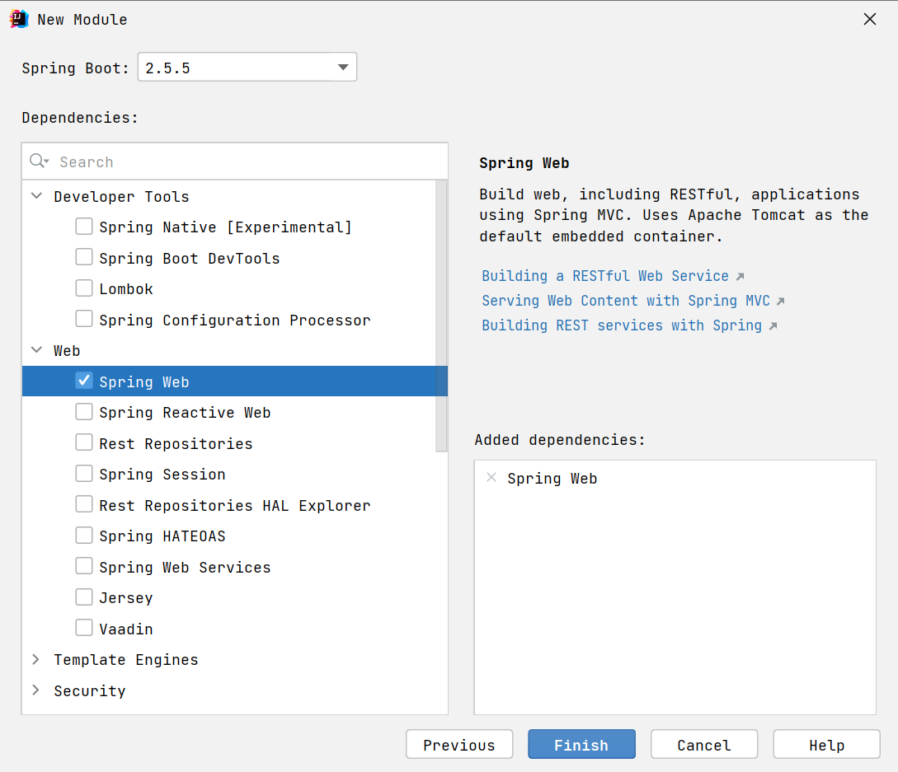
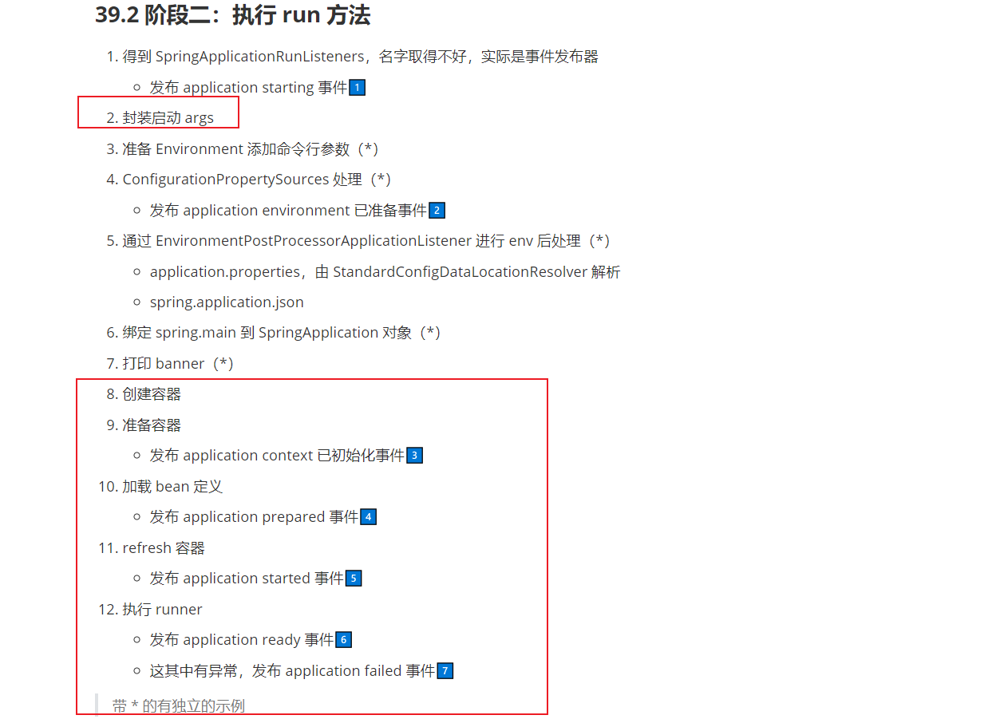
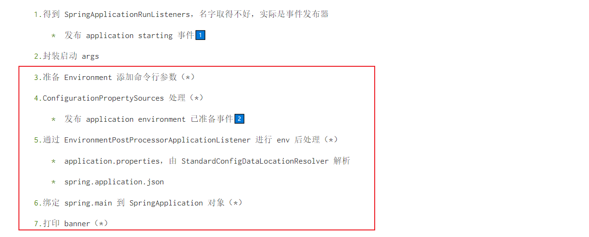
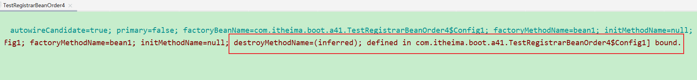

# 1 Boot创建与启动

## 37 Boot 骨架项目

如果是 linux 环境，用以下命令即可获取 spring boot 的骨架 pom.xml

```shell
curl -G https://start.spring.io/pom.xml -d dependencies=web,mysql,mybatis -o pom.xml
```

也可以使用 Postman 等工具实现

若想获取更多用法，请参考

```shell
curl https://start.spring.io
```


## 38 Boot War项目

步骤1：创建模块，区别在于打包方式选择 war


接下来勾选 Spring Web 支持



步骤2：编写控制器

```java
@Controller
public class MyController {

    @RequestMapping("/hello")
    public String abc() {
        System.out.println("进入了控制器");
        return "hello";
    }
}
```

步骤3：编写 jsp 视图，新建 webapp 目录和一个 hello.jsp 文件，注意文件名与控制器方法返回的视图逻辑名一致

```
src
	|- main
		|- java
		|- resources
		|- webapp
			|- hello.jsp
```

步骤4：配置视图路径，打开 application.properties 文件

```properties
spring.mvc.view.prefix=/
spring.mvc.view.suffix=.jsp
```

> 将来 prefix + 控制器方法返回值 + suffix 即为视图完整路径


### 38.1 测试

如果用 mvn 插件 `mvn spring-boot:run` 或 main 方法测试

* 必须添加如下依赖，因为此时用的还是内嵌 tomcat，而内嵌 tomcat 默认不带 jasper（用来解析 jsp）

```xml
<dependency>
    <groupId>org.apache.tomcat.embed</groupId>
    <artifactId>tomcat-embed-jasper</artifactId>
    <scope>provided</scope>
</dependency>
```

也可以使用 Idea 配置 tomcat 来测试，此时用的是外置 tomcat

* 骨架生成的代码中，多了一个 ServletInitializer，它的作用就是配置外置 Tomcat 使用的，在外置 Tomcat 启动后，去调用它创建和运行 SpringApplication


### 38.2 启示

对于 jar 项目，若要支持 jsp，也可以在加入 jasper 依赖的前提下，把 jsp 文件置入 `META-INF/resources` 


## 39 Boot 启动过程

### 39.1 阶段一：SpringApplication 构造

1. 记录 BeanDefinition 源
2. 推断应用类型
3. 记录 ApplicationContext 初始化器
4. 记录监听器
5. 推断主启动类

### 39.2 阶段二：执行 run 方法

1. 得到 SpringApplicationRunListeners，名字取得不好，实际是事件发布器

   * 发布 application starting 事件1️⃣

2. 封装启动 args

3. 准备 Environment 添加命令行参数（*）

4. ConfigurationPropertySources 处理（*）

   * 发布 application environment 已准备事件2️⃣

5. 通过 EnvironmentPostProcessorApplicationListener 进行 env 后处理（*）
   * application.properties，由 StandardConfigDataLocationResolver 解析
   * spring.application.json

6. 绑定 spring.main 到 SpringApplication 对象（*）

7. 打印 banner（*）

8. 创建容器

9. 准备容器

   * 发布 application context 已初始化事件3️⃣

10. 加载 bean 定义

    * 发布 application prepared 事件4️⃣

11. refresh 容器

    * 发布 application started 事件5️⃣

12. 执行 runner

    * 发布 application ready 事件6️⃣

    * 这其中有异常，发布 application failed 事件7️⃣

> 带 * 的有独立的示例

### 39.3 演示 - 启动过程

#### 39.3.1 SpringApplication的构造

1. 记录 BeanDefinition 源
2. 推断应用类型
3. 记录 ApplicationContext 初始化器
4. 记录监听器
5. 推断主启动类

##### 1 b01.xml

```xml
<?xml version="1.0" encoding="UTF-8"?>
<beans xmlns="http://www.springframework.org/schema/beans"
       xmlns:xsi="http://www.w3.org/2001/XMLSchema-instance"
       xsi:schemaLocation="http://www.springframework.org/schema/beans http://www.springframework.org/schema/beans/spring-beans.xsd">

    <bean id="bean1" class="com.itheima.boot.a39.test.TestSpringApplicationConstruct.Bean1"/>

</beans>
```

##### 2 测试代码

```java
package com.itheima.boot.a39.test;

import lombok.extern.slf4j.Slf4j;
import org.springframework.beans.factory.config.ConfigurableListableBeanFactory;
import org.springframework.boot.SpringApplication;
import org.springframework.boot.WebApplicationType;
import org.springframework.boot.web.embedded.tomcat.TomcatServletWebServerFactory;
import org.springframework.context.ConfigurableApplicationContext;
import org.springframework.context.annotation.Bean;
import org.springframework.context.annotation.Configuration;
import org.springframework.context.support.GenericApplicationContext;

import java.lang.reflect.Method;
import java.util.Collections;
import java.util.HashSet;

/**
 * @author lyf
 * @version 1.0
 * @classname TestSpringApplicationConstruct
 * @description
 * @since 2022/12/15 12:38
 */
@Slf4j
@Configuration
public class TestSpringApplicationConstruct {
    public static void main(String[] args) throws Throwable {
        SpringApplication springApplication = new SpringApplication(TestSpringApplicationConstruct.class);

        // 1. 记录 BeanDefinition 源
        System.out.println("1. 记录 BeanDefinition 源");
        springApplication.setSources(new HashSet<>(Collections.singletonList("classpath:b01.xml")));
        // 2. 推断应用类型
        System.out.println("2. 推断应用类型");
        Method deduceFromClasspath = WebApplicationType.class.getDeclaredMethod("deduceFromClasspath");
        deduceFromClasspath.setAccessible(true);
        Object result = deduceFromClasspath.invoke(null);
        System.out.printf("\t应用类型: %s\n", result);
        // 3. 记录 ApplicationContext 初始化器
        System.out.println("3. 记录 ApplicationContext 初始化器");
        springApplication.addInitializers(applicationContext -> {
            if (applicationContext instanceof GenericApplicationContext) {
                ((GenericApplicationContext) applicationContext).registerBean("bean3", Bean3.class);
            }
        });
        // 4. 记录监听器
        System.out.println("4. 记录监听器");
        springApplication.addListeners(event -> System.out.printf("\t监听事件, 事件类型为: %s\n", event.getClass()));
        // 5. 推断主启动类
        System.out.println("5. 推断主启动类");
        Method deduceMainApplicationClass = SpringApplication.class.getDeclaredMethod("deduceMainApplicationClass");
        deduceMainApplicationClass.setAccessible(true);
        Class<?> clazz = (Class<?>) deduceMainApplicationClass.invoke(springApplication);
        System.out.printf("\t主启动类为: %s\n", clazz);
        // 启动Spring Boot程序
        ConfigurableApplicationContext applicationContext = springApplication.run(args);
        ConfigurableListableBeanFactory beanFactory = applicationContext.getBeanFactory();
        // 打印bean的来源
        for (String beanDefinitionName : applicationContext.getBeanDefinitionNames()) {
            System.out.printf("name: %s, 来源: %s\n", beanDefinitionName, beanFactory.getBeanDefinition(beanDefinitionName).getResourceDescription());
        }
        // 释放资源
        applicationContext.close();

         /*
            学到了什么
            a. SpringApplication 构造方法中所做的操作
                1. 可以有多种源用来加载 bean 定义
                2. 应用类型推断
                3. 容器初始化器
                4. 演示启动各阶段事件
                5. 演示主类推断
         */
    }

    static class Bean1 {

    }

    static class Bean2 {

    }

    static class Bean3 {

    }

    @Bean
    public Bean2 bean2() {
        return new Bean2();
    }

    @Bean
    public TomcatServletWebServerFactory tomcatServletWebServerFactory() {
        return new TomcatServletWebServerFactory();
    }
}

```

##### 3 测试结果

```verilog
1. 记录 BeanDefinition 源
2. 推断应用类型
	应用类型: SERVLET
3. 记录 ApplicationContext 初始化器
4. 记录监听器
5. 推断主启动类
	主启动类为: class com.itheima.boot.a39.test.TestSpringApplicationConstruct
	监听事件, 事件类型为: class org.springframework.boot.context.event.ApplicationStartingEvent
	监听事件, 事件类型为: class org.springframework.boot.context.event.ApplicationEnvironmentPreparedEvent

  .   ____          _            __ _ _
 /\\ / ___'_ __ _ _(_)_ __  __ _ \ \ \ \
( ( )\___ | '_ | '_| | '_ \/ _` | \ \ \ \
 \\/  ___)| |_)| | | | | || (_| |  ) ) ) )
  '  |____| .__|_| |_|_| |_\__, | / / / /
 =========|_|==============|___/=/_/_/_/
 :: Spring Boot ::                (v2.6.7)

	监听事件, 事件类型为: class org.springframework.boot.context.event.ApplicationContextInitializedEvent
[INFO ] 14:18:00.482 [main] c.i.b.a.t.TestSpringApplicationConstruct - Starting TestSpringApplicationConstruct using Java 1.8.0_144 on lyf with PID 12144 (C:\DISH\JavaCode\java\gitee\liuyangfang\java-face\spring-demo\target\classes started by lyf in C:\DISH\JavaCode\java\gitee\liuyangfang\java-face) 
[DEBUG] 14:18:00.489 [main] c.i.b.a.t.TestSpringApplicationConstruct - Running with Spring Boot v2.6.7, Spring v5.3.19 
[INFO ] 14:18:00.489 [main] c.i.b.a.t.TestSpringApplicationConstruct - No active profile set, falling back to 1 default profile: "default" 
	监听事件, 事件类型为: class org.springframework.boot.context.event.ApplicationPreparedEvent
[INFO ] 14:18:01.268 [main] o.s.b.w.e.tomcat.TomcatWebServer    - Tomcat initialized with port(s): 8080 (http) 
[INFO ] 14:18:01.281 [main] o.a.coyote.http11.Http11NioProtocol - Initializing ProtocolHandler ["http-nio-8080"] 
[INFO ] 14:18:01.281 [main] o.a.catalina.core.StandardService   - Starting service [Tomcat] 
[INFO ] 14:18:01.281 [main] o.a.catalina.core.StandardEngine    - Starting Servlet engine: [Apache Tomcat/9.0.62] 
[INFO ] 14:18:01.481 [main] o.a.c.c.C.[Tomcat].[localhost].[/]  - Initializing Spring embedded WebApplicationContext 
[INFO ] 14:18:01.481 [main] o.s.b.w.s.c.ServletWebServerApplicationContext - Root WebApplicationContext: initialization completed in 874 ms 
[INFO ] 14:18:01.511 [main] o.a.coyote.http11.Http11NioProtocol - Starting ProtocolHandler ["http-nio-8080"] 
[INFO ] 14:18:01.531 [main] o.s.b.w.e.tomcat.TomcatWebServer    - Tomcat started on port(s): 8080 (http) with context path '' 
	监听事件, 事件类型为: class org.springframework.boot.web.servlet.context.ServletWebServerInitializedEvent
	监听事件, 事件类型为: class org.springframework.context.event.ContextRefreshedEvent
[INFO ] 14:18:01.535 [main] c.i.b.a.t.TestSpringApplicationConstruct - Started TestSpringApplicationConstruct in 1.492 seconds (JVM running for 2.368) 
	监听事件, 事件类型为: class org.springframework.boot.context.event.ApplicationStartedEvent
	监听事件, 事件类型为: class org.springframework.boot.availability.AvailabilityChangeEvent
	监听事件, 事件类型为: class org.springframework.boot.context.event.ApplicationReadyEvent
	监听事件, 事件类型为: class org.springframework.boot.availability.AvailabilityChangeEvent
name: org.springframework.context.annotation.internalConfigurationAnnotationProcessor, 来源: null
name: org.springframework.context.annotation.internalAutowiredAnnotationProcessor, 来源: null
name: org.springframework.context.annotation.internalCommonAnnotationProcessor, 来源: null
name: org.springframework.context.event.internalEventListenerProcessor, 来源: null
name: org.springframework.context.event.internalEventListenerFactory, 来源: null
name: bean3, 来源: null
name: testSpringApplicationConstruct, 来源: null
name: bean1, 来源: class path resource [b01.xml]
name: org.springframework.boot.autoconfigure.internalCachingMetadataReaderFactory, 来源: null
name: bean2, 来源: com.itheima.boot.a39.test.TestSpringApplicationConstruct
name: tomcatServletWebServerFactory, 来源: com.itheima.boot.a39.test.TestSpringApplicationConstruct
	监听事件, 事件类型为: class org.springframework.boot.availability.AvailabilityChangeEvent
	监听事件, 事件类型为: class org.springframework.context.event.ContextClosedEvent
```

##### 4 对应的SpringApplication构造源码

```java
	public SpringApplication(ResourceLoader resourceLoader, Class<?>... primarySources) {
		this.resourceLoader = resourceLoader;
		Assert.notNull(primarySources, "PrimarySources must not be null");
        // 1 收集所有的BeanDefintion源
		this.primarySources = new LinkedHashSet<>(Arrays.asList(primarySources));
        // 2 推断应用类型
		this.webApplicationType = WebApplicationType.deduceFromClasspath();
        // 3 记录ApplicationContext初始化器
		this.bootstrapRegistryInitializers = new ArrayList<>(
				getSpringFactoriesInstances(BootstrapRegistryInitializer.class));
		setInitializers((Collection) getSpringFactoriesInstances(ApplicationContextInitializer.class));
        // 4 记录监听器
		setListeners((Collection) getSpringFactoriesInstances(ApplicationListener.class));
        // 5 推断主启动类
		this.mainApplicationClass = deduceMainApplicationClass();
	}
```


#### 39.3.2 执行run方法，获取七大事件

1. 得到 SpringApplicationRunListeners，名字取得不好，实际是事件发布器
   * 发布 application starting 事件1️⃣

##### 1 测试代码

```java
package com.itheima.boot.a39.test;

import lombok.extern.slf4j.Slf4j;
import org.springframework.boot.ConfigurableBootstrapContext;
import org.springframework.boot.DefaultBootstrapContext;
import org.springframework.boot.SpringApplication;
import org.springframework.boot.SpringApplicationRunListener;
import org.springframework.boot.context.event.EventPublishingRunListener;
import org.springframework.context.support.GenericApplicationContext;
import org.springframework.core.env.StandardEnvironment;
import org.springframework.core.io.support.SpringFactoriesLoader;

import java.lang.reflect.Constructor;
import java.time.Duration;
import java.util.List;

/**
 * @author lyf
 * @version 1.0
 * @classname TestSpringApplicationRunListener
 * @description 测试SpringApplication启动时执行run方法时的七大事件
 * @since 2022/12/15 14:23
 */
@Slf4j
public class TestSpringApplicationRunListener {
    public static void main(String[] args) throws Throwable {
        long startTime = System.nanoTime();
        // SpringApplicationRunListener
        SpringApplication springApplication = new SpringApplication(TestSpringApplicationRunListener.class);
        springApplication.addListeners(event -> {
            String name = event.getClass().getName();
            if (name.startsWith("org.springframework.boot.context.event.")) {
                System.out.printf("\t\t\t是run方法中发布的事件, 事件类型为: %s\n", name);
            } else {
                System.out.printf("\t是其它方法中发布的事件, 事件类型为: %s\n", name);
            }
        });

        // 1 拿到事件发布器
        List<String> names = SpringFactoriesLoader.loadFactoryNames(SpringApplicationRunListener.class, TestSpringApplicationRunListener.class.getClassLoader());
        for (String name : names) {
            EventPublishingRunListener publisher = null;
            GenericApplicationContext applicationContext = null;
            System.out.printf("name=%s\n", name);
            Class<?> clazz = Class.forName(name);
            // clazz.newInstance(); 这种只能调用无参的构造，但是
            // org.springframework.boot.context.event.EventPublishingRunListener中没有无参构造
            Constructor<?> constructor = clazz.getConstructor(SpringApplication.class, String[].class);
            // 拿到事件发布器
            publisher = (EventPublishingRunListener) constructor.newInstance(springApplication, args);
            ConfigurableBootstrapContext bootstrapContext = new DefaultBootstrapContext();
            // 1 Spring Boot 开始启动事件
            publisher.starting(bootstrapContext);
            // 2 发布Environment已准备好事件
            StandardEnvironment environment = new StandardEnvironment();
            publisher.environmentPrepared(bootstrapContext, environment);
            applicationContext = new GenericApplicationContext();
            // 3 在Spring容器创建好，并调用初始化器之后，发布此事件
            publisher.contextPrepared(applicationContext);
            // 4 所有的bean definition加载完毕之后发布此事件
            publisher.contextLoaded(applicationContext);
            applicationContext.refresh();
            Duration timeTakenToStartup = Duration.ofNanos(System.nanoTime() - startTime);
            // 5 spring容器初始化完成（refresh方法调用完毕后发布此事件）
            publisher.started(applicationContext, timeTakenToStartup);
            // 6 SpringBoot 启动完毕之后发布此事件
            Duration timeTakenToReady = Duration.ofNanos(System.nanoTime() - startTime);
            publisher.ready(applicationContext, timeTakenToReady);
            // 7 如果在启动的过程中出错则发布此事件
            publisher.failed(applicationContext, new Exception("启动出错了"));
            /*
                学到了什么
                a. 如何读取 spring.factories 中的配置
                b. run 方法内获取事件发布器 (得到 SpringApplicationRunListeners) 的过程, 对应步骤中
                    1.获取事件发布器
                    发布 application starting 事件1️⃣
                    发布 application environment 已准备事件2️⃣
                    发布 application context 已初始化事件3️⃣
                    发布 application prepared 事件4️⃣
                    发布 application started 事件5️⃣
                    发布 application ready 事件6️⃣
                    这其中有异常，发布 application failed 事件7️⃣
         */
        }
    }
}

```

##### 2 测试结果

```verilog
name=org.springframework.boot.context.event.EventPublishingRunListener
			是run方法中发布的事件, 事件类型为: org.springframework.boot.context.event.ApplicationStartingEvent
			是run方法中发布的事件, 事件类型为: org.springframework.boot.context.event.ApplicationEnvironmentPreparedEvent
			是run方法中发布的事件, 事件类型为: org.springframework.boot.context.event.ApplicationContextInitializedEvent
			是run方法中发布的事件, 事件类型为: org.springframework.boot.context.event.ApplicationPreparedEvent
	是其它方法中发布的事件, 事件类型为: org.springframework.context.event.ContextRefreshedEvent
			是run方法中发布的事件, 事件类型为: org.springframework.boot.context.event.ApplicationStartedEvent
	是其它方法中发布的事件, 事件类型为: org.springframework.boot.availability.AvailabilityChangeEvent
			是run方法中发布的事件, 事件类型为: org.springframework.boot.context.event.ApplicationReadyEvent
	是其它方法中发布的事件, 事件类型为: org.springframework.boot.availability.AvailabilityChangeEvent
			是run方法中发布的事件, 事件类型为: org.springframework.boot.context.event.ApplicationFailedEvent
```

##### 3 小总结

> 学到了什么
>
> 1. 如何读取 spring.factories 中的配置
> 2. run 方法内获取事件发布器 (得到 SpringApplicationRunListeners) 的过程, 对应步骤中
>    1. 获取事件发布器
>       1. 发布 application starting 事件1️⃣
>       2. 发布 application environment 已准备事件2️⃣
>       3. 发布 application context 已初始化事件3️⃣
>       4. 发布 application prepared 事件4️⃣
>       5. 发布 application started 事件5️⃣
>       6. 发布 application ready 事件6️⃣
>       7. 这其中有异常，发布 application failed 事件7️⃣

#### 39.3.3 演示第2和8- 12步



##### 1 Bean1-Bean9

###### 1.1 Bean1

```java
package com.itheima.boot.a39.sub;

import lombok.extern.slf4j.Slf4j;
import org.springframework.stereotype.Component;

/**
 * @author lyf
 * @version 1.0
 * @classname Bean1
 * @description
 * @since 2022/12/15 15:40
 */
@Slf4j
@Component
public class Bean1 {
    public Bean1() {
        log.debug("bean1 construct");
    }
}

```

###### 1.2 Bean2

```java
package com.itheima.boot.a39.sub;

import lombok.extern.slf4j.Slf4j;
import org.springframework.stereotype.Component;

/**
 * @author lyf
 * @version 1.0
 * @classname Bean1
 * @description
 * @since 2022/12/15 15:40
 */
@Slf4j
@Component
public class Bean2 {
    public Bean2() {
        log.debug("bean2 construct");
    }
}

```

###### 1.3 Bean3

```java
package com.itheima.boot.a39.sub;

import lombok.extern.slf4j.Slf4j;
import org.springframework.stereotype.Component;

/**
 * @author lyf
 * @version 1.0
 * @classname Bean1
 * @description
 * @since 2022/12/15 15:40
 */
@Slf4j
@Component
public class Bean3 {
    public Bean3() {
        log.debug("bean3 construct");
    }
}

```

###### 1.4 Config1

```java
package com.itheima.boot.a39.config;

import lombok.extern.slf4j.Slf4j;
import org.springframework.boot.ApplicationRunner;
import org.springframework.boot.CommandLineRunner;
import org.springframework.boot.web.embedded.tomcat.TomcatServletWebServerFactory;
import org.springframework.context.annotation.Bean;
import org.springframework.context.annotation.Configuration;

import java.util.Arrays;

/**
 * @author lyf
 * @version 1.0
 * @classname Config1
 * @description
 * @since 2022/12/15 15:40
 */
@Slf4j
@Configuration
public class Config1 {
    @Bean
    public Bean4 bean4() {
        return new Bean4();
    }

    @Bean
    public Bean5 bean5() {
        return new Bean5();
    }

    @Bean
    public Bean6 bean6() {
        return new Bean6();
    }

    @Bean
    public TomcatServletWebServerFactory tomcatServletWebServerFactory() {
        return new TomcatServletWebServerFactory();
    }

    @Bean
    public ApplicationRunner applicationRunner() {
        return applicationArguments -> System.out.printf("\tApplicationRunner run..., the applicationArguments is %s, --开头的参数 %s, 非--开头的参数 %s\n",
                Arrays.toString(applicationArguments.getSourceArgs()),
                applicationArguments.getOptionNames(),
                applicationArguments.getNonOptionArgs());
    }

    @Bean
    public CommandLineRunner commandLineRunner() {
        return args -> System.out.printf("\tCommandLineRunner run..., the args is %s\n", Arrays.toString(args));
    }

    static class Bean4 {
        public Bean4() {
            log.debug("bean4 construct");
        }
    }

    static class Bean5 {
        public Bean5() {
            log.debug("bean5 construct");
        }
    }

    static class Bean6 {
        public Bean6() {
            log.debug("bean6 construct");
        }
    }
}

```


###### 1.5 Bean7

```java
package com.itheima.boot.a39.xml;

import lombok.extern.slf4j.Slf4j;
import org.springframework.stereotype.Component;

/**
 * @author lyf
 * @version 1.0
 * @classname Bean1
 * @description
 * @since 2022/12/15 15:40
 */
@Slf4j
@Component
public class Bean7 {
    public Bean7() {
        log.debug("bean7 construct");
    }
}

```

###### 1.6 Bean8

```java
package com.itheima.boot.a39.xml;

import lombok.extern.slf4j.Slf4j;
import org.springframework.stereotype.Component;

/**
 * @author lyf
 * @version 1.0
 * @classname Bean1
 * @description
 * @since 2022/12/15 15:40
 */
@Slf4j
@Component
public class Bean8 {
    public Bean8() {
        log.debug("bean8 construct");
    }
}

```

###### 1.7 Bean9

```java
package com.itheima.boot.a39.xml;

import lombok.extern.slf4j.Slf4j;
import org.springframework.stereotype.Component;

/**
 * @author lyf
 * @version 1.0
 * @classname Bean1
 * @description
 * @since 2022/12/15 15:40
 */
@Slf4j
@Component
public class Bean9 {
    public Bean9() {
        log.debug("bean9 construct");
    }
}

```

##### 2 b03.xml

```xml
<?xml version="1.0" encoding="UTF-8"?>
<beans xmlns="http://www.springframework.org/schema/beans"
       xmlns:xsi="http://www.w3.org/2001/XMLSchema-instance"
       xsi:schemaLocation="http://www.springframework.org/schema/beans http://www.springframework.org/schema/beans/spring-beans.xsd">

    <bean id="bean7" class="com.itheima.boot.a39.xml.Bean7"/>
    <bean id="bean8" class="com.itheima.boot.a39.xml.Bean8"/>
    <bean id="bean9" class="com.itheima.boot.a39.xml.Bean9"/>

</beans>
```

##### 3 测试代码

```java
package com.itheima.boot.a39.test;

import com.itheima.boot.a39.config.Config1;
import lombok.extern.slf4j.Slf4j;
import org.springframework.beans.factory.support.DefaultListableBeanFactory;
import org.springframework.beans.factory.xml.XmlBeanDefinitionReader;
import org.springframework.boot.*;
import org.springframework.boot.web.reactive.context.AnnotationConfigReactiveWebServerApplicationContext;
import org.springframework.boot.web.servlet.context.AnnotationConfigServletWebServerApplicationContext;
import org.springframework.context.ApplicationContextInitializer;
import org.springframework.context.annotation.AnnotatedBeanDefinitionReader;
import org.springframework.context.annotation.AnnotationConfigApplicationContext;
import org.springframework.context.annotation.ClassPathBeanDefinitionScanner;
import org.springframework.context.support.GenericApplicationContext;
import org.springframework.core.io.ClassPathResource;

import static org.springframework.boot.WebApplicationType.SERVLET;

/**
 * @author lyf
 * @version 1.0
 * @classname TestSpringApplicationRun
 * @description 测试SpringApplication的run方法的执行流程
 * 运行时请添加运行参数 --server.port=8080 debug
 * @since 2022/12/15 15:16
 */
@Slf4j
public class TestSpringApplicationRun {
    @SuppressWarnings("all")
    public static void main(String[] args) throws Exception {
        SpringApplication application = new SpringApplication();
        application.addInitializers(applicationContext -> System.out.println("\t初始化方法增强"));
        System.out.println("2. 封装启动 args");
        // 2. 封装启动 args
        DefaultApplicationArguments applicationArguments = new DefaultApplicationArguments(args);
        // 8. 创建容器
        System.out.println("8. 创建容器");
        GenericApplicationContext applicationContext = createApplicationContext(SERVLET);
        // 9. 准备容器
        System.out.println("9. 准备容器");
        for (ApplicationContextInitializer initializer : application.getInitializers()) {
            initializer.initialize(applicationContext);
        }

        // 10. 加载 bean 定义
        System.out.println("10. 加载 bean 定义");
        // 10.1 通过读取配置类
        DefaultListableBeanFactory beanFactory = applicationContext.getDefaultListableBeanFactory();
        // 读取配置类
        AnnotatedBeanDefinitionReader configReader = new AnnotatedBeanDefinitionReader(beanFactory);
        System.out.println("\t通过读取配置类");
        configReader.registerBean(Config1.class);

        // 10.2 通过读取xml配置文件
        XmlBeanDefinitionReader xmlReader = new XmlBeanDefinitionReader(beanFactory);
        System.out.println("\t通过读取xml配置文件");
        xmlReader.loadBeanDefinitions(new ClassPathResource("b03.xml"));
        // 10.3 通过包扫描
        ClassPathBeanDefinitionScanner scannerReader = new ClassPathBeanDefinitionScanner(beanFactory);
        System.out.println("\t通过包扫描");
        scannerReader.scan("com.itheima.boot.a39.sub");
        // 11. refresh 容器
        System.out.println("11. refresh 容器");
        applicationContext.refresh();

        // 打印bean的信息及它的来源
        System.out.println("\t打印bean的信息及它的来源");
        for (String name : applicationContext.getBeanDefinitionNames()) {
            System.out.printf("\tname=%s, 来源: %s\n", name, applicationContext.getBeanDefinition(name).getResourceDescription());
        }

        // 12. 执行 runner
        System.out.println("12. 执行 runner");
        for (ApplicationRunner applicationRunner : applicationContext.getBeansOfType(ApplicationRunner.class).values()) {
            applicationRunner.run(applicationArguments);
        }

        for (CommandLineRunner commandLineRunner : applicationContext.getBeansOfType(CommandLineRunner.class).values()) {
            commandLineRunner.run(args);
        }

        // 释放资源
        System.out.println("\t释放资源");
        applicationContext.close();
    }

    /**
     * 创建ApplicationContext
     *
     * @param applicationType 是哪种应用程序
     * @return GenericApplicationContext
     */
    private static GenericApplicationContext createApplicationContext(WebApplicationType applicationType) {
        GenericApplicationContext applicationContext;

        switch (applicationType) {
            case SERVLET:
                applicationContext = new AnnotationConfigServletWebServerApplicationContext();
                break;
            case REACTIVE:
                applicationContext = new AnnotationConfigReactiveWebServerApplicationContext();
                break;
            case NONE:
                applicationContext = new AnnotationConfigApplicationContext();
                break;
            default:
                throw new UnsupportedOperationException("不支持的类型");
        }

        return applicationContext;
    }
}

```


##### 4 测试结果

```java
2. 封装启动 args
8. 创建容器
9. 准备容器
	初始化方法增强
10. 加载 bean 定义
	通过读取配置类
	通过读取xml配置文件
	通过包扫描
11. refresh 容器
[INFO ] 16:20:38.535 [main] o.s.b.w.e.tomcat.TomcatWebServer    - Tomcat initialized with port(s): 8080 (http) 
十二月 15, 2022 4:20:38 下午 org.apache.coyote.AbstractProtocol init
信息: Initializing ProtocolHandler ["http-nio-8080"]
十二月 15, 2022 4:20:38 下午 org.apache.catalina.core.StandardService startInternal
信息: Starting service [Tomcat]
十二月 15, 2022 4:20:38 下午 org.apache.catalina.core.StandardEngine startInternal
信息: Starting Servlet engine: [Apache Tomcat/9.0.62]
十二月 15, 2022 4:20:38 下午 org.apache.catalina.core.ApplicationContext log
信息: Initializing Spring embedded WebApplicationContext
[INFO ] 16:20:38.785 [main] o.s.b.w.s.c.ServletWebServerApplicationContext - Root WebApplicationContext: initialization completed in 921 ms 
[DEBUG] 16:20:38.808 [main] com.itheima.boot.a39.xml.Bean7      - bean7 construct 
[DEBUG] 16:20:38.808 [main] com.itheima.boot.a39.xml.Bean8      - bean8 construct 
[DEBUG] 16:20:38.808 [main] com.itheima.boot.a39.xml.Bean9      - bean9 construct 
[DEBUG] 16:20:38.809 [main] com.itheima.boot.a39.sub.Bean1      - bean1 construct 
[DEBUG] 16:20:38.809 [main] com.itheima.boot.a39.sub.Bean2      - bean2 construct 
[DEBUG] 16:20:38.809 [main] com.itheima.boot.a39.sub.Bean3      - bean3 construct 
[DEBUG] 16:20:38.810 [main] com.itheima.boot.a39.config.Config1 - bean4 construct 
[DEBUG] 16:20:38.810 [main] com.itheima.boot.a39.config.Config1 - bean5 construct 
[DEBUG] 16:20:38.811 [main] com.itheima.boot.a39.config.Config1 - bean6 construct 
十二月 15, 2022 4:20:38 下午 org.apache.coyote.AbstractProtocol start
信息: Starting ProtocolHandler ["http-nio-8080"]
[INFO ] 16:20:38.845 [main] o.s.b.w.e.tomcat.TomcatWebServer    - Tomcat started on port(s): 8080 (http) with context path '' 
	打印bean的信息及它的来源
	name=org.springframework.context.annotation.internalConfigurationAnnotationProcessor, 来源: null
	name=org.springframework.context.annotation.internalAutowiredAnnotationProcessor, 来源: null
	name=org.springframework.context.annotation.internalCommonAnnotationProcessor, 来源: null
	name=org.springframework.context.event.internalEventListenerProcessor, 来源: null
	name=org.springframework.context.event.internalEventListenerFactory, 来源: null
	name=config1, 来源: null
	name=bean7, 来源: class path resource [b03.xml]
	name=bean8, 来源: class path resource [b03.xml]
	name=bean9, 来源: class path resource [b03.xml]
	name=bean1, 来源: file [C:\DISH\JavaCode\java\gitee\liuyangfang\java-face\spring-demo\target\classes\com\itheima\boot\a39\sub\Bean1.class]
	name=bean2, 来源: file [C:\DISH\JavaCode\java\gitee\liuyangfang\java-face\spring-demo\target\classes\com\itheima\boot\a39\sub\Bean2.class]
	name=bean3, 来源: file [C:\DISH\JavaCode\java\gitee\liuyangfang\java-face\spring-demo\target\classes\com\itheima\boot\a39\sub\Bean3.class]
	name=org.springframework.boot.autoconfigure.internalCachingMetadataReaderFactory, 来源: null
	name=bean4, 来源: com.itheima.boot.a39.config.Config1
	name=bean5, 来源: com.itheima.boot.a39.config.Config1
	name=bean6, 来源: com.itheima.boot.a39.config.Config1
	name=tomcatServletWebServerFactory, 来源: com.itheima.boot.a39.config.Config1
	name=applicationRunner, 来源: com.itheima.boot.a39.config.Config1
	name=commandLineRunner, 来源: com.itheima.boot.a39.config.Config1
12. 执行 runner
	ApplicationRunner run..., the applicationArguments is [--server.port=8080, debug], --开头的参数 [server.port], 非--开头的参数 [debug]
	CommandLineRunner run..., the args is [--server.port=8080, debug]
	释放资源
十二月 15, 2022 4:20:39 下午 org.apache.coyote.AbstractProtocol pause
信息: Pausing ProtocolHandler ["http-nio-8080"]
十二月 15, 2022 4:20:39 下午 org.apache.catalina.core.StandardService stopInternal
信息: Stopping service [Tomcat]
十二月 15, 2022 4:20:39 下午 org.apache.coyote.AbstractProtocol stop
信息: Stopping ProtocolHandler ["http-nio-8080"]
十二月 15, 2022 4:20:39 下午 org.apache.coyote.AbstractProtocol destroy
信息: Destroying ProtocolHandler ["http-nio-8080"]
```


##### 5 小总结

> 学到了什么
> a. 创建容器、加载 bean 定义、refresh, 对应的步骤

#### 39.3.4 演示3-7



##### 1 准备工作

###### 1.1 EnvironmentUtil

```java
package org.springframework.boot.util;

import lombok.extern.slf4j.Slf4j;
import org.springframework.core.env.Environment;
import org.springframework.core.env.PropertySource;
import org.springframework.core.env.StandardEnvironment;

/**
 * @author lyf
 * @version 1.0
 * @classname EnvironmentUtil
 * @description
 * @date 2022/12/15 16:58
 */
@Slf4j
public final class EnvironmentUtil {
    /**
     * 私有构造器
     */
    private EnvironmentUtil() {
    }

    public static void print(StandardEnvironment environment) {
        System.out.println(">>>>>>>>>>>>>>>>>>>>>>>>>>>>>>>>>>>>>>>>>>>>>>");
        for (PropertySource<?> propertySource : environment.getPropertySources()) {
            System.out.println(propertySource);
        }
        System.out.println(">>>>>>>>>>>>>>>>>>>>>>>>>>>>>>>>>>>>>>>>>>>>>>");
    }
}

```

###### 1.2 step3.properties

```properties
server.port=8080

```

###### 1.3 step4.properties

```properties
user.first-name=George
user.middle_name=Walker
user.lastName=Bush

```


###### 1.4 step6.properties

```properties
spring.main.banner-mode=off
spring.main.lazy-initialization=true
```

###### 1.5 banner1.txt

```txt
  _____            _             ____              _
 / ____|          (_)           |  _ \            | |
| (___  _ __  _ __ _ _ __   __ _| |_) | ___   ___ | |_
 \___ \| '_ \| '__| | '_ \ / _` |  _ < / _ \ / _ \| __|
 ____) | |_) | |  | | | | | (_| | |_) | (_) | (_) | |_
|_____/| .__/|_|  |_|_| |_|\__, |____/ \___/ \___/ \__|
       | |                  __/ |
       |_|                 |___/
```


###### 1.6 banner2.png


###### 1.7 application.properties

```properties
server.port=9090
goods.name=小米12
spring.datasource.druid.url=jdbc:mysql://127.0.0.1:3306/test?serverTimezone=Asia/Shanghai&useUnicode=true&characterEncoding=utf-8&zeroDateTimeBehavior=convertToNull&useSSL=false&allowPublicKeyRetrieval=true
spring.datasource.druid.username=root
spring.datasource.driver-class-name=com.mysql.cj.jdbc.Driver
spring.datasource.password=123456

server.servlet.session.timeout=10s
# 也可以在配置
spring.mvc.servlet.load-on-startup=1
```

##### 2 Step3

> ps Step3 到 Step7 都必须在 此目录： org.springframework.boot

```java
package org.springframework.boot;

import lombok.extern.slf4j.Slf4j;
import org.springframework.core.env.PropertySource;
import org.springframework.core.env.SimpleCommandLinePropertySource;
import org.springframework.core.io.ClassPathResource;
import org.springframework.core.io.support.ResourcePropertySource;

import static org.springframework.boot.util.EnvironmentUtil.print;

/**
 * @author lyf
 * @version 1.0
 * @classname Step3
 * @description
 * @since 2022/12/15 16:32
 */
@Slf4j
public class Step3 {
    public static void main(String[] args) throws Exception{
        ApplicationEnvironment environment = new ApplicationEnvironment();
        // 添加命令行参数来源, 在启动参数添加 --server.port=9090， 优先级最高
        environment.getPropertySources().addFirst(new SimpleCommandLinePropertySource(args));
        environment.getPropertySources().addLast(new ResourcePropertySource(new ClassPathResource("step3.properties")));

        print(environment);
        System.out.printf("server.port=%s\n",environment.getProperty("server.port"));
        System.out.printf("JAVA_HOME=%s\n", environment.getProperty("JAVA_HOME"));
    }

    /**
     * PropertiesPropertySource {name='systemProperties'}
     * SystemEnvironmentPropertySource {name='systemEnvironment'}
     */
    private static void defaultEnvironment() {
        ApplicationEnvironment environment = new ApplicationEnvironment();
        for (PropertySource<?> propertySource : environment.getPropertySources()) {
            System.out.println(propertySource);
        }
    }
}

```

###### 2.1 测试结果

```verilog
>>>>>>>>>>>>>>>>>>>>>>>>>>>>>>>>>>>>>>>>>>>>>>
SimpleCommandLinePropertySource {name='commandLineArgs'}
PropertiesPropertySource {name='systemProperties'}
SystemEnvironmentPropertySource {name='systemEnvironment'}
ResourcePropertySource {name='class path resource [step3.properties]'}
>>>>>>>>>>>>>>>>>>>>>>>>>>>>>>>>>>>>>>>>>>>>>>
server.port=9090
JAVA_HOME=C:\DISH\APP\JAVA\Java\jdk1.8.0_144
```

##### 3 Step4

```java
package org.springframework.boot;

import lombok.extern.slf4j.Slf4j;
import org.springframework.boot.context.properties.source.ConfigurationPropertySources;
import org.springframework.core.env.PropertySource;
import org.springframework.core.env.SimpleCommandLinePropertySource;
import org.springframework.core.io.ClassPathResource;
import org.springframework.core.io.support.ResourcePropertySource;

/**
 * @author lyf
 * @version 1.0
 * @classname Step3
 * @description
 * @since 2022/12/15 16:32
 */
@Slf4j
public class Step4 {
    public static void main(String[] args) throws Exception{
        ApplicationEnvironment environment = new ApplicationEnvironment();
        environment.getPropertySources().addLast(new ResourcePropertySource(new ClassPathResource("step4.properties")));

        System.out.println(">>>>>>>>>>>>>>>>>>>>>>>>>>>>>>>>>>>>>>>>>>>>>>");
        for (PropertySource<?> propertySource : environment.getPropertySources()) {
            System.out.println(propertySource);
        }
        System.out.println(">>>>>>>>>>>>>>>>>>>>>>>>>>>>>>>>>>>>>>>>>>>>>>");
        System.out.println("===============================attach前===============================================");
        System.out.println(environment.getProperty("user.first-name"));
        System.out.println(environment.getProperty("user.middle-name"));
        System.out.println(environment.getProperty("user.last-name"));

        ConfigurationPropertySources.attach(environment);
        System.out.println("===============================attach后===============================================");
        System.out.println(environment.getProperty("user.first-name"));
        System.out.println(environment.getProperty("user.middle-name"));
        System.out.println(environment.getProperty("user.last-name"));
    }
}

```

###### 3.1 测试结果

```verilog
>>>>>>>>>>>>>>>>>>>>>>>>>>>>>>>>>>>>>>>>>>>>>>
PropertiesPropertySource {name='systemProperties'}
SystemEnvironmentPropertySource {name='systemEnvironment'}
ResourcePropertySource {name='class path resource [step4.properties]'}
>>>>>>>>>>>>>>>>>>>>>>>>>>>>>>>>>>>>>>>>>>>>>>
===============================attach前===============================================
George
null
null
===============================attach后===============================================
George
Walker
Bush
```

##### 4 Step5

```java
package org.springframework.boot;

import lombok.extern.slf4j.Slf4j;
import org.springframework.boot.context.config.ConfigDataEnvironmentPostProcessor;
import org.springframework.boot.context.event.EventPublishingRunListener;
import org.springframework.boot.env.EnvironmentPostProcessorApplicationListener;
import org.springframework.boot.env.RandomValuePropertySourceEnvironmentPostProcessor;
import org.springframework.boot.logging.DeferredLog;
import org.springframework.boot.logging.DeferredLogs;

import static org.springframework.boot.util.EnvironmentUtil.print;

/**
 * @author lyf
 * @version 1.0
 * @classname Step5
 * @description
 * @since 2022/12/15 16:54
 */
@Slf4j
public class Step5 {
    public static void main(String[] args) {
        System.out.println("test1...");
        test1(args);
        System.out.println();
        System.out.println();
        System.out.println();
        System.out.println("test2...");
        test2();
    }

    /**
     * 测试两个后处理器
     * org.springframework.boot.context.config.ConfigDataEnvironmentPostProcessor
     *      解析 application.properties
     * org.springframework.boot.env.RandomValuePropertySourceEnvironmentPostProcessor
     *      生成随机数据的能力
     */
    private static void test2() {
        SpringApplication application = new SpringApplication();
        ApplicationEnvironment environment = new ApplicationEnvironment();
        System.out.println("增强前");
        print(environment);
        DeferredLogs deferredLogs = new DeferredLogs();
        ConfigurableBootstrapContext bootstrapContext = new DefaultBootstrapContext();
        // 解析application.properties
        ConfigDataEnvironmentPostProcessor processor1 = new ConfigDataEnvironmentPostProcessor(deferredLogs, bootstrapContext);
        processor1.postProcessEnvironment(environment, application);
        System.out.println("ConfigDataEnvironmentPostProcessor 增强后");
        print(environment);

        // 提供生成随机数据的能力
        RandomValuePropertySourceEnvironmentPostProcessor processor2 = new RandomValuePropertySourceEnvironmentPostProcessor(new DeferredLog());
        processor2.postProcessEnvironment(environment, application);
        System.out.println("RandomValuePropertySourceEnvironmentPostProcessor 增强后");
        print(environment);

        System.out.println(environment.getProperty("server.port"));
        System.out.println(environment.getProperty("random.int"));
        System.out.println(environment.getProperty("random.int"));
        System.out.println(environment.getProperty("random.int"));
        System.out.println(environment.getProperty("random.uuid"));
        System.out.println(environment.getProperty("random.uuid"));
        System.out.println(environment.getProperty("random.uuid"));
    }

    /**
     * 在environmentPrepared 事件发布前后的ApplicationEnvironment对比
     * <p>
     * 增强前
     * >>>>>>>>>>>>>>>>>>>>>>>>>>>>>>>>>>>>>>>>>>>>>>
     * PropertiesPropertySource {name='systemProperties'}
     * SystemEnvironmentPropertySource {name='systemEnvironment'}
     * >>>>>>>>>>>>>>>>>>>>>>>>>>>>>>>>>>>>>>>>>>>>>>
     * 增强后
     * >>>>>>>>>>>>>>>>>>>>>>>>>>>>>>>>>>>>>>>>>>>>>>
     * PropertiesPropertySource {name='systemProperties'}
     * OriginAwareSystemEnvironmentPropertySource {name='systemEnvironment'}
     * RandomValuePropertySource {name='random'}
     * OriginTrackedMapPropertySource {name='Config resource 'class path resource [application.properties]' via location 'optional:classpath:/''}
     * >>>>>>>>>>>>>>>>>>>>>>>>>>>>>>>>>>>>>>>>>>>>>>
     *
     * @param args args
     */
    private static void test1(String[] args) {
        SpringApplication application = new SpringApplication();
        // 添加Environment事件监听器
        application.addListeners(new EnvironmentPostProcessorApplicationListener());

        ApplicationEnvironment environment = new ApplicationEnvironment();
        System.out.println("增强前");
        print(environment);
        System.out.println("增强后");
        EventPublishingRunListener publisher = new EventPublishingRunListener(application, args);
        publisher.environmentPrepared(new DefaultBootstrapContext(), environment);
        print(environment);
    }
}

```

###### 4.1 测试结果

```verilog
test1...
增强前
>>>>>>>>>>>>>>>>>>>>>>>>>>>>>>>>>>>>>>>>>>>>>>
PropertiesPropertySource {name='systemProperties'}
SystemEnvironmentPropertySource {name='systemEnvironment'}
>>>>>>>>>>>>>>>>>>>>>>>>>>>>>>>>>>>>>>>>>>>>>>
增强后
>>>>>>>>>>>>>>>>>>>>>>>>>>>>>>>>>>>>>>>>>>>>>>
PropertiesPropertySource {name='systemProperties'}
OriginAwareSystemEnvironmentPropertySource {name='systemEnvironment'}
RandomValuePropertySource {name='random'}
OriginTrackedMapPropertySource {name='Config resource 'class path resource [application.properties]' via location 'optional:classpath:/''}
>>>>>>>>>>>>>>>>>>>>>>>>>>>>>>>>>>>>>>>>>>>>>>


test2...
增强前
>>>>>>>>>>>>>>>>>>>>>>>>>>>>>>>>>>>>>>>>>>>>>>
PropertiesPropertySource {name='systemProperties'}
SystemEnvironmentPropertySource {name='systemEnvironment'}
>>>>>>>>>>>>>>>>>>>>>>>>>>>>>>>>>>>>>>>>>>>>>>
ConfigDataEnvironmentPostProcessor 增强后
>>>>>>>>>>>>>>>>>>>>>>>>>>>>>>>>>>>>>>>>>>>>>>
PropertiesPropertySource {name='systemProperties'}
SystemEnvironmentPropertySource {name='systemEnvironment'}
OriginTrackedMapPropertySource {name='Config resource 'class path resource [application.properties]' via location 'optional:classpath:/''}
>>>>>>>>>>>>>>>>>>>>>>>>>>>>>>>>>>>>>>>>>>>>>>
RandomValuePropertySourceEnvironmentPostProcessor 增强后
>>>>>>>>>>>>>>>>>>>>>>>>>>>>>>>>>>>>>>>>>>>>>>
PropertiesPropertySource {name='systemProperties'}
SystemEnvironmentPropertySource {name='systemEnvironment'}
RandomValuePropertySource {name='random'}
OriginTrackedMapPropertySource {name='Config resource 'class path resource [application.properties]' via location 'optional:classpath:/''}
>>>>>>>>>>>>>>>>>>>>>>>>>>>>>>>>>>>>>>>>>>>>>>
9090
1805763766
1033083007
-511594317
25c03e88-a36f-481e-a601-e0bb5c74e304
eedfef6d-7292-4cbb-bc79-88657a99f43d
5fbaf4d7-50db-4361-8882-015d0f4c3db2

```

##### 5 Step6

```java
package org.springframework.boot;

import com.alibaba.druid.sql.visitor.functions.Bin;
import lombok.extern.slf4j.Slf4j;
import org.springframework.boot.context.properties.bind.Bindable;
import org.springframework.boot.context.properties.bind.Binder;
import org.springframework.core.io.ClassPathResource;
import org.springframework.core.io.support.ResourcePropertySource;

import java.lang.reflect.Field;
import java.util.HashMap;
import java.util.Map;

/**
 * @author lyf
 * @version 1.0
 * @classname Step6
 * @description 绑定 spring.main 前缀的 key value 至 SpringApplication, 请通过 debug 查看
 * @since 2022/12/15 17:19
 */
@Slf4j
public class Step6 {
    public static void main(String[] args) throws Exception {
        SpringApplication application = new SpringApplication();
        ApplicationEnvironment environment = new ApplicationEnvironment();
        environment.getPropertySources().addLast(new ResourcePropertySource(new ClassPathResource("step4.properties")));
        environment.getPropertySources().addLast(new ResourcePropertySource(new ClassPathResource("step6.properties")));
        // 绑定并创建对象
        User user1 = Binder.get(environment).bind("user", User.class).get();
        System.out.println("user1=" + user1);
        // 针对已有对象的数据绑定
        User user2 = new User();
        Binder.get(environment).bind("user", Bindable.ofInstance(user2));
        System.out.println("user2=" + user2);

        // 测试spring.main的数据绑定情况
        System.out.println("绑定spring.main数据前: >>>>>>>>>>>>>>>>>>>>>>>>>>>>>>>>>>>>>>");
        printSimpleInfo(application);
        Binder.get(environment).bind("spring.main", Bindable.ofInstance(application));
        System.out.println("绑定spring.main数据后: >>>>>>>>>>>>>>>>>>>>>>>>>>>>>>>>>>>>>>");
        printSimpleInfo(application);

    }

    public static void printSimpleInfo(SpringApplication application) throws IllegalAccessException {
        Field[] declaredFields = SpringApplication.class.getDeclaredFields();
        for (Field declaredField : declaredFields) {
            if ("bannerMode".equals(declaredField.getName())
                    || "lazyInitialization".equals(declaredField.getName())) {
                declaredField.setAccessible(true);
                Object obj = declaredField.get(application);
                System.out.println(declaredField.getName() + "=" + obj);
            }
        }
    }

    static class User {
        private String firstName;
        private String middleName;
        private String lastName;

        public String getFirstName() {
            return firstName;
        }

        public void setFirstName(String firstName) {
            this.firstName = firstName;
        }

        public String getMiddleName() {
            return middleName;
        }

        public void setMiddleName(String middleName) {
            this.middleName = middleName;
        }

        public String getLastName() {
            return lastName;
        }

        public void setLastName(String lastName) {
            this.lastName = lastName;
        }

        @Override
        public String toString() {
            return "User{" +
                    "firstName='" + firstName + '\'' +
                    ", middleName='" + middleName + '\'' +
                    ", lastName='" + lastName + '\'' +
                    '}';
        }
    }
}

```

###### 5.1 测试结果

```verilog
user1=User{firstName='George', middleName='Walker', lastName='Bush'}
user2=User{firstName='George', middleName='Walker', lastName='Bush'}
绑定spring.main数据前: >>>>>>>>>>>>>>>>>>>>>>>>>>>>>>>>>>>>>>
bannerMode=CONSOLE
lazyInitialization=false
绑定spring.main数据后: >>>>>>>>>>>>>>>>>>>>>>>>>>>>>>>>>>>>>>
bannerMode=OFF
lazyInitialization=true
```

##### 6 Step7

```java
package org.springframework.boot;

import lombok.extern.slf4j.Slf4j;
import org.springframework.core.env.MapPropertySource;
import org.springframework.core.io.DefaultResourceLoader;

import java.util.Collections;
import java.util.Map;

/**
 * @author lyf
 * @version 1.0
 * @classname Step7
 * @description
 * @since 2022/12/15 17:36
 */
@Slf4j
public class Step7 {
    public static void main(String[] args) {
        ApplicationEnvironment environment = new ApplicationEnvironment();
        SpringApplicationBannerPrinter printer = new SpringApplicationBannerPrinter(new DefaultResourceLoader(), new SpringBootBanner());
        // 打印Spring Boot 图标和版本号
        System.out.println("版本号：" + SpringBootVersion.getVersion());
        System.out.println("自带的版本：>>>>>>>>>>>>>>>>>>>>>>>>>>>>>>>>>>>>>>>>>>>>>>>>>>>>>>>>>>>>>>>>>>>>>>>>>>>>>>>");
        printer.print(environment, Step7.class, System.out);

        System.out.println("文字 banner的版本：>>>>>>>>>>>>>>>>>>>>>>>>>>>>>>>>>>>>>>>>>>>>>>>>>>>>>>>>>>>>>>>>>>>>>>>>>>>>>>>");
        // 测试文字 banner
        environment.getPropertySources().addLast(new MapPropertySource("custom1", Collections.singletonMap("spring.banner.location","banner1.txt")));
        printer.print(environment, Step7.class, System.out);

        System.out.println("图片 banner的版本：>>>>>>>>>>>>>>>>>>>>>>>>>>>>>>>>>>>>>>>>>>>>>>>>>>>>>>>>>>>>>>>>>>>>>>>>>>>>>>>");
        // 移除文字版的banner，防止干扰测试
        environment.getPropertySources().remove("custom1");
        // 测试图片 banner
        environment.getPropertySources().addLast(new MapPropertySource("custom2", Collections.singletonMap("spring.banner.image.location","banner2.png")));
        printer.print(environment, Step7.class, System.out);
    }
}

```

###### 6.1 测试结果

```verilog
版本号：2.6.7
自带的版本：>>>>>>>>>>>>>>>>>>>>>>>>>>>>>>>>>>>>>>>>>>>>>>>>>>>>>>>>>>>>>>>>>>>>>>>>>>>>>>>

  .   ____          _            __ _ _
 /\\ / ___'_ __ _ _(_)_ __  __ _ \ \ \ \
( ( )\___ | '_ | '_| | '_ \/ _` | \ \ \ \
 \\/  ___)| |_)| | | | | || (_| |  ) ) ) )
  '  |____| .__|_| |_|_| |_\__, | / / / /
 =========|_|==============|___/=/_/_/_/
 :: Spring Boot ::                (v2.6.7)

文字 banner的版本：>>>>>>>>>>>>>>>>>>>>>>>>>>>>>>>>>>>>>>>>>>>>>>>>>>>>>>>>>>>>>>>>>>>>>>>>>>>>>>>
  _____            _             ____              _
 / ____|          (_)           |  _ \            | |
| (___  _ __  _ __ _ _ __   __ _| |_) | ___   ___ | |_
 \___ \| '_ \| '__| | '_ \ / _` |  _ < / _ \ / _ \| __|
 ____) | |_) | |  | | | | | (_| | |_) | (_) | (_) | |_
|_____/| .__/|_|  |_|_| |_|\__, |____/ \___/ \___/ \__|
       | |                  __/ |
       |_|                 |___/
图片 banner的版本：>>>>>>>>>>>>>>>>>>>>>>>>>>>>>>>>>>>>>>>>>>>>>>>>>>>>>>>>>>>>>>>>>>>>>>>>>>>>>>>


  @@@@@@@@@@@@@@@@@@@@@@@@@@@@@@@@@@@@@@@@@@@@@@@@@@@@@@@@@@@@@@@@@@@@@@@@@@@@
  @@@@@@@@@@@@@@@@@@@@@@@@@@@@@@@@@@@@@@@@@@@@@@@@@@@@@@@@@@@@@@@@@@@@@@@@@@@@
  @@@@@@@@@@@@@@@@@@@@@@@@@@@@@@@@@@@@@@@@@@@@@@@@@@@@@@@@@@@@@@@@@@@@@@@@@@@@
  @@@@@@@@@@@@@@@@@@@#::::::::::::::::::::::::::::::::::::#@@@@@@@@@@@@@@@@@@@
  @@@@@@@@@@@@@@@@@#::::::::::::::::::::::::::::::::::::::::#@@@@@@@@@@@@@@@@@
  @@@@@@@@@@@@@@@@o::::::::::::::::::::::::::::::::::::::::::o@@@@@@@@@@@@@@@@
  @@@@@@@@@@@@@@@::::::::::::::::::::::::::::::::::::::::::::::@@@@@@@@@@@@@@@
  @@@@@@@@@@@@@@::::::::::::::::::::::::::::::::::::::::::::::::@@@@@@@@@@@@@@
  @@@@@@@@@@@@@:::::::::::::::::::::::@@@8:::::::::::::::::::::::@@@@@@@@@@@@@
  @@@@@@@@@@@@::::::::::::::::::::::o@@@@@@:::::::::::::::::::::::@@@@@@@@@@@@
  @@@@@@@@@@@:::::::::::::::@@@:::::o@@@@@@:::::@@@@:::::::::::::::@@@@@@@@@@@
  @@@@@@@@@&::::::::::::::@@@@@@::::o@@@@@@::::@@@@@@@::::::::::::::&@@@@@@@@@
  @@@@@@@@::::::::::::::@@@@@@@o::::o@@@@@@:::::@@@@@@@#::::::::::::::@@@@@@@@
  @@@@@@@::::::::::::::@@@@@@o::::::o@@@@@@::::::::@@@@@@::::::::::::::@@@@@@@
  @@@@@@::::::::::::::@@@@@8::::::::o@@@@@@:::::::::@@@@@@o:::::::::::::@@@@@@
  @@@@@::::::::::::::@@@@@@:::::::::o@@@@@@::::::::::@@@@@@::::::::::::::@@@@@
  @@@@::::::::::::::&@@@@@::::::::::o@@@@@@:::::::::::@@@@@:::::::::::::::@@@@
  @@@:::::::::::::::@@@@@o::::::::::o@@@@@@:::::::::::@@@@@&:::::::::::::::@@@
  @@::::::::::::::::@@@@@:::::::::::o@@@@@@:::::::::::#@@@@#::::::::::::::::@@
  @@::::::::::::::::@@@@@o::::::::::::@@@@::::::::::::@@@@@&::::::::::::::::@@
  @@&:::::::::::::::o@@@@@::::::::::::::::::::::::::::@@@@@::::::::::::::::&@@
  @@@o:::::::::::::::@@@@@#::::::::::::::::::::::::::@@@@@@:::::::::::::::o@@@
  @@@@@:::::::::::::::@@@@@#::::::::::::::::::::::::@@@@@@o::::::::::::::@@@@@
  @@@@@@:::::::::::::::@@@@@@:::::::::::::::::::::o@@@@@@:::::::::::::::@@@@@@
  @@@@@@@:::::::::::::::@@@@@@@o::::::::::::::::@@@@@@@@:::::::::::::::@@@@@@@
  @@@@@@@@::::::::::::::::@@@@@@@@@8:::::::o@@@@@@@@@@::::::::::::::::@@@@@@@@
  @@@@@@@@@:::::::::::::::::@@@@@@@@@@@@@@@@@@@@@@@#:::::::::::::::::@@@@@@@@@
  @@@@@@@@@@:::::::::::::::::::#@@@@@@@@@@@@@@@@&:::::::::::::::::::@@@@@@@@@@
  @@@@@@@@@@@8::::::::::::::::::::::::oooo::::::::::::::::::::::::8@@@@@@@@@@@
  @@@@@@@@@@@@@::::::::::::::::::::::::::::::::::::::::::::::::::@@@@@@@@@@@@@
  @@@@@@@@@@@@@@::::::::::::::::::::::::::::::::::::::::::::::::@@@@@@@@@@@@@@
  @@@@@@@@@@@@@@@::::::::::::::::::::::::::::::::::::::::::::::@@@@@@@@@@@@@@@
  @@@@@@@@@@@@@@@@::::::::::::::::::::::::::::::::::::::::::::@@@@@@@@@@@@@@@@
  @@@@@@@@@@@@@@@@@::::::::::::::::::::::::::::::::::::::::::@@@@@@@@@@@@@@@@@
  @@@@@@@@@@@@@@@@@@@::::::::::::::::::::::::::::::::::::::@@@@@@@@@@@@@@@@@@@
  @@@@@@@@@@@@@@@@@@@@@@@@@@@@@@@@@@@@@@@@@@@@@@@@@@@@@@@@@@@@@@@@@@@@@@@@@@@@
  @@@@@@@@@@@@@@@@@@@@@@@@@@@@@@@@@@@@@@@@@@@@@@@@@@@@@@@@@@@@@@@@@@@@@@@@@@@@
  @@@@@@@@@@@@@@@@@@@@@@@@@@@@@@@@@@@@@@@@@@@@@@@@@@@@@@@@@@@@@@@@@@@@@@@@@@@@

```

### 39.4 org.springframework.boot.SpringApplication#run(java.lang.String...) 源码解读

```java
    /**
     * Run the Spring application, creating and refreshing a new
     * {@link ApplicationContext}.
     *
     * @param args the application arguments (usually passed from a Java main method)
     * @return a running {@link ApplicationContext}
     */
    public ConfigurableApplicationContext run(String... args) {
        // 记录开始时间
        long startTime = System.nanoTime();
        DefaultBootstrapContext bootstrapContext = createBootstrapContext();
        ConfigurableApplicationContext context = null;
        configureHeadlessProperty();
        // 1 得到SpringApplicationRunListeners，名字取得不好，实际上是事件发布器
        SpringApplicationRunListeners listeners = getRunListeners(args);
        // 1.1 发布Springboot程序启动事件----> 也是事件1
        listeners.starting(bootstrapContext, this.mainApplicationClass);
        try {
            // 2 封装启动参数args
            ApplicationArguments applicationArguments = new DefaultApplicationArguments(args);
            // 3 准备Environment并添加命令行参数（SimpleCommandLinePropertySource）
            ConfigurableEnvironment environment = prepareEnvironment(listeners, bootstrapContext, applicationArguments);
            // 3.1 配置spring.beaninfo.ignore
            configureIgnoreBeanInfo(environment);
            // 7 准备Banner打印器
            Banner printedBanner = printBanner(environment);
            // 8 创建Spring的Bean容器
            context = createApplicationContext();
            context.setApplicationStartup(this.applicationStartup);
            // 9 准备容器
            prepareContext(bootstrapContext, context, environment, listeners, applicationArguments, printedBanner);
            // 11 refresh 容器
            refreshContext(context);
            afterRefresh(context, applicationArguments);
            Duration timeTakenToStartup = Duration.ofNanos(System.nanoTime() - startTime);
            if (this.logStartupInfo) {
                new StartupInfoLogger(this.mainApplicationClass).logStarted(getApplicationLog(), timeTakenToStartup);
            }
            // 11.1 发布application stared 事件，表示Spring容器初始化完毕----> 事件5
            listeners.started(context, timeTakenToStartup);

            // 12 执行runner方法
            callRunners(context, applicationArguments);
        } catch (Throwable ex) {
            // 12.1 发生异常的话，发布application failed事件----> 事件7
            handleRunFailure(context, ex, listeners);
            throw new IllegalStateException(ex);
        }
        try {
            Duration timeTakenToReady = Duration.ofNanos(System.nanoTime() - startTime);
            // 12.1 发布application ready事件，表示SpringBoot已经启动完毕----> 事件6
            listeners.ready(context, timeTakenToReady);
        } catch (Throwable ex) {
            handleRunFailure(context, ex, null);
            // 12.2 发生异常的话，发布application failed事件----> 事件7
            throw new IllegalStateException(ex);
        }
        return context;
    }

    private ConfigurableEnvironment prepareEnvironment(SpringApplicationRunListeners listeners,
                                                       DefaultBootstrapContext bootstrapContext,
                                                       ApplicationArguments applicationArguments) {
        // Create and configure the environment
        // 3 准备Environment
        ConfigurableEnvironment environment = getOrCreateEnvironment();
        // 4 ConfigurationPropertySources处理
        configureEnvironment(environment, applicationArguments.getSourceArgs());
        ConfigurationPropertySources.attach(environment);
        // 4.1 发布 application environment 已准备事件----> 事件2
        listeners.environmentPrepared(bootstrapContext, environment);
        // 5 通过 EnvironmentPostProcessorApplicationListener 进行 env 后处理（*）
        // application.properties，由 StandardConfigDataLocationResolver 解析
        // spring.application.json
        DefaultPropertiesPropertySource.moveToEnd(environment);
        Assert.state(!environment.containsProperty("spring.main.environment-prefix"),
                "Environment prefix cannot be set via properties.");
        // 6 绑定spring.main 到SpringApplication对象
        bindToSpringApplication(environment);
        if (!this.isCustomEnvironment) {
            environment = convertEnvironment(environment);
        }
        ConfigurationPropertySources.attach(environment);
        return environment;
    }

    private void prepareContext(DefaultBootstrapContext bootstrapContext, ConfigurableApplicationContext context,
                                ConfigurableEnvironment environment, SpringApplicationRunListeners listeners,
                                ApplicationArguments applicationArguments, Banner printedBanner) {
        context.setEnvironment(environment);
        // 10. 加载Bean定义
        postProcessApplicationContext(context);
        // 准备容量，也就是执行容器的初始化
        applyInitializers(context);
        // 10.1 发布application prepared 事件----> 事件4
        listeners.contextPrepared(context);
        bootstrapContext.close(context);
        if (this.logStartupInfo) {
            logStartupInfo(context.getParent() == null);
            logStartupProfileInfo(context);
        }
        // Add boot specific singleton beans
        ConfigurableListableBeanFactory beanFactory = context.getBeanFactory();
        beanFactory.registerSingleton("springApplicationArguments", applicationArguments);
        if (printedBanner != null) {
            beanFactory.registerSingleton("springBootBanner", printedBanner);
        }
        if (beanFactory instanceof AbstractAutowireCapableBeanFactory) {
            ((AbstractAutowireCapableBeanFactory) beanFactory).setAllowCircularReferences(this.allowCircularReferences);
            if (beanFactory instanceof DefaultListableBeanFactory) {
                ((DefaultListableBeanFactory) beanFactory)
                        .setAllowBeanDefinitionOverriding(this.allowBeanDefinitionOverriding);
            }
        }
        if (this.lazyInitialization) {
            context.addBeanFactoryPostProcessor(new LazyInitializationBeanFactoryPostProcessor());
        }
        // Load the sources
        Set<Object> sources = getAllSources();
        Assert.notEmpty(sources, "Sources must not be empty");
        load(context, sources.toArray(new Object[0]));
        listeners.contextLoaded(context);
    }

    /**
     * Apply any relevant post processing the {@link ApplicationContext}. Subclasses can
     * apply additional processing as required.
     *
     * @param context the application context
     */
    protected void postProcessApplicationContext(ConfigurableApplicationContext context) {
        if (this.beanNameGenerator != null) {
            context.getBeanFactory().registerSingleton(AnnotationConfigUtils.CONFIGURATION_BEAN_NAME_GENERATOR,
                    this.beanNameGenerator);
        }
        if (this.resourceLoader != null) {
            if (context instanceof GenericApplicationContext) {
                ((GenericApplicationContext) context).setResourceLoader(this.resourceLoader);
            }
            if (context instanceof DefaultResourceLoader) {
                ((DefaultResourceLoader) context).setClassLoader(this.resourceLoader.getClassLoader());
            }
        }
        if (this.addConversionService) {
            context.getBeanFactory().setConversionService(context.getEnvironment().getConversionService());
        }
    }
```


### 39.5 收获💡

1. SpringApplication 构造方法中所做的操作
   * 可以有多种源用来加载 bean 定义
   * 应用类型推断
   * 添加容器初始化器
   * 添加监听器
   * 演示主类推断
2. 如何读取 spring.factories 中的配置
3. 从配置中获取重要的事件发布器：SpringApplicationRunListeners
4. 容器的创建、初始化器增强、加载 bean 定义等
5. CommandLineRunner、ApplicationRunner 的作用
6. 环境对象
   1. 命令行 PropertySource
   2. ConfigurationPropertySources 规范环境键名称
   3. EnvironmentPostProcessor 后处理增强
      * 由 EventPublishingRunListener 通过监听事件2️⃣来调用
   4. 绑定 spring.main 前缀的 key value 至 SpringApplication
7. Banner 


## 40 Tomcat 内嵌容器

### 40.1 Tomcat 基本结构

```
Server
└───Service
    ├───Connector (协议, 端口)
    └───Engine
        └───Host(虚拟主机 localhost)
            ├───Context1 (应用1, 可以设置虚拟路径, / 即 url 起始路径; 项目磁盘路径, 即 docBase )
            │   │   index.html
            │   └───WEB-INF
            │       │   web.xml (servlet, filter, listener) 3.0
            │       ├───classes (servlet, controller, service ...)
            │       ├───jsp
            │       └───lib (第三方 jar 包)
            └───Context2 (应用2)
                │   index.html
                └───WEB-INF
                        web.xml
```

### 40.2 演示1 - Tomcat 内嵌容器

#### 40.2.1 关键代码

```java
public static void main(String[] args) throws LifecycleException, IOException {
    // 1.创建 Tomcat 对象
    Tomcat tomcat = new Tomcat();
    tomcat.setBaseDir("tomcat");

    // 2.创建项目文件夹, 即 docBase 文件夹
    File docBase = Files.createTempDirectory("boot.").toFile();
    docBase.deleteOnExit();

    // 3.创建 Tomcat 项目, 在 Tomcat 中称为 Context
    Context context = tomcat.addContext("", docBase.getAbsolutePath());

    // 4.编程添加 Servlet
    context.addServletContainerInitializer(new ServletContainerInitializer() {
        @Override
        public void onStartup(Set<Class<?>> c, ServletContext ctx) throws ServletException {
            HelloServlet helloServlet = new HelloServlet();
            ctx.addServlet("aaa", helloServlet).addMapping("/hello");
        }
    }, Collections.emptySet());

    // 5.启动 Tomcat
    tomcat.start();

    // 6.创建连接器, 设置监听端口
    Connector connector = new Connector(new Http11Nio2Protocol());
    connector.setPort(8080);
    tomcat.setConnector(connector);
}
```


### 40.3 演示2 - 集成 Spring 容器

#### 40.3.1 关键代码

```java
WebApplicationContext springContext = getApplicationContext();

// 4.编程添加 Servlet
context.addServletContainerInitializer(new ServletContainerInitializer() {
    @Override
    public void onStartup(Set<Class<?>> c, ServletContext ctx) throws ServletException {
        // ⬇️通过 ServletRegistrationBean 添加 DispatcherServlet 等
        for (ServletRegistrationBean registrationBean : 
             springContext.getBeansOfType(ServletRegistrationBean.class).values()) {
            registrationBean.onStartup(ctx);
        }
    }
}, Collections.emptySet());
```

### 40.4 完整代码

```java
package com.itheima.boot.a40;

import com.itheima.boot.a40.servlet.HelloServlet;
import lombok.extern.slf4j.Slf4j;
import org.apache.catalina.Context;
import org.apache.catalina.LifecycleException;
import org.apache.catalina.connector.Connector;
import org.apache.catalina.startup.Tomcat;
import org.apache.coyote.http11.Http11Nio2Protocol;
import org.springframework.boot.autoconfigure.web.servlet.DispatcherServletRegistrationBean;
import org.springframework.boot.web.servlet.ServletRegistrationBean;
import org.springframework.context.annotation.Bean;
import org.springframework.context.annotation.Configuration;
import org.springframework.http.converter.json.MappingJackson2HttpMessageConverter;
import org.springframework.web.bind.annotation.GetMapping;
import org.springframework.web.bind.annotation.RestController;
import org.springframework.web.context.support.AnnotationConfigWebApplicationContext;
import org.springframework.web.servlet.DispatcherServlet;
import org.springframework.web.servlet.mvc.method.annotation.RequestMappingHandlerAdapter;

import javax.servlet.ServletContainerInitializer;
import javax.servlet.ServletContext;
import javax.servlet.ServletException;
import java.io.File;
import java.io.IOException;
import java.nio.file.Files;
import java.util.Collections;
import java.util.Map;
import java.util.Set;
import java.util.UUID;

/**
 * @author lyf
 * @version 1.0
 * @classname TestTomcat
 * @description
 * @since 2022/12/15 18:48
 */
@Slf4j
public class TestTomcat {
    /*
    Server
    └───Service
        ├───Connector (协议, 端口)
        └───Engine
            └───Host(虚拟主机 localhost)
                ├───Context1 (应用1, 可以设置虚拟路径, / 即 url 起始路径; 项目磁盘路径, 即 docBase )
                │   │   index.html
                │   └───WEB-INF
                │       │   web.xml (servlet, filter, listener) 3.0
                │       ├───classes (servlet, controller, service ...)
                │       ├───jsp
                │       └───lib (第三方 jar 包)
                └───Context2 (应用2)
                    │   index.html
                    └───WEB-INF
                            web.xml
 */

    /**
     *
     * @param args
     */
    public static void main(String[] args) throws IOException, LifecycleException {
        // 1 创建Tomcat对象
        Tomcat tomcat = new Tomcat();
        tomcat.setBaseDir("tomcat");
        // 2 创建项目文件夹，即docBase文件夹，一般创建临时目录即可，可以设置使用完就删除
        File docBase = Files.createTempDirectory("boot.").toFile();
        docBase.deleteOnExit();
        // 3 创建Tomcat项目，在Tomcat中称为Context
        Context context = tomcat.addContext("", docBase.getCanonicalPath());

        // 4 编程的方式添加Servlet
        // 4.1 创建一个Spring Bean容器
        AnnotationConfigWebApplicationContext applicationContext = createApplication();
        context.addServletContainerInitializer(new ServletContainerInitializer() {
            @Override
            public void onStartup(Set<Class<?>> c, ServletContext ctx) throws ServletException {
                ctx.addServlet("hello", HelloServlet.class).addMapping("/hello");
                // 添加DispatchServlet
                /*DispatcherServlet dispatcherServlet = applicationContext.getBean(DispatcherServlet.class);
                ctx.addServlet("dispatcherServlet", dispatcherServlet).addMapping("/");*/
                // 换成以下更优雅的方式
                for (ServletRegistrationBean<?> registrationBean : applicationContext.getBeansOfType(ServletRegistrationBean.class).values()) {
                    registrationBean.onStartup(ctx);
                }
            }
        }, Collections.emptySet());
        // 5 启动Tomcat
        tomcat.start();
        // 6 创建连接器，并添加监听端口
        Connector connector = new Connector();
        connector.setPort(8081);
        tomcat.setConnector(connector);
    }

    private static void test2() throws IOException, LifecycleException {
        // 1 创建Tomcat对象
        Tomcat tomcat = new Tomcat();
        tomcat.setBaseDir("tomcat");
        // 2 创建项目文件夹，即docBase文件夹，一般创建临时目录即可，可以设置使用完就删除
        File docBase = Files.createTempDirectory("boot.").toFile();
        docBase.deleteOnExit();
        // 3 创建Tomcat项目，在Tomcat中称为Context
        Context context = tomcat.addContext("", docBase.getCanonicalPath());

        // 4 编程的方式添加Servlet
        // 4.1 创建一个Spring Bean容器
        AnnotationConfigWebApplicationContext applicationContext = createApplication();
        context.addServletContainerInitializer(new ServletContainerInitializer() {
            @Override
            public void onStartup(Set<Class<?>> c, ServletContext ctx) throws ServletException {
                ctx.addServlet("hello", HelloServlet.class).addMapping("/hello");
                // 添加DispatchServlet
                DispatcherServlet dispatcherServlet = applicationContext.getBean(DispatcherServlet.class);
                ctx.addServlet("dispatcherServlet", dispatcherServlet).addMapping("/");
            }
        }, Collections.emptySet());
        // 5 启动Tomcat
        tomcat.start();
        // 6 创建连接器，并添加监听端口
        Connector connector = new Connector();
        connector.setPort(8081);
        tomcat.setConnector(connector);
    }

    public static AnnotationConfigWebApplicationContext createApplication() {
        AnnotationConfigWebApplicationContext applicationContext = new AnnotationConfigWebApplicationContext();
        applicationContext.register(WebConfig.class);
        applicationContext.refresh();
        return applicationContext;
    }

    @Configuration
    public static class WebConfig {
        @Bean
        public DispatcherServlet dispatcherServlet() {
            return new DispatcherServlet();
        }

        @Bean
        public DispatcherServletRegistrationBean dispatcherServletRegistrationBean(DispatcherServlet dispatcherServlet) {
            return new DispatcherServletRegistrationBean(dispatcherServlet, "/");
        }

        @Bean
        public RequestMappingHandlerAdapter requestMappingHandlerAdapter() {
            RequestMappingHandlerAdapter handlerAdapter = new RequestMappingHandlerAdapter();
            // 设置返回值json解析器
            handlerAdapter.setMessageConverters(Collections.singletonList(new MappingJackson2HttpMessageConverter()));
            return handlerAdapter;
        }

        @RestController
        public static class HelloController {
            @GetMapping("/hello2")
            public Map<String, Object> hello() {
                return Collections.singletonMap("hello2", UUID.randomUUID() + ", 你好啊");
            }
        }
    }

    private static void baseTomcat() throws IOException, LifecycleException {
        // 1 创建Tomcat对象
        Tomcat tomcat = new Tomcat();
        tomcat.setBaseDir("tomcat");
        // 应用1, 可以设置虚拟路径, / 即 url 起始路径; 项目磁盘路径, 即 docBase
        // 2 创建项目文件夹，即docBase文件夹，一般创建临时目录即可，可以设置使用完就删除
        File docBase = Files.createTempDirectory("boot.").toFile();
        docBase.deleteOnExit();
        // 3 创建Tomcat项目，在Tomcat中称为Context
        // 3.1 contextPath 设置为"" 相当于访问时的/
        Context context = tomcat.addContext("", docBase.getCanonicalPath());
        // 4 编程的方式添加Servlet
        context.addServletContainerInitializer((c, ctx) -> ctx.addServlet("hello", HelloServlet.class).addMapping("/hello"), Collections.emptySet());
        // 5 启动Tomcat
        tomcat.start();
        // 6 创建连接器，并添加监听端口
        Connector connector = new Connector(new Http11Nio2Protocol());
        connector.setPort(8081);
        tomcat.setConnector(connector);
    }
}

```


## 41 Boot 自动配置

### 1 测试第三方导入配置注册的bean和导入本项目配置注册bean的注册时机

#### 1.1 方式1，直接导入配置类，此种导入会先注册第三方中的bean

```java
package com.itheima.boot.a41;

import lombok.extern.slf4j.Slf4j;
import org.springframework.context.annotation.Bean;
import org.springframework.context.annotation.Configuration;
import org.springframework.context.annotation.ConfigurationClassPostProcessor;
import org.springframework.context.annotation.Import;
import org.springframework.context.support.GenericApplicationContext;

/**
 * @author lyf
 * @version 1.0
 * @classname TestRegistrarBeanOrder1
 * @description 测试注册Bean的顺序
 * @since 2022/12/16 11:21
 */
@Slf4j
public class TestRegistrarBeanOrder1 {
    public static void main(String[] args) {
        GenericApplicationContext applicationContext = new GenericApplicationContext();

        // false: 不允许重复的Bean定义, true 表示允许重复bean定义，并且后注册的bean会覆盖前注册的bean
        applicationContext.getDefaultListableBeanFactory().setAllowBeanDefinitionOverriding(true);
        applicationContext.registerBean(Config1.class);
        applicationContext.registerBean(ConfigurationClassPostProcessor.class); // 解析@Configuration 注解

        applicationContext.refresh();
        applicationContext.close();
    }

    @Configuration
    @Import({AutoConfig1.class, AutoConfig2.class}) // 导入第三方配置类，方式1，此种导入会先注册第三方中的bean
    static class Config1 {
        @Bean
        public Bean1 bean1() {
            log.debug("本类配置: Bean1");
            return new Bean1();
        }
    }


    @Configuration
    static class AutoConfig1 {
        @Bean
        public Bean1 bean1() {
            log.debug("第三方配置: Bean1");
            return new Bean1();
        }
    }

    @Configuration
    static class AutoConfig2 {
        @Bean
        public Bean2 bean2() {
            log.debug("第三方配置: Bean2");
            return new Bean2();
        }
    }

    static class Bean1 {
        public Bean1() {
            log.debug("Bean1...");
        }
    }

    static class Bean2 {
        public Bean2() {
            log.debug("Bean2...");
        }
    }
}

```

##### 1.1.1 测试结果

```verilog
[DEBUG] 12:02:45.157 [main] c.i.b.a41.TestRegistrarBeanOrder1   - 本类配置: Bean1 
[DEBUG] 12:02:45.164 [main] c.i.b.a41.TestRegistrarBeanOrder1   - Bean1... 
[DEBUG] 12:02:45.167 [main] c.i.b.a41.TestRegistrarBeanOrder1   - 第三方配置: Bean2 
[DEBUG] 12:02:45.167 [main] c.i.b.a41.TestRegistrarBeanOrder1   - Bean2... 

```

#### 1.2 方式2：通过@ImportSelector，此种导入会先注册第三方中的bean

```java
package com.itheima.boot.a41;

import lombok.extern.slf4j.Slf4j;
import org.springframework.context.annotation.*;
import org.springframework.context.support.GenericApplicationContext;
import org.springframework.core.type.AnnotationMetadata;

/**
 * @author lyf
 * @version 1.0
 * @classname TestRegistrarBeanOrder2
 * @description 测试注册Bean的顺序
 * @since 2022/12/16 11:21
 */
@Slf4j
public class TestRegistrarBeanOrder2 {
    public static void main(String[] args) {
        GenericApplicationContext applicationContext = new GenericApplicationContext();

        // false: 不允许重复的Bean定义, true 表示允许重复bean定义，并且后注册的bean会覆盖前注册的bean
        applicationContext.getDefaultListableBeanFactory().setAllowBeanDefinitionOverriding(true);
        applicationContext.registerBean(Config1.class);
        applicationContext.registerBean(ConfigurationClassPostProcessor.class); // 解析@Configuration 注解

        applicationContext.refresh();
        applicationContext.close();
    }

    @Configuration
    // @Import({AutoConfig1.class, AutoConfig2.class}) // 导入第三方配置类，方式1，此种导入会先注册第三方中的bean
    @Import(MyImportSelector.class)
    static class Config1 {
        @Bean
        public Bean1 bean1() {
            log.debug("本类配置: Bean1");
            return new Bean1();
        }
    }

    static class MyImportSelector implements ImportSelector {

        @Override
        public String[] selectImports(AnnotationMetadata importingClassMetadata) {
            return new String[] {
                    AutoConfig1.class.getName(), AutoConfig2.class.getName()
            };
        }
    }


    @Configuration
    static class AutoConfig1 {
        @Bean
        public Bean1 bean1() {
            log.debug("第三方配置: Bean1");
            return new Bean1();
        }
    }

    @Configuration
    static class AutoConfig2 {
        @Bean
        public Bean2 bean2() {
            log.debug("第三方配置: Bean2");
            return new Bean2();
        }
    }

    static class Bean1 {
        public Bean1() {
            log.debug("Bean1...");
        }
    }

    static class Bean2 {
        public Bean2() {
            log.debug("Bean2...");
        }
    }
}

```

##### 1.2.1 测试结果

```java
[DEBUG] 12:09:39.068 [main] c.i.b.a41.TestRegistrarBeanOrder2   - 本类配置: Bean1 
[DEBUG] 12:09:39.074 [main] c.i.b.a41.TestRegistrarBeanOrder2   - Bean1... 
[DEBUG] 12:09:39.077 [main] c.i.b.a41.TestRegistrarBeanOrder2   - 第三方配置: Bean2 
[DEBUG] 12:09:39.077 [main] c.i.b.a41.TestRegistrarBeanOrder2   - Bean2... 
```

#### 1.3 方式3：通过@DeferredImportSelector，此种导入会先推迟注册第三方中的bean，会优先注册本类的bean

```java
package com.itheima.boot.a41;

import lombok.extern.slf4j.Slf4j;
import org.springframework.context.annotation.*;
import org.springframework.context.support.GenericApplicationContext;
import org.springframework.core.type.AnnotationMetadata;

/**
 * @author lyf
 * @version 1.0
 * @classname TestRegistrarBeanOrder3
 * @description 测试注册Bean的顺序
 * @since 2022/12/16 11:21
 */
@Slf4j
public class TestRegistrarBeanOrder3 {
    public static void main(String[] args) {
        GenericApplicationContext applicationContext = new GenericApplicationContext();

        // false: 不允许重复的Bean定义, true 表示允许重复bean定义，并且后注册的bean会覆盖前注册的bean
        applicationContext.getDefaultListableBeanFactory().setAllowBeanDefinitionOverriding(true);
        applicationContext.registerBean(Config1.class);
        applicationContext.registerBean(ConfigurationClassPostProcessor.class); // 解析@Configuration 注解

        applicationContext.refresh();
        applicationContext.close();
    }

    @Configuration
    // @Import({AutoConfig1.class, AutoConfig2.class}) // 导入第三方配置类，方式1，此种导入会先注册第三方中的bean
    @Import(MyImportSelector.class)
    static class Config1 {
        @Bean
        public Bean1 bean1() {
            log.debug("本类配置: Bean1");
            return new Bean1();
        }
    }

    static class MyImportSelector implements DeferredImportSelector {

        @Override
        public String[] selectImports(AnnotationMetadata importingClassMetadata) {
            return new String[] {
                    AutoConfig1.class.getName(), AutoConfig2.class.getName()
            };
        }
    }


    @Configuration
    static class AutoConfig1 {
        @Bean
        public Bean1 bean1() {
            log.debug("第三方配置: Bean1");
            return new Bean1();
        }
    }

    @Configuration
    static class AutoConfig2 {
        @Bean
        public Bean2 bean2() {
            log.debug("第三方配置: Bean2");
            return new Bean2();
        }
    }

    static class Bean1 {
        public Bean1() {
            log.debug("Bean1...");
        }
    }

    static class Bean2 {
        public Bean2() {
            log.debug("Bean2...");
        }
    }
}

```

##### 1.3.1 测试结果

```verilog
[DEBUG] 12:12:15.869 [main] c.i.b.a41.TestRegistrarBeanOrder3   - 第三方配置: Bean1 
[DEBUG] 12:12:15.876 [main] c.i.b.a41.TestRegistrarBeanOrder3   - Bean1... 
[DEBUG] 12:12:15.883 [main] c.i.b.a41.TestRegistrarBeanOrder3   - 第三方配置: Bean2 
[DEBUG] 12:12:15.884 [main] c.i.b.a41.TestRegistrarBeanOrder3   - Bean2... 
```

#### 1.4 导入方式4：读取`META-INF/spring.factories`配置的方式导入

##### 1.4.1 META-INF/spring.factories

```
com.itheima.boot.a41.TestRegistrarBeanOrder4$MyImportSelector=\
  com.itheima.boot.a41.TestRegistrarBeanOrder4.AutoConfig1,\
  com.itheima.boot.a41.TestRegistrarBeanOrder4.AutoConfig2
```

##### 1.4.2 测试代码

```java
package com.itheima.boot.a41;

import lombok.extern.slf4j.Slf4j;
import org.springframework.context.annotation.*;
import org.springframework.context.support.GenericApplicationContext;
import org.springframework.core.io.support.SpringFactoriesLoader;
import org.springframework.core.type.AnnotationMetadata;

import java.util.List;

/**
 * @author lyf
 * @version 1.0
 * @classname TestRegistrarBeanOrder4
 * @description 测试注册Bean的顺序
 * @since 2022/12/16 11:21
 */
@Slf4j
public class TestRegistrarBeanOrder4 {
    public static void main(String[] args) {
        GenericApplicationContext applicationContext = new GenericApplicationContext();

        // false: 不允许重复的Bean定义, true 表示允许重复bean定义，并且后注册的bean会覆盖前注册的bean
        applicationContext.getDefaultListableBeanFactory().setAllowBeanDefinitionOverriding(false);
        applicationContext.registerBean(Config1.class);
        applicationContext.registerBean(ConfigurationClassPostProcessor.class); // 解析@Configuration 注解

        applicationContext.refresh();
        applicationContext.close();
    }

    @Configuration
    // @Import({AutoConfig1.class, AutoConfig2.class}) // 导入第三方配置类，方式1，此种导入会先注册第三方中的bean
    @Import(MyImportSelector.class)
    static class Config1 {
        @Bean
        public Bean1 bean1() {
            log.debug("本类配置: Bean1");
            return new Bean1();
        }
    }

    static class MyImportSelector implements DeferredImportSelector {

        @Override
        public String[] selectImports(AnnotationMetadata importingClassMetadata) {
            /*return new String[] {
                    AutoConfig1.class.getName(), AutoConfig2.class.getName()
            };*/
            List<String> beanNames = SpringFactoriesLoader.loadFactoryNames(MyImportSelector.class, null);
            return beanNames.toArray(new String[0]);
        }
    }


    @Configuration
    static class AutoConfig1 {
        @Bean
        public Bean1 bean1() {
            log.debug("第三方配置: Bean1");
            return new Bean1();
        }
    }

    @Configuration
    static class AutoConfig2 {
        @Bean
        public Bean2 bean2() {
            log.debug("第三方配置: Bean2");
            return new Bean2();
        }
    }

    static class Bean1 {
        public Bean1() {
            log.debug("Bean1...");
        }
    }

    static class Bean2 {
        public Bean2() {
            log.debug("Bean2...");
        }
    }
}

```

##### 1.4.3 测试结果 

```verilog
[WARN ] 12:31:56.011 [main] o.s.c.s.GenericApplicationContext   - Exception encountered during context initialization - cancelling refresh attempt: org.springframework.beans.factory.support.BeanDefinitionOverrideException: Invalid bean definition with name 'bean1' defined in class path resource [com/itheima/boot/a41/TestRegistrarBeanOrder4$AutoConfig1.class]: Cannot register bean definition [Root bean: class [null]; scope=; abstract=false; lazyInit=null; autowireMode=3; dependencyCheck=0; autowireCandidate=true; primary=false; factoryBeanName=com.itheima.boot.a41.TestRegistrarBeanOrder4$AutoConfig1; factoryMethodName=bean1; initMethodName=null; destroyMethodName=(inferred); defined in class path resource [com/itheima/boot/a41/TestRegistrarBeanOrder4$AutoConfig1.class]] for bean 'bean1': There is already [Root bean: class [null]; scope=; abstract=false; lazyInit=null; autowireMode=3; dependencyCheck=0; autowireCandidate=true; primary=false; factoryBeanName=com.itheima.boot.a41.TestRegistrarBeanOrder4$Config1; factoryMethodName=bean1; initMethodName=null; destroyMethodName=(inferred); defined in com.itheima.boot.a41.TestRegistrarBeanOrder4$Config1] bound. 
Exception in thread "main" org.springframework.beans.factory.support.BeanDefinitionOverrideException: Invalid bean definition with name 'bean1' defined in class path resource [com/itheima/boot/a41/TestRegistrarBeanOrder4$AutoConfig1.class]: Cannot register bean definition [Root bean: class [null]; scope=; abstract=false; lazyInit=null; autowireMode=3; dependencyCheck=0; autowireCandidate=true; primary=false; factoryBeanName=com.itheima.boot.a41.TestRegistrarBeanOrder4$AutoConfig1; factoryMethodName=bean1; initMethodName=null; destroyMethodName=(inferred); defined in class path resource [com/itheima/boot/a41/TestRegistrarBeanOrder4$AutoConfig1.class]] for bean 'bean1': There is already [Root bean: class [null]; scope=; abstract=false; lazyInit=null; autowireMode=3; dependencyCheck=0; autowireCandidate=true; primary=false; factoryBeanName=com.itheima.boot.a41.TestRegistrarBeanOrder4$Config1; factoryMethodName=bean1; initMethodName=null; destroyMethodName=(inferred); defined in com.itheima.boot.a41.TestRegistrarBeanOrder4$Config1] bound.
	at org.springframework.beans.factory.support.DefaultListableBeanFactory.registerBeanDefinition(DefaultListableBeanFactory.java:1004)
	at org.springframework.context.annotation.ConfigurationClassBeanDefinitionReader.loadBeanDefinitionsForBeanMethod(ConfigurationClassBeanDefinitionReader.java:295)
	at org.springframework.context.annotation.ConfigurationClassBeanDefinitionReader.loadBeanDefinitionsForConfigurationClass(ConfigurationClassBeanDefinitionReader.java:153)
	at org.springframework.context.annotation.ConfigurationClassBeanDefinitionReader.loadBeanDefinitions(ConfigurationClassBeanDefinitionReader.java:129)
	at org.springframework.context.annotation.ConfigurationClassPostProcessor.processConfigBeanDefinitions(ConfigurationClassPostProcessor.java:343)
	at org.springframework.context.annotation.ConfigurationClassPostProcessor.postProcessBeanDefinitionRegistry(ConfigurationClassPostProcessor.java:247)
	at org.springframework.context.support.PostProcessorRegistrationDelegate.invokeBeanDefinitionRegistryPostProcessors(PostProcessorRegistrationDelegate.java:311)
	at org.springframework.context.support.PostProcessorRegistrationDelegate.invokeBeanFactoryPostProcessors(PostProcessorRegistrationDelegate.java:112)
	at org.springframework.context.support.AbstractApplicationContext.invokeBeanFactoryPostProcessors(AbstractApplicationContext.java:746)
	at org.springframework.context.support.AbstractApplicationContext.refresh(AbstractApplicationContext.java:564)
	at com.itheima.boot.a41.TestRegistrarBeanOrder4.main(TestRegistrarBeanOrder4.java:28)

```




#### 1.5 解决方式4存在的问题(在第三方引入的配置类上，加上 @ConditionalOnMissingBean)

```java
    @Configuration
    static class AutoConfig1 {
        @Bean
        @ConditionalOnMissingBean
        public Bean1 bean1() {
            log.debug("第三方配置: Bean1");
            return new Bean1();
        }
    }

    @Configuration
    static class AutoConfig2 {
        @Bean
        @ConditionalOnMissingBean
        public Bean2 bean2() {
            log.debug("第三方配置: Bean2");
            return new Bean2();
        }
    }

```

##### 1.5.1 执行结果

```verilog
[DEBUG] 12:36:02.446 [main] c.i.b.a41.TestRegistrarBeanOrder4   - 本类配置: Bean1 
[DEBUG] 12:36:02.454 [main] c.i.b.a41.TestRegistrarBeanOrder4   - Bean1... 
[DEBUG] 12:36:02.460 [main] c.i.b.a41.TestRegistrarBeanOrder4   - 第三方配置: Bean2 
[DEBUG] 12:36:02.460 [main] c.i.b.a41.TestRegistrarBeanOrder4   - Bean2... 
```


### 2 AopAutoConfiguration

#### 2.1 测试代码

```java
package com.itheima.boot.a41.auto;

import com.itheima.util.BeanUtil;
import lombok.extern.slf4j.Slf4j;
import org.springframework.aop.aspectj.annotation.AnnotationAwareAspectJAutoProxyCreator;
import org.springframework.boot.autoconfigure.aop.AopAutoConfiguration;
import org.springframework.context.annotation.AnnotationConfigUtils;
import org.springframework.context.annotation.Configuration;
import org.springframework.context.annotation.DeferredImportSelector;
import org.springframework.context.annotation.Import;
import org.springframework.context.support.GenericApplicationContext;
import org.springframework.core.env.SimpleCommandLinePropertySource;
import org.springframework.core.env.StandardEnvironment;
import org.springframework.core.type.AnnotationMetadata;

/**
 * @author lyf
 * @version 1.0
 * @classname TestAopAuto
 * @description
 * @since 2022/12/16 14:00
 */
@Slf4j
public class TestAopAuto {
    public static void main(String[] args) {
        GenericApplicationContext applicationContext = new GenericApplicationContext();
        StandardEnvironment environment = new StandardEnvironment();
        // @ConditionalOnProperty(prefix = "spring.aop", name = "auto", havingValue = "true", matchIfMissing = true)
        environment.getPropertySources().addLast(new SimpleCommandLinePropertySource("--spring.aop.auto=true"));
        applicationContext.setEnvironment(environment);
        AnnotationConfigUtils.registerAnnotationConfigProcessors(applicationContext.getDefaultListableBeanFactory());
        applicationContext.registerBean("config", Config.class);

        applicationContext.refresh();
        BeanUtil.printBeanNames(applicationContext);
        AnnotationAwareAspectJAutoProxyCreator creator = applicationContext.getBean("org.springframework.aop.config.internalAutoProxyCreator", AnnotationAwareAspectJAutoProxyCreator.class);
        System.out.println("creator isProxyTargetClass: " + creator.isProxyTargetClass());
        applicationContext.close();
    }

    @Configuration
    @Import(MyImportSelector.class)
    static class Config {

    }

    static class MyImportSelector implements DeferredImportSelector {

        @Override
        public String[] selectImports(AnnotationMetadata importingClassMetadata) {
            return new String[]{
                    AopAutoConfiguration.class.getName()
            };
        }
    }
}

```

#### 2.2 测试结果

```verilog
=====================print start=========================
org.springframework.context.annotation.internalConfigurationAnnotationProcessor
org.springframework.context.annotation.internalAutowiredAnnotationProcessor
org.springframework.context.annotation.internalCommonAnnotationProcessor
org.springframework.context.event.internalEventListenerProcessor
org.springframework.context.event.internalEventListenerFactory
config
org.springframework.boot.autoconfigure.aop.AopAutoConfiguration$AspectJAutoProxyingConfiguration$CglibAutoProxyConfiguration
org.springframework.aop.config.internalAutoProxyCreator
org.springframework.boot.autoconfigure.aop.AopAutoConfiguration$AspectJAutoProxyingConfiguration
org.springframework.boot.autoconfigure.aop.AopAutoConfiguration
=====================print end===========================
creator isProxyTargetClass: true

```

#### 2.3 总结

Spring Boot 是利用了自动配置类来简化了 aop 相关配置

* AOP 自动配置类为 `org.springframework.boot.autoconfigure.aop.AopAutoConfiguration`
* 可以通过 `spring.aop.auto=false` 禁用 aop 自动配置
* AOP 自动配置的本质是通过 `@EnableAspectJAutoProxy` 来开启了自动代理，如果在引导类上自己添加了 `@EnableAspectJAutoProxy` 那么以自己添加的为准
* `@EnableAspectJAutoProxy` 的本质是向容器中添加了 `AnnotationAwareAspectJAutoProxyCreator` 这个 bean 后处理器，它能够找到容器中所有切面，并为匹配切点的目标类创建代理，创建代理的工作一般是在 bean 的初始化阶段完成的


### 3 DataSourceAutoConfiguration

#### 3.1 工具类

```java
package com.itheima.util;

import lombok.extern.slf4j.Slf4j;
import org.springframework.context.ApplicationContext;
import org.springframework.context.support.GenericApplicationContext;
import org.springframework.web.method.ControllerAdviceBean;
import org.springframework.web.servlet.mvc.method.annotation.RequestMappingHandlerAdapter;

import java.lang.reflect.Field;
import java.lang.reflect.Method;
import java.util.Map;
import java.util.Set;
import java.util.stream.Collectors;

/**
 * @author lyf
 * @version 1.0
 * @classname BeanUtil
 * @description
 * @date 2022/12/4 17:01
 */
@Slf4j
public final class BeanUtil {
    /**
     * 私有构造器
     */
    private BeanUtil() {
    }

    /**
     * 打印beanDefinitionNames中所有Bean的名称
     *
     * @param beanFactory beanFactory
     */
    public static void printBeanNames(ApplicationContext beanFactory) {
        System.out.println("=====================print start=========================");
        String[] beanDefinitionNames = beanFactory.getBeanDefinitionNames();
        for (String beanName : beanDefinitionNames) {
            System.out.println(beanName);
        }
        System.out.println("=====================print end===========================");
    }

    /**
     * 打印beanDefinitionNames中所有Bean的名称
     *
     * @param applicationContext applicationContext
     */
    public static void printBeanNamesAndResourceDescriptionNotNull(ApplicationContext applicationContext) {
        System.out.println("=====================print start=========================");
        String[] beanDefinitionNames = applicationContext.getBeanDefinitionNames();
        if (applicationContext instanceof GenericApplicationContext) {
            GenericApplicationContext context = (GenericApplicationContext) applicationContext;
            for (String beanName : beanDefinitionNames) {
                String resourceDescription = context.getBeanDefinition(beanName).getResourceDescription();
                if (!isEmpty(resourceDescription)) {
                    System.out.printf("name=%s, 来源: %s\n", beanName, resourceDescription);
                }
            }
        }

        System.out.println("=====================print end===========================");
    }

    /**
     * 打印beanDefinitionNames中所有Bean的名称
     *
     * @param applicationContext applicationContext
     */
    public static void printBeanNamesAndResourceDescription(ApplicationContext applicationContext) {
        System.out.println("=====================print start=========================");
        String[] beanDefinitionNames = applicationContext.getBeanDefinitionNames();
        if (applicationContext instanceof GenericApplicationContext) {
            GenericApplicationContext context = (GenericApplicationContext) applicationContext;
            for (String beanName : beanDefinitionNames) {
                String resourceDescription = context.getBeanDefinition(beanName).getResourceDescription();
                System.out.printf("name=%s, 来源: %s\n", beanName, resourceDescription);
            }
        }

        System.out.println("=====================print end===========================");
    }

    public static boolean isEmpty(String str) {
        return str == null || str.isEmpty();
    }

    /**
     * 存储全局的 @InitBinder 方法
     * private final Map<ControllerAdviceBean, Set<Method>> initBinderAdviceCache = new LinkedHashMap<>();
     * <p>
     * 存储控制器的@InitBinder方法
     * private final Map<Class<?>, Set<Method>> initBinderCache = new ConcurrentHashMap<>(64);
     */
    public static void showBindMethods(RequestMappingHandlerAdapter handlerAdapter)
            throws NoSuchFieldException, IllegalAccessException {
        Field initBinderAdviceCache = RequestMappingHandlerAdapter.class.getDeclaredField("initBinderAdviceCache");
        initBinderAdviceCache.setAccessible(true);
        Map<ControllerAdviceBean, Set<Method>> globalInitBinderMap = (Map<ControllerAdviceBean, Set<Method>>) initBinderAdviceCache.get(handlerAdapter);
        log.debug("全局的 @InitBinder 方法{}", globalInitBinderMap.values().stream().flatMap(ms -> ms.stream().map(Method::getName)).collect(Collectors.toList()));

        Field initBinderCache = RequestMappingHandlerAdapter.class.getDeclaredField("initBinderCache");
        initBinderCache.setAccessible(true);
        Map<Class<?>, Set<Method>> controllerMap = (Map<Class<?>, Set<Method>>) initBinderCache.get(handlerAdapter);
        log.debug("控制器的 @InitBinder 方法{}", controllerMap.values().stream().flatMap(ms -> ms.stream().map(Method::getName)).collect(Collectors.toList()));
    }
}

```


#### 3.2 测试代码

```java
package com.itheima.boot.a41.auto;

import com.itheima.util.BeanUtil;
import lombok.extern.slf4j.Slf4j;
import org.mybatis.spring.boot.autoconfigure.MybatisAutoConfiguration;
import org.springframework.boot.autoconfigure.AutoConfigurationPackages;
import org.springframework.boot.autoconfigure.jdbc.DataSourceAutoConfiguration;
import org.springframework.boot.autoconfigure.jdbc.DataSourceTransactionManagerAutoConfiguration;
import org.springframework.boot.autoconfigure.transaction.TransactionAutoConfiguration;
import org.springframework.context.annotation.AnnotationConfigUtils;
import org.springframework.context.annotation.Configuration;
import org.springframework.context.annotation.DeferredImportSelector;
import org.springframework.context.annotation.Import;
import org.springframework.context.support.GenericApplicationContext;
import org.springframework.core.env.SimpleCommandLinePropertySource;
import org.springframework.core.env.StandardEnvironment;
import org.springframework.core.type.AnnotationMetadata;

/**
 * @author lyf
 * @version 1.0
 * @classname TestDataSourceAuto
 * @description
 * @since 2022/12/16 15:21
 */
@Slf4j
@Configuration
public class TestDataSourceAuto {
    public static void main(String[] args) {
        GenericApplicationContext applicationContext = new GenericApplicationContext();
        StandardEnvironment environment = new StandardEnvironment();
        String[] jdbcParams = {
                "--spring.datasource.url=jdbc:mysql://localhost:3306/test",
                "--spring.datasource.username=root",
                "--spring.datasource.password=123456"
        };
        environment.getPropertySources().addLast(new SimpleCommandLinePropertySource(jdbcParams));
        applicationContext.setEnvironment(environment);


        AnnotationConfigUtils.registerAnnotationConfigProcessors(applicationContext.getDefaultListableBeanFactory());
        applicationContext.registerBean("config", Config.class);

        // 添加包扫描，会扫描auto包
        String packageName = TestDataSourceAuto.class.getPackage().getName();
        System.out.println("packageName: " + packageName);
        AutoConfigurationPackages.register(applicationContext.getDefaultListableBeanFactory(), packageName);

        applicationContext.refresh();

        BeanUtil.printBeanNamesAndResourceDescriptionNotNull(applicationContext);
        applicationContext.close();
    }

    @Configuration
    @Import(MyImportSelector.class)
    static class Config {

    }

    static class MyImportSelector implements DeferredImportSelector {

        @Override
        public String[] selectImports(AnnotationMetadata importingClassMetadata) {
            return new String[]{
                    DataSourceAutoConfiguration.class.getName(), // 数据源的自动配置
                    MybatisAutoConfiguration.class.getName(), // Mybatis的自动配置
                    DataSourceTransactionManagerAutoConfiguration.class.getName(), // 数据源事务管理器自动配置
                    TransactionAutoConfiguration.class.getName() // 事务自动配置
            };
        }
    }
}

```

#### 3.3 运行结果

```verilog
packageName: com.itheima.boot.a41.auto
=====================print start=========================
name=dataSource, 来源: class path resource [org/springframework/boot/autoconfigure/jdbc/DataSourceConfiguration$Hikari.class]
name=hikariPoolDataSourceMetadataProvider, 来源: class path resource [org/springframework/boot/autoconfigure/jdbc/metadata/DataSourcePoolMetadataProvidersConfiguration$HikariPoolDataSourceMetadataProviderConfiguration.class]
name=sqlSessionFactory, 来源: class path resource [org/mybatis/spring/boot/autoconfigure/MybatisAutoConfiguration.class]
name=sqlSessionTemplate, 来源: class path resource [org/mybatis/spring/boot/autoconfigure/MybatisAutoConfiguration.class]
name=transactionManager, 来源: class path resource [org/springframework/boot/autoconfigure/jdbc/DataSourceTransactionManagerAutoConfiguration$JdbcTransactionManagerConfiguration.class]
name=org.springframework.transaction.config.internalTransactionAdvisor, 来源: class path resource [org/springframework/transaction/annotation/ProxyTransactionManagementConfiguration.class]
name=transactionAttributeSource, 来源: class path resource [org/springframework/transaction/annotation/ProxyTransactionManagementConfiguration.class]
name=transactionInterceptor, 来源: class path resource [org/springframework/transaction/annotation/ProxyTransactionManagementConfiguration.class]
name=org.springframework.transaction.config.internalTransactionalEventListenerFactory, 来源: class path resource [org/springframework/transaction/annotation/ProxyTransactionManagementConfiguration.class]
name=transactionTemplate, 来源: class path resource [org/springframework/boot/autoconfigure/transaction/TransactionAutoConfiguration$TransactionTemplateConfiguration.class]
name=platformTransactionManagerCustomizers, 来源: class path resource [org/springframework/boot/autoconfigure/transaction/TransactionAutoConfiguration.class]
name=mapper1, 来源: file [C:\DISH\JavaCode\java\gitee\liuyangfang\java-face\spring-demo\target\classes\com\itheima\boot\a41\auto\mapper\Mapper1.class]
name=mapper2, 来源: file [C:\DISH\JavaCode\java\gitee\liuyangfang\java-face\spring-demo\target\classes\com\itheima\boot\a41\auto\mapper\Mapper2.class]
=====================print end===========================
```

#### 3.4 DataSourceAutoConfiguration 相关源码

##### 3.4.1 org.springframework.boot.autoconfigure.jdbc.DataSourceAutoConfiguration

```java
@Configuration(proxyBeanMethods = false)
@ConditionalOnClass({DataSource.class, EmbeddedDatabaseType.class}) // 类路径下存在DataSource 和 EmbeddedDatabaseType 则满足条件完成自动装配
@ConditionalOnMissingBean(type = "io.r2dbc.spi.ConnectionFactory") // 不存在io.r2dbc.spi.ConnectionFactory这个bean才进行自动装配
@AutoConfigureBefore(SqlInitializationAutoConfiguration.class) // 在SqlInitializationAutoConfiguration装配前进行装配
@EnableConfigurationProperties(DataSourceProperties.class) // 和配置文件中的spring.datasource开头的配置进行参数绑定
@Import({DataSourcePoolMetadataProvidersConfiguration.class, // 导入相关的配置类
        DataSourceInitializationConfiguration.InitializationSpecificCredentialsDataSourceInitializationConfiguration.class,
        DataSourceInitializationConfiguration.SharedCredentialsDataSourceInitializationConfiguration.class})
public class DataSourceAutoConfiguration {

    @Configuration(proxyBeanMethods = false)
    @Conditional(EmbeddedDatabaseCondition.class)
    @ConditionalOnMissingBean({DataSource.class, XADataSource.class})
    @Import(EmbeddedDataSourceConfiguration.class)
    protected static class EmbeddedDatabaseConfiguration {// 内嵌数据源

    }

    /**
     * 非内嵌数据库连接池源
     * 支持Hikari, Tomcat, Dbcp2, OracleUcp, Generic等数据库源配置
     */
    @Configuration(proxyBeanMethods = false)
    @Conditional(PooledDataSourceCondition.class)
    @ConditionalOnMissingBean({DataSource.class, XADataSource.class})
    @Import({DataSourceConfiguration.Hikari.class, DataSourceConfiguration.Tomcat.class,
            DataSourceConfiguration.Dbcp2.class, DataSourceConfiguration.OracleUcp.class,
            DataSourceConfiguration.Generic.class, DataSourceJmxConfiguration.class})
    protected static class PooledDataSourceConfiguration {

    }

    /**
     * {@link AnyNestedCondition} that checks that either {@code spring.datasource.type}
     * is set or {@link PooledDataSourceAvailableCondition} applies.
     */
    static class PooledDataSourceCondition extends AnyNestedCondition {

        PooledDataSourceCondition() {
            super(ConfigurationPhase.PARSE_CONFIGURATION);
        }

        @ConditionalOnProperty(prefix = "spring.datasource", name = "type")
        static class ExplicitType {

        }

        @Conditional(PooledDataSourceAvailableCondition.class)
        static class PooledDataSourceAvailable {

        }

    }

    /**
     * {@link Condition} to test if a supported connection pool is available.
     */
    static class PooledDataSourceAvailableCondition extends SpringBootCondition {

        @Override
        public ConditionOutcome getMatchOutcome(ConditionContext context, AnnotatedTypeMetadata metadata) {
            ConditionMessage.Builder message = ConditionMessage.forCondition("PooledDataSource");
            if (DataSourceBuilder.findType(context.getClassLoader()) != null) {
                return ConditionOutcome.match(message.foundExactly("supported DataSource"));
            }
            return ConditionOutcome.noMatch(message.didNotFind("supported DataSource").atAll());
        }

    }

    /**
     * {@link Condition} to detect when an embedded {@link DataSource} type can be used.
     * If a pooled {@link DataSource} is available, it will always be preferred to an
     * {@code EmbeddedDatabase}.
     */
    static class EmbeddedDatabaseCondition extends SpringBootCondition {

        private static final String DATASOURCE_URL_PROPERTY = "spring.datasource.url";

        private final SpringBootCondition pooledCondition = new PooledDataSourceCondition();

        @Override
        public ConditionOutcome getMatchOutcome(ConditionContext context, AnnotatedTypeMetadata metadata) {
            ConditionMessage.Builder message = ConditionMessage.forCondition("EmbeddedDataSource");
            if (hasDataSourceUrlProperty(context)) {
                return ConditionOutcome.noMatch(message.because(DATASOURCE_URL_PROPERTY + " is set"));
            }
            if (anyMatches(context, metadata, this.pooledCondition)) {
                return ConditionOutcome.noMatch(message.foundExactly("supported pooled data source"));
            }
            EmbeddedDatabaseType type = EmbeddedDatabaseConnection.get(context.getClassLoader()).getType();
            if (type == null) {
                return ConditionOutcome.noMatch(message.didNotFind("embedded database").atAll());
            }
            return ConditionOutcome.match(message.found("embedded database").items(type));
        }

        private boolean hasDataSourceUrlProperty(ConditionContext context) {
            Environment environment = context.getEnvironment();
            if (environment.containsProperty(DATASOURCE_URL_PROPERTY)) {
                try {
                    return StringUtils.hasText(environment.getProperty(DATASOURCE_URL_PROPERTY));
                } catch (IllegalArgumentException ex) {
                    // Ignore unresolvable placeholder errors
                }
            }
            return false;
        }

    }

}

```

##### 3.4.2 org.springframework.boot.autoconfigure.jdbc.DataSourceConfiguration.Hikari

```java
    @SuppressWarnings("unchecked")
    protected static <T> T createDataSource(DataSourceProperties properties, Class<? extends DataSource> type) {
        return (T) properties.initializeDataSourceBuilder().type(type).build();
    }

    /**
     * Hikari DataSource configuration.
     */
    @Configuration(proxyBeanMethods = false)
    @ConditionalOnClass(HikariDataSource.class) // 检查是否存在HikariDataSource这个类，存在才装配
    @ConditionalOnMissingBean(DataSource.class) // 不存在DataSource.class这个类，才装配
    @ConditionalOnProperty(name = "spring.datasource.type", havingValue = "com.zaxxer.hikari.HikariDataSource",
            matchIfMissing = true) // 如果配置中spring.datasource.type=com.zaxxer.hikari.HikariDataSource 或者不存在此项配置，则进行装配
    static class Hikari {

        @Bean
        @ConfigurationProperties(prefix = "spring.datasource.hikari") // 与spring.datasource.hikari开头的配置进行数据绑定
        HikariDataSource dataSource(DataSourceProperties properties) {
            HikariDataSource dataSource = createDataSource(properties, HikariDataSource.class);
            if (StringUtils.hasText(properties.getName())) {
                dataSource.setPoolName(properties.getName());
            }
            return dataSource;
        }

    }
```

* 对应的自动配置类为：org.springframework.boot.autoconfigure.jdbc.DataSourceAutoConfiguration
* 它内部采用了条件装配，通过检查容器的 bean，以及类路径下的 class，来决定该 @Bean 是否生效

简单说明一下，Spring Boot 支持两大类数据源：

* EmbeddedDatabase - 内嵌数据库连接池
* PooledDataSource - 非内嵌数据库连接池

PooledDataSource 又支持如下数据源

* hikari 提供的 HikariDataSource
* tomcat-jdbc 提供的 DataSource
* dbcp2 提供的 BasicDataSource
* oracle 提供的 PoolDataSourceImpl

如果知道数据源的实现类类型，即指定了 `spring.datasource.type`，理论上可以支持所有数据源，但这样做的一个最大问题是无法订制每种数据源的详细配置（如最大、最小连接数等）


### 4 MybatisAutoConfiguration

```java
@org.springframework.context.annotation.Configuration
@ConditionalOnClass({SqlSessionFactory.class, SqlSessionFactoryBean.class}) // 存在这两个类才装配
@ConditionalOnSingleCandidate(DataSource.class) // 必须是单数据源，不然在装配时不知道选哪个数据源
@EnableConfigurationProperties(MybatisProperties.class) // 自动绑定mybatis开头的参数
@AutoConfigureAfter({DataSourceAutoConfiguration.class, MybatisLanguageDriverAutoConfiguration.class}) // 必须在这两个类之后装配
public class MybatisAutoConfiguration implements InitializingBean {


    //...

    /**
     * 核心配置的两个Bean之1 SqlSessionFactory
     * MyBatis的核心对象，用来创建SqlSession
     *
     * @param dataSource
     * @return
     * @throws Exception
     */
    @Bean
    @ConditionalOnMissingBean
    public SqlSessionFactory sqlSessionFactory(DataSource dataSource) throws Exception {
        //...
    }

    /**
     * 核心配置的两个Bean之2 SqlSessionTemplate
     * <p>
     * SqlSessionTemplate---> SqlSession的实现，此实现会与当前线程进行绑定
     *
     * @param sqlSessionFactory
     * @return
     * @throws Exception
     */
    @Bean
    @ConditionalOnMissingBean
    public SqlSessionTemplate sqlSessionTemplate(SqlSessionFactory sqlSessionFactory) {
        ExecutorType executorType = this.properties.getExecutorType();
        if (executorType != null) {
            return new SqlSessionTemplate(sqlSessionFactory, executorType);
        } else {
            return new SqlSessionTemplate(sqlSessionFactory);
        }
    }

    /**
     * 用ImportBeanDefinitionRegistrar的方式扫描所有标注了@Mapper注解的接口
     */
    public static class AutoConfiguredMapperScannerRegistrar implements BeanFactoryAware, ImportBeanDefinitionRegistrar {

        private BeanFactory beanFactory;

        @Override
        public void registerBeanDefinitions(AnnotationMetadata importingClassMetadata, BeanDefinitionRegistry registry) {

            if (!AutoConfigurationPackages.has(this.beanFactory)) {
                logger.debug("Could not determine auto-configuration package, automatic mapper scanning disabled.");
                return;
            }

            logger.debug("Searching for mappers annotated with @Mapper");

            // 使用AutoConfigurationPackages来确定扫描的包
            List<String> packages = AutoConfigurationPackages.get(this.beanFactory);
            if (logger.isDebugEnabled()) {
                packages.forEach(pkg -> logger.debug("Using auto-configuration base package '{}'", pkg));
            }

            BeanDefinitionBuilder builder = BeanDefinitionBuilder.genericBeanDefinition(MapperScannerConfigurer.class);
            builder.addPropertyValue("processPropertyPlaceHolders", true);
            builder.addPropertyValue("annotationClass", Mapper.class);
            builder.addPropertyValue("basePackage", StringUtils.collectionToCommaDelimitedString(packages));
            BeanWrapper beanWrapper = new BeanWrapperImpl(MapperScannerConfigurer.class);
            Set<String> propertyNames = Stream.of(beanWrapper.getPropertyDescriptors()).map(PropertyDescriptor::getName)
                    .collect(Collectors.toSet());
            if (propertyNames.contains("lazyInitialization")) {
                // Need to mybatis-spring 2.0.2+
                builder.addPropertyValue("lazyInitialization", "${mybatis.lazy-initialization:false}");
            }
            if (propertyNames.contains("defaultScope")) {
                // Need to mybatis-spring 2.0.6+
                builder.addPropertyValue("defaultScope", "${mybatis.mapper-default-scope:}");
            }
            registry.registerBeanDefinition(MapperScannerConfigurer.class.getName(), builder.getBeanDefinition());
        }

        @Override
        public void setBeanFactory(BeanFactory beanFactory) {
            this.beanFactory = beanFactory;
        }

    }

    /**
     * If mapper registering configuration or mapper scanning configuration not present, this configuration allow to scan
     * mappers based on the same component-scanning path as Spring Boot itself.
     */
    @org.springframework.context.annotation.Configuration
    @Import(AutoConfiguredMapperScannerRegistrar.class)
    @ConditionalOnMissingBean({MapperFactoryBean.class, MapperScannerConfigurer.class})
    public static class MapperScannerRegistrarNotFoundConfiguration implements InitializingBean {

        @Override
        public void afterPropertiesSet() {
            logger.debug(
                    "Not found configuration for registering mapper bean using @MapperScan, MapperFactoryBean and MapperScannerConfigurer.");
        }

    }

}

```

* MyBatis 自动配置类为 `org.mybatis.spring.boot.autoconfigure.MybatisAutoConfiguration`
* 它主要配置了两个 bean
  * SqlSessionFactory - MyBatis 核心对象，用来创建 SqlSession
  * SqlSessionTemplate - SqlSession 的实现，此实现会与当前线程绑定
  * 用 ImportBeanDefinitionRegistrar 的方式扫描所有标注了 @Mapper 注解的接口
  * 用 AutoConfigurationPackages 来确定扫描的包
* 还有一个相关的 bean：MybatisProperties，它会读取配置文件中带 `mybatis.` 前缀的配置项进行定制配置

@MapperScan 注解的作用与 MybatisAutoConfiguration 类似，会注册 MapperScannerConfigurer 有如下区别

* @MapperScan 扫描具体包（当然也可以配置关注哪个注解）
* @MapperScan 如果不指定扫描具体包，则会把引导类范围内，所有接口当做 Mapper 接口
* MybatisAutoConfiguration 关注的是所有标注 @Mapper 注解的接口，会忽略掉非 @Mapper 标注的接口

这里有同学有疑问，之前介绍的都是将具体类交给 Spring 管理，怎么到了 MyBatis 这儿，接口就可以被管理呢？

* 其实并非将接口交给 Spring 管理，而是每个接口会对应一个 MapperFactoryBean，是后者被 Spring 所管理，接口只是作为 MapperFactoryBean 的一个属性来配置


### 5 TransactionAutoConfiguration

#### 5.1 org.springframework.boot.autoconfigure.jdbc.DataSourceTransactionManagerAutoConfiguration

```java
/*
 * Copyright 2012-2021 the original author or authors.
 *
 * Licensed under the Apache License, Version 2.0 (the "License");
 * you may not use this file except in compliance with the License.
 * You may obtain a copy of the License at
 *
 *      https://www.apache.org/licenses/LICENSE-2.0
 *
 * Unless required by applicable law or agreed to in writing, software
 * distributed under the License is distributed on an "AS IS" BASIS,
 * WITHOUT WARRANTIES OR CONDITIONS OF ANY KIND, either express or implied.
 * See the License for the specific language governing permissions and
 * limitations under the License.
 */

package org.springframework.boot.autoconfigure.jdbc;

import javax.sql.DataSource;

import org.springframework.beans.factory.ObjectProvider;
import org.springframework.boot.autoconfigure.AutoConfigureOrder;
import org.springframework.boot.autoconfigure.EnableAutoConfiguration;
import org.springframework.boot.autoconfigure.condition.ConditionalOnClass;
import org.springframework.boot.autoconfigure.condition.ConditionalOnMissingBean;
import org.springframework.boot.autoconfigure.condition.ConditionalOnSingleCandidate;
import org.springframework.boot.autoconfigure.transaction.TransactionManagerCustomizers;
import org.springframework.boot.context.properties.EnableConfigurationProperties;
import org.springframework.context.annotation.Bean;
import org.springframework.context.annotation.Configuration;
import org.springframework.core.Ordered;
import org.springframework.core.env.Environment;
import org.springframework.jdbc.core.JdbcTemplate;
import org.springframework.jdbc.datasource.DataSourceTransactionManager;
import org.springframework.jdbc.support.JdbcTransactionManager;
import org.springframework.transaction.TransactionManager;

/**
 * {@link EnableAutoConfiguration Auto-configuration} for {@link JdbcTransactionManager}.
 *
 * @author Dave Syer
 * @author Stephane Nicoll
 * @author Andy Wilkinson
 * @author Kazuki Shimizu
 * @since 1.0.0
 */
@Configuration(proxyBeanMethods = false)
@ConditionalOnClass({ JdbcTemplate.class, TransactionManager.class })
@AutoConfigureOrder(Ordered.LOWEST_PRECEDENCE)
@EnableConfigurationProperties(DataSourceProperties.class)
public class DataSourceTransactionManagerAutoConfiguration {

	@Configuration(proxyBeanMethods = false)
	@ConditionalOnSingleCandidate(DataSource.class)
	static class JdbcTransactionManagerConfiguration {

		@Bean
		@ConditionalOnMissingBean(TransactionManager.class)
		DataSourceTransactionManager transactionManager(Environment environment, DataSource dataSource,
				ObjectProvider<TransactionManagerCustomizers> transactionManagerCustomizers) {
			DataSourceTransactionManager transactionManager = createTransactionManager(environment, dataSource);
			transactionManagerCustomizers.ifAvailable((customizers) -> customizers.customize(transactionManager));
			return transactionManager;
		}

		private DataSourceTransactionManager createTransactionManager(Environment environment, DataSource dataSource) {
			return environment.getProperty("spring.dao.exceptiontranslation.enabled", Boolean.class, Boolean.TRUE)
					? new JdbcTransactionManager(dataSource) : new DataSourceTransactionManager(dataSource);
		}

	}

}

```

#### 5.2 org.springframework.boot.autoconfigure.transaction.TransactionAutoConfiguration

```java
/*
 * Copyright 2012-2021 the original author or authors.
 *
 * Licensed under the Apache License, Version 2.0 (the "License");
 * you may not use this file except in compliance with the License.
 * You may obtain a copy of the License at
 *
 *      https://www.apache.org/licenses/LICENSE-2.0
 *
 * Unless required by applicable law or agreed to in writing, software
 * distributed under the License is distributed on an "AS IS" BASIS,
 * WITHOUT WARRANTIES OR CONDITIONS OF ANY KIND, either express or implied.
 * See the License for the specific language governing permissions and
 * limitations under the License.
 */

package org.springframework.boot.autoconfigure.transaction;

import java.util.stream.Collectors;

import org.springframework.beans.factory.ObjectProvider;
import org.springframework.boot.autoconfigure.AutoConfigureAfter;
import org.springframework.boot.autoconfigure.condition.ConditionalOnBean;
import org.springframework.boot.autoconfigure.condition.ConditionalOnClass;
import org.springframework.boot.autoconfigure.condition.ConditionalOnMissingBean;
import org.springframework.boot.autoconfigure.condition.ConditionalOnProperty;
import org.springframework.boot.autoconfigure.condition.ConditionalOnSingleCandidate;
import org.springframework.boot.autoconfigure.data.neo4j.Neo4jDataAutoConfiguration;
import org.springframework.boot.autoconfigure.jdbc.DataSourceTransactionManagerAutoConfiguration;
import org.springframework.boot.autoconfigure.orm.jpa.HibernateJpaAutoConfiguration;
import org.springframework.boot.autoconfigure.transaction.jta.JtaAutoConfiguration;
import org.springframework.boot.context.properties.EnableConfigurationProperties;
import org.springframework.context.annotation.Bean;
import org.springframework.context.annotation.Configuration;
import org.springframework.transaction.PlatformTransactionManager;
import org.springframework.transaction.ReactiveTransactionManager;
import org.springframework.transaction.TransactionManager;
import org.springframework.transaction.annotation.AbstractTransactionManagementConfiguration;
import org.springframework.transaction.annotation.EnableTransactionManagement;
import org.springframework.transaction.reactive.TransactionalOperator;
import org.springframework.transaction.support.TransactionOperations;
import org.springframework.transaction.support.TransactionTemplate;

/**
 * {@link org.springframework.boot.autoconfigure.EnableAutoConfiguration
 * Auto-configuration} for Spring transaction.
 *
 * @author Stephane Nicoll
 * @since 1.3.0
 */
@Configuration(proxyBeanMethods = false)
@ConditionalOnClass(PlatformTransactionManager.class)
@AutoConfigureAfter({ JtaAutoConfiguration.class, HibernateJpaAutoConfiguration.class,
		DataSourceTransactionManagerAutoConfiguration.class, Neo4jDataAutoConfiguration.class })
@EnableConfigurationProperties(TransactionProperties.class)
public class TransactionAutoConfiguration {

	@Bean
	@ConditionalOnMissingBean
	public TransactionManagerCustomizers platformTransactionManagerCustomizers(
			ObjectProvider<PlatformTransactionManagerCustomizer<?>> customizers) {
		return new TransactionManagerCustomizers(customizers.orderedStream().collect(Collectors.toList()));
	}

	@Bean
	@ConditionalOnMissingBean
	@ConditionalOnSingleCandidate(ReactiveTransactionManager.class)
	public TransactionalOperator transactionalOperator(ReactiveTransactionManager transactionManager) {
		return TransactionalOperator.create(transactionManager);
	}

	@Configuration(proxyBeanMethods = false)
	@ConditionalOnSingleCandidate(PlatformTransactionManager.class)
	public static class TransactionTemplateConfiguration {

		@Bean
		@ConditionalOnMissingBean(TransactionOperations.class)
		public TransactionTemplate transactionTemplate(PlatformTransactionManager transactionManager) {
			return new TransactionTemplate(transactionManager);
		}

	}

	@Configuration(proxyBeanMethods = false)
	@ConditionalOnBean(TransactionManager.class)
	@ConditionalOnMissingBean(AbstractTransactionManagementConfiguration.class)
	public static class EnableTransactionManagementConfiguration {

		@Configuration(proxyBeanMethods = false)
		@EnableTransactionManagement(proxyTargetClass = false)
		@ConditionalOnProperty(prefix = "spring.aop", name = "proxy-target-class", havingValue = "false")
		public static class JdkDynamicAutoProxyConfiguration {

		}

		@Configuration(proxyBeanMethods = false)
		@EnableTransactionManagement(proxyTargetClass = true)
		@ConditionalOnProperty(prefix = "spring.aop", name = "proxy-target-class", havingValue = "true",
				matchIfMissing = true)
		public static class CglibAutoProxyConfiguration {

		}

	}

}

```

* 事务自动配置类有两个：
  * `org.springframework.boot.autoconfigure.jdbc.DataSourceTransactionManagerAutoConfiguration`
  * `org.springframework.boot.autoconfigure.transaction.TransactionAutoConfiguration`

* 前者配置了 DataSourceTransactionManager 用来执行事务的提交、回滚操作
* 后者功能上对标 @EnableTransactionManagement，包含以下三个 bean
  * BeanFactoryTransactionAttributeSourceAdvisor 事务切面类，包含通知和切点
  * TransactionInterceptor 事务通知类，由它在目标方法调用前后加入事务操作
  * AnnotationTransactionAttributeSource 会解析 @Transactional 及事务属性，也包含了切点功能
* 如果自己配置了 DataSourceTransactionManager 或是在引导类加了 @EnableTransactionManagement，则以自己配置的为准

### 6 WVC 自动配置

#### 6.1 测试代码

```java
package com.itheima.boot.a41.auto.mvc;

import lombok.extern.slf4j.Slf4j;
import org.springframework.boot.autoconfigure.web.servlet.DispatcherServletAutoConfiguration;
import org.springframework.boot.autoconfigure.web.servlet.ServletWebServerFactoryAutoConfiguration;
import org.springframework.boot.autoconfigure.web.servlet.WebMvcAutoConfiguration;
import org.springframework.boot.autoconfigure.web.servlet.error.ErrorMvcAutoConfiguration;
import org.springframework.boot.web.servlet.context.AnnotationConfigServletWebServerApplicationContext;
import org.springframework.context.ApplicationContext;
import org.springframework.context.annotation.Configuration;
import org.springframework.context.annotation.DeferredImportSelector;
import org.springframework.context.annotation.Import;
import org.springframework.context.support.GenericApplicationContext;
import org.springframework.core.type.AnnotationMetadata;

import java.util.ArrayList;
import java.util.Collections;
import java.util.List;
import java.util.Map;

import static com.itheima.util.BeanUtil.isEmpty;

/**
 * @author lyf
 * @version 1.0
 * @classname TestMvcAuto
 * @description
 * @since 2022/12/16 16:41
 */
@Slf4j
public class TestMvcAuto {
    public static void main(String[] args) {
        AnnotationConfigServletWebServerApplicationContext context
                = new AnnotationConfigServletWebServerApplicationContext();

        context.register(Config.class);

        context.refresh();
        print(context);
        context.close();
    }

    /**
     * 打印beanDefinitionNames中所有Bean的名称
     *
     * @param applicationContext applicationContext
     */
    public static void print(ApplicationContext applicationContext) {
        List<Map<String, String>> list1 = new ArrayList<>();
        List<Map<String, String>> list2 = new ArrayList<>();
        List<Map<String, String>> list3 = new ArrayList<>();
        List<Map<String, String>> list4 = new ArrayList<>();
        List<Map<String, String>> list5 = new ArrayList<>();
        System.out.println("=====================print start=========================");
        String[] beanDefinitionNames = applicationContext.getBeanDefinitionNames();
        if (applicationContext instanceof GenericApplicationContext) {
            GenericApplicationContext context = (GenericApplicationContext) applicationContext;
            for (String beanName : beanDefinitionNames) {
                String resourceDescription = context.getBeanDefinition(beanName).getResourceDescription();
                if (!isEmpty(resourceDescription)) {
                    if (resourceDescription.contains("ServletWebServerFactory")) {
                        list1.add(Collections.singletonMap(beanName, resourceDescription));
                    } else if (resourceDescription.contains("DispatcherServlet")) {
                        list2.add(Collections.singletonMap(beanName, resourceDescription));
                    }
                    else if (resourceDescription.contains("WebMvcAutoConfiguration")) {
                        list3.add(Collections.singletonMap(beanName, resourceDescription));
                    }
                    else if (resourceDescription.contains("ErrorMvcAutoConfiguration")) {
                        list4.add(Collections.singletonMap(beanName, resourceDescription));
                    } else {
                        list5.add(Collections.singletonMap(beanName, resourceDescription));
                    }
                    // System.out.printf("name=%s, 来源: %s\n", beanName, resourceDescription);
                }
            }
        }

        // ServletWebServerFactoryAutoConfiguration.class.getName(),
        //                    DispatcherServletAutoConfiguration.class.getName(),
        //                    WebMvcAutoConfiguration.class.getName(),
        //                    ErrorMvcAutoConfiguration.class.getName()
        pintList(list1, "ServletWebServerFactoryAutoConfiguration对应的自动配置类");
        pintList(list2, "DispatcherServletAutoConfiguration对应的自动配置类");
        pintList(list3, "WebMvcAutoConfiguration对应的自动配置类");
        pintList(list4, "ErrorMvcAutoConfiguration对应的自动配置类");
        pintList(list5, "其它对应的自动配置类");

        System.out.println("=====================print end===========================");
    }

    private static void pintList(List<Map<String, String>> list, String desc) {
        if (list == null || list.isEmpty()) {
            return;
        }
        System.out.println("=======================================" + desc + " start=======================================");
        for (Map<String, String> stringStringMap : list) {
            stringStringMap.forEach((key, value) -> {
                System.out.printf("name=%s, 来源: %s\n", key, value);
            });
        }
        System.out.println("=======================================" + desc + " end=======================================");
        System.out.println();
        System.out.println();
    }


    @Configuration
    @Import(MyImportSelector.class)
    static class Config {

    }

    static class MyImportSelector implements DeferredImportSelector {

        @Override
        public String[] selectImports(AnnotationMetadata importingClassMetadata) {
            return new String[] {
                    ServletWebServerFactoryAutoConfiguration.class.getName(),
                    DispatcherServletAutoConfiguration.class.getName(),
                    WebMvcAutoConfiguration.class.getName(),
                    ErrorMvcAutoConfiguration.class.getName()
            };
        }
    }
}

```

##### 6.1.1 测试结果

```verilog
=====================print start=========================
=======================================ServletWebServerFactoryAutoConfiguration对应的自动配置类 start=======================================
name=tomcatServletWebServerFactory, 来源: class path resource [org/springframework/boot/autoconfigure/web/servlet/ServletWebServerFactoryConfiguration$EmbeddedTomcat.class]
name=servletWebServerFactoryCustomizer, 来源: class path resource [org/springframework/boot/autoconfigure/web/servlet/ServletWebServerFactoryAutoConfiguration.class]
name=tomcatServletWebServerFactoryCustomizer, 来源: class path resource [org/springframework/boot/autoconfigure/web/servlet/ServletWebServerFactoryAutoConfiguration.class]
=======================================ServletWebServerFactoryAutoConfiguration对应的自动配置类 end=======================================


=======================================DispatcherServletAutoConfiguration对应的自动配置类 start=======================================
name=dispatcherServlet, 来源: class path resource [org/springframework/boot/autoconfigure/web/servlet/DispatcherServletAutoConfiguration$DispatcherServletConfiguration.class]
name=dispatcherServletRegistration, 来源: class path resource [org/springframework/boot/autoconfigure/web/servlet/DispatcherServletAutoConfiguration$DispatcherServletRegistrationConfiguration.class]
=======================================DispatcherServletAutoConfiguration对应的自动配置类 end=======================================


=======================================WebMvcAutoConfiguration对应的自动配置类 start=======================================
name=requestMappingHandlerAdapter, 来源: class path resource [org/springframework/boot/autoconfigure/web/servlet/WebMvcAutoConfiguration$EnableWebMvcConfiguration.class]
name=requestMappingHandlerMapping, 来源: class path resource [org/springframework/boot/autoconfigure/web/servlet/WebMvcAutoConfiguration$EnableWebMvcConfiguration.class]
name=welcomePageHandlerMapping, 来源: class path resource [org/springframework/boot/autoconfigure/web/servlet/WebMvcAutoConfiguration$EnableWebMvcConfiguration.class]
name=localeResolver, 来源: class path resource [org/springframework/boot/autoconfigure/web/servlet/WebMvcAutoConfiguration$EnableWebMvcConfiguration.class]
name=themeResolver, 来源: class path resource [org/springframework/boot/autoconfigure/web/servlet/WebMvcAutoConfiguration$EnableWebMvcConfiguration.class]
name=flashMapManager, 来源: class path resource [org/springframework/boot/autoconfigure/web/servlet/WebMvcAutoConfiguration$EnableWebMvcConfiguration.class]
name=mvcConversionService, 来源: class path resource [org/springframework/boot/autoconfigure/web/servlet/WebMvcAutoConfiguration$EnableWebMvcConfiguration.class]
name=mvcValidator, 来源: class path resource [org/springframework/boot/autoconfigure/web/servlet/WebMvcAutoConfiguration$EnableWebMvcConfiguration.class]
name=mvcContentNegotiationManager, 来源: class path resource [org/springframework/boot/autoconfigure/web/servlet/WebMvcAutoConfiguration$EnableWebMvcConfiguration.class]
name=mvcPatternParser, 来源: class path resource [org/springframework/boot/autoconfigure/web/servlet/WebMvcAutoConfiguration$EnableWebMvcConfiguration.class]
name=mvcUrlPathHelper, 来源: class path resource [org/springframework/boot/autoconfigure/web/servlet/WebMvcAutoConfiguration$EnableWebMvcConfiguration.class]
name=mvcPathMatcher, 来源: class path resource [org/springframework/boot/autoconfigure/web/servlet/WebMvcAutoConfiguration$EnableWebMvcConfiguration.class]
name=viewControllerHandlerMapping, 来源: class path resource [org/springframework/boot/autoconfigure/web/servlet/WebMvcAutoConfiguration$EnableWebMvcConfiguration.class]
name=beanNameHandlerMapping, 来源: class path resource [org/springframework/boot/autoconfigure/web/servlet/WebMvcAutoConfiguration$EnableWebMvcConfiguration.class]
name=routerFunctionMapping, 来源: class path resource [org/springframework/boot/autoconfigure/web/servlet/WebMvcAutoConfiguration$EnableWebMvcConfiguration.class]
name=resourceHandlerMapping, 来源: class path resource [org/springframework/boot/autoconfigure/web/servlet/WebMvcAutoConfiguration$EnableWebMvcConfiguration.class]
name=mvcResourceUrlProvider, 来源: class path resource [org/springframework/boot/autoconfigure/web/servlet/WebMvcAutoConfiguration$EnableWebMvcConfiguration.class]
name=defaultServletHandlerMapping, 来源: class path resource [org/springframework/boot/autoconfigure/web/servlet/WebMvcAutoConfiguration$EnableWebMvcConfiguration.class]
name=handlerFunctionAdapter, 来源: class path resource [org/springframework/boot/autoconfigure/web/servlet/WebMvcAutoConfiguration$EnableWebMvcConfiguration.class]
name=mvcUriComponentsContributor, 来源: class path resource [org/springframework/boot/autoconfigure/web/servlet/WebMvcAutoConfiguration$EnableWebMvcConfiguration.class]
name=httpRequestHandlerAdapter, 来源: class path resource [org/springframework/boot/autoconfigure/web/servlet/WebMvcAutoConfiguration$EnableWebMvcConfiguration.class]
name=simpleControllerHandlerAdapter, 来源: class path resource [org/springframework/boot/autoconfigure/web/servlet/WebMvcAutoConfiguration$EnableWebMvcConfiguration.class]
name=handlerExceptionResolver, 来源: class path resource [org/springframework/boot/autoconfigure/web/servlet/WebMvcAutoConfiguration$EnableWebMvcConfiguration.class]
name=mvcViewResolver, 来源: class path resource [org/springframework/boot/autoconfigure/web/servlet/WebMvcAutoConfiguration$EnableWebMvcConfiguration.class]
name=mvcHandlerMappingIntrospector, 来源: class path resource [org/springframework/boot/autoconfigure/web/servlet/WebMvcAutoConfiguration$EnableWebMvcConfiguration.class]
name=viewNameTranslator, 来源: class path resource [org/springframework/boot/autoconfigure/web/servlet/WebMvcAutoConfiguration$EnableWebMvcConfiguration.class]
name=defaultViewResolver, 来源: class path resource [org/springframework/boot/autoconfigure/web/servlet/WebMvcAutoConfiguration$WebMvcAutoConfigurationAdapter.class]
name=viewResolver, 来源: class path resource [org/springframework/boot/autoconfigure/web/servlet/WebMvcAutoConfiguration$WebMvcAutoConfigurationAdapter.class]
name=requestContextFilter, 来源: class path resource [org/springframework/boot/autoconfigure/web/servlet/WebMvcAutoConfiguration$WebMvcAutoConfigurationAdapter.class]
name=formContentFilter, 来源: class path resource [org/springframework/boot/autoconfigure/web/servlet/WebMvcAutoConfiguration.class]
=======================================WebMvcAutoConfiguration对应的自动配置类 end=======================================


=======================================ErrorMvcAutoConfiguration对应的自动配置类 start=======================================
name=error, 来源: class path resource [org/springframework/boot/autoconfigure/web/servlet/error/ErrorMvcAutoConfiguration$WhitelabelErrorViewConfiguration.class]
name=beanNameViewResolver, 来源: class path resource [org/springframework/boot/autoconfigure/web/servlet/error/ErrorMvcAutoConfiguration$WhitelabelErrorViewConfiguration.class]
name=conventionErrorViewResolver, 来源: class path resource [org/springframework/boot/autoconfigure/web/servlet/error/ErrorMvcAutoConfiguration$DefaultErrorViewResolverConfiguration.class]
name=errorAttributes, 来源: class path resource [org/springframework/boot/autoconfigure/web/servlet/error/ErrorMvcAutoConfiguration.class]
name=basicErrorController, 来源: class path resource [org/springframework/boot/autoconfigure/web/servlet/error/ErrorMvcAutoConfiguration.class]
name=errorPageCustomizer, 来源: class path resource [org/springframework/boot/autoconfigure/web/servlet/error/ErrorMvcAutoConfiguration.class]
name=preserveErrorControllerTargetClassPostProcessor, 来源: class path resource [org/springframework/boot/autoconfigure/web/servlet/error/ErrorMvcAutoConfiguration.class]
=======================================ErrorMvcAutoConfiguration对应的自动配置类 end=======================================


=====================print end===========================
```

##### 6.1.2 ServletWebServerFactoryAutoConfiguration对应的自动配置类

```verilog
name=tomcatServletWebServerFactory, 来源: class path resource [org/springframework/boot/autoconfigure/web/servlet/ServletWebServerFactoryConfiguration$EmbeddedTomcat.class]
name=servletWebServerFactoryCustomizer, 来源: class path resource [org/springframework/boot/autoconfigure/web/servlet/ServletWebServerFactoryAutoConfiguration.class]
name=tomcatServletWebServerFactoryCustomizer, 来源: class path resource [org/springframework/boot/autoconfigure/web/servlet/ServletWebServerFactoryAutoConfiguration.class]

```


##### 6.1.3 DispatcherServletAutoConfiguration对应的自动配置类

```verilog
name=dispatcherServlet, 来源: class path resource [org/springframework/boot/autoconfigure/web/servlet/DispatcherServletAutoConfiguration$DispatcherServletConfiguration.class]
name=dispatcherServletRegistration, 来源: class path resource [org/springframework/boot/autoconfigure/web/servlet/DispatcherServletAutoConfiguration$DispatcherServletRegistrationConfiguration.class]

```


##### 6.1.4 WebMvcAutoConfiguration对应的自动配置类

```verilog
name=requestMappingHandlerAdapter, 来源: class path resource [org/springframework/boot/autoconfigure/web/servlet/WebMvcAutoConfiguration$EnableWebMvcConfiguration.class]
name=requestMappingHandlerMapping, 来源: class path resource [org/springframework/boot/autoconfigure/web/servlet/WebMvcAutoConfiguration$EnableWebMvcConfiguration.class]
name=welcomePageHandlerMapping, 来源: class path resource [org/springframework/boot/autoconfigure/web/servlet/WebMvcAutoConfiguration$EnableWebMvcConfiguration.class]
name=localeResolver, 来源: class path resource [org/springframework/boot/autoconfigure/web/servlet/WebMvcAutoConfiguration$EnableWebMvcConfiguration.class]
name=themeResolver, 来源: class path resource [org/springframework/boot/autoconfigure/web/servlet/WebMvcAutoConfiguration$EnableWebMvcConfiguration.class]
name=flashMapManager, 来源: class path resource [org/springframework/boot/autoconfigure/web/servlet/WebMvcAutoConfiguration$EnableWebMvcConfiguration.class]
name=mvcConversionService, 来源: class path resource [org/springframework/boot/autoconfigure/web/servlet/WebMvcAutoConfiguration$EnableWebMvcConfiguration.class]
name=mvcValidator, 来源: class path resource [org/springframework/boot/autoconfigure/web/servlet/WebMvcAutoConfiguration$EnableWebMvcConfiguration.class]
name=mvcContentNegotiationManager, 来源: class path resource [org/springframework/boot/autoconfigure/web/servlet/WebMvcAutoConfiguration$EnableWebMvcConfiguration.class]
name=mvcPatternParser, 来源: class path resource [org/springframework/boot/autoconfigure/web/servlet/WebMvcAutoConfiguration$EnableWebMvcConfiguration.class]
name=mvcUrlPathHelper, 来源: class path resource [org/springframework/boot/autoconfigure/web/servlet/WebMvcAutoConfiguration$EnableWebMvcConfiguration.class]
name=mvcPathMatcher, 来源: class path resource [org/springframework/boot/autoconfigure/web/servlet/WebMvcAutoConfiguration$EnableWebMvcConfiguration.class]
name=viewControllerHandlerMapping, 来源: class path resource [org/springframework/boot/autoconfigure/web/servlet/WebMvcAutoConfiguration$EnableWebMvcConfiguration.class]
name=beanNameHandlerMapping, 来源: class path resource [org/springframework/boot/autoconfigure/web/servlet/WebMvcAutoConfiguration$EnableWebMvcConfiguration.class]
name=routerFunctionMapping, 来源: class path resource [org/springframework/boot/autoconfigure/web/servlet/WebMvcAutoConfiguration$EnableWebMvcConfiguration.class]
name=resourceHandlerMapping, 来源: class path resource [org/springframework/boot/autoconfigure/web/servlet/WebMvcAutoConfiguration$EnableWebMvcConfiguration.class]
name=mvcResourceUrlProvider, 来源: class path resource [org/springframework/boot/autoconfigure/web/servlet/WebMvcAutoConfiguration$EnableWebMvcConfiguration.class]
name=defaultServletHandlerMapping, 来源: class path resource [org/springframework/boot/autoconfigure/web/servlet/WebMvcAutoConfiguration$EnableWebMvcConfiguration.class]
name=handlerFunctionAdapter, 来源: class path resource [org/springframework/boot/autoconfigure/web/servlet/WebMvcAutoConfiguration$EnableWebMvcConfiguration.class]
name=mvcUriComponentsContributor, 来源: class path resource [org/springframework/boot/autoconfigure/web/servlet/WebMvcAutoConfiguration$EnableWebMvcConfiguration.class]
name=httpRequestHandlerAdapter, 来源: class path resource [org/springframework/boot/autoconfigure/web/servlet/WebMvcAutoConfiguration$EnableWebMvcConfiguration.class]
name=simpleControllerHandlerAdapter, 来源: class path resource [org/springframework/boot/autoconfigure/web/servlet/WebMvcAutoConfiguration$EnableWebMvcConfiguration.class]
name=handlerExceptionResolver, 来源: class path resource [org/springframework/boot/autoconfigure/web/servlet/WebMvcAutoConfiguration$EnableWebMvcConfiguration.class]
name=mvcViewResolver, 来源: class path resource [org/springframework/boot/autoconfigure/web/servlet/WebMvcAutoConfiguration$EnableWebMvcConfiguration.class]
name=mvcHandlerMappingIntrospector, 来源: class path resource [org/springframework/boot/autoconfigure/web/servlet/WebMvcAutoConfiguration$EnableWebMvcConfiguration.class]
name=viewNameTranslator, 来源: class path resource [org/springframework/boot/autoconfigure/web/servlet/WebMvcAutoConfiguration$EnableWebMvcConfiguration.class]
name=defaultViewResolver, 来源: class path resource [org/springframework/boot/autoconfigure/web/servlet/WebMvcAutoConfiguration$WebMvcAutoConfigurationAdapter.class]
name=viewResolver, 来源: class path resource [org/springframework/boot/autoconfigure/web/servlet/WebMvcAutoConfiguration$WebMvcAutoConfigurationAdapter.class]
name=requestContextFilter, 来源: class path resource [org/springframework/boot/autoconfigure/web/servlet/WebMvcAutoConfiguration$WebMvcAutoConfigurationAdapter.class]
name=formContentFilter, 来源: class path resource [org/springframework/boot/autoconfigure/web/servlet/WebMvcAutoConfiguration.class]
```


##### 6.1.5 ErrorMvcAutoConfiguration对应的自动配置类

```verilog
name=error, 来源: class path resource [org/springframework/boot/autoconfigure/web/servlet/error/ErrorMvcAutoConfiguration$WhitelabelErrorViewConfiguration.class]
name=beanNameViewResolver, 来源: class path resource [org/springframework/boot/autoconfigure/web/servlet/error/ErrorMvcAutoConfiguration$WhitelabelErrorViewConfiguration.class]
name=conventionErrorViewResolver, 来源: class path resource [org/springframework/boot/autoconfigure/web/servlet/error/ErrorMvcAutoConfiguration$DefaultErrorViewResolverConfiguration.class]
name=errorAttributes, 来源: class path resource [org/springframework/boot/autoconfigure/web/servlet/error/ErrorMvcAutoConfiguration.class]
name=basicErrorController, 来源: class path resource [org/springframework/boot/autoconfigure/web/servlet/error/ErrorMvcAutoConfiguration.class]
name=errorPageCustomizer, 来源: class path resource [org/springframework/boot/autoconfigure/web/servlet/error/ErrorMvcAutoConfiguration.class]
name=preserveErrorControllerTargetClassPostProcessor, 来源: class path resource [org/springframework/boot/autoconfigure/web/servlet/error/ErrorMvcAutoConfiguration.class]

```


#### 6.2 ServletWebServerFactoryAutoConfiguration

* 提供 ServletWebServerFactory


#### 6.3 DispatcherServletAutoConfiguration

* 提供 DispatcherServlet
* 提供 DispatcherServletRegistrationBean


#### 6.4 WebMvcAutoConfiguration

* 配置 DispatcherServlet 的各项组件，提供的 bean 见过的有
  * 多项 HandlerMapping
  * 多项 HandlerAdapter
  * HandlerExceptionResolver


#### 6.5 ErrorMvcAutoConfiguration

* 提供的 bean 有 BasicErrorController


#### 6.6 MultipartAutoConfiguration

* 它提供了 org.springframework.web.multipart.support.StandardServletMultipartResolver
* 该 bean 用来解析 multipart/form-data 格式的数据


#### 6.6 HttpEncodingAutoConfiguration

* POST 请求参数如果有中文，无需特殊设置，这是因为 Spring Boot 已经配置了 org.springframework.boot.web.servlet.filter.OrderedCharacterEncodingFilter
* 对应配置 server.servlet.encoding.charset=UTF-8，默认就是 UTF-8
* 当然，它只影响非 json 格式的数据


### 7 演示 - 自动配置类原理

#### 7.1 关键代码

假设已有第三方的两个自动配置类

```java
@Configuration // ⬅️第三方的配置类
static class AutoConfiguration1 {
    @Bean
    public Bean1 bean1() {
        return new Bean1();
    }
}

@Configuration // ⬅️第三方的配置类
static class AutoConfiguration2 {
    @Bean
    public Bean2 bean2() {
        return new Bean2();
    }
}
```

提供一个配置文件 META-INF/spring.factories，key 为导入器类名，值为多个自动配置类名，用逗号分隔

```properties
MyImportSelector=\
AutoConfiguration1,\
AutoConfiguration2
```

> ***注意***
>
> * 上述配置文件中 MyImportSelector 与 AutoConfiguration1，AutoConfiguration2 为简洁均省略了包名，自己测试时请将包名根据情况补全

引入自动配置

```java
@Configuration // ⬅️本项目的配置类
@Import(MyImportSelector.class)
static class Config { }

static class MyImportSelector implements DeferredImportSelector {
    // ⬇️该方法从 META-INF/spring.factories 读取自动配置类名，返回的 String[] 即为要导入的配置类
    public String[] selectImports(AnnotationMetadata importingClassMetadata) {
        return SpringFactoriesLoader
            .loadFactoryNames(MyImportSelector.class, null).toArray(new String[0]);
    }
}
```

#### 7.2 自动配置被SpringBoot整合的完整的代码

##### 7.2.1 META-INF/spring.factories

```
org.springframework.boot.autoconfigure.EnableAutoConfiguration=\
  com.itheima.boot.a41.auto.TestCustomAutoConfig.Business1AutoConfiguration,\
  com.itheima.boot.a41.auto.TestCustomAutoConfig.Business2AutoConfiguration
```

##### 7.2.2 测试代码

```java
package com.itheima.boot.a41.auto;

import com.itheima.util.BeanUtil;
import lombok.extern.slf4j.Slf4j;
import org.springframework.boot.autoconfigure.EnableAutoConfiguration;
import org.springframework.boot.autoconfigure.condition.ConditionalOnMissingBean;
import org.springframework.boot.web.embedded.tomcat.TomcatServletWebServerFactory;
import org.springframework.boot.web.servlet.context.AnnotationConfigServletWebServerApplicationContext;
import org.springframework.context.annotation.Bean;
import org.springframework.context.annotation.Configuration;
import org.springframework.core.env.SimpleCommandLinePropertySource;
import org.springframework.core.env.StandardEnvironment;

/**
 * @author lyf
 * @version 1.0
 * @classname TestCustomAutoConfig
 * @description 测试自定义的配置类是如何被SpringBoot程序进行管理的
 * @since 2022/12/16 17:10
 */
@Slf4j
public class TestCustomAutoConfig {
    public static void main(String[] args) {
        AnnotationConfigServletWebServerApplicationContext applicationContext
                = new AnnotationConfigServletWebServerApplicationContext();

        StandardEnvironment environment = new StandardEnvironment();
        environment.getPropertySources().addLast(new SimpleCommandLinePropertySource(
                "--spring.datasource.url=jdbc:mysql://localhost:3306/test",
                "--spring.datasource.username=root",
                "--spring.datasource.password=123456"
        ));
        applicationContext.setEnvironment(environment);
        applicationContext.register(Config.class);
        applicationContext.refresh();
        BeanUtil.printBeanNamesAndResourceDescriptionNotNull(applicationContext);
        applicationContext.close();
    }

    @Configuration
    // @Import(MyImportSelector.class)
    /* 
        在配置类上使用@EnableAutoConfiguration注解就能被SpringBoot程序所识别，
        SpringBoot程序就会去META-INF/spring.factories
        读取org.springframework.boot.autoconfigure.EnableAutoConfiguration开头的配置类
        并将这些配置类，及其里面配置的Bean全部由Spring进行管理
     */
    @EnableAutoConfiguration
    static class Config {
        @Bean
        public Bean1 bean1() {
            return new Bean1("Config");
        }

        @Bean
        public TomcatServletWebServerFactory tomcatServletWebServerFactory() {
            return new TomcatServletWebServerFactory();
        }
    }

    @Configuration
    static class Business1AutoConfiguration {
        @ConditionalOnMissingBean
        @Bean
        public Bean1 bean1() {
            return new Bean1("Business1AutoConfiguration");
        }
    }

    @Configuration
    static class Business2AutoConfiguration {
        @ConditionalOnMissingBean
        @Bean
        public Bean2 bean2() {
            return new Bean2("Business2AutoConfiguration");
        }
    }

    static class Bean1 {
        private String name;

        public Bean1(String name) {
            System.out.println("Bean1, name=" + name);
            this.name = name;
        }
    }

    static class Bean2 {
        private String name;

        public Bean2(String name) {
            System.out.println("Bean2, name=" + name);
            this.name = name;
        }
    }
}

```

##### 7.2.3 执行结果

```verilog
[TRACE] 17:28:48.298 [main] o.s.a.a.a.AnnotationAwareAspectJAutoProxyCreator - Did not attempt to auto-proxy infrastructure class [org.springframework.transaction.interceptor.BeanFactoryTransactionAttributeSourceAdvisor] 
[TRACE] 17:28:48.316 [main] o.s.a.a.a.AnnotationAwareAspectJAutoProxyCreator - Did not attempt to auto-proxy infrastructure class [org.springframework.transaction.interceptor.TransactionInterceptor] 
[INFO ] 17:28:48.545 [main] o.s.b.w.e.tomcat.TomcatWebServer    - Tomcat initialized with port(s): 8080 (http) 
十二月 16, 2022 5:28:48 下午 org.apache.coyote.AbstractProtocol init
信息: Initializing ProtocolHandler ["http-nio-8080"]
十二月 16, 2022 5:28:48 下午 org.apache.catalina.core.StandardService startInternal
信息: Starting service [Tomcat]
十二月 16, 2022 5:28:48 下午 org.apache.catalina.core.StandardEngine startInternal
信息: Starting Servlet engine: [Apache Tomcat/9.0.62]
十二月 16, 2022 5:28:48 下午 org.apache.catalina.core.ApplicationContext log
信息: Initializing Spring embedded WebApplicationContext
[INFO ] 17:28:48.715 [main] o.s.b.w.s.c.ServletWebServerApplicationContext - Root WebApplicationContext: initialization completed in 1449 ms 
Bean1, name=Config
[INFO ] 17:28:49.036 [main] o.s.b.a.w.s.WelcomePageHandlerMapping - Adding welcome page: class path resource [static/index.html] 
[INFO ] 17:28:49.089 [main] c.a.d.s.b.a.DruidDataSourceAutoConfigure - Init DruidDataSource 
[INFO ] 17:28:49.197 [main] c.a.druid.pool.DruidDataSource      - {dataSource-1} inited 
Bean2, name=Business2AutoConfiguration
十二月 16, 2022 5:28:49 下午 org.apache.coyote.AbstractProtocol start
信息: Starting ProtocolHandler ["http-nio-8080"]
[INFO ] 17:28:49.518 [main] o.s.b.w.e.tomcat.TomcatWebServer    - Tomcat started on port(s): 8080 (http) with context path '' 
=====================print start=========================
name=bean1, 来源: com.itheima.boot.a41.auto.TestCustomAutoConfig$Config
name=tomcatServletWebServerFactory, 来源: com.itheima.boot.a41.auto.TestCustomAutoConfig$Config
name=messageSourceProperties, 来源: class path resource [org/springframework/boot/autoconfigure/context/MessageSourceAutoConfiguration.class]
name=messageSource, 来源: class path resource [org/springframework/boot/autoconfigure/context/MessageSourceAutoConfiguration.class]
name=propertySourcesPlaceholderConfigurer, 来源: class path resource [org/springframework/boot/autoconfigure/context/PropertyPlaceholderAutoConfiguration.class]
name=websocketServletWebServerCustomizer, 来源: class path resource [org/springframework/boot/autoconfigure/websocket/servlet/WebSocketServletAutoConfiguration$TomcatWebSocketConfiguration.class]
name=servletWebServerFactoryCustomizer, 来源: class path resource [org/springframework/boot/autoconfigure/web/servlet/ServletWebServerFactoryAutoConfiguration.class]
name=tomcatServletWebServerFactoryCustomizer, 来源: class path resource [org/springframework/boot/autoconfigure/web/servlet/ServletWebServerFactoryAutoConfiguration.class]
name=dispatcherServlet, 来源: class path resource [org/springframework/boot/autoconfigure/web/servlet/DispatcherServletAutoConfiguration$DispatcherServletConfiguration.class]
name=dispatcherServletRegistration, 来源: class path resource [org/springframework/boot/autoconfigure/web/servlet/DispatcherServletAutoConfiguration$DispatcherServletRegistrationConfiguration.class]
name=taskExecutorBuilder, 来源: class path resource [org/springframework/boot/autoconfigure/task/TaskExecutionAutoConfiguration.class]
name=applicationTaskExecutor, 来源: class path resource [org/springframework/boot/autoconfigure/task/TaskExecutionAutoConfiguration.class]
name=error, 来源: class path resource [org/springframework/boot/autoconfigure/web/servlet/error/ErrorMvcAutoConfiguration$WhitelabelErrorViewConfiguration.class]
name=beanNameViewResolver, 来源: class path resource [org/springframework/boot/autoconfigure/web/servlet/error/ErrorMvcAutoConfiguration$WhitelabelErrorViewConfiguration.class]
name=conventionErrorViewResolver, 来源: class path resource [org/springframework/boot/autoconfigure/web/servlet/error/ErrorMvcAutoConfiguration$DefaultErrorViewResolverConfiguration.class]
name=errorAttributes, 来源: class path resource [org/springframework/boot/autoconfigure/web/servlet/error/ErrorMvcAutoConfiguration.class]
name=basicErrorController, 来源: class path resource [org/springframework/boot/autoconfigure/web/servlet/error/ErrorMvcAutoConfiguration.class]
name=errorPageCustomizer, 来源: class path resource [org/springframework/boot/autoconfigure/web/servlet/error/ErrorMvcAutoConfiguration.class]
name=preserveErrorControllerTargetClassPostProcessor, 来源: class path resource [org/springframework/boot/autoconfigure/web/servlet/error/ErrorMvcAutoConfiguration.class]
name=requestMappingHandlerAdapter, 来源: class path resource [org/springframework/boot/autoconfigure/web/servlet/WebMvcAutoConfiguration$EnableWebMvcConfiguration.class]
name=requestMappingHandlerMapping, 来源: class path resource [org/springframework/boot/autoconfigure/web/servlet/WebMvcAutoConfiguration$EnableWebMvcConfiguration.class]
name=welcomePageHandlerMapping, 来源: class path resource [org/springframework/boot/autoconfigure/web/servlet/WebMvcAutoConfiguration$EnableWebMvcConfiguration.class]
name=localeResolver, 来源: class path resource [org/springframework/boot/autoconfigure/web/servlet/WebMvcAutoConfiguration$EnableWebMvcConfiguration.class]
name=themeResolver, 来源: class path resource [org/springframework/boot/autoconfigure/web/servlet/WebMvcAutoConfiguration$EnableWebMvcConfiguration.class]
name=flashMapManager, 来源: class path resource [org/springframework/boot/autoconfigure/web/servlet/WebMvcAutoConfiguration$EnableWebMvcConfiguration.class]
name=mvcConversionService, 来源: class path resource [org/springframework/boot/autoconfigure/web/servlet/WebMvcAutoConfiguration$EnableWebMvcConfiguration.class]
name=mvcValidator, 来源: class path resource [org/springframework/boot/autoconfigure/web/servlet/WebMvcAutoConfiguration$EnableWebMvcConfiguration.class]
name=mvcContentNegotiationManager, 来源: class path resource [org/springframework/boot/autoconfigure/web/servlet/WebMvcAutoConfiguration$EnableWebMvcConfiguration.class]
name=mvcPatternParser, 来源: class path resource [org/springframework/boot/autoconfigure/web/servlet/WebMvcAutoConfiguration$EnableWebMvcConfiguration.class]
name=mvcUrlPathHelper, 来源: class path resource [org/springframework/boot/autoconfigure/web/servlet/WebMvcAutoConfiguration$EnableWebMvcConfiguration.class]
name=mvcPathMatcher, 来源: class path resource [org/springframework/boot/autoconfigure/web/servlet/WebMvcAutoConfiguration$EnableWebMvcConfiguration.class]
name=viewControllerHandlerMapping, 来源: class path resource [org/springframework/boot/autoconfigure/web/servlet/WebMvcAutoConfiguration$EnableWebMvcConfiguration.class]
name=beanNameHandlerMapping, 来源: class path resource [org/springframework/boot/autoconfigure/web/servlet/WebMvcAutoConfiguration$EnableWebMvcConfiguration.class]
name=routerFunctionMapping, 来源: class path resource [org/springframework/boot/autoconfigure/web/servlet/WebMvcAutoConfiguration$EnableWebMvcConfiguration.class]
name=resourceHandlerMapping, 来源: class path resource [org/springframework/boot/autoconfigure/web/servlet/WebMvcAutoConfiguration$EnableWebMvcConfiguration.class]
name=mvcResourceUrlProvider, 来源: class path resource [org/springframework/boot/autoconfigure/web/servlet/WebMvcAutoConfiguration$EnableWebMvcConfiguration.class]
name=defaultServletHandlerMapping, 来源: class path resource [org/springframework/boot/autoconfigure/web/servlet/WebMvcAutoConfiguration$EnableWebMvcConfiguration.class]
name=handlerFunctionAdapter, 来源: class path resource [org/springframework/boot/autoconfigure/web/servlet/WebMvcAutoConfiguration$EnableWebMvcConfiguration.class]
name=mvcUriComponentsContributor, 来源: class path resource [org/springframework/boot/autoconfigure/web/servlet/WebMvcAutoConfiguration$EnableWebMvcConfiguration.class]
name=httpRequestHandlerAdapter, 来源: class path resource [org/springframework/boot/autoconfigure/web/servlet/WebMvcAutoConfiguration$EnableWebMvcConfiguration.class]
name=simpleControllerHandlerAdapter, 来源: class path resource [org/springframework/boot/autoconfigure/web/servlet/WebMvcAutoConfiguration$EnableWebMvcConfiguration.class]
name=handlerExceptionResolver, 来源: class path resource [org/springframework/boot/autoconfigure/web/servlet/WebMvcAutoConfiguration$EnableWebMvcConfiguration.class]
name=mvcViewResolver, 来源: class path resource [org/springframework/boot/autoconfigure/web/servlet/WebMvcAutoConfiguration$EnableWebMvcConfiguration.class]
name=mvcHandlerMappingIntrospector, 来源: class path resource [org/springframework/boot/autoconfigure/web/servlet/WebMvcAutoConfiguration$EnableWebMvcConfiguration.class]
name=viewNameTranslator, 来源: class path resource [org/springframework/boot/autoconfigure/web/servlet/WebMvcAutoConfiguration$EnableWebMvcConfiguration.class]
name=defaultViewResolver, 来源: class path resource [org/springframework/boot/autoconfigure/web/servlet/WebMvcAutoConfiguration$WebMvcAutoConfigurationAdapter.class]
name=viewResolver, 来源: class path resource [org/springframework/boot/autoconfigure/web/servlet/WebMvcAutoConfiguration$WebMvcAutoConfigurationAdapter.class]
name=requestContextFilter, 来源: class path resource [org/springframework/boot/autoconfigure/web/servlet/WebMvcAutoConfiguration$WebMvcAutoConfigurationAdapter.class]
name=formContentFilter, 来源: class path resource [org/springframework/boot/autoconfigure/web/servlet/WebMvcAutoConfiguration.class]
name=dataSource, 来源: class path resource [com/alibaba/druid/spring/boot/autoconfigure/DruidDataSourceAutoConfigure.class]
name=bean2, 来源: class path resource [com/itheima/boot/a41/auto/TestCustomAutoConfig$Business2AutoConfiguration.class]
name=hikariPoolDataSourceMetadataProvider, 来源: class path resource [org/springframework/boot/autoconfigure/jdbc/metadata/DataSourcePoolMetadataProvidersConfiguration$HikariPoolDataSourceMetadataProviderConfiguration.class]
name=sqlSessionFactory, 来源: class path resource [org/mybatis/spring/boot/autoconfigure/MybatisAutoConfiguration.class]
name=sqlSessionTemplate, 来源: class path resource [org/mybatis/spring/boot/autoconfigure/MybatisAutoConfiguration.class]
name=mbeanExporter, 来源: class path resource [org/springframework/boot/autoconfigure/jmx/JmxAutoConfiguration.class]
name=objectNamingStrategy, 来源: class path resource [org/springframework/boot/autoconfigure/jmx/JmxAutoConfiguration.class]
name=mbeanServer, 来源: class path resource [org/springframework/boot/autoconfigure/jmx/JmxAutoConfiguration.class]
name=springApplicationAdminRegistrar, 来源: class path resource [org/springframework/boot/autoconfigure/admin/SpringApplicationAdminJmxAutoConfiguration.class]
name=applicationAvailability, 来源: class path resource [org/springframework/boot/autoconfigure/availability/ApplicationAvailabilityAutoConfiguration.class]
name=standardJacksonObjectMapperBuilderCustomizer, 来源: class path resource [org/springframework/boot/autoconfigure/jackson/JacksonAutoConfiguration$Jackson2ObjectMapperBuilderCustomizerConfiguration.class]
name=jacksonObjectMapperBuilder, 来源: class path resource [org/springframework/boot/autoconfigure/jackson/JacksonAutoConfiguration$JacksonObjectMapperBuilderConfiguration.class]
name=parameterNamesModule, 来源: class path resource [org/springframework/boot/autoconfigure/jackson/JacksonAutoConfiguration$ParameterNamesModuleConfiguration.class]
name=jacksonObjectMapper, 来源: class path resource [org/springframework/boot/autoconfigure/jackson/JacksonAutoConfiguration$JacksonObjectMapperConfiguration.class]
name=jsonComponentModule, 来源: class path resource [org/springframework/boot/autoconfigure/jackson/JacksonAutoConfiguration.class]
name=lifecycleProcessor, 来源: class path resource [org/springframework/boot/autoconfigure/context/LifecycleAutoConfiguration.class]
name=persistenceExceptionTranslationPostProcessor, 来源: class path resource [org/springframework/boot/autoconfigure/dao/PersistenceExceptionTranslationAutoConfiguration.class]
name=freeMarkerConfigurer, 来源: class path resource [org/springframework/boot/autoconfigure/freemarker/FreeMarkerServletWebConfiguration.class]
name=freeMarkerConfiguration, 来源: class path resource [org/springframework/boot/autoconfigure/freemarker/FreeMarkerServletWebConfiguration.class]
name=freeMarkerViewResolver, 来源: class path resource [org/springframework/boot/autoconfigure/freemarker/FreeMarkerServletWebConfiguration.class]
name=stringHttpMessageConverter, 来源: class path resource [org/springframework/boot/autoconfigure/http/HttpMessageConvertersAutoConfiguration$StringHttpMessageConverterConfiguration.class]
name=mappingJackson2XmlHttpMessageConverter, 来源: class path resource [org/springframework/boot/autoconfigure/http/JacksonHttpMessageConvertersConfiguration$MappingJackson2XmlHttpMessageConverterConfiguration.class]
name=mappingJackson2HttpMessageConverter, 来源: class path resource [org/springframework/boot/autoconfigure/http/JacksonHttpMessageConvertersConfiguration$MappingJackson2HttpMessageConverterConfiguration.class]
name=messageConverters, 来源: class path resource [org/springframework/boot/autoconfigure/http/HttpMessageConvertersAutoConfiguration.class]
name=jdbcTemplate, 来源: class path resource [org/springframework/boot/autoconfigure/jdbc/JdbcTemplateConfiguration.class]
name=namedParameterJdbcTemplate, 来源: class path resource [org/springframework/boot/autoconfigure/jdbc/NamedParameterJdbcTemplateConfiguration.class]
name=dataSourceScriptDatabaseInitializer, 来源: class path resource [org/springframework/boot/autoconfigure/sql/init/DataSourceInitializationConfiguration.class]
name=scheduledBeanLazyInitializationExcludeFilter, 来源: class path resource [org/springframework/boot/autoconfigure/task/TaskSchedulingAutoConfiguration.class]
name=taskSchedulerBuilder, 来源: class path resource [org/springframework/boot/autoconfigure/task/TaskSchedulingAutoConfiguration.class]
name=transactionManager, 来源: class path resource [org/springframework/boot/autoconfigure/jdbc/DataSourceTransactionManagerAutoConfiguration$JdbcTransactionManagerConfiguration.class]
name=org.springframework.transaction.config.internalTransactionAdvisor, 来源: class path resource [org/springframework/transaction/annotation/ProxyTransactionManagementConfiguration.class]
name=transactionAttributeSource, 来源: class path resource [org/springframework/transaction/annotation/ProxyTransactionManagementConfiguration.class]
name=transactionInterceptor, 来源: class path resource [org/springframework/transaction/annotation/ProxyTransactionManagementConfiguration.class]
name=org.springframework.transaction.config.internalTransactionalEventListenerFactory, 来源: class path resource [org/springframework/transaction/annotation/ProxyTransactionManagementConfiguration.class]
name=transactionTemplate, 来源: class path resource [org/springframework/boot/autoconfigure/transaction/TransactionAutoConfiguration$TransactionTemplateConfiguration.class]
name=platformTransactionManagerCustomizers, 来源: class path resource [org/springframework/boot/autoconfigure/transaction/TransactionAutoConfiguration.class]
name=restTemplateBuilderConfigurer, 来源: class path resource [org/springframework/boot/autoconfigure/web/client/RestTemplateAutoConfiguration.class]
name=restTemplateBuilder, 来源: class path resource [org/springframework/boot/autoconfigure/web/client/RestTemplateAutoConfiguration.class]
name=tomcatWebServerFactoryCustomizer, 来源: class path resource [org/springframework/boot/autoconfigure/web/embedded/EmbeddedWebServerFactoryCustomizerAutoConfiguration$TomcatWebServerFactoryCustomizerConfiguration.class]
name=characterEncodingFilter, 来源: class path resource [org/springframework/boot/autoconfigure/web/servlet/HttpEncodingAutoConfiguration.class]
name=localeCharsetMappingsCustomizer, 来源: class path resource [org/springframework/boot/autoconfigure/web/servlet/HttpEncodingAutoConfiguration.class]
name=multipartConfigElement, 来源: class path resource [org/springframework/boot/autoconfigure/web/servlet/MultipartAutoConfiguration.class]
name=multipartResolver, 来源: class path resource [org/springframework/boot/autoconfigure/web/servlet/MultipartAutoConfiguration.class]
name=mapper1, 来源: file [C:\DISH\JavaCode\java\gitee\liuyangfang\java-face\spring-demo\target\classes\com\itheima\boot\a41\auto\mapper\Mapper1.class]
name=mapper2, 来源: file [C:\DISH\JavaCode\java\gitee\liuyangfang\java-face\spring-demo\target\classes\com\itheima\boot\a41\auto\mapper\Mapper2.class]
=====================print end===========================
十二月 16, 2022 5:28:49 下午 org.apache.coyote.AbstractProtocol pause
信息: Pausing ProtocolHandler ["http-nio-8080"]
十二月 16, 2022 5:28:49 下午 org.apache.catalina.core.StandardService stopInternal
信息: Stopping service [Tomcat]
十二月 16, 2022 5:28:49 下午 org.apache.coyote.AbstractProtocol stop
信息: Stopping ProtocolHandler ["http-nio-8080"]
十二月 16, 2022 5:28:49 下午 org.apache.coyote.AbstractProtocol destroy
信息: Destroying ProtocolHandler ["http-nio-8080"]
[INFO ] 17:28:49.755 [main] c.a.druid.pool.DruidDataSource      - {dataSource-1} closing ... 
[INFO ] 17:28:49.756 [main] c.a.druid.pool.DruidDataSource      - {dataSource-1} closed 

```


#### 7.2 收获💡

1. 自动配置类本质上就是一个配置类而已，只是用 META-INF/spring.factories 管理，与应用配置类解耦
2. @Enable 打头的注解本质是利用了 @Import
3. @Import 配合 DeferredImportSelector 即可实现导入，selectImports 方法的返回值即为要导入的配置类名
4. DeferredImportSelector 的导入会在最后执行，为的是让其它配置优先解析


## 42 条件装配底层

### 1 测试代码1

```java
package com.itheima.boot.a41.conditional;

import com.itheima.util.BeanUtil;
import lombok.extern.slf4j.Slf4j;
import org.springframework.context.annotation.*;
import org.springframework.context.support.GenericApplicationContext;
import org.springframework.core.type.AnnotatedTypeMetadata;
import org.springframework.core.type.AnnotationMetadata;
import org.springframework.util.ClassUtils;

/**
 * @author lyf
 * @version 1.0
 * @classname TestConditionConfig1
 * @description 测试条件装配
 * @since 2022/12/16 17:44
 */
@Slf4j
public class TestConditionConfig1 {

    public static void main(String[] args) {
        GenericApplicationContext applicationContext = new GenericApplicationContext();
        AnnotationConfigUtils.registerAnnotationConfigProcessors(applicationContext.getDefaultListableBeanFactory());
        applicationContext.registerBean("config", Config.class);
        applicationContext.refresh();

        BeanUtil.printBeanNamesAndResourceDescriptionNotNull(applicationContext);
        applicationContext.close();
    }

    @Configuration
    @Import(MyImportSelector.class)
    static class Config {
    }

    @Configuration
    @Conditional(ClassConditional1.class)
    static class AutoConfiguration1 {
        @Bean
        public Bean1 bean1() {
            return new Bean1("AutoConfiguration1");
        }
    }

    @Configuration
    @Conditional(ClassConditional2.class)
    static class AutoConfiguration2 {
        @Bean
        public Bean2 bean2() {
            return new Bean2("AutoConfiguration2");
        }
    }

    static class MyImportSelector implements DeferredImportSelector {

        @Override
        public String[] selectImports(AnnotationMetadata importingClassMetadata) {
            return new String[] {
                    AutoConfiguration1.class.getName(),
                    AutoConfiguration2.class.getName()
            };
        }
    }

    static class Bean1 {
        private String name;

        public Bean1(String name) {
            System.out.println("name=" + name);
            this.name = name;
        }
    }

    static class Bean2 {
        private String name;

        public Bean2(String name) {
            System.out.println("name=" + name);
            this.name = name;
        }
    }

    static class ClassConditional1 implements Condition {
        @Override
        public boolean matches(ConditionContext context, AnnotatedTypeMetadata metadata) {
            // ⬇️如果存在 Druid 依赖，条件成立
            return ClassUtils.isPresent("com.alibaba.druid.pool.DruidDataSource", null);
        }
    }

    static class ClassConditional2 implements Condition {
        @Override
        public boolean matches(ConditionContext context, AnnotatedTypeMetadata metadata) {
            // ⬇️如果存在 Druid 依赖，条件成立
            return !ClassUtils.isPresent("com.alibaba.druid.pool.DruidDataSource", null);
        }
    }
}

```

#### 1.1 结果

```verilog
name=AutoConfiguration1
=====================print start=========================
name=bean1, 来源: class path resource [com/itheima/boot/a41/conditional/TestConditionConfig1$AutoConfiguration1.class]
=====================print end===========================
```


### 2 测试代码2

```java
package com.itheima.boot.a41.conditional;

import com.itheima.util.BeanUtil;
import lombok.extern.slf4j.Slf4j;
import org.springframework.context.annotation.*;
import org.springframework.context.support.GenericApplicationContext;
import org.springframework.core.type.AnnotatedTypeMetadata;
import org.springframework.core.type.AnnotationMetadata;
import org.springframework.util.ClassUtils;

import java.lang.annotation.ElementType;
import java.lang.annotation.Retention;
import java.lang.annotation.RetentionPolicy;
import java.lang.annotation.Target;
import java.util.Map;

/**
 * @author lyf
 * @version 1.0
 * @classname TestConditionConfig2
 * @description 测试条件装配
 * @since 2022/12/16 17:44
 */
@Slf4j
public class TestConditionConfig2 {

    public static void main(String[] args) {
        GenericApplicationContext applicationContext = new GenericApplicationContext();
        AnnotationConfigUtils.registerAnnotationConfigProcessors(applicationContext.getDefaultListableBeanFactory());
        applicationContext.registerBean("config", Config.class);
        applicationContext.refresh();

        BeanUtil.printBeanNamesAndResourceDescriptionNotNull(applicationContext);
        applicationContext.close();
    }

    @Configuration
    @Import(MyImportSelector.class)
    static class Config {
    }

    @Configuration
    @ConditionalOnClass(exists = true, className = "com.alibaba.druid.pool.DruidDataSource")
    static class AutoConfiguration1 {
        @Bean
        public Bean1 bean1() {
            return new Bean1("AutoConfiguration1");
        }
    }

    @Configuration
    @ConditionalOnClass(className = "com.alibaba.druid.pool.DruidDataSource")
    static class AutoConfiguration2 {
        @Bean
        public Bean2 bean2() {
            return new Bean2("AutoConfiguration2");
        }
    }

    static class MyImportSelector implements DeferredImportSelector {

        @Override
        public String[] selectImports(AnnotationMetadata importingClassMetadata) {
            return new String[]{
                    AutoConfiguration1.class.getName(),
                    AutoConfiguration2.class.getName()
            };
        }
    }

    static class Bean1 {
        private String name;

        public Bean1(String name) {
            System.out.println("name=" + name);
            this.name = name;
        }
    }

    static class Bean2 {
        private String name;

        public Bean2(String name) {
            System.out.println("name=" + name);
            this.name = name;
        }
    }

    @Target({ElementType.TYPE, ElementType.METHOD})
    @Retention(RetentionPolicy.RUNTIME)
    @Conditional(ClassConditional.class)
    @interface ConditionalOnClass {
        /**
         * 判断类是否需要判断存在
         *
         * @return true 表示需要判断存在，false表示判断不存在
         */
        boolean exists() default false;

        /**
         * 需要判断的类名
         *
         * @return 需要判断的类名
         */
        String className();
    }

    static class ClassConditional implements Condition {

        @Override
        public boolean matches(ConditionContext context, AnnotatedTypeMetadata metadata) {
            Map<String, Object> attributes = metadata.getAnnotationAttributes(ConditionalOnClass.class.getName());
            if (attributes == null || attributes.isEmpty()) {
                return false;
            }

            String className = attributes.get("className").toString();
            boolean exists = Boolean.parseBoolean(attributes.get("exists").toString());
            return exists == ClassUtils.isPresent(className, null);
        }
    }
}

```

#### 2.1 结果

```verilog
name=AutoConfiguration1
=====================print start=========================
name=bean1, 来源: class path resource [com/itheima/boot/a41/conditional/TestConditionConfig2$AutoConfiguration1.class]
=====================print end===========================
```

### 3 总结

条件装配的底层是本质上是 @Conditional 与 Condition，这两个注解。引入自动配置类时，期望满足一定条件才能被 Spring 管理，不满足则不管理，怎么做呢？

比如条件是【类路径下必须有 dataSource】这个 bean ，怎么做呢？

首先编写条件判断类，它实现 Condition 接口，编写条件判断逻辑

```java
static class MyCondition1 implements Condition { 
    // ⬇️如果存在 Druid 依赖，条件成立
    public boolean matches(ConditionContext context, AnnotatedTypeMetadata metadata) {
        return ClassUtils.isPresent("com.alibaba.druid.pool.DruidDataSource", null);
    }
}
```

其次，在要导入的自动配置类上添加 `@Conditional(MyCondition1.class)`，将来此类被导入时就会做条件检查

```java
@Configuration // 第三方的配置类
@Conditional(MyCondition1.class) // ⬅️加入条件
static class AutoConfiguration1 {
    @Bean
    public Bean1 bean1() {
        return new Bean1();
    }
}
```

分别测试加入和去除 druid 依赖，观察 bean1 是否存在于容器

```xml
<dependency>
    <groupId>com.alibaba</groupId>
    <artifactId>druid</artifactId>
    <version>1.1.17</version>
</dependency>
```

### 4 收获💡

1. 学习一种特殊的 if - else


