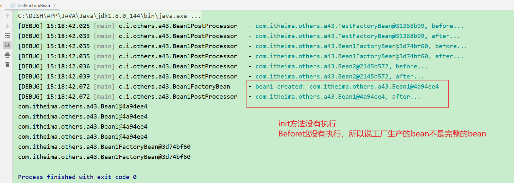
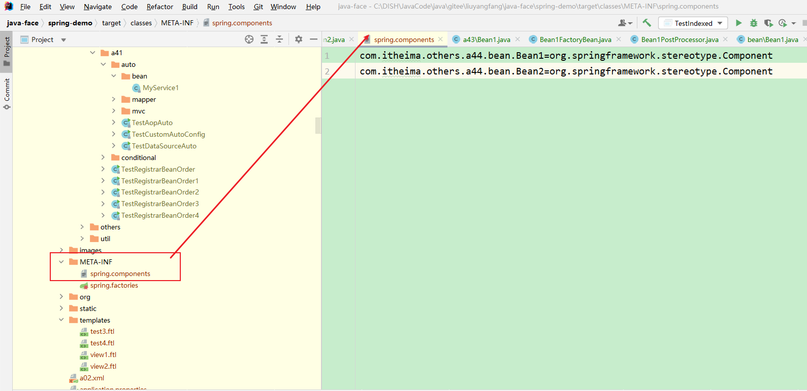

## 43 FactoryBean

### 1 演示 - FactoryBean

#### 1.1 代码参考

##### 1.1.1 Bean2

```java
package com.itheima.others.a43;

import lombok.extern.slf4j.Slf4j;
import org.springframework.stereotype.Component;

/**
 * @author lyf
 * @version 1.0
 * @classname Bean2
 * @description
 * @since 2022/12/17 14:50
 */
@Slf4j
@Component
public class Bean2 {
}

```

##### 1.1.2 Bean1

```java
package com.itheima.others.a43;

import lombok.extern.slf4j.Slf4j;
import org.springframework.beans.BeansException;
import org.springframework.beans.factory.BeanFactory;
import org.springframework.beans.factory.BeanFactoryAware;
import org.springframework.beans.factory.annotation.Autowired;

import javax.annotation.PostConstruct;

/**
 * @author lyf
 * @version 1.0
 * @classname Bean1
 * @description
 * @since 2022/12/17 14:51
 */
@Slf4j
public class Bean1 implements BeanFactoryAware {
    private Bean2 bean2;

    @Autowired
    public void setBean2(Bean2 bean2) {
        log.debug("bean2: {}", bean2);
        this.bean2 = bean2;
    }

    public Bean2 getBean2() {
        return bean2;
    }

    @PostConstruct
    public void init() {
        log.debug("init...");
    }

    @Override
    public void setBeanFactory(BeanFactory beanFactory) throws BeansException {
        log.debug("beanFactory: {}", beanFactory);
    }
}

```

##### 1.1.3 Bean1FactoryBean

```java
package com.itheima.others.a43;

import lombok.extern.slf4j.Slf4j;
import org.springframework.beans.factory.FactoryBean;
import org.springframework.stereotype.Component;

/**
 * @author lyf
 * @version 1.0
 * @classname Bean1FactoryBean
 * @description 生产Bean1对象的工厂对象
 * @since 2022/12/17 14:54
 */
@Slf4j
@Component("bean1")
public class Bean1FactoryBean implements FactoryBean<Bean1> {

    @Override
    public Bean1 getObject() throws Exception {
        Bean1 bean1 = new Bean1();
        log.debug("bean1 created: {}", bean1);
        return bean1;
    }

    /**
     * 决定了根据类型注入是否成功
     *
     * @return Bean
     */
    @Override
    public Class<?> getObjectType() {
        return Bean1.class;
    }

    /**
     * 是否为单例Bean
     *
     * @return true：单例，false：不是单例
     */
    @Override
    public boolean isSingleton() {
        return true;
    }
}

```

##### 1.1.4 Bean1PostProcessor

```java
package com.itheima.others.a43;

import lombok.extern.slf4j.Slf4j;
import org.springframework.beans.BeansException;
import org.springframework.beans.factory.config.BeanPostProcessor;
import org.springframework.stereotype.Component;

/**
 * @author lyf
 * @version 1.0
 * @classname Bean1PostProcessor
 * @description Bean的后处理器
 * @since 2022/12/17 14:59
 */
@Slf4j
@Component
public class Bean1PostProcessor implements BeanPostProcessor {
    @Override
    public Object postProcessBeforeInitialization(Object bean, String beanName) throws BeansException {
        log.debug("{}, before...", bean);
        return bean;
    }

    @Override
    public Object postProcessAfterInitialization(Object bean, String beanName) throws BeansException {
        log.debug("{}, after...", bean);
        return bean;
    }
}
```

##### 1.1.5 TestFactoryBean

```java
package com.itheima.others.a43;

import lombok.extern.slf4j.Slf4j;
import org.springframework.context.annotation.AnnotationConfigApplicationContext;
import org.springframework.context.annotation.ComponentScan;

/**
 * @author lyf
 * @version 1.0
 * @classname TestFactoryBean
 * @description
 * @since 2022/12/17 14:49
 */
@Slf4j
@ComponentScan
public class TestFactoryBean {
    public static void main(String[] args) {
        AnnotationConfigApplicationContext context = new AnnotationConfigApplicationContext(TestFactoryBean.class);

        System.out.println(context.getBean("bean1"));
        System.out.println(context.getBean("bean1"));
        System.out.println(context.getBean("bean1"));

        System.out.println(context.getBean(Bean1.class));


        System.out.println(context.getBean(Bean1FactoryBean.class));
        System.out.println(context.getBean("&bean1"));

        context.close();

          /*
            学到了什么: 一个在 Spring 发展阶段中重要, 但目前已经很鸡肋的接口 FactoryBean 的使用要点
            说它鸡肋有两点:
                1. 它的作用是用制造创建过程较为复杂的产品, 如 SqlSessionFactory, 但 @Bean 已具备等价功能
                2. 使用上较为古怪, 一不留神就会用错
                    a. 被 FactoryBean 创建的产品
                        - 会认为创建、依赖注入、Aware 接口回调、前初始化这些都是 FactoryBean 的职责, 这些流程都不会走
                        - 唯有后初始化的流程会走, 也就是产品可以被代理增强
                        - 单例的产品不会存储于 BeanFactory 的 singletonObjects 成员中, 而是另一个 factoryBeanObjectCache 成员中
                    b. 按名字去获取时, 拿到的是产品对象, 名字前面加 & 获取的是工厂对象
            就说恶心不?

            但目前此接口的实现仍被大量使用, 想被全面废弃很难
         */
    }
}

```

##### 1.1.6 运行结果

```verilog
[DEBUG] 15:18:42.025 [main] c.i.others.a43.Bean1PostProcessor   - com.itheima.others.a43.TestFactoryBean@31368b99, before... 
[DEBUG] 15:18:42.033 [main] c.i.others.a43.Bean1PostProcessor   - com.itheima.others.a43.TestFactoryBean@31368b99, after... 
[DEBUG] 15:18:42.035 [main] c.i.others.a43.Bean1PostProcessor   - com.itheima.others.a43.Bean1FactoryBean@3d74bf60, before... 
[DEBUG] 15:18:42.035 [main] c.i.others.a43.Bean1PostProcessor   - com.itheima.others.a43.Bean1FactoryBean@3d74bf60, after... 
[DEBUG] 15:18:42.036 [main] c.i.others.a43.Bean1PostProcessor   - com.itheima.others.a43.Bean2@2145b572, before... 
[DEBUG] 15:18:42.039 [main] c.i.others.a43.Bean1PostProcessor   - com.itheima.others.a43.Bean2@2145b572, after... 
[DEBUG] 15:18:42.072 [main] c.i.others.a43.Bean1FactoryBean     - bean1 created: com.itheima.others.a43.Bean1@4a94ee4 
[DEBUG] 15:18:42.072 [main] c.i.others.a43.Bean1PostProcessor   - com.itheima.others.a43.Bean1@4a94ee4, after... 
com.itheima.others.a43.Bean1@4a94ee4
com.itheima.others.a43.Bean1@4a94ee4
com.itheima.others.a43.Bean1@4a94ee4
com.itheima.others.a43.Bean1@4a94ee4
com.itheima.others.a43.Bean1FactoryBean@3d74bf60
com.itheima.others.a43.Bean1FactoryBean@3d74bf60
```



### 2 收获💡

1. 它的作用是用制造创建过程较为复杂的产品, 如 SqlSessionFactory, 但 @Bean 已具备等价功能
2. 使用上较为古怪, 一不留神就会用错
   1. 被 FactoryBean 创建的产品
      * 会认为创建、依赖注入、Aware 接口回调、前初始化这些都是 FactoryBean 的职责, 这些流程都不会走
      * 唯有后初始化的流程会走, 也就是产品可以被代理增强
      * 单例的产品不会存储于 BeanFactory 的 singletonObjects 成员中, 而是另一个 factoryBeanObjectCache 成员中
   2. 按名字去获取时, 拿到的是产品对象, 名字前面加 & 获取的是工厂对象


## 44 @Indexed 原理

真实项目中，只需要加入以下依赖即可

```xml
<dependency>
    <groupId>org.springframework</groupId>
    <artifactId>spring-context-indexer</artifactId>
    <optional>true</optional>
</dependency>
```


### 1 演示 - @Indexed

#### 1.1 代码参考

##### 1.1.1 Bean1

```java
package com.itheima.others.a44.bean;

import lombok.extern.slf4j.Slf4j;
import org.springframework.stereotype.Component;

/**
 * @author lyf
 * @version 1.0
 * @classname Bean1
 * @description
 * @since 2022/12/17 15:23
 */
@Slf4j
@Component
public class Bean1 {
}

```

##### 1.1.2 Bean2

```java
package com.itheima.others.a44.bean;

import lombok.extern.slf4j.Slf4j;
import org.springframework.stereotype.Component;

/**
 * @author lyf
 * @version 1.0
 * @classname Bean2
 * @description
 * @since 2022/12/17 15:23
 */
@Slf4j
@Component
public class Bean2 {
}

```

##### 1.1.3 Bean3

```java
package com.itheima.others.a44.bean;

import lombok.extern.slf4j.Slf4j;
import org.springframework.stereotype.Component;

/**
 * @author lyf
 * @version 1.0
 * @classname Bean3
 * @description
 * @since 2022/12/17 15:23
 */
@Slf4j
@Component
public class Bean3 {
}

```

##### 1.1.4 测试代码

```java
package com.itheima.others.a44;

import lombok.extern.slf4j.Slf4j;
import org.springframework.beans.factory.support.DefaultListableBeanFactory;
import org.springframework.context.annotation.ClassPathBeanDefinitionScanner;

/**
 * @author lyf
 * @version 1.0
 * @classname TestIndexed
 * @description 测试@Indexed
 * <p>
 * 做这个试验前, 先在 target/classes 创建 META-INF/spring.components, 内容为
 * <p>
 * com.itheima.others.a44.bean.Bean1=org.springframework.stereotype.Component
 * com.itheima.others.a44.bean.Bean2=org.springframework.stereotype.Component
 * <p>
 * 做完实现建议删除, 避免影响其它组件扫描的结果
 * <p>
 * 真实项目中, 这个步骤可以自动完成, 加入以下依赖
 * <dependency>
 * <groupId>org.springframework</groupId>
 * <artifactId>spring-context-indexer</artifactId>
 * <optional>true</optional>
 * </dependency>
 * @since 2022/12/17 15:24
 */
@Slf4j
public class TestIndexed {
    public static void main(String[] args) {
        DefaultListableBeanFactory beanFactory = new DefaultListableBeanFactory();
        ClassPathBeanDefinitionScanner scanner = new ClassPathBeanDefinitionScanner(beanFactory);
        scanner.scan(TestIndexed.class.getPackage().getName());

        for (String name : beanFactory.getBeanDefinitionNames()) {
            System.out.printf("name=%s\n", name);
        }
    }
}

```



##### 1.1.5 运行结果

```verilog
name=bean1
name=bean2
name=org.springframework.context.annotation.internalConfigurationAnnotationProcessor
name=org.springframework.context.annotation.internalAutowiredAnnotationProcessor
name=org.springframework.context.annotation.internalCommonAnnotationProcessor
name=org.springframework.context.event.internalEventListenerProcessor
name=org.springframework.context.event.internalEventListenerFactory

```


### 2 收获💡

1. 在编译时就根据 @Indexed 生成 META-INF/spring.components 文件
2. 扫描时
   * 如果发现 META-INF/spring.components 存在, 以它为准加载 bean definition
   * 否则, 会遍历包下所有 class 资源 (包括 jar 内的)
3. 解决的问题，在编译期就找到 @Component 组件，节省运行期间扫描 @Component 的时间


## 45 代理进一步理解

### 1 演示 - 代理

#### 1.1 代码参考

##### 1.1.1 Bean2

```java
package com.itheima.others.a45;

import lombok.extern.slf4j.Slf4j;
import org.springframework.stereotype.Component;

/**
 * @author lyf
 * @version 1.0
 * @classname Bean2
 * @description
 * @since 2022/12/17 15:35
 */
@Slf4j
@Component
public class Bean2 {
}

```

##### 1.1.2 Bean1

```java
package com.itheima.others.a45;

import lombok.extern.slf4j.Slf4j;
import org.springframework.beans.factory.annotation.Autowired;
import org.springframework.stereotype.Component;

import javax.annotation.PostConstruct;

/**
 * @author lyf
 * @version 1.0
 * @classname Bean1
 * @description
 * @since 2022/12/17 15:35
 */
@Slf4j
@Component
public class Bean1 {
    protected Bean2 bean2;
    protected boolean isInitialization;

    @Autowired
    public void setBean2(Bean2 bean2) {
        this.bean2 = bean2;
    }

    public Bean2 getBean2() {
        log.debug("bean2 is {}", bean2);
        return bean2;
    }

    @PostConstruct
    public void init() {
        log.debug("Bean1 init...");
        this.isInitialization = true;
    }

    public boolean isInitialization() {
        log.debug("isInitialization is {}", isInitialization);
        return isInitialization;
    }

    public void m1() {
        System.out.println("m1() 成员方法");
    }

    final public void m2() {
        System.out.println("m2() final 方法");
    }

    static public void m3() {
        System.out.println("m3() static 方法");
    }

    private void m4() {
        System.out.println("m4() private 方法");
    }
}

```

##### 1.1.1 MyAspect

```java
package com.itheima.others.a45;

import lombok.extern.slf4j.Slf4j;
import org.aspectj.lang.annotation.Aspect;
import org.aspectj.lang.annotation.Before;
import org.springframework.stereotype.Component;

/**
 * @author lyf
 * @version 1.0
 * @classname MyAspect
 * @description
 * @since 2022/12/17 15:39
 */
@Slf4j
@Aspect
@Component
public class MyAspect {

    @Before(value = "execution(* com.itheima.others.a45.Bean1.*(..))")
    public void before() {
        log.debug("MyAspect...before...");
    }
}

```

##### 1.1.1 TestProxyPlus

```java
package com.itheima.others.a45;

import lombok.extern.slf4j.Slf4j;
import org.springframework.aop.framework.Advised;
import org.springframework.boot.SpringApplication;
import org.springframework.boot.autoconfigure.SpringBootApplication;
import org.springframework.context.ConfigurableApplicationContext;

import java.lang.reflect.Method;

/**
 * @author lyf
 * @version 1.0
 * @classname TestProxyPlus
 * @description
 * @since 2022/12/17 15:35
 */
@Slf4j
@SpringBootApplication(scanBasePackages = "com.itheima.others.a45")
public class TestProxyPlus {
    public static void main(String[] args) throws Exception {
        ConfigurableApplicationContext context = SpringApplication.run(TestProxyPlus.class, args);
        Bean1 proxy = context.getBean(Bean1.class);

         /*
            1.演示 spring 代理的设计特点
                依赖注入和初始化影响的是原始对象
                代理与目标是两个对象，二者成员变量并不共用数据
         */
        System.out.println(">>>>>>>>>>>1.1 代理与目标是两个对象，二者成员变量并不共用数据 start>>>>>>>>>>>>>>>>>>");
        showProxyAndTarget(proxy);
        System.out.println(">>>>>>>>>>>1.1 代理与目标是两个对象，二者成员变量并不共用数据  end>>>>>>>>>>>>>>>>>>");
        System.out.println(">>>>>>>>>>>1.2 依赖注入和初始化影响的是原始对象  start>>>>>>>>>>>>>>>>>>");
        System.out.println(proxy.getBean2());
        System.out.println(proxy.isInitialization());
        System.out.println(">>>>>>>>>>>1.2 依赖注入和初始化影响的是原始对象  end>>>>>>>>>>>>>>>>>>");

        /*
            2.演示 static 方法、final 方法、private 方法均无法增强
         */
        System.out.println(">>>>>>>>>>>2.演示 static 方法、final 方法、private 方法均无法增强  start>>>>>>>>>>>>>>>>>>");
        proxy.m1();
        proxy.m2();
        proxy.m3();
        Method m4 = Bean1.class.getDeclaredMethod("m4");
        m4.setAccessible(true);
        m4.invoke(proxy);
        System.out.println(">>>>>>>>>>>2.演示 static 方法、final 方法、private 方法均无法增强  end>>>>>>>>>>>>>>>>>>");
        context.close();
    }

    public static void showProxyAndTarget(Bean1 proxy) throws Exception {
        System.out.println(">>>>> 代理中的成员变量");
        System.out.println("\tinitialized=" + proxy.isInitialization);
        System.out.println("\tbean2=" + proxy.bean2);

        if (proxy instanceof Advised) {
            Advised advised = (Advised) proxy;
            System.out.println(">>>>> 目标中的成员变量");
            Bean1 target = (Bean1) advised.getTargetSource().getTarget();
            System.out.println("\tinitialized=" + target.isInitialization);
            System.out.println("\tbean2=" + target.bean2);
        }
    }
}

```

##### 1.1.1 运行结果

```verilog
 .   ____          _            __ _ _
 /\\ / ___'_ __ _ _(_)_ __  __ _ \ \ \ \
( ( )\___ | '_ | '_| | '_ \/ _` | \ \ \ \
 \\/  ___)| |_)| | | | | || (_| |  ) ) ) )
  '  |____| .__|_| |_|_| |_\__, | / / / /
 =========|_|==============|___/=/_/_/_/
 :: Spring Boot ::                (v2.6.7)

[INFO ] 16:06:15.257 [main] c.itheima.others.a45.TestProxyPlus  - Starting TestProxyPlus using Java 1.8.0_144 on lyf with PID 17568 (C:\DISH\JavaCode\java\gitee\liuyangfang\java-face\spring-demo\target\classes started by lyf in C:\DISH\JavaCode\java\gitee\liuyangfang\java-face) 
[DEBUG] 16:06:15.263 [main] c.itheima.others.a45.TestProxyPlus  - Running with Spring Boot v2.6.7, Spring v5.3.19 
[INFO ] 16:06:15.263 [main] c.itheima.others.a45.TestProxyPlus  - No active profile set, falling back to 1 default profile: "default" 
[DEBUG] 16:06:16.631 [main] com.itheima.others.a45.Bean1        - Bean1 init... 
[INFO ] 16:06:17.246 [main] c.itheima.others.a45.TestProxyPlus  - Started TestProxyPlus in 2.357 seconds (JVM running for 3.811) 
>>>>>>>>>>>1.1 代理与目标是两个对象，二者成员变量并不共用数据 start>>>>>>>>>>>>>>>>>>
>>>>> 代理中的成员变量
	initialized=false
	bean2=null
>>>>> 目标中的成员变量
	initialized=true
	bean2=com.itheima.others.a45.Bean2@2def7a7a
>>>>>>>>>>>1.1 代理与目标是两个对象，二者成员变量并不共用数据  end>>>>>>>>>>>>>>>>>>
>>>>>>>>>>>1.2 依赖注入和初始化影响的是原始对象  start>>>>>>>>>>>>>>>>>>
[DEBUG] 16:06:17.251 [main] com.itheima.others.a45.MyAspect     - MyAspect...before... 
[DEBUG] 16:06:17.256 [main] com.itheima.others.a45.Bean1        - bean2 is com.itheima.others.a45.Bean2@2def7a7a 
com.itheima.others.a45.Bean2@2def7a7a
[DEBUG] 16:06:17.257 [main] com.itheima.others.a45.MyAspect     - MyAspect...before... 
[DEBUG] 16:06:17.257 [main] com.itheima.others.a45.Bean1        - isInitialization is true 
true
>>>>>>>>>>>1.2 依赖注入和初始化影响的是原始对象  end>>>>>>>>>>>>>>>>>>
>>>>>>>>>>>2.演示 static 方法、final 方法、private 方法均无法增强  start>>>>>>>>>>>>>>>>>>
[DEBUG] 16:06:17.257 [main] com.itheima.others.a45.MyAspect     - MyAspect...before... 
m1() 成员方法
m2() final 方法
m3() static 方法
m4() private 方法
>>>>>>>>>>>2.演示 static 方法、final 方法、private 方法均无法增强  end>>>>>>>>>>>>>>>>>>
```

### 2 收获💡

1. spring 代理的设计特点

   * 依赖注入和初始化影响的是原始对象
     * 因此 cglib 不能用 MethodProxy.invokeSuper()

   * 代理与目标是两个对象，二者成员变量并不共用数据

2. static 方法、final 方法、private 方法均无法增强

   * 进一步理解代理增强基于方法重写


## 46 @Value 装配底层

### 1 按类型装配的步骤

1. 查看需要的类型是否为 Optional，是，则进行封装（非延迟），否则向下走
2. 查看需要的类型是否为 ObjectFactory 或 ObjectProvider，是，则进行封装（延迟），否则向下走
3. 查看需要的类型（成员或参数）上是否用 @Lazy 修饰，是，则返回代理，否则向下走
4. 解析 @Value 的值
   1. 如果需要的值是字符串，先解析 ${ }，再解析 #{ }
   2. 不是字符串，需要用 TypeConverter 转换
5. 看需要的类型是否为 Stream、Array、Collection、Map，是，则按集合处理，否则向下走
6. 在 BeanFactory 的 resolvableDependencies 中找有没有类型合适的对象注入，没有向下走
7. 在 BeanFactory 及父工厂中找类型匹配的 bean 进行筛选，筛选时会考虑 @Qualifier 及泛型
8. 结果个数为 0 抛出 NoSuchBeanDefinitionException 异常 
9. 如果结果 > 1，再根据 @Primary 进行筛选
10. 如果结果仍 > 1，再根据成员名或变量名进行筛选
11. 结果仍 > 1，抛出 NoUniqueBeanDefinitionException 异常


### 2 演示 - @Value 装配过程

#### 2.1 代码参考

##### 2.1.1 测试代码

```java
package com.itheima.others.a46;

import lombok.extern.slf4j.Slf4j;
import org.springframework.beans.TypeConverter;
import org.springframework.beans.factory.annotation.Value;
import org.springframework.beans.factory.config.BeanExpressionContext;
import org.springframework.beans.factory.config.ConfigurableListableBeanFactory;
import org.springframework.beans.factory.config.DependencyDescriptor;
import org.springframework.beans.factory.support.DefaultListableBeanFactory;
import org.springframework.context.annotation.AnnotationConfigApplicationContext;
import org.springframework.context.annotation.Configuration;
import org.springframework.context.annotation.ContextAnnotationAutowireCandidateResolver;
import org.springframework.context.expression.StandardBeanExpressionResolver;
import org.springframework.stereotype.Component;

import java.lang.reflect.Field;

import static com.itheima.util.PrintUtil.print;

/**
 * @author lyf
 * @version 1.0
 * @classname TestAnnotationValue
 * @description @Value自动装配原理解析
 * @since 2022/12/17 16:14
 */
@Slf4j
@Configuration
public class TestAnnotationValue {
    public static void main(String[] args) throws NoSuchFieldException {
        AnnotationConfigApplicationContext context
                = new AnnotationConfigApplicationContext(TestAnnotationValue.class);
        DefaultListableBeanFactory beanFactory = context.getDefaultListableBeanFactory();

        ContextAnnotationAutowireCandidateResolver resolver
                = new ContextAnnotationAutowireCandidateResolver();
        resolver.setBeanFactory(beanFactory);

        resolverAnnotationValue(context, resolver, Bean1.class.getDeclaredField("home"));
        print(">>>>>>>>>>>>>>>>>>>>>>>>>>>>>>>>>>>>>>>>>>>>>>>>>>>>>>>>>>>>>>>>>>>>>>>>>");
        resolverAnnotationValue(context, resolver, Bean1.class.getDeclaredField("age"));
        print(">>>>>>>>>>>>>>>>>>>>>>>>>>>>>>>>>>>>>>>>>>>>>>>>>>>>>>>>>>>>>>>>>>>>>>>>>");
        resolverAnnotationValue(context, resolver, Bean2.class.getDeclaredField("bean3"));
        print(">>>>>>>>>>>>>>>>>>>>>>>>>>>>>>>>>>>>>>>>>>>>>>>>>>>>>>>>>>>>>>>>>>>>>>>>>");
        resolverAnnotationValue(context, resolver, Bean4.class.getDeclaredField("value"));
        context.close();
    }

    public static void resolverAnnotationValue(AnnotationConfigApplicationContext context, ContextAnnotationAutowireCandidateResolver resolver,
                                               Field field) {
        // 1 获取@Value的内容
        Value annotation = field.getAnnotation(Value.class);
        if (annotation == null) {
            return;
        }
        /* String value = annotation.value();*/
        DependencyDescriptor dependencyDescriptor = new DependencyDescriptor(field, false);
        String value = resolver.getSuggestedValue(dependencyDescriptor) + "";
        print("1 获取@Value的内容: {}", value);
        /*
            或者下面这种写法
            DependencyDescriptor dependencyDescriptor = new DependencyDescriptor(field, false);
            Object suggestedValue = resolver.getSuggestedValue(dependencyDescriptor);
            System.out.println(suggestedValue);
         */
        // 2 解析 ${}
        value = context.getEnvironment().resolvePlaceholders(value);
        print("2 解析 ${value}, the value {}", value);
        // 3 解析#{SpEL}
        ConfigurableListableBeanFactory beanFactory = context.getBeanFactory();
        StandardBeanExpressionResolver expressionResolver = new StandardBeanExpressionResolver();
        Object result = expressionResolver.evaluate(value, new BeanExpressionContext(beanFactory, null));
        print("3 解析#{SpEL}, the result is {}", result);
        // 4 类型转换
        TypeConverter typeConverter = beanFactory.getTypeConverter();
        Object type = typeConverter.convertIfNecessary(result, dependencyDescriptor.getDependencyType());
        print("4 类型转换，转换后的对象是: {}", type);
    }

    /*
        1. 查看需要的类型是否为 Optional，是，则进行封装（非延迟），否则向下走
        2. 查看需要的类型是否为 ObjectFactory 或 ObjectProvider，是，则进行封装（延迟），否则向下走
        3. 查看需要的类型（成员或参数）上是否用 @Lazy 修饰，是，则返回代理，否则向下走
        4. 解析 @Value 的值
           1. 如果需要的值是字符串，先解析 ${ }，再解析 #{ }
           2. 不是字符串，需要用 TypeConverter 转换
        5. 看需要的类型是否为 Stream、Array、Collection、Map，是，则按集合处理，否则向下走
        6. 在 BeanFactory 的 resolvableDependencies 中找有没有类型合适的对象注入，没有向下走
        7. 在 BeanFactory 及父工厂中找类型匹配的 bean 进行筛选，筛选时会考虑 @Qualifier 及泛型
        8. 结果个数为 0 抛出 NoSuchBeanDefinitionException 异常
        9. 如果结果 > 1，再根据 @Primary 进行筛选
        10. 如果结果仍 > 1，再根据成员名或变量名进行筛选
        11. 结果仍 > 1，抛出 NoUniqueBeanDefinitionException 异常
     */

    public static class Bean1 {
        @Value("${JAVA_HOME}")
        private String home;
        @Value("18")
        private int age;
    }

    public static class Bean2 {
        @Value("#{@bean3}") // SpringEL       #{SpEL}
        private Bean3 bean3;
    }

    @Component("bean3")
    public static class Bean3 {
    }

    static class Bean4 {
        @Value("#{'hello, ' + '${JAVA_HOME}'}")
        private String value;
    }
}

```

###### 2.1.1.1 工具类

```java
package com.itheima.util;

import lombok.extern.slf4j.Slf4j;

import java.util.ArrayList;
import java.util.List;

/**
 * @author lyf
 * @version 1.0
 * @classname PrintUtil
 * @description 打印工具类
 * @date 2022/12/17 16:33
 */
@Slf4j
public final class PrintUtil {
    /**
     * 私有构造器
     */
    private PrintUtil() {
    }

    public static void main(String[] args) {
        print("123{}789{}", 456, 0);
    }

    @SuppressWarnings("ALL")
    public static void print(String str, Object... args) {
        if (isEmpty(str)) {
            if (args.length == 0) {
                System.out.println(str);
                return;
            }
            throw new IllegalArgumentException("{} 个数与参数个数不同");
        }

        String replace = str.replace("{}", "%s") + "\n";
        List<String> list = new ArrayList<>();
        for (Object arg : args) {
            list.add("" + arg);
        }
        System.out.printf(replace, list.toArray(new String[0]));
    }

    private static boolean isEmpty(String str) {
        return str == null || str.isEmpty();
    }
}

```


##### 2.1.2 运行结果

```java
1 获取@Value的内容: ${JAVA_HOME}
2 解析 ${value}, the value C:\DISH\APP\JAVA\Java\jdk1.8.0_144
3 解析#{SpEL}, the result is C:\DISH\APP\JAVA\Java\jdk1.8.0_144
4 类型转换，转换后的对象是: C:\DISH\APP\JAVA\Java\jdk1.8.0_144
>>>>>>>>>>>>>>>>>>>>>>>>>>>>>>>>>>>>>>>>>>>>>>>>>>>>>>>>>>>>>>>>>>>>>>>>>
1 获取@Value的内容: 18
2 解析 ${value}, the value 18
3 解析#{SpEL}, the result is 18
4 类型转换，转换后的对象是: 18
>>>>>>>>>>>>>>>>>>>>>>>>>>>>>>>>>>>>>>>>>>>>>>>>>>>>>>>>>>>>>>>>>>>>>>>>>
1 获取@Value的内容: #{@bean3}
2 解析 ${value}, the value #{@bean3}
3 解析#{SpEL}, the result is com.itheima.others.a46.TestAnnotationValue$Bean3@bccb269
4 类型转换，转换后的对象是: com.itheima.others.a46.TestAnnotationValue$Bean3@bccb269
>>>>>>>>>>>>>>>>>>>>>>>>>>>>>>>>>>>>>>>>>>>>>>>>>>>>>>>>>>>>>>>>>>>>>>>>>
1 获取@Value的内容: #{'hello, ' + '${JAVA_HOME}'}
2 解析 ${value}, the value #{'hello, ' + 'C:\DISH\APP\JAVA\Java\jdk1.8.0_144'}
3 解析#{SpEL}, the result is hello, C:\DISH\APP\JAVA\Java\jdk1.8.0_144
4 类型转换，转换后的对象是: hello, C:\DISH\APP\JAVA\Java\jdk1.8.0_144
```


### 3 收获💡

1. ContextAnnotationAutowireCandidateResolver 作用之一，获取 @Value 的值
2. 了解 ${ } 对应的解析器
3. 了解 #{ } 对应的解析器
4. TypeConvert 的一项体现


## 47 @Autowired 装配底层

### 1 演示 - @Autowired 装配过程-注入简单对象，Optional包装的简单对象，ObjectFactory 包装的简单对象

#### 1.1 代码参考

##### 1.1.1 测试代码

```java
package com.itheima.others.a47;

import lombok.extern.slf4j.Slf4j;
import org.springframework.beans.factory.ObjectFactory;
import org.springframework.beans.factory.annotation.Autowired;
import org.springframework.beans.factory.config.DependencyDescriptor;
import org.springframework.beans.factory.support.DefaultListableBeanFactory;
import org.springframework.context.annotation.AnnotationConfigApplicationContext;
import org.springframework.context.annotation.Configuration;
import org.springframework.context.annotation.ContextAnnotationAutowireCandidateResolver;
import org.springframework.context.annotation.Lazy;
import org.springframework.core.MethodParameter;
import org.springframework.core.annotation.AnnotationUtils;
import org.springframework.stereotype.Component;

import java.lang.annotation.Annotation;
import java.lang.reflect.AccessibleObject;
import java.lang.reflect.Field;
import java.lang.reflect.Method;
import java.util.Optional;

/**
 * @author lyf
 * @version 1.0
 * @classname TestAutowired
 * @description 测试@Autowired注解的底层原理
 * @since 2022/12/17 17:20
 */
@Slf4j
@Configuration
public class TestAutowired {
    public static void main(String[] args) throws Exception {
        AnnotationConfigApplicationContext context = new AnnotationConfigApplicationContext(TestAutowired.class);
        System.out.println(resolverAutowired(Bean1.class.getDeclaredField("bean2"), context, "bean1"));
        System.out.println(">>>>>>>>>>>>>>>>>>>>>>>>>>>>>>>>>>>>>>>>>>>>>>>>>>>>>>>>>>>>>>>>>>>>>>>>>>>>>>>>>>>>>>>>>>>>>>>>>");
        System.out.println(resolverAutowired(Bean1.class.getDeclaredMethod("setBean2", Bean2.class), context, "bean1"));
        System.out.println(">>>>>>>>>>>>>>>>>>>>>>>>>>>>>>>>>>>>>>>>>>>>>>>>>>>>>>>>>>>>>>>>>>>>>>>>>>>>>>>>>>>>>>>>>>>>>>>>>");
        System.out.println(resolverAutowired(Bean1.class.getDeclaredField("bean3"), context, "bean1"));
        System.out.println(">>>>>>>>>>>>>>>>>>>>>>>>>>>>>>>>>>>>>>>>>>>>>>>>>>>>>>>>>>>>>>>>>>>>>>>>>>>>>>>>>>>>>>>>>>>>>>>>>");
        ObjectFactory<Bean2> objectFactory = (ObjectFactory<Bean2>) resolverAutowired(Bean1.class.getDeclaredField("bean4"), context, "bean1");
        System.out.println(objectFactory.getObject());
        System.out.println(">>>>>>>>>>>>>>>>>>>>>>>>>>>>>>>>>>>>>>>>>>>>>>>>>>>>>>>>>>>>>>>>>>>>>>>>>>>>>>>>>>>>>>>>>>>>>>>>>");
        System.out.println(resolverAutowired(Bean1.class.getDeclaredField("bean5"), context, "bean1"));
        System.out.println(">>>>>>>>>>>>>>>>>>>>>>>>>>>>>>>>>>>>>>>>>>>>>>>>>>>>>>>>>>>>>>>>>>>>>>>>>>>>>>>>>>>>>>>>>>>>>>>>>");
        System.out.println(resolverAutowired(Bean1.class.getDeclaredField("bean6"), context, "bean1"));
        System.out.println(">>>>>>>>>>>>>>>>>>>>>>>>>>>>>>>>>>>>>>>>>>>>>>>>>>>>>>>>>>>>>>>>>>>>>>>>>>>>>>>>>>>>>>>>>>>>>>>>>");
        System.out.println(resolverAutowired(Bean1.class.getDeclaredField("bean7"), context, "bean1"));
    }

    /**
     * 解析@Autowired注解
     *
     * @param accessibleObject Field和Method的父类
     * @param context          Spring容器
     * @param beanName         bean的名称，随意
     * @return @Autowired解析出的对象
     */
    public static Object resolverAutowired(AccessibleObject accessibleObject, AnnotationConfigApplicationContext context, String beanName) {
        DependencyDescriptor descriptor;
        if (accessibleObject instanceof Field) {
            Field field = (Field) accessibleObject;
            descriptor = new DependencyDescriptor(field, false);
        } else if (accessibleObject instanceof Method) {
            Method method = (Method) accessibleObject;
            MethodParameter methodParameter = new MethodParameter(method, 0);
            descriptor = new DependencyDescriptor(methodParameter, false);
        } else {
            throw new IllegalArgumentException("必须为Field或者Method");
        }
        DefaultListableBeanFactory beanFactory = context.getDefaultListableBeanFactory();


        Object result;
        // 解析Optional
        if (descriptor.getDependencyType() == Optional.class) {
            descriptor.increaseNestingLevel();
            result = beanFactory.doResolveDependency(descriptor, beanName, null, null);
        } else if (descriptor.getDependencyType() == ObjectFactory.class) {
            descriptor.increaseNestingLevel();
            result = (ObjectFactory<Object>) () -> beanFactory.doResolveDependency(descriptor, beanName, null, null);
        } else {
            result = beanFactory.doResolveDependency(descriptor, beanName, null, null);
        }

        // 最后解析@Lazy
        if (isLazy(descriptor)) {
            ContextAnnotationAutowireCandidateResolver resolver = new ContextAnnotationAutowireCandidateResolver();
            resolver.setBeanFactory(beanFactory);
            result = resolver.getLazyResolutionProxyIfNecessary(descriptor, beanName);
        }
        return result;
    }

    public static boolean isLazy(DependencyDescriptor descriptor) {
        for (Annotation ann : descriptor.getAnnotations()) {
            Lazy lazy = AnnotationUtils.getAnnotation(ann, Lazy.class);
            if (lazy != null && lazy.value()) {
                return true;
            }
        }
        MethodParameter methodParam = descriptor.getMethodParameter();
        if (methodParam != null) {
            Method method = methodParam.getMethod();
            if (method == null || void.class == method.getReturnType()) {
                Lazy lazy = AnnotationUtils.getAnnotation(methodParam.getAnnotatedElement(), Lazy.class);
                return lazy != null && lazy.value();
            }
        }
        return false;
    }

    static class Bean1 {
        /**
         * 1 根据成员变量进行注入
         */
        @Autowired
        private Bean2 bean2;

        /**
         * 2 根据方法参数进行注入
         *
         * @param bean2
         */
        @Autowired
        public void setBean2(Bean2 bean2) {
            this.bean2 = bean2;
        }

        /**
         * 3. 结果包装为 Optional<Bean2>
         */
        @Autowired
        private Optional<Bean2> bean3;

        /**
         * 4. 结果包装为 ObjectProvider,ObjectFactory
         */
        @Autowired
        private ObjectFactory<Bean2> bean4;

        /**
         * 5. 对 @Lazy 的处理
         */
        @Autowired
        @Lazy
        private Bean3 bean5;


        /**
         * 3. 结果包装为 Optional<Bean2>
         */
        @Autowired
        @Lazy
        private Optional<Bean3> bean6;

        /**
         * 3. 结果包装为 Optional<Bean2>
         */
        @Autowired
        @Lazy
        private ObjectFactory<Bean3> bean7;
    }

    @Component("bean2")
    static class Bean2 {
    }

    @Component("bean3")
    static class Bean3 {
    }
}

```

##### 1.1.2 执行结果

```verilog
com.itheima.others.a47.TestAutowired$Bean2@639c2c1d
>>>>>>>>>>>>>>>>>>>>>>>>>>>>>>>>>>>>>>>>>>>>>>>>>>>>>>>>>>>>>>>>>>>>>>>>>>>>>>>>>>>>>>>>>>>>>>>>>
com.itheima.others.a47.TestAutowired$Bean2@639c2c1d
>>>>>>>>>>>>>>>>>>>>>>>>>>>>>>>>>>>>>>>>>>>>>>>>>>>>>>>>>>>>>>>>>>>>>>>>>>>>>>>>>>>>>>>>>>>>>>>>>
com.itheima.others.a47.TestAutowired$Bean2@639c2c1d
>>>>>>>>>>>>>>>>>>>>>>>>>>>>>>>>>>>>>>>>>>>>>>>>>>>>>>>>>>>>>>>>>>>>>>>>>>>>>>>>>>>>>>>>>>>>>>>>>
com.itheima.others.a47.TestAutowired$Bean2@639c2c1d
>>>>>>>>>>>>>>>>>>>>>>>>>>>>>>>>>>>>>>>>>>>>>>>>>>>>>>>>>>>>>>>>>>>>>>>>>>>>>>>>>>>>>>>>>>>>>>>>>
com.itheima.others.a47.TestAutowired$Bean3@7d20d0b
>>>>>>>>>>>>>>>>>>>>>>>>>>>>>>>>>>>>>>>>>>>>>>>>>>>>>>>>>>>>>>>>>>>>>>>>>>>>>>>>>>>>>>>>>>>>>>>>>
com.itheima.others.a47.TestAutowired$Bean3@7d20d0b
>>>>>>>>>>>>>>>>>>>>>>>>>>>>>>>>>>>>>>>>>>>>>>>>>>>>>>>>>>>>>>>>>>>>>>>>>>>>>>>>>>>>>>>>>>>>>>>>>
com.itheima.others.a47.TestAutowired$Bean3@7d20d0b

```

### 2 演示2-@Autowired 注入演示2 注入类型数组，类型集合，特殊类型，泛型注入，@Qualifier一起使用

#### 2.1 测试代码

```java
package com.itheima.others.a47;

import lombok.extern.slf4j.Slf4j;
import org.springframework.beans.factory.BeanFactoryUtils;
import org.springframework.beans.factory.annotation.Autowired;
import org.springframework.beans.factory.annotation.Qualifier;
import org.springframework.beans.factory.config.BeanDefinition;
import org.springframework.beans.factory.config.BeanDefinitionHolder;
import org.springframework.beans.factory.config.DependencyDescriptor;
import org.springframework.beans.factory.support.DefaultListableBeanFactory;
import org.springframework.context.ConfigurableApplicationContext;
import org.springframework.context.annotation.AnnotationConfigApplicationContext;
import org.springframework.context.annotation.Configuration;
import org.springframework.context.annotation.ContextAnnotationAutowireCandidateResolver;
import org.springframework.core.MethodParameter;
import org.springframework.stereotype.Component;

import java.lang.reflect.*;
import java.util.ArrayList;
import java.util.Arrays;
import java.util.List;
import java.util.Map;

/**
 * @author lyf
 * @version 1.0
 * @classname TestAutowired2
 * @description
 * @since 2022/12/17 18:36
 */
@Slf4j
@Configuration
public class TestAutowired2 {
    public static void main(String[] args) throws Exception {
        AnnotationConfigApplicationContext context = new AnnotationConfigApplicationContext(TestAutowired2.class);
        System.out.println(">>>>>>>>>>>>>>>>>>>>>>>>>>>>> 1. 数组类型");
        Object[] obj = (Object[]) resolverAutowired2(Target.class.getDeclaredField("serviceArray"), context, "bean1");
        System.out.println(obj + "=" + Arrays.toString(obj));
        System.out.println(">>>>>>>>>>>>>>>>>>>>>>>>>>>>> 2. List 类型");
        System.out.println(resolverAutowired2(Target.class.getDeclaredField("serviceList"), context, "bean1"));
        System.out.println(">>>>>>>>>>>>>>>>>>>>>>>>>>>>> 3. applicationContext");
        System.out.println(resolverAutowired2(Target.class.getDeclaredField("applicationContext"), context, "bean1"));
        System.out.println(">>>>>>>>>>>>>>>>>>>>>>>>>>>>> 4. 泛型");
        System.out.println(resolverAutowired2(Target.class.getDeclaredField("dao"), context, "bean1"));
        System.out.println(">>>>>>>>>>>>>>>>>>>>>>>>>>>>> 5. @Qualifier");
        System.out.println(resolverAutowired2(Target.class.getDeclaredField("service"), context, "bean1"));

        context.close();
    }

    /**
     * 获取类中成员变量的泛型类型信息
     *
     * @throws NoSuchFieldException
     */
    public static Type[] getMemberVariablesGeneric(Field field) throws NoSuchFieldException {
        // 获取MyTestClass类中名为"list"的字段
        // 获取该字段的类型信息，getGenericType()方法能够获取带有泛型的类型信息
        Type genericType = field.getGenericType();
        // 但我们实际上需要获取返回值类型中的泛型信息，所以要进一步判断，即判断获取的返回值类型是否是参数化类型ParameterizedType
        if (genericType instanceof ParameterizedType) {
            ParameterizedType parameterizedType = (ParameterizedType) genericType;
            // 获取成员变量的泛型类型信息
            Type[] actualTypeArguments = parameterizedType.getActualTypeArguments();
            return actualTypeArguments;
        }

        return null;
    }


    /**
     * 解析@Autowired注解
     *
     * @param accessibleObject Field和Method的父类
     * @param context          Spring容器
     * @param beanName         bean的名称，随意
     * @return @Autowired解析出的对象
     */
    public static Object resolverAutowired2(AccessibleObject accessibleObject, AnnotationConfigApplicationContext context, String beanName) throws Exception {
        DependencyDescriptor descriptor;
        boolean isHaveGenericType = false;
        boolean isHaveQualifier = false;
        if (accessibleObject instanceof Field) {
            Field field = (Field) accessibleObject;
            Type[] generic = getMemberVariablesGeneric(field);
            if (generic != null) {
                isHaveGenericType = true;
            }

            Qualifier qualifier = field.getAnnotation(Qualifier.class);
            if (qualifier != null) {
                isHaveQualifier = true;
            }
            descriptor = new DependencyDescriptor(field, false);
        } else if (accessibleObject instanceof Method) {
            Method method = (Method) accessibleObject;
            MethodParameter methodParameter = new MethodParameter(method, 0);
            descriptor = new DependencyDescriptor(methodParameter, false);
        } else {
            throw new IllegalArgumentException("必须为Field或者Method");
        }
        DefaultListableBeanFactory beanFactory = context.getDefaultListableBeanFactory();
        Object result = null;
        // 解析类型数组
        if (descriptor.getDependencyType().isArray()) {
            Class<?> componentType = descriptor.getDependencyType().getComponentType();
            /*System.out.println(componentType);*/
            String[] beanNames = BeanFactoryUtils.beanNamesForTypeIncludingAncestors(beanFactory, componentType);
            Object[] beanObjects = new Object[beanNames.length];
            for (int i = 0; i < beanNames.length; i++) {
                beanObjects[i] = descriptor.resolveCandidate(beanNames[i], componentType, beanFactory);
            }
            result = beanObjects;
        } else if (descriptor.getDependencyType() == List.class) {
            Class<?> resolve = descriptor.getResolvableType().getGeneric().resolve();
            String[] beanNames = BeanFactoryUtils.beanNamesForTypeIncludingAncestors(beanFactory, resolve);
            List<Object> list = new ArrayList<>(beanNames.length);
            for (String name : beanNames) {
                list.add(descriptor.resolveCandidate(name, resolve, beanFactory));
            }
            result = list;
        } else if (descriptor.getDependencyType() == ConfigurableApplicationContext.class) {
            Field resolvableDependencies = DefaultListableBeanFactory.class.getDeclaredField("resolvableDependencies");
            resolvableDependencies.setAccessible(true);
            Map<Class<?>, Object> map = (Map<Class<?>, Object>) resolvableDependencies.get(beanFactory);
            for (Map.Entry<Class<?>, Object> entry : map.entrySet()) {
                if (entry.getKey().isAssignableFrom(descriptor.getDependencyType())) {
                    result = entry.getValue();
                    break;
                }
            }
        } else if (isHaveGenericType) {
            ContextAnnotationAutowireCandidateResolver resolver = new ContextAnnotationAutowireCandidateResolver();
            resolver.setBeanFactory(beanFactory);
            Class<?> type = descriptor.getDependencyType();
            for (String beanNameStr : BeanFactoryUtils.beanNamesForTypeIncludingAncestors(beanFactory, type)) {
                BeanDefinition beanDefinition = beanFactory.getMergedBeanDefinition(beanNameStr);
                // 对比beanDefinition与DependencyDescriptor的泛型是否匹配
                if (resolver.isAutowireCandidate(new BeanDefinitionHolder(beanDefinition, beanNameStr), descriptor)) {
                    result = descriptor.resolveCandidate(beanNameStr, type, beanFactory);
                    break;
                }
            }
        } else if (isHaveQualifier) {
            ContextAnnotationAutowireCandidateResolver resolver = new ContextAnnotationAutowireCandidateResolver();
            resolver.setBeanFactory(beanFactory);
            Class<?> type = descriptor.getDependencyType();
            for (String beanNameStr : BeanFactoryUtils.beanNamesForTypeIncludingAncestors(beanFactory, type)) {
                BeanDefinition beanDefinition = beanFactory.getMergedBeanDefinition(beanNameStr);
                // 对比beanDefinition与DependencyDescriptor的泛型是否匹配
                if (resolver.isAutowireCandidate(new BeanDefinitionHolder(beanDefinition, beanNameStr), descriptor)) {
                    result = descriptor.resolveCandidate(beanNameStr, type, beanFactory);
                    break;
                }
            }
        }
        return result;
    }

    static class Target {
        @Autowired
        private Service[] serviceArray;
        @Autowired
        private List<Service> serviceList;
        @Autowired
        private ConfigurableApplicationContext applicationContext;
        @Autowired
        private Dao<Teacher> dao;
        @Autowired
        @Qualifier("service2")
        private Service service;
    }

    interface Dao<T> {

    }

    @Component("dao1")
    static class Dao1 implements Dao<Student> {
    }

    @Component("dao2")
    static class Dao2 implements Dao<Teacher> {
    }

    static class Student {

    }

    static class Teacher {

    }

    interface Service {

    }

    @Component("service1")
    static class Service1 implements Service {

    }

    @Component("service2")
    static class Service2 implements Service {

    }

    @Component("service3")
    static class Service3 implements Service {

    }
}

```

#### 2.2 测试结果

```java
>>>>>>>>>>>>>>>>>>>>>>>>>>>>> 1. 数组类型
[Ljava.lang.Object;@7b98f307=[com.itheima.others.a47.TestAutowired2$Service3@4802796d, com.itheima.others.a47.TestAutowired2$Service2@34123d65, com.itheima.others.a47.TestAutowired2$Service1@59474f18]
>>>>>>>>>>>>>>>>>>>>>>>>>>>>> 2. List 类型
[com.itheima.others.a47.TestAutowired2$Service3@4802796d, com.itheima.others.a47.TestAutowired2$Service2@34123d65, com.itheima.others.a47.TestAutowired2$Service1@59474f18]
>>>>>>>>>>>>>>>>>>>>>>>>>>>>> 3. applicationContext
org.springframework.context.annotation.AnnotationConfigApplicationContext@100fc185, started on Sat Dec 17 19:53:21 CST 2022
>>>>>>>>>>>>>>>>>>>>>>>>>>>>> 4. 泛型
com.itheima.others.a47.TestAutowired2$Dao2@411f53a0
>>>>>>>>>>>>>>>>>>>>>>>>>>>>> 5. @Qualifier
com.itheima.others.a47.TestAutowired2$Service2@34123d65
```

### 3 演示3-@Autowired注入演示3 多个相同接口类型的bean是如何进行查找的

#### 3.1 测试代码

```java
package com.itheima.others.a47;

import lombok.extern.slf4j.Slf4j;
import org.springframework.beans.factory.BeanFactoryUtils;
import org.springframework.beans.factory.annotation.Autowired;
import org.springframework.beans.factory.annotation.Qualifier;
import org.springframework.beans.factory.config.DependencyDescriptor;
import org.springframework.beans.factory.support.DefaultListableBeanFactory;
import org.springframework.context.annotation.AnnotationConfigApplicationContext;
import org.springframework.context.annotation.Configuration;
import org.springframework.context.annotation.Primary;
import org.springframework.stereotype.Component;

import java.lang.reflect.Field;

/**
 * @author lyf
 * @version 1.0
 * @classname TestAutowired3
 * @description
 * @since 2022/12/17 19:25
 */
@Slf4j
@Configuration
public class TestAutowired3 {
    public static void main(String[] args) throws Exception {
        AnnotationConfigApplicationContext context = new AnnotationConfigApplicationContext(TestAutowired3.class);

        System.out.println(findBean(Target1.class.getDeclaredField("service"), context));
        System.out.println(findBean(Target1.class.getDeclaredField("service1"), context));
        System.out.println(findBean(Target2.class.getDeclaredField("service3"), context));

        context.close();
    }

    private static Object findBean(Field field, AnnotationConfigApplicationContext context) throws NoSuchFieldException {
        DefaultListableBeanFactory beanFactory = context.getDefaultListableBeanFactory();

        DependencyDescriptor descriptor = new DependencyDescriptor(field, false);

        String qualifierBeanName = null;
        Qualifier qualifier = field.getAnnotation(Qualifier.class);
        if (qualifier != null) {
            qualifierBeanName = qualifier.value();
        }

        Object result = null;

        for (String beanName : BeanFactoryUtils.beanNamesForTypeIncludingAncestors(beanFactory, descriptor.getDependencyType())) {
            if (beanName.equals(qualifierBeanName)) { // 先根据Qualifier的value属性进行匹配查找
                result = beanName;
                break;
            } else if (beanFactory.getMergedBeanDefinition(beanName).isPrimary()) { // 根据类上是否标注 @Primary注解
                result = beanName;
                break;
            } else if (beanName.equals(descriptor.getDependencyName())) {// 最后再根据默认名进行查找
                result = beanName;
                break;
            }
        }

        return result;
    }

    static class Target1 {
        @Autowired
        private Service service;

        @Autowired
        @Qualifier(value = "service4")
        private Service service1;
    }

    static class Target2 {
        @Autowired
        private Service service3;
    }

    interface Service {

    }

    @Component("service1")
    static class Service1 implements Service {

    }

    @Component("service2")
    @Primary
    static class Service2 implements Service {

    }

    @Component("service3")
    static class Service3 implements Service {

    }

    @Component("service4")
    static class Service4 implements Service {

    }
}

```

#### 3.2 测试结果

```java
service2
service4
service3
```


### 4 收获💡

1. @Autowired 本质上是根据成员变量或方法参数的类型进行装配
2. 如果待装配类型是 Optional，需要根据 Optional 泛型找到 bean，再封装为 Optional 对象装配
3. 如果待装配的类型是 ObjectFactory，需要根据 ObjectFactory 泛型创建 ObjectFactory 对象装配
   * 此方法可以延迟 bean 的获取
4. 如果待装配的成员变量或方法参数上用 @Lazy 标注，会创建代理对象装配
   * 此方法可以延迟真实 bean 的获取
   * 被装配的代理不作为 bean
5. 如果待装配类型是数组，需要获取数组元素类型，根据此类型找到多个 bean 进行装配
6. 如果待装配类型是 Collection 或其子接口，需要获取 Collection 泛型，根据此类型找到多个 bean
7. 如果待装配类型是 ApplicationContext 等特殊类型
   * 会在 BeanFactory 的 resolvableDependencies 成员按类型查找装配
   * resolvableDependencies 是 map 集合，key 是特殊类型，value 是其对应对象
   * 不能直接根据 key 进行查找，而是用 isAssignableFrom 逐一尝试右边类型是否可以被赋值给左边的 key 类型
8. 如果待装配类型有泛型参数
   * 需要利用 ContextAnnotationAutowireCandidateResolver 按泛型参数类型筛选
9. 如果待装配类型有 @Qualifier
   * 需要利用 ContextAnnotationAutowireCandidateResolver 按注解提供的 bean 名称筛选
10. 有 @Primary 标注的 @Component 或 @Bean 的处理
11. 与成员变量名或方法参数名同名 bean 的处理


## 48 事件监听器

### 48.1 演示 - 事件监听器

#### 48.1.1 代码参考

##### 1 测试1--> 实现ApplicationListener 监听事件

```java
package com.itheima.others.a48;

import lombok.extern.slf4j.Slf4j;
import org.springframework.beans.factory.annotation.Autowired;
import org.springframework.context.ApplicationEvent;
import org.springframework.context.ApplicationEventPublisher;
import org.springframework.context.ApplicationListener;
import org.springframework.context.annotation.AnnotationConfigApplicationContext;
import org.springframework.context.annotation.Configuration;
import org.springframework.context.event.EventListener;
import org.springframework.stereotype.Component;

/**
 * @author lyf
 * @version 1.0
 * @classname TestEvent1
 * @description
 * @since 2022/12/17 19:56
 */
@Slf4j
@Configuration
public class TestEvent1 {
    public static void main(String[] args) {
        AnnotationConfigApplicationContext context = new AnnotationConfigApplicationContext(TestEvent1.class);
        MyService service = context.getBean(MyService.class);
        service.doBusiness();
        context.close();
    }

    @Component
    static class MyService {
        @Autowired
        private ApplicationEventPublisher publisher;
        public void doBusiness() {
            log.debug("主线业务");
            // 将发短信，发邮件的业务分离出去
            publisher.publishEvent(new MyEvent("MyService.doBusiness"));
        }
    }

    static class MyEvent extends ApplicationEvent {

        private static final long serialVersionUID = -1363874771389789325L;

        public MyEvent(Object source) {
            super(source);
        }
    }

    @Component
    static class SmsApplicationListener implements ApplicationListener<MyEvent> {

        @Override
        public void onApplicationEvent(MyEvent event) {
            log.debug("发送短信");
        }
    }

    @Component
    static class EmailApplicationListener implements ApplicationListener<MyEvent> {

        @Override
        public void onApplicationEvent(MyEvent event) {
            log.debug("发送邮件");
        }
    }
}

```

###### 1.1 结果

```verilog
[DEBUG] 20:28:14.776 [main] com.itheima.others.a48.TestEvent1   - 主线业务 
[DEBUG] 20:28:14.789 [main] com.itheima.others.a48.TestEvent1   - 发送邮件 
[DEBUG] 20:28:14.789 [main] com.itheima.others.a48.TestEvent1   - 发送短信 
```


##### 2 测试2--->   @EventListener 实现事件监听

```java
package com.itheima.others.a48;

import lombok.extern.slf4j.Slf4j;
import org.springframework.beans.factory.annotation.Autowired;
import org.springframework.context.ApplicationEvent;
import org.springframework.context.ApplicationEventPublisher;
import org.springframework.context.ApplicationListener;
import org.springframework.context.annotation.AnnotationConfigApplicationContext;
import org.springframework.context.annotation.Bean;
import org.springframework.context.annotation.Configuration;
import org.springframework.context.event.EventListener;
import org.springframework.context.event.SimpleApplicationEventMulticaster;
import org.springframework.scheduling.concurrent.ThreadPoolTaskExecutor;
import org.springframework.stereotype.Component;

/**
 * @author lyf
 * @version 1.0
 * @classname TestEvent1
 * @description
 * @since 2022/12/17 19:56
 */
@Slf4j
@Configuration
public class TestEvent2 {
    public static void main(String[] args) {
        AnnotationConfigApplicationContext context = new AnnotationConfigApplicationContext(TestEvent2.class);
        MyService service = context.getBean(MyService.class);
        service.doBusiness();
        context.close();
    }

    @Component
    static class MyService {
        @Autowired
        private ApplicationEventPublisher publisher;
        public void doBusiness() {
            log.debug("主线业务");
            // 将发短信，发邮件的业务分离出去
            publisher.publishEvent(new MyEvent("MyService.doBusiness"));
        }
    }

    static class MyEvent extends ApplicationEvent {

        private static final long serialVersionUID = -1363874771389789325L;

        public MyEvent(Object source) {
            super(source);
        }
    }

    @Component
    static class SmsApplicationListener  {
        @EventListener
        public void sendSms(MyEvent event) {
            log.debug("发送短信");
        }
    }

    @Component
    static class EmailApplicationListener  {
        @EventListener
        public void sendEmail(MyEvent event) {
            log.debug("发送邮件");
        }
    }

    @Bean
    public ThreadPoolTaskExecutor threadPoolTaskExecutor() {
        ThreadPoolTaskExecutor taskExecutor = new ThreadPoolTaskExecutor();
        taskExecutor.setCorePoolSize(3);
        taskExecutor.setMaxPoolSize(Runtime.getRuntime().availableProcessors());
        taskExecutor.setQueueCapacity(100);
        taskExecutor.setThreadNamePrefix("test-pool-");
        return taskExecutor;
    }

    @Bean
    public SimpleApplicationEventMulticaster applicationEventMulticaster(ThreadPoolTaskExecutor threadPoolTaskExecutor) {
        SimpleApplicationEventMulticaster multicaster = new SimpleApplicationEventMulticaster();
        multicaster.setTaskExecutor(threadPoolTaskExecutor);
        return multicaster;
    }
}

```

###### 2.1 结果

```verilog
[DEBUG] 20:27:49.349 [main] com.itheima.others.a48.TestEvent2   - 主线业务 
[DEBUG] 20:27:49.357 [test-pool-1] com.itheima.others.a48.TestEvent2   - 发送邮件 
[DEBUG] 20:27:49.357 [test-pool-2] com.itheima.others.a48.TestEvent2   - 发送短信
```


##### 3 测试3 ---> 自定义事件监听注解

```java
package com.itheima.others.a48;

import lombok.extern.slf4j.Slf4j;
import org.springframework.beans.factory.SmartInitializingSingleton;
import org.springframework.beans.factory.annotation.Autowired;
import org.springframework.context.ApplicationEvent;
import org.springframework.context.ApplicationEventPublisher;
import org.springframework.context.ApplicationListener;
import org.springframework.context.ConfigurableApplicationContext;
import org.springframework.context.annotation.AnnotationConfigApplicationContext;
import org.springframework.context.annotation.Bean;
import org.springframework.context.annotation.Configuration;
import org.springframework.context.event.EventListener;
import org.springframework.context.event.SimpleApplicationEventMulticaster;
import org.springframework.scheduling.concurrent.ThreadPoolTaskExecutor;
import org.springframework.stereotype.Component;

import java.lang.annotation.*;
import java.lang.reflect.InvocationTargetException;
import java.lang.reflect.Method;
import java.lang.reflect.Parameter;

/**
 * @author lyf
 * @version 1.0
 * @classname TestEvent1
 * @description
 * @since 2022/12/17 19:56
 */
@Slf4j
@Configuration
public class TestEvent3 {
    public static void main(String[] args) {
        AnnotationConfigApplicationContext context = new AnnotationConfigApplicationContext(TestEvent3.class);
        MyService service = context.getBean(MyService.class);
        service.doBusiness();
        context.close();
    }

    @Component
    static class MyService {
        @Autowired
        private ApplicationEventPublisher publisher;

        public void doBusiness() {
            log.debug("主线业务");
            // 将发短信，发邮件的业务分离出去
            publisher.publishEvent(new MyEvent("MyService.doBusiness"));
        }
    }

    static class MyEvent extends ApplicationEvent {

        private static final long serialVersionUID = -1363874771389789325L;

        public MyEvent(Object source) {
            super(source);
        }
    }

    @Component
    static class SmsApplicationListener {
        //@EventListener
        @MyEventListener
        public void sendSms(MyEvent event) {
            log.debug("发送短信");
        }
    }

    @Bean
    public SmartInitializingSingleton smartInitializingSingleton(ConfigurableApplicationContext context) {
        return new SmartInitializingSingleton() {
            @Override
            public void afterSingletonsInstantiated() { // 在所有的单例初始化后会调用此方法
                for (String beanName : context.getBeanDefinitionNames()) {
                    Object bean = context.getBean(beanName);
                    for (Method method : bean.getClass().getMethods()) { // 获取所有的方法
                        if (method.isAnnotationPresent(MyEventListener.class)) {
                            context.addApplicationListener(new ApplicationListener<ApplicationEvent>() {
                                @Override
                                public void onApplicationEvent(ApplicationEvent event) {
                                    // 判断一下事件类型
                                    Class<?> type = method.getParameterTypes()[0];
                                    if (type.isAssignableFrom(event.getClass())) {
                                        try {
                                            method.invoke(bean, event);
                                        } catch (IllegalAccessException | InvocationTargetException e) {
                                            e.printStackTrace();
                                        }
                                    }
                                }
                            });
                        }
                    }
                }
            }
        };
    }

    @Component
    static class EmailApplicationListener {
        // @EventListener
        @MyEventListener
        public void sendEmail(MyEvent event) {
            log.debug("发送邮件");
        }
    }

    @Target({ElementType.METHOD})
    @Retention(RetentionPolicy.RUNTIME)
    @interface MyEventListener {

    }

    @Bean
    public ThreadPoolTaskExecutor threadPoolTaskExecutor() {
        ThreadPoolTaskExecutor taskExecutor = new ThreadPoolTaskExecutor();
        taskExecutor.setCorePoolSize(3);
        taskExecutor.setMaxPoolSize(Runtime.getRuntime().availableProcessors());
        taskExecutor.setQueueCapacity(100);
        taskExecutor.setThreadNamePrefix("test-pool-");
        return taskExecutor;
    }

    @Bean
    public SimpleApplicationEventMulticaster applicationEventMulticaster(ThreadPoolTaskExecutor threadPoolTaskExecutor) {
        SimpleApplicationEventMulticaster multicaster = new SimpleApplicationEventMulticaster();
        multicaster.setTaskExecutor(threadPoolTaskExecutor);
        return multicaster;
    }
}

```

###### 3.1 结果

```verilog
[DEBUG] 20:26:09.650 [main] com.itheima.others.a48.TestEvent3   - 主线业务 
[DEBUG] 20:26:09.660 [test-pool-1] com.itheima.others.a48.TestEvent3   - 发送短信 
[DEBUG] 20:26:09.661 [test-pool-3] com.itheima.others.a48.TestEvent3   - 发送邮件 
```


### 48.2 收获💡

事件监听器的两种方式

1. 实现 ApplicationListener 接口
   * 根据接口泛型确定事件类型
2. @EventListener 标注监听方法
   * 根据监听器方法参数确定事件类型
   * 解析时机：在 SmartInitializingSingleton（所有单例初始化完成后），解析每个单例 bean


## 49 事件发布器

### 49.1 演示 - 事件发布器

#### 49.1.1 代码参考

##### 1 MyAbstractApplicationEventMulticaster

```java
package com.itheima.others.a49.demo1;

import lombok.extern.slf4j.Slf4j;
import org.springframework.context.ApplicationEvent;
import org.springframework.context.ApplicationListener;
import org.springframework.context.event.ApplicationEventMulticaster;
import org.springframework.core.ResolvableType;

import java.util.function.Predicate;

/**
 * @author lyf
 * @version 1.0
 * @classname MyAbstractApplicationEventMulticaster
 * @description
 * @since 2022/12/20 9:36
 */
@Slf4j
public abstract class MyAbstractApplicationEventMulticaster implements ApplicationEventMulticaster {
    @Override
    public void addApplicationListener(ApplicationListener<?> listener) {

    }

    public abstract void addApplicationListenerBean(String listenerBeanName);

    @Override
    public void removeApplicationListener(ApplicationListener<?> listener) {

    }

    @Override
    public void removeApplicationListenerBean(String listenerBeanName) {

    }

    @Override
    public void removeApplicationListeners(Predicate<ApplicationListener<?>> predicate) {

    }

    @Override
    public void removeApplicationListenerBeans(Predicate<String> predicate) {

    }

    @Override
    public void removeAllListeners() {

    }

    @Override
    public void multicastEvent(ApplicationEvent event) {

    }

    @Override
    public abstract void multicastEvent(ApplicationEvent event, ResolvableType eventType);
}

```


##### 2 MyApplicationEventMulticaster (事件发布器)

```java
package com.itheima.others.a49.demo1;

import lombok.extern.slf4j.Slf4j;
import org.springframework.context.ApplicationContext;
import org.springframework.context.ApplicationEvent;
import org.springframework.context.ApplicationListener;
import org.springframework.context.event.GenericApplicationListener;
import org.springframework.core.ResolvableType;
import org.springframework.scheduling.concurrent.ThreadPoolTaskExecutor;

import java.util.ArrayList;
import java.util.List;

/**
 * @author lyf
 * @version 1.0
 * @classname MyApplicationEventMulticaster
 * @description
 * @since 2022/12/20 9:38
 */
@Slf4j
public class MyApplicationEventMulticaster extends MyAbstractApplicationEventMulticaster {
    private ApplicationContext applicationContext;

    private ThreadPoolTaskExecutor executor;

    public MyApplicationEventMulticaster(ApplicationContext applicationContext, ThreadPoolTaskExecutor executor) {
        this.applicationContext = applicationContext;
        this.executor = executor;
    }

    /**
     * 存储所有的事件监听器
     */
    private List<GenericApplicationListener> genericApplicationListenerList = new ArrayList<>();
    private List<ApplicationListener> applicationListenerList = new ArrayList<>();

    @Override
    public void addApplicationListener(ApplicationListener listener) {
        // 1 去除重复的事件
        if (applicationListenerList.contains(listener)) {
            return;
        }
        applicationListenerList.add(listener);
        // 2 获取监听器所支持的事件类型
        ResolvableType type = ResolvableType.forClass((listener.getClass()).getInterfaces()[0]).getGeneric();
        // 3 将原始的 listener 封装为支持事件类型检查的 listener
        GenericApplicationListener genericApplicationListener = new GenericApplicationListener() {
            @Override
            public boolean supportsEventType(ResolvableType eventType) {
                // 支持当前的事件类型
                return type.isAssignableFrom(eventType);
            }

            @Override
            public void onApplicationEvent(ApplicationEvent event) {
                executor.submit(() -> listener.onApplicationEvent(event));
            }
        };
        // 4 将封装好的监听器存入集合中
        genericApplicationListenerList.add(genericApplicationListener);
    }

    /**
     * 收集所有的事件监听器
     *
     * @param listenerBeanName 监听器对应的名称
     */
    @Override
    public void addApplicationListenerBean(String listenerBeanName) {
        // 1 获取所有的监听器
        ApplicationListener listener = applicationContext.getBean(listenerBeanName, ApplicationListener.class);
        addApplicationListener(listener);
    }

    @Override
    public void multicastEvent(ApplicationEvent event) {
        multicastEvent(event, ResolvableType.forInstance(event.getClass()));
    }

    /**
     * 发布事件
     *
     * @param event     event
     * @param eventType eventType
     */
    @Override
    public void multicastEvent(ApplicationEvent event, ResolvableType eventType) {
        for (GenericApplicationListener listener : genericApplicationListenerList) {
            if (listener.supportsEventType(ResolvableType.forClass(event.getClass()))) {
                listener.onApplicationEvent(event);
            }
        }
    }
}
```

##### 3 TestEventMulticasterV3

```java
package com.itheima.others.a49.demo2;

import com.itheima.others.a49.demo1.MyApplicationEventMulticaster;
import lombok.extern.slf4j.Slf4j;
import org.springframework.beans.factory.SmartInitializingSingleton;
import org.springframework.beans.factory.annotation.Autowired;
import org.springframework.context.ApplicationEvent;
import org.springframework.context.ApplicationEventPublisher;
import org.springframework.context.ApplicationListener;
import org.springframework.context.ConfigurableApplicationContext;
import org.springframework.context.annotation.AnnotationConfigApplicationContext;
import org.springframework.context.annotation.Bean;
import org.springframework.context.annotation.Configuration;
import org.springframework.context.event.ApplicationEventMulticaster;
import org.springframework.scheduling.concurrent.ThreadPoolTaskExecutor;
import org.springframework.stereotype.Component;

import java.lang.annotation.ElementType;
import java.lang.annotation.Retention;
import java.lang.annotation.RetentionPolicy;
import java.lang.annotation.Target;
import java.lang.reflect.InvocationTargetException;
import java.lang.reflect.Method;

/**
 * @author lyf
 * @version 1.0
 * @classname TestEventMulticasterV3
 * @description 测试事件发布器和事件接收器的基本使用, 自定义监听注解, 自定义事件发布器
 * @since 2022/12/20 9:16
 */
@Slf4j
@Configuration
public class TestEventMulticasterV3 {
    public static void main(String[] args) {
        AnnotationConfigApplicationContext context = new AnnotationConfigApplicationContext(TestEventMulticasterV3.class);

        MyService service = context.getBean(MyService.class);
        service.doBusiness();
        context.close();
    }

    // 1 准备一个事件
    static class MyEvent extends ApplicationEvent {
        private static final long serialVersionUID = 3119226828842225977L;
        public MyEvent(Object source) {
            super(source);
        }
    }


    @Component
    static class MyService {
        // 2 准备事件发布器
        @Autowired
        private ApplicationEventPublisher publisher;

        public void doBusiness() {
            log.debug("主线业务");
            publisher.publishEvent(new MyEvent("MyService.doBusiness"));
        }
    }

    // 3 准备事件监听对象
    @Component
    static class smsListener1 implements ApplicationListener<MyEvent> {

        @Override
        public void onApplicationEvent(MyEvent event) {
            log.debug("接收到: {}, 发短信1", event.getSource());
        }
    }

    @Component
    static class emailListener1 implements ApplicationListener<MyEvent> {

        @Override
        public void onApplicationEvent(MyEvent event) {
            log.debug("接收到: {}, 发邮件1", event.getSource());
        }
    }

    @Component
    static class smsListener2 {

        @MyEventListener
        public void onApplicationEvent(MyEvent event) {
            log.debug("接收到: {}, 发短信2", event.getSource());
        }
    }

    @Component
    static class emailListener2 {

        @MyEventListener
        public void onApplicationEvent(MyEvent event) {
            log.debug("接收到: {}, 发邮件2", event.getSource());
        }
    }

    // 4 自定义监听注解
    @Retention(RetentionPolicy.RUNTIME) // 运行期有效
    @Target(ElementType.METHOD) // 作用范围方法
    @interface MyEventListener {

    }

    // 5 解析监听注解
    @Bean
    public SmartInitializingSingleton smartInitializingSingleton(ConfigurableApplicationContext applicationContext) {
        // 在所有的单例都执行完成之后，会执行此方法
        return new SmartInitializingSingleton() {
            @Override
            public void afterSingletonsInstantiated() {
                // 获取所有的bean
                String[] beanDefinitionNames = applicationContext.getBeanDefinitionNames();
                for (String beanDefinitionName : beanDefinitionNames) {
                    Object bean = applicationContext.getBean(beanDefinitionName);
                    Method[] methods = bean.getClass().getMethods();
                    for (Method method : methods) { // 获取所有的方法，然后开始遍历
                        if (method.isAnnotationPresent(MyEventListener.class)) {// 方法上有MyEventListener就表示是我们需要解析的方法
                            applicationContext.addApplicationListener(new ApplicationListener<ApplicationEvent>() {
                                @Override
                                public void onApplicationEvent(ApplicationEvent event) {
                                    // 判断下事件类型
                                    if (method.getParameterTypes()[0].isAssignableFrom(event.getClass())) {
                                        try {
                                            method.invoke(bean, event);
                                        } catch (IllegalAccessException | InvocationTargetException e) {
                                            e.printStackTrace();
                                        }
                                    }
                                }
                            });
                        }
                    }
                }
            }
        };
    }

    @Bean(name = "applicationEventMulticaster")
    public ApplicationEventMulticaster applicationEventMulticaster(
            ConfigurableApplicationContext applicationContext,
            ThreadPoolTaskExecutor threadPoolTaskExecutor) {
        return new MyApplicationEventMulticaster(applicationContext, threadPoolTaskExecutor);
    }

    @Bean
    public ThreadPoolTaskExecutor threadPoolTaskExecutor() {
        ThreadPoolTaskExecutor taskExecutor = new ThreadPoolTaskExecutor();
        taskExecutor.setCorePoolSize(3);
        taskExecutor.setMaxPoolSize(Runtime.getRuntime().availableProcessors());
        taskExecutor.setQueueCapacity(100);
        taskExecutor.setThreadNamePrefix("test-pool-");
        taskExecutor.setWaitForTasksToCompleteOnShutdown(true); // 完成所有的任务之后才关闭线程池
        return taskExecutor;
    }
}
```

##### 4 测试结果

```verilog
[DEBUG] 15:26:22.601 [main] c.i.o.a.d.TestEventMulticasterV3    - 主线业务 
[DEBUG] 15:26:22.607 [test-pool-2] c.i.o.a.d.TestEventMulticasterV3    - 接收到: MyService.doBusiness, 发邮件1 
[DEBUG] 15:26:22.607 [test-pool-3] c.i.o.a.d.TestEventMulticasterV3    - 接收到: MyService.doBusiness, 发邮件2 
[DEBUG] 15:26:22.607 [test-pool-1] c.i.o.a.d.TestEventMulticasterV3    - 接收到: MyService.doBusiness, 发短信1 
[DEBUG] 15:26:22.608 [test-pool-2] c.i.o.a.d.TestEventMulticasterV3    - 接收到: MyService.doBusiness, 发短信2 
```

#### 49.1.2 事件类型测试2

```java
package com.itheima.others.a49.demo2;

import lombok.extern.slf4j.Slf4j;
import org.springframework.context.ApplicationEvent;
import org.springframework.context.ApplicationListener;
import org.springframework.context.PayloadApplicationEvent;
import org.springframework.context.event.ApplicationEventMulticaster;
import org.springframework.context.event.GenericApplicationListener;
import org.springframework.context.support.GenericApplicationContext;
import org.springframework.core.ResolvableType;

import java.util.ArrayList;
import java.util.List;
import java.util.function.Predicate;

// 演示事件发布器实现要点
@Slf4j
public class TestEventPublisher {
    public static void main(String[] args) {
        GenericApplicationContext context = new GenericApplicationContext();
        context.registerBean("applicationEventMulticaster", MyApplicationEventMulticaster.class);
        context.refresh();

        context.publishEvent(new Object());
        context.publishEvent("aaaa");
        context.publishEvent(new Bean1());
    }

    interface Inter {

    }

    static class Bean1 implements Inter {

    }

    static class MyApplicationEventMulticaster implements ApplicationEventMulticaster {

        private List<ApplicationListener> listeners = new ArrayList<>();

        {
            listeners.add(new GenericApplicationListener() {
                @Override
                public void onApplicationEvent(ApplicationEvent event) {
                    if (event instanceof PayloadApplicationEvent) {
                        PayloadApplicationEvent payloadApplicationEvent = ((PayloadApplicationEvent<?>) event);
                        log.debug("payLoad: {}", payloadApplicationEvent.getPayload());
                    }
                }

                @Override
                public boolean supportsEventType(ResolvableType eventType) {
                    log.debug("eventType: {}", eventType);
                    // eventType --> PayloadApplicationEvent<Object>, PayloadApplicationEvent<String>
                    return (Inter.class.isAssignableFrom(eventType.getGeneric().toClass()));
                }
            });
        }

        @Override
        public void addApplicationListener(ApplicationListener<?> listener) {

        }

        @Override
        public void addApplicationListenerBean(String listenerBeanName) {

        }

        @Override
        public void removeApplicationListener(ApplicationListener<?> listener) {

        }

        @Override
        public void removeApplicationListenerBean(String listenerBeanName) {

        }

        @Override
        public void removeApplicationListeners(Predicate<ApplicationListener<?>> predicate) {

        }

        @Override
        public void removeApplicationListenerBeans(Predicate<String> predicate) {

        }

        @Override
        public void removeAllListeners() {

        }

        @Override
        public void multicastEvent(ApplicationEvent event) {
            multicastEvent(event, null);
        }

        @SuppressWarnings("all")
        @Override
        public void multicastEvent(ApplicationEvent event, ResolvableType eventType) {
            listeners.stream().filter(applicationListener -> {
                        if (eventType == null) {
                            return false;
                        }
                        if (applicationListener instanceof GenericApplicationListener) {
                            GenericApplicationListener genericApplicationListener = ((GenericApplicationListener) applicationListener);
                            return genericApplicationListener.supportsEventType(eventType);
                        }
                        return false;
                    })
                    .forEach(applicationListener -> {
                        applicationListener.onApplicationEvent(event);
                    });
        }
    }
}

```

##### 1 测试结果

```verilog
[DEBUG] 15:33:02.386 [main] c.i.o.a49.demo2.TestEventPublisher  - eventType: org.springframework.context.PayloadApplicationEvent<java.lang.Object> 
[DEBUG] 15:33:02.393 [main] c.i.o.a49.demo2.TestEventPublisher  - eventType: org.springframework.context.PayloadApplicationEvent<java.lang.String> 
[DEBUG] 15:33:02.394 [main] c.i.o.a49.demo2.TestEventPublisher  - eventType: org.springframework.context.PayloadApplicationEvent<com.itheima.others.a49.demo2.TestEventPublisher$Bean1> 
[DEBUG] 15:33:02.394 [main] c.i.o.a49.demo2.TestEventPublisher  - payLoad: com.itheima.others.a49.demo2.TestEventPublisher$Bean1@15d9bc04 

```


### 49.2 收获💡

事件发布器模拟实现

1. addApplicationListenerBean 负责收集容器中的监听器
   * 监听器会统一转换为 GenericApplicationListener 对象，以支持判断事件类型
2. multicastEvent 遍历监听器集合，发布事件
   * 发布前先通过 GenericApplicationListener.supportsEventType 判断支持该事件类型才发事件
   * 可以利用线程池进行异步发事件优化
3. 如果发送的事件对象不是 ApplicationEvent 类型，Spring 会把它包装为 PayloadApplicationEvent 并用泛型技术解析事件对象的原始类型
   * 视频中未讲解

