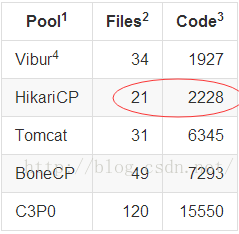

# spring5第四天

# 学习目标

- [ ] 能够使用spring的jdbc的模板
- [ ] 能够配置spring的连接池
- [ ] 能够使用jdbc模板完成增删改查的操作
- [ ] 能够应用声明式事务
- [ ] 能够理解事务的传播行为

# 第一章-Spring中的JdbcTemplate 

## 知识点-JdbcTemplate基本使用

### 1.目标

- [ ] 能够使用JdbcTemplate

### 2.路径

1. JdbcTemplate介绍
2. JdbcTemplate入门
3. 使用JdbcTemplate完成CRUD

### 3.讲解

#### 3.1JdbcTemplate介绍

​	Spring除了IOC 和 AOP之外，还对Dao层的提供了支持。 就算没有框架，也对原生的JDBC提供了支持。它是spring框架中提供的一个对象，是对原始Jdbc API对象的简单封装。spring框架为我们提供了很多的操作模板类。

|   持久化技术   |                   模版类                    |
| :-------: | :--------------------------------------: |
|   JDBC    | org.springframework.jdbc.core.JdbcTemplate |
| Hibrenate | org.springframework.orm.hibernate5.HibernateTemplate |
|  MyBatis  |  org.mybatis.spring.SqlSessionTemplate   |

#### 3.2JDBC模版入门案例

+ 创建Maven工程,导入坐标

```xml
  <dependencies>
    <!--Spring核心容器-->
    <dependency>
      <groupId>org.springframework</groupId>
      <artifactId>spring-context</artifactId>
      <version>5.0.2.RELEASE</version>
    </dependency>
    <!--SpringJdbc-->
    <dependency>
      <groupId>org.springframework</groupId>
      <artifactId>spring-jdbc</artifactId>
      <version>5.0.2.RELEASE</version>
    </dependency>
    <!--事务相关的-->
    <dependency>
      <groupId>org.springframework</groupId>
      <artifactId>spring-tx</artifactId>
      <version>5.0.2.RELEASE</version>
    </dependency>
    <dependency>
      <groupId>mysql</groupId>
      <artifactId>mysql-connector-java</artifactId>
      <version>5.1.6</version>
    </dependency>
    <!--Spring整合单元测试-->
    <dependency>
      <groupId>org.springframework</groupId>
      <artifactId>spring-test</artifactId>
      <version>5.0.2.RELEASE</version>
    </dependency>
    <!--单元测试-->
    <dependency>
      <groupId>junit</groupId>
      <artifactId>junit</artifactId>
      <version>4.12</version>
      <scope>test</scope>
    </dependency>
  </dependencies>
```

+ 表结构创建和JavaBean


```mysql
create table account(
    id int primary key auto_increment,
    name varchar(40),
    money double
)character set utf8 collate utf8_general_ci;

insert into account(name,money) values('zs',1000);
insert into account(name,money) values('ls',1000);
insert into account(name,money) values('ww',1000);
```

+ 实体

```java
public class Account implements Serializable{
    private Integer id;
    private String name;
    private Double money;
  ...
}
```

+ 使用JDBC模版API

```java
	//使用JDBC模版保存
	public void save(Account account) {
		//1. 创建数据源
		DriverManagerDataSource dataSource = new DriverManagerDataSource();
		dataSource.setDriverClassName("com.mysql.jdbc.Driver");
		dataSource.setUrl("jdbc:mysql://localhost:3306/spring_day03");
		dataSource.setUsername("root");
		dataSource.setPassword("123456");
		
		//2. 创建JDBC模版
		JdbcTemplate jdbcTemplate = new JdbcTemplate();
		jdbcTemplate.setDataSource(dataSource);
		
		//3.操作数据库
		String sql = "insert into account values(?,?,?)";
		jdbcTemplate.update(sql, null,account.getName(),account.getMoney())
		
	}	
```

#### 3.3.使用JDBC模版完成CRUD

1. 增加

   ```java
   String sql = "insert into account values(?,?,?)";
   jdbcTemplate.update(sql, null,account.getName(),account.getMoney());
   ```

2. 修改

   ```java
   String sql ="update account set name = ? where id = ?";
   Object[] objects = {user.getName(), user.getId()};
   jdbcTemplate.update(sql,objects);
   ```

3. 删除

   ```java
   String sql = "delete from account where id=?";
   jdbcTemplate.update(sql, 6);
   ```

4. 查询单个值

   ```java
   String sql = "select count(*) from t_user";
   Long n = jdbcTemplate.queryForObject(sql, Long.class);
   ```

   ```java
   String sql = "select name from t_user where id=?";
   String name = jdbcTemplate.queryForObject(sql, String.class, 4);
   System.out.println(name);
   ```

5. 查询单个对象

   ```java
   String sql = "select * from account where id = ?";
   User user = jdbcTemplate.queryForObject(sql,new BeanPropertyRowMapper<>(Account.class),id);
   ```

6. 查询集合

   ```
   String sql = "select * from account";
   List<Map<String, Object>> list = jdbcTemplate.queryForList(sql);
   System.out.println(list);
   ```

   ```java
   String sql = "select * from account";
   List<Account> list = List<User> list = jdbcTemplate.query(sql, new BeanPropertyRowMapper<>(Account.class));
   ```

### 4.小结

1. JDBCTemplate是Spring框架里面的一个工具,封装了JDBC
2. 使用步骤:
   + 创建连接池对象
   + 创建JDBCTemplate对象
   + 调用update(),query(),queryForObject()


## 知识点-在dao中使用JdbcTemplate

### 1.目标

- [ ] 能够使用spring的jdbc的模板

### 2.路径

1. 方式一在dao中定义JdbcTemplate
2. 方式二dao继承JdbcDaoSupport

### 3.讲解

#### 3.1方式一

​	这种方式我们采取在dao中定义JdbcTemplate

+ AccountDaoImpl.java


```java
public class AccountDaoImpl implements AccountDao {

	private JdbcTemplate jdbcTemplate;
	
	public void setJdbcTemplate(JdbcTemplate jdbcTemplate) {
		this.jdbcTemplate = jdbcTemplate;
	}

	@Override
	public Account findAccountById(Integer id) {
		List<Account> list =  jdbcTemplate.query("select * from account where id = ? ",new AccountRowMapper(),id);
		return list.isEmpty()?null:list.get(0);
	}

	@Override
	public Account findAccountByName(String name) {
		List<Account> list =  jdbcTemplate.query("select * from account where name = ? ",new AccountRowMapper(),name);
		if(list.isEmpty()){
			return null;
		}
		if(list.size()>1){
			throw new RuntimeException("结果集不唯一，不是只有一个账户对象");
		}
		return list.get(0);
	}

	@Override
	public void updateAccount(Account account) {
		jdbcTemplate.update("update account set money = ? where id = ? ",account.getMoney(),account.getId());
	}

}
```

+ applicationContext.xml

```xml
	<!-- 配置一个dao -->
	<bean id="accountDao" class="com.itheima.dao.impl.AccountDaoImpl">
		<!-- 注入jdbcTemplate -->
		<property name="jdbcTemplate" ref="jdbcTemplate"></property>
	</bean>
	
	<!-- 配置一个数据库的操作模板：JdbcTemplate -->
	<bean id="jdbcTemplate" class="org.springframework.jdbc.core.JdbcTemplate">
		<property name="dataSource" ref="dataSource"></property>
	</bean>
	
	<!-- 配置数据源 -->
	<bean id="dataSource" class="org.springframework.jdbc.datasource.DriverManagerDataSource">
		<property name="driverClassName" value="com.mysql.jdbc.Driver"></property>
		<property name="url" value="jdbc:mysql:///spring_day04"></property>
		<property name="username" value="root"></property>
		<property name="password" value="123456"></property>
	</bean>
```

#### 3.2方式二

​	这种方式我们采取让dao继承JdbcDaoSupport

+ AccountDaoImpl.java

```java
public class AccountDaoImpl extends JdbcDaoSupport implements AccountDao {

	@Override
	public Account findAccountById(Integer id) {
		//getJdbcTemplate()方法是从父类上继承下来的。
		List<Account> list = getJdbcTemplate().query("select * from account where id = ? ",new AccountRowMapper(),id);
		return list.isEmpty()?null:list.get(0);
	}

	@Override
	public Account findAccountByName(String name) {
		//getJdbcTemplate()方法是从父类上继承下来的。
		List<Account> list =  getJdbcTemplate().query("select * from account where name = ? ",new AccountRowMapper(),name);
		if(list.isEmpty()){
			return null;
		}
		if(list.size()>1){
			throw new RuntimeException("结果集不唯一，不是只有一个账户对象");
		}
		return list.get(0);
	}

	@Override
	public void updateAccount(Account account) {
		//getJdbcTemplate()方法是从父类上继承下来的。
		getJdbcTemplate().update("update account set money = ? where id = ? ",account.getMoney(),account.getId());
	}
}
```

+ applicationContext.xml

```xml
<?xml version="1.0" encoding="UTF-8"?>
<beans xmlns="http://www.springframework.org/schema/beans"
    	xmlns:xsi="http://www.w3.org/2001/XMLSchema-instance"
    	xsi:schemaLocation="http://www.springframework.org/schema/beans 
    	http://www.springframework.org/schema/beans/spring-beans.xsd">
	
<!-- 配置dao2 -->
<bean id="accountDao" class="com.itheima.dao.impl.AccountDaoImpl">
	<!-- 注入dataSource -->
	<property name="dataSource" ref="dataSource"></property>
</bean>
<!-- 配置数据源 -->
<bean id="dataSource" class="org.springframework.jdbc.datasource.DriverManagerDataSource">
	<property name="driverClassName" value="com.mysql.jdbc.Driver"></property>
	<property name="url" value="jdbc:mysql:///spring_day04"></property>
		<property name="username" value="root"></property>
		<property name="password" value="123456"></property>
	</bean>
</beans>
```

### 4.小结

1. 方式一: 自己注册JDBCTemplate, 自己在Dao注入JDBCTemplate

2. 方式二: 继承JdbcDaoSupport, 不需要自己注册JDBCTemplate, 也不需要自己注入JDBCTemplate

   ​	          需要注入DataSource


# 第二章-Spring配置第三方连接池

## 知识点-Spring配置第三方连接池

### 1.目标

- [ ] 能够配置spring的连接池

### 2.路径

1. Spring配置C3P0连接池
2. Spring配置Druid连接池  
3. Spring配置DBCP连接池【扩展】
4. Spring配置HikariCP连接池【扩展】

### 3.讲解

#### 3.1Spring配置C3P0连接池

官网:http://www.mchange.com/projects/c3p0/	

步骤:

1. 导入C3P0坐标
2. 修改applicationContext.xml里面DataSource的class属性值, 修改属性名

实现:

+ 导入坐标 


```xml
  <dependency>
    	<groupId>c3p0</groupId>
    	<artifactId>c3p0</artifactId>
    	<version>0.9.1.2</version>
  </dependency>
```

+ 配置数据源连接池

```
 <!-- 配置C3P0数据库连接池 -->
 <bean id="dataSource" class="com.mchange.v2.c3p0.ComboPooledDataSource">
	<property name="jdbcUrl" value="jdbc:mysql:///spring_jdbc" />
	<property name="driverClass" value="com.mysql.jdbc.Driver" />
	<property name="user" value="root" />
	<property name="password" value="123456" />
 </bean>
 <!-- 管理JDBC模版 -->
 <bean id="jdbcTemplete" class="org.springframework.jdbc.core.JdbcTemplate">
	<property name="dataSource" ref="dataSource" />
 </bean>
```

> 核心类：`com.mchange.v2.c3p0.ComboPooledDataSource

#### 3.2.Spring配置Druid连接池

官网:http://druid.io/

步骤:

1. 导入Druid坐标
2. 修改applicationContext.xml里面DataSource的class属性值, 修改属性名

实现:

- 导入坐标

  ```xml
  <dependency>
      <groupId>com.alibaba</groupId>
      <artifactId>druid</artifactId>
      <version>1.0.9</version>
  </dependency>
  ```

- 配置数据源连接池


```xml
    <!--注册dataSource -->
    <bean id="dataSource" class="org.apache.commons.dbcp.BasicDataSource">
        <property name="driverClassName" value="com.mysql.jdbc.Driver"></property>
        <property name="url" value="jdbc:mysql://localhost:3306/spring_day03"></property>
        <property name="username" value="root"></property>
        <property name="password" value="123456"></property>
    </bean>

    <bean id="jdbcTemplate" class="org.springframework.jdbc.core.JdbcTemplate">
        <constructor-arg name="dataSource" ref="dataSource"></constructor-arg>
    </bean>
```

#### 3.3.Spring配置DBCP连接池【扩展】

​	官网:http://commons.apache.org/proper/commons-dbcp/download_dbcp.cgi

步骤:

1. 导入DBCP连接池坐标
2. 修改applicationContext.xml里面DataSource的class属性值, 修改属性名


+ 导入坐标

  ```xml
  <dependency>
    	<groupId>commons-dbcp</groupId>
    	<artifactId>commons-dbcp</artifactId>
    	<version>1.4</version>
  </dependency>
  ```

+ 配置连接池

  ```xml
   <!-- 配置DBCP数据库连接池 -->
  <bean id="dataSource" class="org.apache.commons.dbcp.BasicDataSource">
  <property name="url" value="jdbc:mysql:///spring_jdbc" />
  <property name="driverClassName" value="com.mysql.jdbc.Driver" />
  <property name="username" value="root" />
  <property name="password" value="123456" />
  </bean>
   <!-- 管理JDBC模版 -->
  <bean id="jdbcTemplete" class="org.springframework.jdbc.core.JdbcTemplate">
  <property name="dataSource" ref="dataSource" />
  </bean>
  ```

  >  核心类：`org.apache.commons.dbcp.BasicDataSource`


#### 3.4.Spring配置HikariCP连接池【扩展】	

官网:https://github.com/brettwooldridge/HikariCP

步骤:

1. 添加HikariCP坐标
2. 修改applicationContext.xml里面DataSource的class属性值, 修改属性名

实现: 

+ 导入HikariCP坐标

  ```xml
  <dependency>
     <groupId>com.zaxxer</groupId>
     <artifactId>HikariCP</artifactId>
     <version>3.1.0</version>
  </dependency>
  ```

+ 配置数据源连接池

  ```xml
   <!-- 配置HikariCP数据库连接池 -->
  <bean id="dataSource" class="com.zaxxer.hikari.HikariDataSource">
  	<property name="jdbcUrl" value="jdbc:mysql:///spring_jdbc" />
  	<property name="driverClassName" value="com.mysql.jdbc.Driver" />
  	<property name="username" value="root" />
  	<property name="password" value="123456" />
  </bean>
   <!-- 管理JDBC模版 -->
  <bean id="jdbcTemplete" class="org.springframework.jdbc.core.JdbcTemplate">
  <property name="dataSource" ref="dataSource" />
  </bean>
  ```

  >  核心类：`com.zaxxer.hikari.HikariDataSource`


+ 为什么HikariCP为什么越来越火?   
  + 效率高
  + 一直在维护  
  + ==SpringBoot2.0 现在已经把HikariCP作为默认的连接池了==


+ 为什么HikariCP被号称为性能最好的Java数据库连接池?  

  + 优化并精简字节码: HikariCP利用了一个第三方的Java字节码修改类库Javassist来生成委托实现动态代理

  + 优化代理和拦截器：减少代码，代码量越少。一般意味着运行效率越高、发生bug的可能性越低.

    

    

    

  + 自定义集合类型ConcurrentBag：ConcurrentBag的实现借鉴于C#中的同名类，是一个专门为连接池设计的lock-less集合，实现了比LinkedBlockingQueue、LinkedTransferQueue更好的并发性能。ConcurrentBag内部同时使用了ThreadLocal和CopyOnWriteArrayList来存储元素，其中CopyOnWriteArrayList是线程共享的。ConcurrentBag采用了queue-stealing的机制获取元素：首先尝试从ThreadLocal中获取属于当前线程的元素来避免锁竞争，如果没有可用元素则再次从共享的CopyOnWriteArrayList中获取。此外，ThreadLocal和CopyOnWriteArrayList在ConcurrentBag中都是成员变量，线程间不共享，避免了伪共享(false sharing)的发生。

  + 使用FastList替代ArrayList: FastList是一个List接口的精简实现，只实现了接口中必要的几个方法。JDK ArrayList每次调用get()方法时都会进行rangeCheck检查索引是否越界，FastList的实现中去除了这一检查，只要保证索引合法那么rangeCheck就成为了不必要的计算开销(当然开销极小)。

    
    
    

### 4.小结

1. 导入连接池坐标
2. 改DataSource的class属性值, 配置属性名


## 知识点-Spring引入Properties配置文件

### 1.目标

- [ ] 掌握Spring引入Properties配置文件

### 2.步骤

1. 定义jdbc.properties文件

2. 把jdbc.properties引入到applicationContext.xml

3. 根据key获得值, 赋值

   

### 3.实现

#### 3.1jdbc.properties

```properties
jdbc.driver=com.mysql.jdbc.Driver
jdbc.url=jdbc:mysql://localhost:3306/spring_day03
jdbc.username=root
jdbc.password=123456
```

#### 3.2.在applicationContext.xml页面使用

* 引入配置文件方式一(不推荐使用)

```xml
 <!-- 引入properties配置文件：方式一 (繁琐不推荐使用) -->
<bean id="properties" class="org.springframework.beans.factory.config.PropertyPlaceholderConfigurer"> 
	<property name="location" value="classpath:jdbc.properties" />
</bean>
```

* 引入配置文件方式二【推荐使用】

```xml
 <!-- 引入properties配置文件：方式二 (简单推荐使用) -->
<context:property-placeholder location="classpath:jdbc.properties" />
```

* bean标签中引用配置文件内容
```xml
 <!-- hikariCP 连接池 -->
<bean id="dataSource" class="com.zaxxer.hikari.HikariDataSource">
	<property name="jdbcUrl" value="${jdbc.url}" />
	<property name="driverClassName" value="${jdbc.driver}" />
	<property name="username" value="${jdbc.username}" />
	<property name="password" value="${jdbc.password}" />
</bean>
```

> 注意:在使用`<context:property-placeholder/>`标签时，properties配置文件中的key一定要是带点分隔的。例如`jdbc.url`

### 4.小结

1. 定义jdbc.properties
2. spring的配置文件里面引入jdbc.properties
3. 根据key获得值


# 第三章-Spring管理事务   

## 知识点-Spring管理事务概述

### 1.目标

- [ ] 知道Spring管理事务相关的API

### 2.路径

1. 概述
2. 相关的API

### 3.讲解

#### 3.1概述

​	由于Spring对持久层的很多框架都有支持 ， Hibernate 、 jdbc 、JdbcTemplate , MyBatis 由于使用的框架不同，所以使用事务管理操作API 也不尽相同。 为了规范这些操作， Spring统一定义一个事务的规范 ，这其实是一个接口 。这个接口的名称 ： PlatformTrasactionManager.并且它对已经做好的框架都有支持.

​	如果dao层使用的是JDBC,  JdbcTemplate 或者mybatis,那么 可以使用DataSourceTransactionManager 来处理事务

​	如果dao层使用的是 Hibernate, 那么可以使用HibernateTransactionManager 来处理事务

#### 3.2相关的API

##### 3.2.1PlatformTransactionManager 

​	平台事务管理器是一个接口，实现类就是Spring真正管理事务的对象。

​	常用的实现类:

​		==DataSourceTransactionManager==    :JDBC开发的时候(JDBCTemplate,MyBatis)，使用事务管理。

​		HibernateTransactionManager       :Hibernate开发的时候，使用事务管理。

##### 3.2.2TransactionDefinition 

​	事务定义信息中定义了事务的隔离级别，传播行为，超时信息，只读。

##### 3.2.3 TransactionStatus:事务的状态信息

​	事务状态信息中定义事务是否是新事务，是否有保存点。

### 4.小结

1. Spring管理事务是通过事务管理器. 定义了一个接口PlatformTransactionManager 
   + ==DataSourceTransactionManager==              JDBC,MyBatis,JDBCTemplate
   + HibernateTransactionManager                 Hibernate


## 知识点-编程式(硬编码)事务【了解】 

### 1.目标

- [ ] 了解Spring编程式事务

### 2.步骤

1. 创建连接池对象

2. 创建JDBCTemplate对象

3. 创建事务管理器对象(需要连接池)

4. 创建事务模版对象

5. 使用事务模版对象进行事务控制

6. 在事务里面, 使用JDBCTemplate对象操作数据库

   

### 3.实现

+ 添加依赖

```xml
  <dependencies>
    <!--Spring核心容器-->
    <dependency>
      <groupId>org.springframework</groupId>
      <artifactId>spring-context</artifactId>
      <version>5.0.2.RELEASE</version>
    </dependency>
    <!--SpringJdbc-->
    <dependency>
      <groupId>org.springframework</groupId>
      <artifactId>spring-jdbc</artifactId>
      <version>5.0.2.RELEASE</version>
    </dependency>
    <!--事务相关的-->
    <dependency>
      <groupId>org.springframework</groupId>
      <artifactId>spring-tx</artifactId>
      <version>5.0.2.RELEASE</version>
    </dependency>
    <!--SpringAOP相关的坐标-->
    <dependency>
      <groupId>org.aspectj</groupId>
      <artifactId>aspectjweaver</artifactId>
      <version>1.8.7</version>
    </dependency>
  <!--数据库驱动-->
    <dependency>
      <groupId>mysql</groupId>
      <artifactId>mysql-connector-java</artifactId>
      <version>5.1.6</version>
    </dependency>
    <!--Spring整合单元测试-->
    <dependency>
      <groupId>org.springframework</groupId>
      <artifactId>spring-test</artifactId>
      <version>5.0.2.RELEASE</version>
    </dependency>
    <!--单元测试-->
    <dependency>
      <groupId>junit</groupId>
      <artifactId>junit</artifactId>
      <version>4.12</version>
      <scope>test</scope>
    </dependency>
	 <!--连接池-->
    <dependency>
      <groupId>com.zaxxer</groupId>
      <artifactId>HikariCP</artifactId>
      <version>3.1.0</version>
    </dependency>
  </dependencies>
```

+ 代码

```java
public class JDBCTempleTest {
	 @Test
	 public void fun01() throws PropertyVetoException{
			//1. 创建数据源
			 ComboPooledDataSource dataSource = new ComboPooledDataSource();
			 dataSource.setDriverClass("com.mysql.jdbc.Driver");
			 dataSource.setJdbcUrl("jdbc:mysql://localhost:3306/spring_day03");
			 dataSource.setUser("root");
			 dataSource.setPassword("123456");
			 //2. 创建jdbc模版
			 final JdbcTemplate jdbcTemplate = new JdbcTemplate();
			 jdbcTemplate.setDataSource(dataSource);
			 //3.创建事务管理器
			 DataSourceTransactionManager transactionManager = new DataSourceTransactionManager();
			 transactionManager.setDataSource(dataSource);
			 //4.创建事务模版
			 TransactionTemplate transactionTemplate = new TransactionTemplate();
			 transactionTemplate.setTransactionManager(transactionManager);
			 	//4. 进行事务操作
			 transactionTemplate.execute(new TransactionCallback<Object>() {
                @Override
                public Object doInTransaction(TransactionStatus status) {
                    //操作数据库
                    jdbcTemplate.update("update t_account set money = money - ? where name = ?  ", 	100.0,"zs");

                    int i = 1/0;

                    jdbcTemplate.update("update t_account set money = money + ? where name = ?  ", 100.0,"ls");
                    return null;
                }
            });
         }
}
```


### 4.小结

1. 我们项目开发 一般不会使用编程式(硬编码)方式. 一般使用声明式(配置)事务
   + xml方式
   + 注解方式


## 知识点-Spring声明式事务-xml配置方式【重点】

​	声明式的事务管理的思想就是AOP的思想。面向切面的方式完成事务的管理。声明式事务有两种,==xml配置方式和注解方式.==

### 1.目标

- [ ] 使用xml方式配置事务

### 2.步骤  

1. 注册事务管理器(通过构造方法方式注入DataSource)
2. 配置事务建议(规则: 事务的隔离级别, 事务传播行为...)
3. 配置AOP
   + 配置切入点
   + 配置切面


### 3.讲解

#### 3.1实现

+ 配置事务管理器

  ```xml
  <bean id="transactionManager" 		class="org.springframework.jdbc.datasource.DataSourceTransactionManager">
  		<property name="dataSource" ref="dataSource"></property>
  </bean>
  ```

+ 配置事务建议(事务的规则)

  ```xml
  <tx:advice id="adviceId" transaction-manager="transactionManager">
    <!--在tx:advice标签内部 配置事务的属性 -->
    <tx:attributes>
    <!-- 指定方法名称：是业务核心方法 
        read-only：是否是只读事务。默认false，不只读。
        isolation：指定事务的隔离级别。默认值是使用数据库的默认隔离级别。 
        propagation：指定事务的传播行为。
        timeout：指定超时时间。默认值为：-1。永不超时。
        rollback-for：用于指定一个异常，当执行产生该异常时，事务回滚。产生其他异常，事务不回滚。没有默认值，任何异常都回滚。
        no-rollback-for：用于指定一个异常，当产生该异常时，事务不回滚，产生其他异常时，事务回滚。没有默认值，任何异常都回滚。
        -->
        <tx:method name="*" read-only="false" propagation="REQUIRED"/>
        <tx:method name="find*" read-only="true" propagation="SUPPORTS"/>
    </tx:attributes>
  </tx:advice>
  ```

+ 配置事务的AOP

  ```xml
  <aop:config>
  	<!-- 定义切入点 ，也就是到底给那些类中的那些方法加入事务的管理 -->
  	<aop:pointcut expression="execution(* com.itheima.service.impl.*.*(..))" id="pointCat"/>
  	<!-- 让切入点和事务的建议绑定到一起 -->
  	<aop:advisor advice-ref="txAdvice" pointcut-ref="pointCat"/>
  </aop:config>
  ```


#### 3.2事务的传播行为

##### 3.2.1事务的传播行为的作用

​	我们一般都是将事务设置在Service层,那么当我们调用Service层的一个方法的时候, 它能够保证我们的这个方法中,执行的所有的对数据库的更新操作保持在一个事务中， 在事务层里面调用的这些方法要么全部成功，要么全部失败。

​	如果你的Service层的这个方法中，除了调用了Dao层的方法之外， 还调用了本类的其他的Service方法，那么在调用其他的Service方法的时候， 我必须保证两个service处在同一个事务中，确保事物的一致性。

​	 事务的传播特性就是解决这个问题的。

##### 3.2.2 事务的传播行为的取值

保证在同一个事务里面:

- **PROPAGATION_REQUIRED:默认值，也是最常用的场景.**

  如果当前没有事务，就新建一个事务，
  如果已经存在一个事务中，加入到这个事务中。

- PROPAGATION_SUPPORTS：

  如果当前没有事务，就以非事务方式执行。

  如果已经存在一个事务中，加入到这个事务中。

- PROPAGATION_MANDATORY

  如果当前没有有事务，就抛出异常; 

  如果已经存在一个事务中，加入到这个事务中。

保证不在同一个事物里:

- **PROPAGATION_REQUIRES_NEW**

  如果当前有事务，把当前事务挂起,创建新的事务但独自执行

- PROPAGATION_NOT_SUPPORTED

  如果当前存在事务，就把当前事务挂起。不创建事务

- PROPAGATION_NEVER

  如果当前存在事务，抛出异常

### 4.小结

- 优点
  - 统一配置,只配置一次, 全局使用维护方便
- 缺点
  - 相对注解麻烦一点

## 知识点-spring声明式事务-注解方式【重点】 

### 1.目标

- [ ] 使用注解方式配置事务

### 2.步骤

1. 注册事务管理器
2. 开启事务注解
3. 在业务类上面添加@Transactional注解

### 3.实现

+ 在applicationContext里面打开注解驱动

  ```xml
  <!--一,配置事务管理器  -->
  	<bean id="transactionManager" class="org.springframework.jdbc.datasource.DataSourceTransactionManager">
  		<property name="dataSource" ref="dataSource"></property>
  	</bean>
  	
  <!--二配置事务注解  -->
  <tx:annotation-driven transaction-manager="transactionManager"/>
  ```

+ 在业务逻辑类上面使用注解

  @Transactional ： 如果在类上声明，那么标记着该类中的所有方法都使用事务管理。也可以作用于方法上，	那么这就表示只有具体的方法才会使用事务。

### 4.小结

+ 优点
  + 配置简洁
+ 缺点
  + 每一个业务类(方法)里面都需要配置, 维护麻烦

## 扩展_xml方式事务源码

1. 找入口


