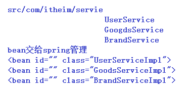
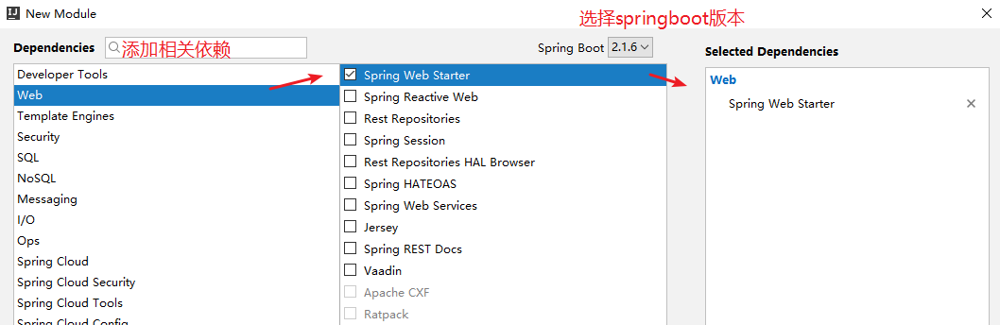
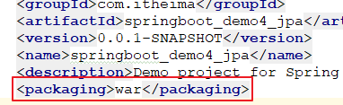

# SpringBoot

姓名：阮文

籍贯：安徽.安庆

读书：江西.南昌大学（软件学院）

学习方式：

ssm + dubbo：

- 写配置文件
- 添加依赖
- 直接写代码：业务

学习目标

1、SpringBoot简介

2、SpringBoot快速入门【掌握】

3、SpringBoot原理分析【了解】

4、SpringBoot配置文件使用    application.properties/yml/yaml

5、SpringBoot与其他框架集成【掌握】

6、SpringBoot单元测试【会使用】

7、SpringBoot程序打包【会使用】

# 1 SpringBoot简介

java的开发你经历的这些阶段：

- 第一阶段：不难， api调用 --->  每个动作需要自己完成    （面向过程     jdbc）  原生态
- 第二阶段：框架   ssm    mybatis：对jdbc的封装   让步骤变简单了
  - 半成品
  - 配置文件
- 现阶段：自动化开发

## 1.1 java的开发方式

- 农耕时代java开发：

  - 基于java底层原生api，纯手工去实现，典型的栗子：servlet、jdbc、javascript、socket...

  - 针对这样低效开发方式，那么需要改革。框架就是拯救者，解放了农耕时代的程序猿，框架可以帮助我们做更多，程序猿主要负责业务的实现。

    

    

- 工业时代java开发：

  - 各种框架一顿搞：典型的栗子SSH、SSM、Vue、jquery、Netty...

  - 在工业时代使用框架虽然简化了我们的开发的代码，但是各种配置文件各种jar又一顿搞。微服务又成了拯救者，解放了工业时代的程序猿。让我们过上了小康生活。      配置文件、依赖的jar

    

    

- 现代化java开发：   只需要关注业务本身实现上。

  - 各种微服务齐活：服务注册与发现、负载均衡与熔断、网关等

  - 各种组件一起上：springboot、springcloud...

    

## 1.2 SpringBoot简介

spring开发的阶段：

第一阶段 spring1.x：满眼都是xml文件     06-07年    spring取代了EJB

第二阶段：spring2.x    出现了注解    @Controller、@Service、@Repository。。。

通过spring开发（spring集成了很多的优秀的第三方的框架）

1、编写很多的配置文件；

2、添加相关的依赖的jar包；（别人提前写好的）

- 依赖冲突（版本不兼容）  --->   出现了再解决（坑）
- 开发当中：环境出现问题   >   代码出现问题

3、集成了第三方框架：需要整合（整合的配置文件、整合的jar  mybatis-spring.jar）

耗时耗力：springboot出现，之前成为历史。

springboot的开发：

### 1.2.1 spring开发经历的阶段

Spring 诞生时是 Java 企业版（Java Enterprise Edition，JEE，也称 J2EE）的轻量级代替品。无需开发重量级的 Enterprise JavaBean（EJB），Spring 为企业级Java 开发提供了一种相对简单的方法，通过依赖注入和面向切面编程，用简单的Java 对象（Plain Old Java Object，POJO）实现了 EJB 的功能。虽然 Spring 的组件代码是轻量级的，但它的配置却是重量级的。 

- 第一阶段：xml配置：在Spring 1.x时代，使用Spring开发满眼都是xml配置的Bean，随着项目的扩大，我们需要把xml配置文件放到不同的配置文件里，那时需要频繁的在开发的类和配置文件之间进行切换 
- 第二阶段：注解配置：在Spring 2.x 时代，随着JDK1.5带来的注解支持，Spring提供了声明Bean的注解（例如@Component、@Service），大大减少了配置量。
- 第三阶段：java配置管理 ：Annotation的出现是为了简化Spring的XML配置文件，但Annotation不如XML强大，所以无法完全取代XMl文件 。例如：@Configuration、@Import等。

所有这些配置都代表了开发时的损耗。 因为在思考 Spring 特性配置和解决业务问题之间需要进行思维切换，**所以写配置挤占了写应用程序逻辑的时间**。除此之外，**项目的依赖管理也是件吃力不讨好的事情**。决定项目里要用哪些库就已经够让人头痛的了，你还要知道这些库的哪个版本和其他库不会有冲突，这难题实在太棘手。并且，依赖管理也是一种损耗，添加依赖不是写应用程序代码。一旦选错了依赖的版本，随之而来的不兼容问题毫无疑问会是生产力杀手。 

**Spring Boot 让这一切成为了过去。**

- **起步依赖**：本质是Maven项目对象模型中的标签。它定义其SpringBoot对他库的传递依赖，依赖加在一起即可支持某项功能。最厉害的就是这个，使得SpringBoot具备了构建一切的能力：整合所有牛×框架
- **自动配置**：基于约定优于配置思想，配置基本都可以走默认值。配置基本都是SpringBoot自动完成

### 1.2.2 springboot简介

Spring Boot 是由 Pivotal 团队提供的全新框架，其设计目的是用来简化新 Spring 应用的初始搭建以及开发过程。该框架使用了特定的方式来进行配置，从而使开发人员不再需要定义样板化的配置。

Spring Boot 简化了基于Spring的应用开发，只需要**“run”**就能创建一个独立的、生产级别的Spring应用。Spring Boot为Spring平台及第三方库提供开箱即用的设置（提供默认设置），这样我们就可以简单的开始。多数Spring Boot应用只需要**很少**（额外）的Spring配置。我们可以使用SpringBoot创建java应用，并使用java –jar 启动它，或者采用传统的war部署方式。

我的理解，就是 Spring Boot 其实不是什么新的框架，它默认配置了很多框架的使用方式，就像 Maven 整合了所有的 Jar 包，Spring Boot 整合了所有的框架。SpringBoot不是对Spring功能的增强，而是提供一种快速使用Spring的开发方式（全新的开发方式）。

# 2 SpringBoot快速入门

需求：将字符串转成json对象并且在浏览器显示出来。

之前开发：步骤

1、创建工程，添加依赖（spring-webmvc、spring-web【集成web组件】、spring-context、默认集成：Jackson）

2、编写springmvc配置文件：springmvc三大（9大）组件    一个中心，三个基本点

- 扫描器
- <mvc:annotation-driven />：默认加载的Jackson    处理器映射器（HandlerMapping）、适配器（HandlerAdapter）  接口。  
- 配置视图解析器：InternalResourceViewResolver（prefix  suffix    属性注入）

3、编写web.xml文件：配置前端控制器、配置请求url

4、编写Controller      @Controller   @ResponseBody @RequestMapping

现在：一切从简。

## 2.1 需求

完成：开发一个web应用并完成字符串“hello boot”在浏览器显示。

## 2.2 springmvc实现

实现步骤：

- 创建maven工程
- 导入相关依赖的jar包（例如：spring-web、spring-webmvc等）
- 编写springmvc核心配置文件
- 编写web.xml文件
- 编写XxxController

## 2.3 SpringBoot实现

### 2.3.1 方式一

#### 2.3.1.1 创建maven工程

创建一个maven工程（建议：java工程，也可以是web工程），无需勾选maven骨架。

1、添加起步依赖（依赖一个父工程）

2、添加web依赖

~~~xml
<!--添加起步依赖-->
    <parent>
        <groupId>org.springframework.boot</groupId>
        <artifactId>spring-boot-starter-parent</artifactId>
        <version>2.1.6.RELEASE</version>
    </parent>

    <!--添加web依赖-->
    <dependencies>
        <dependency>
            <groupId>org.springframework.boot</groupId>
            <artifactId>spring-boot-starter-web</artifactId>
        </dependency>
    </dependencies>
~~~

#### 2.3.1.2 工程jar依赖情况

#### 2.3.1.3 编写引导程序

该程序是发布springboot应用的入口（只需要run一下）

~~~java
@SpringBootApplication
public class DemoApplication {

    public static void main(String[] args) {
        // 只需要run一下，就能发布一个springboot应用
        // 相当于之前将web工程发布到tomcat服务器，只是在springboot中集成了tomcat插件
        SpringApplication.run(DemoApplication.class, args);
    }
}
~~~

#### 2.3.1.4 编写HelloController

在工程的src目录下创建HelloController。

~~~java
@RestController
public class HelloController {
    
    @RequestMapping("/hello")
    public String hello(){
        System.out.println("执行了。。。");
        return "hello boot!";
    }
}
~~~

#### 2.3.1.5 测试

访问：http://localhost:8080/hello

### 2.3.2 方式二（建议）

#### 2.3.2.1 创建spring initializr工程

通过idea工具创建工程时，不再选择maven了而是选择spring initializr。然后去勾选相关依赖。

- step1：新建module，选择spring initializr，然后下一步

  

- step2：填写项目相关信息

  

- step3：勾选需要的依赖

  

- step4：完成，工程的目录结构如下

  

#### 2.3.2.2 编写HelloController

在工程的src目录下创建HelloController

~~~java
@RestController
public class HelloController {
    
    @RequestMapping("/hello2")
    public String hello2(){
        System.out.println("执行了。。。2");
        return "hello2 boot!";
    }
}
~~~

#### 2.3.2.4 测试

访问：http://locahost:8080/hello2

# 3 SpringBoot原理分析

## 3.1 spring-boot-starter-parent

**起步依赖**：从上面的spring-boot-dependencies的pom.xml中可以看出，坐标的版本，依赖管理，插件管理已经预先定义好了。SpringBoot工程继承Spring-boot-starter-parent后，已经锁定了版本等配置。起步依赖的作用是进行依赖传递 。用啥取啥，随用随取即可。我们开发中彻底不用关心：jar包的版本、依赖等问题了，大大降低版本冲突，版本过期，更新一个jar一下就需要升级一个tree的jar包。

相当于我们之前学习的过程中创建的父工程，在之前创建的父工程中，其中一个功能是用来统一管理jar包。这里的父工程其实作用是一样的。

## 3.2 @SpringBootApplication

该注解是一个组合注解，包括如下注解

- @SpringBootConfiguration：与之前@Configuration注解一样，声明为一个配置类
- @ComponentScan：spring IoC容器的扫描包，默认扫描引导程序下的包以及子包，如果我们写的程序不在该包范围内，可以通过该注解指定。
- @EnableAutoConfiguration：springboot实现自动化配置的核心注解。

自动装配：最好不配置，默认的配置都给配好了。

# 4 SpringBoot配置文件使用

我们知道SpringBoot是基于约定的，所以很多配置都有默认值。如果想修改默认配置，可以使用application.properties或application.yml(application.yaml)自定义配置。SpringBoot默认从Resource目录加载自定义配置文件。application.properties是键值对类型(一直在用，而且默认生成)。application.yml是SpringBoot中一种新的配置文件方式。

## 4.1 application.properties

### 4.1.1 语法

- 格式：key=value

- 如果是修改SpringBoot中的默认配置，那么key则不能任意编写，必须参考SpringBoot官方文档。

- application.properties官方文档：

  <https://docs.spring.io/spring-boot/docs/current/reference/htmlsingle/> 

### 4.1.2 案例

~~~properties
#tomcat port
server.port=8081
#app context
server.servlet.context-path=/demo
~~~

## 4.2 application.yml

### 4.2.1 语法

- 普通数据：

  ~~~yaml
  说明：
  key: value（注意：冒号有一个空格）
  
  示例：
  name: tom
  ~~~

- 对象数据或map

  ~~~yaml
  说明：
  key:
  	key1: value1
  	key2: value2
  
  示例：
  user:
  	name: tom
  	age: 23
  	addr: beijing
  ~~~

- 集合数据1：存储简单类型

  ~~~yaml
  说明：
  key:
  	- value1
  	- value2
  或：
  key: [value1,value2]
  
  示例：
  city:
  	- beijing
  	- anhui
  	- jiangxi
  	- shenzhen
  或：
  city: [beijing,anhui,jiangxi,shenzhen]
  ~~~

- 集合数据2：存储对象类型

  ~~~yaml
  说明：
  key:
  	- key1: vlaue1
  		key2: value2
  	
  示例：
  student:
  	- name: zhangsan
  		age: 23
  		addr: BJ
  	- name: lisi
  		age: 25
  		addr: SZ
  	
  ~~~

### 4.2.2 案例

application.yaml文件：

~~~yaml
#tomcat port&app context
server:
  port: 8082
  servlet:
    context-path: /demo
~~~

## 4.3 热部署

- 每次修改程序：需要手动重启
- 配置热部署插件：
  - 添加依赖
  - 修改idea的配置项
- 开发中：不用的（不靠谱---有的时候不生效）

### 4.3.1 配置pom

针对每次修改代码都需要重新发布程序，在springboot中提供了热部署插件。只需要在pom文件中添加热部署依赖即可，如下所示

~~~xml
<!--热部署-->
<dependency>
    <groupId>org.springframework.boot</groupId>
    <artifactId>spring-boot-devtools</artifactId>
</dependency>
~~~

### 4.3.2 开启自动构建工程

1、在idea的settings中勾选自动构建工程选项即可。如图所示：

2、Shift + Ctrl + Alt + /：选择registry，弹出框选择 compiler.automake.allow.when.app.running 勾选上即可。

# 5 SpringBoot与其他框架集成

## 5.1 集成mybatis

### 5.1.1 需求

查询所有用户列表。（建库、建表：略）

~~~sql
-- ----------------------------
-- Table structure for `user`
-- ----------------------------
DROP TABLE IF EXISTS `user`;
CREATE TABLE `user` (
`id` int(11) NOT NULL AUTO_INCREMENT,
`username` varchar(50) DEFAULT NULL,
`password` varchar(50) DEFAULT NULL,
`address` varchar(50) DEFAULT NULL,
PRIMARY KEY (`id`)
) ENGINE=InnoDB AUTO_INCREMENT=10 DEFAULT CHARSET=utf8;
-- ----------------------------
-- Records of user
-- ----------------------------
INSERT INTO `user` VALUES ('1', 'zhangsan', '123', '北京');
INSERT INTO `user` VALUES ('2', 'lisi', '123', '上海');
~~~

### 5.1.2 创建工程

通过spring initializr创建maven工程，并且勾选相关依赖（web、数据库驱动、mybatis）。

~~~xml
<dependency>
			<groupId>org.springframework.boot</groupId>
			<artifactId>spring-boot-starter-web</artifactId>
		</dependency>
		<dependency>
			<groupId>org.mybatis.spring.boot</groupId>
			<artifactId>mybatis-spring-boot-starter</artifactId>
			<version>2.0.1</version>
		</dependency>

		<dependency>
			<groupId>org.springframework.boot</groupId>
			<artifactId>spring-boot-devtools</artifactId>
			<scope>runtime</scope>
			<optional>true</optional>
		</dependency>
		<dependency>
			<groupId>mysql</groupId>
			<artifactId>mysql-connector-java</artifactId>
			<scope>runtime</scope>
		</dependency>
		<dependency>
			<groupId>org.springframework.boot</groupId>
			<artifactId>spring-boot-starter-test</artifactId>
			<scope>test</scope>
		</dependency>
~~~

### 5.1.3 编写pojo

在工程的src目录下创建User对象：

~~~java
public class User implements Serializable{

    private Integer id;
    private String username;
    private String password;
    private String address;
    // TODO getters、setters
}
~~~

### 5.1.4 编写mapper接口以及映射文件

1、编写mapper接口：在src目录下创建UserMapper

- 在接口中添加**@Mapper**注解（标记该类是一个Mapper接口，可以被SpringBoot自动扫描）

~~~java
@Repository
@Mapper
public interface UserMapper {

    List<User> findAll();
}
~~~

2、编写映射文件：在工程的resources/mapper目录下创建UserMapper.xml

~~~xml
<mapper namespace="com.itheima.mapper.UserMapper">

    <select id="findAll" resultType="user">
        SELECT * FROM user
    </select>
    
</mapper>
~~~

### 5.1.5 编写service接口以及实现类

1、service接口：

~~~java
public interface UserService {

    List<User> findAll();
}
~~~

2、service实现类：

~~~java
@Service
public class UserServiceImpl implements UserService {

    @Autowired
    private UserMapper userMapper;

    @Override
    public List<User> findAll() {
        return userMapper.findAll();
    }
}
~~~

### 5.1.6 编写controller

在工程的src目录下创建UserController：

~~~java
@RestController
@RequestMapping("/user")
public class UserController {

    @Autowired
    private UserService userService;

    @RequestMapping("/findAll")
    public List<User> findAll(){
        return userService.findAll();
    }
}
~~~

### 5.1.7 配置application.properties

~~~properties
#连接数据库
spring.datasource.driver-class-name=com.mysql.cj.jdbc.Driver
spring.datasource.url=jdbc:mysql://localhost/springboot?useUnicode=true&characterEncoding=UTF-8&serverTimezone=UTC
spring.datasource.username=root
spring.datasource.password=root
#mybatis别名
mybatis.type-aliases-package=com.itheima.pojo
#加载映射文件
mybatis.mapper-locations=classpath:mapper/*.xml
#设置日志，com.itheima.mapper：只查看该包下程序的日志
logging.level.com.itheima.mapper=debug

~~~

### 5.1.8 发布程序并访问

小工具：可以直接通过idea中集成的REST client插件发送请求。

## 5.2 集成Spring Data Redis

Spring Data:  Spring 的一个子项目。用于简化数据库访问，支持**NoSQL**和**关系数据库存储**。其主要目标是使数据库的访问变得方便快捷。 

### 5.2.1 添加Redis启动器

这里我们就不在单独创建工程了，就直接在【5.1】章节中添加Redis启动器。

~~~xml
<!--redis-->
<dependency>
    <groupId>org.springframework.boot</groupId>
    <artifactId>spring-boot-starter-data-redis</artifactId>
</dependency>
~~~

### 5.2.2 配置application

在application.properties文件中配置连接Redis的信息：

~~~properties
#redis，端口可以不填，默认就是6379
spring.redis.host=192.168.200.128
spring.redis.port=6379
~~~

### 5.2.3 更新程序

更新UserServiceImpl类中的findAll方法。在该类中注入RedisTemplate对象。

~~~java
@Service
public class UserServiceImpl implements UserService {

    @Autowired
    private UserMapper userMapper;

    @Autowired
    private RedisTemplate redisTemplate;

    @Override
    public List<User> findAll() {
        // 首先判断缓存中是否有数据
        List<User> users = (List<User>) redisTemplate.boundValueOps("heima:springboot:user:id:1").get();
        if(users == null){
            // 从数据库中查询
            users = userMapper.findAll();
            // 放入缓存
            redisTemplate.boundValueOps("heima:springboot:user:id:1").set(users);
        }
        return users;
    }
}
~~~

### 5.2.4 测试

略。

## 5.3 集成Spring Data JPA

### 5.2.1 需求

完成对user表的CRUD操作。

### 5.2.2 创建工程

创建工程，并且勾选相关依赖（Spring Data JPA）。

~~~xml
<dependencies>
		<dependency>
			<groupId>org.springframework.boot</groupId>
			<artifactId>spring-boot-starter-data-jpa</artifactId>
		</dependency>
		<dependency>
			<groupId>org.springframework.boot</groupId>
			<artifactId>spring-boot-starter-web</artifactId>
		</dependency>

		<dependency>
			<groupId>mysql</groupId>
			<artifactId>mysql-connector-java</artifactId>
			<scope>runtime</scope>
		</dependency>
		<dependency>
			<groupId>org.springframework.boot</groupId>
			<artifactId>spring-boot-starter-test</artifactId>
			<scope>test</scope>
		</dependency>
	</dependencies>
~~~

### 5.2.3 编写pojo

在工程的src目录下创建User对象（会自动创建表）。

~~~java
@Entity
@Table(name = "user")
public class User {

    @Id
    @GeneratedValue(strategy = GenerationType.IDENTITY)
    private Integer id;
    @Column(name = "username")
    private String username;
    private String password;
    private String address;
    // TODO getters/setters
}

PS：注解说明
@Entity：表明为一个实体对象
@Table：指定映射的表
@Id：指定为主键
@GeneratedValue：指定注解的生成策略
    TABLE：使用一个特定的数据库表格来保存主键。 
    SEQUENCE：根据底层数据库的序列来生成主键，条件是数据库支持序列。 
    IDENTITY：主键由数据库自动生成（主要是自动增长型） 
    AUTO：主键由程序控制
@Column：指定表的列明
~~~

### 5.2.4 编写dao接口

在工程src目录下创建dao接口，需要继承JpaRepository对象（该对象完成对数据库的CRUD过程，并且支持分页查询、排序等功能）。

~~~java
public interface UserDao extends JpaRepository<User, Integer> {
	
}
~~~

### 5.2.5 编写service接口以及实现类

1、编写service接口：

~~~java
public interface UserService {

    List<User> findUsers();

    User findUserById(Integer id);

    void saveUser(User user);

    void updateUser(User user);

    void deleteUserById(Integer id);
}
~~~

2、编写service实现类：

~~~java
@Service
public class UserServiceImpl implements UserService {

    @Autowired
    private UserDao userDao;

    @Override
    public List<User> findUsers() {
        List<User> users = userDao.findAll();
        return users;
    }

    @Override
    public User findUserById(Integer id) {
        Optional<User> optionalUser = userDao.findById(id);
        User user = optionalUser.get();
        return user;
    }

    @Override
    public void saveUser(User user) {
        userDao.save(user);
    }

    @Override
    public void updateUser(User user) {
        // 并没有update方法，如果id存在则执行更新操作
        userDao.save(user);
    }

    @Override
    public void deleteUserById(Integer id) {
        userDao.deleteById(id);
    }
}
~~~

### 5.2.6 编写controller

在工程的src目录下创建UserController。

~~~java
@RestController
@RequestMapping("/user")
public class UserController {

    @Autowired
    private UserService userService;

    @RequestMapping("/findUsers")
    public List<User> findUsers(){
        return userService.findUsers();
    }

    @RequestMapping("/findUserById/{id}")
    public User findUserById(@PathVariable Integer id){
        return userService.findUserById(id);
    }

    @RequestMapping("/saveUser")
    public void saveUser(User user){
        userService.saveUser(user);
    }

    @RequestMapping("/updateUser")
    public void updateUser(User user){
        userService.updateUser(user);
    }

    @RequestMapping("/deleteUserById/{id}")
    public void deleteUserById(@PathVariable Integer id){
        userService.deleteUserById(id);
    }
}
~~~

### 5.2.7 配置application

在application.properties中配置相关JPA内容。

~~~properties
#连接数据库
spring.datasource.driver-class-name=com.mysql.cj.jdbc.Driver
spring.datasource.url=jdbc:mysql://localhost/springboot?useUnicode=true&characterEncoding=UTF-8&serverTimezone=UTC
spring.datasource.username=root
spring.datasource.password=root
#jpa 相关配置
spring.jpa.database=mysql
spring.jpa.show-sql=true
spring.jpa.hibernate.ddl-auto=update
spring.jpa.generate-ddl=true

#hibernate.ddl-auto，建表策略：
#update：每次运行程序，没有表会新建表，表内有数据不会清空，只会更新
#create：每次运行程序，没有表会新建表，表内有数据会清空
#create-drop：每次程序结束的时候会清空表
#validate：运行程序会校验数据与数据库的字段类型是否相同，不同会报错

~~~

<http://tool.oschina.net/> 

### 5.2.8 测试

测试：略。可以直接通过idea中集成的REST client插件发送请求。添加条件可以在此处添加：

## 5.4 集成定时器

1、在SpringBoot引导程序中添加开启定时任务注解：@EnableScheduling

2、编写定时任务程序

~~~java
@Component
public class TimeProgarm {

    /**
     * 掌握：cron表达式是一个字符串，字符串以5或6个空格隔开，分开共6或7个域，每一个域代表一个含义
     *  [秒] [分] [小时] [日] [月] [周] [年]
     *  [年]不是必须的域，可以省略[年]，则一共6个域
     *
     * 了解：
     *  fixedDelay：上一次执行完毕时间点之后多长时间再执行（单位：毫秒）
     *  fixedDelayString：同等，唯一不同的是支持占位符，在配置文件中必须有time.fixedDelay=5000
     *  fixedRate：上一次开始执行时间点之后多长时间再执行
     *  fixedRateString：同等，唯一不同的是支持占位符
     *  initialDelay：第一次延迟多长时间后再执行
     *  initialDelayString：同等，唯一不同的是支持占位符
     */
//    @Scheduled(fixedDelay = 5000)
//    @Scheduled(fixedDelayString = "5000")
//    @Scheduled(fixedDelayString = "${time.fixedDelay}")
//    @Scheduled(fixedRate = 5000)
//    // 第一次延迟1秒后执行，之后按fixedRate的规则每5秒执行一次
//    @Scheduled(initialDelay=1000, fixedRate=5000)
    @Scheduled(cron = "30 45 15 08 07 *")
    public void myTask(){
        System.out.println("程序执行了");
    }
}
~~~

备注：可以通过资料中提供的cron表达式工具去生成。

# 6 SpringBoot单元测试

~~~java
@RunWith(SpringRunner.class)
@SpringBootTest
public class SpringbootDemo4JpaApplicationTests {

	@Test
	public void contextLoads() {
		
	}

}
~~~

# 7 SpringBoot程序打包

## 7.1 打jar包

- 第一步：在项目的pom文件中指定项目的打包类型（可以不指定，默认就是jar）

  

- 第二步：将工程打成jar包

  - 方式一：直接在idea中执行如下操作

  

  - 方式二：通过命令执行

    ~~~shell
    1、通过cmd进入到工程的目录中，与pom.xml同级
    2、然后执行命令：mvn clean package [-Dmaven.test.skip=true] --->[]内为可选操作，排除测试代码，也就是说打包时跳过测试代码
    ~~~

    

- 运行程序：

  ~~~shell
  执行如下命令：
  java -jar springboot_demo4_jpa-0.0.1-SNAPSHOT.jar
  
  -Xmx：最大堆内存
  -Xms：初始堆内存
  java -Xmx80m -Xms20m -jar springboot_demo4_jpa-0.0.1-SNAPSHOT.jar
  ~~~

  

## 7.2 打war包

- 第一步：在项目的pom文件中指定项目的打包类型（war）

  

- 第二步：创建ServletInitializer，需要继承SpringBootServletInitializer类。（该类相当于之前web工程的web.xml文件）

  

- 第三步：将xxx.war工程拷贝到tomcat发布运行：略。

