# SpringCloud（一）

反馈：学习表白


课程回顾：springboot（构建一切：与其他的优秀的框架进行整合）

- java开发的阶段：略
- 构建springboot program
  - 第一种：创建一个普通的maven工程
    - 添加起步依赖：spring-boot-starter-parent
    - 添加工程需要的依赖：web、mybatis...
  - 第二种：通过官方的模板构建
    - 启动器
    - 配置文件
    - 目录结构：static、templates
  - 配置文件：
    - application.properties
    - application.yml/yaml
  - 热部署：略
- springboot集成了其他的框架
  - 与mybatis的集成
  - 与redis集成：提供的对象RedisTemplate（Spring Data   XxxTemplate：对原生api的封装）
  - 与jpa集成：
    - dao接口：继承JpaRepository<T, ID.Type>
    - pojo的注解：完成表与pojo的映射关系（ORM）
  - 自带定时任务：corn（时间）表达式  排班表。
- 打包方式：
  - 建议：jar
  - 也可以：war


学习目标：应用。

1、项目架构的演变----SpringCloud介绍

2、使用RestTemplate发送请求（远程调用：       例如：微信  提供了地址）

- httpclient：复杂
- RestTemplate：对httpclient封装

3、搭建Eureka注册中心

4、使用Ribbon实现负载均衡（LB）：nginx（10w）、HaProxy（lvs）

5、使用Hystrix熔断器

# 1 SpringCloud介绍

## 1.1 项目架构演变过程

### 1.1.1 单一的应用架构

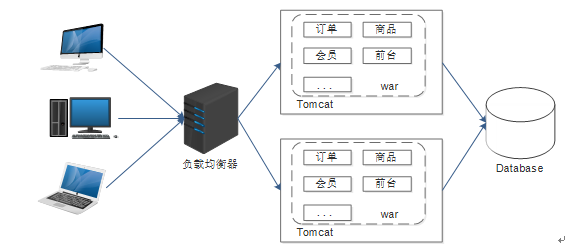

- 模块之间耦合度太高，其中一个升级其他都得升级
-  开发困难，各个团队开发最后都要整合一起
- 系统的扩展性差
- 不能灵活的进行分布式部署

### 1.1.2 垂直的应用架构

当访问量逐渐增大，单一应用增加机器带来的加速度越来越小，**将应用拆成互不相干的几个应用**，以提升效率。此时，用于加速前端页面开发的Web框架(MVC)是关键。 

### 1.1.3 系统拆分

#### 1.1.3.1 先看一段对话


#### 1.1.3.2 系统拆分

1）  **应用间耦合严重**。系统内各个应用之间不通，同样一个功能在各个应用中都有实现，后果就是改一处功能，需要同时改系统中的所有应用。这种情况多存在于历史较长的系统，因各种原因，系统内的各个应用都形成了自己的业务小闭环

2）  **业务扩展性差**。数据模型从设计之初就只支持某一类的业务，来了新类型的业务后又得重新写代码实现，结果就是项目延期，大大影响业务的接入速度；

3）  **代码老旧，难以维护**。各种随意的if else、写死逻辑散落在应用的各个角落，处处是坑，开发维护起来战战兢兢；

4）  **系统扩展性差**。系统支撑现有业务已是颤颤巍巍，不论是应用还是DB都已经无法承受业务快速发展带来的压力；

5）  **新坑越挖越多，恶性循环**。不改变的话，最终的结果就是把系统做死了。


#### 1.1.3.3 拆分原则

##### 1.1.3.3.1 把握业务复杂度

一个老生常谈的问题，系统与业务的关系？


我们最期望的理想情况是第一种关系（车辆与人），业务觉得不合适，可以马上换一辆新的。但现实的情况是更像心脏起搏器与人之间的关系，不是说换就能换。一个系统接的业务越多，耦合越紧密。如果在没有真正把握住业务复杂度之前贸然行动，最终的结局就是把心脏带飞。 

##### 1.1.3.3.2 高内聚-低耦合-单一职责

业务复杂度把握后，需要开始定义各个应用的服务边界。怎么才算是好的边界？像葫芦娃兄弟一样的应用就是好的！

举个例子，葫芦娃兄弟（应用）间的技能是相互独立的，遵循单一职责原则，比如水娃只能喷水，火娃只会喷火，隐形娃不会喷水喷火但能隐身。更为关键的是，葫芦娃兄弟最终可以合体为金刚葫芦娃，即这些应用虽然功能彼此独立，但又相互打通，最后合体在一起就成了我们的平台。


这里很多人会有疑惑，拆分粒度怎么控制？很难有一个明确的结论，只能说是结合业务场景、目标、进度的一个折中。但总体的原则是先从一个大的服务边界开始，不要太细，因为随着架构、业务的演进，应用自然而然会再次拆分，让正确的事情自然发生才最合理。

##### 1.1.3.3.3 确定拆分后的应用目标

一旦系统的宏观应用拆分图出来后，就要落实到某一具体的应用拆分上了。首先要确定的就是某一应用拆分后的目标。拆分优化是没有底的，可能越做越深，越做越没结果，继而又影响自己和团队的士气。比如说可以定这期的目标就是将db、应用分拆出去，数据模型的重新设计可以在第二期。

##### 1.1.3.3.4 拆分后应用的状态以及存在的风险

**动手前的思考成本远远低于动手后遇到问题的解决成本**。应用拆分最怕的是中途说“他*的，这块不能动，原来当时这样设计是有原因的，得想别的路子！”这时的压力可想而知，整个节奏不符合预期后，很可能会接二连三遇到同样的问题，这时不仅同事们士气下降，自己也会丧失信心，继而可能导致拆分失败。 

##### 1.1.3.3.5 留个锦囊-方案。 

锦囊就四个字“有备无患”，可以贴在桌面或者手机上。在以后具体实施过程中，多思考下“方案是否有多种可以选择？复杂问题能否拆解？实际操作时是否有预案？”，应用拆分在具体实践过程中比拼得就是细致二字，多一份方案，多一份预案，不仅能提升成功概率，更给自己信心。 

### 1.1.4 SOA架构

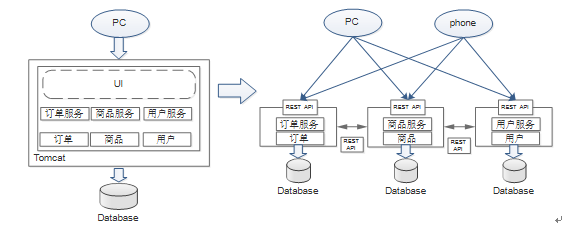

典型代表有两个：流动计算架构和微服务架构；

**流动计算架构：**

当服务越来越多，容量的评估，小服务资源的浪费等问题逐渐显现，此时需增加一个调度中心基于访问压力实时管理集群容量，提高集群利用率。此时，用于提高机器利用率的资源调度和治理中心(SOA)是关键。流动计算架构的最佳实践阿里的Dubbo。

**微服务架构**

与流动计算架构很相似，除了具备流动计算架构优势外，微服务架构中的微服务可以独立部署，独立发展。且微服务的开发不会限制于任何技术栈。微服务架构的最佳实践是SpringCloud。


**单一的应用架构--->垂直的应用架构--->分布式架构--->SOA面向服务--->微服务架构**

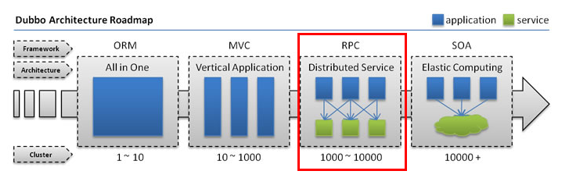

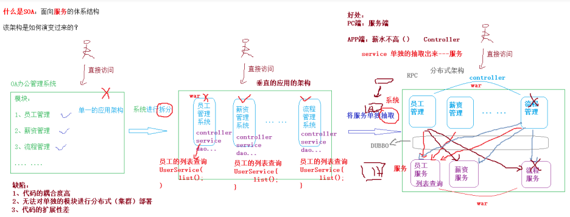

## 1.2 SpringCloud

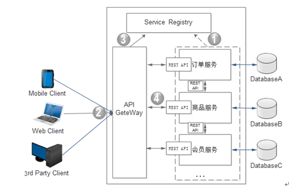

### 1.2.1 介绍

Spring Cloud是在Spring Boot的基础上构建的，用于简化分布式系统构建的工具集。该工具集为微服务架构中所涉及的配置管理、服务发现、智能路由、熔断器、控制总线等操作提供了一种简单的开发方式。也就是说Spring Cloud把非常流行的微服务的技术整合到一起，方便开发。例如：

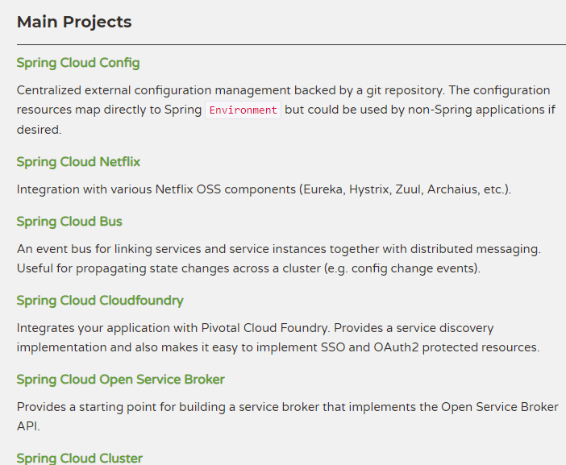

- 注册中心：Eureka
- 负载均衡：Ribbon
- 熔断器：Hystrix
- 服务通信：Feign
- 网关：Gateway
- 配置中心 ：config
- 消息总线：Bus


### 1.2.2 版本

Spring Cloud的版本号并不像其他Spring项目是通过数字来区分版本号的（如Spring 5.0.2），而是根据英文字母的顺序，采用伦敦的“地名+版本号”的方式来命名的，例如Greenwich SR2 、Finchley SR3 、Edgware SR6 、Dalston SR5等。其中Greenwich 、Finchley 等是地名，而SR是Service Releases的缩写，是固定的写法，后面的数字是小版本号。（PS：小提示：由于Spring Cloud的版本更新很快，所以在学习时可能会发现官网中正式版本的小版本号可能与书中的并不一致，这是很正常的） 

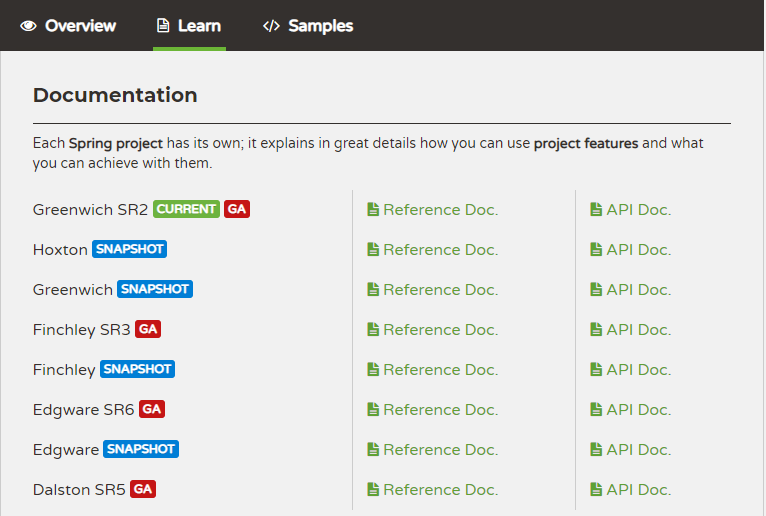

- SNAPSHOT：快照版本，尝鲜版，随时可能修改
- M版本，MileStone，M1表示第一个里程碑版本，一般同时标注PRE，表示预览版
- SR，Service Release，SR1表示第一个正式版本，同时标注GA(Generally Available)，稳定版

### 1.2.3 与SpringBoot版本匹配关系

鉴于SpringBoot与SpringCloud关系，SpringBoot建议采用2.1.x版本

| SpringBoot                            | SpringCloud                      |
| ------------------------------------- | -------------------------------- |
| 1.2.x                                 | Angel版本                        |
| 1.3.x                                 | Brixton版本                      |
| 1.4.x                                 | Camden版本                       |
| 1.5.x                                 | Dalston版本、Edgware             |
| 2.0.x                                 | Finchley版本                     |
| 2.1.x                                 | Greenwich GA版本 (2019年2月发布) |
| 2.2.x, 2.3.x (Starting with SR5)      | Hoxton                           |
| 2.4.x, 2.5.x (Starting with 2020.0.3) | 2020.0.x aka Ilford              |
| 2.6.x                                 | 2021.0.x aka Jubilee             |

# 2 使用RestTemplate发送请求

## 2.1 HTTP和RPC区别

- 传输协议
  - RPC，可以基于TCP协议，也可以基于HTTP协议
  - HTTP，基于HTTP协议
- 传输效率
  - RPC，使用自定义的TCP协议，可以让请求报文体积更小，或者使用HTTP2协议，也可以很好的减少报文的体积，提高传输效率
  - HTTP，如果是基于HTTP1.1的协议，请求中会包含很多无用的内容，如果是基于HTTP2.0，那么简单的封装以下是可以作为一个RPC来使用的，这时标准RPC框架更多的是服务治理
- 性能消耗，主要在于序列化和反序列化的耗时
  - RPC，可以基于thrift实现高效的二进制传输
  - HTTP，大部分是通过json来实现的，字节大小和序列化耗时都比thrift要更消耗性能
- 负载均衡
  - RPC，基本都自带了负载均衡策略
  - HTTP，需要配置Nginx，HAProxy、LVS来实现
- 服务治理（下游服务新增，重启，下线时如何不影响上游调用者）
  - RPC，能做到自动通知（自动监听到服务的节点），不影响上游
  - HTTP，需要事先通知，修改Nginx/HAProxy配置    （心跳检查   keepalived     检查：pid）

总结：RPC主要用于公司内部的服务调用，性能消耗低，传输效率高，服务治理方便。HTTP主要用于对外的异构环境，浏览器接口调用，APP接口调用，第三方接口调用等。 

## 2.2 HTTP客户端工具

常见的HTTP客户端工具：**HttpClient**、OKHttp、URLConnection。

### 2.2.1 在工程中添加HttpClient依赖

在pom文件中添加依赖：

~~~xml
<!--httpclient依赖-->
<dependency>
			<groupId>org.apache.httpcomponents</groupId>
			<artifactId>httpclient</artifactId>
		</dependency>
~~~


### 2.2.2 在工程中添加HttpClient工具类

在src目录下添加

~~~java
package com.itheima.utils;

import java.io.IOException;
import java.security.GeneralSecurityException;
import java.security.cert.CertificateException;
import java.security.cert.X509Certificate;
import java.text.ParseException;
import java.util.HashMap;
import java.util.LinkedList;
import java.util.List;
import java.util.Map;

import javax.net.ssl.SSLContext;
import javax.net.ssl.SSLException;
import javax.net.ssl.SSLSession;
import javax.net.ssl.SSLSocket;
import javax.net.ssl.TrustManager;
import javax.net.ssl.X509TrustManager;

import org.apache.http.Consts;
import org.apache.http.HttpEntity;
import org.apache.http.NameValuePair;
import org.apache.http.client.ClientProtocolException;
import org.apache.http.client.config.RequestConfig;
import org.apache.http.client.entity.UrlEncodedFormEntity;
import org.apache.http.client.methods.CloseableHttpResponse;
import org.apache.http.client.methods.HttpEntityEnclosingRequestBase;
import org.apache.http.client.methods.HttpGet;
import org.apache.http.client.methods.HttpPost;
import org.apache.http.client.methods.HttpPut;
import org.apache.http.client.methods.HttpUriRequest;
import org.apache.http.conn.scheme.Scheme;
import org.apache.http.conn.ssl.SSLConnectionSocketFactory;
import org.apache.http.conn.ssl.SSLContextBuilder;
import org.apache.http.conn.ssl.SSLSocketFactory;
import org.apache.http.conn.ssl.TrustStrategy;
import org.apache.http.conn.ssl.X509HostnameVerifier;
import org.apache.http.entity.StringEntity;
import org.apache.http.impl.client.CloseableHttpClient;
import org.apache.http.impl.client.DefaultHttpClient;
import org.apache.http.impl.client.HttpClients;
import org.apache.http.impl.conn.PoolingHttpClientConnectionManager;
import org.apache.http.message.BasicNameValuePair;
import org.apache.http.util.EntityUtils;

/**
 * http请求客户端
 * 
 * @author itcast
 * 
 */
public class HttpClient {
	private String url;
	private Map<String, String> param;
	private int statusCode;
	private String content;
	private String xmlParam;
	private boolean isHttps;

	public boolean isHttps() {
		return isHttps;
	}

	public void setHttps(boolean isHttps) {
		this.isHttps = isHttps;
	}

	public String getXmlParam() {
		return xmlParam;
	}

	public void setXmlParam(String xmlParam) {
		this.xmlParam = xmlParam;
	}

	public HttpClient(String url, Map<String, String> param) {
		this.url = url;
		this.param = param;
	}

	public HttpClient(String url) {
		this.url = url;
	}

	public void setParameter(Map<String, String> map) {
		param = map;
	}

	public void addParameter(String key, String value) {
		if (param == null){
			param = new HashMap<String, String>();
		}

		param.put(key, value);
	}

	public void post() throws ClientProtocolException, IOException {
		HttpPost http = new HttpPost(url);
		setEntity(http);
		execute(http);
	}

	public void put() throws ClientProtocolException, IOException {
		HttpPut http = new HttpPut(url);
		setEntity(http);
		execute(http);
	}

	public void get() throws ClientProtocolException, IOException {
		if (param != null) {
			StringBuilder url = new StringBuilder(this.url);
			boolean isFirst = true;
			for (String key : param.keySet()) {
				if (isFirst){
					url.append("?");
				}
				else{
					url.append("&");
				}

				url.append(key).append("=").append(param.get(key));
			}
			this.url = url.toString();
		}
		HttpGet http = new HttpGet(url);
		execute(http);
	}

	/**
	 * set http post,put param
	 */
	private void setEntity(HttpEntityEnclosingRequestBase http) {
		if (param != null) {
			List<NameValuePair> nvps = new LinkedList<NameValuePair>();
			for (String key : param.keySet()){
				nvps.add(new BasicNameValuePair(key, param.get(key))); // 参数
			}

			http.setEntity(new UrlEncodedFormEntity(nvps, Consts.UTF_8)); // 设置参数
		}
		if (xmlParam != null) {
			http.setEntity(new StringEntity(xmlParam, Consts.UTF_8));
		}
	}

	private void execute(HttpUriRequest http) throws ClientProtocolException,
			IOException {
		CloseableHttpClient httpClient = null;
		try {
			if (isHttps) {
				SSLContext sslContext = new SSLContextBuilder()
						.loadTrustMaterial(null, new TrustStrategy() {
							// 信任所有
							@Override
							public boolean isTrusted(X509Certificate[] chain,
									String authType)
									throws CertificateException {
								return true;
							}
						}).build();
				SSLConnectionSocketFactory sslsf = new SSLConnectionSocketFactory(
						sslContext);
				httpClient = HttpClients.custom().setSSLSocketFactory(sslsf)
						.build();
			} else {
				httpClient = HttpClients.createDefault();
			}
			CloseableHttpResponse response = httpClient.execute(http);
			try {
				if (response != null) {
					if (response.getStatusLine() != null){
						statusCode = response.getStatusLine().getStatusCode();
					}

					HttpEntity entity = response.getEntity();
					// 响应内容
					content = EntityUtils.toString(entity, Consts.UTF_8);
				}
			} finally {
				response.close();
			}
		} catch (Exception e) {
			e.printStackTrace();
		} finally {
			httpClient.close();
		}
	}

	public int getStatusCode() {
		return statusCode;
	}

	public String getContent() throws ParseException, IOException {
		return content;
	}

}

~~~


### 2.2.3 测试

创建一个main方法进行测试：

~~~java
public class HttpMain {

    public static void main(String[] args) throws IOException, ParseException {
//        String url = "https://ip.taobao.com/service/getIpInfo.php?ip=[14.118.128.154]";
        String url = "http://localhost:8080/springboot_demo4_jpa-0.0.1-SNAPSHOT/user/findUsers";
        HttpClient httpClient = new HttpClient(url);
        httpClient.setHttps(true);
        httpClient.get();
        String content = httpClient.getContent();
        System.out.println(content);
    }
}
~~~

## 2.3 RestTemplate入门程序

### 2.3.1 介绍

- RestTemplate是Rest的HTTP客户端模板工具类
- 对基于Http的客户端进行封装
- 实现对象与JSON的序列化与反序列化
- 不限定客户端类型，目前常用的3种客户端都支持：HttpClient、OKHttp、JDK原生URLConnection(默认方式)

### 2.3.2 创建工程

创建工程勾选web依赖。

~~~xml
<dependency>
    <groupId>org.springframework.boot</groupId>
    <artifactId>spring-boot-starter-web</artifactId>
</dependency>
~~~


### 2.3.3 注入RestTemplate

在SpringBoot引导程序中注入RestTemplate。

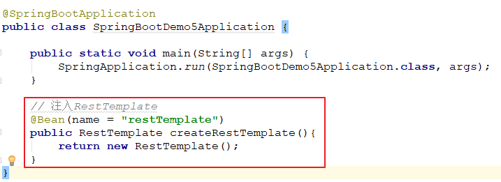

~~~java
@SpringBootApplication
public class SpringBootDemo5Application {

	public static void main(String[] args) {
		SpringApplication.run(SpringBootDemo5Application.class, args);
	}

	// 注入RestTemplate
	@Bean(name = "restTemplate")
	public RestTemplate createRestTemplate(){
		return new RestTemplate();
	}
}
~~~

### 2.3.4 在测试类中测试

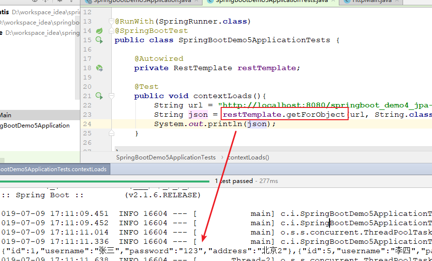

~~~java
@RunWith(SpringRunner.class)
@SpringBootTest
public class SpringBootDemo5ApplicationTests {

    @Autowired
    private RestTemplate restTemplate;

	@Test
	public void contextLoads(){
	    String url = "http://localhost:8080/springboot_demo4_jpa-0.0.1-SNAPSHOT/user/findUsers";
        String json = restTemplate.getForObject(url, String.class);
        System.out.println(json);
    }

}
~~~


# 3 模拟服务调用

## 3.1 创建服务提供方

作用：根据id提供用户信息。

建库（springboot）、建表略。

~~~sql
-- 使用springcloud数据库
USE springcloud;
-- ----------------------------
-- Table structure for tb_user
-- ----------------------------
CREATE TABLE `tb_user` (
  `id` int(11) NOT NULL AUTO_INCREMENT,
  `username` varchar(100) DEFAULT NULL COMMENT '用户名',
  `password` varchar(100) DEFAULT NULL COMMENT '密码',
  `name` varchar(100) DEFAULT NULL COMMENT '姓名',
  `age` int(11) DEFAULT NULL COMMENT '年龄',
  `sex` int(11) DEFAULT NULL COMMENT '性别，1男，2女',
  `birthday` date DEFAULT NULL COMMENT '出生日期',
  `created` date DEFAULT NULL COMMENT '创建时间',
  `updated` date DEFAULT NULL COMMENT '更新时间',
  `note` varchar(1000) DEFAULT NULL COMMENT '备注',
  PRIMARY KEY (`id`)
) ENGINE=InnoDB AUTO_INCREMENT=2 DEFAULT CHARSET=utf8 COMMENT='用户信息表';
-- ----------------------------
-- Records of tb_user
-- ----------------------------
INSERT INTO `tb_user` VALUES ('1', 'zhangsan', '123456', '张三', '13', '1', '2006-08-01', '2019-05-16', '2019-05-16', '好好学习');
INSERT INTO `tb_user` VALUES ('2', 'lisi', '123456', '李四', '13', '1', '2006-08-01', '2019-05-16', '2019-05-16', '天天向上');
~~~


### 3.1.1 创建工程

勾选相关依赖（web、jpa、MySQL驱动）

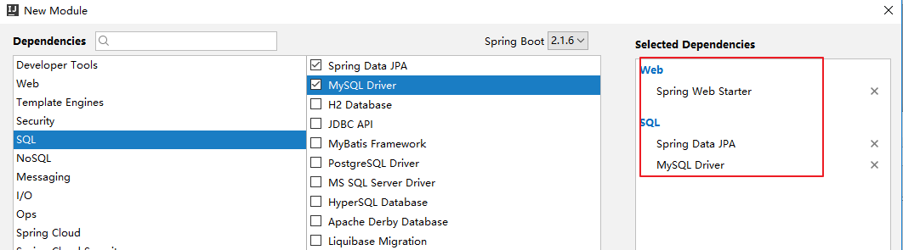

### 3.1.2 创建pojo

在工程中创建User对象。

~~~java
@Entity
@Table(name = "tb_user")
public class User {
    @Id
    @GeneratedValue(strategy = GenerationType.IDENTITY)
    private Integer id;
    private String username;
    private String password;
    private String name;
    private Integer age;
    private Integer sex;
    private Date birthday;
    private Date created;
    private Date updated;
    private String note;
}
~~~

### 3.1.3 编写Dao层

编写UserDao接口，需要继承JpaRepository

~~~java
public interface UserDao extends JpaRepository<User, Integer> {
    
}
~~~


### 3.1.4 编写Service层

编写UserService接口：

~~~java
public interface UserService {

    User findUserById(Integer id);
}
~~~

编写UserServiceImpl实现类：

~~~java
@Service
public class UserServiceImpl implements UserService {

    @Autowired
    private UserDao userDao;

    @Override
    public User findUserById(Integer id) {
        Optional<User> optional = userDao.findById(id);
        User user = optional.get();
        return user;
    }
}
~~~


### 3.1.5 编写Controller层

在工程的目录下创建UserController类

~~~java
@RestController
@RequestMapping("/user")
public class UserController {

    @Autowired
    private UserService userService;

    @RequestMapping("/findUserById/{id}")
    public User findUserById(@PathVariable("id") Integer id){
        User user = userService.findUserById(id);
        return user;
    }

}
~~~

### 3.1.6 编写application.yml文件

将默认生成的application.properties文件修改成application.yml/yaml文件。

~~~yaml
server:
    port: 9091
# DB 配置
spring:
  datasource:
    driver-class-name: com.mysql.cj.jdbc.Driver
    url: jdbc:mysql://localhost:3306/springcloud?useUnicode=true&characterEncoding=UTF-8&serverTimezone=UTC
    password: root
    username: root
~~~

### 3.1.7 发布程序并访问测试

访问地址：http://localhost:9091/user/findUserById/1

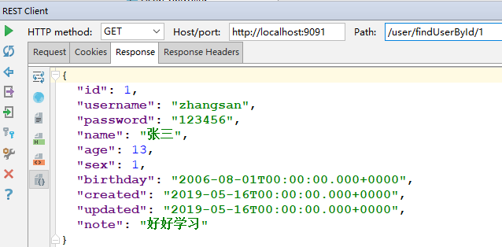


## 3.2 创建服务消费方

### 3.2.1 创建工程

勾选相关依赖（web）

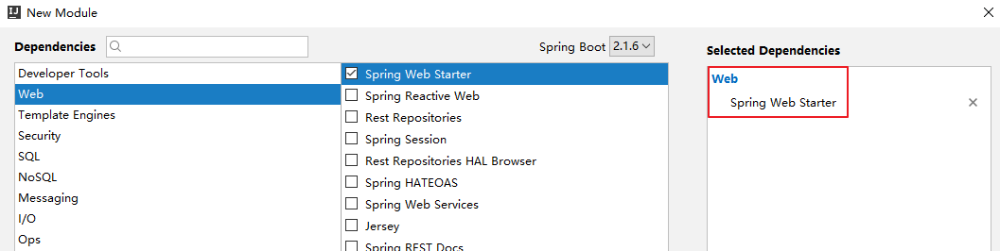


### 3.2.2 注入RestTemplate

在启动类中注入RestTemplate。

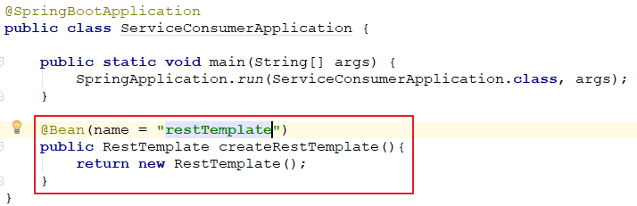

~~~java
@SpringBootApplication
public class ServiceConsumerApplication {

	public static void main(String[] args) {
		SpringApplication.run(ServiceConsumerApplication.class, args);
	}

	@Bean(name = "restTemplate")
	public RestTemplate createRestTemplate(){
		return new RestTemplate();
	}
}
~~~


### 3.2.3 编写Controller层

在工程的src目录下创建Controller类。

~~~java
@RestController
@RequestMapping("/customer")
public class CustomerController {

    @Autowired
    private RestTemplate restTemplate;

    // @RequestMapping(value = "/getUserById/{id}", method = {RequestMethod.GET})
    // 等价与该注解@GetMapping
    @GetMapping("/getUserById/{id}")
    public String getUserById(@PathVariable Integer id){
        String path = "http://localhost:9091/user/findUserById/" + id;
        String url = String.format(path);
        String json = restTemplate.getForObject(url, String.class);
        return json;
    }
}
~~~


## 3.3 调用测试

请求地址：<http://localhost:8080/customer/getUserById/1> 

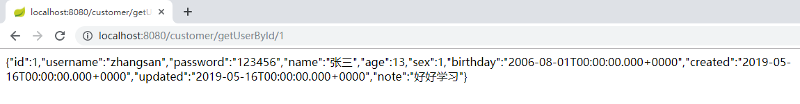


## 3.4 问题总结

- 消费方调用服务方地址硬编码
- 在服务消费方中，不清楚服务提供方的状态（是否健康）
- 提供方只有一个服务，如果服务宕机，则无法访问；即便服务提供方形成集群，服务消费方还需要自己实现负载均衡


# 4 搭建Eureka注册中心

## 4.1 Eureka介绍

Eureka是Netflix开发的一个服务发现框架，本身是一个基于REST的服务，主要用于定位运行在AWS（Amazon Web Services ）域中的中间层服务，以达到负载均衡和中间层服务故障转移的目的。Spring Cloud将其集成在自己的子项目Spring Cloud Netflix中，以实现Spring Cloud的服务发现功能。

Eureka的服务发现包含两大组件：服务端发现组件（Eureka Server）和客户端发现组件（Eureka Client）。服务端发现组件也被称之为服务注册中心，主要提供了服务的注册功能，而客户端发现组件主要用于处理服务的注册与发现。


从图可以看出，当客户端服务通过注解等方式嵌入到程序的代码中运行时，客户端发现组件就会向注册中心注册自身提供的服务，并周期性地发送心跳来更新服务（默认时间为30s，如果连续三次心跳都不能够发现服务，那么Eureka就会将这个服务节点从服务注册表中移除）。与此同时，客户端发现组件还会从服务端查询当前注册的服务信息并缓存到本地，即使Eureka Server出现了问题，客户端组件也可以通过缓存中的信息调用服务节点的服务。各个服务之间会通过注册中心的注册信息以Rest方式来实现调用，并且也可以直接通过服务名进行调用。 

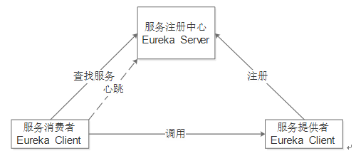

在Eureka的服务发现机制中，包含了3个角色：服务注册中心、服务提供方和服务消费方。

服务注册中心即Eureka Server，而服务提供者和服务消费者是Eureka Client。这里的服务提供者是指提供服务的应用，可以是Spring Boot应用，也可以是其他技术平台且遵循Eureka通信机制的应用，应用在运行时会自动的将自己提供的服务注册到Eureka Server以供其他应用发现。

服务消费者就是需要服务的应用，该服务在运行时会从服务注册中心获取服务列表，然后通过服务列表知道去何处调用其他服务。服务消费者会与服务注册中心保持心跳连接，一旦服务提供者的地址发生变更时，注册中心会通知服务消费者。

需要注意的是，Eureka服务提供者和服务消费者之间的角色是可以相互转换的，因为一个服务既可能是服务消费方，同时也可能是服务提供方。

## 4.2 Eureka入门程序

### 4.2.1 创建maven工程

我们创建一个maven工程springcloud_microservice（parent），用来管理子工程，因为我们需要创建Eureka的注册中心以及Eureka提供方以及消费方，因此方便管理。创建好的maven工程中我们需要添加如下依赖：

~~~xml
<parent>
        <groupId>org.springframework.boot</groupId>
        <artifactId>spring-boot-starter-parent</artifactId>
        <version>2.1.6.RELEASE</version>
    </parent>
    <dependencyManagement>
        <dependencies>
            <dependency>
                <groupId>org.springframework.cloud</groupId>
                <artifactId>spring-cloud-dependencies</artifactId>
                <version>Greenwich.SR2</version>
                <type>pom</type>
                <scope>import</scope>
            </dependency>
        </dependencies>
    </dependencyManagement>
~~~


### 4.2.2 创建Eureka服务-注册中心

#### 4.2.2.1 创建工程

创建Eureka的服务（注册中心）eureka_server_registry工程，需要勾选如下依赖：

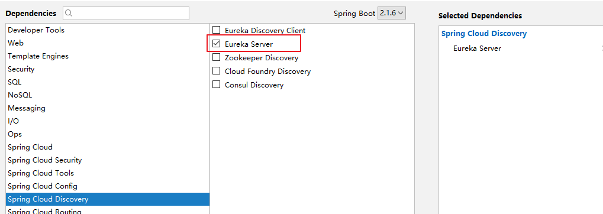

#### 4.2.2.2 在启动类中添加注解

在启动类中添加@EnableEurekaServer注解。申明该工程为Eureka的服务。

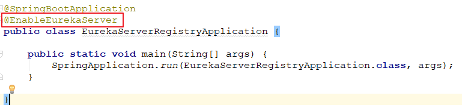

#### 4.2.2.3 修改application文件

这里我们同样将默认application.properties文件修改为application.yml文件，并内容如下：

~~~yaml
# 无注释版本
server:
  port: 10086
spring:
  application:
    name: eureka-server
eureka:
  client:
    service-url:
      defaultZone: http://127.0.0.1:10086/eureka
    fetch-registry: false


# 注释版本
server:
  port: 10086
spring:
  # 指定服务名称	
  application:
    name: eureka-server
eureka:
  client:
    # 注册中心地址
    service-url:
      defaultZone: http://127.0.0.1:10086/eureka
    # 是否需要注册到注册中心
    fetch-registry: false    

~~~


#### 4.2.2.4 访问注册中心

启动项目并访问，地址为： http://localhost:10086/> 。Eureka注册中心的控制面板如下：

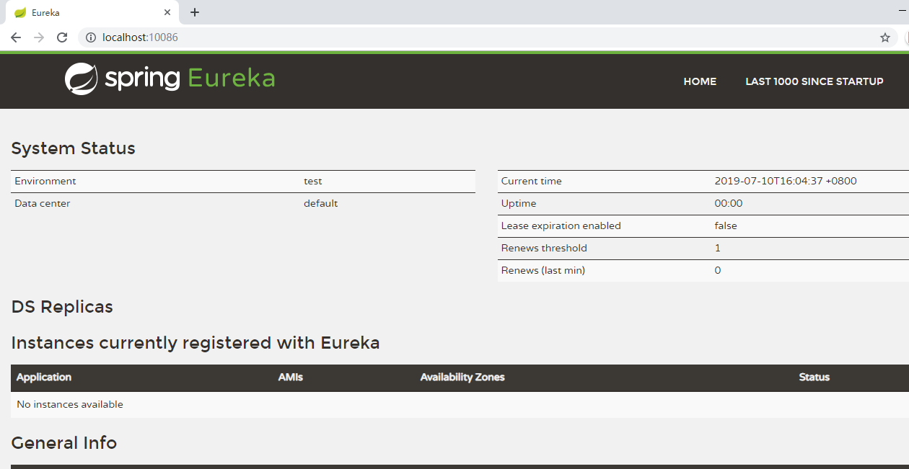


### 4.2.3 创建Eureka客户端-提供方

#### 4.2.3.1 创建工程

创建服务提供方工程eureka_client_provider，需要勾选的依赖如下：

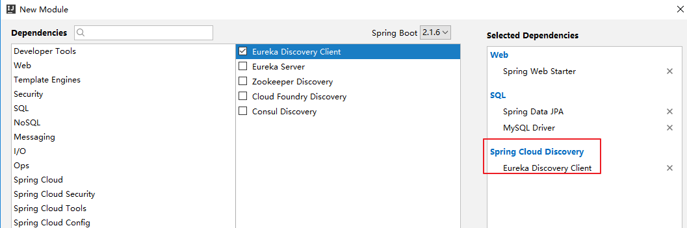

#### 4.2.3.2 编写代码

将【3.1】章节的对用户的查询代码复制到该工程

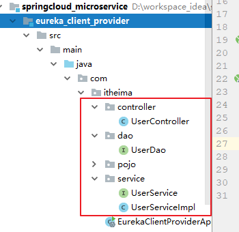

#### 4.2.3.3 在启动类中添加注解

在启动类中添加注解，表明为eureka的客户端。@EnableEurekaClient

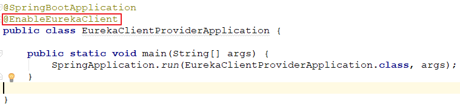

#### 4.2.3.4 编写application.yml文件

编写application.yml文件，内容如下：

~~~yaml
# 配置应用基本信息和DB
server:
  port: 9091
spring:
  application:
    name: eureka-client-provider
  datasource:
    driver-class-name: com.mysql.jdbc.Driver
    password: root
    url: jdbc:mysql://127.0.0.1:3306/springcloud?useUnicode=true&characterEncoding=UTF-8&serverTimezone=UTC
    username: root
# 配置eureka server
eureka:
  client:
    service-url:
      defaultZone: http://127.0.0.1:10086/eureka

~~~

#### 4.2.3.5 发布工程

发布工程后，eureka的控制面板如下：可以看到发布的实例，也就是说服务提供方已发布到注册中心上。

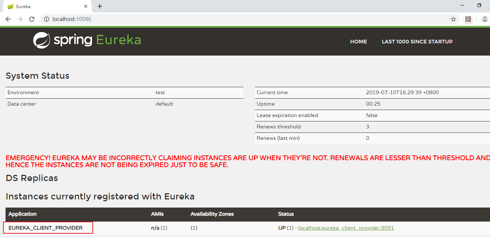

**备注：如果有红色先不用关心（只是一个警告）。**


### 4.2.4 创建Eureka客户端-消费方

#### 4.2.4.1 创建工程

创建服务提供方工程eureka_client_consumer，需要勾选的依赖如下：

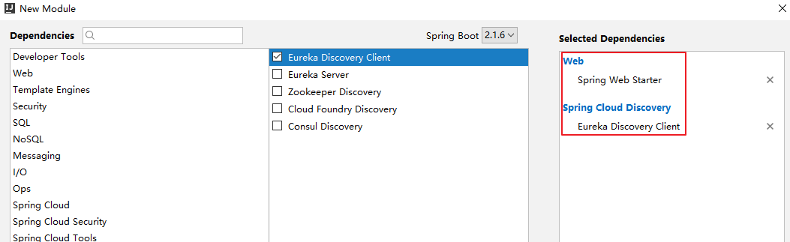

#### 4.2.4.2 编写Controller

编写ConsumerController类。

~~~java
@RestController
@RequestMapping("/consumer")
public class ConsumerController {

    @Autowired
    private RestTemplate restTemplate;

    @Autowired
    private DiscoveryClient discoveryClient;

    @GetMapping("/getUser/{id}")
    public String getUser(@PathVariable Integer id){
        // 指定请求服务的url，然后通过RestTemplate发送请求
        // 不建议这种写法，url硬编码了
//        String url = "http://localhost:9091/user/findUserById/" + id;
        // 1、获取Eureka注册中心提供方实例列表
        List<ServiceInstance> serviceInstances = discoveryClient.getInstances("eureka_client_provider");
        // 2、获取具体实例（服务）
        ServiceInstance serviceInstance = serviceInstances.get(0);
        // 3、发送请求
        String url = "http://"+serviceInstance.getHost()+":"+serviceInstance.getPort()+"/user/findUserById/" + id;
        String json = restTemplate.getForObject(url, String.class);
        return json;
    }
}
~~~


#### 4.2.4.3 修改启动类中

在启动类中添加@EnableEurekaClient注解和注入RestTemplate。

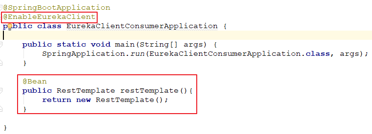

~~~java
@SpringBootApplication
@EnableEurekaClient
public class EurekaClientConsumerApplication {

	public static void main(String[] args) {
		SpringApplication.run(EurekaClientConsumerApplication.class, args);
	}

	@Bean
    public RestTemplate restTemplate(){
	    return new RestTemplate();
    }

}
~~~


#### 4.2.4.4 配置application.yml文件

配置文件application.yml内容如下：

~~~yaml
# 配置应用基本信息
server:
  port: 8080
spring:
  application:
    name: eureka-client-consumer
# 配置eureka server
eureka:
  client:
    service-url:
      defaultZone: http://127.0.0.1:10086/eureka
~~~


#### 4.2.4.5 发布工程

发布工程后，我们看到eureka控制面板，内容如下：

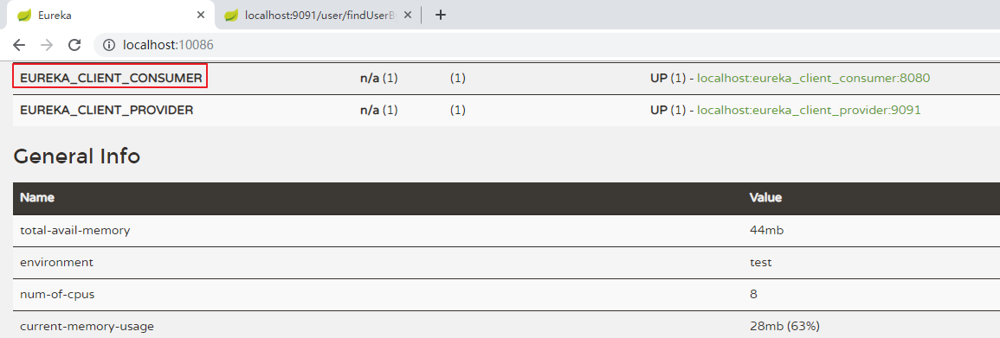

### 4.2.5 调用测试

在消费方中调用，结果如下：<http://localhost:8080/consumer/getUser/1> 

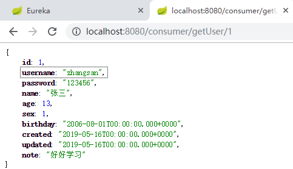

### 4.2.6 Eureka其他配置说明

#### 4.2.6.1 注解说明

注册服务或者发现服务注解。  zk

- ```java
  @EnableEurekaClient：基于spring-cloud-netflix。就是如果选用的注册中心是eureka，那么就推荐使用
  ```

- ```java
  @EnableDiscoveryClient：基于spring-cloud-commons。如果是其他的注册中心（consul, zookeeper），那么推荐使用
  ```

#### 4.2.6.2 服务注册

在注册中心中心工程中配置： 开启自我保护

~~~yaml
server:
  port: 10086
spring:
  application:
    name: eureka-server
eureka:
  client:
    service-url:
      defaultZone: http://127.0.0.1:10086/eureka
    fetch-registry: false
  server:
    enable-self-preservation: true
  instance:
    ip-address: 127.0.0.1
    prefer-ip-address: true


# 注释版
server:
  port: 10086
spring:
  application:
    name: eureka-server
eureka:
  client:
    service-url:
      defaultZone: http://127.0.0.1:10086/eureka
    fetch-registry: false
  server:
    # 开启自我保护机制（默认就是true，如果设置成false则在eureka注册中心有红色警告）
    enable-self-preservation: true
  instance:
  	# 强制指定ip地址（不用配置，使用默认获取当前服务器地址）
    ip-address: 127.0.0.1
    # 默认获取当前服务器地址（可以不用配置，默认值就是true）
    prefer-ip-address: true
~~~

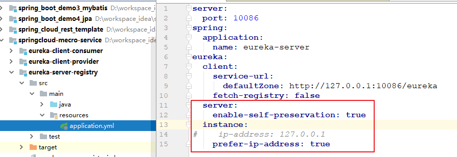


效果如下：

- ~~~yaml
  server:
      enable-self-preservation: false # 关闭自我保护机制，会有警告
  ~~~

  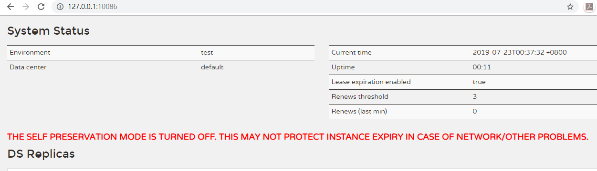

- 配置：ip-address: 127.0.0.1

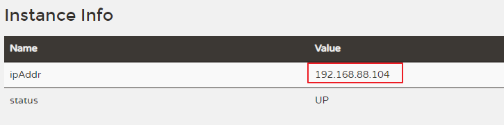

- 不配置：ip-address: 127.0.0.1

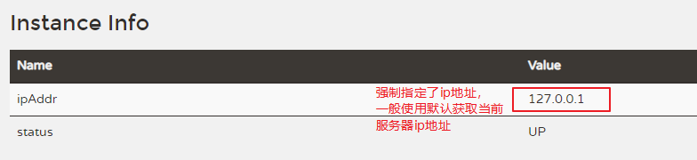


#### 4.2.6.3 服务续约

服务注册完成以后，服务提供者会维持一个`心跳`，保存服务处于存在状态。这个称之为服务续约(renew).服务超过90秒没有发生心跳，Eureka Server会将服务从列表移除。我们可以在eureka的客户端配置如下内容：

keepalived一样的。

~~~yaml
#向Eureka服务中心注册服务
eureka:
  instance:
  	# 租约到期，服务时效时间，默认值90秒
    lease-expiration-duration-in-seconds: 90 
    # 租约续约间隔时间，默认30秒
    lease-renewal-interval-in-seconds: 30 
~~~

#### 4.2.6.4 失效剔除

服务中心每隔一段时间(默认60秒)将清单中没有续约的服务剔除。通过`eviction-interval-timer-in-ms`配置可以对其进行修改，单位是秒。我们可以在eureka客户端程序中配置如下内容：

~~~yaml
eureka:
  instance:
  	# 超过180秒没有续约的服务将被剔除
  	eviction-interval-timer-in-ms: 180
~~~

#### 4.2.6.5 自我保护

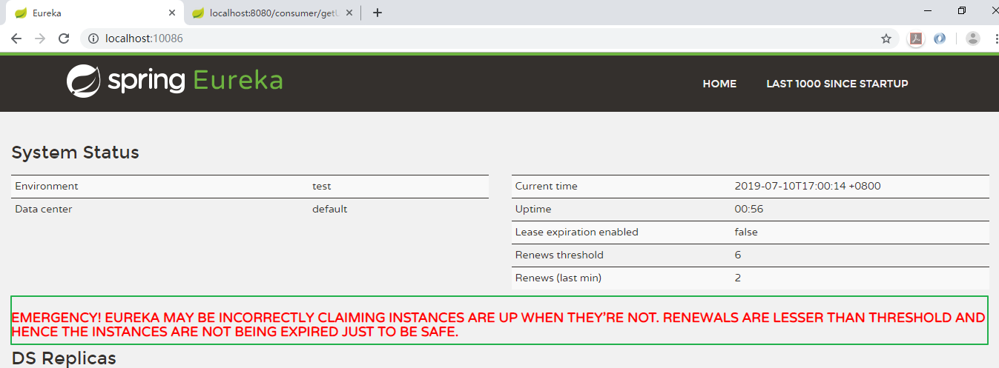

警告信息是因为本地调试时触发了Eureka Server的自我保护机制。该机制会使注册中心所维护的实例不是很准确，所以在本地开发时，可以在Eureka Server应用的配置文件中使用eureka.server.enable-self-preservation=false参数来关闭保护机制，以确保注册中心可以将不可用的实例正确删除。 

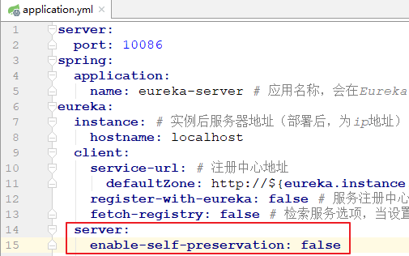


# 5 使用Ribbon实现负载均衡

## 5.1 Ribbon介绍

在分布式架构中，服务器端负载均衡通常是由Nginx实现分发请求的，而客户端的同一个实例部署在多个应用上时，也需要实现负载均衡。那么Spring Cloud中是否提供了这种负载均衡的功能呢？答案是肯定的。我们可以通过Spring Cloud中的Ribbon来实现此功能 

Spring Cloud Ribbon是一个基于HTTP和TCP的客户端负载均衡工具，它基于Netflix Ribbon实现。通过Spring Cloud的封装，可以让我们轻松地将面向服务的REST模版请求自动转换成客户端负载均衡的服务调用。Spring Cloud Ribbon虽然只是一个工具类框架，它不像服务注册中心、配置中心、API网关那样需要独立部署，但是它几乎存在于每一个Spring Cloud构建的微服务和基础设施中。因为微服务间的调用，API网关的请求转发等内容，实际上都是通过Ribbon来实现的，包括后续我们将要介绍的Feign，它也是基于Ribbon实现的工具。所以，对Spring Cloud Ribbon的理解和使用，对于我们使用Spring Cloud来构建微服务非常重要。

## 5.2 入门程序

场景说明：

- 开启多个（本次两个）服务提供方；
- 启动消费方进行调用测试

### 5.2.1 启动两个提供方

#### 5.2.1.1 修改端口

修改提供方配置文件端口：${port:9091}

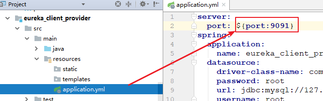

#### 5.2.1.2 编辑启动应用配置

- 修改发布的应用名称；
- 修改发布的应用端口：-Dport=9091

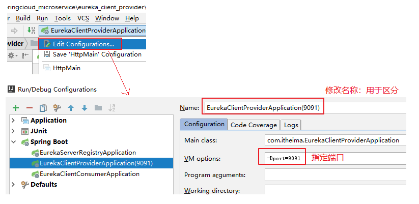

#### 5.2.1.3 复制一份

- 复制一份新的应用

  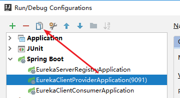

- 修改端口以及名称

  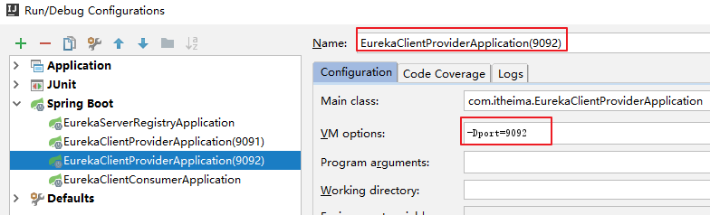

#### 5.2.1.4 开启两个服务提供方

分别启动9091以及9092的服务提供方。

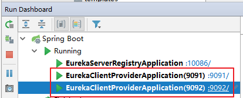

#### 5.2.1.5 通过Eureka查看

通过eureka控制面板查看服务提供方是否启动

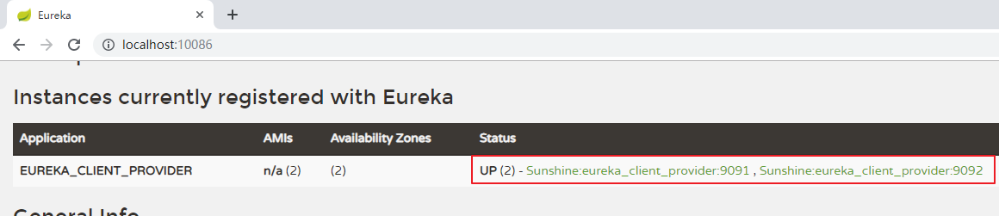


### 5.3.1 修改消费方

#### 5.3.1.1 添加@LoadBalanced注解

在启动类的注入RestTemplate方法上添加客户端负载均衡的注解。**@LoadBalanced**

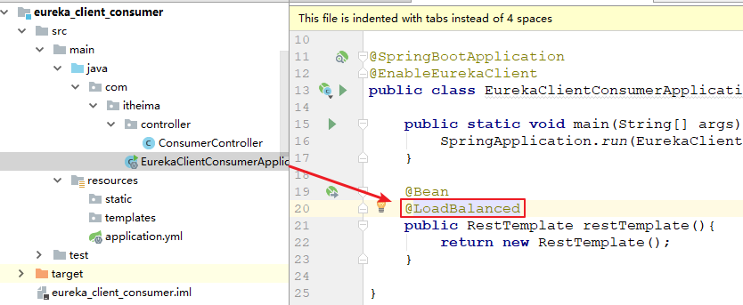

#### 5.3.1.2 修改controller

修改ConsumerController代码：

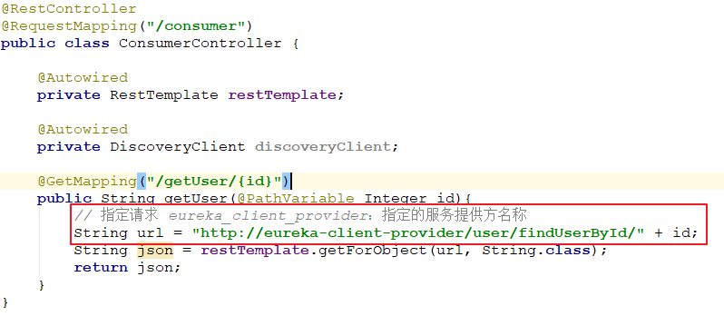

~~~java
@GetMapping("/getUser/{id}")
public String getUser(@PathVariable Integer id){
    // 指定请求 eureka_client_provider：指定的服务提供方名称
    String url = "http://eureka-client-provider/user/findUserById/" + id;
    String json = restTemplate.getForObject(url, String.class);
    return json;
}
~~~

#### 5.3.1.3 启动消费方

略。

### 5.4.1 访问测试

- 我们可以在提供方的controller中打印port：

  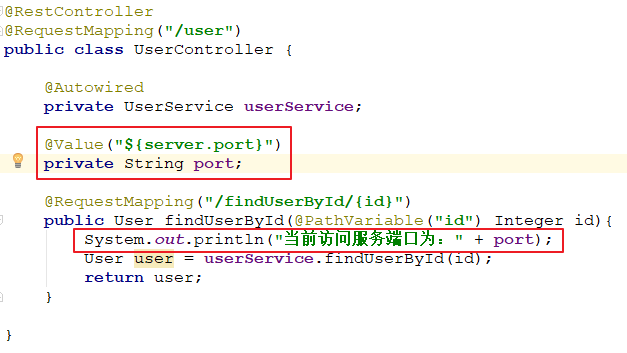

- 刷新四次，console控制查看结果：（分别访问两次，默认走的负载均衡的策略为轮询）

  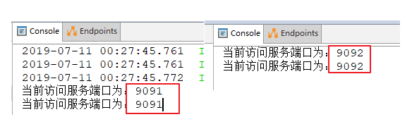

### 5.5.1 坑

使用ribbon实现负载均衡的时候，服务名称不能用下划线。

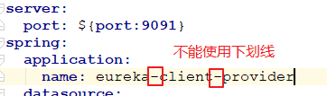


## 5.3 Ribbon负载均衡策略

### 5.3.1 默认策略

Ribbon默认的负载均衡策略是轮询。

~~~yaml
# 修改服务地址轮询策略，默认是轮询，配置之后变随机
eureka_client_consumer: # 服务名称
  ribbon:
    NFLoadBalancerRuleClassName: com.netflix.loadbalancer.RandomRule
~~~


### 5.3.2 Ribbon支持的轮询算法

接口：自己扩展。（需求来决定）

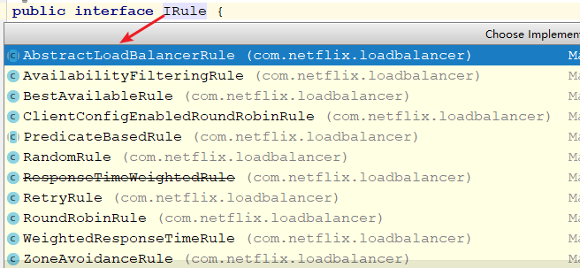

| RoundRobinRule            | 轮询规则（默认方法）                                         |
| ------------------------- | ------------------------------------------------------------ |
| **RandomRule**            | **随机**                                                     |
| AvailabilityFilteringRule | 先过滤掉由于多次访问故障而处于断路器跳闸状态的服务，还有并发的连接数量超过阈值的服务，然后对剩余的服务进行轮询 |
| WeightedResponseTimeRule  | 根据平均响应时间计算服务的权重。统计信息不足时会按照轮询，统计信息足够会按照响应的时间选择服务 |
| RetryRule                 | 正常时按照轮询选择服务，若过程中有服务出现故障，在轮询一定次数后依然故障，则会跳过故障的服务继续轮询 |
| BestAvailableRule         | 先过滤掉由于多次访问故障而处于断路器跳闸状态的服务，然后选择一个并发量最小的服务 |
| ZoneAvoidanceRule         | 默认规则，符合判断server所在的区域的性能和server的可用性选择服务 |


# 5 使用Hystrix熔断器

## 5.1 Hystrix介绍


- Hystrix，英文意思是豪猪，全身是刺，刺是一种保护机制。Hystrix也是Netflix公司的一款组件。
- Hystrix是Netflix开源的一个延迟和容错库，用于隔离访问远程服务、第三方库、防止出现级联失败也就是雪崩效应。
- 开源：参与   集成

## 5.2 雪崩效应

- 微服务中，一个请求可能需要多个微服务接口才能实现，会形成复杂的调用链路。
- 如果某服务出现异常，请求阻塞，用户得不到响应，容器中线程不会释放，于是越来越多用户请求堆积，越来越多线程阻塞。
- 单服务器支持线程和并发数有限，请求如果一直阻塞，会导致服务器资源耗尽，从而导致所有其他服务都不可用，从而形成雪崩效应。

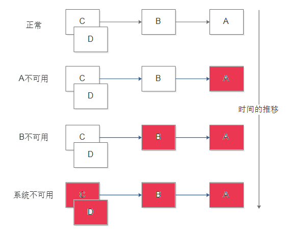

A为服务提供者，B为A的服务调用者，C和D是B的服务调用者。随着时间的推移，当A的不可用引起B的不可用，并将不可用逐渐放大到C和D时，整个服务就崩溃了。 

## 5.3 熔断器原理

### 5.3.1 空气开关

为了解决服务级联失败这种问题，在分布式架构中产生了熔断器等一系列的服务保护机制。分布式架构中的熔断器，就类似于我们生活中的空气开关，当电路发生短路等情况时，空气开关会立刻断开电流，以防止用电火灾的发生。

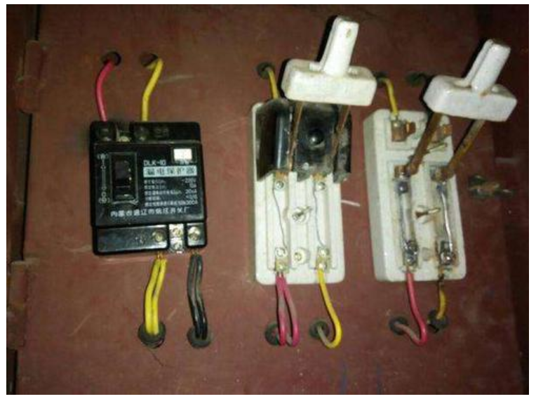


### 5.3.2 熔断器

在Spring Cloud中，Spring Cloud Hystrix就是用来实现断路器、线程隔离等服务保护功能的。Spring Cloud Hystrix是基于Netflix的开源框架Hystrix实现的，该框架的使用目标在于通过控制那些访问远程系统、服务和第三方库的节点，从而对延迟和故障提供更强大的容错能力。

#### 5.3.2.1 熔断器状态

与空气开关不能自动重新打开有所不同的是，断路器是可以实现弹性容错的，在一定条件下它能够自动打开和关闭，其使用时主要有三种状态。

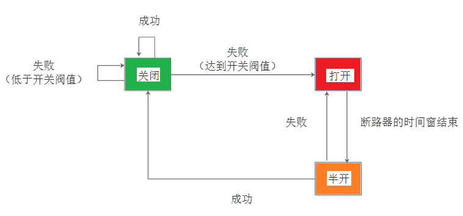

- Closed：关闭状态（**前健康状况高于设定阈值**），所有请求正常访问
- Open：打开状态（**当前健康状况低于设定阈值**），所有请求静止通过，如果设置了fallback方法，则进入该流程
- Half Open：半开状态（**当断路器开关处于打开状态，经过一段时间后，断路器会自动进入半开状态。这时断路器只允许一个请求通过；当该请求调用成功时，断路器恢复到关闭状态；若该请求失败，断路器继续保持打开状态，接下来的请求会被禁止通过**）


断路器的开关由关闭到打开的状态是通过当前服务健康状况（服务的健康状况=请求失败数/请求总数）和设定阈值（默认为5秒内的20次故障）比较决定的。当断路器开关关闭时，请求被允许通过断路器，如果当前健康状况高于设定阈值，开关继续保持关闭；如果当前健康状况低于设定阈值，开关则切换为打开状态。当断路器开关打开时，请求被禁止通过；如果设置了fallback方法，则会进入fallback的流程。当断路器开关处于打开状态，经过一段时间后，断路器会自动进入半开状态，这时断路器只允许一个请求通过；当该请求调用成功时，断路器恢复到关闭状态；若该请求失败，断路器继续保持打开状态，接下来的请求会被禁止通过。

#### 5.3.2.2 服务降级方法

pring Cloud Hystrix能保证服务调用者在调用异常服务时快速的返回结果，避免大量的同步等待，这是通过HystrixCommand的fallback方法实现的。

**熔断器的核心：线程隔离和服务降级。**

- 线程隔离：是指Hystrix为每个依赖服务调用一个小的线程池，如果线程池用尽，调用立即被拒绝，默认不采用排队。
- 服务降级(兜底方法)：优先保证核心服务，而非核心服务不可用或弱可用。触发Hystrix服务降级的情况：线程池已满、请求超时。

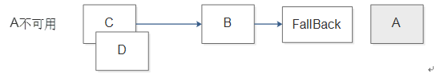

虽然A服务仍然不可用，但采用fallback的方式可以给用户一个友好的提示结果，这样就避免了其他服务的崩溃问题。 

## 5.4 入门程序

目标：服务提供者的服务出现了故障，服务消费者快速失败给用户友好提示。体验服务降级好处。

### 5.4.1 添加依赖

在服务消费方工程（eureka_client_consumer）添加hystrix依赖

~~~xml
<!--开启熔断器-->
<dependency>
    <groupId>org.springframework.cloud</groupId>
    <artifactId>spring-cloud-starter-netflix-hystrix</artifactId>
</dependency>
~~~


### 5.4.2 开启熔断器注解

在消费方工程的启动类中添加开启熔断器的注解：**@EnableCircuitBreaker**；或者直接添加一个组合注解：**@SpringCloudApplication**。

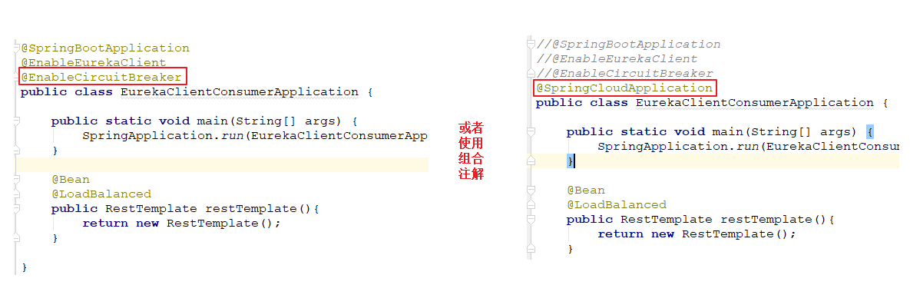


### 5.4.3 编写服务降级方法

<!--注意：因为熔断的降级逻辑方法跟正常逻辑方法一样，必须保证相同的参数列表和返回值相同-->

#### 5.4.3.1 方法上服务降级

在消费方工程的controller中，添加服务降级方法：

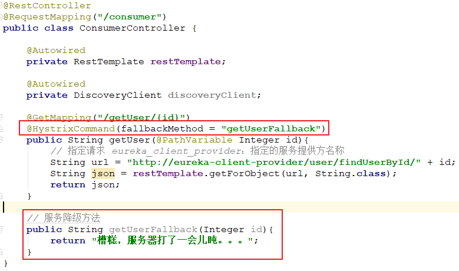

~~~java
@GetMapping("/getUser/{id}")
@HystrixCommand(fallbackMethod = "getUserFallback")
public String getUser(@PathVariable Integer id){
    // 指定请求 eureka_client_provider：指定的服务提供方名称
    String url = "http://eureka-client-provider/user/findUserById/" + id;
    String json = restTemplate.getForObject(url, String.class);
    return json;
}

// 服务降级方法
public String getUserFallback(Integer id){
    return "槽糕，服务器打了一会儿盹。。。";
}
~~~


#### 5.4.3.2 类上服务降级

- 刚才把fallback写在了某个业务方法上，如果方法很多，可以将FallBack配置加在类上，实现默认FallBack
- @DefaultProperties(defaultFallback=”defaultFallBack“)，在类上，指明统一的失败降级方法

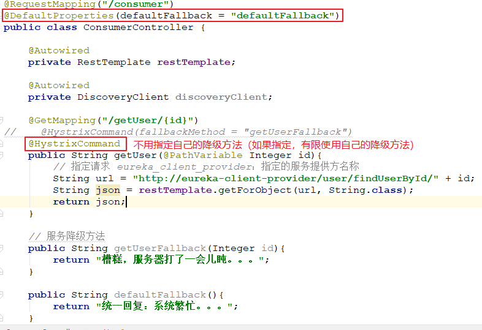


## 5.5 熔断策略

### 5.5.1 常见熔断策略

常见熔断策略配置：

- 熔断后休眠时间：sleepWindowInMilliseconds
- 熔断触发最小请求次数：requestVolumeThreshold
- 熔断触发错误比例阈值：errorThresholdPercentage
- 熔断超时时间：timeoutInMilliseconds


### 5.5.2 配置熔断策略

在服务**消费方工程**配置如下内容：

~~~yaml
# 无注解版 ，Threshold阈值的含义
hystrix:
  command:
    default:
      circuitBreaker:
        forceOpen: false
        errorThresholdPercentage: 50
        sleepWindowInMilliseconds: 10000
        requestVolumeThreshold: 10
      execution:
        isolation:
          thread:
            timeoutInMilliseconds: 2000

# 配置熔断策略：
hystrix:
  command:
    default:
      circuitBreaker:
        # 强制打开熔断器 默认false关闭的。测试配置是否生效
        forceOpen: false
        # 触发熔断错误比例阈值，默认值50%
        errorThresholdPercentage: 50
        # 熔断后休眠时长，默认值5秒
        sleepWindowInMilliseconds: 5000
        # 熔断触发最小请求次数，默认值是20
        requestVolumeThreshold: 10
      execution:
        isolation:
          thread:
            # 熔断超时设置，默认为1秒
            timeoutInMilliseconds: 2000
~~~

### 5.5.3 测试熔断超时时间

在服务提供方，让线程休眠超过2秒中（例如休息5秒中），这个时候会走Fallback方法（因为在熔断策略配置当中，我们配置了熔断超时时间为2秒中，一旦超过2秒，则认为被调用的服务挂了，因此走Fallback【兜底】方法）。

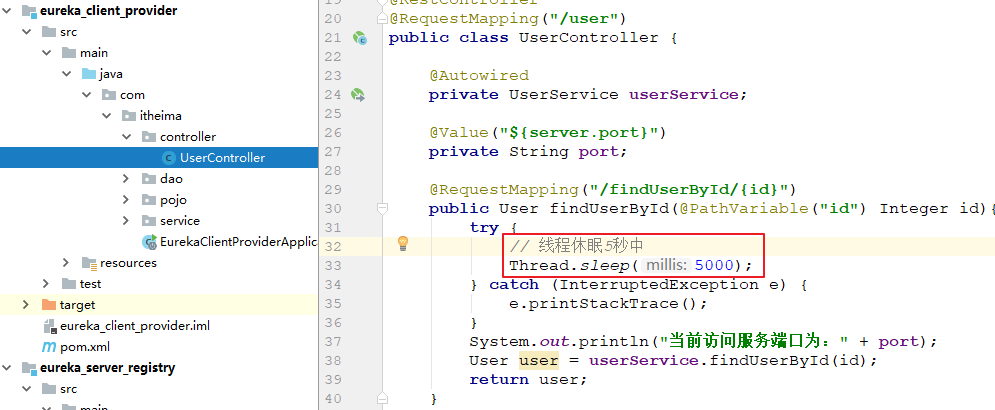

### 5.5.4 测试熔断错误比例

- 在**服务消费方**编写抛出异常的代码（**记得把提供方线程休眠的代码删除**），如下：

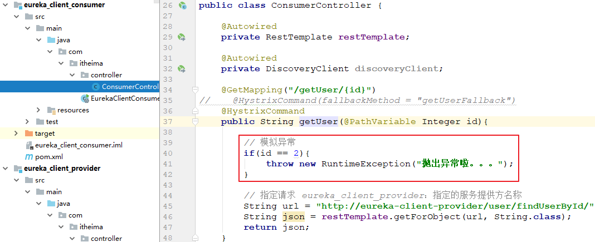


- 如何测试：

  - 访问<http://localhost:8080/consumer/getUser/2> 访问10次以上，那么这个时候访问id= 1的用户信息无法访问到，需要等待熔断休眠后（默认5秒）  防止恶意请求，就可以正常访问id=1的用户了。
  - 访问<http://localhost:8080/consumer/getUser/1 访问10次以上，再次访问id=2的用户信息超过5次，再次访问id为1的用户信息则无法访问到，错误请求占比正常请求达到50%。


多：

1、远程调用

2、eureka注册中心

2、负载均衡

3、熔断器

