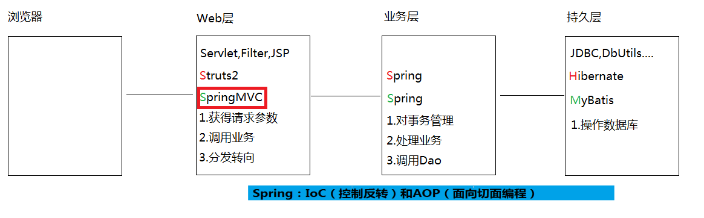
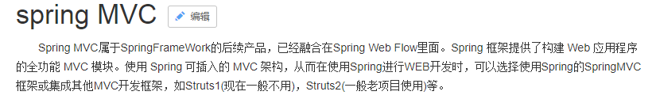
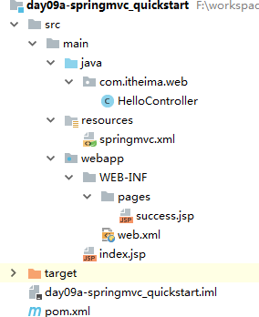
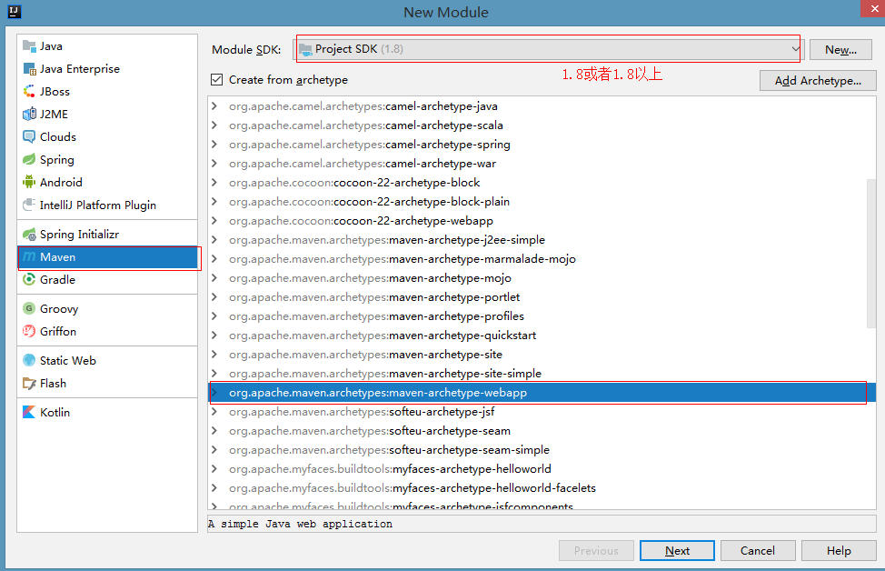
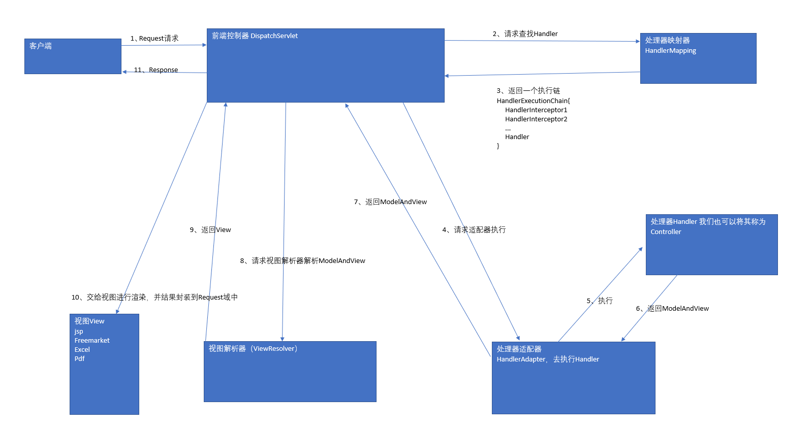
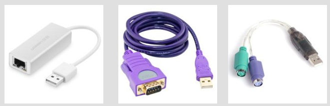
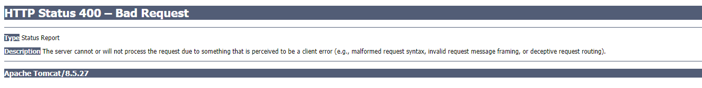

# Spring5mvc第一天 

# 学习目标

- [ ] 介绍SpringMVC框架
- [ ] 能够实现SpringMVC的环境搭建
- [ ] 掌握RequestMapping的使用
- [ ] 掌握SpringMVC的参数绑定
- [ ] 掌握SpringMVC的自定义类型转换器的使用
- [ ] 掌握SpringMVC的常用注解
- [ ] 掌握PathVariable注解

# 第一章-SpringMVC介绍

## 知识点-SpringMVC概述

### 1.目标

- [ ] 介绍SpringMVC框架

### 2.路径

1. 三层架构(SpringMVC在三层架构的位置)
2. 什么是SpringMVC

3. SpringMVC 的优点

### 3.讲解

#### 3.1三层架构




​	咱们开发服务器端程序，一般都基于两种形式，一种C/S架构程序，一种B/S架构程序. 使用Java语言基本上都是开发B/S架构的程序，B/S架构又分成了三层架构.

- 三层架构

  ​	表现层：WEB层，用来和客户端进行数据交互的。表现层一般会采用MVC的设计模型

  ​	业务层：处理公司具体的业务逻辑的

  ​	持久层：用来操作数据库的

- MVC全名是Model View Controller 模型视图控制器，每个部分各司其职。

  ​	Model：数据模型，JavaBean的类，用来进行数据封装。   

  ​	View：指JSP、HTML用来展示数据给用户				   

  ​	Controller：用来接收用户的请求，整个流程的控制器。用来进行数据校验等

#### 3.2什么是SpringMVC



- 用我们自己的话来说:SpringMVC 是一种基于Java实现的MVC设计模型的请求驱动类型的轻量级WEB层框架。

- 作用:  
  
  1. 参数绑定(获得请求参数)
  2. 调用业务
  3. 响应
  
  

#### 3.3SpringMVC 的优点

1.清晰的角色划分：
​	前端控制器（DispatcherServlet）  
​	请求到处理器映射（HandlerMapping）
​	处理器适配器（HandlerAdapter）
​	视图解析器（ViewResolver）
​	处理器或页面控制器（Controller）
​	验证器（ Validator）
​	命令对象（Command 请求参数绑定到的对象就叫命令对象）
​	表单对象（Form Object 提供给表单展示和提交到的对象就叫表单对象）。
2、分工明确，而且扩展点相当灵活，可以很容易扩展，虽然几乎不需要。
3、由于命令对象就是一个 POJO，无需继承框架特定 API，可以使用命令对象直接作为业务对象。
4、和 Spring 其他框架无缝集成，是其它 Web 框架所不具备的。
5、可适配，通过 HandlerAdapter 可以支持任意的类作为处理器。
6、可定制性， HandlerMapping、 ViewResolver 等能够非常简单的定制。
7、功能强大的数据验证、格式化、绑定机制。
8、利用 Spring 提供的 Mock 对象能够非常简单的进行 Web 层单元测试。
9、本地化、主题的解析的支持，使我们更容易进行国际化和主题的切换。
10、强大的 JSP 标签库，使 JSP 编写更容易。
………………还有比如RESTful风格的支持、简单的文件上传、约定大于配置的契约式编程支持、基于注解的零配
置支持等等。 

### 4.小结

1. SpringMVC 位于web层
2. SpringMVC: Spring家族web层的一个框架,作用
   + 参数绑定(获得请求参数)
   + 调用业务
   + 响应


# 第二章-SpringMVC入门

## 案例-SpringMVC的快速入门

### 1.需求

​		浏览器请求服务器(SpringMVC), 响应成功页面

### 2.分析

1. 创建Maven工程(war),导入坐标
2. 创建Controller类,创建一个方法, 添加注解
3. 创建springmvc.xml(包扫描, 注册视图解析器)
4. 配置web.xml


### 3.实现

 

#### 3.1 创建web项目,引入坐标



```xml

	<!-- 版本锁定 -->
	<properties>
		<spring.version>5.0.2.RELEASE</spring.version>
	</properties>

	<dependencies>
		<dependency>
			<groupId>org.springframework</groupId>
			<artifactId>spring-context</artifactId>
			<version>${spring.version}</version>
		</dependency>

		<dependency>
			<groupId>org.springframework</groupId>
			<artifactId>spring-web</artifactId>
			<version>${spring.version}</version>
		</dependency>

		<dependency>
			<groupId>org.springframework</groupId>
			<artifactId>spring-webmvc</artifactId>
			<version>${spring.version}</version>
		</dependency>

		<dependency>
			<groupId>javax.servlet</groupId>
			<artifactId>servlet-api</artifactId>
			<version>2.5</version>
			<scope>provided</scope>
		</dependency>

		<dependency>
			<groupId>javax.servlet.jsp</groupId>
			<artifactId>jsp-api</artifactId>
			<version>2.0</version>
			<scope>provided</scope>
		</dependency>
	</dependencies>
```

#### 3.2编写Controller

```java
@Controller
public class HelloController {

    @RequestMapping(value="/hello")
    public String sayHello(){
        System.out.println("HelloController 的 sayHello 方法执行了。。。。 ");
        return "success";
    }
}
```

#### 3.3编写SpringMVC的配置文件

+ 在classpath目录下创建springmvc.xml

```xml
<?xml version="1.0" encoding="UTF-8"?>
<beans xmlns="http://www.springframework.org/schema/beans"
       xmlns:mvc="http://www.springframework.org/schema/mvc"
       xmlns:context="http://www.springframework.org/schema/context"
       xmlns:xsi="http://www.w3.org/2001/XMLSchema-instance"
       xsi:schemaLocation="
        http://www.springframework.org/schema/beans
        http://www.springframework.org/schema/beans/spring-beans.xsd
        http://www.springframework.org/schema/mvc
        http://www.springframework.org/schema/mvc/spring-mvc.xsd
        http://www.springframework.org/schema/context
        http://www.springframework.org/schema/context/spring-context.xsd">
    <!-- 配置spring创建容器时要扫描的包 -->
    <context:component-scan base-package="com.itheima"></context:component-scan>
    <!-- 配置视图解析器 -->
    <bean id="viewResolver" class="org.springframework.web.servlet.view.InternalResourceViewResolver">
        <property name="prefix" value="/WEB-INF/pages/"></property>
        <property name="suffix" value=".jsp"></property>
    </bean>

</beans>
```

#### 3.4在web.xml里面配置核心控制器 

```xml
<?xml version="1.0" encoding="UTF-8"?>
<web-app xmlns:xsi="http://www.w3.org/2001/XMLSchema-instance" xmlns="http://java.sun.com/xml/ns/javaee" xsi:schemaLocation="http://java.sun.com/xml/ns/javaee http://java.sun.com/xml/ns/javaee/web-app_2_5.xsd" id="WebApp_ID" version="2.5">
  <welcome-file-list>
    <welcome-file>index.html</welcome-file>
    <welcome-file>index.htm</welcome-file>
    <welcome-file>index.jsp</welcome-file>
    <welcome-file>default.html</welcome-file>
    <welcome-file>default.htm</welcome-file>
    <welcome-file>default.jsp</welcome-file>
  </welcome-file-list>
  <servlet>
    <servlet-name>SpringMVC</servlet-name>
    <servlet-class>org.springframework.web.servlet.DispatcherServlet</servlet-class>
    <!-- 配置初始化参数，用于读取 SpringMVC 的配置文件 -->
    <init-param>
      <param-name>contextConfigLocation</param-name>
      <param-value>classpath:springmvc.xml</param-value>
    </init-param>
    <!-- 配置 servlet 的对象的创建时间点：应用加载时创建。取值只能是非 0 正整数，表示启动顺序 -->
    <load-on-startup>1</load-on-startup>
  </servlet>
  <servlet-mapping>
    <servlet-name>SpringMVC</servlet-name>
    <url-pattern>/</url-pattern>
  </servlet-mapping>
</web-app>
```

#### 3.5测试

```
<a href="${pageContext.request.contextPath }/hello">SpringMVC入门</a>
```

### 4.小结

1. 创建Maven工程(war), 导入坐标
2. 创建Controller类, 创建一个方法, 添加注解
3. 创建springmvc.xml(开启包扫描, 注册视图解析器)
4. 配置web.xml(前端控制器)


## 知识点-入门案例的执行过程及原理分析

### 1.目标

- [ ] 掌握入门案例的执行过程

### 2.路径

1. 入门案例加载流程
2. SpringMVC 的请求响应流程 
3. 入门案例中涉及的组件 

### 3.讲解 

#### 3.1入门案例加载流程

1、服务器启动，应用被加载。 读取到 web.xml 中的配置创建 spring 容器并且初始化容器中的对象。 
2、浏览器发送请求，被 DispatherServlet 捕获，该 Servlet 并不处理请求，而是把请求转发出去。转发的路径是根据请求 	URL，匹配@RequestMapping 中的内容。
3、匹配到了后，执行对应方法。该方法有一个返回值。
4、根据方法的返回值，借助 InternalResourceViewResolver 找到对应的结果视图。
5、渲染结果视图，响应浏览器 

#### 3.2SpringMVC 的请求响应流程  【面试】


##### 自画版



#### 3.3入门案例中涉及的组件  

+ DispatcherServlet：前端控制器 

  ​	用户请求到达前端控制器，它就相当于 mvc 模式中的 c， dispatcherServlet 是整个流程控制的中心，由
  它调用其它组件处理用户的请求， dispatcherServlet 的存在降低了组件之间的耦合性。 

+ HandlerMapping：处理器映射器    

  ​	HandlerMapping 负责根据用户请求找到 Handler 即处理器， SpringMVC 提供了不同的映射器实现不同的
  映射方式，例如：配置文件方式，实现接口方式，注解方式等。 

+ Handler：处理器 (自己写的Controller类)

  ​	它就是我们开发中要编写的具体业务控制器。由 DispatcherServlet 把用户请求转发到 Handler。由
  Handler 对具体的用户请求进行处理。 

+ HandlAdapter：处理器适配器 

  ​	通过 HandlerAdapter 对处理器进行执行，这是适配器模式的应用，通过扩展适配器可以对更多类型的处理
  器进行执行。 

  

+ View Resolver：视图解析器  

  ​	View Resolver 负责将处理结果生成 View 视图， View Resolver 首先根据逻辑视图名解析成物理视图名
  即具体的页面地址，再生成 View 视图对象，最后对 View 进行渲染将处理结果通过页面展示给用户。 

+ View：视图 

  ​	SpringMVC 框架提供了很多的 View 视图类型的支持，包括：jsp ,  jstlView、 freemarkerView、 pdfView等。我们最常用的视图就是 jsp。
  ​	一般情况下需要通过页面标签或页面模版技术将模型数据通过页面展示给用户，需要由程序员根据业务需求开发具体的页面。 

`<mvc:annotation-driven>` 注解说明 :

​	在 SpringMVC 的各个组件中，处理器映射器、处理器适配器、视图解析器称为 SpringMVC 的三大组件。使 用 	`<mvc:annotation-driven>`  自 动 加 载 RequestMappingHandlerMapping （ 处 理 映 射 器 ）RequestMappingHandlerAdapter （ 处 理 适 配 器 ） ， 可 用 在 SpringMVC.xml 配 置 文 件 中 使 用
  `<mvc:annotation-driven/>` 替代注解处理器和适配器的配置(默认情况下不配置也是可以使用的)。 

### 4.小结

1. 服务器启动的时候 就会初始化Spring容器(web.xml配置了启动项), 初始化所有的单例bean
2. 来了请求, 经过DispatcherServlet. 调度其它的组件进行处理, 处理的结果都需要汇报给DispatcherServlet


## 知识点-RequestMapping注解详解

### 1.目标

- [ ] 掌握RequestMapping的使用

### 2.路径

1. 介绍RequestMapping作用
2. RequestMapping的使用的位置
3. RequestMapping的属性

### 3.讲解

#### 3.1RequestMapping作用

​	RequestMapping注解的作用是建立请求URL和处理方法之间的对应关系

​	RequestMapping注解可以作用在方法和类上

#### 3.2RequestMapping的使用的位置

+ 使用在类上:

  ​	 请求 URL 的第一级访问目录。此处不写的话，就相当于应用的根目录。 写的话需要以/开头 .它出现的目的是为了使我们的 URL 可以按照模块化管理 

+ 使用在方法上:

  ​	请求 URL 的第二级访问目录 

```java
@Controller
@RequestMapping("/account")
public class AccountController {
    @RequestMapping("/add")
    public String add(){
        System.out.println("添加账户");
        return "success";
    }
    @RequestMapping("/deletet")
    public String deletet(){
        System.out.println("删除账户");
        return "success";
    }
    @RequestMapping("/update")
    public String update(){
        System.out.println("更新账户");
        return "success";
    }
}

<h3>绝对路径的写法</h3>
<a href="${pageContext.request.contextPath }/account/add">添加账户</a><br/>
<a href="${pageContext.request.contextPath }/account/delete">删除账户</a><br/>
<a href="${pageContext.request.contextPath }/account/update">更新账户</a><br/>
<hr/>
<h3>相对路径的写法</h3>
<a href="account/add">添加账户</a><br/>
<a href="account/delete">删除账户</a><br/>
<a href="account/update">更新账户</a><br/>
```

#### 3.3RequestMapping的属性

##### 3.3.1掌握的属性

+ path:	 指定请求路径的url

```java
@RequestMapping(path = "/delete")
public String deletet(){
    System.out.println("删除账户");
    return "success";
}
```

+ value:       value属性和path属性是一样的

```java
@RequestMapping(value = "/delete")
public String deletet(){
    System.out.println("删除账户");
    return "success";
}
```

+ method :    指定该方法的请求方式

```java
//只能接受post方式请求
@RequestMapping(value = "/add",method ={RequestMethod.POST} )
 public String add(){
    System.out.println("添加账户");
    return "success";
}
```

##### 3.3.2了解的属性

+ params:   指定限制请求参数的条件

```java
//请求参数必须是money=18,如果不是,则会报错(HTTP Status 400 – Bad Request)
@RequestMapping(value = "/add",params = {"money=18"})
 public String add(){
     System.out.println("添加账户");
     return "success";
}

<a href="${pageContext.request.contextPath }/account/add?money=19">添加账户</a><br/> //会报错
```

+ headers:  发送的请求中必须包含的请求头

```java
 //请求头必须有content-type=text/*,否则就会报错
 @RequestMapping(value = "/add",headers ="content-type=text/*" )
 public String add(){
      System.out.println("添加账户");
      return "success";
}
```

### 4.小结

1. RequestMapping: URL和方法进行绑定

2. RequestMapping定义位置

   + 类上面
   + 方法上面

   > 如果类上面使用了, 方法上面也使用了. 访问:  类上面的RequestMapping/方法上面的RequestMapping

3. 属性

   + value/path: 访问的路径(可以配置多个)
   + method: 配置访问的请求方式(可以配置多个, 默认就是任何请求方式都可以)


# 第三章-SpringMVC进阶

## 知识点-请求参数的绑定【重点】

### 1.目标

- [ ] 掌握SpringMVC的参数绑定

### 2.分析

+ 绑定机制

  ​	表单提交的数据都是key=value格式的(username=zs&password=123),SpringMVC的参数绑定过程是把表单提交的请求参数，作为控制器中方法的参数进行绑定的(要求：提交表单的name和参数的名称是相同的)

+ 支持的数据类型

  ​	基本数据类型和字符串类型

  ​	实体类型（JavaBean）

  ​	集合数据类型（List、map集合等）

+ 使用要求

  + 如果是基本类型或者 String 类型： 要求我们的参数名称必须和控制器中方法的形参名称保持一致。 (严格区分大小写) .
  + 如果是 POJO 类型，或者它的关联对象： 要求表单中参数名称和 POJO 类的属性名称保持一致。并且控制器方法的参数类型是 POJO 类型 .
  + 如果是集合类型,有两种方式： 第一种：要求集合类型的请求参数必须在 POJO 中。在表单中请求参数名称要和 POJO 中集合属性名称相同。给 List 集合中的元素赋值， 使用下标。给 Map 集合中的元素赋值， 使用键值对。第二种：接收的请求参数是 json 格式数据。需要借助一个注解实现 

### 3.讲解

#### 3.1基本类型和 String 类型作为参数 

+ 前端页面

```
<a href="account/add?name=zs&money=19000.5">添加账户</a>
```

+ AccountController

```java
@Controller
@RequestMapping("/account")
public class AccountController {
    @RequestMapping(value = "/add")
    public String add(String name,double money) {
        System.out.println("name=" + name);
        System.out.println("money=" + money);
        System.out.println("添加账户...");
        return "success";
    }
```

#### 3.2POJO 类型作为参数

+ pojo(Account和Address)

```java
public class Address implements Serializable{

    private String provinceName;
    private String cityName;
    
	//省略了set/get...
}

public class Account implements Serializable {

    private Integer id;
    private String name;
    private double money;

    private Address address;
    
	//省略了set/get...
}
```

+ 前端页面

```html
<h3>二,pojo类型</h3>
<form  action="account/update" method="post">
    账户名称： <input type="text" name="name" ><br/>
    账户金额： <input type="text" name="money" ><br/>
    账户省份： <input type="text" name="address.provinceName" ><br/>
    账户城市： <input type="text" name="address.cityName" ><br/>
    <input type="submit" value="保存">
</form>
```

+ AccountController.java

```java
   //要求表单中参数名称和 POJO 类的属性名称保持一致。并且控制器方法的参数类型是 POJO 类型 .
    @RequestMapping("/update")
    public String update(Account account) {
        System.out.println("更新账户..."+account);
        return "success";
    }
```

 

#### 3.3POJO 类中包含集合类型参数 

##### 3.3.1 POJO 类中包含List

+ User

```java
public class User implements Serializable {
    private String username;
    private String password;
    private Integer age;
    private List<Account> accounts;
 	//省略了set/get... 	 
 }
```

+ 前端页面

```html
<h3>1.POJO 类中包含List</h3>
<form action="account/delete" method="post">
    用户名称： <input type="text" name="username" ><br/>
    用户密码： <input type="password" name="password" ><br/>
    用户年龄： <input type="text" name="age" ><br/>
    账户 1 名称： <input type="text" name="accounts[0].name" ><br/>
    账户 1 金额： <input type="text" name="accounts[0].money" ><br/>
    账户 2 名称： <input type="text" name="accounts[1].name" ><br/>
    账户 2 金额： <input type="text" name="accounts[1].money" ><br/>
    <input type="submit" value="保存">
</form>
```

+ AccountController.java

```java
    @RequestMapping("/delete")
    public String delete(User user) {
        System.out.println("删除账户..."+user);
        return "success";
    }
```

##### 3.3.2 POJO 类中包含Map

+ User02.java

```java
public class User02 implements Serializable {

    private String username;
    private String password;
    private Integer age;
    private Map<String,Account> accountMap;
    //省略了set/get... 
}
```

+ 页面

```html
<h3>2.POJO 类中包含Map</h3>
<form action="account/findAll" method="post">
    用户名称： <input type="text" name="username" ><br/>
    用户密码： <input type="password" name="password" ><br/>
    用户年龄： <input type="text" name="age" ><br/>
    账户 1 名称： <input type="text" name="accountMap['one'].name" ><br/>
    账户 1 金额： <input type="text" name="accountMap['one'].money" ><br/>
    账户 2 名称： <input type="text" name="accountMap['two'].name" ><br/>
    账户 2 金额： <input type="text" name="accountMap['two'].money" ><br/>
    <input type="submit" value="保存">
</form>
```

+ AccountController.java

```java
    @RequestMapping("/findAll")
    public String findAll(User02 user02) {
        System.out.println("查询账户..."+user02);
        return "success";
    }
```

### 4.小结

1. 请求参数类型是简单(基本,String)类型
   + 方法的形参和请求参数的name一致就可以
2. 请求参数类型是pojo对象类型
   + 形参就写pojo对象
   + pojo的属性必须和请求参数的name一致就可以
3. 请求参数类型是pojo对象类型, 包含集合
   + 形参就写pojo对象
   + pojo的属性必须和请求参数的name一致就可以
   + 如果包含List,  list的属性名[下标].pojo属性名
   + 如果包含map,  map的属性名[key].pojo属性名


## 知识点-请求参数细节和特殊情况

### 1.目标

- [ ] 掌握乱码处理和自定义类型转换器

### 2.路径

1. 请求参数乱码处理
2. 自定义类型转换器
3. 使用 ServletAPI 对象作为方法参数

### 3.讲解

#### 3.1请求参数乱码处理

+ 在web.xml里面配置编码过滤器 

```xml
<!-- 配置spring提供的字符集过滤器 -->
	<filter>
		<filter-name>CharacterEncodingFilter</filter-name>
		<filter-class>org.springframework.web.filter.CharacterEncodingFilter</filter-class>
		<!-- 配置初始化参数，指定字符集 -->
		<init-param>
			<param-name>encoding</param-name>
			<param-value>UTF-8</param-value>
		</init-param>
	</filter>
	<filter-mapping>
		<filter-name>CharacterEncodingFilter</filter-name>
		<url-pattern>/*</url-pattern>
	</filter-mapping>
```

#### 3.2自定义类型转换器 

​	默认情况下,SpringMVC已经实现一些数据类型自动转换。 内置转换器全都在：		`org.springframework.core.convert.support ` 包下 ,如遇特殊类型转换要求，需要我们自己编写自定义类型转换器。 

```java
java.lang.Boolean -> java.lang.String : ObjectToStringConverter
java.lang.Character -> java.lang.Number : CharacterToNumberFactory
java.lang.Character -> java.lang.String : ObjectToStringConverter
java.lang.Enum -> java.lang.String : EnumToStringConverter
java.lang.Number -> java.lang.Character : NumberToCharacterConverter
java.lang.Number -> java.lang.Number : NumberToNumberConverterFactory
java.lang.Number -> java.lang.String : ObjectToStringConverter
java.lang.String -> java.lang.Boolean : StringToBooleanConverter
java.lang.String -> java.lang.Character : StringToCharacterConverter
java.lang.String -> java.lang.Enum : StringToEnumConverterFactory
java.lang.String -> java.lang.Number : StringToNumberConverterFactory
java.lang.String -> java.util.Locale : StringToLocaleConverter
java.lang.String -> java.util.Properties : StringToPropertiesConverter
java.lang.String -> java.util.UUID : StringToUUIDConverter
java.util.Locale -> java.lang.String : ObjectToStringConverter
java.util.Properties -> java.lang.String : PropertiesToStringConverter
java.util.UUID -> java.lang.String : ObjectToStringConverter
 ....
```

##### 3.2.1场景 

+ 页面

```html
<a href="account/saveAccount?birthday=1987-08-10">日期类型转换</a>
```

+ AccountController.java

```java
  @RequestMapping("saveAccount")
    public String saveAccount(Date birthday){
        System.out.println("saveAccount="+birthday);
        return "success";
    }
```

+ 报错了:



##### 3.2.2自定义类型转换器 

步骤:

1. 创建一个类实现Converter 接口
2. 配置类型转换器

实现:

+ 定义一个类，实现 Converter 接口

  该接口有两个泛型,,S:表示接受的类型， T：表示目标类型(需要转的类型)

```java
public class StringToDateConverter implements Converter<String,Date> {
    @Nullable
    @Override
    public Date convert(String s) {
        try {
            if(StringUtils.isEmpty(s)){
                throw  new RuntimeException("字符串不能为null");
            }
            SimpleDateFormat dateFormat = new SimpleDateFormat("yyyy-MM-dd");
            return dateFormat.parse(s);
        } catch (ParseException e) {
            e.printStackTrace();
            return  null;
        }
    }
}
```

+ 在springmvc.xml里面配置转换器

  spring 配置类型转换器的机制是，将自定义的转换器注册到类型转换服务中去 

```xml
  <!-- 配置类型转换器 -->
    <bean id="converterService"
          class="org.springframework.context.support.ConversionServiceFactoryBean">
        <!-- 给工厂注入一个新的类型转换器 -->
        <property name="converters">
            <array>
                <!-- 配置自定义类型转换器 -->
                <bean class="com.itheima.web.StringToDateConverter"></bean>
            </array>
        </property>
    </bean>
```

+ 在 annotation-driven 标签中引用配置的类型转换服务 

```xml
<!--配置Spring开启mvc注解-->
<mvc:annotation-driven conversion-service="converterService"></mvc:annotation-driven>
```

#### 3.3使用 ServletAPI 对象作为方法参数

​	SpringMVC 还支持使用原始 ServletAPI 对象作为控制器方法的参数。我们可以把它们直接写在控制的方法参数中使用。 支持原始 ServletAPI 对象有 : 

​	HttpServletRequest

​	HttpServletResponse

​	HttpSession

​	java.security.Principal

​	Locale

​	InputStream

​	OutputStream

​	Reader

​	Writer

+ 页面

```html
<a href="account/testServletAPI?name=zs">使用 ServletAPI 对象作为方法参数</a>
```

+ AccountController.java

```java
    @RequestMapping("/testServletAPI")
    public String testServletAPI(HttpServletRequest request, HttpServletResponse response, HttpSession session){
        System.out.println("request="+request);
        System.out.println("response="+response);
        System.out.println("session="+session);
        return "success";
    }
```

### 4.小结

1. 处理post乱码  直接在web.xml 配置编码过滤器
2. 类型转换器
   + 创建一个类实现Converter 
   + 在springmvc.xml进行配置
3. 直接方法的形参里面绑定requet, response. session...
   + 前提是pom导入相关的坐标

## 知识点-常用注解 

### 1.目标

- [ ] 掌握常用注解 

### 2.路径

1. @RequestParam 【重点】
2. @RequestBody  【重点】
3. @PathVariable  【重点】
4. @RequestHeader【了解】
5. @CookieValue【了解】


### 3.讲解

#### 3.1RequestParam【重点】 

##### 3.1.1使用说明

+ 作用：

  把请求中指定名称的参数给控制器中的形参赋值。 

+ 属性

  value： 请求参数中的名称。
  required：请求参数中是否必须提供此参数。 默认值： true。表示必须提供，如果不提供将报错。 

  defaultValue:默认值

##### 3.1.2使用实例

+ 页面

```html
<a href="user/testRequestParam?name=张三">测试RequestParam </a>
```

+ UserController.java

```java
@Controller
@RequestMapping("/user")
public class UserController {
    @RequestMapping("/testRequestParam")
    public String testRequestParam(@RequestParam(value = "name",required = true,defaultValue = "李四") String username){
        System.out.println("username="+username);
        return "success";
    }
}
```

#### 3.2.RequestBody【重点】 

请求体: post方式的请求参数,get方式没有请求体

Get和Post区别

1. get方式 请求参数拼接在请求路径后面, post 方式 请求参数在请求体里面
2. get方式 请求参数浏览器地址栏可见,  post 方式 请求参数浏览器地址栏不可见
3. get方式 请求参数大小有限制的, post 方式请求参数大小没有限制的

##### 3.2.1使用说明

+ 作用

  1.用于获取请求体内容。 直接使用得到是 key=value&key=value...结构的字符串。

  2.把获得json类型的数据转成pojo对象(后面再讲)

  注意: get 请求方式不适用。 

+ 属性

  required：是否必须有请求体。默认值是:true。当取值为 true 时,get 请求方式会报错。如果取值为 false， get 请求得到是 null。 

##### 3.2.2使用实例

+ 页面

```html
<form  action="user/testRequestBody " method="post">
    用户名:<input type="text" name="username"/><br/>
    密码:<input type="password" name="password"/><br/>
    <input type="submit" value="测试RequestBody"/>
</form>
```

+ UserController.java

```java
   @RequestMapping("testRequestBody")
    public String testRequestBody(@RequestBody String queryStr){
        System.out.println("queryStr="+queryStr);
        return "success";
    }
```


#### 3.3.PathVariable【重点】 

##### 3.3.1REST 风格 URL   

​	REST（英文： Representational State Transfer，简称 REST）描述了一个架构样式的网络系统，比如 web 应用程序。它首次出现在 2000 年 Roy Fielding 的博士论文中，他是 HTTP 规范的主要编写者之一。在目前主流的三种 Web 服务交互方案中， REST 相比于 SOAP（Simple Object Access protocol，简单对象访问协议）以及 XML-RPC 更加简单明了，无论是对 URL 的处理还是对 Payload 的编码， REST 都倾向于用更加简单轻量的方法设计和实现。值得注意的是 REST 并没有一个明确的标准，而更像是一种设计的风格。它本身并没有什么实用性，其核心价值在于如何设计出符合 REST 风格的网络接口。

+ restful 的优点

  它结构清晰、符合标准、易于理解、 扩展方便，所以正得到越来越多网站的采用。

+ restful 的特性：

  ​	资源（Resources） ： 网络上的一个实体，或者说是网络上的一个具体信息。它可以是一段文本、一张图片、一首歌曲、一种服务，总之就是一个具体的存在。可以用一个 URI（统一资源定位符）指向它，每种资源对应一个特定的 URI 。要获取这个资源，访问它的 URI 就可以，因此 URI 即为每一个资源的独一无二的识别符。表现层（Representation） ： 把资源具体呈现出来的形式，叫做它的表现层 （Representation）。比如，文本可以用 txt 格式表现，也可以用 HTML 格式、 XML 格式、 JSON 格式表现，甚至可以采用二进制格式。状态转化（State Transfer） ： 每 发出一个请求，就代表了客户端和服务器的一次交互过程。HTTP 协议，是一个无状态协议，即所有的状态都保存在服务器端。因此，如果客户端想要操作服务器，必须通过某种手段， 让服务器端发生“ 状态转化” （State Transfer）。而这种转化是建立在表现层之上的，所以就是 “ 表现层状态转化” 。具体说，就是 HTTP 协议里面，四个表示操作方式的动词： GET 、 POST 、 PUT、DELETE。它们分别对应四种基本操作： GET 用来获取资源， POST 用来新建资源， PUT 用来更新资源， DELETE 用来删除资源 .

  

+ 实例      

```
保存
	传统：http://localhost:8080/user/save
	REST：http://localhost:8080/user						    POST方式	执行保存

更新
	传统：http://localhost:8080/user/update?id=1
	REST：http://localhost:8080/user/1					    PUT方式	执行更新   1代表id

删除	
	传统：http://localhost:8080/user/delete?id=1
	REST：http://localhost:8080/user/1				       DELETE方式	执行删除 1代表id  

查询
	传统：http://localhost:8080/user/findAll
	REST：http://localhost:8080/user						  GET方式	查所有

	传统：http://localhost:8080/user/findById?id=1
	REST：http://localhost:8080/user/1 					  GET方式	根据id查1个
```

##### 3.3.2使用说明

+ 作用：

  用于绑定 url 中的占位符。 例如：请求 url 中 /delete/{id}， 这个{id}就是 url 占位符。
  url 支持占位符是 spring3.0 之后加入的。是 springmvc 支持 rest 风格 URL 的一个重要标志。

+ 属性：

  value： 用于指定 url 中占位符名称。
  required：是否必须提供占位符。 

##### 3.3.3使用实例

+ 页面

```
<a href="user/testPathVaribale/1">测试PathVaribale</a><br/>
```

+ UserController.java

```java
 @RequestMapping("testPathVaribale/{id}")
 public String testPathVaribale(@PathVariable(value = "id") Integer id){
     System.out.println("id="+id);
       return "success";
}
```


#### 3.4.RequestHeader【了解】 

##### 3.4.1使用说明

+ 作用：
  用于获取请求消息头。
+ 属性：
  value：提供消息头名称
  required：是否必须有此消息头 

##### 3.4.2使用实例

+ 页面

```
<a href="user/testRequestHeader">测试RequestHeader</a><br/>
```

+ UserController.java

```java
    @RequestMapping("testRequestHeader")
    public String testRequestHeader(@RequestHeader(value = "User-Agent") String requestHeader){
        System.out.println("requestHeader="+requestHeader);
        return "success";
    }
```


#### 3.5.CookieValue【了解】 

##### 3.5.1使用说明

+ 作用：

  用于把指定 cookie 名称的值传入控制器方法参数。

+ 属性：

  value：指定 cookie 的名称。
  required：是否必须有此 cookie。 

##### 3.5.2使用实例

+ 页面

```
<a href="user/testCookieValue">测试CookieValue</a><br/>
```

+ UserController.java

```java
    @RequestMapping("testCookieValue")
    public String testCookieValue(@CookieValue(value="JSESSIONID") String sessionId){
        System.out.println("sessionId="+sessionId);
        return "success";
    }
```

#### 3.6.ModelAttribute 【课后自学】

##### 3.6.1使用说明

+ 作用：

  ​	该注解是 SpringMVC4.3 版本以后新加入的。它可以用于修饰方法和参数。

  ​	出现在方法上，表示当前方法会在控制器的方法执行之前，先执行。它可以修饰没有返回值的方法，也可以修饰有具体返回值的方法。

  ​	出现在参数上，获取指定的数据给参数赋值。

+ 属性：
  value：用于获取数据的 key。 key 可以是 POJO 的属性名称，也可以是 map 结构的 key。

+ 应用场景：
  当表单提交数据不是完整的实体类数据时，保证没有提交数据的字段使用数据库对象原来的数据。
  例如：
  ​        我们在编辑一个用户时，用户有一个创建信息字段，该字段的值是不允许被修改的。在提交表单数
  ​         据是肯定没有此字段的内容，一旦更新会把该字段内容置为 null，此时就可以使用此注解解决问题。 

##### 3.6.2使用实例

+ 页面

```html
<form action="user/testModelAttribute" method="post">
    用户名:<input type="text" name="username"/><br/>
    密码:<input type="text" name="password"/><br/>
    <input type="submit" value="testModelAttribute"/>
</form>
```

+ UserController.java(用在方法上面)

```java
    @RequestMapping("/testModelAttribute")
    public String  testModelAttribute(User user){
        System.out.println("testModelAttribute ...收到了请求..."+user);
        return  "success";
    }

    @ModelAttribute
    public User  getModel(String username,String password){
        System.out.println("getModel ...收到了请求...");
        //模拟查询数据库, 把性别也查询出来
        User user = new User();
        user.setUsername(username);
        user.setUsername(password);
        user.setSex("男");
        return  user;
    }
```

+ UserController.java(用在参数上面)

```java
    @RequestMapping("/testModelAttribute")
    public String  testModelAttribute(@ModelAttribute("u") User user){
        System.out.println("testModelAttribute ...收到了请求..."+user);
        return  "success";
    }

    @ModelAttribute
	//没有返回值
    public void  getModel(String username, String password, Map<String,User> map){
        System.out.println("getModel ...收到了请求...");
        //模拟查询数据库, 把性别也查询出来
        User user = new User();
        user.setUsername(username);
        user.setUsername(password);
        user.setSex("男");
        map.put("u",user);
    }
```

#### 3.7.SessionAttributes 【课后自学】

##### 3.7.1使用说明

+ 作用：

  用于多次执行(多次请求)控制器方法间的参数共享。(该注解定义在类上)

+ 属性：
  value：用于指定存入的属性名称
  type：用于指定存入的数据类型。 

##### 3.7.2使用实例

+ 页面

```java
<a href="sessionController/setAttribute?name=张三&age=18">测试SessionAttributes(存)</a><br/>
<a href="sessionController/getAttribute">测试SessionAttribute(取)</a><br/>
<a href="sessionController/removeAttribute">测试SessionAttribute(清空)</a><br/>
```

+ SessionController.java

```java
@Controller
@RequestMapping("/sessionController")
@SessionAttributes(value = {"name","age"})
public class SessionController {

    @RequestMapping("/setAttribute")
    public String setAttribute(String name, int age, Model model){
        model.addAttribute("name",name);
        model.addAttribute("age",age);
        return  "success";
    }

    @RequestMapping("/getAttribute")
    public String getAttribute(ModelMap modelMap){
        System.out.println("name="+modelMap.get("name"));
        System.out.println("age="+modelMap.get("age"));
        return  "success";
    }

    @RequestMapping("/removeAttribute")
    public String removeAttribute(SessionStatus sessionStatus){
        sessionStatus.setComplete();
        return  "success";
    }

}
```

# 总结

## 一.SpringMVC概念

1. SpringMVC web层一个框架
2. 作用:
   + 获得请求参数(绑定参数)
   + 调用业务
   + 响应

## 二,SpringMVC入门

### 1.入门步骤

1. 创建Maven工程(war) 添加坐标
2. 创建Controller类 定义方法 添加注解
3. 创建springmvc.xml(开启包扫描, 注册视图解析器, 开启注解驱动)
4. 配置web.xml(配置前端控制器, 编码过滤器)

## 三,参数绑定

1. 简单类型
2. pojo对象
3. pojo对象包含集合
4. 乱码处理
5. 自定义类型转换器
6. 绑定WEB阶段API

## 四,注解

1. @RequestParam
2. @RequestBody
3. @PathVariable

