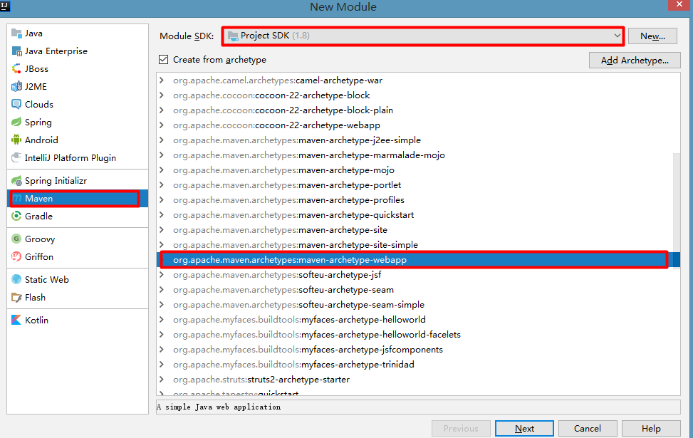
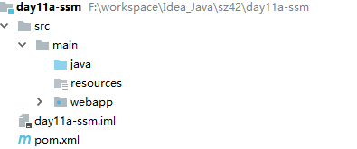
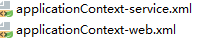

# Spring5MVC 第三天-SSM整合

# 学习目标 

- [ ] 掌握ssm整合（SpringMVC+spring+mybatis)   

# 第一章-环境的准备

## 知识点-SSM整合环境的准备

### 1.目标

- [ ] 能够独立准备SSM环境

### 2.步骤

1. 创建数据库和表
2. 创建Maven工程(war)
   + 导入坐标
   + 创建实体类
   + 拷贝log4J日志到工程


### 3.讲解

#### 3.1创建数据库和表结构 

```mysql
create database ssm;
use ssm;
create table account(
    id int primary key auto_increment,
    name varchar(40),
    money double
)character set utf8 collate utf8_general_ci;

insert into account(name,money) values('zs',1000);
insert into account(name,money) values('ls',1000);
insert into account(name,money) values('ww',1000);
```

#### 3.2创建Maven工程

+ 创建web项目





+ 导入坐标 

```xml
<properties>
		<spring.version>5.0.2.RELEASE</spring.version>
		<slf4j.version>1.6.6</slf4j.version>
		<log4j.version>1.2.12</log4j.version>
		<mysql.version>5.1.6</mysql.version>
		<mybatis.version>3.4.5</mybatis.version>
</properties>

	<dependencies>

	  <!-- spring -->
    <dependency>
      <groupId>org.aspectj</groupId>
      <artifactId>aspectjweaver</artifactId>
      <version>1.6.8</version>
    </dependency>

    <dependency>
      <groupId>org.springframework</groupId>
      <artifactId>spring-aop</artifactId>
      <version>${spring.version}</version>
    </dependency>

    <dependency>
      <groupId>org.springframework</groupId>
      <artifactId>spring-context</artifactId>
      <version>${spring.version}</version>
    </dependency>

    <dependency>
      <groupId>org.springframework</groupId>
      <artifactId>spring-web</artifactId>
      <version>${spring.version}</version>
    </dependency>

    <dependency>
      <groupId>org.springframework</groupId>
      <artifactId>spring-webmvc</artifactId>
      <version>${spring.version}</version>
    </dependency>

    <dependency>
      <groupId>org.springframework</groupId>
      <artifactId>spring-test</artifactId>
      <version>${spring.version}</version>
    </dependency>

    <dependency>
      <groupId>org.springframework</groupId>
      <artifactId>spring-tx</artifactId>
      <version>${spring.version}</version>
    </dependency>

    <dependency>
      <groupId>org.springframework</groupId>
      <artifactId>spring-jdbc</artifactId>
      <version>${spring.version}</version>
    </dependency>

    <dependency>
      <groupId>junit</groupId>
      <artifactId>junit</artifactId>
      <version>4.12</version>
      <scope>compile</scope>
    </dependency>

    <dependency>
      <groupId>mysql</groupId>
      <artifactId>mysql-connector-java</artifactId>
      <version>${mysql.version}</version>
    </dependency>

    <dependency>
      <groupId>javax.servlet</groupId>
      <artifactId>servlet-api</artifactId>
      <version>2.5</version>
      <scope>provided</scope>
    </dependency>

    <dependency>
      <groupId>javax.servlet.jsp</groupId>
      <artifactId>jsp-api</artifactId>
      <version>2.0</version>
      <scope>provided</scope>
    </dependency>

    <dependency>
      <groupId>jstl</groupId>
      <artifactId>jstl</artifactId>
      <version>1.2</version>
    </dependency>

    <!-- log start -->
    <dependency>
      <groupId>log4j</groupId>
      <artifactId>log4j</artifactId>
      <version>${log4j.version}</version>
    </dependency>

    <dependency>
      <groupId>org.slf4j</groupId>
      <artifactId>slf4j-api</artifactId>
      <version>${slf4j.version}</version>
    </dependency>

    <dependency>
      <groupId>org.slf4j</groupId>
      <artifactId>slf4j-log4j12</artifactId>
      <version>${slf4j.version}</version>
    </dependency>
    <!-- log end -->
    <dependency>
      <groupId>org.mybatis</groupId>
      <artifactId>mybatis</artifactId>
      <version>${mybatis.version}</version>
    </dependency>

    <dependency>
      <groupId>org.mybatis</groupId>
      <artifactId>mybatis-spring</artifactId>
      <version>1.3.0</version>
    </dependency>

    <dependency>
      <groupId>com.alibaba</groupId>
      <artifactId>druid</artifactId>
      <version>1.0.14</version>
    </dependency>

	</dependencies>
```

+ 编写实体类 

```java
public class Account implements Serializable {
    private Integer id;
    private String name;
    private double money;

    public Integer getId() {
        return id;
    }

    public void setId(Integer id) {
        this.id = id;
    }

    public String getName() {
        return name;
    }

    public void setName(String name) {
        this.name = name;
    }

    public void setMoney(double money) {
        this.money = money;
    }

    public double getMoney() {
        return money;
    }

    @Override
    public String toString() {
        return "Account{" +
                "id=" + id +
                ", name='" + name + '\'' +
                ", money=" + money +
                '}';
    }
}
```

+ 拷贝log4J配置文件到工程 

### 4.小结

1. 坐标(Spring整合MyBatis)

```xml
<dependency>
    <groupId>org.mybatis</groupId>
    <artifactId>mybatis-spring</artifactId>
    <version>1.3.0</version>
</dependency>
```

2. 工程承建war


# 第二章-Spring整合SpringMVC

## 知识点-初级版本(SpringMVC独立运行)

### 1.目标

- [ ] 初步版本(SpringMVC独立运行)

### 2.步骤

1. 创建AccountController, 定义方法 添加注解
2. 创建springmvc.xml(开启包扫描, 注册视图解析器,忽略静态资源, 注解驱动)
3. 配置web.xml(前端控制器, 编码过滤器)
4. 测试


### 3.实现

+ 创建AccountController.java

```java
@Controller
@RequestMapping("/account")
public class AccountController {
    @RequestMapping("/findAll")
    public String findAll(){
        System.out.println("AccountController findAll()");
        return  "success";
    }
}
```

+ 创建springmvc.xml配置文件

```xml
<?xml version="1.0" encoding="UTF-8"?>
<beans xmlns="http://www.springframework.org/schema/beans"
       xmlns:mvc="http://www.springframework.org/schema/mvc"
       xmlns:context="http://www.springframework.org/schema/context"
       xmlns:xsi="http://www.w3.org/2001/XMLSchema-instance"
       xsi:schemaLocation="
        http://www.springframework.org/schema/beans
        http://www.springframework.org/schema/beans/spring-beans.xsd
        http://www.springframework.org/schema/mvc
        http://www.springframework.org/schema/mvc/spring-mvc.xsd
        http://www.springframework.org/schema/context
        http://www.springframework.org/schema/context/spring-context.xsd">

    <!--开启包扫描-->
    <context:component-scan base-package="com.itheima"></context:component-scan>

    <!--配置视图解析器-->
    <bean class="org.springframework.web.servlet.view.InternalResourceViewResolver">
        <property name="prefix" value="/WEB-INF/pages"></property>
        <property name="suffix" value=".jsp"></property>
    </bean>
    <!--配置注解驱动支持-->
    <mvc:annotation-driven></mvc:annotation-driven>
  
    <!-- 设置静态资源不过滤 -->
    <mvc:resources location="/css/" mapping="/css/**"/>  <!-- 样式 -->
    <mvc:resources location="/images/" mapping="/images/**"/>  <!-- 图片 -->
    <mvc:resources location="/js/" mapping="/js/**"/>  <!-- javascript -->
</beans>
```

+ 在web.xml里面配置前端控制器

```xml
  <servlet>
    <servlet-name>springmvc</servlet-name>
    <servlet-class>org.springframework.web.servlet.DispatcherServlet</servlet-class>
    <init-param>
      <param-name>contextConfigLocation</param-name>
      <param-value>classpath:springmvc.xml</param-value>
    </init-param>
    <load-on-startup>1</load-on-startup>
  </servlet>
  <servlet-mapping>
    <servlet-name>springmvc</servlet-name>
    <url-pattern>/</url-pattern>
  </servlet-mapping>

  <!--编码过滤器-->
  <filter>
    <filter-name>CharacterEncodingFilter</filter-name>
    <filter-class>org.springframework.web.filter.CharacterEncodingFilter</filter-class>
    <init-param>
      <param-name>encoding</param-name>
      <param-value>UTF-8</param-value>
    </init-param>
  </filter>
  <filter-mapping>
    <filter-name>CharacterEncodingFilter</filter-name>
    <url-pattern>/*</url-pattern>
  </filter-mapping>
```

### 4.小结

1. 创建Controller, 创建方法 添加注解
2. 创建springmvc.xml(开启包扫描, 注册视图解析器,忽略静态资源,开启注解驱动)
3. 配置web.xml(前端控制器, 编码过滤器)


## 知识点-终极版本(注入业务层)

### 1.目标

- [ ] 终极版本(注入业务层)

### 2.步骤

1. 注册Service
2. 在Controller里面注入Service

### 3.讲解

+ 编写AccountService.java

```java
public interface AccountService {
	void save(Account account);
	
     List<Account> findAll();
}
```

+ 编写AccountServiceImpl.java

```java
@Service("accountService")
public class AccountServiceImpl implements AccountService {
    @Override
    public List<Account> findAll() {
        System.out.println("AccountServiceImpl findAll()");
        return null;
    }
    @Override
    public void save(Account account) {
    }
}
```

+ 在AccountController调用AccountService

```java
@Controller
@RequestMapping("account")
public class AccountController {

    @Autowired
    private AccountService accountService;

    @RequestMapping("findAll")
    public String findAll(){
        System.out.println("AccountController findAll()");
        accountService.findAll();
        return  "success";
    }
}
```

### 4.小结

1. 包扫描 ` com.itheima`,
   + 注册Service的时候, 直接在Service类上面添加@Service
   + 在Controller注入Service的时候, 添加@AutoWired


# 第三章-Spring整合MyBatis

## 知识点-初级版本(MyBatis独立运行)

### 1.目标  

- [ ] 初级版本(MyBatis独立运行)

### 2.步骤

1. 创建Dao接口, 定义方法, 添加注解
2. 创建SqlMapConfig.xml
3. 编写Java代码测试


### 3.实现

+ 创建AccountDao.java, 添加注解

```java
public interface AccountDao {

    @Insert("insert into account(name,money) values(#{name},#{money})")
    void save(Account account);
    
    @Select("select * from account")
    List<Account> findAll();
}
```

+ 编写MyBatis核心配置文件:SqlMapConfig.xml

```xml
<?xml version="1.0" encoding="UTF-8" ?>
<!DOCTYPE configuration
        PUBLIC "-//mybatis.org//DTD Config 3.0//EN"
        "http://mybatis.org/dtd/mybatis-3-config.dtd">
<configuration>
    <environments default="development">
        <environment id="development">
            <transactionManager type="JDBC"/>
            <dataSource type="POOLED">
                <property name="driver" value="com.mysql.jdbc.Driver"/>
                <property name="url" value="jdbc:mysql://localhost:3306/ssm"/>
                <property name="username" value="root"/>
                <property name="password" value="123456"/>
            </dataSource>
        </environment>
    </environments>
    <mappers>
       <package name="com.itheima.dao"></package>
    </mappers>
</configuration>
```

+ 测试运行结果 

```java
public class DbTest {
    @Test
    public void fun01(){
        Account account = new Account();
        account.setName("test");
        account.setMoney(5000f);

        SqlSessionFactory sessionFactory = new SqlSessionFactoryBuilder().build(DbTest.class.getClassLoader().getResourceAsStream("SqlMapConfig.xml"));
        SqlSession sqlSession = sessionFactory.openSession();
        AccountDao accountDao = sqlSession.getMapper(AccountDao.class);
        accountDao.save(account);
        sqlSession.commit();
        sqlSession.close();
    }

    @Test
    public void fun02(){
        
        SqlSessionFactory sessionFactory = new SqlSessionFactoryBuilder().build(DbTest.class.getClassLoader().getResourceAsStream("SqlMapConfig.xml"));
        SqlSession sqlSession = sessionFactory.openSession();
        AccountDao accountDao = sqlSession.getMapper(AccountDao.class);

        List<Account> list = accountDao.findAll();
        System.out.println(list);

        sqlSession.commit();
        sqlSession.close();
    }
}
```

### 4.小结

1. 创建Dao接口, 定义方法, 添加注解
2. 创建SqlMapConfig.xml
3. 编写Java代码


## 知识点-终极版本(注解版本)

### 1.目标

- [ ] 终极版本(注解版本)

### 2.分析

#### 2.1初级版本问题

1. 连接池还是用的MyBatis自带的=>用第三方的连接池,通过Spring管理
2. SqlSessionFactory还是我们自己构建的=>通过Spring管理SqlSessionFactory
3. 扫描Dao还是由MyBatis加载的=>通过Spring扫描Dao
4. 事务还是由MyBatis管理=>通过Spring管理事务

#### 2.2步骤

1. 创建applicationContext.xml
2. 注册DataSource(配置四个基本项)
3. 注册SqlSessionFactory
4. 扫描Dao接口
5. 配置事务
6. ==加载applicationContext.xml==
### 3.实现

​	在终极版本中:

​	1.把SqlSessionFactory交给Spring管理,也就意味着把 mybatis 配置文件（SqlMapConfig.xml）中内容配置到 spring 配置文件中同时，把 mybatis 配置文件的内容清掉。 

​	2.使用Spring管理事务

#### 3.1Spring 接管MyBatis的Session工厂

+ 创建applicationContext.xml

```xml
  <!--引入jdbc.properties-->
    <context:property-placeholder location="classpath:jdbc.properties"/>

     <!--注册数据源-->
    <bean id="dataSource" class="com.alibaba.druid.pool.DruidDataSource">
        <property name="driverClassName" value="${jdbc.driver}"></property>
        <property name="url" value="${jdbc.url}"></property>
        <property name="username" value="${jdbc.username}"></property>
        <property name="password" value="${jdbc.password}"></property>
    </bean>
    <!--注册SqlSessionFactory-->
    <bean id="sqlSessionFactory" class="org.mybatis.spring.SqlSessionFactoryBean">
        <!--注入数据源-->
        <property name="dataSource" ref="dataSource"></property>
        <!-- 加载 mybatis 的全局配置文件 -->
        <property name="configLocation" value="classpath:SqlMapConfig.xml" />
    </bean>

    <!--配置 Mapper 扫描器-->
    <bean class="org.mybatis.spring.mapper.MapperScannerConfigurer">
        <property name="basePackage" value="com.itheima.dao"/>
    </bean>
```

> 注意:由于我们使用的是代理 Dao 的模式， Dao 具体实现类由 MyBatis 使用代理方式创建，所以此时 mybatis配置文件不能删。

+ jdbc.properties

```properties
jdbc.driver=com.mysql.jdbc.Driver
jdbc.url=jdbc:mysql://localhost:3306/ssm
jdbc.username=root
jdbc.password=123456
```

#### 3.2配置 spring 的事务 

```xml
    <!--注册事务管理器-->
    <bean id="transactionManager" class="org.springframework.jdbc.datasource.DataSourceTransactionManager">
        <property name="dataSource" ref="dataSource"/>
    </bean>
    <!--配置事务建议(规则)-->
    <tx:advice transaction-manager="transactionManager" id="advice">
        <tx:attributes>
            <tx:method name="*" propagation="REQUIRED" read-only="false"/>
            <tx:method name="find*"  read-only="true"/>
            <tx:method name="select*"  read-only="true"/>
        </tx:attributes>
    </tx:advice>
    <!--配置AOP-->
    <aop:config>
        <aop:pointcut id="pointCut" expression="execution(* com.itheima.service.*.*(..))"></aop:pointcut>
        <aop:advisor advice-ref="advice" pointcut-ref="pointCut"/>
    </aop:config>
```

#### 3.3加载applicationContext.xml

1. 方式一:别写applicationContext.xml了, 直接把applicationContext.xml里面的配置定义在springmvc.xml

2. 方式二: 名字上面下功夫.

    

```
<!--初始化参数:加载配置文件-->
<init-param>
    <param-name>contextConfigLocation</param-name>
    <param-value>classpath:applicationContext*.xml</param-value>
</init-param>
```

3. 方式三: 在springmvc.xml 引入applicationContext.xml

​	applicationContext.xml已经写完了, 但是发现并没有被加载,也就意味着Spring整合MyBatis的部分并没有生效. 其实我们在Spring整合SpringMVC时候, 当服务器启动的时候已经加载过springmvc.xml, spring容器也就会被初始化. 我们可以通过==import标签==把applicationContext.xml导入到springmvc.xml中一起加载. 

​	在springmvc.xml中导入applicationContext.xml

```xml
  <import resource="classpath:applicationContext.xml"></import>
```

### 4.测试SSM整合结果

#### 4.1查询所有展示页面

+ AccountController.java

```java
@Controller
@RequestMapping("account")
public class AccountController {

    @Autowired
    private AccountService accountService;

    @RequestMapping("findAll")
    public String findAll(Model model) {
        System.out.println("AccountController findAll()");
        List<Account> list = accountService.findAll();
        System.out.println(list);
        model.addAttribute("list", list);
        return "success";
    }
}
```

+ AccountService.java

```java
@Service("accountService")
public class AccountServiceImpl implements AccountService {

    @Autowired
    private AccountDao accountDao;
    @Override
    public List<Account> findAll() {
        System.out.println("AccountServiceImpl findAll()");
        List<Account> list = accountDao.findAll();
        return list;
    }
}
```

+ AccountDao.java

```java
@Repository
public interface AccountDao {
    @Select("select * from account")
    List<Account> findAll();
}
```

+ 前端页面

```jsp
<%@ page contentType="text/html;charset=UTF-8" language="java" isELIgnored="false" %>
<%@ taglib  uri="http://java.sun.com/jsp/jstl/core" prefix="c"%>
<head>
    <title>成功页面</title>
</head>
<body>
<center>
    <h1>账户信息</h1>
    <table border="1px" width="500px" border="1px">
        <tr>
            <td>账户Id</td>
            <td>账户姓名</td>
            <td>金额</td>
        </tr>
        <c:forEach items="${list}" var="account">
            <tr>
                <td>${account.id}</td>
                <td>${account.name}</td>
                <td>${account.money}</td>
            </tr>
        </c:forEach>
    </table>
</center>

</body>
</html>
```

#### 4.2添加账户

+ 页面

```html
<form action="account/saveAccount" method="post">
    账户名称： <input type="text" name="name"/><br/>
    账户金额： <input type="text" name="money"><br/>
    <input type="submit" value="添加账户"/>
</form>
```

+ AccountController.java

```java
    @RequestMapping("saveAccount")
    public String saveAccount(Account account) {
        accountService.save(account);
        return "redirect:/account/findAll";
    }
```

+ AccountServiceImpl.java

```java
@Service("accountService")
public class AccountServiceImpl implements AccountService {

    @Autowired
    private AccountDao accountDao;
    @Override
    public void save(Account account) {
        accountDao.save(account);
    }
```

+ AccountDao.java

```java
@Repository
public interface AccountDao {
    @Insert("insert into account(name,money) values(#{name},#{money})")
    void save(Account account);
}
```

### 5.总结

#### 5.1Controller

1. 创建Controller, 定义方法 添加注解
2. 创建springmvc.xml
   + 开启包扫描
   + 注册视图解析器
   + 忽略静态资源
   + 配置注解驱动
3. 配置web.xml
   + 配置前端控制器
   + 配置编码过滤器
4. 注入Service

#### 5.2Service

1. 创建Service接口 实现类 , 注册
2. 创建applicationContext.xml
   + 配置事务管理器(注入数据源)
   + 配置事务建议
   + 配置AOP
3. 注入Dao

#### 5.3Dao

1. 创建Dao接口 定义方法 添加注解
2. 注册数据源(配置四个基本项)
3. 注册SqlSessionFactory(注入DataSource, 注入SqlMapConfig.xml)
4. 注册Dao扫描器


> applicationContext.xml导入到springmvc.xml
