# spring5mvc第二天

# 学习目标

- [ ] 掌握Controller的返回值使用
- [ ] 掌握Controller中的转发和重定向使用
- [ ] 掌握SpringMVC与json交互
- [ ] 掌握图片上传
- [ ] 掌握SpringMVC的统一异常处理
- [ ] 了解SpringMVC拦截器

# 第一章-响应数据和结果视图

## 知识点-返回值分类 

### 1.目标

- [ ] 掌握Controller的返回值使用

### 2.路径

1. 字符串 
2. void【了解】
3. ModelAndView 

### 3.讲解

#### 3.1字符串 

controller 方法返回字符串可以指定逻辑视图名，通过视图解析器解析为物理视图地址。

+ 页面

```
<a href="response/testReturnString">返回String</a><br>
```

+ Controller

```java
@Controller
@RequestMapping("/response")
public class ResponseController {
  
  	//指定逻辑视图名，经过视图解析器解析为 jsp 物理路径： /WEB-INF/pages/success.jsp
    @RequestMapping("/testReturnString")
    public String testReturnString(){
        System.out.println("testReturnString");
        return "success";
    }
}
```

#### 3.2void【了解】 

控制器方法返回值是void时:

​	如果控制器方法的参数中没有response对象

​		它的视图是以方法是RequestMapping的取值作为视图名称

​		如果类上也有RequestMapping，则类上的RequestMapping是其中的1级路径

​	如果控制器方法的参数中有response对象

​		则默认前往的jsp页面上无法显示内容

+ 页面

```html
<a href="response/testReturnVoid">void类型返回值</a><br>
```

+ Controller.java(没有response对象情况)

```java
@Controller
@RequestMapping("response")
public class ResponseController {
    @RequestMapping("testReturnVoid")
    public void testReturnVoid(){
        System.out.println("testReturnVoid");
    }

}
```

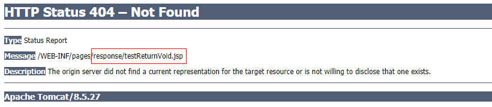

+ Controller.java(有response对象情况)

```java
    @RequestMapping("testReturnVoid")
    public void testReturnVoid(HttpServletRequest request, HttpServletResponse response) throws ServletException, IOException {
        System.out.println("testReturnVoid");
        //a.转发
        //request.getRequestDispatcher("/WEB-INF/pages/success.jsp").forward(request,response);

        //b.或者重定向
        response.sendRedirect("http://www.baidu.com");

        //c.或者response响应
        //response.getWriter().print("hello..");
    }
```

#### 3.3ModelAndView  

ModelAndView 是 SpringMVC 为我们提供的一个对象，该对象也可以用作控制器方法的返回值。 

+ 页面

```html
<a href="response/testReturnModelAndView">ModelAndView类型返回值</a><br>
```

+ Controller

```java
    @RequestMapping("testReturnModelAndView")
    public ModelAndView testReturnModelAndView() {
       ModelAndView mv = new ModelAndView();
        mv.addObject("name","张三");
        mv.addObject("age",18);

        mv.setViewName("success");

       return  mv;
    }
```

### 4.小结

1. 返回String.  返回值是逻辑视图, 通过视图解析器解析成物理视图
2. 返回void【了解】
3. 返回ModelAndView  
   + 设置数据  向request存
   + 设置视图  逻辑视图


## 知识点-转发和重定向

### 1.目标

- [ ] 掌握Controller中的转发和重定向使用

### 2.路径

1. forward 转发 
2. Redirect 重定向 

### 3.讲解

#### 3.1forward 转发 

​	controller 方法在提供了 String 类型的返回值之后，默认就是请求转发。我们也可以加上  `forward:`  可以转发到页面,也可以转发到其它的controller方法

+ 转发到页面

  ​	需要注意的是，如果用了 formward： 则路径必须写成实际视图 url，不能写逻辑视图。它相当于“request.getRequestDispatcher("url").forward(request,response)” 

```java
    //转发到页面
    @RequestMapping("forwardToPage")
    public String forwardToPage(){
        System.out.println("forwardToPage...");
        return "forward:/WEB-INF/pages/success.jsp";
    }
```

+ 转发到其它的controller方法

  语法: `forward:/类上的RequestMapping/方法上的RequestMapping`

```java
    //转发到其它controller
    @RequestMapping("forwardToOtherController")
    public String forwardToOtherController(){
        System.out.println("forwardToOtherController...");
        return "forward:/response/testReturnModelAndView";
    }
```

#### 3.2Redirect 重定向 

​	contrller 方法提供了一个 String 类型返回值之后， 它需要在返回值里使用: ` redirect: ` 同样可以重定向到页面,也可以重定向到其它controller

+ 重定向到页面

  ​	它相当于“response.sendRedirect(url)” 。需要注意的是，如果是重定向到 jsp 页面，则 jsp 页面不能写在 WEB-INF 目录中，否则无法找到。

```java
    //重定向到页面
    @RequestMapping("redirectToPage")
    public String redirectToPage(){
        System.out.println("redirectToPage...");
        return "redirect:/redirect.jsp";
    }
```

+ 重定向到其它的controller方法

  语法: `redirect:/类上的RequestMapping/方法上的RequestMapping`

```java
    //重定向到其它Controller
    @RequestMapping("redirectToOtherController")
    public String redirectToOtherController(){
        System.out.println("redirectToOtherController...");
        return "redirect:/response/testReturnModelAndView";
    }
```


### 4.小结

#### 4.1转发和重定向区别

1. 转发是一次请求, 重定向是两次请求
2. 转发路径不会变化, 重定向的路径会改变
3. 转发只能转发到内部的资源,重定向可以重定向到内部的(当前项目里面的)也可以是外部的(项目以外的)
4. 转发可以转发到web-inf里面的资源, 重定向不可以重定向到web-inf里面的资

#### 4.2 转发和重定向(返回String)

1. 转发到页面  

```
forward:/页面的路径
```

2. 转发到Controller

```
forward:/类上面的RequestMapping/方法上面的RequestMapping
```

3. 重定向到页面  

```
redirect:/页面的路径
```

4. 重定向到Controller

```
redirect:/类上面的RequestMapping/方法上面的RequestMapping
```


## 知识点-ResponseBody响应 json数据【重点】

### 1.目标

- [ ] 掌握SpringMVC与json交互

### 2.路径

1. 使用说明 
2. 使用示例 

### 3.讲解

#### 3.1使用说明 

​	该注解用于将 Controller 的方法返回的对象，通过 HttpMessageConverter 接口转换为指定格式的数据如： json,xml 等，通过 Response 响应给客户端 

#### 3.2使用示例 

需求: 发送Ajax请求,  使用@ResponseBody 注解实现将 controller 方法返回对象转换为 json 响应给客户端

步骤:

1. 导入jackson坐标
2. 把什么对象转json, 方法返回值就定义什么类型
3. 添加@ResponseBody注解

实现:

- 在springmvc.xml里面设置过滤资源

  DispatcherServlet会拦截到所有的资源(除了JSP)，导致一个问题就是静态资源（img、css、js）也会被拦截到，从而不能被使用。解决问题就是需要配置静态资源不进行拦截.

  语法: `<mvc:resources location="/css/" mapping="/css/**"/>`, location:webapp目录下的包,mapping:匹配请求路径的格式

  在springmvc.xml配置文件添加如下配置

```xml
<!-- 设置静态资源不过滤 -->
<mvc:resources location="/css/" mapping="/css/**"/>  <!-- 样式 -->
<mvc:resources location="/images/" mapping="/images/**"/>  <!-- 图片 -->
<mvc:resources location="/js/" mapping="/js/**"/>  <!-- javascript -->
```

- 页面

```html
    <h1>三,响应json</h1>
    <input id="btnId" type="button" value="发送Ajax请求"/><br/>

    <script>
        $(function () {
            $("#btnId").click(function () {
                $.post("response/testJson",{name:"zs",age:18},function (result) {
                    alert("result="+result);
                },"json");
            });
        });
    </script>
```

+ Springmvc 默认用 MappingJacksonHttpMessageConverter 对 json 数据进行转换，需要添加jackson依赖。

```xml
<dependency>
    <groupId>com.fasterxml.jackson.core</groupId>
    <artifactId>jackson-databind</artifactId>
    <version>2.9.0</version>
</dependency>
<dependency>
    <groupId>com.fasterxml.jackson.core</groupId>
    <artifactId>jackson-core</artifactId>
    <version>2.9.0</version>
</dependency>
<dependency>
    <groupId>com.fasterxml.jackson.core</groupId>
    <artifactId>jackson-annotations</artifactId>
    <version>2.9.0</version>
</dependency>
```

+ JsonController.java

```java
@Controller
@RequestMapping("/response")
public class ResponseController {
    @RequestMapping("/testJson") 
    public @ResponseBody User testJson(User user){
        System.out.println("收到了请求..."+user);
        user.setName("李四");
        return  user;
    }
}
```

### 4.小结

#### 4.1实现步骤

1. 添加jackson坐标
2. 把什么对象转成json, 方法的返回值就是什么类型
3. 在方法上面或者方法的返回值前面添加@ResponseBody

#### 4.2注意事项

1. Dispacher的路径是/ , 除了jsp以为所有的资源都匹配, 要使用JQ 忽略静态资源

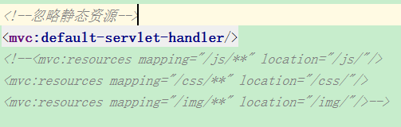 

# 第二章-SpringMVC 实现文件上传

## 知识点-文件上传介绍

### 1.目标

- [ ] 掌握文件上传的要求

### 2.路径

1. 文件上传概述
2. 文件上传要求
3. 常见的文件上传jar包和框架

### 3.讲解

#### 3.1文件上传概述

​	就是把客户端(浏览器)的文件保存一份到服务器 说白了就是文件的拷贝

#### 3.2文件上传要求 

##### 3.2.1浏览器端要求(通用浏览器的要求)

- 表单提交方式 post      
- 提供文件上传框(组件)  input type="file"
- 表单的entype属性必须为 `multipart/form-data`(没有这个属性值的话, 文件的内容是提交不过去的)

##### 3.2.2服务器端要求

​	要使用request.getInputStream()来获取数据. 

**注意:**

+ 若表单使用了 multipart/form-data ,使用原生request.getParameter()去获取参数的时候都为null

> 我们做文件上传一般会借助第三方组件(jar, 框架 SpringMVC)实现文件上传.

#### 3.3常见的文件上传jar包和框架

​	serlvet3.0 

​	commons-fileupload :  apache出品的一款专门处理文件上传的工具包 

​	struts2(底层封装了:commons-fileupload)   

​	==SpringMVC(底层封装了:commons-fileupload)==   

### 4.小结

1. 文件上传要求
   + post方式
   + 提供 `<input type="file"/>`
   + 表单的entype属性必须为 `multipart/form-data`
2. 我们会使用SpringMVC框架做文件上传, 底层封装了commons-fileupload 也就意味着我们使用的时候需要导入commons-fileupload依赖


## 案例-springmvc 传统方式文件上传 

### 1.需求

- [ ] 使用springmvc 完成传统方式文件上传 

### 2.步骤

1. 导入commons-fileupload坐标
2. 在控制器的方法里面设置MultipartFile 进行参数绑定
3. 进行文件上传
4. 配置文件上传解析器


### 3.实现

+ 创建前端页面

```html
<h1>一,springmvc传统方式文件上传</h1>
<form action="springmvc/fileUpload02" method="post" enctype="multipart/form-data">
    图片： <input type="file" name="upload"/><br/>
    图片描述:<input type="text" name="pdesc"/>
    <input type="submit" value="上传"/>
</form>
```


+ 创建Maven工程,添加依赖

```html
<dependency>
    <groupId>commons-fileupload</groupId>
    <artifactId>commons-fileupload</artifactId>
    <version>1.3.1</version>
</dependency>
```

+ 控制器

```java
    @RequestMapping("fileUpload02")
    public String fileUpload02(HttpServletRequest request, String pdesc, MultipartFile upload) throws IOException {
        System.out.println("pdesc="+pdesc);
        //1. 获得文件名
        String filename = upload.getOriginalFilename();
        //2. 获得随机文件名
        String uuidName = UploadUtils.getUUIDName(filename);
        //3. 获得绝对路径
        String basePath = request.getSession().getServletContext().getRealPath("/upload");
        //4. 获得两层目录
        String dir = UploadUtils.getDir();
        //5.创建两层目录
        File fileDir = new File(basePath, dir);
        if(!fileDir.exists()){
            fileDir.mkdirs();
        }
        //6.使用 MulitpartFile 接口中方法，把上传的文件写到指定位置
        upload.transferTo(new File(fileDir,uuidName));

        return  "success";
    }
```

+ 在springmvc.xml配置文件解析器 

  注意：文件上传的解析器 ==id 是固定的，不能起别的名称==，否则无法实现请求参数的绑定。（不光是文件，其他
  字段也将无法绑定） 

```xml
    <!--配置文件上传解析器-->
    <bean id="multipartResolver" class="org.springframework.web.multipart.commons.CommonsMultipartResolver">
        <!-- 设置上传文件的最大尺寸为 5MB --> 
        <property name="maxUploadSize" value="5242880"></property>
    </bean>
```

### 4.小结

#### 4.1步骤

1. 导入commons-fileupload坐标
2. Controller的方法里面进行参数绑定  MultipartFile
3. 文件上传
4. 配置文件上传的解析器

#### 4.2注意事项

1. Controller的方法里面参数绑定的形参必须和表单里面的name一致
2. 文件上传解析器的id是==固定值==

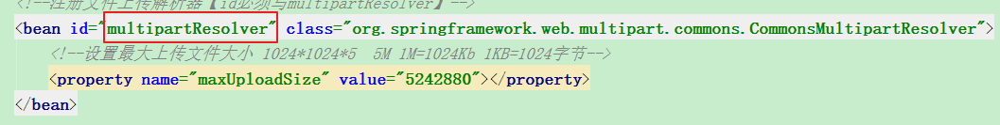 


## 案例-springmvc 跨服务器方式的文件上传 【了解】

### 1.需求

- [ ] 了解使用springmvc 跨服务器方式的文件上传 

### 2.分析

#### 2.1分服务器的目的 

在实际开发中，我们会有很多处理不同功能的服务器(注意：此处说的不是服务器集群)。 例如：

​	应用服务器(tomcat, nginx)：负责部署我们的应用 
​	数据库服务器(MySQL)：运行我们的数据库
​	缓存和消息服务器(MQ)：负责处理大并发访问的缓存和消息
​	文件服务器(nginx, tomcat, FastDFS)：负责存储用户上传文件的服务器。 

分服务器处理的目的是让服务器各司其职，从而提高我们项目的运行效率。 

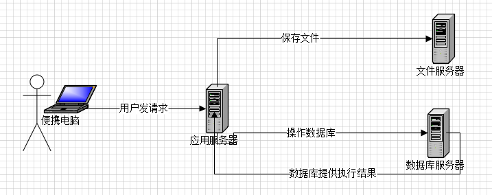

#### 2.2跨服务器方式的文件上传图解

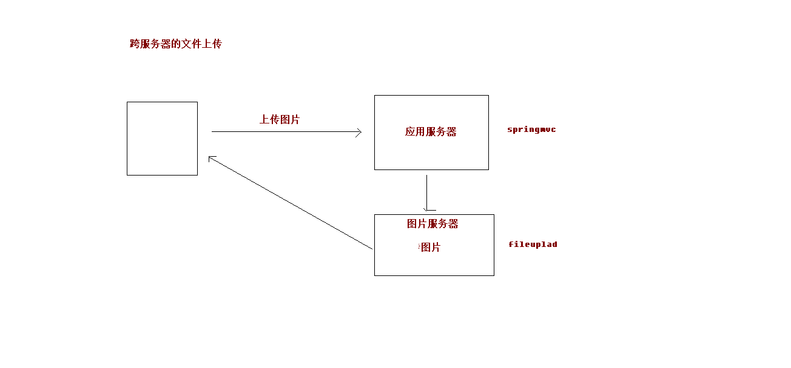

+ 准备两个服务器, 修改tomcat的的conf目录下的web.xml， 添加readonly参数为false

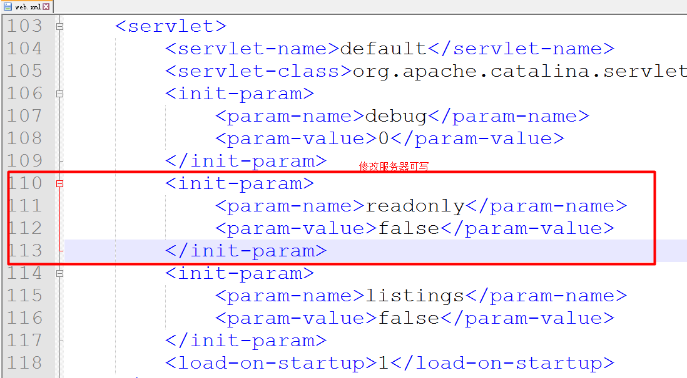

```xml
<init-param>
    <param-name>readonly</param-name>
    <param-value>false</param-value>
</init-param>
```

步骤:

1. 添jersey依赖 坐标
2. Controller的方法里面进行参数绑定  MultipartFile
3. 使用jersey API 进行跨服务器文件上传


### 3.实现

+ 添jersey依赖  

```xml
  		<dependency>
  			<groupId>com.sun.jersey</groupId>
  			<artifactId>jersey-core</artifactId>
  			<version>1.18.1</version>
  		</dependency>
  		<dependency>
  			<groupId>com.sun.jersey</groupId>
  			<artifactId>jersey-client</artifactId>
  			<version>1.18.1</version>
  		</dependency>
```

+ 前端页面

```html
<h1>二,springmvc 跨服务器方式的文件上传</h1>
<form action="springmvc/fileUpload03" method="post" enctype="multipart/form-data">
    图片： <input type="file" name="upload"/><br/>
    图片描述:<input type="text" name="pdesc"/>
    <input type="submit" value="上传"/>
</form>
```

+ 控制器

```java
	private static final String FILESERVERURL="http://localhost:9090/upload/";   

	@RequestMapping("fileUpload03")
    public String fileUpload03(String pdesc, MultipartFile upload) throws IOException {
        System.out.println("pdesc="+pdesc);
        //1. 获得文件名
        String filename = upload.getOriginalFilename();
        //2. 获得随机文件名
        String uuidName = UploadUtils.getUUIDName(filename);
        //3.创建jersey包中提供的client对象
        Client client = Client.create();//它就可以和文件服务器建立联系
        //4.使用client和文件服务器建立联系
        WebResource resource = client.resource(FILESERVERURL+uuidName);
        //5.把web资源对象写到文件服务器
        resource.put(upload.getBytes());
        return "success";
    }
```

### 4.小结

#### 4.1目的

+ 每个服务器各司其职, 提高效率

#### 4.2步骤

1. 准备服务器(tomcat设置为可写的)
2. 添加jersey坐标
3. Controller的方法里面进行参数绑定MultipartFile
4. 使用jersey的API进行跨服务器文件上传


# 第三章-SpringMVC 中的异常处理【重点】 

## 知识点-SpringMVC 中的异常处理

### 1.目标

- [ ] 掌握SpringMVC的统一异常处理

### 2.分析

​	系统中异常包括两类：预期异常和运行时异常RuntimeException，前者通过捕获异常从而获取异常信息，后者主要通过规范代码开发、测试通过手段减少运行时异常的发生。

       系统的dao、service、controller出现都通过throws Exception向上抛出，最后由springmvc前端控制器交由异常处理器进行异常处理，如下图：

​	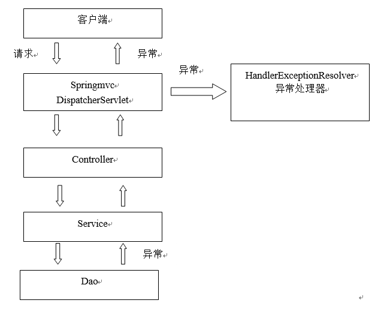

​	springmvc在处理请求过程中出现异常信息交由异常处理器进行处理，自定义异常处理器可以实现一个系统的异常处理逻辑。


### 3.代码实现

#### 3.1自定义异常类

目的: 统一的管理异常, 方便统一管理错误提示语【不是必须的】

```java
/**
 * 自定义异常类
 */
public class SysException extends  Exception{
    private String msg;
    public SysException(String msg) {
        this.msg = msg;
    }
    public void setMsg(String msg) {
        this.msg = msg;
    }
    public String getMsg() {
        return msg;
    }
}
```

#### 3.2自定义异常处理器

步骤:

1. 创建一个类实现HandlerExceptionResolver
2. 在springmvc.xml 注册异常处理器

实现:

```java
/**
 * 自定义异常处理器
 */
public class SysExceptionResolver implements HandlerExceptionResolver {

    @Nullable
    @Override
    public ModelAndView resolveException(HttpServletRequest request, HttpServletResponse response, @Nullable Object handler, Exception ex) {
        SysException sysException = null;
        if(ex instanceof SysException){
            sysException = (SysException) ex;
        }else{
            sysException = new SysException("服务器异常,请联系管理员");
        }
        ModelAndView mv = new ModelAndView();
        mv.setViewName("msg");
        mv.addObject("msg",sysException.getMsg());
        return mv;
    }
}
```

#### 3.3配置异常处理器 

+ 在springmvc.xml配置

```xml
 <!--注册异常处理器-->
<bean id="sysExceptionResolver" class="com.itheima.web.SysExceptionResolver"></bean>
```

### 4.小结

1. 创建一个类实现HandlerExceptionResolver
2. 在springmvc.xml 注册


# 第四章-SpringMVC 中的拦截器   

## 知识点-SpringMVC入门

### 1.目标

- [ ] 掌握SpringMVC基本使用

### 2.路径

1. 拦截器概述 
2. 自定义拦截器入门

### 3.讲解

#### 3.1.拦截器概述 

​	Spring MVC 的处理器拦截器类似于 Servlet 开发中的过滤器 Filter，用于对处理器(自己编写的Controller)进行预处理和后处理。用户可以自己定义一些拦截器来实现特定的功能。谈到拦截器，还要向大家提一个词——拦截器链（Interceptor Chain）。拦截器链就是将拦截器按一定的顺序联结成一条链。在访问被拦截的方法或字段时，拦截器链中的拦截器就会按其之前定义的顺序被调用。说到这里，可能大家脑海中有了一个疑问，这不是我们之前学的过滤器吗？是的它和过滤器是有几分相似，但
是也有区别，接下来我们就来说说他们的区别： 

| 类别   | 使用范围        | 拦截范围                        |
| ---- | ----------- | --------------------------- |
| 拦截器  | SpringMVC项目 | 只会拦截访问的控制器方法                |
| 过滤器  | 任何web项目     | 任何资源(servlet,控制器,jsp,html等) |

​	我们要想自定义拦截器， 要求必须实现： HandlerInterceptor 接口。 

#### 3.2.自定义拦截器入门

+ 编写一个普通类实现 HandlerInterceptor 接口 

```java
public class Intercepter01 implements HandlerInterceptor {
    @Override
    //在达到目标方法之前执行(拦截的方法)
    public boolean preHandle(HttpServletRequest request, HttpServletResponse response, Object handler) throws Exception {
        System.out.println("Intercepter01 收到了请求...");
        return true;//返回true放行, 返回false拦截
    }
}
```

+ 在springmvc.xml配置拦截器 

```xml
    <!--配置拦截器-->
    <mvc:interceptors>
        <mvc:interceptor>
            <!--用于指定拦截的路径-->
            <mvc:mapping path="/**"/>
            <bean id="intercepter01" class="com.itheima.web.interceptor.Intercepter01"></bean>
        </mvc:interceptor>
    </mvc:interceptors>
```

### 4.小结


## 知识点-自定义拦截器进阶

### 1.目标

- [ ] 掌握自定义拦截器的高级使用

### 2.路径

1. 拦截器的放行
2. 拦截后跳转
3. 拦截器的路径
4. 拦截器的其它方法
5. 多个拦截器执行顺序

### 3.讲解

#### 3.1拦截器的放行

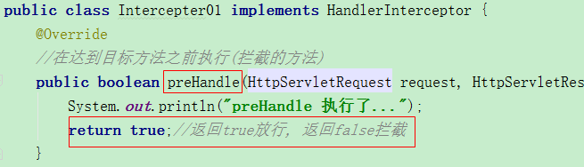

#### 3.2拦截后跳转

​	拦截器的处理结果，莫过于两种:

​		放行：  如果后面还有拦截器就执行下一个拦截器，如果后面没有了拦截器，就执行Controller方法

​		拦截： 但是注意，拦截后也需要返回到一个具体的结果(页面,Controller)。 

- 在preHandle方法返回false,通过request进行转发,或者通过response对象进行重定向,输出

```java
public class Intercepter01 implements HandlerInterceptor {
    @Override
    //在达到目标方法之前执行(拦截的方法)
    public boolean preHandle(HttpServletRequest request, HttpServletResponse response, Object handler) throws Exception {
        System.out.println("preHandle 执行了...");
        //转发到拦截后的页面
        //request.getRequestDispatcher("/intercepter01.jsp").forward(request,response);
        //转发到controller
        request.getRequestDispatcher("/demo01/fun02").forward(request,response);
        return false;//返回true放行, 返回false拦截
    }
```

#### 3.3拦截器的路径

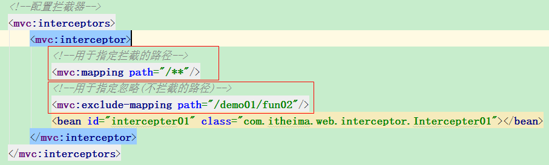

#### 3.4拦截器的其它方法

+ afterCompletion  在目标方法完成视图层渲染后执行。
+ postHandle  在被拦截的目标方法执行完毕获得了返回值后执行。
+ preHandle 被拦截的目标方法执行之前执行。

```java
public class Intercepter01 implements HandlerInterceptor {
    @Override
    //在达到目标方法之前执行(拦截的方法)
    public boolean preHandle(HttpServletRequest request, HttpServletResponse response, Object handler) throws Exception {
        System.out.println("preHandle 执行了...");
        return true;//返回true放行, 返回false拦截
    }
    @Override
    //在目标方法执行完成之后,完成页面渲染之前执行
    public void postHandle(HttpServletRequest request, HttpServletResponse response, Object handler, @Nullable ModelAndView modelAndView) throws Exception {
        System.out.println("postHandle 执行了...");
    }

    @Override
    //完成页面渲染之后执行
    public void afterCompletion(HttpServletRequest request, HttpServletResponse response, Object handler, @Nullable Exception ex) throws Exception {
        System.out.println("afterCompletion 执行了...");
    }
}
```

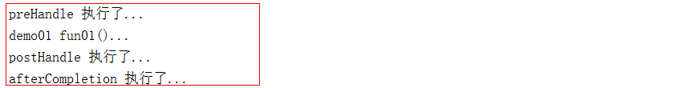


#### 3.5多个拦截器执行顺序

​	我们可以配置多个拦截器, 所以就存在一个优先级问题了.多个拦截器的优先级是按照配置的顺序决定的。 

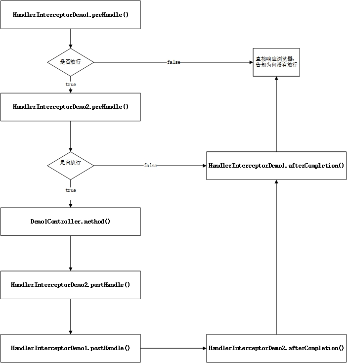

+ 配置顺序

```xml
    <!--配置拦截器-->
    <mvc:interceptors>
        <mvc:interceptor>
            <!--用于指定拦截的路径-->
            <mvc:mapping path="/**"/>
            <!--用于指定忽略(不拦截的路径)-->
            <mvc:exclude-mapping path="/demo01/fun02"/>
            <bean id="intercepter01" class="com.itheima.web.interceptor.Intercepter01"></bean>
        </mvc:interceptor>
        <mvc:interceptor>
            <!--用于指定拦截的路径-->
            <mvc:mapping path="/**"/>
            <!--用于指定忽略(不拦截的路径)-->
            <mvc:exclude-mapping path="/demo01/fun02"/>
            <bean id="intercepter02" class="com.itheima.web.interceptor.Intercepter02"></bean>
        </mvc:interceptor>
    </mvc:interceptors>
```

+ 结果

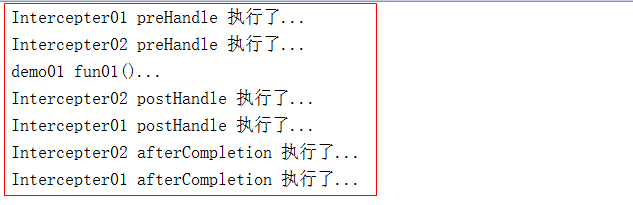


### 4.小结
