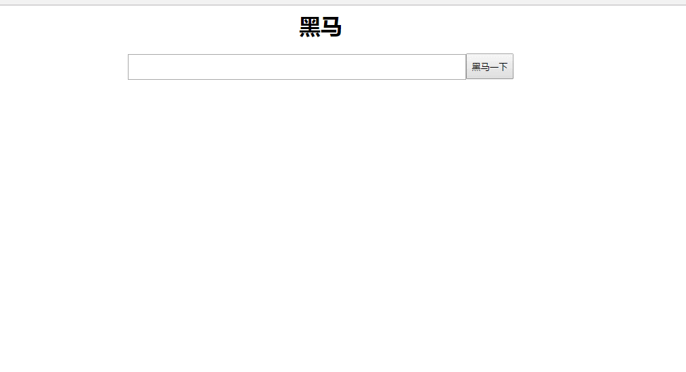

# ajax-json 1.0 #

## 学习目标：

1. 能够理解异步的概念
2. 能够使用jQuery的$.get()进行访问
3. 能够使用jQuery的$.post()进行访问
4. 能够掌握json的三种数据格式
5. 能够使用json转换工具Jackson进行json格式字符串的转换
6. 能够完成用户名是否存在的查重案例
7. 能够完成自动补全的案例 

## 案例一：使用JS的AJAX完成用户名的异步校验 ##

### 一，需求分析 ###

​	我们有一个网站，网站中都有注册的页面，当我们在注册的页面中输入用户名的时候(失去焦点的时候)，这个时候会提示，用户名是否存在。


### 二，技术分析 ###

#### 1. AJAX的概述

##### 1.1 什么是AJAX


​	说白了: 使用AJax可以做异步的请求

##### 1.2什么是异步

+ 同步  

  ​	


+ 异步

  


##### 1.3为什么要学习AJAX    

​	提升用户的体验。异步

​	实现页面局部刷新。

​	将部分的代码，写到客户端浏览器。

#### 2.js的Ajax入门【了解】

##### 2.1步骤	

​	第一步：创建异步请求对象。

​	第二步：打开连接。

​	第三步：发送请求。

​	第四步：设置监听对象改变所触发的函数,处理结果

##### 2.2 GET请求方式的入门

```javascript
<script>
		function ajaxDemo() {
			//1.创建xmlHttpRequest对象
			var xmlHttp = null;
			if (window.XMLHttpRequest) {// all modern browsers
				xmlHttp = new XMLHttpRequest();
			} else if (window.ActiveXObject) {// for IE5, IE6
				xmlHttp = new ActiveXObject("Microsoft.XMLHTTP");
			}
		
			//2.打开连接
			xmlHttp.open("GET","${pageContext.request.contextPath}/demo02?username=zs&password=123456");
			//3.发送请求
			xmlHttp.send();
  
  			//4.设置对象状态发生改变所触发的函数
			xmlHttp.onreadystatechange = function(){
				if(xmlHttp.readyState == 4 && xmlHttp.status == 200){
					var result = xmlHttp.responseText;
					alert(result);
				}
				
			};

		}
	</script>
```

##### 2.3POST请求方式的入门

```javascript
<script>
	function ajaxDemo() {
		//1.创建xmlHttpRequest对象
		var xmlHttp = null;
		if (window.XMLHttpRequest) {// all modern browsers
			xmlHttp = new XMLHttpRequest();
		} else if (window.ActiveXObject) {// for IE5, IE6
			xmlHttp = new ActiveXObject("Microsoft.XMLHTTP");
		}
	
		//2.打开连接
		xmlHttp.open("POST", "${pageContext.request.contextPath}/demo03");
		//设置请求参数的mime类型
		xmlHttp.setRequestHeader("content-type","application/x-www-form-urlencoded");
		//3.发送请求
		xmlHttp.send("username=zs&password=123456");
	
  		//4.设置状态发生改变触发的函数,处理结果
		xmlHttp.onreadystatechange = function() {
			if (xmlHttp.readyState == 4 && xmlHttp.status == 200) {
				var result = xmlHttp.responseText;
				alert(result);
			}
		};
  
	}

	
</script>
```


#### 3.JS的Ajax

##### 3.1异步请求的对象XMLHttpRequest

​	不同的浏览器对该对象的创建的方式不一样，MSIE浏览器，比较早的浏览器，创建这个对象的时候将这个对象封装到ActiveXObject的插件中。像火狐或者谷歌浏览器则直接new出来。

```javascript
function createXmlHttp(){
   var xmlHttp;
   try{ // Firefox, Opera 8.0+, Safari
        xmlHttp=new XMLHttpRequest();
   }catch (e){
	   try{// Internet Explorer
	         xmlHttp=new ActiveXObject("Msxml2.XMLHTTP");
	      }
	    catch (e){
	      try{
	         xmlHttp=new ActiveXObject("Microsoft.XMLHTTP");
	      }
	      catch (e){}
	      }
    }
	return xmlHttp;
 }
```

##### 3.2XMLHttpRequest的对象的API

###### 3.2.1方法

​	open() ：打开连接。传递三个参数。第一个是请求方式(GET/POST)，第二个是请求路径，第三个是否是异步的(默认就是异步,不需要这个参数)。

​	send([post请求的参数]): 发送请求。

​	setRequestHeader()：解决POST请求参数的问题。 key和值 content-type

###### 3.2.2属性

​	onreadystatechange：监听该对象的状态的改变,需要一个函数响应它

​	readyState：该属性就记录这个对象的状态。


​	**status：状态码 。**  

​	**responseText:获得字符串形式的响应数据(响应体)。**

​	responseXML :获得 XML 形式的响应数据(响应体)

### 三，思路分析 ###

1. 创建页面和数据库

2. 给用户名输入框设置失去焦点(onblur)事件,创建一个checkUserName()的函数响应这个事件

   ```
   function checkUserName(){
     //1.获得用户输入的用户名
     //2.使用JS的Ajax请求服务器(需要把用户名传过去)
     //3. 获得服务器响应的结果, 判断用户名是否被占用, 给用户提示
   }
   ```

3.  创建UserServlet

   ```
   class UserServlet{
     
     //1. 获得请求参数(用户名)
     //2.调用业务, 检查用户名是否存在
     //3. 判断是否存在, 给前端响应
     
   }
   ```

4. 创建UserService

5. 创建UserDao

   ```
   select * from user where username = ?
   ```

   

   

   


### 四，代码实现 ###

#### 1.环境的准备

+    创建数据库和表

     ```mysql
     create database web36;
     use web36;
     create table user(
     	id int primary key auto_increment,
     	username varchar(20),
     	password varchar(20),
     	email varchar(50),
     	phone varchar(20)
     );
     insert into user values (null,'aaa','123','aaa@163.com','15845612356');
     insert into user values (null,'bbb','123','bbb@qq.com','15845612356');
     insert into user values (null,'ccc','123','ccc@163.com','15845612356');
     ```

+    创建实体类       

           public class User implements Serializable{
         
               private int id;
               private String username;
               private String password;
               private String email;
               private String phone;
         
               public int getId() {
                   return id;
               }
         
               public void setId(int id) {
                   this.id = id;
               }
         
               public String getUsername() {
                   return username;
               }
         
               public void setUsername(String username) {
                   this.username = username;
               }
         
               public String getPassword() {
                   return password;
               }
         
               public void setPassword(String password) {
                   this.password = password;
               }
         
               public String getEmail() {
                   return email;
               }
         
               public void setEmail(String email) {
                   this.email = email;
               }
         
               public String getPhone() {
                   return phone;
               }
         
               public void setPhone(String phone) {
                   this.phone = phone;
               }
         
               @Override
               public String toString() {
                   return "User{" +
                           "id=" + id +
                           ", username='" + username + '\'' +
                           ", password='" + password + '\'' +
                           ", email='" + email + '\'' +
                           ", phone='" + phone + '\'' +
                           '}';
               }
           }
     


+ 导入jar包 (驱动,c3p0,jdbctemplate)


+ 引入工具类(C3P0Utils),配置文件(c3p0-config.xml)
+ 页面的准备


#### 2.代码实现

+ 页面

```
<script>
    //给用户名输入框设置失去焦点(onblur)事件,创建一个checkUserName()的函数响应这个事件
    function checkUserName(obj) {
        //1.获得用户输入的用户名
        var username =  obj.value;

        //2.使用JS的Ajax请求服务器(需要把用户名传过去)
        //a.创建异步请求对象 xmlHttpRequest
        var xmlhttp;
        if (window.XMLHttpRequest) {// code for IE7+, Firefox, Chrome, Opera, Safari
            xmlhttp = new XMLHttpRequest();
        }
        else {// code for IE6, IE5
            xmlhttp = new ActiveXObject("Microsoft.XMLHTTP");
        }
        //b.打开连接
        xmlhttp.open("get", "../userServlet?username="+username);
        //c. 发送请求
        xmlhttp.send();
        //d.设置异步请求对象的状态改变触发的函数
        xmlhttp.onreadystatechange= function () {
            if (xmlhttp.readyState == 4 && xmlhttp.status == 200){
                var flag =  xmlhttp.responseText; //获得服务器响应的结果, 判断用户名是否被占用, 给用户提示
                if (flag == "true"){
                    //可以使用
                    document.getElementById("usernamespan").innerHTML = "<font color='green'>恭喜!用户名可用!</font>";
                }else{
                    //不可以使用
                    document.getElementById("usernamespan").innerHTML = "<font color='red'>用户名已经被占用!</font>";
                }

            }
        }

    }
    
</script>
```

+ UserServlet

```
@WebServlet("/userServlet")
public class UserServlet extends HttpServlet {

    protected void doGet(HttpServletRequest request, HttpServletResponse response) throws ServletException, IOException {
        //1. 获得请求参数(用户名)
        String username = request.getParameter("username");
        //2.调用业务, 检查用户名是否存在
        UserService userService = new UserService();
        boolean isExist =  userService.checkUserName(username);
        //3. 判断是否存在, 给前端响应
        if(isExist){
            //存在, 不可用
            response.getWriter().print(false);
        }else{
            //不存在, 可用
            response.getWriter().print(true);
        }
    }

    protected void doPost(HttpServletRequest request, HttpServletResponse response) throws ServletException, IOException {
        doGet(request, response);
    }
}

```

+ UserServie

```
public class UserService {


    public boolean checkUserName(String username) {
        //调用Dao, 判断
        UserDao userDao = new UserDao();
        User user =  userDao.findByUserName(username);
        if(user != null){
            //存在
            return true;
        }else{
            //不存在
            return false;
        }

    }
}
```

+ UserDao

```

public class UserDao {

    public User findByUserName(String username) {
        try {
            JdbcTemplate jdbcTemplate = new JdbcTemplate(C3P0Utils.getDataSource());
            String sql = "select * from user where username = ?";
            User user = jdbcTemplate.queryForObject(sql, new BeanPropertyRowMapper<>(User.class), username);
            return  user; //查询的出来(存在的)
        } catch (Exception e) {
            e.printStackTrace();
            return  null; //查询不出来(不存在的)
        }

    }
}
```

## 案例二:使用JQ的Ajax完成用户名异步校验

### 一，需求分析

​	我们有一个网站，网站中都有注册的页面，当我们在注册的页面中输入用户名的时候，这个时候会提示，用户名是否存在。

​	


### 二，技术分析

#### 1.JQuery的Ajax【重点】  

##### 1.1  为什么要使用JQuery的AJAX  

​	因为传统(js里面)的AJAX的开发中，AJAX有两个主要的问题：

​	浏览器的兼容的问题 , 编写AJAX的代码太麻烦而且很多都是雷同的。

​	在实际的开发通常使用JQuery的Ajax   

##### 1.2JQuery的Ajax的API

| 请求方式           | 语法                                       |
| -------------- | ---------------------------------------- |
| GET请求          | $.get(url, *[data]*, *[callback]*, *[type]*) |
| **POST请求**     | $.post(url, *[data]*, *[callback]*, *[type]*) |
| **AJAX请求**     | $.ajax([settings])                       |
| GET请求(3.0新特性)  | $.get([settings])                        |
| POST请求(3.0新特性) | $.post([settings])                       |

#### 2.入门

##### 2.1get()

+ get方式,  语法	`$.get(url, [data], [callback], [type]);`

  | 参数名称     | 解释                                       |
  | -------- | ---------------------------------------- |
  | url      | 请求的服务器端url地址                             |
  | data     | 发送给服务器端的请求参数，格式可以是key=value，也可以是js对象     |
  | callback | 当请求成功后的回掉函数，可以在函数体中编写我们的逻辑代码             |
  | type     | 预期的返回数据的类型，取值可以是 xml, html, script, json, text, _defaul等 |

+ 实例


```
$("#btn1").click(function(){
  		//发送请求; $.get(url,[params],[function(result){}])

  		$.get("{pageContext.request.contextPath }/demo01",		{"username":"zs","password":"123456"},function(result){	
  			alert(result);

  		});

  	});
```

##### 2.2post()

+ post方式, 语法 `$.post(url, [data], [callback], [type])`

  | 参数名称     | 解释                                       |
  | -------- | ---------------------------------------- |
  | url      | 请求的服务器端url地址                             |
  | data     | 发送给服务器端的请求参数，格式可以是key=value，也可以是js对象     |
  | callback | 当请求成功后的回掉函数，可以在函数体中编写我们的逻辑代码             |
  | type     | 预期的返回数据的类型，取值可以是 xml, html, script, json, text, _defaul等 |

+ 实例


```
  	$("#btn2").click(function(){

  		//发送请求; $.post(url,[params],[function(result){}])

  		$.post("{pageContext.request.contextPath }/demo01",{"username":"zs","password":"123456"},function(result){

  			alert(result);

  		});

  	});
```

##### 2.3ajax()

+ 语法   `$.ajax([settings])`

  其中，settings是一个js字面量形式的对象，格式是{name:value,name:value... ...}，常用的name属性名如下

  | 属性名称     | 解释                                       |
  | -------- | ---------------------------------------- |
  | url      | 请求的服务器端url地址                             |
  | async    | (默认: true) 默认设置下，所有请求均为异步请求。如果需要发送同步请求，请将此选项设置为 false |
  | data     | 发送到服务器的数据，可以是键值对形式，也可以是js对象形式            |
  | type     | (默认: "GET") 请求方式 ("POST" 或 "GET")， 默认为 "GET" |
  | dataType | 预期的返回数据的类型，取值可以是 xml, html, script, json, text, _defaul等 |
  | success  | 请求成功后的回调函数                               |
  | error    | 请求失败时调用此函数                               |

+ 实例


```
function sendRequest(){
		$.ajax({
			url:"/AjaxDemo/ajaxServlet",
			async:true,
			data:"name=haohao&age=33",
			type:"GET",
			dataType:"text",
			success:function(data){
				alert(data);
			},
			error:function(){
				alert("数据没有成功返回!")
			}
		});
	}
```

###  三,思路分析


1. 创建页面和数据库

2. 给用户名输入框设置失去焦点事件(jq对象.blur(function(){}))

3. 在函数里面:

   ​	获得用户输入的用户名

   ​	**通过JQ发送Ajax请求CheckServlet(带用户名请求参数)**

4. 在CheckServlet的doGet()方法里面

   ​	获得请求参数(用户名)

   ​	调用业务,根据用户名获得用户对象

   ​	判断,给前端响应

   


### 四，代码实现


## 案例三：能够完成自动补全的案例(返回JSON数据)

### 一，需求分析

​	实现一个搜索页面，在文本框中输入一个值以后(键盘抬起的时候)，给出一些提示

​	

### 二，技术分析

#### 	1.JSON

##### 1.1什么是JSON


+ 用我们自己的话来说: JSON就是一个容易生成和解析的数据格式; 

  ​		                    常用作客户端(前端,IOS,安卓)和服务器(JavaEE)之间的数据交换

##### 1.2. JSON数据格式

| 类型     | 语法                                | 解释                                    |
| -------- | ----------------------------------- | --------------------------------------- |
| JSON对象 | `{name:value,name:value...}`        | 其中name是字符串类型，而value是任意类型 |
| JSON数组 | `[value,value,value...]`            | 其中value是任意类型                     |
| 混合类型 | `[{},{}... ...] 或 {key:[]... ...}` | 合理包裹嵌套对象类型和数组类            |

#### 2.json的转换工具

##### 2.1json转换工具的概述

​	json的转换工具是通过java封装好的一些jar工具包，直接将java对象或集合转换成json格式的字符串。

##### 2.2常见的json转换工具

| 工具名称     | 介绍                                   |
| -------- | ------------------------------------ |
| Jsonlib  | Java 类库，需要导入的jar包较多                  |
| Gson     | google提供的一个简单的json转换工具               |
| Fastjson | alibaba技术团队提供的一个高性能的json转换工具         |
| Jackson  | 开源免费的json转换工具，springmvc转换默认使用jackson |

##### 2.3Jackson的使用

+ 导入jar


+ 使用jackson的ObjectMapper对象的writeValueAsString方法进行转换

```
ObjectMapper om = new ObjectMapper();
String jsonStr =  om.writeValueAsString(java对象);
```

+ java对象对应的json格式

```
JavaBean对象 eg: user对象 -----> {}  把JavaBean对象的属性作为key
Map对象                   -----> {}  把map的key作为key
List					 -----> []		
```


### 三,思路分析


1. 创建数据库和页面

2. 在页面上,给输入框设置一个键盘抬起`(keyup(function(){}))`事件,创建函数响应这个事件

3. 在这个函数里面:

   ​	//获得输入框里面用户输入的关键词

   ​	//是JQ的Ajax请求服务器(随带关键词请求参数)

   ​	//获得服务器响应的数据(json数组), 解析数据, 填充页面

4. 创建 WordServlet,在doGet()方法里面

   ​	//获得请求参数(关键词)

   ​	//调用业务, 根据关键词获得词语的数据 `List<word> list`

   ​	//把list通过jackson转成JSON数组,响应给前端

5. 创建WordService  

   ```java
   public  List<Word> findByKey(String key){
   
   	//调用Dao,查询数据库
   
   }
   ```

   

   ​	

6. 创建WordDao

   ```java
   	public  List<Word> findByKey(String key){
   
   		//sql = "select * from 表 where word like ? limit 0,5";
   
   	}
   ```

   


### 四，代码实现

#### 1.环境的准备

+ 创建数据库

  ```sql lite
  create table words(
      id int primary key auto_increment,
      word varchar(50)
  );
  insert into words values (null, 'all');

  insert into words values (null, 'after');

  insert into words values (null, 'app');

  insert into words values (null, 'apple');

  insert into words values (null, 'application');

  insert into words values (null, 'applet');

  insert into words values (null, 'and');

  insert into words values (null, 'animal');

  insert into words values (null, 'back');

  insert into words values (null, 'bad');

  insert into words values (null, 'bag');

  insert into words values (null, 'ball');

  insert into words values (null, 'banana');

  insert into words values (null, 'bear');

  insert into words values (null, 'bike');

  insert into words values (null, 'car');

  insert into words values (null, 'card');

  insert into words values (null, 'careful');

  insert into words values (null, 'cheese');

  insert into words values (null, 'come');

  insert into words values (null, 'cool');

  insert into words values (null, 'dance');

  insert into words values (null, 'day');

  insert into words values (null, 'dirty');

  insert into words values (null, 'duck');

  insert into words values (null, 'east');

  insert into words values (null, 'egg');

  insert into words values (null, 'every');

  insert into words values (null, 'example');
  ```

+ 创建JavaBean


  ```
  package com.itheima.bean;

  import java.io.Serializable;

  public class Words implements Serializable{


      private int id;
      private String word;


      public int getId() {
          return id;
      }

      public void setId(int id) {
          this.id = id;
      }

      public String getWord() {
          return word;
      }

      public void setWord(String word) {
          this.word = word;
      }

      @Override
      public String toString() {
          return "Words{" +
                  "id=" + id +
                  ", word='" + word + '\'' +
                  '}';
      }
  }

  ```

+ 导入jar,工具类, 配置文件

+ 创建页面,search.jsp

  ```HTML
  <%@ page language="java" contentType="text/html; charset=UTF-8"
  	pageEncoding="UTF-8"%>
  <!DOCTYPE html PUBLIC "-//W3C//DTD HTML 4.01 Transitional//EN" "http://www.w3.org/TR/html4/loose.dtd">
  <html>
  <head>
  <meta http-equiv="Content-Type" content="text/html; charset=UTF-8">
  <title>Insert title here</title>
  </head>
  <body>
  	<center>
  
  		<h1>黑马</h1>
  
  		<input id="inputId" type="text" style="width: 500px; height: 38px;" /><input
  			type="button" style="height: 38px;" value="黑马一下" />
  		<div id="divId"
  			style="width: 500px; border: 1px red solid; height: 300px; position: absolute; left: 394px;">
  			<table id="tabId" width="100%" height="100%"  border="1px">
  				<tr><td>aaaa</td></tr>
  				<tr><td>bbbb</td></tr>
  				<tr><td>cccc</td></tr>
  				<tr><td>dddd</td></tr>
  				<tr><td>eeee</td></tr>
  			</table>
  		</div>
  
  	</center>
  </body>
  </html>
  ```

