# 回顾

* 导入

  * 内嵌式

    ~~~html
    
    ~~~

  * 外联式

    ~~~html
    
    ~~~

* 基本语法

  * 声明变量

    ~~~javascript
    var 变量名 =  值 ;
    ~~~

  * 定义函数

    ~~~javascript
    //命名
    function 函数名(参数名1，...){
        
    }
    //匿名
    var fn = function(参数名1，...){
        
    }
    ~~~

* bom基本操作

  * window

    * alert(); 弹出框
    * confirm() 确认框
    * setInterval()  定时器
    * setTimeout() 延迟

  * location

    ~~~javascript
    location.href = "地址"  //跳转
    ~~~

  * history

    ~~~javascript
    history.go(-1)  , back()
    history.go(1)	,forward()
    ~~~

* dom基本操作

  * 获得

    ~~~javascript
    document.getElementById();			//<标签 id="">
    document.getElementsByName();		//<标签 name="">
    document.getElementsByTagName();	//<标签>
    document.getElementsByClassName();	//<标签 class="">
    ~~~

  * 创建

    ~~~javascript
    //创建
    var obj = document.createElement("标签名")
    //设置属性
    obj.setAttribute(k , v );
    //追加
    父元素.appendChild( obj );
    ~~~

* 正则表达式

  ~~~javascript
  //定义对象
  var reg = /正则表达式/属性;		//new RegExp("正则","属性");
  //正则表达式 语法
  /*
  ^ 开始
  $ 结束
  * >=0
  + >=1
  ? 0或1
  [0-9a-zA-Z]   数字和大小写字母
  {n}   匹配n个
  {n,}  >=n个
  {n,m}   n到m个
  .		任意
  \d	数字
  \D	非数字
  \w	单词字符（0-9a-zA-Z_）  //汉字
  \W	非单词字符
  */
  ~~~

# 目标与总结

# Bootstrap基础

## bootstrap概述

* bootstrap：前端框架，他是初学者编写能看的页面简单了。

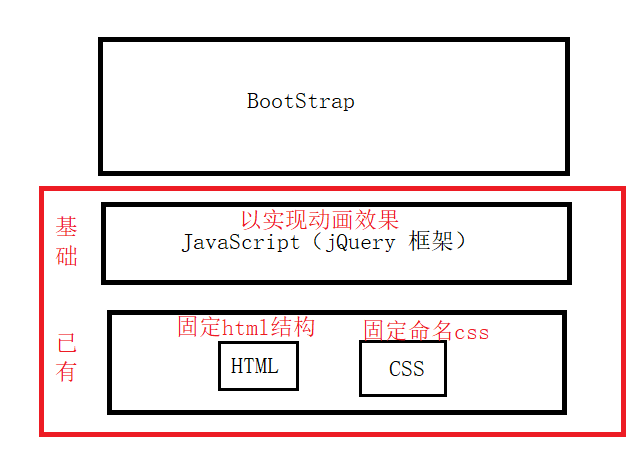

## 响应式布局

响应式布局：提供一份代码，满足不同终端设备（PC、手机、iPad）。

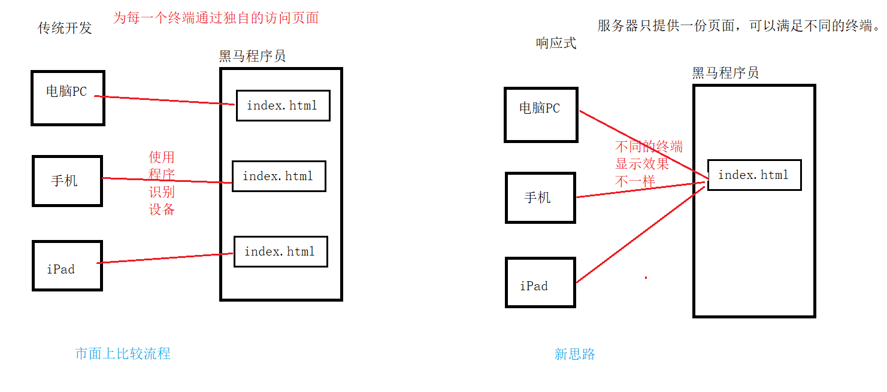

## 模板（搭建环境）

* 步骤1：导入资源（jQuery、bootstrap）

  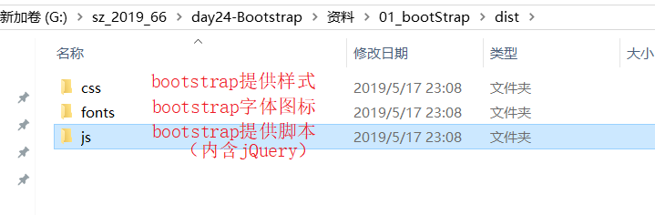

* 步骤2：帮助文档中复制模板

~~~html
<!DOCTYPE html>
<html lang="zh-CN">
<head>
    <meta charset="utf-8">
    <meta http-equiv="X-UA-Compatible" content="IE=edge">
    <meta name="viewport" content="width=device-width, initial-scale=1">
    <!-- 上述3个meta标签*必须*放在最前面，任何其他内容都*必须*跟随其后！ -->
    <title>模板</title>

    <!-- Bootstrap 提供样式-->
    <link href="../css/bootstrap.min.css" rel="stylesheet">
    <!-- 引入依赖js框架jQuery -->
    
    <!-- bootstrap 核心js -->
    

</head>
<body>
    

</body>
</html>
~~~

* 扩展：< meta>内容介绍
  * https://v3.bootcss.com/css/#overview-mobile

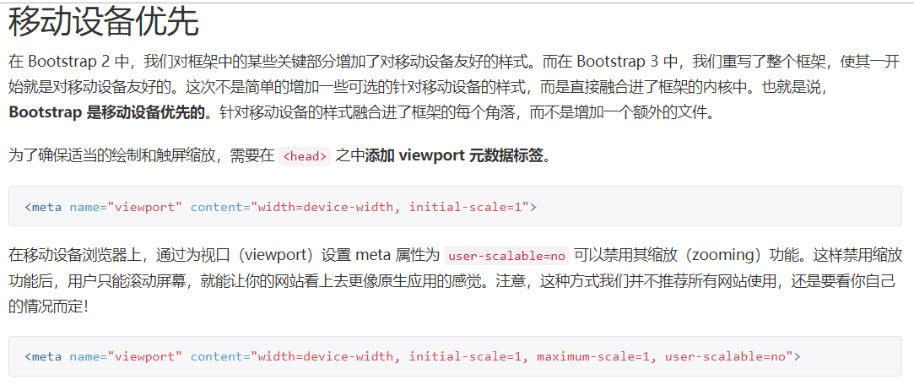

## 布局容器

* 之后编写所有的bootstrap代码必须放在布局容器中。
* 参考：https://v3.bootcss.com/css/#overview-container

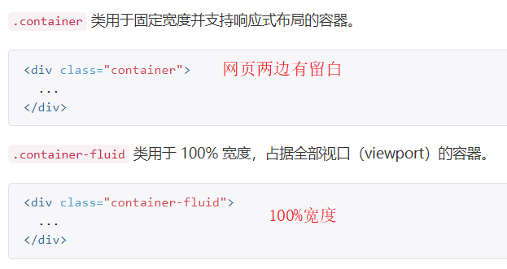

## 栅格系统

* 参考文档：https://v3.bootcss.com/css/#grid
* 栅格系统：bootstrap提供一套==页面布局==解决方案。栅格系统用于通过一系列的行（row）与列（column）的组合来创建页面布局。
* bootstrap将一行拆分成12列。通过不同==样式==可以进行描述。
  * .col-*-1   1列
  * .col-*-3   3列
  * .col-*-9   9列
  * .col-*-12   12列

* 栅格参数：https://v3.bootcss.com/css/#grid-options

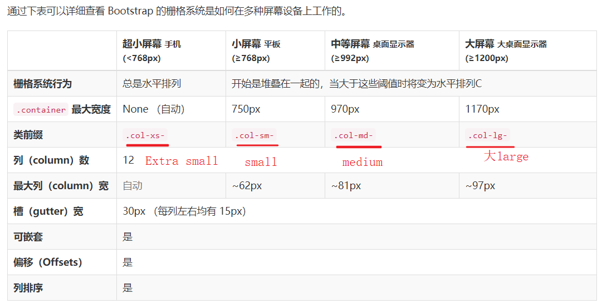

~~~html
<!--大屏幕：50% ， 中屏幕：33% ， 小屏幕：25% ， 超小屏幕：100% -->

   

    
	
 

~~~

# 案例1：响应式网页

## 导航条

* 导航：https://v3.bootcss.com/components/#navbar

~~~html
<!DOCTYPE html>
<html lang="zh-CN">
<head>
    <meta charset="utf-8">
    <meta http-equiv="X-UA-Compatible" content="IE=edge">
    <meta name="viewport" content="width=device-width, initial-scale=1">
    <!-- 上述3个meta标签*必须*放在最前面，任何其他内容都*必须*跟随其后！ -->
    <title>模板</title>

    <!-- Bootstrap 提供样式-->
    <link href="../css/bootstrap.min.css" rel="stylesheet">
    <!-- 引入依赖js框架jQuery -->
    
    <!-- bootstrap 核心js -->
    

</head>
<body>
    

        <nav class="navbar navbar-inverse">
            

                <!-- Brand and toggle get grouped for better mobile display -->
                

                    <!--汉堡按钮-->
                    <button type="button" class="navbar-toggle collapsed" data-toggle="collapse" data-target="#bs-example-navbar-collapse-1" aria-expanded="false">
                        Toggle navigation
                        
                        
                        
                    </button>
                    <a class="navbar-brand" href="#">首页</a>
                

                <!-- Collect the nav links, forms, and other content for toggling -->
                

                    <ul class="nav navbar-nav">
                        <li class="active"><a href="#">深圳游 (current)</a></li>
                        <li><a href="#">国际游</a></li>
                        <li><a href="#">东莞游</a></li>
                        <li class="dropdown">
                            <a href="#" class="dropdown-toggle" data-toggle="dropdown" role="button" aria-haspopup="true" aria-expanded="false">全部 </a>
                            <ul class="dropdown-menu">
                                <li><a href="#">深圳游</a></li>
                                <li><a href="#">拉斯维加斯游</a></li>
                                <li role="separator" class="divider"></li>
                                <li><a href="#">泰国游</a></li>
                            </ul>
                        </li>
                    </ul>
                    <form class="navbar-form navbar-right">
                        

                            <input type="text" class="form-control" placeholder="Search">
                        

                        <button type="submit" class="btn btn-default">搜索</button>
                    </form>
                
<!-- /.navbar-collapse -->
            
<!-- /.container-fluid -->
        </nav>

    

</body>
</html>
~~~

## 轮播图

* 轮播图文档：https://v3.bootcss.com/javascript/#carousel

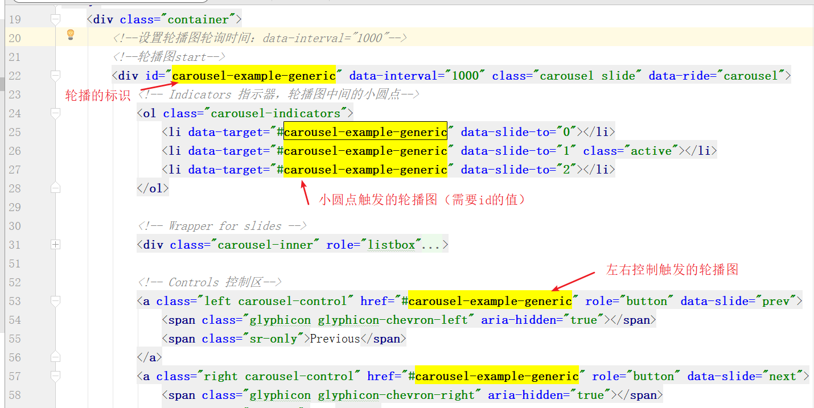

~~~html
<!DOCTYPE html>
<html lang="zh-CN">
<head>
    <meta charset="utf-8">
    <meta http-equiv="X-UA-Compatible" content="IE=edge">
    <meta name="viewport" content="width=device-width, initial-scale=1">
    <!-- 上述3个meta标签*必须*放在最前面，任何其他内容都*必须*跟随其后！ -->
    <title>模板</title>

    <!-- Bootstrap 提供样式-->
    <link href="../css/bootstrap.min.css" rel="stylesheet">
    <!-- 引入依赖js框架jQuery -->
    
    <!-- bootstrap 核心js -->
    

</head>
<body>
    

        <!--轮播图start-->
        

            <!-- Indicators 指示器，轮播图中间的小圆点-->
            <ol class="carousel-indicators">
                <li data-target="#carousel-example-generic" data-slide-to="0"></li>
                <li data-target="#carousel-example-generic" data-slide-to="1" class="active"></li>
                <li data-target="#carousel-example-generic" data-slide-to="2"></li>
            </ol>

            <!-- Wrapper for slides -->
            

                

                    
                    

                        正文11111提示
                    

                

                

                    
                    

                        正文22222提示
                    

                

                

                    
                    

                        正文33333提示
                    

                

            

            <!-- Controls 控制区-->
            <a class="left carousel-control" href="#carousel-example-generic" role="button" data-slide="prev">
                
                Previous
            </a>
            <a class="right carousel-control" href="#carousel-example-generic" role="button" data-slide="next">
                
                Next
            </a>
        

        <!--轮播图end-->

    

</body>
</html>
~~~

## 按钮

* 按钮的预定义样式：https://v3.bootcss.com/css/#buttons-options

## 案例分析与实现

* 建议：先编写布局，再将导航和轮播图的代码进行合并。

~~~html
<!DOCTYPE html>
<html lang="zh-CN">
<head>
    <meta charset="utf-8">
    <meta http-equiv="X-UA-Compatible" content="IE=edge">
    <meta name="viewport" content="width=device-width, initial-scale=1">
    <!-- 上述3个meta标签*必须*放在最前面，任何其他内容都*必须*跟随其后！ -->
    <title>模板</title>

    <!-- Bootstrap 提供样式-->
    <link href="../css/bootstrap.min.css" rel="stylesheet">
    <!-- 引入依赖js框架jQuery -->
    
    <!-- bootstrap 核心js -->
    

</head>
<body>
    

        <!--第一行-->
        

            

                
            

        

        <!--第二行导航-->
        

            

            

        

        <!--第三行：轮播图-->
        

            

            

        

        <!--第四行：信息显示-->
        

            

                <h2>丽江攻略</h2>
                
第一天：飞机到昆明，然后直接前往丽江； 第二天：拉市海，束河古镇，观看丽水金沙，丽江古城； 第三天：玉龙雪山，冰川公园，束河古镇篝火晚会； 第四天：丽江，大理，蝴蝶泉，洱海骑行，游船环游洱海，南诏风情岛； 第五天：大理古城，洋人街，崇圣寺三塔，昆明.....

                <button type="button" class="btn btn-primary">查看详情</button>
            

            

                <h2>丽江攻略</h2>
                
第一天：飞机到昆明，然后直接前往丽江； 第二天：拉市海，束河古镇，观看丽水金沙，丽江古城； 第三天：玉龙雪山，冰川公园，束河古镇篝火晚会； 第四天：丽江，大理，蝴蝶泉，洱海骑行，游船环游洱海，南诏风情岛； 第五天：大理古城，洋人街，崇圣寺三塔，昆明.....

                <button type="button" class="btn btn-primary">查看详情</button>
            

            

                <h2>丽江攻略</h2>
                
第一天：飞机到昆明，然后直接前往丽江； 第二天：拉市海，束河古镇，观看丽水金沙，丽江古城； 第三天：玉龙雪山，冰川公园，束河古镇篝火晚会； 第四天：丽江，大理，蝴蝶泉，洱海骑行，游船环游洱海，南诏风情岛； 第五天：大理古城，洋人街，崇圣寺三塔，昆明.....

                <button type="button" class="btn btn-primary">查看详情</button>
            

        

    

</body>
</html>
~~~

# 案例2：联系人表格

## 排版

* 排版：https://v3.bootcss.com/css/#type

  * 标题：直接使用

    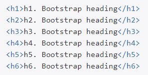

  * 对齐：提供对应的样式完成

    * .text-left : 左对齐
    * .text-center : 居中
    * .text-right : 右对齐

    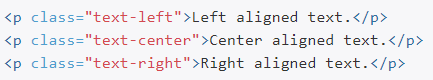

## 表格

* 表格：https://v3.bootcss.com/css/#tables-bordered

## 案例实现

# 案例3 黑马旅游首页

## 图片

* 图片：https://v3.bootcss.com/css/#images

## 响应式工具

* 响应式工具：https://v3.bootcss.com/css/#responsive-utilities-classes

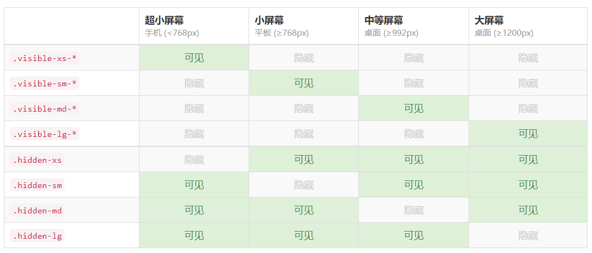

## 案例分析与实现

## 其他技术：表单

# 发布静态页面：nginx

## 效果

## Nginx

### 概述

在我们自己的计算机上安装nginx软件，就可以让局域网的用户访问你的页面。

### 下载

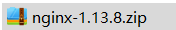

### 安装

将zip文件解压即可。

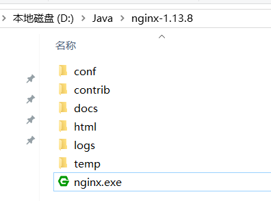

## 部署

### 确定需要部署页面

* 提供的资料

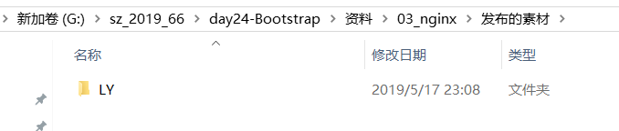

* 保存自己硬盘中

  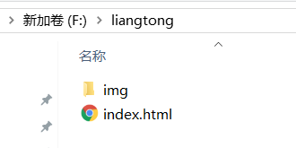

### 配置nginx

* 配置文件位置

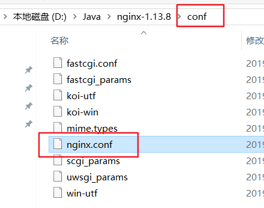

* 配置内容

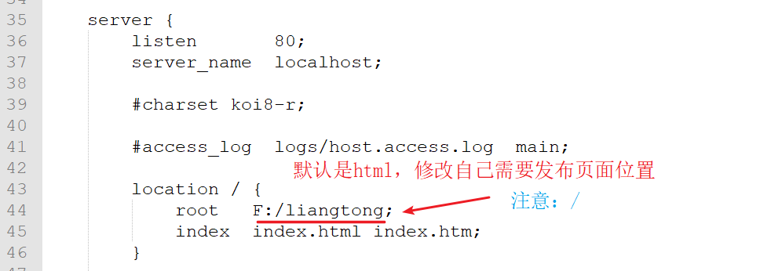

复制window的路径：F:\liangtong   需要修改成  F:/liangtong

### 启动nginx

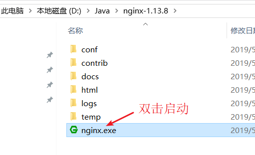

### nginx常规操作

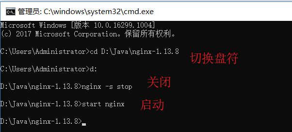

## 扩展：配置本地域名

* 文件位置：C:\Windows\System32\drivers\etc\hosts

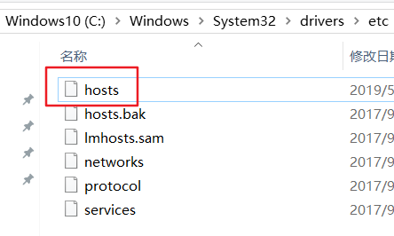

* 配置内容

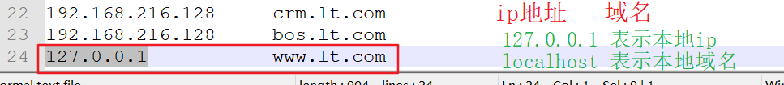

