# Bootstrap #
## 学习目标

1. 能够创建bootstrap的模板
2. 能够使用boostrap的两种布局容器
3. 能够理解bootstrap的响应式布局的特点
4. 能够查询文档创建bootstrap的按钮、表格、表单等常用组件
5. 能够理解bootstrap的栅格系统
6. 能够查询文档使用bootstrap的导航条
7. 能够查询文档使用bootstrap的轮播图
8. 能够利用Bootstrap完成黑马旅游的首页 

## 案例一：使用BootStrap制作一个响应式页面 ##

### 一，需求分析 ###

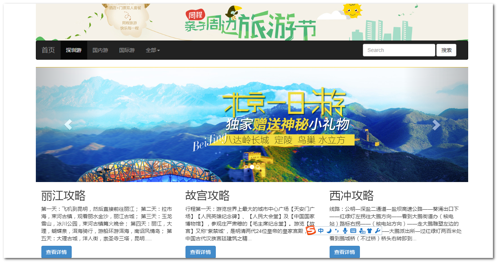

### 二，技术分析 ###

#### 1.什么是响应式布局？

- 简而言之，就是一个网站能够兼容多个终端(pc,平板,手机...)——而不是为每个终端做一个特定的版本
- 说白了: 开发一套代码,适配不同分辨率的设备(pc,平板,手机..)

#### 2.什么是bootStrap？

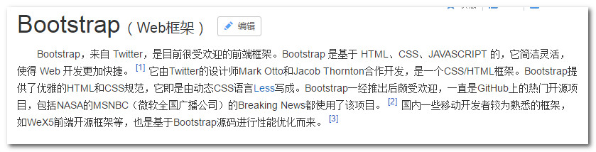

+ bs是设计响应式布局的一个前端框架,基于html,css,js(JQ), 做网页更加了简单了 


#### 3.bootsrap开发准备工作

- 官网：  http://www.bootcss.com/
- 文档：  https://v3.bootcss.com/getting-started/

#### 4.开发步骤

1. 进入资料\01_bootStrap,复制dist里面的内容到项目里面去

   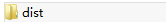


2. 把bs资源引入到页面,

   ​	BootStrap核心css

   ​	jquery库

   ​	BootStrap核心JavaScript文件


```html
<head>
    <meta charset="UTF-8">
    <title>Title</title>
     <!-- 引入CSS样式 -->
   <link rel="stylesheet" href="../css/bootstrap.css" />
   <!--引入JQ库(先导入jq)-->
   <script type="text/javascript" src="../js/jquery-1.11.3.min.js"></script>
   <!-- 引入 Bootstrap 核心 JavaScript 文件 -->
   <script type="text/javascript" src="../js/bootstrap.js"></script>
   <!--配置绘制和触屏缩放 自动适配-->
   <meta name="viewport" content="width=device-width, initial-scale=1">
</head>
```


3. Bootstrap 需要为页面内容和栅格系统包裹一个 .container 容器


	<body>
		<div class="container">
			...
		</div>
	</body>

#### 5.BootStrap的组成部分

+ 全局css:样式
+ 组件: 导航, 分页等
+ js插件:定义了和js相关的插件(轮播图...)


#### 6.栅格系统【重点】


- 栅格系统用于通过一系列的行（row）与列（column）的组合来创建页面布局

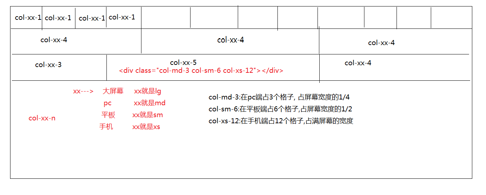

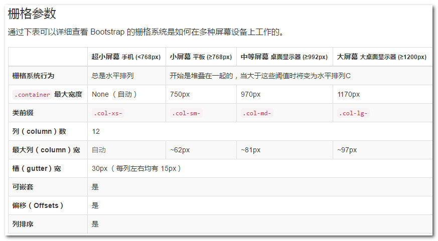


+ 栅格系统实例代码

```html
<!DOCTYPE html>
<html>

	<head>
		<meta charset="UTF-8">
		<!--保适当的绘制和触屏缩放-->
		<meta name="viewport" content="width=device-width, initial-scale=1">
		<!-- 导入核心 CSS 文件 -->
		<link rel="stylesheet" href="../css/bootstrap.min.css">
		<!--导入jQ(先导入!!!)-->
		<script type="text/javascript" src="../js/jquery-1.11.3.min.js" ></script>
		<!-- 核心 JavaScript 文件 -->
		<script src="../js/bootstrap.min.js"></script>
	</head>

	<body>
		<div class="container">
			<div style="border: 1px red solid;" class="col-md-4 col-sm-6 col-xs-12">div</div>
			<div style="border: 1px red solid;" class="col-md-4 col-sm-6 col-xs-12">div</div>
			<div style="border: 1px red solid;" class="col-md-4 col-sm-6 col-xs-12">div</div>
			<div style="border: 1px red solid;" class="col-md-4 col-sm-6 col-xs-12">div</div>
			<div style="border: 1px red solid;" class="col-md-4 col-sm-6 col-xs-12">div</div>
			<div style="border: 1px red solid;" class="col-md-4 col-sm-6 col-xs-12">div</div>
			<div style="border: 1px red solid;" class="col-md-4 col-sm-6 col-xs-12">div</div>
			<div style="border: 1px red solid;" class="col-md-4 col-sm-6 col-xs-12">div</div>
			<div style="border: 1px red solid;" class="col-md-4 col-sm-6 col-xs-12">div</div>
			<div style="border: 1px red solid;" class="col-md-4 col-sm-6 col-xs-12">div</div>
		</div>
	</body>

</html>
```


### 三，思路分析 ###

- 创建最外层div(容器)
- 创建四个div
- 第四个div里面使用栅格系统来布局


### 四，代码实现###

```html
<!DOCTYPE html>
<html lang="en">
<head>
    <meta charset="UTF-8">
    <title>Title</title>


    <!-- 引入CSS样式 -->
    <link rel="stylesheet" href="../css/bootstrap.css" />
    <!--引入JQ库(先导入jq)-->
    <script type="text/javascript" src="../js/jquery-1.11.3.min.js"></script>
    <!-- 引入 Bootstrap 核心 JavaScript 文件 -->
    <script type="text/javascript" src="../js/bootstrap.js"></script>
    <!--配置绘制和触屏缩放 自动适配-->
    <meta name="viewport" content="width=device-width, initial-scale=1">
</head>
<body>

    <div class="container">
        <!--最上面图片-->
        <div class="row">
            
        </div>
        <!--菜单-->
        <div class="row">
            <nav class="navbar navbar-inverse">
                <div class="container-fluid">
                    <!-- Brand and toggle get grouped for better mobile display -->
                    <div class="navbar-header">
                        <button type="button" class="navbar-toggle collapsed" data-toggle="collapse" data-target="#bs-example-navbar-collapse-1" aria-expanded="false">
                            <span class="sr-only">Toggle navigation</span>
                            <span class="icon-bar"></span>
                            <span class="icon-bar"></span>
                            <span class="icon-bar"></span>
                        </button>
                        <a class="navbar-brand" href="#">首页</a>
                    </div>

                    <!-- Collect the nav links, forms, and other content for toggling -->
                    <div class="collapse navbar-collapse" id="bs-example-navbar-collapse-1">
                        <ul class="nav navbar-nav">
                            <li class="active">
                                <a href="#">深圳游 <span class="sr-only">(current)</span></a>
                            </li>

                            <li>
                                <a href="#">国内游</a>
                            </li>

                            <li>
                                <a href="#">国际游</a>
                            </li>

                            <li class="dropdown">
                                <a href="#" class="dropdown-toggle" data-toggle="dropdown" role="button" aria-haspopup="true" aria-expanded="false">全部 <span class="caret"></span></a>
                                <ul class="dropdown-menu">
                                    <li><a href="#">深圳游</a></li>
                                    <li><a href="#">国内游</a></li>
                                    <li role="separator" class="divider"></li>
                                    <li><a href="#">国际游</a></li>
                                </ul>
                            </li>
                        </ul>

                        <form class="navbar-form navbar-right">
                            <div class="form-group">
                                <input type="text" class="form-control" placeholder="Search">
                            </div>
                            <button type="submit" class="btn btn-default">Submit</button>
                        </form>

                    </div><!-- /.navbar-collapse -->
                </div><!-- /.container-fluid -->
            </nav>

        </div>

        <!--轮播图-->
        <div class="row">
            <div id="carousel-example-generic" class="carousel slide" data-ride="carousel">
                <!-- Indicators: 指示器(小圆点) -->
                <ol class="carousel-indicators">
                    <li data-target="#carousel-example-generic" data-slide-to="0" class="active"></li>
                    <li data-target="#carousel-example-generic" data-slide-to="1"></li>
                    <li data-target="#carousel-example-generic" data-slide-to="2"></li>
                </ol>

                <!-- Wrapper for slides: 图片滑动 -->
                <div class="carousel-inner" role="listbox">
                    <div class="item active">
                        
                    </div>
                    <div class="item">
                        
                    </div>
                    <div class="item">
                        
                    </div>
                </div>

                <!-- Controls: 控制器(左右切换的) -->
                <a class="left carousel-control" href="#carousel-example-generic" role="button" data-slide="prev">
                    <span class="glyphicon glyphicon-chevron-left" aria-hidden="true"></span>
                    <span class="sr-only">Previous</span>
                </a>

                <a class="right carousel-control" href="#carousel-example-generic" role="button" data-slide="next">
                    <span class="glyphicon glyphicon-chevron-right" aria-hidden="true"></span>
                    <span class="sr-only">Next</span>
                </a>
            </div>

        </div>

        <!--下面的信息-->
        <div class="row">
            <div class="col-md-4 col-sm-6 col-xs-12">
                <h1>丽江攻略</h1>
                <p>第一天：飞机到昆明，然后直接前往丽江； 第二天：拉市海，束河古镇，观看丽水金沙，丽江古城； 第三天：玉龙雪山，冰川公园，束河古镇篝火晚会； 第四天：丽江，大理，蝴蝶泉，洱海骑行，游船环游洱海，南诏风情岛； 第五天：大理古城</p>
                <button type="button" class="btn btn-primary">查看详情</button>
            </div>
            <div class="col-md-4 col-sm-6 col-xs-12">
                <h1>丽江攻略</h1>
                <p>第一天：飞机到昆明，然后直接前往丽江； 第二天：拉市海，束河古镇，观看丽水金沙，丽江古城； 第三天：玉龙雪山，冰川公园，束河古镇篝火晚会； 第四天：丽江，大理，蝴蝶泉，洱海骑行，游船环游洱海，南诏风情岛； 第五天：大理古城</p>
                <button type="button" class="btn btn-primary">查看详情</button>
            </div>
            <div class="col-md-4 col-sm-6 col-xs-12">
                <h1>丽江攻略</h1>
                <p>第一天：飞机到昆明，然后直接前往丽江； 第二天：拉市海，束河古镇，观看丽水金沙，丽江古城； 第三天：玉龙雪山，冰川公园，束河古镇篝火晚会； 第四天：丽江，大理，蝴蝶泉，洱海骑行，游船环游洱海，南诏风情岛； 第五天：大理古城</p>
                <button type="button" class="btn btn-primary">查看详情</button>
            </div>

        </div>
    </div>
</body>
</html>
```

### 五,  bs总结

面试:

​	bs组成部分: 全局css, 组件,js插件

​	bs实现响应式原理: 栅格系统   

#### 1.全局CSS

##### 1.1按钮

##### 1.2图片

##### 1.3表单

##### 1.4表格

#### 2.组件

##### 2.1导航条

##### 2.2分页组件

#### 3.JS插件

##### 3.1状态框

参考LayUI: [layUI](http://layer.layui.com/)

##### 3.2轮播图

+ 组成的类样式名

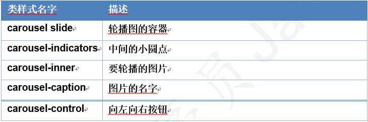


+ 相关的属性

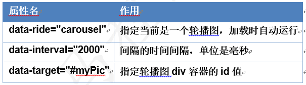


## 案例二:使用bootstrap制作展示联系人表格

### 一,案例需求

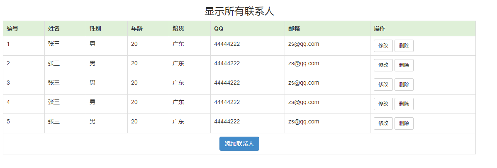


### 二,思路分析

### 三,代码实现

```html
<!DOCTYPE html>
<html lang="en">
<head>
    <meta charset="UTF-8">
    <title>旅游首页</title>
    <!-- 最新版本的 Bootstrap 核心 CSS 文件 -->
    <link rel="stylesheet" href="../css/bootstrap.css" >
    <!--引入JQ-->
    <script src="../js/jquery-1.11.3.min.js"></script>
    <!-- 引入BS -->
    <script src="../js/bootstrap.js"></script>

    <meta name="viewport" content="width=device-width, initial-scale=1">
</head>
<body>
    <div class="container">
        <h3 style="text-align: center">显示所有联系人</h3>
        <table border="1" class="table table-bordered table-hover">
            <tr class="success">
                <th>编号</th>
                <th>姓名</th>
                <th>性别</th>
                <th>年龄</th>
                <th>籍贯</th>
                <th>QQ</th>
                <th>邮箱</th>
                <th>操作</th>
            </tr>
            <tr>
                <td>1</td>
                <td>张三</td>
                <td>男</td>
                <td>20</td>
                <td>广东</td>
                <td>44444222</td>
                <td>zs@qq.com</td>
                <td><a class="btn btn-default btn-sm" href="修改联系人.html">修改</a>&nbsp;<a class="btn btn-default btn-sm" href="JavaScript:void(0)" onclick="deleteById()">删除</a></td>
            </tr>
            <tr>

                <td>2</td>
                <td>张三</td>
                <td>男</td>
                <td>20</td>
                <td>广东</td>
                <td>44444222</td>
                <td>zs@qq.com</td>
                <td><a class="btn btn-default btn-sm" href="修改联系人.html">修改</a>&nbsp;<a class="btn btn-default btn-sm" href="修改联系人.html">删除</a></td>
            </tr>
            <tr>
                <td>3</td>
                <td>张三</td>
                <td>男</td>
                <td>20</td>
                <td>广东</td>
                <td>44444222</td>
                <td>zs@qq.com</td>
                <td><a class="btn btn-default btn-sm" href="修改联系人.html">修改</a>&nbsp;<a class="btn btn-default btn-sm" href="修改联系人.html">删除</a></td>
            </tr>
            <tr>
                <td>4</td>
                <td>张三</td>
                <td>男</td>
                <td>20</td>
                <td>广东</td>
                <td>44444222</td>
                <td>zs@qq.com</td>
                <td><a class="btn btn-default btn-sm" href="修改联系人.html">修改</a>&nbsp;<a class="btn btn-default btn-sm" href="修改联系人.html">删除</a></td>
            </tr>
            <tr>
                <td>5</td>
                <td>张三</td>
                <td>男</td>
                <td>20</td>
                <td>广东</td>
                <td>44444222</td>
                <td>zs@qq.com</td>
                <td><a class="btn btn-default btn-sm" href="修改联系人.html">修改</a>&nbsp;<a class="btn btn-default btn-sm" href="修改联系人.html">删除</a></td>
            </tr>
            <tr>
                <td colspan="8" align="center"><a class="btn btn-primary" href="${pageContext.request.contextPath }/add.jsp">添加联系人</a></td>
            </tr>
        </table>
    </div>
</body>
</html>
```


## 案例三:使用bs完成黑马旅游首页 ##

### 一,需求分析

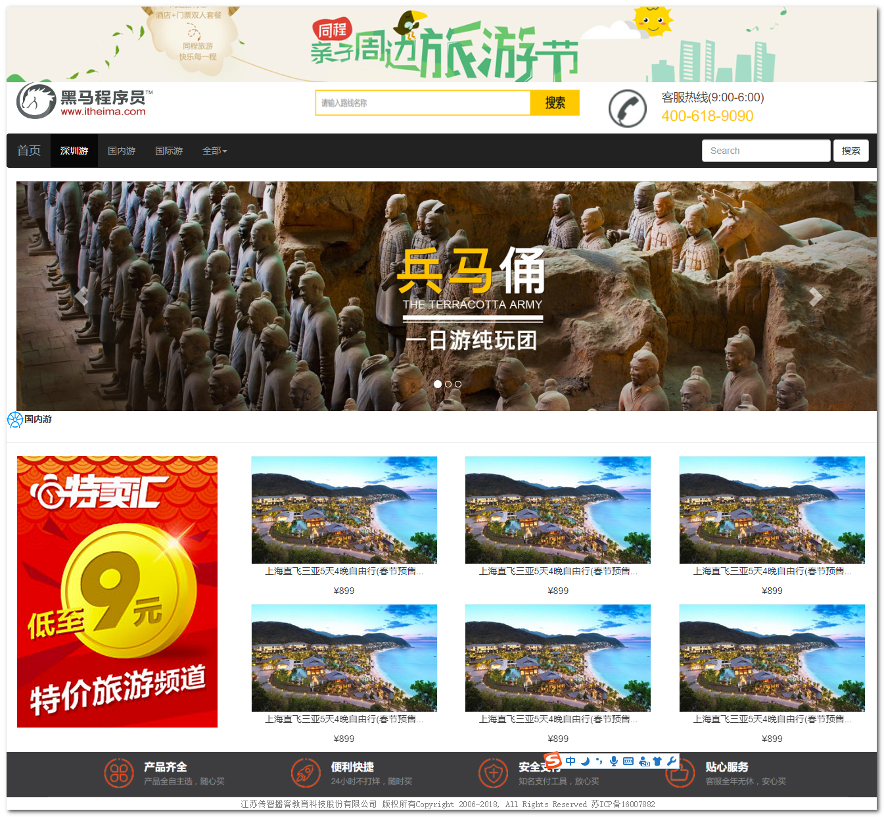

### 二,技术分析

+ 翻阅BootStrap文档

### 三,思路分析 ###


- 创建一个div(container)
- 里面嵌套8个div


### 四,代码实现 ###

```html
<!DOCTYPE html>
<html lang="en">
<head>
    <meta charset="UTF-8">
    <title>旅游首页</title>
    <!-- 最新版本的 Bootstrap 核心 CSS 文件 -->
    <link rel="stylesheet" href="../css/bootstrap.css" >
    <!--引入JQ-->
    <script src="../js/jquery-1.11.3.min.js"></script>
    <!-- 引入BS -->
    <script src="../js/bootstrap.js"></script>

    <meta name="viewport" content="width=device-width, initial-scale=1">


</head>
<body>
    <div class="container-fluid">
        <div class="row">
            
        </div>
        <div class="row">
            <div class="col-md-4 col-sm-6">
                
            </div>
            <div class="col-md-4 col-sm-6">
                
            </div>
            <div class="col-md-4 hidden-sm">
                
            </div>
        </div>
        <!--div: 菜单-->
        <div class="row">
            <nav class="navbar navbar-inverse">
                <div class="container-fluid">
                    <!-- Brand and toggle get grouped for better mobile display -->
                    <div class="navbar-header">
                        <button type="button" class="navbar-toggle collapsed" data-toggle="collapse" data-target="#bs-example-navbar-collapse-1" aria-expanded="false">
                            <span class="sr-only">Toggle navigation</span>
                            <span class="icon-bar"></span>
                            <span class="icon-bar"></span>
                            <span class="icon-bar"></span>
                        </button>
                        <a class="navbar-brand" href="#">首页</a>
                    </div>

                    <!-- Collect the nav links, forms, and other content for toggling -->
                    <div class="collapse navbar-collapse" id="bs-example-navbar-collapse-1">
                        <ul class="nav navbar-nav">
                            <li class="active">
                                <a href="#">深圳游<span class="sr-only">(current)</span></a>
                            </li>
                            <li>
                                <a href="#">国内游</a>
                            </li>
                            <li>
                                <a href="#">国际游</a>
                            </li>

                            <li class="dropdown">
                                <a href="#" class="dropdown-toggle" data-toggle="dropdown" role="button" aria-haspopup="true" aria-expanded="false">全部<span class="caret"></span></a>
                                <ul class="dropdown-menu">
                                    <li>
                                        <a href="#">深圳游</a>
                                    </li>
                                    <li>
                                        <a href="#">国内游</a>
                                    </li>
                                    <li role="separator" class="divider"></li>
                                    <li>
                                        <a href="#">国际游</a>
                                    </li>
                                </ul>
                            </li>
                        </ul>
                        <form class="navbar-form navbar-right">
                            <div class="form-group">
                                <input type="text" class="form-control" placeholder="Search">
                            </div>
                            <button type="submit" class="btn btn-default">搜索</button>
                        </form>

                    </div>
                    <!-- /.navbar-collapse -->
                </div>
                <!-- /.container-fluid -->
            </nav>

        </div>

        <div>
            <div id="carousel-example-generic" class="carousel slide" data-ride="carousel">
                <!-- Indicators -->
                <ol class="carousel-indicators">
                    <li data-target="#carousel-example-generic" data-slide-to="0" class="active"></li>
                    <li data-target="#carousel-example-generic" data-slide-to="1"></li>
                    <li data-target="#carousel-example-generic" data-slide-to="2"></li>
                </ol>

                <!-- Wrapper for slides -->
                <div class="carousel-inner" role="listbox">
                    <div class="item active">
                        
                        <div class="carousel-caption">
                        </div>
                    </div>
                    <div class="item">
                        
                        <div class="carousel-caption">
                        </div>
                    </div>

                    <div class="item">
                        
                        <div class="carousel-caption">
                        </div>
                    </div>
                </div>

                <!-- Controls -->
                <a class="left carousel-control" href="#carousel-example-generic" role="button" data-slide="prev">
                    <span class="glyphicon glyphicon-chevron-left" aria-hidden="true"></span>
                    <span class="sr-only">Previous</span>
                </a>
                <a class="right carousel-control" href="#carousel-example-generic" role="button" data-slide="next">
                    <span class="glyphicon glyphicon-chevron-right" aria-hidden="true"></span>
                    <span class="sr-only">Next</span>
                </a>
            </div>

        </div>


        <div class="row">
            <b>国内游</b>
            <hr color="yellow" size="5"/>
        </div>

        <div class="row">
            <div class="col-md-3 hidden-sm">
                
            </div>
            <div class="col-md-9 col-sm-12">
                <div class="col-md-4 col-sm-6" style="text-align: center">
                    <div></div>
                    <p>上海直飞三亚5天4晚自由行(春节预售...</p>
                    <p>¥899</p>
                </div>

                <div class="col-md-4 col-sm-6" style="text-align: center">
                    <div></div>
                    <p>上海直飞三亚5天4晚自由行(春节预售...</p>
                    <p>¥899</p>
                </div>

                <div class="col-md-4 col-sm-6" style="text-align: center">
                    <div></div>
                    <p>上海直飞三亚5天4晚自由行(春节预售...</p>
                    <p>¥899</p>
                </div>

                <div class="col-md-4 col-sm-6" style="text-align: center">
                    <div></div>
                    <p>上海直飞三亚5天4晚自由行(春节预售...</p>
                    <p>¥899</p>
                </div>

                <div class="col-md-4 col-sm-6" style="text-align: center">
                    <div></div>
                    <p>上海直飞三亚5天4晚自由行(春节预售...</p>
                    <p>¥899</p>
                </div>

                <div class="col-md-4 col-sm-6" style="text-align: center">
                    <div></div>
                    <p>上海直飞三亚5天4晚自由行(春节预售...</p>
                    <p>¥899</p>
                </div>

            </div>
        </div>

        <div class="row">
            
        </div>
        <div class="row" style="text-align: center">
            <font color="gray" size="2" face="宋体">江苏传智播客教育科技股份有限公司 版权所有Copyright 2006-2018, All Rights Reserved 苏ICP备16007882</font>
        </div>
    </div>
</body>
</html>
```

## 案例四:发布静态网页 

### 一,案例需求

​	把我们写好的黑马旅游首页发布到服务器,供外界访问

### 二,技术分析

#### 1.什么是Nginx

​	Nginx是一种服务器软件，其最主要，最基本的功能是可以与服务器硬件结合，让程序员可以将程序发布在Nginx服务器上，让成千上万的用户可以浏览。

​	除此之外，Nginx还是一种高性能的HTTP和反向代理服务器，同时也是一个代理邮件服务器。也就是说，我们在Nginx上可以：

1. 可以发布网站
2. 可以实现负载均衡
3. 代理服务器
4. 可以作为邮件服务器实现收发邮件等功能

本课程我们只讨论Nginx发布网站的功能,其它的功能后续课程会深入学习.

#### 2.在Windows中使用Nginx

1. 进入http://nginx.org/网站，下载nginx-1.13.8.zip文件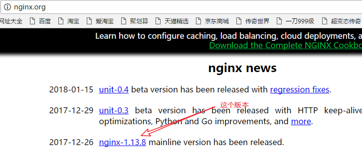

   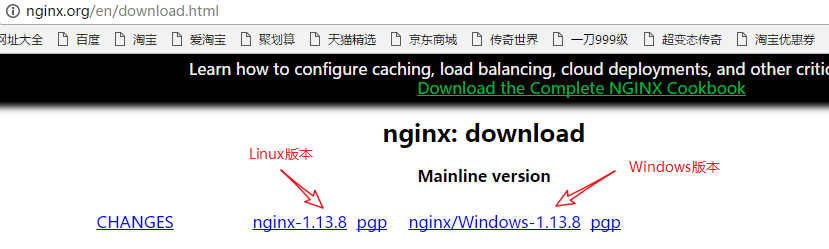

2. 进入CMD模式，并切换到Nginx安装文件所在的目录

   按住Shift+鼠标右键 , 在此处打开命令行

   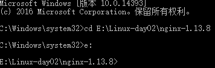

3. 用start  nginx命令，启动Nginx服务器

   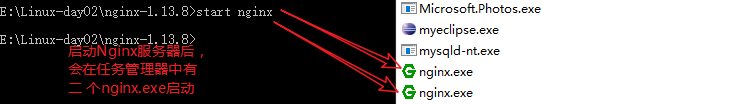

4. 打开Windows中的浏览器，访问本机中Nginx服务器首页，Nginx服务器默认监听80端口

   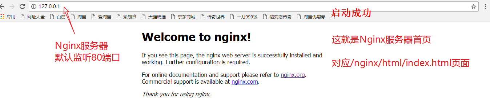

5. 用nginx  -s  stop命令，停止Nginx服务器

   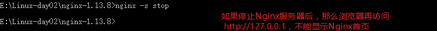

### 三,配置和发布

1. 修改Nginx目录中conf目录下的nginx.conf配置文件，并保存

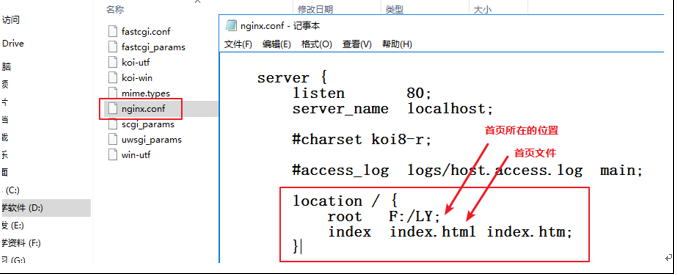

2. 用nginx -s reload命令，启动Nginx服务器

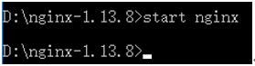

3. 访问


