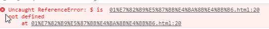
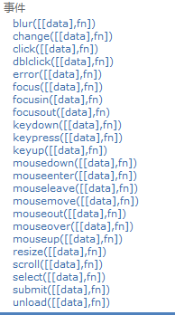
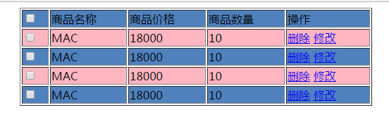
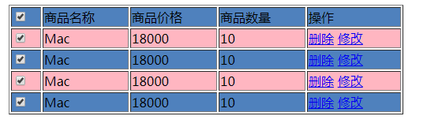

# day34-jquery3基础       #
## 学习目标：

1. 能够引入jQuery
2. 能够使用jQuery的基本选择器
3. 能够使用jQuery的层级选择器
4. 能够使用jQuery的属性选择器
5. 能够使用jQuery的基本过滤选择器
6. 能够使用jQuery的完成案例-广告的显示与隐藏
7. 能够完成隔行换色案例
8. 能够完成全选全不选案例 


## 案例一:使用JQuery完成页面定时弹出广告 ##

### 一,需求分析 ###


- 进入页面3s后弹出广告,3s后广告隐藏 


### 二,技术分析 ###

#### 1.JQ概述

##### 1.1 jQuery的概述 

​	jQuery是一个优秀的javascript库，兼容css3和各大浏览器，提供了dom、events、animate、ajax等简易的操作。  并且jquery的插件非常丰富，大多数功能都有相应的插件解决方案。jquery的宗旨是 write less do
more。

​	说白了: JQ就是js库, 封装了JS常见的操作,我们使用起来更加的简单  (特别是dom这块)

##### 1.2 jQuery的作用

​	jQuery最主要的作用是简化js的Dom树的操作 

##### 1.3 jQuery框架的下载

​	jQuery的官方下载地址：http://www.jquery.com

##### 1.4 jQuery的版本

+ 1.x：兼容IE678，使用最为广泛的，官方只做BUG维护，功能不再新增。因此一般项目来说，使用1.x版本就可以了，最终版本：1.12.4 (2016年5月20日)

+ 2.x：不兼容IE678，很少有人使用，官方只做BUG维护，功能不再新增。如果不考虑兼容低版本的浏览器可以使用2.x，最终版本：2.2.4 (2016年5月20日)

+ 3.x：不兼容IE678，很多老的jQuery插件不支持这个版本。目前该版本是官方主要更新维护的版本.

+ 注:开发版本与生产版本，命名为jQuery-x.x.x.js为开发版本，命名为jQuery-x.x.x.min.js为生产版本，开发版本源码格式良好，有代码缩进和代码注释，方便开发人员查看源码，但体积稍大。而生产版本没有代码缩进和注释，且去掉了换行和空行，不方便发人员查看源码，但体积很小 

  

#### 2.jq入门

需求: 等页面加载完成之后 弹出 hello...  

步骤:

1. 导入jq库
2. 使用JQ的语法 弹出hello  

- 把jq库导入到我们项目下，在html页面使用 `<script>`导入。

  ```
  <script type="text/javascript" src="jquery-x.x.x.js></script>
  ```

- 代码

  ```html
  <!DOCTYPE html>
  <html>
  <head>
  <meta charset="UTF‐8">
  <title>Insert title here</title>
  <!‐‐ 引入jQuery ‐‐>
  <script type="text/javascript" src="../js/jquery‐3.3.1.js"></script>
  <!‐‐ 测试jQuery ‐‐>
  <script type="text/javascript">
    $(function(){
    alert("jQuery引入成功....");
    });
  </script>
  </head>
  <body>
  </body>
  </html>
  ```


注: 没有导入JQuery库会出现如下bug:





#### 3.jQuery对象和JS对象转换【重点】

​	JS对象:  document.getElemxxx()  获得的都是JS对象  大部分都是属性

​	JQ对象: $()   大部分都是方法

​	jQuery本质上虽然也是js，但如果使用jQuery的属性和方法那么必须保证对象是jQuery对象而不是js方式获得的DOM对象。使用js方式获取的对象是js的DOM对象，使用jQuery方式获取的对象是jQuery对象。两者的转换关系如下：

- js的DOM对象转换成jQuery对象，==语法：$(js对象)==


- jQuery对象转换成js对象，==语法：jquery对象[索引]== 或 jquery对象.get(索引); 一般索引写0

```html
<body>
    <span id="spanId"></span><br/>
    <input type="button" value="插入内容" onclick="writeIn()"/>
    <input type="button" value="插入内容" onclick="writeIn02()"/>
</body>

<script>
    //1.把js对象转成jq对象 $(js对象)
    //向span插入hello..
    function writeIn() {
        //1.获得span标签对象     spanEle.innerHTML  ="hello...";
        var spanEle =  document.getElementById("spanId");
        //2.把js对象转成jq对象 $(js对象)
        var $spanEle =  $(spanEle);
        //3.调用jq对象的方法 html() 内部封装了innerHTML属性
        $spanEle.html("hello...");
    }

    //2.把jq对象转成js对象  jq对象[下标]或者jq对象.get(下标)
    function writeIn02() {
        //1.获得span标签对象(Jq对象)     $spanEle.html("hello..");
        var $spanEle =  $("#spanId");
        //2.把jq对象转成js对象
        var spanEle  = $spanEle[0];

        spanEle.innerHTML = "hello..";

    }

</script>
```


#### 4.jq中事件的使用




##### 4.1 基本事件的使用【重点】

+ 事件在jq里面都封装成了方法. 去掉了JS里面on.  语法:


```
jq对象.事件方法名(function(){});  eg: btn.click(function(){});
```

+ 点击事件


```html
<body>
    <input id="btnId" type="button" value="点我吧" />
</body>

<script>
    //jq对象.click(function(){})
    $("#btnId").click(function () {
        alert("hello...");
    });

</script>
```

+ 获得焦点和失去焦点

```html
<body>
    <input id="inputId"  type="text" value="hello.."/>
</body>

<script>
    //jq对象.focus(function(){})  获得焦点事件
    //this就是当前对象(是JS对象), 谁获得了焦点this就是谁
    $("#inputId").focus(function () {
        //this ----> document.getElementById("inputId");
        console.log("获得了焦点..."+this.value);
    });

    //jq对象.blur(function(){})  失去焦点事件
    $("#inputId").blur(function () {
        console.log("失去了焦点...");
    });

</script>
```


+ 内容改变事件 


```html
<body>
    <select id="starSelectId">
        <option value="Jordan">乔丹</option>
        <option value="James">詹姆斯</option>
        <option value="Kobe">科比</option>
        <option value="Iverson">艾弗森</option>
    </select>
</body>

<script>
    //jq对象.change(function(){}) 内容改变事件
    $("#starSelectId").change(function () {
        console.log("内容改变了..."+this.value);
    });
</script>
```


+ 鼠标相关的事件


```html
<body>
    <div  id="divId"></div>
</body>

<script>
    // jq对象.mouseenter()  鼠标进入
    $("#divId").mouseenter(function () {
        //this.style.backgroundColor = "red";
        $(this).css("backgroundColor","red");   //把js对象转成了jq对象
    });

    // jq对象.mouseout()  鼠标离开
    $("#divId").mouseout(function () {
        //this.style.backgroundColor = "blue";
        $(this).css("backgroundColor","blue");
    });

</script>
```


+ 键盘相关事件

```html
<body>
    <input id="inputId" type="text"/>
</body>

<script>

    //  jq对象.keydown()  键盘按下
    $("#inputId").keydown(function () {
        console.log("键盘按下...");
    });

    //  jq对象.keyup()  键盘抬起
    $("#inputId").keyup(function () {
        console.log("键盘抬起...");
    });


</script>
```

##### 4.2jQuery的事件绑定与解绑 

+ 事件的绑定

```JavaScript
jQuery元素对象.on(事件的类型,function(){} );
其中：事件名称是jQuery的事件方法的方法名称，例如：click、mouseover、mouseout、focus、blur等
```

+ 事件的解绑

```JavaScript
jQuery元素对象.off(事件名称);

其中：参数事件名称如果省略不写，可以解绑该jQuery对象上的所有事件
```

+ 实例代码

```html
<body>
    <input id="btnId" type="button" value="点我吧" /><br/>
    <input id="btnId02" type="button" value="解绑点我吧按钮的点击事件" /><br/>
</body>

<script>
    //jq对象.click(function(){})
    $("#btnId").click(function () {
        alert("hello...");
    });

    //jq对象.on(事件,function(){}) eg: 点击 jq对象.on("click",function(){})
   /* $("#btnId").on("click",function () {
       alert("hello word...");
    });*/

    $("#btnId02").on("click",function () {
        //解绑 btnId 的点击事件  jq对象.off("事件");
        $("#btnId").off("click");
    });

</script>
```

##### 4.3事件切换  

+ 普通写法

```
<script type="text/javascript">
	$(function() {
		$("#myDiv").mouseover(function() {
			$(this).css("background", "green");
		});
		$("#myDiv").mouseout(function() {
			$(this).css("background", "red");
		});
	});
</script>
```

+ 链式写法 

```
<script type="text/javascript">
	$(function() {
		$("#myDiv").mouseover(function() {
			$(this).css("background", "green");
		}).mouseout(function() {
			$(this).css("background", "red");
		});
	});
</script>
```

##### 4.4小结

1. JQ把js里面的事件 封装成了方法, 去掉了on 语法:

```
jq对象.事件的方法名(function(){}); 
//事件方法名: click(), focus(),blur(),change(),submit(),keydown(),keyup(),mouseenter(),
mouseout()
//eg: btn.click(function(){})
```


#### 5.jq动画 【了解】  

##### 5.1基本效果

+ 方法

| 方法名称                      | 解释                                         |
| ----------------------------- | -------------------------------------------- |
| show([speed],[easing],[fn]])  | 显示元素方法                                 |
| hide([speed,[easing],[fn]])   | 隐藏元素方法                                 |
| toggle([speed],[easing],[fn]) | 切换元素方法，显示的使之隐藏，隐藏的使之显示 |

+ 参数

| 参数名称   | 解释                                       |
| ------ | ---------------------------------------- |
| speed  | 三种预定速度之一的字符串("slow","normal", or "fast")或表示动画时长的毫秒数值(如：1000) |
| easing | 用来指定切换效果，默认是"swing"，可用参数"linear"         |
| fn     | 在动画完成时执行的函数，每个元素执行一次                     |

+ 实例

```html
<input type="button" value="show()" id="btn1" />
<input type="button" value="hide()" id="btn2" />
<input type="button" value="toggle()" id="btn3" />

<br />
<div id="div1" style="width: 100px; height: 100px; border: 1px solid red;"></div>


<script>
	$("#btn1").click(function() {
		$("#div1").show(1000);

	});

	$("#btn2").click(function() {
			$("#div1").hide(1000,function(){
				alert("Bye...");
			});
	});
	

	$("#btn3").click(function() {
		$("#div1").toggle();

	});
</script>
```

##### 5.2滑动效果

+ 方法

| 方法名称                               | 解释                     |
| ---------------------------------- | ---------------------- |
| slideDown([speed,[easing],[fn]])   | 向下滑动方法                 |
| slideUp([speed,[easing],[fn]])     | 向上滑动方法                 |
| slideToggle([speed],[easing],[fn]) | 切换元素方法，显示的使之隐藏，隐藏的使之显示 |

+ 参数

| 参数名称   | 解释                                       |
| ------ | ---------------------------------------- |
| speed  | 三种预定速度之一的字符串("slow","normal", or "fast")或表示动画时长的毫秒数值(如：1000) |
| easing | 用来指定切换效果，默认是"swing"，可用参数"linear"         |
| fn     | 在动画完成时执行的函数，每个元素执行一次                     |

##### 5.3 淡入淡出效果

+ 方法

| 方法名称                              | 解释                     |
| --------------------------------- | ---------------------- |
| fadeIn([speed,[easing],[fn]])     | 淡入显示方法                 |
| fadeOut([speed,[easing],[fn]])    | 淡出隐藏方法                 |
| fadeToggle([speed],[easing],[fn]) | 切换元素方法，显示的使之隐藏，隐藏的使之显示 |

+ 参数

| 参数名称   | 解释                                       |
| ------ | ---------------------------------------- |
| speed  | 三种预定速度之一的字符串("slow","normal", or "fast")或表示动画时长的毫秒数值(如：1000) |
| easing | 用来指定切换效果，默认是"swing"，可用参数"linear"         |
| fn     | 在动画完成时执行的函数，每个元素执行一次                     |

### 三,思路分析 ###

1. 在index.html的顶部定义一个广告区域, 设置隐藏

2. 设置定时任务

   ```
   setTimeout("showAd()",3000);
   ```

3. 创建showAd()

   ```
   function showAd(){
   	//1.获得广告标签
   	//2.调用show()方法展示
   	//3.创建定时任务
   	setTimeout("hideAd()",3000);
   }
   ```

4. 创建hideAd()函数

   ```
   function hideAd(){
   	//1.获得广告标签
   	//2.调用hide()方法展示
   
   }
   ```

###四,代码实现 ###

```html
<script>
    //创建定时任务,显示广告
    setTimeout("showAd()",3000);

    //创建showAd()函数
    function showAd() {
        //1.获得广告div对象
        var $adObj =   $("#adDiv");

        //2.调用show()方法展示
        $adObj.show(3000,function () {
            //3.再创建定时任务,3s之后隐藏 setTimeout("hideAd()",3000);
            setTimeout("hideAd()",3000);
        });

    }
    //创建hideAd()函数
    function hideAd() {
        //1.获得广告div对象
        var $adObj =   $("#adDiv");
        //2.调用hide()方法隐藏
        $adObj.hide(3000);
    }

</script>
```

### 五,选择器总结   ###

​	选择器的作用: 得到标签对象, 获得就是JQ对象  

#### 1.基本选择器【重点】

+ 语法

| 选择器名称        | 语法              | 解释                  |
| ------------ | --------------- | ------------------- |
| 标签选择器（元素选择器） | $("html标签名")    | 获得所有匹配标签名称的于元素      |
| id选择器        | $("#id的属性值")    | 获得与指定id属性值匹配的元素     |
| 类选择器         | $(".class的属性值") | 获得与指定的class属性值匹配的元素 |

#### 2 层级选择器 

+ 语法

| 选择器名称     | 语法       | 解释                       |
| -------------- | ---------- | -------------------------- |
| ==后代选择器== | $("A  B ") | 选择A元素内部的所有B元素   |
| 子选择器       | $("A > B") | 选择A元素内部的所有B子元素 |
| 兄弟选择器     | $("A + B") | 获得A元素同级的下一个B元素 |
| 兄弟选择器     | $("A ~ B") | 获得A元素同级的所有B元素   |

#### 3 属性选择器

+ 语法

| 选择器名称 | 语法            | 解释              |
| ----- | ------------- | --------------- |
| 属性选择器 | $("A[属性名]")   | 包含指定属性的选择器      |
| 属性选择器 | $("A[属性名=值]") | 包含指定属性等于指定值的选择器 |

#### 4.基本过滤选择器

+ 语法

| 选择器名称     | 语法           | 解释                           |
| -------------- | -------------- | ------------------------------ |
| 首元素选择器   | :first         | 获得选择的元素中的第一个元素   |
| 尾元素选择器   | :last          | 获得选择的元素中的最后一个元素 |
| 非元素选择器   | :not(selecter) | 不包括指定内容的元素           |
| 偶数选择器     | :even          | 偶数，从 0 开始计数            |
| 奇数选择器     | :odd           | 奇数，从 0 开始计数            |
| 等于索引选择器 | :eq(index)     | 指定索引元素                   |
| 大于索引选择器 | :gt(index)     | 大于指定索引元素               |
| 小于索引选择器 | :lt(index)     | 小于指定索引元素               |

#### 5.表单属性选择器

+ 语法

| 选择器名称    | 语法        | 解释            |
| -------- | --------- | ------------- |
| 可用元素选择器  | :enabled  | 获得可用元素        |
| 不可用元素选择器 | :disabled | 获得不可用元素       |
| 选中选择器    | :checked  | 获得单选/复选框选中的元素 |
| 选中选择器    | :selected | 获得下拉框选中的元素    |


## 案例二使用JQuery完成表格的隔行换色 ##

### 一,需求分析 ###



### 二,技术分析 ###

#### 1.jQuery操作CSS样式

| API方法           | 解释      |
| --------------- | :------ |
| css(name)       | 获取CSS样式 |
| css(name,value) | 设置CSS样式 |

```html
<body>
    <div id="divId" style="width: 100px;height: 100px;background-color: red"></div>
    <input type="button" value="获得背景色的样式值" id="btn01"/>
    <input type="button" value="设置背景色的样式值为green" id="btn02"/>

</body>
<script>
    $("#btn01").click(function () {
        //获得div里面的CSS样式的值
        var colorValue =  $("#divId").css("background-color");
        alert("colorValue="+colorValue);
    });

    $("#btn02").click(function () {
        //设置背景色的样式值为green
        $("#divId").css("background-color","green");
    });

</script>
```

#### 2.jQuery操作标签的类名

| API方法              | 解释                  |
| ------------------ | :------------------ |
| addClass(value)    | 给指定的对象添加类名          |
| removeClass(value) | 给指定的对象删除类名          |
| toggleClass(value) | 如果没类名，则添加，如果有类名，则删除 |

```html
    <body>
        <span>哈哈</span><br/>
        <span>hello</span><br/>
        <span>哈哈</span><br/>
        <span>哈哈</span><br/>
        <span>哈哈</span><br/>
        <span>哈哈</span><br/>
        <input type="button" value="添加class" id="btn01"/>
        <input type="button" value="移除class" id="btn02"/>
    </body>
    <script>
        $("#btn01").click(function () {
            //给span添加类 spanClass
            $("span").addClass("spanClass");
        });
        $("#btn02").click(function () {
            //给span移除类 spanClass
            $("span").removeClass("spanClass");
        });
    </script>
```

### 三,思路分析

1. 使用选择器匹配出奇数行, 设置一个背景色
2. 使用选择器匹配出偶数行, 设置一个背景色

### 四,代码实现 ###


```
<script>
    //- 筛选出奇数的tr, 设置一个背景色
    $("tr:odd").css("backgroundColor","#FFB6C1");
    //- 筛选出偶数的tr, 设置一个背景色
    $("tr:even").css("backgroundColor","#4F81BD");
</script>
```


## 案例三使用JQuery完成复选框的全选效果 ##

### 一,需求分析 ###




### 二,技术分析 ###

#### 1.jq操作标签属性【重点】

css: 操作样式 操作css的属性 style里面的内容

 attr:操作属性 标签的属性 

+ 语法

| API方法              | 解释                          |
| ------------------ | --------------------------- |
| attr(name,[value]) | 获得/设置属性的值                   |
| prop(name,[value]) | 获得/设置属性的值(checked，selected) |

+ attr与prop的注意问题

  ​	attr与prop是以1.6为界限

  ​	checked 和 selected 建议 使用prop获取

  ​	其他使用attr获取 

### 三.思路分析 ###

1. 准备页面
2. 给最上面的复选框设置点击事件
3. 获得下面四个复选框, 把下面四个复选框的checked和最上面的复选框checked保持一致


### 四,代码实现 ###

- js代码


```
	<script>
		//给最上面的复选框设置点击事件,创建一个匿名函数响应这个事件
		$("#all").click(function() {
			//根据最上面的复选框是否选中而选中,this是最上面复选框对象(并且是dom(js)对象)
			$(".one").attr("checked",this.checked);
		});
	</script>
```


## 扩展案例_ 表格颜色

### 1.案例需求 


+ 鼠标进入的tr的时候, 当前行改成red
+ 鼠标离开tr的时候, 还原本来的颜色

### 2.思路

1. 给tr设置鼠标进入(mouseenter)和离开(mouseout)事件
2. 创建函数响应鼠标进入(mouseenter)
   + 给tr设置背景色(css)为red
3. 创建函数响应鼠标离开(mouseout)
   + 给tr设置背景色(css)为之前的颜色

