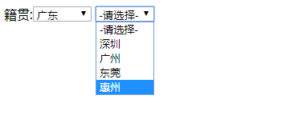
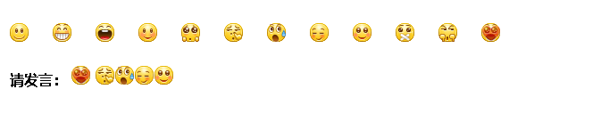
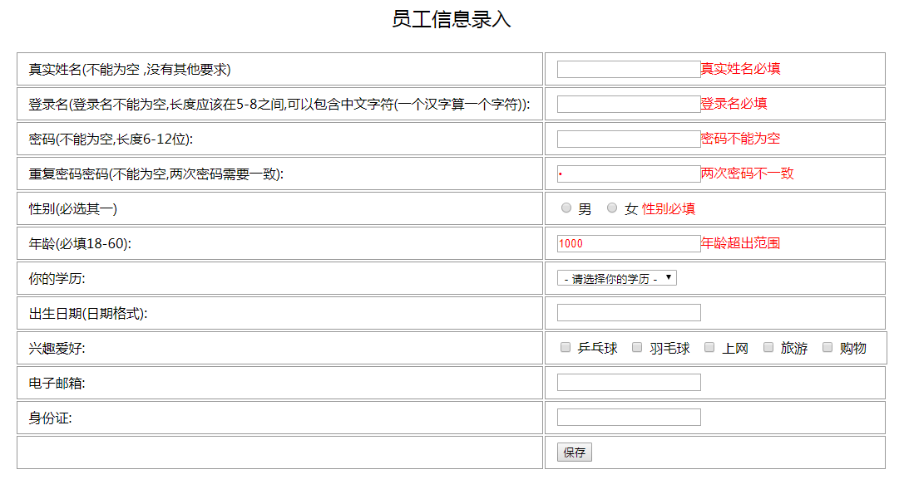
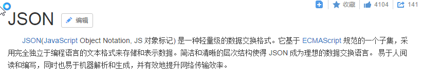
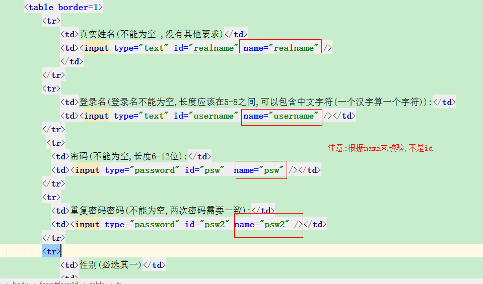
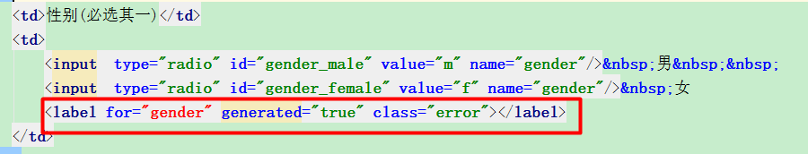

# day35-jquery3高级 #

## 学习目标

1. 能够使用jQuery对象的遍历方法
2. 能够使用jQuery全局的遍历方法
3. 能够使用jQuery3.0的for-of遍历方法
4. 能够使用jQuery的DOM操作的方法
5. 能够理解jQuery的插件机制及其相关API
6. 能够使用jQuery的表单校验插件进行表单校验

## 案例一使用JQuery完成省市联动效果

### 一,需求分析




### 二,技术分析

#### 1.遍历

##### 1.1 原始方式遍历

+ 语法

```js
for(var i=0;i<元素数组.length;i++){
  	元素数组[i];
}
```

+ eg

```
//定义了一个数组
var array = [1,2,3,4,"aa"];
//a. 使用原来的方式遍历
for(var i = 0; i < array.length;i++){
  console.log("array["+i+"]="+array[i]);
}
```

##### 1.2 jquery对象方法遍历

+ 语法

```js
jquery对象.each(function(index,element){});

其中:(参数名字随便取的)
index:就是元素在集合中的索引
element：就是集合中的每一个元素对象
```

+ eg

```
//b 使用JQ来遍历 jquery对象.each(function(index,element){}); 第一个参数index 索引, 第二个参数element每个索引对应的值(参数的名字随意)
$(array).each(function (a,n) {
  console.log("array["+a+"]="+n);
});
```

##### 1.3 jquery的全局方法遍历

+ 语法

```js
$.each(jquery对象,function(index,element){});

其中，
index:就是元素在集合中的索引
element：就是集合中的每一个元素对象
```

+ eg

```
        //c. 全局方式遍历 $.each(jquery对象,function(index,element){});  第一个参数index 索引, 第二个参数element每个索引对应的值(参数的名字随意)
        $.each($(array),function (a,n) {
            console.log("array["+a+"]="+n);
        });
```

##### 1.4 jQuery3.0新特性for  of语句遍历

+ 语法

```js
for(变量 of jquery对象){
  	变量；
}

其中，
变量:定义变量依次接受jquery数组中的每一个元素
jquery对象：要被遍历的jquery对象
```

+ eg

```
//d jq3.0 新特性 for(变量 of jquery对象), 变量就是每一次遍历的数据
for(n of $(array)){
  console.log("n="+n);
}
```

#### 2.使用JQ操作DOM

##### 2.1jQuery对DOM树中的文本和值进行操作 

+ API

| API方法         | 解释                   |
| ------------- | -------------------- |
| val([value])  | 获得/设置标签里面value属性相应的值 |
| text([value]) | 获得/设置元素的文本内容         |
| html([value]) | 获得/设置元素的标签体内容        |

+ 解释

```
val()       获得标签里面value属性的值   value属性的封装  
val("...")    给标签value属性设置值

html()      获得标签的内容，如果有标签，一并获得。    
html("....)  设置html代码，如果有标签，将进行解析。支持标签 


text()		获得标签的内容，如果有标签，忽略标签。
text("..."")	设置文本，如果含有标签，把标签当做字符串.不支持标签
```

- val()和val(...) 

```html
    <body>
        <input type="text" value="hello..." id="inputId"/><br/>
        <input type="submit" value="获得value" id="btn01"/>
        <input type="submit" value="设置value" id="btn02"/>

    </body>
    <script>    
        $("#btn01").click(function () {
            //获得inputId输入框的value; jq对象.val();
            var value =  $("#inputId").val();
            console.log("value="+value);
        });

        $("#btn02").click(function () {
            //设置inputId输入框的value; jq对象.val("值");
            $("#inputId").val("你好世界...");

        });
    </script>
```

- text()和html()

```
	<body>
		<p id="pId"><font>hello...</font></p>
		<input type="button" value="text()" id="btn1" />
		<input type="button" value="html()" id="btn2" />
	</body>
	
	<script>
		$("#btn1").click(function(){
			var data=  $("#pId").text();
			console.log("data="+data);//结果:hello...
		});
		
		
		$("#btn2").click(function(){
			var data=  $("#pId").html();
			console.log("data="+data);结果:<font>hello...</font>
		});
		
	</script>
```

- text(....)和html(...)

```
		<p id="pId"></p><br />
		<input type="button" id="btn1" value="html(...)" />
		<input type="button" id="btn2" value="text(...)" />
		
		<script>
			$("#btn1").click(function(){
				$("#pId").html("<font color='red'>hello...</font>");
			});
			
			$("#btn2").click(function(){
				$("#pId").text("<font color='red'>hello...</font>");
			});
			
		</script>
```

##### 2.2jQuery创建,插入对象 

+ API   

| API方法             | 解释                                     |
| ------------------- | ---------------------------------------- |
| $("A")              | 创建A元素对象                            |
| **append(element)** | 添加成最后一个子元素，两者之间是父子关系 |
| prepend(element)    | 添加成第一个子元素，两者之间是父子关系   |
| appendTo(element)   | 添加到父元素的内部最后面                 |
| prependTo(element)  | 添加到父元素的内部最前面                 |
| before(element)     | 添加到当前元素的前面，两者之间是兄弟关系 |
| after(element)      | 添加到当前元素的后面，两者之间是兄弟关系 |

+ 内部插入:父节点/子字点之间操作

```
	append		a.append(c), 将c插入到a的内部的后面;   添加最小的孩子
				<a>
					...
					<c></c>
				</a>
	prepend		a.prepend(c),将c插入到a的内部的前面;    添加最大的孩子
			
				<a>
					<c></c>
					...
				</a>
	
	---------------------------------------------------------------------------------
	appendTo	a.appendTo(c), 将a插入到c的内部的后面;   最小的孩子找干爹
	
				<c>
					...
					<a></a>
				</c>
	
	prependTo	a.prependTo(c),将a插入到c的内部的前面 ;   最大的孩子找干爹
	
				<c>
					<a></a>
					...
				</c>
```

+ 外部插入(了解): 兄弟节点之间操作

```
after   a.after(c);  哥哥找弟弟
		<a></a><c></c>
before  a.before(c);  弟弟找哥哥
		<c></c><a></a>
```

##### 2.3jQuery移除节点(对象) 

+ API

| API方法    | 解释             |
| -------- | -------------- |
| remove() | 删除指定元素(自己移除自己) |
| empty()  | 清空指定元素的所有子元素   |


### 三,思路分析

1. 创建页面, 初始化数据

2. 给省份的select设置内容改变事件

```js
省份的select对象.change(function(){
	//1.获得省份的值
    //2.根据省份的值, 获得城市的数据(数组)
    //3.遍历城市的数据(数组), 向城市的select里面append("<option>城市名字</option>")
})
```


### 四,代码实现

- js代码


```
<script>
		var array = new Array(3);
		array[0] = ["深圳", "广州", "东莞", "惠州"];
		array[1] = ["武汉", "黄冈", "黄石", "鄂州"];
		array[2] = ["济南", "青岛", "烟台"];
		
		//给省份的select设置内容改变事件
		$("#province").change(function(){
			//得到省份的值,this是js对象
			var pValue = this.value;//0
			
			//得到城市的select对象
			var $cityObj =  $("#city");
			
			//清除之前的数据
			$cityObj.html("<option>-请选择-</option>");
			
			if(pValue >= 0){
				//根据省份的值更新城市的数据
				var citys = array[pValue];//["深圳", "广州", "东莞", "惠州"]
				
				
				//把js对象转jq对象
				var  $citys = $(citys);
				//遍历城市的数据
				$citys.each(function(i,n){//n=深圳
					//把单个的城市添加到城市的select里面
					$cityObj.append("<option>"+n+"</option>");
					
				});
				
				
			}
			
		});
		
	</script>
```

## 案例二QQ表情案例

### 一,需求分析



### 二, 思路分析

1. 给每一个表情图片设置点击事件 

```
xx.click(function(){
 //2.把点击的当前的img添加到下面的 请发言区域里p面来
});
```


### 三,代码实现

```html
<!DOCTYPE html>
<html>
<head>
    <meta charset="UTF-8" />
    <title>QQ表情选择</title>
    <style type="text/css">
		*{margin: 0;padding: 0;list-style: none;}
		.emoji{margin:50px;}
		ul{overflow: hidden;}
		li{float: left;width: 48px;height: 48px;cursor: pointer;}
		.emoji img{ cursor: pointer; }
    </style>
    <script src="../js/jquery-3.3.1.js"></script>
    <script>
        $(function () {
            $(".emoji li img").click(function () {
				//把当前的小表情克隆，再追加到p元素中
                $(this).clone().appendTo(".word");
            });
        });
    </script>
</head>
<body>
    <div class="emoji">
        <ul>
            <li></li>
            <li></li>
            <li></li>
            <li></li>
            <li></li>
            <li></li>
            <li></li>
            <li></li>
            <li></li>
            <li></li>
            <li></li>
            <li></li>
        </ul>
        <p class="word">
            <strong>请发言：</strong>
            
        </p>
    </div>
</body>
</html>
```


## 案例三使用JQuery完成表单的校验 ##

### 一,需求分析 ###

​	在学习JavaScript时，我们手动的完成过表单数据的校验，此功能在开发中非常常见，属于通用功能范畴，实际开发一般使用都是第三方工具。本案例我们将使用jQuery插件validation进行表单的校验。




### 二,技术分析 ###

#### 1.JSON 【重点】

##### 1.1概念



​		json是一种容易生成和解析的数据的交换格式 

##### 1.2格式

+ json对象{},1.以key:value的形式存在. key是字符串类型(标准JSON),

  ​		2.value可以是任何合法数据类型.

  ​		3.多个字段(key)之间通过,隔开,最后一个,不用写

  ```
  {"name":"张三","age":18}
  ```

+ 数组 []

  ```
  [{"name":"张三","age":18},{"name":"李四","age":20}]
  ```

+ 对象和数组嵌套

  ```
  {"p1":{"name":"张三","age":18},"p23":[{"name":"李四","age":19},{"name":"王五","age":20}]};
  ```

#### 2.jQuery插件

##### 2.1什么是jq插件

​		插件就是以jquery为基础进行扩展具有特定功能的代码，就是jquery插件。例如：图片轮播、选项卡等。

​	`http://www.jq22.com`  插件网站 

##### 2.2jQuery的插件机制

​	jQuery插件的机制说白了就是插件实现原理.  

​	其实就是利用jQuery提供的`$.fn.extend()` 和`$.extend()` 方法，扩展jQuery的功能。

##### 2.3 jQuery插件机制语法


111

| 语法                  | 解释              | 方法例子         |
| ------------------- | --------------- | ------------ |
| $.fn.extend(object) | 对jQuery对象进行方法扩展 | jq对象.each(); |
| $.extend(object)    | 对jQuery全局进行方法扩展 | $.each();    |

111

##### 2.4自定义jq插件

+ 对jQuery对象进行方法扩展 

```js
<!DOCTYPE html>
<html>
<head>
    <meta charset="UTF-8">
    <title>01-jQuery对象进行方法扩展</title>
    <script src="../js/jquery-3.3.1.js" type="text/javascript" charset="utf-8"></script>
    <script type="text/javascript">
        /*
        * jquery插件：用于对jquery进行扩展
        *    1.对jquery对象方法扩展
        *    2.对jquery全局方法扩展
        * */
        $(function () {
            //扩展jquery对象增加让复选框选中的方法,方法名：check
            $.fn.extend({
                check: function () {
                    this.prop("checked", true);
                },
                uncheck: function () {
                    this.prop("checked", false);
                }
            });
        });

        function checkFn() {
            //调用扩展方法check，实现让复选框选中
            $("input:checkbox").check();
        }

        function uncheckFn() {
            //调用扩展方法uncheck，实现让复选框不选中
            $("input:checkbox").uncheck();
        }
    </script>
</head>
<body>
  <input id="btn-check" type="button" value="点击选中复选框" onclick="checkFn()">
  <input id="btn-uncheck" type="button" value="点击取消复选框选中" onclick="uncheckFn()">
  <br/>
  <input type="checkbox" value="football">足球
  <input type="checkbox" value="basketball">篮球
  <input type="checkbox" value="volleyball">排球
</body>
</html>
```

+ 对jQuery全局进行方法扩展 

```js
    <script type="text/javascript">
        $.extend({
            //定义js对象的min属性，值是一个函数，返回a与b比较的最小值
            min: function (a, b) {
                return a < b ? a : b;
            },
            //定义js对象的max属性，值是一个函数，返回a与b比较的最大值
            max: function (a, b) {
                return a > b ? a : b;
            }
        });
        alert($.max(3, 5));
    </script>
```

#### 3.表单校验插件validation

##### 3.1validation概述 

​	网络上有许多成熟的插件共使用者参考，插件就是将jquery实现的常用操作进行封装，封装后的“小框架“就可以叫做插件，按照插件的语法去操作可以实现很多复杂的功能，而我们需要做的是学会该插件的使用语法即可。表单校验插件是按照一定的语法编写代码，可以使用简单的代码完成复杂的表单校验工作 

##### 3.2validation下载

​	官网地址：[http://jqueryvalidation.org/files/jquery-validation-1.15.0.zip](http://jqueryvalidation.org/files/jquery-validation-1.15.0.zip)

​	帮助文档位置：http://jqueryvalidation.org/documentation/

##### 3.3validation使用步骤

+ 将该插件（也就是一个js文件）导入到我们的工程中
+ 在要使用校验插件的html中引入该js文件

```
<!--依赖的jQuery库-->
<script src="../js/jquery-1.8.3.js" type="text/javascript" charset="utf-8" />
<!--validation校验库-->
<script src="../js/jquery.validate.js" type="text/javascript" charset="utf-8" />
```

+ 编写表单校验的代码（语法）

```
<script type="text/javascript">

    $(function() {

        $("#formId").validate(
        	{
        		key:value
        	}
        );

    });
</script>
```

##### 2.4检验方式：js 代码方式 

```
语法：
$(…).validate({
	rules:{},
	messages:{}
});

rules 规则语法：
	rules:{
		字段名(标签的name的属性值):校验器,
		字段名(标签的name的属性值):校验器
	}
	
校验器语法：
	语法：{校验器:值,校验器:值,...}
	
message 提示语法：
	messages:{
		字段名:{校验器:"提示",校验器:"提示",...}
	}
```

| 序号   | 规则                 | 描述                                       |
| ---- | ------------------ | ---------------------------------------- |
| 1    | required:true      | 必须输入的字段。                                 |
| 2    | remote:"check.php" | 使用 ajax 方法调用 check.php 验证输入值。            |
| 3    | email:true         | 必须输入正确格式的电子邮件。                           |
| 4    | url:true           | 必须输入正确格式的网址。                             |
| 5    | date:true          | 必须输入正确格式的日期。日期校验 ie6 出错，慎用。              |
| 6    | dateISO:true       | 必须输入正确格式的日期（ISO），例如：2009-06-23，1998/01/22。只验证格式，不验证有效性。 |
| 7    | number:true        | 必须输入合法的数字（负数，小数）。                        |
| 8    | digits:true        | 必须输入整数。                                  |
| 9    | creditcard:        | 必须输入合法的信用卡号。                             |
| 10   | equalTo:"#id名"     | 输入值必须和 #id对应的标签对象的值 相同。                  |
| 11   | accept:            | 输入拥有合法后缀名的字符串（上传文件的后缀）。                  |
| 12   | maxlength:5        | 输入长度最多是 5 的字符串（汉字算一个字符）。                 |
| 13   | minlength:10       | 输入长度最小是 10 的字符串（汉字算一个字符）。                |
| 14   | rangelength:[5,10] | 输入长度必须介于 5 和 10 之间的字符串（汉字算一个字符）。         |
| 15   | range:[5,10]       | 输入值必须介于 5 和 10 之间。                       |
| 16   | max:5              | 输入值不能大于 5。                               |
| 17   | min:10             | 输入值不能小于 10。                              |


### 三,思路分析 ###


### 四,代码实现 ###

+ html



+ js代码   

```js
<script type="text/javascript">
	$("#formId").validate({
		rules:{
            realname:{
                required:true
			},
            username:{
                required:true,
                rangelength:[5,8]
			},
            psw:{
                required:true,
                rangelength:[6,12]
			},
            psw2:{
                required:true,
                equalTo:"#psw"

			},
            gender:{
                required:true
			},
			age:{
                required:true,
                range:[18,60]
			}
		},

        messages:{
            realname:{
                required:"真实姓名必填"
            },
            username:{
                required:"登录名必填",
                rangelength:"登录名不合法"
            },
            psw:{
                required:"密码不能为空",
                rangelength:"密码长度不合法"
            },
            psw2:{
                required:"确认密码不能为空",
                equalTo:"两次密码不一致"

            },
            gender:{
                required:"性别必填"
            },
            age:{
                required:"年龄必填",
                range:"年龄超出范围"
            }

		}

	});
	
</script>
```

+ 解决单选框,提示语位置问题




# 总结

### 1.遍历

```
jq对象.each(function(下标, 下标对应的值){

})
```

### 2. 操作文档

+ html()和==html(...)==  内部封装了innerHTML
+ val()和val(...)
+ append()
+ prepend()

### 3.JSON【重点】

1. 建议今天先熟悉
2. 明天再讲一遍

### 4.JQ插件原理

| 语法                | 解释                     | 方法例子       |
| ------------------- | ------------------------ | -------------- |
| $.fn.extend(object) | 对jQuery对象进行方法扩展 | jq对象.each(); |
| $.extend(object)    | 对jQuery全局进行方法扩展 | $.each();      |


账号：javaee65@sz.itcast.cn

密码：kj23wcqe
