# Vue.js 

# 学习目标

- [ ] 了解vue（第一章）
- [ ] 掌握vue常用系统指令（第二章）
- [ ] 了解vue生命周期（第三章）
- [ ] 掌握vue的ajax的使用（第四章）

# 第一章-VueJS介绍与快速入门

## 知识点-VueJS介绍

### 1.目标

- [ ] 了解vue

### 2.路径

1. 什么是VueJS
2. VueJS特点
3. MVVM模式

### 3.讲解

#### 3.1什么是VueJS

​	Vue.js是一个渐进式JavaScript 框架。Vue.js 的目标是通过尽可能简单的 API 实现响应的数据绑定和组合的视图组件。它不仅易于上手，还便于与第三方库或既有项目整合。

​	官网:https://cn.vuejs.org/

#### 3.2特点

+ 易用
+ 灵活
+ 高效

#### 3.3MVVM模式

​	MVVM是Model-View-View-Model的简写。它本质上就是MVC 的改进版。

​	MVVM 就是将其中的View 的状态和行为抽象化，让我们将视图UI 和业务逻辑分开. MVVM模式和MVC模式一样，主要目的是分离视图（View）和模型（Model）Vue.js 是一个提供了 MVVM 风格的双向数据绑定的 Javascript 库，专注于View 层。它的核心是 MVVM 中的 VM，也就是 ViewModel。 ViewModel负责连接 View 和 Model，保证视图和数据的一致性，这种轻量级的架构让前端开发更加高效、便捷.

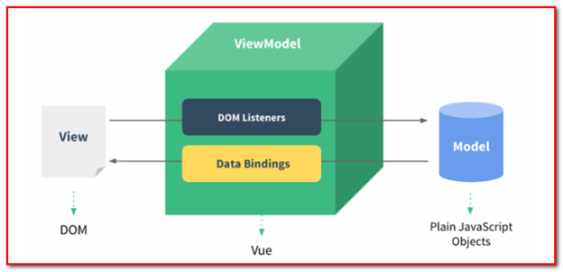

### 4.小结

1. 什么是VueJS?

   ​	是一个JS框架, 使用vue写前端逻辑很简洁 高效

2. MVVM ?

   model-view-view-model. mvc的改进版. 目的: 逻辑, 视图.  数据 分离

   双向绑定


## 案例-VueJs快速入门

### 1.需求

​	使用vue，对message赋值，并把值显示到页面

### 2.步骤

1. 创建工程(war),导入vuejs
2. 创建demo01.html, 引入vuejs
3. 创建vue实例

### 3.实现

1. 创建工程(war),导入vuejs

 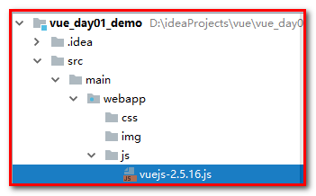

2. 创建demo01.js(引入vuejs,定义div,创建vue实例)

```html
<!DOCTYPE html>
<html lang="en">
<head>
    <meta charset="UTF-8">
    <title>01-vue入门</title>
    <script src="js/vuejs-2.5.16.js"></script>
</head>
<body>
<div id="app">
    <!--使用插值表达式展示-->
    {{message}}
</div>

<script>
    //创建一个Vue实例(VM)
    new Vue({
        //表示当前vue对象接管了div区域
        el: '#app',

        //定义数据
        data: {
            message: 'hello world'
        }
    });
</script>
</body>
</html>
```

data ：用于定义数据。

methods： 用于定义的函数，可以通过 return 来返回函数值。

### 4.小结

​	数据绑定最常见的形式就是使用“Mustache”语法 (双大括号) 的文本==插值表达式==，Mustache 标签将会被替代为对应数据对象上属性的值。无论何时，绑定的数据对象上属性发生了改变，插值处的内容都会更新.

1. Vue.js 都提供了完全的 JavaScript 表达式支持。

```js
{{ number + 1 }}
{{flag?'true':'false'}}
```

2. 这些表达式会在所属 Vue 实例的数据作用域下作为 JavaScript 被解析。有个限制就是，每个绑定都只能包含单个表达式，所以下面的例子都不会生效。

```js
<!-- 这是语句，不是表达式 -->
{{ var a = 1 }}
<!-- 流控制也不会生效，请使用三元表达式 -->
{{ if (flag) { return message } }}
```

# 第二章-VueJS 常用系统指令

## 知识点-常用的事件

### 1.目标

- [ ] 掌握常用的事件

### 2.路径

1. @click
2. @keydown
3. @mouseover
4. 事件修饰符
5. 按键修饰符

### 3.讲解

#### 3.1@click

说明: 点击事件(等同于v-on:click)

【需求】：点击按钮事件，改变message的值

+ demo02.html

```java
<!DOCTYPE html>
<html lang="en">
<head>
    <meta charset="UTF-8">
    <title>02_v-on:click</title>
    <script src="js/vuejs-2.5.16.js"></script>
</head>
<body>
    <div id="app">
        {{message}}
        <br/>
        <input type="button" value="点击改变" @click="fun01"/>

    </div>
    <script>
        //创建vue实例
        new Vue({
            //表示当前vue对象接管了div区域
            el:'#app',

            //定义数据
            data:{
                message:'hello world'
            },
            //定义函数
            methods:{
                fun01:function () {
                    this.message = '你好,世界...';
                }
            }
        });

    </script>
</body>
</html>
```

#### 3.2@keydown

说明: 键盘按下事件(等同于v-on:keydown)

【需求】：对文本输入框做校验，使用键盘按下事件，如果按下0-9的数字，正常显示，其他按键则阻止事件执行。

+ demo03.js

```html
<!DOCTYPE html>
<html lang="en">
<head>
    <meta charset="UTF-8">
    <title>Title</title>
    <script src="js/vuejs-2.5.16.js"></script>
</head>
<body>
    <div id="app">
        <!--$event:为时间对象-->
        <input type="text" value="hello.." @keydown="fun01($event)"/>
    </div>

    <script>
        //创建一个Vue实例(VM)
        new Vue({
            el: '#app', //表示当前vue对象接管了div区域
            data:{
            },
            methods:{
                fun01:function (e) {
                    var keyCode=  e.keyCode;
                    if (!(keyCode >= 49 && keyCode<=57)){
                      	//阻止事件执行
                        e.preventDefault();
                    }

                }
            }
        });
    </script>
</body>
</html>
```

#### 3.3@mouseover

说明:鼠标移入区域事件(等同于v-on:mouseover)

【需求1】：给指定区域大小的div中添加样式，鼠标移到div中，弹出窗口。

【需求2】：在div中添加`<textarea>`，鼠标移动到`<textarea>`，再弹出一个窗口

+ demo04.html

```html
<!DOCTYPE html>
<html lang="en">
<head>
    <meta charset="UTF-8">
    <title>Title</title>
    <script src="js/vuejs-2.5.16.js"></script>
    <style>
        .box {
            width: 300px;
            height: 400px;
            border: 1px solid red;
        }
        .textarea{
            width: 200px;
            height: 100px;
            border: 1px solid blue;
        }
    </style>
</head>
<body>
<div id="app">
    <div class="box" @mouseover="fun01">
        div
        <textarea class="textarea" @mouseover="fun02($event)">
            textarea
        </textarea>
    </div>
</div>

<script>
    //创建一个Vue实例
    new Vue({
        el: '#app',
        data: {},
        methods: {
           fun01:function () {
               alert("div");
           },
            fun02:function (e) {
                alert("textarea");
                e.stopPropagation(); //停止冒泡
            }
        }
    });
</script>
</body>
</html>
```

#### 3.4 事件修饰符

​	Vue.js 为 v-on 提供了事件修饰符来处理 DOM 事件细节，如我们上面使用的：event.preventDefault() 和event.stopPropagation()。

​	这样写有些麻烦,Vue.js提供了通过由点(.)表示的指令后缀来调用修饰符

```
stop  // 停止触发，阻止冒泡修饰符 
prevent  // 阻止事件发生，阻止事件默认行为
.capture  // 捕获 
.self  //只点自己身上才运行
.once  // 只执行一次
```

【需求】：

1.在表单中，点击“提交”按钮，阻止执行（.prevent）；

2.在div里面放置超链接. 给div绑定点击事件, 点击url，阻止冒泡（.stop）

```html
<!DOCTYPE html>
<html lang="en">
<head>
    <meta charset="UTF-8">
    <title>Title</title>
    <script src="js/vuejs-2.5.16.js"></script>

</head>
<body>
<div id="app">
    <!--1.在表单中，点击“提交”按钮，阻止执行（.prevent）-->
    <form action="http://www.itcast.cn" method="post">
        <input type="submit"  @click.prevent/>
    </form>

    <!--2.在div里面放置超链接，点击url，阻止冒泡（.stop）-->
    <div @click="fun01">
        <a href="http://www.baidu.com" @click.stop>百度</a>
    </div>
</div>

<script>
    new Vue({
        el: '#app',
        data: {},
        methods: {
            fun01:function () {
                alert('百度');
            }
        }
    });
</script>
</body>
</html>
```

#### 3.5 按键修饰符

+ 我们1.3通过键盘ascii码来阻止执行,这样相对比较麻烦.  Vue 为我们提供了允许 在监听键盘事件时添加按键修饰符.

```
.enter  // 表示键盘的enter键
.tab
.delete (捕获 "删除" 和 "退格" 键)
.esc
.space
.up
.down
.left
.right
.ctrl
.alt
.shift
.meta
```

【需求】：在输入框中，如果输入回车键(.enter)，就执行弹出窗口事件（可用于网页登录）。

```html
<!DOCTYPE html>
<html lang="en">
<head>
    <meta charset="UTF-8">
    <title>Title</title>
    <script src="js/vuejs-2.5.16.js"></script>

</head>
<body>
<div id="app">
    <input type="text" @keydown.enter="fun01"/>
</div>

<script>
    new Vue({
        el: '#app',
        data: {},
        methods: {
            fun01:function () {
                alert('点击了enter');
            }
        }
    });
</script>
</body>
</html>
```

### 4.小结

1. 事件规则: 把js的事件的on换成了@或者v-on:

   + onclick=>@click
   + onkeydown=>@keydown
   + onchange=>@change

   ....


## 知识点- v-text与v-html

### 1.目标

- [ ] 掌握v-text与v-html的使用

### 2.讲解

v-text：输出文本内容，不会解析html元素

v-html：输出文本内容，会解析html元素

【需求】：分别使用v-text, v-html 赋值 `<h1>hello world<h1>` ，查看页面输出内容。

```html
<!DOCTYPE html>
<html lang="en">
<head>
    <meta charset="UTF-8">
    <title>Title</title>
    <script src="js/vuejs-2.5.16.js"></script>

</head>
<body>
<div id="app">
    <div v-html="message"></div>
    <div v-text="message"></div>
    <div></div>
</div>

<script>
    new Vue({
        el: '#app',
        data: {
            message:"<h1>hello world</h1>"
        },
        methods: {

        }
    });
</script>
</body>
</html>
```

### 3.小结

1. v-html: 输出文本内容, ==解析HTML==
2. v-text: 输出文本内容, ==不会解析HTML==


## 知识点-v-bind和v-model

### 1.目标

- [ ] 掌握v-bind和v-model

### 2.路径

1. v-bind
2. v-model

### 3.讲解

#### 3.1v-bind

==插值语法不能作用在HTML 属性上==，遇到这种情况应该使用 v-bind指令

【需求】：使用vue定义变量ys，对页面中的字体标签color属性赋值。

                    使用vue定义变量info，对页面中的超链接href属性赋值。

```html
<!DOCTYPE html>
<html lang="en">
<head>
    <meta charset="UTF-8">
    <title>Title</title>
    <script src="js/vuejs-2.5.16.js"></script>

</head>
<body>
<div id="app">
    <font v-bind:color="ys">hello world</font>
    <a :href="info">百度</a>
</div>

<script>
    new Vue({
        el: '#app',
        data: {
            ys:'red',
            info:'http://www.baidu.com'
        },
        methods: {

        }
    });
</script>
</body>
</html>
```

#### 3.2v-model

用于数据的绑定,数据的读取

【需求】：使用vue赋值json数据，并显示到页面的输入框中（表单回显）. 点击按钮，改变json数据，验证同时输入框的内容也发生改变。

```html
<!DOCTYPE html>
<html lang="en">
<head>
    <meta charset="UTF-8">
    <title>Title</title>
    <script src="js/vuejs-2.5.16.js"></script>

</head>
<body>
<div id="app">
    用户名:<input type="text" v-model="user.username"><br>
    密码:<input type="text" v-model="user.password"><br>
    <input type="button" @click="fun01" value="按钮">
</div>

<script>
    new Vue({
        el: '#app',
        data: {
            user: {
                username: 'zs',
                password: '123456'
            }
        },
        methods: {
            fun01: function () {
                this.user = {
                    username: 'ls',
                    password: '666666'
                }
            }
        }
    });
</script>
</body>
</html>
```

### 4.小结

1. v-bind: html的标签的属性不能使用插值语法的. 如果要使用, 就可以在属性前面添加v-bind:或者:

```
<font :color='ys'>hello...</font>
```

2. v-model  把视图和model数据 进行绑定
   + 视图改变 model数据改变
   + model数据改变 视图也改变

## 知识点-v-for,v-if,v-show

### 1.目标

- [ ] 掌握v-for,v-if,v-show的使用

### 2.路径

1. v-for
2. v-if
3. v-show

### 3.讲解

#### 3.1 v-for

用于操作array/集合，遍历

【需求】：使用v-for遍历数组，并把数据遍历到页面上的`<li>`标签中。

```html
<!DOCTYPE html>
<html lang="en">
<head>
    <meta charset="UTF-8">
    <title>Title</title>
    <script src="js/vuejs-2.5.16.js"></script>

</head>
<body>
<div id="app">
    <ul>
        <li v-for="(item,index) in array">
            {{index}}---{{item}}
        </li>
        <hr/>
        <li v-for="(stu,index) in students">
            {{index}}---{{stu.name}}---{{stu.age}}
        </li>


    </ul>
</div>

<script>
    new Vue({
        el: '#app',
        data: {
            array: ['aaa', 'bbb', 'ccc'],
            students: [
                {
                    name: 'zs',
                    age: '18'
                },
                {
                    name: 'ls',
                    age: '19'
                }
            ]
        },
        methods: {}
    });
</script>
</body>
</html>
```

#### 3.2v-if与v-show

v-if是根据表达式的值来决定是否渲染元素(标签都没有了)

v-show是根据表达式的值来切换元素的display css属性(标签还在)

【需求】：使用vue赋值flag变量（boolean类型），用来判断`<div>`元素中的内容是否显示。

```html
<!DOCTYPE html>
<html lang="en">
<head>
    <meta charset="UTF-8">
    <title>Title</title>
    <script src="js/vuejs-2.5.16.js"></script>

</head>
<body>
<div id="app">
    <span v-if="flag">hello</span>
    <span v-show="flag">你好</span>
    <input type="button" value="开关" @click="fun01"/>
</div>

<script>
    new Vue({
        el: '#app',
        data: {
            flag: true
        },
        methods: {
            fun01: function () {
                this.flag = !this.flag;
            }
        }
    });
</script>
</body>
</html>
```

### 4.小结

1. v-for: 遍历

```
<标签 v-for="(ele,index) in 数组"></标签>
```

2. v-if

```
<标签 v-if="Boolean类型的插值变量"></标签>
```


# 第三章-VueJS生命周期

## 知识点--VueJS生命周期

### 1.目标

- [ ]  了解vue生命周期

### 2.路径

1. 什么是VueJS生命周期
2. vuejs生命周期的演示

### 3.讲解

#### 3.1.什么是VueJS生命周期

​	就是vue实例从创建到销毁的过程.

​	每个 Vue 实例在被创建到销毁都要经过一系列的初始化过程——例如，需要设置数据监听、编译模板、将实例挂载到 DOM 并在数据变化时更新 DOM 等。同时在这个过程中也会运行一些叫做生命周期钩子的函数，这给了用户在不同阶段添加自己的代码的机会。

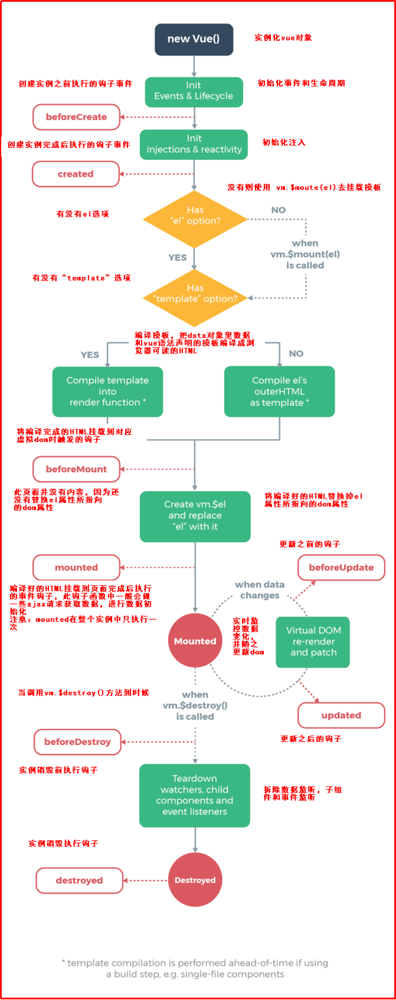

+ beforeCreate ：数据还没有监听，没有绑定到vue对象实例，同时也没有挂载对象

+ created ：数据已经绑定到了对象实例，但是还没有挂载对象（使用ajax可在此方法中查询数据，调用函数）

+ beforeMount: 模板已经编译好了，根据数据和模板已经生成了对应的元素对象，将数据对象关联到了对象的

  el属性，el属性是一个HTMLElement对象，也就是这个阶段，vue实例通过原生的createElement等方法来创
  建这个html片段，准备注入到我们vue实例指明的el属性所对应的挂载点

+ mounted:将el的内容挂载到了el，相当于我们在jquery执行了(el).html(el),生成页面上真正的dom，上面我们
  就会发现dom的元素和我们el的元素是一致的。在此之后，我们能够用方法来获取到el元素下的dom对象，并
  进行各种操作当我们的data发生改变时，会调用beforeUpdate和updated方法

+ beforeUpdate ：数据更新到dom之前，我们可以看到$el对象已经修改，但是我们页面上dom的数据还
  没有发生改变

+ updated: dom结构会通过虚拟dom的原则，找到需要更新页面dom结构的最小路径，将改变更新到
  dom上面，完成更新

+ beforeDestroy,destroed :实例的销毁，vue实例还是存在的，只是解绑了事件的监听、还有watcher对象数据
  与view的绑定，即数据驱动

#### 3.2.vuejs生命周期的演示

```
<!DOCTYPE html>
<html lang="en">
<head>
    <meta charset="UTF-8">
    <title>01_vue入门</title>
    <script src="js/vuejs-2.5.16.js"></script>
</head>
<body>
<div id="app">
    {{message}}
</div>

<script>
    /**
     * - beforeCreate ：数据还没有监听，没有绑定到vue对象实例，同时也没有挂载对象
     - created ：数据已经绑定到了对象实例，但是还没有挂载对象（使用ajax可在此方法中查询数据，调用函数）
     - beforeMount: 模板已经编译好了，根据数据和模板已经生成了对应的元素对象，将数据对象关联到了对象的
     el属性，el属性是一个HTMLElement对象，也就是这个阶段，vue实例通过原生的createElement等方法来创
     建这个html片段，准备注入到我们vue实例指明的el属性所对应的挂载点
     - mounted:将el的内容挂载到了el，相当于我们在jquery执行了(el).html(el),生成页面上真正的dom，上面我们
     就会发现dom的元素和我们el的元素是一致的。在此之后，我们能够用方法来获取到el元素下的dom对象，并
     进行各种操作当我们的data发生改变时，会调用beforeUpdate和updated方法
     - beforeUpdate ：数据更新到dom之前，我们可以看到$el对象已经修改，但是我们页面上dom的数据还
     没有发生改变
     - updated: dom结构会通过虚拟dom的原则，找到需要更新页面dom结构的最小路径，将改变更新到
     dom上面，完成更新
     - beforeDestroy,destroed :实例的销毁，vue实例还是存在的，只是解绑了事件的监听、还有watcher对象数据
     与view的绑定，即数据驱动
     */
   var vue =  new Vue({
        //表示当前vue对象接管了div区域
        el: '#app',
        //定义数据
        data: {
            message: 'hello word',
        },
        //beforeCreate: 数据还没有监听，没有绑定到vue对象实例，同时也没有挂载对象
        beforeCreate: function () {
            showMsg('---beforeCreate---', this);
        },
        //created ：数据已经绑定到了对象实例，但是还没有挂载对象
        created: function () {
            showMsg('---created---', this);
        },
        //beforeMount: 模板已经编译好了，根据数据和模板已经生成了对应的元素对象，将数据对象关联到了对象的
        beforeMount: function () {
            showMsg('---beforeMount---', this);
        },
        //mounted:将el的内容挂载到了el，相当于我们在jquery执行了(el).html(el),生成页面上真正的dom，上面我们就会发现dom的元素和我们el的元素是一致的。在此之后，我们能够用方法来获取到el元素下的dom对象，并进行各种操作当我们的data发生改变时，会调用beforeUpdate和updated方法
        mounted: function () {
            showMsg('---mounted---', this);
        },

        //beforeDestroy,destroed :实例的销毁，vue实例还是存在的，只是解绑了事件的监听、还有watcher对象数据与view的绑定，即数据驱动
        beforeDestroy: function () {
            showMsg('---beforeDestroy---', this);
        }
    });


    function showMsg(msg, obj) {
        console.log(msg);
        console.log("data:" + obj.message);
        console.log("el元素:" + obj.$el);
        console.log("元素的内容:" + document.getElementById("app").innerHTML);
    }

    //vue的销毁
    vue.$destroy();

</script>
</body>
</html>
```

+ 结果

 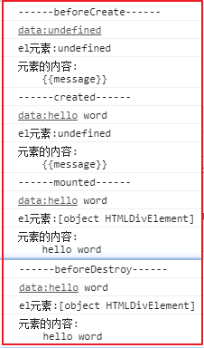

### 4.小结

1. 一般情况下 我们可以在created或者mounted进行初始化(请求服务器获得数据绑定)

   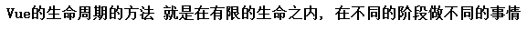 

# 第四章-VueJS ajax

## 知识点-VueJS ajax

### 1.目标

- [ ] 掌握vue的ajax的使用

### 2.路径

1. 了解vue-resource
2. axios
   + 什么是axios
   + axios的语法
   + axios的使用

### 3.讲解

#### 3.1vue-resource【了解】

​	vue-resource是Vue.js的插件提供了使用XMLHttpRequest或JSONP进行Web请求和处理响应的服务。 当vue更新到2.0之后，作者就宣告不再对vue-resource更新，而是推荐的axios，在这里大家了解一下vue-resource就可以。

vue-resource的github: [https://github.com/pagekit/vue-resource](https://github.com/pagekit/vue-resource)

+ Get方式

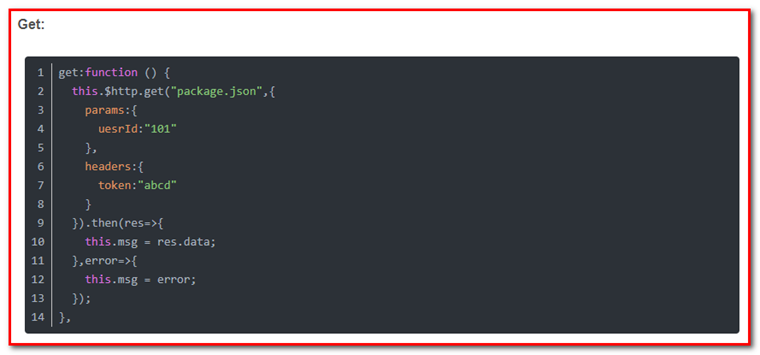

+ Post方式

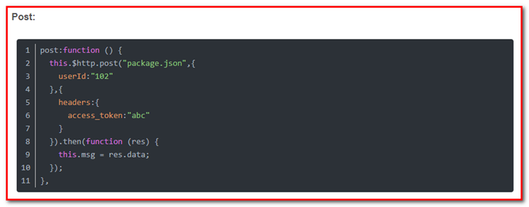

#### 3.2.axios【重点】

##### 3.2.1什么是axios

Axios 是一个基于 promise 的 HTTP 库，可以用在浏览器和 node.js 中

注: Promise 对象用于表示一个异步操作的最终状态（完成或失败），以及其返回的值。

axios的github:https://github.com/axios/axios

中文说明: https://www.kancloud.cn/yunye/axios/234845

##### 3.2.2axios的语法

+ get请求

```js
// 为给定 ID 的 user 创建请求
axios.get('/user?ID=12345')
  .then(function (response) {
    console.log(response);
  })
  .catch(function (error) {
    console.log(error);
  });

// 可选地，上面的请求可以这样做
axios.get('/user', {
    params: {
      ID: 12345
    }
  })
  .then(function (response) {
    console.log(response);
  })
  .catch(function (error) {
    console.log(error);
  });
```

+ post请求

```js
axios.post('/user', {
    firstName: 'Fred',
    lastName: 'Flintstone'
  })
  .then(function (response) {
    console.log(response);
  })
  .catch(function (error) {
    console.log(error);
  });
```

+ axios方式(原始方式)

 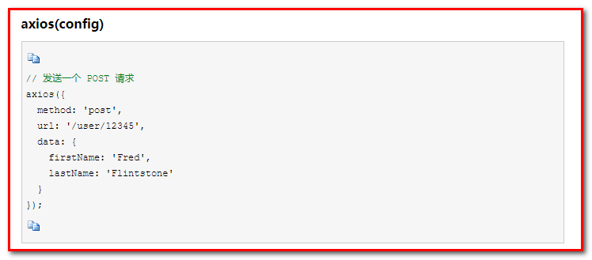


​    为方便起见，为所有支持的请求方法提供了别名

```
axios.get(url[, config])
axios.post(url[, data[, config]])

axios.request(config)
axios.delete(url[, config])
axios.head(url[, config])
axios.put(url[, data[, config]])
axios.patch(url[, data[, config]])
```

##### 2.3axios的使用

需求:使用axios读取user.json文件的内容，并在页面上输出内容

步骤:

1. 创建data/user.json文件

2. 导入axios.js

3. 使用get/post方法进行请求

   

```html
<!DOCTYPE html>
<html lang="en">
<head>
    <meta charset="UTF-8">
    <title>01_vue入门</title>
    <script src="js/vuejs-2.5.16.js"></script>
    <script src="js/axios-0.18.0.js"></script>
</head>
<body>
<div id="app">
    {{list}}
</div>

<script>
    //创建一个Vue实例(VM)
   var vue =  new Vue({
        el: '#app',

        data: {
            list: []
        },

        methods: {
            initData: function () {
                axios.post('./data/user.json').then(function (response) {
                    alert(response.data);
                    vue.list = response.data;
                })
            }
        },

        created: function () {
            this.initData();
        }
    });
</script>
</body>
</html>
```

### 4.小结

1. axios 是在vue里面发送ajax请求的一个库
2. 使用
   + 导入axios
   + 调用 axios.get(请求路径).then(response=>{})
   + 调用 axios.post(请求路径,{参数}).then(response=>{})

# 第五章-综合案例

## 案例-用户的列表

### 1.需求

完成用户的列表与修改操作

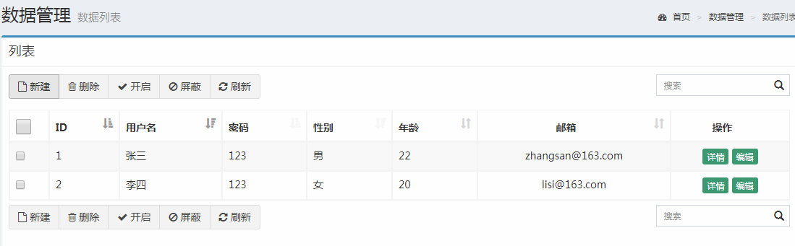

前端（浏览器端）：vue

后端（服务器端）：ssm

### 2.分析

#### 2.1准备工作

1. 数据库和表
2. 使用自定义骨架创建ssm工程
3. 创建pojo
4. 拷贝页面

#### 2.2实现

1. 导入vue axios.js, 创建vue实例
2. 定义数据 userList:[]
3. 定义方法 

```
initData:function(){
	//1.使用axios请求服务器 获得所有的用户数据
	//2.给userList赋值
	//3.使用v-for遍历userList, 和页面进行绑定赋值
}
```

4. 在钩子函数created()里面调用initData()
5. 后台: 查询所有的用户 响应成JSON

### 3.实现

#### 3.1准备工作

##### 3.1数据库和表

```
CREATE DATABASE vue;
USE vue;
CREATE TABLE USER(
  id INT PRIMARY KEY AUTO_INCREMENT,
  age INT,
  username VARCHAR(20),
  password VARCHAR(50),
  email VARCHAR(50),
  sex VARCHAR(20)
);

INSERT INTO USER (username,PASSWORD,age,sex,email) VALUES ('张三','123',22,'男','zhangsan@163.com'),('李四','123',20,'女','lisi@163.com')
```

##### 3.2ssm工程的创建

+ 创建Maven工程(war)

 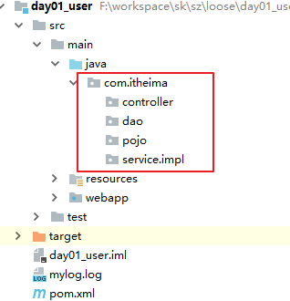 

+ pom.xml

```xml
<?xml version="1.0" encoding="UTF-8"?>
<project xmlns="http://maven.apache.org/POM/4.0.0" xmlns:xsi="http://www.w3.org/2001/XMLSchema-instance" xsi:schemaLocation="http://maven.apache.org/POM/4.0.0 http://maven.apache.org/xsd/maven-4.0.0.xsd">
    <modelVersion>4.0.0</modelVersion>

    <groupId>com.itheima</groupId>
    <artifactId>day01_user</artifactId>
    <version>1.0-SNAPSHOT</version>
    <packaging>war</packaging>

    <properties>
        <project.build.sourceEncoding>UTF-8</project.build.sourceEncoding>
        <maven.compiler.source>1.8</maven.compiler.source>
        <maven.compiler.target>1.8</maven.compiler.target>

        <spring.version>5.0.2.RELEASE</spring.version>
        <slf4j.version>1.6.6</slf4j.version>
        <log4j.version>1.2.12</log4j.version>
        <mysql.version>5.1.6</mysql.version>
        <mybatis.version>3.4.5</mybatis.version>
    </properties>

    <dependencies>
        <!-- spring -->
        <dependency>
            <groupId>org.aspectj</groupId>
            <artifactId>aspectjweaver</artifactId>
            <version>1.6.8</version>
        </dependency>

        <dependency>
            <groupId>org.springframework</groupId>
            <artifactId>spring-aop</artifactId>
            <version>${spring.version}</version>
        </dependency>

        <dependency>
            <groupId>org.springframework</groupId>
            <artifactId>spring-context</artifactId>
            <version>${spring.version}</version>
        </dependency>

        <dependency>
            <groupId>org.springframework</groupId>
            <artifactId>spring-web</artifactId>
            <version>${spring.version}</version>
        </dependency>

        <dependency>
            <groupId>org.springframework</groupId>
            <artifactId>spring-webmvc</artifactId>
            <version>${spring.version}</version>
        </dependency>

        <dependency>
            <groupId>org.springframework</groupId>
            <artifactId>spring-test</artifactId>
            <version>${spring.version}</version>
        </dependency>

        <dependency>
            <groupId>org.springframework</groupId>
            <artifactId>spring-tx</artifactId>
            <version>${spring.version}</version>
        </dependency>

        <dependency>
            <groupId>org.springframework</groupId>
            <artifactId>spring-jdbc</artifactId>
            <version>${spring.version}</version>
        </dependency>

        <dependency>
            <groupId>junit</groupId>
            <artifactId>junit</artifactId>
            <version>4.12</version>
            <scope>compile</scope>
        </dependency>

        <dependency>
            <groupId>mysql</groupId>
            <artifactId>mysql-connector-java</artifactId>
            <version>${mysql.version}</version>
        </dependency>

        <dependency>
            <groupId>javax.servlet</groupId>
            <artifactId>servlet-api</artifactId>
            <version>2.5</version>
            <scope>provided</scope>
        </dependency>

        <dependency>
            <groupId>javax.servlet.jsp</groupId>
            <artifactId>jsp-api</artifactId>
            <version>2.0</version>
            <scope>provided</scope>
        </dependency>

        <dependency>
            <groupId>jstl</groupId>
            <artifactId>jstl</artifactId>
            <version>1.2</version>
        </dependency>

        <!-- log start -->
        <dependency>
            <groupId>log4j</groupId>
            <artifactId>log4j</artifactId>
            <version>${log4j.version}</version>
        </dependency>

        <dependency>
            <groupId>org.slf4j</groupId>
            <artifactId>slf4j-api</artifactId>
            <version>${slf4j.version}</version>
        </dependency>

        <dependency>
            <groupId>org.slf4j</groupId>
            <artifactId>slf4j-log4j12</artifactId>
            <version>${slf4j.version}</version>
        </dependency>
        <!-- log end -->
        <dependency>
            <groupId>org.mybatis</groupId>
            <artifactId>mybatis</artifactId>
            <version>${mybatis.version}</version>
        </dependency>

        <dependency>
            <groupId>org.mybatis</groupId>
            <artifactId>mybatis-spring</artifactId>
            <version>1.3.0</version>
        </dependency>

        <dependency>
            <groupId>com.alibaba</groupId>
            <artifactId>druid</artifactId>
            <version>1.0.14</version>
        </dependency>

        <!--jackson-->
        <dependency>
            <groupId>com.fasterxml.jackson.core</groupId>
            <artifactId>jackson-databind</artifactId>
            <version>2.9.0</version>
        </dependency>
        <dependency>
            <groupId>com.fasterxml.jackson.core</groupId>
            <artifactId>jackson-core</artifactId>
            <version>2.9.0</version>
        </dependency>
        <dependency>
            <groupId>com.fasterxml.jackson.core</groupId>
            <artifactId>jackson-annotations</artifactId>
            <version>2.9.0</version>
        </dependency>

    </dependencies>


</project>

```

+ applicationContext.xml

```xml
<?xml version="1.0" encoding="UTF-8"?>
<beans xmlns="http://www.springframework.org/schema/beans"
       xmlns:xsi="http://www.w3.org/2001/XMLSchema-instance"
       xmlns:context="http://www.springframework.org/schema/context"
       xmlns:tx="http://www.springframework.org/schema/tx" xmlns:aop="http://www.springframework.org/schema/aop"
       xsi:schemaLocation="http://www.springframework.org/schema/beans http://www.springframework.org/schema/beans/spring-beans.xsd http://www.springframework.org/schema/context http://www.springframework.org/schema/context/spring-context.xsd http://www.springframework.org/schema/tx http://www.springframework.org/schema/tx/spring-tx.xsd http://www.springframework.org/schema/aop http://www.springframework.org/schema/aop/spring-aop.xsd">

    <!--引入jdbc.properties-->
    <context:property-placeholder location="classpath:jdbc.properties"/>
    <!--注册Druid连接池(四个基本项)-->
    <bean id="dataSource" class="com.alibaba.druid.pool.DruidDataSource">
        <property name="driverClassName" value="${jdbc.driver}"></property>
        <property name="url" value="${jdbc.url}"></property>
        <property name="username" value="${jdbc.username}"></property>
        <property name="password" value="${jdbc.password}"></property>
    </bean>
    <!--注册SqlSessionFactory-->
    <bean id="sqlSessionFactory" class="org.mybatis.spring.SqlSessionFactoryBean">
        <!--注入DataSource-->
        <property name="dataSource" ref="dataSource"></property>
        <!--注入SqlMapConfig(建议加)-->
        <property name="configLocation" value="classpath:SqlMapConfig.xml"></property>
    </bean>

    <!--注册dao包扫描器-->
    <bean id="mapperScanner" class="org.mybatis.spring.mapper.MapperScannerConfigurer">
        <property name="basePackage" value="com.itheima.dao"></property>
    </bean>

    <!--*************************配置事务开始*************************************-->
    <!--1.配置事务管理器-->
    <bean id="transactionManager" class="org.springframework.jdbc.datasource.DataSourceTransactionManager">
        <property name="dataSource" ref="dataSource"></property>
    </bean>

    <!--2.配置事务规则(建议).-->
    <tx:advice id="adviceId" transaction-manager="transactionManager">
        <tx:attributes>
            <!-- <tx:method name="find*" read-only="true"></tx:method>
             <tx:method name="select*" read-only="true"></tx:method>
             <tx:method name="save*" read-only="false" propagation="REQUIRED"></tx:method>
             <tx:method name="delete*" read-only="false" propagation="REQUIRED"></tx:method>
             <tx:method name="update*" read-only="false" propagation="REQUIRED"></tx:method>
             <tx:method name="insert*" read-only="false" propagation="REQUIRED"></tx:method>-->
            <tx:method name="*"></tx:method>
        </tx:attributes>
    </tx:advice>

    <!--3.配置AOP-->
    <aop:config>
        <!--配置切入点
            eg:expression: execution(* com.xyz.myapp.service.*.*(..))
                    第一个*: 任意的返回值类型
                    第二个*: com.xyz.myapp.service这个包里面的任意类
                    第三个*: 当前类里面的任意的方法
                    (..): 任意参数
        -->
        <aop:pointcut id="pointcutId" expression="execution(* com.itheima.service.impl.*.*(..))"></aop:pointcut>
        <!--配置切面-->
        <aop:advisor advice-ref="adviceId" pointcut-ref="pointcutId"></aop:advisor>
    </aop:config>

    <!--*************************配置事务结束*************************************-->
</beans>
```

+ jdbc.properties

```properties
jdbc.driver=com.mysql.jdbc.Driver
jdbc.url=jdbc:mysql://localhost:3306/vue
jdbc.username=root
jdbc.password=123456
```

+ springmvc.xml

```xml
<?xml version="1.0" encoding="UTF-8"?>
<beans xmlns="http://www.springframework.org/schema/beans"
       xmlns:xsi="http://www.w3.org/2001/XMLSchema-instance"
       xmlns:context="http://www.springframework.org/schema/context"
       xmlns:mvc="http://www.springframework.org/schema/mvc"
       xsi:schemaLocation="http://www.springframework.org/schema/beans http://www.springframework.org/schema/beans/spring-beans.xsd http://www.springframework.org/schema/context http://www.springframework.org/schema/context/spring-context.xsd http://www.springframework.org/schema/mvc http://www.springframework.org/schema/mvc/spring-mvc.xsd">

    <!--开启包扫描-->
    <context:component-scan base-package="com.itheima"></context:component-scan>

    <!--注册视图解析器; 把逻辑视图"success" 映射成物理视图 /WEB-INF/pages/success.jsp-->
    <bean id="viewResolver" class="org.springframework.web.servlet.view.InternalResourceViewResolver">
        <property name="prefix" value="/WEB-INF/pages/"></property>
        <property name="suffix" value=".jsp"></property>
    </bean>
    <!--开启注解驱动-->
    <mvc:annotation-driven></mvc:annotation-driven>
    <!--忽略静态资源-->
    <!--<mvc:resources mapping="/css/**" location="/css/"></mvc:resources>
    <mvc:resources mapping="/js/**" location="/js/"></mvc:resources>
    <mvc:resources mapping="/img/**" location="/img/"></mvc:resources>-->
    <mvc:default-servlet-handler/>

    <!--导入spring配置文件-->
    <import resource="classpath:applicationContext.xml"></import>

</beans>
```

+ SqlMapConfig.xml

```xml
<?xml version="1.0" encoding="UTF-8" ?>
<!DOCTYPE configuration
        PUBLIC "-//mybatis.org//DTD Config 3.0//EN"
        "http://mybatis.org/dtd/mybatis-3-config.dtd">
<configuration>

</configuration>
```

+ 拷贝log4j.properties到工程
+ web.xml

```xml
<?xml version="1.0" encoding="UTF-8"?>
<web-app xmlns:xsi="http://www.w3.org/2001/XMLSchema-instance" xmlns="http://java.sun.com/xml/ns/javaee" xsi:schemaLocation="http://java.sun.com/xml/ns/javaee http://java.sun.com/xml/ns/javaee/web-app_2_5.xsd" id="WebApp_ID" version="2.5">
    <welcome-file-list>
        <welcome-file>index.html</welcome-file>
        <welcome-file>index.htm</welcome-file>
        <welcome-file>index.jsp</welcome-file>
        <welcome-file>default.html</welcome-file>
        <welcome-file>default.htm</welcome-file>
        <welcome-file>default.jsp</welcome-file>
    </welcome-file-list>

    <!--核心控制器-->
    <servlet>
        <servlet-name>DispatcherServlet</servlet-name>
        <servlet-class>org.springframework.web.servlet.DispatcherServlet</servlet-class>
        <!--初始化参数 加载配置文件-->
        <init-param>
            <param-name>contextConfigLocation</param-name>
            <param-value>classpath:springmvc.xml</param-value>
        </init-param>
        <!--配置初始化参数, 服务器启动时候就初始化-->
        <load-on-startup>1</load-on-startup>
    </servlet>
    <servlet-mapping>
        <servlet-name>DispatcherServlet</servlet-name>
        <!--/:除了jsp以为的资源路径都进行匹配   /*: 所有的资源路径都匹配-->
        <url-pattern>/</url-pattern>
    </servlet-mapping>

    <!--编码过滤器-->
    <filter>
        <filter-name>CharacterEncodingFilter</filter-name>
        <filter-class>org.springframework.web.filter.CharacterEncodingFilter</filter-class>
        <init-param>
            <param-name>encoding</param-name>
            <param-value>utf-8</param-value>
        </init-param>
    </filter>
    <filter-mapping>
        <filter-name>CharacterEncodingFilter</filter-name>
        <url-pattern>/*</url-pattern>
    </filter-mapping>
    
</web-app>
```

+ pojo

```java
public class User implements Serializable {
    
    private Integer id;
    private String username;
    private String password;
    private String sex;
    private int age;
    private String email;

    public Integer getId() {
        return id;
    }

    public void setId(Integer id) {
        this.id = id;
    }

    public String getUsername() {
        return username;
    }

    public void setUsername(String username) {
        this.username = username;
    }

    public String getPassword() {
        return password;
    }

    public void setPassword(String password) {
        this.password = password;
    }

    public String getSex() {
        return sex;
    }

    public void setSex(String sex) {
        this.sex = sex;
    }

    public int getAge() {
        return age;
    }

    public void setAge(int age) {
        this.age = age;
    }

    public String getEmail() {
        return email;
    }

    public void setEmail(String email) {
        this.email = email;
    }
}

```

##### 3.3页面的导入

 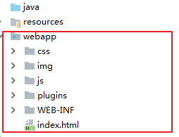

#### 3.2.代码实现

##### 3.2.1 前端代码实现

+ 引入vue和axios

```
<script src="./js/vuejs-2.5.16.js"></script>
<script src="./js/axios-0.18.0.js"></script>
```

+ js部分

```
<script>
    var vue  =  new Vue({
        el:'#app',
        data:{
            list:[]
        },
        methods:{
            fetchData:function () {
                axios.get('./user/findAll').then(function (response) {
                    vue.list = response.data;
                });
            }
        },
        created:function () {
            this.fetchData();
        }
    });
</script>
```

+ html部分

```html
<tr v-for="u in list">
    <td><input name="ids" type="checkbox"></td>
    <td>{{u.id}}</td>
    <td>{{u.username}}
    </td>
    <td>{{u.password}}</td>
    <td>{{u.sex}}</td>
    <td>{{u.age}}</td>
    <td class="text-center">{{u.email}}</td>
    <td class="text-center">
    <button type="button" class="btn bg-olive btn-xs">详情</button>
      <button type="button" class="btn bg-olive btn-xs" data-toggle="modal" data-target="#myModal"  >编辑	 	 </button>
    </td>
</tr>
```

##### 3.2.2 后台代码实现

+ UserController

```
package com.itheima.controller;

import com.itheima.pojo.User;
import com.itheima.service.UserService;
import org.springframework.beans.factory.annotation.Autowired;
import org.springframework.stereotype.Controller;
import org.springframework.web.bind.annotation.RequestMapping;
import org.springframework.web.bind.annotation.ResponseBody;

import java.util.List;

/**
 * @Description:
 * @Author: yp
 */
@Controller
@RequestMapping("/user")
public class UserController {
    @Autowired
    private UserService userService;
    @RequestMapping(value = "/findAll")
    public @ResponseBody List<User> findAll() {
        List<User> list = userService.findAll();
        return list;
    }

}

```

+ UserService

```java
@Service
public class UserServiceImpl implements UserService {

    @Autowired
    private UserDao userDao;

    @Override
    public List<User> findAll() {
        return userDao.findAll();
    }
}
```

+ UserDao

```
public interface UserDao {
    @Select("select * from user")
    List<User> findAll();
}
```

### 4.小结

1. 在钩子函数created() 调用initData()方法, 请求服务器 获得所有的user 把数据绑定到userList,再遍历


## 案例-用户更新

### 1.需求

完成用户更新操作

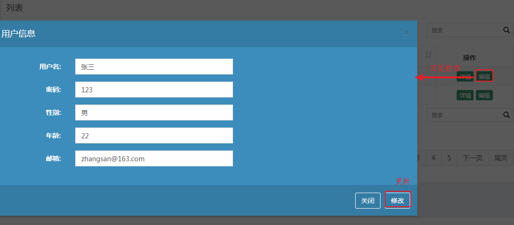

### 2.分析

#### 2.1回显数据

0. 定义data:   user:{}

1. 给编辑设置@click, 传入id
2. 创建函数响应@click

```
edit:function(id){
   //1.使用axios根据id请求服务器 获得 User
   //2.把user绑定
}
```

3. 把user数据和页面绑定
4. 后台: 根据id查询数据库

#### 2.2更新

1. 把user数据和标签进行绑定(v-model)
2. 给修改设置@click
3. 创建update()函数响应@click

```
update:function(){
	//1.使用axios请求服务器, 携带user
	//2.再查询展示
}
```

4. 后台: 根据id更新

### 3.实现

#### 3.1回显数据

##### 3.1.1前端代码实现

- js

```js
   var vue  =  new Vue({
        el:'#app',
        data:{
            pojo:{}
        },
        methods:{
       		
            edit:function (id) {
                axios.get('./user/findById?id='+id).then(function (response) {
                    vue.pojo = response.data;
                });
            }
        }
    });
```

- html

```html
<button type="button" class="btn bg-olive btn-xs" data-toggle="modal" data-target="#myModal" @click="edit(u.id)" >编辑</button>


<div class="box-body">
    <div class="form-horizontal">
        <div class="form-group">
            <label class="col-sm-2 control-label">用户名:</label>
            <div class="col-sm-5">
                <input type="text" class="form-control" v-model="pojo.username">
            </div>
        </div>
        <div class="form-group">
            <label class="col-sm-2 control-label">密码:</label>
            <div class="col-sm-5">
                <input type="text" class="form-control" v-model="pojo.password">
            </div>
        </div>
        <div class="form-group">
            <label class="col-sm-2 control-label">性别:</label>
            <div class="col-sm-5">
                <input type="text" class="form-control"  v-model="pojo.sex">
            </div>
        </div>
        <div class="form-group">
            <label class="col-sm-2 control-label">年龄:</label>
            <div class="col-sm-5">
                <input type="text" class="form-control" v-model="pojo.age">
            </div>
        </div>
        <div class="form-group">
            <label class="col-sm-2 control-label">邮箱:</label>
            <div class="col-sm-5">
                <input type="text" class="form-control"  v-model="pojo.email">
            </div>
        </div>
    </div>
</div>
```

##### 3.1.2后台代码实现

- UserController

```
    @RequestMapping(value = "/findById")
    public @ResponseBody User findById(int id) {
        User user = userService.findById(id);
        return user;
    }
```

- UserService

```
    @Override
    public User findById(int id) {
        return userDao.findById(id);
    }
```

- UserDao

```
@Select("select * from user where id=#{id}")
User findById(int id);
```

#### 3.2更新

##### 3.2.1前端代码实现

- js

```js
    methods:{
            update:function () {
                axios.post('./user/update',this.pojo).then(function(response){
                    vue.fetchData();
                })
            }
        },
```

##### 3.2.2后台代码实现

- UserController

```java
@RequestMapping("/update")
public @ResponseBody void update(@RequestBody User user){
	userService.update(user);
}
```

- UserService

```java
@Override
public void update(User user) {
	userDao.update(user);
}
```

- UserDao

```java
@Update("update user set username=#{username},password=#{password},sex=#{sex},age=#{age},email=#{email} where id=#{id}")
void update(User user);
```

### 4.小结

注意事项:

1. 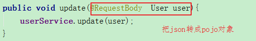 

   

# 附录

## 1.键盘ascii码

[http://tool.oschina.net/commons?type=4](http://tool.oschina.net/commons?type=4)

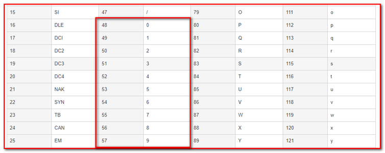

