# Nacos源码分析


# 1.下载Nacos源码并运行

要研究Nacos源码自然不能用打包好的Nacos服务端jar包来运行，需要下载源码自己编译来运行。


## 1.1.下载Nacos源码

Nacos的GitHub地址：https://github.com/alibaba/nacos

课前资料中已经提供了下载好的1.4.2版本的Nacos源码：

 


如果需要研究其他版本的同学，也可以自行下载：

大家找到其release页面：https://github.com/alibaba/nacos/tags，找到其中的1.4.2.版本：

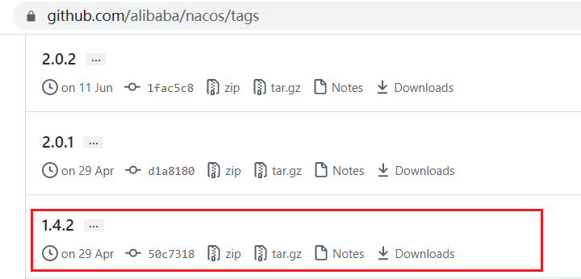

点击进入后，下载Source code(zip)：

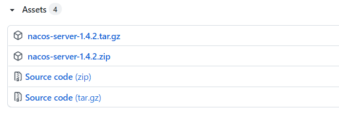


## 1.2.导入Demo工程

我们的课前资料提供了一个微服务Demo，包含了服务注册、发现等业务。

 

导入该项目后，查看其项目结构：

 

结构说明：

- cloud-source-demo：项目父目录
  - cloud-demo：微服务的父工程，管理微服务依赖
    - order-service：订单微服务，业务中需要访问user-service，是一个服务消费者
    - user-service：用户微服务，对外暴露根据id查询用户的接口，是一个服务提供者


## 1.3.导入Nacos源码

将之前下载好的Nacos源码解压到cloud-source-demo项目目录中：

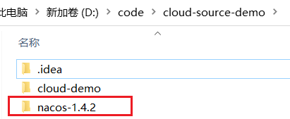 

然后，使用IDEA将其作为一个module来导入：

1）选择项目结构选项：

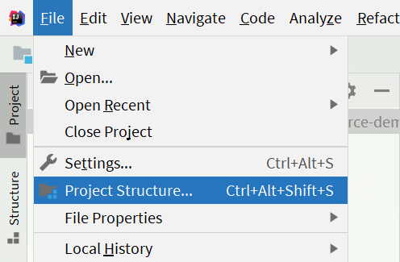 

然后点击导入module：

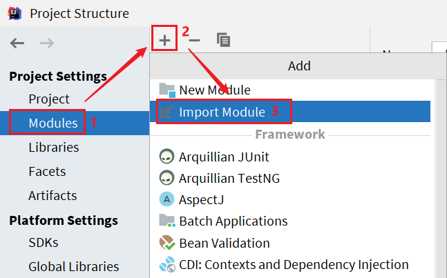 

在弹出窗口中，选择nacos源码目录：


然后选择maven模块，finish：


最后，点击OK即可：


导入后的项目结构：


## 1.4.proto编译

Nacos底层的数据通信会基于protobuf对数据做序列化和反序列化。并将对应的proto文件定义在了consistency这个子模块中：


我们需要先将proto文件编译为对应的Java代码。

### 1.4.1.什么是protobuf

protobuf的全称是Protocol Buffer，是Google提供的一种数据序列化协议，这是Google官方的定义：

> Protocol Buffers 是一种轻便高效的结构化数据存储格式，可以用于结构化数据序列化，很适合做数据存储或 RPC 数据交换格式。它可用于通讯协议、数据存储等领域的语言无关、平台无关、可扩展的序列化结构数据格式。

可以简单理解为，是一种跨语言、跨平台的数据传输格式。与json的功能类似，但是无论是性能，还是数据大小都比json要好很多。

protobuf的之所以可以跨语言，就是因为数据定义的格式为`.proto`格式，需要基于protoc编译为对应的语言。


### 1.4.2.安装protoc

Protobuf的GitHub地址：https://github.com/protocolbuffers/protobuf/releases

我们可以下载windows版本的来使用：


另外，课前资料也提供了下载好的安装包：

 


解压到任意非中文目录下，其中的bin目录中的protoc.exe可以帮助我们编译：


然后将这个bin目录配置到你的环境变量path中，可以参考JDK的配置方式：

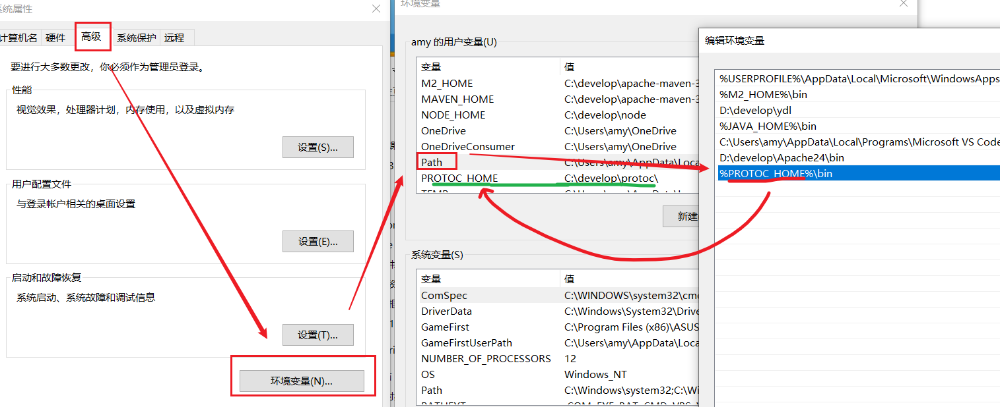


### 1.4.3.编译proto

进入nacos-1.4.2的consistency模块下的src/main目录下：


然后打开cmd窗口，运行下面的两个命令：

```powershell
protoc --java_out=./java ./proto/consistency.proto
protoc --java_out=./java ./proto/Data.proto
```

如图：


会在nacos的consistency模块中编译出这些java代码：

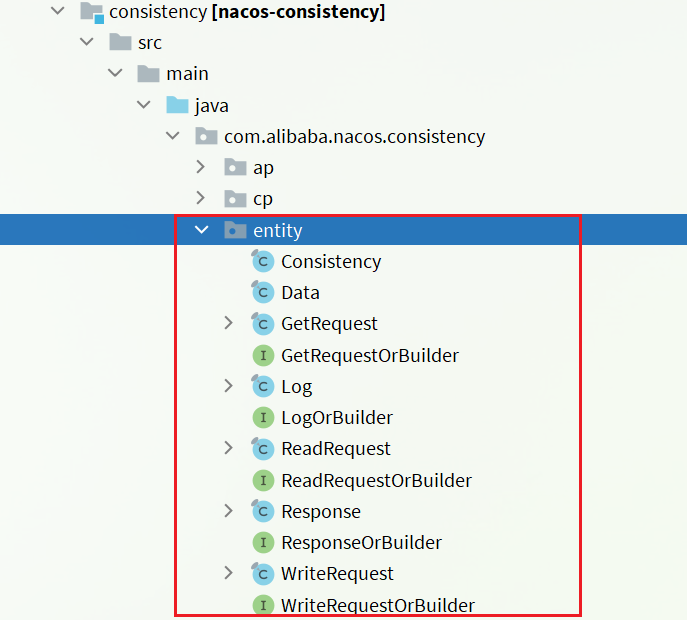


## 1.5.运行

nacos服务端的入口是在console模块中的Nacos类：

 

我们需要让它单机启动：

 

然后新建一个SpringBootApplication：

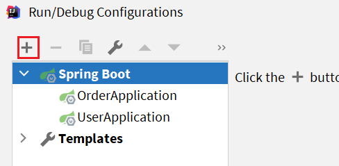 

然后填写应用信息：


然后运行Nacos这个main函数：


将order-service和user-service服务启动后，可以查看nacos控制台：


# 2.服务注册

服务注册到Nacos以后，会保存在一个本地注册表中，其结构如下：

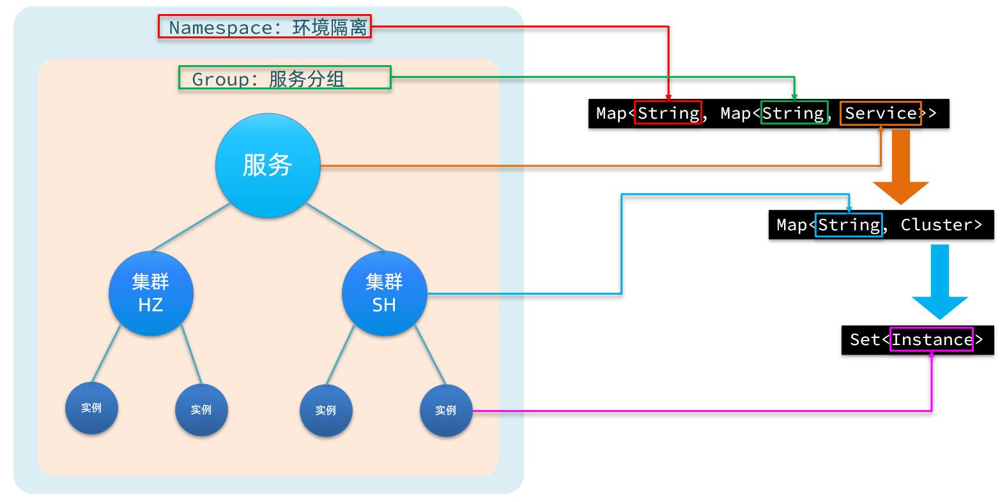

首先最外层是一个Map，结构为：`Map<String, Map<String, Service>>`：

- key：是namespace_id，起到环境隔离的作用。namespace下可以有多个group
- value：又是一个`Map<String, Service>`，代表分组及组内的服务。一个组内可以有多个服务
  - key：代表group分组，不过作为key时格式是group_name:service_name
  - value：分组下的某一个服务，例如userservice，用户服务。类型为`Service`，内部也包含一个`Map<String,Cluster>`，一个服务下可以有多个集群
    - key：集群名称
    - value：`Cluster`类型，包含集群的具体信息。一个集群中可能包含多个实例，也就是具体的节点信息，其中包含一个`Set<Instance>`，就是该集群下的实例的集合
      - Instance：实例信息，包含实例的IP、Port、健康状态、权重等等信息


每一个服务去注册到Nacos时，就会把信息组织并存入这个Map中。


## 2.1.服务注册接口

Nacos提供了服务注册的API接口，客户端只需要向该接口发送请求，即可实现服务注册。

**接口说明：**注册一个实例到Nacos服务。

**请求类型**：`POST`

**请求路径**：`/nacos/v1/ns/instance`

**请求参数**：

| 名称        | 类型    | 是否必选 | 描述         |
| :---------- | :------ | :------- | ------------ |
| ip          | 字符串  | 是       | 服务实例IP   |
| port        | int     | 是       | 服务实例port |
| namespaceId | 字符串  | 否       | 命名空间ID   |
| weight      | double  | 否       | 权重         |
| enabled     | boolean | 否       | 是否上线     |
| healthy     | boolean | 否       | 是否健康     |
| metadata    | 字符串  | 否       | 扩展信息     |
| clusterName | 字符串  | 否       | 集群名       |
| serviceName | 字符串  | 是       | 服务名       |
| groupName   | 字符串  | 否       | 分组名       |
| ephemeral   | boolean | 否       | 是否临时实例 |

**错误编码**：

| 错误代码 | 描述                  | 语义                   |
| :------- | :-------------------- | :--------------------- |
| 400      | Bad Request           | 客户端请求中的语法错误 |
| 403      | Forbidden             | 没有权限               |
| 404      | Not Found             | 无法找到资源           |
| 500      | Internal Server Error | 服务器内部错误         |
| 200      | OK                    | 正常                   |


## 2.2.客户端

首先，我们需要找到服务注册的入口。

### 2.2.1.NacosServiceRegistryAutoConfiguration

因为Nacos的客户端是基于SpringBoot的自动装配实现的，我们可以在nacos-discovery依赖：

`spring-cloud-starter-alibaba-nacos-discovery-2.2.6.RELEASE.jar`

这个包中找到Nacos自动装配信息：


可以看到，有很多个自动配置类被加载了，其中跟服务注册有关的就是NacosServiceRegistryAutoConfiguration这个类，我们跟入其中。


可以看到，在NacosServiceRegistryAutoConfiguration这个类中，包含一个跟自动注册有关的Bean：

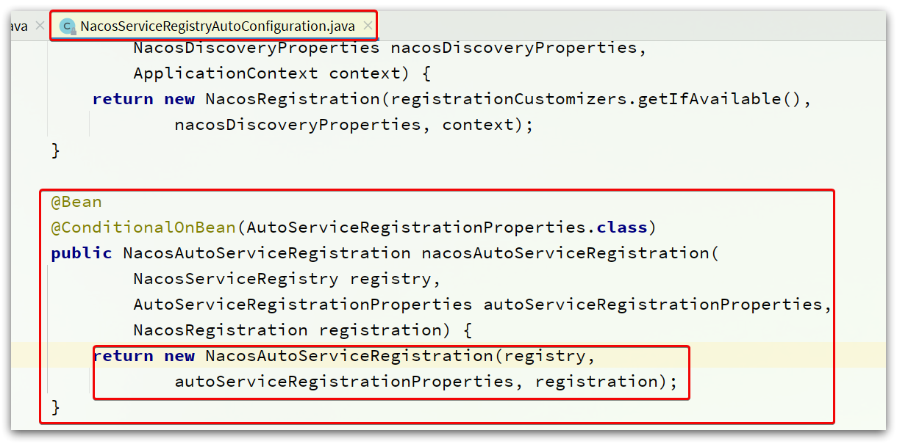


### 2.2.2.NacosAutoServiceRegistration

`NacosAutoServiceRegistration`源码如图：

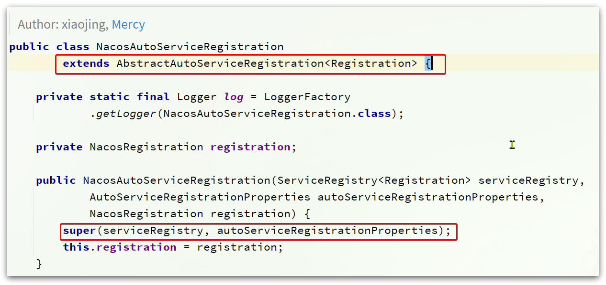

可以看到在初始化时，其父类`AbstractAutoServiceRegistration`也被初始化了。


`AbstractAutoServiceRegistration`如图：

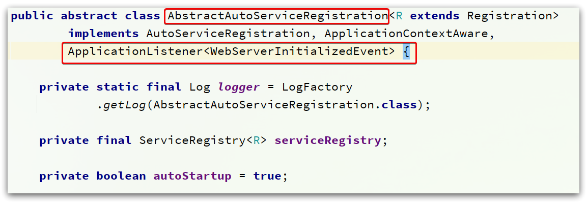

可以看到它实现了`ApplicationListener`接口，监听Spring容器启动过程中的事件。

在监听到`WebServerInitializedEvent`（web服务初始化完成）的事件后，执行了`bind` 方法。

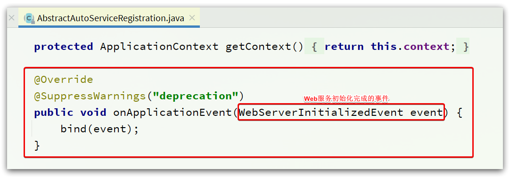


其中的bind方法如下：

```java
public void bind(WebServerInitializedEvent event) {
    // 获取 ApplicationContext
    ApplicationContext context = event.getApplicationContext();
    // 判断服务的 namespace,一般都是null
    if (context instanceof ConfigurableWebServerApplicationContext) {
        if ("management".equals(((ConfigurableWebServerApplicationContext) context)
                                .getServerNamespace())) {
            return;
        }
    }
    // 记录当前 web 服务的端口
    this.port.compareAndSet(0, event.getWebServer().getPort());
    // 启动当前服务注册流程
    this.start();
}
```

其中的start方法流程：

```java
public void start() {
		if (!isEnabled()) {
			if (logger.isDebugEnabled()) {
				logger.debug("Discovery Lifecycle disabled. Not starting");
			}
			return;
		}

		// 当前服务处于未运行状态时，才进行初始化
		if (!this.running.get()) {
            // 发布服务开始注册的事件
			this.context.publishEvent(
					new InstancePreRegisteredEvent(this, getRegistration()));
            // ☆☆☆☆开始注册☆☆☆☆
			register();
			if (shouldRegisterManagement()) {
				registerManagement();
			}
            // 发布注册完成事件
			this.context.publishEvent(
					new InstanceRegisteredEvent<>(this, getConfiguration()));
            // 服务状态设置为运行状态，基于AtomicBoolean
			this.running.compareAndSet(false, true);
		}

	}
```


其中最关键的register()方法就是完成服务注册的关键，代码如下：

```java
protected void register() {
    this.serviceRegistry.register(getRegistration());
}
```

此处的this.serviceRegistry就是NacosServiceRegistry：


### 2.2.3.NacosServiceRegistry

`NacosServiceRegistry`是Spring的`ServiceRegistry`接口的实现类，而ServiceRegistry接口是服务注册、发现的规约接口，定义了register、deregister等方法的声明。


而`NacosServiceRegistry`对`register`的实现如下：

```java
@Override
public void register(Registration registration) {
	// 判断serviceId是否为空，也就是spring.application.name不能为空
    if (StringUtils.isEmpty(registration.getServiceId())) {
        log.warn("No service to register for nacos client...");
        return;
    }
    // 获取Nacos的命名服务，其实就是注册中心服务
    NamingService namingService = namingService();
    // 获取 serviceId 和 Group
    String serviceId = registration.getServiceId();
    String group = nacosDiscoveryProperties.getGroup();
	// 封装服务实例的基本信息，如 cluster-name、是否为临时实例、权重、IP、端口等
    Instance instance = getNacosInstanceFromRegistration(registration);

    try {
        // 开始注册服务
        namingService.registerInstance(serviceId, group, instance);
        log.info("nacos registry, {} {} {}:{} register finished", group, serviceId,
                 instance.getIp(), instance.getPort());
    }
    catch (Exception e) {
        if (nacosDiscoveryProperties.isFailFast()) {
            log.error("nacos registry, {} register failed...{},", serviceId,
                      registration.toString(), e);
            rethrowRuntimeException(e);
        }
        else {
            log.warn("Failfast is false. {} register failed...{},", serviceId,
                     registration.toString(), e);
        }
    }
}
```

可以看到方法中最终是调用NamingService的registerInstance方法实现注册的。

而NamingService接口的默认实现就是NacosNamingService。

### 2.2.4.NacosNamingService

NacosNamingService提供了服务注册、订阅等功能。

其中registerInstance就是注册服务实例，源码如下：

```java
@Override
public void registerInstance(String serviceName, String groupName, Instance instance) throws NacosException {
    // 检查超时参数是否异常。心跳超时时间(默认15秒)必须大于心跳周期(默认5秒)
    NamingUtils.checkInstanceIsLegal(instance);
    // 拼接得到新的服务名，格式为：groupName@@serviceId
    String groupedServiceName = NamingUtils.getGroupedName(serviceName, groupName);
    // 判断是否为临时实例，默认为 true。
    if (instance.isEphemeral()) {
        // 如果是临时实例，需要定时向 Nacos 服务发送心跳
        BeatInfo beatInfo = beatReactor.buildBeatInfo(groupedServiceName, instance);
        beatReactor.addBeatInfo(groupedServiceName, beatInfo);
    }
    // 发送注册服务实例的请求
    serverProxy.registerService(groupedServiceName, groupName, instance);
}
```

最终，由NacosProxy的registerService方法，完成服务注册。


代码如下：

```java
public void registerService(String serviceName, String groupName, Instance instance) throws NacosException {

    NAMING_LOGGER.info("[REGISTER-SERVICE] {} registering service {} with instance: {}", namespaceId, serviceName,
                       instance);
	// 组织请求参数
    final Map<String, String> params = new HashMap<String, String>(16);
    params.put(CommonParams.NAMESPACE_ID, namespaceId);
    params.put(CommonParams.SERVICE_NAME, serviceName);
    params.put(CommonParams.GROUP_NAME, groupName);
    params.put(CommonParams.CLUSTER_NAME, instance.getClusterName());
    params.put("ip", instance.getIp());
    params.put("port", String.valueOf(instance.getPort()));
    params.put("weight", String.valueOf(instance.getWeight()));
    params.put("enable", String.valueOf(instance.isEnabled()));
    params.put("healthy", String.valueOf(instance.isHealthy()));
    params.put("ephemeral", String.valueOf(instance.isEphemeral()));
    params.put("metadata", JacksonUtils.toJson(instance.getMetadata()));
	// 通过POST请求将上述参数，发送到 /nacos/v1/ns/instance
    reqApi(UtilAndComs.nacosUrlInstance, params, HttpMethod.POST);

}
```


这里提交的信息就是Nacos服务注册接口需要的完整参数，核心参数有：

- namespace_id：环境
- service_name：服务名称
- group_name：组名称
- cluster_name：集群名称
- ip: 当前实例的ip地址
- port: 当前实例的端口


而在NacosNamingService的registerInstance方法中，有一段是与服务心跳有关的代码，我们在后续会继续学习。


### 2.2.5.客户端注册的流程图

如图：


## 2.3.服务端

在nacos-console的模块中，会引入nacos-naming这个模块：


模块结构如下：

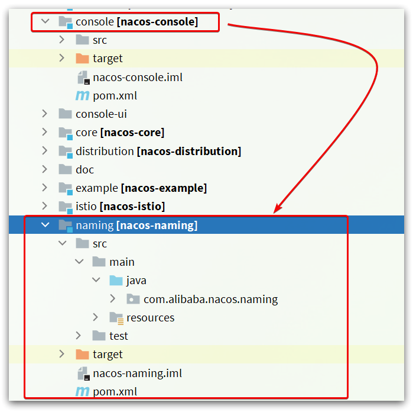

其中的com.alibaba.nacos.naming.controllers包下就有服务注册、发现等相关的各种接口，其中的服务注册是在`InstanceController`类中：


### 2.3.1.InstanceController

进入InstanceController类，可以看到一个register方法，就是服务注册的方法了：

```java
@CanDistro
@PostMapping
@Secured(parser = NamingResourceParser.class, action = ActionTypes.WRITE)
public String register(HttpServletRequest request) throws Exception {
	// 尝试获取namespaceId
    final String namespaceId = WebUtils
        .optional(request, CommonParams.NAMESPACE_ID, Constants.DEFAULT_NAMESPACE_ID);
    // 尝试获取serviceName，其格式为 group_name@@service_name
    final String serviceName = WebUtils.required(request, CommonParams.SERVICE_NAME);
    NamingUtils.checkServiceNameFormat(serviceName);
	// 解析出实例信息，封装为Instance对象
    final Instance instance = parseInstance(request);
	// 注册实例
    serviceManager.registerInstance(namespaceId, serviceName, instance);
    return "ok";
}
```


这里，进入到了serviceManager.registerInstance()方法中。


### 2.3.2.ServiceManager

ServiceManager就是Nacos中管理服务、实例信息的核心API，其中就包含Nacos的服务注册表：


而其中的registerInstance方法就是注册服务实例的方法：

```java
/**
     * Register an instance to a service in AP mode.
     *
     * <p>This method creates service or cluster silently if they don't exist.
     *
     * @param namespaceId id of namespace
     * @param serviceName service name
     * @param instance    instance to register
     * @throws Exception any error occurred in the process
     */
public void registerInstance(String namespaceId, String serviceName, Instance instance) throws NacosException {
	// 创建一个空的service（如果是第一次来注册实例，要先创建一个空service出来，放入注册表）
    // 此时不包含实例信息
    createEmptyService(namespaceId, serviceName, instance.isEphemeral());
    // 拿到创建好的service
    Service service = getService(namespaceId, serviceName);
    // 拿不到则抛异常
    if (service == null) {
        throw new NacosException(NacosException.INVALID_PARAM,
                                 "service not found, namespace: " + namespaceId + ", service: " + serviceName);
    }
    // 添加要注册的实例到service中
    addInstance(namespaceId, serviceName, instance.isEphemeral(), instance);
}
```


创建好了服务，接下来就要添加实例到服务中：

```java
/**
     * Add instance to service.
     *
     * @param namespaceId namespace
     * @param serviceName service name
     * @param ephemeral   whether instance is ephemeral
     * @param ips         instances
     * @throws NacosException nacos exception
     */
public void addInstance(String namespaceId, String serviceName, boolean ephemeral, Instance... ips)
    throws NacosException {
	// 监听服务列表用到的key，服务唯一标识，例如：com.alibaba.nacos.naming.iplist.ephemeral.public##DEFAULT_GROUP@@order-service
    String key = KeyBuilder.buildInstanceListKey(namespaceId, serviceName, ephemeral);
    // 获取服务
    Service service = getService(namespaceId, serviceName);
    // 同步锁，避免并发修改的安全问题
    synchronized (service) {
        // 1）获取要更新的实例列表
        List<Instance> instanceList = addIpAddresses(service, ephemeral, ips);
		// 2）封装实例列表到Instances对象
        Instances instances = new Instances();
        instances.setInstanceList(instanceList);
		// 3）完成 注册表更新 以及 Nacos集群的数据同步
        consistencyService.put(key, instances);
    }
}
```


该方法中对修改服务列表的动作加锁处理，确保线程安全。而在同步代码块中，包含下面几步：

- 1）先获取要更新的实例列表，`addIpAddresses(service, ephemeral, ips);`
- 2）然后将更新后的数据封装到`Instances`对象中，后面更新注册表时使用
- 3）最后，调用`consistencyService.put()`方法完成Nacos集群的数据同步，保证集群一致性。


> 注意：在第1步的addIPAddress中，会拷贝旧的实例列表，添加新实例到列表中。在第3步中，完成对实例状态更新后，则会用新列表直接覆盖旧实例列表。而在更新过程中，旧实例列表不受影响，用户依然可以读取。
>
> 这样在更新列表状态过程中，无需阻塞用户的读操作，也不会导致用户读取到脏数据，性能比较好。这种方案称为CopyOnWrite方案。


#### 1）更服务列表

我们来看看实例列表的更新，对应的方法是`addIpAddresses(service, ephemeral, ips);`：

```java
private List<Instance> addIpAddresses(Service service, boolean ephemeral, Instance... ips) throws NacosException {
    return updateIpAddresses(service, UtilsAndCommons.UPDATE_INSTANCE_ACTION_ADD, ephemeral, ips);
}
```

继续进入`updateIpAddresses`方法：

```java
public List<Instance> updateIpAddresses(Service service, String action, boolean ephemeral, Instance... ips)
    throws NacosException {
	// 根据namespaceId、serviceName获取当前服务的实例列表，返回值是Datum
    // 第一次来，肯定是null
    Datum datum = consistencyService
        .get(KeyBuilder.buildInstanceListKey(service.getNamespaceId(), service.getName(), ephemeral));
	// 得到服务中现有的实例列表
    List<Instance> currentIPs = service.allIPs(ephemeral);
    // 创建map，保存实例列表，key为ip地址，value是Instance对象
    Map<String, Instance> currentInstances = new HashMap<>(currentIPs.size());
    // 创建Set集合，保存实例的instanceId
    Set<String> currentInstanceIds = Sets.newHashSet();
	// 遍历要现有的实例列表
    for (Instance instance : currentIPs) {
        // 添加到map中
        currentInstances.put(instance.toIpAddr(), instance);
        // 添加instanceId到set中
        currentInstanceIds.add(instance.getInstanceId());
    }
	
    // 创建map，用来保存更新后的实例列表
    Map<String, Instance> instanceMap;
    if (datum != null && null != datum.value) {
        // 如果服务中已经有旧的数据，则先保存旧的实例列表
        instanceMap = setValid(((Instances) datum.value).getInstanceList(), currentInstances);
    } else {
        // 如果没有旧数据，则直接创建新的map
        instanceMap = new HashMap<>(ips.length);
    }
	// 遍历实例列表
    for (Instance instance : ips) {
        // 判断服务中是否包含要注册的实例的cluster信息
        if (!service.getClusterMap().containsKey(instance.getClusterName())) {
            // 如果不包含，创建新的cluster
            Cluster cluster = new Cluster(instance.getClusterName(), service);
            cluster.init();
            // 将集群放入service的注册表
            service.getClusterMap().put(instance.getClusterName(), cluster);
            Loggers.SRV_LOG
                .warn("cluster: {} not found, ip: {}, will create new cluster with default configuration.",
                      instance.getClusterName(), instance.toJson());
        }
		// 删除实例 or 新增实例 ？
        if (UtilsAndCommons.UPDATE_INSTANCE_ACTION_REMOVE.equals(action)) {
            instanceMap.remove(instance.getDatumKey());
        } else {
            // 新增实例，instance生成全新的instanceId
            Instance oldInstance = instanceMap.get(instance.getDatumKey());
            if (oldInstance != null) {
                instance.setInstanceId(oldInstance.getInstanceId());
            } else {
                instance.setInstanceId(instance.generateInstanceId(currentInstanceIds));
            }
            // 放入instance列表
            instanceMap.put(instance.getDatumKey(), instance);
        }

    }

    if (instanceMap.size() <= 0 && UtilsAndCommons.UPDATE_INSTANCE_ACTION_ADD.equals(action)) {
        throw new IllegalArgumentException(
            "ip list can not be empty, service: " + service.getName() + ", ip list: " + JacksonUtils
            .toJson(instanceMap.values()));
    }
	// 将instanceMap中的所有实例转为List返回
    return new ArrayList<>(instanceMap.values());
}
```

简单来讲，就是先获取旧的实例列表，然后把新的实例信息与旧的做对比，新的实例就添加，老的实例同步ID。然后返回最新的实例列表。


#### 2）Nacos集群一致性

在完成本地服务列表更新后，Nacos又实现了集群一致性更新，调用的是:

`consistencyService.put(key, instances);`

这里的ConsistencyService接口，代表集群一致性的接口，有很多中不同实现：


我们进入DelegateConsistencyServiceImpl来看：

```java
@Override
public void put(String key, Record value) throws NacosException {
    // 根据实例是否是临时实例，判断委托对象
    mapConsistencyService(key).put(key, value);
}
```

其中的`mapConsistencyService(key)`方法就是选择委托方式的：

```java
private ConsistencyService mapConsistencyService(String key) {
    // 判断是否是临时实例：
    // 是，选择 ephemeralConsistencyService，也就是 DistroConsistencyServiceImpl类
    // 否，选择 persistentConsistencyService，也就是PersistentConsistencyServiceDelegateImpl
    return KeyBuilder.matchEphemeralKey(key) ? ephemeralConsistencyService : persistentConsistencyService;
}
```


默认情况下，所有实例都是临时实例，我们关注DistroConsistencyServiceImpl即可。


### 2.3.4.DistroConsistencyServiceImpl

我们来看临时实例的一致性实现：DistroConsistencyServiceImpl类的put方法：

```java
public void put(String key, Record value) throws NacosException {
    // 先将要更新的实例信息写入本地实例列表
    onPut(key, value);
    // 开始集群同步
    distroProtocol.sync(new DistroKey(key, KeyBuilder.INSTANCE_LIST_KEY_PREFIX), DataOperation.CHANGE,
                        globalConfig.getTaskDispatchPeriod() / 2);
}
```

这里方法只有两行：

- `onPut(key, value)`：其中value就是Instances，要更新的服务信息。这行主要是基于线程池方式，异步的将Service信息写入注册表中(就是那个多重Map)
- `distroProtocol.sync()`：就是通过Distro协议将数据同步给集群中的其它Nacos节点


我们先看onPut方法

#### 2.3.4.1.更新本地实例列表

##### 1）放入阻塞队列

onPut方法如下：

```java
public void onPut(String key, Record value) {
	// 判断是否是临时实例
    if (KeyBuilder.matchEphemeralInstanceListKey(key)) {
        // 封装 Instances 信息到 数据集：Datum
        Datum<Instances> datum = new Datum<>();
        datum.value = (Instances) value;
        datum.key = key;
        datum.timestamp.incrementAndGet();
        // 放入DataStore
        dataStore.put(key, datum);
    }

    if (!listeners.containsKey(key)) {
        return;
    }
	// 放入阻塞队列，这里的 notifier维护了一个阻塞队列，并且基于线程池异步执行队列中的任务
    notifier.addTask(key, DataOperation.CHANGE);
}
```


notifier的类型就是`DistroConsistencyServiceImpl.Notifier`，内部维护了一个阻塞队列，存放服务列表变更的事件：


addTask时，将任务加入该阻塞队列：

```java
// DistroConsistencyServiceImpl.Notifier类的 addTask 方法：
public void addTask(String datumKey, DataOperation action) {

    if (services.containsKey(datumKey) && action == DataOperation.CHANGE) {
        return;
    }
    if (action == DataOperation.CHANGE) {
        services.put(datumKey, StringUtils.EMPTY);
    }
    // 任务放入阻塞队列
    tasks.offer(Pair.with(datumKey, action));
}
```


##### 2）Notifier异步更新

同时，notifier还是一个Runnable，通过一个单线程的线程池来不断从阻塞队列中获取任务，执行服务列表的更新。来看下其中的run方法：

```java
// DistroConsistencyServiceImpl.Notifier类的run方法：
@Override
public void run() {
    Loggers.DISTRO.info("distro notifier started");
	// 死循环，不断执行任务。因为是阻塞队列，不会导致CPU负载过高
    for (; ; ) {
        try {
            // 从阻塞队列中获取任务
            Pair<String, DataOperation> pair = tasks.take();
            // 处理任务，更新服务列表
            handle(pair);
        } catch (Throwable e) {
            Loggers.DISTRO.error("[NACOS-DISTRO] Error while handling notifying task", e);
        }
    }
}
```

来看看handle方法：

```java
// DistroConsistencyServiceImpl.Notifier类的 handle 方法：
private void handle(Pair<String, DataOperation> pair) {
    try {
        String datumKey = pair.getValue0();
        DataOperation action = pair.getValue1();

        services.remove(datumKey);

        int count = 0;

        if (!listeners.containsKey(datumKey)) {
            return;
        }
		// 遍历，找到变化的service，这里的 RecordListener就是 Service
        for (RecordListener listener : listeners.get(datumKey)) {

            count++;

            try {
                // 服务的实例列表CHANGE事件
                if (action == DataOperation.CHANGE) {
                    // 更新服务列表
                    listener.onChange(datumKey, dataStore.get(datumKey).value);
                    continue;
                }
				// 服务的实例列表 DELETE 事件
                if (action == DataOperation.DELETE) {
                    listener.onDelete(datumKey);
                    continue;
                }
            } catch (Throwable e) {
                Loggers.DISTRO.error("[NACOS-DISTRO] error while notifying listener of key: {}", datumKey, e);
            }
        }

        if (Loggers.DISTRO.isDebugEnabled()) {
            Loggers.DISTRO
                .debug("[NACOS-DISTRO] datum change notified, key: {}, listener count: {}, action: {}",
                       datumKey, count, action.name());
        }
    } catch (Throwable e) {
        Loggers.DISTRO.error("[NACOS-DISTRO] Error while handling notifying task", e);
    }
}
```


##### 3）覆盖实例列表

而在Service的onChange方法中，就可以看到更新实例列表的逻辑了：

```java
@Override
public void onChange(String key, Instances value) throws Exception {

    Loggers.SRV_LOG.info("[NACOS-RAFT] datum is changed, key: {}, value: {}", key, value);

	// 更新实例列表
    updateIPs(value.getInstanceList(), KeyBuilder.matchEphemeralInstanceListKey(key));

    recalculateChecksum();
}
```

updateIPs方法：

```java
public void updateIPs(Collection<Instance> instances, boolean ephemeral) {
    // 准备一个Map，key是cluster，值是集群下的Instance集合
    Map<String, List<Instance>> ipMap = new HashMap<>(clusterMap.size());
    // 获取服务的所有cluster名称
    for (String clusterName : clusterMap.keySet()) {
        ipMap.put(clusterName, new ArrayList<>());
    }
    // 遍历要更新的实例
    for (Instance instance : instances) {
        try {
            if (instance == null) {
                Loggers.SRV_LOG.error("[NACOS-DOM] received malformed ip: null");
                continue;
            }
			// 判断实例是否包含clusterName，没有的话用默认cluster
            if (StringUtils.isEmpty(instance.getClusterName())) {
                instance.setClusterName(UtilsAndCommons.DEFAULT_CLUSTER_NAME);
            }
			// 判断cluster是否存在，不存在则创建新的cluster
            if (!clusterMap.containsKey(instance.getClusterName())) {
                Loggers.SRV_LOG
                    .warn("cluster: {} not found, ip: {}, will create new cluster with default configuration.",
                          instance.getClusterName(), instance.toJson());
                Cluster cluster = new Cluster(instance.getClusterName(), this);
                cluster.init();
                getClusterMap().put(instance.getClusterName(), cluster);
            }
			// 获取当前cluster实例的集合，不存在则创建新的
            List<Instance> clusterIPs = ipMap.get(instance.getClusterName());
            if (clusterIPs == null) {
                clusterIPs = new LinkedList<>();
                ipMap.put(instance.getClusterName(), clusterIPs);
            }
			// 添加新的实例到 Instance 集合
            clusterIPs.add(instance);
        } catch (Exception e) {
            Loggers.SRV_LOG.error("[NACOS-DOM] failed to process ip: " + instance, e);
        }
    }

    for (Map.Entry<String, List<Instance>> entry : ipMap.entrySet()) {
        //make every ip mine
        List<Instance> entryIPs = entry.getValue();
        // 将实例集合更新到 clusterMap（注册表）
        clusterMap.get(entry.getKey()).updateIps(entryIPs, ephemeral);
    }

    setLastModifiedMillis(System.currentTimeMillis());
    // 发布服务变更的通知消息
    getPushService().serviceChanged(this);
    StringBuilder stringBuilder = new StringBuilder();

    for (Instance instance : allIPs()) {
        stringBuilder.append(instance.toIpAddr()).append("_").append(instance.isHealthy()).append(",");
    }

    Loggers.EVT_LOG.info("[IP-UPDATED] namespace: {}, service: {}, ips: {}", getNamespaceId(), getName(),
                         stringBuilder.toString());

}
```


在第45行的代码中：`clusterMap.get(entry.getKey()).updateIps(entryIPs, ephemeral);`

就是在更新注册表：

```java
public void updateIps(List<Instance> ips, boolean ephemeral) {
    // 获取旧实例列表
    Set<Instance> toUpdateInstances = ephemeral ? ephemeralInstances : persistentInstances;

    HashMap<String, Instance> oldIpMap = new HashMap<>(toUpdateInstances.size());

    for (Instance ip : toUpdateInstances) {
        oldIpMap.put(ip.getDatumKey(), ip);
    }

	// 检查新加入实例的状态
    List<Instance> newIPs = subtract(ips, oldIpMap.values());
    if (newIPs.size() > 0) {
        Loggers.EVT_LOG
            .info("{} {SYNC} {IP-NEW} cluster: {}, new ips size: {}, content: {}", getService().getName(),
                  getName(), newIPs.size(), newIPs.toString());

        for (Instance ip : newIPs) {
            HealthCheckStatus.reset(ip);
        }
    }
	// 移除要删除的实例
    List<Instance> deadIPs = subtract(oldIpMap.values(), ips);

    if (deadIPs.size() > 0) {
        Loggers.EVT_LOG
            .info("{} {SYNC} {IP-DEAD} cluster: {}, dead ips size: {}, content: {}", getService().getName(),
                  getName(), deadIPs.size(), deadIPs.toString());

        for (Instance ip : deadIPs) {
            HealthCheckStatus.remv(ip);
        }
    }

    toUpdateInstances = new HashSet<>(ips);
	// 直接覆盖旧实例列表
    if (ephemeral) {
        ephemeralInstances = toUpdateInstances;
    } else {
        persistentInstances = toUpdateInstances;
    }
}
```


#### 2.3.4.2.集群数据同步

在DistroConsistencyServiceImpl的put方法中分为两步：


其中的onPut方法已经分析过了。


下面的distroProtocol.sync()就是集群同步的逻辑了。

DistroProtocol类的sync方法如下：

```java
public void sync(DistroKey distroKey, DataOperation action, long delay) {
    // 遍历 Nacos 集群中除自己以外的其它节点
    for (Member each : memberManager.allMembersWithoutSelf()) {
        DistroKey distroKeyWithTarget = new DistroKey(distroKey.getResourceKey(), distroKey.getResourceType(),
                                                      each.getAddress());
        // 定义一个Distro的同步任务
        DistroDelayTask distroDelayTask = new DistroDelayTask(distroKeyWithTarget, action, delay);
        // 交给线程池去执行
        distroTaskEngineHolder.getDelayTaskExecuteEngine().addTask(distroKeyWithTarget, distroDelayTask);
        if (Loggers.DISTRO.isDebugEnabled()) {
            Loggers.DISTRO.debug("[DISTRO-SCHEDULE] {} to {}", distroKey, each.getAddress());
        }
    }
}
```


其中同步的任务封装为一个`DistroDelayTask`对象。

交给了`distroTaskEngineHolder.getDelayTaskExecuteEngine()`执行，这行代码的返回值是：

`NacosDelayTaskExecuteEngine`，这个类维护了一个线程池，并且接收任务，执行任务。

执行任务的方法为processTasks()方法：

```java
protected void processTasks() {
    Collection<Object> keys = getAllTaskKeys();
    for (Object taskKey : keys) {
        AbstractDelayTask task = removeTask(taskKey);
        if (null == task) {
            continue;
        }
        NacosTaskProcessor processor = getProcessor(taskKey);
        if (null == processor) {
            getEngineLog().error("processor not found for task, so discarded. " + task);
            continue;
        }
        try {
            // 尝试执行同步任务，如果失败会重试
            if (!processor.process(task)) {
                retryFailedTask(taskKey, task);
            }
        } catch (Throwable e) {
            getEngineLog().error("Nacos task execute error : " + e.toString(), e);
            retryFailedTask(taskKey, task);
        }
    }
}
```


可以看出来基于Distro模式的同步是异步进行的，并且失败时会将任务重新入队并充实，因此不保证同步结果的强一致性，属于AP模式的一致性策略。


### 2.3.5.服务端流程图


## 2.4.总结


- Nacos的注册表结构是什么样的？

  - 答：Nacos是多级存储模型，最外层通过namespace来实现环境隔离，然后是group分组，分组下就是服务，一个服务有可以分为不同的集群，集群中包含多个实例。因此其注册表结构为一个Map，类型是：

    `Map<String, Map<String, Service>>`，

    外层key是`namespace_id`，内层key是`group+serviceName`.

    Service内部维护一个Map，结构是：`Map<String,Cluster>`，key是clusterName，值是集群信息

    Cluster内部维护一个Set集合，元素是Instance类型，代表集群中的多个实例。


- Nacos如何保证并发写的安全性？
  - 答：首先，在注册实例时，会对service加锁，不同service之间本身就不存在并发写问题，互不影响。相同service时通过锁来互斥。并且，在更新实例列表时，是基于异步的线程池来完成，而线程池的线程数量为1.
- Nacos如何避免并发读写的冲突？
  - 答：Nacos在更新实例列表时，会采用CopyOnWrite技术，首先将Old实例列表拷贝一份，然后更新拷贝的实例列表，再用更新后的实例列表来覆盖旧的实例列表。

- Nacos如何应对阿里内部数十万服务的并发写请求？
  - 答：Nacos内部会将服务注册的任务放入阻塞队列，采用线程池异步来完成实例更新，从而提高并发写能力。


# 3.服务心跳

Nacos的实例分为临时实例和永久实例两种，可以通过在yaml 文件配置：

```yaml
spring:
  application:
    name: order-service
  cloud:
    nacos:
      discovery:
        ephemeral: false # 设置实例为永久实例。true：临时; false：永久
      server-addr: 192.168.150.1:8845
```


临时实例基于心跳方式做健康检测，而永久实例则是由Nacos主动探测实例状态。


其中Nacos提供的心跳的API接口为：

**接口描述**：发送某个实例的心跳

**请求类型**：PUT

**请求路径**：

```plain
/nacos/v1/ns/instance/beat
```

**请求参数**：

| 名称        | 类型           | 是否必选 | 描述         |
| :---------- | :------------- | :------- | ------------ |
| serviceName | 字符串         | 是       | 服务名       |
| groupName   | 字符串         | 否       | 分组名       |
| ephemeral   | boolean        | 否       | 是否临时实例 |
| beat        | JSON格式字符串 | 是       | 实例心跳内容 |

**错误编码**：

| 错误代码 | 描述                  | 语义                   |
| :------- | :-------------------- | :--------------------- |
| 400      | Bad Request           | 客户端请求中的语法错误 |
| 403      | Forbidden             | 没有权限               |
| 404      | Not Found             | 无法找到资源           |
| 500      | Internal Server Error | 服务器内部错误         |
| 200      | OK                    | 正常                   |


## 3.1.客户端

在2.2.4.服务注册这一节中，我们说过NacosNamingService这个类实现了服务的注册，同时也实现了服务心跳：

```java
@Override
public void registerInstance(String serviceName, String groupName, Instance instance) throws NacosException {
    NamingUtils.checkInstanceIsLegal(instance);
    String groupedServiceName = NamingUtils.getGroupedName(serviceName, groupName);
    // 判断是否是临时实例。
    if (instance.isEphemeral()) {
        // 如果是临时实例，则构建心跳信息BeatInfo
        BeatInfo beatInfo = beatReactor.buildBeatInfo(groupedServiceName, instance);
        // 添加心跳任务
        beatReactor.addBeatInfo(groupedServiceName, beatInfo);
    }
    serverProxy.registerService(groupedServiceName, groupName, instance);
}
```


### 3.1.1.BeatInfo

这里的BeanInfo就包含心跳需要的各种信息：


### 3.1.2.BeatReactor

而`BeatReactor`这个类则维护了一个线程池：


当调用`BeatReactor`的`.addBeatInfo(groupedServiceName, beatInfo)`方法时，就会执行心跳：

```java
public void addBeatInfo(String serviceName, BeatInfo beatInfo) {
    NAMING_LOGGER.info("[BEAT] adding beat: {} to beat map.", beatInfo);
    String key = buildKey(serviceName, beatInfo.getIp(), beatInfo.getPort());
    BeatInfo existBeat = null;
    //fix #1733
    if ((existBeat = dom2Beat.remove(key)) != null) {
        existBeat.setStopped(true);
    }
    dom2Beat.put(key, beatInfo);
    // 利用线程池，定期执行心跳任务，周期为 beatInfo.getPeriod()
    executorService.schedule(new BeatTask(beatInfo), beatInfo.getPeriod(), TimeUnit.MILLISECONDS);
    MetricsMonitor.getDom2BeatSizeMonitor().set(dom2Beat.size());
}
```


心跳周期的默认值在`com.alibaba.nacos.api.common.Constants`类中：


可以看到是5秒，默认5秒一次心跳。


### 3.1.3.BeatTask

心跳的任务封装在`BeatTask`这个类中，是一个Runnable，其run方法如下：

```java
@Override
public void run() {
    if (beatInfo.isStopped()) {
        return;
    }
    // 获取心跳周期
    long nextTime = beatInfo.getPeriod();
    try {
        // 发送心跳
        JsonNode result = serverProxy.sendBeat(beatInfo, BeatReactor.this.lightBeatEnabled);
        long interval = result.get("clientBeatInterval").asLong();
        boolean lightBeatEnabled = false;
        if (result.has(CommonParams.LIGHT_BEAT_ENABLED)) {
            lightBeatEnabled = result.get(CommonParams.LIGHT_BEAT_ENABLED).asBoolean();
        }
        BeatReactor.this.lightBeatEnabled = lightBeatEnabled;
        if (interval > 0) {
            nextTime = interval;
        }
        // 判断心跳结果
        int code = NamingResponseCode.OK;
        if (result.has(CommonParams.CODE)) {
            code = result.get(CommonParams.CODE).asInt();
        }
        if (code == NamingResponseCode.RESOURCE_NOT_FOUND) {
            // 如果失败，则需要 重新注册实例
            Instance instance = new Instance();
            instance.setPort(beatInfo.getPort());
            instance.setIp(beatInfo.getIp());
            instance.setWeight(beatInfo.getWeight());
            instance.setMetadata(beatInfo.getMetadata());
            instance.setClusterName(beatInfo.getCluster());
            instance.setServiceName(beatInfo.getServiceName());
            instance.setInstanceId(instance.getInstanceId());
            instance.setEphemeral(true);
            try {
                serverProxy.registerService(beatInfo.getServiceName(),
                                            NamingUtils.getGroupName(beatInfo.getServiceName()), instance);
            } catch (Exception ignore) {
            }
        }
    } catch (NacosException ex) {
        NAMING_LOGGER.error("[CLIENT-BEAT] failed to send beat: {}, code: {}, msg: {}",
                            JacksonUtils.toJson(beatInfo), ex.getErrCode(), ex.getErrMsg());

    } catch (Exception unknownEx) {
        NAMING_LOGGER.error("[CLIENT-BEAT] failed to send beat: {}, unknown exception msg: {}",
                            JacksonUtils.toJson(beatInfo), unknownEx.getMessage(), unknownEx);
    } finally {
        executorService.schedule(new BeatTask(beatInfo), nextTime, TimeUnit.MILLISECONDS);
    }
}
```


### 3.1.5.发送心跳

最终心跳的发送还是通过`NamingProxy`的`sendBeat`方法来实现：

```java
public JsonNode sendBeat(BeatInfo beatInfo, boolean lightBeatEnabled) throws NacosException {

    if (NAMING_LOGGER.isDebugEnabled()) {
        NAMING_LOGGER.debug("[BEAT] {} sending beat to server: {}", namespaceId, beatInfo.toString());
    }
    // 组织请求参数
    Map<String, String> params = new HashMap<String, String>(8);
    Map<String, String> bodyMap = new HashMap<String, String>(2);
    if (!lightBeatEnabled) {
        bodyMap.put("beat", JacksonUtils.toJson(beatInfo));
    }
    params.put(CommonParams.NAMESPACE_ID, namespaceId);
    params.put(CommonParams.SERVICE_NAME, beatInfo.getServiceName());
    params.put(CommonParams.CLUSTER_NAME, beatInfo.getCluster());
    params.put("ip", beatInfo.getIp());
    params.put("port", String.valueOf(beatInfo.getPort()));
    // 发送请求，这个地址就是：/v1/ns/instance/beat
    String result = reqApi(UtilAndComs.nacosUrlBase + "/instance/beat", params, bodyMap, HttpMethod.PUT);
    return JacksonUtils.toObj(result);
}
```


## 3.2.服务端

对于临时实例，服务端代码分两部分：

- 1）InstanceController提供了一个接口，处理客户端的心跳请求
- 2）定时检测实例心跳是否按期执行


### 3.2.1.InstanceController

与服务注册时一样，在nacos-naming模块中的InstanceController类中，定义了一个方法用来处理心跳请求：

```java
@CanDistro
@PutMapping("/beat")
@Secured(parser = NamingResourceParser.class, action = ActionTypes.WRITE)
public ObjectNode beat(HttpServletRequest request) throws Exception {
	// 解析心跳的请求参数
    ObjectNode result = JacksonUtils.createEmptyJsonNode();
    result.put(SwitchEntry.CLIENT_BEAT_INTERVAL, switchDomain.getClientBeatInterval());

    String beat = WebUtils.optional(request, "beat", StringUtils.EMPTY);
    RsInfo clientBeat = null;
    if (StringUtils.isNotBlank(beat)) {
        clientBeat = JacksonUtils.toObj(beat, RsInfo.class);
    }
    String clusterName = WebUtils
        .optional(request, CommonParams.CLUSTER_NAME, UtilsAndCommons.DEFAULT_CLUSTER_NAME);
    String ip = WebUtils.optional(request, "ip", StringUtils.EMPTY);
    int port = Integer.parseInt(WebUtils.optional(request, "port", "0"));
    if (clientBeat != null) {
        if (StringUtils.isNotBlank(clientBeat.getCluster())) {
            clusterName = clientBeat.getCluster();
        } else {
            // fix #2533
            clientBeat.setCluster(clusterName);
        }
        ip = clientBeat.getIp();
        port = clientBeat.getPort();
    }
    String namespaceId = WebUtils.optional(request, CommonParams.NAMESPACE_ID, Constants.DEFAULT_NAMESPACE_ID);
    String serviceName = WebUtils.required(request, CommonParams.SERVICE_NAME);
    NamingUtils.checkServiceNameFormat(serviceName);
    Loggers.SRV_LOG.debug("[CLIENT-BEAT] full arguments: beat: {}, serviceName: {}", clientBeat, serviceName);
    // 尝试根据参数中的namespaceId、serviceName、clusterName、ip、port等信息
    // 从Nacos的注册表中 获取实例
    Instance instance = serviceManager.getInstance(namespaceId, serviceName, clusterName, ip, port);
	// 如果获取失败，说明心跳失败，实例尚未注册
    if (instance == null) {
        if (clientBeat == null) {
            result.put(CommonParams.CODE, NamingResponseCode.RESOURCE_NOT_FOUND);
            return result;
        }

        Loggers.SRV_LOG.warn("[CLIENT-BEAT] The instance has been removed for health mechanism, "
                             + "perform data compensation operations, beat: {}, serviceName: {}", clientBeat, serviceName);
		// 这里重新注册一个实例
        instance = new Instance();
        instance.setPort(clientBeat.getPort());
        instance.setIp(clientBeat.getIp());
        instance.setWeight(clientBeat.getWeight());
        instance.setMetadata(clientBeat.getMetadata());
        instance.setClusterName(clusterName);
        instance.setServiceName(serviceName);
        instance.setInstanceId(instance.getInstanceId());
        instance.setEphemeral(clientBeat.isEphemeral());

        serviceManager.registerInstance(namespaceId, serviceName, instance);
    }
	// 尝试基于namespaceId和serviceName从 注册表中获取Service服务
    Service service = serviceManager.getService(namespaceId, serviceName);
	// 如果不存在，说明服务不存在，返回404
    if (service == null) {
        throw new NacosException(NacosException.SERVER_ERROR,
                                 "service not found: " + serviceName + "@" + namespaceId);
    }
    if (clientBeat == null) {
        clientBeat = new RsInfo();
        clientBeat.setIp(ip);
        clientBeat.setPort(port);
        clientBeat.setCluster(clusterName);
    }
    // 如果心跳没问题，开始处理心跳结果
    service.processClientBeat(clientBeat);

    result.put(CommonParams.CODE, NamingResponseCode.OK);
    if (instance.containsMetadata(PreservedMetadataKeys.HEART_BEAT_INTERVAL)) {
        result.put(SwitchEntry.CLIENT_BEAT_INTERVAL, instance.getInstanceHeartBeatInterval());
    }
    result.put(SwitchEntry.LIGHT_BEAT_ENABLED, switchDomain.isLightBeatEnabled());
    return result;
}
```


最终，在确认心跳请求对应的服务、实例都在的情况下，开始交给Service类处理这次心跳请求。调用了Service的processClientBeat方法

### 3.2.2.处理心跳请求

查看`Service`的`service.processClientBeat(clientBeat);`方法：

```java
public void processClientBeat(final RsInfo rsInfo) {
    ClientBeatProcessor clientBeatProcessor = new ClientBeatProcessor();
    clientBeatProcessor.setService(this);
    clientBeatProcessor.setRsInfo(rsInfo);
    HealthCheckReactor.scheduleNow(clientBeatProcessor);
}
```

可以看到心跳信息被封装到了 ClientBeatProcessor类中，交给了HealthCheckReactor处理，HealthCheckReactor就是对线程池的封装，不用过多查看。

关键的业务逻辑都在ClientBeatProcessor这个类中，它是一个Runnable，其中的run方法如下：

```java
@Override
public void run() {
    Service service = this.service;
    if (Loggers.EVT_LOG.isDebugEnabled()) {
        Loggers.EVT_LOG.debug("[CLIENT-BEAT] processing beat: {}", rsInfo.toString());
    }

    String ip = rsInfo.getIp();
    String clusterName = rsInfo.getCluster();
    int port = rsInfo.getPort();
    // 获取集群信息
    Cluster cluster = service.getClusterMap().get(clusterName);
    // 获取集群中的所有实例信息
    List<Instance> instances = cluster.allIPs(true);

    for (Instance instance : instances) {
        // 找到心跳的这个实例
        if (instance.getIp().equals(ip) && instance.getPort() == port) {
            if (Loggers.EVT_LOG.isDebugEnabled()) {
                Loggers.EVT_LOG.debug("[CLIENT-BEAT] refresh beat: {}", rsInfo.toString());
            }
            // 更新实例的最后一次心跳时间 lastBeat
            instance.setLastBeat(System.currentTimeMillis());
            if (!instance.isMarked()) {
                if (!instance.isHealthy()) {
                    instance.setHealthy(true);
                    Loggers.EVT_LOG
                        .info("service: {} {POS} {IP-ENABLED} valid: {}:{}@{}, region: {}, msg: client beat ok",
                              cluster.getService().getName(), ip, port, cluster.getName(),
                              UtilsAndCommons.LOCALHOST_SITE);
                    getPushService().serviceChanged(service);
                }
            }
        }
    }
}
```


处理心跳请求的核心就是更新心跳实例的最后一次心跳时间，lastBeat，这个会成为判断实例心跳是否过期的关键指标！


### 3.3.3.心跳异常检测

在服务注册时，一定会创建一个`Service`对象，而`Service`中有一个`init`方法，会在注册时被调用：

```java
public void init() {
    // 开启心跳检测的任务
    HealthCheckReactor.scheduleCheck(clientBeatCheckTask);
    for (Map.Entry<String, Cluster> entry : clusterMap.entrySet()) {
        entry.getValue().setService(this);
        entry.getValue().init();
    }
}
```

其中HealthCheckReactor.scheduleCheck就是执行心跳检测的定时任务：


可以看到，该任务是5000ms执行一次，也就是5秒对实例的心跳状态做一次检测。


此处的ClientBeatCheckTask同样是一个Runnable，其中的run方法为：

```java
@Override
public void run() {
    try {
        // 找到所有临时实例的列表
        List<Instance> instances = service.allIPs(true);

        // first set health status of instances:
        for (Instance instance : instances) {
            // 判断 心跳间隔（当前时间 - 最后一次心跳时间） 是否大于 心跳超时时间，默认15秒
            if (System.currentTimeMillis() - instance.getLastBeat() > instance.getInstanceHeartBeatTimeOut()) {
                if (!instance.isMarked()) {
                    if (instance.isHealthy()) {
                        // 如果超时，标记实例为不健康 healthy = false
                        instance.setHealthy(false);
 
                        // 发布实例状态变更的事件
                        getPushService().serviceChanged(service);
                        ApplicationUtils.publishEvent(new InstanceHeartbeatTimeoutEvent(this, instance));
                    }
                }
            }
        }

        if (!getGlobalConfig().isExpireInstance()) {
            return;
        }

        // then remove obsolete instances:
        for (Instance instance : instances) {

            if (instance.isMarked()) {
                continue;
            }
           // 判断心跳间隔（当前时间 - 最后一次心跳时间）是否大于 实例被删除的最长超时时间，默认30秒
            if (System.currentTimeMillis() - instance.getLastBeat() > instance.getIpDeleteTimeout()) {
                // 如果是超过了30秒，则删除实例
                Loggers.SRV_LOG.info("[AUTO-DELETE-IP] service: {}, ip: {}", service.getName(),
                                     JacksonUtils.toJson(instance));
                deleteIp(instance);
            }
        }

    } catch (Exception e) {
        Loggers.SRV_LOG.warn("Exception while processing client beat time out.", e);
    }

}
```


其中的超时时间同样是在`com.alibaba.nacos.api.common.Constants`这个类中：


### 3.3.4.主动健康检测

对于非临时实例（ephemeral=false)，Nacos会采用主动的健康检测，定时向实例发送请求，根据响应来判断实例健康状态。

入口在2.3.2小节的`ServiceManager`类中的registerInstance方法：


创建空服务时：

```java
public void createEmptyService(String namespaceId, String serviceName, boolean local) throws NacosException {
    // 如果服务不存在，创建新的服务
    createServiceIfAbsent(namespaceId, serviceName, local, null);
}
```

创建服务流程：

```java
public void createServiceIfAbsent(String namespaceId, String serviceName, boolean local, Cluster cluster)
    throws NacosException {
    // 尝试获取服务
    Service service = getService(namespaceId, serviceName);
    if (service == null) {
		// 发现服务不存在，开始创建新服务
        Loggers.SRV_LOG.info("creating empty service {}:{}", namespaceId, serviceName);
        service = new Service();
        service.setName(serviceName);
        service.setNamespaceId(namespaceId);
        service.setGroupName(NamingUtils.getGroupName(serviceName));
        // now validate the service. if failed, exception will be thrown
        service.setLastModifiedMillis(System.currentTimeMillis());
        service.recalculateChecksum();
        if (cluster != null) {
            cluster.setService(service);
            service.getClusterMap().put(cluster.getName(), cluster);
        }
        service.validate();
		// ** 写入注册表并初始化 **
        putServiceAndInit(service);
        if (!local) {
            addOrReplaceService(service);
        }
    }
}
```

关键在`putServiceAndInit(service)`方法中：

```java
private void putServiceAndInit(Service service) throws NacosException {
    // 将服务写入注册表
    putService(service);
    service = getService(service.getNamespaceId(), service.getName());
    // 完成服务的初始化
    service.init();
    consistencyService
        .listen(KeyBuilder.buildInstanceListKey(service.getNamespaceId(), service.getName(), true), service);
    consistencyService
        .listen(KeyBuilder.buildInstanceListKey(service.getNamespaceId(), service.getName(), false), service);
    Loggers.SRV_LOG.info("[NEW-SERVICE] {}", service.toJson());
}
```

进入初始化逻辑：`service.init()`，这个会进入Service类中：

```java
/**
     * Init service.
     */
public void init() {
    // 开启临时实例的心跳监测任务
    HealthCheckReactor.scheduleCheck(clientBeatCheckTask);
    // 遍历注册表中的集群
    for (Map.Entry<String, Cluster> entry : clusterMap.entrySet()) {
        entry.getValue().setService(this);
        // 完成集群初识化
        entry.getValue().init();
    }
}
```

这里集群的初始化` entry.getValue().init();`会进入`Cluster`类型的`init()`方法：

```java
/**
     * Init cluster.
     */
public void init() {
    if (inited) {
        return;
    }
    // 创建健康检测的任务
    checkTask = new HealthCheckTask(this);
	// 这里会开启对 非临时实例的 定时健康检测
    HealthCheckReactor.scheduleCheck(checkTask);
    inited = true;
}
```

这里的`HealthCheckReactor.scheduleCheck(checkTask);`会开启定时任务，对非临时实例做健康检测。检测逻辑定义在`HealthCheckTask`这个类中，是一个Runnable，其中的run方法：

```java
public void run() {

    try {
        if (distroMapper.responsible(cluster.getService().getName()) && switchDomain
            .isHealthCheckEnabled(cluster.getService().getName())) {
            // 开始健康检测
            healthCheckProcessor.process(this);
			// 记录日志 。。。
        }
    } catch (Throwable e) {
       // 记录日志 。。。
    } finally {
        if (!cancelled) {
            // 结束后，再次进行任务调度，一定延迟后执行
            HealthCheckReactor.scheduleCheck(this);
            
            // 。。。
        }
    }
}
```


健康检测逻辑定义在`healthCheckProcessor.process(this);`方法中，在HealthCheckProcessor接口中，这个接口也有很多实现，默认是`TcpSuperSenseProcessor`：

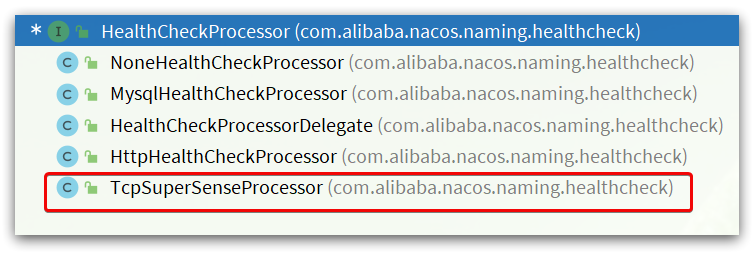


进入`TcpSuperSenseProcessor`的process方法：

```java
@Override
public void process(HealthCheckTask task) {
    // 获取所有 非临时实例的 集合
    List<Instance> ips = task.getCluster().allIPs(false);

    if (CollectionUtils.isEmpty(ips)) {
        return;
    }

    for (Instance ip : ips) {
		// 封装健康检测信息到 Beat
        Beat beat = new Beat(ip, task);
        // 放入一个阻塞队列中
        taskQueue.add(beat);
        MetricsMonitor.getTcpHealthCheckMonitor().incrementAndGet();
    }
}
```

可以看到，所有的健康检测任务都被放入一个阻塞队列，而不是立即执行了。这里又采用了异步执行的策略，可以看到Nacos中大量这样的设计。

而`TcpSuperSenseProcessor`本身就是一个Runnable，在它的构造函数中会把自己放入线程池中去执行，其run方法如下：

```java
public void run() {
    while (true) {
        try {
            // 处理任务
            processTask();
            // ...
        } catch (Throwable e) {
            SRV_LOG.error("[HEALTH-CHECK] error while processing NIO task", e);
        }
    }
}
```

通过processTask来处理健康检测的任务：

```java
private void processTask() throws Exception {
    // 将任务封装为一个 TaskProcessor，并放入集合
    Collection<Callable<Void>> tasks = new LinkedList<>();
    do {
        Beat beat = taskQueue.poll(CONNECT_TIMEOUT_MS / 2, TimeUnit.MILLISECONDS);
        if (beat == null) {
            return;
        }

        tasks.add(new TaskProcessor(beat));
    } while (taskQueue.size() > 0 && tasks.size() < NIO_THREAD_COUNT * 64);
	// 批量处理集合中的任务
    for (Future<?> f : GlobalExecutor.invokeAllTcpSuperSenseTask(tasks)) {
        f.get();
    }
}
```

任务被封装到了TaskProcessor中去执行了，TaskProcessor是一个Callable，其中的call方法：

```java
@Override
public Void call() {
    // 获取检测任务已经等待的时长
    long waited = System.currentTimeMillis() - beat.getStartTime();
    if (waited > MAX_WAIT_TIME_MILLISECONDS) {
        Loggers.SRV_LOG.warn("beat task waited too long: " + waited + "ms");
    }
	
    SocketChannel channel = null;
    try {
        // 获取实例信息
        Instance instance = beat.getIp();
		// 通过NIO建立TCP连接
        channel = SocketChannel.open();
        channel.configureBlocking(false);
        // only by setting this can we make the socket close event asynchronous
        channel.socket().setSoLinger(false, -1);
        channel.socket().setReuseAddress(true);
        channel.socket().setKeepAlive(true);
        channel.socket().setTcpNoDelay(true);

        Cluster cluster = beat.getTask().getCluster();
        int port = cluster.isUseIPPort4Check() ? instance.getPort() : cluster.getDefCkport();
        channel.connect(new InetSocketAddress(instance.getIp(), port));
		// 注册连接、读取事件
        SelectionKey key = channel.register(selector, SelectionKey.OP_CONNECT | SelectionKey.OP_READ);
        key.attach(beat);
        keyMap.put(beat.toString(), new BeatKey(key));

        beat.setStartTime(System.currentTimeMillis());

        GlobalExecutor
            .scheduleTcpSuperSenseTask(new TimeOutTask(key), CONNECT_TIMEOUT_MS, TimeUnit.MILLISECONDS);
    } catch (Exception e) {
        beat.finishCheck(false, false, switchDomain.getTcpHealthParams().getMax(),
                         "tcp:error:" + e.getMessage());

        if (channel != null) {
            try {
                channel.close();
            } catch (Exception ignore) {
            }
        }
    }

    return null;
}
```


## 3.3.总结

Nacos的健康检测有两种模式：

- 临时实例：
  - 采用客户端心跳检测模式，心跳周期5秒
  - 心跳间隔超过15秒则标记为不健康
  - 心跳间隔超过30秒则从服务列表删除
- 永久实例：
  - 采用服务端主动健康检测方式
  - 周期为2000 + 5000毫秒内的随机数
  - 检测异常只会标记为不健康，不会删除

那么为什么Nacos有临时和永久两种实例呢？

以淘宝为例，双十一大促期间，流量会比平常高出很多，此时服务肯定需要增加更多实例来应对高并发，而这些实例在双十一之后就无需继续使用了，采用**临时实例**比较合适。而对于服务的一些常备实例，则使用**永久实例**更合适。


与eureka相比，Nacos与Eureka在临时实例上都是基于心跳模式实现，差别不大，主要是心跳周期不同，eureka是30秒，Nacos是5秒。

另外，Nacos支持永久实例，而Eureka不支持，Eureka只提供了心跳模式的健康监测，而没有主动检测功能。


# 4.服务发现

Nacos提供了一个根据serviceId查询实例列表的接口：

**接口描述**：查询服务下的实例列表

**请求类型**：GET

**请求路径**：

```plain
/nacos/v1/ns/instance/list
```

**请求参数**：

| 名称        | 类型                       | 是否必选        | 描述               |
| :---------- | :------------------------- | :-------------- | ------------------ |
| serviceName | 字符串                     | 是              | 服务名             |
| groupName   | 字符串                     | 否              | 分组名             |
| namespaceId | 字符串                     | 否              | 命名空间ID         |
| clusters    | 字符串，多个集群用逗号分隔 | 否              | 集群名称           |
| healthyOnly | boolean                    | 否，默认为false | 是否只返回健康实例 |

**错误编码**：

| 错误代码 | 描述                  | 语义                   |
| :------- | :-------------------- | :--------------------- |
| 400      | Bad Request           | 客户端请求中的语法错误 |
| 403      | Forbidden             | 没有权限               |
| 404      | Not Found             | 无法找到资源           |
| 500      | Internal Server Error | 服务器内部错误         |
| 200      | OK                    | 正常                   |


## 4.1.客户端

### 4.1.1.定时更新服务列表

#### 4.1.1.1.NacosNamingService

在2.2.4小节中，我们讲到一个类`NacosNamingService`，这个类不仅仅提供了服务注册功能，同样提供了服务发现的功能。


多个重载的方法最终都会进入一个方法：

```java
@Override
public List<Instance> getAllInstances(String serviceName, String groupName, List<String> clusters,
                                      boolean subscribe) throws NacosException {

    ServiceInfo serviceInfo;
    // 1.判断是否需要订阅服务信息（默认为 true）
    if (subscribe) {
        // 1.1.订阅服务信息
        serviceInfo = hostReactor.getServiceInfo(NamingUtils.getGroupedName(serviceName, groupName),
                                                 StringUtils.join(clusters, ","));
    } else {
        // 1.2.直接去nacos拉取服务信息
        serviceInfo = hostReactor
            .getServiceInfoDirectlyFromServer(NamingUtils.getGroupedName(serviceName, groupName),
                                              StringUtils.join(clusters, ","));
    }
    // 2.从服务信息中获取实例列表并返回
    List<Instance> list;
    if (serviceInfo == null || CollectionUtils.isEmpty(list = serviceInfo.getHosts())) {
        return new ArrayList<Instance>();
    }
    return list;
}
```


#### 4.1.1.2.HostReactor

进入1.1.订阅服务消息，这里是由`HostReactor`类的`getServiceInfo()`方法来实现的：

```java
public ServiceInfo getServiceInfo(final String serviceName, final String clusters) {

    NAMING_LOGGER.debug("failover-mode: " + failoverReactor.isFailoverSwitch());
    // 由 服务名@@集群名拼接 key
    String key = ServiceInfo.getKey(serviceName, clusters);
    if (failoverReactor.isFailoverSwitch()) {
        return failoverReactor.getService(key);
    }
    // 读取本地服务列表的缓存，缓存是一个Map，格式：Map<String, ServiceInfo>
    ServiceInfo serviceObj = getServiceInfo0(serviceName, clusters);
    // 判断缓存是否存在
    if (null == serviceObj) {
        // 不存在，创建空ServiceInfo
        serviceObj = new ServiceInfo(serviceName, clusters);
        // 放入缓存
        serviceInfoMap.put(serviceObj.getKey(), serviceObj);
        // 放入待更新的服务列表（updatingMap）中
        updatingMap.put(serviceName, new Object());
        // 立即更新服务列表
        updateServiceNow(serviceName, clusters);
        // 从待更新列表中移除
        updatingMap.remove(serviceName);

    } else if (updatingMap.containsKey(serviceName)) {
        // 缓存中有，但是需要更新
        if (UPDATE_HOLD_INTERVAL > 0) {
            // hold a moment waiting for update finish 等待5秒中，待更新完成
            synchronized (serviceObj) {
                try {
                    serviceObj.wait(UPDATE_HOLD_INTERVAL);
                } catch (InterruptedException e) {
                    NAMING_LOGGER
                        .error("[getServiceInfo] serviceName:" + serviceName + ", clusters:" + clusters, e);
                }
            }
        }
    }
    // 开启定时更新服务列表的功能
    scheduleUpdateIfAbsent(serviceName, clusters);
    // 返回缓存中的服务信息
    return serviceInfoMap.get(serviceObj.getKey());
}
```


基本逻辑就是先从本地缓存读，根据结果来选择：

- 如果本地缓存没有，立即去nacos读取，`updateServiceNow(serviceName, clusters)`

  

- 如果本地缓存有，则开启定时更新功能，并返回缓存结果：

  - `scheduleUpdateIfAbsent(serviceName, clusters)`

  

  在UpdateTask中，最终还是调用updateService方法：

  


不管是立即更新服务列表，还是定时更新服务列表，最终都会执行HostReactor中的updateService()方法：

```java
public void updateService(String serviceName, String clusters) throws NacosException {
    ServiceInfo oldService = getServiceInfo0(serviceName, clusters);
    try {
		// 基于ServerProxy发起远程调用，查询服务列表
        String result = serverProxy.queryList(serviceName, clusters, pushReceiver.getUdpPort(), false);

        if (StringUtils.isNotEmpty(result)) {
            // 处理查询结果
            processServiceJson(result);
        }
    } finally {
        if (oldService != null) {
            synchronized (oldService) {
                oldService.notifyAll();
            }
        }
    }
}
```

#### 4.1.1.3.ServerProxy

而ServerProxy的queryList方法如下：

```java
public String queryList(String serviceName, String clusters, int udpPort, boolean healthyOnly)
    throws NacosException {
	// 准备请求参数
    final Map<String, String> params = new HashMap<String, String>(8);
    params.put(CommonParams.NAMESPACE_ID, namespaceId);
    params.put(CommonParams.SERVICE_NAME, serviceName);
    params.put("clusters", clusters);
    params.put("udpPort", String.valueOf(udpPort));
    params.put("clientIP", NetUtils.localIP());
    params.put("healthyOnly", String.valueOf(healthyOnly));
	// 发起请求，地址与API接口一致
    return reqApi(UtilAndComs.nacosUrlBase + "/instance/list", params, HttpMethod.GET);
}
```


### 4.1.2.处理服务变更通知

除了定时更新服务列表的功能外，Nacos还支持服务列表变更时的主动推送功能。

在HostReactor类的构造函数中，有非常重要的几个步骤：

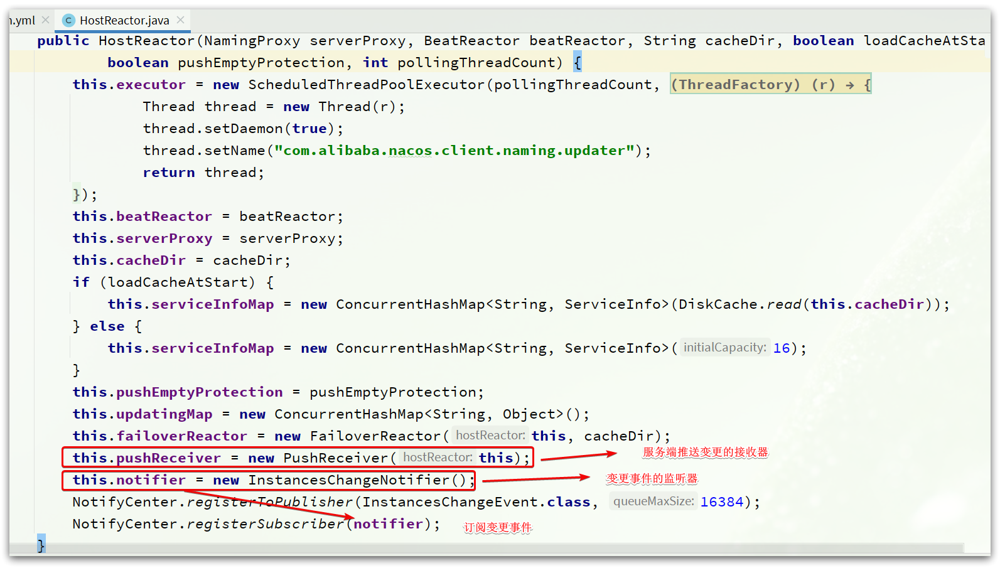


基本思路是：

- 通过PushReceiver监听服务端推送的变更数据
- 解析数据后，通过NotifyCenter发布服务变更的事件
- InstanceChangeNotifier监听变更事件，完成对服务列表的更新


#### 4.1.2.1.PushReceiver

我们先看PushReceiver，这个类会以UDP方式接收Nacos服务端推送的服务变更数据。

先看构造函数：

```java
public PushReceiver(HostReactor hostReactor) {
    try {
        this.hostReactor = hostReactor;
        // 创建 UDP客户端
        String udpPort = getPushReceiverUdpPort();
        if (StringUtils.isEmpty(udpPort)) {
            this.udpSocket = new DatagramSocket();
        } else {
            this.udpSocket = new DatagramSocket(new InetSocketAddress(Integer.parseInt(udpPort)));
        }
        // 准备线程池
        this.executorService = new ScheduledThreadPoolExecutor(1, new ThreadFactory() {
            @Override
            public Thread newThread(Runnable r) {
                Thread thread = new Thread(r);
                thread.setDaemon(true);
                thread.setName("com.alibaba.nacos.naming.push.receiver");
                return thread;
            }
        });
		// 开启线程任务，准备接收变更数据
        this.executorService.execute(this);
    } catch (Exception e) {
        NAMING_LOGGER.error("[NA] init udp socket failed", e);
    }
}
```

PushReceiver构造函数中基于线程池来运行任务。这是因为PushReceiver本身也是一个Runnable，其中的run方法业务逻辑如下：

```java
@Override
public void run() {
    while (!closed) {
        try {
            // byte[] is initialized with 0 full filled by default
            byte[] buffer = new byte[UDP_MSS];
            DatagramPacket packet = new DatagramPacket(buffer, buffer.length);
			// 接收推送数据
            udpSocket.receive(packet);
			// 解析为json字符串
            String json = new String(IoUtils.tryDecompress(packet.getData()), UTF_8).trim();
            NAMING_LOGGER.info("received push data: " + json + " from " + packet.getAddress().toString());
			// 反序列化为对象
            PushPacket pushPacket = JacksonUtils.toObj(json, PushPacket.class);
            String ack;
            if ("dom".equals(pushPacket.type) || "service".equals(pushPacket.type)) {
                // 交给 HostReactor去处理
                hostReactor.processServiceJson(pushPacket.data);

                // send ack to server 发送ACK回执，略。。
        } catch (Exception e) {
            if (closed) {
                return;
            }
            NAMING_LOGGER.error("[NA] error while receiving push data", e);
        }
    }
}
```


#### 4.1.2.2.HostReactor

通知数据的处理由交给了`HostReactor`的`processServiceJson`方法：

```java
public ServiceInfo processServiceJson(String json) {
    // 解析出ServiceInfo信息
    ServiceInfo serviceInfo = JacksonUtils.toObj(json, ServiceInfo.class);
    String serviceKey = serviceInfo.getKey();
    if (serviceKey == null) {
        return null;
    }
    // 查询缓存中的 ServiceInfo
    ServiceInfo oldService = serviceInfoMap.get(serviceKey);

    // 如果缓存存在，则需要校验哪些数据要更新
    boolean changed = false;
    if (oldService != null) {
		// 拉取的数据是否已经过期
        if (oldService.getLastRefTime() > serviceInfo.getLastRefTime()) {
            NAMING_LOGGER.warn("out of date data received, old-t: " + oldService.getLastRefTime() + ", new-t: "
                               + serviceInfo.getLastRefTime());
        }
        // 放入缓存
        serviceInfoMap.put(serviceInfo.getKey(), serviceInfo);
		
        // 中间是缓存与新数据的对比，得到newHosts：新增的实例；remvHosts：待移除的实例;
        // modHosts：需要修改的实例
        if (newHosts.size() > 0 || remvHosts.size() > 0 || modHosts.size() > 0) {
            // 发布实例变更的事件
            NotifyCenter.publishEvent(new InstancesChangeEvent(
                serviceInfo.getName(), serviceInfo.getGroupName(),
                serviceInfo.getClusters(), serviceInfo.getHosts()));
            DiskCache.write(serviceInfo, cacheDir);
        }

    } else {
        // 本地缓存不存在
        changed = true;
        // 放入缓存
        serviceInfoMap.put(serviceInfo.getKey(), serviceInfo);
        // 直接发布实例变更的事件
        NotifyCenter.publishEvent(new InstancesChangeEvent(
            serviceInfo.getName(), serviceInfo.getGroupName(),
            serviceInfo.getClusters(), serviceInfo.getHosts()));
        serviceInfo.setJsonFromServer(json);
        DiskCache.write(serviceInfo, cacheDir);
    }
	// 。。。
    return serviceInfo;
}
```


## 4.2.服务端

### 4.2.1.拉取服务列表接口

在2.3.1小节介绍的InstanceController中，提供了拉取服务列表的接口：

```java
/**
     * Get all instance of input service.
     *
     * @param request http request
     * @return list of instance
     * @throws Exception any error during list
     */
@GetMapping("/list")
@Secured(parser = NamingResourceParser.class, action = ActionTypes.READ)
public ObjectNode list(HttpServletRequest request) throws Exception {
    // 从request中获取namespaceId和serviceName
    String namespaceId = WebUtils.optional(request, CommonParams.NAMESPACE_ID, Constants.DEFAULT_NAMESPACE_ID);
    String serviceName = WebUtils.required(request, CommonParams.SERVICE_NAME);
    NamingUtils.checkServiceNameFormat(serviceName);

    String agent = WebUtils.getUserAgent(request);
    String clusters = WebUtils.optional(request, "clusters", StringUtils.EMPTY);
    String clientIP = WebUtils.optional(request, "clientIP", StringUtils.EMPTY);
    // 获取客户端的 UDP端口
    int udpPort = Integer.parseInt(WebUtils.optional(request, "udpPort", "0"));
    String env = WebUtils.optional(request, "env", StringUtils.EMPTY);
    boolean isCheck = Boolean.parseBoolean(WebUtils.optional(request, "isCheck", "false"));

    String app = WebUtils.optional(request, "app", StringUtils.EMPTY);

    String tenant = WebUtils.optional(request, "tid", StringUtils.EMPTY);

    boolean healthyOnly = Boolean.parseBoolean(WebUtils.optional(request, "healthyOnly", "false"));

    // 获取服务列表
    return doSrvIpxt(namespaceId, serviceName, agent, clusters, clientIP, udpPort, env, isCheck, app, tenant,
                     healthyOnly);
}
```


进入`doSrvIpxt()`方法来获取服务列表：

```java
public ObjectNode doSrvIpxt(String namespaceId, String serviceName, String agent,
                            String clusters, String clientIP,
                            int udpPort, String env, boolean isCheck,
                            String app, String tid, boolean healthyOnly) throws Exception {
    ClientInfo clientInfo = new ClientInfo(agent);
    ObjectNode result = JacksonUtils.createEmptyJsonNode();
    // 获取服务列表信息
    Service service = serviceManager.getService(namespaceId, serviceName);
    long cacheMillis = switchDomain.getDefaultCacheMillis();

    // now try to enable the push
    try {
        if (udpPort > 0 && pushService.canEnablePush(agent)) {
			// 添加当前客户端 IP、UDP端口到 PushService 中
            pushService
                .addClient(namespaceId, serviceName, clusters, agent, new InetSocketAddress(clientIP, udpPort),
                           pushDataSource, tid, app);
            cacheMillis = switchDomain.getPushCacheMillis(serviceName);
        }
    } catch (Exception e) {
        Loggers.SRV_LOG
            .error("[NACOS-API] failed to added push client {}, {}:{}", clientInfo, clientIP, udpPort, e);
        cacheMillis = switchDomain.getDefaultCacheMillis();
    }

    if (service == null) {
        // 如果没找到，返回空
        if (Loggers.SRV_LOG.isDebugEnabled()) {
            Loggers.SRV_LOG.debug("no instance to serve for service: {}", serviceName);
        }
        result.put("name", serviceName);
        result.put("clusters", clusters);
        result.put("cacheMillis", cacheMillis);
        result.replace("hosts", JacksonUtils.createEmptyArrayNode());
        return result;
    }
	// 结果的检测，异常实例的剔除等逻辑省略
    // 最终封装结果并返回 。。。

    result.replace("hosts", hosts);
    if (clientInfo.type == ClientInfo.ClientType.JAVA
        && clientInfo.version.compareTo(VersionUtil.parseVersion("1.0.0")) >= 0) {
        result.put("dom", serviceName);
    } else {
        result.put("dom", NamingUtils.getServiceName(serviceName));
    }
    result.put("name", serviceName);
    result.put("cacheMillis", cacheMillis);
    result.put("lastRefTime", System.currentTimeMillis());
    result.put("checksum", service.getChecksum());
    result.put("useSpecifiedURL", false);
    result.put("clusters", clusters);
    result.put("env", env);
    result.replace("metadata", JacksonUtils.transferToJsonNode(service.getMetadata()));
    return result;
}
```


### 4.2.2.发布服务变更的UDP通知

在上一节中，`InstanceController`中的`doSrvIpxt()`方法中，有这样一行代码：

```java
pushService.addClient(namespaceId, serviceName, clusters, agent,
                      new InetSocketAddress(clientIP, udpPort),
                           pushDataSource, tid, app);
```


其实是把消费者的UDP端口、IP等信息封装为一个PushClient对象，存储PushService中。方便以后服务变更后推送消息。

PushService类本身实现了`ApplicationListener`接口：


这个是事件监听器接口，监听的是ServiceChangeEvent（服务变更事件）。

当服务列表变化时，就会通知我们：


## 4.3.总结

Nacos的服务发现分为两种模式：

- 模式一：主动拉取模式，消费者定期主动从Nacos拉取服务列表并缓存起来，再服务调用时优先读取本地缓存中的服务列表。
- 模式二：订阅模式，消费者订阅Nacos中的服务列表，并基于UDP协议来接收服务变更通知。当Nacos中的服务列表更新时，会发送UDP广播给所有订阅者。


与Eureka相比，Nacos的订阅模式服务状态更新更及时，消费者更容易及时发现服务列表的变化，剔除故障服务。


