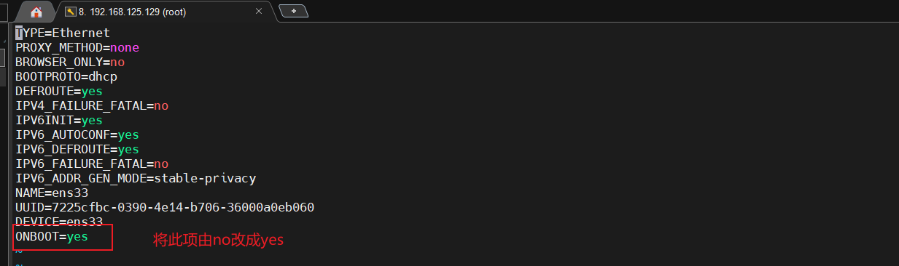

# Centos7 新机开荒

## 1、网络无法访问时

```sh
vi /etc/sysconfig/network-scripts/ifcfg-ens33
```

### 1.1 将`ONBOOT=no`改为`ONBOOT=yes`

```
TYPE=Ethernet
PROXY_METHOD=none
BROWSER_ONLY=no
BOOTPROTO=dhcp
DEFROUTE=yes
IPV4_FAILURE_FATAL=no
IPV6INIT=yes
IPV6_AUTOCONF=yes
IPV6_DEFROUTE=yes
IPV6_FAILURE_FATAL=no
IPV6_ADDR_GEN_MODE=stable-privacy
NAME=ens33
UUID=7225cfbc-0390-4e14-b706-36000a0eb060
DEVICE=ens33
ONBOOT=yes

```



### 1.2 重启网络

```sh
 service network restart
```

or

```
systemctl restart network
```


## 2 配置yum 源为阿里的源地址

### 2.1 先安装`net-tools`

```sh
 yum -y install net-tools
```

#### 2.1.1 验证ifconfig

```sh
ifconfig
```


```sh
[root@localhost network-scripts]# ifconfig
ens33: flags=4163<UP,BROADCAST,RUNNING,MULTICAST>  mtu 1500
        inet 192.168.125.129  netmask 255.255.255.0  broadcast 192.168.125.255
        inet6 fe80::da40:2281:d333:3163  prefixlen 64  scopeid 0x20<link>
        ether 00:0c:29:c7:4c:dd  txqueuelen 1000  (Ethernet)
        RX packets 20696  bytes 30107042 (28.7 MiB)
        RX errors 0  dropped 0  overruns 0  frame 0
        TX packets 3708  bytes 253936 (247.9 KiB)
        TX errors 0  dropped 0 overruns 0  carrier 0  collisions 0

lo: flags=73<UP,LOOPBACK,RUNNING>  mtu 65536
        inet 127.0.0.1  netmask 255.0.0.0
        inet6 ::1  prefixlen 128  scopeid 0x10<host>
        loop  txqueuelen 1000  (Local Loopback)
        RX packets 68  bytes 5920 (5.7 KiB)
        RX errors 0  dropped 0  overruns 0  frame 0
        TX packets 68  bytes 5920 (5.7 KiB)
        TX errors 0  dropped 0 overruns 0  carrier 0  collisions 0


```

### 2.2 安装阿里镜像源

> ps: [阿里云的官方镜像源地址](https://opsx.alibaba.com/mirror) 

#### 2.2.1 安装wget命令

```sh
# 先检查系统有没有wget
rpm -qa wget

[root@localhost ~]# rpm -qa wget
[root@localhost ~]#

# 没有的话，那么我们就安装wget
yum -y install wget
```


#### 2.2.2 备份，出错后可恢复。

```sh
mv /etc/yum.repos.d/CentOS-Base.repo /etc/yum.repos.d/CentOS-Base.repo.backup
```

#### 2.2.3 下载新的CentOS-Base.repo 到/etc/yum.repos.d/

**CentOS 7：**

```sh
wget -O /etc/yum.repos.d/CentOS-Base.repo http://mirrors.aliyun.com/repo/Centos-7.repo
```

or

```sh
curl -o /etc/yum.repos.d/CentOS-Base.repo http://mirrors.aliyun.com/repo/Centos-7.repo
```

#### 2.2.4 清空旧的yum缓存

```sh
yum clean all
```

#### 2.2.5 生成新的yum仓库缓存

```sh
yum makecache
```

#### 2.2.6 配置一个第三方的 额外仓库源 （epel源）

```sh
wget -O /etc/yum.repos.d/epel.repo http://mirrors.aliyun.com/repo/epel-7.repo
```

### 2.3 更新yum软件

```sh
yum -y update
```

### 2.4 安装vim

```sh
yum -y install vim*
```

#### 2.4.1 配置vim

```sh
# 编辑指令
vim /etc/vimrc

# 相关配置说明

set nu          # 设置显示行号
set showmode    # 设置在命令行界面最下面显示当前模式等
set ruler     	# 在右下角显示光标所在的行数等信息
set autoindent	# 设置每次单击enter键后，光标移动到下一行与上一行的起始字符对齐
syntax on		# 设置语法检测，当编辑C或Shell脚本时，关键字会用特殊颜色显示
```

- 无中文版

```sh
set nu
set showmode
set ruler
set autoindent
syntax on
```


### 2.5 安装docker

#### 2.5.1 卸载docker

```sh
 sudo yum remove docker \
                  docker-client \
                  docker-client-latest \
                  docker-common \
                  docker-latest \
                  docker-latest-logrotate \
                  docker-logrotate \
                  docker-engine
```

#### 2.5.2 命令一键安装docker

```sh
curl -fsSL https://get.docker.com | bash -s docker --mirror Aliyun
```

#### 2.5.3 配置阿里镜像加速服务

https://cr.console.aliyun.com/cn-hangzhou/instances/mirrors

```shell
sudo mkdir -p /etc/docker
sudo tee /etc/docker/daemon.json <<-'EOF'
{
  "registry-mirrors": ["https://g0f4bajl.mirror.aliyuncs.com"]
}
EOF
sudo systemctl daemon-reload
sudo systemctl restart docker
```


