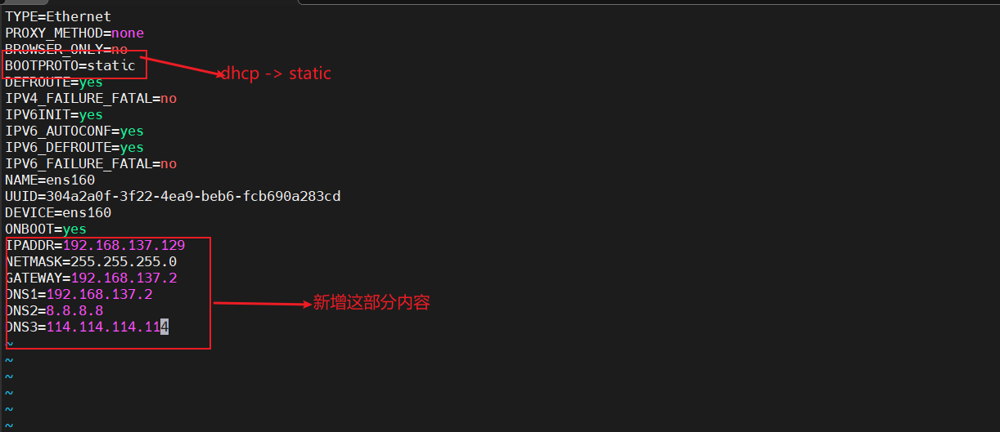
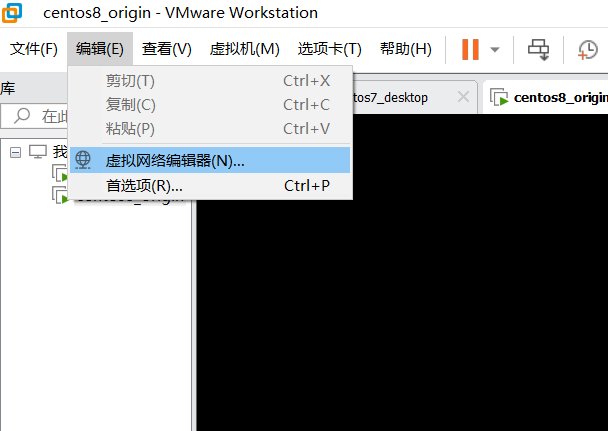
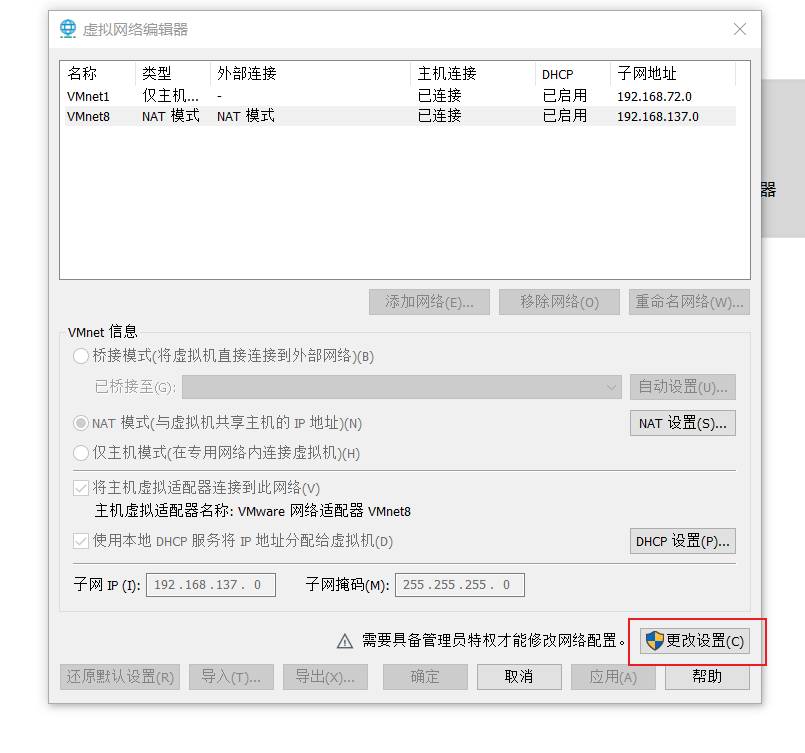
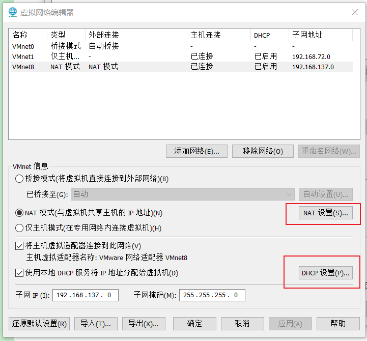
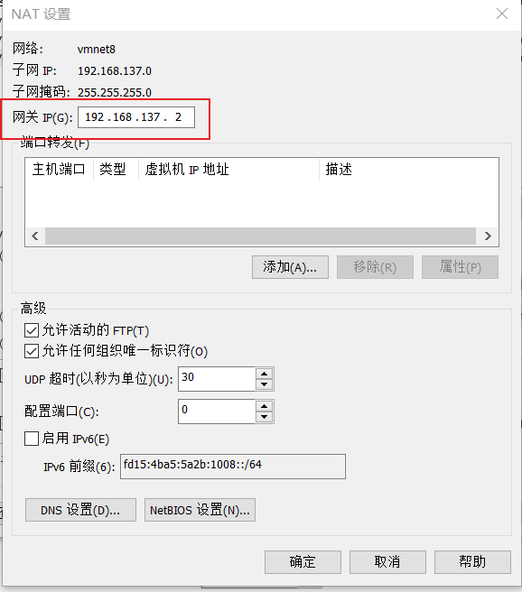
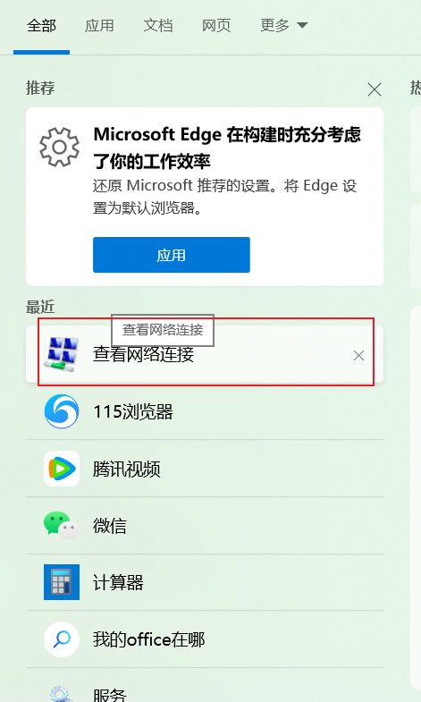
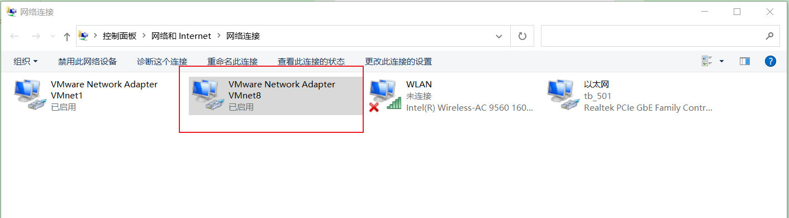
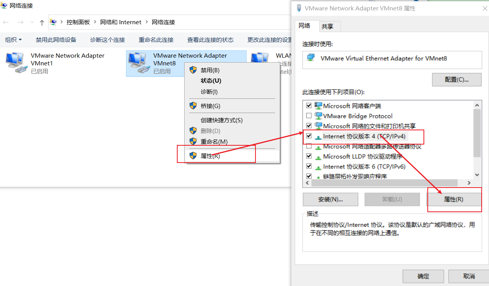
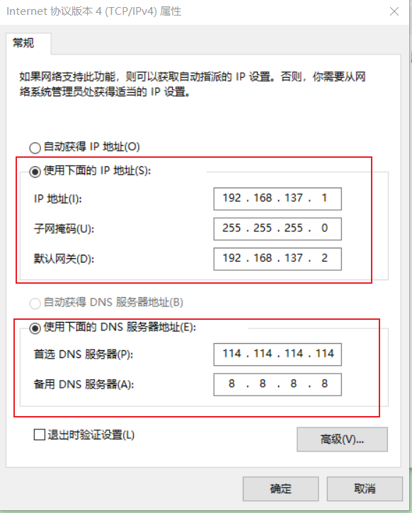

# Centos8 新机常见问题

## 1 Failed to download metadata for repo ‘AppStream’ [CentOS]

参考文档：

[Failed to download metadata for repo ‘AppStream’ [CentOS]](https://techglimpse.com/failed-metadata-repo-appstream-centos-8/)

[解决Failed to download metadata for repo ‘AppStream’](https://blog.csdn.net/bubbleyang/article/details/123580252)

### 1.1 yum -y update (Error: Failed to download metadata for repo 'AppStream')

```shell
[root@autocontroller ~]# yum update
CentOS-8 - AppStream 70 B/s | 38 B 00:00
Error: Failed to download metadata for repo 'AppStream': Cannot prepare internal mirrorlist: No URLs in mirrorlist
```

### 1.2 查看debug日志`/var/log/dnf.log`

```verilog
2022-02-02T11:39:36Z DEBUG error: Curl error (6): Couldn't resolve host name for http://mirrorlist.centos.org/?release=8&arch=x86_64&repo=AppStream&infra=stock [Could not resolve host: mirrorlist.centos.org] (http://mirrorlist.centos.org/?release=8&arch=x86_64&repo=AppStream&infra=stock).
2022-02-02T11:39:36Z WARNING Errors during downloading metadata for repository 'AppStream':
- Curl error (6): Couldn't resolve host name for http://mirrorlist.centos.org/?release=8&arch=x86_64&repo=AppStream&infra=stock [Could not resolve host: mirrorlist.centos.org]
2022-02-02T11:39:36Z DDEBUG Cleaning up.
2022-02-02T11:39:36Z SUBDEBUG
Traceback (most recent call last):
File "/usr/lib/python3.6/site-packages/dnf/repo.py", line 573, in load
ret = self._repo.load()
File "/usr/lib64/python3.6/site-packages/libdnf/repo.py", line 394, in load
return _repo.Repo_load(self)
RuntimeError: Failed to download metadata for repo 'AppStream': Cannot prepare internal mirrorlist: Curl error (6): Couldn't resolve host name for http://mirrorlist.centos.org/?release=8&arch=x86_64&repo=AppStream&infra=stock [Could not resolve host: mirrorlist.centos.org]
```

### 1.3 解决方案

#### 1.3.1 去/etc/yum.repos.d/

```shell
cd /etc/yum.repos.d/
```

#### 1.3.2 执行如下命令

```shell
sed -i 's/mirrorlist/#mirrorlist/g' /etc/yum.repos.d/CentOS-*
sed -i 's|#baseurl=http://mirror.centos.org|baseurl=http://vault.centos.org|g' /etc/yum.repos.d/CentOS-*
```

#### 1.3.3 执行yum更新命令

```shell
yum -y update
```

## 2 安装常见工具

### 2.1 安装网络工具

```shell
yum -y install net-tools
```

### 2.2 安装vim

#### 2.2.1 查询vim安装情况

```shell
rpm -qa | grep vim
```

#### 2.2.2 执行安装动作

```shell
yum -y install vim*
```

### 2.3 安装lsof

```shell
yum -y install lsof
```

### 2.4 安装docker

#### 2.4.1 安装脚本

```shell
curl -fsSL https://get.docker.com | bash -s docker --mirror Aliyun
```

#### 2.4.2 查看docker版本

```shell
docker --version
```

**安装成功如下所示**

```shell
[root@localhost yum.repos.d]# docker --version
Docker version 24.0.2, build cb74dfc
```


#### 2.4.3 启动docker

```shell
systemctl start docker
```


#### 2.4.4 设置docker开机自启动

```shell
## docker开机自启动
systemctl enable docker

## 禁止docker开机自启动
systemctl disable docker.service
```


#### 2.4.5 重启docker

```shell
systemctl restart docker
```

#### 2.4.6 配置docker镜像加速

```shell
sudo mkdir -p /etc/docker
sudo tee /etc/docker/daemon.json <<-'EOF'
{
  "registry-mirrors": ["https://g0f4bajl.mirror.aliyuncs.com", "https://docker.mirrors.ustc.edu.cn/", "https://hub-mirror.c.163.com/", "https://reg-mirror.qiniu.com"]
}
EOF
sudo systemctl daemon-reload
sudo systemctl restart docker
```

### 2.5 安装docker-compose

#### 2.5.1 下载

```shell
# 安装
curl -L https://github.com/docker/compose/releases/download/1.23.1/docker-compose-`uname -s`-`uname -m` > /usr/local/bin/docker-compose
```


### 2.6 安装wget

```shell
yum -y install wget
```

### 2.7 安装make

```shell
yum -y install gcc pcre-devel zlib-devel openssl openssl-devel
yum -y install gcc automake autoconf libtool make
yum -y install gcc gcc-c++
```


## 3 设置静态IP

### 3.1 修改网络配置文件

#### 3.1.1 进入下面的目录

```shell
cd /etc/sysconfig/network-scripts/
```


```shell
[root@localhost ~]# cd /etc/sysconfig/network-scripts/
[root@localhost network-scripts]# ls
ifcfg-ens160
[root@localhost network-scripts]#

```

#### 3.1.2 打开`ifcfg-ens160`

```shell
vim ifcfg-ens160
```

##### 修改前

```properties
TYPE=Ethernet
PROXY_METHOD=none
BROWSER_ONLY=no
BOOTPROTO=dhcp
DEFROUTE=yes
IPV4_FAILURE_FATAL=no
IPV6INIT=yes
IPV6_AUTOCONF=yes
IPV6_DEFROUTE=yes
IPV6_FAILURE_FATAL=no
NAME=ens160
UUID=304a2a0f-3f22-4ea9-beb6-fcb690a283cd
DEVICE=ens160
ONBOOT=yes
```

##### 修改后

```properties
TYPE=Ethernet
PROXY_METHOD=none
BROWSER_ONLY=no
BOOTPROTO=static
DEFROUTE=yes
IPV4_FAILURE_FATAL=no
IPV6INIT=yes
IPV6_AUTOCONF=yes
IPV6_DEFROUTE=yes
IPV6_FAILURE_FATAL=no
NAME=ens160
UUID=304a2a0f-3f22-4ea9-beb6-fcb690a283cd
DEVICE=ens160
ONBOOT=yes
IPADDR=192.168.137.129
NETMASK=255.255.255.0
GATEWAY=192.168.137.2
DNS1=192.168.137.2
DNS2=8.8.8.8
DNS3=114.114.114.114
```



### 3.2 修改VMware的编辑










### 3.3 或者直接在windows上修改网络编辑









### 3.4 重启网卡

```shell
nmcli c reload
```

### 3.5 启用网卡

```shell
nmcli c up ens160
```

### 3.6 重启验证

```shell
reboot
```

