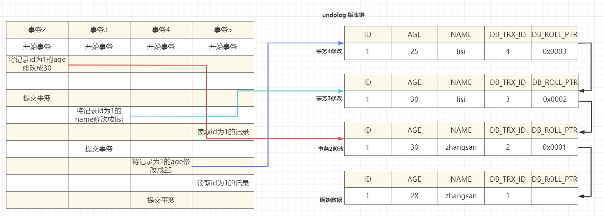
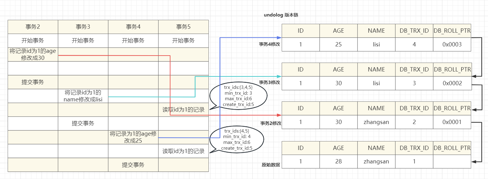
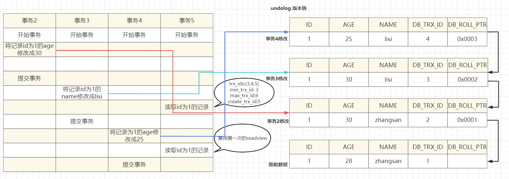
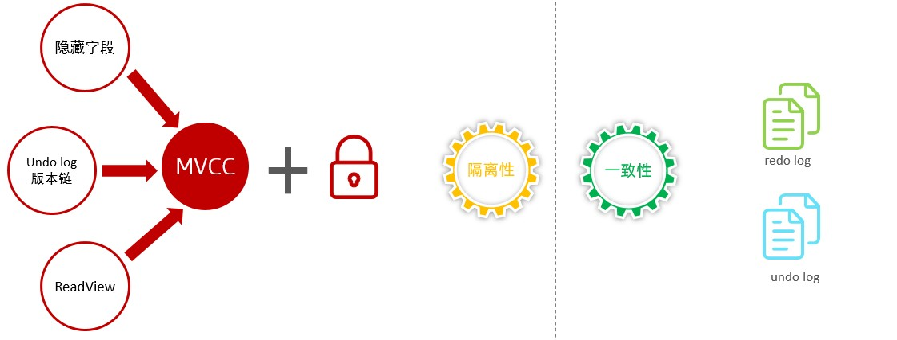

# MVCC理解

## 1 基本概念

### 1.1 当前读

读取的是记录的最新版本，读取时还要保证其他并发事务不能修改当前记录，会对读取的记录进行加锁。对于我们日常的操作，如：select ... lock in share mode(共享锁)，select ... for update、update、insert、delete(排他锁)都是一种当前读。

### 1.2 快照读

简单的select（不加锁）就是快照读，快照读，读取的是记录数据的可见版本，有可能是历史数据， 不加锁，是非阻塞读。

-  Read Committed：每次select，都生成一个快照读。 
-  Repeatable Read：开启事务后第一个select语句才是快照读的地方。 
-  Serializable：快照读会退化为当前读。 

### 1.3 MVCC

全称 Multi-Version Concurrency Control，多版本并发控制。指维护一个数据的多个版本，时代读写操作没有冲突，快照读为MySQL实现了一个非阻塞读取功能。MVCC的具体实现，需要依赖于数据库记录中的三个隐藏字段、undo log日志、readview

#### 1.3.1 三个隐藏字段

| **隐藏字段** | **含义**                                                     |
| ------------ | ------------------------------------------------------------ |
| DB_TRX_ID    | 最近修改事务ID，记录插入这条记录或最后一次修改该记录的事务ID。 |
| DB_ROLL_PTR  | 回滚指针，指向这条记录的上一个版本，用于配合undo log，指向上一个版本。 |
| DB_ROW_ID    | 隐藏主键，如果表结构没有指定主键，将会生成该隐藏字段。       |

#### 1.3.2 undolog

##### 1.3.2.1 简介

回滚日志，在insert、update、delete的时候产生的便于数据回滚的日志。 当insert的时候，产生的undo log日志只在回滚时需要，在事务提交后，可被立即删除。

而update、delete的时候，产生的undo log日志不仅在回滚时需要，在快照读时也需要，不会立即被删除。

##### 1.3.2.2 版本链

> 不同事务或相同事务对同一条记录进行修改，会导致该记录的undolog生成一条记录版本链表，链表的头部是最新的旧记录，链表尾部是最早的旧记录。

### 1.4 readview

ReadView（读视图）是快照读 SQL执行时MVCC提取数据的依据，记录并维护系统当前活跃的事务（未提交的）id。

**ReadView的四个核心字段**

| **字段**       | **含义**                                             |
| -------------- | ---------------------------------------------------- |
| m_ids          | 当前活跃的事务ID集合                                 |
| min_trx_id     | 最小活跃事务ID                                       |
| max_trx_id     | 预分配事务ID，当前最大事务ID+1（因为事务ID是自增的） |
| creator_trx_id | ReadView创建者的事务ID                               |

**ReadView的访问规则**

trx_id 代表当前undolog版本链对应事务ID。

| **条件**                  | **是否可以访问**                          | **说明**                                     |
| ------------------------- | ----------------------------------------- | -------------------------------------------- |
| trx_id  == creator_trx_id | 可以访问该版本                            | 成立，说明数据是当前这个事务更改的。         |
| trx_id < min_trx_id       | 可以访问该版本                            | 成立，说明数据已经提交了。                   |
| trx_id > max_trx_id       | 可以访问该版本                            | 成立，说明该事务是在  ReadView生成后才开启。 |
| trx_id not in m_ids       | 如果trx_id不在m_ids中，是可以访问该版本的 | 成立，说明数据已经提交。                     |

> 不同的隔离级别，生成ReadView的时机不同：
>
> -  READ COMMITTED ：在事务中每一次执行快照读时生成ReadView。 
> -  REPEATABLE READ：仅在事务中第一次执行快照读时生成ReadView，后续复用该ReadView。

## 2 RC级别 MVCC的做法

### 2.1 事务5第一次读取id为1的记录

当前活跃的事务id是{3,4,5}，最小的事务id是3，最大的事务id是6，当前ReadView的创建事务Id是5，根据ReadView的访问规则，会先匹配undo log版本链的头，一直到匹配上为止

**匹配DB_TRX_ID为4的版本**

| **条件**                  | **比较**      | **结果** |
| ------------------------- | ------------- | -------- |
| trx_id  == creator_trx_id | 4 == 5        | 不成立   |
| trx_id < min_trx_id       | 4 < 3         | 不成立   |
| trx_id > max_trx_id       | 4 > 6         | 不成立   |
| trx_id not in m_ids       | 4 在{3,4,5}中 | 不成立   |

**匹配DB_TRX_ID为3的版本**

| **条件**                  | **比较**      | **结果** |
| ------------------------- | ------------- | -------- |
| trx_id  == creator_trx_id | 3 == 5        | 不成立   |
| trx_id < min_trx_id       | 3 < 3         | 不成立   |
| trx_id > max_trx_id       | 3 > 6         | 不成立   |
| trx_id not in m_ids       | 3 在{3,4,5}中 | 不成立   |

**匹配DB_TRX_ID为2的版本**

| **条件**                  | **比较**        | **结果** |
| ------------------------- | --------------- | -------- |
| trx_id  == creator_trx_id | 2 == 5          | 不成立   |
| trx_id < min_trx_id       | 2 < 3           | 成立     |
| trx_id > max_trx_id       | 2 > 6           | 不成立   |
| trx_id not in m_ids       | 2 不在{3,4,5}中 | 成立     |

#### 2.1.1 结果

所以DB_TRX_ID为2的版本对应的数据就是我们要找的

### 2.2 事务5中第二次读取id为1的记录

当前活跃的事务id是{4,5}，最小的事务id是4，最大的事务id是6，当前ReadView的创建事务Id是5，根据ReadView的访问规则，会先匹配undo log版本链的头，一直到匹配上为止

**匹配DB_TRX_ID为4的版本**

| **条件**                  | **比较**      | **结果** |
| ------------------------- | ------------- | -------- |
| trx_id  == creator_trx_id | 4 == 5        | 不成立   |
| trx_id < min_trx_id       | 4 < 4         | 不成立   |
| trx_id > max_trx_id       | 4 > 6         | 不成立   |
| trx_id not in m_ids       | 4 在{3,4,5}中 | 不成立   |

**匹配DB_TRX_ID为3的版本**

| **条件**                  | **比较**      | **结果** |
| ------------------------- | ------------- | -------- |
| trx_id  == creator_trx_id | 3 == 5        | 不成立   |
| trx_id < min_trx_id       | 3 < 4         | 成立     |
| trx_id > max_trx_id       | 3 > 6         | 不成立   |
| trx_id not in m_ids       | 3 在{3,4,5}中 | 不成立   |

#### 2.2.1 结果

DB_TRX_ID为3的版本对应数据就是我们需要的数据

## 3 RR级别下 MVCC的做法

### 3.1 结果

在RR级别下，只有第一次快照读才会生成ReadView，所以每次读取的结果都是DB_TRX_ID为2的版本对应的数据

## 4 总结

所以呢，MVCC的实现原理就是通过 InnoDB表的隐藏字段、UndoLog 版本链、ReadView来实现的。 而MVCC + 锁，则实现了事务的隔离性。 而一致性则是由redolog 与 undolog保证。

