#  三、MySQL安装教程

## 1 MySQL8安装(Windows下安装)

### 1.1 下载zip文件

[MySQL Windows64 版ZIP下载网站](https://dev.mysql.com/downloads/mysql/)

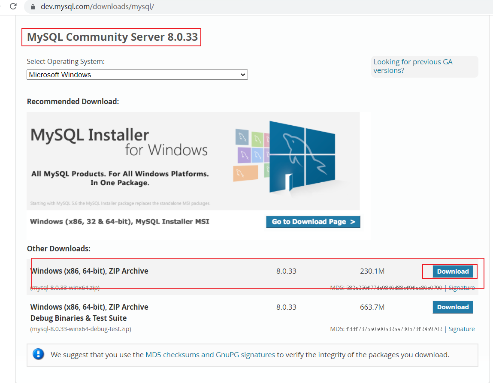

下载后解压即可

### 1.2 配置环境变量

比如解压到了`C:\DISH\APP\JAVA\MySQL\mysql-8.0.33-winx64`

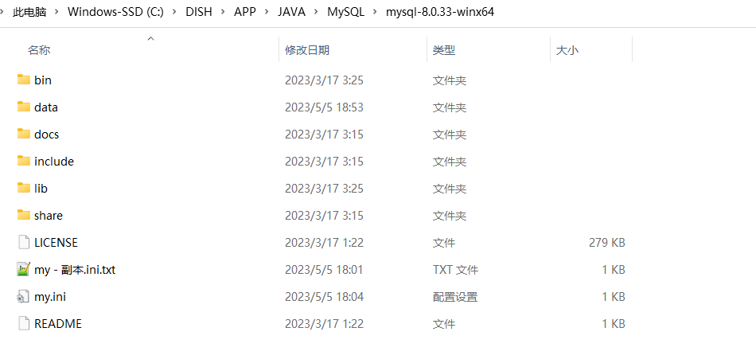

配置环境变量

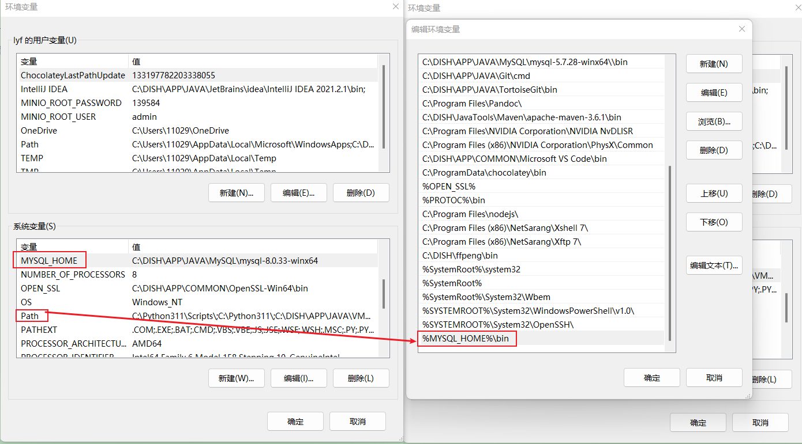

### 1.3 创建`my.ini`文件

```ini
[mysqld]
# 设置3306端口
port=3306
# 设置mysql的安装目录
basedir=C:/DISH/APP/JAVA/MySQL/mysql-8.0.33-winx64
# 设置mysql数据库的数据的存放目录
datadir=C:/DISH/APP/JAVA/MySQL/mysql-8.0.33-winx64/data
# 允许最大连接数
max_connections=200
# 允许连接失败的次数。这是为了防止有人从该主机试图攻击数据库系统
max_connect_errors=10
# 服务端使用的字符集默认为UTF8
character-set-server=utf8
# 创建新表时将使用的默认存储引擎
default-storage-engine=INNODB
# 默认使用“mysql_native_password”插件认证
default_authentication_plugin=mysql_native_password
[mysql]
# 设置mysql客户端默认字符集
default-character-set=utf8
[client]
# 设置mysql客户端连接服务端时默认使用的端口
port=3306
default-character-set=utf8
```

### 1.4 安装mysql

#### 1.4.1 以管理员身份打开cmd


#### 1.4.2 在控制命令台中，进入到刚刚解压的MySQL的bin目录中

```bash
cd C:\DISH\APP\JAVA\MySQL\mysql-8.0.33-winx64\bin
```

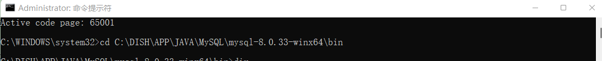

#### 1.4.3 初始化MySQL数据库

```bash
mysqld --initialize-insecure
```

作用：初始化数据库，并设置默认root密码为空
初始化完成后，在mysql根目录中会自动生成data文件夹，如下图所示：

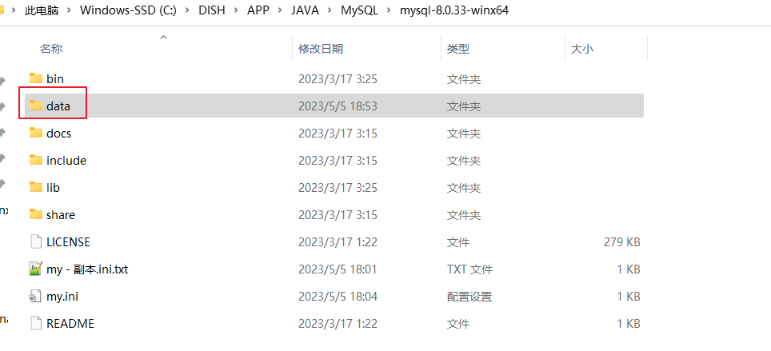

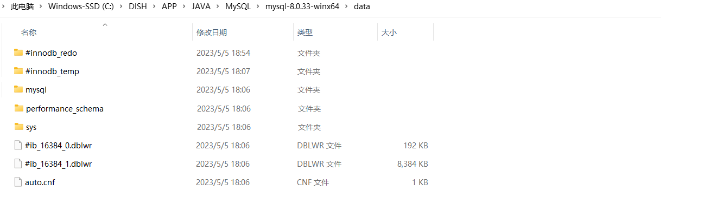

此时出现`mysql,performance_schema,sys`三个目录即表示成功

#### 1.4.4 为Windows系统安装MySQL服务

输入执行命令：mysqld install [服务名]

```bash
mysqld install mysql
```

作用：为Windows系统安装MySQL服务，默认服务名为：mysql
注意：后面的服务名可以不写，默认的名字为 mysql。当然，如果你的电脑上需要安装多个MySQL服务，就可以用不同的名字区分了，比如 mysql5 和 mysql8。

#### 1.4.5 启动mysql服务

- 启动MySQL

```bash
net start mysql
```

- 停止MySQL

```bash
net stop mysql
```

- 卸载MySQL服务

```bash
mysqld -remove mysql
```

#### 1.4.6 更改密码

- 在MySQL安装目录的 bin 目录下执行命令：

```bash
 mysql -u root -p
```

> 这时候会提示输入密码，直接回车键（上面设置的是空密码）登录成功，进入MySQL命令模式。 修改密码（ 修改密码是必须得 不然设置不了远程连接）

- 切换到mysql 并执行命令：

```mysql
use mysql;
ALTER USER 'root'@'localhost' IDENTIFIED BY '123456';
```

执行上述命令之后，即可设置成功，此时mysql的用户名为：root,密码为:123456
最后exit 退出，用root 在登录一次，远程连接的用户名为：root,密码为：123456

## 2 如何使MySQL5与MySQL8共存

### 2.1 配置my.ini

```ini
[mysqld]

port = 3307

basedir=C:/DISH/APP/JAVA/MySQL/mysql-5.7.28-winx64/
datadir=C:/DISH/APP/JAVA/MySQL/mysql-5.7.28-winx64/data

max_connections=200

character-set-server=utf8

default-storage-engine=INNODB

sql_mode=NO_ENGINE_SUBSTITUTION,STRICT_TRANS_TABLES

[mysql]

default-character-set=utf8
```


### 2.2 以管理员身份打开cmd

进入MySQL5的安装目录

`C:\DISH\APP\JAVA\MySQL\mysql-5.7.28-winx64\bin`

### 2.3 安装mysql服务

```bash
mysqld.exe install mysql5728
```

### 2.4 此时启动mysql服务会报如下错误

More help is available by typing NET HELPMSG 3534.


先说说我遇到的情况，我通过命令启动MySQL时候出现了这个报错，然后进入服务查看的时候发现同时存在一个mysql和一个mysql5728，并且mysql是处于启动状态的

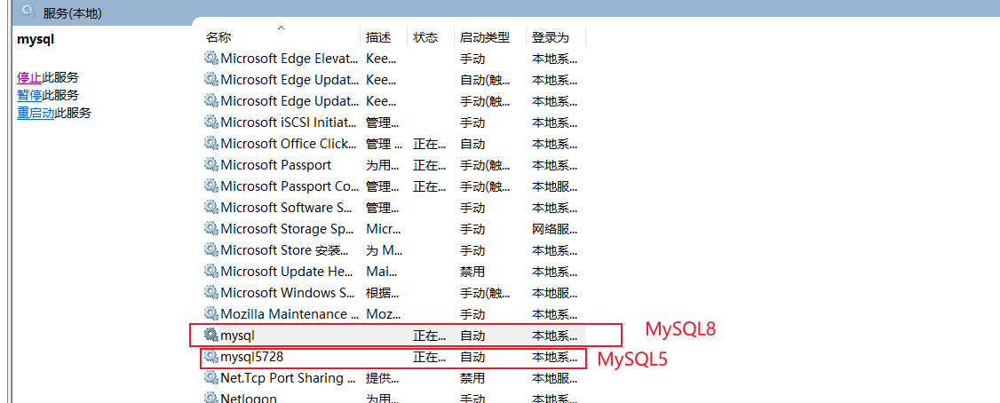

当我右键启动MySQL的时候，也是启动不了的

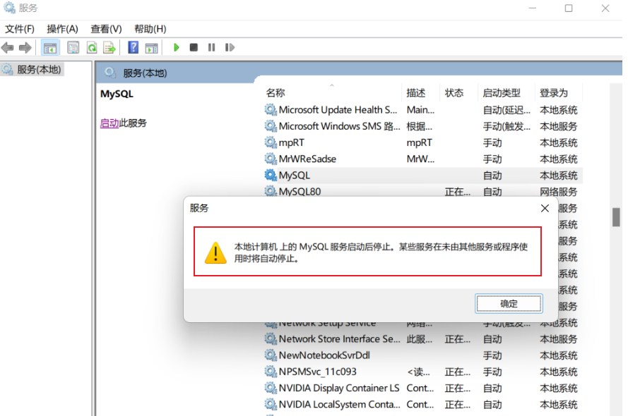

[参考博客](https://blog.csdn.net/qq_39293334/article/details/124762059)

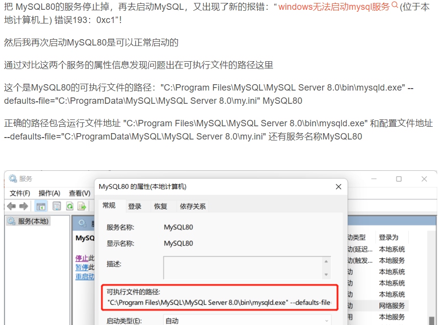

> ps: 说明一下，在我的机器上，mysql(8)的配置是这样的
>
> 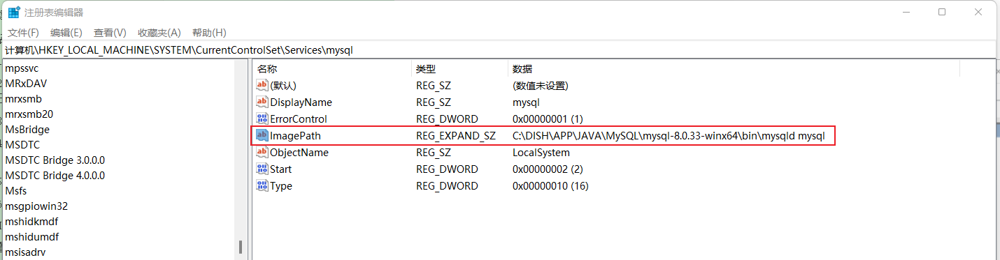
>
> 是没有配置`--defaults-file`的，这是应该与配置有环境变量有关，又因为MySQL的环境只能配置一份，所以mysql5728(5.7.28)就没有配置环境变量，所以需要我们手动的指定`--defaults-file`的值，


### 2.5 修改注册表

```
计算机\HKEY_LOCAL_MACHINE\SYSTEM\CurrentControlSet\Services\mysql5728
```

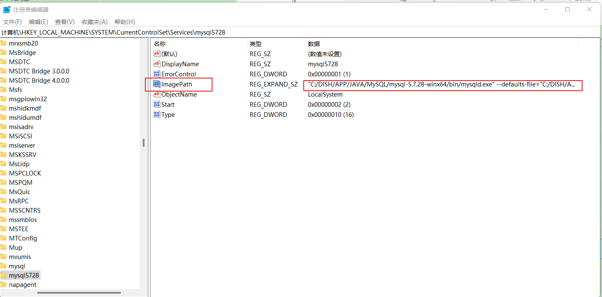

将ImagePath修改为

```
"C:/DISH/APP/JAVA/MySQL/mysql-5.7.28-winx64/bin/mysqld.exe" --defaults-file="C:/DISH/APP/JAVA/MySQL/mysql-5.7.28-winx64/my.ini" mysql5728
```

### 2.6 再次启动mysql5728就可以启动成功了

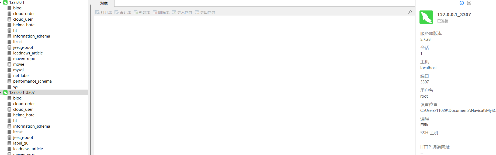

## 3 参考文件

[mysql 8.0.22压缩包完整安装与配置教程图解(亲测安装有效)](https://www.zhangshengrong.com/p/l51gwbO710/)

[启动MySQL的时候，报错：More help is available by typing NET HELPMSG 3534.](https://blog.csdn.net/qq_39293334/article/details/124762059)