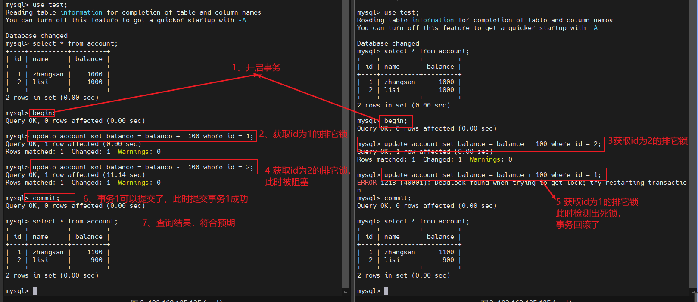
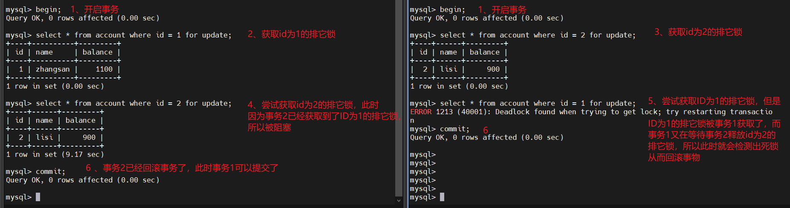
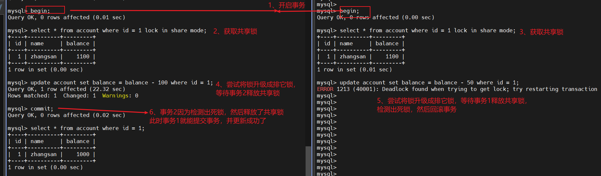
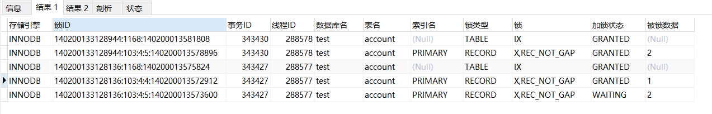
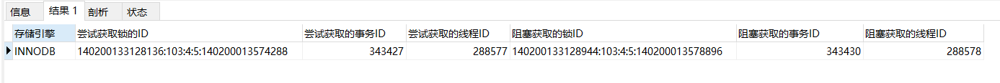
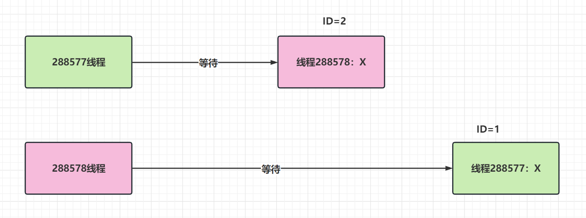
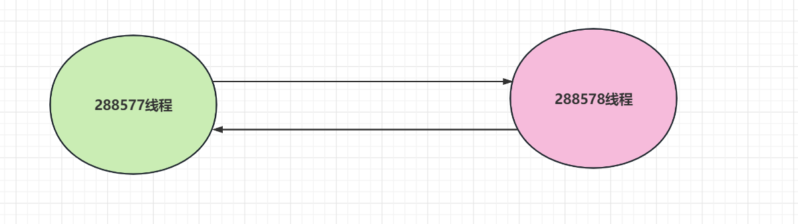

# MySQL死锁

## 1 死锁简述

死锁是出现在多个事务对于同一个资源相互占用时，会出现循环依赖，等待互相释放锁的情况，可能会出现死锁

## 2 出现死锁的场景

### 2.1 准备工作

```sql
DROP TABLE IF EXISTS `account`;
CREATE TABLE `account`  (
  `id` int(0) NOT NULL AUTO_INCREMENT COMMENT '主键',
  `name` varchar(255) CHARACTER SET utf8mb4 NULL DEFAULT NULL COMMENT '账户名',
  `balance` int(0) NULL DEFAULT NULL COMMENT '账户余额',
  PRIMARY KEY (`id`) USING BTREE
) ENGINE = InnoDB CHARACTER SET = utf8mb4 ROW_FORMAT = Dynamic;

INSERT INTO `account` VALUES (1, 'zhangsan', 1000);
INSERT INTO `account` VALUES (2, 'lisi', 1000);
```

### 2.2 互相更新导致死锁

#### 2.2.1 事务1

```sql
update account set balance = balance + 100 where id = 1;
update account set balance = balance - 100 where id = 2;
```


#### 2.2.2 事务2

```sql
update account set balance = balance - 100 where id = 2;
update account set balance = balance + 100 where id = 1;
```

#### 2.2.3 执行顺序说明

| 执行顺序 | 事务1                                                        | 事务2                                                        |
| -------- | ------------------------------------------------------------ | ------------------------------------------------------------ |
| 1        | begin; // 开启事务                                           | begin; // 开启事务                                           |
| 2        | update account set balance = balance + 100 where id = 1; // 获取id=1的排它锁 |                                                              |
| 3        |                                                              | update account set balance = balance - 100 where id = 2; //获取id为2的排它锁 |
| 4        | update account set balance = balance - 100 where id = 2; // 因为id为2的排它锁已经被事务2所获取，所以此时被阻塞了 |                                                              |
| 5        |                                                              | update account set balance = balance + 100 where id = 1; // 尝试获取 id =1 的排他锁，因为被事务1获取，又因为事务1被事务2 阻塞，检测出死锁 |
| 6        | commit; // 提交                                              |                                                              |
| 7        | select * from account; // 查询结果，符合预期                 |                                                              |



### 2.3 相互加排他锁导致死锁

这个原理其实和相互更新是一样的，在更新的时候会默认对数据加排他锁，把更新换成 for update 效果一样。

#### 2.3.1 事务1

```sql
select * from account where id = 1 for update;
select * from account where id = 2 for update;
```


#### 2.3.2 事务2

```sql
select * from account where id = 2 for update;
select * from account where id = 1 for update;
```


| 执行顺序 | 事务1                                                        | 事务2                                                        |
| -------- | ------------------------------------------------------------ | ------------------------------------------------------------ |
| 1        | begin; // 开启事务                                           | begin; // 开启事务                                           |
| 2        | select * from account where id = 1 for update; // 获取id=1的排它锁 |                                                              |
| 3        |                                                              | select * from account where id = 2 for update; //获取id为2的排它锁 |
| 4        | select * from account where id = 2 for update; // 因为id为2的排它锁已经被事务2所获取，所以此时被阻塞了 |                                                              |
| 5        |                                                              | select * from account where id = 1 for update; // 尝试获取 id =1 的排他锁，因为被事务1获取，又因为事务1被事务2 阻塞，检测出死锁 |
| 6        | commit;                                                      |                                                              |



### 2.4 共享锁升级排他锁导致死锁

共享锁前面提到主要的使用场景在保持主表和从表之间的一致性，所以不建议在获得共享锁之后对于获得锁的数据进行更新操作，如果有更新操作的话，共享锁会升级成排他锁，可能会导致死锁。

因为共享锁是可能会被多个事务同时获得的，如果在获得之后同时进行 update 则会产生死锁，举例：

2个事务同时获得用户余额的共享锁，并且进行金额操作

#### 2.4.1 事务1

```sql
select * from account where id = 1 lock in share mode; // 共享锁
update account set balance = balance - 100 where id = 1; // 排它锁
```


#### 2.4.2 事务2

```sql
select * from account where id = 1 lock in share mode; // 共享锁
update account set balance = balance - 50 where id = 1; // 排它锁
```

| 执行顺序 | 事务1                                                        | 事务2                                                        |
| -------- | ------------------------------------------------------------ | ------------------------------------------------------------ |
| 1        | begin; // 开启事务                                           | begin; // 开启事务                                           |
| 2        | select * from account where id = 1 lock in share mode; // 获取id为1的共享锁 |                                                              |
| 3        |                                                              | select * from account where id = 1 lock in share mode; // 获取id为1的共享锁 |
| 4        | update account set balance = balance - 100 where id = 1; // 尝试将id为1的共享锁升级成排它锁，等待事务2释放共享锁 |                                                              |
| 5        | 等待                                                         | update account set balance = balance - 50 where id = 1; // 尝试将id为1的共享锁升级成排它锁，等待事务1是否排它锁 |
| 6        | 等待                                                         | 检测出死锁，事务失败，进行rollback                           |
| 7        | 获取锁成功，更新成功                                         |                                                              |



## 3 死锁的处理

在 innoDB 中，存储引擎会检测死锁，如果有出现死锁的话，存储引擎户选择持有最少行级的排他锁的事务进行回滚。

在事务性数据库的大型应用开发过程中，很多意想不到的场景都可能会出现死锁，死锁的发生之后，只有部分或者完全回滚一个事务，释放掉其锁的资源，才能打破死锁。

## 4 innoDB死锁检测原理

innoDB 检测死锁通过等待图来检测死锁，如果等待图有回路，则表示有循环依赖，相互等待的情况，则表示有死锁。

等待图需要通过2张表来构建，当前锁的信息表 和 当前事务等待表，通过上述第二个for update 排他锁的例子，当运行到第三个for update 时，会出现事务1等待事务2的场景，在这个时候查询数据库的锁信息 和 锁等待信息，会的到如下信息。

### 4.1 当前锁的信息表

```sql
SELECT `ENGINE` AS '存储引擎', `ENGINE_LOCK_ID` AS '锁ID',`ENGINE_TRANSACTION_ID` AS '事务ID', `THREAD_ID` AS '线程ID',`OBJECT_SCHEMA` AS '数据库名', `OBJECT_NAME` AS '表名', `INDEX_NAME` AS '索引名',  `LOCK_TYPE` AS '锁类型', `LOCK_MODE` AS '锁', `LOCK_STATUS` AS '加锁状态', `LOCK_DATA` AS '被锁数据' FROM `performance_schema`.`data_locks`;
```


这个图可以看出，线程 288578 获得了id = 2 的排他锁，而 线程 288577 获得了 id = 1 的排他锁。



### 4.2 当前事务等待表

```sql
SELECT `ENGINE`  AS '存储引擎', `REQUESTING_ENGINE_LOCK_ID` AS '尝试获取锁的ID', `REQUESTING_ENGINE_TRANSACTION_ID` AS '尝试获取的事务ID', `REQUESTING_THREAD_ID` AS '尝试获取的线程ID', `BLOCKING_ENGINE_LOCK_ID` AS '阻塞获取的锁ID', `BLOCKING_ENGINE_TRANSACTION_ID`AS '阻塞获取的事务ID',`BLOCKING_THREAD_ID` AS '阻塞获取的线程ID'  FROM `performance_schema`.`data_lock_waits`;
```



这个图可以看出，在线程 288577（也就是获得了 id = 1 排他锁的线程）在尝试获取 id = 2 时 被 block 了，block 他的线程是线程 288578，因为线程 288578 正在获得 id = 1 的排他锁。

如果在继续执行线程 288578 尝试获取 id = 1 的记录，会获取如下的结果




通过这两张表， innoDB 可以绘出如下的图

1. 首先有多少个事务，就有多少个点，在这个例子里，有2个事务，线程 288577和 288578
2. 线程 288577 在等待 线程 288578，尝试获取 id = 1 的记录，所以 288577 - 288578 有一条边
3. 线程 288578 在等待 线程 288577，尝试获取 id = 2 的记录，所以 63 - 288577有一条边

最后判断图中是否有回路，如果有回路，则认为有死锁，若发现有死锁，回滚 undo 量最小的记录的事务。




## 5 参考文章

- [【数据库】数据库死锁](https://zhuanlan.zhihu.com/p/476525859)


