# JDK 8新特性

## 1 课程介绍

1. Java SE的发展历史

2. 了解Open JDK 和 Oracle JDK

3. JDK 8新特性

   - **Lambda表达式集**

   - **合之Stream流式操作**

   - 接口的增强

   - 并行数组排序

   - Optional中避免Null检查

   - 新的时间和日期 API

   - 可重复注解


## 2 Lambda

### 2.1 Lambda表达式介绍

#### 2.1.1 目标

1. 了解使用匿名内部类存在的问题
2. 体验Lambda

#### 2.1.2 使用匿名内部类存在的问题

当需要启动一个线程去完成任务时，通常会通过`Runnable`接口来定义任务内容，并使用 Thread 类来启动该线程。

 **传统写法,代码如下：**

```java
public class Demo01LambdaIntro {
    public static void main(String[] args) {
        new Thread(new Runnable() {
            @Override
            public void run() {
            	System.out.println("新线程任务执行！");
            }
        }).start();
    }
}
```

由于面向对象的语法要求，首先创建一个`Runnable`接口的匿名内部类对象来指定线程要执行的任务内容，再将其交给一个线程来启动。

##### 2.2.2.1 代码分析:

对于 `Runnable`的匿名内部类用法，可以分析出几点内容：

- `Thread`类需要 `Runnable`接口作为参数，其中的抽象`run`方法是用来指定线程任务内容的核心
- 为了指定`run`的方法体，**不得不**需要`Runnable`接口的实现类

- 为了省去定义一个`Runnable`实现类的麻烦，**不得不**使用匿名内部类

- 必须覆盖重写抽象`run`方法，所以方法名称、方法参数、方法返回值**不得不**再写一遍，且不能写错
- 而实际上，**似乎只有方法体才是关键所在**。

#### 2.1.3 Lambda体验

Lambda是一个<strong><font color='red'>匿名函数</font></strong>，可以理解为一段可以传递的代码。

**Lambda表达式写法,代码如下：**

借助`Java 8`的全新语法，上述`Runnable`接口的匿名内部类写法可以通过更简单的Lambda表达式达到相同的效果

```java
public class Demo01LambdaIntro {
    public static void main(String[] args) {
    	new Thread(() -> System.out.println("新线程任务执行！")).start(); // 启动线程
    }
}
```


这段代码和刚才的执行效果是完全一样的，可以在`JDK 8`或更高的编译级别下通过。从代码的语义中可以看出：我们 启动了一个线程，而线程任务的内容以一种更加简洁的形式被指定。

我们只需要将要执行的代码放到一个Lambda表达式中，不需要定义类，不需要创建对象。

#### 2.1.4 Lambda的优点

简化匿名内部类的使用，语法更加简单。

#### 2.1.5 小结

了解了匿名内部类语法冗余，体验了Lambda表达式的使用，发现Lmabda是简化匿名内部类的简写

### 2.2 Lambda的标准格式

#### 2.2.1 目标

1. 掌握Lambda的标准格式
2. 练习无参数无返回值的Lambda
3. 练习有参数有返回值的Lambda

#### 2.2.2 Lambda的标准格式

Lambda省去面向对象的条条框框，Lambda的标准格式格式由**3个部分**组成：

```java
(参数类型 参数名称) -> {
    // 代码体
}
```


##### 2.2.2.1 格式说明：

- `(参数类型 参数名称)`：参数列表

- `{代码体;}`：方法体

- `->`箭头，分隔参数列表和方法体

##### 2.2.2.2 Lambda与方法的对比

- **匿名内部类**

```java
public void run() {
	System.out.println("aa!");
}
```


- **Lambda**

```java
() -> System.out.println("bb!");
```


#### 2.2.3 练习无参数无返回值的Lambda

掌握了Lambda的语法，我们来通过一个案例熟悉Lambda的使用。

```java
package cn.lyf.lambda.demo.a01;

interface Swimmable {
	public abstract void swimming();
}
```


```java
package cn.lyf.lambda.demo.a01;

public class Demo02LambdaUse {
    public static void main(String[] args) {
        // 匿名内部类
        goSwimming(new Swimmable() {
            @Override
            public void swimming() {
                System.out.println("匿名内部类游泳");
            }
        });

        // Lambda写法
        goSwimming(() -> {
            System.out.println("Lambda游泳");
        });
    }

    public static void goSwimming(Swimmable swimmable) {
        swimmable.swimming();
    }
}
```


#### 2.2.4 练习有参数有返回值的Lambda

下面举例演示 `java.util.Comparator<T>` 接口的使用场景代码，其中的抽象方法定义为：

```java
public abstract int compare(T o1, T o2);
```

当需要对一个对象集合进行排序时，`Collections.sort`方法需要一个`Comparator`接口实例来指定排序的规则。

##### 2.2.4.1 传统写法

> 如果使用传统的代码对`ArrayList`集合进行排序，写法如下：

```java
package cn.lyf.lambda.demo.a02;

import lombok.AllArgsConstructor;
import lombok.Data;
import lombok.NoArgsConstructor;

@Data
@AllArgsConstructor
@NoArgsConstructor
public class Person {
    private String name;
    private int age;
    private int height;
}
```


```java
package cn.lyf.lambda.demo.a02;

import java.util.ArrayList;
import java.util.Collections;
import java.util.Comparator;

public class Demo03LambdaUse {
    public static void main(String[] args) {
        ArrayList<Person> persons = new ArrayList<>();
        persons.add(new Person("刘德华", 58, 174));
        persons.add(new Person("张学友", 58, 176));
        persons.add(new Person("刘德华", 54, 171));
        persons.add(new Person("黎明", 53, 178));

        Collections.sort(persons, new Comparator<Person>() {
            @Override
            public int compare(Person o1, Person o2) {
                // 年龄升序
                // o1 - o2 > 0 为正数，升序
                return o1.getAge() - o2.getAge();
            }
        });

        for (Person person : persons) {
            System.out.println(person);
        }
    }
}
```

这种做法在面向对象的思想中，似乎也是“理所当然”的。其中 Comparator 接口的实例（使用了匿名内部类）代表 了“按照年龄从小到大”的排序规则。

##### 2.2.4.2 Lambda写法

```java
package cn.lyf.lambda.demo.a02;

import lombok.extern.slf4j.Slf4j;

import java.util.ArrayList;
import java.util.Arrays;
import java.util.Collections;
import java.util.Comparator;
import java.util.function.Consumer;

/**
 * @author lyf
 * @version 1.0
 * @classname Demo03LambdaUse2
 * @description
 * @since 2023/4/14 12:21
 */
@Slf4j
public class Demo03LambdaUse2 {
    public static void main(String[] args) {
        ArrayList<Person> personList = new ArrayList<>(Arrays.asList(
                new Person("刘德华", 58, 174),
                new Person("张学友", 58, 176),
                new Person("刘德华", 54, 171),
                new Person("黎明", 53, 178)
        ));

        // 使用Lambda进行排序
        Collections.sort(personList, (o1, o2) -> {
            // 年龄升序
            return o1.getAge() - o2.getAge();
        });

        // 遍历
        personList.forEach(person -> System.out.println(person));
    }
}

```

##### 2.2.4.3 方法引用

```java
package cn.lyf.lambda.demo.a02;

import lombok.extern.slf4j.Slf4j;

import java.util.ArrayList;
import java.util.Arrays;
import java.util.Comparator;

/**
 * @author lyf
 * @version 1.0
 * @classname Demo03LambdaUse2
 * @description
 * @since 2023/4/14 12:21
 */
@Slf4j
public class Demo03LambdaUse3 {
    public static void main(String[] args) {
        ArrayList<Person> personList = new ArrayList<>(Arrays.asList(
                new Person("刘德华", 58, 174),
                new Person("张学友", 58, 176),
                new Person("刘德华", 54, 171),
                new Person("黎明", 53, 178)
        ));

        // 使用Lambda进行排序
        personList.sort(Comparator.comparingInt(Person::getAge));

        // 遍历
        personList.forEach(System.out::println);
    }
}

```


#### 2.2.5 小结

首先学习了Lambda表达式的标准格式

```java
(参数列表) -> {
	// Method Body
}
```

以后我们调用方法时,看到参数是接口就可以考虑使用Lambda表达式,Lambda表达式相当于是对接口中抽象方法的重写

### 2.3 了解Lambda的实现原理

#### 2.3.1 目标

1. 了解Lambda的实现原理


我们现在已经会使用Lambda表达式了。现在同学们肯定很好奇Lambda是如何实现的，现在我们就来探究Lambda 表达式的底层实现原理。

```java
package cn.lyf.lambda.demo.a03;

@FunctionalInterface
interface Swimmable {
    void swimming();
}
```


```java
package cn.lyf.lambda.demo.a03;

public class Demo04LambdaImpl {
    public static void main(String[] args) {
        goSwimming(new Swimmable() {
            @Override
            public void swimming() {
                System.out.println("使用匿名内部类实现游泳");
            }
        });
    }

    public static void goSwimming(Swimmable swimmable) {
        swimmable.swimming();
    }
}
```

我们可以看到匿名内部类会在编译后产生一个类： `Demo04LambdaImpl$1.class`

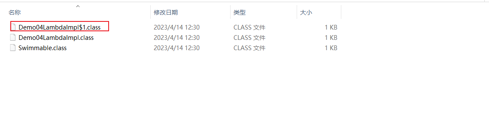

> ps: 这个类在idea中是不显示的，你要到本地磁盘上看才会有

使用idea反编译这个类，得到如下代码：

```java
//
// Source code recreated from a .class file by IntelliJ IDEA
// (powered by FernFlower decompiler)
//

package cn.lyf.lambda.demo.a03;

final class Demo04LambdaImpl$1 implements Swimmable {
    Demo04LambdaImpl$1() {
    }

    public void swimming() {
        System.out.println("使用匿名内部类实现游泳");
    }
}

```


我们再来看看Lambda的效果，修改代码如下：

```java
package cn.lyf.lambda.demo.a03;

public class Demo04LambdaImpl2 {
    public static void main(String[] args) {
        goSwimming(() -> System.out.println("使用匿名内部类实现游泳"));
    }

    public static void goSwimming(Swimmable swimmable) {
        swimmable.swimming();
    }
}
```

运行程序，控制台可以得到预期的结果，但是并没有出现一个新的类，也就是说Lambda并没有在编译的时候产生一个新的类。使用idea对这个类进行反编译，

```java
//
// Source code recreated from a .class file by IntelliJ IDEA
// (powered by FernFlower decompiler)
//

package cn.lyf.lambda.demo.a03;

public class Demo04LambdaImpl2 {
    public Demo04LambdaImpl2() {
    }

    public static void main(String[] args) {
        goSwimming(() -> {
            System.out.println("使用匿名内部类实现游泳");
        });
    }

    public static void goSwimming(Swimmable swimmable) {
        swimmable.swimming();
    }
}

```


我们使用 JDK自带的一个工具：`javap`，对字节码进行反汇编，查看字节码指令。

**在DOS命令行输入：**

```shell
javap -c -p 文件名.class
-c：表示对代码进行反汇编
-p：显示所有类和成员
```

**反汇编后效果如下：**

```java
Compiled from "Demo04LambdaImpl2.java"
public class cn.lyf.lambda.demo.a03.Demo04LambdaImpl2 {
  public cn.lyf.lambda.demo.a03.Demo04LambdaImpl2();
    Code:
       0: aload_0
       1: invokespecial #1                  // Method java/lang/Object."<init>":()V
       4: return

  public static void main(java.lang.String[]);
    Code:
       0: invokedynamic #2,  0              // InvokeDynamic #0:swimming:()Lcn/lyf/lambda/demo/a03/Swimmable;
       5: invokestatic  #3                  // Method goSwimming:(Lcn/lyf/lambda/demo/a03/Swimmable;)V
       8: return

  public static void goSwimming(cn.lyf.lambda.demo.a03.Swimmable);
    Code:
       0: aload_0
       1: invokeinterface #4,  1            // InterfaceMethod cn/lyf/lambda/demo/a03/Swimmable.swimming:()V
       6: return

  private static void lambda$main$0();
    Code:
       0: getstatic     #5                  // Field java/lang/System.out:Ljava/io/PrintStream;
       3: ldc           #6                  // String 使用匿名内部类实现游泳
       5: invokevirtual #7                  // Method java/io/PrintStream.println:(Ljava/lang/String;)V
       8: return
}

```

可以看到在类中多出了一个私有的静态方法`lambda$main$0()` 。这个方法里面放的是什么内容呢？我们通过断点调试 来看看：

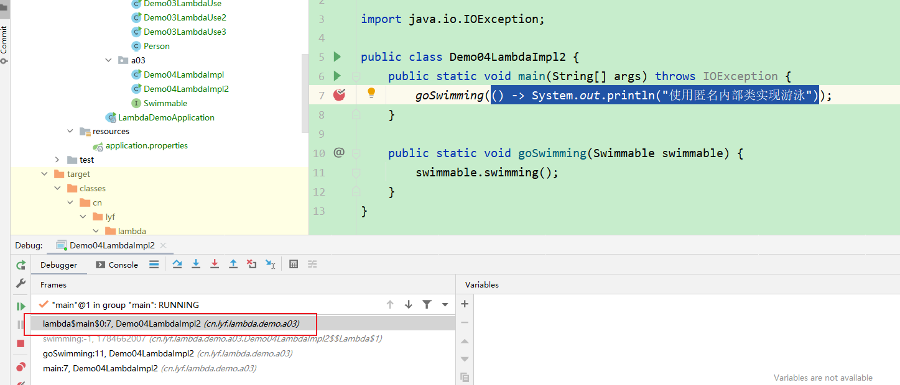

可以确认 `lambda$main$0` 里面放的就是Lambda中的内容，我们可以这么理解 `lambda$main$0` 方法：

```java
public class Demo04LambdaImpl2 {
    public static void main(String[] args) {
    	...
    }
    
    private static void lambda$main$0() {
    	System.out.println("Lambda游泳");
    }
}
```

关于这个方法 `lambda$main$0` 的命名：以lambda开头，因为是在main()函数里使用了lambda表达式，所以带有`$main`表示，因为是第一个，所以`$0`。 

如何调用这个方法呢？其实Lambda在运行的时候会生成一个内部类，为了验证是否生成内部类，可以在运行时加上 `-Djdk.internal.lambda.dumpProxyClasses` ，加上这个参数后，运行时会将生成的内部类class码输出到一个文件中。使用java命令如下：

```shell
java -Djdk.internal.lambda.dumpProxyClasses 要运行的包名.类名
```

在idea的运行参数的`VM options` 中添加`-Djdk.internal.lambda.dumpProxyClasses`

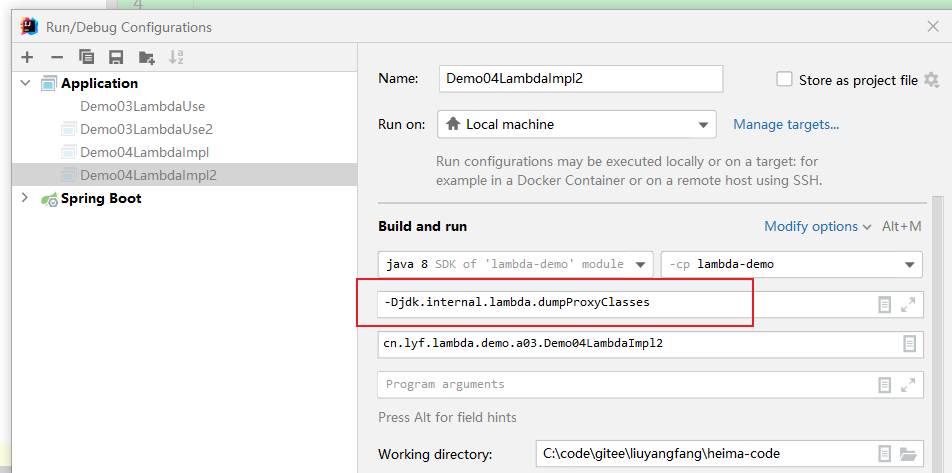


执行完毕，可以看到在项目的根目录下会生成一个新的类，效果如下：

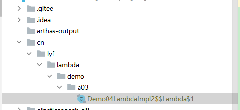


反编译`Demo04LambdaImpl2$$Lambda$1`这个字节码文件，内容如下：

```java
//
// Source code recreated from a .class file by IntelliJ IDEA
// (powered by FernFlower decompiler)
//

package cn.lyf.lambda.demo.a03;

import java.lang.invoke.LambdaForm.Hidden;

// $FF: synthetic class
final class Demo04LambdaImpl2$$Lambda$1 implements Swimmable {
    private Demo04LambdaImpl2$$Lambda$1() {
    }

    @Hidden
    public void swimming() {
        Demo04LambdaImpl2.lambda$main$0();
    }
}

```

可以看到这个匿名内部类实现了`Swimmable`接口，并且重写了`swimming`方法，`swimming`方法调用`Demo04LambdaImpl2.lambda$main$0();` ，也就是调用Lambda中的内容。最后可以将Lambda理解为：

```java
public class Demo04LambdaImpl2 {
    public static void main(String[] args) {
        goSwimming(new Swimmable() {
            public void swimming() {
                Demo04LambdaImpl2.lambda$main$0();
            }
        });
    }

    private static void lambda$main$0() {
        System.out.println("Lambda表达式游泳");
    }

    public static void goSwimming(Swimmable swimmable) {
        swimmable.swimming();
    }
}
```


#### 2.3.2 小结

匿名内部类在编译的时候会一个class文件

Lambda在程序运行的时候形成一个类

1. 在类中新增一个方法,这个方法的方法体就是Lambda表达式中的代码
2. 还会形成一个匿名内部类,实现接口,重写抽象方法
3. 在接口的重写方法中会调用新生成的方法.

### 2.4  Lambda省略格式

#### 2.4.1 目标

1. 掌握Lambda省略格式


在Lambda标准格式的基础上，使用省略写法的规则为：

1. 小括号内参数的类型可以省略
2. 如果小括号内**有且仅有一个参数**，则小括号可以省略
3. 如果大括号内**有且仅有一个语句**，可以同时省略大括号、return关键字及语句分号

```java
(int a) -> {
    return new Person();
}
```


**省略后**

```java
a -> new Person()
```


### 2.5 Lambda的前提条件

#### 2.5.1 目标

掌握Lambda的前提条件

Lambda的语法非常简洁，但是Lambda表达式不是随便使用的，使用时有几个条件要特别注意：

1. 方法的参数或局部变量类型必须为接口才能使用Lambda
2. 接口中有且仅有一个抽象方法

```java
public interface Flyable {
    void flying();
}
```


```java
package cn.lyf.lambda.demo.a04;

public class Demo05LambdaCondition {
    public static void main(String[] args) {
        testFly(() -> {
        });


        Flyable s1 = new Flyable() {
            @Override
            public void flying() {
            }
        };

        Flyable s2 = () -> {
        };
    }

    public static void testFly(Flyable fly) {
        fly.flying();
    }
}
```

#### 2.5.2 小结

Lambda表达式的前提条件:

1. 方法的参数或变量的类型是接口
2. 这个接口中只能有一个抽象方法

### 2.6 函数式接口

函数式接口在Java中是指：**有且仅有一个抽象方法的接口**。

函数式接口，即适用于函数式编程场景的接口。而Java中的函数式编程体现就是Lambda，所以函数式接口就是可以 适用于Lambda使用的接口。只有确保接口中有且仅有一个抽象方法，Java中的Lambda才能顺利地进行推导。

`@FunctionalInterface`注解

与 `@Override`注解的作用类似，Java 8中专门为函数式接口引入了一个新的注解：`@FunctionalInterface`。该注解可用于一个接口的定义上：

```java
package cn.lyf.lambda.demo.a05;

@FunctionalInterface
public interface Operator {
    void myMethod();
}

```

一旦使用该注解来定义接口，编译器将会强制检查该接口是否确实有且仅有一个抽象方法，否则将会报错。不过，即使不使用该注解，只要满足函数式接口的定义，这仍然是一个函数式接口，使用起来都一样。

### 2.7 Lambda和匿名内部类对比

#### 2.7.1 目标

| 区别         | 匿名内部类                               | Lambda                                   |
| ------------ | ---------------------------------------- | ---------------------------------------- |
| 所需类型     | 需要的类型可以是类,抽象类,接口           | 需要的类型必须是接口                     |
| 抽象方法数量 | 匿名内部类所需的接口中抽象方法的数量随意 | Lambda表达式所需的接口只能有一个抽象方法 |
| 实现原理     | 编译后会形成class                        | 程序运行的时候动态生成class              |


#### 2.7.2 小结

当接口中只有一个抽象方法时,建议使用Lambda表达式,其他其他情况还是需要使用匿名内部类

## 3 JDK 8接口新增的两个方法

### 3.1 目标

1. 了解JDK 8接口新增的两个方法
2. 掌握接口默认方法的使用
3. 掌握接口静态方法的使用

### 3.2 JDK 8接口增强介绍

JDK 8以前的接口：

```java
interface 接口名 {
    静态常量;
    抽象方法;
}
```

JDK 8对接口的增强，接口还可以有**默认方法**和**静态方法**

JDK 8的接口：

```java
interface 接口名 {
    静态常量;
    抽象方法;
    默认方法;
    静态方法;
}
```

### 3.3 接口的默认方法

#### 3.3.1 接口引入默认方法的背景

在JDK 8以前接口中只能有抽象方法。存在以下问题： 

如果给接口新增抽象方法，所有实现类都必须重写这个抽象方法。不利于接口的扩展。

```java
package cn.lyf.lambda.demo2.a01;

interface A {
    void test1();

    // 接口新增抽象方法,所有实现类都需要去重写这个方法,非常不利于接口的扩展
    void test2();
}

class B implements A {
    @Override
    public void test1() {
        System.out.println("BB test1");
    }

    // 接口新增抽象方法,所有实现类都需要去重写这个方法
    @Override
    public void test2() {
        System.out.println("BB test2");
    }
}

class C implements A {
    @Override
    public void test1() {
        System.out.println("CC test1");
    }

    // 接口新增抽象方法,所有实现类都需要去重写这个方法
    @Override
    public void test2() {
        System.out.println("CC test2");
    }
}
```


例如，JDK 8 时在Map接口中增加了`forEach`方法：

```java
public interface Map<K, V> {
    ...
    abstract void forEach(BiConsumer<? super K, ? super V> action);
}
```


通过API可以查询到Map接口的实现类如：

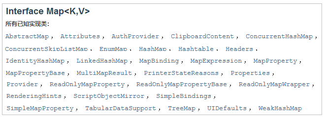

如果在Map接口中增加一个抽象方法，所有的实现类都需要去实现这个方法，那么工程量时巨大的。 因此，在JDK 8时为接口新增了默认方法，效果如下：

接口中的默认方法实现类不必重写，可以直接使用，实现类也可以根据需要重写。这样就方便接口的扩展。

#### 3.3.2 接口默认方法的定义格式

```java
interface 接口名 {
    修饰符 default 返回值类型 方法名() {
    	代码;
    }
}
```


#### 3.3.3 接口默认方法的使用

方式一：实现类直接调用接口默认方法

方式二：实现类重写接口默认方法

```java
package cn.lyf.lambda.demo2.a02;

public class Demo02UserDefaultFunction {
    public static void main(String[] args) {
        BB b = new BB();
        // 方式一：实现类直接调用接口默认方法
        b.test02();
        CC c = new CC();
        // 调用实现类重写接口默认方法
        c.test02();
    }
}

interface AA {
    void test1();

    default void test02() {
        System.out.println("AA test02");
    }
}

class BB implements AA {
    @Override
    public void test1() {
        System.out.println("BB test1");
    }
}

class CC implements AA {
    @Override
    public void test1() {
        System.out.println("CC test1");
    }

    // 方式二：实现类重写接口默认方法
    @Override
    public void test02() {
        System.out.println("CC实现类重写接口默认方法");
    }
}
```


### 3.4 接口静态方法

为了方便接口扩展，JDK 8为接口新增了静态方法。

#### 3.4.1 接口静态方法的定义格式

```java
interface 接口名 {
    修饰符 static 返回值类型 方法名() {
    	代码;
    }
}
```


#### 3.4.2 接口静态方法的使用

直接使用接口名调用即可：`接口名.静态方法名()`; 

代码

```java
package cn.lyf.lambda.demo2.a03;

public class Demo04UseStaticFunction {
    public static void main(String[] args) {
        // 直接使用接口名调用即可：接口名.静态方法名();
        AAA.test01();
    }
}

interface AAA {
    static void test01() {
        System.out.println("AAA 接口的静态方法");
    }
}

class BBB implements AAA {
    /*@Override
    // 静态方法不能重写
    public static void test01() {
        System.out.println("AAA 接口的静态方法");
    }*/
}
```


### 3.5 接口默认方法和静态方法的区别

1、默认方法通过实例调用，静态方法通过接口名调用。

2、默认方法可以被继承，实现类可以直接使用接口默认方法，也可以重写接口默认方法。

3、静态方法不能被继承，实现类不能重写接口静态方法，只能使用接口名调用。

### 3.6 小结

接口中新增的两种方法： 默认方法和静态方法

如何选择呢？如果这个方法需要被实现类继承或重写，使用默认方法，如果接口中的方法不需要被继承就使用静态方 法


## 4 常用内置函数式接口

### 4.1 目标

1. 了解内置函数式接口由来
2. 了解常用内置函数式接口

### 4.2 内置函数式接口来由来

我们知道使用Lambda表达式的前提是需要有函数式接口。而Lambda使用时不关心接口名，抽象方法名，只关心抽象方法的参数列表和返回值类型。因此为了让我们使用Lambda方便，JDK提供了大量常用的函数式接口。

```java
package cn.lyf.lambda.demo3.a01;

public class Demo01UserFunctionalInterface {
    public static void main(String[] args) {
        // 调用函数式接口中的方法
        method((arr) -> {
            int sum = 0;
            for (int n : arr) {
                sum += n;
            }
            return sum;
        });
    }

    // 使用自定义的函数式接口作为方法参数
    public static void method(Operator op) {
        int[] arr = {1, 2, 3, 4};
        int sum = op.getSum(arr);
        System.out.println("sum = " + sum);
    }
}

@FunctionalInterface
interface Operator {
    int getSum(int[] arr);
}
```


### 4.3 常用内置函数式接口介绍

它们主要在 `java.util.function`包中。下面是最常用的几个接口。

#### 4.3.1 Supplier接口

```java
package java.util.function;

/**
 * Represents a supplier of results.
 *
 * <p>There is no requirement that a new or distinct result be returned each
 * time the supplier is invoked.
 *
 * <p>This is a <a href="package-summary.html">functional interface</a>
 * whose functional method is {@link #get()}.
 *
 * @param <T> the type of results supplied by this supplier
 *
 * @since 1.8
 */
@FunctionalInterface
public interface Supplier<T> {

    /**
     * Gets a result.
     *
     * @return a result
     */
    T get();
}
```


#### 4.3.2 Consumer接口

```java
package java.util.function;

import java.util.Objects;

/**
 * Represents an operation that accepts a single input argument and returns no
 * result. Unlike most other functional interfaces, {@code Consumer} is expected
 * to operate via side-effects.
 *
 * <p>This is a <a href="package-summary.html">functional interface</a>
 * whose functional method is {@link #accept(Object)}.
 *
 * @param <T> the type of the input to the operation
 *
 * @since 1.8
 */
@FunctionalInterface
public interface Consumer<T> {

    /**
     * Performs this operation on the given argument.
     *
     * @param t the input argument
     */
    void accept(T t);

    /**
     * Returns a composed {@code Consumer} that performs, in sequence, this
     * operation followed by the {@code after} operation. If performing either
     * operation throws an exception, it is relayed to the caller of the
     * composed operation.  If performing this operation throws an exception,
     * the {@code after} operation will not be performed.
     *
     * @param after the operation to perform after this operation
     * @return a composed {@code Consumer} that performs in sequence this
     * operation followed by the {@code after} operation
     * @throws NullPointerException if {@code after} is null
     */
    default Consumer<T> andThen(Consumer<? super T> after) {
        Objects.requireNonNull(after);
        return (T t) -> { accept(t); after.accept(t); };
    }
}

```


#### 4.3.3 Function接口

```java
package java.util.function;

import java.util.Objects;

/**
 * Represents a function that accepts one argument and produces a result.
 *
 * <p>This is a <a href="package-summary.html">functional interface</a>
 * whose functional method is {@link #apply(Object)}.
 *
 * @param <T> the type of the input to the function
 * @param <R> the type of the result of the function
 *
 * @since 1.8
 */
@FunctionalInterface
public interface Function<T, R> {

    /**
     * Applies this function to the given argument.
     *
     * @param t the function argument
     * @return the function result
     */
    R apply(T t);

    /**
     * Returns a composed function that first applies the {@code before}
     * function to its input, and then applies this function to the result.
     * If evaluation of either function throws an exception, it is relayed to
     * the caller of the composed function.
     *
     * @param <V> the type of input to the {@code before} function, and to the
     *           composed function
     * @param before the function to apply before this function is applied
     * @return a composed function that first applies the {@code before}
     * function and then applies this function
     * @throws NullPointerException if before is null
     *
     * @see #andThen(Function)
     */
    default <V> Function<V, R> compose(Function<? super V, ? extends T> before) {
        Objects.requireNonNull(before);
        return (V v) -> apply(before.apply(v));
    }

    /**
     * Returns a composed function that first applies this function to
     * its input, and then applies the {@code after} function to the result.
     * If evaluation of either function throws an exception, it is relayed to
     * the caller of the composed function.
     *
     * @param <V> the type of output of the {@code after} function, and of the
     *           composed function
     * @param after the function to apply after this function is applied
     * @return a composed function that first applies this function and then
     * applies the {@code after} function
     * @throws NullPointerException if after is null
     *
     * @see #compose(Function)
     */
    default <V> Function<T, V> andThen(Function<? super R, ? extends V> after) {
        Objects.requireNonNull(after);
        return (T t) -> after.apply(apply(t));
    }

    /**
     * Returns a function that always returns its input argument.
     *
     * @param <T> the type of the input and output objects to the function
     * @return a function that always returns its input argument
     */
    static <T> Function<T, T> identity() {
        return t -> t;
    }
}

```


#### 4.3.4 Predicate接口

- **Predicate接口用于做判断,返回boolean类型的值**

```java
package java.util.function;

import java.util.Objects;

/**
 * Represents a predicate (boolean-valued function) of one argument.
 *
 * <p>This is a <a href="package-summary.html">functional interface</a>
 * whose functional method is {@link #test(Object)}.
 *
 * @param <T> the type of the input to the predicate
 *
 * @since 1.8
 */
@FunctionalInterface
public interface Predicate<T> {

    /**
     * Evaluates this predicate on the given argument.
     *
     * @param t the input argument
     * @return {@code true} if the input argument matches the predicate,
     * otherwise {@code false}
     */
    boolean test(T t);

    /**
     * Returns a composed predicate that represents a short-circuiting logical
     * AND of this predicate and another.  When evaluating the composed
     * predicate, if this predicate is {@code false}, then the {@code other}
     * predicate is not evaluated.
     *
     * <p>Any exceptions thrown during evaluation of either predicate are relayed
     * to the caller; if evaluation of this predicate throws an exception, the
     * {@code other} predicate will not be evaluated.
     *
     * @param other a predicate that will be logically-ANDed with this
     *              predicate
     * @return a composed predicate that represents the short-circuiting logical
     * AND of this predicate and the {@code other} predicate
     * @throws NullPointerException if other is null
     */
    default Predicate<T> and(Predicate<? super T> other) {
        Objects.requireNonNull(other);
        return (t) -> test(t) && other.test(t);
    }

    /**
     * Returns a predicate that represents the logical negation of this
     * predicate.
     *
     * @return a predicate that represents the logical negation of this
     * predicate
     */
    default Predicate<T> negate() {
        return (t) -> !test(t);
    }

    /**
     * Returns a composed predicate that represents a short-circuiting logical
     * OR of this predicate and another.  When evaluating the composed
     * predicate, if this predicate is {@code true}, then the {@code other}
     * predicate is not evaluated.
     *
     * <p>Any exceptions thrown during evaluation of either predicate are relayed
     * to the caller; if evaluation of this predicate throws an exception, the
     * {@code other} predicate will not be evaluated.
     *
     * @param other a predicate that will be logically-ORed with this
     *              predicate
     * @return a composed predicate that represents the short-circuiting logical
     * OR of this predicate and the {@code other} predicate
     * @throws NullPointerException if other is null
     */
    default Predicate<T> or(Predicate<? super T> other) {
        Objects.requireNonNull(other);
        return (t) -> test(t) || other.test(t);
    }

    /**
     * Returns a predicate that tests if two arguments are equal according
     * to {@link Objects#equals(Object, Object)}.
     *
     * @param <T> the type of arguments to the predicate
     * @param targetRef the object reference with which to compare for equality,
     *               which may be {@code null}
     * @return a predicate that tests if two arguments are equal according
     * to {@link Objects#equals(Object, Object)}
     */
    static <T> Predicate<T> isEqual(Object targetRef) {
        return (null == targetRef)
                ? Objects::isNull
                : object -> targetRef.equals(object);
    }
}

```


### 4.4 Supplier接口

`java.util.function.Supplier<T>` 接口，它意味着"供给" , 对应的Lambda表达式需要“**对外提供**”一个符合泛型类型的对象数据。

```java
@FunctionalInterface
public interface Supplier<T> {
	T get();
}
```

供给型接口，通过Supplier接口中的get方法可以得到一个值，无参有返回的接口。

#### 4.4.1 使用Lambda表达式返回数组元素最大值

使用`Supplier`接口作为方法参数类型，通过Lambda表达式求出int数组中的最大值。提示：接口的泛型请使用`java.lang.Integer`类

#### 4.4.2 代码示例:

```java
package cn.lyf.lambda.demo3.a02;

import lombok.extern.slf4j.Slf4j;

import java.util.Arrays;
import java.util.function.Supplier;

@Slf4j
public class DemoSupplier {
    public static void main(String[] args) {
        System.out.println(getMaxValue(() -> {
            Integer[] array = {1, 4, 2, 6, 9, 0, 5, 8, 3, 7};
            // 按降序进行排列 o1 比 o2小的话，那么就将o1往后排，o2往前排，这里的意思是大的往前排，所以是降序
            Arrays.sort(array, (o1, o2) -> o2 - o1);
            return array[0];
        }));
    }

    /**
     * 这里传一个接口 此接口的作用是获取一个数组的最大值
     *
     * @param supplier 接口
     * @return 数组最大值
     */
    public static int getMaxValue(Supplier<Integer> supplier) {
        return supplier.get();
    }
}

```


### 4.5 Consumer接口

`java.util.function.Consumer<T>` 接口则正好相反，它不是生产一个数据，而是**消费**一个数据，其数据类型由泛型参数决定。

```java
@FunctionalInterface
public interface Consumer<T> {
    void accept(T t);
}
```


#### 4.5.1 使用Lambda表达式完成一个打印List在排序前后的数据的小功能

Consumer消费型接口，可以拿到accept方法参数传递过来的数据进行处理, 有参无返回的接口。基本使用如：

```java
package cn.lyf.lambda.demo3.a03;

import lombok.extern.slf4j.Slf4j;

import java.util.*;
import java.util.function.Consumer;


@Slf4j
public class DemoConsumer {
    public static void main(String[] args) {
        Random random = new Random();
        List<Integer> list = new ArrayList<>(10);
        for (int i = 0; i < 10; i++) {
            list.add(random.nextInt(10) + 1);
        }

        handlerList(list, list1 -> list1.sort(Comparator.comparingInt(o -> o)));
    }

    /**
     * 打印List在排序前后的数据
     *
     * @param list list
     * @param consumer 接口
     */
    public static void handlerList(List<Integer> list, Consumer<List<Integer>> consumer) {
        // 打印List
        System.out.println("排序前");
        System.out.println(list);

        // 方法增强
        consumer.accept(list);

        // 添加一个方法增强
        System.out.println("\n排序后");
        System.out.println(list);
    }
}

```


#### 4.5.2 默认方法：andThen

如果一个方法的参数和返回值全都是`Consumer`类型，那么就可以实现效果：消费一个数据的时候，首先做一个操作，然后再做一个操作，实现组合。而这个方法就是 `Consumer`接口中的default方法`andThen`。下面是JDK的源代码：

```java
default Consumer<T> andThen(Consumer<? super T> after) {
	Objects.requireNonNull(after);
	return (T t) -> { accept(t); after.accept(t); };
}
```

> 备注： java.util.Objects 的 requireNonNull 静态方法将会在参数为null时主动抛出
>
> NullPointerException 异常。这省去了重复编写if语句和抛出空指针异常的麻烦。

要想实现组合，需要两个或多个Lambda表达式即可，而`andThen`的语义正是“一步接一步”操作。例如两个步骤组合的情况：

```java
package cn.lyf.lambda.demo3.a03;

import lombok.extern.slf4j.Slf4j;

import java.util.Locale;
import java.util.function.Consumer;


@Slf4j
public class DemoConsumer2 {
    public static void main(String[] args) {
        handlerStr(s -> System.out.println("lower: " + s.toLowerCase(Locale.ENGLISH)),
                s -> System.out.println("upper: " + s.toUpperCase(Locale.ENGLISH)),
                0
        );
    }

    public static void handlerStr(Consumer<String> lowerConsumer, Consumer<String> upperConsumer, int modelStyle) {
        String str = "Hello, World!!!";
        if (modelStyle == 1) {
            lowerConsumer.andThen(upperConsumer).accept(str);
        } else {
            upperConsumer.andThen(lowerConsumer).accept(str);
        }
    }
}

```

```verilog
upper: HELLO, WORLD!!!
lower: hello, world!!!
```

当然，通过链式写法可以实现更多步骤的组合。

### 4.6 Function接口

`java.util.function.Function<T,R>` 接口用来根据一个类型的数据得到另一个类型的数据，前者称为前置条件， 后者称为后置条件。有参数有返回值。

```java
@FunctionalInterface
public interface Function<T, R> {
    R apply(T t);
}
```


#### 4.6.1 使用Lambda表达式将字符串转成数字

Function转换型接口，对apply方法传入的T类型数据进行处理，返回R类型的结果，有参有返回的接口。使用的场景 例如：将`String`类型转换为`Integer`类型。

```java
package cn.lyf.lambda.demo3.a04;

import lombok.extern.slf4j.Slf4j;

import java.util.function.Function;


@Slf4j
public class FunctionDemo {
    public static void main(String[] args) {
        testFunction(Integer::parseInt);
    }

    public static void testFunction(Function<String, Integer> function) {
        Integer originValue = function.apply("10");
        System.out.println(originValue + " + 5 = " + (originValue + 5));
    }
}

```


#### 4.6.2 默认方法：andThen

`Function`接口中有一个默认的`andThen`方法，用来进行组合操作。JDK源代码如：

```java
default <V> Function<T, V> andThen(Function<? super R, ? extends V> after) {
	Objects.requireNonNull(after);
	return (T t) -> after.apply(apply(t));
}
```

该方法同样用于“先做什么，再做什么”的场景，和`Consumer`中的`andThen`差不多：

```java
package cn.lyf.lambda.demo3.a04;

import lombok.extern.slf4j.Slf4j;

import java.util.function.Function;


@Slf4j
public class FunctionDemo2 {
    public static void main(String[] args) {
        testFunction(Integer::parseInt, intValue -> intValue * 66);
    }

    /**
     * testFunction
     *
     * @param function1 将字符串转成数字
     * @param function2 function1的结果再乘以66
     */
    public static void testFunction(Function<String, Integer> function1, Function<Integer, Integer> function2) {
        Integer result = function1.andThen(function2).apply("10");
        System.out.println("result: " + result);
    }
}

```


第一个操作是将字符串解析成为int数字，第二个操作是乘以66。两个操作通`andThen`按照前后顺序组合到了一 起。

> 请注意，Function的前置条件泛型和后置条件泛型可以相同。


### 4.7 Predicate接口

有时候我们需要对某种类型的数据进行判断，从而得到一个boolean值结果。这时可以使用`java.util.function.Predicate<T> `接口。

```java
@FunctionalInterface
public interface Predicate<T> {
    boolean test(T t);
}
```


#### 4.7.1 使用Lambda判断一个人名如果超过3个字就认为是很长的名字

对test方法的参数T进行判断，返回boolean类型的结果。用于条件判断的场景：

```java
package cn.lyf.lambda.demo3.a05;

import lombok.extern.slf4j.Slf4j;

import java.util.function.Predicate;


@Slf4j
public class PredicateDemo {
    public static void main(String[] args) {
        Predicate<String> predicate = str -> str != null && str.length() > 3;
        testPredicate(predicate, "上官飞燕");
        testPredicate(predicate, "张三丰");
    }

    public static void testPredicate(Predicate<String> predicate, String name) {
        if (predicate.test(name)) {
            System.out.println("name: " + name + ", 名字很长");
        } else {
            System.out.println("name: " + name + ", 名字还可以");
        }
    }
}

```

条件判断的标准是传入的Lambda表达式逻辑，只要名称长度大于3则认为很长。

#### 4.7.2 默认方法：and

既然是条件判断，就会存在与、或、非三种常见的逻辑关系。其中将两个`Predicate`条件使用“与”逻辑连接起来实 现“**并且**”的效果时，可以使用`default`方法`and` 。其JDK源码为：

```java
default Predicate<T> and(Predicate<? super T> other) {
	Objects.requireNonNull(other);
	return (t) -> test(t) && other.test(t);
}
```


- **使用Lambda表达式判断一个字符串中即包含W,也包含H**

- **使用Lambda表达式判断一个字符串中包含W或者包含H**
- **使用Lambda表达式判断一个字符串中不包含W**


##### 4.7.2.1 如果要判断一个字符串既要包含大写“H”，又要包含大写“W”

```java
package cn.lyf.lambda.demo3.a05;

import lombok.extern.slf4j.Slf4j;

import java.util.function.Predicate;


@Slf4j
public class PredicateDemo2 {
    public static void main(String[] args) {
        testPredicate(str -> str.contains("H"), str -> str.contains("W"), "Hello, World!!!");
    }

    public static void testPredicate(Predicate<String> predicateH, Predicate<String> predicateW, String name) {
        boolean flag1 = predicateH.test(name) && predicateW.test(name);
        boolean flag2 = predicateH.and(predicateW).test(name);
        System.out.println("flag1 == flag2 = " + (flag1 == flag2));
        if (flag1) {
            System.out.println(name + ", 包含 H 和 W");
        } else {
            System.out.println(name + ", 不同时包含 H 和 W");
        }
    }
}

```

###### 结果

```verilog
flag1 == flag2 = true
Hello, World!!!, 包含 H 和 W
```


#### 4.7.3 默认方法：or

##### 4.7.3.1 使用Lambda表达式判断一个字符串中包含W或者包含H

与`and`的“与”类似，默认方法`or`实现逻辑关系中的“**或**”。JDK源码为：

```java
default Predicate<T> or(Predicate<? super T> other) {
	Objects.requireNonNull(other);
	return (t) -> test(t) || other.test(t);
}
```

如果希望实现逻辑“字符串包含大写H或者包含大写W”，那么代码只需要将“and”修改为“or”名称即可，其他都不变：

```java
package cn.lyf.lambda.demo3.a05;

import lombok.extern.slf4j.Slf4j;

import java.util.function.Predicate;


@Slf4j
public class PredicateDemo3 {
    public static void main(String[] args) {
        testPredicate(str -> str.contains("H"), str -> str.contains("W"), "hello, world!!!");
    }

    public static void testPredicate(Predicate<String> predicateH, Predicate<String> predicateW, String name) {
        boolean flag1 = predicateH.test(name) || predicateW.test(name);
        boolean flag2 = predicateH.or(predicateW).test(name);
        System.out.println("flag1 == flag2 = " + (flag1 == flag2));
        if (flag1) {
            System.out.println(name + ", 包含 H 或 W");
        } else {
            System.out.println(name + ", 不包含 H 或 W");
        }
    }
}

```

###### 结果

```verilog
flag1 == flag2 = true
hello, world!!!, 不包含 H 或 W
```


#### 4.7.4 默认方法：negate

##### 4.7.4.1 使用Lambda表达式判断一个字符串中不包含W

 “与”、“或”已经了解了，剩下的“非”（取反）也会简单。默认方法 negate 的JDK源代码为：

```java
default Predicate<T> negate() {
	return (t) -> !test(t);
}
```


从实现中很容易看出，它是执行了test方法之后，对结果boolean值进行“!”取反而已。一定要在`test`方法调用之前调 用`negate`方法，正如`and`和`or`方法一样：

```java
package cn.lyf.lambda.demo3.a05;

import lombok.extern.slf4j.Slf4j;

import java.util.function.Predicate;


@Slf4j
public class PredicateDemo4 {
    public static void main(String[] args) {
        testPredicate(str -> str.contains("H"), "hello, world!!!");
    }

    public static void testPredicate(Predicate<String> predicateH, String name) {
        boolean isNotContainedH1 = !predicateH.test(name);
        // 或者使用
        boolean isNotContainedH2 = predicateH.negate().test(name);
        System.out.println("isNotContainedH1 == isNotContainedH2 = " + (isNotContainedH1 == isNotContainedH2));
        if (isNotContainedH2) {
            System.out.println(name + ", 不包含 H ");
        }
    }
}

```


### 4.8 小结

#### 4.8.1 Supplier接口

```java
@FunctionalInterface
public interface Supplier<T> {
	T get();
}
```


#### 4.8.2 Consumer接口

```java
@FunctionalInterface
public interface Consumer<T> {
	void accept(T t);
}
```


#### 4.8.3 Function接口

```java
@FunctionalInterface
public interface Function<T, R> {
	R apply(T t);
}
```


#### 4.8.4 Predicate接口

```java
@FunctionalInterface
public interface Predicate<T> {
	boolean test(T t);
}
```


## 5 介绍方法引用

### 5.1 目标

- 了解Lambda的冗余场景
- 掌握方法引用的格式
- 了解常见的方法引用方式

### 5.2 Lambda的冗余场景

#### 5.2.1 使用Lambda表达式求一个数组的和

```java
package cn.lyf.lambda.demo4.a01;

import lombok.extern.slf4j.Slf4j;

import java.util.ArrayList;
import java.util.List;
import java.util.Random;
import java.util.function.Consumer;

@Slf4j
public class Demo1 {
    // 使用Lambda表达式求一个数组的和
    public static void main(String[] args) {
        printTotal(intArray -> {
            int total = 0;
            StringBuilder sb = new StringBuilder();
            sb.append("[");
            int length = intArray.length;
            for (int i = 0; i < length; i++) {
                int tmpInt = intArray[i];
                total += tmpInt;
                if (i == intArray.length - 1) {
                    sb.append(tmpInt);
                } else {
                    sb.append(tmpInt).append(", ");
                }
            }
            sb.append("]");
            System.out.println("array: " + sb + ", total: " + total);
        });
    }

    public static void printTotal(Integer[] intArray) {
        int total = 0;
        StringBuilder sb = new StringBuilder();
        sb.append("[");
        int length = intArray.length;
        for (int i = 0; i < length; i++) {
            int tmpInt = intArray[i];
            total += tmpInt;
            if (i == intArray.length - 1) {
                sb.append(tmpInt);
            } else {
                sb.append(tmpInt).append(", ");
            }
        }
        sb.append("]");
        System.out.println("array: " + sb + ", total: " + total);
    }

    public static void printTotal(Consumer<Integer[]> consumer) {
        Random random = new Random();
        List<Integer> list = new ArrayList<>(10);
        for (int i = 0; i < 10; i++) {
            list.add(random.nextInt(100));
        }
        consumer.accept(list.toArray(new Integer[0]));
    }
}

```


#### 5.2.2 体验方法引用简化Lambda

如果我们在Lambda中所指定的功能，已经有其他方法存在相同方案，那是否还有必要再写重复逻辑？可以直接“引用”过去就好了：

```java
package cn.lyf.lambda.demo4.a01;

import lombok.extern.slf4j.Slf4j;

import java.util.ArrayList;
import java.util.List;
import java.util.Random;
import java.util.function.Consumer;

@Slf4j
public class Demo2 {
    // 使用Lambda表达式求一个数组的和
    public static void main(String[] args) {
        printTotal(Demo2::printTotal);
    }

    public static void printTotal(Integer[] intArray) {
        int total = 0;
        StringBuilder sb = new StringBuilder();
        sb.append("[");
        int length = intArray.length;
        for (int i = 0; i < length; i++) {
            int tmpInt = intArray[i];
            total += tmpInt;
            if (i == intArray.length - 1) {
                sb.append(tmpInt);
            } else {
                sb.append(tmpInt).append(", ");
            }
        }
        sb.append("]");
        System.out.println("array: " + sb + ", total: " + total);
    }

    public static void printTotal(Consumer<Integer[]> consumer) {
        Random random = new Random();
        List<Integer> list = new ArrayList<>(10);
        for (int i = 0; i < 10; i++) {
            list.add(random.nextInt(100));
        }
        consumer.accept(list.toArray(new Integer[0]));
    }
}

```

请注意其中的双冒号`::`写法，这被称为“**方法引用**”，是一种新的语法。

### 5.3 方法引用的格式

- **符号表示**: `::`

- **符号说明 :** 双冒号为方法引用运算符，而它所在的表达式被称为**方法引用**。

- **应用场景 :** 如果Lambda所要实现的方案 , 已经有其他方法存在相同方案，那么则可以使用方法引用。

### 5.4 常见引用方式

方法引用在JDK 8中使用方式相当灵活，有以下几种形式：

1. `instanceName::methodName`   对象`::`方法名
2. `ClassName::staticMethodName`   类名`::`静态方法
3. `ClassName::methodName`   类名`::`普通方法
4. `ClassName::new`   类名`::`new 调用的构造器
5. `TypeName[]::new`   `String[]::new` 调用数组的构造器

### 5.5 小结

首先了解Lambda表达式的冗余情况,体验了方法引用,了解常见的方法引用方式

### 5.5 对象名`::`引用成员方法

这是最常见的一种用法，与上例相同。如果一个类中已经存在了一个成员方法，则可以通过对象名引用成员方法，代码为：

```java
	// 对象::实例方法
    @Test
    public void test01() {
        Date now = new Date();

        Supplier<Long> supp = () -> {
            return now.getTime();
        };

        System.out.println(supp.get());
        Supplier<Long> supp2 = now::getTime;
        System.out.println(supp2.get());
    }
```

**方法引用的注意事项**

1. 被引用的方法，参数要和接口中抽象方法的参数一样
2. 当接口抽象方法有返回值时，被引用的方法也必须有返回值

### 5.6 类名`::`引用静态方法

由于在 `java.lang.System`类中已经存在了静态方法`currentTimeMillis`，所以当我们需要通过Lambda来调用该方法时,可以使用方法引用 , 写法是：

```java
    @Test
    public void test02() {
        // Lambda调用静态方法
        Supplier<Long> supplier1 = () -> System.currentTimeMillis();
        System.out.println(supplier1.get());
        // 方法引用调用静态方法
        Supplier<Long> supplier2 = System::currentTimeMillis;
        System.out.println(supplier2.get());
    }
```


### 5.7 类名::引用实例方法

Java面向对象中，类名只能调用静态方法，类名引用实例方法是有前提的，实际上是拿第一个参数作为方法的调用者。

```java
    // 类名引用成员方法
    @Test
    public void test03() {
        String uuidStr = UUID.randomUUID().toString();
        // Lambda调用
        Function<String, Integer> f1 = str -> str.length();
        System.out.println("lambda: " + f1.apply(uuidStr));
        // 方法引用
        Function<String, Integer> f2 = String::length;
        System.out.println("方法引用: " + f2.apply(uuidStr));

        int length = 6;
        System.out.printf("uuidStr: %s, 会从索引为%d的位置开始截取字符串\n", uuidStr, length);
        // Lambda调用
        BiFunction<String, Integer, String> bif1 = (s, integer) -> s.substring(integer);
        System.out.println("lambda: " + bif1.apply(uuidStr, length));
        // 方法引用
        BiFunction<String, Integer, String> bif2 = String::substring;
        System.out.println("方法引用: " + bif2.apply(uuidStr, length));
    }
```

#### 5.7.1 测试结果

```verilog
lambda: 36
方法引用: 36
uuidStr: 70c03e81-f0be-485b-aa37-39b7665430d6, 会从索引为6的位置开始截取字符串
lambda: 81-f0be-485b-aa37-39b7665430d6
方法引用: 81-f0be-485b-aa37-39b7665430d6
```


### 5.8 类名::new引用构造器

> 由于构造器的名称与类名完全一样。所以构造器引用使用`类名称::new`的格式表示。首先是一个简单的 Person 类：

```java
package cn.lyf.lambda.demo4.a02;

import lombok.AllArgsConstructor;
import lombok.Data;
import lombok.NoArgsConstructor;
import lombok.extern.slf4j.Slf4j;

@Slf4j
@Data
@AllArgsConstructor
@NoArgsConstructor
public class Person {
    private String name;
    private Integer age;
    private String address;
}

```

**要使用这个函数式接口，可以通过方法引用传递：**

```java
    // 类型::new
    @Test
    public void test4() {
        // 使用Lambda的无参构造
        Supplier<Person> supplier1 = () -> {
            return new Person();
        };

        System.out.println(supplier1.get());

        // 使用方法引用的无参构造
        Supplier<Person> supplier2 = Person::new;
        System.out.println(supplier2.get());

        // 使用方法引用来调用有参构造
        PersonConstructFunction<String, Integer, String, Person> pcf = Person::new;
        System.out.println(pcf.apply("张三", 28, "杭州市"));
    }

    @Data
    @AllArgsConstructor
    @NoArgsConstructor
    public class Person {
        private String name;
        private Integer age;
        private String address;
    }

    @FunctionalInterface
    public interface PersonConstructFunction<T, U, V, R> {
        R apply(T t, U u, V v);
    }
```

> ps: 创建无参构造的对象时，可以使用方法引用

### 5.9 数组::new 引用数组构造器

数组也是`Object`的子类对象，所以同样具有构造器，只是语法稍有不同。

```java
    // 类型[]::new
    @Test
    public void test05() {
        Function<Integer, String[]> fun = (len) -> {
            return new String[len];
        };
        String[] arr1 = fun.apply(10);
        System.out.println(arr1 + ", " + arr1.length);
        Function<Integer, String[]> fun2 = String[]::new;
        String[] arr2 = fun.apply(5);
        System.out.println(arr2 + ", " + arr2.length);
    }
```


### 5.10 小结

方法引用是对Lambda表达式符合特定情况下的一种缩写，它使得我们的Lambda表达式更加的精简，也可以理解为

Lambda表达式的缩写形式 , 不过要注意的是方法引用只能"引用"已经存在的方法!

## 6 Stream 流

### 6.1 Stream流介绍

#### 6.1.1 目标

1. 了解集合的处理数据的弊端
2. 理解Stream流的思想和作用

#### 6.1.2 集合处理数据

##### 6.1.2.1 常规做法

当我们需要对集合中的元素进行操作的时候，除了必需的添加、删除、获取外，最典型的就是集合遍历。我们来体验 集合操作数据的常规做法，需求如下：

```
一个ArrayList集合中存储有以下数据:张无忌,周芷若,赵敏,张强,张三丰
需求:1.拿到所有姓张的 2.拿到名字长度为3个字的 3.打印这些数据
```

代码如下：

```java
package cn.lyf.lambda.demo5.a01;

import lombok.extern.slf4j.Slf4j;

import java.util.ArrayList;
import java.util.Arrays;
import java.util.List;

@Slf4j
public class CollectionDemo {
    // 一个ArrayList集合中存储有以下数据:张无忌,周芷若,赵敏,张强,张三丰
    // 需求:1.拿到所有姓张的 2.拿到名字长度为3个字的 3.打印这些数据
    public static void main(String[] args) {
        List<String> list = new ArrayList<>(Arrays.asList(
                "张无忌", "周芷若", "赵敏", "张强", "张三丰"
        ));

        for (String str : list) {
            if (str.startsWith("张") && str.length() == 3) {
                System.out.println(str);
            }
        }
    }
}

```


##### 6.1.2.2 Stream的更优写法

下面来看一下借助Java 8的Stream API，修改后的代码：

```java
package cn.lyf.lambda.demo5.a01;

import lombok.extern.slf4j.Slf4j;

import java.util.ArrayList;
import java.util.Arrays;
import java.util.List;


@Slf4j
public class CollectionDemo2 {
    // 一个ArrayList集合中存储有以下数据:张无忌,周芷若,赵敏,张强,张三丰
    // 需求:1.拿到所有姓张的 2.拿到名字长度为3个字的 3.打印这些数据
    // 通过Stream来完成此需求
    public static void main(String[] args) {
        List<String> list = new ArrayList<>(Arrays.asList(
                "张无忌", "周芷若", "赵敏", "张强", "张三丰"
        ));

        list.stream()
            .filter(str -> str.startsWith("张"))
            .filter(str -> str.length() == 3)
            .forEach(System.out::println);
        
        // list.stream().filter(str -> str.startsWith("张")).filter(str -> str.length() == 3).forEach(System.out::println);
    }
}

```

直接阅读代码的字面意思即可完美展示无关逻辑方式的语义：**获取流、过滤姓张、过滤长度为3、逐一打印**。

我们真正要做的事情内容被更好地体现在代码中。

> ps: 个人感觉，这两种写法没有太大的差距,要说Stream的优势吧，Stream流可以将代码简化成1行

#### 6.1.3 Stream流式思想概述

> **注意：`Stream`和`IO`流(`InputStream/OutputStream`)没有任何关系，请暂时忘记对传统`IO`流的固有印象！**

Stream流式思想类似于工厂车间的“**生产流水线**”，Stream流不是一种数据结构，不保存数据，而是对数据进行加工处理。`Stream`可以看作是流水线上的一个工序。在流水线上，通过多个工序让一个原材料加工成一个商品。


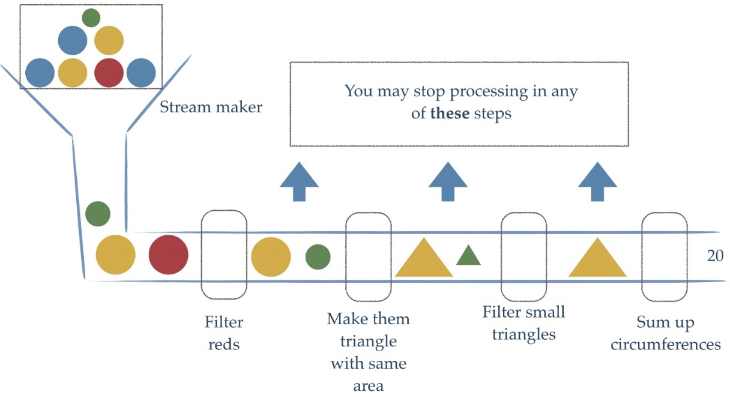


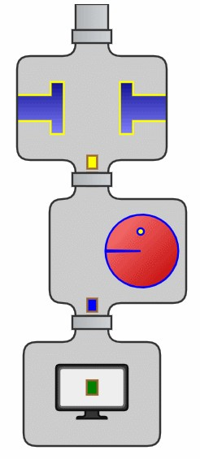


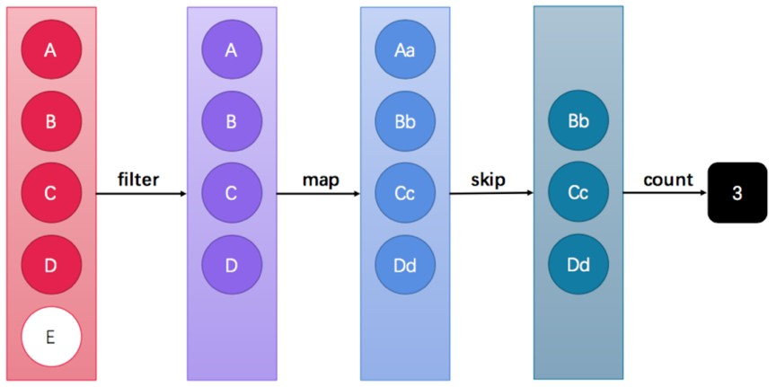


Stream API能让我们快速完成许多复杂的操作，如筛选、切片、映射、查找、去除重复，统计，匹配和归约。

#### 6.1.4 小结

Stream是流式思想,相当于工厂的流水线,对集合中的数据进行加工处理

### 6.2 获取Stream流的两种方式

#### 6.2.1 目标

1. 掌握根据Collection获取流
2. 掌握Stream中的静态方法of获取流


`java.util.stream.Stream<T>` 是JDK 8新加入的流接口。

获取一个流非常简单，有以下几种常用的方式：

- 所有的`Collection`集合都可以通过`stream`默认方法获取流；

- `Stream`接口的静态方法`of`可以获取数组对应的流。 

##### 6.2.1.1 方式1 : 根据Collection获取流

首先，`java.util.Collection` 接口中加入了default方法`stream`用来获取流，所以其所有实现类均可获取流。

```java
public interface Collection {
	default Stream<E> stream()
}
```


```java
package cn.lyf.lambda.demo5.a02;

import java.util.*;
import java.util.stream.Stream;

public class Demo04GetStream {
    public static void main(String[] args) {
        // 集合获取流
        // Collection接口中的方法: default Stream<E> stream() 获取流
        List<String> list = new ArrayList<>();
        // ...
        Stream<String> stream1 = list.stream();
        Set<String> set = new HashSet<>();
        // ...
        Stream<String> stream2 = set.stream();
        Vector<String> vector = new Vector<>();
        // ...
        Stream<String> stream3 = vector.stream();
    }
}
```

`java.util.Map`接口不是`Collection`的子接口，所以获取对应的流需要分`key、value`或`entry`等情况：

```java
package cn.lyf.lambda.demo5.a02;

import java.util.HashMap;
import java.util.Map;
import java.util.stream.Stream;

public class Demo05GetStream {
    public static void main(String[] args) {
        // Map获取流
        Map<String, String> map = new HashMap<>();
        // ...
        Stream<String> keyStream = map.keySet().stream();
        Stream<String> valueStream = map.values().stream();
        Stream<Map.Entry<String, String>> entryStream = map.entrySet().stream();
    }
}
```


##### 6.2.1.2 方式2 : Stream中的静态方法of获取流

由于数组对象不可能添加默认方法，所以`Stream`接口中提供了静态方法`of` ，使用很简单：

```java
package cn.lyf.lambda.demo5.a02;

import java.util.stream.Stream;

public class Demo06GetStream {
    public static void main(String[] args) {
        // Stream中的静态方法: static Stream of(T... values)
        Stream<String> stream6 = Stream.of("aa", "bb", "cc");
        String[] arr = {"aa", "bb", "cc"};
        Stream<String> stream7 = Stream.of(arr);
        Integer[] arr2 = {11, 22, 33};
        Stream<Integer> stream8 = Stream.of(arr2);
        // 注意:基本数据类型的数组不行
        int[] arr3 = {11, 22, 33};
        Stream<int[]> stream9 = Stream.of(arr3);
    }
}
```


> 备注：`of`方法的参数其实是一个可变参数，所以支持数组。

#### 6.2.2 小结

学习了两种获取流的方式:

> 1\. 通过Collection接口中的默认方法Stream stream() 2. 通过Stream接口中的静态of方法

### 6.3 Stream常用方法和注意事项


#### 6.3.1 目标

1. 了解Stream常用方法的分类
2. 掌握Stream注意事项

#### 6.3.2 Stream常用方法

Stream流模型的操作很丰富，这里介绍一些常用的API。这些方法可以被分成两种：

| 方法名  | 方法作用   | 返回值类型 | 方法种类 |
| ------- | ---------- | ---------- | -------- |
| count   | 统计个数   | long       | 终结     |
| forEach | 逐一处理   | void       | 终结     |
| filter  | 过滤       | Stream     | 函数拼接 |
| limit   | 取用前几个 | Stream     | 函数拼接 |
| skip    | 跳过前几个 | Stream     | 函数拼接 |
| map     | 映射       | Stream     | 函数拼接 |
| concat  | 组合       | Stream     | 函数拼接 |


- **终结方法**：返回值类型不再是`Stream`类型的方法，不再支持链式调用。本小节中，终结方法包括`count`和`forEach`方法。

- **非终结方法**：返回值类型仍然是`Stream`类型的方法，支持链式调用。（除了终结方法外，其余方法均为非终结方法。）

> 备注：本小节之外的更多方法，请自行参考API文档。

#### 6.3.3 Stream注意事项(重要)

- Stream只能操作一次

- Stream方法返回的是新的流

- Stream不调用终结方法，中间的操作不会执行

#### 6.3.4 小结

我们学习了Stream的常用方法,我们知道Stream这些常用方法可以分成两类,终结方法,函数拼接方法

Stream的3个注意事项:

- Stream只能操作一次
- Stream方法返回的是新的流
- Stream不调用终结方法，中间的操作不会执行

### 6.4 Stream常用方法

#### 6.4.1 Stream流的forEach方法

forEach 用来遍历流中的数据

```java
void forEach(Consumer<? super T> action);
```

该方法接收一个`Consumer`接口函数，会将每一个流元素交给该函数进行处理。例如：

```java
   @Test
    public void testForEach() {
        List<String> one = new ArrayList<>();
        Collections.addAll(one, "迪丽热巴", "宋远桥", "苏星河", "老子", "庄子", "孙子");
        /*one.stream().forEach((String s) -> {
            System.out.println(s);
        });*/

        // 简写
        // one.stream().forEach(s -> System.out.println(s));
        one.stream().forEach(System.out::println);
    }
```


#### 6.4.2 Stream流的`count`方法

Stream流提供`count`方法来统计其中的元素个数：

```java
long count();
```

该方法返回一个`long`值代表元素个数。基本使用：

```java
    @Test
    public void testCount() {
        List<String> one = new ArrayList<>();
        Collections.addAll(one, "迪丽热巴", "宋远桥", "苏星河", "老子", "庄子", "孙子");
        System.out.println(one.stream().count());
    }
```


#### 6.4.3 Stream流的filter方法

filter用于过滤数据，返回符合过滤条件的数据

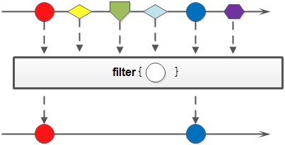

可以通过`filter`方法将一个流转换成另一个子集流。方法声明：

```java
Stream<T> filter(Predicate<? super T> predicate);
```

该接口接收一个`Predicate`函数式接口参数（可以是一个Lambda或方法引用）作为筛选条件。

Stream流中的`filter`方法基本使用的代码如下：

```java
    @Test
    public void testFilter() {
        List<String> one = new ArrayList<>();
        Collections.addAll(one, "迪丽热巴", "宋远桥", "苏星河", "老子", "庄子", "孙子");
        one.stream().filter(s -> s.length() == 2).forEach(System.out::println);
    }
```

在这里通过Lambda表达式来指定了筛选的条件：姓名长度为2个字。

#### 6.4.4 Stream流的limit方法


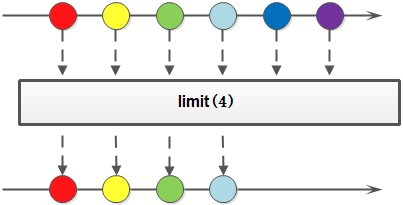

 

`limit`方法可以对流进行截取，只取用前n个。方法签名：

```java
Stream<T> limit(long maxSize);
```

参数是一个long型，如果集合当前长度大于参数则进行截取。否则不进行操作。基本使用：

```java
    @Test
    public void testLimit() {
        List<String> one = new ArrayList<>();
        Collections.addAll(one, "迪丽热巴", "宋远桥", "苏星河", "老子", "庄子", "孙子");
        one.stream().limit(3).forEach(System.out::println);
    }
```

**运行结果**

```verilog
迪丽热巴
宋远桥
苏星河

```


#### 6.4.5 Stream流的skip方法

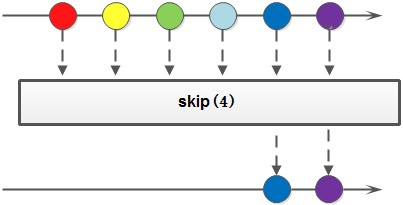

如果希望跳过前几个元素，可以使用`skip`方法获取一个截取之后的新流：

```java
Stream<T> skip(long n);
```


如果流的当前长度大于n，则跳过前n个；否则将会得到一个长度为0的空流。基本使用：

```java
    @Test
    public void testSkip() {
        List<String> one = new ArrayList<>();
        Collections.addAll(one, "迪丽热巴", "宋远桥", "苏星河", "老子", "庄子", "孙子");
        one.stream().skip(2).forEach(System.out::println);
    }
```

**运行结果**

```verilog
苏星河
老子
庄子
孙子
```


#### 6.4.6 **`Stream`流的`map`方法**

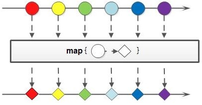

如果需要将流中的元素映射到另一个流中，可以使用`map`方法。方法签名：

```java
<R> Stream<R> map(Function<? super T, ? extends R> mapper);
```

该接口需要一个`Function`函数式接口参数，可以将当前流中的T类型数据转换为另一种R类型的流。

Stream流中的`map`方法基本使用的代码如下：

```java
    @Test
    public void testMap() {
        Stream<String> original = Stream.of("11", "22", "33");
        Stream<Integer> result = original.map(Integer::parseInt);
        result.forEach(s -> System.out.println(s + 10));
    }
```

**运行结果**

```verilog
21
32
43
```

这段代码中，`map`方法的参数通过方法引用，将字符串类型转换成为了int类型（并自动装箱为 Integer 类对象）。

#### 6.4.7 Stream流的sorted方法

如果需要将数据排序，可以使用`sorted`方法。方法签名：

```java
Stream<T> sorted();
Stream<T> sorted(Comparator<? super T> comparator);
```

##### 6.4.7.1 基本使用

`Stream`流中的`sorted`方法基本使用的代码如下：

```java
    @Test
    public void testSorted() {
        // sorted(): 根据元素的自然顺序排序
        // sorted(Comparator<? super T> comparator): 根据比较器指定的规则排序
        // 升序排列
        System.out.println("升序排列");
        Stream.of(33, 22, 11, 55)
                .sorted()
                .forEach(System.out::println);

        // 降序排列
        System.out.println("\n降序排列");
        Stream.of(33, 22, 11, 55)
                .sorted((o1, o2) -> o2 - o1)
                .forEach(System.out::println);
    }
```

> 这段代码中，`sorted`方法根据元素的自然顺序排序，也可以指定比较器排序。

**运行结果**

```verilog
升序排列
11
22
33
55

降序排列
55
33
22
11
```

#### 6.4.8 Stream流的distinct方法

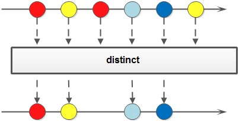

如果需要去除重复数据，可以使用`distinct`方法。方法签名：

```java
Stream<T> distinct();
```


##### 6.4.8.1 基本使用

Stream流中的`distinct`方法基本使用的代码如：

```java
    @Test
    public void testDistinct() {
        Stream.of(22, 33, 22, 11, 33)
                // 去重
                .distinct()
                // 升序排列
                .sorted()
                // 打印
                .forEach(System.out::println);
    }

```


如果是自定义类型如何是否也能去除重复的数据呢？

```java
    @Data
    @AllArgsConstructor
    @NoArgsConstructor
    public class Person {
        private String name;
        private Integer age;
        private String address;

        public Person(String name, Integer age) {
            this.name = name;
            this.age = age;
        }
    }

    @Test
    public void testDistinct2() {
        Stream.of(new Person("刘德华", 58),
                        new Person("张学友", 56),
                        new Person("张学友", 56),
                        new Person("黎明", 52))
                .distinct()
                // 按年龄升序进行排序
                .sorted(Comparator.comparingInt(Person::getAge))
                .forEach(System.out::println);
    }

```

> 自定义类型是根据对象的hashCode和equals来去除重复元素的。

**运行结果**

```verilog
MethodReferenceTest.Person(name=黎明, age=52, address=null)
MethodReferenceTest.Person(name=张学友, age=56, address=null)
MethodReferenceTest.Person(name=刘德华, age=58, address=null)
```


#### 6.4.9 Stream流的match方法

如果需要判断数据是否匹配指定的条件，可以使用`Match`相关方法。方法签名：

```java
boolean allMatch(Predicate<? super T> predicate);
boolean anyMatch(Predicate<? super T> predicate);
boolean noneMatch(Predicate<? super T> predicate);
```


##### 6.4.9.1 基本使用

Stream流中的`Match`相关方法基本使用的代码如：

```java
    @Test
    public void testMatch() {
        System.out.println(Stream.of(5, 3, 6, 1).allMatch(ele -> ele > 3)); // allMatch: 元素是否全部满足条件
        System.out.println(Stream.of(5, 3, 6, 1).anyMatch(ele -> ele > 5)); // allMatch: 元素是否任意有一个满足条件
        System.out.println(Stream.of(5, 3, 6, 1).noneMatch(ele -> ele < 2)); // allMatch: 素是否全部不满足条件
    }
```

**运行结果**

```java
false
true
false
```


#### 6.4.10 Stream流的find方法

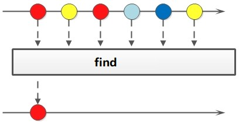

如果需要找到某些数据，可以使用`find`相关方法。方法签名：

```java
Optional<T> findFirst();
Optional<T> findAny();
```


##### 6.4.10.1 基本使用

Stream流中的`find`相关方法基本使用的代码如：

```java
    @Test
    public void testFind() {
        Optional<Integer> first = Stream.of(5, 3, 6, 1).findFirst();
        System.out.println("first = " + first.get());
        Optional<Integer> any = Stream.of(5, 3, 6, 1).findAny();
        System.out.println("any = " + any.get());
    }
```

**运行结果**

```verilog
first = 5
any = 5
```


#### 6.4.11 Stream流的max和min方法

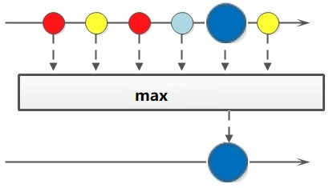

如果需要获取最大和最小值，可以使用`max`和`min`方法。方法签名：

```java
Optional<T> max(Comparator<? super T> comparator);
Optional<T> min(Comparator<? super T> comparator);
```


##### 6.4.11.1 基本使用

Stream流中的`max`和`min`相关方法基本使用的代码如下：

```java
    @Test
    public void testMax_Min() {
        Optional<Integer> max = Stream.of(5, 3, 6, 1).max(Comparator.comparingInt(o -> o));
        System.out.println("max = " + max.get());
        Optional<Integer> min = Stream.of(5, 3, 6, 1).min(Comparator.comparingInt(o -> o));
        System.out.println("min = " + min.get());
    }
```

**运行结果**

```verilog
max = 6
min = 1
```


#### 6.4.12 Stream流的reduce方法


如果需要将所有数据归纳得到一个数据，可以使用`reduce`方法。方法签名：

```java
T reduce(T identity, BinaryOperator<T> accumulator);
```


##### 6.4.12.1 基本使用

Stream流中的 reduce 相关方法基本使用的代码如：

```java
    @Test
    public void testReduce() {
        // reduce:
        // 第一次将默认做赋值给x, 取出第一个元素赋值给y,进行操作
        // 第二次,将第一次的结果赋值给x, 取出二个元素赋值给y,进行操作
        // 第三次,将第二次的结果赋值给x, 取出三个元素赋值给y,进行操作
        // 第四次,将第三次的结果赋值给x, 取出四个元素赋值给y,进行操作
        // 常规操作
        Integer totalValue1 = Stream.of(4, 5, 3, 9).reduce(0, (a, b) -> a + b);
        System.out.println("totalValue1 = " + totalValue1);

        // 使用Integer.sum
        Integer totalValue2 = Stream.of(4, 5, 3, 9).reduce(0, (a, b) -> Integer.sum(a, b));
        System.out.println("totalValue2 = " + totalValue2);

        // 使用Integer::sum
        Integer totalValue3 = Stream.of(4, 5, 3, 9).reduce(0, Integer::sum);
        System.out.println("totalValue3 = " + totalValue3);

        // 求最大值
        Integer maxValue = Stream.of(4, 5, 3, 9).reduce(0, (x, y) -> x > y ? x : y);
        System.out.println("maxValue = " + maxValue);
    }
```

**运行结果**

```verilog
totalValue1 = 21
totalValue2 = 21
totalValue3 = 21
maxValue = 9
```


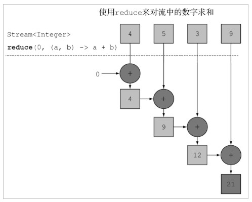


#### 6.4.13 Stream流的map和reduce组合使用

```java
    @Test
    public void testMapReduce() {
        // 求出所有年龄的总和
        int totalAge = Stream.of(
                        new Person("刘德华", 58),
                        new Person("张学友", 56),
                        new Person("郭富城", 54),
                        new Person("黎明", 52))
                .map((p) -> p.getAge())
                .reduce(0, (x, y) -> x + y);
        System.out.println("totalAge = " + totalAge);
        // 找出最大年龄
        int maxAge = Stream.of(
                        new Person("刘德华", 58),
                        new Person("张学友", 56),
                        new Person("郭富城", 54),
                        new Person("黎明", 52))
                .map((p) -> p.getAge())
                .reduce(0, (x, y) -> x > y ? x : y);
        System.out.println("maxAge = " + maxAge);
        // 统计 数字2 出现的次数
        int count = Stream.of(1, 2, 2, 1, 3, 2)
                        .map(integer -> {
                            if (integer == 2) {
                                return 1;
                            } else {
                                return 0;
                            }
                        }).reduce(0, Integer::sum);
        System.out.println("count = " + count);
    }
```


#### 6.4.14 Stream流的mapToInt

如果需要将`Stream`中的`Integer`类型数据转成`int`类型，可以使用`mapToInt`方法。方法签名：

```java
IntStream mapToInt(ToIntFunction<? super T> mapper);
```


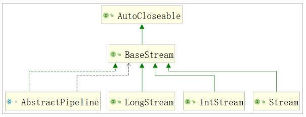

##### 6.4.14.1 基本使用

Stream流中的`mapToInt`相关方法基本使用的代码如下：

```java
   @Test
    public void test1() {
        // Integer占用的内存比int多,在Stream流操作中会自动装箱和拆箱
        Stream<Integer> stream = Arrays.stream(new Integer[]{1, 2, 3, 4, 5});
        // 把大于3的和打印出来
        // Integer result = stream
        // .filter(i -> i.intValue() > 3)
        // .reduce(0, Integer::sum);
        // System.out.println(result);
        // 先将流中的Integer数据转成int,后续都是操作int类型
        IntStream intStream = stream.mapToInt(Integer::intValue);
        int reduce = intStream
                .filter(i -> i > 3)
                .reduce(0, Integer::sum);
        System.out.println(reduce);
        // 将IntStream转化为Stream<Integer>
        IntStream intStream1 = IntStream.rangeClosed(1, 10);
        Stream<Integer> boxed = intStream1.boxed();
        boxed.forEach(s -> System.out.println(s.getClass() + ", " + s));
    }
```

**运行结果**

```verilog
9
class java.lang.Integer, 1
class java.lang.Integer, 2
class java.lang.Integer, 3
class java.lang.Integer, 4
class java.lang.Integer, 5
class java.lang.Integer, 6
class java.lang.Integer, 7
class java.lang.Integer, 8
class java.lang.Integer, 9
class java.lang.Integer, 10
```


#### 6.4.15 Stream流的concat方法

如果有两个流，希望合并成为一个流，那么可以使用`Stream`接口的静态方法`concat`：

```java
static <T> Stream<T> concat(Stream<? extends T> a, Stream<? extends T> b)
```

> 备注：这是一个静态方法，与`java.lang.String`当中的`concat`方法是不同的。

该方法的基本使用代码如下：

```java
    @Test
    public void testContact2() {
        List<Integer> list1 = new ArrayList<>(Arrays.asList(
                1, 3, 5, 7, 9
        ));

        List<Integer> list2 = new ArrayList<>(Arrays.asList(
                2, 4, 6, 8, 10
        ));

        Stream<Integer> stream1 = list1.stream();
        Stream<Integer> stream2 = list2.stream();
        Stream<Integer> stream = Stream.concat(stream1, stream2);
        stream.sorted().forEach(System.out::print);
    }
```

**运行结果**

```java
12345678910
```


### 6.5 综合案例

现在有两个 ArrayList 集合存储队伍当中的多个成员姓名，要求使用传统的for循环（或增强for循环）**依次**进行以下 若干操作步骤：

1、 第一个队伍只要名字为3个字的成员姓名；

2、第一个队伍筛选之后只要前3个人；

3、第二个队伍只要姓张的成员姓名；

4、第二个队伍筛选之后不要前2个人；

5、将两个队伍合并为一个队伍；

6、根据姓名创建 Person 对象；

7、打印整个队伍的Person对象信息。


两个队伍（集合）的代码如下：

```java
package cn.lyf.lambda.demo5.a03;

import java.util.ArrayList;
import java.util.Arrays;
import java.util.List;

@Slf4j
public class DemoArrayListNames {
    public static void main(String[] args) {
        List<String> one = new ArrayList<>(Arrays.asList(
                "迪丽热巴", "宋远桥", "苏星河", "老子", "庄子", "孙子", "洪七公", "刘德华"));
        List<String> two = new ArrayList<>(Arrays.asList(
                "古力娜扎", "张无忌", "张三丰", "赵丽颖", "张二狗", "张天爱", "张三"));
    }
}

```


而 Person 类的代码为：

```java

    @Data
    @AllArgsConstructor
    @NoArgsConstructor
    private static class Person {
        private String name;
    }
```


#### 6.5.1 传统方式

使用for循环 , 示例代码:

```java
package cn.lyf.lambda.demo5.a03;

import lombok.AllArgsConstructor;
import lombok.Data;
import lombok.NoArgsConstructor;
import lombok.extern.slf4j.Slf4j;

import java.util.ArrayList;
import java.util.Arrays;
import java.util.List;

@Slf4j
public class DemoArrayListNames {
    /**
     * 现在有两个 ArrayList 集合存储队伍当中的多个成员姓名，要求使用传统的for循环（或增强for循环）
     * **依次**进行以下 若干操作步骤：
     * <p>
     * 1、 第一个队伍只要名字为3个字的成员姓名；
     * <p>
     * 2、第一个队伍筛选之后只要前3个人；
     * <p>
     * 3、第二个队伍只要姓张的成员姓名；
     * <p>
     * 4、第二个队伍筛选之后不要前2个人；
     * <p>
     * 5、将两个队伍合并为一个队伍；
     * <p>
     * 6、根据姓名创建 Person 对象；
     * <p>
     * 7、打印整个队伍的Person对象信息。
     *
     * @param args
     */
    public static void main(String[] args) {
        List<String> one = new ArrayList<>(Arrays.asList(
                "迪丽热巴", "宋远桥", "苏星河", "老子", "庄子", "孙子", "洪七公", "刘德华"));
        List<String> two = new ArrayList<>(Arrays.asList(
                "古力娜扎", "张无忌", "张三丰", "赵丽颖", "张二狗", "张天爱", "张三"));

        List<String> concatList = new ArrayList<>();

        int count = 0;
        for (String str : one) {
            if (str.length() == 3) {
                if (count == 3) {
                    break;
                }
                concatList.add(str);
                count++;
            }
        }

        count = 0;
        for (String str : two) {
            if (str.startsWith("张")) {
                count++;
                if (count == 1 || count == 2) {
                    continue;
                }
                concatList.add(str);
            }
        }

        for (String str : concatList) {
            System.out.println(new Person(str));
        }
    }

    @Data
    @AllArgsConstructor
    @NoArgsConstructor
    private static class Person {
        private String name;
    }
}

```


运行结果为：

```verilog
DemoArrayListNames.Person(name=宋远桥)
DemoArrayListNames.Person(name=苏星河)
DemoArrayListNames.Person(name=洪七公)
DemoArrayListNames.Person(name=张二狗)
DemoArrayListNames.Person(name=张天爱)
DemoArrayListNames.Person(name=张三)
```


#### 6.5.2 Stream方式

等效的Stream流式处理代码为：

```java
package cn.lyf.lambda.demo5.a03;

import lombok.AllArgsConstructor;
import lombok.Data;
import lombok.NoArgsConstructor;
import lombok.extern.slf4j.Slf4j;

import java.util.ArrayList;
import java.util.Arrays;
import java.util.List;
import java.util.stream.Stream;

@Slf4j
public class DemoArrayListNames2 {

    public static void main(String[] args) {
        List<String> one = new ArrayList<>(Arrays.asList(
                "迪丽热巴", "宋远桥", "苏星河", "老子", "庄子", "孙子", "洪七公", "刘德华"));
        List<String> two = new ArrayList<>(Arrays.asList(
                "古力娜扎", "张无忌", "张三丰", "赵丽颖", "张二狗", "张天爱", "张三"));

        // 第一个队伍只要名字为3个字的成员姓名；
		// 第一个队伍筛选之后只要前3个人；
        Stream<String> stream1 = one.stream().filter(name -> name.length() == 3).limit(3);

        // 第二个队伍只要姓张的成员姓名；
		// 第二个队伍筛选之后不要前2个人；
        Stream<String> stream2 = two.stream().filter(name -> name.startsWith("张")).skip(2);
        
        // 将两个队伍合并为一个队伍；
		// 根据姓名创建Person对象；
		// 打印整个队伍的Person对象信息。
        Stream<String> concatStream = Stream.concat(stream1, stream2);
        concatStream.map(Person::new).forEach(System.out::println);
    }

    @Data
    @AllArgsConstructor
    @NoArgsConstructor
    private static class Person {
        private String name;
    }
}

```


运行效果完全一样：

```verilog
DemoArrayListNames2.Person(name=宋远桥)
DemoArrayListNames2.Person(name=苏星河)
DemoArrayListNames2.Person(name=洪七公)
DemoArrayListNames2.Person(name=张二狗)
DemoArrayListNames2.Person(name=张天爱)
DemoArrayListNames2.Person(name=张三)
```


### 6.6 收集Stream流中的结果

```java
IntStream intStream = Stream.of(1, 2, 3, 4, 5).mapToInt(Integer::intValue);
intStream.filter(n -> n > 3).forEach(System.out::println);
intStream.filter(n -> n > 3).count;
intStream.filter(n -> n > 3).reduce(0, Integer::sum
```

对流操作完成之后，如果需要将流的结果保存到数组或集合中，可以收集流中的数据

#### 6.6.1 目标

1. 掌握Stream流中的结果到集合中
2. 掌握Stream流中的结果到数组中


#### 6.6.2 Stream流中的结果到集合中

Stream流提供`collect`方法，其参数需要一个`java.util.stream.Collector<T, A, R>` 接口对象来指定收集到哪种集合中。`java.util.stream.Collectors`类提供一些方法，可以作为`Collector`接口的实例：

- `public static <T> Collector<T, ?, List<T>> toList()`：转换为 List 集合。

- `public static <T> Collector<T, ?, Set<T>> toSet()` ：转换为 Set 集合。

**下面是这两个方法的基本使用代码**：

```java
    /**
     * 将流中数据收集到集合中
     */
    @Test
    public void testStreamToCollection() {
        Stream<String> stream = Stream.of("aa", "bb", "cc");
        // List<String> list = stream.collect(Collectors.toList());
        // Set<String> set = stream.collect(Collectors.toSet());
        ArrayList<String> arrayList = stream.collect(Collectors.toCollection(ArrayList::new));
        HashSet<String> hashSet = stream.collect(Collectors.toCollection(HashSet::new));
    }
```


#### 6.6.3 Stream流中的结果到数组中

Stream提供`toArray`方法来将结果放到一个数组中，返回值类型是`Object[]`的：

```java
Object[] toArray();
```


其使用场景如：

```java
    /**
     * Stream流中的结果到数组中
     */
    @Test
    public void testStreamToArray() {
        Stream<String> stream1 = Stream.of("aa", "bb", "cc");
        // 转成Object数组
        Object[] objects = stream1.toArray();
        for (Object obj : objects) {
            System.out.println(obj);
        }


        Stream<String> stream2 = Stream.of("aa", "bb", "cc");
        // 转成指定类型数组
        String[] strings = stream2.toArray(String[]::new);
        for (String str : strings) {
            System.out.println(str);
        }
    }
```


#### 6.6.4 对流中数据进行聚合计算

当我们使用Stream流处理数据后，可以像数据库的聚合函数一样对某个字段进行操作。比如获取最大值，获取最小值，求总和，平均值，统计数量。

```java
    @Test
    public void testStreamToOther() {
        List<Student> studentList = new ArrayList<>(Arrays.asList(
                new Student("赵丽颖", 58, 95),
                new Student("杨颖", 56, 88),
                new Student("迪丽热巴", 56, 99),
                new Student("柳岩", 52, 77)
        ));
        // 获取分数最大值
        // System.out.println(studentStream.collect(Collectors.maxBy((o1, o2) -> o1.getScore() - o2.getScore())).get());
        System.out.println(studentList.stream().max(Comparator.comparingInt(Student::getScore)).orElseGet(Student::new));
        // 获取分数最小值
        System.out.println(studentList.stream().min(Comparator.comparingInt(Student::getScore)).orElseGet(Student::new));

        // 求总和
        // System.out.println(studentList.stream().collect(Collectors.summingInt(student -> student.getScore())));
        System.out.println(studentList.stream().mapToInt(Student::getScore).sum());

        // 平均值
        System.out.println(studentList.stream().mapToInt(Student::getScore).average());
        // 统计数量
        // System.out.println(studentList.stream().collect(Collectors.counting()));
        // System.out.println(studentList.stream().count());
        System.out.println(studentList.size());
    }

    @Data
    @AllArgsConstructor
    @NoArgsConstructor
    private static class Student {
        private String name;
        private int age;
        private int score;
    }
```

**运行结果**

```verilog
MethodReferenceTest.Student(name=迪丽热巴, age=56, score=99)
MethodReferenceTest.Student(name=柳岩, age=52, score=77)
359
OptionalDouble[89.75]
4

```


#### 6.6.5 对流中数据进行分组

当我们使用Stream流处理数据后，可以根据某个属性将数据分组：

```java
    // 分组
    @Test
    public void testGroup() {
        Stream<Student> studentStream = Stream.of(
                new Student("赵丽颖", 52, 95),
                new Student("杨颖", 56, 88),
                new Student("迪丽热巴", 56, 55),
                new Student("柳岩", 52, 33));

        // 将分数大于等于60的分为一组,小于60分成另一组
        Map<String, List<Student>> map = studentStream.collect(Collectors.groupingBy(student -> {
            if (student.getScore() >= 60) {
                return "及格";
            }
            return "不及格";
        }));

        map.forEach((key, value) -> System.out.println(key + ":" + value));
    }
```


效果：

```verilog
不及格:[MethodReferenceTest.Student(name=迪丽热巴, age=56, score=55), MethodReferenceTest.Student(name=柳岩, age=52, score=33)]
及格:[MethodReferenceTest.Student(name=赵丽颖, age=52, score=95), MethodReferenceTest.Student(name=杨颖, age=56, score=88)]
```


#### 6.6.6 对流中数据进行多级分组

还可以对数据进行多级分组：

```java
    // 多级分组
    @Test
    public void testCustomGroup() {
        Stream<Student> studentStream = Stream.of(
                new Student("赵丽颖", 52, 95),
                new Student("杨颖", 56, 88),
                new Student("佟丽娅", 38, 76),
                new Student("迪丽热巴", 56, 55),
                new Student("柳岩", 52, 33));

        // 按照年龄进行分组，在年龄分组的情况下，然后再按照分数进行分组
        Map<Integer, Map<String, List<Student>>> map = studentStream.collect(
                Collectors.groupingBy(Student::getAge, Collectors.groupingBy(student -> {
                    if (student.getScore() >= 90) {
                        return "优秀";
                    } else if (student.getScore() >= 80) {
                        return "良好";
                    } else if (student.getScore() >= 60) {
                        return "及格";
                    } else {
                        return "不及格";
                    }
                })));

        map.forEach((key, value) -> System.out.println(key + ":" + value));
    }
```

效果：

```verilog
52:{不及格=[MethodReferenceTest.Student(name=柳岩, age=52, score=33)], 优秀=[MethodReferenceTest.Student(name=赵丽颖, age=52, score=95)]}
38:{及格=[MethodReferenceTest.Student(name=佟丽娅, age=38, score=76)]}
56:{不及格=[MethodReferenceTest.Student(name=迪丽热巴, age=56, score=55)], 良好=[MethodReferenceTest.Student(name=杨颖, age=56, score=88)]}

```


#### 6.6.7 对流中数据进行分区

`Collectors.partitioningBy`会根据值是否为true，把集合分割为两个列表，一个true列表，一个false列表。

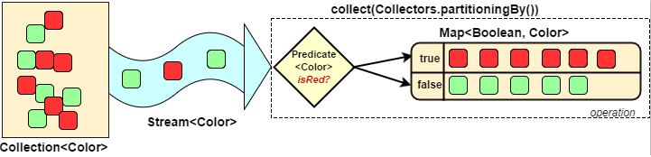

```java
    // 分区
    @Test
    public void testPartition() {
        Stream<Student> studentStream = Stream.of(
                new Student("赵丽颖", 52, 95),
                new Student("杨颖", 56, 88),
                new Student("迪丽热巴", 56, 99),
                new Student("柳岩", 52, 77));

        Map<Boolean, List<Student>> map = studentStream.collect(
                Collectors.partitioningBy(student -> student.getScore() >= 90));

        map.forEach((key, value) -> System.out.println(key + ":" + value));
    }
```


效果：

```verilog
false:[MethodReferenceTest.Student(name=杨颖, age=56, score=88), MethodReferenceTest.Student(name=柳岩, age=52, score=77)]
true:[MethodReferenceTest.Student(name=赵丽颖, age=52, score=95), MethodReferenceTest.Student(name=迪丽热巴, age=56, score=99)]

```


#### 6.6.8 对流中数据进行拼接

`Collectors.joining`会根据指定的连接符，将所有元素连接成一个字符串。

```java
    // 拼接
    @Test
    public void testJoining() {
        Stream<Student> studentStream = Stream.of(
                new Student("赵丽颖", 52, 95),
                new Student("杨颖", 56, 88),
                new Student("迪丽热巴", 56, 99),
                new Student("柳岩", 52, 77));

        System.out.println(studentStream.map(Student::getName).collect(
                Collectors.joining(",", "[", "]")));
    }
```


效果：

```verilog
[赵丽颖,杨颖,迪丽热巴,柳岩]
```


#### 6.6.9 小结

- **收集Stream流中的结果**

  - 到集合中: 
    - `Collectors.toList()`
    - `Collectors.toSet()`
    - `Collectors.toCollection()`

  - 到数组中: `toArray()`
    - `toArray(String[]::new)`

- **聚合计算:**

  - 最大值：`Collectors.maxBy`
  - 最小值：`Collectors.minBy`
  - 求和：`Collectors.summingInt`
  - 平均值：`Collectors.averagingInt`
  - 统计数量：`Collectors.counting`

  - 分组: 
    - 普通分组：`Collectors.groupingBy`
    - 多级分组: `Collectors.groupingBy(Student::getAge, Collectors.groupingBy(Student::get))`
  - 分区: `Collectors.partitionBy` 
  - 拼接: `Collectors.joinging`

### 6.7 并行的Stream流

#### 6.7.1 目标

1. 了解串行的Stream流
2. 掌握获取并行Stream流的两种方式

#### 6.7.2 串行的Stream流

目前我们使用的Stream流是串行的，就是在一个线程上执行。

```java
    @Test
    public void test0Serial() {
        long count = Stream.of(4, 5, 3, 9, 1, 2, 6)
                .filter(s -> {
                    System.out.println(Thread.currentThread() + ", s = " + s);
                    return true;
                })
                .count();
        System.out.println("count = " + count);
    }
```


效果：

```java
Thread[main,5,main], s = 4
Thread[main,5,main], s = 5
Thread[main,5,main], s = 3
Thread[main,5,main], s = 9
Thread[main,5,main], s = 1
Thread[main,5,main], s = 2
Thread[main,5,main], s = 6
count = 7

```


#### 6.7.3 并行的Stream流

parallelStream其实就是一个并行执行的流。它通过默认的ForkJoinPool，可能提高多线程任务的速度。

##### 6.7.3.1 获取并行Stream流的两种方式

1、直接获取并行的流

2、将串行流转成并行流

```java
    @Test
    public void testgetParallelStream() {
        List<String> list = new ArrayList<>(Arrays.asList(
                "zhangsan",
                "lisi",
                "wangwu",
                "zhaoliu"
        ));
        // 直接获取并行的流
        Stream<String> parallelStream1 = list.parallelStream();
        // 将串行流转成并行流
        Stream<String> parallelStream2 = list.stream().parallel();
    }
```


并行操作代码：

```java
    @Test
    public void test0Parallel() {
        long count = Stream.of(4, 5, 3, 9, 1, 2, 6).parallel().filter(integer -> {
            System.out.println(Thread.currentThread() + ", integer= " + integer);
            return integer > 0;
        }).count();

        System.out.println("count = "  + count);
    }
```


效果：

```verilog
Thread[ForkJoinPool.commonPool-worker-1,5,main], integer= 5
Thread[ForkJoinPool.commonPool-worker-3,5,main], integer= 4
Thread[main,5,main], integer= 1
Thread[ForkJoinPool.commonPool-worker-1,5,main], integer= 3
Thread[ForkJoinPool.commonPool-worker-2,5,main], integer= 6
Thread[main,5,main], integer= 9
Thread[ForkJoinPool.commonPool-worker-3,5,main], integer= 2
count = 7
```


##### 6.7.3.2 小结

**获取并行流有两种方式:** 

- 直接获取并行流: `parallelStream()`

- 将串行流转成并行流: `parallel()`

### 6.8 并行和串行Stream流的效率对比 目标

使用for循环，串行Stream流，并行Stream流来对10亿个数字求和。看消耗的时间。

```java
package cn.lyf.lambda.test04.a02;

import lombok.extern.slf4j.Slf4j;
import org.junit.jupiter.api.Test;

import java.util.stream.LongStream;


@Slf4j
public class ParallelStreamTest {
    @Test
    public void testCostTime() {
        final long size = 1000_000_000;
        // 并行流计算
        calcTime(() -> {
            long result = LongStream.rangeClosed(0, size).parallel().reduce(0, Long::sum);
            System.out.println("result: " + result);
        }, "并行流计算");

        // 串行流计算
        calcTime(() -> {
            long result = LongStream.rangeClosed(0, size).reduce(0, Long::sum);
            System.out.println("result: " + result);
        }, "串行流计算");

        // 普通for循环计算
        calcTime(() -> {
            long result = 0;
            for (long i = 1; i <= size; i++) {
                result += i;
            }
            System.out.println("result: " + result);
        }, "普通for循环计算");
    }

    public void calcTime(CalcFunction calcFunction, String message) {
        System.out.println(message);
        long startTime = System.currentTimeMillis();
        calcFunction.accept();
        long endTime = System.currentTimeMillis();
        System.out.println("花费时间: " + (endTime - startTime) + "\n");
    }

    @FunctionalInterface
    public interface CalcFunction {
        void accept();
    }
}

```


我们可以看到parallelStream的效率是最高的。

```verilog
并行流计算
result: 500000000500000000
花费时间: 150

串行流计算
result: 500000000500000000
花费时间: 1423

普通for循环计算
result: 500000000500000000
花费时间: 266
```


Stream并行处理的过程会分而治之，也就是将一个大任务切分成多个小任务，这表示每个任务都是一个操作。

### 6.9 parallelStream线程安全问题

#### 6.9.1 目标

- 解决parallelStream线程安全问题

```java
     /**
     * 并行流的线程不安全测试
     */
    @Test
    public void testParallelStreamNotice() {
        for (int j = 0; j < 10; j++) {
            final int size = 10000;
            List<Integer> list = new ArrayList<>();
            // 普通For循环添加元素
            for (int i = 0; i < size; i++) {
                list.add(i);
            }

            System.out.println("普通For循环添加后的集合大小: " + list.size());


            List<Integer> newList = new ArrayList<>();
            // 使用并行的流往集合中添加数据
            list.parallelStream()
                    .forEach(s -> {
                        newList.add(s);
                    });
            System.out.println("使用并行流添加后的集合大小" + newList.size());
        }
    }
```


运行效果：

```verilog
普通For循环添加后的集合大小: 10000
使用并行流添加后的集合大小5460
普通For循环添加后的集合大小: 10000
使用并行流添加后的集合大小7406
普通For循环添加后的集合大小: 10000
使用并行流添加后的集合大小6461
普通For循环添加后的集合大小: 10000
使用并行流添加后的集合大小4153
普通For循环添加后的集合大小: 10000
使用并行流添加后的集合大小3494
普通For循环添加后的集合大小: 10000

java.lang.ArrayIndexOutOfBoundsException: 2851

	at java.util.ArrayList.add(ArrayList.java:459)
	at cn.lyf.lambda.test04.a02.ParallelStreamTest.lambda$testParallelStreamNotice$3(ParallelStreamTest.java:78)
	at java.util.stream.ForEachOps$ForEachOp$OfRef.accept(ForEachOps.java:184)
	at java.util.ArrayList$ArrayListSpliterator.forEachRemaining(ArrayList.java:1374)
	at java.util.stream.AbstractPipeline.copyInto(AbstractPipeline.java:481)
	at java.util.stream.ForEachOps$ForEachTask.compute(ForEachOps.java:291)
	at java.util.concurrent.CountedCompleter.exec(CountedCompleter.java:731)
	at java.util.concurrent.ForkJoinTask.doExec(ForkJoinTask.java:289)
	at java.util.concurrent.ForkJoinPool.helpComplete(ForkJoinPool.java:1870)
	at java.util.concurrent.ForkJoinPool.externalHelpComplete(ForkJoinPool.java:2467)
	at java.util.concurrent.ForkJoinTask.externalAwaitDone(ForkJoinTask.java:324)
	at java.util.concurrent.ForkJoinTask.doInvoke(ForkJoinTask.java:405)
	at java.util.concurrent.ForkJoinTask.invoke(ForkJoinTask.java:734)
	at java.util.stream.ForEachOps$ForEachOp.evaluateParallel(ForEachOps.java:160)
	at java.util.stream.ForEachOps$ForEachOp$OfRef.evaluateParallel(ForEachOps.java:174)
	at java.util.stream.AbstractPipeline.evaluate(AbstractPipeline.java:233)
	at java.util.stream.ReferencePipeline.forEach(ReferencePipeline.java:418)
	at java.util.stream.ReferencePipeline$Head.forEach(ReferencePipeline.java:583)
	at cn.lyf.lambda.test04.a02.ParallelStreamTest.testParallelStreamNotice(ParallelStreamTest.java:77)
	at sun.reflect.NativeMethodAccessorImpl.invoke0(Native Method)
	at sun.reflect.NativeMethodAccessorImpl.invoke(NativeMethodAccessorImpl.java:62)
	at sun.reflect.DelegatingMethodAccessorImpl.invoke(DelegatingMethodAccessorImpl.java:43)
	at java.lang.reflect.Method.invoke(Method.java:498)
	at org.junit.platform.commons.util.ReflectionUtils.invokeMethod(ReflectionUtils.java:725)
	at org.junit.jupiter.engine.execution.MethodInvocation.proceed(MethodInvocation.java:60)
	at org.junit.jupiter.engine.execution.InvocationInterceptorChain$ValidatingInvocation.proceed(InvocationInterceptorChain.java:131)
	at org.junit.jupiter.engine.extension.TimeoutExtension.intercept(TimeoutExtension.java:149)
	at org.junit.jupiter.engine.extension.TimeoutExtension.interceptTestableMethod(TimeoutExtension.java:140)
	at org.junit.jupiter.engine.extension.TimeoutExtension.interceptTestMethod(TimeoutExtension.java:84)
	at org.junit.jupiter.engine.execution.ExecutableInvoker$ReflectiveInterceptorCall.lambda$ofVoidMethod$0(ExecutableInvoker.java:115)
	at org.junit.jupiter.engine.execution.ExecutableInvoker.lambda$invoke$0(ExecutableInvoker.java:105)
	at org.junit.jupiter.engine.execution.InvocationInterceptorChain$InterceptedInvocation.proceed(InvocationInterceptorChain.java:106)
	at org.junit.jupiter.engine.execution.InvocationInterceptorChain.proceed(InvocationInterceptorChain.java:64)
	at org.junit.jupiter.engine.execution.InvocationInterceptorChain.chainAndInvoke(InvocationInterceptorChain.java:45)
	at org.junit.jupiter.engine.execution.InvocationInterceptorChain.invoke(InvocationInterceptorChain.java:37)
	at org.junit.jupiter.engine.execution.ExecutableInvoker.invoke(ExecutableInvoker.java:104)
	at org.junit.jupiter.engine.execution.ExecutableInvoker.invoke(ExecutableInvoker.java:98)
	at org.junit.jupiter.engine.descriptor.TestMethodTestDescriptor.lambda$invokeTestMethod$7(TestMethodTestDescriptor.java:214)
	at org.junit.platform.engine.support.hierarchical.ThrowableCollector.execute(ThrowableCollector.java:73)
	at org.junit.jupiter.engine.descriptor.TestMethodTestDescriptor.invokeTestMethod(TestMethodTestDescriptor.java:210)
	at org.junit.jupiter.engine.descriptor.TestMethodTestDescriptor.execute(TestMethodTestDescriptor.java:135)
	at org.junit.jupiter.engine.descriptor.TestMethodTestDescriptor.execute(TestMethodTestDescriptor.java:66)
	at org.junit.platform.engine.support.hierarchical.NodeTestTask.lambda$executeRecursively$6(NodeTestTask.java:151)
	at org.junit.platform.engine.support.hierarchical.ThrowableCollector.execute(ThrowableCollector.java:73)
	at org.junit.platform.engine.support.hierarchical.NodeTestTask.lambda$executeRecursively$8(NodeTestTask.java:141)
	at org.junit.platform.engine.support.hierarchical.Node.around(Node.java:137)
	at org.junit.platform.engine.support.hierarchical.NodeTestTask.lambda$executeRecursively$9(NodeTestTask.java:139)
	at org.junit.platform.engine.support.hierarchical.ThrowableCollector.execute(ThrowableCollector.java:73)
	at org.junit.platform.engine.support.hierarchical.NodeTestTask.executeRecursively(NodeTestTask.java:138)
	at org.junit.platform.engine.support.hierarchical.NodeTestTask.execute(NodeTestTask.java:95)
	at java.util.ArrayList.forEach(ArrayList.java:1249)
	at org.junit.platform.engine.support.hierarchical.SameThreadHierarchicalTestExecutorService.invokeAll(SameThreadHierarchicalTestExecutorService.java:41)
	at org.junit.platform.engine.support.hierarchical.NodeTestTask.lambda$executeRecursively$6(NodeTestTask.java:155)
	at org.junit.platform.engine.support.hierarchical.ThrowableCollector.execute(ThrowableCollector.java:73)
	at org.junit.platform.engine.support.hierarchical.NodeTestTask.lambda$executeRecursively$8(NodeTestTask.java:141)
	at org.junit.platform.engine.support.hierarchical.Node.around(Node.java:137)
	at org.junit.platform.engine.support.hierarchical.NodeTestTask.lambda$executeRecursively$9(NodeTestTask.java:139)
	at org.junit.platform.engine.support.hierarchical.ThrowableCollector.execute(ThrowableCollector.java:73)
	at org.junit.platform.engine.support.hierarchical.NodeTestTask.executeRecursively(NodeTestTask.java:138)
	at org.junit.platform.engine.support.hierarchical.NodeTestTask.execute(NodeTestTask.java:95)
	at java.util.ArrayList.forEach(ArrayList.java:1249)
	at org.junit.platform.engine.support.hierarchical.SameThreadHierarchicalTestExecutorService.invokeAll(SameThreadHierarchicalTestExecutorService.java:41)
	at org.junit.platform.engine.support.hierarchical.NodeTestTask.lambda$executeRecursively$6(NodeTestTask.java:155)
	at org.junit.platform.engine.support.hierarchical.ThrowableCollector.execute(ThrowableCollector.java:73)
	at org.junit.platform.engine.support.hierarchical.NodeTestTask.lambda$executeRecursively$8(NodeTestTask.java:141)
	at org.junit.platform.engine.support.hierarchical.Node.around(Node.java:137)
	at org.junit.platform.engine.support.hierarchical.NodeTestTask.lambda$executeRecursively$9(NodeTestTask.java:139)
	at org.junit.platform.engine.support.hierarchical.ThrowableCollector.execute(ThrowableCollector.java:73)
	at org.junit.platform.engine.support.hierarchical.NodeTestTask.executeRecursively(NodeTestTask.java:138)
	at org.junit.platform.engine.support.hierarchical.NodeTestTask.execute(NodeTestTask.java:95)
	at org.junit.platform.engine.support.hierarchical.SameThreadHierarchicalTestExecutorService.submit(SameThreadHierarchicalTestExecutorService.java:35)
	at org.junit.platform.engine.support.hierarchical.HierarchicalTestExecutor.execute(HierarchicalTestExecutor.java:57)
	at org.junit.platform.engine.support.hierarchical.HierarchicalTestEngine.execute(HierarchicalTestEngine.java:54)
	at org.junit.platform.launcher.core.EngineExecutionOrchestrator.execute(EngineExecutionOrchestrator.java:107)
	at org.junit.platform.launcher.core.EngineExecutionOrchestrator.execute(EngineExecutionOrchestrator.java:88)
	at org.junit.platform.launcher.core.EngineExecutionOrchestrator.lambda$execute$0(EngineExecutionOrchestrator.java:54)
	at org.junit.platform.launcher.core.EngineExecutionOrchestrator.withInterceptedStreams(EngineExecutionOrchestrator.java:67)
	at org.junit.platform.launcher.core.EngineExecutionOrchestrator.execute(EngineExecutionOrchestrator.java:52)
	at org.junit.platform.launcher.core.DefaultLauncher.execute(DefaultLauncher.java:114)
	at org.junit.platform.launcher.core.DefaultLauncher.execute(DefaultLauncher.java:86)
	at org.junit.platform.launcher.core.DefaultLauncherSession$DelegatingLauncher.execute(DefaultLauncherSession.java:86)
	at org.junit.platform.launcher.core.SessionPerRequestLauncher.execute(SessionPerRequestLauncher.java:53)
	at com.intellij.junit5.JUnit5IdeaTestRunner.startRunnerWithArgs(JUnit5IdeaTestRunner.java:71)
	at com.intellij.rt.junit.IdeaTestRunner$Repeater.startRunnerWithArgs(IdeaTestRunner.java:33)
	at com.intellij.rt.junit.JUnitStarter.prepareStreamsAndStart(JUnitStarter.java:235)
	at com.intellij.rt.junit.JUnitStarter.main(JUnitStarter.java:54)
```


我们明明是往集合中添加10000个元素，而实际上只有远远没有达到10000，还抛出了异常。

**解决方法：** 

- 加锁
- 使用线程安全的集合
- 调用Stream的 `toArray()/collect()` 操作就是满足线程安全的了。

**代码验证**

```java
    @FunctionalInterface
    public interface ParallelStreamTestFunction<T, R> {
        void accept(T t, R r);
    }

    private void parallelStreamBase(ParallelStreamTestFunction<List<Integer>, List<Integer>> stream,
                                    List<Integer> newList) {
        final int size = 10000;
        List<Integer> list = new ArrayList<>();
        // 普通For循环添加元素
        for (int i = 0; i < size; i++) {
            list.add(i);
        }

        System.out.println("普通For循环添加后的集合大小: " + list.size());
        stream.accept(list, newList);
        System.out.println("使用并行流添加后的集合大小" + newList.size());
    }

    /**
     * 并行流的线程不安全测试
     */
    @Test
    public void testParallelStreamNotice() {
        parallelStreamBase((list, newList) -> {
            // 使用并行的流往集合中添加数据
            list.parallelStream()
                    .forEach(newList::add);
        }, new ArrayList<>());
    }


    /**
     * 使用锁解决线程安全问题
     */
    @Test
    public void testParallelStreamNoticeAndSolveBySynchronized() {
        parallelStreamBase((list, newList) -> {
            // 使用并行的流往集合中添加数据
            list.parallelStream()
                    .forEach(integerEle -> {
                        synchronized (newList) {
                            newList.add(integerEle);
                        }
                    });
        }, new ArrayList<>());
    }

    /**
     * 使用线程安全的集合解决线程安全问题
     */
    @Test
    public void testParallelStreamNoticeAndSolveByCopyOnArrayList() {
        parallelStreamBase((list, newList) -> {
            // 使用并行的流往集合中添加数据
            list.parallelStream()
                    .forEach(newList::add);
        }, new CopyOnWriteArrayList<>());
    }

    /**
     * 使用线程安全的集合解决线程安全问题
     */
    @Test
    public void testParallelStreamNoticeAndSolveByToArray() {
        parallelStreamBase((list, newList) -> {
            // 使用并行的流往集合中添加数据
            Integer[] array = list.parallelStream()
                    .toArray(Integer[]::new);
            newList.addAll(Arrays.asList(array));
        }, new ArrayList<>());
    }

    /**
     * 使用线程安全的集合解决线程安全问题
     */
    @Test
    public void testParallelStreamNoticeAndSolveByToList() {
        parallelStreamBase((list, newList) -> {
            // 使用并行的流往集合中添加数据
            newList.addAll(list.parallelStream()
                    .collect(Collectors.toList()));
        }, new ArrayList<>());
    }

```


### 6.10 parallelStream背后的技术

#### 6.10.1 目标

- 介绍`Fork/Join`框架
- 了解`Fork/Join`原理

#### 6.10.2 `Fork/Join`框架介绍

parallelStream使用的是`Fork/Join`框架。`Fork/Join`框架自JDK 7引入。`Fork/Join`框架可以将一个大任务拆分为很多小任务来异步执行。 `Fork/Join`框架主要包含三个模块：

1.  线程池：`ForkJoinPool`

2.  任务对象：`ForkJoinTask`

3.  执行任务的线程：`ForkJoinWorkerThread`

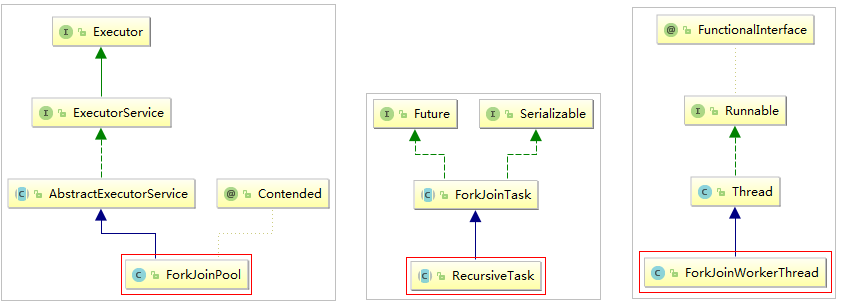

#### 6.10.3 `Fork/Join`原理-分治法


`ForkJoinPool`主要用来使用分治法(`Divide-and-Conquer Algorithm`)来解决问题。典型的应用比如快速排序算法， ForkJoinPool需要使用相对少的线程来处理大量的任务。比如要对`1000`万个数据进行排序，那么会将这个任务分割成 两个`500`万的排序任务和一个针对这两组`500`万数据的合并任务。以此类推，对于`500`万的数据也会做出同样的分割处理，到最后会设置一个阈值来规定当数据规模到多少时，停止这样的分割处理。比如，当元素的数量小于`10`时，会停止分割，转而使用插入排序对它们进行排序。那么到最后，所有的任务加起来会有大概`2000000+`个。问题的关键在于，对于一个任务而言，只有当它所有的子任务完成之后，它才能够被执行。

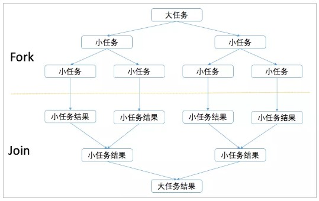

#### 6.10.4 Fork/Join原理-工作窃取算法

`Fork/Join`最核心的地方就是利用了现代硬件设备多核，在一个操作时候会有空闲的cpu，那么如何利用好这个空闲的`cpu`就成了提高性能的关键，而这里我们要提到的工作窃取（`work-stealing`）算法就是整个`Fork/Join`框架的核心理念 `Fork/Join`工作窃取（`work-stealing`）算法是指某个线程从其他队列里窃取任务来执行。

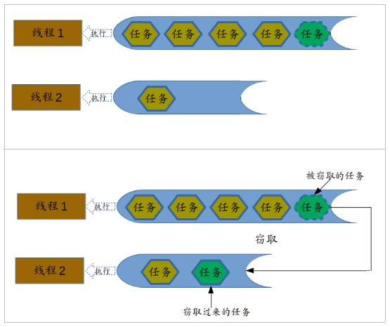

​	那么为什么需要使用工作窃取算法呢？假如我们需要做一个比较大的任务，我们可以把这个任务分割为若干互不依赖的子任务，为了减少线程间的竞争，于是把这些子任务分别放到不同的队列里，并为每个队列创建一个单独的线程来 执行队列里的任务，线程和队列一一对应，比如A线程负责处理A队列里的任务。但是有的线程会先把自己队列里的任务干完，而其他线程对应的队列里还有任务等待处理。干完活的线程与其等着，不如去帮其他线程干活，于是它就去其他线程的队列里窃取一个任务来执行。而在这时它们会访问同一个队列，所以为了减少窃取任务线程和被窃取任务线程之间的竞争，通常会使用双端队列，被窃取任务线程永远从双端队列的头部拿任务执行，而窃取任务的线程永远从双端队列的尾部拿任务执行。

​	工作窃取算法的优点是充分利用线程进行并行计算，并减少了线程间的竞争，其缺点是在某些情况下还是存在竞争， 比如双端队列里只有一个任务时。并且消耗了更多的系统资源，比如创建多个线程和多个双端队列。

​	上文中已经提到了在Java 8引入了自动并行化的概念。它能够让一部分Java代码自动地以并行的方式执行，也就是我 们使用了ForkJoinPool的ParallelStream。

​	对于ForkJoinPool通用线程池的线程数量，通常使用默认值就可以了，即运行时计算机的处理器数量。可以通过设置系统属性：`java.util.concurrent.ForkJoinPool.common.parallelism=N` （N为线程数量），来调整ForkJoinPool的线 程数量，可以尝试调整成不同的参数来观察每次的输出结果。

#### 6.10.5 小结1

1. 介绍了`Fork/Join`框架,他是JDK7推出的一套新的线程框架
2. `Fork/Join`框架-分治法，工作窃取算法


#### 6.10.6 Fork/Join案例

需求：使用`Fork/Join`计算`1-10000`的和，当一个任务的计算数量大于`3000`时拆分任务，数量小于`3000`时计算。

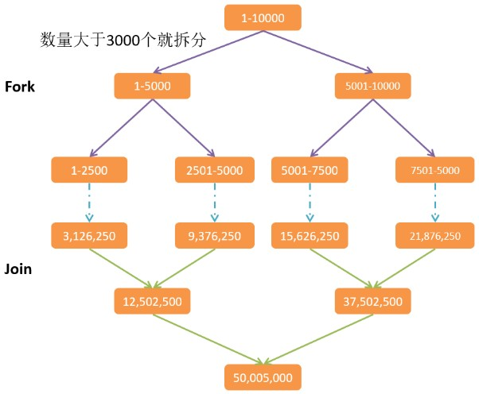

```java
package cn.lyf.lambda.demo5.a04;

import lombok.Getter;
import lombok.Setter;
import lombok.extern.slf4j.Slf4j;

import java.util.concurrent.ForkJoinPool;
import java.util.concurrent.RecursiveTask;

/**
 * @author lyf
 * @version 1.0
 * @classname ForkJoinDemo
 * @description
 * @since 2023/4/17 11:02
 */
@Slf4j
public class ForkJoinDemo {
    public static void main(String[] args) {
        long startTime = System.currentTimeMillis();
        ForkJoinPool pool = new ForkJoinPool();
        /*
         * 需求：使用`Fork/Join`计算`1-10000`的和，当一个任务的计算数量大于`3000`时拆分任务，数量小于`3000`时计算。
         */
        Long result = pool.invoke(new SumRecursiveTask(1, 10000));
        System.out.println("result: " + result);

        long endTime = System.currentTimeMillis();
        System.out.println("costTime: " + (endTime - startTime));
    }

    @Getter
    @Setter
    public static class SumRecursiveTask extends RecursiveTask<Long> {
        private static final long THRESHOLD = 3000L;

        private final long start;

        private final long end;

        public SumRecursiveTask(long start, long end) {
            this.start = start;
            this.end = end;
        }

        @Override
        protected Long compute() {
            long length = end - start;
            if (length <= THRESHOLD) {// 无需再拆分了, 开始计算
                long sum = 0;
                for (long i = start; i <= end; i++) {
                    sum += i;
                }

                System.out.println("计算: " + start + " -> " + end + ", 结果为: " + sum);
                return sum;
            } else {
                long middle = (start + end) >>> 1;
                System.out.println("拆分: 左边 " + start + " -> " + middle + ", 右边 " + (middle + 1) + " -> " + end);
                SumRecursiveTask leftSumRecursiveTask = new SumRecursiveTask(start, middle);
                leftSumRecursiveTask.fork();
                SumRecursiveTask rightSumRecursiveTask = new SumRecursiveTask(middle + 1, end);
                rightSumRecursiveTask.fork();
                return leftSumRecursiveTask.join() + rightSumRecursiveTask.join();
            }
        }
    }
}

```

**运行结果**

```java
拆分: 左边 1 -> 5000, 右边 5001 -> 10000
拆分: 左边 1 -> 2500, 右边 2501 -> 5000
拆分: 左边 5001 -> 7500, 右边 7501 -> 10000
计算: 1 -> 2500, 结果为: 3126250
计算: 2501 -> 5000, 结果为: 9376250
计算: 5001 -> 7500, 结果为: 15626250
计算: 7501 -> 10000, 结果为: 21876250
result: 50005000
costTime: 3
```


#### 6.10.7 小结2

1. parallelStream是线程不安全的
2. parallelStream适用的场景是CPU密集型的，只是做到别浪费CPU，假如本身电脑CPU的负载很大，那还到处用并行流，那并不能起到作用
3. `I/O`密集型 磁盘`I/O`、网络`I/O`都属于`I/O`操作，这部分操作是较少消耗CPU资源，一般并行流中不适用于`I/O`密集型的操作，就比如使用并流行进行大批量的消息推送，涉及到了大量`I/O`，使用并行流反而慢了很多
4. 在使用并行流的时候是无法保证元素的顺序的，也就是即使你用了同步集合也只能保证元素都正确但无法保证其中的顺序


## 7 学习JDK 8新增的Optional类

### 7.1 目标

- 回顾以前对null的处理方式
- 介绍Optional类
- 掌握Optional的基本使用 
- 掌握Optional的高级使用

### 7.2 以前对null的处理方式

```java
    @Test
    public void test01() {
        String userName = "凤姐";
        // String userName = null;
        if (userName != null) {
            System.out.println("用户名为:" + userName);
        } else {
            System.out.println("用户名不存在");
        }
    }

```


### 7.3 Optional类介绍

Optional是一个没有子类的工具类，Optional是一个可以为null的容器对象。它的作用主要就是为了解决避免Null检 查，防止NullPointerException。

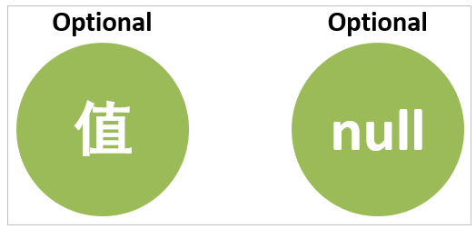

### 7.4 Optional的基本使用

**Optional类的创建方式：**

```java
Optional.of(T t) : 创建一个 Optional 实例
Optional.empty() : 创建一个空的 Optional 实例
Optional.ofNullable(T t):若 t 不为 null,创建 Optional 实例,否则创建空实例
```


**Optional类的常用方法：**

```java
isPresent() : 判断是否包含值,包含值返回true，不包含值返回false
get() : 如果Optional有值则将其返回，否则抛出NoSuchElementException
orElse(T t) : 如果调用对象包含值，返回该值，否则返回参数t
orElseGet(Supplier s) :如果调用对象包含值，返回该值，否则返回 s 获取的值
map(Function f): 如果有值对其处理，并返回处理后的Optional，否则返回 Optional.empty()
```

```java
    @Test
    public void test02() {
//        Optional<String> userNameO = Optional.of("凤姐"); // 用户名为:凤姐
//        Optional<String> userNameO = Optional.of(null); // NPE
//        Optional<String> userNameO = Optional.ofNullable(null); // 用户名不存在
        Optional<String> userNameO = Optional.empty(); // 用户名不存在
        // isPresent() : 判断是否包含值,包含值返回true，不包含值返回false。
        if (userNameO.isPresent()) {
            // get() : 如果Optional有值则将其返回，否则抛出NoSuchElementException。
            String userName = userNameO.get();
            System.out.println("用户名为:" + userName);
        } else {
            System.out.println("用户名不存在");
        }
    }
```


### 7.5 Optional的高级使用

```java
    @Test
    public void test03() {
//        Optional<String> userNameOptional = Optional.of("凤姐");
        Optional<String> userNameOptional = Optional.empty();
        boolean isPresent = userNameOptional.isPresent();
        if (isPresent) {
            System.out.printf("用户存在, 用户名为: %s\n", userNameOptional.get());
        } else {
            System.out.println("用户不存在");
        }

        System.out.println(userNameOptional.orElse(null) == null);
    }

    @Test
    public void test04() {
        // Optional<String> userNameO = Optional.of("凤姐");
        Optional<String> userNameO = Optional.empty();
        // 如果调用对象包含值，返回该值，否则返回参数t
        System.out.println("用户名为" + userNameO.orElse("null"));// 如果调用对象包含值，返回该值，否则返回参数Supplier得到的值
        String s1 = userNameO.orElseGet(() -> {
            return "未知用户名";
        });
        System.out.println("s1 = " + s1);
    }

    @Test
    public void test05() {
        // User u = new User("凤姐", 18);
        // User u = new User(null, 18);
        // User u = null;
        // System.out.println(getUpperCaseUserName1(u));
        // 我们将可能会为null的变量构造成Optional类型
        // User u = new User("凤姐", 18);
        User u = new User(null, 18);
        Optional<User> uO = Optional.of(u);
        System.out.println(getUpperCaseUserName2(uO));
    }

    public String getUpperCaseUserName2(Optional<User> uO) {
        return uO.map(u -> u.getUserName())
                .map(name -> name.toUpperCase())
                .orElse("null");
    }

    public String getUpperCaseUserName1(User u) {
        if (u != null) {
            return u.getUserName();
        } else {
            return null;
        }
    }

    @Data
    @AllArgsConstructor
    @NoArgsConstructor
    private static class User {
        private String userName;
        private Integer age;
    }
```


### 7.6 小结

`Optional`是一个可以为null的容器对象。`orElse`，`ifPresent`，`ifPresentOrElse`，`map`等方法避免对`null`的判断，写出更加优雅的代码。

## 8 学习JDK 8新的日期和时间 API

### 8.1 目标

1. 了解旧版日期时间`API`存在的问题
2. 新日期时间`API`介绍
3. 掌握`JDK 8`的日期和时间类
4. 掌握`JDK 8`的时间格式化与解析
5. 掌握`JDK 8`的Instant时间戳
6. 了解`JDK 8`的计算日期时间差类
7. 了解`JDK 8`设置日期时间的时区

### 8.2 旧版日期时间`API`存在的问题

1. 设计很差： 在`java.util`和`java.sql`的包中都有日期类，`java.util.Date`同时包含日期和时间，而`java.sql.Date`仅包 含日期。此外用于格式化和解析的类在`java.text`包中定义。
2. 非线程安全：`java.util.Date` 是非线程安全的，所有的日期类都是可变的，这是Java日期类最大的问题之一。
3. 时区处理麻烦：日期类并不提供国际化，没有时区支持，因此Java引入了`java.util.Calendar`和`java.util.TimeZone`类，但他们同样存在上述所有的问题。

### 8.3 新日期时间 API介绍

JDK 8中增加了一套全新的日期时间API，这套API设计合理，是线程安全的。新的日期及时间API位于`java.time`包 中，下面是一些关键类。

`LocalDate` ：表示日期，包含年月日，格式为 `2019-10-16`

`LocalTime` ：表示时间，包含时分秒，格式为 `16:38:54.158549300`

`LocalDateTime` ：表示日期时间，包含年月日，时分秒，格式为 `2018-09-06T15:33:56.750`

`DateTimeFormatter` ：日期时间格式化类。

`Instant`：时间戳，表示一个特定的时间瞬间。

`Duration`：用于计算2个时间(`LocalTime`，时分秒)的距离

`Period`：用于计算2个日期(`LocalDate`，年月日)的距离

`ZonedDateTime` ：包含时区的时间

Java中使用的历法是`ISO 8601`日历系统，它是世界民用历法，也就是我们所说的公历。平年有365天，闰年是366天。此外Java 8还提供了4套其他历法，分别是：

- `ThaiBuddhistDate`：泰国佛教历
- `MinguoDate`：中华民国历
- `JapaneseDate`：日本历
- `HijrahDate`：伊斯兰历

### 8.4 JDK 8的日期和时间类

**`LocalDate、LocalTime、LocalDateTime`类的实例是不可变的对象，分别表示使用`ISO-8601`日历系统的日期、时间、日期和时间。它们提供了简单的日期或时间，并不包含当前的时间信息，也不包含与时区相关的信息。**

```java
package cn.lyf.lambda.a02;

import lombok.extern.slf4j.Slf4j;
import org.junit.jupiter.api.Test;

import java.time.LocalDate;
import java.time.LocalDateTime;
import java.time.LocalTime;

/**
 * @author lyf
 * @version 1.0
 * @classname LocalDateTimeTest
 * @description JDK8 时间API 测试
 * @since 2023/4/17 13:01
 */
@Slf4j
public class LocalDateTimeTest {

    /**
     * LocalDate:获取日期时间的信息。格式为 2023-04-17
     *
     * fj = 1985-09-23
     * nowDate = 2023-04-17
     * 年: 2023
     * 月: 4
     * 日: 17
     * 星期: MONDAY
     */
    @Test
    public void test01() {
        // 创建指定日期
        LocalDate fj = LocalDate.of(1985, 9, 23);
        System.out.println("fj = " + fj); // 1985-09-23
        // 得到当前日期
        LocalDate nowDate = LocalDate.now();
        System.out.println("nowDate = " + nowDate); // 2023-04-17
        // 获取日期信息
        System.out.println("年: " + nowDate.getYear());
        System.out.println("月: " + nowDate.getMonthValue());
        System.out.println("日: " + nowDate.getDayOfMonth());
        System.out.println("星期: " + nowDate.getDayOfWeek());
    }

    /**
     * LocalTime类: 获取时间信息。格式为 13:10:05.873
     *
     * time = 12:15:28.129900
     * nowTime = 13:10:05.873
     * 小时: 13
     * 分钟: 10
     * 秒: 5
     * 纳秒: 873000000
     */
    @Test
    public void test02() {
        // 得到指定的时间
        LocalTime time = LocalTime.of(12, 15, 28, 129_900_000);
        System.out.println("time = " + time);
        // 得到当前时间
        LocalTime nowTime = LocalTime.now();
        System.out.println("nowTime = " + nowTime);
        // 获取时间信息
        System.out.println("小时: " + nowTime.getHour());
        System.out.println("分钟: " + nowTime.getMinute());
        System.out.println("秒: " + nowTime.getSecond());
        System.out.println("纳秒: " + nowTime.getNano());
    }

    /**
     * LocalDateTime类: 获取日期时间信息。格式为 2023-04-17T13:11:11.861
     * 
     * fj = 1985-09-23T09:10:20
     * now = 2023-04-17T13:11:11.861
     * 2023
     * 4
     * 17
     * 13
     * 11
     * 11
     * 861000000
     */
    @Test
    public void test03() {
        LocalDateTime fj = LocalDateTime.of(1985, 9, 23, 9, 10, 20);
        System.out.println("fj = " + fj); // 1985-09-23T09:10:20
        // 得到当前日期时间
        LocalDateTime now = LocalDateTime.now();
        System.out.println("now = " + now); // 2023-04-17T13:11:11.861
        System.out.println(now.getYear());
        System.out.println(now.getMonthValue());
        System.out.println(now.getDayOfMonth());
        System.out.println(now.getHour());
        System.out.println(now.getMinute());
        System.out.println(now.getSecond());
        System.out.println(now.getNano());
    }
}

```


**对日期时间的修改，对已存在的`LocalDate`对象，创建它的修改版，最简单的方式是使用`withAttribute`方法。 `withAttribute`方法会创建对象的一个副本，并按照需要修改它的属性。以下所有的方法都返回了一个修改属性的对 象，他们不会影响原来的对象。**

```java
    /**
     * LocalDateTime类: 对日期时间的修改
     */
    @Test
    public void test05() {
        LocalDateTime now = LocalDateTime.now();
        System.out.println("now = " + now);
        // 修改日期时间
        LocalDateTime setYear = now.withYear(2078);
        System.out.println("修改年份: " + setYear);
        System.out.println("now == setYear: " + (now == setYear));
        System.out.println("修改月份: " + now.withMonth(6));
        System.out.println("修改小时: " + now.withHour(9));
        System.out.println("修改分钟: " + now.withMinute(11));
        // 再当前对象的基础上加上或减去指定的时间
        LocalDateTime localDateTime = now.plusDays(5);
        System.out.println("5天后: " + localDateTime);
        System.out.println("now == localDateTime: " + (now == localDateTime));
        System.out.println("10年后: " + now.plusYears(10));
        System.out.println("20月后: " + now.plusMonths(20));
        System.out.println("20年前: " + now.minusYears(20));
        System.out.println("5月前: " + now.minusMonths(5));
        System.out.println("100天前: " + now.minusDays(100));
    }
```

运行结果

```verilog
now = 2023-04-17T13:13:01.519
修改年份: 2078-04-17T13:13:01.519
now == setYear: false
修改月份: 2023-06-17T13:13:01.519
修改小时: 2023-04-17T09:13:01.519
修改分钟: 2023-04-17T13:11:01.519
5天后: 2023-04-22T13:13:01.519
now == localDateTime: false
10年后: 2033-04-17T13:13:01.519
20月后: 2024-12-17T13:13:01.519
20年前: 2003-04-17T13:13:01.519
5月前: 2022-11-17T13:13:01.519
100天前: 2023-01-07T13:13:01.519
```


**日期时间的比较**

```java
    // 日期时间的比较
    @Test
    public void test06() {
        // 在JDK8中，LocalDate类中使用isBefore()、isAfter()、equals()方法来比较两个日期，可直接进行比较。
        LocalDate now = LocalDate.now();
        LocalDate date = LocalDate.of(2018, 8, 8);
        System.out.println(now.isBefore(date)); // false
        System.out.println(now.isAfter(date)); // true
    }
```

运行结果

```verilog
false
true
```

### 8.5 JDK 8的时间格式化与解析

通过`java.time.format.DateTimeFormatter`类可以进行日期时间解析与格式化。

```java
    // 日期格式化
    @Test
    public void test04() {
        final String timePattern = "yyyy-MM-dd HH:mm:ss";
        // 得到当前日期时间
        LocalDateTime now = LocalDateTime.now();
        DateTimeFormatter dateTimeFormatter = DateTimeFormatter.ofPattern(timePattern);

        // 将日期时间格式化为字符串
        String dateTimeStr = now.format(dateTimeFormatter);
        System.out.printf("now str: %s\n", dateTimeStr);
        // 将字符串解析为日期时间
        LocalDateTime localDateTime = LocalDateTime.parse(dateTimeStr, dateTimeFormatter);
        System.out.printf("now: %s\n", localDateTime);
    }

```

**运行结果**

```verilog
now str: 2023-04-17 13:19:55
now: 2023-04-17T13:19:55
```


### 8.6 JDK 8的 Instant 类

`Instant 时间戳/时间线`，内部保存了从`1970年1月1日 00:00:00`以来的秒和纳秒。

```java
    @Test
    public void test07() {
        Instant now = Instant.now();
        System.out.printf("当前时间戳=%s\n", now);
        // 获取从1970年1月1日 00:00:00的秒之后的纳秒数
        System.out.println(now.getNano());
        // 获取从1970年1月1日 00:00:00到现在的秒数
        System.out.println(now.getEpochSecond());
        // 获取从1970年1月1日 00:00:00到现在的毫秒秒数
        System.out.println(now.toEpochMilli());
        // 从操作系统获取时间的毫秒数
        System.out.println(System.currentTimeMillis());
        System.out.println(Instant.ofEpochSecond(5));
    }
```

运行结果

```verilog
当前时间戳=2023-04-17T06:56:57.858Z
858000000
1681714617
1681714617858
1681714617867
1970-01-01T00:00:05Z
```


#### 8.6.1 TimeUtil

```java
package cn.lyf.lambda.utils;

import lombok.extern.slf4j.Slf4j;

import java.util.concurrent.TimeUnit;

/**
 * @author lyf
 * @version 1.0
 * @classname TimeUtil
 * @description
 * @date 2023/4/17 13:49
 */
@Slf4j
public final class TimeUtil {
    private static volatile long currentTimeMillis;


    /**
     * 私有构造器
     */
    private TimeUtil() {
    }

    static {
        currentTimeMillis = System.currentTimeMillis();
        Thread daemon = new Thread(() -> {
            while (true) {
                currentTimeMillis = System.currentTimeMillis();
                try {
                    TimeUnit.MILLISECONDS.sleep(1);
                } catch (InterruptedException ignored) {

                }
            }
        });
        daemon.setDaemon(true);
        daemon.setName("time-tick-thread");
        daemon.start();
    }

    /**
     * 获取当前时间的毫秒值
     *
     * @return currentTimeMillis
     */
    public static long getCurrentTimeMillis() {
        return currentTimeMillis;
    }

    /**
     * 获取当前时间的毫秒值
     *
     * @return currentTimeMillis
     */
    public static long getCurrentTimeSeconds() {
        return currentTimeMillis / 1000L;
    }
}

```

#### 8.6.2 SystemClock

```java
package cn.lyf.lambda.utils;

import java.util.concurrent.Executors;
import java.util.concurrent.ScheduledExecutorService;
import java.util.concurrent.TimeUnit;

public class SystemClock {

    private volatile long now;
    private final long period;

    private SystemClock(long period) {
        this.period = period;
        // 先初始化为当前时间，不然第一次调用会有问题
        this.now = System.currentTimeMillis();
        // 后台线程任务开启定时刷新 now 的值
        scheduleGetSystemTime();
    }
    
    // 对外方法
    public static long currentTimeMillis() {
        return Instance.INSTANCE.getCurrentMillis();
    }

    private void scheduleGetSystemTime() {
        ScheduledExecutorService scheduledExecutorService = Executors.newSingleThreadScheduledExecutor(runnable -> {
            Thread thread = new Thread(runnable, "system-lock-thread");
            thread.setDaemon(true);
            return thread;
        });
        scheduledExecutorService.scheduleAtFixedRate(() -> now = System.currentTimeMillis(), 0, period, TimeUnit.MILLISECONDS);
    }

    private static class Instance {
        private final static SystemClock INSTANCE = new SystemClock(1);
    }

    private long getCurrentMillis() {
        return now;
    }
}
```

#### 8.6.3 TimeZoneIdAllEnum枚举类

```java
package cn.lyf.lambda.enum_;

import lombok.Getter;

public enum TimeZoneAllEnum {
    AFRICA_ABIDJAN("Africa/Abidjan"),
    AFRICA_ACCRA("Africa/Accra"),
    AFRICA_ADDIS_ABABA("Africa/Addis_Ababa"),
    AFRICA_ALGIERS("Africa/Algiers"),
    AFRICA_ASMARA("Africa/Asmara"),
    AFRICA_ASMERA("Africa/Asmera"),
    AFRICA_BAMAKO("Africa/Bamako"),
    AFRICA_BANGUI("Africa/Bangui"),
    AFRICA_BANJUL("Africa/Banjul"),
    AFRICA_BISSAU("Africa/Bissau"),
    AFRICA_BLANTYRE("Africa/Blantyre"),
    AFRICA_BRAZZAVILLE("Africa/Brazzaville"),
    AFRICA_BUJUMBURA("Africa/Bujumbura"),
    AFRICA_CAIRO("Africa/Cairo"),
    AFRICA_CASABLANCA("Africa/Casablanca"),
    AFRICA_CEUTA("Africa/Ceuta"),
    AFRICA_CONAKRY("Africa/Conakry"),
    AFRICA_DAKAR("Africa/Dakar"),
    AFRICA_DAR_ES_SALAAM("Africa/Dar_es_Salaam"),
    AFRICA_DJIBOUTI("Africa/Djibouti"),
    AFRICA_DOUALA("Africa/Douala"),
    AFRICA_EL_AAIUN("Africa/El_Aaiun"),
    AFRICA_FREETOWN("Africa/Freetown"),
    AFRICA_GABORONE("Africa/Gaborone"),
    AFRICA_HARARE("Africa/Harare"),
    AFRICA_JOHANNESBURG("Africa/Johannesburg"),
    AFRICA_JUBA("Africa/Juba"),
    AFRICA_KAMPALA("Africa/Kampala"),
    AFRICA_KHARTOUM("Africa/Khartoum"),
    AFRICA_KIGALI("Africa/Kigali"),
    AFRICA_KINSHASA("Africa/Kinshasa"),
    AFRICA_LAGOS("Africa/Lagos"),
    AFRICA_LIBREVILLE("Africa/Libreville"),
    AFRICA_LOME("Africa/Lome"),
    AFRICA_LUANDA("Africa/Luanda"),
    AFRICA_LUBUMBASHI("Africa/Lubumbashi"),
    AFRICA_LUSAKA("Africa/Lusaka"),
    AFRICA_MALABO("Africa/Malabo"),
    AFRICA_MAPUTO("Africa/Maputo"),
    AFRICA_MASERU("Africa/Maseru"),
    AFRICA_MBABANE("Africa/Mbabane"),
    AFRICA_MOGADISHU("Africa/Mogadishu"),
    AFRICA_MONROVIA("Africa/Monrovia"),
    AFRICA_NAIROBI("Africa/Nairobi"),
    AFRICA_NDJAMENA("Africa/Ndjamena"),
    AFRICA_NIAMEY("Africa/Niamey"),
    AFRICA_NOUAKCHOTT("Africa/Nouakchott"),
    AFRICA_OUAGADOUGOU("Africa/Ouagadougou"),
    AFRICA_PORTO_MINUS_NOVO("Africa/Porto-Novo"),
    AFRICA_SAO_TOME("Africa/Sao_Tome"),
    AFRICA_TIMBUKTU("Africa/Timbuktu"),
    AFRICA_TRIPOLI("Africa/Tripoli"),
    AFRICA_TUNIS("Africa/Tunis"),
    AFRICA_WINDHOEK("Africa/Windhoek"),
    AMERICA_ADAK("America/Adak"),
    AMERICA_ANCHORAGE("America/Anchorage"),
    AMERICA_ANGUILLA("America/Anguilla"),
    AMERICA_ANTIGUA("America/Antigua"),
    AMERICA_ARAGUAINA("America/Araguaina"),
    AMERICA_ARGENTINA_BUENOS_AIRES("America/Argentina/Buenos_Aires"),
    AMERICA_ARGENTINA_CATAMARCA("America/Argentina/Catamarca"),
    AMERICA_ARGENTINA_COMODRIVADAVIA("America/Argentina/ComodRivadavia"),
    AMERICA_ARGENTINA_CORDOBA("America/Argentina/Cordoba"),
    AMERICA_ARGENTINA_JUJUY("America/Argentina/Jujuy"),
    AMERICA_ARGENTINA_LA_RIOJA("America/Argentina/La_Rioja"),
    AMERICA_ARGENTINA_MENDOZA("America/Argentina/Mendoza"),
    AMERICA_ARGENTINA_RIO_GALLEGOS("America/Argentina/Rio_Gallegos"),
    AMERICA_ARGENTINA_SALTA("America/Argentina/Salta"),
    AMERICA_ARGENTINA_SAN_JUAN("America/Argentina/San_Juan"),
    AMERICA_ARGENTINA_SAN_LUIS("America/Argentina/San_Luis"),
    AMERICA_ARGENTINA_TUCUMAN("America/Argentina/Tucuman"),
    AMERICA_ARGENTINA_USHUAIA("America/Argentina/Ushuaia"),
    AMERICA_ARUBA("America/Aruba"),
    AMERICA_ASUNCION("America/Asuncion"),
    AMERICA_ATIKOKAN("America/Atikokan"),
    AMERICA_ATKA("America/Atka"),
    AMERICA_BAHIA("America/Bahia"),
    AMERICA_BAHIA_BANDERAS("America/Bahia_Banderas"),
    AMERICA_BARBADOS("America/Barbados"),
    AMERICA_BELEM("America/Belem"),
    AMERICA_BELIZE("America/Belize"),
    AMERICA_BLANC_MINUS_SABLON("America/Blanc-Sablon"),
    AMERICA_BOA_VISTA("America/Boa_Vista"),
    AMERICA_BOGOTA("America/Bogota"),
    AMERICA_BOISE("America/Boise"),
    AMERICA_BUENOS_AIRES("America/Buenos_Aires"),
    AMERICA_CAMBRIDGE_BAY("America/Cambridge_Bay"),
    AMERICA_CAMPO_GRANDE("America/Campo_Grande"),
    AMERICA_CANCUN("America/Cancun"),
    AMERICA_CARACAS("America/Caracas"),
    AMERICA_CATAMARCA("America/Catamarca"),
    AMERICA_CAYENNE("America/Cayenne"),
    AMERICA_CAYMAN("America/Cayman"),
    AMERICA_CHICAGO("America/Chicago"),
    AMERICA_CHIHUAHUA("America/Chihuahua"),
    AMERICA_CORAL_HARBOUR("America/Coral_Harbour"),
    AMERICA_CORDOBA("America/Cordoba"),
    AMERICA_COSTA_RICA("America/Costa_Rica"),
    AMERICA_CRESTON("America/Creston"),
    AMERICA_CUIABA("America/Cuiaba"),
    AMERICA_CURACAO("America/Curacao"),
    AMERICA_DANMARKSHAVN("America/Danmarkshavn"),
    AMERICA_DAWSON("America/Dawson"),
    AMERICA_DAWSON_CREEK("America/Dawson_Creek"),
    AMERICA_DENVER("America/Denver"),
    AMERICA_DETROIT("America/Detroit"),
    AMERICA_DOMINICA("America/Dominica"),
    AMERICA_EDMONTON("America/Edmonton"),
    AMERICA_EIRUNEPE("America/Eirunepe"),
    AMERICA_EL_SALVADOR("America/El_Salvador"),
    AMERICA_ENSENADA("America/Ensenada"),
    AMERICA_FORT_NELSON("America/Fort_Nelson"),
    AMERICA_FORT_WAYNE("America/Fort_Wayne"),
    AMERICA_FORTALEZA("America/Fortaleza"),
    AMERICA_GLACE_BAY("America/Glace_Bay"),
    AMERICA_GODTHAB("America/Godthab"),
    AMERICA_GOOSE_BAY("America/Goose_Bay"),
    AMERICA_GRAND_TURK("America/Grand_Turk"),
    AMERICA_GRENADA("America/Grenada"),
    AMERICA_GUADELOUPE("America/Guadeloupe"),
    AMERICA_GUATEMALA("America/Guatemala"),
    AMERICA_GUAYAQUIL("America/Guayaquil"),
    AMERICA_GUYANA("America/Guyana"),
    AMERICA_HALIFAX("America/Halifax"),
    AMERICA_HAVANA("America/Havana"),
    AMERICA_HERMOSILLO("America/Hermosillo"),
    AMERICA_INDIANA_INDIANAPOLIS("America/Indiana/Indianapolis"),
    AMERICA_INDIANA_KNOX("America/Indiana/Knox"),
    AMERICA_INDIANA_MARENGO("America/Indiana/Marengo"),
    AMERICA_INDIANA_PETERSBURG("America/Indiana/Petersburg"),
    AMERICA_INDIANA_TELL_CITY("America/Indiana/Tell_City"),
    AMERICA_INDIANA_VEVAY("America/Indiana/Vevay"),
    AMERICA_INDIANA_VINCENNES("America/Indiana/Vincennes"),
    AMERICA_INDIANA_WINAMAC("America/Indiana/Winamac"),
    AMERICA_INDIANAPOLIS("America/Indianapolis"),
    AMERICA_INUVIK("America/Inuvik"),
    AMERICA_IQALUIT("America/Iqaluit"),
    AMERICA_JAMAICA("America/Jamaica"),
    AMERICA_JUJUY("America/Jujuy"),
    AMERICA_JUNEAU("America/Juneau"),
    AMERICA_KENTUCKY_LOUISVILLE("America/Kentucky/Louisville"),
    AMERICA_KENTUCKY_MONTICELLO("America/Kentucky/Monticello"),
    AMERICA_KNOX_IN("America/Knox_IN"),
    AMERICA_KRALENDIJK("America/Kralendijk"),
    AMERICA_LA_PAZ("America/La_Paz"),
    AMERICA_LIMA("America/Lima"),
    AMERICA_LOS_ANGELES("America/Los_Angeles"),
    AMERICA_LOUISVILLE("America/Louisville"),
    AMERICA_LOWER_PRINCES("America/Lower_Princes"),
    AMERICA_MACEIO("America/Maceio"),
    AMERICA_MANAGUA("America/Managua"),
    AMERICA_MANAUS("America/Manaus"),
    AMERICA_MARIGOT("America/Marigot"),
    AMERICA_MARTINIQUE("America/Martinique"),
    AMERICA_MATAMOROS("America/Matamoros"),
    AMERICA_MAZATLAN("America/Mazatlan"),
    AMERICA_MENDOZA("America/Mendoza"),
    AMERICA_MENOMINEE("America/Menominee"),
    AMERICA_MERIDA("America/Merida"),
    AMERICA_METLAKATLA("America/Metlakatla"),
    AMERICA_MEXICO_CITY("America/Mexico_City"),
    AMERICA_MIQUELON("America/Miquelon"),
    AMERICA_MONCTON("America/Moncton"),
    AMERICA_MONTERREY("America/Monterrey"),
    AMERICA_MONTEVIDEO("America/Montevideo"),
    AMERICA_MONTREAL("America/Montreal"),
    AMERICA_MONTSERRAT("America/Montserrat"),
    AMERICA_NASSAU("America/Nassau"),
    AMERICA_NEW_YORK("America/New_York"),
    AMERICA_NIPIGON("America/Nipigon"),
    AMERICA_NOME("America/Nome"),
    AMERICA_NORONHA("America/Noronha"),
    AMERICA_NORTH_DAKOTA_BEULAH("America/North_Dakota/Beulah"),
    AMERICA_NORTH_DAKOTA_CENTER("America/North_Dakota/Center"),
    AMERICA_NORTH_DAKOTA_NEW_SALEM("America/North_Dakota/New_Salem"),
    AMERICA_OJINAGA("America/Ojinaga"),
    AMERICA_PANAMA("America/Panama"),
    AMERICA_PANGNIRTUNG("America/Pangnirtung"),
    AMERICA_PARAMARIBO("America/Paramaribo"),
    AMERICA_PHOENIX("America/Phoenix"),
    AMERICA_PORT_MINUS_AU_MINUS_PRINCE("America/Port-au-Prince"),
    AMERICA_PORT_OF_SPAIN("America/Port_of_Spain"),
    AMERICA_PORTO_ACRE("America/Porto_Acre"),
    AMERICA_PORTO_VELHO("America/Porto_Velho"),
    AMERICA_PUERTO_RICO("America/Puerto_Rico"),
    AMERICA_PUNTA_ARENAS("America/Punta_Arenas"),
    AMERICA_RAINY_RIVER("America/Rainy_River"),
    AMERICA_RANKIN_INLET("America/Rankin_Inlet"),
    AMERICA_RECIFE("America/Recife"),
    AMERICA_REGINA("America/Regina"),
    AMERICA_RESOLUTE("America/Resolute"),
    AMERICA_RIO_BRANCO("America/Rio_Branco"),
    AMERICA_ROSARIO("America/Rosario"),
    AMERICA_SANTA_ISABEL("America/Santa_Isabel"),
    AMERICA_SANTAREM("America/Santarem"),
    AMERICA_SANTIAGO("America/Santiago"),
    AMERICA_SANTO_DOMINGO("America/Santo_Domingo"),
    AMERICA_SAO_PAULO("America/Sao_Paulo"),
    AMERICA_SCORESBYSUND("America/Scoresbysund"),
    AMERICA_SHIPROCK("America/Shiprock"),
    AMERICA_SITKA("America/Sitka"),
    AMERICA_ST_BARTHELEMY("America/St_Barthelemy"),
    AMERICA_ST_JOHNS("America/St_Johns"),
    AMERICA_ST_KITTS("America/St_Kitts"),
    AMERICA_ST_LUCIA("America/St_Lucia"),
    AMERICA_ST_THOMAS("America/St_Thomas"),
    AMERICA_ST_VINCENT("America/St_Vincent"),
    AMERICA_SWIFT_CURRENT("America/Swift_Current"),
    AMERICA_TEGUCIGALPA("America/Tegucigalpa"),
    AMERICA_THULE("America/Thule"),
    AMERICA_THUNDER_BAY("America/Thunder_Bay"),
    AMERICA_TIJUANA("America/Tijuana"),
    AMERICA_TORONTO("America/Toronto"),
    AMERICA_TORTOLA("America/Tortola"),
    AMERICA_VANCOUVER("America/Vancouver"),
    AMERICA_VIRGIN("America/Virgin"),
    AMERICA_WHITEHORSE("America/Whitehorse"),
    AMERICA_WINNIPEG("America/Winnipeg"),
    AMERICA_YAKUTAT("America/Yakutat"),
    AMERICA_YELLOWKNIFE("America/Yellowknife"),
    ANTARCTICA_CASEY("Antarctica/Casey"),
    ANTARCTICA_DAVIS("Antarctica/Davis"),
    ANTARCTICA_DUMONTDURVILLE("Antarctica/DumontDUrville"),
    ANTARCTICA_MACQUARIE("Antarctica/Macquarie"),
    ANTARCTICA_MAWSON("Antarctica/Mawson"),
    ANTARCTICA_MCMURDO("Antarctica/McMurdo"),
    ANTARCTICA_PALMER("Antarctica/Palmer"),
    ANTARCTICA_ROTHERA("Antarctica/Rothera"),
    ANTARCTICA_SOUTH_POLE("Antarctica/South_Pole"),
    ANTARCTICA_SYOWA("Antarctica/Syowa"),
    ANTARCTICA_TROLL("Antarctica/Troll"),
    ANTARCTICA_VOSTOK("Antarctica/Vostok"),
    ARCTIC_LONGYEARBYEN("Arctic/Longyearbyen"),
    ASIA_ADEN("Asia/Aden"),
    ASIA_ALMATY("Asia/Almaty"),
    ASIA_AMMAN("Asia/Amman"),
    ASIA_ANADYR("Asia/Anadyr"),
    ASIA_AQTAU("Asia/Aqtau"),
    ASIA_AQTOBE("Asia/Aqtobe"),
    ASIA_ASHGABAT("Asia/Ashgabat"),
    ASIA_ASHKHABAD("Asia/Ashkhabad"),
    ASIA_ATYRAU("Asia/Atyrau"),
    ASIA_BAGHDAD("Asia/Baghdad"),
    ASIA_BAHRAIN("Asia/Bahrain"),
    ASIA_BAKU("Asia/Baku"),
    ASIA_BANGKOK("Asia/Bangkok"),
    ASIA_BARNAUL("Asia/Barnaul"),
    ASIA_BEIRUT("Asia/Beirut"),
    ASIA_BISHKEK("Asia/Bishkek"),
    ASIA_BRUNEI("Asia/Brunei"),
    ASIA_CALCUTTA("Asia/Calcutta"),
    ASIA_CHITA("Asia/Chita"),
    ASIA_CHOIBALSAN("Asia/Choibalsan"),
    ASIA_CHONGQING("Asia/Chongqing"),
    ASIA_CHUNGKING("Asia/Chungking"),
    ASIA_COLOMBO("Asia/Colombo"),
    ASIA_DACCA("Asia/Dacca"),
    ASIA_DAMASCUS("Asia/Damascus"),
    ASIA_DHAKA("Asia/Dhaka"),
    ASIA_DILI("Asia/Dili"),
    ASIA_DUBAI("Asia/Dubai"),
    ASIA_DUSHANBE("Asia/Dushanbe"),
    ASIA_FAMAGUSTA("Asia/Famagusta"),
    ASIA_GAZA("Asia/Gaza"),
    ASIA_HARBIN("Asia/Harbin"),
    ASIA_HEBRON("Asia/Hebron"),
    ASIA_HO_CHI_MINH("Asia/Ho_Chi_Minh"),
    ASIA_HONG_KONG("Asia/Hong_Kong"),
    ASIA_HOVD("Asia/Hovd"),
    ASIA_IRKUTSK("Asia/Irkutsk"),
    ASIA_ISTANBUL("Asia/Istanbul"),
    ASIA_JAKARTA("Asia/Jakarta"),
    ASIA_JAYAPURA("Asia/Jayapura"),
    ASIA_JERUSALEM("Asia/Jerusalem"),
    ASIA_KABUL("Asia/Kabul"),
    ASIA_KAMCHATKA("Asia/Kamchatka"),
    ASIA_KARACHI("Asia/Karachi"),
    ASIA_KASHGAR("Asia/Kashgar"),
    ASIA_KATHMANDU("Asia/Kathmandu"),
    ASIA_KATMANDU("Asia/Katmandu"),
    ASIA_KHANDYGA("Asia/Khandyga"),
    ASIA_KOLKATA("Asia/Kolkata"),
    ASIA_KRASNOYARSK("Asia/Krasnoyarsk"),
    ASIA_KUALA_LUMPUR("Asia/Kuala_Lumpur"),
    ASIA_KUCHING("Asia/Kuching"),
    ASIA_KUWAIT("Asia/Kuwait"),
    ASIA_MACAO("Asia/Macao"),
    ASIA_MACAU("Asia/Macau"),
    ASIA_MAGADAN("Asia/Magadan"),
    ASIA_MAKASSAR("Asia/Makassar"),
    ASIA_MANILA("Asia/Manila"),
    ASIA_MUSCAT("Asia/Muscat"),
    ASIA_NICOSIA("Asia/Nicosia"),
    ASIA_NOVOKUZNETSK("Asia/Novokuznetsk"),
    ASIA_NOVOSIBIRSK("Asia/Novosibirsk"),
    ASIA_OMSK("Asia/Omsk"),
    ASIA_ORAL("Asia/Oral"),
    ASIA_PHNOM_PENH("Asia/Phnom_Penh"),
    ASIA_PONTIANAK("Asia/Pontianak"),
    ASIA_PYONGYANG("Asia/Pyongyang"),
    ASIA_QATAR("Asia/Qatar"),
    ASIA_QYZYLORDA("Asia/Qyzylorda"),
    ASIA_RANGOON("Asia/Rangoon"),
    ASIA_RIYADH("Asia/Riyadh"),
    ASIA_SAIGON("Asia/Saigon"),
    ASIA_SAKHALIN("Asia/Sakhalin"),
    ASIA_SAMARKAND("Asia/Samarkand"),
    ASIA_SEOUL("Asia/Seoul"),
    ASIA_SHANGHAI("Asia/Shanghai"),
    ASIA_SINGAPORE("Asia/Singapore"),
    ASIA_SREDNEKOLYMSK("Asia/Srednekolymsk"),
    ASIA_TAIPEI("Asia/Taipei"),
    ASIA_TASHKENT("Asia/Tashkent"),
    ASIA_TBILISI("Asia/Tbilisi"),
    ASIA_TEHRAN("Asia/Tehran"),
    ASIA_TEL_AVIV("Asia/Tel_Aviv"),
    ASIA_THIMBU("Asia/Thimbu"),
    ASIA_THIMPHU("Asia/Thimphu"),
    ASIA_TOKYO("Asia/Tokyo"),
    ASIA_TOMSK("Asia/Tomsk"),
    ASIA_UJUNG_PANDANG("Asia/Ujung_Pandang"),
    ASIA_ULAANBAATAR("Asia/Ulaanbaatar"),
    ASIA_ULAN_BATOR("Asia/Ulan_Bator"),
    ASIA_URUMQI("Asia/Urumqi"),
    ASIA_UST_MINUS_NERA("Asia/Ust-Nera"),
    ASIA_VIENTIANE("Asia/Vientiane"),
    ASIA_VLADIVOSTOK("Asia/Vladivostok"),
    ASIA_YAKUTSK("Asia/Yakutsk"),
    ASIA_YANGON("Asia/Yangon"),
    ASIA_YEKATERINBURG("Asia/Yekaterinburg"),
    ASIA_YEREVAN("Asia/Yerevan"),
    ATLANTIC_AZORES("Atlantic/Azores"),
    ATLANTIC_BERMUDA("Atlantic/Bermuda"),
    ATLANTIC_CANARY("Atlantic/Canary"),
    ATLANTIC_CAPE_VERDE("Atlantic/Cape_Verde"),
    ATLANTIC_FAEROE("Atlantic/Faeroe"),
    ATLANTIC_FAROE("Atlantic/Faroe"),
    ATLANTIC_JAN_MAYEN("Atlantic/Jan_Mayen"),
    ATLANTIC_MADEIRA("Atlantic/Madeira"),
    ATLANTIC_REYKJAVIK("Atlantic/Reykjavik"),
    ATLANTIC_SOUTH_GEORGIA("Atlantic/South_Georgia"),
    ATLANTIC_ST_HELENA("Atlantic/St_Helena"),
    ATLANTIC_STANLEY("Atlantic/Stanley"),
    AUSTRALIA_ACT("Australia/ACT"),
    AUSTRALIA_ADELAIDE("Australia/Adelaide"),
    AUSTRALIA_BRISBANE("Australia/Brisbane"),
    AUSTRALIA_BROKEN_HILL("Australia/Broken_Hill"),
    AUSTRALIA_CANBERRA("Australia/Canberra"),
    AUSTRALIA_CURRIE("Australia/Currie"),
    AUSTRALIA_DARWIN("Australia/Darwin"),
    AUSTRALIA_EUCLA("Australia/Eucla"),
    AUSTRALIA_HOBART("Australia/Hobart"),
    AUSTRALIA_LHI("Australia/LHI"),
    AUSTRALIA_LINDEMAN("Australia/Lindeman"),
    AUSTRALIA_LORD_HOWE("Australia/Lord_Howe"),
    AUSTRALIA_MELBOURNE("Australia/Melbourne"),
    AUSTRALIA_NSW("Australia/NSW"),
    AUSTRALIA_NORTH("Australia/North"),
    AUSTRALIA_PERTH("Australia/Perth"),
    AUSTRALIA_QUEENSLAND("Australia/Queensland"),
    AUSTRALIA_SOUTH("Australia/South"),
    AUSTRALIA_SYDNEY("Australia/Sydney"),
    AUSTRALIA_TASMANIA("Australia/Tasmania"),
    AUSTRALIA_VICTORIA("Australia/Victoria"),
    AUSTRALIA_WEST("Australia/West"),
    AUSTRALIA_YANCOWINNA("Australia/Yancowinna"),
    BRAZIL_ACRE("Brazil/Acre"),
    BRAZIL_DENORONHA("Brazil/DeNoronha"),
    BRAZIL_EAST("Brazil/East"),
    BRAZIL_WEST("Brazil/West"),
    CET("CET"),
    CST6CDT("CST6CDT"),
    CANADA_ATLANTIC("Canada/Atlantic"),
    CANADA_CENTRAL("Canada/Central"),
    CANADA_EAST_MINUS_SASKATCHEWAN("Canada/East-Saskatchewan"),
    CANADA_EASTERN("Canada/Eastern"),
    CANADA_MOUNTAIN("Canada/Mountain"),
    CANADA_NEWFOUNDLAND("Canada/Newfoundland"),
    CANADA_PACIFIC("Canada/Pacific"),
    CANADA_SASKATCHEWAN("Canada/Saskatchewan"),
    CANADA_YUKON("Canada/Yukon"),
    CHILE_CONTINENTAL("Chile/Continental"),
    CHILE_EASTERISLAND("Chile/EasterIsland"),
    CUBA("Cuba"),
    EET("EET"),
    EST5EDT("EST5EDT"),
    EGYPT("Egypt"),
    EIRE("Eire"),
    ETC_GMT("Etc/GMT"),
    ETC_GMT_PLUS_0("Etc/GMT+0"),
    ETC_GMT_PLUS_1("Etc/GMT+1"),
    ETC_GMT_PLUS_10("Etc/GMT+10"),
    ETC_GMT_PLUS_11("Etc/GMT+11"),
    ETC_GMT_PLUS_12("Etc/GMT+12"),
    ETC_GMT_PLUS_2("Etc/GMT+2"),
    ETC_GMT_PLUS_3("Etc/GMT+3"),
    ETC_GMT_PLUS_4("Etc/GMT+4"),
    ETC_GMT_PLUS_5("Etc/GMT+5"),
    ETC_GMT_PLUS_6("Etc/GMT+6"),
    ETC_GMT_PLUS_7("Etc/GMT+7"),
    ETC_GMT_PLUS_8("Etc/GMT+8"),
    ETC_GMT_PLUS_9("Etc/GMT+9"),
    ETC_GMT_MINUS_0("Etc/GMT-0"),
    ETC_GMT_MINUS_1("Etc/GMT-1"),
    ETC_GMT_MINUS_10("Etc/GMT-10"),
    ETC_GMT_MINUS_11("Etc/GMT-11"),
    ETC_GMT_MINUS_12("Etc/GMT-12"),
    ETC_GMT_MINUS_13("Etc/GMT-13"),
    ETC_GMT_MINUS_14("Etc/GMT-14"),
    ETC_GMT_MINUS_2("Etc/GMT-2"),
    ETC_GMT_MINUS_3("Etc/GMT-3"),
    ETC_GMT_MINUS_4("Etc/GMT-4"),
    ETC_GMT_MINUS_5("Etc/GMT-5"),
    ETC_GMT_MINUS_6("Etc/GMT-6"),
    ETC_GMT_MINUS_7("Etc/GMT-7"),
    ETC_GMT_MINUS_8("Etc/GMT-8"),
    ETC_GMT_MINUS_9("Etc/GMT-9"),
    ETC_GMT0("Etc/GMT0"),
    ETC_GREENWICH("Etc/Greenwich"),
    ETC_UCT("Etc/UCT"),
    ETC_UTC("Etc/UTC"),
    ETC_UNIVERSAL("Etc/Universal"),
    ETC_ZULU("Etc/Zulu"),
    EUROPE_AMSTERDAM("Europe/Amsterdam"),
    EUROPE_ANDORRA("Europe/Andorra"),
    EUROPE_ASTRAKHAN("Europe/Astrakhan"),
    EUROPE_ATHENS("Europe/Athens"),
    EUROPE_BELFAST("Europe/Belfast"),
    EUROPE_BELGRADE("Europe/Belgrade"),
    EUROPE_BERLIN("Europe/Berlin"),
    EUROPE_BRATISLAVA("Europe/Bratislava"),
    EUROPE_BRUSSELS("Europe/Brussels"),
    EUROPE_BUCHAREST("Europe/Bucharest"),
    EUROPE_BUDAPEST("Europe/Budapest"),
    EUROPE_BUSINGEN("Europe/Busingen"),
    EUROPE_CHISINAU("Europe/Chisinau"),
    EUROPE_COPENHAGEN("Europe/Copenhagen"),
    EUROPE_DUBLIN("Europe/Dublin"),
    EUROPE_GIBRALTAR("Europe/Gibraltar"),
    EUROPE_GUERNSEY("Europe/Guernsey"),
    EUROPE_HELSINKI("Europe/Helsinki"),
    EUROPE_ISLE_OF_MAN("Europe/Isle_of_Man"),
    EUROPE_ISTANBUL("Europe/Istanbul"),
    EUROPE_JERSEY("Europe/Jersey"),
    EUROPE_KALININGRAD("Europe/Kaliningrad"),
    EUROPE_KIEV("Europe/Kiev"),
    EUROPE_KIROV("Europe/Kirov"),
    EUROPE_LISBON("Europe/Lisbon"),
    EUROPE_LJUBLJANA("Europe/Ljubljana"),
    EUROPE_LONDON("Europe/London"),
    EUROPE_LUXEMBOURG("Europe/Luxembourg"),
    EUROPE_MADRID("Europe/Madrid"),
    EUROPE_MALTA("Europe/Malta"),
    EUROPE_MARIEHAMN("Europe/Mariehamn"),
    EUROPE_MINSK("Europe/Minsk"),
    EUROPE_MONACO("Europe/Monaco"),
    EUROPE_MOSCOW("Europe/Moscow"),
    EUROPE_NICOSIA("Europe/Nicosia"),
    EUROPE_OSLO("Europe/Oslo"),
    EUROPE_PARIS("Europe/Paris"),
    EUROPE_PODGORICA("Europe/Podgorica"),
    EUROPE_PRAGUE("Europe/Prague"),
    EUROPE_RIGA("Europe/Riga"),
    EUROPE_ROME("Europe/Rome"),
    EUROPE_SAMARA("Europe/Samara"),
    EUROPE_SAN_MARINO("Europe/San_Marino"),
    EUROPE_SARAJEVO("Europe/Sarajevo"),
    EUROPE_SARATOV("Europe/Saratov"),
    EUROPE_SIMFEROPOL("Europe/Simferopol"),
    EUROPE_SKOPJE("Europe/Skopje"),
    EUROPE_SOFIA("Europe/Sofia"),
    EUROPE_STOCKHOLM("Europe/Stockholm"),
    EUROPE_TALLINN("Europe/Tallinn"),
    EUROPE_TIRANE("Europe/Tirane"),
    EUROPE_TIRASPOL("Europe/Tiraspol"),
    EUROPE_ULYANOVSK("Europe/Ulyanovsk"),
    EUROPE_UZHGOROD("Europe/Uzhgorod"),
    EUROPE_VADUZ("Europe/Vaduz"),
    EUROPE_VATICAN("Europe/Vatican"),
    EUROPE_VIENNA("Europe/Vienna"),
    EUROPE_VILNIUS("Europe/Vilnius"),
    EUROPE_VOLGOGRAD("Europe/Volgograd"),
    EUROPE_WARSAW("Europe/Warsaw"),
    EUROPE_ZAGREB("Europe/Zagreb"),
    EUROPE_ZAPOROZHYE("Europe/Zaporozhye"),
    EUROPE_ZURICH("Europe/Zurich"),
    GB("GB"),
    GB_MINUS_EIRE("GB-Eire"),
    GMT("GMT"),
    GMT0("GMT0"),
    GREENWICH("Greenwich"),
    HONGKONG("Hongkong"),
    ICELAND("Iceland"),
    INDIAN_ANTANANARIVO("Indian/Antananarivo"),
    INDIAN_CHAGOS("Indian/Chagos"),
    INDIAN_CHRISTMAS("Indian/Christmas"),
    INDIAN_COCOS("Indian/Cocos"),
    INDIAN_COMORO("Indian/Comoro"),
    INDIAN_KERGUELEN("Indian/Kerguelen"),
    INDIAN_MAHE("Indian/Mahe"),
    INDIAN_MALDIVES("Indian/Maldives"),
    INDIAN_MAURITIUS("Indian/Mauritius"),
    INDIAN_MAYOTTE("Indian/Mayotte"),
    INDIAN_REUNION("Indian/Reunion"),
    IRAN("Iran"),
    ISRAEL("Israel"),
    JAMAICA("Jamaica"),
    JAPAN("Japan"),
    KWAJALEIN("Kwajalein"),
    LIBYA("Libya"),
    MET("MET"),
    MST7MDT("MST7MDT"),
    MEXICO_BAJANORTE("Mexico/BajaNorte"),
    MEXICO_BAJASUR("Mexico/BajaSur"),
    MEXICO_GENERAL("Mexico/General"),
    NZ("NZ"),
    NZ_MINUS_CHAT("NZ-CHAT"),
    NAVAJO("Navajo"),
    PRC("PRC"),
    PST8PDT("PST8PDT"),
    PACIFIC_APIA("Pacific/Apia"),
    PACIFIC_AUCKLAND("Pacific/Auckland"),
    PACIFIC_BOUGAINVILLE("Pacific/Bougainville"),
    PACIFIC_CHATHAM("Pacific/Chatham"),
    PACIFIC_CHUUK("Pacific/Chuuk"),
    PACIFIC_EASTER("Pacific/Easter"),
    PACIFIC_EFATE("Pacific/Efate"),
    PACIFIC_ENDERBURY("Pacific/Enderbury"),
    PACIFIC_FAKAOFO("Pacific/Fakaofo"),
    PACIFIC_FIJI("Pacific/Fiji"),
    PACIFIC_FUNAFUTI("Pacific/Funafuti"),
    PACIFIC_GALAPAGOS("Pacific/Galapagos"),
    PACIFIC_GAMBIER("Pacific/Gambier"),
    PACIFIC_GUADALCANAL("Pacific/Guadalcanal"),
    PACIFIC_GUAM("Pacific/Guam"),
    PACIFIC_HONOLULU("Pacific/Honolulu"),
    PACIFIC_JOHNSTON("Pacific/Johnston"),
    PACIFIC_KIRITIMATI("Pacific/Kiritimati"),
    PACIFIC_KOSRAE("Pacific/Kosrae"),
    PACIFIC_KWAJALEIN("Pacific/Kwajalein"),
    PACIFIC_MAJURO("Pacific/Majuro"),
    PACIFIC_MARQUESAS("Pacific/Marquesas"),
    PACIFIC_MIDWAY("Pacific/Midway"),
    PACIFIC_NAURU("Pacific/Nauru"),
    PACIFIC_NIUE("Pacific/Niue"),
    PACIFIC_NORFOLK("Pacific/Norfolk"),
    PACIFIC_NOUMEA("Pacific/Noumea"),
    PACIFIC_PAGO_PAGO("Pacific/Pago_Pago"),
    PACIFIC_PALAU("Pacific/Palau"),
    PACIFIC_PITCAIRN("Pacific/Pitcairn"),
    PACIFIC_POHNPEI("Pacific/Pohnpei"),
    PACIFIC_PONAPE("Pacific/Ponape"),
    PACIFIC_PORT_MORESBY("Pacific/Port_Moresby"),
    PACIFIC_RAROTONGA("Pacific/Rarotonga"),
    PACIFIC_SAIPAN("Pacific/Saipan"),
    PACIFIC_SAMOA("Pacific/Samoa"),
    PACIFIC_TAHITI("Pacific/Tahiti"),
    PACIFIC_TARAWA("Pacific/Tarawa"),
    PACIFIC_TONGATAPU("Pacific/Tongatapu"),
    PACIFIC_TRUK("Pacific/Truk"),
    PACIFIC_WAKE("Pacific/Wake"),
    PACIFIC_WALLIS("Pacific/Wallis"),
    PACIFIC_YAP("Pacific/Yap"),
    POLAND("Poland"),
    PORTUGAL("Portugal"),
    ROK("ROK"),
    SINGAPORE("Singapore"),
    SYSTEMV_AST4("SystemV/AST4"),
    SYSTEMV_AST4ADT("SystemV/AST4ADT"),
    SYSTEMV_CST6("SystemV/CST6"),
    SYSTEMV_CST6CDT("SystemV/CST6CDT"),
    SYSTEMV_EST5("SystemV/EST5"),
    SYSTEMV_EST5EDT("SystemV/EST5EDT"),
    SYSTEMV_HST10("SystemV/HST10"),
    SYSTEMV_MST7("SystemV/MST7"),
    SYSTEMV_MST7MDT("SystemV/MST7MDT"),
    SYSTEMV_PST8("SystemV/PST8"),
    SYSTEMV_PST8PDT("SystemV/PST8PDT"),
    SYSTEMV_YST9("SystemV/YST9"),
    SYSTEMV_YST9YDT("SystemV/YST9YDT"),
    TURKEY("Turkey"),
    UCT("UCT"),
    US_ALASKA("US/Alaska"),
    US_ALEUTIAN("US/Aleutian"),
    US_ARIZONA("US/Arizona"),
    US_CENTRAL("US/Central"),
    US_EAST_MINUS_INDIANA("US/East-Indiana"),
    US_EASTERN("US/Eastern"),
    US_HAWAII("US/Hawaii"),
    US_INDIANA_MINUS_STARKE("US/Indiana-Starke"),
    US_MICHIGAN("US/Michigan"),
    US_MOUNTAIN("US/Mountain"),
    US_PACIFIC("US/Pacific"),
    US_PACIFIC_MINUS_NEW("US/Pacific-New"),
    US_SAMOA("US/Samoa"),
    UTC("UTC"),
    UNIVERSAL("Universal"),
    W_MINUS_SU("W-SU"),
    WET("WET"),
    ZULU("Zulu"),
    EST("EST"),
    HST("HST"),
    MST("MST"),
    ACT("ACT"),
    AET("AET"),
    AGT("AGT"),
    ART("ART"),
    AST("AST"),
    BET("BET"),
    BST("BST"),
    CAT("CAT"),
    CNT("CNT"),
    CST("CST"),
    CTT("CTT"),
    EAT("EAT"),
    ECT("ECT"),
    IET("IET"),
    IST("IST"),
    JST("JST"),
    MIT("MIT"),
    NET("NET"),
    NST("NST"),
    PLT("PLT"),
    PNT("PNT"),
    PRT("PRT"),
    PST("PST"),
    SST("SST"),
    VST("VST");
    @Getter
    private final String timeZoneId;
    
    TimeZoneAllEnum(String timeZoneId) {
        this.timeZoneId = timeZoneId;
    }
}

```


#### 8.6.4 获取当前时间毫秒值的效率测试代码

```java
    @Test
    public void test001() throws Exception {
        final long times = 100_000_000;
        TaskUtil.costTime(() -> {
            for (long i = 0; i < times; i++) {
                System.currentTimeMillis();
            }
        });

        try {
            TimeUnit.SECONDS.sleep(1);
        } catch (InterruptedException e) {
            log.error("", e);
        }

        TaskUtil.costTime(() -> {
            for (long i = 0; i < times; i++) {
                Instant.now().toEpochMilli();
            }
        });

        try {
            TimeUnit.SECONDS.sleep(1);
        } catch (InterruptedException e) {
            log.error("", e);
        }

        TaskUtil.costTime(() -> {
            for (long i = 0; i < times; i++) {
                TimeUtil.getCurrentTimeMillis();
            }
        });

        try {
            TimeUnit.SECONDS.sleep(1);
        } catch (InterruptedException e) {
            log.error("", e);
        }

        TaskUtil.costTime(() -> {
            for (long i = 0; i < times; i++) {
                SystemClock.currentTimeMillis();
            }
        });

    }

```

**运行结果**

```verilog
costTime: 548
costTime: 667
costTime: 59
costTime: 59
```

#### 8.6.5 测试ZonedDateTime

```java
    @Test
    public void test09() {
        // Instant.now 获取的时间为UTC的时间，如果需要修改为北京时间，则使用如下即可
        /*
           1、Instant不知道时区。如果您需要时区感知时间戳，则应使用ZonedDateTime.

            2、检查ZonedDateTime.now(timezone)哪个将使用提供的时区。
            要使用机器的默认时区，请使用ZonedDateTime.now()

        如果您想解析 ZonedDateTime 并覆盖时区，您可以使用ZonedDateTime.withZoneSameLocal
        * 或ZonedDateTime.withZoneSameInstant根据您的需要。
         */

        ZonedDateTime zonedDateTime1 = ZonedDateTime.now();
        System.out.println("zoneDateTime1: " + zonedDateTime1);
        System.out.println(ZonedDateTime.now(ZoneId.of(TimeZoneAllEnum.AMERICA_NOME.getTimeZoneId())));

        ZonedDateTime zonedDateTime2 = Instant.now().atZone(ZoneId.of(TimeZoneAllEnum.ASIA_SHANGHAI.getTimeZoneId()));
        System.out.println(zonedDateTime2);

        Instant now = Instant.now();
        System.out.printf("当前时间戳=%s\n", now);
        // 获取从1970年1月1日 00:00:00的秒之后的纳秒数
        System.out.println(now.getNano());
        // 获取从1970年1月1日 00:00:00到现在的秒数
        System.out.println(now.getEpochSecond());
        // 获取从1970年1月1日 00:00:00到现在的毫秒秒数
        System.out.println(now.toEpochMilli());
        // 从操作系统获取时间的毫秒数
        System.out.println(System.currentTimeMillis());
        System.out.println(Instant.ofEpochSecond(5));
    }
```

运行结果

```verilog
2023-04-17T00:17:39.936-08:00[America/Nome]
2023-04-17T16:17:39.937+08:00[Asia/Shanghai]
当前时间戳=2023-04-17T08:17:39.937Z
937000000
1681719459
1681719459937
1681719459941
1970-01-01T00:00:05Z
```


### 8.7 JDK 8的计算日期时间差类

`Duration/Period`类: 计算日期时间差。

1. Duration：用于计算2个时间(LocalTime，时分秒)的距离
2. Period：用于计算2个日期(LocalDate，年月日)的距离

```java
    // Duration/Period类: 计算日期时间差
    @Test
    public void test08() {
        // Duration计算时间的距离
        LocalTime now = LocalTime.now();
        LocalTime time = LocalTime.of(14, 15, 20);
        Duration duration = Duration.between(time, now);
        System.out.println("相差的天数:" + duration.toDays());
        System.out.println("相差的小时数:" + duration.toHours());
        System.out.println("相差的分钟数:" + duration.toMinutes());
        System.out.println("相差的秒数:" + duration.toMillis() / 1000);
        System.out.println("相差的毫秒数:" + duration.toMillis());
        // Period计算日期的距离
        LocalDate nowDate = LocalDate.now();
        LocalDate date = LocalDate.of(1998, 8, 8);
        // 让后面的时间减去前面的时间
        Period period = Period.between(date, nowDate);
        System.out.println("相差的年:" + period.getYears());
        System.out.println("相差的月:" + period.getMonths());
        System.out.println("相差的天:" + period.getDays());
    }
```

**运行结果**

```verilog
相差的天数:0
相差的小时数:2
相差的分钟数:128
相差的秒数:7726
相差的毫秒数:7726369
相差的年:24
相差的月:8
相差的天:9
```


### 8.8 JDK 8的时间校正器

有时我们可能需要获取例如：将日期调整到“下一个月的第一天”等操作。可以通过时间校正器来进行。

- `TemporalAdjuster` : 时间校正器。

- `TemporalAdjusters` : 该类通过静态方法提供了大量的常用TemporalAdjuster的实现。

```java
    // TemporalAdjuster类:自定义调整时间
    @Test
    public void test09() {
        // 得到下一个月的第一天
        TemporalAdjuster temporalAdjuster = temporal -> {
            LocalDateTime localDateTime = (LocalDateTime) temporal;
            return localDateTime.plusMonths(1L).withDayOfMonth(1);
        };
        LocalDateTime now = LocalDateTime.now();
        System.out.println("当前时间: " + now);
        // 打印下个月的第一天的此时时间
        System.out.println("下个月一号, 此时时间:" + now.with(temporalAdjuster));
    }
```

**运行结果**

```verilog
当前时间: 2023-04-17T16:31:41.455
下个月一号, 此时时间:2023-05-01T16:31:41.455
```


### 8.9 JDK 8设置日期时间的时区

Java8 中加入了对时区的支持，`LocalDate、LocalTime、LocalDateTime`是不带时区的，带时区的日期时间类分别 为：`ZonedDate、ZonedTime、ZonedDateTime`。

其中每个时区都对应着 ID，ID的格式为 “`区域/城市`” 。例如 ：`Asia/Shanghai` 等。

ZoneId：该类中包含了所有的时区信息。

```java
    // 设置日期时间的时区
    @Test
    public void test10() {
        // 1.获取所有的时区ID
        // ZoneId.getAvailableZoneIds().forEach(System.out::println);
        // 不带时间,获取计算机的当前时间
        LocalDateTime now = LocalDateTime.now(); // 中国使用的东八区的时区.比标准时间晚8个小时
        System.out.println("now = " + now);
        // 2.操作带时区的类
        // now(Clock.systemUTC()): 创建世界标准时间
        ZonedDateTime bz = ZonedDateTime.now(Clock.systemUTC());
        System.out.println("bz = " + bz);
        // now(): 使用计算机的默认的时区,创建日期时间
        ZonedDateTime now1 = ZonedDateTime.now();
        System.out.println("now1 = " + now1); // 2023-04-17T16:36:45.280+08:00[Asia/Shanghai]
        // 使用指定的时区创建日期时间
        ZonedDateTime now2 = ZonedDateTime.now(ZoneId.of(TimeZoneAllEnum.AMERICA_VANCOUVER.getTimeZoneId()));
        System.out.println("now2 = " + now2); // 2023-04-17T01:36:45.290-07:00[America/Vancouver]
    }
```

**运行结果**

```verilog
now = 2023-04-17T16:36:45.279
bz = 2023-04-17T08:36:45.280Z
now1 = 2023-04-17T16:36:45.280+08:00[Asia/Shanghai]
now2 = 2023-04-17T01:36:45.290-07:00[America/Vancouver]
```


### 8.10 小结

详细学习了新的日期是时间相关类，`LocalDate`表示日期,包含年月日, `LocalTime`表示时间,包含时分秒, `LocalDateTime = LocalDate + LocalTime`,时间的格式化和解析,通过`DateTimeFormatter`类型进行。

学习了`Instant`类,方便操作秒和纳秒,一般是给程序使用的.学习`Duration/Period`计算日期或时间的距离,还使用时间调整器方便的调整时间,学习了带时区的3个类`ZoneDate/ZoneTime/ZoneDateTime`

JDK 8新的日期和时间 API的优势：

1. 新版的日期和时间API中，日期和时间对象是不可变的。操纵的日期不会影响老值，而是新生成一个实例。
2. 新的API提供了两种不同的时间表示方式，有效地区分了人和机器的不同需求。
3. TemporalAdjuster可以更精确的操纵日期，还可以自定义日期调整器。
4. 是线程安全的


## 9 学习JDK 8重复注解与类型注解

### 9.1 目标

- 掌握重复注解的使用
- 掌握类型注解的使用

### 9.2 重复注解的使用

自从Java 5中引入 注解 以来，注解开始变得非常流行，并在各个框架和项目中被广泛使用。不过注解有一个很大的限制是：在同一个地方不能多次使用同一个注解。JDK 8引入了重复注解的概念，允许在同一个地方多次使用同一个注解。在JDK 8中使用`@Repeatable`注解定义重复注解。

重复注解的使用步骤：

#### 9.2.1 定义重复的注解容器注解

```java
package cn.lyf.lambda.demo5.a05;

import java.lang.annotation.Retention;
import java.lang.annotation.RetentionPolicy;

@Retention(RetentionPolicy.RUNTIME)
public @interface MyTestsAnno {
    MyTestAnno[] value();
}

```


#### 9.2.2 定义一个可以重复的注解

```java
package cn.lyf.lambda.demo5.a05;

import java.lang.annotation.*;

/**
 * @author lyf
 * @version 1.0
 * @classname MyTestAnno
 * @description
 * @since 2023/4/17 16:44
 */
@Retention(RetentionPolicy.RUNTIME)
@Repeatable(MyTestsAnno.class)
public @interface MyTestAnno {
    String value();
}

```


#### 9.2.3 配置多个重复的注解

```java
package cn.lyf.lambda.demo5.a05;

import lombok.extern.slf4j.Slf4j;

import java.lang.reflect.Method;

/**
 * @author lyf
 * @version 1.0
 * @classname RepeatableAnnoDemo
 * @description 重复注解测试
 * @since 2023/4/17 16:47
 */
@Slf4j
@MyTestAnno("tbc")
@MyTestAnno("tba")
@MyTestAnno("tba")
public class RepeatableAnnoDemo {

    @MyTestAnno("mbc")
    @MyTestAnno("mba")
    public void test() throws NoSuchMethodException {

    }
}
```


#### 9.2.4 解析得到指定注解

```java
    public static void main(String[] args) throws NoSuchMethodException {
        Class<RepeatableAnnoDemo> clazz = RepeatableAnnoDemo.class;

        // 获取类上的所有注解
        MyTestAnno[] myTestAnnosAtClass = clazz.getAnnotationsByType(MyTestAnno.class);
        for (MyTestAnno myTestAnno : myTestAnnosAtClass) {
            System.out.println("class, " + myTestAnno.value());
        }
        // 获取方法上的所有注解
        Method testMethod = clazz.getMethod("test");
        MyTestAnno[] myTestAnnosAtMethod = testMethod.getAnnotationsByType(MyTestAnno.class);
        for (MyTestAnno myTestAnno : myTestAnnosAtMethod) {
            System.out.println("method, " + myTestAnno.value());
        }
    }
```

#### 9.2.5 运行结果

```verilog
class, tbc
class, tba
class, tba
method, mbc
method, mba
```


### 9.3 类型注解的使用

JDK 8为`@Target`元注解新增了两种类型： `TYPE_PARAMETER` ， `TYPE_USE` 。

`TYPE_PARAMETER` ：表示该注解能写在类型参数的声明语句中。 类型参数声明如： `<T>` 、`TYPE_USE` ：表示注解可以在任何用到类型的地方使用。

`TYPE_PARAMETER`的使用

```java
package cn.lyf.lambda.demo5.a06;

import java.lang.annotation.ElementType;
import java.lang.annotation.Target;

/**
 * @author lyf
 * @version 1.0
 * @classname TypeParam
 * @description
 * @since 2023/4/17 17:01
 */
@Target(ElementType.TYPE_PARAMETER)
public @interface TypeParam {
}

```

```java
package cn.lyf.lambda.demo5.a06;

import lombok.extern.slf4j.Slf4j;

/**
 * @author lyf
 * @version 1.0
 * @classname TypeParamDemo
 * @description
 * @since 2023/4/17 17:02
 */
@Slf4j

public class TypeParamDemo<@TypeParam T> {
    public static void main(String[] args) {
        TypeParamDemo<Object> demo = new TypeParamDemo<>();
        demo.test("张三");
    }

    public <@TypeParam E> void test(String str) {
        System.out.println(str);
    }
}

```

**运行结果**

```verilog
张三
```


`TYPE_USE`的使用

**定义NotNull注解**

```java
package cn.lyf.lambda.demo5.a06;

import lombok.extern.slf4j.Slf4j;

import java.lang.annotation.ElementType;
import java.lang.annotation.Target;

/**
 * @author lyf
 * @version 1.0
 * @classname NotNull
 * @description
 * @since 2023/4/17 17:05
 */
@Target(ElementType.TYPE_USE)
public @interface NotNull {
}

```

**使用`@NotNull`注解**

```java
package cn.lyf.lambda.demo5.a06;

import lombok.extern.slf4j.Slf4j;

/**
 * @author lyf
 * @version 1.0
 * @classname TypeParamDemo
 * @description
 * @since 2023/4/17 17:02
 */
@Slf4j

public class TypeParamDemo<@TypeParam T> {
    private @NotNull int a = 10;

    public static void main(String[] args) {
        TypeParamDemo<Object> demo = new TypeParamDemo<>();
        demo.test("张三");
        // 测试NotNull注解
        @NotNull int x = 1;
        @NotNull String s = new @NotNull String("xyz");
    }

    public <@TypeParam E> void test(String str) {
        System.out.println(str);
    }
}

```


### 9.4 小结

通过`@Repeatable`元注解可以定义可重复注解， `TYPE_PARAMETER` 可以让注解放在泛型上， `TYPE_USE`可以让注解放在类型的前面

