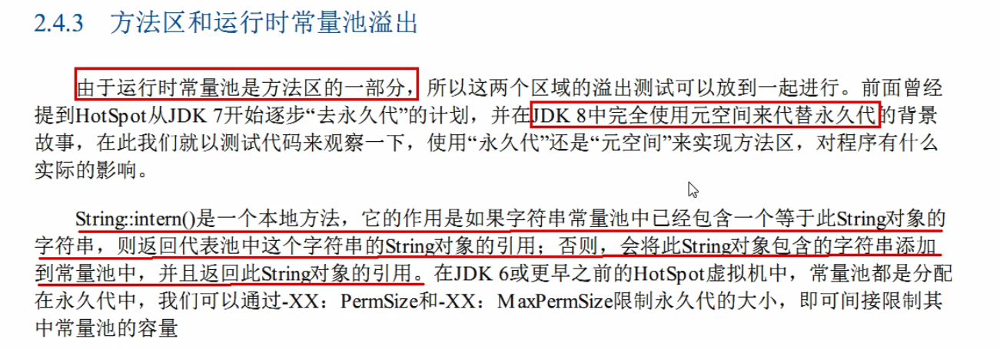
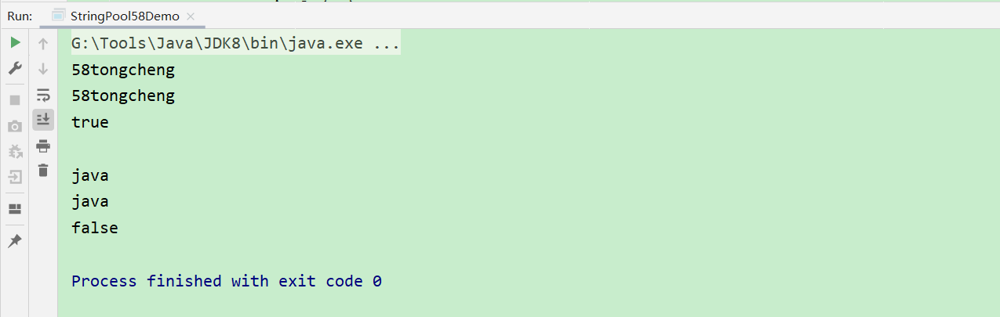
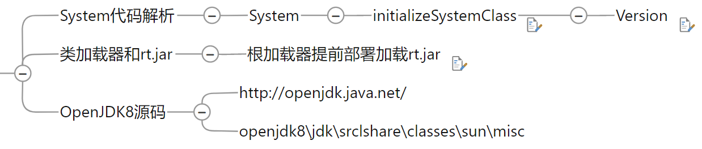
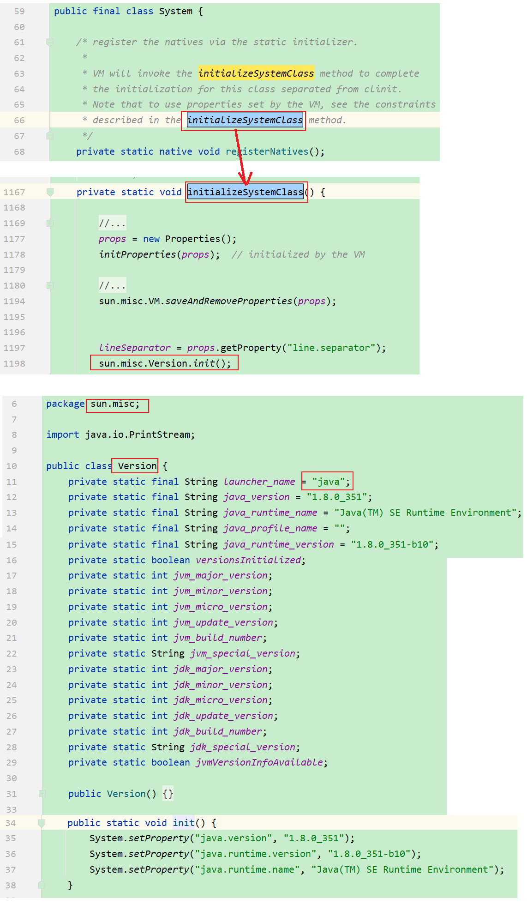
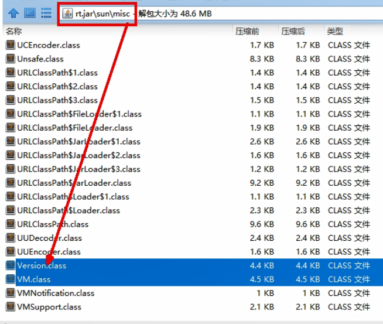
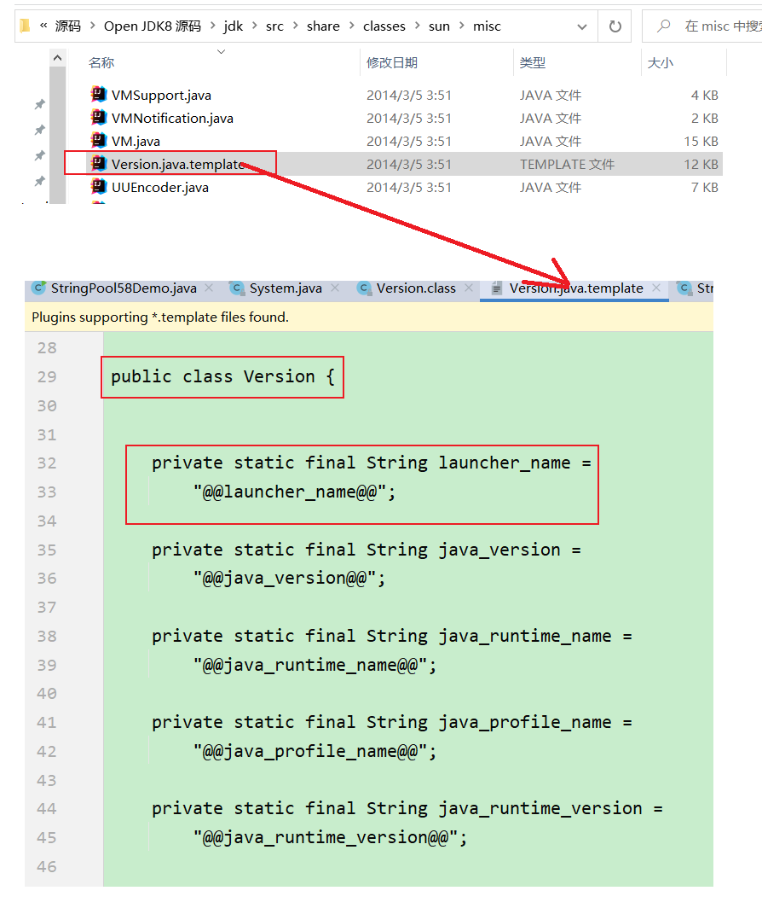
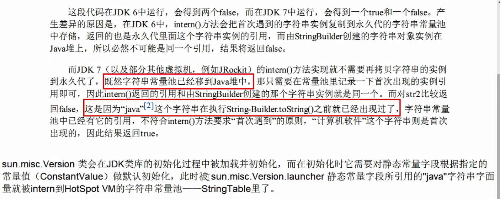
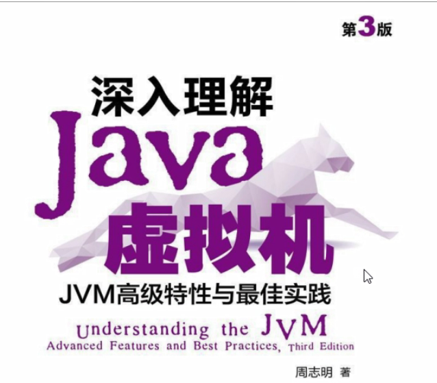

# 二、尚硅谷大厂面试第三季

## 1 58同城的java字符串常量池

### 1.1 代码

```java
package com.hhf.study.javase;

public class StringPool58Demo {
    public static void main(String[] args) {
        String s1 = new StringBuilder().append("58").append("tongcheng").toString();
        String s2 = s1.intern();
        System.out.println(s1);
        System.out.println(s2);
        System.out.println(s1 == s2);
        System.out.println();
        String s3 = new StringBuilder().append("ja").append("va").toString();
        String s4 = s3.intern();
        System.out.println(s3);
        System.out.println(s4);
        System.out.println(s3 == s4);
    }
}
```

### 1.2 intern()方法

```java
    /**
     * Returns a canonical representation for the string object.
     * <p>
     * A pool of strings, initially empty, is maintained privately by the
     * class {@code String}.
     * <p>
     * When the intern method is invoked, if the pool already contains a
     * string equal to this {@code String} object as determined by
     * the {@link #equals(Object)} method, then the string from the pool is
     * returned. Otherwise, this {@code String} object is added to the
     * pool and a reference to this {@code String} object is returned.
     * <p>
     * It follows that for any two strings {@code s} and {@code t},
     * {@code s.intern() == t.intern()} is {@code true}
     * if and only if {@code s.equals(t)} is {@code true}.
     * <p>
     * All literal strings and string-valued constant expressions are
     * interned. String literals are defined in section 3.10.5 of the
     * <cite>The Java&trade; Language Specification</cite>.
     *
     * @return  a string that has the same contents as this string, but is
     *          guaranteed to be from a pool of unique strings.
     */
    public native String intern();
```



### 1.3 上述代码的执行结果与分析

#### 1.3.1 执行结果



#### 1.3.2 分析

按照代码结果，java字符串答案为false 必然是两个不同的java，那另外一个java字符串如何加载进来的?

有一个初始化的java字符串(JDK出娘胎自带的)， 在加载`sun.misc.Version`这个类的时候进入常量池

### 1.4 OpenJDK8底层源码说明



#### 1.4.1 System代码解析



#### 1.4.2 类加载器和`rt.jar`

根加载器提前部署加载`rt.jar`



#### 1.4.3 OpenJDK源码

[OpenJDK官网](https://openjdk.org/)

`openjdk8\jdk\src\share\classes\sun\misc`



### 1.5 总结



### 1.6 考察点

- intern()方法
- 是否阅读过《深入理解java虚拟机》书

