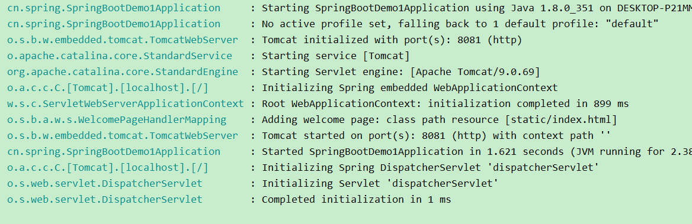
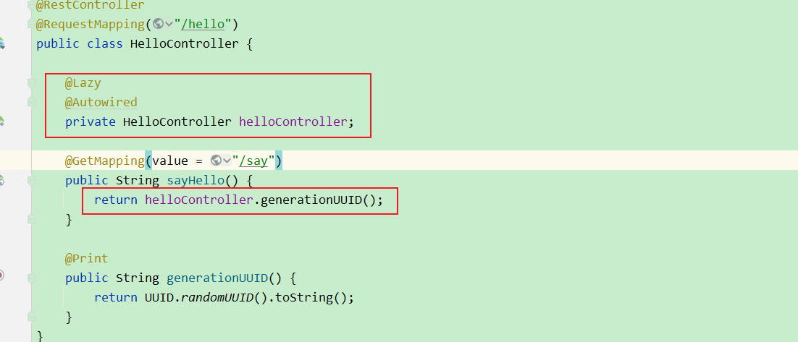
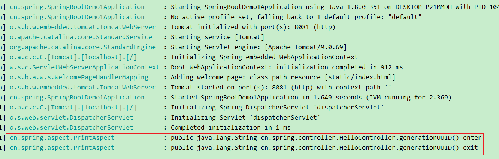
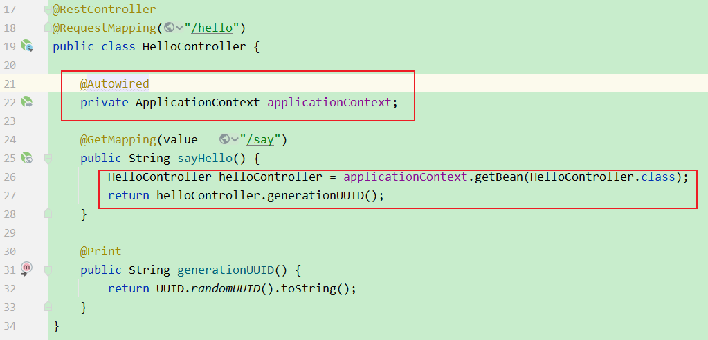
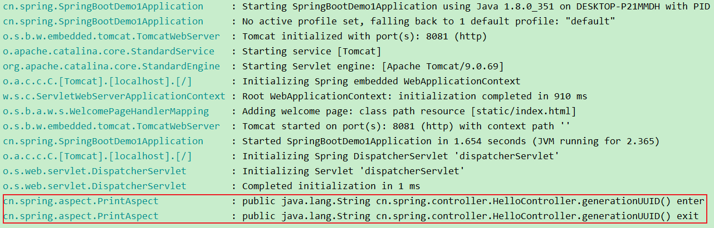
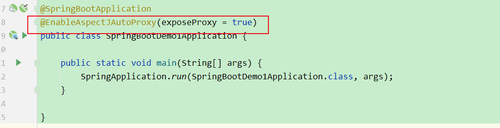
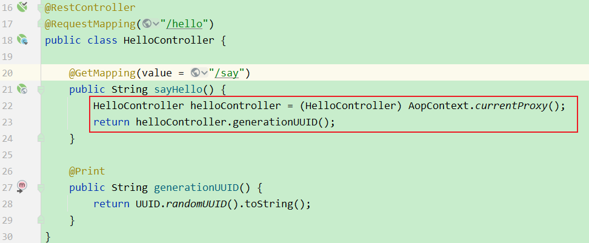
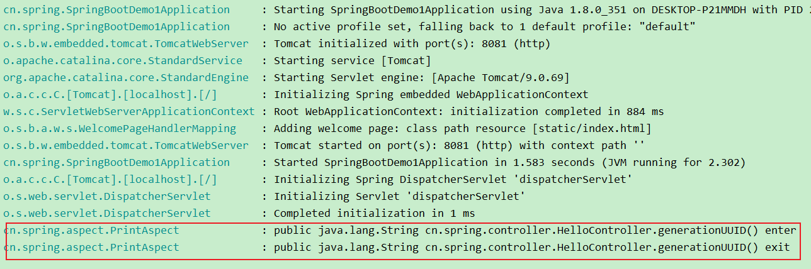

# SpringAop失效及解决方案

## 一 问题

我们在使用spring的注解时，稍不注意就很有可能会遇到注解没有生效的情况，比如下面这段代码，在发生类内调用时就出现了问题

### 1. pom.xml

```xml
<?xml version="1.0" encoding="UTF-8"?>
<project xmlns="http://maven.apache.org/POM/4.0.0" xmlns:xsi="http://www.w3.org/2001/XMLSchema-instance"
         xsi:schemaLocation="http://maven.apache.org/POM/4.0.0 https://maven.apache.org/xsd/maven-4.0.0.xsd">
    <modelVersion>4.0.0</modelVersion>
    <groupId>cn.spring</groupId>
    <artifactId>spring-boot-demo1</artifactId>
    <version>0.0.1-SNAPSHOT</version>
    <name>spring-boot-demo1</name>
    <description>spring-boot-demo1</description>
    <properties>
        <java.version>1.8</java.version>
        <project.build.sourceEncoding>UTF-8</project.build.sourceEncoding>
        <project.reporting.outputEncoding>UTF-8</project.reporting.outputEncoding>
        <spring-boot.version>2.7.6</spring-boot.version>
    </properties>
    <dependencies>
        <dependency>
            <groupId>org.springframework.boot</groupId>
            <artifactId>spring-boot-starter-web</artifactId>
        </dependency>

        <dependency>
            <groupId>org.projectlombok</groupId>
            <artifactId>lombok</artifactId>
            <optional>true</optional>
        </dependency>
        <dependency>
            <groupId>org.springframework.boot</groupId>
            <artifactId>spring-boot-starter-test</artifactId>
            <scope>test</scope>
        </dependency>
        <dependency>
            <groupId>org.springframework.boot</groupId>
            <artifactId>spring-boot-starter-logging</artifactId>
        </dependency>

        <dependency>
            <groupId>org.springframework.boot</groupId>
            <artifactId>spring-boot-starter-aop</artifactId>
        </dependency>
    </dependencies>
    <dependencyManagement>
        <dependencies>
            <dependency>
                <groupId>org.springframework.boot</groupId>
                <artifactId>spring-boot-dependencies</artifactId>
                <version>${spring-boot.version}</version>
                <type>pom</type>
                <scope>import</scope>
            </dependency>
        </dependencies>
    </dependencyManagement>

    <build>
        <plugins>
            <plugin>
                <groupId>org.apache.maven.plugins</groupId>
                <artifactId>maven-compiler-plugin</artifactId>
                <version>3.8.1</version>
                <configuration>
                    <source>1.8</source>
                    <target>1.8</target>
                    <encoding>UTF-8</encoding>
                </configuration>
            </plugin>
            <plugin>
                <groupId>org.springframework.boot</groupId>
                <artifactId>spring-boot-maven-plugin</artifactId>
                <version>${spring-boot.version}</version>
                <configuration>
                    <mainClass>cn.spring.SpringBootDemo1Application</mainClass>
                    <skip>true</skip>
                </configuration>
                <executions>
                    <execution>
                        <id>repackage</id>
                        <goals>
                            <goal>repackage</goal>
                        </goals>
                    </execution>
                </executions>
            </plugin>
        </plugins>
    </build>

</project>

```

### 2. application.yaml

```yaml
# 应用服务 WEB 访问端口
server:
  port: 8081
logging:
  level:
    root: info
```

### 3. SpringBootDemo1Application

```java
package cn.spring;

import org.springframework.boot.SpringApplication;
import org.springframework.boot.autoconfigure.SpringBootApplication;

@SpringBootApplication
public class SpringBootDemo1Application {

    public static void main(String[] args) {
        SpringApplication.run(SpringBootDemo1Application.class, args);
    }

}

```


### 4. @Print

```java
package cn.spring.annotation;

import java.lang.annotation.ElementType;
import java.lang.annotation.Retention;
import java.lang.annotation.RetentionPolicy;
import java.lang.annotation.Target;

@Target(ElementType.METHOD)
@Retention(RetentionPolicy.RUNTIME)
public @interface Print {
     String value() default "";
}

```

### 5. PrintAspect

```java
package cn.spring.aspect;

import lombok.extern.slf4j.Slf4j;
import org.aspectj.lang.ProceedingJoinPoint;
import org.aspectj.lang.annotation.Around;
import org.aspectj.lang.annotation.Aspect;
import org.aspectj.lang.annotation.Pointcut;
import org.aspectj.lang.reflect.MethodSignature;
import org.springframework.stereotype.Component;

import java.lang.reflect.Method;

@Component
@Aspect
@Slf4j
public class PrintAspect {
    @Pointcut("execution(* cn.spring.controller.*.*(..)) && @annotation(cn.spring.annotation.Print)")
    public void printPointCut() {

    }

    @Around("printPointCut()")
    public Object around(ProceedingJoinPoint joinPoint) {
        MethodSignature methodSignature = (MethodSignature) joinPoint.getSignature();
        Method method = methodSignature.getMethod();

        Object[] args = joinPoint.getArgs();
        Object result = null;
        try {
            // 环绕前置通知
            log.info("{} enter", method);
            result = joinPoint.proceed(args);
        } catch (Throwable e) {
            // 环绕异常通知
            log.error("{} exception:", method, e);
        } finally {
            // 环绕后置通知
            log.info("{} exit", method);
        }

        return result;
    }
}

```

### 6. HelloController

#### 6.1. AOP失效代码

```java
package cn.spring.controller;

import cn.spring.annotation.Print;
import org.springframework.web.bind.annotation.GetMapping;
import org.springframework.web.bind.annotation.RequestMapping;
import org.springframework.web.bind.annotation.RestController;

import java.util.UUID;

@RestController
@RequestMapping("/hello")
public class HelloController {

    @GetMapping(value = "/say")
    public String sayHello() {
        return generationUUID();
    }

    @Print
    public String generationUUID() {
        return UUID.randomUUID().toString();
    }
}

```

##### 6.1.1. 测试

```shell
GET http://localhost:8081/hello/say
```




我们期待的日志并没有出现

#### 6.2. 原因分析

这是什么原因呢？
显然HelloController中的`sayHello()`方法，并未被aop增强。 了解AOP原理的同学想必都知道，AOP的实现有二类，如果是基于接口的，会采用动态代理，生成一个代理类，如果是基于类的，会采用CGLib生成子类，然后在子类中扩展父类中的方法。然后在代理类中对原有方法进行增强。我们直接通过this去调用类内的 `generationUUID()`方法，这种方式是没有调用代理类增强后的方法的。


### 7. 解决方案

#### 7.1. 解决方案1（懒加载）



##### 7.1.1. 测试



#### 7.2 解决方案2（ApplicationContext 获取）



##### 7.2.1. 测试



#### 7.3 解决方案3（ 利用AopContext）

通过AopContext方法获取代理对象`((Service)Aopcontext.getCurrentProxy()).testMethod();` (**注意：需要启动类上增加注解（`@EnableAspectJAutoProxy(exposeProxy = true)`）**)；

##### 7.3.1. 启动类



##### 7.3.2. HelloController




##### 7.3.3. 测试

