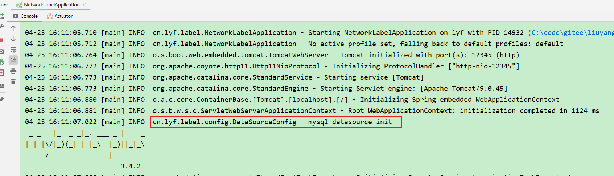
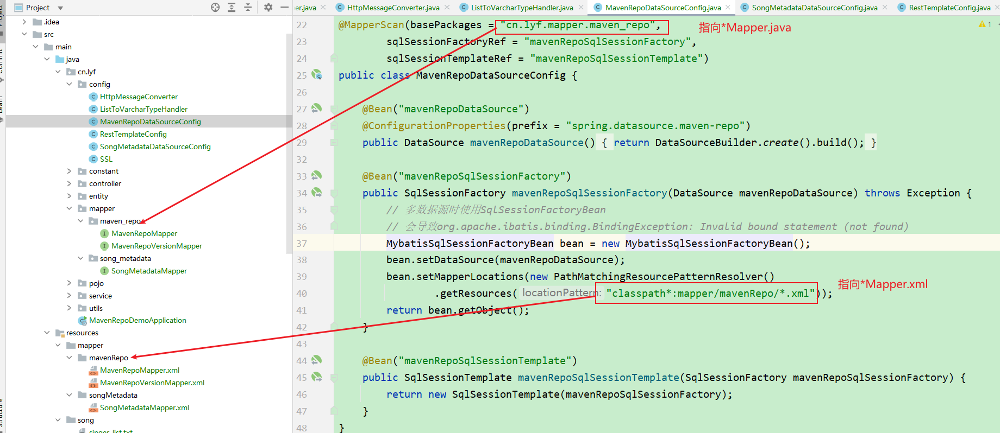
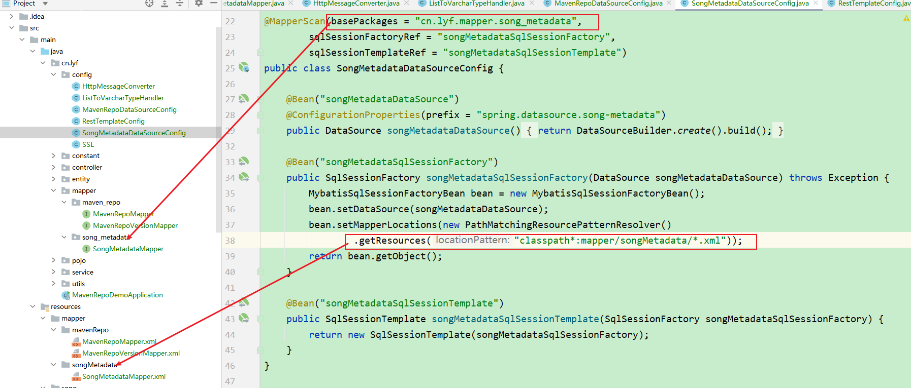

## 二、SpringBoot如何配置项目支持多数据库和多数据源

### 1 配置多数据库

#### 1.1 application.yaml 配置

```yaml
spring:
  datasource:
    # 内嵌数据库
    sqlite3:
      driver-class-name: org.sqlite.JDBC
      jdbc-url: jdbc:sqlite::resource:sqlite/sql/net_label.db
      username:
      password:
    mysql:
      jdbc-url: jdbc:mysql://127.0.0.1:3306/net_label?characterEncoding=UTF-8&serverTimezone=Asia/Shanghai&useSSL=false&useUnicode=true
      username: root
      password: 123456
      driver-class-name: com.mysql.cj.jdbc.Driver
project:
  database:
    type: mysql # 默认为sqlite3，支持mysql和sqlite3
```

#### 1.2 配置类

```java
package cn.lyf.label.config;

import lombok.extern.slf4j.Slf4j;
import org.springframework.boot.autoconfigure.condition.ConditionalOnProperty;
import org.springframework.boot.context.properties.ConfigurationProperties;
import org.springframework.boot.jdbc.DataSourceBuilder;
import org.springframework.context.annotation.Bean;
import org.springframework.context.annotation.Configuration;

import javax.sql.DataSource;

/**
 * @author lyf
 * @version 1.0
 * @classname DataSourceConfig
 * @description 增加支持内嵌数据库与MySQL数据库，可选，
 * 通过配置项project.database.type 来决定使用哪个数据库，默认是使用内嵌的sqlite数据库
 * @since 2023/4/5 15:53
 */
@Slf4j
@Configuration
public class DataSourceConfig {

    /**
     * 根据配置项database.type来配置数据源，如果此项配置值为mysql的话，那么就默认使用该数据源
     *
     * @return sqlite3DataSource
     */
    @Bean("mysqlDataSource")
    @ConditionalOnProperty(prefix = "project.database", name = "type", havingValue = "mysql")
    @ConfigurationProperties(prefix = "spring.datasource.mysql")
    public DataSource mysqlDataSource() {
        log.info("mysql datasource init");
        return DataSourceBuilder.create().build();
    }

    /**
     * 根据配置项database.type来配置数据源，如果此项未配置或者配置值为sqlite3的话，那么就默认使用该数据源
     *
     * @return sqlite3DataSource
     */
    @Bean("sqlite3DataSource")
    @ConditionalOnProperty(prefix = "project.database", name = "type", havingValue = "sqlite3", matchIfMissing = true)
    @ConfigurationProperties(prefix = "spring.datasource.sqlite3")
    public DataSource sqlite3DataSource() {
        log.info("sqlite3 datasource init");
        return DataSourceBuilder.create().build();
    }
}

```

#### 1.3 测试



### 2 配置多数据源

#### 2.1 application.yaml配置文件

```yaml
spring:
  datasource:
    maven-repo:
      driver-class-name: com.mysql.cj.jdbc.Driver
      username: root
      password: 123456
     # 这里一定要写jdbc-url而不能是url
      jdbc-url: jdbc:mysql://127.0.0.1:3306/maven_repo?characterEncoding=utf8&connectTimeout=1000&socketTimeout=3000&autoReconnect=true&useUnicode=true&useSSL=false&serverTimezone=Asia/Shanghai
    song-metadata:
      driver-class-name: com.mysql.cj.jdbc.Driver
      username: root
      password: 123456
     # 这里一定要写jdbc-url而不能是url
      jdbc-url: jdbc:mysql://127.0.0.1:3306/song_metadata?characterEncoding=utf8&connectTimeout=1000&socketTimeout=3000&autoReconnect=true&useUnicode=true&useSSL=false&serverTimezone=Asia/Shanghai

```

#### 2.2 配置类

##### 2.2.1  MavenRepoDataSourceConfig.java

```java
package cn.lyf.config;

import com.baomidou.mybatisplus.extension.spring.MybatisSqlSessionFactoryBean;
import org.apache.ibatis.session.SqlSessionFactory;
import org.mybatis.spring.SqlSessionFactoryBean;
import org.mybatis.spring.SqlSessionTemplate;
import org.mybatis.spring.annotation.MapperScan;
import org.springframework.boot.context.properties.ConfigurationProperties;
import org.springframework.boot.jdbc.DataSourceBuilder;
import org.springframework.context.annotation.Bean;
import org.springframework.context.annotation.Configuration;
import org.springframework.core.io.support.PathMatchingResourcePatternResolver;

import javax.sql.DataSource;

/**
 * @author lyf
 * @description
 * @since 2023/4/28 15:29:31
 */
@Configuration
@MapperScan(basePackages = "cn.lyf.mapper.maven_repo",
        sqlSessionFactoryRef = "mavenRepoSqlSessionFactory",
        sqlSessionTemplateRef = "mavenRepoSqlSessionTemplate")
public class MavenRepoDataSourceConfig {

    @Bean("mavenRepoDataSource")
    @ConfigurationProperties(prefix = "spring.datasource.maven-repo")
    public DataSource mavenRepoDataSource() {
        return DataSourceBuilder.create().build();
    }

    @Bean("mavenRepoSqlSessionFactory")
    public SqlSessionFactory mavenRepoSqlSessionFactory(DataSource mavenRepoDataSource) throws Exception {
        // 多数据源时使用SqlSessionFactoryBean会导致org.apache.ibatis.binding.BindingException: Invalid bound statement (not found)
        MybatisSqlSessionFactoryBean bean = new MybatisSqlSessionFactoryBean();
        bean.setDataSource(mavenRepoDataSource);
        bean.setMapperLocations(new PathMatchingResourcePatternResolver().getResources("classpath*:mapper/mavenRepo/*.xml"));
        return bean.getObject();
    }

    @Bean("mavenRepoSqlSessionTemplate")
    public SqlSessionTemplate mavenRepoSqlSessionTemplate(SqlSessionFactory mavenRepoSqlSessionFactory) {
        return new SqlSessionTemplate(mavenRepoSqlSessionFactory);
    }
}

```

##### 2.2.2 SongMetadataDataSourceConfig.java

```java
package cn.lyf.config;

import com.baomidou.mybatisplus.extension.spring.MybatisSqlSessionFactoryBean;
import org.apache.ibatis.session.SqlSessionFactory;
import org.mybatis.spring.SqlSessionFactoryBean;
import org.mybatis.spring.SqlSessionTemplate;
import org.mybatis.spring.annotation.MapperScan;
import org.springframework.boot.context.properties.ConfigurationProperties;
import org.springframework.boot.jdbc.DataSourceBuilder;
import org.springframework.context.annotation.Bean;
import org.springframework.context.annotation.Configuration;
import org.springframework.core.io.support.PathMatchingResourcePatternResolver;

import javax.sql.DataSource;

/**
 * @author lyf
 * @description
 * @since 2023/4/28 15:29:31
 */
@Configuration
@MapperScan(basePackages = "cn.lyf.mapper.song_metadata",
        sqlSessionFactoryRef = "songMetadataSqlSessionFactory",
        sqlSessionTemplateRef = "songMetadataSqlSessionTemplate")
public class SongMetadataDataSourceConfig {

    @Bean("songMetadataDataSource")
    @ConfigurationProperties(prefix = "spring.datasource.song-metadata")
    public DataSource songMetadataDataSource() {
        return DataSourceBuilder.create().build();
    }

    @Bean("songMetadataSqlSessionFactory")
    public SqlSessionFactory songMetadataSqlSessionFactory(DataSource songMetadataDataSource) throws Exception {
        MybatisSqlSessionFactoryBean bean = new MybatisSqlSessionFactoryBean();
        bean.setDataSource(songMetadataDataSource);
        bean.setMapperLocations(new PathMatchingResourcePatternResolver().getResources("classpath*:mapper/songMetadata/*.xml"));
        return bean.getObject();
    }

    @Bean("songMetadataSqlSessionTemplate")
    public SqlSessionTemplate songMetadataSqlSessionTemplate(SqlSessionFactory songMetadataSqlSessionFactory) {
        return new SqlSessionTemplate(songMetadataSqlSessionFactory);
    }
}

```

#### 2.3 说明





#### 2.4 测试

随意测试一个接口接口，只要能跑成功即可

