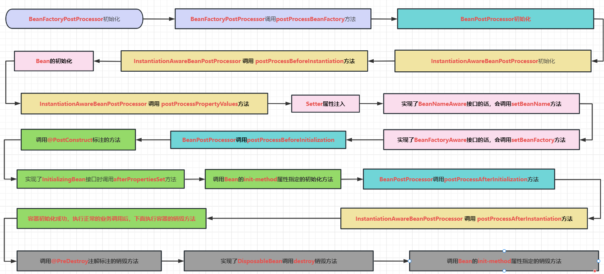

# 一、Spring的Bean的生命周期

## 1 生命周期流程图：

　　Spring Bean的完整生命周期从创建Spring容器开始，直到最终Spring容器销毁Bean，这其中包含了一系列关键点。



## 2 各类方法说明

Bean的完整生命周期经历了各种方法调用，这些方法可以划分为以下几类：

1、**Bean自身的方法**: 这个包括了Bean本身调用的方法和通过配置文件中`bean`的`init-method`和`destroy-method`指定的方法

2、**Bean级生命周期接口方法**: 这个包括了BeanNameAware、BeanFactoryAware、InitializingBean和DiposableBean这些接口的方法

3、**容器级生命周期接口方法**: 这个包括了InstantiationAwareBeanPostProcessor 和 BeanPostProcessor 这两个接口实现，一般称它们的实现类为“后处理器”。

4、**工厂后处理器接口方法**: 这个包括了AspectJWeavingEnabler, ConfigurationClassPostProcessor, CustomAutowireConfigurer等等非常有用的工厂后处理器接口的方法。工厂后处理器也是容器级的。在应用上下文装配配置文件之后立即调用。

## 3 代码验证

### 3.1 前期准备工作

#### 3.1.1 pom.xml

```xml
<?xml version="1.0" encoding="UTF-8"?>
<project xmlns="http://maven.apache.org/POM/4.0.0" xmlns:xsi="http://www.w3.org/2001/XMLSchema-instance"
         xsi:schemaLocation="http://maven.apache.org/POM/4.0.0 https://maven.apache.org/xsd/maven-4.0.0.xsd">
    <modelVersion>4.0.0</modelVersion>
    <parent>
        <groupId>org.springframework.boot</groupId>
        <artifactId>spring-boot-starter-parent</artifactId>
        <version>2.7.10</version>
        <relativePath/> <!-- lookup parent from repository -->
    </parent>
    <groupId>cn.lyf</groupId>
    <artifactId>spring-demo</artifactId>
    <version>1.0.0-SNAPSHOT</version>
    <name>spring-demo</name>
    <description>spring-demo</description>
    <properties>
        <java.version>1.8</java.version>
    </properties>
    <dependencies>
        <dependency>
            <groupId>org.springframework.boot</groupId>
            <artifactId>spring-boot-starter-web</artifactId>
        </dependency>

        <dependency>
            <groupId>org.projectlombok</groupId>
            <artifactId>lombok</artifactId>
            <optional>true</optional>
        </dependency>
        <dependency>
            <groupId>org.springframework.boot</groupId>
            <artifactId>spring-boot-starter-test</artifactId>
            <scope>test</scope>
        </dependency>
        <dependency>
            <groupId>cn.hutool</groupId>
            <artifactId>hutool-all</artifactId>
            <version>5.8.15</version>
        </dependency>
    </dependencies>

    <build>
        <plugins>
            <plugin>
                <groupId>org.springframework.boot</groupId>
                <artifactId>spring-boot-maven-plugin</artifactId>
                <configuration>
                    <excludes>
                        <exclude>
                            <groupId>org.projectlombok</groupId>
                            <artifactId>lombok</artifactId>
                        </exclude>
                    </excludes>
                </configuration>
            </plugin>
        </plugins>
    </build>

</project>

```

#### 3.4.2 logback.xml

```xml
<configuration>

    <appender name="boldRed" class="ch.qos.logback.core.ConsoleAppender">
        <encoder>
            <pattern>%highlight([%level]) %d{HH:mm:ss.SSS} %boldRed([%thread]) - %msg %n</pattern>
        </encoder>
    </appender>

    <appender name="boldBlue" class="ch.qos.logback.core.ConsoleAppender">
        <encoder>
            <pattern>%highlight([%level]) %d{HH:mm:ss.SSS} %boldBlue([%thread]) - %msg %n</pattern>
        </encoder>
    </appender>

    <appender name="boldGreen" class="ch.qos.logback.core.ConsoleAppender">
        <encoder>
            <pattern>%highlight([%level]) %d{HH:mm:ss.SSS} %boldGreen([%thread]) - %msg %n</pattern>
        </encoder>
    </appender>

    <appender name="boldYellow" class="ch.qos.logback.core.ConsoleAppender">
        <encoder>
            <pattern>%highlight([%level]) %d{HH:mm:ss.SSS} %boldYellow([%thread]) - %msg %n</pattern>
        </encoder>
    </appender>

    <appender name="boldMagenta" class="ch.qos.logback.core.ConsoleAppender">
        <encoder>
            <pattern>%highlight([%level]) %d{HH:mm:ss.SSS} %boldMagenta([%thread]) - %msg %n</pattern>
        </encoder>
    </appender>

    <appender name="boldCyan" class="ch.qos.logback.core.ConsoleAppender">
        <encoder>
            <pattern>%highlight([%level]) %d{HH:mm:ss.SSS} %boldCyan([%thread]) - %msg %n</pattern>
        </encoder>
    </appender>

    <appender name="boldWhite" class="ch.qos.logback.core.ConsoleAppender">
        <encoder>
            <pattern>%highlight([%level]) %d{HH:mm:ss.SSS} %boldWhite([%thread]) - %msg %n</pattern>
        </encoder>
    </appender>

    <appender name="STDOUT" class="ch.qos.logback.classic.sift.SiftingAppender">
        <discriminator>
            <key>color</key>
            <defaultValue>cyan</defaultValue>
        </discriminator>
        <sift>
            <appender name="thread-${thread}" class="ch.qos.logback.core.ConsoleAppender">
                <encoder>
                    <pattern>%highlight([%-5level]) %d{HH:mm:ss.SSS} %boldWhite([%thread]) %-35logger{35} - %${color}(%msg) %n</pattern>
                </encoder>
            </appender>
        </sift>
    </appender>

    <logger name="A" level="DEBUG" additivity="false">
        <appender-ref ref="boldRed"/>
    </logger>

    <logger name="B" level="DEBUG" additivity="false">
        <appender-ref ref="boldBlue"/>
    </logger>

    <logger name="C" level="DEBUG" additivity="false">
        <appender-ref ref="boldGreen"/>
    </logger>

    <logger name="D" level="DEBUG" additivity="false">
        <appender-ref ref="boldYellow"/>
    </logger>

    <logger name="E" level="DEBUG" additivity="false">
        <appender-ref ref="boldMagenta"/>
    </logger>

    <logger name="F" level="DEBUG" additivity="false">
        <appender-ref ref="boldCyan"/>
    </logger>

    <logger name="G" level="DEBUG" additivity="false">
        <appender-ref ref="boldWhite"/>
    </logger>


    <root level="ERROR">
        <appender-ref ref="STDOUT"/>
    </root>
</configuration>
```

### 3.2 实体类Person

就是一个简单的实体类，实现了`BeanNameAware, BeanFactoryAware, InitializingBean, DisposableBean`四个接口

使用`@PostConstruct`标注初始化方法和`@PreDestroy`标注销毁方法

声明`init-method`和`destroy-method`方法


```java
package cn.lyf.pojo;

import lombok.EqualsAndHashCode;
import lombok.ToString;
import lombok.extern.slf4j.Slf4j;
import org.springframework.beans.BeansException;
import org.springframework.beans.factory.*;

import javax.annotation.PostConstruct;
import javax.annotation.PreDestroy;

/**
 * @author lyf
 * @version 1.0
 * @classname Person
 * @description
 * @since 2023/4/18 12:33
 */
@Slf4j
@ToString
@EqualsAndHashCode
public class Person implements BeanNameAware, BeanFactoryAware, InitializingBean, DisposableBean {
    private String name;
    private String address;
    private String phone;

    @ToString.Exclude
    private BeanFactory beanFactory;
    private String beanName;

    public String getName() {
        return name;
    }

    public void setName(String name) {
        System.out.printf("setter 注入 name: %s\n", name);
        this.name = name;
    }

    public String getAddress() {
        return address;
    }

    public void setAddress(String address) {
        System.out.printf("setter 注入 address: %s\n", address);
        this.address = address;
    }

    public String getPhone() {
        return phone;
    }

    public void setPhone(String phone) {
        System.out.printf("setter 注入 phone: %s\n", phone);
        this.phone = phone;
    }

    public Person() {
        System.out.println("调用Person的构造器实例化");
    }

    /**
     * BeanFactoryAware 接口方法
     *
     * @param beanFactory beanFactory
     * @throws BeansException BeansException
     */
    @Override
    public void setBeanFactory(BeanFactory beanFactory) throws BeansException {
        System.out.println("调用BeanFactoryAware接口方法setBeanFactory, beanFactory");
        this.beanFactory = beanFactory;
    }

    /**
     * BeanNameAware 接口方法
     *
     * @param beanName beanName
     */
    @Override
    public void setBeanName(String beanName) {
        System.out.printf("调用BeanNameAware接口方法setBeanName, beanName: %s\n", beanName);
        this.beanName = beanName;
    }

    /**
     * DisposableBean 接口方法
     *
     * @throws Exception Exception
     */
    @Override
    public void destroy() throws Exception {
        System.out.println("调用DisposableBean接口方法destroy");
    }

    /**
     * InitializingBean 接口方法
     *
     * @throws Exception Exception
     */
    @Override
    public void afterPropertiesSet() throws Exception {
        System.out.println("调用InitializingBean接口方法afterPropertiesSet");
    }

    public void myInit() {
        System.out.println("调用Bean的init-method属性指定的初始化方法, myInit()...");
    }

    public void myDestroy() {
        System.out.println("调用Bean的init-method属性指定的销毁方法, myDestroy()...");
    }

    @PostConstruct
    public void MyInit2() {
        System.out.println("通过@PostConstruct注解标注的初始化方法, MyInit2()...");
    }

    @PreDestroy
    public void myDestroy2() {
        System.out.println("通过@PreDestroy注解标注的销毁方法, myDestroy2()...");
    }
}

```

### 3.3 自定义BeanFactory的后处理器

```java
package cn.lyf.processor;

import cn.hutool.core.util.PhoneUtil;
import lombok.extern.slf4j.Slf4j;
import org.springframework.beans.BeansException;
import org.springframework.beans.factory.NoSuchBeanDefinitionException;
import org.springframework.beans.factory.config.BeanDefinition;
import org.springframework.beans.factory.config.BeanFactoryPostProcessor;
import org.springframework.beans.factory.config.ConfigurableListableBeanFactory;

/**
 * @author lyf
 * @version 1.0
 * @classname MyBeanFactoryPostProcessor
 * @description 我的Bean工厂后处理器类
 * @since 2023/4/18 13:08
 */
@Slf4j
public class MyBeanFactoryPostProcessor implements BeanFactoryPostProcessor {
    public MyBeanFactoryPostProcessor() {
        super();
        System.out.println("MyBeanFactoryPostProcessor 构造器被调用了...");
    }
    @Override
    public void postProcessBeanFactory(ConfigurableListableBeanFactory beanFactory) throws BeansException {
        System.out.println("MyBeanFactoryPostProcessor调用了postProcessBeanFactory方法");
        BeanDefinition personBd;
        try {
            personBd = beanFactory.getBeanDefinition("person");
            String phone = (String) personBd.getPropertyValues().get("phone");
            boolean isPhone = PhoneUtil.isPhone(phone);
            if (!isPhone) {
                throw new IllegalArgumentException("非法的手机号码: " + phone);
            }
        } catch (NoSuchBeanDefinitionException e) {
            e.printStackTrace();
        }
    }
}

```

### 3.4 自定义Bean的后处理器

```java
package cn.lyf.processor;

import lombok.extern.slf4j.Slf4j;
import org.springframework.beans.BeansException;
import org.springframework.beans.factory.config.BeanPostProcessor;

/**
 * @author lyf
 * @version 1.0
 * @classname MyBeanPostProcessor
 * @description
 * @since 2023/4/18 13:02
 */
@Slf4j
public class MyBeanPostProcessor implements BeanPostProcessor {
    public MyBeanPostProcessor() {
        super();
        System.out.println("MyBeanPostProcessor 构造器执行了...");
    }

    @Override
    public Object postProcessBeforeInitialization(Object bean, String beanName) throws BeansException {
        System.out.printf("MyBeanPostProcessor接口方法postProcessBeforeInitialization对属性进行更改, bean: %s, beanName: %s\n",
                bean, beanName);
        return BeanPostProcessor.super.postProcessBeforeInitialization(bean, beanName);
    }

    @Override
    public Object postProcessAfterInitialization(Object bean, String beanName) throws BeansException {
        System.out.printf("MyBeanPostProcessor接口方法postProcessAfterInitialization对属性进行更改, bean: %s, beanName: %s\n",
                bean, beanName);
        return BeanPostProcessor.super.postProcessAfterInitialization(bean, beanName);
    }
}

```

### 3.5 实现`InstantiationAwareBeanPostProcessor`接口，本质是`BeanPostProcessor`的子接口

```java
package cn.lyf.processor;

import lombok.extern.slf4j.Slf4j;
import org.springframework.beans.BeansException;
import org.springframework.beans.PropertyValues;
import org.springframework.beans.factory.config.InstantiationAwareBeanPostProcessor;

/**
 * @author lyf
 * @version 1.0
 * @classname MyInstantiationAwareBeanPostProcessor
 * @description
 * @since 2023/4/18 13:16
 */
@Slf4j
public class MyInstantiationAwareBeanPostProcessor implements InstantiationAwareBeanPostProcessor {
    public MyInstantiationAwareBeanPostProcessor() {
        super();
        System.out.println("MyInstantiationAwareBeanPostProcessor的构造器...");
    }

    @Override
    public Object postProcessBeforeInstantiation(Class<?> beanClass, String beanName) throws BeansException {
        System.out.println("MyInstantiationAwareBeanPostProcessor调用postProcessBeforeInstantiation方法");
        return null;
    }


    @Override
    public Object postProcessAfterInitialization(Object bean, String beanName) throws BeansException {
        System.out.println("MyInstantiationAwareBeanPostProcessor调用postProcessAfterInitialization方法");
        return bean;
    }

    @Override
    public PropertyValues postProcessProperties(PropertyValues pvs, Object bean, String beanName) throws BeansException {
        System.out.println("MyInstantiationAwareBeanPostProcessor调用postProcessPropertyValues方法");
        return pvs;
    }
}

```

### 3.6 bean的生命周期测试类

```java
package cn.lyf;

import cn.lyf.pojo.Person;
import cn.lyf.processor.MyBeanFactoryPostProcessor;
import cn.lyf.processor.MyBeanPostProcessor;
import cn.lyf.processor.MyInstantiationAwareBeanPostProcessor;
import org.springframework.beans.factory.config.BeanDefinition;
import org.springframework.beans.factory.support.DefaultListableBeanFactory;
import org.springframework.context.annotation.AnnotationConfigUtils;
import org.springframework.context.support.GenericApplicationContext;

public class BeanLifeCycleApplication {

    public static void main(String[] args) {
        GenericApplicationContext applicationContext = new GenericApplicationContext();
        DefaultListableBeanFactory beanFactory = applicationContext.getDefaultListableBeanFactory();
        // 注册常用的Bean的后处理器和BeanFactory后处理器
        AnnotationConfigUtils.registerAnnotationConfigProcessors(beanFactory);
        // 添加自定义的Bean的后处理器
        applicationContext.registerBean(MyBeanPostProcessor.class);
        // 添加自定义的BeanFactory的后处理器
        applicationContext.registerBean(MyBeanFactoryPostProcessor.class);
        // 添加InstantiationAwareBeanPostProcessor接口的实现类
        applicationContext.registerBean(MyInstantiationAwareBeanPostProcessor.class);


        applicationContext.registerBean("person", Person.class);

        // 拿到Person类的BeanDefinition
        BeanDefinition personBeanDefinition = applicationContext.getBeanDefinition("person");

        // 设置init-method
        personBeanDefinition.setInitMethodName("myInit");
        // 设置destroy-method
        personBeanDefinition.setDestroyMethodName("myDestroy");
        // 添加属性值
        personBeanDefinition.getPropertyValues().addPropertyValue("name", "张三");
        personBeanDefinition.getPropertyValues().addPropertyValue("address", "杭州市上城区");
        personBeanDefinition.getPropertyValues().addPropertyValue("phone", "18678771656");

        // 刷新容器
        applicationContext.refresh();
        System.out.println("容器初始化完成");

        // 获取Person对象
        Person person = applicationContext.getBean(Person.class);
        // 使用person对象
        System.out.println("person: " + person);

        // 销毁容器
        applicationContext.close();
        System.out.println("容器销毁完成");
    }
}

```

### 3.7 运行结果

```verilog
MyBeanFactoryPostProcessor 构造器被调用了...
MyBeanFactoryPostProcessor调用了postProcessBeanFactory方法
MyBeanPostProcessor 构造器执行了...
MyInstantiationAwareBeanPostProcessor的构造器...
MyInstantiationAwareBeanPostProcessor调用postProcessBeforeInstantiation方法
调用Person的构造器实例化
MyInstantiationAwareBeanPostProcessor调用postProcessPropertyValues方法
setter 注入 name: 张三
setter 注入 address: 杭州市上城区
setter 注入 phone: 18678771656
调用BeanNameAware接口方法setBeanName, beanName: person
调用BeanFactoryAware接口方法setBeanFactory, beanFactory
MyBeanPostProcessor接口方法postProcessBeforeInitialization对属性进行更改, bean: Person(name=张三, address=杭州市上城区, phone=18678771656, beanName=person), beanName: person
通过@PostConstruct注解标注的初始化方法, MyInit2()...
调用InitializingBean接口方法afterPropertiesSet
调用Bean的init-method属性指定的初始化方法, myInit()...
MyBeanPostProcessor接口方法postProcessAfterInitialization对属性进行更改, bean: Person(name=张三, address=杭州市上城区, phone=18678771656, beanName=person), beanName: person
MyInstantiationAwareBeanPostProcessor调用postProcessAfterInitialization方法
容器初始化完成
person: Person(name=张三, address=杭州市上城区, phone=18678771656, beanName=person)
通过@PreDestroy注解标注的销毁方法, myDestroy2()...
调用DisposableBean接口方法destroy
调用Bean的destroy-method属性指定的销毁方法, myDestroy()...
容器销毁完成
```

