# 一. NIO 基础

non-blocking io 非阻塞 IO

## 1. 三大组件

### 1.1 Channel & Buffer

channel 有一点类似于 stream，它就是读写数据的**双向通道**，可以从 channel 将数据读入 buffer，也可以将 buffer 的数据写入 channel，而之前的 stream 要么是输入，要么是输出，channel 比 stream 更为底层


常见的 Channel 有

* FileChannel
* DatagramChannel
* SocketChannel
* ServerSocketChannel


buffer 则用来缓冲读写数据，常见的 buffer 有

* ByteBuffer
  * MappedByteBuffer
  * DirectByteBuffer
  * HeapByteBuffer
* ShortBuffer
* IntBuffer
* LongBuffer
* FloatBuffer
* DoubleBuffer
* CharBuffer


### 1.2 Selector

selector 单从字面意思不好理解，需要结合服务器的设计演化来理解它的用途

#### 1.2.1 多线程版设计

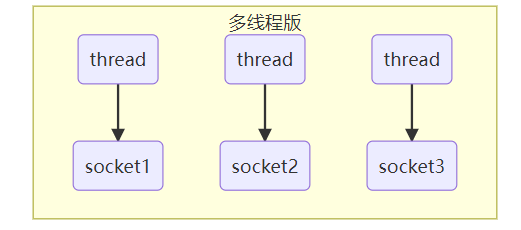

#### 1.2.2 ⚠️ 多线程版缺点

* 内存占用高
* 线程上下文切换成本高
* 只适合连接数少的场景


#### 1.2.3 线程池版设计

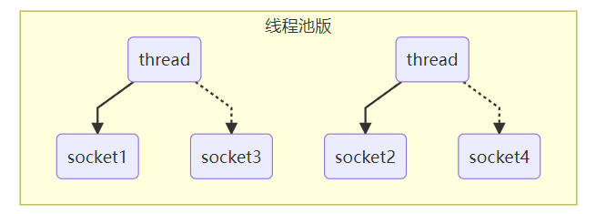

#### 1.2.4 ⚠️ 线程池版缺点

* 阻塞模式下，线程仅能处理一个 socket 连接
* 仅适合短连接场景


#### 1.2.5 selector 版设计

selector 的作用就是配合一个线程来管理多个 channel，获取这些 channel 上发生的事件，这些 channel 工作在非阻塞模式下，不会让线程吊死在一个 channel 上。适合连接数特别多，但流量低的场景（low traffic）

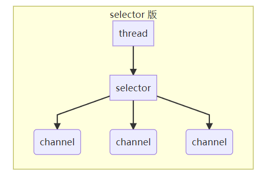

调用 selector 的 select() 会阻塞直到 channel 发生了读写就绪事件，这些事件发生，select 方法就会返回这些事件交给 thread 来处理


## 2. ByteBuffer

### 2.1 项目准备

#### 2.1.1 Maven依赖

```xml
<?xml version="1.0" encoding="UTF-8"?>
<project xmlns="http://maven.apache.org/POM/4.0.0"
         xmlns:xsi="http://www.w3.org/2001/XMLSchema-instance"
         xsi:schemaLocation="http://maven.apache.org/POM/4.0.0 http://maven.apache.org/xsd/maven-4.0.0.xsd">
    <modelVersion>4.0.0</modelVersion>

    <groupId>cn.lyf</groupId>
    <artifactId>heima-netty</artifactId>
    <version>1.0-SNAPSHOT</version>

    <properties>
        <maven.compiler.source>8</maven.compiler.source>
        <maven.compiler.target>8</maven.compiler.target>
    </properties>

    <dependencies>
        <dependency>
            <groupId>io.netty</groupId>
            <artifactId>netty-all</artifactId>
            <version>4.1.79.Final</version>
        </dependency>
        <dependency>
            <groupId>org.projectlombok</groupId>
            <artifactId>lombok</artifactId>
            <version>1.18.24</version>
        </dependency>
        <dependency>
            <groupId>com.google.code.gson</groupId>
            <artifactId>gson</artifactId>
            <version>2.9.0</version>
        </dependency>
        <dependency>
            <groupId>com.google.guava</groupId>
            <artifactId>guava</artifactId>
            <version>31.1-jre</version>
        </dependency>

        <dependency>
            <groupId>ch.qos.logback</groupId>
            <artifactId>logback-classic</artifactId>
            <version>1.2.11</version>
        </dependency>
        <dependency>
            <groupId>com.google.protobuf</groupId>
            <artifactId>protobuf-java</artifactId>
            <version>3.21.3</version>
        </dependency>
    </dependencies>
</project>
```

#### 2.1.2 logback.xml

```xml
<?xml version="1.0" encoding="UTF-8"?>
<configuration
        xmlns="http://ch.qos.logback/xml/ns/logback"
        xmlns:xsi="http://www.w3.org/2001/XMLSchema-instance"
        xsi:schemaLocation="http://ch.qos.logback/xml/ns/logback logback.xsd">
    <!-- 输出控制，格式控制-->
    <appender name="STDOUT" class="ch.qos.logback.core.ConsoleAppender">
        <encoder>
            <pattern>%date{HH:mm:ss} [%-5level] [%thread] %logger{17} - %m%n </pattern>
        </encoder>
    </appender>
    <!--<appender name="FILE" class="ch.qos.logback.core.rolling.RollingFileAppender">
        &lt;!&ndash; 日志文件名称 &ndash;&gt;
        <file>logFile.log</file>
        <rollingPolicy class="ch.qos.logback.core.rolling.TimeBasedRollingPolicy">
            &lt;!&ndash; 每天产生一个新的日志文件 &ndash;&gt;
            <fileNamePattern>logFile.%d{yyyy-MM-dd}.log</fileNamePattern>
            &lt;!&ndash; 保留 15 天的日志 &ndash;&gt;
            <maxHistory>15</maxHistory>
        </rollingPolicy>
        <encoder>
            <pattern>%date{HH:mm:ss} [%-5level] [%thread] %logger{17} - %m%n </pattern>
        </encoder>
    </appender>-->

    <!-- 用来控制查看那个类的日志内容（对mybatis name 代表命名空间） -->
    <logger name="cn.lyf" level="DEBUG" additivity="false">
        <appender-ref ref="STDOUT"/>
    </logger>

    <logger name="io.netty.handler.logging.LoggingHandler" level="DEBUG" additivity="false">
        <appender-ref ref="STDOUT"/>
    </logger>

    <root level="ERROR">
        <appender-ref ref="STDOUT"/>
    </root>
</configuration>
```

### 2.2 ByteBuffer 入门小case

有一普通文本文件 data.txt，内容为

```
1234567890abcd
```

使用 FileChannel 来读取文件内容

```java
package cn.lyf.day1.c1;

import lombok.extern.slf4j.Slf4j;

import java.io.IOException;
import java.io.RandomAccessFile;
import java.net.URL;
import java.nio.ByteBuffer;
import java.nio.channels.FileChannel;

/**
 * @author lyf
 * @version 1.0
 * @classname Demo1_1_ByteBufferFlipClear
 * @description
 * @since 2022/7/24 14:47
 */
@Slf4j
public class Demo1_1_ByteBufferFlipClear {
    public static void main(String[] args) {
        // 1读取data.txt
        try (FileChannel channel = new RandomAccessFile(getPath("data.txt"), "rw").getChannel()) {
            // 2 创建ByteBuffer缓冲区
            ByteBuffer byteBuffer = ByteBuffer.allocate(10);
            int read;
            while ((read = channel.read(byteBuffer)) != -1) {
                // 4 切换为读模式
                byteBuffer.flip();

                log.debug("读到的字节数============：{}", read);
                while (byteBuffer.hasRemaining()) {
                    byte b = byteBuffer.get();
                    log.debug("读到的字节为：{}", (char) b);
                }
                // 5 切换为写模式
                byteBuffer.clear();
            }
        } catch (IOException e) {
            log.error("", e);
        }
    }

    public static String getPath(String name) {
        URL resource = Thread.currentThread().getContextClassLoader().getResource(name);
        if (resource == null) {
            return null;
        }
        return resource.getPath();
    }
}

```

输出

```
15:16:04 [DEBUG] [main] c.l.d.c.Demo1_1_ByteBufferFlipClear - 读到的字节数============：10
15:16:04 [DEBUG] [main] c.l.d.c.Demo1_1_ByteBufferFlipClear - 读到的字节为：1
15:16:04 [DEBUG] [main] c.l.d.c.Demo1_1_ByteBufferFlipClear - 读到的字节为：2
15:16:04 [DEBUG] [main] c.l.d.c.Demo1_1_ByteBufferFlipClear - 读到的字节为：3
15:16:04 [DEBUG] [main] c.l.d.c.Demo1_1_ByteBufferFlipClear - 读到的字节为：4
15:16:04 [DEBUG] [main] c.l.d.c.Demo1_1_ByteBufferFlipClear - 读到的字节为：5
15:16:04 [DEBUG] [main] c.l.d.c.Demo1_1_ByteBufferFlipClear - 读到的字节为：6
15:16:04 [DEBUG] [main] c.l.d.c.Demo1_1_ByteBufferFlipClear - 读到的字节为：7
15:16:04 [DEBUG] [main] c.l.d.c.Demo1_1_ByteBufferFlipClear - 读到的字节为：8
15:16:04 [DEBUG] [main] c.l.d.c.Demo1_1_ByteBufferFlipClear - 读到的字节为：9
15:16:04 [DEBUG] [main] c.l.d.c.Demo1_1_ByteBufferFlipClear - 读到的字节为：0
15:16:04 [DEBUG] [main] c.l.d.c.Demo1_1_ByteBufferFlipClear - 读到的字节数============：3
15:16:04 [DEBUG] [main] c.l.d.c.Demo1_1_ByteBufferFlipClear - 读到的字节为：a
15:16:04 [DEBUG] [main] c.l.d.c.Demo1_1_ByteBufferFlipClear - 读到的字节为：b
15:16:04 [DEBUG] [main] c.l.d.c.Demo1_1_ByteBufferFlipClear - 读到的字节为：c
```


### 2.3  ByteBuffer 正确使用姿势

1. 向 buffer 写入数据，例如调用 channel.read(buffer)
2. 调用 flip() 切换至**读模式**
3. 从 buffer 读取数据，例如调用 buffer.get()
4. 调用 clear() 或 compact() 切换至**写模式**
5. 重复 1~4 步骤


### 2.4 ByteBuffer 结构

ByteBuffer 有以下重要属性

* capacity
* position
* limit

#### 2.4.1 💡 调试工具类

```java
package cn.lyf.util;

import io.netty.util.internal.StringUtil;

import java.lang.reflect.Field;
import java.nio.Buffer;
import java.nio.ByteBuffer;

import static io.netty.util.internal.MathUtil.isOutOfBounds;
import static io.netty.util.internal.StringUtil.NEWLINE;

/**
 * netty 调试工具类
 *
 * @author myh
 * @since 2022-07-24
 */
public class ByteBufferUtil {
    private static final char[] BYTE2CHAR = new char[256];
    private static final char[] HEXDUMP_TABLE = new char[256 * 4];
    private static final String[] HEXPADDING = new String[16];
    private static final String[] HEXDUMP_ROWPREFIXES = new String[65536 >>> 4];
    private static final String[] BYTE2HEX = new String[256];
    private static final String[] BYTEPADDING = new String[16];

    static {
        final char[] DIGITS = "0123456789abcdef".toCharArray();
        for (int i = 0; i < 256; i++) {
            HEXDUMP_TABLE[i << 1] = DIGITS[i >>> 4 & 0x0F];
            HEXDUMP_TABLE[(i << 1) + 1] = DIGITS[i & 0x0F];
        }

        int i;

        // Generate the lookup table for hex dump paddings
        for (i = 0; i < HEXPADDING.length; i++) {
            int padding = HEXPADDING.length - i;
            StringBuilder buf = new StringBuilder(padding * 3);
            for (int j = 0; j < padding; j++) {
                buf.append("   ");
            }
            HEXPADDING[i] = buf.toString();
        }

        // Generate the lookup table for the start-offset header in each row (up to 64KiB).
        for (i = 0; i < HEXDUMP_ROWPREFIXES.length; i++) {
            StringBuilder buf = new StringBuilder(12);
            buf.append(NEWLINE);
            buf.append(Long.toHexString(i << 4 & 0xFFFFFFFFL | 0x100000000L));
            buf.setCharAt(buf.length() - 9, '|');
            buf.append('|');
            HEXDUMP_ROWPREFIXES[i] = buf.toString();
        }

        // Generate the lookup table for byte-to-hex-dump conversion
        for (i = 0; i < BYTE2HEX.length; i++) {
            BYTE2HEX[i] = ' ' + StringUtil.byteToHexStringPadded(i);
        }

        // Generate the lookup table for byte dump paddings
        for (i = 0; i < BYTEPADDING.length; i++) {
            int padding = BYTEPADDING.length - i;
            StringBuilder buf = new StringBuilder(padding);
            for (int j = 0; j < padding; j++) {
                buf.append(' ');
            }
            BYTEPADDING[i] = buf.toString();
        }

        // Generate the lookup table for byte-to-char conversion
        for (i = 0; i < BYTE2CHAR.length; i++) {
            if (i <= 0x1f || i >= 0x7f) {
                BYTE2CHAR[i] = '.';
            } else {
                BYTE2CHAR[i] = (char) i;
            }
        }
    }

    /**
     * 打印所有内容
     *
     * @param buffer
     */
    public static void debugAll(ByteBuffer buffer) {
        int oldlimit = buffer.limit();
        int capacity = buffer.capacity();
        buffer.limit(capacity);
        StringBuilder origin = new StringBuilder(256);
        appendPrettyHexDump(origin, buffer, 0, capacity);
        System.out.println("+--------+-------------------- all ------------------------+----------------+");
        int mark = getMark(buffer);
        System.out.printf("position: [%d], limit: [%d], capacity: [%d], mark: [%d]\n", buffer.position(), oldlimit, capacity, mark);
        System.out.println(origin);
        buffer.limit(oldlimit);
    }

    private static int getMark(ByteBuffer buffer) {
        try {
            Field markField = Buffer.class.getDeclaredField("mark");
            markField.setAccessible(true);
            return (int) markField.get(buffer);
        } catch (NoSuchFieldException | IllegalAccessException e) {
            throw new IllegalArgumentException(e);
        }
    }

    /**
     * 打印可读取内容
     *
     * @param buffer
     */
    public static void debugRead(ByteBuffer buffer) {
        StringBuilder builder = new StringBuilder(256);
        appendPrettyHexDump(builder, buffer, buffer.position(), buffer.limit() - buffer.position());
        System.out.println("+--------+-------------------- read -----------------------+----------------+");
        int mark = getMark(buffer);
        System.out.printf("position: [%d], limit: [%d], capacity: [%d], mark: [%d]\n", buffer.position(), buffer.limit(), buffer.capacity(), mark);
        System.out.println(builder);
    }

    private static void appendPrettyHexDump(StringBuilder dump, ByteBuffer buf, int offset, int length) {
        if (isOutOfBounds(offset, length, buf.capacity())) {
            throw new IndexOutOfBoundsException(
                    "expected: " + "0 <= offset(" + offset + ") <= offset + length(" + length
                            + ") <= " + "buf.capacity(" + buf.capacity() + ')');
        }
        if (length == 0) {
            return;
        }
        dump.append(
                "         +-------------------------------------------------+" +
                        NEWLINE + "         |  0  1  2  3  4  5  6  7  8  9  a  b  c  d  e  f |" +
                        NEWLINE + "+--------+-------------------------------------------------+----------------+");

        final int startIndex = offset;
        final int fullRows = length >>> 4;
        final int remainder = length & 0xF;

        // Dump the rows which have 16 bytes.
        for (int row = 0; row < fullRows; row++) {
            int rowStartIndex = (row << 4) + startIndex;

            // Per-row prefix.
            appendHexDumpRowPrefix(dump, row, rowStartIndex);

            // Hex dump
            int rowEndIndex = rowStartIndex + 16;
            for (int j = rowStartIndex; j < rowEndIndex; j++) {
                dump.append(BYTE2HEX[getUnsignedByte(buf, j)]);
            }
            dump.append(" |");

            // ASCII dump
            for (int j = rowStartIndex; j < rowEndIndex; j++) {
                dump.append(BYTE2CHAR[getUnsignedByte(buf, j)]);
            }
            dump.append('|');
        }

        // Dump the last row which has less than 16 bytes.
        if (remainder != 0) {
            int rowStartIndex = (fullRows << 4) + startIndex;
            appendHexDumpRowPrefix(dump, fullRows, rowStartIndex);

            // Hex dump
            int rowEndIndex = rowStartIndex + remainder;
            for (int j = rowStartIndex; j < rowEndIndex; j++) {
                dump.append(BYTE2HEX[getUnsignedByte(buf, j)]);
            }
            dump.append(HEXPADDING[remainder]);
            dump.append(" |");

            // Ascii dump
            for (int j = rowStartIndex; j < rowEndIndex; j++) {
                dump.append(BYTE2CHAR[getUnsignedByte(buf, j)]);
            }
            dump.append(BYTEPADDING[remainder]);
            dump.append('|');
        }

        dump.append(NEWLINE +
                "+--------+-------------------------------------------------+----------------+");
    }

    private static void appendHexDumpRowPrefix(StringBuilder dump, int row, int rowStartIndex) {
        if (row < HEXDUMP_ROWPREFIXES.length) {
            dump.append(HEXDUMP_ROWPREFIXES[row]);
        } else {
            dump.append(NEWLINE);
            dump.append(Long.toHexString(rowStartIndex & 0xFFFFFFFFL | 0x100000000L));
            dump.setCharAt(dump.length() - 9, '|');
            dump.append('|');
        }
    }

    public static short getUnsignedByte(ByteBuffer buffer, int index) {
        return (short) (buffer.get(index) & 0xFF);
    }
}
```


#### 2.4.2 allocate

一开始


##### 代码验证

```java
package cn.lyf.day1.c1;

import cn.lyf.util.ByteBufferUtil;
import lombok.extern.slf4j.Slf4j;

import java.nio.ByteBuffer;

/**
 * @author lyf
 * @version 1.0
 * @classname Demo1_3_ByteBufferRead
 * @description
 * @since 2022/7/24 15:31
 */
@Slf4j
public class Demo1_3_ByteBufferRead {
    public static void main(String[] args) {
        ByteBuffer byteBuffer = ByteBuffer.allocate(10);
        ByteBufferUtil.debugAll(byteBuffer);
    }
}

```

##### 运行结果

```verilog
+--------+-------------------- all ------------------------+----------------+
position: [0], limit: [10], capacity: [10]
         +-------------------------------------------------+
         |  0  1  2  3  4  5  6  7  8  9  a  b  c  d  e  f |
+--------+-------------------------------------------------+----------------+
|00000000| 00 00 00 00 00 00 00 00 00 00                   |..........      |
+--------+-------------------------------------------------+----------------+
```

#### 2.4.3 put

写模式下，position 是写入位置，limit 等于容量，下图表示写入了 4 个字节后的状态


##### 代码验证

```java
package cn.lyf.day1.c1;

import cn.lyf.util.ByteBufferUtil;
import lombok.extern.slf4j.Slf4j;

import java.nio.ByteBuffer;

/**
 * @author lyf
 * @version 1.0
 * @classname Demo1_3_ByteBufferRead
 * @description
 * @since 2022/7/24 15:31
 */
@Slf4j
public class Demo1_3_ByteBufferRead {
    public static void main(String[] args) {
        ByteBuffer byteBuffer = ByteBuffer.allocate(10);
        // 0x61 => 97 => a
        byteBuffer.put(new byte[]{(byte) 0x61, (byte) 0x62, (byte) 0x63, (byte) 0x64});
        ByteBufferUtil.debugAll(byteBuffer);
    }
}

```

##### 运行结果

```verilog
+--------+-------------------- all ------------------------+----------------+
position: [4], limit: [10], capacity: [10]
         +-------------------------------------------------+
         |  0  1  2  3  4  5  6  7  8  9  a  b  c  d  e  f |
+--------+-------------------------------------------------+----------------+
|00000000| 61 62 63 64 00 00 00 00 00 00                   |abcd......      |
+--------+-------------------------------------------------+----------------+
```

#### 2.4.4 flip 切换为读模式

flip 动作发生后，position 切换为读取位置，limit 切换为读取限制

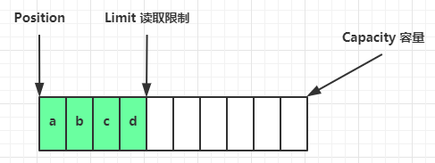

##### 代码验证

```java
package cn.lyf.day1.c1;

import cn.lyf.util.ByteBufferUtil;
import lombok.extern.slf4j.Slf4j;

import java.nio.ByteBuffer;

/**
 * @author lyf
 * @version 1.0
 * @classname Demo1_3_ByteBufferRead
 * @description
 * @since 2022/7/24 15:31
 */
@Slf4j
public class Demo1_3_ByteBufferRead {
    public static void main(String[] args) {
        ByteBuffer byteBuffer = ByteBuffer.allocate(10);
        // 0x61 => 97 => a
        byteBuffer.put(new byte[]{(byte) 0x61, (byte) 0x62, (byte) 0x63, (byte) 0x64});
        byteBuffer.flip();
        ByteBufferUtil.debugAll(byteBuffer);
    }
}

```

##### 验证结果

```verilog
+--------+-------------------- all ------------------------+----------------+
position: [0], limit: [4], capacity: [10]
         +-------------------------------------------------+
         |  0  1  2  3  4  5  6  7  8  9  a  b  c  d  e  f |
+--------+-------------------------------------------------+----------------+
|00000000| 61 62 63 64 00 00 00 00 00 00                   |abcd......      |
+--------+-------------------------------------------------+----------------+
```

#### 2.4.5 get(byte[])

读取 4 个字节后，状态


##### 代码验证

```java
package cn.lyf.day1.c1;

import cn.lyf.util.ByteBufferUtil;
import lombok.extern.slf4j.Slf4j;

import java.nio.ByteBuffer;

/**
 * @author lyf
 * @version 1.0
 * @classname Demo1_3_ByteBufferRead
 * @description
 * @since 2022/7/24 15:31
 */
@Slf4j
public class Demo1_3_ByteBufferRead {
    public static void main(String[] args) {
        ByteBuffer byteBuffer = ByteBuffer.allocate(10);
        // 0x61 => 97 => a
        // 存入a,b,c,d 四个字节
        byteBuffer.put(new byte[]{(byte) 0x61, (byte) 0x62, (byte) 0x63, (byte) 0x64});
        // 切换为读模式
        byteBuffer.flip();
        // 读取四个字节
        byteBuffer.get(new byte[4]);
        ByteBufferUtil.debugAll(byteBuffer);
    }
}

```

##### 执行结果

```verilog
+--------+-------------------- all ------------------------+----------------+
position: [4], limit: [4], capacity: [10]
         +-------------------------------------------------+
         |  0  1  2  3  4  5  6  7  8  9  a  b  c  d  e  f |
+--------+-------------------------------------------------+----------------+
|00000000| 61 62 63 64 00 00 00 00 00 00                   |abcd......      |
+--------+-------------------------------------------------+----------------+
```

#### 2.4.6 clear

clear 动作发生后，状态

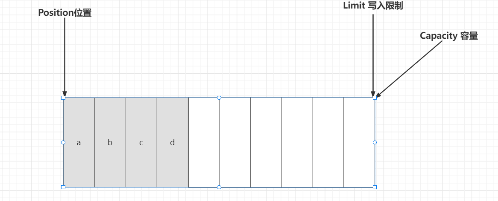

##### 代码验证

```java
package cn.lyf.day1.c1;

import cn.lyf.util.ByteBufferUtil;
import lombok.extern.slf4j.Slf4j;

import java.nio.ByteBuffer;

/**
 * @author lyf
 * @version 1.0
 * @classname Demo1_3_ByteBufferRead
 * @description
 * @since 2022/7/24 15:31
 */
@Slf4j
public class Demo1_3_ByteBufferRead {
    public static void main(String[] args) {
        ByteBuffer byteBuffer = ByteBuffer.allocate(10);
        // 0x61 => 97 => a
        // 存入a,b,c,d 四个字节
        byteBuffer.put(new byte[]{(byte) 0x61, (byte) 0x62, (byte) 0x63, (byte) 0x64});
        // 切换为读模式
        byteBuffer.flip();
        // 读取四个字节
        byteBuffer.get(new byte[4]);
        // 切换为写模式
        byteBuffer.clear();
        ByteBufferUtil.debugAll(byteBuffer);
    }
}

```


##### 运行结果

```verilog
+--------+-------------------- all ------------------------+----------------+
position: [0], limit: [10], capacity: [10]
         +-------------------------------------------------+
         |  0  1  2  3  4  5  6  7  8  9  a  b  c  d  e  f |
+--------+-------------------------------------------------+----------------+
|00000000| 61 62 63 64 00 00 00 00 00 00                   |abcd......      |
+--------+-------------------------------------------------+----------------+
```

#### 2.4.7 compact

compact 方法，是把未读完的部分向前压缩，然后切换至写模式

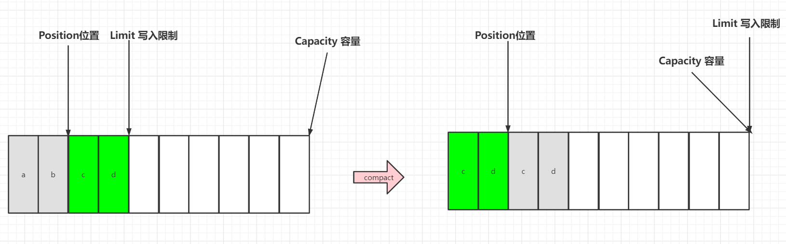


##### 测试代码

```java
package cn.lyf.day1.c1;

import cn.lyf.util.ByteBufferUtil;
import lombok.extern.slf4j.Slf4j;

import java.nio.ByteBuffer;

/**
 * @author lyf
 * @version 1.0
 * @classname Demo1_3_ByteBufferRead
 * @description
 * @since 2022/7/24 15:31
 */
@Slf4j
public class Demo1_3_ByteBufferRead {
    public static void main(String[] args) {
        ByteBuffer byteBuffer = ByteBuffer.allocate(10);
        // 0x61 => 97 => a
        // 存入a,b,c,d 四个字节
        byteBuffer.put(new byte[]{(byte) 0x61, (byte) 0x62, (byte) 0x63, (byte) 0x64});
        // 切换为读模式
        byteBuffer.flip();
        // 读取两个字节
        byteBuffer.get(new byte[2]);
        // 切换为写模式
        byteBuffer.compact();
        ByteBufferUtil.debugAll(byteBuffer);
    }
}

```


##### 执行结果

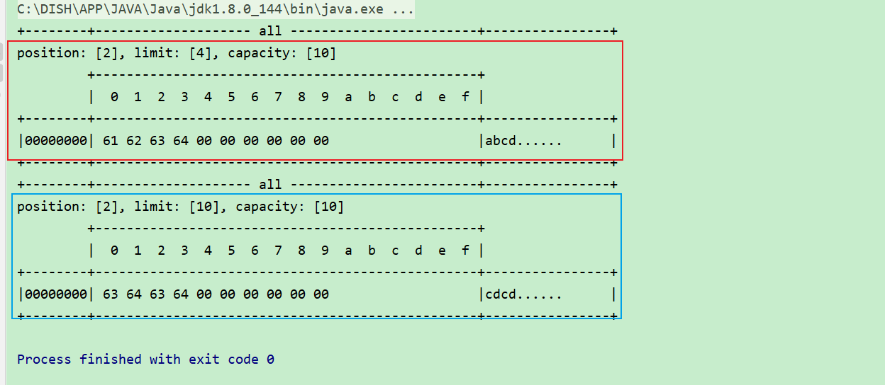


### 2.5 ByteBuffer 常见方法

#### 2.5.1 分配空间

可以使用 allocate 方法为 ByteBuffer 分配空间，其它 buffer 类也有该方法

```java
Bytebuffer buf = ByteBuffer.allocate(16);
```

##### 测试代码

```java
package cn.lyf.day1.c1;

import lombok.extern.slf4j.Slf4j;

import java.nio.ByteBuffer;

/**
 * @author lyf
 * @version 1.0
 * @classname Demo1_2_ByteBufferAllocate
 * @description
 * @since 2022/7/24 15:21
 */
@Slf4j
public class Demo1_2_ByteBufferAllocate {
    public static void main(String[] args) {
        ByteBuffer byteBuffer = ByteBuffer.allocate(16);
        ByteBuffer directByteBuffer = ByteBuffer.allocateDirect(16);
        log.debug("byteBuffer: {}", byteBuffer);
        log.debug("directByteBuffer: {}", directByteBuffer);
    }
}

```

##### 执行结果

```verilog
15:22:37 [DEBUG] [main] c.l.d.c.Demo1_2_ByteBufferAllocate - byteBuffer: java.nio.HeapByteBuffer[pos=0 lim=16 cap=16]
15:22:37 [DEBUG] [main] c.l.d.c.Demo1_2_ByteBufferAllocate - directByteBuffer: java.nio.DirectByteBuffer[pos=0 lim=16 cap=16]
```

- `ByteBuffer.allocate(16)` 分配的内存是Java堆中的内存
  - 堆中分配的内存，读写效率较低，受到**GC**的影响
- `ByteBuffer.allocateDirect(16)` 分配的内存是操作系统的直接内存
  - 直接内存，读写效率高（少一次拷贝），不会受 **GC** 的影响，分配的效率稍低，因为要向操作系统申请内存
  - 如果没有及时释放内存，可能造成内存泄露问题


#### 2.5.2 向 buffer 写入数据

有两种办法

* 调用 channel 的 read 方法
* 调用 buffer 自己的 put 方法

```java
int readBytes = channel.read(buf);
```

和

```java
buf.put((byte)127);
```

##### 2.5.2.1 获取resources目录下文件的全路径的工具类

```java
package cn.lyf.util;

import io.netty.util.internal.StringUtil;
import lombok.extern.slf4j.Slf4j;

import java.io.File;
import java.io.IOException;
import java.net.URL;

/**
 * @author lyf
 * @version 1.0
 * @classname PathUtil
 * @description
 * @since 2022/7/24 16:12
 */
@Slf4j
public final class PathUtil {
    private PathUtil() {
    }

    /**
     * 获取文件的路径
     *
     * @param name name
     * @return path
     */
    public static String getPath(String name) {
        if (StringUtil.isNullOrEmpty(name)) {
            throw new IllegalArgumentException("paths not be null");
        }

        // 如果是绝对路径，直接返回
        try {
            File file = new File(name);
            if (file.isAbsolute()) {
                return file.getCanonicalPath();
            }
        } catch (IOException e) {
            throw new IllegalArgumentException(e);
        }

        URL resource = Thread.currentThread().getContextClassLoader().getResource(name);
        if (resource == null) {
            throw new IllegalArgumentException("paths not exists");
        }
        return resource.getPath();
    }
}

```

##### 2.5.2.2 测试代码

```java
package cn.lyf.day1.c1;

import cn.lyf.util.ByteBufferUtil;
import cn.lyf.util.PathUtil;
import lombok.extern.slf4j.Slf4j;

import java.io.FileInputStream;
import java.io.IOException;
import java.nio.ByteBuffer;
import java.nio.channels.FileChannel;

/**
 * @author lyf
 * @version 1.0
 * @classname Demo1_4_ByteBufferWrite
 * @description
 * @since 2022/7/24 15:31
 */
@Slf4j
public class Demo1_4_ByteBufferWrite {
    public static void main(String[] args) {
        log.debug("1 通过channel.read(ByteBuffer) 写入");
        // 1 通过channel.read(ByteBuffer) 写入
        try (FileChannel channel = new FileInputStream(PathUtil.getPath("data.txt")).getChannel()) {
            ByteBuffer byteBuffer = ByteBuffer.allocate(10);
            channel.read(byteBuffer);
            ByteBufferUtil.debugAll(byteBuffer);
        } catch (IOException e) {
            log.error("", e);
        }

        System.out.println();
        log.debug("2 通过ByteBuffer的put方法写入");
        // 2 通过ByteBuffer的put方法写入
        ByteBuffer byteBuffer = ByteBuffer.allocate(10);
        byteBuffer.put((byte) 127);
        ByteBufferUtil.debugAll(byteBuffer);
    }
}

```


##### 2.5.2.3 运行结果

```verilog
16:24:36 [DEBUG] [main] c.l.d.c.Demo1_4_ByteBufferWrite - 1 通过channel.read(ByteBuffer) 写入
+--------+-------------------- all ------------------------+----------------+
position: [10], limit: [10], capacity: [10]
         +-------------------------------------------------+
         |  0  1  2  3  4  5  6  7  8  9  a  b  c  d  e  f |
+--------+-------------------------------------------------+----------------+
|00000000| 31 32 33 34 35 36 37 38 39 30                   |1234567890      |
+--------+-------------------------------------------------+----------------+

16:24:36 [DEBUG] [main] c.l.d.c.Demo1_4_ByteBufferWrite - 2 通过ByteBuffer的put方法写入
+--------+-------------------- all ------------------------+----------------+
position: [1], limit: [10], capacity: [10]
         +-------------------------------------------------+
         |  0  1  2  3  4  5  6  7  8  9  a  b  c  d  e  f |
+--------+-------------------------------------------------+----------------+
|00000000| 7f 00 00 00 00 00 00 00 00 00                   |..........      |
+--------+-------------------------------------------------+----------------+
```


#### 2.5.3 从 buffer 读取数据

同样有两种办法

* 调用 channel 的 write 方法
* 调用 buffer 自己的 get 方法

```java
int writeBytes = channel.write(buf);
```

和

```java
byte b = buf.get();
```

get 方法会让 position 读指针向后走，如果想重复读取数据

* 可以调用 rewind 方法将 position 重新置为 0
* 或者调用 get(int i) 方法获取索引 i 的内容，它不会移动读指针

##### 测试代码

```java
package cn.lyf.day1.c1;

import cn.lyf.util.ByteBufferUtil;
import cn.lyf.util.PathUtil;
import lombok.extern.slf4j.Slf4j;

import java.io.FileOutputStream;
import java.io.IOException;
import java.nio.ByteBuffer;
import java.nio.channels.FileChannel;
import java.nio.charset.StandardCharsets;

/**
 * @author lyf
 * @version 1.0
 * @classname Demo1_5_ByteBufferReadWrite
 * @description ByteBuffer的读模式
 * @since 2022/7/24 15:31
 */
@Slf4j
public class Demo1_5_ByteBufferReadWrite {
    public static void main(String[] args) {
        // 1 通过channel.write(byteBuffer) 读入到ByteBuffer中
        log.debug("1 通过channel.write(byteBuffer) 读入到ByteBuffer中=======>start");
        try (FileChannel channel = new FileOutputStream(PathUtil.getPath("data2.txt")).getChannel()) {
            ByteBuffer byteBuffer = ByteBuffer.allocate(10);
            byteBuffer.put("hello".getBytes(StandardCharsets.UTF_8));

            channel.write(byteBuffer);
            ByteBufferUtil.debugAll(byteBuffer);
        } catch (IOException e) {
            log.error("", e);
        }

        log.debug("1 通过channel.write(byteBuffer) 读入到ByteBuffer中=======>end");
        System.out.println();
        log.debug("2 通过ByteBuffer的get方法读取=======>start");
        // 2 通过ByteBuffer的get方法读取
        ByteBuffer byteBuffer = StandardCharsets.UTF_8.encode("hello");
        byteBuffer.get();
        ByteBufferUtil.debugAll(byteBuffer);
        log.debug("2 通过ByteBuffer的get方法读取=======>end");
    }
}

```


##### 运行结果

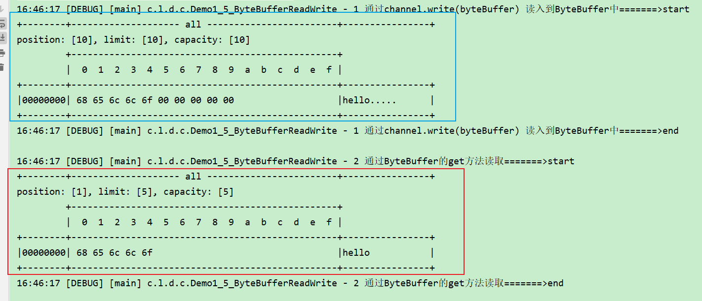

#### 2.5.4 mark 和 reset

mark 是在读取时，做一个标记，即使 position 改变，只要调用 reset 就能回到 mark 的位置

> **注意**
>
> rewind 和 flip 都会清除 mark 位置

##### 测试代码

```java
package cn.lyf.day1.c1;

import cn.lyf.util.ByteBufferUtil;
import lombok.extern.slf4j.Slf4j;

import java.nio.ByteBuffer;
import java.nio.charset.StandardCharsets;

/**
 * @author lyf
 * @version 1.0
 * @classname Demo1_6_ByteBufferMarkReset
 * @description 测试ByteBuffer的Mark和Reset方法
 * @since 2022/7/24 16:48
 */
@Slf4j
public class Demo1_6_ByteBufferMarkReset {
    public static void main(String[] args) {
        ByteBuffer byteBuffer = ByteBuffer.allocate(4);
        byteBuffer.put("abcd".getBytes(StandardCharsets.UTF_8));
        // 切换为读模式
        byteBuffer.flip();
        System.out.println("========================切换为读模式了========================");
        ByteBufferUtil.debugAll(byteBuffer);
        byteBuffer.get(new byte[2]);
        System.out.println("\n\n========================读取两个========================");
        ByteBufferUtil.debugAll(byteBuffer);

        // 开始mark, 做个标记，或者说书签
        byteBuffer.mark();
        System.out.println("\n\n========================开始mark========================");
        ByteBufferUtil.debugAll(byteBuffer);
        byteBuffer.get(new byte[2]);
        System.out.println("\n\n========================读取剩余两个========================");
        ByteBufferUtil.debugAll(byteBuffer);

        // 回到mark点
        byteBuffer.reset();
        System.out.println("\n\n========================reset========================");
        ByteBufferUtil.debugAll(byteBuffer);
    }
}

```


##### 运行结果

```verilog
========================切换为读模式了========================
+--------+-------------------- all ------------------------+----------------+
position: [0], limit: [4], capacity: [4], mark: [-1]
         +-------------------------------------------------+
         |  0  1  2  3  4  5  6  7  8  9  a  b  c  d  e  f |
+--------+-------------------------------------------------+----------------+
|00000000| 61 62 63 64                                     |abcd            |
+--------+-------------------------------------------------+----------------+


========================读取两个========================
+--------+-------------------- all ------------------------+----------------+
position: [2], limit: [4], capacity: [4], mark: [-1]
         +-------------------------------------------------+
         |  0  1  2  3  4  5  6  7  8  9  a  b  c  d  e  f |
+--------+-------------------------------------------------+----------------+
|00000000| 61 62 63 64                                     |abcd            |
+--------+-------------------------------------------------+----------------+


========================开始mark========================
+--------+-------------------- all ------------------------+----------------+
position: [2], limit: [4], capacity: [4], mark: [2]
         +-------------------------------------------------+
         |  0  1  2  3  4  5  6  7  8  9  a  b  c  d  e  f |
+--------+-------------------------------------------------+----------------+
|00000000| 61 62 63 64                                     |abcd            |
+--------+-------------------------------------------------+----------------+


========================读取剩余两个========================
+--------+-------------------- all ------------------------+----------------+
position: [4], limit: [4], capacity: [4], mark: [2]
         +-------------------------------------------------+
         |  0  1  2  3  4  5  6  7  8  9  a  b  c  d  e  f |
+--------+-------------------------------------------------+----------------+
|00000000| 61 62 63 64                                     |abcd            |
+--------+-------------------------------------------------+----------------+


========================reset========================
+--------+-------------------- all ------------------------+----------------+
position: [2], limit: [4], capacity: [4], mark: [2]
         +-------------------------------------------------+
         |  0  1  2  3  4  5  6  7  8  9  a  b  c  d  e  f |
+--------+-------------------------------------------------+----------------+
|00000000| 61 62 63 64                                     |abcd            |
+--------+-------------------------------------------------+----------------+
```


#### 2.5.5 字符串与 ByteBuffer 互转

```java
ByteBuffer buffer1 = StandardCharsets.UTF_8.encode("你好");
ByteBuffer buffer2 = Charset.forName("utf-8").encode("你好");

debug(buffer1);
debug(buffer2);

CharBuffer buffer3 = StandardCharsets.UTF_8.decode(buffer1);
System.out.println(buffer3.getClass());
System.out.println(buffer3.toString());
```

输出

```
         +-------------------------------------------------+
         |  0  1  2  3  4  5  6  7  8  9  a  b  c  d  e  f |
+--------+-------------------------------------------------+----------------+
|00000000| e4 bd a0 e5 a5 bd                               |......          |
+--------+-------------------------------------------------+----------------+
         +-------------------------------------------------+
         |  0  1  2  3  4  5  6  7  8  9  a  b  c  d  e  f |
+--------+-------------------------------------------------+----------------+
|00000000| e4 bd a0 e5 a5 bd                               |......          |
+--------+-------------------------------------------------+----------------+
class java.nio.HeapCharBuffer
你好
```


#### 2.5.6 ⚠️ Buffer 的线程安全

> Buffer 是**非线程安全的**


### 2.6 Scattering Reads

分散读取，有一个文本文件 `3_parts.txt`

```
onetwothree
```

使用如下方式读取，可以将数据填充至多个 buffer

```java
package cn.lyf.day1.c2;

import cn.lyf.util.ByteBufferUtil;
import cn.lyf.util.PathUtil;
import lombok.extern.slf4j.Slf4j;

import java.io.IOException;
import java.io.RandomAccessFile;
import java.nio.ByteBuffer;
import java.nio.channels.FileChannel;

/**
 * @author lyf
 * @version 1.0
 * @classname Demo2_1_ByteBufferScatteringReads
 * @description
 * @since 2022/7/24 17:19
 */
@Slf4j
public class Demo2_1_ByteBufferScatteringReads {
    public static void main(String[] args) {
        try (FileChannel channel = new RandomAccessFile(PathUtil.getPath("3_parts.txt"), "rw").getChannel()) {
            ByteBuffer byteBuffer1 = ByteBuffer.allocate(3);
            ByteBuffer byteBuffer2 = ByteBuffer.allocate(3);
            ByteBuffer byteBuffer3 = ByteBuffer.allocate(5);
            channel.read(new ByteBuffer[]{byteBuffer1, byteBuffer2, byteBuffer3});
            byteBuffer1.flip();
            byteBuffer2.flip();
            byteBuffer3.flip();
            ByteBufferUtil.debugAll(byteBuffer1);
            ByteBufferUtil.debugAll(byteBuffer2);
            ByteBufferUtil.debugAll(byteBuffer3);
        } catch (IOException e) {
            log.error("", e);
        }
    }
}

```

结果

```verilog
+--------+-------------------- all ------------------------+----------------+
position: [3], limit: [3], capacity: [3], mark: [-1]
         +-------------------------------------------------+
         |  0  1  2  3  4  5  6  7  8  9  a  b  c  d  e  f |
+--------+-------------------------------------------------+----------------+
|00000000| 6f 6e 65                                        |one             |
+--------+-------------------------------------------------+----------------+
+--------+-------------------- all ------------------------+----------------+
position: [3], limit: [3], capacity: [3], mark: [-1]
         +-------------------------------------------------+
         |  0  1  2  3  4  5  6  7  8  9  a  b  c  d  e  f |
+--------+-------------------------------------------------+----------------+
|00000000| 74 77 6f                                        |two             |
+--------+-------------------------------------------------+----------------+
+--------+-------------------- all ------------------------+----------------+
position: [5], limit: [5], capacity: [5], mark: [-1]
         +-------------------------------------------------+
         |  0  1  2  3  4  5  6  7  8  9  a  b  c  d  e  f |
+--------+-------------------------------------------------+----------------+
|00000000| 74 68 72 65 65                                  |three           |
+--------+-------------------------------------------------+----------------+
```


### 2.7 Gathering Writes

使用如下方式写入，可以将多个 buffer 的数据填充至 channel

```java
package cn.lyf.day1.c2;

import cn.lyf.util.ByteBufferUtil;
import cn.lyf.util.PathUtil;
import lombok.extern.slf4j.Slf4j;

import java.io.IOException;
import java.io.RandomAccessFile;
import java.nio.ByteBuffer;
import java.nio.channels.FileChannel;
import java.nio.charset.StandardCharsets;

/**
 * @author lyf
 * @version 1.0
 * @classname Demo2_2_ByteBufferGatheringWrites
 * @description
 * @since 2022/7/24 17:27
 */
@Slf4j
public class Demo2_2_ByteBufferGatheringWrites {
    public static void main(String[] args) {
        try (FileChannel channel = new RandomAccessFile(PathUtil.getPath("3_parts.txt"), "rw").getChannel()) {
            ByteBuffer byteBuffer1 = StandardCharsets.UTF_8.encode("hello");
            ByteBuffer byteBuffer2 = StandardCharsets.UTF_8.encode("world");
            ByteBuffer byteBuffer3 = StandardCharsets.UTF_8.encode("nihao");
            channel.write(new ByteBuffer[]{byteBuffer1, byteBuffer2, byteBuffer3});

            byteBuffer1.flip();
            byteBuffer2.flip();
            byteBuffer3.flip();
            ByteBufferUtil.debugAll(byteBuffer1);
            ByteBufferUtil.debugAll(byteBuffer2);
            ByteBufferUtil.debugAll(byteBuffer3);
        } catch (IOException e) {
            log.error("", e);
        }
    }
}

```

输出

```
+--------+-------------------- all ------------------------+----------------+
position: [0], limit: [5], capacity: [5], mark: [-1]
         +-------------------------------------------------+
         |  0  1  2  3  4  5  6  7  8  9  a  b  c  d  e  f |
+--------+-------------------------------------------------+----------------+
|00000000| 68 65 6c 6c 6f                                  |hello           |
+--------+-------------------------------------------------+----------------+
+--------+-------------------- all ------------------------+----------------+
position: [0], limit: [5], capacity: [5], mark: [-1]
         +-------------------------------------------------+
         |  0  1  2  3  4  5  6  7  8  9  a  b  c  d  e  f |
+--------+-------------------------------------------------+----------------+
|00000000| 77 6f 72 6c 64                                  |world           |
+--------+-------------------------------------------------+----------------+
+--------+-------------------- all ------------------------+----------------+
position: [0], limit: [5], capacity: [5], mark: [-1]
         +-------------------------------------------------+
         |  0  1  2  3  4  5  6  7  8  9  a  b  c  d  e  f |
+--------+-------------------------------------------------+----------------+
|00000000| 6e 69 68 61 6f                                  |nihao           |
+--------+-------------------------------------------------+----------------+
```

文件内容

```
helloworldnihao
```


### 2.8 练习

网络上有多条数据发送给服务端，数据之间使用 \n 进行分隔
但由于某种原因这些数据在接收时，被进行了重新组合，例如原始数据有3条为

* Hello,world\n
* I'm zhangsan\n
* How are you?\n

变成了下面的两个 byteBuffer (黏包，半包)

* Hello,world\nI'm zhangsan\nHo
* w are you?\n

现在要求你编写程序，将错乱的数据恢复成原始的按 \n 分隔的数据

```java
package cn.lyf.day1.c2;

import cn.lyf.util.ByteBufferUtil;
import lombok.extern.slf4j.Slf4j;

import java.nio.ByteBuffer;
import java.nio.charset.StandardCharsets;

/**
 * @author lyf
 * @version 1.0
 * @classname Demo2_3_ByteBufferExam
 * @description
 * @since 2022/7/24 17:41
 */
@Slf4j
public class Demo2_3_ByteBufferExam {
    /**
     * 网络上有多条数据发送给服务端，数据之间使用 \n 进行分隔
     * 但由于某种原因这些数据在接收时，被进行了重新组合，例如原始数据有3条为
     * <p>
     * * Hello,world\n
     * * I'm zhangsan\n
     * * How are you?\n
     * <p>
     * 变成了下面的两个 byteBuffer (黏包，半包)
     * <p>
     * * Hello,world\nI'm zhangsan\nHo
     * * w are you?\n
     * <p>
     * 现在要求你编写程序，将错乱的数据恢复成原始的按 \n 分隔的数据
     *
     * @param args args
     */
    public static void main(String[] args) {
        ByteBuffer source = ByteBuffer.allocate(32);
        source.put("Hello,world\nI'm zhangsan\nHo".getBytes(StandardCharsets.UTF_8));
        split(source);
        source.put("w are you?\n".getBytes(StandardCharsets.UTF_8));
        split(source);
    }

    public static void split(ByteBuffer source) {
        // 1 切换为读模式
        source.flip();
        // 2 开始遍历source
        int oldLimit = source.limit();
        for (int i = 0; i < oldLimit; i++) {
            if (source.get(i) == '\n') {
                // 3 读到\n, 创建一个新的ByteBuffer, 容量为 i + 1 (因为i是从0开始的，所以需要加1) - position
                ByteBuffer target = ByteBuffer.allocate(i + 1 - source.position());
                // 4 将source的内容读到target中，每次读 i + 1 个
                source.limit(i + 1);
                target.put(source); // 读完之后，position会移动到i+1的位置
                System.out.println("===============================source===================");
                ByteBufferUtil.debugAll(source);
                System.out.println("\n\n==========================target====================");
                ByteBufferUtil.debugAll(target);
                System.out.println("\n");
                // 5 恢复source的limit
                source.limit(oldLimit);
            }
        }
        // 6 将剩余未读的内容，往前压
        source.compact();
    }
}

```

#### 2.8.1 执行结果

```verilog
===============================source===================
+--------+-------------------- all ------------------------+----------------+
position: [12], limit: [12], capacity: [32], mark: [-1]
         +-------------------------------------------------+
         |  0  1  2  3  4  5  6  7  8  9  a  b  c  d  e  f |
+--------+-------------------------------------------------+----------------+
|00000000| 48 65 6c 6c 6f 2c 77 6f 72 6c 64 0a 49 27 6d 20 |Hello,world.I'm |
|00000010| 7a 68 61 6e 67 73 61 6e 0a 48 6f 00 00 00 00 00 |zhangsan.Ho.....|
+--------+-------------------------------------------------+----------------+


==========================target====================
+--------+-------------------- all ------------------------+----------------+
position: [12], limit: [12], capacity: [12], mark: [-1]
         +-------------------------------------------------+
         |  0  1  2  3  4  5  6  7  8  9  a  b  c  d  e  f |
+--------+-------------------------------------------------+----------------+
|00000000| 48 65 6c 6c 6f 2c 77 6f 72 6c 64 0a             |Hello,world.    |
+--------+-------------------------------------------------+----------------+


===============================source===================
+--------+-------------------- all ------------------------+----------------+
position: [25], limit: [25], capacity: [32], mark: [-1]
         +-------------------------------------------------+
         |  0  1  2  3  4  5  6  7  8  9  a  b  c  d  e  f |
+--------+-------------------------------------------------+----------------+
|00000000| 48 65 6c 6c 6f 2c 77 6f 72 6c 64 0a 49 27 6d 20 |Hello,world.I'm |
|00000010| 7a 68 61 6e 67 73 61 6e 0a 48 6f 00 00 00 00 00 |zhangsan.Ho.....|
+--------+-------------------------------------------------+----------------+


==========================target====================
+--------+-------------------- all ------------------------+----------------+
position: [13], limit: [13], capacity: [13], mark: [-1]
         +-------------------------------------------------+
         |  0  1  2  3  4  5  6  7  8  9  a  b  c  d  e  f |
+--------+-------------------------------------------------+----------------+
|00000000| 49 27 6d 20 7a 68 61 6e 67 73 61 6e 0a          |I'm zhangsan.   |
+--------+-------------------------------------------------+----------------+


===============================source===================
+--------+-------------------- all ------------------------+----------------+
position: [13], limit: [13], capacity: [32], mark: [-1]
         +-------------------------------------------------+
         |  0  1  2  3  4  5  6  7  8  9  a  b  c  d  e  f |
+--------+-------------------------------------------------+----------------+
|00000000| 48 6f 77 20 61 72 65 20 79 6f 75 3f 0a 27 6d 20 |How are you?.'m |
|00000010| 7a 68 61 6e 67 73 61 6e 0a 48 6f 00 00 00 00 00 |zhangsan.Ho.....|
+--------+-------------------------------------------------+----------------+


==========================target====================
+--------+-------------------- all ------------------------+----------------+
position: [13], limit: [13], capacity: [13], mark: [-1]
         +-------------------------------------------------+
         |  0  1  2  3  4  5  6  7  8  9  a  b  c  d  e  f |
+--------+-------------------------------------------------+----------------+
|00000000| 48 6f 77 20 61 72 65 20 79 6f 75 3f 0a          |How are you?.   |
+--------+-------------------------------------------------+----------------+
```


## 3. 文件编程

### 3.1 FileChannel

#### 3.1.1 ⚠️ FileChannel 工作模式

> FileChannel 只能工作在阻塞模式下


#### 3.1.2 获取

不能直接打开 FileChannel，必须通过 FileInputStream、FileOutputStream 或者 RandomAccessFile 来获取 FileChannel，它们都有 getChannel 方法

* 通过 FileInputStream 获取的 channel 只能读
* 通过 FileOutputStream 获取的 channel 只能写
* 通过 RandomAccessFile 是否能读写根据构造 RandomAccessFile 时的读写模式决定


#### 3.1.3 读取

会从 channel 读取数据填充 ByteBuffer，返回值表示读到了多少字节，-1 表示到达了文件的末尾

```java
int readBytes = channel.read(buffer);
```


#### 3.1.4 写入

写入的正确姿势如下， SocketChannel

```java
ByteBuffer buffer = ...;
buffer.put(...); // 存入数据
buffer.flip();   // 切换读模式

while(buffer.hasRemaining()) {
    channel.write(buffer);
}
```

在 while 中调用 channel.write 是因为 write 方法并不能保证一次将 buffer 中的内容全部写入 channel


#### 3.1.5 关闭

channel 必须关闭，不过调用了 FileInputStream、FileOutputStream 或者 RandomAccessFile 的 close 方法会间接地调用 channel 的 close 方法


#### 3.1.6 位置

获取当前位置

```java
long pos = channel.position();
```

设置当前位置

```java
long newPos = ...;
channel.position(newPos);
```

设置当前位置时，如果设置为文件的末尾

* 这时读取会返回 -1 
* 这时写入，会追加内容，但要注意如果 position 超过了文件末尾，再写入时在新内容和原末尾之间会有空洞（00）


#### 3.1.7 大小

使用 size 方法获取文件的大小


#### 3.1.8 强制写入

操作系统出于性能的考虑，会将数据缓存，不是立刻写入磁盘。可以调用 force(true)  方法将文件内容和元数据（文件的权限等信息）立刻写入磁盘


### 3.2 两个 Channel 传输数据

```java
String FROM = "helloword/data.txt";
String TO = "helloword/to.txt";
long start = System.nanoTime();
try (FileChannel from = new FileInputStream(FROM).getChannel();
     FileChannel to = new FileOutputStream(TO).getChannel();
    ) {
    from.transferTo(0, from.size(), to);
} catch (IOException e) {
    e.printStackTrace();
}
long end = System.nanoTime();
System.out.println("transferTo 用时：" + (end - start) / 1000_000.0);
```

输出

```
transferTo 用时：8.2011
```


超过 2g 大小的文件传输

```java
package cn.lyf.day1.c3;

import lombok.extern.slf4j.Slf4j;

import java.io.IOException;
import java.io.RandomAccessFile;
import java.nio.channels.FileChannel;

/**
 * @author lyf
 * @version 1.0
 * @classname Demo3_1_FileChannelTransferTo
 * @description 测试FileChannel的transferTo方法
 * @since 2022/7/24 19:07
 */
@Slf4j
public class Demo3_1_FileChannelTransferTo {
    public static void main(String[] args) {
        String fromPath = "C:/DISH/test/from.txt";
        String toPath = "C:/DISH/test/to.txt";
        long start = System.nanoTime();
        try (FileChannel formChannel = new RandomAccessFile(fromPath, "r").getChannel();
             FileChannel toChannel = new RandomAccessFile(toPath, "rw").getChannel()
        ) {
            long size = formChannel.size();
            for (long left = size; left > 0;) {
                System.out.printf("position: [%d], left: [%d]\n", size - left, left);
                left -= formChannel.transferTo(size - left, left, toChannel);
            }
        } catch (IOException e) {
            log.error("", e);
        }
        long end = System.nanoTime();
        System.out.println((end - start) / 1000_000 + "ms");
    }
}

```

实际传输一个超大文件

```
position: [0], left: [6879600000]
position: [2147483647], left: [4732116353]
position: [4294967294], left: [2584632706]
position: [6442450941], left: [437149059]
3941ms
```


### 3.3 Path

jdk7 引入了 Path 和 Paths 类

* Path 用来表示文件路径
* Paths 是工具类，用来获取 Path 实例

```java
Path source = Paths.get("1.txt"); // 相对路径 使用 user.dir 环境变量来定位 1.txt

Path source = Paths.get("d:\\1.txt"); // 绝对路径 代表了  d:\1.txt

Path source = Paths.get("d:/1.txt"); // 绝对路径 同样代表了  d:\1.txt

Path projects = Paths.get("d:\\data", "projects"); // 代表了  d:\data\projects
```

* `.` 代表了当前路径
* `..` 代表了上一级路径

例如目录结构如下

```
d:
	|- data
		|- projects
			|- a
			|- b
```

代码

```java
Path path = Paths.get("d:\\data\\projects\\a\\..\\b");
System.out.println(path);
System.out.println(path.normalize()); // 正常化路径
```

会输出

```
d:\data\projects\a\..\b
d:\data\projects\b
```


### 3.4 Files

检查文件是否存在

```java
Path path = Paths.get("helloword/data.txt");
System.out.println(Files.exists(path));
```


创建一级目录

```java
Path path = Paths.get("helloword/d1");
Files.createDirectory(path);
```

* 如果目录已存在，会抛异常 FileAlreadyExistsException
* 不能一次创建多级目录，否则会抛异常 NoSuchFileException


创建多级目录用

```java
Path path = Paths.get("helloword/d1/d2");
Files.createDirectories(path);
```


拷贝文件

```java
Path source = Paths.get("helloword/data.txt");
Path target = Paths.get("helloword/target.txt");

Files.copy(source, target);
```

* 如果文件已存在，会抛异常 FileAlreadyExistsException

如果希望用 source 覆盖掉 target，需要用 StandardCopyOption 来控制

```java
Files.copy(source, target, StandardCopyOption.REPLACE_EXISTING);
```


移动文件

```java
Path source = Paths.get("helloword/data.txt");
Path target = Paths.get("helloword/data.txt");

Files.move(source, target, StandardCopyOption.ATOMIC_MOVE);
```

* StandardCopyOption.ATOMIC_MOVE 保证文件移动的原子性


删除文件

```java
Path target = Paths.get("helloword/target.txt");

Files.delete(target);
```

* 如果文件不存在，会抛异常 NoSuchFileException


删除目录

```java
Path target = Paths.get("helloword/d1");

Files.delete(target);
```

* 如果目录还有内容，会抛异常 DirectoryNotEmptyException


遍历目录文件

```java
public static void main(String[] args) throws IOException {
    Path path = Paths.get("C:\\Program Files\\Java\\jdk1.8.0_91");
    AtomicInteger dirCount = new AtomicInteger();
    AtomicInteger fileCount = new AtomicInteger();
    Files.walkFileTree(path, new SimpleFileVisitor<Path>(){
        @Override
        public FileVisitResult preVisitDirectory(Path dir, BasicFileAttributes attrs) 
            throws IOException {
            System.out.println(dir);
            dirCount.incrementAndGet();
            return super.preVisitDirectory(dir, attrs);
        }

        @Override
        public FileVisitResult visitFile(Path file, BasicFileAttributes attrs) 
            throws IOException {
            System.out.println(file);
            fileCount.incrementAndGet();
            return super.visitFile(file, attrs);
        }
    });
    System.out.println(dirCount); // 133
    System.out.println(fileCount); // 1479
}
```


统计 jar 的数目

```java
Path path = Paths.get("C:\\Program Files\\Java\\jdk1.8.0_91");
AtomicInteger fileCount = new AtomicInteger();
Files.walkFileTree(path, new SimpleFileVisitor<Path>(){
    @Override
    public FileVisitResult visitFile(Path file, BasicFileAttributes attrs) 
        throws IOException {
        if (file.toFile().getName().endsWith(".jar")) {
            fileCount.incrementAndGet();
        }
        return super.visitFile(file, attrs);
    }
});
System.out.println(fileCount); // 724
```


删除多级目录

```java
Path path = Paths.get("d:\\a");
Files.walkFileTree(path, new SimpleFileVisitor<Path>(){
    @Override
    public FileVisitResult visitFile(Path file, BasicFileAttributes attrs) 
        throws IOException {
        Files.delete(file);
        return super.visitFile(file, attrs);
    }

    @Override
    public FileVisitResult postVisitDirectory(Path dir, IOException exc) 
        throws IOException {
        Files.delete(dir);
        return super.postVisitDirectory(dir, exc);
    }
});
```


#### 3.4.1 ⚠️ 删除很危险

> 删除是危险操作，确保要递归删除的文件夹没有重要内容


##### 3.4.1.1 拷贝多级目录

###### 方式1

```java
long start = System.currentTimeMillis();
String source = "D:\\Snipaste-1.16.2-x64";
String target = "D:\\Snipaste-1.16.2-x64aaa";

Files.walk(Paths.get(source)).forEach(path -> {
    try {
        String targetName = path.toString().replace(source, target);
        // 是目录
        if (Files.isDirectory(path)) {
            Files.createDirectory(Paths.get(targetName));
        }
        // 是普通文件
        else if (Files.isRegularFile(path)) {
            Files.copy(path, Paths.get(targetName));
        }
    } catch (IOException e) {
        e.printStackTrace();
    }
});
long end = System.currentTimeMillis();
System.out.println(end - start);
```

###### 方式2

```java
package cn.lyf.day1.c3;

import lombok.extern.slf4j.Slf4j;

import java.io.IOException;
import java.nio.file.*;
import java.nio.file.attribute.BasicFileAttributes;

/**
 * @author lyf
 * @version 1.0
 * @classname Demo3_4_WalkFileTreeCopy
 * @description 文件拷贝
 * @since 2022/7/24 19:38
 */
@Slf4j
public class Demo3_4_WalkFileTreeCopy {
    public static void main(String[] args) {
        try {
            String source = "C:\\DISH\\test\\jdk11";
            String target = "C:\\DISH\\test\\jdk11_copy";
            Path path = Paths.get(source);
            Files.walkFileTree(path, new SimpleFileVisitor<Path>(){
                @Override
                public FileVisitResult preVisitDirectory(Path dir, BasicFileAttributes attrs) throws IOException {
                    Files.copy(dir, Paths.get(dir.toString().replace(source, target)));
                    return super.preVisitDirectory(dir, attrs);
                }

                @Override
                public FileVisitResult visitFile(Path file, BasicFileAttributes attrs) throws IOException {
                    Files.copy(file, Paths.get(file.toString().replace(source, target)));
                    return super.visitFile(file, attrs);
                }
            });
        } catch (IOException e) {
            e.printStackTrace();
        }
    }
}

```


##### 3.4.1.2 文件删除

```java

package cn.lyf.day1.c3;

import lombok.extern.slf4j.Slf4j;

import java.io.IOException;
import java.nio.file.*;
import java.nio.file.attribute.BasicFileAttributes;

/**
 * @author lyf
 * @version 1.0
 * @classname Demo3_4_WalkFileTreeDelete
 * @description 文件删除, 文件删除是高危操作, 因为删除不可恢复
 * @since 2022/7/24 19:38
 */
@Slf4j
public class Demo3_4_WalkFileTreeDelete {
    public static void main(String[] args) {
        try {
            String target = "C:\\DISH\\test\\jdk11_copy";
            Path path = Paths.get(target);
            Files.walkFileTree(path, new SimpleFileVisitor<Path>() {
                @Override
                public FileVisitResult visitFile(Path file, BasicFileAttributes attrs) throws IOException {
                    Files.delete(file);
                    return super.visitFile(file, attrs);
                }

                @Override
                public FileVisitResult postVisitDirectory(Path dir, IOException exc) throws IOException {
                    Files.delete(dir);
                    return super.postVisitDirectory(dir, exc);
                }
            });
        } catch (IOException e) {
            e.printStackTrace();
        }
    }
}

```


## 4. 网络编程

### 4.1 非阻塞 vs 阻塞

#### 4.1.1 阻塞

* 阻塞模式下，相关方法都会导致线程暂停
  * ServerSocketChannel.accept 会在没有连接建立时让线程暂停
  * SocketChannel.read 会在没有数据可读时让线程暂停
  * 阻塞的表现其实就是线程暂停了，暂停期间不会占用 cpu，但线程相当于闲置
* 单线程下，阻塞方法之间相互影响，几乎不能正常工作，需要多线程支持
* 但多线程下，有新的问题，体现在以下方面
  * 32 位 jvm 一个线程 320k，64 位 jvm 一个线程 1024k，如果连接数过多，必然导致 OOM，并且线程太多，反而会因为频繁上下文切换导致性能降低
  * 可以采用线程池技术来减少线程数和线程上下文切换，但治标不治本，如果有很多连接建立，但长时间 inactive，会阻塞线程池中所有线程，因此不适合长连接，只适合短连接


##### 4.1.1.1 服务器端

```java
// 使用 nio 来理解阻塞模式, 单线程
// 0. ByteBuffer
ByteBuffer buffer = ByteBuffer.allocate(16);
// 1. 创建了服务器
ServerSocketChannel ssc = ServerSocketChannel.open();

// 2. 绑定监听端口
ssc.bind(new InetSocketAddress(8080));

// 3. 连接集合
List<SocketChannel> channels = new ArrayList<>();
while (true) {
    // 4. accept 建立与客户端连接， SocketChannel 用来与客户端之间通信
    log.debug("connecting...");
    SocketChannel sc = ssc.accept(); // 阻塞方法，线程停止运行
    log.debug("connected... {}", sc);
    channels.add(sc);
    for (SocketChannel channel : channels) {
        // 5. 接收客户端发送的数据
        log.debug("before read... {}", channel);
        channel.read(buffer); // 阻塞方法，线程停止运行
        buffer.flip();
        debugRead(buffer);
        buffer.clear();
        log.debug("after read...{}", channel);
    }
}
```

###### 自写版

```java
package cn.lyf.day1.c4;

import cn.lyf.util.ByteBufferUtil;
import lombok.extern.slf4j.Slf4j;

import java.io.IOException;
import java.net.InetSocketAddress;
import java.nio.ByteBuffer;
import java.nio.channels.ServerSocketChannel;
import java.nio.channels.SocketChannel;
import java.util.ArrayList;
import java.util.List;

/**
 * @author lyf
 * @version 1.0
 * @classname SocketServer
 * @description
 * @since 2022/7/24 20:19
 */
@Slf4j
public class SocketServer {
    public static void main(String[] args) throws IOException {
        // 创建一个ByteBuffer
        ByteBuffer byteBuffer = ByteBuffer.allocate(32);
        // 1 创建服务器
        ServerSocketChannel serverChannel = ServerSocketChannel.open();
        // 2 绑定监听端口
        serverChannel.bind(new InetSocketAddress(8082));
        log.debug("{} init...", serverChannel);
        // 3 连接集合
        List<SocketChannel> clientChannelList = new ArrayList<>();
        // 4 处理客户端的连接
        while (true) {
            log.debug("{} start accepting", serverChannel);
            SocketChannel clientChannel = serverChannel.accept(); // 阻塞方法，线程停止运行
            log.debug("{} start accepted, {}", serverChannel, clientChannel);
            if (clientChannel != null) {
                clientChannelList.add(clientChannel);
            }

            for (SocketChannel channel : clientChannelList) {
                // 5 处理客户端发送的消息
                log.debug("before read... {}", channel);
                channel.read(byteBuffer); // 阻塞方法，线程停止运行
                // 切换为读模式
                byteBuffer.flip();
                ByteBufferUtil.debugRead(byteBuffer);
                // 切换为写模式
                byteBuffer.clear();
                log.debug("after read...{}", channel);
            }
        }
    }
}

```


##### 4.1.1.2 客户端

```java
SocketChannel sc = SocketChannel.open();
sc.connect(new InetSocketAddress("localhost", 8080));
System.out.println("waiting...");
```

###### 自写版

```java
package cn.lyf.day1.c4;

import lombok.extern.slf4j.Slf4j;

import java.io.IOException;
import java.net.InetSocketAddress;
import java.nio.channels.SocketChannel;

/**
 * @author lyf
 * @version 1.0
 * @classname SocketClient
 * @description
 * @since 2022/7/24 20:28
 */
@Slf4j
public class SocketClient {
    public static void main(String[] args) throws IOException {
        // 1 创建SocketChannel 客户端
        SocketChannel socketChannel = SocketChannel.open();
        // 2 连接端口号
        socketChannel.connect(new InetSocketAddress(8082));
        // 3 等待
        System.out.println("waiting");
    }
}

```


##### 4.1.1.3 测试

###### 1 允许重复运行

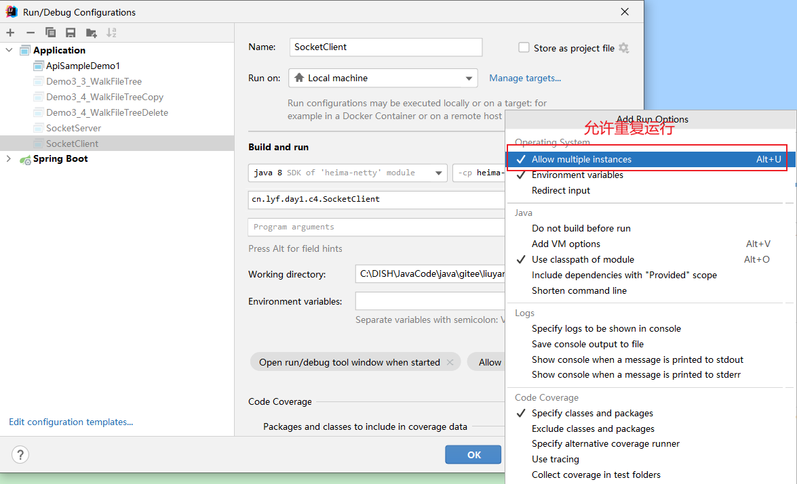

###### 2 启动服务端

```verilog
20:45:42 [DEBUG] [main] c.l.d.c.SocketServer - sun.nio.ch.ServerSocketChannelImpl[/0:0:0:0:0:0:0:0:8082] init...
20:45:42 [DEBUG] [main] c.l.d.c.SocketServer - sun.nio.ch.ServerSocketChannelImpl[/0:0:0:0:0:0:0:0:8082] start accepting
```

###### 3 启动客户端

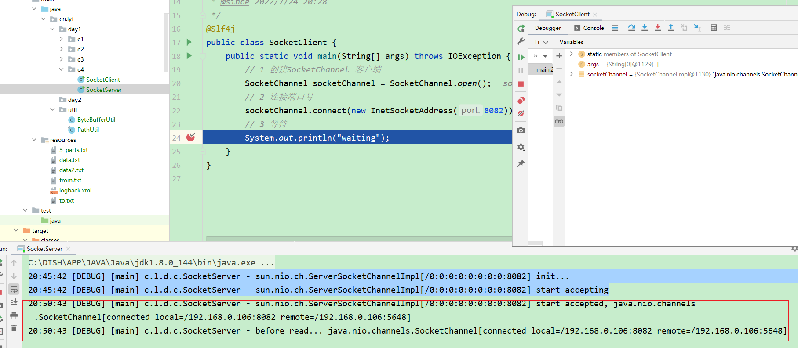

###### 4 客户端发生一条消息（"hello"）

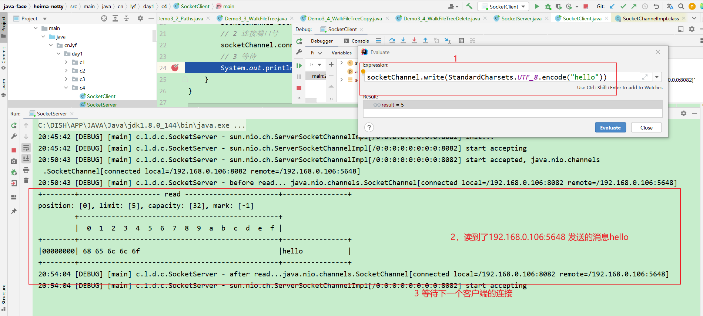

###### 5 客户端再次发送一条消息 ("你好")

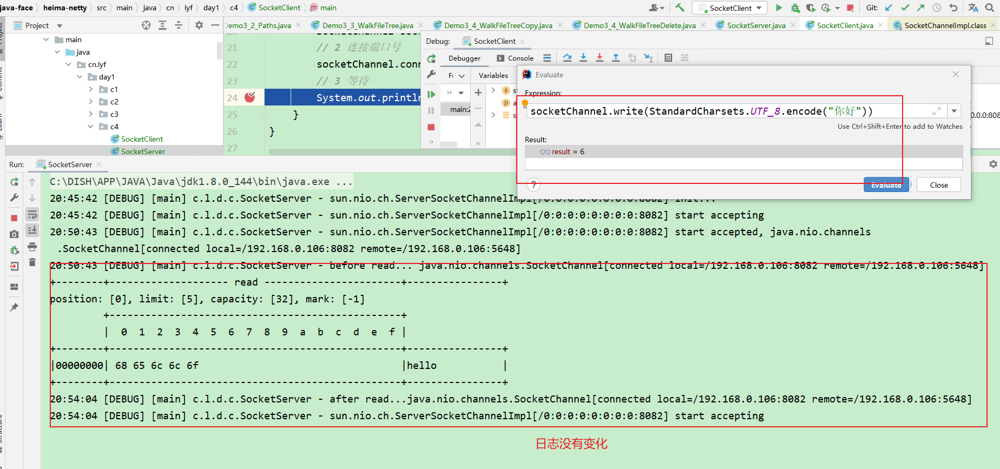

###### 6 这次再启动一个客户端

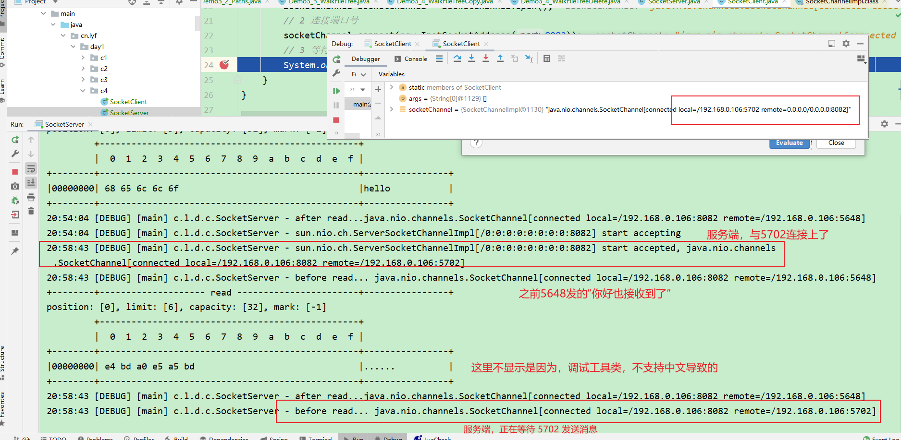

###### 7 结论

- serverChannel.accept() 是个阻塞方法

- channel.read(byteBuffer) 也是个阻塞方法

#### 4.1.2 非阻塞

* 非阻塞模式下，相关方法都会不会让线程暂停
  * 在 ServerSocketChannel.accept 在没有连接建立时，会返回 null，继续运行
  * SocketChannel.read 在没有数据可读时，会返回 0，但线程不必阻塞，可以去执行其它 SocketChannel 的 read 或是去执行 ServerSocketChannel.accept 
  * 写数据时，线程只是等待数据写入 Channel 即可，无需等 Channel 通过网络把数据发送出去
* 但非阻塞模式下，即使没有连接建立，和可读数据，线程仍然在不断运行，白白浪费了 cpu
* 数据复制过程中，线程实际还是阻塞的（AIO 改进的地方）


##### 4.1.2.1 服务器端，客户端代码不变

```java
// 使用 nio 来理解非阻塞模式, 单线程
// 0. ByteBuffer
ByteBuffer buffer = ByteBuffer.allocate(16);
// 1. 创建了服务器
ServerSocketChannel ssc = ServerSocketChannel.open();
ssc.configureBlocking(false); // 非阻塞模式
// 2. 绑定监听端口
ssc.bind(new InetSocketAddress(8080));
// 3. 连接集合
List<SocketChannel> channels = new ArrayList<>();
while (true) {
    // 4. accept 建立与客户端连接， SocketChannel 用来与客户端之间通信
    SocketChannel sc = ssc.accept(); // 非阻塞，线程还会继续运行，如果没有连接建立，但sc是null
    if (sc != null) {
        log.debug("connected... {}", sc);
        sc.configureBlocking(false); // 非阻塞模式
        channels.add(sc);
    }
    for (SocketChannel channel : channels) {
        // 5. 接收客户端发送的数据
        int read = channel.read(buffer);// 非阻塞，线程仍然会继续运行，如果没有读到数据，read 返回 0
        if (read > 0) {
            buffer.flip();
            debugRead(buffer);
            buffer.clear();
            log.debug("after read...{}", channel);
        }
    }
}
```

###### 自写版

```java
package cn.lyf.day1.c4;

import cn.lyf.util.ByteBufferUtil;
import lombok.extern.slf4j.Slf4j;

import java.io.IOException;
import java.net.InetSocketAddress;
import java.nio.ByteBuffer;
import java.nio.channels.ServerSocketChannel;
import java.nio.channels.SocketChannel;
import java.util.ArrayList;
import java.util.List;

/**
 * @author lyf
 * @version 1.0
 * @classname SocketServer
 * @description
 * @since 2022/7/24 20:19
 */
@Slf4j
public class SocketServer {
    public static void main(String[] args) throws IOException {
        // 创建一个ByteBuffer
        ByteBuffer byteBuffer = ByteBuffer.allocate(32);
        // 1 创建服务器
        ServerSocketChannel serverChannel = ServerSocketChannel.open();
        // 1.1 切换为ServerSocketChannel非阻塞模式
        serverChannel.configureBlocking(false);
        // 2 绑定监听端口
        serverChannel.bind(new InetSocketAddress(8082));
        log.debug("{} init...", serverChannel);
        // 3 连接集合
        List<SocketChannel> clientChannelList = new ArrayList<>();
        // 4 处理客户端的连接
        while (true) {
            SocketChannel clientChannel = serverChannel.accept();
            if (clientChannel != null) {
                // 4.1 SocketChannel切换为非阻塞模式
                log.debug("{} connected {}", serverChannel, clientChannel);
                clientChannel.configureBlocking(false);
                clientChannelList.add(clientChannel);
            }

            for (SocketChannel channel : clientChannelList) {
                // 5 处理客户端发送的消息
                int read = channel.read(byteBuffer);
                if (read > 0) {
                    // 5.1 如果读到了内容，才执行此块代码
                    // 切换为读模式
                    byteBuffer.flip();
                    ByteBufferUtil.debugRead(byteBuffer);
                    // 切换为写模式
                    byteBuffer.clear();
                    log.debug("after read...{}", channel);
                }
            }
        }
    }
}

```

##### 4.1.2.2 测试

###### 1 启动服务器

```verilog
21:18:37 [DEBUG] [main] c.l.d.c.SocketServer - sun.nio.ch.ServerSocketChannelImpl[/0:0:0:0:0:0:0:0:8082] init...
```

###### 2 启动三个客户端

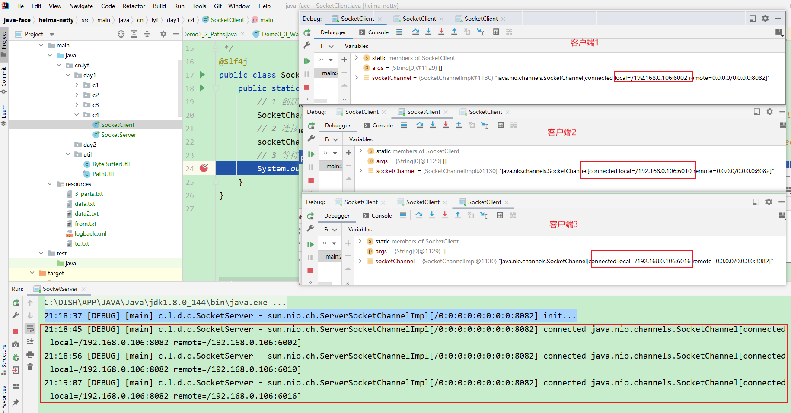

###### 3 三个客户端分别发送一条消息

```
socketChannel.write(StandardCharsets.UTF_8.encode("6002: hello-6002"))
socketChannel.write(StandardCharsets.UTF_8.encode("6010: hello-6010"))
socketChannel.write(StandardCharsets.UTF_8.encode("6016: hello-6016"))
```

###### 4 接3 服务端日志

```verilog
21:18:37 [DEBUG] [main] c.l.d.c.SocketServer - sun.nio.ch.ServerSocketChannelImpl[/0:0:0:0:0:0:0:0:8082] init...
21:18:45 [DEBUG] [main] c.l.d.c.SocketServer - sun.nio.ch.ServerSocketChannelImpl[/0:0:0:0:0:0:0:0:8082] connected java.nio.channels.SocketChannel[connected local=/192.168.0.106:8082 remote=/192.168.0.106:6002]
21:18:56 [DEBUG] [main] c.l.d.c.SocketServer - sun.nio.ch.ServerSocketChannelImpl[/0:0:0:0:0:0:0:0:8082] connected java.nio.channels.SocketChannel[connected local=/192.168.0.106:8082 remote=/192.168.0.106:6010]
21:19:07 [DEBUG] [main] c.l.d.c.SocketServer - sun.nio.ch.ServerSocketChannelImpl[/0:0:0:0:0:0:0:0:8082] connected java.nio.channels.SocketChannel[connected local=/192.168.0.106:8082 remote=/192.168.0.106:6016]
+--------+-------------------- read -----------------------+----------------+
position: [0], limit: [16], capacity: [32], mark: [-1]
         +-------------------------------------------------+
         |  0  1  2  3  4  5  6  7  8  9  a  b  c  d  e  f |
+--------+-------------------------------------------------+----------------+
|00000000| 36 30 30 32 3a 20 68 65 6c 6c 6f 2d 36 30 30 32 |6002: hello-6002|
+--------+-------------------------------------------------+----------------+
21:26:57 [DEBUG] [main] c.l.d.c.SocketServer - after read...java.nio.channels.SocketChannel[connected local=/192.168.0.106:8082 remote=/192.168.0.106:6002]
+--------+-------------------- read -----------------------+----------------+
position: [0], limit: [16], capacity: [32], mark: [-1]
         +-------------------------------------------------+
         |  0  1  2  3  4  5  6  7  8  9  a  b  c  d  e  f |
+--------+-------------------------------------------------+----------------+
|00000000| 36 30 31 30 3a 20 68 65 6c 6c 6f 2d 36 30 31 30 |6010: hello-6010|
+--------+-------------------------------------------------+----------------+
21:28:15 [DEBUG] [main] c.l.d.c.SocketServer - after read...java.nio.channels.SocketChannel[connected local=/192.168.0.106:8082 remote=/192.168.0.106:6010]
+--------+-------------------- read -----------------------+----------------+
position: [0], limit: [16], capacity: [32], mark: [-1]
         +-------------------------------------------------+
         |  0  1  2  3  4  5  6  7  8  9  a  b  c  d  e  f |
+--------+-------------------------------------------------+----------------+
|00000000| 36 30 31 36 3a 20 68 65 6c 6c 6f 2d 36 30 31 36 |6016: hello-6016|
+--------+-------------------------------------------------+----------------+
21:28:46 [DEBUG] [main] c.l.d.c.SocketServer - after read...java.nio.channels.SocketChannel[connected local=/192.168.0.106:8082 remote=/192.168.0.106:6016]
```

##### 4.1.2.3 总结

非阻塞模式，一个线程能处理多个客户端，但是服务端一直处于满负载的状况，服务器压力大


#### 4.1.3 多路复用

单线程可以配合 Selector 完成对多个 Channel 可读写事件的监控，这称之为多路复用

* 多路复用仅针对网络 IO、普通文件 IO 没法利用多路复用
* 如果不用 Selector 的非阻塞模式，线程大部分时间都在做无用功，而 Selector 能够保证
  * 有可连接事件时才去连接
  * 有可读事件才去读取
  * 有可写事件才去写入
    * 限于网络传输能力，Channel 未必时时可写，一旦 Channel 可写，会触发 Selector 的可写事件


### 4.2 Selector

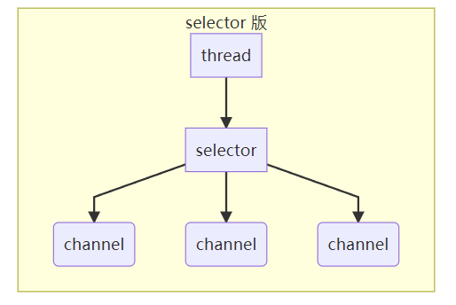

好处

* 一个线程配合 selector 就可以监控多个 channel 的事件，事件发生线程才去处理。避免非阻塞模式下所做无用功
* 让这个线程能够被充分利用
* 节约了线程的数量
* 减少了线程上下文切换


#### 4.2.1 创建

```java
Selector selector = Selector.open();
```


#### 4.2.2 绑定 Channel 事件

也称之为注册事件，绑定的事件 selector 才会关心 

```java
channel.configureBlocking(false);
SelectionKey key = channel.register(selector, 绑定事件);
```

* channel 必须工作在非阻塞模式
* FileChannel 没有非阻塞模式，因此不能配合 selector 一起使用
* 绑定的事件类型可以有
  * connect - 客户端连接成功时触发
  * accept - 服务器端成功接受连接时触发
  * read - 数据可读入时触发，有因为接收能力弱，数据暂不能读入的情况
  * write - 数据可写出时触发，有因为发送能力弱，数据暂不能写出的情况


#### 4.2.3 监听 Channel 事件

可以通过下面三种方法来监听是否有事件发生，方法的返回值代表有多少 channel 发生了事件

方法1，阻塞直到绑定事件发生

```java
int count = selector.select();
```


方法2，阻塞直到绑定事件发生，或是超时（时间单位为 ms）

```java
int count = selector.select(long timeout);
```


方法3，不会阻塞，也就是不管有没有事件，立刻返回，自己根据返回值检查是否有事件

```java
int count = selector.selectNow();
```


#### 4.2.4 💡 select 何时不阻塞

> * 事件发生时
>   * 客户端发起连接请求，会触发 accept 事件
>   * 客户端发送数据过来，客户端正常、异常关闭时，都会触发 read 事件，另外如果发送的数据大于 buffer 缓冲区，会触发多次读取事件
>   * channel 可写，会触发 write 事件
>   * 在 linux 下 nio bug 发生时
> * 调用 selector.wakeup()
> * 调用 selector.close()
> * selector 所在线程 interrupt

#### 4.2.5 Selector入门小case

##### 服务端

```java
package cn.lyf.day1.c4;

import lombok.extern.slf4j.Slf4j;

import java.io.IOException;
import java.net.InetSocketAddress;
import java.nio.channels.*;
import java.util.Iterator;

/**
 * @author lyf
 * @version 1.0
 * @classname SocketServer
 * @description
 * @since 2022/7/24 20:19
 */
@Slf4j
public class SocketServer {
    public static void main(String[] args) throws IOException {
        // 1 创建Selector, 管理多个 Channel
        Selector selector = Selector.open();
        // 2 创建ServerSocketChannel
        ServerSocketChannel serverSocketChannel = ServerSocketChannel.open();
        // 2.1 设置为非阻塞模式
        serverSocketChannel.configureBlocking(false);
        // 2.2 将 ServerSocketChannel 注册到Selector中
        // SelectionKey就是将来事件发生后，通过它可以知道事件和哪个Channel的事件
        SelectionKey serverSocketChannelKey = serverSocketChannel.register(selector, 0, null);
        log.debug("serverSocketChannelKey: {}", serverSocketChannelKey);
        // 表示serverSocketChannelKey只对accept事件感兴趣
        serverSocketChannelKey.interestOps(SelectionKey.OP_ACCEPT);

        // 2.3 绑定8080端口
        serverSocketChannel.bind(new InetSocketAddress(8080));

        while (true) {
            // 3 获select方法，没有事件发生，线程阻塞，有事件发生，线程才会恢复运行
            selector.select();
            // 4 处理Selector事件，selectKeys 内部包含了所有发生的事件
            Iterator<SelectionKey> iterator = selector.selectedKeys().iterator();
            while (iterator.hasNext()) {
                SelectionKey selectionKey = iterator.next();
                log.debug("selectionKey: {}", selectionKey);
                SelectableChannel channel = selectionKey.channel();
                if (channel instanceof ServerSocketChannel) {
                    ServerSocketChannel serverChannel = (ServerSocketChannel) channel;
                    SocketChannel socketChannel = serverChannel.accept();
                    log.debug("socketChannel: {}", socketChannel);
                }
            }
        }
    }
}

```


##### 客户端

```java
package cn.lyf.day1.c4;

import lombok.extern.slf4j.Slf4j;

import java.io.IOException;
import java.net.InetSocketAddress;
import java.nio.channels.SocketChannel;

/**
 * @author lyf
 * @version 1.0
 * @classname SocketClient
 * @description
 * @since 2022/7/24 20:28
 */
@Slf4j
public class SocketClient {
    public static void main(String[] args) throws IOException {
        // 1 创建SocketChannel 客户端
        SocketChannel socketChannel = SocketChannel.open();
        // 2 连接端口号
        socketChannel.connect(new InetSocketAddress(8080));
        // 3 等待
        System.out.println("waiting");
    }
}

```

##### 执行结果

```verilog
08:17:35 [DEBUG] [main] c.l.d.c.SocketServer - serverSocketChannelKey: sun.nio.ch.SelectionKeyImpl@73f792cf
08:17:39 [DEBUG] [main] c.l.d.c.SocketServer - selectionKey: sun.nio.ch.SelectionKeyImpl@73f792cf
08:17:39 [DEBUG] [main] c.l.d.c.SocketServer - socketChannel: java.nio.channels.SocketChannel[connected local=/192.168.0.106:8080 remote=/192.168.0.106:7984]
```


### 4.3 处理 accept 事件

客户端代码为

```java
public class Client {
    public static void main(String[] args) {
        try (Socket socket = new Socket("localhost", 8080)) {
            System.out.println(socket);
            socket.getOutputStream().write("world".getBytes());
            System.in.read();
        } catch (IOException e) {
            e.printStackTrace();
        }
    }
}
```


服务器端代码为

```java
@Slf4j
public class ChannelDemo6 {
    public static void main(String[] args) {
        try (ServerSocketChannel channel = ServerSocketChannel.open()) {
            channel.bind(new InetSocketAddress(8080));
            System.out.println(channel);
            Selector selector = Selector.open();
            channel.configureBlocking(false);
            channel.register(selector, SelectionKey.OP_ACCEPT);

            while (true) {
                int count = selector.select();
//                int count = selector.selectNow();
                log.debug("select count: {}", count);
//                if(count <= 0) {
//                    continue;
//                }

                // 获取所有事件
                Set<SelectionKey> keys = selector.selectedKeys();

                // 遍历所有事件，逐一处理
                Iterator<SelectionKey> iter = keys.iterator();
                while (iter.hasNext()) {
                    SelectionKey key = iter.next();
                    // 判断事件类型
                    if (key.isAcceptable()) {
                        ServerSocketChannel c = (ServerSocketChannel) key.channel();
                        // 必须处理
                        SocketChannel sc = c.accept();
                        log.debug("{}", sc);
                    }
                    // 处理完毕，必须将事件移除
                    iter.remove();
                }
            }
        } catch (IOException e) {
            e.printStackTrace();
        }
    }
}
```


#### 💡 事件发生后能否不处理

> 事件发生后，要么处理，要么取消（cancel），不能什么都不做，否则下次该事件仍会触发，这是因为 nio 底层使用的是水平触发

##### 不处理

```java
package cn.lyf.day1.c4;

import lombok.extern.slf4j.Slf4j;

import java.io.IOException;
import java.net.InetSocketAddress;
import java.nio.channels.*;
import java.util.Iterator;

/**
 * @author lyf
 * @version 1.0
 * @classname SocketServer
 * @description
 * @since 2022/7/24 20:19
 */
@Slf4j
public class SocketServer {
    public static void main(String[] args) throws IOException {
        // 1 创建Selector, 管理多个 Channel
        Selector selector = Selector.open();
        // 2 创建ServerSocketChannel
        ServerSocketChannel serverSocketChannel = ServerSocketChannel.open();
        // 2.1 设置为非阻塞模式
        serverSocketChannel.configureBlocking(false);
        // 2.2 将 ServerSocketChannel 注册到Selector中
        // SelectionKey就是将来事件发生后，通过它可以知道事件和哪个Channel的事件
        SelectionKey serverSocketChannelKey = serverSocketChannel.register(selector, 0, null);
        log.debug("serverSocketChannelKey: {}", serverSocketChannelKey);
        // 表示serverSocketChannelKey只对accept事件感兴趣
        serverSocketChannelKey.interestOps(SelectionKey.OP_ACCEPT);

        // 2.3 绑定8080端口
        serverSocketChannel.bind(new InetSocketAddress(8080));

        while (true) {
            // 3 获select方法，没有事件发生，线程阻塞，有事件发生，线程才会恢复运行
            selector.select();
            // 4 处理Selector事件，selectKeys 内部包含了所有发生的事件
            Iterator<SelectionKey> iterator = selector.selectedKeys().iterator();
            while (iterator.hasNext()) {
                SelectionKey socketChannelKey = iterator.next();
                log.debug("socketChannelKey: {}", socketChannelKey);
                SelectableChannel channel = socketChannelKey.channel();
                if (channel instanceof ServerSocketChannel) {
                    ServerSocketChannel serverChannel = (ServerSocketChannel) channel;
                    // 如果不处理的化，Selector会一直把accept事件加到selectedKeys中
                    // SocketChannel socketChannel = serverChannel.accept();
                    log.debug("socketChannel: {}", serverChannel);
                }
            }
        }
    }
}

```

###### 结果

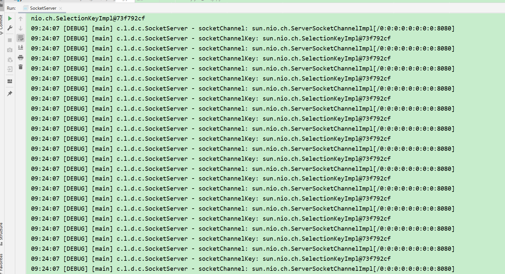

##### 取消事件

```java
package cn.lyf.day1.c4;

import lombok.extern.slf4j.Slf4j;

import java.io.IOException;
import java.net.InetSocketAddress;
import java.nio.channels.*;
import java.util.Iterator;

/**
 * @author lyf
 * @version 1.0
 * @classname SocketServer
 * @description
 * @since 2022/7/24 20:19
 */
@Slf4j
public class SocketServer {
    public static void main(String[] args) throws IOException {
        // 1 创建Selector, 管理多个 Channel
        Selector selector = Selector.open();
        // 2 创建ServerSocketChannel
        ServerSocketChannel serverSocketChannel = ServerSocketChannel.open();
        // 2.1 设置为非阻塞模式
        serverSocketChannel.configureBlocking(false);
        // 2.2 将 ServerSocketChannel 注册到Selector中
        // SelectionKey就是将来事件发生后，通过它可以知道事件和哪个Channel的事件
        SelectionKey serverSocketChannelKey = serverSocketChannel.register(selector, 0, null);
        log.debug("serverSocketChannelKey: {}", serverSocketChannelKey);
        // 表示serverSocketChannelKey只对accept事件感兴趣
        serverSocketChannelKey.interestOps(SelectionKey.OP_ACCEPT);

        // 2.3 绑定8080端口
        serverSocketChannel.bind(new InetSocketAddress(8080));

        while (true) {
            // 3 获select方法，没有事件发生，线程阻塞，有事件发生，线程才会恢复运行
            selector.select();
            // 4 处理Selector事件，selectKeys 内部包含了所有发生的事件
            Iterator<SelectionKey> iterator = selector.selectedKeys().iterator();
            while (iterator.hasNext()) {
                SelectionKey socketChannelKey = iterator.next();
                log.debug("socketChannelKey: {}", socketChannelKey);
                SelectableChannel channel = socketChannelKey.channel();
                if (channel instanceof ServerSocketChannel) {
                    ServerSocketChannel serverChannel = (ServerSocketChannel) channel;
                    // 如果不处理的化，Selector会一直把accept事件加到selectedKeys中
                    // SocketChannel socketChannel = serverChannel.accept();
                    log.debug("socketChannel: {}", serverChannel);
                    // 不处理，直接取消事件
                    socketChannelKey.cancel();
                }
            }
        }
    }
}

```


###### 结果

```verilog
09:21:06 [DEBUG] [main] c.l.d.c.SocketServer - serverSocketChannelKey: sun.nio.ch.SelectionKeyImpl@73f792cf
09:21:12 [DEBUG] [main] c.l.d.c.SocketServer - socketChannelKey: sun.nio.ch.SelectionKeyImpl@73f792cf
09:21:12 [DEBUG] [main] c.l.d.c.SocketServer - socketChannel: sun.nio.ch.ServerSocketChannelImpl[/0:0:0:0:0:0:0:0:8080]
```


### 4.4 处理 read 事件

```java
@Slf4j
public class ChannelDemo6 {
    public static void main(String[] args) {
        try (ServerSocketChannel channel = ServerSocketChannel.open()) {
            channel.bind(new InetSocketAddress(8080));
            System.out.println(channel);
            Selector selector = Selector.open();
            channel.configureBlocking(false);
            channel.register(selector, SelectionKey.OP_ACCEPT);

            while (true) {
                int count = selector.select();
//                int count = selector.selectNow();
                log.debug("select count: {}", count);
//                if(count <= 0) {
//                    continue;
//                }

                // 获取所有事件
                Set<SelectionKey> keys = selector.selectedKeys();

                // 遍历所有事件，逐一处理
                Iterator<SelectionKey> iter = keys.iterator();
                while (iter.hasNext()) {
                    SelectionKey key = iter.next();
                    // 判断事件类型
                    if (key.isAcceptable()) {
                        ServerSocketChannel c = (ServerSocketChannel) key.channel();
                        // 必须处理
                        SocketChannel sc = c.accept();
                        sc.configureBlocking(false);
                        sc.register(selector, SelectionKey.OP_READ);
                        log.debug("连接已建立: {}", sc);
                    } else if (key.isReadable()) {
                        SocketChannel sc = (SocketChannel) key.channel();
                        ByteBuffer buffer = ByteBuffer.allocate(128);
                        int read = sc.read(buffer);
                        if(read == -1) {
                            key.cancel();
                            sc.close();
                        } else {
                            buffer.flip();
                            debug(buffer);
                        }
                    }
                    // 处理完毕，必须将事件移除
                    iter.remove();
                }
            }
        } catch (IOException e) {
            e.printStackTrace();
        }
    }
}
```

开启两个客户端，修改一下发送文字，输出

```
sun.nio.ch.ServerSocketChannelImpl[/0:0:0:0:0:0:0:0:8080]
21:16:39 [DEBUG] [main] c.i.n.ChannelDemo6 - select count: 1
21:16:39 [DEBUG] [main] c.i.n.ChannelDemo6 - 连接已建立: java.nio.channels.SocketChannel[connected local=/127.0.0.1:8080 remote=/127.0.0.1:60367]
21:16:39 [DEBUG] [main] c.i.n.ChannelDemo6 - select count: 1
         +-------------------------------------------------+
         |  0  1  2  3  4  5  6  7  8  9  a  b  c  d  e  f |
+--------+-------------------------------------------------+----------------+
|00000000| 68 65 6c 6c 6f                                  |hello           |
+--------+-------------------------------------------------+----------------+
21:16:59 [DEBUG] [main] c.i.n.ChannelDemo6 - select count: 1
21:16:59 [DEBUG] [main] c.i.n.ChannelDemo6 - 连接已建立: java.nio.channels.SocketChannel[connected local=/127.0.0.1:8080 remote=/127.0.0.1:60378]
21:16:59 [DEBUG] [main] c.i.n.ChannelDemo6 - select count: 1
         +-------------------------------------------------+
         |  0  1  2  3  4  5  6  7  8  9  a  b  c  d  e  f |
+--------+-------------------------------------------------+----------------+
|00000000| 77 6f 72 6c 64                                  |world           |
+--------+-------------------------------------------------+----------------+
```


#### 💡 为何要 iter.remove()

> 因为 select 在事件发生后，就会将相关的 key 放入 selectedKeys 集合，但不会在处理完后从 selectedKeys 集合中移除，需要我们自己编码删除。例如
>
> * 第一次触发了 ssckey 上的 accept 事件，没有移除 ssckey 
> * 第二次触发了 sckey 上的 read 事件，但这时 selectedKeys 中还有上次的 ssckey ，在处理时因为没有真正的 serverSocket 连上了，就会导致空指针异常


#### 💡 cancel 的作用

> cancel 会取消注册在 selector 上的 channel，并从 keys 集合中删除 key 后续不会再监听事件


#### ⚠️  不处理边界的问题

以前有同学写过这样的代码，思考注释中两个问题，以 bio 为例，其实 nio 道理是一样的

```java
public class Server {
    public static void main(String[] args) throws IOException {
        ServerSocket ss=new ServerSocket(9000);
        while (true) {
            Socket s = ss.accept();
            InputStream in = s.getInputStream();
            // 这里这么写，有没有问题
            byte[] arr = new byte[4];
            while(true) {
                int read = in.read(arr);
                // 这里这么写，有没有问题
                if(read == -1) {
                    break;
                }
                System.out.println(new String(arr, 0, read));
            }
        }
    }
}
```

客户端

```java
public class Client {
    public static void main(String[] args) throws IOException {
        Socket max = new Socket("localhost", 9000);
        OutputStream out = max.getOutputStream();
        out.write("hello".getBytes());
        out.write("world".getBytes());
        out.write("你好".getBytes());
        max.close();
    }
}
```

输出

```
hell
owor
ld�
�好

```

为什么？


#### 处理消息的边界


* 一种思路是固定消息长度，数据包大小一样，服务器按预定长度读取，缺点是浪费带宽

* 另一种思路是按分隔符拆分，缺点是效率低

* TLV 格式，即 Type 类型、Length 长度、Value 数据，类型和长度已知的情况下，就可以方便获取消息大小，分配合适的 buffer，缺点是 buffer 需要提前分配，如果内容过大，则影响 server 吞吐量
  * Http 1.1 是 TLV 格式
  * Http 2.0 是 LTV 格式
  
  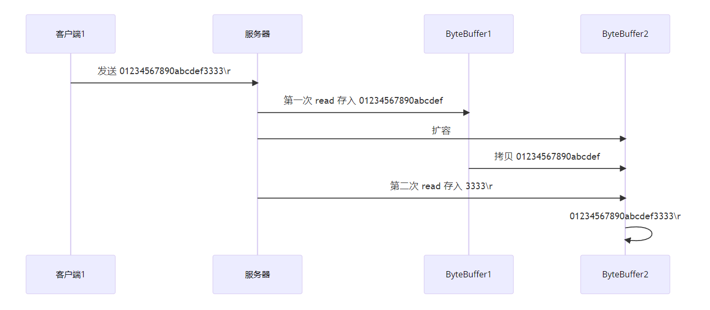

服务器端

```java
private static void split(ByteBuffer source) {
    source.flip();
    for (int i = 0; i < source.limit(); i++) {
        // 找到一条完整消息
        if (source.get(i) == '\n') {
            int length = i + 1 - source.position();
            // 把这条完整消息存入新的 ByteBuffer
            ByteBuffer target = ByteBuffer.allocate(length);
            // 从 source 读，向 target 写
            for (int j = 0; j < length; j++) {
                target.put(source.get());
            }
            debugAll(target);
        }
    }
    source.compact(); // 0123456789abcdef  position 16 limit 16
}

public static void main(String[] args) throws IOException {
    // 1. 创建 selector, 管理多个 channel
    Selector selector = Selector.open();
    ServerSocketChannel ssc = ServerSocketChannel.open();
    ssc.configureBlocking(false);
    // 2. 建立 selector 和 channel 的联系（注册）
    // SelectionKey 就是将来事件发生后，通过它可以知道事件和哪个channel的事件
    SelectionKey sscKey = ssc.register(selector, 0, null);
    // key 只关注 accept 事件
    sscKey.interestOps(SelectionKey.OP_ACCEPT);
    log.debug("sscKey:{}", sscKey);
    ssc.bind(new InetSocketAddress(8080));
    while (true) {
        // 3. select 方法, 没有事件发生，线程阻塞，有事件，线程才会恢复运行
        // select 在事件未处理时，它不会阻塞, 事件发生后要么处理，要么取消，不能置之不理
        selector.select();
        // 4. 处理事件, selectedKeys 内部包含了所有发生的事件
        Iterator<SelectionKey> iter = selector.selectedKeys().iterator(); // accept, read
        while (iter.hasNext()) {
            SelectionKey key = iter.next();
            // 处理key 时，要从 selectedKeys 集合中删除，否则下次处理就会有问题
            iter.remove();
            log.debug("key: {}", key);
            // 5. 区分事件类型
            if (key.isAcceptable()) { // 如果是 accept
                ServerSocketChannel channel = (ServerSocketChannel) key.channel();
                SocketChannel sc = channel.accept();
                sc.configureBlocking(false);
                ByteBuffer buffer = ByteBuffer.allocate(16); // attachment
                // 将一个 byteBuffer 作为附件关联到 selectionKey 上
                SelectionKey scKey = sc.register(selector, 0, buffer);
                scKey.interestOps(SelectionKey.OP_READ);
                log.debug("{}", sc);
                log.debug("scKey:{}", scKey);
            } else if (key.isReadable()) { // 如果是 read
                try {
                    SocketChannel channel = (SocketChannel) key.channel(); // 拿到触发事件的channel
                    // 获取 selectionKey 上关联的附件
                    ByteBuffer buffer = (ByteBuffer) key.attachment();
                    int read = channel.read(buffer); // 如果是正常断开，read 的方法的返回值是 -1
                    if(read == -1) {
                        key.cancel();
                    } else {
                        split(buffer);
                        // 需要扩容
                        if (buffer.position() == buffer.limit()) {
                            ByteBuffer newBuffer = ByteBuffer.allocate(buffer.capacity() * 2);
                            buffer.flip();
                            newBuffer.put(buffer); // 0123456789abcdef3333\n
                            key.attach(newBuffer);
                        }
                    }

                } catch (IOException e) {
                    e.printStackTrace();
                    key.cancel();  // 因为客户端断开了,因此需要将 key 取消（从 selector 的 keys 集合中真正删除 key）
                }
            }
        }
    }
}
```


客户端

```java
SocketChannel sc = SocketChannel.open();
sc.connect(new InetSocketAddress("localhost", 8080));
SocketAddress address = sc.getLocalAddress();
// sc.write(Charset.defaultCharset().encode("hello\nworld\n"));
sc.write(Charset.defaultCharset().encode("0123\n456789abcdef"));
sc.write(Charset.defaultCharset().encode("0123456789abcdef3333\n"));
System.in.read();
```


#### ByteBuffer 大小分配

* 每个 channel 都需要记录可能被切分的消息，因为 ByteBuffer 不能被多个 channel 共同使用，因此需要为每个 channel 维护一个独立的 ByteBuffer
* ByteBuffer 不能太大，比如一个 ByteBuffer 1Mb 的话，要支持百万连接就要 1Tb 内存，因此需要设计大小可变的 ByteBuffer
  * 一种思路是首先分配一个较小的 buffer，例如 4k，如果发现数据不够，再分配 8k 的 buffer，将 4k buffer 内容拷贝至 8k buffer，优点是消息连续容易处理，缺点是数据拷贝耗费性能，参考实现 [http://tutorials.jenkov.com/java-performance/resizable-array.html](http://tutorials.jenkov.com/java-performance/resizable-array.html)
  * 另一种思路是用多个数组组成 buffer，一个数组不够，把多出来的内容写入新的数组，与前面的区别是消息存储不连续解析复杂，优点是避免了拷贝引起的性能损耗


### 4.5 处理 write 事件

#### 4.5.1 一次性无法写完的例子入门小case

##### 4.5.1.1 服务端

```java
package cn.lyf.day1.c4.demo3;

import lombok.extern.slf4j.Slf4j;

import java.io.IOException;
import java.net.InetSocketAddress;
import java.nio.ByteBuffer;
import java.nio.channels.*;
import java.nio.charset.StandardCharsets;
import java.util.Iterator;

/**
 * @author lyf
 * @version 1.0
 * @classname WriteServer
 * @description 服务端向客户端写文件
 * @since 2022/7/25 16:46
 */
@Slf4j
public class WriteServer {
    public static void main(String[] args) throws IOException {
        ServerSocketChannel ssc = ServerSocketChannel.open();
        ssc.bind(new InetSocketAddress(8080));
        ssc.configureBlocking(false);
        Selector selector = Selector.open();
        SelectionKey sscKey = ssc.register(selector, SelectionKey.OP_ACCEPT);
        log.debug("sscKey: {}", sscKey);

        while (true) {
            // Selector的selector方法来处理连接事件
            selector.select();

            // 获取索引的连接事件
            Iterator<SelectionKey> iterator = selector.selectedKeys().iterator();
            while (iterator.hasNext()) {
                SelectionKey selectionKey = iterator.next();
                iterator.remove();
                SelectableChannel channel = selectionKey.channel();
                if (selectionKey.isAcceptable()) { // 表示是服务端
                    if (channel instanceof ServerSocketChannel) {
                        // 1 表示有客户端尝试进行连接
                        ServerSocketChannel tmpSsc = (ServerSocketChannel) channel;
                        SocketChannel sc = tmpSsc.accept();
                        sc.configureBlocking(false);
                        SelectionKey scKey = sc.register(selector, SelectionKey.OP_READ);
                        log.debug("scKey: {}", scKey);
                        // 2 向客户端写内容
                        StringBuilder sb = new StringBuilder();
                        for (int i = 0; i < 400_000_0; i++) {
                            sb.append("a");
                        }
                        // 准备写入的内容
                        ByteBuffer byteBuffer = StandardCharsets.UTF_8.encode(sb.toString());
                        while (byteBuffer.hasRemaining()) {
                            int writeCount = sc.write(byteBuffer);
                            log.debug("writeCount: {}", writeCount);
                        }
                    }
                }
            }
        }
    }
}

```


##### 4.5.1.2 客户端

```java
package cn.lyf.day1.c4.demo3;

import lombok.extern.slf4j.Slf4j;

import java.io.IOException;
import java.net.InetSocketAddress;
import java.nio.ByteBuffer;
import java.nio.channels.SocketChannel;

/**
 * @author lyf
 * @version 1.0
 * @classname WriteClient
 * @description
 * @since 2022/7/25 17:04
 */
@Slf4j
public class WriteClient {
    public static void main(String[] args) throws IOException {
        SocketChannel sc = SocketChannel.open();
        sc.connect(new InetSocketAddress("127.0.0.1", 8080));
        ByteBuffer byteBuffer = ByteBuffer.allocate(1024 * 1024);

        int count = 0;
        while (true) {
            count += sc.read(byteBuffer);
            log.debug("累计读到的字节数: {}", count);
            byteBuffer.clear();
        }
    }
}

```


##### 4.5.1.3 执行结果

###### 服务端

```verilog
17:25:40 [DEBUG] [main] c.l.d.c.d.WriteServer - sscKey: sun.nio.ch.SelectionKeyImpl@73f792cf
17:25:45 [DEBUG] [main] c.l.d.c.d.WriteServer - scKey: sun.nio.ch.SelectionKeyImpl@5315b42e
17:25:45 [DEBUG] [main] c.l.d.c.d.WriteServer - writeCount: 3014633
17:25:45 [DEBUG] [main] c.l.d.c.d.WriteServer - writeCount: 0
17:25:45 [DEBUG] [main] c.l.d.c.d.WriteServer - writeCount: 0
17:25:45 [DEBUG] [main] c.l.d.c.d.WriteServer - writeCount: 0
17:25:45 [DEBUG] [main] c.l.d.c.d.WriteServer - writeCount: 0
17:25:45 [DEBUG] [main] c.l.d.c.d.WriteServer - writeCount: 0
17:25:45 [DEBUG] [main] c.l.d.c.d.WriteServer - writeCount: 0
17:25:45 [DEBUG] [main] c.l.d.c.d.WriteServer - writeCount: 0
17:25:45 [DEBUG] [main] c.l.d.c.d.WriteServer - writeCount: 0
17:25:45 [DEBUG] [main] c.l.d.c.d.WriteServer - writeCount: 0
17:25:45 [DEBUG] [main] c.l.d.c.d.WriteServer - writeCount: 0
17:25:45 [DEBUG] [main] c.l.d.c.d.WriteServer - writeCount: 0
17:25:45 [DEBUG] [main] c.l.d.c.d.WriteServer - writeCount: 0
17:25:45 [DEBUG] [main] c.l.d.c.d.WriteServer - writeCount: 0
17:25:45 [DEBUG] [main] c.l.d.c.d.WriteServer - writeCount: 0
17:25:45 [DEBUG] [main] c.l.d.c.d.WriteServer - writeCount: 0
17:25:45 [DEBUG] [main] c.l.d.c.d.WriteServer - writeCount: 0
17:25:45 [DEBUG] [main] c.l.d.c.d.WriteServer - writeCount: 0
17:25:45 [DEBUG] [main] c.l.d.c.d.WriteServer - writeCount: 0
17:25:45 [DEBUG] [main] c.l.d.c.d.WriteServer - writeCount: 0
17:25:45 [DEBUG] [main] c.l.d.c.d.WriteServer - writeCount: 0
17:25:45 [DEBUG] [main] c.l.d.c.d.WriteServer - writeCount: 0
17:25:45 [DEBUG] [main] c.l.d.c.d.WriteServer - writeCount: 0
17:25:45 [DEBUG] [main] c.l.d.c.d.WriteServer - writeCount: 0
17:25:45 [DEBUG] [main] c.l.d.c.d.WriteServer - writeCount: 0
17:25:45 [DEBUG] [main] c.l.d.c.d.WriteServer - writeCount: 0
17:25:45 [DEBUG] [main] c.l.d.c.d.WriteServer - writeCount: 0
17:25:45 [DEBUG] [main] c.l.d.c.d.WriteServer - writeCount: 0
17:25:45 [DEBUG] [main] c.l.d.c.d.WriteServer - writeCount: 0
17:25:45 [DEBUG] [main] c.l.d.c.d.WriteServer - writeCount: 0
17:25:45 [DEBUG] [main] c.l.d.c.d.WriteServer - writeCount: 0
17:25:45 [DEBUG] [main] c.l.d.c.d.WriteServer - writeCount: 0
17:25:45 [DEBUG] [main] c.l.d.c.d.WriteServer - writeCount: 0
17:25:45 [DEBUG] [main] c.l.d.c.d.WriteServer - writeCount: 0
17:25:45 [DEBUG] [main] c.l.d.c.d.WriteServer - writeCount: 0
17:25:45 [DEBUG] [main] c.l.d.c.d.WriteServer - writeCount: 0
17:25:45 [DEBUG] [main] c.l.d.c.d.WriteServer - writeCount: 0
17:25:45 [DEBUG] [main] c.l.d.c.d.WriteServer - writeCount: 0
17:25:45 [DEBUG] [main] c.l.d.c.d.WriteServer - writeCount: 0
17:25:45 [DEBUG] [main] c.l.d.c.d.WriteServer - writeCount: 0
17:25:45 [DEBUG] [main] c.l.d.c.d.WriteServer - writeCount: 0
17:25:45 [DEBUG] [main] c.l.d.c.d.WriteServer - writeCount: 0
17:25:45 [DEBUG] [main] c.l.d.c.d.WriteServer - writeCount: 0
17:25:45 [DEBUG] [main] c.l.d.c.d.WriteServer - writeCount: 0
17:25:45 [DEBUG] [main] c.l.d.c.d.WriteServer - writeCount: 0
17:25:45 [DEBUG] [main] c.l.d.c.d.WriteServer - writeCount: 0
17:25:45 [DEBUG] [main] c.l.d.c.d.WriteServer - writeCount: 0
17:25:45 [DEBUG] [main] c.l.d.c.d.WriteServer - writeCount: 0
17:25:45 [DEBUG] [main] c.l.d.c.d.WriteServer - writeCount: 0
17:25:45 [DEBUG] [main] c.l.d.c.d.WriteServer - writeCount: 0
17:25:45 [DEBUG] [main] c.l.d.c.d.WriteServer - writeCount: 0
17:25:45 [DEBUG] [main] c.l.d.c.d.WriteServer - writeCount: 0
17:25:45 [DEBUG] [main] c.l.d.c.d.WriteServer - writeCount: 0
17:25:45 [DEBUG] [main] c.l.d.c.d.WriteServer - writeCount: 0
17:25:45 [DEBUG] [main] c.l.d.c.d.WriteServer - writeCount: 0
17:25:45 [DEBUG] [main] c.l.d.c.d.WriteServer - writeCount: 0
17:25:45 [DEBUG] [main] c.l.d.c.d.WriteServer - writeCount: 0
17:25:45 [DEBUG] [main] c.l.d.c.d.WriteServer - writeCount: 0
17:25:45 [DEBUG] [main] c.l.d.c.d.WriteServer - writeCount: 0
17:25:45 [DEBUG] [main] c.l.d.c.d.WriteServer - writeCount: 0
17:25:45 [DEBUG] [main] c.l.d.c.d.WriteServer - writeCount: 0
17:25:45 [DEBUG] [main] c.l.d.c.d.WriteServer - writeCount: 0
17:25:45 [DEBUG] [main] c.l.d.c.d.WriteServer - writeCount: 0
17:25:45 [DEBUG] [main] c.l.d.c.d.WriteServer - writeCount: 0
17:25:45 [DEBUG] [main] c.l.d.c.d.WriteServer - writeCount: 0
17:25:45 [DEBUG] [main] c.l.d.c.d.WriteServer - writeCount: 0
17:25:45 [DEBUG] [main] c.l.d.c.d.WriteServer - writeCount: 0
17:25:45 [DEBUG] [main] c.l.d.c.d.WriteServer - writeCount: 0
17:25:45 [DEBUG] [main] c.l.d.c.d.WriteServer - writeCount: 0
17:25:45 [DEBUG] [main] c.l.d.c.d.WriteServer - writeCount: 0
17:25:45 [DEBUG] [main] c.l.d.c.d.WriteServer - writeCount: 0
17:25:45 [DEBUG] [main] c.l.d.c.d.WriteServer - writeCount: 0
17:25:45 [DEBUG] [main] c.l.d.c.d.WriteServer - writeCount: 0
17:25:45 [DEBUG] [main] c.l.d.c.d.WriteServer - writeCount: 0
17:25:45 [DEBUG] [main] c.l.d.c.d.WriteServer - writeCount: 0
17:25:45 [DEBUG] [main] c.l.d.c.d.WriteServer - writeCount: 0
17:25:45 [DEBUG] [main] c.l.d.c.d.WriteServer - writeCount: 0
17:25:45 [DEBUG] [main] c.l.d.c.d.WriteServer - writeCount: 0
17:25:45 [DEBUG] [main] c.l.d.c.d.WriteServer - writeCount: 0
17:25:45 [DEBUG] [main] c.l.d.c.d.WriteServer - writeCount: 0
17:25:45 [DEBUG] [main] c.l.d.c.d.WriteServer - writeCount: 0
17:25:45 [DEBUG] [main] c.l.d.c.d.WriteServer - writeCount: 0
17:25:45 [DEBUG] [main] c.l.d.c.d.WriteServer - writeCount: 0
17:25:45 [DEBUG] [main] c.l.d.c.d.WriteServer - writeCount: 0
17:25:45 [DEBUG] [main] c.l.d.c.d.WriteServer - writeCount: 0
17:25:45 [DEBUG] [main] c.l.d.c.d.WriteServer - writeCount: 0
17:25:45 [DEBUG] [main] c.l.d.c.d.WriteServer - writeCount: 0
17:25:45 [DEBUG] [main] c.l.d.c.d.WriteServer - writeCount: 0
17:25:45 [DEBUG] [main] c.l.d.c.d.WriteServer - writeCount: 0
17:25:45 [DEBUG] [main] c.l.d.c.d.WriteServer - writeCount: 0
17:25:45 [DEBUG] [main] c.l.d.c.d.WriteServer - writeCount: 0
17:25:45 [DEBUG] [main] c.l.d.c.d.WriteServer - writeCount: 0
17:25:45 [DEBUG] [main] c.l.d.c.d.WriteServer - writeCount: 0
17:25:45 [DEBUG] [main] c.l.d.c.d.WriteServer - writeCount: 0
17:25:45 [DEBUG] [main] c.l.d.c.d.WriteServer - writeCount: 0
17:25:45 [DEBUG] [main] c.l.d.c.d.WriteServer - writeCount: 0
17:25:45 [DEBUG] [main] c.l.d.c.d.WriteServer - writeCount: 0
17:25:45 [DEBUG] [main] c.l.d.c.d.WriteServer - writeCount: 0
17:25:45 [DEBUG] [main] c.l.d.c.d.WriteServer - writeCount: 0
17:25:45 [DEBUG] [main] c.l.d.c.d.WriteServer - writeCount: 0
17:25:45 [DEBUG] [main] c.l.d.c.d.WriteServer - writeCount: 0
17:25:45 [DEBUG] [main] c.l.d.c.d.WriteServer - writeCount: 0
17:25:45 [DEBUG] [main] c.l.d.c.d.WriteServer - writeCount: 0
17:25:45 [DEBUG] [main] c.l.d.c.d.WriteServer - writeCount: 0
17:25:45 [DEBUG] [main] c.l.d.c.d.WriteServer - writeCount: 0
17:25:45 [DEBUG] [main] c.l.d.c.d.WriteServer - writeCount: 0
17:25:45 [DEBUG] [main] c.l.d.c.d.WriteServer - writeCount: 0
17:25:45 [DEBUG] [main] c.l.d.c.d.WriteServer - writeCount: 0
17:25:45 [DEBUG] [main] c.l.d.c.d.WriteServer - writeCount: 0
17:25:45 [DEBUG] [main] c.l.d.c.d.WriteServer - writeCount: 0
17:25:45 [DEBUG] [main] c.l.d.c.d.WriteServer - writeCount: 0
17:25:45 [DEBUG] [main] c.l.d.c.d.WriteServer - writeCount: 0
17:25:45 [DEBUG] [main] c.l.d.c.d.WriteServer - writeCount: 0
17:25:45 [DEBUG] [main] c.l.d.c.d.WriteServer - writeCount: 0
17:25:45 [DEBUG] [main] c.l.d.c.d.WriteServer - writeCount: 0
17:25:45 [DEBUG] [main] c.l.d.c.d.WriteServer - writeCount: 0
17:25:45 [DEBUG] [main] c.l.d.c.d.WriteServer - writeCount: 0
17:25:45 [DEBUG] [main] c.l.d.c.d.WriteServer - writeCount: 0
17:25:45 [DEBUG] [main] c.l.d.c.d.WriteServer - writeCount: 0
17:25:45 [DEBUG] [main] c.l.d.c.d.WriteServer - writeCount: 0
17:25:45 [DEBUG] [main] c.l.d.c.d.WriteServer - writeCount: 0
17:25:45 [DEBUG] [main] c.l.d.c.d.WriteServer - writeCount: 0
17:25:45 [DEBUG] [main] c.l.d.c.d.WriteServer - writeCount: 0
17:25:45 [DEBUG] [main] c.l.d.c.d.WriteServer - writeCount: 0
17:25:45 [DEBUG] [main] c.l.d.c.d.WriteServer - writeCount: 0
17:25:45 [DEBUG] [main] c.l.d.c.d.WriteServer - writeCount: 0
17:25:45 [DEBUG] [main] c.l.d.c.d.WriteServer - writeCount: 0
17:25:45 [DEBUG] [main] c.l.d.c.d.WriteServer - writeCount: 0
17:25:45 [DEBUG] [main] c.l.d.c.d.WriteServer - writeCount: 0
17:25:45 [DEBUG] [main] c.l.d.c.d.WriteServer - writeCount: 0
17:25:45 [DEBUG] [main] c.l.d.c.d.WriteServer - writeCount: 0
17:25:45 [DEBUG] [main] c.l.d.c.d.WriteServer - writeCount: 0
17:25:45 [DEBUG] [main] c.l.d.c.d.WriteServer - writeCount: 0
17:25:45 [DEBUG] [main] c.l.d.c.d.WriteServer - writeCount: 0
17:25:45 [DEBUG] [main] c.l.d.c.d.WriteServer - writeCount: 0
17:25:45 [DEBUG] [main] c.l.d.c.d.WriteServer - writeCount: 0
17:25:45 [DEBUG] [main] c.l.d.c.d.WriteServer - writeCount: 0
17:25:45 [DEBUG] [main] c.l.d.c.d.WriteServer - writeCount: 0
17:25:45 [DEBUG] [main] c.l.d.c.d.WriteServer - writeCount: 0
17:25:45 [DEBUG] [main] c.l.d.c.d.WriteServer - writeCount: 0
17:25:45 [DEBUG] [main] c.l.d.c.d.WriteServer - writeCount: 0
17:25:45 [DEBUG] [main] c.l.d.c.d.WriteServer - writeCount: 0
17:25:45 [DEBUG] [main] c.l.d.c.d.WriteServer - writeCount: 0
17:25:45 [DEBUG] [main] c.l.d.c.d.WriteServer - writeCount: 0
17:25:45 [DEBUG] [main] c.l.d.c.d.WriteServer - writeCount: 0
17:25:45 [DEBUG] [main] c.l.d.c.d.WriteServer - writeCount: 0
17:25:45 [DEBUG] [main] c.l.d.c.d.WriteServer - writeCount: 0
17:25:45 [DEBUG] [main] c.l.d.c.d.WriteServer - writeCount: 0
17:25:45 [DEBUG] [main] c.l.d.c.d.WriteServer - writeCount: 0
17:25:45 [DEBUG] [main] c.l.d.c.d.WriteServer - writeCount: 0
17:25:45 [DEBUG] [main] c.l.d.c.d.WriteServer - writeCount: 0
17:25:45 [DEBUG] [main] c.l.d.c.d.WriteServer - writeCount: 0
17:25:45 [DEBUG] [main] c.l.d.c.d.WriteServer - writeCount: 0
17:25:45 [DEBUG] [main] c.l.d.c.d.WriteServer - writeCount: 0
17:25:45 [DEBUG] [main] c.l.d.c.d.WriteServer - writeCount: 0
17:25:45 [DEBUG] [main] c.l.d.c.d.WriteServer - writeCount: 0
17:25:45 [DEBUG] [main] c.l.d.c.d.WriteServer - writeCount: 0
17:25:45 [DEBUG] [main] c.l.d.c.d.WriteServer - writeCount: 0
17:25:45 [DEBUG] [main] c.l.d.c.d.WriteServer - writeCount: 0
17:25:45 [DEBUG] [main] c.l.d.c.d.WriteServer - writeCount: 0
17:25:45 [DEBUG] [main] c.l.d.c.d.WriteServer - writeCount: 0
17:25:45 [DEBUG] [main] c.l.d.c.d.WriteServer - writeCount: 0
17:25:45 [DEBUG] [main] c.l.d.c.d.WriteServer - writeCount: 0
17:25:45 [DEBUG] [main] c.l.d.c.d.WriteServer - writeCount: 985367
```


###### 客户端

```verilog
17:25:45 [DEBUG] [main] c.l.d.c.d.WriteClient - 累计读到的字节数: 131071
17:25:45 [DEBUG] [main] c.l.d.c.d.WriteClient - 累计读到的字节数: 262142
17:25:45 [DEBUG] [main] c.l.d.c.d.WriteClient - 累计读到的字节数: 393213
17:25:45 [DEBUG] [main] c.l.d.c.d.WriteClient - 累计读到的字节数: 524284
17:25:45 [DEBUG] [main] c.l.d.c.d.WriteClient - 累计读到的字节数: 655355
17:25:45 [DEBUG] [main] c.l.d.c.d.WriteClient - 累计读到的字节数: 786426
17:25:45 [DEBUG] [main] c.l.d.c.d.WriteClient - 累计读到的字节数: 917497
17:25:45 [DEBUG] [main] c.l.d.c.d.WriteClient - 累计读到的字节数: 1048568
17:25:45 [DEBUG] [main] c.l.d.c.d.WriteClient - 累计读到的字节数: 1179639
17:25:45 [DEBUG] [main] c.l.d.c.d.WriteClient - 累计读到的字节数: 1310710
17:25:45 [DEBUG] [main] c.l.d.c.d.WriteClient - 累计读到的字节数: 1441781
17:25:45 [DEBUG] [main] c.l.d.c.d.WriteClient - 累计读到的字节数: 1572852
17:25:45 [DEBUG] [main] c.l.d.c.d.WriteClient - 累计读到的字节数: 1703923
17:25:45 [DEBUG] [main] c.l.d.c.d.WriteClient - 累计读到的字节数: 1834994
17:25:45 [DEBUG] [main] c.l.d.c.d.WriteClient - 累计读到的字节数: 1966065
17:25:45 [DEBUG] [main] c.l.d.c.d.WriteClient - 累计读到的字节数: 2097136
17:25:45 [DEBUG] [main] c.l.d.c.d.WriteClient - 累计读到的字节数: 2228207
17:25:45 [DEBUG] [main] c.l.d.c.d.WriteClient - 累计读到的字节数: 2359278
17:25:45 [DEBUG] [main] c.l.d.c.d.WriteClient - 累计读到的字节数: 2490349
17:25:45 [DEBUG] [main] c.l.d.c.d.WriteClient - 累计读到的字节数: 2621420
17:25:45 [DEBUG] [main] c.l.d.c.d.WriteClient - 累计读到的字节数: 2752491
17:25:45 [DEBUG] [main] c.l.d.c.d.WriteClient - 累计读到的字节数: 2817986
17:25:45 [DEBUG] [main] c.l.d.c.d.WriteClient - 累计读到的字节数: 2948976
17:25:45 [DEBUG] [main] c.l.d.c.d.WriteClient - 累计读到的字节数: 3080047
17:25:45 [DEBUG] [main] c.l.d.c.d.WriteClient - 累计读到的字节数: 3211118
17:25:45 [DEBUG] [main] c.l.d.c.d.WriteClient - 累计读到的字节数: 3342189
17:25:45 [DEBUG] [main] c.l.d.c.d.WriteClient - 累计读到的字节数: 3473260
17:25:45 [DEBUG] [main] c.l.d.c.d.WriteClient - 累计读到的字节数: 3604331
17:25:45 [DEBUG] [main] c.l.d.c.d.WriteClient - 累计读到的字节数: 3735402
17:25:45 [DEBUG] [main] c.l.d.c.d.WriteClient - 累计读到的字节数: 3866473
17:25:45 [DEBUG] [main] c.l.d.c.d.WriteClient - 累计读到的字节数: 3997544
17:25:45 [DEBUG] [main] c.l.d.c.d.WriteClient - 累计读到的字节数: 4000000
```


#### 4.5.2 一次无法写完例子(优化)

* 非阻塞模式下，无法保证把 buffer 中所有数据都写入 channel，因此需要追踪 write 方法的返回值（代表实际写入字节数）
* 用 selector 监听所有 channel 的可写事件，每个 channel 都需要一个 key 来跟踪 buffer，但这样又会导致占用内存过多，就有两阶段策略
  * 当消息处理器第一次写入消息时，才将 channel 注册到 selector 上
  * selector 检查 channel 上的可写事件，如果所有的数据写完了，就取消 channel 的注册
  * 如果不取消，会每次可写均会触发 write 事件

##### 4.5.2.1 服务端

```java
package cn.lyf.day1.c4.demo3;

import lombok.extern.slf4j.Slf4j;

import java.io.IOException;
import java.net.InetSocketAddress;
import java.nio.ByteBuffer;
import java.nio.channels.*;
import java.nio.charset.StandardCharsets;
import java.util.Iterator;

/**
 * @author lyf
 * @version 1.0
 * @classname WriteServer
 * @description 服务端向客户端写文件
 * @since 2022/7/25 16:46
 */
@Slf4j
public class WriteServer {
    public static void main(String[] args) throws IOException {
        ServerSocketChannel ssc = ServerSocketChannel.open();
        ssc.bind(new InetSocketAddress(8080));
        ssc.configureBlocking(false);
        Selector selector = Selector.open();
        SelectionKey sscKey = ssc.register(selector, SelectionKey.OP_ACCEPT);
        log.debug("sscKey: {}", sscKey);

        while (true) {
            // Selector的selector方法来处理连接事件
            selector.select();

            // 获取索引的连接事件
            Iterator<SelectionKey> iterator = selector.selectedKeys().iterator();
            while (iterator.hasNext()) {
                SelectionKey selectionKey = iterator.next();
                iterator.remove();
                SelectableChannel channel = selectionKey.channel();
                if (selectionKey.isAcceptable()) { // 表示是服务端
                    if (channel instanceof ServerSocketChannel) {
                        // 1 表示有客户端尝试进行连接
                        ServerSocketChannel tmpSsc = (ServerSocketChannel) channel;
                        SocketChannel sc = tmpSsc.accept();
                        sc.configureBlocking(false);
                        SelectionKey scKey = sc.register(selector, SelectionKey.OP_READ);
                        log.debug("scKey: {}", scKey);
                        // 2 向客户端写内容
                        StringBuilder sb = new StringBuilder();
                        for (int i = 0; i < 400_000_0; i++) {
                            sb.append("a");
                        }
                        // 3 准备写入的内容
                        ByteBuffer byteBuffer = StandardCharsets.UTF_8.encode(sb.toString());
                        // 循环写入存在缓冲区写满的情况，此时不应该再继续尝试写入了，而应该去处理其它的事件
                       /* while (byteBuffer.hasRemaining()) {
                            int writeCount = sc.write(byteBuffer);
                            log.debug("writeCount: {}", writeCount);
                        }*/
                        int writeCount = sc.write(byteBuffer);
                        log.debug("writeCount: {}", writeCount);
                        if (byteBuffer.hasRemaining()) {
                            // 4 未读完 在原有的事件上加上一个可写事件
                            scKey.interestOps(scKey.interestOps() + SelectionKey.OP_WRITE);
                            // 5 那下次事件怎么知道我没有写完呢，将未写完的ByteBuffer绑定到事件上
                            scKey.attach(byteBuffer);
                        }
                    }
                } else if (selectionKey.isWritable()) { // 处理可写事件
                    if (channel instanceof SocketChannel) {
                        // 获取客户端
                        SocketChannel sc = (SocketChannel) channel;
                        // 获取附件
                        ByteBuffer byteBuffer = (ByteBuffer) selectionKey.attachment();
                        int writeCount = sc.write(byteBuffer);
                        log.debug("writeCount: {}", writeCount);
                        if (!byteBuffer.hasRemaining()) {
                            // 如果写完了
                            // 取消可写事件
                            selectionKey.interestOps(selectionKey.interestOps() - SelectionKey.OP_WRITE);
                            // 将事件上的附件移除，以达到内存回收的目的
                            selectionKey.attach(null);
                        }
                    }
                }
            }
        }
    }
}

```

##### 4.5.2.2 客户端

###### 不用Selector版

```java
package cn.lyf.day1.c4.demo3;

import lombok.extern.slf4j.Slf4j;

import java.io.IOException;
import java.net.InetSocketAddress;
import java.nio.ByteBuffer;
import java.nio.channels.SocketChannel;

/**
 * @author lyf
 * @version 1.0
 * @classname WriteClient
 * @description
 * @since 2022/7/25 17:04
 */
@Slf4j
public class WriteClient {
    public static void main(String[] args) throws IOException {
        SocketChannel sc = SocketChannel.open();
        sc.connect(new InetSocketAddress("127.0.0.1", 8080));
        ByteBuffer byteBuffer = ByteBuffer.allocate(1024 * 1024);

        int count = 0;
        while (true) {
            count += sc.read(byteBuffer);
            log.debug("累计读到的字节数: {}", count);
            byteBuffer.clear();
        }
    }
}

```


###### Selector 版

```java
package cn.lyf.day1.c4.demo4;

import cn.lyf.util.SystemConstant;
import lombok.extern.slf4j.Slf4j;

import java.io.IOException;
import java.net.InetSocketAddress;
import java.nio.ByteBuffer;
import java.nio.channels.SelectionKey;
import java.nio.channels.Selector;
import java.nio.channels.SocketChannel;
import java.util.Iterator;

/**
 * @author lyf
 * @version 1.0
 * @classname WriteClient
 * @description
 * @since 2022/7/25 18:02
 */
@Slf4j
public class WriteClient {
    public static void main(String[] args) throws IOException {
        // 1 创建SocketChannel
        Selector selector = Selector.open();
        SocketChannel socketChannel = SocketChannel.open();
        socketChannel.connect(new InetSocketAddress(SystemConstant.LOCALHOST, SystemConstant.PORT));
        socketChannel.configureBlocking(false);
        SelectionKey scKey = socketChannel.register(selector, SelectionKey.OP_CONNECT + SelectionKey.OP_READ);
        log.debug("scKey: {}", scKey);
        int count = 0;
        ByteBuffer byteBuffer = ByteBuffer.allocate(1024 * 1024);
        while (true) {
            // 阻塞连接，等待事件的发生
            selector.select();
            // 获取事件集合
            Iterator<SelectionKey> iterator = selector.selectedKeys().iterator();
            while (iterator.hasNext()) {
                SelectionKey selectionKey = iterator.next();
                // 2 判断事件类型
                if (selectionKey.isConnectable()) { // 是连接事件，服务器端连接客户端
                    log.debug("客户端与服务器端建立了连接: {}", socketChannel.finishConnect());
                } else if (selectionKey.isReadable()) { // 是可读事件，表示服务器端向客户端写数据
                    count += socketChannel.read(byteBuffer);
                    log.debug("已读取的字节数: {}", count);
                    // 读完之后，clear，切换为写模式
                    byteBuffer.clear();
                }
                iterator.remove();
            }

        }
    }
}

```


#### 4.5.3 💡 write 为何要取消

只要向 channel 发送数据时，socket 缓冲可写，这个事件会频繁触发，因此应当只在 socket 缓冲区写不下时再关注可写事件，数据写完之后再取消关注

### 4.6 更进一步

#### 4.6.1 💡 利用多线程优化

> 现在都是多核 cpu，设计时要充分考虑别让 cpu 的力量被白白浪费

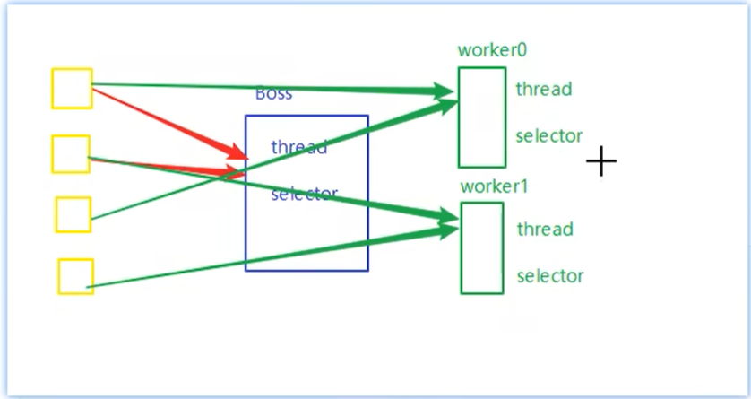

前面的代码只有一个选择器，没有充分利用多核 cpu，如何改进呢？

分两组选择器

* 单线程配一个选择器，专门处理 accept 事件
* 创建 cpu 核心数的线程，每个线程配一个选择器，轮流处理 read 事件


#### 4.6.2 多线程版本1

##### 4.6.2.1 服务器端

```java
package cn.lyf.day1.c4.demo5;

import cn.lyf.util.ByteBufferUtil;
import cn.lyf.util.SystemConstant;
import lombok.extern.slf4j.Slf4j;

import java.io.IOException;
import java.net.InetSocketAddress;
import java.nio.ByteBuffer;
import java.nio.channels.*;
import java.util.Iterator;
import java.util.concurrent.atomic.AtomicBoolean;

/**
 * @author lyf
 * @version 1.0
 * @classname MultiThreadServer
 * @description 多线程版Selector
 * @since 2022/7/25 20:36
 */
@Slf4j
public class MultiThreadServer {
    public static void main(String[] args) throws IOException {
        // boss 线程处理连接
        Thread.currentThread().setName("boss");
        Selector boss = Selector.open();
        ServerSocketChannel serverSocketChannel = ServerSocketChannel.open();
        serverSocketChannel.configureBlocking(false);
        serverSocketChannel.bind(new InetSocketAddress(SystemConstant.PORT));
        SelectionKey sscKey = serverSocketChannel.register(boss, SelectionKey.OP_ACCEPT);
        log.debug("sscKey: {}", sscKey);

        Worker worker = new Worker("worker-1");
        worker.register();
        while (true) {
            boss.select();
            Iterator<SelectionKey> iterator = boss.selectedKeys().iterator();
            while (iterator.hasNext()) {
                SelectionKey selectionKey = iterator.next();
                iterator.remove();
                SelectableChannel channel = selectionKey.channel();
                if (selectionKey.isAcceptable()) {
                    if (channel instanceof ServerSocketChannel) {
                        ServerSocketChannel ssc = (ServerSocketChannel) channel;
                        SocketChannel socketChannel = ssc.accept();
                        socketChannel.configureBlocking(false);
                        log.debug("connected...{}", socketChannel.getRemoteAddress());
                        log.debug("before register...{}", socketChannel.getRemoteAddress());
                        // 关联work线程
                        socketChannel.register(worker.selector, SelectionKey.OP_READ);
                        log.debug("after register...{}", socketChannel.getRemoteAddress());
                    }
                }
            }
        }
        // work-[i] 线程处理读写逻辑

    }

    /**
     * 处理读写事件
     */
    private static class Worker implements Runnable {
        private Thread thread;
        private String threadName;
        private Selector selector;
        private final AtomicBoolean isRegistered = new AtomicBoolean(false);
        public Worker(String threadName) {
            this.threadName = threadName;
        }

        public void register() throws IOException {
            if (!isRegistered.get()) {
                selector = Selector.open();
                thread = new Thread(this, threadName);
                thread.start();
                log.debug("register start, select: {}, threadName: {}, thread: {}", selector, threadName, thread);
                // 注册后将isRegistered设置为true
                isRegistered.set(true);
            }
        }

        @Override
        public void run() {
            ByteBuffer byteBuffer = ByteBuffer.allocate(16);
            while (true) {
                try {
                    selector.select();
                    Iterator<SelectionKey> iterator = selector.selectedKeys().iterator();
                    while (iterator.hasNext()) {
                        SelectionKey selectionKey = iterator.next();
                        iterator.remove();
                        if (selectionKey.isReadable()) { // 处理可读事件
                            try {
                                SelectableChannel channel = selectionKey.channel();
                                if (channel instanceof SocketChannel) {
                                    SocketChannel socketChannel = (SocketChannel) channel;
                                    log.debug("read...{}", socketChannel.getRemoteAddress());
                                    int read = socketChannel.read(byteBuffer);
                                    if (read < 0) {
                                        selectionKey.cancel();
                                        socketChannel.close();
                                    }
                                    byteBuffer.flip();
                                    ByteBufferUtil.debugAll(byteBuffer);
                                }
                            } catch (IOException e) {
                                e.printStackTrace();
                                selectionKey.cancel();
                            }
                        }
                    }
                } catch (IOException e) {
                    e.printStackTrace();
                }
            }
        }
    }
}

```


##### 4.6.2.2 客户端

```java
package cn.lyf.day1.c4.demo5;

import cn.lyf.util.SystemConstant;
import lombok.extern.slf4j.Slf4j;

import java.io.IOException;
import java.net.InetSocketAddress;
import java.nio.channels.SocketChannel;
import java.nio.charset.StandardCharsets;

/**
 * @author lyf
 * @version 1.0
 * @classname Client
 * @description
 * @since 2022/7/25 21:15
 */
@Slf4j
public class Client {
    public static void main(String[] args) throws IOException {
        SocketChannel socketChannel = SocketChannel.open();
        socketChannel.connect(new InetSocketAddress(SystemConstant.LOCALHOST, SystemConstant.PORT));
        socketChannel.write(StandardCharsets.UTF_8.encode("hello"));
        System.out.println();
    }
}

```


##### 4.6.2.3 执行结果

###### a 服务端

```verilog
21:44:05 [DEBUG] [boss] c.l.d.c.d.MultiThreadServer - sscKey: sun.nio.ch.SelectionKeyImpl@73f792cf
21:44:05 [DEBUG] [boss] c.l.d.c.d.MultiThreadServer - register start, select: sun.nio.ch.WindowsSelectorImpl@5315b42e, threadName: worker-1, thread: Thread[worker-1,5,main]
21:44:15 [DEBUG] [boss] c.l.d.c.d.MultiThreadServer - connected.../127.0.0.1:12532
21:44:15 [DEBUG] [boss] c.l.d.c.d.MultiThreadServer - before register.../127.0.0.1:12532
```


###### b 客户端

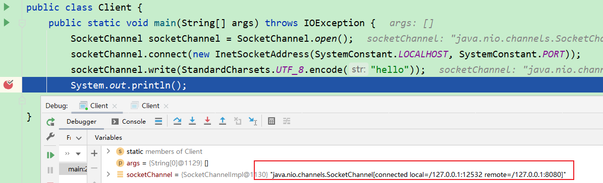

##### 4.6.2.4 问题现象&原因分析

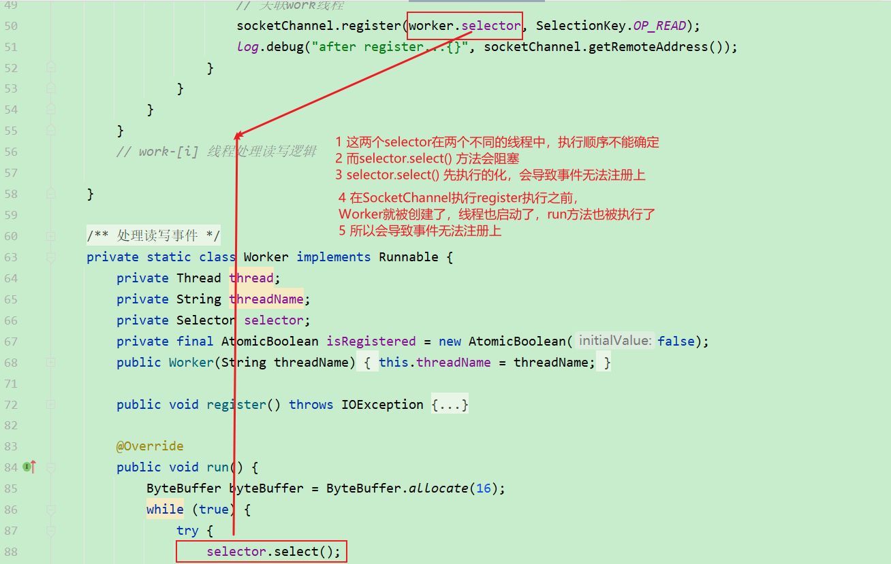

#### 4.6.3 多线程版本-队列解决selector.select 与 SocketChannel注册事件执行顺序问题

##### 4.6.3.1 服务器端

```java
package cn.lyf.day1.c4.demo5;

import cn.lyf.util.ByteBufferUtil;
import cn.lyf.util.SystemConstant;
import lombok.extern.slf4j.Slf4j;

import java.io.IOException;
import java.net.InetSocketAddress;
import java.nio.ByteBuffer;
import java.nio.channels.*;
import java.util.Iterator;
import java.util.concurrent.ConcurrentLinkedQueue;
import java.util.concurrent.atomic.AtomicBoolean;

/**
 * @author lyf
 * @version 1.0
 * @classname MultiThreadServer
 * @description 多线程版Selector
 * @since 2022/7/25 20:36
 */
@Slf4j
public class MultiThreadServerV2 {
    public static void main(String[] args) throws IOException {
        // boss 线程处理连接
        Thread.currentThread().setName("boss");
        Selector boss = Selector.open();
        ServerSocketChannel serverSocketChannel = ServerSocketChannel.open();
        serverSocketChannel.configureBlocking(false);
        serverSocketChannel.bind(new InetSocketAddress(SystemConstant.PORT));
        SelectionKey sscKey = serverSocketChannel.register(boss, SelectionKey.OP_ACCEPT);
        log.debug("sscKey: {}", sscKey);

        Worker worker = new Worker("worker-1");

        while (true) {
            boss.select();
            Iterator<SelectionKey> iterator = boss.selectedKeys().iterator();
            while (iterator.hasNext()) {
                SelectionKey selectionKey = iterator.next();
                iterator.remove();
                SelectableChannel channel = selectionKey.channel();
                if (selectionKey.isAcceptable()) {
                    if (channel instanceof ServerSocketChannel) {
                        ServerSocketChannel ssc = (ServerSocketChannel) channel;
                        SocketChannel socketChannel = ssc.accept();
                        socketChannel.configureBlocking(false);
                        log.debug("connected...{}", socketChannel.getRemoteAddress());
                        log.debug("before register...{}", socketChannel.getRemoteAddress());
                        // 关联work线程
                        worker.register(socketChannel);
                        log.debug("after register...{}", socketChannel.getRemoteAddress());
                    }
                }
            }
        }
        // work-[i] 线程处理读写逻辑

    }

    /**
     * 处理读写事件
     */
    private static class Worker implements Runnable {
        private Thread thread;
        private String threadName;
        private Selector selector;
        private final AtomicBoolean isRegistered = new AtomicBoolean(false);

        /**
         * 存储线程间的任务，可以用于线程之间的共享
         */
        private final ConcurrentLinkedQueue<Runnable> taskQueue = new ConcurrentLinkedQueue<>();

        public Worker(String threadName) {
            this.threadName = threadName;
        }

        public void register(SocketChannel socketChannel) throws IOException {
            if (!isRegistered.get()) {
                selector = Selector.open();
                thread = new Thread(this, threadName);
                thread.start();
                log.debug("register start, select: {}, threadName: {}, thread: {}", selector, threadName, thread);
                // 注册后将isRegistered设置为true
                isRegistered.set(true);
            }

            // 注册可读事件支持
            // 此时还不能保证注册事件与select方法的执行顺序
            taskQueue.add(() -> {
                try {
                    socketChannel.register(selector, SelectionKey.OP_READ);
                } catch (ClosedChannelException e) {
                    log.error("", e);
                }
            });

            // 需要唤醒selector.select() 方法
            selector.wakeup();
        }

        @Override
        public void run() {
            ByteBuffer byteBuffer = ByteBuffer.allocate(16);
            while (true) {
                try {
                    selector.select();
                    // 从task中取任务来执行
                    Runnable task = taskQueue.poll();
                    if (task != null) {
                        // 任务不为空才执行
                        task.run();
                    }

                    Iterator<SelectionKey> iterator = selector.selectedKeys().iterator();
                    while (iterator.hasNext()) {
                        SelectionKey selectionKey = iterator.next();
                        iterator.remove();
                        if (selectionKey.isReadable()) { // 处理可读事件
                            try {
                                SelectableChannel channel = selectionKey.channel();
                                if (channel instanceof SocketChannel) {
                                    SocketChannel socketChannel = (SocketChannel) channel;
                                    log.debug("read...{}", socketChannel.getRemoteAddress());
                                    int read = socketChannel.read(byteBuffer);
                                    if (read < 0) {
                                        selectionKey.cancel();
                                        socketChannel.close();
                                    }
                                    byteBuffer.flip();
                                    ByteBufferUtil.debugAll(byteBuffer);
                                }
                            } catch (IOException e) {
                                e.printStackTrace();
                                selectionKey.cancel();
                            }
                        }
                    }
                } catch (IOException e) {
                    e.printStackTrace();
                }
            }
        }
    }
}

```

###### 修改代码截图说明

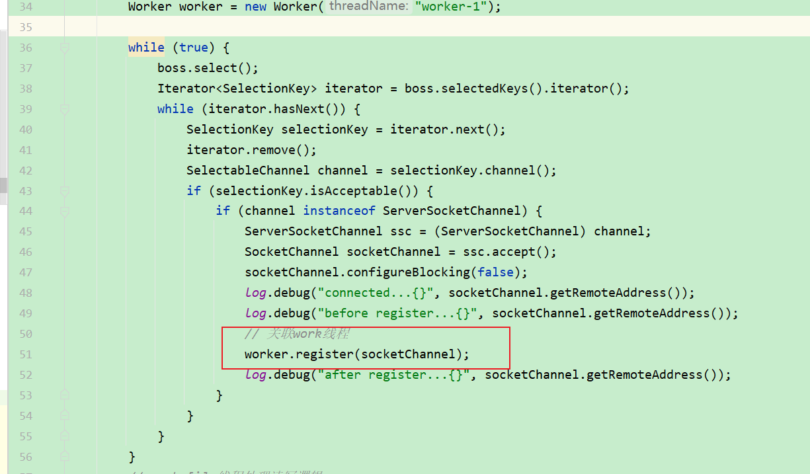

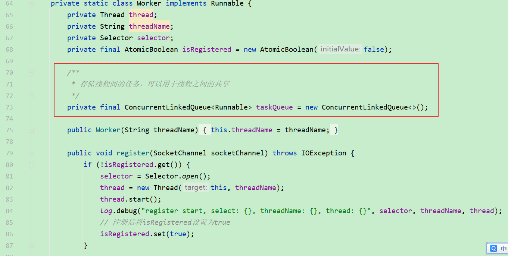

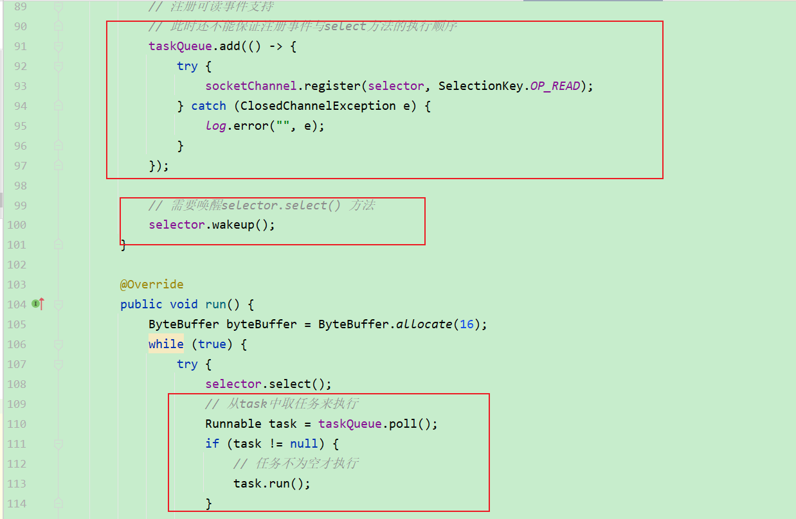

##### 4.6.3.2 执行结果

```verilog
22:51:52 [DEBUG] [boss] c.l.d.c.d.MultiThreadServerV2 - sscKey: sun.nio.ch.SelectionKeyImpl@73f792cf
22:52:00 [DEBUG] [boss] c.l.d.c.d.MultiThreadServerV2 - connected.../127.0.0.1:13048
22:52:00 [DEBUG] [boss] c.l.d.c.d.MultiThreadServerV2 - before register.../127.0.0.1:13048
22:52:00 [DEBUG] [boss] c.l.d.c.d.MultiThreadServerV2 - register start, select: sun.nio.ch.WindowsSelectorImpl@5d624da6, threadName: worker-1, thread: Thread[worker-1,5,main]
22:52:00 [DEBUG] [boss] c.l.d.c.d.MultiThreadServerV2 - after register.../127.0.0.1:13048
22:52:00 [DEBUG] [worker-1] c.l.d.c.d.MultiThreadServerV2 - read.../127.0.0.1:13048
+--------+-------------------- all ------------------------+----------------+
position: [0], limit: [5], capacity: [16], mark: [-1]
         +-------------------------------------------------+
         |  0  1  2  3  4  5  6  7  8  9  a  b  c  d  e  f |
+--------+-------------------------------------------------+----------------+
|00000000| 68 65 6c 6c 6f 00 00 00 00 00 00 00 00 00 00 00 |hello...........|
+--------+-------------------------------------------------+----------------+
22:52:05 [DEBUG] [boss] c.l.d.c.d.MultiThreadServerV2 - connected.../127.0.0.1:13056
22:52:05 [DEBUG] [boss] c.l.d.c.d.MultiThreadServerV2 - before register.../127.0.0.1:13056
22:52:05 [DEBUG] [boss] c.l.d.c.d.MultiThreadServerV2 - after register.../127.0.0.1:13056
22:52:05 [DEBUG] [worker-1] c.l.d.c.d.MultiThreadServerV2 - read.../127.0.0.1:13056
+--------+-------------------- all ------------------------+----------------+
position: [0], limit: [5], capacity: [16], mark: [-1]
         +-------------------------------------------------+
         |  0  1  2  3  4  5  6  7  8  9  a  b  c  d  e  f |
+--------+-------------------------------------------------+----------------+
|00000000| 68 65 6c 6c 6f 00 00 00 00 00 00 00 00 00 00 00 |hello...........|
+--------+-------------------------------------------------+----------------+
22:52:10 [DEBUG] [boss] c.l.d.c.d.MultiThreadServerV2 - connected.../127.0.0.1:13062
22:52:10 [DEBUG] [boss] c.l.d.c.d.MultiThreadServerV2 - before register.../127.0.0.1:13062
22:52:10 [DEBUG] [boss] c.l.d.c.d.MultiThreadServerV2 - after register.../127.0.0.1:13062
22:52:10 [DEBUG] [worker-1] c.l.d.c.d.MultiThreadServerV2 - read.../127.0.0.1:13062
+--------+-------------------- all ------------------------+----------------+
position: [0], limit: [5], capacity: [16], mark: [-1]
         +-------------------------------------------------+
         |  0  1  2  3  4  5  6  7  8  9  a  b  c  d  e  f |
+--------+-------------------------------------------------+----------------+
|00000000| 68 65 6c 6c 6f 00 00 00 00 00 00 00 00 00 00 00 |hello...........|
+--------+-------------------------------------------------+----------------+
```

#### 4.6.4 多线程版本直接使用warkup

##### 4.6.4.1 服务端

```java
package cn.lyf.day1.c4.demo5;

import cn.lyf.util.ByteBufferUtil;
import cn.lyf.util.SystemConstant;
import lombok.extern.slf4j.Slf4j;

import java.io.IOException;
import java.net.InetSocketAddress;
import java.nio.ByteBuffer;
import java.nio.channels.*;
import java.util.Iterator;
import java.util.concurrent.atomic.AtomicBoolean;

/**
 * @author lyf
 * @version 1.0
 * @classname MultiThreadServer
 * @description 多线程版Selector
 * @since 2022/7/25 20:36
 */
@Slf4j
public class MultiThreadServerV3 {
    public static void main(String[] args) throws IOException {
        // boss 线程处理连接
        Thread.currentThread().setName("boss");
        Selector boss = Selector.open();
        ServerSocketChannel serverSocketChannel = ServerSocketChannel.open();
        serverSocketChannel.configureBlocking(false);
        serverSocketChannel.bind(new InetSocketAddress(SystemConstant.PORT));
        SelectionKey sscKey = serverSocketChannel.register(boss, SelectionKey.OP_ACCEPT);
        log.debug("sscKey: {}", sscKey);

        Worker worker = new Worker("worker-1");

        while (true) {
            boss.select();
            Iterator<SelectionKey> iterator = boss.selectedKeys().iterator();
            while (iterator.hasNext()) {
                SelectionKey selectionKey = iterator.next();
                iterator.remove();
                SelectableChannel channel = selectionKey.channel();
                if (selectionKey.isAcceptable()) {
                    if (channel instanceof ServerSocketChannel) {
                        ServerSocketChannel ssc = (ServerSocketChannel) channel;
                        SocketChannel socketChannel = ssc.accept();
                        socketChannel.configureBlocking(false);
                        log.debug("connected...{}", socketChannel.getRemoteAddress());
                        log.debug("before register...{}", socketChannel.getRemoteAddress());
                        // 关联work线程
                        worker.register(socketChannel);
                        log.debug("after register...{}", socketChannel.getRemoteAddress());
                    }
                }
            }
        }
        // work-[i] 线程处理读写逻辑

    }

    /**
     * 处理读写事件
     */
    private static class Worker implements Runnable {
        private Thread thread;
        private String threadName;
        private Selector selector;
        private final AtomicBoolean isRegistered = new AtomicBoolean(false);

        public Worker(String threadName) {
            this.threadName = threadName;
        }

        public void register(SocketChannel socketChannel) throws IOException {
            if (!isRegistered.get()) {
                selector = Selector.open();
                thread = new Thread(this, threadName);
                thread.start();
                log.debug("register start, select: {}, threadName: {}, thread: {}", selector, threadName, thread);
                // 注册后将isRegistered设置为true
                isRegistered.set(true);
            }

            // 需要唤醒selector.select() 方法
            selector.wakeup();
            // 注册可读事件支持
            // 此时还不能保证注册事件与select方法的执行顺序
            socketChannel.register(selector, SelectionKey.OP_READ);
        }

        @Override
        public void run() {
            ByteBuffer byteBuffer = ByteBuffer.allocate(16);
            while (true) {
                try {
                    selector.select();
                    Iterator<SelectionKey> iterator = selector.selectedKeys().iterator();
                    while (iterator.hasNext()) {
                        SelectionKey selectionKey = iterator.next();
                        iterator.remove();
                        if (selectionKey.isReadable()) { // 处理可读事件
                            try {
                                SelectableChannel channel = selectionKey.channel();
                                if (channel instanceof SocketChannel) {
                                    SocketChannel socketChannel = (SocketChannel) channel;
                                    log.debug("read...{}", socketChannel.getRemoteAddress());
                                    int read = socketChannel.read(byteBuffer);
                                    if (read < 0) {
                                        selectionKey.cancel();
                                        socketChannel.close();
                                    }
                                    byteBuffer.flip();
                                    ByteBufferUtil.debugAll(byteBuffer);
                                }
                            } catch (IOException e) {
                                e.printStackTrace();
                                selectionKey.cancel();
                            }
                        }
                    }
                } catch (IOException e) {
                    e.printStackTrace();
                }
            }
        }
    }
}

```


##### 4.6.4.2 执行结果

```verilog
23:00:51 [DEBUG] [boss] c.l.d.c.d.MultiThreadServerV3 - sscKey: sun.nio.ch.SelectionKeyImpl@73f792cf
23:00:57 [DEBUG] [boss] c.l.d.c.d.MultiThreadServerV3 - connected.../127.0.0.1:13164
23:00:57 [DEBUG] [boss] c.l.d.c.d.MultiThreadServerV3 - before register.../127.0.0.1:13164
23:00:57 [DEBUG] [boss] c.l.d.c.d.MultiThreadServerV3 - register start, select: sun.nio.ch.WindowsSelectorImpl@5315b42e, threadName: worker-1, thread: Thread[worker-1,5,main]
23:00:57 [DEBUG] [boss] c.l.d.c.d.MultiThreadServerV3 - after register.../127.0.0.1:13164
23:00:57 [DEBUG] [worker-1] c.l.d.c.d.MultiThreadServerV3 - read.../127.0.0.1:13164
+--------+-------------------- all ------------------------+----------------+
position: [0], limit: [5], capacity: [16], mark: [-1]
         +-------------------------------------------------+
         |  0  1  2  3  4  5  6  7  8  9  a  b  c  d  e  f |
+--------+-------------------------------------------------+----------------+
|00000000| 68 65 6c 6c 6f 00 00 00 00 00 00 00 00 00 00 00 |hello...........|
+--------+-------------------------------------------------+----------------+
23:01:02 [DEBUG] [boss] c.l.d.c.d.MultiThreadServerV3 - connected.../127.0.0.1:13172
23:01:02 [DEBUG] [boss] c.l.d.c.d.MultiThreadServerV3 - before register.../127.0.0.1:13172
23:01:02 [DEBUG] [boss] c.l.d.c.d.MultiThreadServerV3 - after register.../127.0.0.1:13172
23:01:02 [DEBUG] [worker-1] c.l.d.c.d.MultiThreadServerV3 - read.../127.0.0.1:13172
+--------+-------------------- all ------------------------+----------------+
position: [0], limit: [5], capacity: [16], mark: [-1]
         +-------------------------------------------------+
         |  0  1  2  3  4  5  6  7  8  9  a  b  c  d  e  f |
+--------+-------------------------------------------------+----------------+
|00000000| 68 65 6c 6c 6f 00 00 00 00 00 00 00 00 00 00 00 |hello...........|
+--------+-------------------------------------------------+----------------+
23:01:07 [DEBUG] [boss] c.l.d.c.d.MultiThreadServerV3 - connected.../127.0.0.1:13178
23:01:07 [DEBUG] [boss] c.l.d.c.d.MultiThreadServerV3 - before register.../127.0.0.1:13178
23:01:07 [DEBUG] [boss] c.l.d.c.d.MultiThreadServerV3 - after register.../127.0.0.1:13178
23:01:07 [DEBUG] [worker-1] c.l.d.c.d.MultiThreadServerV3 - read.../127.0.0.1:13178
+--------+-------------------- all ------------------------+----------------+
position: [0], limit: [5], capacity: [16], mark: [-1]
         +-------------------------------------------------+
         |  0  1  2  3  4  5  6  7  8  9  a  b  c  d  e  f |
+--------+-------------------------------------------------+----------------+
|00000000| 68 65 6c 6c 6f 00 00 00 00 00 00 00 00 00 00 00 |hello...........|
+--------+-------------------------------------------------+----------------+
```

#### 4.6.5 多线程版-多worker版

##### 4.6.5.1 服务端

```java
package cn.lyf.day1.c4.demo5;

import cn.lyf.util.ByteBufferUtil;
import cn.lyf.util.SystemConstant;
import lombok.extern.slf4j.Slf4j;

import java.io.IOException;
import java.net.InetSocketAddress;
import java.nio.ByteBuffer;
import java.nio.channels.*;
import java.util.Iterator;
import java.util.concurrent.atomic.AtomicBoolean;
import java.util.concurrent.atomic.AtomicInteger;

/**
 * @author lyf
 * @version 1.0
 * @classname MultiThreadServer
 * @description 多线程版Selector
 * @since 2022/7/25 20:36
 */
@Slf4j
public class MultiThreadServerV4 {
    public static void main(String[] args) throws IOException {
        // boss 线程处理连接
        Thread.currentThread().setName("boss");
        Selector boss = Selector.open();
        ServerSocketChannel serverSocketChannel = ServerSocketChannel.open();
        serverSocketChannel.configureBlocking(false);
        serverSocketChannel.bind(new InetSocketAddress(SystemConstant.PORT));
        SelectionKey sscKey = serverSocketChannel.register(boss, SelectionKey.OP_ACCEPT);
        log.debug("sscKey: {}", sscKey);

        int workLength = Runtime.getRuntime().availableProcessors();
        Worker[] workers = new Worker[workLength];
        for (int i = 0; i < workLength; i++) {
            workers[i] = new Worker("worker-" + i);
        }


        AtomicInteger ribbonIndex = new AtomicInteger();
        while (true) {
            boss.select();
            Iterator<SelectionKey> iterator = boss.selectedKeys().iterator();
            while (iterator.hasNext()) {
                SelectionKey selectionKey = iterator.next();
                iterator.remove();
                SelectableChannel channel = selectionKey.channel();
                if (selectionKey.isAcceptable()) {
                    if (channel instanceof ServerSocketChannel) {
                        ServerSocketChannel ssc = (ServerSocketChannel) channel;
                        SocketChannel socketChannel = ssc.accept();
                        socketChannel.configureBlocking(false);
                        log.debug("connected...{}", socketChannel.getRemoteAddress());
                        log.debug("before register...{}", socketChannel.getRemoteAddress());
                        // 关联work线程 ribbon 轮询算法
                        workers[ribbonIndex.getAndIncrement() % workLength].register(socketChannel);

                        log.debug("after register...{}", socketChannel.getRemoteAddress());
                    }
                }
            }
        }
        // work-[i] 线程处理读写逻辑

    }

    /**
     * 处理读写事件
     */
    private static class Worker implements Runnable {
        private Thread thread;
        private String threadName;
        private Selector selector;
        private final AtomicBoolean isRegistered = new AtomicBoolean(false);

        public Worker(String threadName) {
            this.threadName = threadName;
        }

        public void register(SocketChannel socketChannel) throws IOException {
            if (!isRegistered.get()) {
                selector = Selector.open();
                thread = new Thread(this, threadName);
                thread.start();
                log.debug("register start, select: {}, threadName: {}, thread: {}", selector, threadName, thread);
                // 注册后将isRegistered设置为true
                isRegistered.set(true);
            }

            // 需要唤醒selector.select() 方法
            selector.wakeup();
            // 注册可读事件支持
            // 此时还不能保证注册事件与select方法的执行顺序
            socketChannel.register(selector, SelectionKey.OP_READ);
        }

        @Override
        public void run() {
            ByteBuffer byteBuffer = ByteBuffer.allocate(16);
            while (true) {
                try {
                    selector.select();
                    Iterator<SelectionKey> iterator = selector.selectedKeys().iterator();
                    while (iterator.hasNext()) {
                        SelectionKey selectionKey = iterator.next();
                        iterator.remove();
                        if (selectionKey.isReadable()) { // 处理可读事件
                            try {
                                SelectableChannel channel = selectionKey.channel();
                                if (channel instanceof SocketChannel) {
                                    SocketChannel socketChannel = (SocketChannel) channel;
                                    log.debug("read...{}", socketChannel.getRemoteAddress());
                                    int read = socketChannel.read(byteBuffer);
                                    if (read < 0) {
                                        selectionKey.cancel();
                                        socketChannel.close();
                                    }
                                    byteBuffer.flip();
                                    ByteBufferUtil.debugAll(byteBuffer);
                                }
                            } catch (IOException e) {
                                e.printStackTrace();
                                selectionKey.cancel();
                            }
                        }
                    }
                } catch (IOException e) {
                    e.printStackTrace();
                }
            }
        }
    }
}

```


##### 4.6.5.2 执行结果

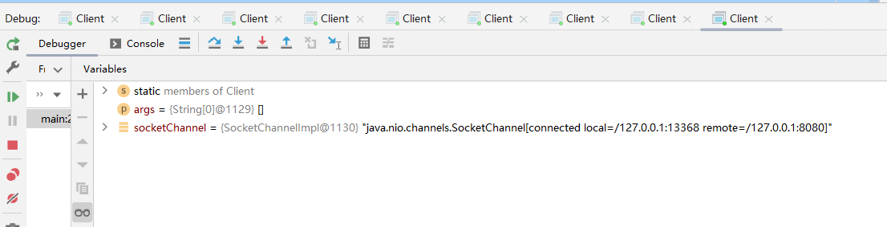

```verilog
23:17:38 [DEBUG] [boss] c.l.d.c.d.MultiThreadServerV4 - sscKey: sun.nio.ch.SelectionKeyImpl@73f792cf
23:17:50 [DEBUG] [boss] c.l.d.c.d.MultiThreadServerV4 - connected.../127.0.0.1:13298
23:17:50 [DEBUG] [boss] c.l.d.c.d.MultiThreadServerV4 - before register.../127.0.0.1:13298
23:17:50 [DEBUG] [boss] c.l.d.c.d.MultiThreadServerV4 - register start, select: sun.nio.ch.WindowsSelectorImpl@5315b42e, threadName: worker-0, thread: Thread[worker-0,5,main]
23:17:50 [DEBUG] [boss] c.l.d.c.d.MultiThreadServerV4 - after register.../127.0.0.1:13298
23:17:50 [DEBUG] [worker-0] c.l.d.c.d.MultiThreadServerV4 - read.../127.0.0.1:13298
+--------+-------------------- all ------------------------+----------------+
position: [0], limit: [5], capacity: [16], mark: [-1]
         +-------------------------------------------------+
         |  0  1  2  3  4  5  6  7  8  9  a  b  c  d  e  f |
+--------+-------------------------------------------------+----------------+
|00000000| 68 65 6c 6c 6f 00 00 00 00 00 00 00 00 00 00 00 |hello...........|
+--------+-------------------------------------------------+----------------+
23:17:56 [DEBUG] [boss] c.l.d.c.d.MultiThreadServerV4 - connected.../127.0.0.1:13306
23:17:56 [DEBUG] [boss] c.l.d.c.d.MultiThreadServerV4 - before register.../127.0.0.1:13306
23:17:56 [DEBUG] [boss] c.l.d.c.d.MultiThreadServerV4 - register start, select: sun.nio.ch.WindowsSelectorImpl@5d624da6, threadName: worker-1, thread: Thread[worker-1,5,main]
23:17:56 [DEBUG] [boss] c.l.d.c.d.MultiThreadServerV4 - after register.../127.0.0.1:13306
23:17:56 [DEBUG] [worker-1] c.l.d.c.d.MultiThreadServerV4 - read.../127.0.0.1:13306
+--------+-------------------- all ------------------------+----------------+
position: [0], limit: [5], capacity: [16], mark: [-1]
         +-------------------------------------------------+
         |  0  1  2  3  4  5  6  7  8  9  a  b  c  d  e  f |
+--------+-------------------------------------------------+----------------+
|00000000| 68 65 6c 6c 6f 00 00 00 00 00 00 00 00 00 00 00 |hello...........|
+--------+-------------------------------------------------+----------------+
23:18:02 [DEBUG] [boss] c.l.d.c.d.MultiThreadServerV4 - connected.../127.0.0.1:13314
23:18:02 [DEBUG] [boss] c.l.d.c.d.MultiThreadServerV4 - before register.../127.0.0.1:13314
23:18:02 [DEBUG] [boss] c.l.d.c.d.MultiThreadServerV4 - register start, select: sun.nio.ch.WindowsSelectorImpl@60addb54, threadName: worker-2, thread: Thread[worker-2,5,main]
23:18:02 [DEBUG] [boss] c.l.d.c.d.MultiThreadServerV4 - after register.../127.0.0.1:13314
23:18:02 [DEBUG] [worker-2] c.l.d.c.d.MultiThreadServerV4 - read.../127.0.0.1:13314
+--------+-------------------- all ------------------------+----------------+
position: [0], limit: [5], capacity: [16], mark: [-1]
         +-------------------------------------------------+
         |  0  1  2  3  4  5  6  7  8  9  a  b  c  d  e  f |
+--------+-------------------------------------------------+----------------+
|00000000| 68 65 6c 6c 6f 00 00 00 00 00 00 00 00 00 00 00 |hello...........|
+--------+-------------------------------------------------+----------------+
23:18:38 [DEBUG] [boss] c.l.d.c.d.MultiThreadServerV4 - connected.../127.0.0.1:13327
23:18:38 [DEBUG] [boss] c.l.d.c.d.MultiThreadServerV4 - before register.../127.0.0.1:13327
23:18:38 [DEBUG] [boss] c.l.d.c.d.MultiThreadServerV4 - register start, select: sun.nio.ch.WindowsSelectorImpl@4cb2c100, threadName: worker-3, thread: Thread[worker-3,5,main]
23:18:38 [DEBUG] [boss] c.l.d.c.d.MultiThreadServerV4 - after register.../127.0.0.1:13327
23:18:38 [DEBUG] [worker-3] c.l.d.c.d.MultiThreadServerV4 - read.../127.0.0.1:13327
+--------+-------------------- all ------------------------+----------------+
position: [0], limit: [5], capacity: [16], mark: [-1]
         +-------------------------------------------------+
         |  0  1  2  3  4  5  6  7  8  9  a  b  c  d  e  f |
+--------+-------------------------------------------------+----------------+
|00000000| 68 65 6c 6c 6f 00 00 00 00 00 00 00 00 00 00 00 |hello...........|
+--------+-------------------------------------------------+----------------+
23:18:46 [DEBUG] [boss] c.l.d.c.d.MultiThreadServerV4 - connected.../127.0.0.1:13335
23:18:46 [DEBUG] [boss] c.l.d.c.d.MultiThreadServerV4 - before register.../127.0.0.1:13335
23:18:46 [DEBUG] [boss] c.l.d.c.d.MultiThreadServerV4 - register start, select: sun.nio.ch.WindowsSelectorImpl@614c5515, threadName: worker-4, thread: Thread[worker-4,5,main]
23:18:46 [DEBUG] [boss] c.l.d.c.d.MultiThreadServerV4 - after register.../127.0.0.1:13335
23:18:46 [DEBUG] [worker-4] c.l.d.c.d.MultiThreadServerV4 - read.../127.0.0.1:13335
+--------+-------------------- all ------------------------+----------------+
position: [0], limit: [5], capacity: [16], mark: [-1]
         +-------------------------------------------------+
         |  0  1  2  3  4  5  6  7  8  9  a  b  c  d  e  f |
+--------+-------------------------------------------------+----------------+
|00000000| 68 65 6c 6c 6f 00 00 00 00 00 00 00 00 00 00 00 |hello...........|
+--------+-------------------------------------------------+----------------+
23:18:50 [DEBUG] [boss] c.l.d.c.d.MultiThreadServerV4 - connected.../127.0.0.1:13343
23:18:50 [DEBUG] [boss] c.l.d.c.d.MultiThreadServerV4 - before register.../127.0.0.1:13343
23:18:50 [DEBUG] [boss] c.l.d.c.d.MultiThreadServerV4 - register start, select: sun.nio.ch.WindowsSelectorImpl@2d554825, threadName: worker-5, thread: Thread[worker-5,5,main]
23:18:50 [DEBUG] [boss] c.l.d.c.d.MultiThreadServerV4 - after register.../127.0.0.1:13343
23:18:50 [DEBUG] [worker-5] c.l.d.c.d.MultiThreadServerV4 - read.../127.0.0.1:13343
+--------+-------------------- all ------------------------+----------------+
position: [0], limit: [5], capacity: [16], mark: [-1]
         +-------------------------------------------------+
         |  0  1  2  3  4  5  6  7  8  9  a  b  c  d  e  f |
+--------+-------------------------------------------------+----------------+
|00000000| 68 65 6c 6c 6f 00 00 00 00 00 00 00 00 00 00 00 |hello...........|
+--------+-------------------------------------------------+----------------+
23:18:57 [DEBUG] [boss] c.l.d.c.d.MultiThreadServerV4 - connected.../127.0.0.1:13351
23:18:57 [DEBUG] [boss] c.l.d.c.d.MultiThreadServerV4 - before register.../127.0.0.1:13351
23:18:57 [DEBUG] [boss] c.l.d.c.d.MultiThreadServerV4 - register start, select: sun.nio.ch.WindowsSelectorImpl@6be46e8f, threadName: worker-6, thread: Thread[worker-6,5,main]
23:18:57 [DEBUG] [boss] c.l.d.c.d.MultiThreadServerV4 - after register.../127.0.0.1:13351
23:18:57 [DEBUG] [worker-6] c.l.d.c.d.MultiThreadServerV4 - read.../127.0.0.1:13351
+--------+-------------------- all ------------------------+----------------+
position: [0], limit: [5], capacity: [16], mark: [-1]
         +-------------------------------------------------+
         |  0  1  2  3  4  5  6  7  8  9  a  b  c  d  e  f |
+--------+-------------------------------------------------+----------------+
|00000000| 68 65 6c 6c 6f 00 00 00 00 00 00 00 00 00 00 00 |hello...........|
+--------+-------------------------------------------------+----------------+
23:19:04 [DEBUG] [boss] c.l.d.c.d.MultiThreadServerV4 - connected.../127.0.0.1:13359
23:19:04 [DEBUG] [boss] c.l.d.c.d.MultiThreadServerV4 - before register.../127.0.0.1:13359
23:19:04 [DEBUG] [boss] c.l.d.c.d.MultiThreadServerV4 - register start, select: sun.nio.ch.WindowsSelectorImpl@327471b5, threadName: worker-7, thread: Thread[worker-7,5,main]
23:19:04 [DEBUG] [boss] c.l.d.c.d.MultiThreadServerV4 - after register.../127.0.0.1:13359
23:19:04 [DEBUG] [worker-7] c.l.d.c.d.MultiThreadServerV4 - read.../127.0.0.1:13359
+--------+-------------------- all ------------------------+----------------+
position: [0], limit: [5], capacity: [16], mark: [-1]
         +-------------------------------------------------+
         |  0  1  2  3  4  5  6  7  8  9  a  b  c  d  e  f |
+--------+-------------------------------------------------+----------------+
|00000000| 68 65 6c 6c 6f 00 00 00 00 00 00 00 00 00 00 00 |hello...........|
+--------+-------------------------------------------------+----------------+
23:19:10 [DEBUG] [boss] c.l.d.c.d.MultiThreadServerV4 - connected.../127.0.0.1:13368
23:19:10 [DEBUG] [boss] c.l.d.c.d.MultiThreadServerV4 - before register.../127.0.0.1:13368
23:19:10 [DEBUG] [boss] c.l.d.c.d.MultiThreadServerV4 - after register.../127.0.0.1:13368
23:19:10 [DEBUG] [worker-0] c.l.d.c.d.MultiThreadServerV4 - read.../127.0.0.1:13368
+--------+-------------------- all ------------------------+----------------+
position: [0], limit: [5], capacity: [16], mark: [-1]
         +-------------------------------------------------+
         |  0  1  2  3  4  5  6  7  8  9  a  b  c  d  e  f |
+--------+-------------------------------------------------+----------------+
|00000000| 68 65 6c 6c 6f 00 00 00 00 00 00 00 00 00 00 00 |hello...........|
+--------+-------------------------------------------------+----------------+
```


#### 4.6.6 最终版

```java
public class ChannelDemo7 {
    public static void main(String[] args) throws IOException {
        new BossEventLoop().register();
    }


    @Slf4j
    static class BossEventLoop implements Runnable {
        private Selector boss;
        private WorkerEventLoop[] workers;
        private volatile boolean start = false;
        AtomicInteger index = new AtomicInteger();

        public void register() throws IOException {
            if (!start) {
                ServerSocketChannel ssc = ServerSocketChannel.open();
                ssc.bind(new InetSocketAddress(8080));
                ssc.configureBlocking(false);
                boss = Selector.open();
                SelectionKey ssckey = ssc.register(boss, 0, null);
                ssckey.interestOps(SelectionKey.OP_ACCEPT);
                workers = initEventLoops();
                new Thread(this, "boss").start();
                log.debug("boss start...");
                start = true;
            }
        }

        public WorkerEventLoop[] initEventLoops() {
//        EventLoop[] eventLoops = new EventLoop[Runtime.getRuntime().availableProcessors()];
            WorkerEventLoop[] workerEventLoops = new WorkerEventLoop[2];
            for (int i = 0; i < workerEventLoops.length; i++) {
                workerEventLoops[i] = new WorkerEventLoop(i);
            }
            return workerEventLoops;
        }

        @Override
        public void run() {
            while (true) {
                try {
                    boss.select();
                    Iterator<SelectionKey> iter = boss.selectedKeys().iterator();
                    while (iter.hasNext()) {
                        SelectionKey key = iter.next();
                        iter.remove();
                        if (key.isAcceptable()) {
                            ServerSocketChannel c = (ServerSocketChannel) key.channel();
                            SocketChannel sc = c.accept();
                            sc.configureBlocking(false);
                            log.debug("{} connected", sc.getRemoteAddress());
                            workers[index.getAndIncrement() % workers.length].register(sc);
                        }
                    }
                } catch (IOException e) {
                    e.printStackTrace();
                }
            }
        }
    }

    @Slf4j
    static class WorkerEventLoop implements Runnable {
        private Selector worker;
        private volatile boolean start = false;
        private int index;

        private final ConcurrentLinkedQueue<Runnable> tasks = new ConcurrentLinkedQueue<>();

        public WorkerEventLoop(int index) {
            this.index = index;
        }

        public void register(SocketChannel sc) throws IOException {
            if (!start) {
                worker = Selector.open();
                new Thread(this, "worker-" + index).start();
                start = true;
            }
            tasks.add(() -> {
                try {
                    SelectionKey sckey = sc.register(worker, 0, null);
                    sckey.interestOps(SelectionKey.OP_READ);
                    worker.selectNow();
                } catch (IOException e) {
                    e.printStackTrace();
                }
            });
            worker.wakeup();
        }

        @Override
        public void run() {
            while (true) {
                try {
                    worker.select();
                    Runnable task = tasks.poll();
                    if (task != null) {
                        task.run();
                    }
                    Set<SelectionKey> keys = worker.selectedKeys();
                    Iterator<SelectionKey> iter = keys.iterator();
                    while (iter.hasNext()) {
                        SelectionKey key = iter.next();
                        if (key.isReadable()) {
                            SocketChannel sc = (SocketChannel) key.channel();
                            ByteBuffer buffer = ByteBuffer.allocate(128);
                            try {
                                int read = sc.read(buffer);
                                if (read == -1) {
                                    key.cancel();
                                    sc.close();
                                } else {
                                    buffer.flip();
                                    log.debug("{} message:", sc.getRemoteAddress());
                                    debugAll(buffer);
                                }
                            } catch (IOException e) {
                                e.printStackTrace();
                                key.cancel();
                                sc.close();
                            }
                        }
                        iter.remove();
                    }
                } catch (IOException e) {
                    e.printStackTrace();
                }
            }
        }
    }
}
```


#### 4.6.7 💡 如何拿到 cpu 个数

> * Runtime.getRuntime().availableProcessors() 如果工作在 docker 容器下，因为容器不是物理隔离的，会拿到物理 cpu 个数，而不是容器申请时的个数
> * 这个问题直到 jdk 10 才修复，使用 jvm 参数 UseContainerSupport 配置， 默认开启


### 4.7 UDP

* UDP 是无连接的，client 发送数据不会管 server 是否开启
* server 这边的 receive 方法会将接收到的数据存入 byte buffer，但如果数据报文超过 buffer 大小，多出来的数据会被默默抛弃

首先启动服务器端

```java
public class UdpServer {
    public static void main(String[] args) {
        try (DatagramChannel channel = DatagramChannel.open()) {
            channel.socket().bind(new InetSocketAddress(9999));
            System.out.println("waiting...");
            ByteBuffer buffer = ByteBuffer.allocate(32);
            channel.receive(buffer);
            buffer.flip();
            debug(buffer);
        } catch (IOException e) {
            e.printStackTrace();
        }
    }
}
```

输出

```
waiting...
```


运行客户端

```java
public class UdpClient {
    public static void main(String[] args) {
        try (DatagramChannel channel = DatagramChannel.open()) {
            ByteBuffer buffer = StandardCharsets.UTF_8.encode("hello");
            InetSocketAddress address = new InetSocketAddress("localhost", 9999);
            channel.send(buffer, address);
        } catch (Exception e) {
            e.printStackTrace();
        }
    }
}
```

接下来服务器端输出

```
         +-------------------------------------------------+
         |  0  1  2  3  4  5  6  7  8  9  a  b  c  d  e  f |
+--------+-------------------------------------------------+----------------+
|00000000| 68 65 6c 6c 6f                                  |hello           |
+--------+-------------------------------------------------+----------------+
```


## 5. NIO vs BIO

### 5.1 stream vs channel

* stream 不会自动缓冲数据，channel 会利用系统提供的发送缓冲区、接收缓冲区（更为底层）
* stream 仅支持阻塞 API，channel 同时支持阻塞、非阻塞 API，网络 channel 可配合 selector 实现多路复用
* 二者均为**全双工，即读写可以同时进行**


### 5.2 IO 模型

同步阻塞、同步非阻塞、同步多路复用、异步阻塞（没有此情况）、异步非阻塞

* **同步：线程自己去获取结果（一个线程）**
* **异步：线程自己不去获取结果，而是由其它线程送结果（至少两个线程）**


当调用一次 channel.read 或 stream.read 后，会切换至操作系统内核态来完成真正数据读取，而读取又分为两个阶段，分别为：

* **等待数据阶段**
* **复制数据阶段**


* 阻塞 IO

  * 用户线程read的时候，会一直阻塞，直到等待数据过程和复制数据过程都完成才能解除阻塞状态

  * 此期间用户程序1和linux内核空间都处于阻塞状态
  
    


  													


* 非阻塞  IO
  * 用户程序在read的时候，在linux内核空间等待数据阶段，read不到就立即返回，然后立即发起下次read，直到数据准备完成

  * 在复制数据阶段还是阻塞的


  													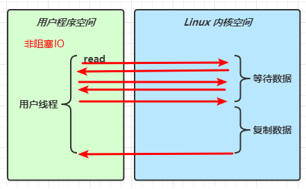

* 多路复用

  * 程序不是直接去read，而是通过selector的select方法阻塞，在数据准备完成之后，此时的read事件才开始进行复制数据

  * 复制数据过程中还是阻塞的


  													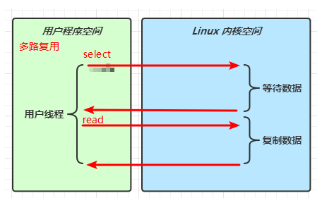

* 信号驱动

* 异步 IO

  * 是阻塞的，一个线程发起read，就立即返回

  * 等linux内核空间数据准备并且复制数据阶段都完成了，此时会有一个守护线程的thread1对的回调方法返回真正结果


  													

* 阻塞 IO vs 多路复用

  * 阻塞IO
    * 不同的事件是串行执行的，事件之前的等待数据和复制数据都是串行执行

  * 多路复用 
    * 通过Selector的select方法阻塞，然后获取不同的事件加入事件集合，然后再处理不同的事件，事件之间跳过了准备数据的阶段的等待
    * 直接可以复制数据
    * 节约了事件的准备数据阶段的等待时间


  										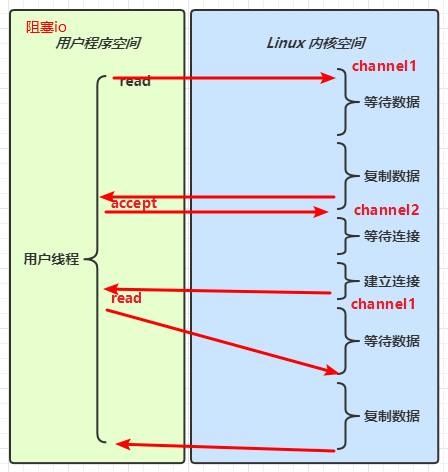
  	
  										


#### 5.2.1 🔖 参考

UNIX 网络编程 - 卷 I


### 5.3 零拷贝

#### 5.3.1 传统 IO 问题

传统的 IO 将一个文件通过 socket 写出

```java
File f = new File("helloword/data.txt");
RandomAccessFile file = new RandomAccessFile(file, "r");

byte[] buf = new byte[(int)f.length()];
file.read(buf);

Socket socket = ...;
socket.getOutputStream().write(buf);
```

内部工作流程是这样的：


1. java 本身并不具备 IO 读写能力，因此 read 方法调用后，要从 java 程序的**用户态**切换至**内核态**，去调用操作系统（Kernel）的读能力，将数据读入**内核缓冲区**。这期间用户线程阻塞，操作系统使用 DMA（Direct Memory Access）来实现文件读，其间也不会使用 cpu

   > DMA 也可以理解为硬件单元，用来解放 cpu 完成文件 IO

2. 从**内核态**切换回**用户态**，将数据从**内核缓冲区**读入**用户缓冲区**（即 byte[] buf），这期间 cpu 会参与拷贝，无法利用 DMA

3. 调用 write 方法，这时将数据从**用户缓冲区**（byte[] buf）写入 **socket 缓冲区**，cpu 会参与拷贝

4. 接下来要向网卡写数据，这项能力 java 又不具备，因此又得从**用户态**切换至**内核态**，调用操作系统的写能力，使用 DMA 将 **socket 缓冲区**的数据写入网卡，不会使用 cpu


可以看到中间环节较多，java 的 IO 实际不是物理设备级别的读写，而是缓存的复制，底层的真正读写是操作系统来完成的

* **用户态与内核态的切换发生了 3 次，这个操作比较重量级**
* **数据拷贝了共 4 次**


#### 5.3.2 NIO 优化

通过 DirectByteBuf 

* ByteBuffer.allocate(10)  HeapByteBuffer 使用的还是 java 内存
* ByteBuffer.allocateDirect(10)  DirectByteBuffer 使用的是操作系统内存


大部分步骤与优化前相同，不再赘述。唯有一点：java 可以使用 DirectByteBuf 将堆外内存映射到 jvm 内存中来直接访问使用

* 这块内存不受 jvm 垃圾回收的影响，因此内存地址固定，有助于 IO 读写
* java 中的 DirectByteBuf 对象仅维护了此内存的虚引用，内存回收分成两步
  * DirectByteBuf 对象被垃圾回收，将虚引用加入引用队列
  * 通过专门线程访问引用队列，根据虚引用释放堆外内存
* **减少了一次数据拷贝，用户态与内核态的切换次数没有减少**


进一步优化（底层采用了 linux 2.1 后提供的 sendFile 方法），java 中对应着两个 channel 调用 transferTo/transferFrom 方法拷贝数据


1. java 调用 transferTo 方法后，要从 java 程序的**用户态**切换至**内核态**，使用 DMA将数据读入**内核缓冲区**，不会使用 cpu
2. 数据从**内核缓冲区**传输到 **socket 缓冲区**，cpu 会参与拷贝
3. 最后使用 DMA 将 **socket 缓冲区**的数据写入网卡，不会使用 cpu

可以看到

* **只发生了一次用户态与内核态的切换**
* **数据拷贝了 3 次**


进一步优化（linux 2.4）

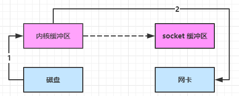

1. java 调用 transferTo 方法后，要从 java 程序的**用户态**切换至**内核态**，使用 DMA将数据读入**内核缓冲区**，不会使用 cpu
2. 只会将一些 offset 和 length 信息拷入 **socket 缓冲区**，几乎无消耗
3. 使用 DMA 将 **内核缓冲区**的数据写入网卡，不会使用 cpu

整个过程仅**只发生了一次用户态与内核态的切换，数据拷贝了 2 次**。**所谓的【零拷贝】，并不是真正无拷贝，而是在不会拷贝重复数据到 jvm 内存**中，零拷贝的优点有

* **更少的用户态与内核态的切换**
* **不利用 cpu 计算，减少 cpu 缓存伪共享**
* **零拷贝适合小文件传输**


### 5.3 AIO

AIO 用来解决数据复制阶段的阻塞问题

* 同步意味着，在进行读写操作时，线程需要等待结果，还是相当于闲置
* 异步意味着，在进行读写操作时，线程不必等待结果，而是将来由操作系统来通过回调方式由另外的线程来获得结果

> 异步模型需要底层操作系统（Kernel）提供支持
>
> * Windows 系统通过 IOCP 实现了真正的异步 IO
> * Linux 系统异步 IO 在 2.6 版本引入，但其底层实现还是用多路复用模拟了异步 IO，性能没有优势


#### 5.3.1 文件 AIO

先来看看 AsynchronousFileChannel

```java
package cn.lyf.day1.c5;

import cn.lyf.util.ByteBufferUtil;
import com.google.common.util.concurrent.ThreadFactoryBuilder;
import lombok.extern.slf4j.Slf4j;

import java.io.IOException;
import java.nio.ByteBuffer;
import java.nio.channels.AsynchronousFileChannel;
import java.nio.channels.CompletionHandler;
import java.nio.file.Paths;
import java.nio.file.StandardOpenOption;
import java.util.Collections;
import java.util.HashSet;
import java.util.Set;
import java.util.concurrent.*;

/**
 * @author lyf
 * @version 1.0
 * @classname Demo5_1_FileAio
 * @description
 * @since 2022/7/26 8:51
 */
@Slf4j
public class Demo5_1_FileAio {
    public static void main(String[] args) throws IOException {
        log.debug("read begin...");
        String path = "C:\\DISH\\JavaCode\\java\\gitee\\liuyangfang\\java-face\\heima-netty\\src\\main\\resources\\data.txt";
        Set<StandardOpenOption> set = new HashSet<>(Collections.singletonList(StandardOpenOption.READ));
        try (AsynchronousFileChannel fileChannel = AsynchronousFileChannel.open(Paths.get(path), set, initThreadPool())) {
            ByteBuffer byteBuffer = ByteBuffer.allocate(16);
            /*
                1 dst 字节要传输到的缓冲区
                2 position 开始传输的文件位置，必须是非负数
                3 attach 附件，附加到I/O操作的对象，可以为null
                4 handler 回调方法
             */
            fileChannel.read(byteBuffer, 0, byteBuffer, new CompletionHandler<Integer, ByteBuffer>() {
                @Override
                public void completed(Integer result, ByteBuffer attachment) {
                    log.debug("result: {}", result);
                    attachment.flip();
                    ByteBufferUtil.debugAll(attachment);
                }

                @Override
                public void failed(Throwable exc, ByteBuffer attachment) {
                    log.error("", exc);
                }
            });
        } catch (IOException e) {
            log.error("", e);
        }
        log.debug("read end...");
        System.in.read();
    }

    private static ThreadPoolExecutor initThreadPool() {
        int corePoolSize = 5;
        int maxPoolSize = Runtime.getRuntime().availableProcessors() + 1;
        long keepAliveTime = 1;
        TimeUnit unit = TimeUnit.SECONDS;
        BlockingQueue<Runnable> blockingQueue = new ArrayBlockingQueue<>(1000);
        ThreadFactory threadFactory = new ThreadFactoryBuilder()
                .setNameFormat("aiofile-thread-%d")
                .build();
        ThreadPoolExecutor.CallerRunsPolicy handler = new ThreadPoolExecutor.CallerRunsPolicy();
        return new ThreadPoolExecutor(corePoolSize, maxPoolSize, keepAliveTime, unit, blockingQueue, threadFactory, handler);
    }
}


```

输出

```
09:12:02 [DEBUG] [main] c.l.d.c.Demo5_1_FileAio - read begin...
09:12:02 [DEBUG] [main] c.l.d.c.Demo5_1_FileAio - read end...
09:12:02 [DEBUG] [aiofile-thread-0] c.l.d.c.Demo5_1_FileAio - result: 13
+--------+-------------------- all ------------------------+----------------+
position: [0], limit: [13], capacity: [16], mark: [-1]
         +-------------------------------------------------+
         |  0  1  2  3  4  5  6  7  8  9  a  b  c  d  e  f |
+--------+-------------------------------------------------+----------------+
|00000000| 31 32 33 34 35 36 37 38 39 30 61 62 63 00 00 00 |1234567890abc...|
+--------+-------------------------------------------------+----------------+
```

可以看到

* 响应文件读取成功的是另一个线程 `aiofile-thread-0`
* 主线程并没有 IO 操作阻塞


#### 5.3.2 💡 守护线程

默认文件 AIO 使用的线程都是守护线程，所以最后要执行 `System.in.read()` 以避免守护线程意外结束


#### 5.3.3 网络 AIO

```java
public class AioServer {
    public static void main(String[] args) throws IOException {
        AsynchronousServerSocketChannel ssc = AsynchronousServerSocketChannel.open();
        ssc.bind(new InetSocketAddress(8080));
        ssc.accept(null, new AcceptHandler(ssc));
        System.in.read();
    }

    private static void closeChannel(AsynchronousSocketChannel sc) {
        try {
            System.out.printf("[%s] %s close\n", Thread.currentThread().getName(), sc.getRemoteAddress());
            sc.close();
        } catch (IOException e) {
            e.printStackTrace();
        }
    }

    private static class ReadHandler implements CompletionHandler<Integer, ByteBuffer> {
        private final AsynchronousSocketChannel sc;

        public ReadHandler(AsynchronousSocketChannel sc) {
            this.sc = sc;
        }

        @Override
        public void completed(Integer result, ByteBuffer attachment) {
            try {
                if (result == -1) {
                    closeChannel(sc);
                    return;
                }
                System.out.printf("[%s] %s read\n", Thread.currentThread().getName(), sc.getRemoteAddress());
                attachment.flip();
                System.out.println(Charset.defaultCharset().decode(attachment));
                attachment.clear();
                // 处理完第一个 read 时，需要再次调用 read 方法来处理下一个 read 事件
                sc.read(attachment, attachment, this);
            } catch (IOException e) {
                e.printStackTrace();
            }
        }

        @Override
        public void failed(Throwable exc, ByteBuffer attachment) {
            closeChannel(sc);
            exc.printStackTrace();
        }
    }

    private static class WriteHandler implements CompletionHandler<Integer, ByteBuffer> {
        private final AsynchronousSocketChannel sc;

        private WriteHandler(AsynchronousSocketChannel sc) {
            this.sc = sc;
        }

        @Override
        public void completed(Integer result, ByteBuffer attachment) {
            // 如果作为附件的 buffer 还有内容，需要再次 write 写出剩余内容
            if (attachment.hasRemaining()) {
                sc.write(attachment);
            }
        }

        @Override
        public void failed(Throwable exc, ByteBuffer attachment) {
            exc.printStackTrace();
            closeChannel(sc);
        }
    }

    private static class AcceptHandler implements CompletionHandler<AsynchronousSocketChannel, Object> {
        private final AsynchronousServerSocketChannel ssc;

        public AcceptHandler(AsynchronousServerSocketChannel ssc) {
            this.ssc = ssc;
        }

        @Override
        public void completed(AsynchronousSocketChannel sc, Object attachment) {
            try {
                System.out.printf("[%s] %s connected\n", Thread.currentThread().getName(), sc.getRemoteAddress());
            } catch (IOException e) {
                e.printStackTrace();
            }
            ByteBuffer buffer = ByteBuffer.allocate(16);
            // 读事件由 ReadHandler 处理
            sc.read(buffer, buffer, new ReadHandler(sc));
            // 写事件由 WriteHandler 处理
            sc.write(Charset.defaultCharset().encode("server hello!"), ByteBuffer.allocate(16), new WriteHandler(sc));
            // 处理完第一个 accpet 时，需要再次调用 accept 方法来处理下一个 accept 事件
            ssc.accept(null, this);
        }

        @Override
        public void failed(Throwable exc, Object attachment) {
            exc.printStackTrace();
        }
    }
}
```


