# Elasticsearch（一）

反馈


1、没有关系

- 先就业不要择业（有点关系   不大） --->  互联网（80后）   springboot（集成其他框架）
- 外包：级别     公平。   公司使用的技术（自学）       过一遍（绝对有新的发现）。

2、小公司：大部分有（没有提供：补贴）

3、Rabbitmq：消息推送（生产者--->队列--->消费者：监听队列然后在消费消息）

4、算法：专门的职位（算法工程师）---->数学、统计学、线性、微积分  ---->算法导论

- 生日碰撞（数列）：数学问题---->hash碰撞  hash函数（秘钥算法：有   物理实验   产生使用）
- lucene：实现排名（得分--->boost激励因子）


回顾：   刷题。

1、lucene的介绍

- 它是一个全文检索的工具包
- 它不是一个全文检索系统，可以通过lucene开发一个全文检索的系统

2、检索的数据的方式：

- 顺序扫描法
- 倒排索引（单词-文档矩阵模型）
  - 术语：文档、单词（切词/分词）【关键字/词条】
  - 最基本：单词ID  单词  docID
  - 复杂一些：单词ID  单词  docID、TF
  - 最完整：单词ID  单词  文档频率    docID、TF、POS

3、lucene的入门程序：

- 创建、更新、删除索引：IndexWriter
- 基于索引库检索：IndexSearcher

4、分词器：

- 自带：StrandardAnalyzer
- IK：第三方   
- 原则：创建和检索，必须保证分词器一致  

5、filed域（字段）

- LongField：分词        
- StringField：不分
- TextFiled：分词
- 构造方法：name,value,stored（是否存储：存储到磁盘）
- 结论：是否存储与是否切词无关


学习目标：

1、Elasticsearch简介（solr）

2、Elasticsearch安装【动手操作】

3、Elasticsearch相关**术语**介绍【理解】

4、通过java客户端（接口或api）操作Elasticsearch  【学会使用】 

5、Elasticsearch集成IK分词器【学会使用】

6、使用RESTful操作Elasticsearch【学会使用】


# 1 Elasticsearch简介

## 1.1 Elasticsearch介绍

lucene它不是一个全文检索系统，可以通过lucene开发一个全文检索的系统。

- 百度百科

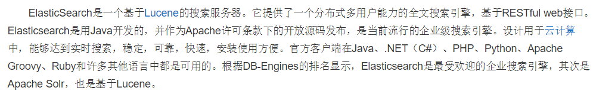

ElasticSearch，简称为es， es是一个开源的高扩展的分布式全文检索引擎，它可以近乎实时的存储、检索数据；本身扩展性很好，可以扩展到上百台服务器，处理**PB级别**的数据。es也使用Java开发并使用Lucene作为其核心来实现所有索引和搜索的功能，但是它的目的是通过简单的RESTful API来隐藏Lucene的复杂性，从而让全文搜索变得简单。 

## 1.2 Elasticsearch应用案例

- 2013年初，GitHub抛弃了Solr，采取ElasticSearch 来做PB（1024T     13年：百度6个）级的搜索。 “GitHub使用ElasticSearch搜索20TB的数据，包括13亿文件和1300亿行代码”    

- 维基百科：启动以elasticsearch为基础的核心搜索架构

- SoundCloud：“SoundCloud使用ElasticSearch为1.8亿用户提供即时而精准的音乐搜索服务”

- 百度：（一部分业务线    产品     底层服务【c++】）百度目前广泛使用ElasticSearch作为文本数据分析，采集百度所有服务器上的各类指标数据及用户自定义数据，通过对各种数据进行多维分析展示，辅助定位分析实例异常或业务层面异常。目前覆盖百度内部20多个业务线（包括casio、云析分、网盟、预测、文库、直达号、钱包、风控等），单集群最大100台机器，200个ES节点，每天导入30TB+数据

- 新浪：使用ES 分析处理32亿条实时日志     13年   redis（集群机器：2000台）

- 阿里：使用ES 构建挖财自己的日志采集和分析体系

  

  使用es的案例：  <https://www.elastic.co/cn/use-cases/> 

  


## 1.3 Elasticsearch与Solr对比

- Solr 利用 Zookeeper 进行分布式管理，而 Elasticsearch 自身带有分布式协调管理功能;
- Solr 支持更多格式的数据（xml、php、cvs、ruby、**json**），而 Elasticsearch 仅支持**json**文件格式；
- Solr 官方提供的功能更多（插件），而 Elasticsearch 本身更注重于核心功能，高级功能多由第三方插件提供；
- Solr 在传统的搜索应用中表现好于 Elasticsearch，但在处理实时搜索应用时效率明显低于 Elasticsearch；
- Elasticsearch支持RestFul风格编程（uri的地址，就可以检索），Solr暂不支持；


# 2、Elasticsearch安装

## 2.1 下载安装包

ElasticSearch分为Linux和Window版本，基于我们主要学习的是ElasticSearch的Java客户端的使用，所以我们课程中使用的是安装较为简便的Window版本，项目上线后，公司的运维人员会安装Linux版的ES供我们连接使用。

ElasticSearch的官方地址：<https://www.elastic.co/cn/downloads/past-releases#elasticsearch> 

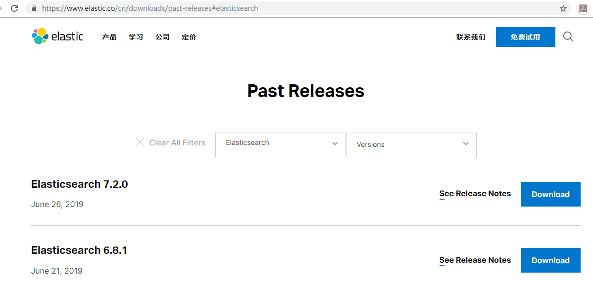

在资料中已经提供了下载好的5.6.8的压缩包。本次我们安装该版本的es服务。

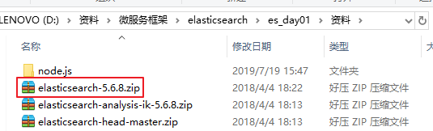


## 2.2 安装es服务

环境要求：ElasticSearch5是使用java开发的，且本版本的es需要的jdk版本要是1.8以上，所以安装ElasticSearch之前保证JDK1.8+安装完毕，并正确的配置好JDK环境变量，否则启动ElasticSearch失败。

### 2.2.1 解压

Window版的ElasticSearch的安装很简单，类似Window版的Tomcat，解压开即安装完毕（**注意：ES的目录不要出现中文，也不要有特殊字符**），解压后的ElasticSearch的目录结构如下：

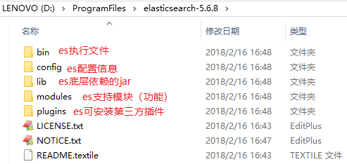


### 2.2.2 启动服务

- 第一步：进入bin目录下，执行elasticsearch.bat文件（双击即可）

  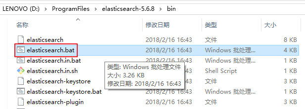

- 第二步：闪退（可以将elasticsearch.bat文件在cmd命令窗口下执行，目的：查看错误信息。。。）【错误信息：VM初始化期间发生错误，无法为2097152KB（2G）对象堆保留足够的空间】

  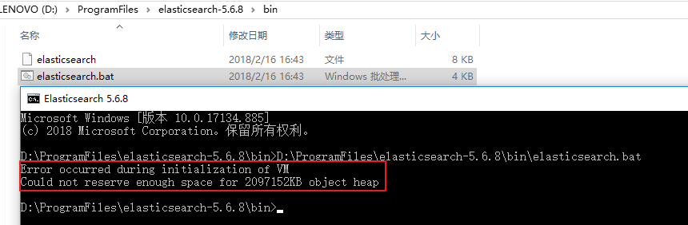

- 第三步：修改es配置（Xms：初始化堆内存大小  Xmx：最大堆内存大小）

  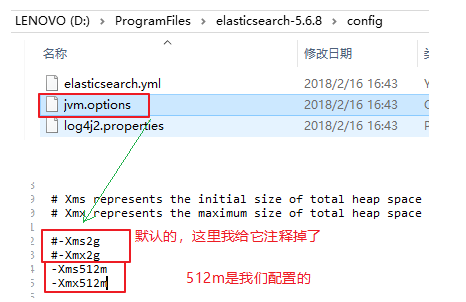

- 第四步：重新执行elasticsearch.bat文件，启动成功

  - 9300端口：ES集群节点之间通讯使用（Tcp协议 ） 
  - 9200端口：ES节点和外部通讯使用 （Http协议）

  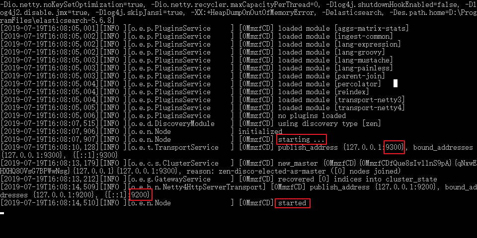

- 第五步：通过浏览器访问：<http://localhost:9200/> 

  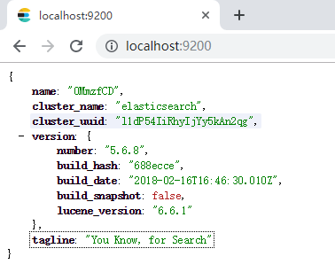


## 2.3 安装es图形化管理界面

ElasticSearch不同于Solr自带图形化管理界面，我们可以通过安装ElasticSearch的head插件，完成图形化界面的效果，完成索引数据的查看。安装插件的方式有两种，在线安装和本地安装。本课程采用在线的安装。elasticsearch-5-*以上版本安装head插件需要安装node和grunt环境。

- 方式一：需要一些安装环境（node、grunt）
- 方式二：Google翻墙（访问Google商店，就该插件）


### 2.3.1 安装nodejs环境


下载nodejs：<https://nodejs.org/en/download/>        ract。js

- 执行资料中的**node-v8.9.4-x64.msi**文件，然后傻瓜式安装（一直下一步，直到完成。）


- 安装成功，可通过cmd窗口查看版本：node -v

  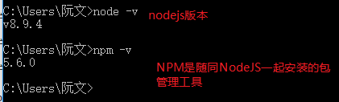


### 2.3.2 安装grunt客户端

类似：Linux

- rpm：  rpm -ivh xxx.rpm       xxx.rpm文件


Grunt是基于Node.js的项目构建工具；是基于javaScript上的一个很强大的前端自动化工具，基于NodeJs用于自动化构建、测试、生成文档的项目管理工具。 


- 在cmd窗口执行该命令，npm install -g grunt-cli   【注意：该过程需要联网    手机热点】

  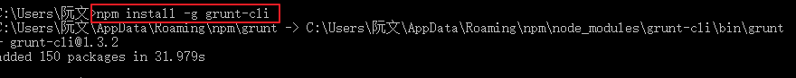

- 备份方案：如果再执行上述命令过程中，网速很慢，我们可以通过镜像加速器去下载

  - 先安装：安装taobao镜像：npm install -g cnpm –registry=https://registry.npm.taobao.org 
  - 再执行：cnpm install -g grunt-cli     【注意：npm命令前多了一个字符c】


### 2.3.3 安装head插件

安装步骤

- 第一步：下载head插件：<https://github.com/mobz/elasticsearch-head> ，在资料中已经提供了elasticsearch-head-master插件压缩包

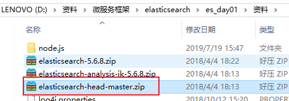

- 第二步：软件解压：可以解压到任意目录，本次我们解压到es的目录下（注意不要放到plugins目录）

  - plugins插件：使用的第三方的功能（IK）

  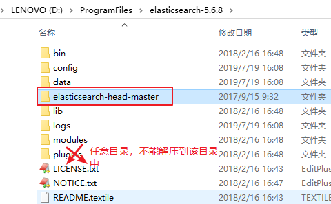

- 第三步：进入到elasticsearch-head-master目录下，通过cmd窗口执行如下命令：npm install grunt  【该过程有些慢】  

  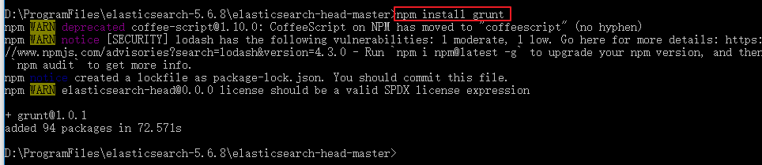

- 第四步：启动grunt，执行命令：grunt server，提示是否安装这些模块

  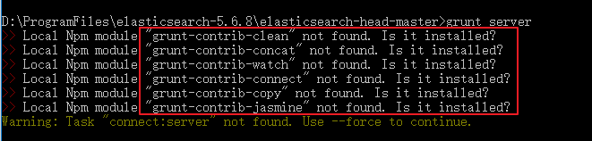

- 第五步：按照要求，继续安装npm的其他模块，执行命令：

  ~~~shell
  npm install grunt-contrib-clean grunt-contrib-concat grunt-contrib-watch grunt-contrib-connect grunt-contrib-copy grunt-contrib-jasmine
  ~~~

  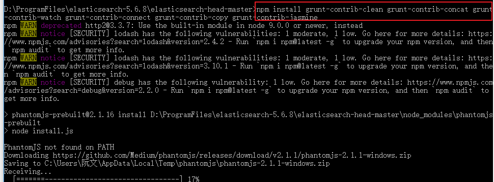

  

- 第六步：再次启动grunt服务。执行命令：grunt server

  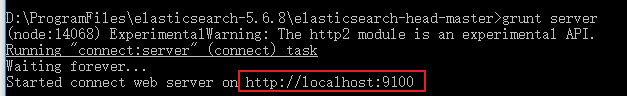

- 第七步：通过浏览器访问。<http://localhost:9100/> 

  

- 第八步：解决跨域访问的问题

  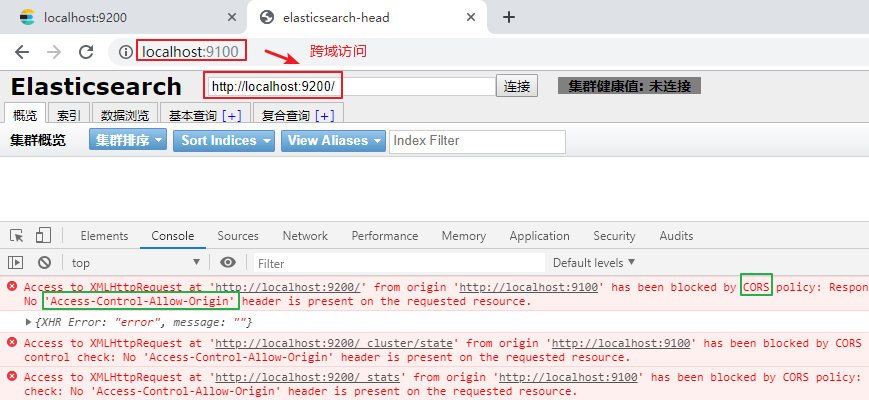

  - 修改es配置：修改config/elasticsearch.yml文件，添加如下配置

    ~~~yaml
    # 允许elasticsearch跨域访问，默认是false
    http.cors.enabled: true
    # 表示跨域访问允许的域名地址（*表示任意）
    http.cors.allow-origin: "*"
    # 当前主机域名	
    network.host: 127.0.0.1
    ~~~

    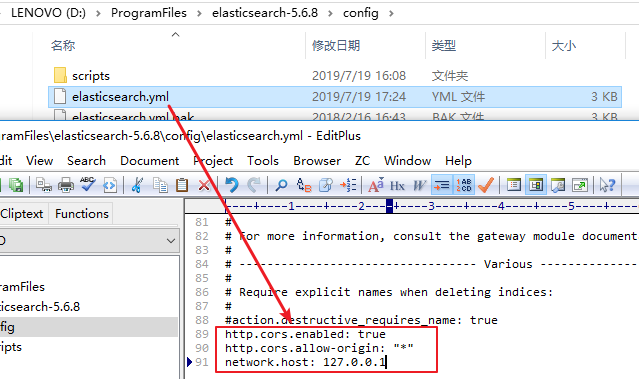

  - 重新es服务：略

  - 重新访问：<http://localhost:9100/> 

    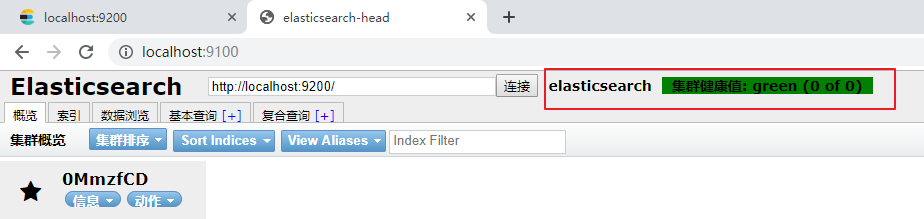


**至此，我们的es的服务安装成功！！！** :happy::happy::happy::happy::happy::happy:


# 3、Elasticsearch相关术语介绍

## 3.1 概述

Elasticsearch是面向文档(document oriented)的，这意味着它可以存储整个对象或文档(document)。然而它不仅仅是存储（store），还会索引(index)每个文档的内容使之可以被搜索。在Elasticsearch中，你可以对文档（而非成行成列的数据）进行索引、搜索、排序、过滤。Elasticsearch比较传统关系型数据库如下：

~~~
Relational DB -> Databases -> Tables -> Rows -> Columns
Elasticsearch -> Indices   -> Types  -> Documents -> Fields
~~~

## 3.2 相关术语

### 3.2.1 索引 index

一个索引就是一个拥有几分相似特征的文档的集合。比如说，你可以有一个客户数据的索引，另一个产品目录的索引，还有一个订单数据的索引。一个索引由一个名字来标识（必须全部是小写字母的），并且当我们要对对应于这个索引中的文档进行索引、搜索、更新和删除的时候，都要使用到这个名字。在一个集群中，可以定义任意多的索引。 

### 3.2.2 类型 type

在一个索引中，你可以定义一种或多种类型。一个类型是你的索引的一个逻辑上的分类/分区，其语义完全由你来定。通常，会为具有一组共同字段的文档定义一个类型。比如说，我们假设你运营一个博客平台并且将你所有的数据存储到一个索引中。在这个索引中，你可以为用户数据定义一个类型，为博客数据定义另一个类型，当然，也可以为评论数据定义另一个类型。 

### 3.2.3 文档 document

一个文档是一个可被索引的基础信息单元。比如，你可以拥有某一个客户的文档，某一个产品的一个文档，当然，也可以拥有某个订单的一个文档。文档以JSON（Javascript Object Notation）格式来表示，而JSON是一个到处存在的互联网数据交互格式。

在一个index/type里面，你可以存储任意多的文档。注意，尽管一个文档，物理上存在于一个索引之中，文档必须被索引/赋予一个索引的type。


索引、类型、文档：

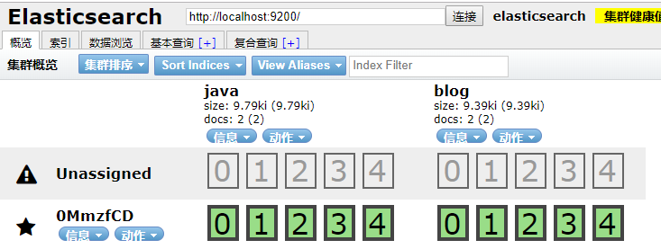

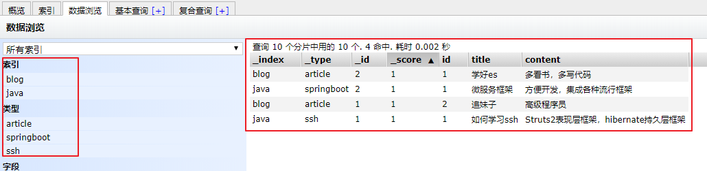


### 3.2.4 字段 field

相当于是数据表的字段，对文档数据根据不同属性进行的分类标识的

### 3.2.5 映射 mapping

mapping是处理数据的方式和规则方面做一些限制，如某个字段的数据类型、默认值、分词器、是否被索引等等，这些都是映射里面可以设置的，其它就是处理es里面数据的一些使用规则设置也叫做映射，按着最优规则处理数据对性能提高很大，因此才需要建立映射，并且需要思考如何建立映射才能对性能更好。 


mapping是类似于**数据库中的表结构定义**，主要作用如下：

- 定义index下的字段名
- 定义字段类型，比如数值型、浮点型、布尔型等
- 定义倒排索引相关的设置，比如是否索引、记录position等


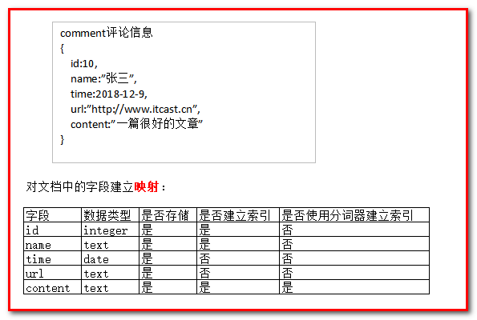

### 3.2.6 接近实时 NRT

Elasticsearch是一个接近实时的搜索平台。这意味着，从索引一个文档直到这个文档能够被搜索到有一个轻微的延迟（通常是1秒以内） 


### 3.2.7 集群 cluster

一个集群就是由一个或多个节点组织在一起，它们共同持有整个的数据，并一起提供索引和搜索功能。一个集群由一个唯一的名字标识，这个名字默认就是“elasticsearch”。这个名字是重要的，因为一个节点只能通过指定某个集群的名字，来加入这个集群。

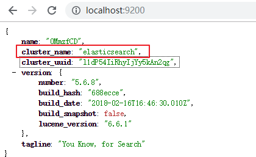

### 3.2.8 节点 node

一个节点是集群中的一个服务器，作为集群的一部分，它存储数据，参与集群的索引和搜索功能。和集群类似，一个节点也是由一个名字来标识的，默认情况下，这个名字是一个随机的角色的名字，这个名字会在启动的时候赋予节点。这个名字对于管理工作来说挺重要的，因为在这个管理过程中，你会去确定网络中的哪些服务器对应于Elasticsearch集群中的哪些节点。

一个节点可以通过配置集群名称的方式来加入一个指定的集群。默认情况下，每个节点都会被安排加入到一个叫做“elasticsearch”的集群中，这意味着，如果你在你的网络中启动了若干个节点，并假定它们能够相互发现彼此，它们将会自动地形成并加入到一个叫做“elasticsearch”的集群中。

在一个集群里，只要你想，可以拥有任意多个节点。而且，如果当前你的网络中没有运行任何Elasticsearch节点，这时启动一个节点，会默认创建并加入一个叫做“elasticsearch”的集群。

### 3.2.9 分片&副本  shard&replicas

一个索引可以存储超出单个节点硬件限制的大量数据。比如，一个具有10亿文档的索引占据1TB的磁盘空间，而任一节点都没有这样大的磁盘空间；或者单个节点处理搜索请求，响应太慢。为了解决这个问题，Elasticsearch提供了将索引划分成多份的能力，这些份就叫做分片。当你创建一个索引的时候，你可以指定你想要的分片的数量。每个分片本身也是一个功能完善并且独立的“索引”，这个“索引”可以被放置到集群中的任何节点上。分片很重要，主要有两方面的原因： 1）允许你水平分割/扩展你的内容容量。 2）允许你在分片（潜在地，位于多个节点上）之上进行分布式的、并行的操作，进而提高性能/吞吐量。

至于一个分片怎样分布，它的文档怎样聚合回搜索请求，是完全由Elasticsearch管理的，对于作为用户的你来说，这些都是透明的。

在一个网络/云的环境里，失败随时都可能发生，在某个分片/节点不知怎么的就处于离线状态，或者由于任何原因消失了，这种情况下，有一个故障转移机制是非常有用并且是强烈推荐的。为此目的，Elasticsearch允许你创建分片的一份或多份拷贝，这些拷贝叫做复制分片，或者直接叫复制。

复制之所以重要，有两个主要原因： 在分片/节点失败的情况下，提供了高可用性。因为这个原因，注意到复制分片从不与原/主要（original/primary）分片置于同一节点上是非常重要的。扩展你的搜索量/吞吐量，因为搜索可以在所有的复制上并行运行。总之，每个索引可以被分成多个分片。一个索引也可以被复制0次（意思是没有复制）或多次。一旦复制了，每个索引就有了主分片（作为复制源的原来的分片）和复制分片（主分片的拷贝）之别。分片和复制的数量可以在索引创建的时候指定。在索引创建之后，你可以在任何时候动态地改变复制的数量，但是你事后不能改变分片的数量。

默认情况下，Elasticsearch中的每个索引被分片5个主分片和1个复制，这意味着，如果你的集群中至少有两个节点，你的索引将会有5个主分片和另外5个复制分片（1个完全拷贝），这样的话每个索引总共就有10个分片。

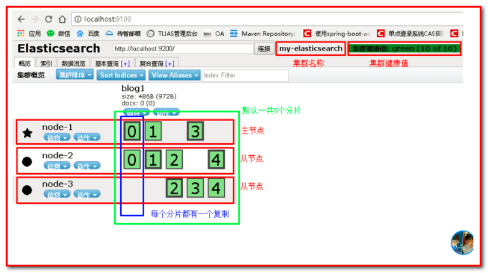


# 4、通过java客户端操作Elasticsearch

## 4.1 环境准备

- 启动es服务（存储数据）：略

- 启动grunt服务（可视化工具）：略

- 创建maven工程，并且添加相关依赖，如下

  ~~~xml
  <dependencies>
          <!--es需要依赖-->
          <dependency>
              <groupId>org.elasticsearch</groupId>
              <artifactId>elasticsearch</artifactId>
              <version>5.6.8</version>
          </dependency>
          <dependency>
              <groupId>org.elasticsearch.client</groupId>
              <artifactId>transport</artifactId>
              <version>5.6.8</version>
          </dependency>
          <dependency>
              <groupId>log4j</groupId>
              <artifactId>log4j</artifactId>
              <version>1.2.17</version>
          </dependency>
          <dependency>
              <groupId>org.slf4j</groupId>
              <artifactId>slf4j-api</artifactId>
              <version>1.7.26</version>
          </dependency>
          <dependency>
              <groupId>org.slf4j</groupId>
              <artifactId>slf4j-simple</artifactId>
              <version>1.7.21</version>
          </dependency>
          <dependency>
              <groupId>org.apache.logging.log4j</groupId>
              <artifactId>log4j-to-slf4j</artifactId>
              <version>2.11.2</version>
          </dependency>
          <dependency>
              <groupId>junit</groupId>
              <artifactId>junit</artifactId>
              <version>4.12</version>
          </dependency>
      </dependencies>
  ~~~

  

### 4.2 创建索引

### 4.2.1 代码实现

在工程的test目录下创建ElasticsearchDemo，并且添加CreateIndex方法。

#### 4.2.1.1 通过Map构建文档

~~~java
@Test
    public void createIndex() throws UnknownHostException {
        /**
         * 1、创建连接es服务客户端对象
         * 参数：settings：集群设置
         *  Settings.EMPTY：非集群（单节点）
         *  Settings.builder().build()：设置集群配置
         *
         */
        Client client =
                new PreBuiltTransportClient(Settings.EMPTY).
                        addTransportAddress(new InetSocketTransportAddress(InetAddress.getByName("127.0.0.1"), 9300));
        // 2、创建文档对象
        Map<String, Object> map = new HashMap<String, Object>();
        map.put("id", 1);
        map.put("title", "如何学好es");
        map.put("content", "多看书，多写代码");
        // 3、将数据保存es中
        // arg0：索引 arg1：类型 id：存储文档的唯一标识  创建索引
        // setSource(map)：创建文档
        client.prepareIndex("blog", "article", "1").setSource(map).get();
        // 4、关闭资源
        client.close();
    }
~~~

#### 4.2.1.1 通过XContentBuilder构建文档

~~~java
@Test
    public void createIndex() throws Exception {
        /**
         * 1、创建连接es服务客户端对象
         * 参数：settings：集群设置
         *  Settings.EMPTY：非集群（单节点）
         *  Settings.builder().build()：设置集群配置
         *
         */
        Client client =
                new PreBuiltTransportClient(Settings.EMPTY).
                        addTransportAddress(new InetSocketTransportAddress(InetAddress.getByName("127.0.0.1"), 9300));
        // 2、创建文档对象sourceBuilder
        XContentBuilder sourceBuilder = XContentFactory.jsonBuilder();
        sourceBuilder.startObject();    // 构建对象开始
        sourceBuilder.field("id", "1");
        sourceBuilder.field("title", "你会thread么");
        sourceBuilder.field("content", "进入多线程的学习阶段");
        sourceBuilder.endObject();      // 构建对象结束
        // 3、将数据保存es中
        // arg0：索引 arg1：类型 id：存储文档的唯一标识  创建索引
        // setSource(map)：创建文档
        client.prepareIndex("java", "java基础", "3").setSource(sourceBuilder).get();
        // 4、关闭资源
        client.close();
    }
~~~


### 4.2.2 查看索引

通过可视化界面查看索引基本情况。

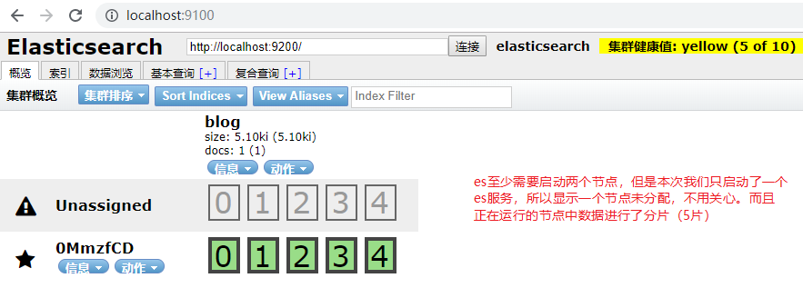


## 4.3 基于索引库检索

### 4.3.1 根据id查询

在测试类中添加方法：

~~~java
@Test
    public void queryIndexById() throws Exception {
        // 1、创建es客户端对象并且连接es服务
        TransportClient client = new PreBuiltTransportClient(Settings.EMPTY);
        client.addTransportAddress(new InetSocketTransportAddress(InetAddress.getByName("127.0.0.1"), 9300));
        // 2、api方法调用
        GetResponse response = client.prepareGet("java", "java基础", "3").get();
        // 3、处理结果集
        String json = response.getSourceAsString();
        System.out.println(json);
        // 关闭资源
        client.close();
    }
~~~


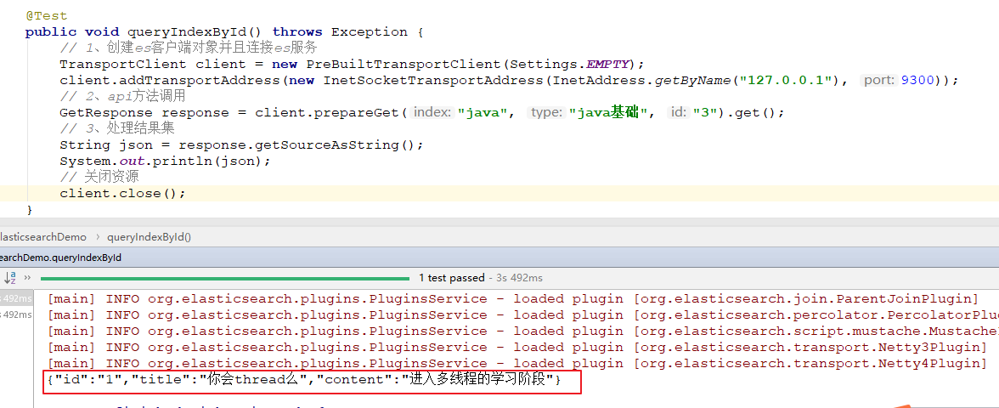


### 4.3.2 查询所有

在测试类中添加方法：

~~~java
@Test
    public void queryIndexByAll() throws Exception {
        // 1、创建es客户端对象并且连接es服务
        TransportClient client = new PreBuiltTransportClient(Settings.EMPTY);
        client.addTransportAddress(new InetSocketTransportAddress(InetAddress.getByName("127.0.0.1"), 9300));
        // 2、api方法调用
        SearchResponse response = client.prepareSearch("blog").setTypes("article").
                setQuery(QueryBuilders.matchAllQuery()).get();// 设置查询条件：matchAllQuery，查询所有
        // 3、结果集处理
        SearchHits hits = response.getHits();
        long totalHits = hits.totalHits;
        System.out.println("总条数：" + totalHits);
        Iterator<SearchHit> iterator = hits.iterator();
        while (iterator.hasNext()){ // 遍历结果集
            SearchHit searchHit = iterator.next();
            String title = searchHit.getSource().get("title").toString();
            System.out.println("title值：" + title);
            String json = searchHit.getSourceAsString();
            System.out.println("文档值：" + json);
        }
    }
~~~


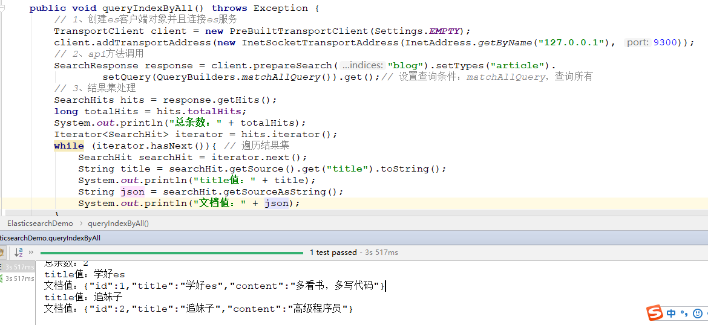


### 4.3.3 根据条件查询

在测试类中添加方法：

~~~java
@Test
    public void queryIndexByString() throws Exception {
        // 1、创建es客户端对象并且连接es服务
        TransportClient client = new PreBuiltTransportClient(Settings.EMPTY);
        client.addTransportAddress(new InetSocketTransportAddress(InetAddress.getByName("127.0.0.1"), 9300));
        // 2、api方法调用
        SearchResponse response = client.prepareSearch("blog").setTypes("article").
                setQuery(QueryBuilders.queryStringQuery("程序员").field("content")) // 设置查询条件：queryStringQuery，指定查询条件
                .get();
        // 3、结果集处理
        SearchHits hits = response.getHits();
        long totalHits = hits.totalHits;
        System.out.println("总条数：" + totalHits);
        Iterator<SearchHit> iterator = hits.iterator();
        while (iterator.hasNext()){ // 遍历结果集
            SearchHit searchHit = iterator.next();
            String title = searchHit.getSource().get("title").toString();
            System.out.println("title值：" + title);
            String json = searchHit.getSourceAsString();
            System.out.println("文档值：" + json);
        }
    }
~~~


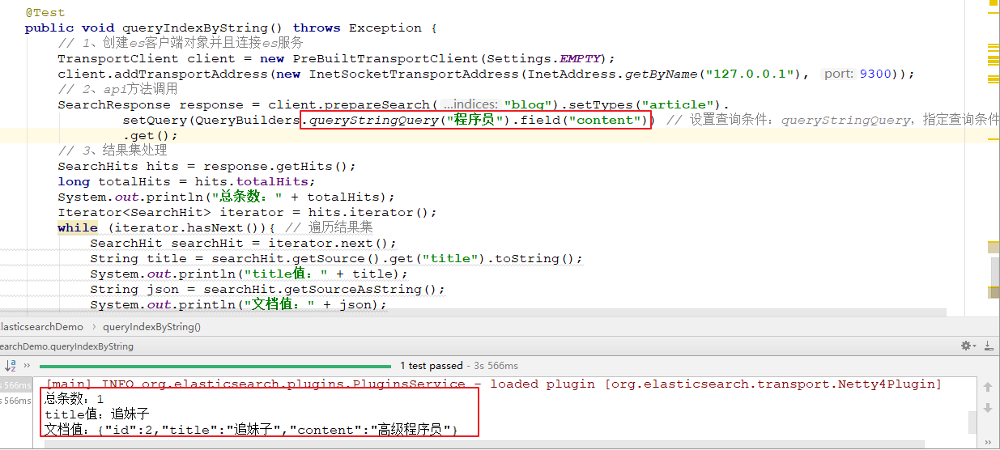


### 4.3.4 根据词条检索

**词条：也就是关键字。**

在测试类中添加方法：

~~~java
@Test
    public void queryIndexByTerm() throws Exception {
        // 1、创建es客户端对象并且连接es服务
        TransportClient client = new PreBuiltTransportClient(Settings.EMPTY);
        client.addTransportAddress(new InetSocketTransportAddress(InetAddress.getByName("127.0.0.1"), 9300));
        // 2、api方法调用
        SearchResponse response = client.prepareSearch("blog").setTypes("article").
                setQuery(QueryBuilders.termQuery("content", "程序员")) // 设置查询条件：termQuery，指定词条
                .get();
        // 3、结果集处理
        SearchHits hits = response.getHits();
        long totalHits = hits.totalHits;
        System.out.println("总条数：" + totalHits);
        Iterator<SearchHit> iterator = hits.iterator();
        while (iterator.hasNext()){ // 遍历结果集
            SearchHit searchHit = iterator.next();
            String title = searchHit.getSource().get("title").toString();
            System.out.println("title值：" + title);
            String json = searchHit.getSourceAsString();
            System.out.println("文档值：" + json);
        }
    }
~~~


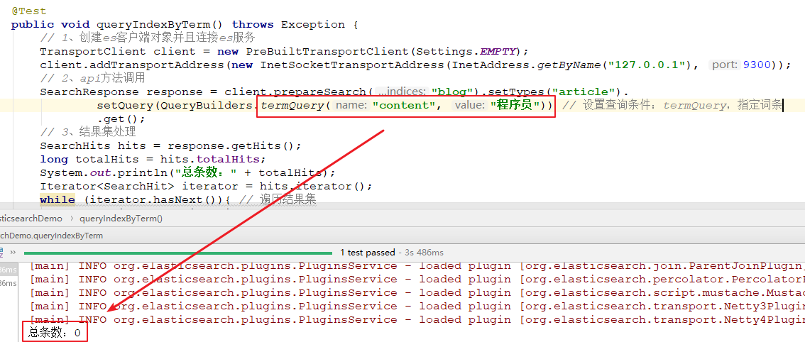

**0条：因为索引库中没有这个词条**

### 4.3.5 模糊查询

***：匹配0个或者多个**


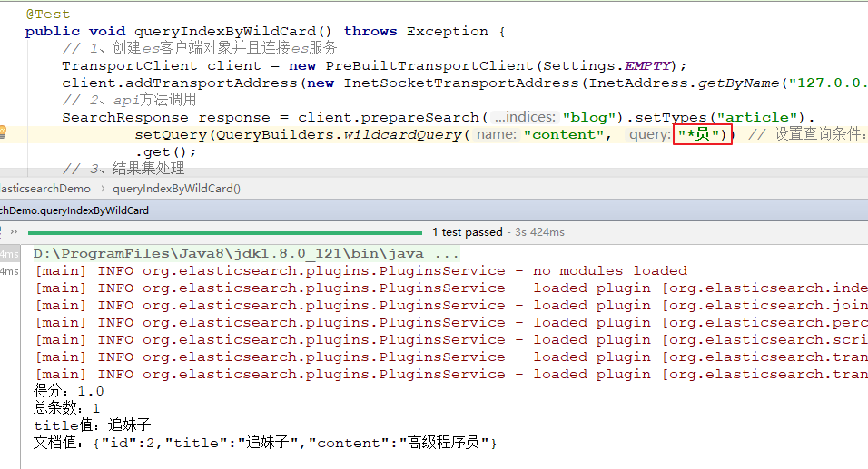

**?：匹配一个**

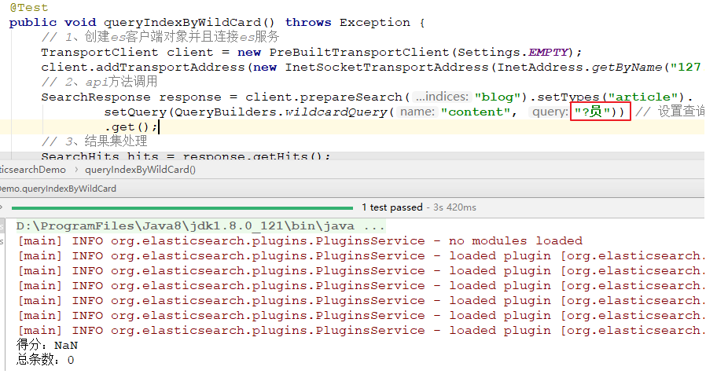


# 5、Elasticsearch集成IK分词器

在第四章节中，根据词条等检索的过程中并没有检索到数据，原因是在索引库中并没有这些词条（关键字）。ES是基于Lucene，而Lucene默认将中文的一句话切分成一个个字，因此无法检索到数据。所以，在ES中我们需要集成第三方的中文分词IK。由于在学习Lucene时我们已介绍过IK分词器，这里我们不在具体介绍了。

## 5.1 实现步骤

### 5.1.1 将ik解压到es中

- 第一步：将elasticsearch-analysis-ik-5.6.8解压到elasticsearch-5.6.8\plugins目录下，并重命名文件夹为ik

  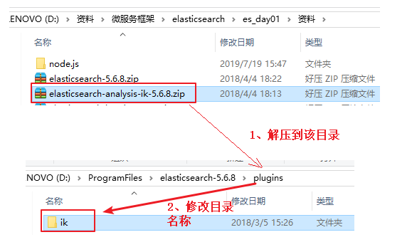

- 第二步：重启es服务，略。

### 5.1.2 访问测试

- 默认分词器，访问地址：`http://127.0.0.1:9200/_analyze?analyzer=standard&pretty=true&text=我是程序员`

  

- ik分词器，最小切分，访问地址：`http://127.0.0.1:9200/_analyze?analyzer=ik_smart&pretty=true&text=我是程序员`

  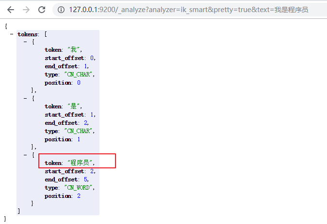

- ik分词器，最细切分，访问地址：`http://127.0.0.1:9200/_analyze?analyzer=ik_max_word&pretty=true&text=我是程序员`

  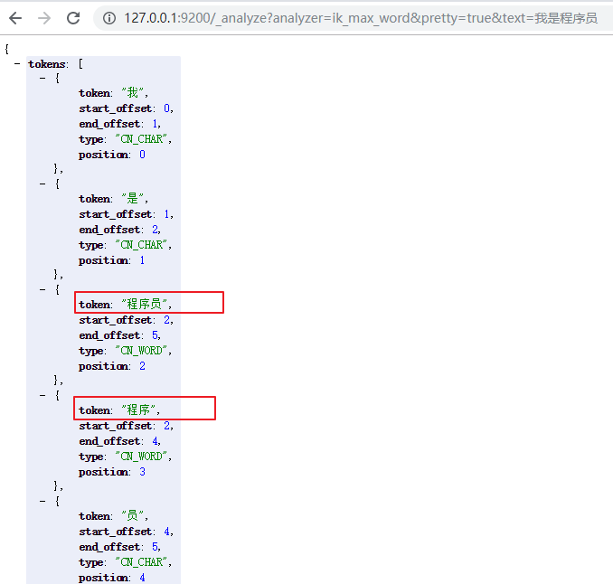

ik_max_word 切词 要比  ik_smart 多。


## 5.2 配置停用词以及扩展词

### 5.2.1 需求

在地址栏输入如下地址：`http://127.0.0.1:9200/_analyze?analyzer=ik_max_word&pretty=true&text=我个单身狗，理想成为高富帅，迎娶白富美`     效果如下：但是我们知道现在‘单身狗’、‘高富帅’、‘白富美’都是一个词（网络词语），但是ik分词器并不能识别。ik分词器2012年基本停止维护了。

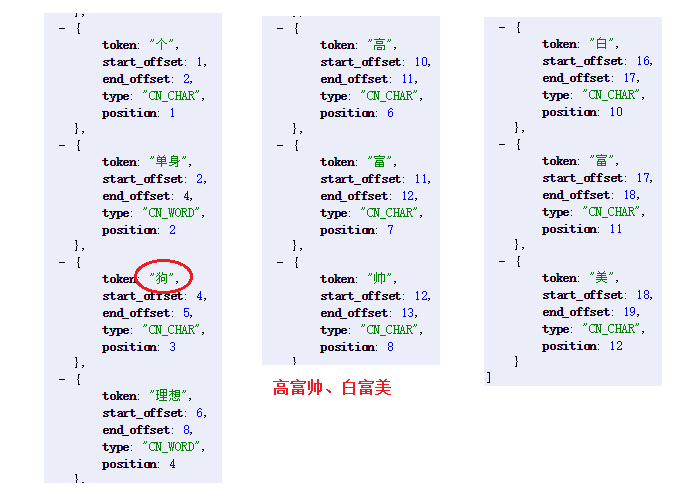

### 5.2.2 配置步骤

- 第一步：修改ik核心配置文件，在配置文件中添加ext.dic和stopword.dic。让ik加载配置文件。

  

- 第二步：添加停用词，编辑ik/config/stopword.dic文件

  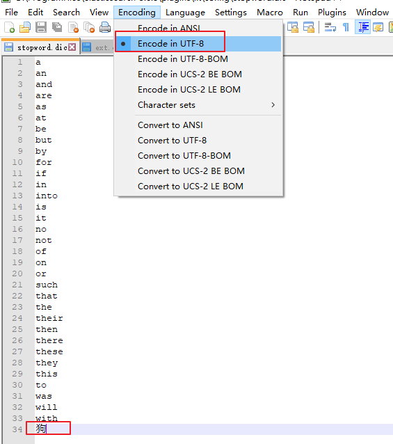

- 第三步：添加扩展词，在ik/config/目录下添加ext.dic文件，然后添加扩展词语

  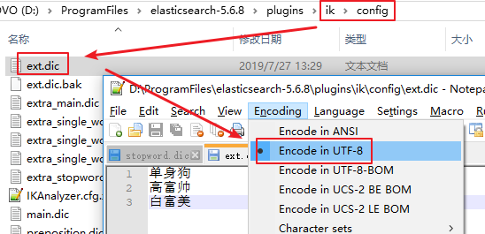

- 第四步：重启es并再次测试

  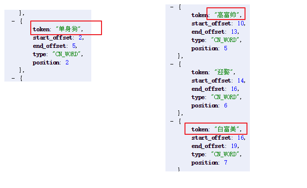

  

# 6、使用RESTful操作Elasticsearch

如何操作。

6.1 RESTful介绍

RESTful是一种软件架构风格、设计风格，而**不是**标准，只是提供了一组设计原则和约束条件。它主要用于客户端和服务器交互类的软件。基于这个风格设计的软件可以更简洁，更有层次。RESTful是目前最流行的 API 设计规范，用于 Web 数据接口的设计。

- 传统请求：

  ```properties
  URL                                       服务器上资源
  http://localhsot:8080/save                访问的资源save();
  http://localhsot:8080/update              访问的资源update();
  http://localhsot:8080/delete              访问的资源delete();
  http://localhsot:8080/find                访问的资源find();
  ```

- RESTful：

  ```properties
  HTTP的请求状态               URI                                  服务器上资源
  Http的协议POST              http://localhsot:8080/list          访问的资源save();
  Http的协议PUT               http://localhsot:8080/list          访问的资源update();
  Http的协议DELETE            http://localhsot:8080/list          访问的资源delete();
  Http的协议GET               http://localhsot:8080/list          访问的资源find();
  ```


## 6.2 postman工具安装

Postman中文版是postman这款强大网页调试工具的windows客户端，提供功能强大的Web API & HTTP 请求调试。软件功能非常强大，界面简洁明晰、操作方便快捷，设计得很人性化。Postman中文版能够发送任何类型的HTTP 请求 (GET, HEAD, POST, PUT，DELETE..)，且可以附带任何数量的参数。

下载Postman工具,Postman官网：<https://www.getpostman.com>，课程资料中已经提供了安装包。双击安装完成后需要自行注册一个账号，这里就不演示了。 

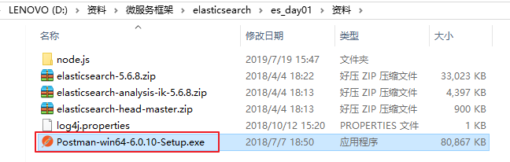


## 6.3 postman操作

es提供了RESTful接口： url不能随便写。

### 6.3.1 Elasticsearch接口语法

- 语法：

```shell
#语法
curl -X<VERB> '<PROTOCOL>://<HOST>:<PORT>/<PATH>?<QUERY_STRING>' -d '<BODY>'

#栗子
curl -XPUT http://localhost:9200/blog/article/1 -d '{"title": "New version of
Elasticsearch released!", content": "Version 1.0 released today!", "tags": ["announce",
"elasticsearch", "release"] }'
```

- 参数说明：

| **参数** | **解释**                                                     |
| -------- | ------------------------------------------------------------ |
| VERB     | 适当的 HTTP *方法* 或 *谓词* : GET、 POST、 PUT、 HEAD 或者 DELETE。 |
| PROTOCOL | http 或者 https（如果你在 Elasticsearch 前面有一个 https 代理） |
| HOST     | Elasticsearch 集群中任意节点的主机名，或者用 localhost 代表本地机器上的节点。 |
| PORT     | 运行 Elasticsearch HTTP 服务的端口号，默认是 9200 。         |
| PATH     | API 的终端路径（例如 _count 将返回集群中文档数量）。Path 可能包含多个组件，例如：_cluster/stats 和 _nodes/stats/jvm 。 \| \| QUERY_STRING \| 任意可选的查询字符串参数 (例如 ?pretty 将格式化地输出 JSON 返回值，使其更容易阅读) \| \| BODY \| 一个 JSON 格式的请求体 (如果请求需要的话) \| |

### 6.3.2 创建索引

- 请求url：

~~~properties
PUT     http://localhost:9200/blog2
~~~

- 请求体：

~~~properties
{
    "mappings": {
		"article": {
			"properties": {
				"id": {
					"type": "long",
					"store": false,
					"index":"not_analyzed"
				},
				"title": {
					"type": "text",
					"store": false,
					"index":"analyzed",
					"analyzer":"ik_smart"
				},
				"content": {
					"type": "text",
					"store": false,
					"index":"analyzed",
					"analyzer":"ik_smart"
				}
			}
		}
	}
}
~~~

- “analyzer”:“standard”：表示单字分词（默认值）
- “analyzer”:“ik_smart”：使用ik分词器（ik的最小切分）
- “store”: true：表示是否存储，只有存储到索引库，才能检索到结果（Elasticsearch的默认值flase）

关键字高亮实质上是根据倒排记录中的词项偏移位置，找到关键词，加上前端的高亮代码。这里就要说到store属性，store属性用于指定是否将原始字段写入索引，默认取值为no。如果在Lucene中，高亮功能和store属性是否存储息息相关，因为需要根据偏移位置到原始文档中找到关键字才能加上高亮的片段。在Elasticsearch，因为_source中已经存储了一份原始文档，可以根据_source中的原始文档实现高亮，在索引中再存储原始文档就多余了，所以Elasticsearch默认是把store属性设置为no。 


- postman操作

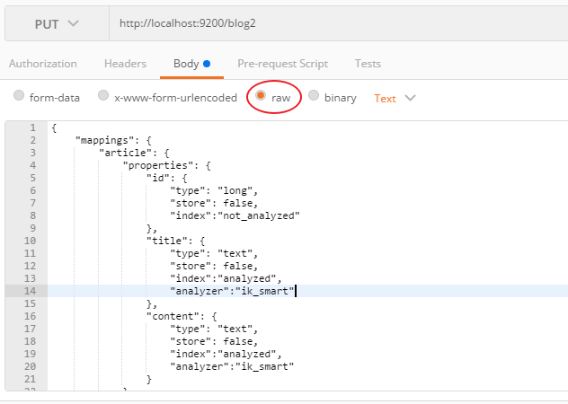

### 6.3.3 删除索引

- 请求url

~~~properties
DELETE      http://localhost:9200/blog2
~~~

- postman操作

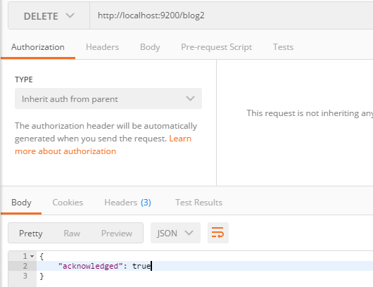

### 6.3.4 创建文档

- 请求url（需要重新创建映射blog2）

~~~properties
POST    http://localhost:9200/blog2/article/1
~~~

- 请求体

~~~properties
{
    "id":1,
    "title":"ElasticSearch是一个基于Lucene的搜索服务器",
    "content":"它提供了一个分布式多用户能力的全文搜索引擎，基于RESTfulweb接口。Elasticsearch是用Java开发的，并作为Apache许可条款下的开放源码发布，是当前流行的企业级搜索引擎。设计用于云计算中，能够时搜索。"
}
~~~

- postman操作


### 6.3.5 修改文档

- 请求url（如果article=1的存在，执行更新操作；否则执行插入操作）

~~~properties
POST	http://localhost:9200/blog2/article/1
~~~

- 请求体

~~~properties
{
    "id":1,
    "title":"ElasticSearch是一个基于Lucene的搜索服务器-深圳黑马训练营",
    "content":"它提供了一个分布式多用户能力的全文搜索引擎，基于RESTfulweb接口。Elasticsearch是用Java开发的，并作为Apache许可条款下的开放源码发布，是当前流行的企业级搜索引擎。设计用于云计算中，能够时搜索。"
}
~~~

- postman操作


### 6.3.6 查询文档

#### 6.3.6.1 根据id查询 

- 请求url

~~~properties
GET      http://localhost:9200/blog2/article/1
~~~

- postman操作

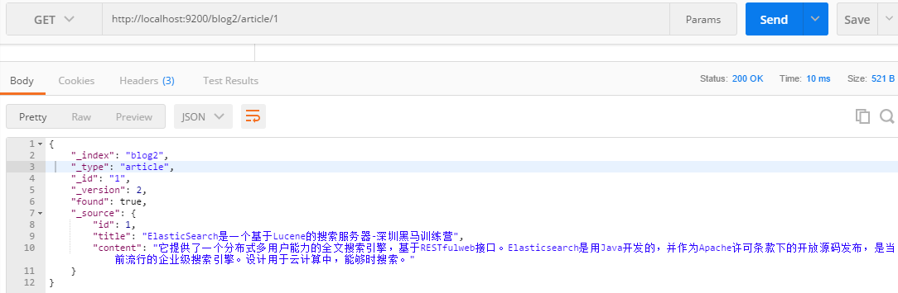

#### 6.3.6.2 根据querystring查询 

- 请求url

~~~properties
POST       http://localhost:9200/blog2/article/_search
~~~

- 请求体

~~~properties
{
	"query": {
		"query_string": {
			"default_field": "title",
			"query": "搜索服务器"
		}
	}
}
~~~

- postman操作

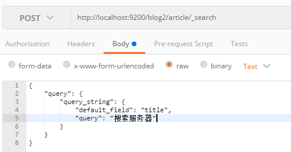

#### 6.3.6.3 根据term查询 

- 请求url

~~~properties
POST     http://localhost:9200/blog2/article/_search
~~~

- 请求体

~~~properties
{
	"query": {
		"term": {
			"title": "搜索"
		}
	}
}
~~~

- postman操作


### 6.3.7 删除文档

- 请求url

~~~properties
DELETE    http://localhost:9200/blog2/article/1
~~~

- postman操作


