# Elasticsearch（二）

每日反馈：

​		内推。。。

- 分享（很重要）：重视			代码review     成员的代码
  - 重新学习、重新认识的过程    
  - 工作2-3年：到了单位，**只看结果**【60分--->慢慢优化】（不关心过程）
- 可以
- 应该是我     视频没有
- 简历：工作年限2-3  （高工：52原则）   个人建议：在一家单位   工作职位
- 好
- OK
- 略
- 略

- RabbitMQ安装不了：计算机名中文   有解决方案

  - 原因：mq的数据：默认是在c/盘--->用户下-mq-data

  - 解决的办法：

    - 配置环境变量：指定mq数据存储的路径

    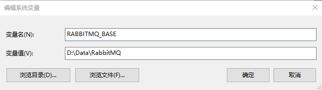

    - 进入mq的sbin目录下
      - step1：rabbitmq-service.bat remove
      - step2：rabbitmq-service.bat  install

课程回顾：

1、es介绍：略

2、安装es服务

- 在win下安装：解压---->运行（elasticsearch.bat     elasticsearch.sh）
  - 闪退：配置堆内存的大小
- 安装可视化head插件
  - 安装node
  - 安装grunt
  - 启动grunt  客户端
    - 跨域访问（配置）

3、通过java的客户端操作ES：api调用的过程

4、es集成ik分词器

5、配置停用词、扩展词

6、通过postman操作es（提供RESTful的api的接口     请求url）

学习目标：学会去使用。

- 能够完成索引操作
  - 创建索引的操作
  - 删除索引的操作
- 能够完成创建映射的操作
- 能够完成文档的操作
  - 完成增删改查操作
  - 完成文档的分页操作
  - 完成文档的高亮显示操作

=======原生API========【很少】从来没有    也会自己去封装      jedis   RedisTemplate

- 能够通过Spring Data 对Elasticsearch操作   
- 能够完成条件查询的方法命名规则
- es的集群（win）

# 1 通过java客户端对es维护

## 1.1 工程搭建

- 创建maven工程

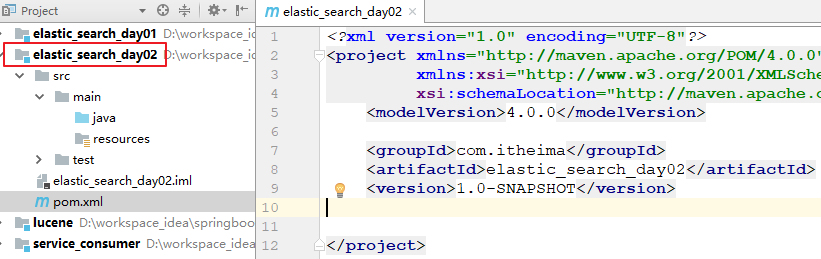

- 添加依赖，在pom.xml文件添加如下依赖：

~~~xml
<dependencies>
    <dependency>
        <groupId>org.elasticsearch</groupId>
        <artifactId>elasticsearch</artifactId>
        <version>5.6.8</version>
    </dependency>
    <dependency>
        <groupId>org.elasticsearch.client</groupId>
        <artifactId>transport</artifactId>
        <version>5.6.8</version>
    </dependency>
    <dependency>
        <groupId>org.apache.logging.log4j</groupId>
        <artifactId>log4j-to-slf4j</artifactId>
        <version>2.9.1</version>
    </dependency>
    <dependency>
        <groupId>org.slf4j</groupId>
        <artifactId>slf4j-api</artifactId>
        <version>1.7.24</version>
    </dependency>
    <dependency>
        <groupId>org.slf4j</groupId>
        <artifactId>slf4j-simple</artifactId>
        <version>1.7.21</version>
    </dependency>
    <dependency>
        <groupId>log4j</groupId>
        <artifactId>log4j</artifactId>
        <version>1.2.12</version>
    </dependency>
    <dependency>
        <groupId>junit</groupId>
        <artifactId>junit</artifactId>
        <version>4.12</version>
    </dependency>
</dependencies>
~~~

- 创建测试类ElasticSearchDemo

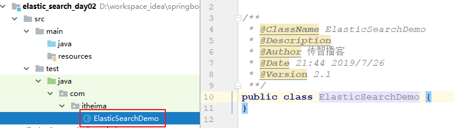

## 1.2 索引操作

### 1.2.1 创建索引

在测试类中添加testCreateIndex方法：

~~~java
@Test
    public void testCreateIndex() throws UnknownHostException {
        // 1、创建客户端并且建立连接
        TransportClient transportClient = new PreBuiltTransportClient(Settings.EMPTY);
        transportClient.addTransportAddress(new InetSocketTransportAddress(InetAddress.getByName("localhost"), 9300));
        // 2、创建索引
        transportClient.admin().indices().prepareCreate("blog3").get();
        // 3、关闭资源
        transportClient.close();
    }
~~~

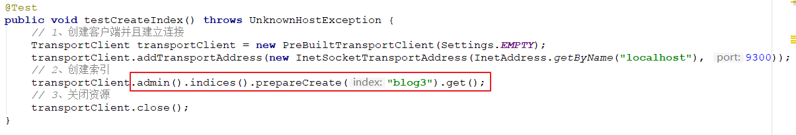

### 1.2.2 删除索引

在测试类中添加testDeleteIndex方法：

~~~java
@Test
    public void testDeleteIndex() throws UnknownHostException {
        // 1、创建客户端并且建立连接
        TransportClient transportClient = new PreBuiltTransportClient(Settings.EMPTY);
        transportClient.addTransportAddress(new InetSocketTransportAddress(InetAddress.getByName("localhost"), 9300));
        // 2、删除索引
        transportClient.admin().indices().prepareDelete("blog3").get();
        // 3、关闭资源
        transportClient.close();
    }
~~~

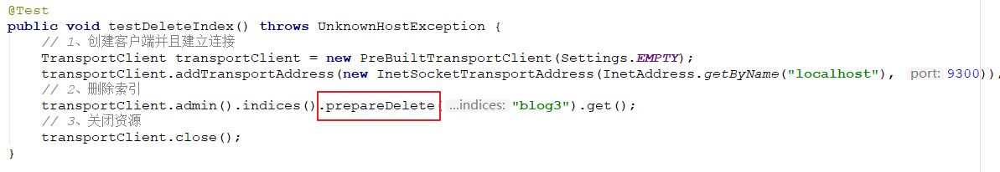

## 1.3 创建映射

### 1.3.1 创建映射前

这里的映射表示创建索引类型结构，如果不创建映射，Elasticsearch会默认根据创建的文档中的数据用来创建映射。查看之前的blog3的映射。

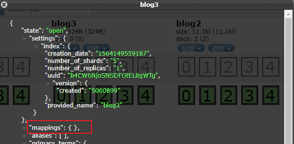

### 1.3.2 创建映射

在测试类中添加方法：

~~~java
// 创建映射
    @Test
    public void testCreateMapping() throws Exception{
        // 1、创建客户端并且建立链接
        TransportClient client = new PreBuiltTransportClient(Settings.EMPTY);
        client.addTransportAddress(new InetSocketTransportAddress(InetAddress.getByName("localhost"), 9300));
        // 2、api调用：创建映射
        XContentBuilder builder = XContentFactory.jsonBuilder();
        builder.startObject()
                    .startObject("properties")
                        .startObject("id")
                            .field("type", "long")
                        .endObject()
                        .startObject("title")
                            .field("type", "string")
                            .field("store", "false")
                            .field("analyzer", "ik_smart")
                        .endObject()
                        .startObject("content")
                            .field("type", "string")
                            .field("store", "false")
                            .field("analyzer", "ik_smart")
                        .endObject()
                    .endObject()
                .endObject();
        PutMappingRequest mapping = Requests.putMappingRequest("blog3").type("article").source(builder);
        client.admin().indices().putMapping(mapping);
        // 3、关闭资源
        client.close();
    }
~~~

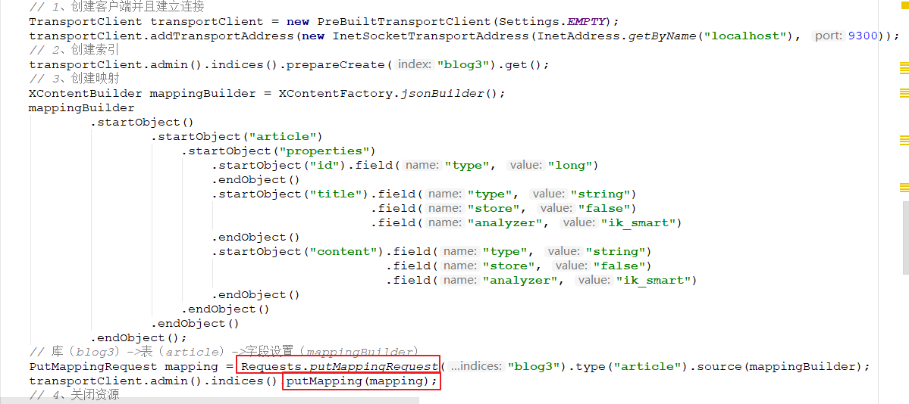

### 1.3.3 创建映射后

创建映射后的结果如下：

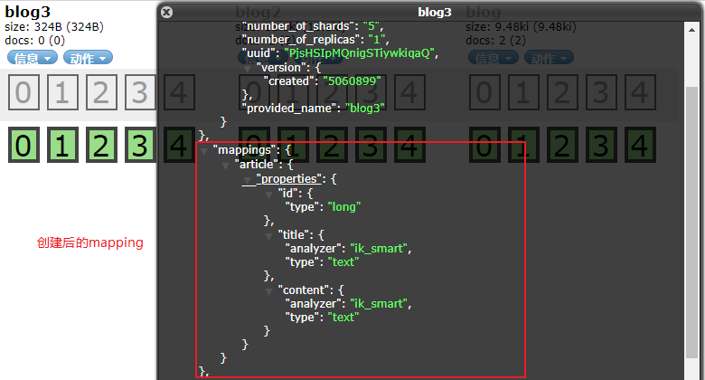

## 1.4 文档数据操作

Hadoop 集群

### 1.4.1 创建文档数据

#### 1.4.1.1 通过XContentBuilder创建

通过XContentBuilder构建文档数据。在测试中添加方法：

~~~java
@Test
    public void testCreateData() throws Exception {
        // 1、创建客户端并且建立连接
        TransportClient transportClient = new PreBuiltTransportClient(Settings.EMPTY);
        transportClient.addTransportAddress(new InetSocketTransportAddress(InetAddress.getByName("localhost"), 9300));
        // 2、创建文档对象
        XContentBuilder xContentBuilder = XContentFactory.jsonBuilder();
        xContentBuilder
                .startObject()
                    .field("id", "1")
                    .field("title", "ElasticSearch是一个基于Lucene的搜索服务器,深圳黑马训练营！")
                    .field("content", "它提供了一个分布式多用户能力的全文搜索引擎，基于RESTful web接口。Elasticsearch是用Java开发的，并作为Apache许可条款下的开放源码发布，是当前流行的企业级搜索引擎。设计用于云计算中，能够达到实时搜索，稳定，可靠，快速，安装使用方便。")
                .endObject();
        // 3、新增数据
        transportClient.prepareIndex("blog3", "article", "1").setSource(xContentBuilder).get();
        // 4、关闭资源
        transportClient.close();
    }
~~~

#### 1.4.1.2 通过POJO创建

通过POJO构建文档数据。在测试中添加方法：

- 添加Jackson依赖（需要将pojo转成json对象）

  ~~~xml
  <!--jackson JSON转换包-->
  <dependency>
      <groupId>com.fasterxml.jackson.core</groupId>
      <artifactId>jackson-core</artifactId>
      <version>2.8.1</version>
  </dependency>
  <dependency>
      <groupId>com.fasterxml.jackson.core</groupId>
      <artifactId>jackson-databind</artifactId>
      <version>2.8.1</version>
  </dependency>
  <dependency>
      <groupId>com.fasterxml.jackson.core</groupId>
      <artifactId>jackson-annotations</artifactId>
      <version>2.8.1</version>
  </dependency>
  ~~~

  

- 创建pojo，在src目录下创建Article对象

~~~java
public class Article {

    private Integer id;
    private String title;
    private String content;
    // TODO setters/getters
}
~~~

- 编写代码

~~~java
@Test
    public void testCreatePojo() throws Exception {
        // 1、创建客户端并且建立连接
        TransportClient transportClient = new PreBuiltTransportClient(Settings.EMPTY);
        transportClient.addTransportAddress(new InetSocketTransportAddress(InetAddress.getByName("localhost"), 9300));
        // 2、创建文档对象
        Article article = new Article();
        article.setId(2);
        article.setTitle("如何追妹子");
        article.setContent("兄弟，算了吧，好好搞技术吧");
        ObjectMapper objectMapper = new ObjectMapper();
        byte[] source = objectMapper.writeValueAsBytes(article); // 转成json字节码数组
        // 3、新增数据
        transportClient.prepareIndex("blog3", "article", "2").setSource(source, XContentType.JSON).get();
        // 4、关闭资源
        transportClient.close();
    }
~~~

### 1.4.2 更新文档数据

#### 1.4.2.1 通过prepareUpdate方法修改

在测试类添加方法：

~~~java
@Test
    public void testUpdateData() throws Exception {
        // 1、创建客户端并且建立连接
        TransportClient transportClient = new PreBuiltTransportClient(Settings.EMPTY);
        transportClient.addTransportAddress(new InetSocketTransportAddress(InetAddress.getByName("localhost"), 9300));
        // 2、创建文档对象
        Article article = new Article();
        article.setId(2);
        article.setTitle("如何追妹子");
        article.setContent("兄弟，算了吧，好好搞技术吧，好好学好es揪心了");
        ObjectMapper objectMapper = new ObjectMapper();
        byte[] source = objectMapper.writeValueAsBytes(article); // 转成json字节码数组
        // 3、更新数据
        transportClient.prepareUpdate("blog3", "article", article.getId().toString())
                .setDoc(source, XContentType.JSON).get();
        // 4、关闭资源
        transportClient.close();
    }
~~~

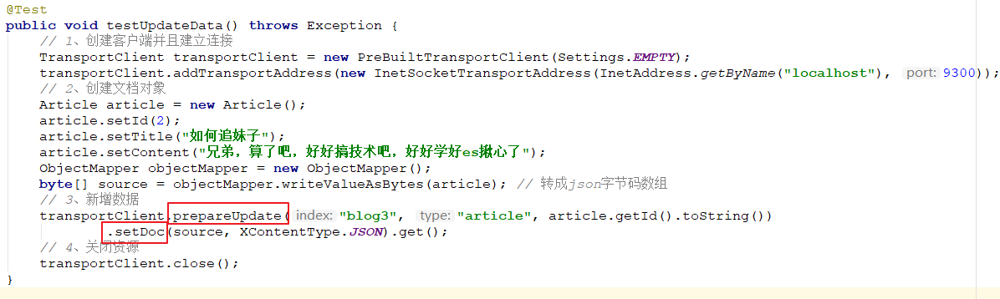

#### 1.4.2.2 通过update方法修改

添加测试方法：

~~~java
@Test
    public void testUpdateData2() throws Exception {
        // 1、创建客户端并且建立连接
        TransportClient transportClient = new PreBuiltTransportClient(Settings.EMPTY);
        transportClient.addTransportAddress(new InetSocketTransportAddress(InetAddress.getByName("localhost"), 9300));
        // 2、创建文档对象
        Article article = new Article();
        article.setId(2);
        article.setTitle("如何追妹子");
        article.setContent("兄弟，算了吧，好好搞技术吧，好好学好es揪心了，es是基于Lucene的");
        ObjectMapper objectMapper = new ObjectMapper();
        byte[] source = objectMapper.writeValueAsBytes(article); // 转成json字节码数组
        // 3、更新数据
        transportClient.update(new UpdateRequest("blog3", "article", article.getId().toString())
                .doc(source, XContentType.JSON));
        // 4、关闭资源
        transportClient.close();
    }
~~~

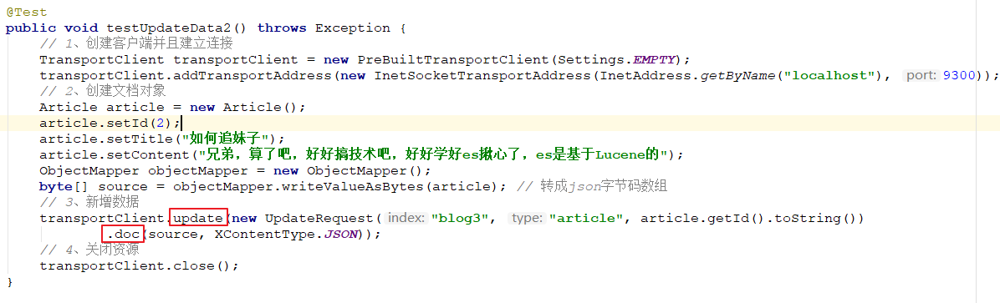

### 1.4.3 删除文档数据

在测试类中添加方法：

~~~java
@Test
public void testDeleteData() throws Exception{
    // 1、创建客户端并且建立连接
    TransportClient transportClient = new PreBuiltTransportClient(Settings.EMPTY);
    transportClient.addTransportAddress(new InetSocketTransportAddress(InetAddress.getByName("localhost"), 9300));
    // 2、删除
    transportClient.prepareDelete("blog3", "article", "2").get();
    // 3、关闭资源
    transportClient.close();
}
~~~

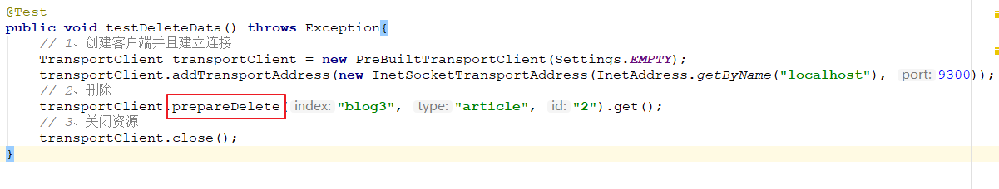

### 1.4.4 批量增加数据

在测试类中添加方法：

~~~java
@Test
    public void testBulkData() throws Exception{
        // 1、创建客户端并且建立连接
        TransportClient transportClient = new PreBuiltTransportClient(Settings.EMPTY);
        transportClient.addTransportAddress(new InetSocketTransportAddress(InetAddress.getByName("localhost"), 9300));
        // 2、批量增加数据
        BulkRequestBuilder builder = transportClient.prepareBulk(); // 批量创建数据的对象
        ObjectMapper objectMapper = new ObjectMapper();
        for (int i = 1; i <= 100; i++){
            Article article = new Article();
            article.setId(i);
            article.setTitle("如何学好es：" + i);
            article.setContent("首先把Lucene学好，然后在慢慢的学习全文检索系统：" + i);
            // 批量添加
            builder.add(
                    transportClient.prepareIndex("blog3", "article", article.getId().toString()).
                            setSource(objectMapper.writeValueAsBytes(article), XContentType.JSON)
            );
        }
        builder.execute().get();
        // 3、关闭资源
        transportClient.close();
    }
~~~

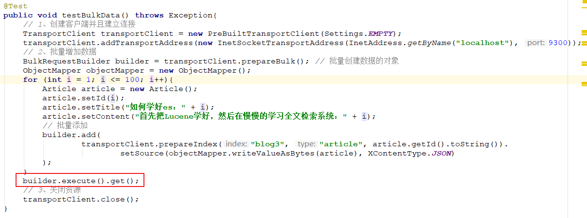

## 1.5 查询

### 1.5.1 根据字符串查询

在测试类中添加方法：

~~~java
 @Test
    public void testSearchByString() throws Exception{
        // 1、创建客户端并且建立连接
        TransportClient transportClient = new PreBuiltTransportClient(Settings.EMPTY);
        transportClient.addTransportAddress(new InetSocketTransportAddress(InetAddress.getByName("localhost"), 9300));
        // 2、调用查询方法
        SearchResponse response = transportClient.prepareSearch("blog3")
                                                 .setTypes("article")
                                                 .setQuery(QueryBuilders.queryStringQuery("搜索引擎")) // 根据字符串查询
                                                 .get();
        // 3、结果集处理
        SearchHits hits = response.getHits();
        long totalHits = hits.totalHits;
        System.out.println("总条数：" + totalHits);
        Iterator<SearchHit> iterator = hits.iterator();
        while (iterator.hasNext()){
            SearchHit hit = iterator.next();
            String result = hit.getSourceAsString();
            System.out.println(result);
        }
        // 4、关闭资源
        transportClient.close();
    }
~~~

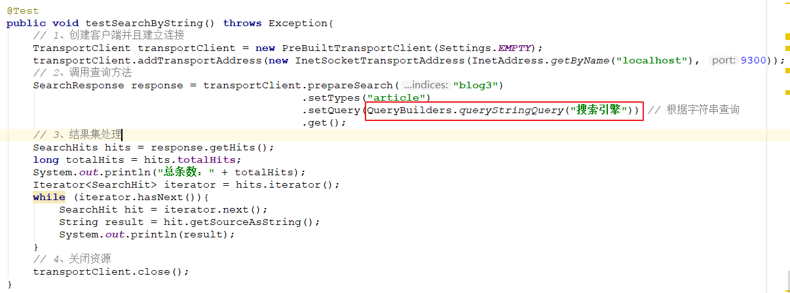

### 1.5.2 根据词条查询

在测试类中添加方法：

~~~java
@Test
    public void testSearchByTerm() throws Exception{
        // 1、创建客户端并且建立连接
        TransportClient transportClient = new PreBuiltTransportClient(Settings.EMPTY);
        transportClient.addTransportAddress(new InetSocketTransportAddress(InetAddress.getByName("localhost"), 9300));
        // 2、调用查询方法
        SearchResponse response = transportClient.prepareSearch("blog3")
                .setTypes("article")
                .setQuery(QueryBuilders.termQuery("title", "如何"))   // 根据词条查询
                .get();
        // 3、结果集处理
        SearchHits hits = response.getHits();
        long totalHits = hits.totalHits;
        System.out.println("总条数：" + totalHits);
        Iterator<SearchHit> iterator = hits.iterator();
        while (iterator.hasNext()){
            SearchHit hit = iterator.next();
            String result = hit.getSourceAsString();
            System.out.println(result);
        }
        // 4、关闭资源
        transportClient.close();
    }
~~~

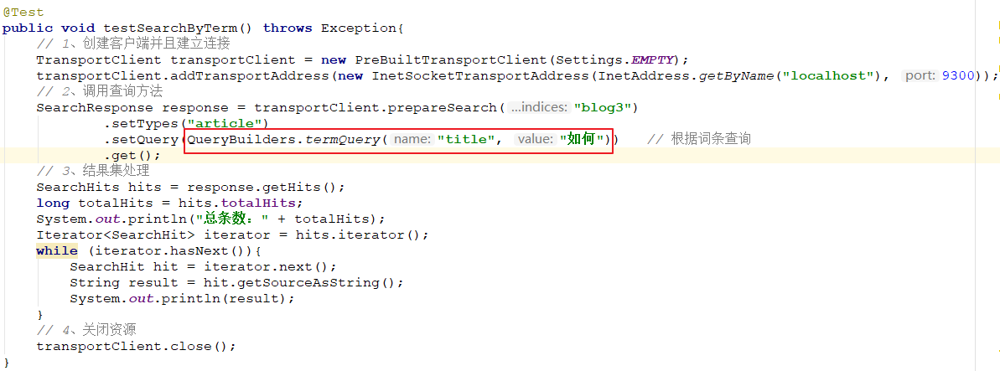

### 1.5.3 结果集处理

在上面的查询中，获取到的结果都是json对象，因此我们可以转成pojo。在测试中添加方法：

~~~java
@Test
    public void testSearchByPojo() throws Exception{
        // 1、创建客户端并且建立连接
        TransportClient transportClient = new PreBuiltTransportClient(Settings.EMPTY);
        transportClient.addTransportAddress(new InetSocketTransportAddress(InetAddress.getByName("localhost"), 9300));
        // 2、调用查询方法
        SearchResponse response = transportClient.prepareSearch("blog3")
                .setTypes("article")
                .setQuery(QueryBuilders.termQuery("title", "如何"))   // 根据词条查询
                .get();
        // 3、结果集处理
        SearchHits hits = response.getHits();
        long totalHits = hits.totalHits;
        System.out.println("总条数：" + totalHits);
        Iterator<SearchHit> iterator = hits.iterator();
        // 将json对象转成pojo
        ObjectMapper objectMapper = new ObjectMapper();
        List<Article> list = new ArrayList<Article>();
        while (iterator.hasNext()){
            SearchHit hit = iterator.next();
            String result = hit.getSourceAsString();
            Article article = objectMapper.readValue(result, Article.class);
            list.add(article);
//            System.out.println(result);
        }
        for (Article article : list) {
            System.out.println(article);
        }
        // 4、关闭资源
        transportClient.close();
    }
~~~

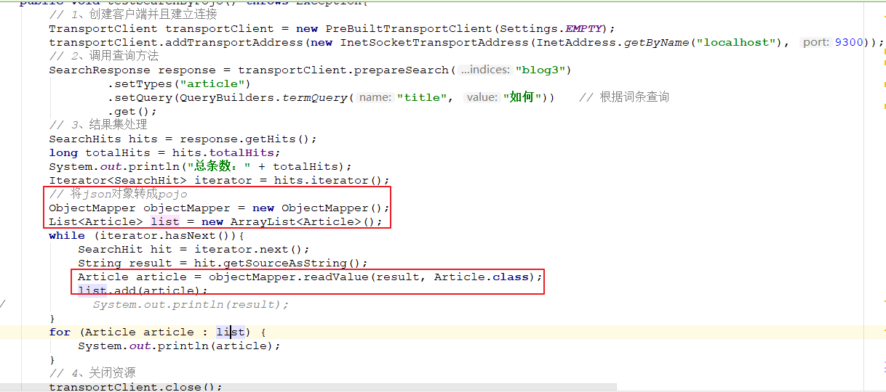

### 1.5.4 多种查询实现

在测试类中添加方法：

~~~java
@Test
    public void testSearchByOther() throws Exception{
        // 1、创建客户端并且建立连接
        TransportClient transportClient = new PreBuiltTransportClient(Settings.EMPTY);
        transportClient.addTransportAddress(new InetSocketTransportAddress(InetAddress.getByName("localhost"), 9300));
        // 2、调用查询方法
        SearchResponse response = transportClient.prepareSearch("blog3")
                .setTypes("article")
//                .setQuery(QueryBuilders.termQuery("title", "如何"))    // 根据词条查询
//                .setQuery(QueryBuilders.queryStringQuery("全文检索"))    // 根据条件查询
//                .setQuery(QueryBuilders.wildcardQuery("title", "*学好*")) // 模糊检索
//                .setQuery(QueryBuilders.matchAllQuery())    // 查询所有
//                .setQuery(QueryBuilders.fuzzyQuery("content", "Lucane"))    // 相似度检索
//                .setQuery(QueryBuilders.rangeQuery("id").from(10).to(15))   // 区间段检索，包含边界
                .setQuery(QueryBuilders.rangeQuery("id").from(10, false).to(15, false))   // 区间段检索，不包含边界
                .get();
        // 3、结果集处理
        SearchHits hits = response.getHits();
        long totalHits = hits.totalHits;
        System.out.println("总条数：" + totalHits);
        Iterator<SearchHit> iterator = hits.iterator();
        // 将json对象转成pojo
        ObjectMapper objectMapper = new ObjectMapper();
        List<Article> list = new ArrayList<Article>();
        while (iterator.hasNext()){
            SearchHit hit = iterator.next();
            String result = hit.getSourceAsString();
            Article article = objectMapper.readValue(result, Article.class);
            list.add(article);
//            System.out.println(result);
        }
        for (Article article : list) {
            System.out.println(article);
        }
        // 4、关闭资源
        transportClient.close();
    }
~~~

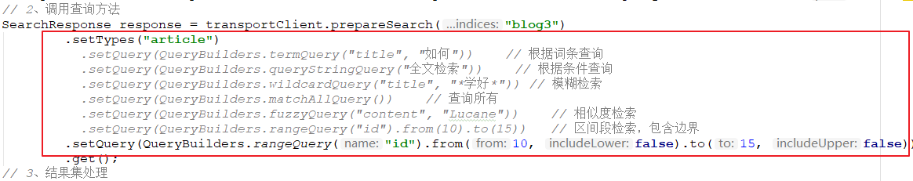

### 1.5.5 组合查询

组合查询：即添加多个条件。

~~~properties
 must(QueryBuilders) : AND，求交集
 mustNot(QueryBuilders): NOT，求差集
 should(QueryBuilders):OR ，求并集
~~~

在测试类中添加方法：

~~~java
@Test
    public void testSearchByBoolean() throws Exception{
        // 1、创建客户端并且建立连接
        TransportClient transportClient = new PreBuiltTransportClient(Settings.EMPTY);
        transportClient.addTransportAddress(new InetSocketTransportAddress(InetAddress.getByName("localhost"), 9300));
        // 2、调用查询方法
        SearchResponse response = transportClient.prepareSearch("blog3")
                .setTypes("article")
                .setQuery(QueryBuilders.boolQuery() // 组合查询，must：代表下面的条件必须全部都成立
                            .must(QueryBuilders.queryStringQuery("es").field("title"))
                            .mustNot(QueryBuilders.rangeQuery("id").from(10).to(15))
                         )
                .get();
        // 3、结果集处理
        SearchHits hits = response.getHits();
        long totalHits = hits.totalHits;
        System.out.println("总条数：" + totalHits);
        Iterator<SearchHit> iterator = hits.iterator();
        // 将json对象转成pojo
        ObjectMapper objectMapper = new ObjectMapper();
        List<Article> list = new ArrayList<Article>();
        while (iterator.hasNext()){
            SearchHit hit = iterator.next();
            String result = hit.getSourceAsString();
            Article article = objectMapper.readValue(result, Article.class);
            list.add(article);
//            System.out.println(result);
        }
        for (Article article : list) {
            System.out.println(article);
        }
        // 4、关闭资源
        transportClient.close();
    }
~~~

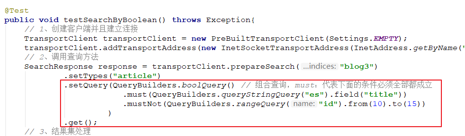

PS：

`<http://127.0.0.1:9200/_analyze?analyzer=ik_max_word&pretty=true&text=ElasticSearch是一个全文检索的框架>`

~~~properties
IK分词器，在建立索引的时候将英文都变成了小写，这样方便我们在搜索的时候可以实现“不区分大小写”的搜索，因此在编写程序是，需要我们在搜索的条件中添加.toLowerCase()的方法进行转小写处理。
~~~

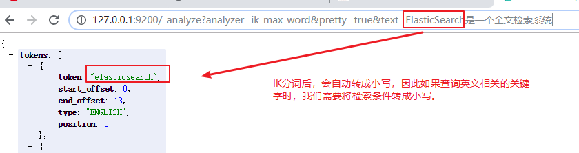

### 1.5.6 使用DSL表达式

在定义json：放置到Elasticsearch的HEAD插件（PostMan工具）中（DSL表达式），使用restful风格编程，传递消息体，使用head插件查看索引库的信息，进行查询：

请求体：

~~~json
{
  "query" : {
    "bool" : {
      "must" : {
        "term" : {
          "title" : "es"
        }
      },
      "must" : {
        "range" : {
          "id" : {
            "from" : 5,
            "to" : 55
          }
        }
      }
    }
  }
}
~~~

~~~
{
  "query" : {
    "bool" : {
      "must" : {
        "term" : {
          "title" : "es"
        }
      },
      "must" : {
        "range" : {
          "id" : {
            "from" : 5,
            "to" : 55
          }
        }
      }
    }
  }
}
~~~

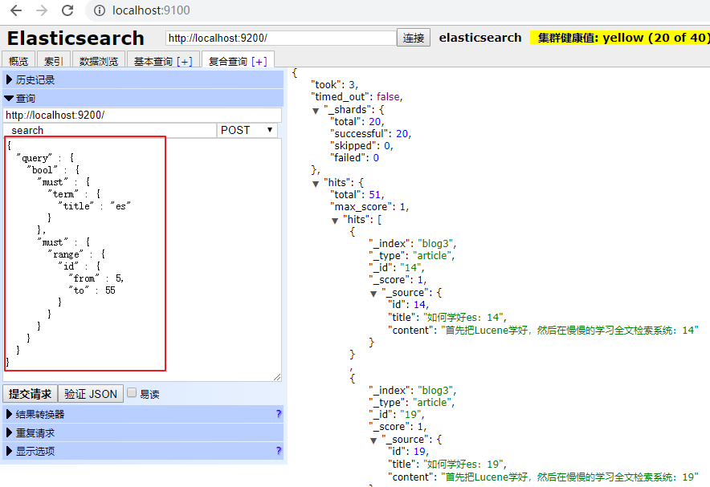

### 1.5.7 分页并排序

在测试类中添加方法：

~~~java
@Test
    public void testSearchByPage() throws Exception{
        // 1、创建客户端并且建立连接
        TransportClient transportClient = new PreBuiltTransportClient(Settings.EMPTY);
        transportClient.addTransportAddress(new InetSocketTransportAddress(InetAddress.getByName("localhost"), 9300));
        // 2、调用查询方法
        SearchResponse response = transportClient.prepareSearch("blog3")
                .setTypes("article")
                .setQuery(QueryBuilders.matchAllQuery())
                .setFrom(0)                          
                .setSize(20)                         // 每页显示的条数
                .addSort("id", SortOrder.DESC)  // 排序规则
                .get();
        // 3、结果集处理
        SearchHits hits = response.getHits();
        long totalHits = hits.totalHits;
        System.out.println("总条数：" + totalHits);
        Iterator<SearchHit> iterator = hits.iterator();
        // 将json对象转成pojo
        ObjectMapper objectMapper = new ObjectMapper();
        List<Article> list = new ArrayList<Article>();
        while (iterator.hasNext()){
            SearchHit hit = iterator.next();
            String result = hit.getSourceAsString();
            Article article = objectMapper.readValue(result, Article.class);
            list.add(article);
//            System.out.println(result);
        }
        for (Article article : list) {
            System.out.println(article);
        }
        // 4、关闭资源
        transportClient.close();
    }
~~~

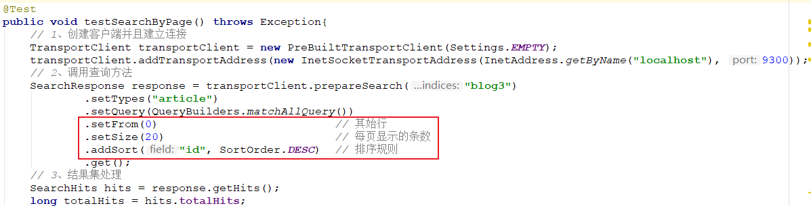

## 1.6 结果高亮显示

### 1.6.1 概念

高亮：在进行关键字搜索时，搜索出的内容中的关键字会显示不同的颜色，称之为高亮。

例如：

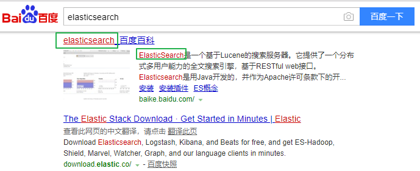

### 1.6.2 代码实现

- 高亮的本质：其始就对检索到的结果集中包含的关键字添加HTML标签，并且通过相关样式进行修饰。

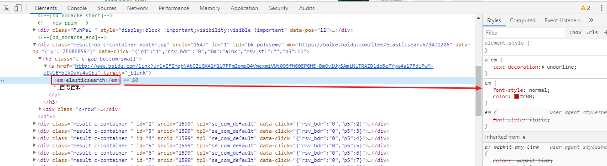

- 代码实现：

~~~java
@Test
    public void testSearchByTermForHighlight() throws Exception{
        // 1、创建客户端并且建立连接
        TransportClient transportClient = new PreBuiltTransportClient(Settings.EMPTY);
        transportClient.addTransportAddress(new InetSocketTransportAddress(InetAddress.getByName("localhost"), 9300));
        // 2、调用查询方法
        SearchRequestBuilder searchRequestBuilder = transportClient.prepareSearch("blog3")
                .setTypes("article")
                .setQuery(QueryBuilders.termQuery("title", "es"));// 根据词条查询

        // 设置高亮
        HighlightBuilder highlightBuilder = new HighlightBuilder();
        highlightBuilder.preTags("");     // 开始标签
        highlightBuilder.postTags("");               // 结束标签
        highlightBuilder.field("title");                    // 对哪个字段中关键字高亮
        searchRequestBuilder.highlighter(highlightBuilder); // 添加高亮条件

        // 3、结果集处理
        SearchResponse response = searchRequestBuilder.get();
        SearchHits hits = response.getHits();
        long totalHits = hits.totalHits;
        System.out.println("总条数：" + totalHits);
        Iterator<SearchHit> iterator = hits.iterator();
        // 将json对象转成pojo
        ObjectMapper objectMapper = new ObjectMapper();
        List<Article> list = new ArrayList<Article>();
        while (iterator.hasNext()){
            SearchHit hit = iterator.next();
            String result = hit.getSourceAsString();
            Article article = objectMapper.readValue(result, Article.class);
            // 处理高亮
            Text[] titles = hit.getHighlightFields().get("title").getFragments();
            if(titles != null && titles.length > 0){
                String hTitle = titles[0].toString();
                // 替换原有数据
                article.setTitle(hTitle);
            }
            list.add(article);
//            System.out.println(result);
        }
        for (Article article : list) {
            System.out.println(article);
        }
        // 4、关闭资源
        transportClient.close();
    }
~~~

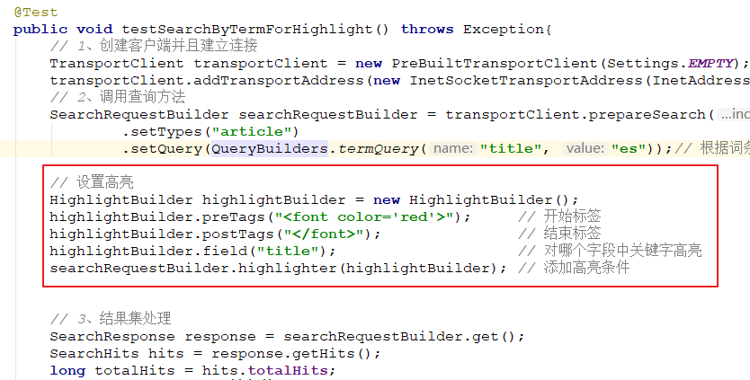

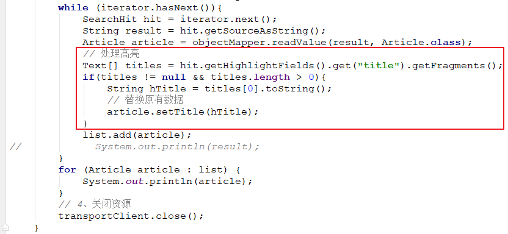

- 效果如下：

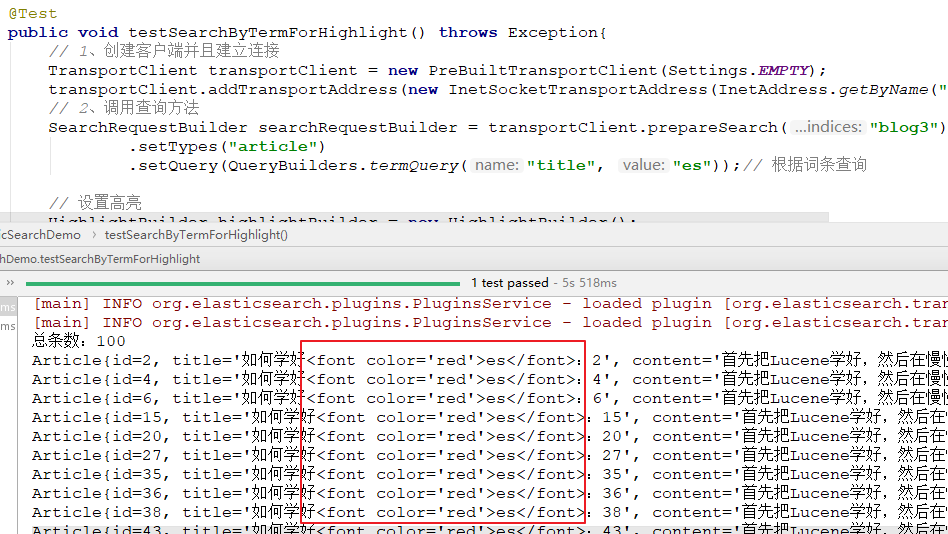

# 2 通过Spring Data对es维护

## 2.1 Spring Data介绍

Spring Data ES：对原生api的封装。  spring data包含的模块：多。

Spring Data是一个用于简化数据库、非关系型数据库、索引库访问，并支持云服务的开源框架。其主要目标是使得对数据的访问变得方便快捷，并支持map-reduce框架和云计算数据服务。 Spring Data可以极大的简化JPA（Elasticsearch…）的写法，可以在几乎不用写实现的情况下，实现对数据的访问和操作。除了CRUD外，还包括如分页、排序等一些常用的功能。 Spring Data常用的功能模块如下： 

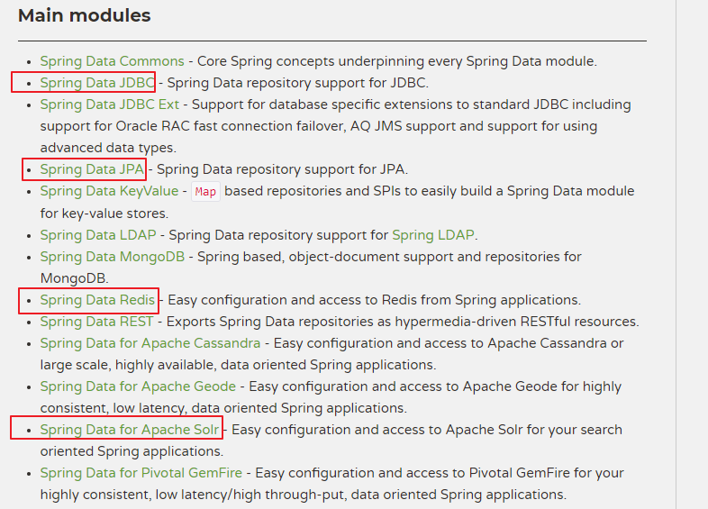

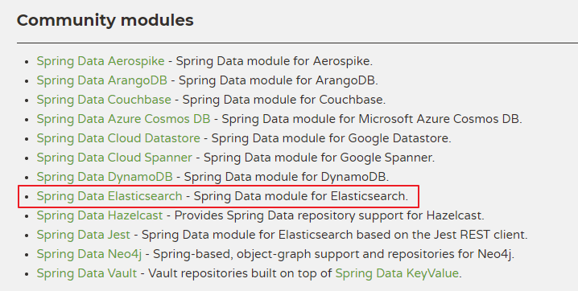

Spring Data ElasticSearch 基于 spring data API 简化 elasticSearch操作，将原始操作elasticSearch的客户端API 进行封装，通过ElasticsearchTemplate操作。Spring Data为Elasticsearch项目提供集成搜索引擎。Spring Data Elasticsearch POJO的关键功能区域为中心的模型与Elastichsearch交互文档和轻松地编写一个存储索引库数据访问层。 

## 2.2 Spring Data Elasticsearch入门

### 2.2.1 工程搭建

- 创建工程：略

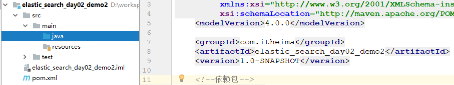

- 添加依赖：

~~~xml
<!--依赖包-->
<dependencies>
    <!--ES依赖包-->
    <dependency>
        <groupId>org.elasticsearch</groupId>
        <artifactId>elasticsearch</artifactId>
        <version>5.6.8</version>
    </dependency>
    <dependency>
        <groupId>org.elasticsearch.client</groupId>
        <artifactId>transport</artifactId>
        <version>5.6.8</version>
    </dependency>

    <!--日志依赖-->
    <dependency>
        <groupId>org.apache.logging.log4j</groupId>
        <artifactId>log4j-to-slf4j</artifactId>
        <version>2.9.1</version>
    </dependency>
    <dependency>
        <groupId>org.slf4j</groupId>
        <artifactId>slf4j-api</artifactId>
        <version>1.7.24</version>
    </dependency>
    <dependency>
        <groupId>org.slf4j</groupId>
        <artifactId>slf4j-simple</artifactId>
        <version>1.7.21</version>
    </dependency>
    <dependency>
        <groupId>log4j</groupId>
        <artifactId>log4j</artifactId>
        <version>1.2.12</version>
    </dependency>

    <!--测试包-->
    <dependency>
        <groupId>junit</groupId>
        <artifactId>junit</artifactId>
        <version>4.12</version>
    </dependency>
    <dependency>
        <groupId>org.springframework</groupId>
        <artifactId>spring-test</artifactId>
        <version>5.0.8.RELEASE</version>
    </dependency>

    <!--springdata-es-->
    <dependency>
        <groupId>org.springframework.data</groupId>
        <artifactId>spring-data-elasticsearch</artifactId>
        <version>3.0.7.RELEASE</version>
    </dependency>
</dependencies>
~~~

### 2.2.2 增加索引数据

#### 2.2.2.1 创建pojo

在工程的src目录下创建Article。

~~~java
@Document(indexName = "blog4", type = "article")
public class Article {

    @Id
    private Integer id;
    @Field(index = true, analyzer = "ik_smart", store = false, searchAnalyzer = "ik_smart", type = FieldType.Text)
    private String title;
    @Field(index = true, analyzer = "ik_smart", store = false, searchAnalyzer = "ik_smart", type = FieldType.Text)
    private String content;
    
    // TODO:setters/getters
}
~~~

PS：注解说明

~~~properties
@Document(indexName=“blob4”,type=“article”)：
indexName：索引的名称（必填项），type：索引的类型

@Id：主键的唯一标识

@Field(index=true,analyzer=“ik_smart”,store=true,searchAnalyzer=“ik_smart”,type =FieldType.Text)
index：是否设置分词
analyzer：存储时使用的分词器
searchAnalyze：搜索时使用的分词器
store：是否存储，默认值是false。如果默认设置为false，Elasticsearch默认使用_source存放我们数据内容。
type: 数据类型
~~~

#### 2.2.2.2 编写dao接口

在工程src目录下，创建ArticleDao接口，与之前学习的JPA一样，需要继承ElasticsearchRepository.

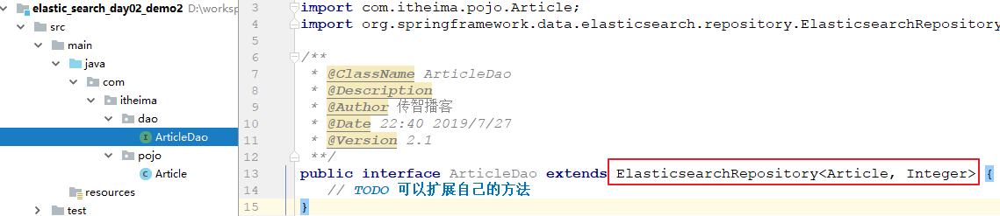

~~~java
public interface ArticleDao extends ElasticsearchRepository<Article, Integer> {
   // TODO 可以扩展自己的方法
}
~~~

#### 2.2.2.3 编写service接口以及实现类

- 编写ArticleService接口

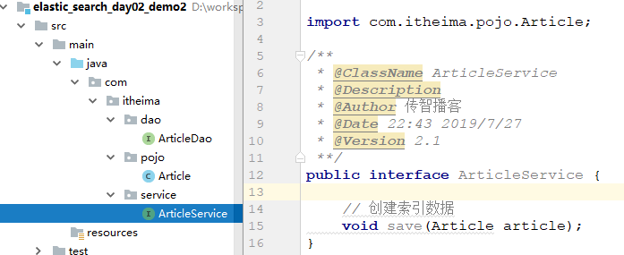

~~~java
public interface ArticleService {

    // 创建索引数据
    void save(Article article);
}
~~~

- 编写ArticleServiceImpl实现类

~~~java
@Service
public class ArticleServiceImpl implements ArticleService {

    @Autowired
    private ArticleDao articleDao;

    // 保存索引数据
    public void save(Article article) {
        articleDao.save(article);
    }
}
~~~

#### 2.2.2.4 编写spring.xml文件

在resources目录下创建spring.xml文件：

~~~xml
<?xml version="1.0" encoding="UTF-8"?>
<beans xmlns="http://www.springframework.org/schema/beans"
       xmlns:xsi="http://www.w3.org/2001/XMLSchema-instance"
       xmlns:context="http://www.springframework.org/schema/context"
       xmlns:elasticsearch="http://www.springframework.org/schema/data/elasticsearch"
       xsi:schemaLocation="
      http://www.springframework.org/schema/beans
      http://www.springframework.org/schema/beans/spring-beans.xsd
      http://www.springframework.org/schema/context
      http://www.springframework.org/schema/context/spring-context.xsd
      http://www.springframework.org/schema/data/elasticsearch
      http://www.springframework.org/schema/data/elasticsearch/spring-elasticsearch-1.0.xsd">

    <!--IoC容器：开启注解扫描-->
    <context:component-scan base-package="com.itheima.service"/>
    <!--扫描dao-->
    <elasticsearch:repositories base-package="com.itheima.dao" />
    <!--配置es客户端并且连接es服务-->
    <elasticsearch:transport-client id="client" cluster-nodes="localhost:9300" cluster-name="elasticsearch" />
    <!--ElasticSearch模版对象（底层使用模板操作，需要用spring创建，并注入client）-->
    <bean id="elasticsearchTemplate" class="org.springframework.data.elasticsearch.core.ElasticsearchTemplate">
        <!--注入client-->
        <constructor-arg name="client" ref="client"/>
    </bean>
</beans>
~~~

#### 2.2.2.5 单元测试

在test目录下创建测试类：

~~~java
@ContextConfiguration(locations = {"classpath:spring.xml"})
@RunWith(SpringJUnit4ClassRunner.class)
public class EsTemplateDemo {

    @Autowired
    private ArticleService articleService;

    @Autowired
    private ElasticsearchTemplate elasticsearchTemplate;

    /**
     * @author 栗子
     * @Description 创建映射
     * @Date 22:56 2019/7/27
     * @param
     * @return void
     **/
    @Test
    public void testCreateMapping(){
        elasticsearchTemplate.createIndex(Article.class);
        elasticsearchTemplate.putMapping(Article.class);
    }

    /**
     * @author 栗子
     * @Description 添加数据
     * @Date 22:58 2019/7/27
     * @param
     * @return void
     **/
    @Test
    public void testSave(){
        Article article = new Article();
        article.setId(1);
        article.setTitle("什么是es");
        article.setContent("Elasticsearch是一个全文检索系统，并且是基于lucene开发");
        articleService.save(article);
    }

}
~~~

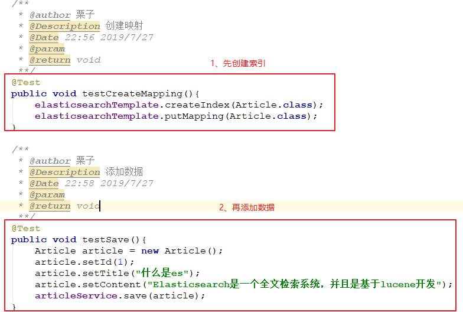

- 创建索引：

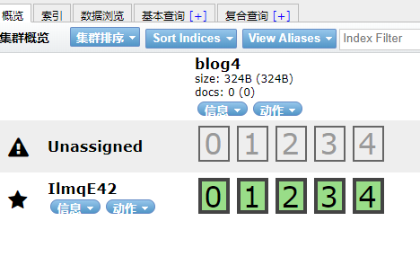

- 添加数据：

## 2.3 对索引数据维护-CRUD

### 2.3.1 编写service接口以及实现类

- 编写service接口：在接口中添加其他方法

~~~java
public interface ArticleService {

    // 创建索引数据
    void save(Article article);

    // 批量保存
    void saveAll(List<Article> articles);

    // 根据id删除：通过pojo封装条件
    void delete(Article article);

    // 根据id删除
    void deleteById(Integer id);

    // 查询所有
    Iterable<Article> findAll();

    // 分页查询
    Page<Article> findAll(Pageable pageable);
}
~~~

- 编写实现类：实现接口中的相关方法

~~~java
@Service
public class ArticleServiceImpl implements ArticleService {

    @Autowired
    private ArticleDao articleDao;

    // 保存索引数据
    public void save(Article article) {
        articleDao.save(article);
    }

    // 批量保存
    public void saveAll(List<Article> articles) {
        articleDao.saveAll(articles);
    }

    // 根据id删除：通过pojo封装条件
    public void delete(Article article) {
        articleDao.delete(article);
    }

    // 根据id删除
    public void deleteById(Integer id) {
        articleDao.deleteById(id);
    }

    // 查询所有
    public Iterable<Article> findAll() {
        return articleDao.findAll();
        // 结果排序
//        return articleDao.findAll(Sort.by(Sort.Direction.ASC, "id"));
    }

    public Page<Article> findAll(Pageable pageable) {
        return articleDao.findAll(pageable);
    }
}
~~~

### 2.3.2 编写单元测试

在测试类中添加相关方法：

~~~java
@ContextConfiguration(locations = {"classpath:spring.xml"})
@RunWith(SpringJUnit4ClassRunner.class)
public class EsTemplateDemo {

    @Autowired
    private ArticleService articleService;

    @Autowired
    private ElasticsearchTemplate elasticsearchTemplate;

    /**
     * @author 栗子
     * @Description 创建映射
     * @Date 22:56 2019/7/27
     * @param
     * @return void
     **/
    @Test
    public void testCreateMapping(){
        elasticsearchTemplate.createIndex(Article.class);
        elasticsearchTemplate.putMapping(Article.class);
    }

    /**
     * @author 栗子
     * @Description 添加数据
     * @Date 22:58 2019/7/27
     * @param
     * @return void
     **/
    @Test
    public void testSave(){
        Article article = new Article();
        article.setId(1);
        article.setTitle("什么是es");
        article.setContent("Elasticsearch是一个全文检索系统，并且是基于lucene开发");
        articleService.save(article);
    }

    // 更新操作
    @Test
    public void testUpdate(){
        Article article = new Article();
        article.setId(1);
        article.setTitle("什么是es" + "更新。。。");
        article.setContent("Elasticsearch是一个全文检索系统，并且是基于lucene开发" + "更新。。。");
        articleService.save(article);
    }

    // 删除操作
    @Test
    public void testDelete(){
        // 根据id删除
//        articleService.deleteById(1);
        // 通过pojo封装删除条件
        Article article = new Article();
        article.setId(1);
        articleService.delete(article);
    }

    // 批量保存
    @Test
    public void testSaveAll(){
        List<Article> articles = new ArrayList<Article>();
        for(int i = 1; i <= 100; i++){
            Article article = new Article();
            article.setId(i);
            article.setTitle("es版本：" + i);
            article.setContent("spring data elasticsearch可以简化原生api操作：" + i);
            articles.add(article);
        }
        articleService.saveAll(articles);
    }

    // 查询所有
    @Test
    public void testFindAll(){
        Iterable<Article> articles = articleService.findAll();
        for (Article article : articles) {
            System.out.println(article);
        }
    }

    // 分页查询
    @Test
    public void testFindPage(){
        // 分页查询，并指定根据哪个字段排序
        Page<Article> page = articleService.findAll(PageRequest.of(0, 10, Sort.Direction.ASC, "id"));
        long totalElements = page.getTotalElements();
        int totalPages = page.getTotalPages();
        System.out.println("总条数：" + totalElements);
        System.out.println("总页数：" + totalPages);
        List<Article> articles = page.getContent();
        for (Article article : articles) {
            System.out.println(article);
        }
    }
}
~~~

## 2.4 常用查询命名规则

| **关键字**    | **命名规则**          | **解释**                   | **示例**              |
| ------------- | --------------------- | -------------------------- | --------------------- |
| and           | findByField1AndField2 | 根据Field1和Field2获得数据 | findByTitleAndContent |
| or            | findByField1OrField2  | 根据Field1或Field2获得数据 | findByTitleOrContent  |
| is            | findByField           | 根据Field获得数据          | findByTitle           |
| not           | findByFieldNot        | 根据Field获得补集数据      | findByTitleNot        |
| between       | findByFieldBetween    | 获得指定范围的数据         | findByPriceBetween    |
| lessThanEqual | findByFieldLessThan   | 获得小于等于指定值的数据   | findByPriceLessThan   |

###  2.4.1 需求

- 根据标题查询
- 根据标题查询并且分页

### 2.4.2 编写dao

在dao中添加方法：

~~~java
public interface ArticleDao extends ElasticsearchRepository<Article, Integer> {

    // 根据标题查询
    List<Article> findByTitle(String title);

    // 根据标题查询并且分页
    Page<Article> findByTitle(String title, Pageable pageable);

    // TODO 可以扩展自己的方法

}
~~~

### 2.4.3 编写service

- service接口：在接口中添加方法

~~~java
// 根据标题查询
List<Article> findByTitle(String title);

// 根据标题查询并且分页
Page<Article> findByTitle(String title, Pageable pageable);
~~~

- service实现类：实现接口中方法

~~~java
// 根据标题查询
public List<Article> findByTitle(String title) {
    return articleDao.findByTitle(title);
}

// 根据标题查询并且分页
public Page<Article> findByTitle(String title, Pageable pageable) {
    return articleDao.findByTitle(title, pageable);
}
~~~

### 2.4.4 单元测试

在测试类中添加方法：

~~~java
// 根据标题查询
@Test
public void testFindTitle(){
    List<Article> list = articleService.findByTitle("版本");
    for (Article article : list) {
        System.out.println(article);
    }
}

// 根据标题查询并且分页
@Test
public void testFindTitleByPage(){
    Page<Article> page = articleService.findByTitle("版本", PageRequest.of(1, 10));
    List<Article> articles = page.getContent();
    for (Article article : articles) {
        System.out.println(article);
    }
}
~~~

# 3 搭建ES集群

## 3.1 集群介绍

- 集群Cluster

  一个集群就是由一个或多个节点组织在一起，它们共同持有整个的数据，并一起提供索引和搜索功能。一个集群由一个唯一的名字标识，这个名字默认就是“elasticsearch”。这个名字是重要的，因为一个节点只能通过指定某个集群的名字，来加入这个集群

- 节点Node 

  一个节点是集群中的一个服务器，作为集群的一部分，它存储数据，参与集群的索引和搜索功能。和集群类似，一个节点也是由一个名字来标识的，默认情况下，这个名字是一个随机的漫威漫画角色的名字，这个名字会在启动的时候赋予节点。这个名字对于管理工作来说挺重要的，因为在这个管理过程中，你会去确定网络中的哪些服务器对应于Elasticsearch集群中的哪些节点。

  一个节点可以通过配置集群名称的方式来加入一个指定的集群。默认情况下，每个节点都会被安排加入到一个叫做“elasticsearch”的集群中，这意味着，如果你在你的网络中启动了若干个节点，并假定它们能够相互发现彼此，它们将会自动地形成并加入到一个叫做“elasticsearch”的集群中。

  在一个集群里，只要你想，可以拥有任意多个节点。而且，如果当前你的网络中没有运行任何Elasticsearch节点，这时启动一个节点，会默认创建并加入一个叫做“elasticsearch”的集群。

- 分片和主从复制 

  一个索引可以存储超出单个结点硬件限制的大量数据。比如，一个具有10亿文档的索引占据1TB的磁盘空间，而任一节点都没有这样大的磁盘空间；或者单个节点处理搜索请求，响应太慢。为了解决这个问题，Elasticsearch提供了将索引划分成多份的能力，这些份就叫做分片。当你创建一个索引的时候，你可以指定你想要的分片的数量。每个分片本身也是一个功能完善并且独立的“索引”，这个“索引”可以被放置到集群中的任何节点上。分片很重要，主要有两方面的原因： 1）允许你水平分割/扩展你的内容容量。 2）允许你在分片（潜在地，位于多个节点上）之上进行分布式的、并行的操作，进而提高性能/吞吐量。

  至于一个分片怎样分布，它的文档怎样聚合回搜索请求，是完全由Elasticsearch管理的，对于作为用户的你来说，这些都是透明的。

  在一个网络/云的环境里，失败随时都可能发生，在某个分片/节点不知怎么的就处于离线状态，或者由于任何原因消失了，这种情况下，有一个故障转移机制是非常有用并且是强烈推荐的。为此目的，Elasticsearch允许你创建分片的一份或多份拷贝，这些拷贝叫做复制分片，或者直接叫复制。

  复制之所以重要，有两个主要原因： 在分片/节点失败的情况下，提供了高可用性。因为这个原因，注意到复制分片从不与原/主要（original/primary）分片置于同一节点上是非常重要的。扩展你的搜索量/吞吐量，因为搜索可以在所有的复制上并行运行。总之，每个索引可以被分成多个分片。一个索引也可以被复制0次（意思是没有复制）或多次。一旦复制了，每个索引就有了主分片（作为复制源的原来的分片）和复制分片（主分片的拷贝）之别。分片和复制的数量可以在索引创建的时候指定。在索引创建之后，你可以在任何时候动态地改变复制的数量，但是你事后不能改变分片的数量。

  默认情况下，Elasticsearch中的每个索引被分片5个主分片和1个复制，这意味着，如果你的集群中至少有两个节点，你的索引将会有5个主分片和另外5个复制分片（1个完全拷贝），这样的话每个索引总共就有10个分片。

## 3.2 集群搭建

### 3.2.1 创建目录

在磁盘的任意盘符下创建es-cluster目录，并且在该目录下创建三个文件夹，分别为node1,node2以及node3，如图所示：

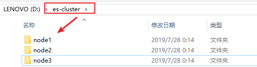

### 3.2.2 复制文件

将安装好的es目录下的相关文件分别复制到node1\node2\node3目录下：

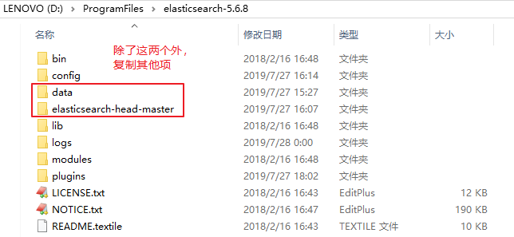

复制后结果如下：

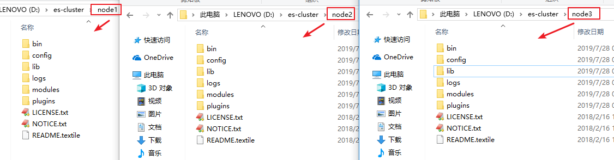

### 3.2.3 修改配置

- 修改node1节点中的`node1\config\elasticsearch.yml`配置文件，添加如下配置： 

  ~~~properties
  #节点1的配置信息：
  #集群名称，保证唯一
  cluster.name: my-elasticsearch
  #节点名称，必须不一样
  node.name: node-1
  #服务端口号，在同一机器下必须不一样
  http.port: 9200
  #集群间通信端口号，在同一机器下必须不一样
  transport.tcp.port: 9300
  #设置集群自动发现机器ip集合
  discovery.zen.ping.unicast.hosts: ["127.0.0.1:9300","127.0.0.1:9301","127.0.0.1:9302"]
  ~~~

  

- 修改node2节点中的`node2\config\elasticsearch.yml`配置文件，添加如下配置： 

  ~~~properties
  #节点2的配置信息：
  #集群名称，保证唯一
  cluster.name: my-elasticsearch
  #节点名称，必须不一样
  node.name: node-2
  #服务端口号，在同一机器下必须不一样
  http.port: 9201
  #集群间通信端口号，在同一机器下必须不一样
  transport.tcp.port: 9301
  #设置集群自动发现机器ip集合
  discovery.zen.ping.unicast.hosts: ["127.0.0.1:9300","127.0.0.1:9301","127.0.0.1:9302"]
  ~~~

  

- 修改node1节点中的`node3\config\elasticsearch.yml`配置文件，添加如下配置： 

  ~~~properties
  #节点3的配置信息：
  #集群名称，保证唯一
  cluster.name: my-elasticsearch
  #节点名称，必须不一样
  node.name: node-3
  #服务端口号，在同一机器下必须不一样
  http.port: 9202
  #集群间通信端口号，在同一机器下必须不一样
  transport.tcp.port: 9302
  #设置集群自动发现机器ip集合
  discovery.zen.ping.unicast.hosts: ["127.0.0.1:9300","127.0.0.1:9301","127.0.0.1:9302"]
  ~~~

  

### 3.2.3 启动服务

依次启动3台es服务。

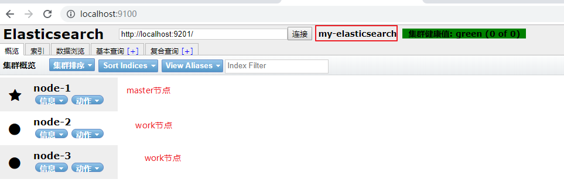

### 3.2.4 坑-无法分配副本

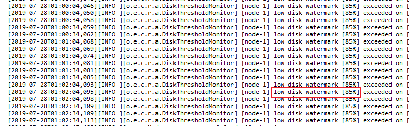

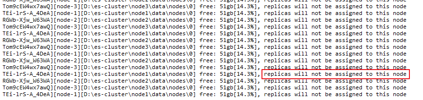

~~~properties
es可以根据磁盘使用情况来决定是否继续分配shard的副本。默认85%：es在磁盘使用率达到85%的时候将会停止分配

默认设置是开启的，也可以通过api关闭，在elasticsearch.yml文件中添加如下配置：
cluster.routing.allocation.disk.threshold_enabled: false

es重要的两个参数：
cluster.routing.allocation.disk.watermark.low：控制磁盘最小使用率。默认85%.说明es在磁盘使用率达到85%的时候将会停止分配新的shard
cluster.routing.allocation.disk.watermark.high：控制磁盘的最大使用率。默认90%.说明在磁盘使用率达到90%的时候es将会relocate shard去其他的节点
~~~

## 3.3 测试

### 3.3.1 通过postman测试

- 创建索引和映射

~~~properties
# url
PUT     http://localhost:9200/blog1

# 请求体
{
    "mappings": {
		"article": {
			"properties": {
				"id": {
					"type": "long",
					"store": true,
					"index":"not_analyzed"
				},
				"title": {
					"type": "text",
					"store": true,
					"index":"analyzed",
					"analyzer":"standard"
				},
				"content": {
					"type": "text",
					"store": true,
					"index":"analyzed",
					"analyzer":"standard"
				}
			}
		}
	}
}

~~~

- 效果

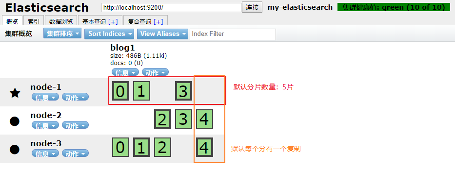

- 添加文档

~~~properties
# url
POST    localhost:9200/blog1/article/1

# 请求体
{
	"id":1,
	"title":"ElasticSearch是一个基于Lucene的搜索服务器",
	"content":"它提供了一个分布式多用户能力的全文搜索引擎，基于RESTfulweb接口。Elasticsearch是用Java开发的，并作为Apache许可条款下的开放源码发布，是当前流行的企业级搜索引擎。设计用于云计算中，能够时搜索，稳定，可靠，快速，安装使用方便。"
}

~~~

- 效果

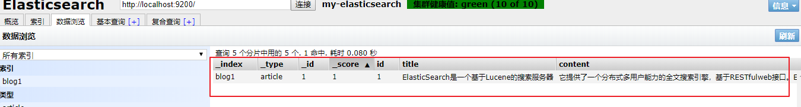

### 3.3.2 通过java代码测试

- 创建索引和映射	

~~~java
@Test
    public void test1() throws Exception{

        Map<String, String> map = new HashMap();
        map.put("cluster.name", "my-elasticsearch");
        Settings settings = Settings.builder().put(map).build();
        // 创建Client并且建立连接
        TransportClient client = new PreBuiltTransportClient(settings);
//        client.addTransportAddress(new InetSocketTransportAddress(InetAddress.getByName("127.0.0.1"), 9300));
        InetSocketTransportAddress address1 = new InetSocketTransportAddress(InetAddress.getByName("127.0.0.1"), 9300);
        InetSocketTransportAddress address2 = new InetSocketTransportAddress(InetAddress.getByName("127.0.0.1"), 9301);
        InetSocketTransportAddress address3 = new InetSocketTransportAddress(InetAddress.getByName("127.0.0.1"), 9302);
        client.addTransportAddresses(address1, address2, address3);
        // 创建名称为blog2的索引
        client.admin().indices().prepareCreate("blog2").get();
        XContentBuilder builder = XContentFactory.jsonBuilder()
                .startObject()
                .startObject("article")
                .startObject("properties")
                .startObject("id")
                .field("type","long")
                .endObject()
                .startObject("title")
                .field("type","string")
                .field("store","true")
                .field("analyzer","ik_smart")
                .endObject()
                .startObject("content")
                .field("type","string")
                .field("store","true")
                .field("analyzer","ik_smart")
                .endObject()
                .endObject()
                .endObject()
                .endObject();
        // 创建映射
        PutMappingRequest mapping = Requests.putMappingRequest("blog2").type("article").source(builder);
        client.admin().indices().putMapping(mapping).get();
        //释放资源
        client.close();
    }
~~~

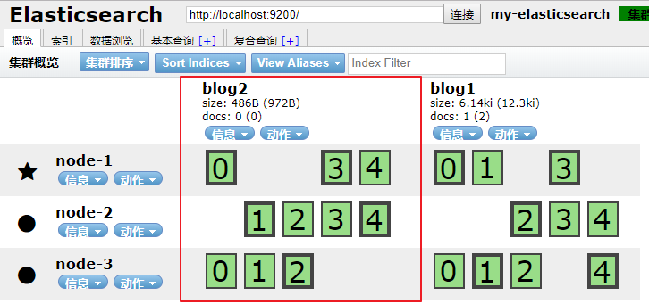

- 添加文档

~~~java
// 创建文档
    @Test
    public void testCreateDoc() throws Exception {
        Map<String, String> map = new HashMap();
        map.put("cluster.name", "my-elasticsearch");
        Settings settings = Settings.builder().put(map).build();
        // 创建客户端访问对象
        TransportClient client = new PreBuiltTransportClient(settings);
        InetSocketTransportAddress address1 = new InetSocketTransportAddress(InetAddress.getByName("127.0.0.1"), 9300);
        InetSocketTransportAddress address2 = new InetSocketTransportAddress(InetAddress.getByName("127.0.0.1"), 9301);
        InetSocketTransportAddress address3 = new InetSocketTransportAddress(InetAddress.getByName("127.0.0.1"), 9302);
        client.addTransportAddresses(address1, address2, address3);
        // 创建文档
        XContentBuilder builder = XContentFactory.jsonBuilder()
                .startObject()
                .field("id",1)
                .field("title","es是什么")
                .field("content","它是基于Lucene的实现的搜索服务器")
                .endObject();

        // 添加文档到指定索引库
        client.prepareIndex("blog2","article","1").setSource(builder).get();
        // 关闭资源
        client.close();
    }
~~~

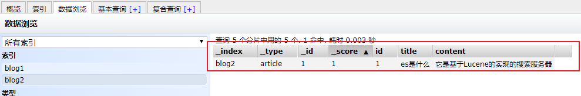

## 3.4 SpringDataElasticsearch配置

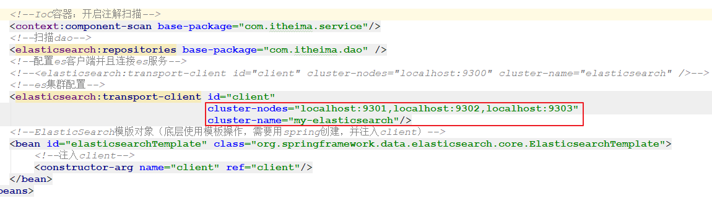

~~~xml
<?xml version="1.0" encoding="UTF-8"?>
<beans xmlns="http://www.springframework.org/schema/beans"
       xmlns:xsi="http://www.w3.org/2001/XMLSchema-instance"
       xmlns:context="http://www.springframework.org/schema/context"
       xmlns:elasticsearch="http://www.springframework.org/schema/data/elasticsearch"
       xsi:schemaLocation="
      http://www.springframework.org/schema/beans
      http://www.springframework.org/schema/beans/spring-beans.xsd
      http://www.springframework.org/schema/context
      http://www.springframework.org/schema/context/spring-context.xsd
      http://www.springframework.org/schema/data/elasticsearch
      http://www.springframework.org/schema/data/elasticsearch/spring-elasticsearch-1.0.xsd
      ">

    <!--包扫描-->
    <context:component-scan base-package="com.itheima.service" />

    <!--扫描Dao包，自动创建实例，扫描所有继承ElasticsearchRepository接口的接口-->
    <elasticsearch:repositories base-package="com.itheima.es.dao"/>

    <!--配置elasticSearch的连接对象Client-->
    <elasticsearch:transport-client id="client" cluster-nodes="localhost:9301,localhost:9302,localhost:9303" cluster-name="my-elasticsearch"/>

    <!--ElasticSearch模版对象（底层使用模板操作，需要用spring创建，并注入client）-->
    <bean id="elasticsearchTemplate" class="org.springframework.data.elasticsearch.core.ElasticsearchTemplate">
        <constructor-arg name="client" ref="client"></constructor-arg>
    </bean>
</beans>
~~~

