# Lucene入门

每日反馈：

1、ServerWebExchange

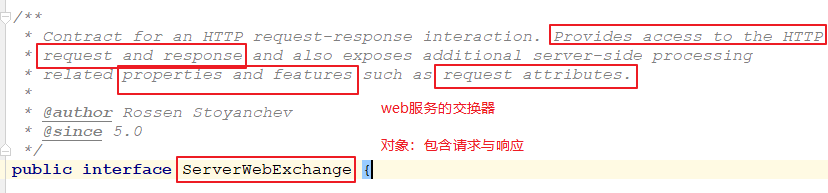

- 对象干嘛的：**包含了请求与响应**

2、shortcutFieldOrder：定义局部过滤器使用了该方法        多个局部过滤器执行的顺序

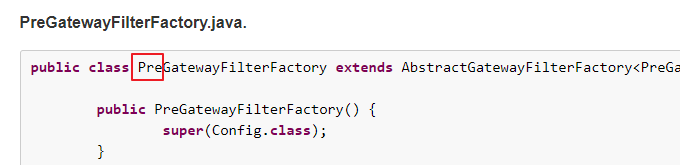

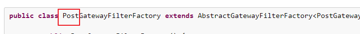

- springmvc的拦截器：实现HandlerInterceptor接口

  - preHandler 
  - postHandler
  - afterCompletation

- 指定局部过滤器的执行顺序：两种实现方式：

  - 了解：指定order（程序写：有点复杂）
  - 最直接：在application.yml中配置多个过滤器（谁配置在前谁先执行）

  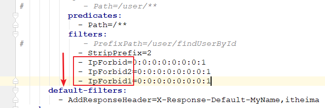

  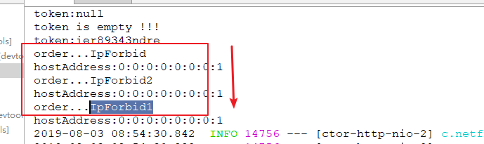

- shortcutFieldOrder：

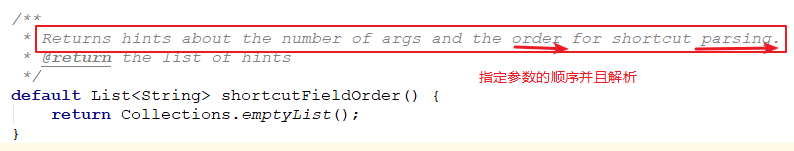

3、微服务的架构在企业是否都在用  

-  工作：你问问同学、朋友    ssm框架
  - 用不上。  用：springboot（构建一切）
- 会微服务的优先的：创业型的互联网公司、大厂、小公司（技术实力）
- 学习内容：完成      再去找工作   15k（高工：15-30）    


回顾：画图   

1、远程调用：feign       更加优美

- 集成：负载均衡、熔断器
- 优美：符合程序员的开发的逻辑

2、网关：Gateway

- 路由
- 断言
- 过滤器

3、配置中心：config

- 统一管理

4、消息总线：bus

- 刷新配置文件


课程计划：索引库（数据：CRUD）

- 倒排索引讲解  【了解】
- Lucene入门案例   【编写】
- 分词器讲解  
- IK分词器集成    【学会应用】
- 域(表的字段、JavaBean的属性)的讲解
- 索引维护操作(类似数据库，存储的是数据【索引数据】)    【编写】

# 第1章 Lucene介绍

## 1.1 为什么要学Lucene

学lucene目的：为了es打基础。

- 实现商城里面的商品搜索功能，可以根据商品标题模糊查询商品。


- 原来的方式实现搜索功能，我们的搜索流程如下图：满足业务需求（无法满足）

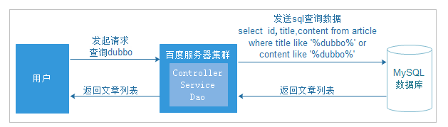


上图就是原始搜索引擎技术，如果用户比较少而且数据库的数据量比较小，那么这种方式实现搜索功能在企业中是比较常见的。但是数据量过多时，数据库的压力就会变得很大，查询速度会变得非常慢。我们需要使用更好的解决方案来分担数据库的压力。

现在的方案（使用Lucene），如下图    无法满足：不能排名、无法对检索的关键字高亮显示。

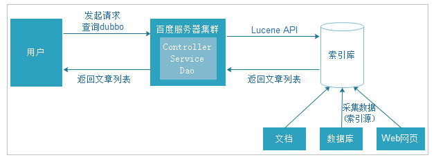

为了解决数据库压力和速度的问题，我们的数据库换成了索引库，使用Lucene的API的来操作服务器上的索引库。

使用索引库专门实现查询功能，而且完全和数据库进行了隔离。


## 1.2 数据查询方法

### 1.2.1 顺序扫描法

所谓顺序扫描，例如要找内容包含一个字符串的文件，就是一个文档一个文档的看，对于每一个文档，从头看到尾，如果此文档包含此字符串，则此文档为我们要找的文件，接着看下一个文件，直到扫描完所有的文件。这种方法是顺序扫描方法，数据量大就搜索慢。

### 1.2.2 倒排索引

先举一个栗子： 

例如我们使用新华字典查询汉字，新华字典有偏旁部首的目录（索引），我们查字首先查这个目录，找到这个目录中对应的偏旁部首，就可以通过这个目录中的偏旁部首找到这个字所在的位置（文档）。

倒排索引：

将数据加入到索引库（你可以理解成另外一个数据库）时，会先提取数据中的词汇（分词），将词汇加入到文档域，文档域中记录了词汇以及词汇在哪条数据记录中出现过的数据下标。用户在搜索数据时，先将用户搜索的数据进行词汇提取，然后把对应词汇拿到索引域中进行匹配查找，查找后会找到对应的下标ID，再根据对应下标ID到文档域中找真实数据。

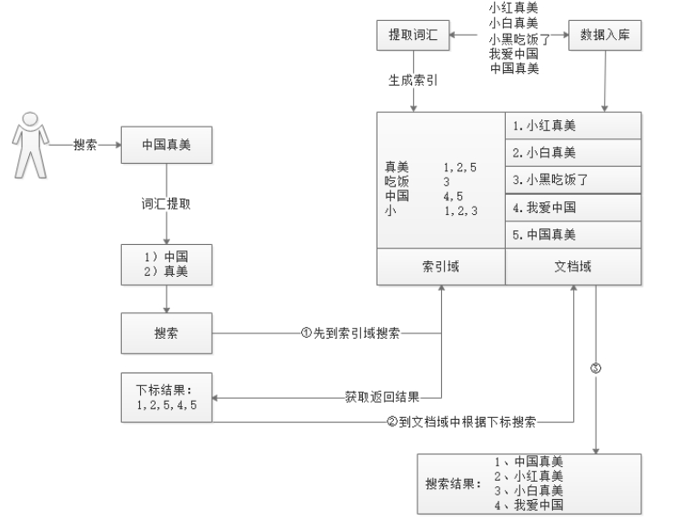

倒排索引相关术语：

- **文档**（Document）：一般搜索引擎处理的对象是互联网网页，对于搜索引擎来讲，Word、PDF、html、XML等不同格式的文件都可以称为文档，一般以文档来表示文本信息。 
- **文档集合**（Document Collection）：由若干文档构成的集合成为文档集合。比如海量的互联网网页等。 
- **文档编号**（Document ID）：在搜索引擎内部，会为文档集合每个文档赋予一个唯一的内部编号，以作为文档的唯一标识，以便于处理 
- **单词编号**（Word ID）：与文档编号类似，搜索引擎内部以唯一的编号来表示某个单词，以作为某个单词的唯一表示 
- **单词词典**（Lexicon）：搜索引擎通常的索引单位是单词，单词词典是由文档集合中出现过的所有单词构成的字符串集合，单词词典内每条索引记载单词本身的一些信息及指向倒排列表的指针。单词也就是我们在搜索时的一些关键字，也称为词条。
- **倒排列表**（PostingList）：倒排列表记载了出现过某个单词的所有文档的文档列表及单词在该文当中出现的位置信息，每条记录成为一个倒排向（Posting）。根据倒排列表，即可获知哪些文档包含某个单词。 
- **倒排文件**（Inverted File）：所有单词的倒排列表往往顺序地存储在磁盘的某个文件里，这个文件即为倒排文件，倒排文件是存储倒排索引的物理文件

原始数据--->创建倒排索引：

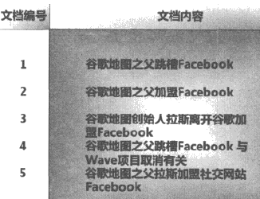

#### 1.2.2.1 基本倒排索引

- 第1列单词ID即为每个单词的编号。   
- 第2列即为对应的单词。   
- 第3列即为每个单词对应的倒排列表。（比如单词“拉斯”，单词编号为8，倒排序表为｛3，5｝，说明文档集合中文档3和文档5包含这个单词。） 


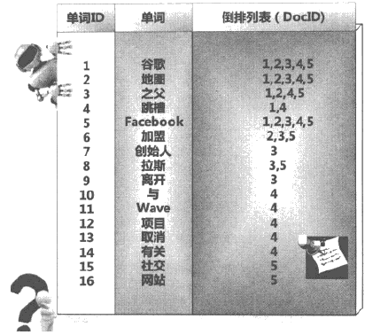

#### 1.2.2.2 复杂倒排索引

- 就编号8—拉斯—｛（3：1）；（5，1）｝来说，（3，1）表示“拉斯”在文档3中出现一次，（5，1）表示“拉斯”在文档5中出现1次。 

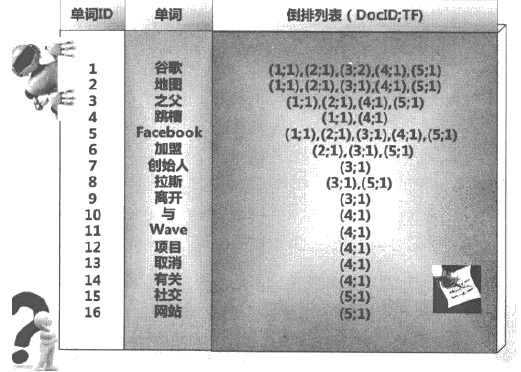


#### 1.2.2.3 完整倒排索引

就编号8—拉斯—2—｛（3;1;<4>），（5;1;<4>）｝来说，文档频率2表示在两个文档出现。“<4>”表示单词出现的位置是文档中的第4个单词。   这个倒排索引基本上是一个完备的索引系统了，实际搜索系统的索引结构基本如此。

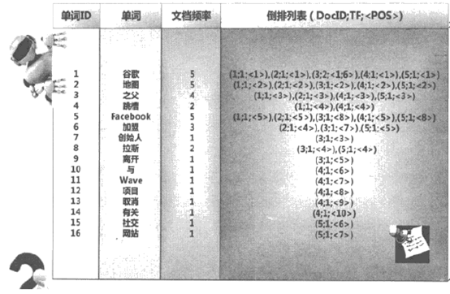

### 1.2.3 搜索技术应用场景

应用场景 ：

​	1、 单机软件的搜索（word中的搜索）

​	2、 站内搜索 （baidu贴吧、论坛、 京东、 taobao）

​	3、 **垂直领域（13年：只做某个方向业务）**的搜索 （拉勾网等） 

​	4、 专业搜索引擎公司 （google-  技术理论   05大数据 论文、baidu）   BAT     TMD 

​	- 雅虎北研    人才。


## 1.3 Lucene介绍

Lucene：   Apache：     孵化器      项目捐赠          完善。

1、Lucene只是一个全文检索的**工具包**（jar包），它不是一个全文检索系统。

2、可以通过Lucene开发一个全文检索系统，例如：开源solr/**Elasticsearch**


### 1.3.1 什么是全文索引

计算机索引程序通过扫描文章中的每一个词，对每一个词建立一个索引，指明该词在文章中出现的次数和位置，当用户查询时，检索程序就根据事先建立的索引进行查找，并将查找的结果反馈给用户的检索方式。


### 1.3.2 什么是Lucene

Lucene是apache软件基金会4 jakarta项目组的一个子项目，是一个开放源代码的全文检索引擎**工具包**，但它不是一个完整的全文检索引擎，而是一个全文检索引擎的架构，提供了完整的查询引擎和索引引擎，部分文本分析引擎。

+ Lucene是一套用于全文检索和搜寻的开源程式库，由Apache软件基金会支持和提供。
	 Lucene提供了一个简单却强大的应用程式接口，能够做全文索引和搜寻，	在Java开发环境里Lucene是一个成熟的免费开放源代码工具。
+ Lucene并不是现成的搜索引擎产品，但可以用来制作搜索引擎产品。


### 1.3.3 Lucene与搜索引擎的区别

全文检索系统是按照全文检索理论建立起来的用于提供全文检索服务的软件系统，包括建立索引、处理查询返回结果集、增加索引、优化索引结构等功能。例如：百度搜索、eclipse帮助搜索、淘宝网商品搜索等。

搜索引擎是全文检索技术最主要的一个应用，例如百度。搜索引擎起源于传统的信息全文检索理论，即计算机程序通过扫描每一篇文章中的每一个词，建立以词为单位的倒排文件，检索程序根据检索词在每一篇文章中出现的频率和每一个检索词在一篇文章中出现的概率，对包含这些检索词的文章进行排序，最后输出排序的结果。全文检索技术是搜索引擎的核心支撑技术。

Lucene和搜索引擎不同，Lucene是一套用java或其它语言写的全文检索的工具包，为应用程序提供了很多个api接口去调用，可以简单理解为是一套实现全文检索的类库，搜索引擎是一个全文检索系统，它是一个单独运行的软件系统


### 1.3.4 Lucene官网介绍

官网： http://lucene.apache.org/

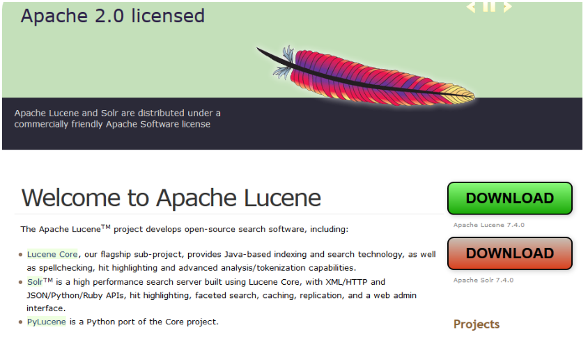


#第2章 Lucene入门

实现这么一个案例，通过Java代码调用Lucene API实现对索引库的增删改查，索引库数据来源于数据库，所以增加操作需要先从数据库将数据查询出来，再调用Lucene API将数据加入到索引库中。

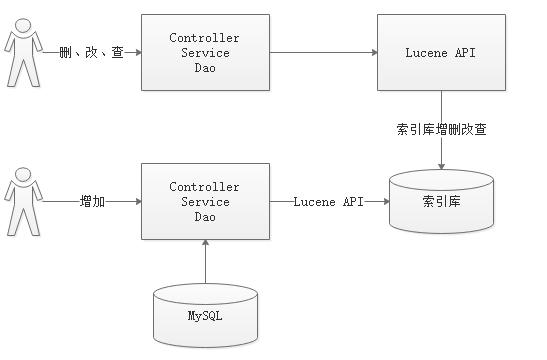


## 2.1 Lucene准备

Lucene可以在官网上下载。课程已经准备好了Lucene的文件，我们使用的是lucene-5.3.1版本。

解压后如下图：

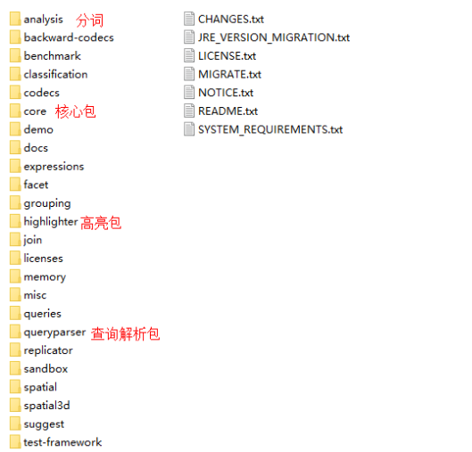


本教程使用的数据是MySQL数据库的数据，所以还需要MySQL的连接包，学员编写的时候，也可以直接复制准备好的jar包。当然我们案例中将不使用拷贝jar包的方式，我们使用maven导入依赖。

##2.2 创建索引

环境准备：

+ JDK：1.8	（Lucene5.3.1以上，必须使用JDK1.8及以上版本）
+ IDE：IDEA
	 数据库：	MySQL5.7
+ 数据库脚本位置如下图：

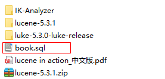

数据库数据如下：

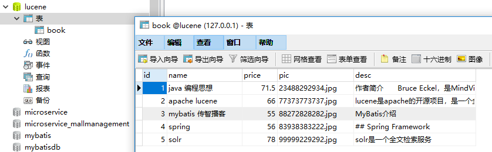


###2.2.1 pom.xml

创建案例工程lucene-01，导入所需jar包的依赖

```xml
<?xml version="1.0" encoding="UTF-8"?>
<project xmlns="http://maven.apache.org/POM/4.0.0"
         xmlns:xsi="http://www.w3.org/2001/XMLSchema-instance"
         xsi:schemaLocation="http://maven.apache.org/POM/4.0.0 http://maven.apache.org/xsd/maven-4.0.0.xsd">
    <modelVersion>4.0.0</modelVersion>

    <groupId>com.itheima</groupId>
    <artifactId>lucene-01</artifactId>
    <version>1.0-SNAPSHOT</version>

    <!--打jar包-->
    <packaging>jar</packaging>

    <!--依赖包-->
    <dependencies>
        <!--核心包-->
        <dependency>
            <groupId>org.apache.lucene</groupId>
            <artifactId>lucene-core</artifactId>
            <version>5.3.1</version>
        </dependency>
        <!--一般分词器，适用于英文分词-->
        <dependency>
            <groupId>org.apache.lucene</groupId>
            <artifactId>lucene-analyzers-common</artifactId>
            <version>5.3.1</version>
        </dependency>
        <!--中文分词器-->
        <dependency>
            <groupId>org.apache.lucene</groupId>
            <artifactId>lucene-analyzers-smartcn</artifactId>
            <version>5.3.1</version>
        </dependency>

        <!--对分词索引查询解析-->
        <dependency>
            <groupId>org.apache.lucene</groupId>
            <artifactId>lucene-queryparser</artifactId>
            <version>5.3.1</version>
        </dependency>
        <!--检索关键字高亮显示-->
        <dependency>
            <groupId>org.apache.lucene</groupId>
            <artifactId>lucene-highlighter</artifactId>
            <version>5.3.1</version>
        </dependency>

        <!-- MySql -->
        <dependency>
            <groupId>mysql</groupId>
            <artifactId>mysql-connector-java</artifactId>
            <version>5.1.32</version>
        </dependency>

        <!-- Test dependencies -->
        <dependency>
            <groupId>junit</groupId>
            <artifactId>junit</artifactId>
            <version>4.12</version>
            <scope>test</scope>
        </dependency>
    </dependencies>
</project>
```


### 2.2.2 创建索引

创建索引分为如下8个步骤：

1. 采集数据


2. 创建Document文档对象


3. 创建分析器（分词器）


4. 创建IndexWriterConfig配置信息类


5. 创建Directory对象，声明索引库存储位置


6. 创建IndexWriter写入对象


7. 把Document写入到索引库中


8. 释放资源


###2.2.3 创建Pojo

采集数据是指获取需要的数据，然后将这些数据加入到索引库中，我们采集的数据是从MySQL数据库中采集。

创建Book对象

```java
public class Book {
    
    private Integer id;     // 图书ID
    private String name;    // 图书名称
    private Float price;    // 图书价格
    private String pic;     // 图书图片
    private String desc;    // 图书描述

    //get...set...
}
```


### 2.2.4 创建Dao接口和实现类

BookDao接口

```java
public interface BookDao {

    List<Book> findAll();
}
```

BookDaoImpl实现类

```java
public class BookDaoImpl implements BookDao {

    @Override
    public List<Book> findAll() {
        // 数据库链接
        Connection connection = null;
        // 预编译statement
        PreparedStatement preparedStatement = null;
        // 结果集
        ResultSet resultSet = null;
        // 图书列表
        List<Book> list = new ArrayList<Book>();
        try {
            Class.forName("com.mysql.jdbc.Driver");
            connection = DriverManager.getConnection("jdbc:mysql://localhost:3306/lucene?characterEncoding=UTF-8", "root", "root");
            preparedStatement = connection.prepareStatement("SELECT * FROM book");
            resultSet = preparedStatement.executeQuery();
            while (resultSet.next()){
                // 封装数据
                Book book = new Book();
                book.setId(resultSet.getInt("id"));
                book.setName(resultSet.getString("name"));
                book.setPic(resultSet.getString("pic"));
                book.setPrice(resultSet.getFloat("price"));
                book.setDesc(resultSet.getString("desc"));
                list.add(book);
            }
        }catch (Exception e){
            e.printStackTrace();
        }
        return list;
    }
}
```


### 2.2.5 创建索引

1. 采集数据

2. 创建Document文档对象


3. 创建分析器（分词器）


4. 创建IndexWriterConfig配置信息类


5. 创建Directory对象，声明索引库存储位置


6. 创建IndexWriter写入对象


7. 把Document写入到索引库中


8. 释放资源

按照上面的流程实现创建索引，代码如下：

```java
@Test
    public void createIndex() throws IOException {
        List<Book> list = bookDao.findAll();
        // 创建文档集documents
        List<Document> docs = new ArrayList<Document>();
        for (Book book : list) {
            Document document = new Document();
            // 为document添加域
            document.add(new StringField("id", book.getId()+"", Field.Store.YES));
            document.add(new TextField("name", book.getName(), Field.Store.YES));
            document.add(new StringField("price", book.getPrice()+"", Field.Store.YES));
            document.add(new TextField("pic", book.getPic(), Field.Store.YES));
            document.add(new TextField("desc", book.getDesc(), Field.Store.YES));
            docs.add(document);
        }
        // 创建建立索引对象IndexWriter：arg0,索引存储的位置  arg1,创建索引的配置信息
        Path path = new File("d:\\index").toPath();
        Directory directory = FSDirectory.open(path);
        Analyzer analyzer = new StandardAnalyzer(); // 分词器
        IndexWriterConfig indexWriterConfig = new IndexWriterConfig(analyzer);
        IndexWriter indexWriter = new IndexWriter(directory, indexWriterConfig);

        // 将文档添加到索引库中
        indexWriter.addDocuments(docs);
        // 关闭资源
//        indexWriter.commit();
        indexWriter.close(); // close已包含commit
    }
```

执行运行，查看D:/index目录

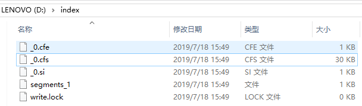


## 2.3 使用Luke查看索引

Luke作为Lucene工具包中的一个工具（http://www.getopt.org/luke/），可以通过界面来进行索引文件的查询、修改.luke所在位置如下图：打开luke-5.3.0-luke-release，双击luke.bat即可运行luke

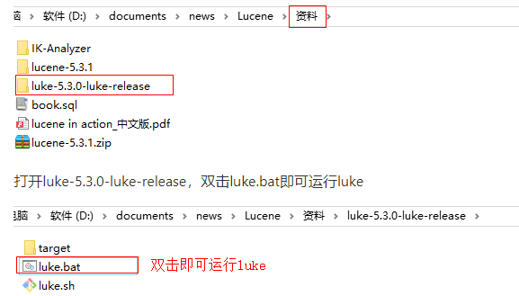


## 2.4 基于索引库检索

Lucene可以通过query对象输入查询语句。同数据库的sql一样，lucene也有固定的查询语法：最基本的有比如：AND, OR, NOT 等（必须大写）

 举个栗子:用户想找一个desc中包括java关键字和lucene关键字的文档。它对应的查询语句：desc:java AND lucene

### 2.4.1 索引搜索实现

1. 创建Query搜索对象
2. 创建Directory流对象,声明索引库位置
3. 创建索引读取对象IndexReader


4. 创建索引搜索对象IndexSearcher


5. 使用索引搜索对象，执行搜索，返回结果集TopDocs
6. 解析结果集
7. 释放资源


实现代码：

```java
@Test
public void testQueryIndex() throws Exception {
    String text = "spring";
    // 创建封装检索条件的query对象：arg0,指定根据哪个字段检索 arg1,指定分词器
    Analyzer analyzer = new StandardAnalyzer();
    QueryParser queryParser = new QueryParser("name", analyzer);
    Query query = queryParser.parse(text);
    // 创建检索对象IndexSearcher
    Path path = new File("d:\\index").toPath();
    Directory directory = FSDirectory.open(path);
    IndexReader indexReader = DirectoryReader.open(directory);
    IndexSearcher indexSearcher = new IndexSearcher(indexReader);
    // 调用方法
    TopDocs topDocs = indexSearcher.search(query, Integer.MAX_VALUE);
    // 结果集处理
    int total = topDocs.totalHits;
    System.out.println("查询的结果条数大约为：" + total);
    ScoreDoc[] scoreDocs = topDocs.scoreDocs;
    for (ScoreDoc scoreDoc : scoreDocs) {
        float score = scoreDoc.score;
        System.out.println("得分：" + score);
        int docID = scoreDoc.doc;   // 文档id
        Document doc = indexSearcher.doc(docID);
        System.out.println("id:" + doc.get("id"));
        System.out.println("name:" + doc.get("name"));
        System.out.println("price:" + doc.get("price"));
        System.out.println("pic:" + doc.get("pic"));
        System.out.println("desc:" + doc.get("desc"));
    }
    // 释放资源
    indexReader.close();
}
```


### 2.4.2 搜索方法

IndexSearcher搜索方法如下：

| 方法                                                | 说明                                                         |
| :-------------------------------------------------- | :----------------------------------------------------------- |
| indexSearcher.search(query, n)                      | 根据Query搜索，返回评分最高的n条记录                         |
| indexSearcher.search(query, filter, n)              | 根据Query搜索，添加过滤策略，返回评分最高的n条记录           |
| indexSearcher.search(query, n, sort)                | 根据Query搜索，添加排序策略，返回评分最高的n条记录           |
| indexSearcher.search(booleanQuery, filter, n, sort) | 根据Query搜索，添加过滤策略，添加排序策略，返回评分最高的n条记 |


# 第3章 分词器

## 3.1 分词理解

在对Docuemnt中的内容进行索引之前，需要使用分词器进行分词 ，分词的目的是为了搜索。分词的主要过程就是先分词后过滤。

-  分词：采集到的数据会存储到document对象的Field域中，分词就是将Document中Field的value值切分成一个一个的词。
- 过滤：包括去除标点符号过滤、去除停用词过滤（的、是、a、an、the等）、大写转小写、词的形还原（复数形式转成单数形参、过去式转成现在式。。。）等。 

什么是停用词？停用词是为节省存储空间和提高搜索效率，搜索引擎在索引页面或处理搜索请求时会自动忽略某些字或词，这些字或词即被称为Stop Words(停用词)。比如语气助词、副词、介词、连接词等，通常自身并无明确的意义，只有将其放入一个完整的句子中才有一定作用，如常见的“的”、“在”、“是”、“啊”等。

对于分词来说，不同的语言，分词规则不同。Lucene作为一个工具包提供不同国家的分词器，本例子使用StandardAnalyzer，它可以对用英文进行分词。

如下是org.apache.lucene.analysis.standard.standardAnalyzer的部分源码：

```java
@Override
protected TokenStreamComponents createComponents(final String fieldName) {
  final Tokenizer src;
  if (getVersion().onOrAfter(Version.LUCENE_4_7_0)) {
    //创建分词[带有Tokenizer一般都表示创建分词器]
    StandardTokenizer t = new StandardTokenizer();
    t.setMaxTokenLength(maxTokenLength);
    src = t;
  } else {
    //创建分词[带有Tokenizer一般都表示创建分词器]
    StandardTokenizer40 t = new StandardTokenizer40();
    t.setMaxTokenLength(maxTokenLength);
    src = t;
  }
  //创建过滤,带有Filter一般表示过滤s
  TokenStream tok = new StandardFilter(src);
  //大小写过滤
  tok = new LowerCaseFilter(tok);
  //停用词汇过滤
  tok = new StopFilter(tok, stopwords);
  return new TokenStreamComponents(src, tok) {
    @Override
    protected void setReader(final Reader reader) throws IOException {
      int m = StandardAnalyzer.this.maxTokenLength;
      if (src instanceof StandardTokenizer) {
        ((StandardTokenizer)src).setMaxTokenLength(m);
      } else {
        ((StandardTokenizer40)src).setMaxTokenLength(m);
      }
      super.setReader(reader);
    }
  };
}
```


如下图是语汇单元的生成过程：

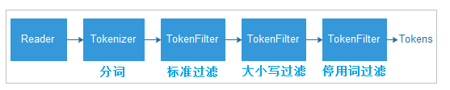


## 3.2 分词器的使用时机

### 3.2.1 索引时使用Analyzer

输入关键字进行搜索，当需要让该关键字与文档域内容所包含的词进行匹配时需要对文档域内容进行分析，需要经过Analyzer分析器处理生成语汇单元（Token）。分析器分析的对象是文档中的Field域。当Field的属性tokenized（是否分词）为true时会对Field值进行分析，如下图：

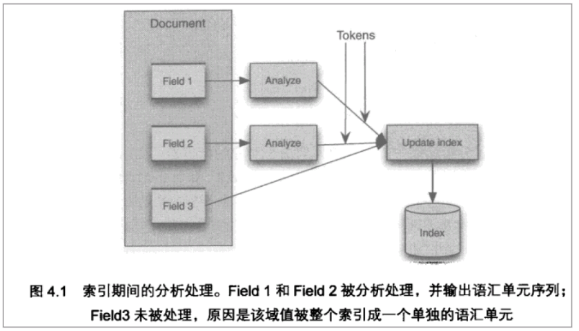

对于一些Field可以不用分析：

- 不作为查询条件的内容，比如文件路径
- 不是匹配内容中的词而匹配Field的整体内容，比如订单号、身份证号等。


### 3.2.2 搜索时使用Analyzer

对搜索关键字进行分析和索引分析一样，使用Analyzer对搜索关键字进行分析、分词处理，使用分析后每个词语进行搜索。比如：搜索关键字：spring web ，经过分析器进行分词，得出：spring  web拿词去索引词典表查找 ，找到索引链接到Document，解析Document内容。

对于匹配整体Field域的查询可以0在搜索时不分析，比如根据订单号、身份证号查询等。

**注意：搜索使用的分析器要和索引使用的分析器一致**

## 3.3 中文分词器

### 3.3.1 什么是中文分词器

学过英文的都知道，英文是以单词为单位的，单词与单词之间以空格或者逗号句号隔开。所以对于英文，我们可以简单以空格判断某个字符串是否为一个单词，比如I love China，love 和 China很容易被程序区分开来。

 而中文则以字为单位，字又组成词，字和词再组成句子。中文“我爱中国”就不一样了，电脑不知道“中国”是一个词语还是“爱中”是一个词语。

 把中文的句子切分成有意义的词，就是中文分词，也称切词。我爱中国，分词的结果是：我、爱、中国。


### 3.3.2 Lucene自带中文分词器

- StandardAnalyzer:

单字分词：就是按照中文一个字一个字地进行分词。如：“我爱中国”，效果：“我”、“爱”、“中”、“国”。

- CJKAnalyzer

二分法分词：按两个字进行切分。如：“我是中国人”，效果：“我是”、“是中”、“中国”“国人”。

- SmartChineseAnalyzer

对中文支持较好，但扩展性差，扩展词库，禁用词库和同义词库等不好处理。


### 3.3.3 第三方中文分词器

- paoding

庖丁解牛最新版在 <https://code.google.com/p/paoding/> 中最多支持Lucene 3.0，且最新提交的代码在 2008-06-03，在svn中最新也是2010年提交，已经过时，不予考虑。

- mmseg4j

最新版已从 https://code.google.com/p/mmseg4j/ 移至 https://github.com/chenlb/mmseg4j-solr，支持Lucene 4.10，且在github中最新提交代码是2014年6月，从09年～14年一共有：18个版本，也就是一年几乎有3个大小版本，有较大的活跃度，用了mmseg算法。

- **IK-analyzer**

最新版在https://code.google.com/p/ik-analyzer/上，支持Lucene 4.10从2006年12月推出1.0版开始， IKAnalyzer已经推出了4个大版本。最初，它是以开源项目Luence为应用主体的，结合词典分词和文法分析算法的中文分词组件。从3.0版本开 始，IK发展为面向Java的公用分词组件，独立于Lucene项目，同时提供了对Lucene的默认优化实现。在2012版本中，IK实现了简单的分词 歧义排除算法，标志着IK分词器从单纯的词典分词向模拟语义分词衍化。 但是也就是**2012年12月后没有在更新（新词：网络）**。


## 3.4 使用中文分词器IKAnalyzer

IKAnalyzer继承Lucene的Analyzer抽象类，使用IKAnalyzer和Lucene自带的分析器方法一样，将Analyzer测试代码改为IKAnalyzer测试中文分词效果。

 如果使用中文分词器ik-analyzer，就需要在索引和搜索程序中使用一致的分词器：IK-analyzer。

### 3.4.1 安装使用IK分词器

将2个jar包添加到工程中，然后将其他3个配置文件放置到工程的classpath目录即可，但我们这里将使用maven工程，所以可以将包安装到本地。

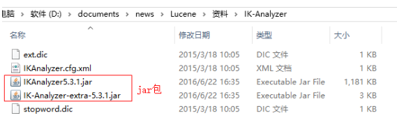

先将上面2个jar包拷贝到D盘根目录，然后按照如下方式安装:

```css
mvn install:install-file -Dfile=D:\IKAnalyzer5.3.1.jar -DgroupId=org.wltea.ik-analyzer -DartifactId=ik-analyzer -Dversion=5.3.1.RELEASE -Dpackaging=jar

mvn install:install-file -Dfile=D:\IK-Analyzer-extra-5.3.1.jar -DgroupId=org.wltea.ik-analyzer -DartifactId=ik-analyzer-extra -Dversion=5.3.1.RELEASE -Dpackaging=jar
```

在pom.xml中引入依赖:

```xml
<!--IK分词器-->
<dependency>
    <groupId>org.wltea.ik-analyzer</groupId>
    <artifactId>ik-analyzer</artifactId>
    <version>5.3.1.RELEASE</version>
</dependency>

<dependency>
    <groupId>org.wltea.ik-analyzer</groupId>
    <artifactId>ik-analyzer-extra</artifactId>
    <version>5.3.1.RELEASE</version>
</dependency>
```

导入配置文件，分别将ext.dic,IKAnalyzer.cfg.xml，stopword.dic文件拷贝到工程的resources目录。

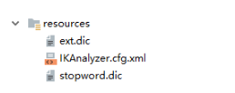


IK分词器安装好了，前面的案例想使用IK分词器只需要将StandardAnalyzer改成IKAnalyzer即可。

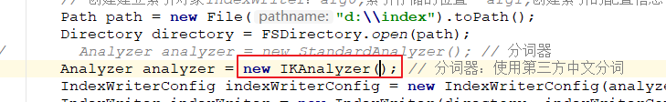

改造前：

```java
Analyzer analyzer = new StandardAnalyzer();
```

改造后：

```java
Analyzer analyzer = new IKAnalyzer();
```


### 3.4.2 扩展中文词库

如果想配置扩展词和停用词，就创建扩展词的文件和停用词的文件。

注意：不要用window自带的记事本保存扩展词文件和停用词文件，那样的话，格式中是含有bom的。

编辑上面拷贝的文件ext.dic文件，可以在里面添加一些相关的词汇，例如：传智播客

使用luke工具可以明显看到传智播客已经成为了一个关键词

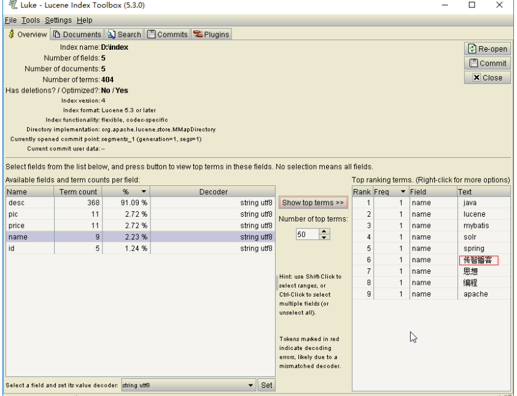


### 3.4.3 停用词库

stopword.dic是存放停用词的地方,比如可以讲MyBatis作为停用词，只需要在stopword.dic后面追加一个mybatis即可。mybatis增加停用词库后发现再也搜不到mybatis了。

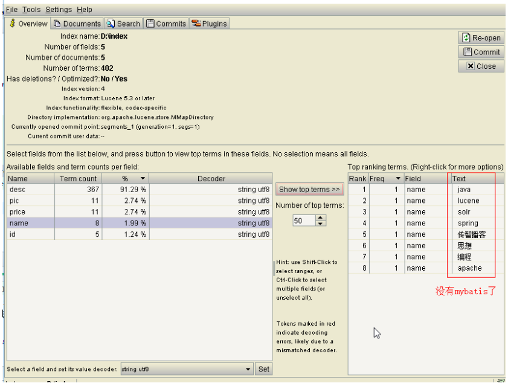


# 第4章 Field域

## 4.1 Field属性

Field是文档中的域，包括Field名和Field值两部分，一个文档可以包括多个Field，Document只是Field的一个承载体，Field值即为要索引的内容，也是要搜索的内容。

- 是否分词(tokenized)

是：作分词处理，即将Field值进行分词，分词的目的是为了索引。

比如：商品名称、商品描述等，这些内容用户要输入关键字搜索，由于搜索的内容格式大、内容多需要分词后将语汇单元建立索引

 否：不作分词处理

比如：商品id、订单号、身份证号等 


- 是否索引(indexed)

是：进行索引。将Field分词后的词或整个Field值进行索引，存储到索引域，索引的目的是为了搜索。

比如：商品名称、商品描述分析后进行索引，订单号、身份证号不用分词但也要索引，这些将来都要作为查询条件。

否：不索引。
比如：图片路径、文件路径等，不用作为查询条件的不用索引。


- 是否存储(stored)

是：将Field值存储在文档域中，存储在文档域中的Field才可以从Document中获取。

比如：商品名称、订单号，凡是将来要从Document中获取的Field都要存储。

否：不存储Field值
比如：商品描述，内容较大不用存储。如果要向用户展示商品描述可以从系统的关系数据库中获取。


## 4.2 Field常用类型

下边列出了开发中常用 的Filed类型，注意Field的属性，根据需求选择：

|                           Field类                            |        数据类型        | Analyzed是否分词 | Indexed是否索引 | Stored是否存储 | 说明                                                         |
| :----------------------------------------------------------: | :--------------------: | :--------------: | :-------------: | :------------: | :----------------------------------------------------------- |
|        StringField(FieldName, FieldValue,Store.YES))         |         字符串         |        N         |        Y        |      Y或N      | 这个Field用来构建一个字符串Field，但是不会进行分词，会将整个串存储在索引中，比如(订单号,身份证号等)是否存储在文档中用Store.YES或Store.NO决定 |
|          LongField(FieldName, FieldValue,Store.YES)          |         Long型         |        Y         |        Y        |      Y或N      | 这个Field用来构建一个Long数字型Field，进行分词和索引，比如(价格)是否存储在文档中用Store.YES或Store.NO决定 |
|              StoredField(FieldName, FieldValue)              | 重载方法，支持多种类型 |        N         |        N        |       Y        | 这个Field用来构建不同类型Field不分析，不索引，但要Field存储在文档中 |
| TextField(FieldName, FieldValue, Store.NO)或TextField(FieldName, reader) |       字符串或流       |        Y         |        Y        |      Y或N      | 如果是一个Reader, lucene猜测内容比较多,会采用Unstored的策略. |

## 4.3 Field修改

### 4.3.1 修改分析

图书id：

是否分词：不用分词，因为不会根据商品id来搜索商品 

是否索引：不索引，因为不需要根据图书ID进行搜索

是否存储：要存储，因为查询结果页面需要使用id这个值。

 

图书名称：

是否分词：要分词，因为要根据图书名称的关键词搜索。

是否索引：要索引。

是否存储：要存储。

 

图书价格：

是否分词：要分词，lucene对数字型的值只要有搜索需求的都要分词和索引，因为lucene对数字型的内容要特殊分词处理，需要分词和索引。

是否索引：要索引

是否存储：要存储

 

图书图片地址：

是否分词：不分词

是否索引：不索引

是否存储：要存储


图书描述：

是否分词：要分词

是否索引：要索引

是否存储：因为图书描述内容量大，不在查询结果页面直接显示，不存储。


不存储是不在lucene的索引域中记录，节省lucene的索引文件空间。

如果要在详情页面显示描述，解决方案：

从lucene中取出图书的id，根据图书的id查询关系数据库（MySQL）中book表得到描述信息。


### 4.3.2 代码修改

```java
//创建文档对象
Document doc = new Document();
//不分词，不索引，储存
//doc.add(new TextField("id",book.getId()+"", Field.Store.YES));
doc.add(new StoredField("id",book.getId()+""));

// 图书名称
// 分词，索引，储存
//doc.add(new TextField("name",book.getName(), Field.Store.YES));
doc.add(new TextField("name", book.getName().toString(), Field.Store.YES));

// 图书价格
// 分词，索引，储存
//doc.add(new TextField("price",book.getPic()+"", Field.Store.YES));
doc.add(new FloatField("price", book.getPrice(), Field.Store.YES));

// 图书图片地址
// 不分词，不索引，储存
//doc.add(new TextField("pic",book.getPic(), Field.Store.YES));
doc.add(new StoredField("pic", book.getPic().toString()));

// 图书描述
// 分词，索引，不储存
//doc.add(new TextField("desc",book.getDesc(), Field.Store.YES));
doc.add(new TextField("desc", book.getDesc().toString(), Field.Store.NO));
docs.add(doc);
```


#第5章 索引维护 

## 5.1 删除索引

### 5.1.1 删除指定索引

根据Term项删除索引，满足条件的将全部删除。

```java
@Test
public void testDeleteIndex() throws IOException {
    // 创建写入对象
    Analyzer analyzer = new IKAnalyzer();
    Directory directory = FSDirectory.open(new File("d:/index").toPath());
    IndexWriterConfig config = new IndexWriterConfig(analyzer);
    IndexWriter indexWriter = new IndexWriter(directory, config);

    // 调用方法
    indexWriter.deleteDocuments(new Term("name", "mybatis"));
    // 关闭资源
    indexWriter.close();
}
```

效果如下图：索引域没有变化,文档域数据被删除掉。

- 删除前：

  - 索引文件：

    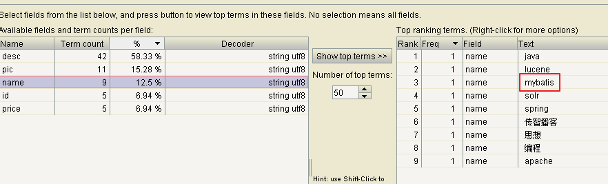

  - 数据文件：

    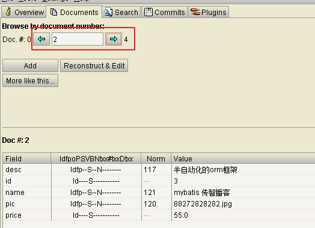

- 删除后：

  - 索引文件：

    

  - 数据文件：

    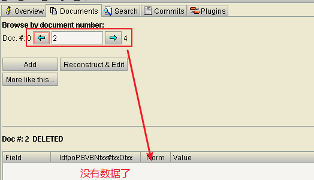


### 5.1.2 删除全部索引（慎用）

将索引目录的索引信息全部删除，直接彻底删除，无法恢复。 

建议参照关系数据库基于主键删除方式，所以在创建索引时需要创建一个主键Field，删除时根据此主键Field删除。

索引删除后将放在Lucene的回收站中，Lucene3.X版本可以恢复删除的文档，3.X之后无法恢复。

代码：

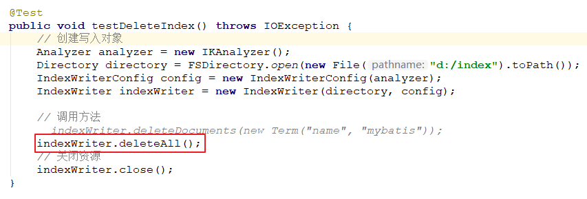

```java
@Test
public void testDeleteIndex() throws IOException {
    // 创建写入对象
    Analyzer analyzer = new IKAnalyzer();
    Directory directory = FSDirectory.open(new File("d:/index").toPath());
    IndexWriterConfig config = new IndexWriterConfig(analyzer);
    IndexWriter indexWriter = new IndexWriter(directory, config);

    // 调用方法
    // indexWriter.deleteDocuments(new Term("name", "mybatis"));
    indexWriter.deleteAll();
    // 关闭资源
    indexWriter.close();
}
```

索引域数据清空，文档域数据也清空。


## 5.2 更新索引

更新索引是先删除再添加，建议对更新需求采用此方法并且要保证对已存在的索引执行更新，可以先查询出来，确定更新记录存在执行更新操作。 

如果更新索引的目标文档对象不存在，则执行添加。

代码

```java
@Test
public void testUpdateIndex() throws IOException {
    // 创建写入对象
    Analyzer analyzer = new IKAnalyzer();
    Directory directory = FSDirectory.open(new File("d:/index").toPath());
    IndexWriterConfig config = new IndexWriterConfig(analyzer);
    IndexWriter indexWriter = new IndexWriter(directory, config);

    // 调用方法
    Document doc = new Document();
    doc.add(new StringField("id", "1", Field.Store.YES));
    doc.add(new TextField("name", "java核心思想", Field.Store.YES));
    Term term = new Term("name", "java");
    // 执行更新，会把所有符合条件的Document删除，再新增。
    indexWriter.updateDocument(term, doc);
    // 关闭资源
    indexWriter.close();
}
```

