# 一、Nacos

## Nacos官网

[https://nacos.io/zh-cn/index.html](https://nacos.io/zh-cn/index.html)

## 什么是 Nacos

### 概览

欢迎来到 Nacos 的世界！

Nacos 致力于帮助您**发现、配置和管理微服务**。Nacos 提供了一组简单易用的特性集，帮助您快速实现动态服务发现、服务配置、服务元数据及流量管理。

Nacos 帮助您更敏捷和容易地构建、交付和管理微服务平台。 Nacos 是构建以“服务”为中心的现代应用架构 (例如微服务范式、云原生范式) 的服务基础设施。

### 什么是 Nacos？

服务（Service）是 Nacos 世界的一等公民。Nacos 支持几乎所有主流类型的“服务”的发现、配置和管理：

[Kubernetes Service](https://kubernetes.io/docs/concepts/services-networking/service/)

[gRPC](https://grpc.io/docs/guides/concepts.html#service-definition) & [Dubbo RPC Service](https://dubbo.incubator.apache.org/)

[Spring Cloud RESTful Service](https://spring.io/projects/spring-restdocs)

Nacos 的关键特性包括:

-  **服务发现和服务健康监测**
Nacos 支持基于 DNS 和基于 RPC 的服务发现。服务提供者使用 [原生SDK](https://nacos.io/zh-cn/docs/sdk.html)、[OpenAPI](https://nacos.io/zh-cn/docs/open-api.html)、或一个[独立的Agent TODO](https://nacos.io/zh-cn/docs/other-language.html)注册 Service 后，服务消费者可以使用[DNS TODO](https://nacos.io/zh-cn/docs/xx) 或[HTTP&API](https://nacos.io/zh-cn/docs/open-api.html)查找和发现服务。
Nacos 提供对服务的实时的健康检查，阻止向不健康的主机或服务实例发送请求。Nacos 支持传输层 (PING 或 TCP)和应用层 (如 HTTP、MySQL、用户自定义）的健康检查。 对于复杂的云环境和网络拓扑环境中（如 VPC、边缘网络等）服务的健康检查，Nacos 提供了 agent 上报模式和服务端主动检测2种健康检查模式。Nacos 还提供了统一的健康检查仪表盘，帮助您根据健康状态管理服务的可用性及流量。 
-  **动态配置服务**
动态配置服务可以让您以中心化、外部化和动态化的方式管理所有环境的应用配置和服务配置。
动态配置消除了配置变更时重新部署应用和服务的需要，让配置管理变得更加高效和敏捷。
配置中心化管理让实现无状态服务变得更简单，让服务按需弹性扩展变得更容易。
Nacos 提供了一个简洁易用的UI ([控制台样例 Demo](http://console.nacos.io/nacos/index.html)) 帮助您管理所有的服务和应用的配置。Nacos 还提供包括配置版本跟踪、金丝雀发布、一键回滚配置以及客户端配置更新状态跟踪在内的一系列开箱即用的配置管理特性，帮助您更安全地在生产环境中管理配置变更和降低配置变更带来的风险。 
-  **动态 DNS 服务**
动态 DNS 服务支持权重路由，让您更容易地实现中间层负载均衡、更灵活的路由策略、流量控制以及数据中心内网的简单DNS解析服务。动态DNS服务还能让您更容易地实现以 DNS 协议为基础的服务发现，以帮助您消除耦合到厂商私有服务发现 API 上的风险。
Nacos 提供了一些简单的 [DNS APIs TODO](https://nacos.io/zh-cn/docs/xx) 帮助您管理服务的关联域名和可用的 IP:PORT 列表. 
-  **服务及其元数据管理**
Nacos 能让您从微服务平台建设的视角管理数据中心的所有服务及元数据，包括管理服务的描述、生命周期、服务的静态依赖分析、服务的健康状态、服务的流量管理、路由及安全策略、服务的 SLA 以及最首要的 metrics 统计数据。 
-  [更多的特性列表 ...](https://nacos.io/zh-cn/docs/roadmap.html) 

### Nacos 地图

一图看懂 Nacos，下面架构部分会详细介绍。


- 特性大图：要从功能特性，非功能特性，全面介绍我们要解的问题域的特性诉求
- 架构大图：通过清晰架构，让您快速进入 Nacos 世界
- 业务大图：利用当前特性可以支持的业务场景，及其最佳实践
- 生态大图：系统梳理 Nacos 和主流技术生态的关系
- 优势大图：展示 Nacos 核心竞争力
- 战略大图：要从战略到战术层面讲 Nacos 的宏观优势

### Nacos 生态图


如 Nacos 全景图所示，Nacos 无缝支持一些主流的开源生态，例如

- [Spring Cloud](https://nacos.io/en-us/docs/quick-start-spring-cloud.html)
- [Apache Dubbo and Dubbo Mesh](https://nacos.io/zh-cn/docs/use-nacos-with-dubbo.html)
- [Kubernetes and CNCF](https://nacos.io/zh-cn/docs/use-nacos-with-kubernetes.html)。

使用 Nacos 简化服务发现、配置管理、服务治理及管理的解决方案，让微服务的发现、管理、共享、组合更加容易。

关于如何在这些生态中使用 Nacos，请参考以下文档：

[Nacos与Spring Cloud一起使用](https://nacos.io/zh-cn/docs/use-nacos-with-springcloud.html)

[Nacos与Kubernetes一起使用](https://nacos.io/zh-cn/docs/use-nacos-with-kubernetes.html)

[Nacos与Dubbo一起使用](https://nacos.io/zh-cn/docs/use-nacos-with-dubbo.html)

[Nacos与gRPC一起使用](https://nacos.io/zh-cn/docs/roadmap.html)

[Nacos与Istio一起使用](https://nacos.io/zh-cn/docs/use-nacos-with-istio.html)

# 二、**Nacos -** 配置管理

**教学目标**

1）能够说出配置中心的概念以及使用场景

2）了解主流配置中心

3）理解Nacos的功能特性

4）掌握Nacos的快速入门方法

5）掌握Nacos安装方式

6）理解Nacos配置管理的核心概念及数据模型

7）掌握使用Nacos控制台进行配置管理的操作方法

8）掌握Nacos分布式系统应用的方法

9）掌握Nacos集群部署方式

## **1.** 什么是配置中心

### **1.1** 什么是配置

应用程序在启动和运行的时候往往需要读取一些配置信息，配置基本上伴随着应用程序的整个生命周期，比如：数 据库连接参数、启动参数等。

配置主要有以下几个特点：

-  配置是独立于程序的只读变量 
   - 配置对于程序是只读的，程序通过读取配置来改变自己的行为，但是程序不应该去改变配置
-  配置伴随应用的整个生命周期 
   - 配置贯穿于应用的整个生命周期，应用在启动时通过读取配置来初始化，在运行时根据配置调整行为。 比如：启动时需要读取服务的端口号、系统在运行过程中需要读取定时策略执行定时任务等。
-  配置可以有多种加载方式 
   - 常见的有程序内部hard code，配置文件，环境变量，启动参数，基于数据库等
-  配置需要治理 
   - 同一份程序在不同的环境（开发，测试，生产）、不同的集群（如不同的数据中心）经常需要有不同的 配置，所以需要有完善的环境、集群配置管理

### **1.2** 什么是配置中心

在微服务架构中，当系统从一个单体应用，被拆分成分布式系统上一个个服务节点后，配置文件也必须跟着迁移（分割），这样配置就分散了，不仅如此，分散中还包含着冗余，如下图：

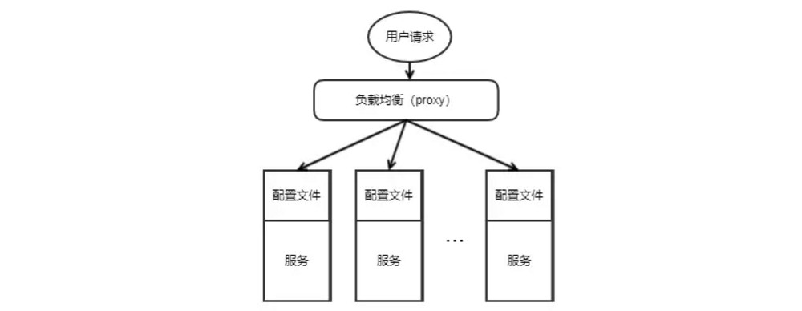
下图显示了配置中心的功能，配置中心将配置从各应用中剥离出来，对配置进行统一管理，应用自身不需要自己去 管理配置。

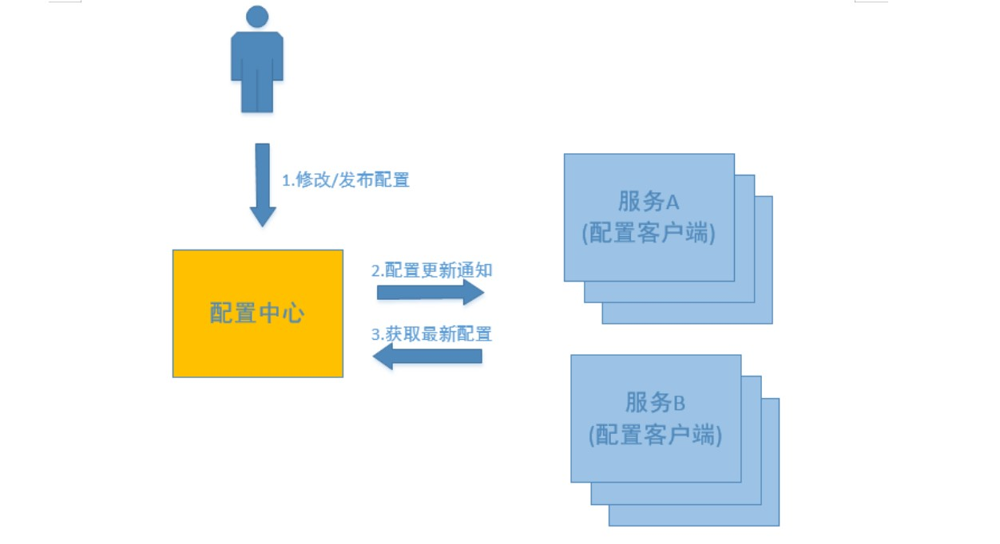

配置中心的服务流程如下：

1、用户在配置中心更新配置信息。

2、服务A和服务B及时得到配置更新通知，从配置中心获取配置。

**总得来说，配置中心就是一种统一管理各种应用配置的基础服务组件。**

在系统架构中，配置中心是整个微服务基础架构体系中的一个组件，如下图，它的功能看上去并不起眼，无非就是 配置的管理和存取，但它是整个微服务架构中不可或缺的一环。

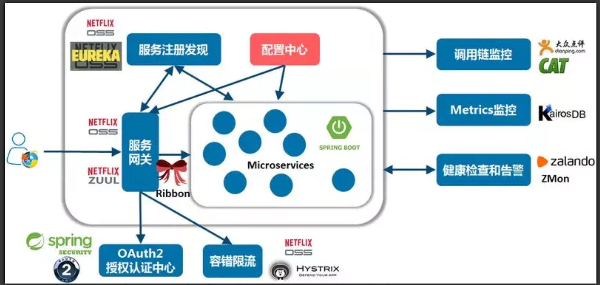

总结一下，在传统巨型单体应用纷纷转向细粒度微服务架构的历史进程中，配置中心是微服务化不可缺少的一个系 统组件，在这种背景下中心化的配置服务即配置中心应运而生，一个合格的配置中心需要满足如下特性：

- 配置项容易读取和修改
- 分布式环境下应用配置的可管理性，即提供远程管理配置的能力
- 支持对配置的修改的检视以把控风险
- 可以查看配置修改的历史记录
- 不同部署环境下应用配置的隔离性

## 2. **Nacos**简介

### **2.1** 主流配置中心对比

目前市面上用的比较多的配置中心有：Spring Cloud Config、Apollo、Nacos和Disconf等。 由于Disconf不再维护，下面主要对比一下Spring Cloud Config、Apollo和Nacos。

| 对比项目 | Spring Cloud Config | Apollo | Nacos |
| --- | --- | --- | --- |
| 配置实时推送 | 支持(Spring Cloud Bus) | 支持(HTTP长轮询1s内) | 支持(HTTP长轮询1s内) |
| 版本管理 | 支持(Git) | 支持 | 支持 |
| 配置回滚 | 支持(Git) | 支持 | 支持 |
| 灰度发布 | 支持 | 支持 | 不支持 |
| 权限管理 | 支持(依赖Git) | 支持 | 不支持 |
| 多集群 | 支持 | 支持 | 支持 |
| 多环境 | 支持 | 支持 | 支持 |
| 监听查询 | 支持 | 支持 | 支持 |
| 多语言 | 只支持Java | 主流语言，提供了Open API | 主流语言，提供了Open API |
| 配置格式校验 | 不支持 | 支持 | 支持 |
| 单机读(QPS) | 7(限流所致) | 9000 | 15000 |
| 单击写(QPS) | 5(限流所致) | 1100 | 1800 |
| 3节点读 (QPS) | 21(限流所致) | 27000 | 45000 |
| 3节点写 (QPS) | 5(限流所致) | 3300 | 5600 |


从配置中心角度来看，性能方面Nacos的读写性能最高，Apollo次之，Spring Cloud Config依赖Git场景不适合开 放的大规模自动化运维API。功能方面Apollo最为完善，nacos具有Apollo大部分配置管理功能，而Spring Cloud Config不带运维管理界面，需要自行开发。Nacos的一大优势是整合了注册中心、配置中心功能，部署和操作相比 Apollo都要直观简单，因此它简化了架构复杂度，并减轻运维及部署工作。

综合来看，Nacos的特点和优势还是比较明显的，下面我们一起进入Nacos的世界。

### 2.2 Nacos简介


Nacos是阿里的一个开源产品，它是针对微服务架构中的服务发现、配置管理、服务治理的综合型解决方案。 官方介绍是这样的：

> Nacos 致力于帮助您发现、配置和管理微服务。Nacos 提供了一组简单易用的特性集，帮助您实现动态服务 发现、服务配置管理、服务及流量管理。 Nacos 帮助您更敏捷和容易地构建、交付和管理微服务平台。 Nacos 是构建以"服务"为中心的现代应用架构的服务基础设施。


官网地址：[https://nacos.io/zh-cn/](https://nacos.io/zh-cn/)

### 2.3 Nacos特性

Nacos主要提供以下四大功能：

1. **服务发现与服务健康检查**

	Nacos使服务更容易注册，并通过DNS或HTTP接口发现其他服务，Nacos还提供服务的实时健康检查，以防止向不健康的主机或服务实例发送请求。

2. **动态配置管理**

	动态配置服务允许您在所有环境中以集中和动态的方式管理所有服务的配置。Nacos消除了在更新配置时重新 部署应用程序，这使配置的更改更加高效和灵活。

3. **动态DNS服务**

	Nacos提供基于DNS 协议的服务发现能力，旨在支持异构语言的服务发现，支持将注册在Nacos上的服务以 域名的方式暴露端点，让三方应用方便的查阅及发现。

4. **服务和元数据管理**

	Nacos 能让您从微服务平台建设的视角管理数据中心的所有服务及元数据，包括管理服务的描述、生命周 期、服务的静态依赖分析、服务的健康状态、服务的流量管理、路由及安全策略。

这里动态配置管理的特性说明了Naocs的配置管理能力。

## 3. **Nacos**快速入门

### **3.1** 安装**Nacos Server**

#### **3.1.1** 预备环境准备

Nacos 依赖 Java环境来运行。如果您是从代码开始构建并运行Nacos，还需要为此配置 Maven环境，请确保是在 以下版本环境中安装使用:

1. 64 bit OS，支持 Linux/Unix/Mac/Windows，推荐选用 Linux/Unix/Mac。
2. 64 bit JDK 1.8+；
3. Maven 3.2.x+；

#### **3.1.2 下载源码或者安装包**

你可以通过源码和发行包两种方式来获取 Nacos。

##### **从 Github 上下载源码方式**

```
git clone https://github.com/alibaba/nacos.git
cd nacos/
mvn ‐Prelease‐nacos clean install ‐U
ls ‐al distribution/target/
// change the $version to your actual path
cd distribution/target/nacos‐server‐$version/nacos/bin
```

##### 下载编译后压缩包方式

您可以从 最新稳定版本 下载 nacos-server-$version.zip 包，本教程使用nacos-server-1.1.3版本。
下载地址：[https://github.com/alibaba/nacos/releases](https://github.com/alibaba/nacos/releases)
下载后解压：

```
unzip nacos‐server‐$version.zip 或者 tar ‐xvf nacos‐server‐$version.tar.gz
cd nacos/bin
```

#### **3.1.3** 启动服务器

nacos的默认端口是8848，需要保证8848默认端口没有被其他进程占用。

进入安装程序的bin目录：

##### **Linux/Unix/Mac启动方式：**

启动命令(standalone代表着单机模式运行，非集群模式):

```
sh startup.sh -m standalone
```

如果您使用的是ubuntu系统，或者运行脚本报错提示[[符号找不到，可尝试如下运行：

```
bash startup.sh -m standalone
```

##### **Windows**启动方式：

启动命令：

```
cmd startup.cmd
```

或者双击startup.cmd运行文件。

启动成功，可通过浏览器访问 [http://192.168.125.133:8848/nacos/#/login](http://192.168.125.133:8848/nacos/#/login) ，打开如下nacos控制台登录页面：

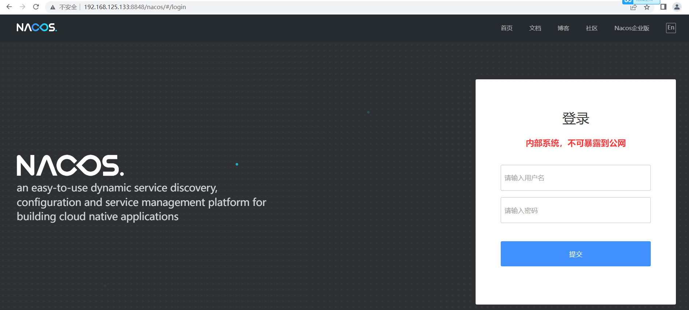

使用默认用户名：nacos，默认密码：nacos 登录即可打开主页面。

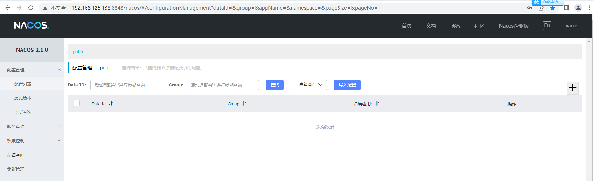

#### **3.1.4 OPEN API 配置管理测试**

启动nacos成功后，可通过nacos提供的http api验证nacos服务运行是否正常。 下边我们通过 curl工具来测试nacos的open api：

curl 是开发中常用的命令行工具，可以用作HTTP协议测试。

本教程下载curl的windows版本：curl-7.66.0_2-win64-mingw，下载地址：[https://curl.haxx.se/windows/](https://curl.haxx.se/windows/)
下载完成进入curl-7.66.0_2-win64-mingw的bin目录，进行下边的测试，通过测试可判断nacos是否正常工作：

##### 发布配置

上边的命令表示向nacos发布一个配置：

```
curl -X POST "http://127.0.0.1:8848/nacos/v1/cs/configs?dataId=nacos.cfg.dataId&group=test&content=HelloWorld"
```

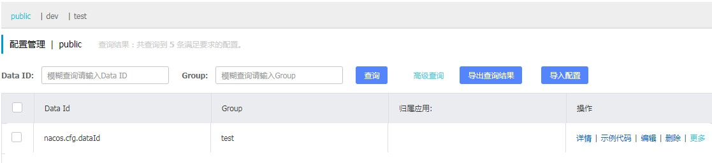

点击"详情"：

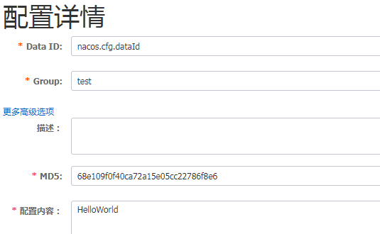

##### **获取配置**

向nacos发布配置成功，就可以通过客户端从nacos获取配置信息，执行下边的命令：

```
curl -X GET "http://127.0.0.1:8848/nacos/v1/cs/configs?dataId=nacos.cfg.dataId&group=test"
```

{width="6.770998468941382in" height="0.2071872265966754in"}

通过测试发现，可以从nacos获取前边发布的配置：HelloWorld

#### **3.1.5.关闭服务器**

关闭nacos服务的方式如下：

##### **Linux/Unix/Mac方式：**

```bash
sh shutdown.sh
```

##### **Windows**方式：

```
cmd shutdown.cmd
```

或者双击shutdown.cmd运行文件。

#### **3.1.6.**外部**mysql**数据库支持

单机模式时nacos默认使用嵌入式数据库实现数据的存储，若想使用外部mysql存储nacos数据，需要进行以下步骤：

-  1.安装数据库，版本要求：5.6.5+ ，mysql 8 以下 
-  2.初始化mysql数据库，新建数据库nacos_config，数据库初始化文件：{nacoshome}/conf/nacos- mysql.sql 
-  3.修改${nacoshome}/conf/application.properties文件，增加支持mysql数据源配置（目前只支持 mysql），添加mysql数据源的url、用户名和密码。 

```properties
spring.datasource.platform=mysql
db.num=1
db.url.0=jdbc:mysql://11.162.196.16:3306/nacos_config?
characterEncoding=utf8&connectTimeout=1000&socketTimeout=3000&autoReconnect=true
db.user=nacos_devtest
db.password=youdontknow
```

### **3.2 Nacos**配置入门

#### **3.2.1** 发布配置

首先在nacos发布配置。

浏览器访问 [http://192.168.125.133:8848/nacos](http://192.168.125.133:8848/nacos) ，打开nacos控制台，并点击菜单配置管理--配置列表：
在Nacos添加如下的配置：

```yaml
# Data ID: nacos-simple-demo.yaml
# Group : DEFAULT_GROUP
# 配置格式: YAML
# 配置内容： 
common:
  config1: something
```

> Note： 注意dataid是以 properties(默认的文件扩展名方式)为扩展名，这里使用yaml。


第一步：点击新增配置

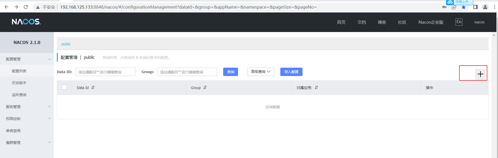

第二步：配置信息

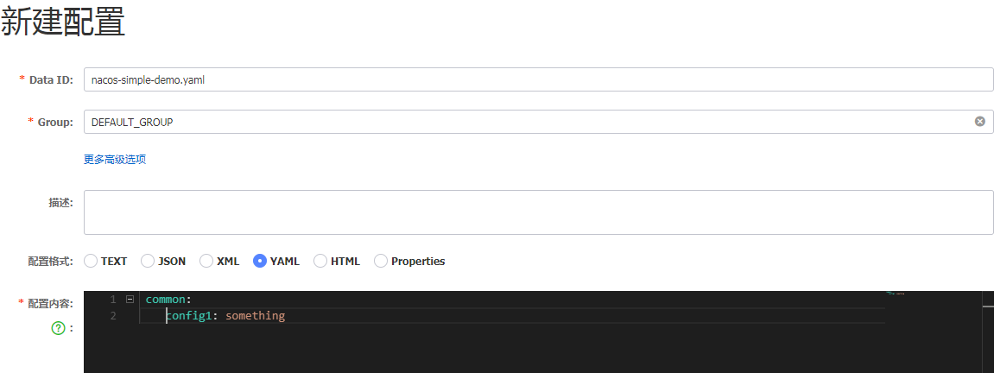

第三步：发布配置

在第二步点击"发布"，如下图，点击确定发布成功。

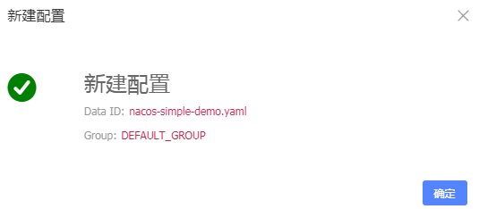

第四步：查询配置

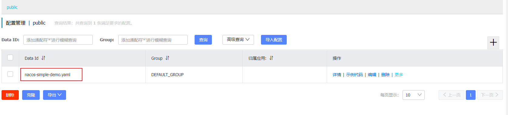

### **3.2.2 nacos**客户端获取配置

我们需要新增一个名为nacos-simple-demo的项目，坐标如下：

```xml
<artifactId>nacos-simple-demo</artifactId>
<version>1.0.0-SNAPSHOT</version>
<name>nacos-simple-demo</name>
```

添加group ID 为 com.alibaba.nacos 和 artifact ID 为 nacos-client 的 starter。用于实现项目中使用 Nacos 来实现应用的外部化配置。

#### 3.2.2.1 完整的**pom.xml**配置如下

```xml
<?xml version="1.0" encoding="UTF-8"?>
<project xmlns="http://maven.apache.org/POM/4.0.0" xmlns:xsi="http://www.w3.org/2001/XMLSchema-instance"
         xsi:schemaLocation="http://maven.apache.org/POM/4.0.0 https://maven.apache.org/xsd/maven-4.0.0.xsd">
    <modelVersion>4.0.0</modelVersion>
    <parent>
        <groupId>org.springframework.boot</groupId>
        <artifactId>spring-boot-starter-parent</artifactId>
        <version>2.7.0</version>
        <relativePath/> <!-- lookup parent from repository -->
    </parent>
    <groupId>cn.lyf</groupId>
    <artifactId>nacos-simple-demo</artifactId>
    <version>1.0.0-SNAPSHOT</version>
    <name>nacos-simple-demo</name>
    <description>nacos-simple-demo</description>
    <properties>
        <java.version>1.8</java.version>
        <nacos-client.version>2.1.0</nacos-client.version>
    </properties>
    <dependencies>
        <dependency>
            <groupId>org.springframework.boot</groupId>
            <artifactId>spring-boot-starter-web</artifactId>
        </dependency>

        <dependency>
            <groupId>org.projectlombok</groupId>
            <artifactId>lombok</artifactId>
            <optional>true</optional>
        </dependency>
        <dependency>
            <groupId>org.springframework.boot</groupId>
            <artifactId>spring-boot-starter-test</artifactId>
            <scope>test</scope>
        </dependency>

        <!-- https://mvnrepository.com/artifact/com.alibaba.nacos/nacos-client -->
        <dependency>
            <groupId>com.alibaba.nacos</groupId>
            <artifactId>nacos-client</artifactId>
            <version>${nacos-client.version}</version>
        </dependency>

        <!-- https://mvnrepository.com/artifact/org.springframework.security/spring-security-core -->
        <dependency>
            <groupId>org.springframework.security</groupId>
            <artifactId>spring-security-core</artifactId>
        </dependency>

    </dependencies>

    <build>
        <plugins>
            <plugin>
                <groupId>org.springframework.boot</groupId>
                <artifactId>spring-boot-maven-plugin</artifactId>
                <configuration>
                    <excludes>
                        <exclude>
                            <groupId>org.projectlombok</groupId>
                            <artifactId>lombok</artifactId>
                        </exclude>
                    </excludes>
                </configuration>
            </plugin>
        </plugins>
    </build>

</project>
```

#### 3.2.2.2 获取外部化配置

新增java执行类，并在执行过程中获取配置信息：

```java
package cn.lyf.nacos.demo;

import com.alibaba.nacos.api.NacosFactory;
import com.alibaba.nacos.api.PropertyKeyConst;
import com.alibaba.nacos.api.config.ConfigService;
import com.alibaba.nacos.api.exception.NacosException;
import lombok.extern.slf4j.Slf4j;

import java.util.Properties;

/**
 * @author lyf
 * @version 1.0
 * @classname SimpleDemo
 * @description
 * @since 2022/6/12 17:09
 */
@Slf4j
public class SimpleDemo {
    public static void main(String[] args) throws NacosException, InterruptedException {
        // nacos 所在服务器地址
        String serverAddr = "192.168.125.133";
        // 配置文件id Data Id
        String dataId = "nacos-simple-demo.yaml";
        // 配置文件所在的组 Group
        String group = "DEFAULT_GROUP";
        Properties properties = new Properties();
        properties.put(PropertyKeyConst.SERVER_ADDR, serverAddr);
        ConfigService configService = NacosFactory.createConfigService(properties);
        String content = configService.getConfig(dataId, group, 5000);
        System.out.println(content);
    }
}
```

启动SimpleDemoMain，控制台得到以下内容：

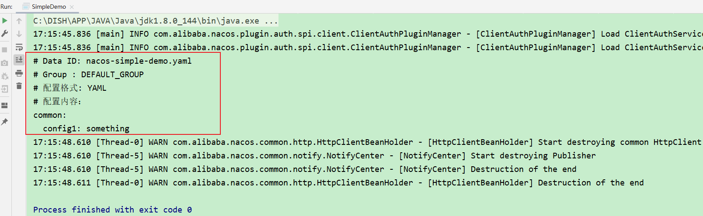

说明获取配置成功。

## **4 Nacos**配置管理基础应用

### **4.1 Nacos**配置管理模型

对于Nacos配置管理，通过Namespace、group、Data ID能够定位到一个配置集。

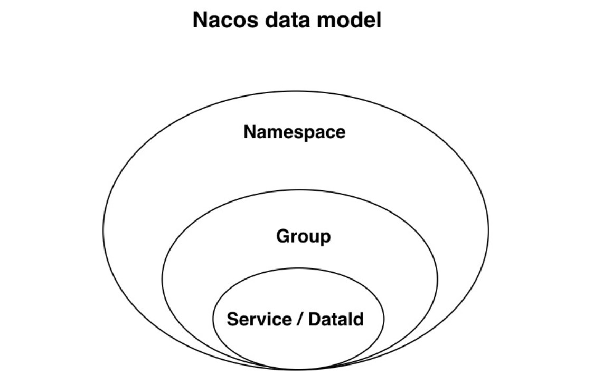

##### 配置集**(Data ID)**

在系统中，一个配置文件通常就是一个**配置集**，一个配置集可以包含了系统的各种配置信息，例如，一个配置集可 能包含了数据源、线程池、日志级别等配置项。每个配置集都可以定义一个有意义的名称，就是配置集的ID即Data ID。

##### 配置项

**配置集**中包含的一个个配置内容就是**配置项**。它代表一个具体的可配置的参数与其值域，通常以 key=value 的形 式存在。例如我们常配置系统的日志输出级别（logLevel=INFO|WARN|ERROR） 就是一个配置项。

##### 配置分组**(Group)**

配置分组是对配置集进行分组，通过一个有意义的字符串（如 Buy 或 Trade ）来表示，不同的配置分组下可以有 相同的配置集（Data ID）。当您在 Nacos 上创建一个配置时，如果未填写配置分组的名称，则配置分组的名称默 认采用 DEFAULT_GROUP 。配置分组的常见场景：可用于区分不同的项目或应用，例如：学生管理系统的配置集 可以定义一个group为：STUDENT_GROUP。

##### 命名空间**(Namespace)**

命名空间（namespace）可用于进行不同环境的配置隔离。例如可以隔离开发环境、测试环境和生产环境，因为 它们的配置可能各不相同，或者是隔离不同的用户，不同的开发人员使用同一个nacos管理各自的配置，可通过 namespace隔离。不同的命名空间下，可以存在相同名称的配置分组(Group) 或 配置集。

##### 最佳实践

Nacos抽象定义了Namespace、Group、Data ID的概念，具体这几个概念代表什么，取决于我们把它们看成什 么，这里推荐给大家一种用法，如下图：

Namespace：代表不同**环境**，如开发、测试、生产环境。

Group：代表某**项目**，如XX医疗项目、XX电商项目 DataId：每个项目下往往有若干个**工程**，每个配置集(DataId)是一个工程的**主配置文件**


##### 获取某配置集的代码：

获取配置集需要指定：

1、nacos服务地址，必须指定

2、namespace，如不指定默认public

3、group，如不指定默认 DEFAULT_GROUP

4、dataId，必须指定

代码如下： 看懂即可不用运行。

```java
package cn.lyf.nacos.demo;

import com.alibaba.nacos.api.NacosFactory;
import com.alibaba.nacos.api.PropertyKeyConst;
import com.alibaba.nacos.api.config.ConfigService;
import com.alibaba.nacos.api.exception.NacosException;
import lombok.extern.slf4j.Slf4j;

import java.util.Properties;

/**
 * @author lyf
 * @version 1.0
 * @classname SimpleDemo2
 * @description
 * @since 2022/6/12 17:24
 */
@Slf4j
public class SimpleDemo2 {
    public static void main(String[] args) throws NacosException {
        // nacos 所在服务器地址
        String serverAddr = "192.168.125.133";
        String namespace = "92ad01c5-f1f7-4497-95a6-64f306e49f48";
        // 配置文件id Data Id
        String dataId = "dev-demo.yaml";
        String group = "DEFAULT_GROUP";
        Properties properties = new Properties();
        properties.put(PropertyKeyConst.SERVER_ADDR, serverAddr);
        properties.put(PropertyKeyConst.NAMESPACE, namespace);
        ConfigService configService = NacosFactory.createConfigService(properties);
        String content = configService.getConfig(dataId, group, 5000);
        System.out.println(content);
    }
}
```

以上代码说明将从地址为`192.168.125.133:8848`的nacos配置中心获取配置，通过以下信息定位配置集：

namespace：92ad01c5-f1f7-4497-95a6-64f306e49f48 注意：namespace需要指定id。 group：DEFAULT_GROUP

Data Id：dev-demo.yaml

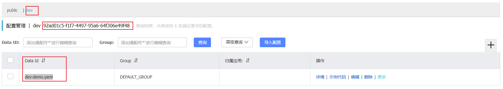

### **4.2** 命名空间管理

#### 4.2.1 namespace 隔离设计

namespace 的设计是 nacos 基于此做多环境以及多租户（多个用户共同使用nacos）数据(**配置和服务**)隔离的。

- 从一个租户(用户)的角度来看，如果有多套不同的环境，那么这个时候可以根据指定的环境来创建不同的 namespce，以此来实现多环境的隔离。例如，你可能有开发，测试和生产三个不同的环境，那么使用一套 nacos 集群可以分别建以下三个不同的 namespace。如下图所示：

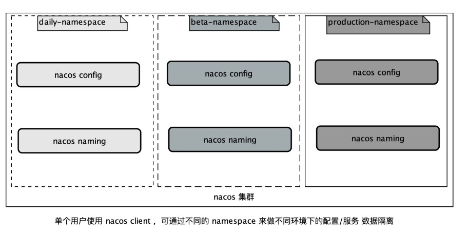

- 从多个租户(用户)的角度来看，每个租户(用户)可能会有自己的 namespace,每个租户(用户)的配置数据以及注 册的服务数据都会归属到自己的 namespace 下，以此来实现多租户间的数据隔离。例如超级管理员分配了三个租户，分别为张三、李四和王五。分配好了之后，各租户用自己的账户名和密码登录后，创建自己的命名 空间。如下图所示：

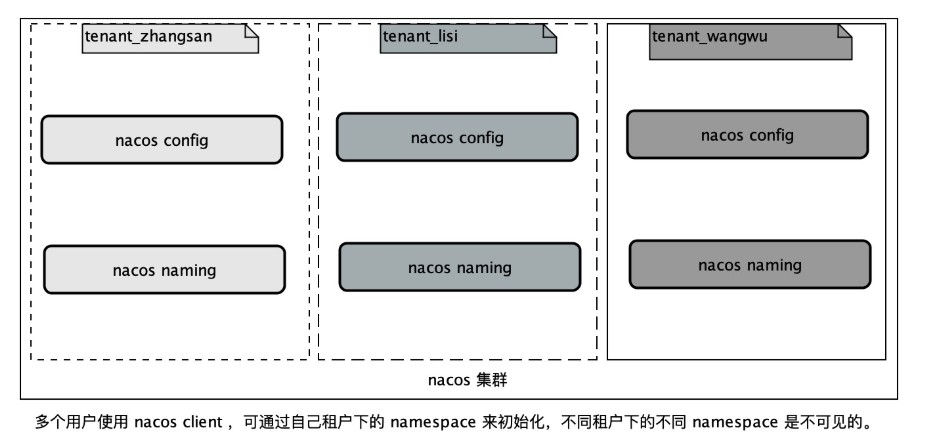

**注意:** 在此教程编写之时，nacos多租户(用户)功能还在规划中。

#### **4.2.2** 命名空间管理

前面已经介绍过，命名空间(Namespace)是用于隔离多个环境的（如开发、测试、生产），而每个应用在不同环 境的同一个配置（如数据库数据源）的值是不一样的。因此，我们应针对企业项目实际研发流程、环境进行规划。 如某软件公司拥有开发、测试、生产三套环境，那么我们应该针对这三个环境分别建立三个namespace。

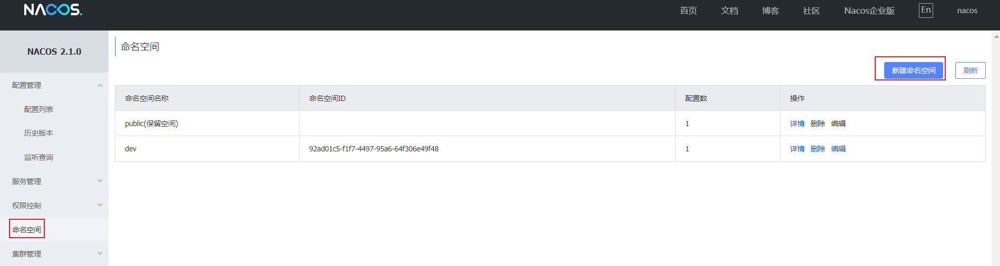

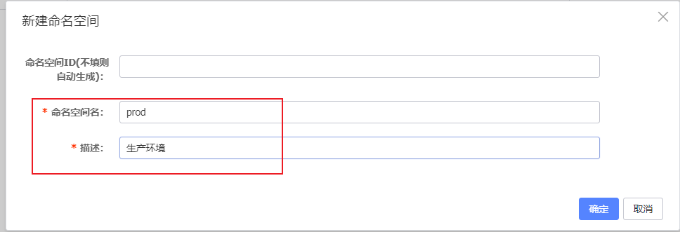

建立好所有namespace后，在**配置管理**与**服务管理**模块下所有页面，都会包含用于切换namespace(环境)的tab按 钮，如下图：

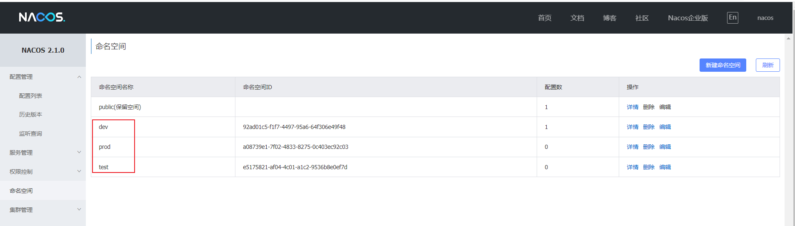

如果您在**编写程序**获取配置集过程中没有感知到这个参数的输入，那么 nacos 统一会使用一个默认的 namespace作为输入，nacos config 会使用一个**空字符串**作为默认的参数来初始化，对应界面上就是public命名空间。

> Note: namesace 为 **public** 是 nacos 的一个保留空间，如果您需要创建自己的 namespace，不要和 **public** 重名，以一个实际业务场景有具体语义的名字来命名，以免带来字面上不容易区分自己是哪一个 namespace。


> Note：在编写程序获取配置集时，指定的namespace参数一定要填写**命名空间ID**，而不是名称


运行下边的程序测试新建的命名空间： 注意：namespace的值根据自己的环境确定。

```java
// nacos 所在服务器地址
String serverAddr = "192.168.125.133";
String namespace = "92ad01c5-f1f7-4497-95a6-64f306e49f48"; // dev 开发环境
// 配置文件id Data Id
String dataId = "dev-demo.yaml";
String group = "DEFAULT_GROUP"; // 默认组
Properties properties = new Properties();
properties.put(PropertyKeyConst.SERVER_ADDR, serverAddr);
properties.put(PropertyKeyConst.NAMESPACE, namespace);
ConfigService configService = NacosFactory.createConfigService(properties);
String content = configService.getConfig(dataId, group, 5000);
System.out.println(content);
```

### **4.3** 配置管理

Nacos支持基于Namespace和Group的配置分组管理，以便用户更灵活的根据自己的需要按照环境或者应用、模 块等分组管理微服务的大量配置，在配置管理中主要提供了配置历史版本、回滚、订阅者查询等核心管理能力。

#### **4.3.1** 配置列表

点击Nacos控制台的 `配置管理--配置列表` 菜单，即可看到以下界面展示：

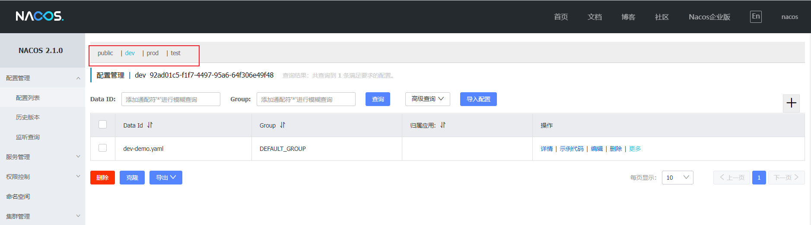

界面中展示了不同namespace下的**配置集**列表，可点击左上角的不同namespace进行切换。 右上角"+"号或点击某配置集后的 编辑 按钮可进入配置集编辑器。

##### 多配置格式编辑器

Nacos支持 YAML、Properties、TEXT、JSON、XML、HTML 等常见配置格式在线编辑、语法高亮、格式校验，帮 助用户高效编辑的同时大幅降低格式错误带来的风险。

Nacos支持配置标签的能力，帮助用户更好、更灵活的做到基于标签的配置分类及管理。同时支持用户对配置及其 变更进行描述，方面多人或者跨团队协作管理配置。

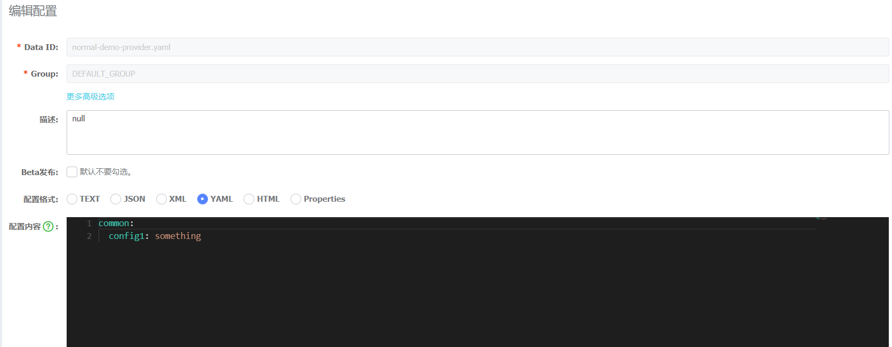

##### 编辑**DIFF**

Nacos支持编辑DIFF能力，帮助用户校验修改内容，降低改错带来的风险。

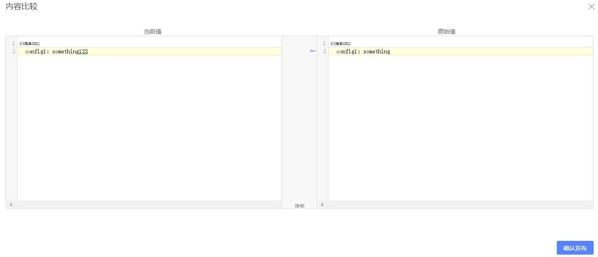{width="6.7441699475065615in" height="2.911457786526684in"}

##### 配置集导出

勾选若干配置集，点击 导出选中的配置 ，可获得一个压缩包：

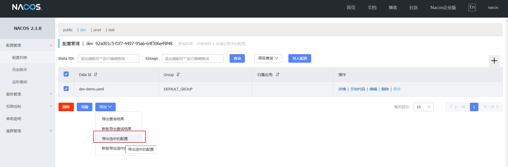

压缩包内，包含了选中配置集所转换的配置文件：

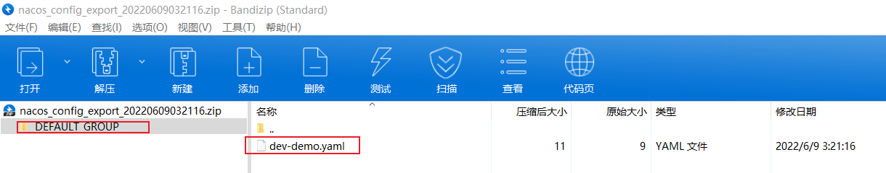

##### 配置集导入

点击右上角的 导入配置 ，可选择导出的压缩包文件，将压缩包内的文件恢复为nacos配置集。

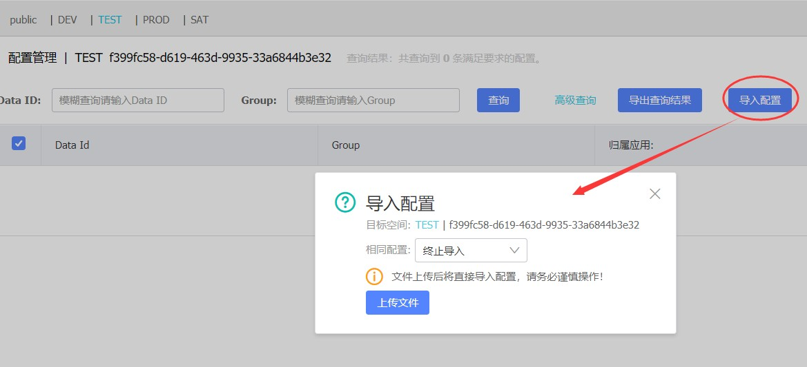

##### 配置集克隆

点击左下角 克隆 按钮，将会弹出克隆对话框，此功能可用于将配置迁移到其他Namespace。

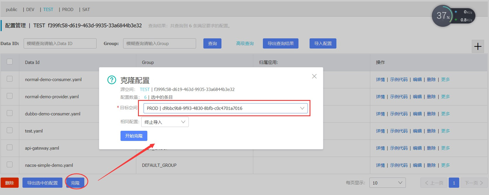

#### **4.3.2** 历史版本

Nacos通过提供配置版本管理及其一键回滚能力，帮助用户改错配置的时候能够快速恢复，降低微服务系统在配置 管理上的可用性风险。

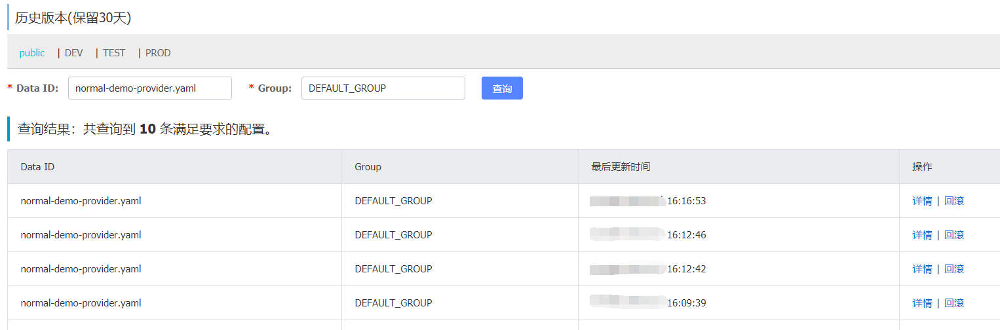

点击回滚：

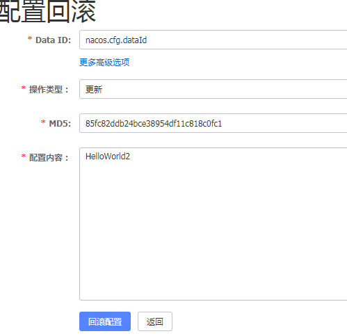

#### **4.2.3** 监听查询

Nacos提供配置订阅者即监听者查询能力，同时提供客户端当前配置的MD5校验值，以便帮助用户更好的检查配 置变更是否推送到 Client 端。

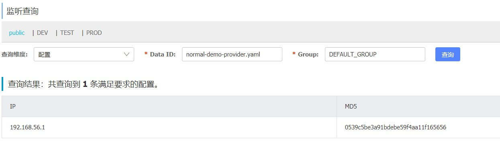
通过以下代码可对某配置进行监听：

```java
package cn.lyf.nacos.demo;

import com.alibaba.nacos.api.config.listener.Listener;
import lombok.extern.slf4j.Slf4j;
import com.alibaba.nacos.api.NacosFactory;
import com.alibaba.nacos.api.PropertyKeyConst;
import com.alibaba.nacos.api.config.ConfigService;
import com.alibaba.nacos.api.exception.NacosException;

import java.util.Properties;
import java.util.concurrent.Executor;
import java.util.concurrent.TimeUnit;

/**
 * @author lyf
 * @version 1.0
 * @classname SimpleDemo3
 * @description
 * @since 2022/6/12 17:41
 */
@Slf4j
public class SimpleDemo3 {
    public static void main(String[] args) throws NacosException, InterruptedException {
        // nacos 地址
        String serverAddr = "192.168.125.133";

        // 命名空间 dev
        String namespace = "92ad01c5-f1f7-4497-95a6-64f306e49f48";

        // Data Id
        String dataId = "dev-demo.yaml";

        // Group
        String group = "DEFAULT_GROUP";
        Properties properties = new Properties();
        properties.put(PropertyKeyConst.SERVER_ADDR, serverAddr);
        properties.put(PropertyKeyConst.NAMESPACE, namespace);
        ConfigService configService = NacosFactory.createConfigService(properties);
        String content = configService.getConfig(dataId, group, 5000);
        log.info("content:{}", content);

        // 添加监听String dataId, String group, Listener listener
        configService.addListener(dataId, group, new Listener() {
            @Override
            public void receiveConfigInfo(String configInfo) {
                log.info("recieve:{}", configInfo);
            }

            @Override
            public Executor getExecutor() {
                return null;
            }
        });

        // 测试让主线程不退出，因为订阅配置是守护线程，主线程退出守护线程就会退出。 正式代码中无需下面代码
        while (true) {
            try {
                TimeUnit.SECONDS.sleep(3);
                content = configService.getConfig(dataId, group, 5000L);
                log.info(content);
            } catch (InterruptedException e) {
                log.error("", e);
            }
        }
    }
}
```

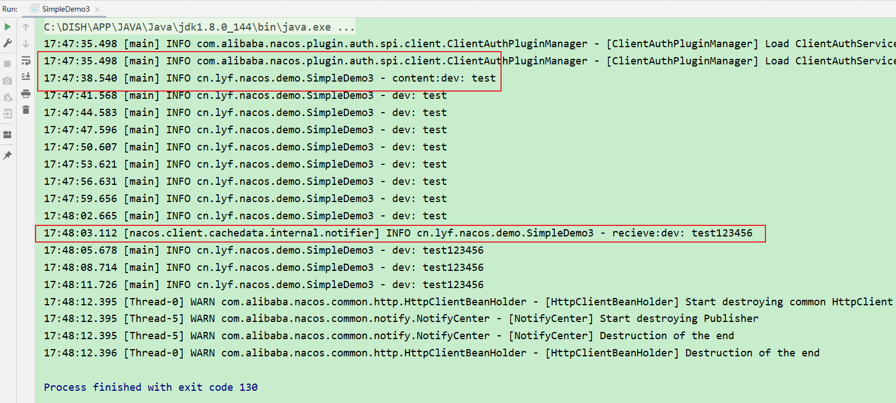

### **4.4** 登录管理

Nacos当前版本支持简单的登录功能，默认用户名/密码为： nacos/nacos 。

#### **修改默认用户名/密码方法**

1. 生成加密密码 在入门程序中加入如下以来：

```xml
<!-- https://mvnrepository.com/artifact/org.springframework.security/spring-security-core -->
<dependency>
    <groupId>org.springframework.security</groupId>
    <artifactId>spring-security-core</artifactId>
</dependency>
```

	编写PasswordEncoderUtil类，生成加密后的密码，采用BCrypt加密方法在每次生成密码时会加随机盐，所 以生成密码每次可能不一样。

```java
package cn.lyf.nacos.util;

import lombok.extern.slf4j.Slf4j;
import org.springframework.security.crypto.bcrypt.BCryptPasswordEncoder;

/**
 * @author lyf
 * @version 1.0
 * @classname PasswordEncoderUtil
 * @description
 * @date 2022/6/12 18:02
 */
@Slf4j
public final class PasswordEncoderUtil {
    /**
     * 私有构造器
     */
    private PasswordEncoderUtil() {
    }

    public static void main(String[] args) {
        String encodePassword = new BCryptPasswordEncoder().encode("123456");
        System.out.println(encodePassword);
    }
}
```

```
$2a$10$jg4DbcrdLI2e8MPZMLgMmOfp/vYec2fLN7zkfJb1yKFEv6EuikW7W
```

创建用户名或者密码的时候，用指定用户名密码即可。

将上边程序输出的密码更新到数据库。

```sql
INSERT INTO `nacos_config`.`users`(`username`, `password`, `enabled`) VALUES ('nacos1', '$2a$10$jg4DbcrdLI2e8MPZMLgMmOfp/vYec2fLN7zkfJb1yKFEv6EuikW7W', 1);

INSERT INTO `nacos_config`.`roles`(`username`, `role`) VALUES ('nacos1', 'ROLE_ADMIN');
```

#### 关闭登录功能

由于部分公司自己开发控制台，不希望被nacos的安全filter拦截。因此nacos支持定制关闭登录功能找到配置文件`${nacoshome}/conf/application.properties` ， 替换以下内容即可。

```properties
## spring security config
### turn off security
spring.security.enabled=false
management.security=false
security.basic.enabled=false
nacos.security.ignore.urls=/**
#nacos.security.ignore.urls=/,/**/*.css,/**/*.js,/**/*.html,/**/*.map,/**/*.svg,/**/*.png,/**/*.
ico,/consolefe/
public/**,/v1/auth/login,/v1/console/health,/v1/cs/**,/v1/ns/**,/v1/cmdb/**,/actuator/**
```

## **5 Nacos**配置管理应用于分布式系统

### **5.1** 从单体架构到微服务

#### **5.1.1** 单体架构

	Web应用程序发展的早期，大部分web工程师将所有的功能模块打包到一起并放在一个web容器中运行，所有功能 模块使用同一个数据库，同时，它还提供API或者UI访问的web模块等。

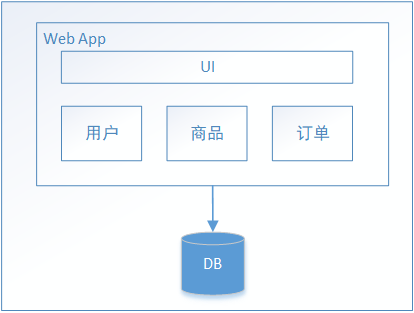

	尽管也是模块化逻辑，但是最终它还是会打包并部署为单体式应用，这种将所有功能都部署在一个web容器中运行 的系统就叫做**单体架构**（也叫：巨石型应用)。

##### 单体架构有很多好处：

**开发效率高**：模块之间交互采用本地方法调用，并节省微服务之间的交互讨论时间与开发成本。 **容易测试**：IDE都是为开发单个应用设计的、容易测试------在本地就可以启动完整的系统。

**容易部署**：运维成本小，直接打包为一个完整的包，拷贝到web容器的某个目录下即可运行。

##### 不足：

	但是，上述的好处是有条件的，它适用于小型简单应用，对于大规模的复杂应用，就会展现出来以下不足：

**复杂性逐渐变高，可维护性逐渐变差** ：所有业务模块部署在一起，复杂度越来越高，修改时牵一发动全身。

**版本迭代速度逐渐变慢**：修改一个地方就要将整个应用全部编译、部署、启动时间过长、回归测试周期过长。

**阻碍技术创新**：若更新技术框架，除非你愿意将系统全部重写，无法实现部分技术更新。

**无法按需伸缩**：通过冗余部署完整应用的方式来实现水平扩展，无法针对某业务按需伸缩。

#### **5.1.2** 微服务

许多大型公司，通过采用微服务架构解决了上述问题。其思路不是开发一个巨大的单体式的应用，而是将应用分解为小的、互相连接的微服务。

一个微服务一般完成某个特定的功能，比如订单服务、用户服务等等。每一个微服务都是完整应用，都有自己的业务逻辑和数据库。一些微服务还会发布API给其它微服务和应用客户端使用。

比如，根据前面描述系统可能的分解如下：


	每一个业务模块都使用独立的服务完成，这种微服务架构模式也影响了应用和数据库之间的关系，不像传统多个业 务模块共享一个数据库，微服务架构每个服务都有自己的数据库。

##### 微服务架构的好处：

- 分而治之，职责单一；易于开发、理解和维护、方便团队的拆分和管理
- 可伸缩；能够单独的对指定的服务进行伸缩
- 局部容易修改，容易替换，容易部署，有利于持续集成和快速迭代
- 不会受限于任何技术栈

### **5.2** 分布式应用配置管理

下图展示了如何通过Nacos集中管理多个服务的配置：

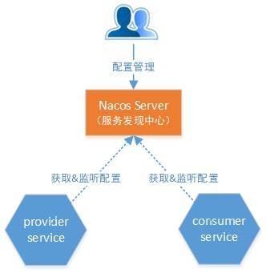

- 用户通过Nacos Server的控制台集中对多个服务的配置进行管理。
- 各服务统一从Nacos Server中获取各自的配置，并监听配置的变化。

#### **5.2.1** 发布配置

首先在nacos发布配置，我们规划了两个服务service1、service2，并且想对这两个服务的配置进行集中维护。 浏览器访问 [http://192.168.125.133:8848/nacos](http://192.168.125.133:8848/nacos) ，打开nacos控制台，并点击菜单**配置管理--配置列表**： 在Nacos添加如下的配置：

##### nacos-service1

```yaml
# Namespace: 92ad01c5-f1f7-4497-95a6-64f306e49f48
# Data Id: nacos-service1.yaml
# Group: TEST_GROUP
# 配置格式: YAML
# 配置内容
common:
  name: nacos-service1 config
```

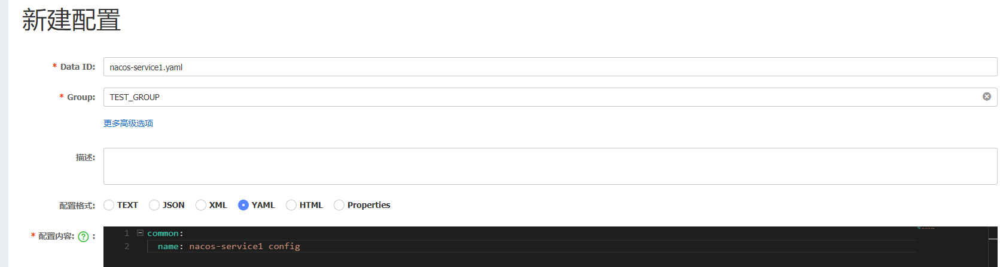

##### nacos-service2

```yaml
# Namespace: 92ad01c5-f1f7-4497-95a6-64f306e49f48
# Data Id: nacos-service2.yaml
# Group: TEST_GROUP
# 配置格式: YAML
# 配置内容
common:
  name: nacos-service2 config
```

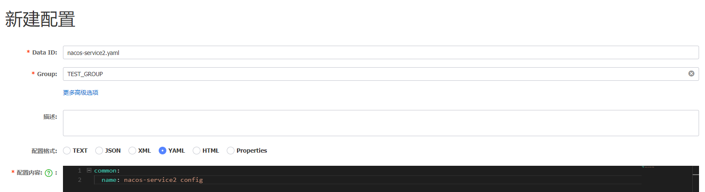

#### **5.2.2** 创建父工程

为了规范依赖的版本，这里创建父工程，指定依赖的版本。 父工程pom.xml如下：

```xml
<?xml version="1.0" encoding="UTF-8"?>
<project xmlns="http://maven.apache.org/POM/4.0.0"
         xmlns:xsi="http://www.w3.org/2001/XMLSchema-instance"
         xsi:schemaLocation="http://maven.apache.org/POM/4.0.0 http://maven.apache.org/xsd/maven-4.0.0.xsd">
    <modelVersion>4.0.0</modelVersion>

    <groupId>cn.lyf</groupId>
    <artifactId>nacos-config</artifactId>
    <version>1.0.0-SNAPSHOT</version>
    <modules>
        <module>nacos-service1</module>
        <module>nacos-service2</module>
    </modules>
    <packaging>pom</packaging>

    <properties>
        <maven.compiler.source>8</maven.compiler.source>
        <maven.compiler.target>8</maven.compiler.target>
        <project.build.sourceEncoding>UTF-8</project.build.sourceEncoding>
        <project.reporting.outputEncoding>UTF-8</project.reporting.outputEncoding>
        <java.version>1.8</java.version>

        <spring-cloud-alibaba-dependencies.version>2021.1</spring-cloud-alibaba-dependencies.version>
        <spring-cloud-dependencies.version>2021.0.2</spring-cloud-dependencies.version>
        <spring-boot-dependencies.version>2.7.0</spring-boot-dependencies.version>
    </properties>

    <dependencies>
        <dependency>
            <groupId>org.projectlombok</groupId>
            <artifactId>lombok</artifactId>
            <optional>true</optional>
        </dependency>
    </dependencies>

    <dependencyManagement>
        <dependencies>
            <dependency>
                <groupId>com.alibaba.cloud</groupId>
                <artifactId>spring-cloud-alibaba-dependencies</artifactId>
                <version>${spring-cloud-alibaba-dependencies.version}</version>
                <type>pom</type>
                <scope>import</scope>
            </dependency>
            <dependency>
                <groupId>org.springframework.cloud</groupId>
                <artifactId>spring-cloud-dependencies</artifactId>
                <version>${spring-cloud-dependencies.version}</version>
                <type>pom</type>
                <scope>import</scope>
            </dependency>
            <dependency>
                <groupId>org.springframework.boot</groupId>
                <artifactId>spring-boot-dependencies</artifactId>
                <version>${spring-boot-dependencies.version}</version>
                <type>pom</type>
                <scope>import</scope>
            </dependency>
        </dependencies>
    </dependencyManagement>

    <build>
        <plugins>
            <plugin>
                <groupId>org.springframework.boot</groupId>
                <artifactId>spring-boot-maven-plugin</artifactId>
                <configuration>
                    <excludes>
                        <exclude>
                            <groupId>org.projectlombok</groupId>
                            <artifactId>lombok</artifactId>
                        </exclude>
                    </excludes>
                </configuration>
            </plugin>
        </plugins>
    </build>
</project>
```

##### 5.2.2.1 微服务**service1**配置

本小节，我们将演示如何使用 **Spring Cloud Alibaba Nacos Config**在**Spring Cloud**应用中集成Nacos，通过 Spring cloud原生方式快捷的获取配置内容。

Spring Cloud是什么：

> Spring Cloud是一系列框架的有序集合。它利用Spring Boot的开发便利性巧妙地简化了分布式系统基础设
施的开发，如服务发现注册、配置中心、消息总线、负载均衡、断路器、数据监控等，都可以用Spring Boot
的开发风格做到一键启动和部署。Spring Cloud并没有重复制造轮子，它只是将目前各家公司开发的比较成
熟、经得起实际考验的服务框架组合起来，集成最多的组件要属Netflix公司，通过Spring Boot风格进行再封
装屏蔽掉了复杂的配置和实现原理，最终给开发者留出了一套简单易懂、易部署和易维护的分布式系统开发
工具包。


Spring Cloud Alibaba Nacos Config是什么：

> Spring Cloud Alibaba Nacos Discovery是Spring Cloud Alibaba的子项目，而Spring Cloud Alibaba是阿
里巴巴公司提供的开源的基于Spring cloud的微服务套件合集，它致力于提供微服务开发的一站式解决方
案，可以理解为spring cloud是一套微服务开发的 标准 ，spring cloud alibaba与spring cloud Netflix是实
现。使用 Spring Cloud Alibaba方案，开发者只需要添加一些注解和少量配置，就可以将 Spring Cloud 应用
接入阿里分布式应用解决方案，通过阿里中间件来迅速搭建分布式应用系统。


由于Nacos是阿里的中间件，因此，若开发Spring cloud微服务应用，使用Spring Cloud Alibaba Nacos Config来 集成Nacos的配置管理功能是比较明智的选择。

###### （**1**）新建项目**nacos-service1**

首先新增一个名为service1工程，并添加group ID 为 com.alibaba.cloud 和 artifact ID 为 spring-cloudstarter-alibaba-nacos-config 的 starter。

```xml
<?xml version="1.0" encoding="UTF-8"?>
<project xmlns="http://maven.apache.org/POM/4.0.0"
         xmlns:xsi="http://www.w3.org/2001/XMLSchema-instance"
         xsi:schemaLocation="http://maven.apache.org/POM/4.0.0 http://maven.apache.org/xsd/maven-4.0.0.xsd">
    <parent>
        <artifactId>nacos-config</artifactId>
        <groupId>cn.lyf</groupId>
        <version>1.0.0-SNAPSHOT</version>
    </parent>
    <modelVersion>4.0.0</modelVersion>

    <artifactId>nacos-service1</artifactId>

    <properties>
        <maven.compiler.source>8</maven.compiler.source>
        <maven.compiler.target>8</maven.compiler.target>
    </properties>

    <dependencies>
        <dependency>
            <groupId>com.alibaba.cloud</groupId>
            <artifactId>spring-cloud-starter-alibaba-nacos-config</artifactId>
        </dependency>
        <dependency>
            <groupId>org.springframework.boot</groupId>
            <artifactId>spring-boot-starter-web</artifactId>
        </dependency>
        <!-- 若bootstrap配置不生效，加入以下依赖 -->
        <dependency>
            <groupId>org.springframework.cloud</groupId>
            <artifactId>spring-cloud-starter-bootstrap</artifactId>
        </dependency>
    </dependencies>
</project>
```

###### （**2**）**bootstrap.yml**配置

一般来说，spring boot的配置将在application.yml(也可以是application.properties)文件中编写， 由于使用外部 配置中心，必须将原先的application.yml重命名为bootstrap.yml，bootstrap.yml如下所示：

spring.cloud.nacos.config.server-addr 指定了Nacos Server的网络地址和端口号。

```yaml
server:
  port: 56010 # 启动端口，命令行注入
spring:
  application:
    name: nacos-service1
  cloud:
    nacos:
      config:
        server-addr: 192.168.125.133:8848 # 配置中心地址
        file-extension: yaml
        namespace: 92ad01c5-f1f7-4497-95a6-64f306e49f48 # 开发环境
        group: TEST_GROUP # 测试组
```

以上配置文件说明该应用将从地址为`192.168.125.133:8848`配置中心获取配置，通过以下信息定位配置集：

```yaml
namespace: 92ad01c5-f1f7-4497-95a6-64f306e49f48 # 开发环境
group: TEST_GROUP # 测试组
Data Id: nacos-service1.yaml
```

> Note：spring-cloud-starter-alibaba-nacos-config 在加载配置的时候，加载了以 dataid 为`${spring.application.name}.${file-extension:properties}` 的基础配置。对应以上的配置，它会去 nacos server中加载data id为`nacos-service1.yaml`的**配置集**。
>  
> Note: 若没有指定spring.cloud.nacos.config.group配置,则默认为DEFAULT_GROUP。


###### （**3**）启动配置客户端

新增Spring Boot 启动类，并增加获取配置的web访问端点/configs，通过标准的spring [@Value ](/Value ) 方式。 

```java
package cn.lyf.nacos;

import lombok.extern.slf4j.Slf4j;
import org.springframework.beans.factory.annotation.Value;
import org.springframework.boot.SpringApplication;
import org.springframework.boot.autoconfigure.SpringBootApplication;
import org.springframework.web.bind.annotation.GetMapping;
import org.springframework.web.bind.annotation.RestController;

/**
 * @author lyf
 * @version 1.0
 * @classname NacosService1Application
 * @description
 * @since 2022/6/12 19:03
 */
@Slf4j
@SpringBootApplication
@RestController
public class NacosService1Application {
    public static void main(String[] args) {
        SpringApplication.run(NacosService1Application.class, args);
    }

    @Value("${common.name}")
    private String config;

    @GetMapping(value = "/config")
    public String getConfig() {
        return this.config;
    }
}
```

###### 访问 [http://localhost:56010/config](http://localhost:56010/config)

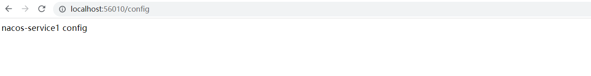

##### 5.2.2.2 微服务**nacos-service2**配置

**nacos-service2**的创建流程与nacos-service1一致：

需要注意的是spring boot 启动端口要避免重复，spring.application.name为nacos-service2。

```yaml
server:
  port: 56020 # 启动端口，命令行注入
spring:
  application:
    name: nacos-service2
  cloud:
    nacos:
      config:
        server-addr: 192.168.125.133:8848 # 配置中心地址
        file-extension: yaml
        namespace: 92ad01c5-f1f7-4497-95a6-64f306e49f48 # 开发环境
        group: TEST_GROUP # 测试组
```

分别启动nacos-service1和nacos-service2项目，并分别访问 /config进行测试，不同项目能够获取各自的配置内容。

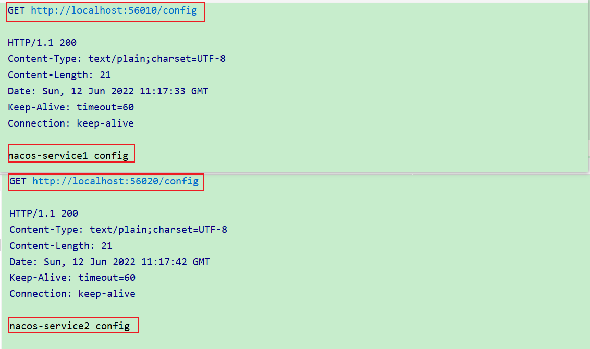

#### **5.2.3** 支持配置的动态更新

基于上面快速上手的例子，若要实现配置的动态更新，只需要进行如下改造：

```java
package cn.lyf.nacos;

import lombok.extern.slf4j.Slf4j;
import org.springframework.beans.factory.annotation.Autowired;
import org.springframework.beans.factory.annotation.Value;
import org.springframework.boot.SpringApplication;
import org.springframework.boot.autoconfigure.SpringBootApplication;
import org.springframework.context.ConfigurableApplicationContext;
import org.springframework.web.bind.annotation.GetMapping;
import org.springframework.web.bind.annotation.RestController;

/**
 * @author lyf
 * @version 1.0
 * @classname NacosService1Application
 * @description
 * @since 2022/6/12 19:03
 */
@Slf4j
@SpringBootApplication
@RestController
public class NacosService1Application {
    public static void main(String[] args) {
        SpringApplication.run(NacosService1Application.class, args);
    }

    @Value("${common.name}")
    private String config;

    @GetMapping(value = "/config")
    public String getConfig() {
        return this.config;
    }

    /**
     * 注入配置文件上下文
     */
    @Autowired
    private ConfigurableApplicationContext applicationContext;

    /**
     * 支持配置文件的动态更新
     *
     * @return value
     */
    @GetMapping(value = "/config2")
    public String getConfig2() {
        return applicationContext.getEnvironment().getProperty("common.name");
    }
}
```

我们通过nacos控制台更新common.name的配置值，再次访问web端点/configs，发现应用程序能够获取到最新 的配置值，说明spring-cloud-starter-alibaba-nacos-config 支持配置的动态更新。

> Note 可以通过配置spring.cloud.nacos.config.refresh.enabled=false来关闭动态刷新


#### **5.2.4** 自定义 **namespace**与**group**配置

##### 支持自定义 **namespace**的配置

在没有明确指定 `${spring.cloud.nacos.config.namespace}`配置的情况下， 默认使用的是 Nacos 上 Public 这个
namespace。如果需要使用自定义的命名空间，可以通过以下配置来实现：

```yaml
spring:
  cloud:
    nacos:
      config:
        namespace: 92ad01c5-f1f7-4497-95a6-64f306e49f48 # 开发环境
```

> Note：该配置必须放在 bootstrap.yml文件中。此外 spring.cloud.nacos.config.namespace 的值是 namespace
对应的 id，id 值可以在 Nacos 的控制台获取。并且在添加配置时注意不要选择其他的 namespae，否则将会导致
读取不到正确的配置。


##### 支持自定义 **Group** 的配置

在没有明确指定 ${spring.cloud.nacos.config.group} 配置的情况下， 默认使用的是 DEFAULT_GROUP 。如果
需要自定义自己的 Group，可以通过以下配置来实现：

```yaml
spring:
  cloud:
    nacos:
      config:
        group: TEST_GROUP # 测试组
```

> Note：该配置必须放在 bootstrap.properties 文件中。并且在添加配置时 Group 的值一定要和`spring.cloud.nacos.config.group` 的配置值一致。


#### **5.2.5** 自定义扩展的 **Data Id** 配置

Spring Cloud Alibaba Nacos Config可支持自定义 Data Id 的配置。 一个完整的配置案例如下所示：

下边我们在nacos-service2微服务下配置扩展。

```yaml
spring:  
  cloud:
    nacos:
      config:        
        extension-configs[0]: # 1、Data Id 在默认的组 DEFAULT_GROUP, 不支持配置的动态刷新
          dataid: extension-configs-common01.properties
        extension-configs[1]: # 2、Data id 不在默认的组，不支持动态刷新
          dataid: extension-configs-common02.properties
          group: GLOBALE_GROUP
        extension-configs[2]: # 3、Data id 既不在默认的组，也支持动态刷新
          dataid: extension-configs-common03.properties
          group: REFRESH_GROUP
          refresh: true
```

可以看到:

- 通过 `spring.cloud.nacos.config.extension-configs[n].dataid` 的配置方式来支持多个 Data Id 的配置。
- 通过 `spring.cloud.nacos.config.extension-configs[n].group` 的配置方式自定义 Data Id 所在的组，不明确配置的话，默认是 DEFAULT_GROUP。
- 通过 `spring.cloud.nacos.config.extension-configs[n].refresh` 的配置方式来控制该 Data Id 在配置变更时，是否支持应用中可动态刷新， 感知到最新的配置值。默认是不支持的。

> Note ： `spring.cloud.nacos.config.extension-configs[n].dataid` 的值必须带文件扩展名，文件扩展名既可支持properties，又可以支持 yaml/yml。 此时 `spring.cloud.nacos.config.file-extension` 的配置对自定义扩展配置的 Data Id 文件扩展名没有影响。


通过自定义扩展的 Data Id 配置，既可以解决多个应用间配置共享的问题，又可以支持一个应用有多个配置文件。

##### 测试：

###### 配置extension-configs-common01.properties

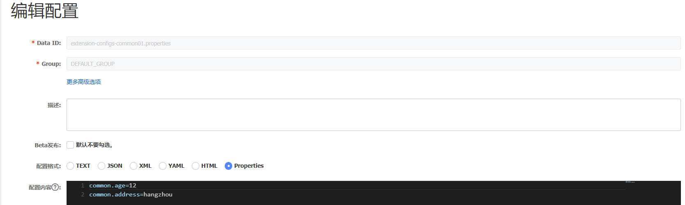

###### 配置extension-configs-common02.properties

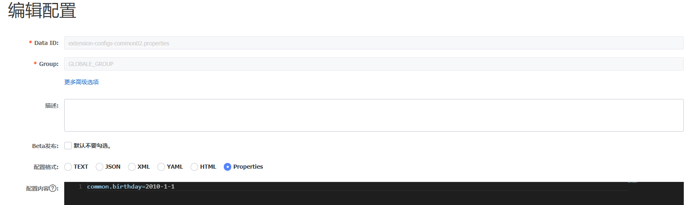

###### 配置extension-configs-common03.properties

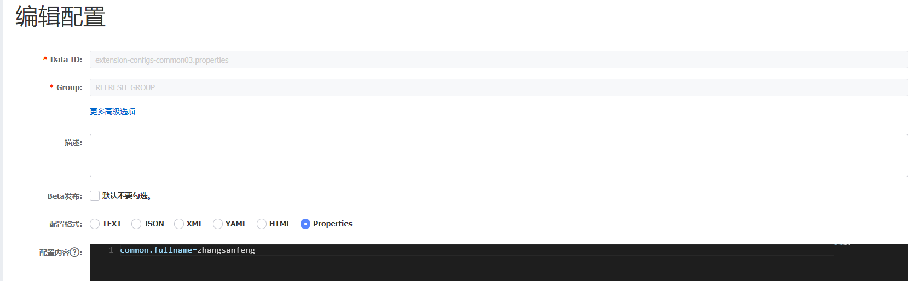

编写测试代码：

```java
/**
 * 注入配置文件上下文
 */
@Autowired
private ConfigurableApplicationContext applicationContext;


@GetMapping(value = "/config2")
public String getConfig2() {
    String name = applicationContext.getEnvironment().getProperty("common.name");
    String age = applicationContext.getEnvironment().getProperty("common.age");
    String address = applicationContext.getEnvironment().getProperty("common.address");
    String birthday = applicationContext.getEnvironment().getProperty("common.birthday");
    String fullname = applicationContext.getEnvironment().getProperty("common.fullname");
    return name + "+" + age + "+" + address + "+" + birthday + "+" + fullname;
}
```

访问：[http://localhost:56020/config2](http://localhost:56020/config2)

输出：

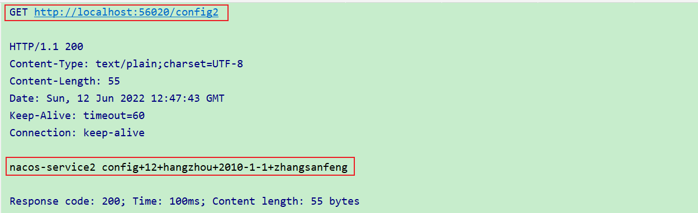

#### 5.2.6 自定义共享 **Data Id** 配置

为了更加清晰的在多个应用间配置共享的 Data Id ，你可以通过以下的方式来配置：

```yaml
spring:  
  cloud:
    nacos:
      config:        
        shared-configs: # 共享配置
          - dataid: extension-configs-common04.properties
          - dataid: extension-configs-common05.properties
            group: GLOBALE_GROUP
          - dataid: extension-configs-common06.properties
            refresh: true # 自动刷新，默认是false
            group: REFRESH_GROUP # 默认是DEFAULT_GROUP
```

##### 完整yaml

```yaml
server:
  port: 56020 # 启动端口，命令行注入
spring:
  application:
    name: nacos-service2
  cloud:
    nacos:
      config:
        server-addr: 192.168.125.133:8848 # 配置中心地址
        prefix: nacos-service2
        file-extension: yaml # 前缀
        namespace: 92ad01c5-f1f7-4497-95a6-64f306e49f48 # 开发环境
        group: TEST_GROUP # 测试组
        extension-configs[0]: # 1、Data Id 在默认的组 DEFAULT_GROUP, 不支持配置的动态刷新
          dataid: extension-configs-common01.properties
        extension-configs[1]: # 2、Data id 不在默认的组，不支持动态刷新
          dataid: extension-configs-common02.properties
          group: GLOBALE_GROUP
        extension-configs[2]: # 3、Data id 既不在默认的组，也支持动态刷新
          dataid: extension-configs-common03.properties
          group: REFRESH_GROUP
          refresh: true
        shared-configs: # 共享配置
          - dataid: extension-configs-common04.properties
          - dataid: extension-configs-common05.properties
            group: GLOBALE_GROUP
          - dataid: extension-configs-common06.properties
            refresh: true # 自动刷新，默认是false
            group: REFRESH_GROUP # 默认是DEFAULT_GROUP
```

可以看到：
通过 `spring.cloud.nacos.config.shared-configs` 来支持多个共享 Data Id 的配置和`spring.cloud.nacos.config.extension-configs` 效果差不多

Note：通过

来支持多个共享配置的 Data Id 时， 多个共享配

置间的一个优先级的关系我们约定：按照配置出现的先后顺序，即后面的优先级要高于前面。

Note：通过 件扩

展名既可支 的

配置对自定义扩展配置的 Data Id 文件扩展名没有影响。

Note： spring.cloud.nacos.config.refreshable-dataids 给出哪些需要支持动态刷新时，Data Id 的值也 必须明确给出文件扩展名。

###### 访问：[http://localhost:56020/config2](http://localhost:56020/config2) 测试输出：

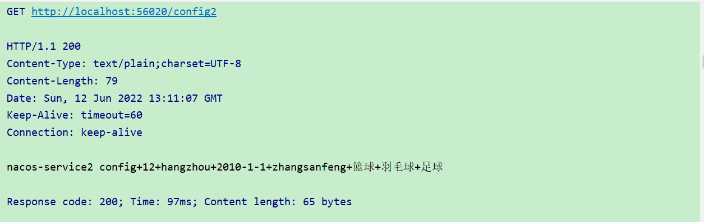

#### **5.2.7** 配置的优先级

##### 5.2.7.1 配置项说明

###### 地址：

[https://github.com/alibaba/spring-cloud-alibaba/blob/29b955fffb1edbef552ed8a44b1b72dde7318a45/spring-cloud-alibaba-examples/nacos-example/nacos-config-example/readme-zh.md#更多配置项](https://github.com/alibaba/spring-cloud-alibaba/blob/29b955fffb1edbef552ed8a44b1b72dde7318a45/spring-cloud-alibaba-examples/nacos-example/nacos-config-example/readme-zh.md#%E6%9B%B4%E5%A4%9A%E9%85%8D%E7%BD%AE%E9%A1%B9)

###### 配置项说明
| 配置项 | key | 默认值 | 说明 |
| --- | --- | --- | --- |
| 服务端地址 | spring.cloud.nacos.config.server-addr |  |  |
| DataId前缀 | spring.cloud.nacos.config.prefix |  | spring.application.name |
| Group | spring.cloud.nacos.config.group | DEFAULT_GROUP |  |
| dataID后缀及内容文件格式 | spring.cloud.nacos.config.file-extension | properties | dataId的后缀，同时也是配置内容的文件格式，目前只支持 properties |
| 配置内容的编码方式 | spring.cloud.nacos.config.encode | UTF-8 | 配置的编码 |
| 获取配置的超时时间 | spring.cloud.nacos.config.timeout | 3000 | 单位为 ms |
| 配置的命名空间 | spring.cloud.nacos.config.namespace |  | 常用场景之一是不同环境的配置的区分隔离，例如开发测试环境和生产环境的资源隔离等。 |
| AccessKey | spring.cloud.nacos.config.access-key |  |  |
| SecretKey | spring.cloud.nacos.config.secret-key |  |  |
| 相对路径 | spring.cloud.nacos.config.context-path |  | 服务端 API 的相对路径 |
| 接入点 | spring.cloud.nacos.config.endpoint | UTF-8 | 地域的某个服务的入口域名，通过此域名可以动态地拿到服务端地址 |
| 是否开启监听和自动刷新 | spring.cloud.nacos.config.refresh-enabled | true |  |


##### 5.2.7.2 配置 - 优先级

###### 1 spring.profiles.active

注意： bootstrap 正好与 application 相反
文件名.profile：带 profile > 不带 profile 的优先级：bootstrap-dev.yaml > application.yaml

###### 2 按位置 - 优先级

线上nacos > 线下jar外 > 线下jar内

线下jar包内外的优先级详见： SpringBoot 学习笔记：配置文件基础知识 - 配置优先级

###### 3 按类型 - 优先级

先加载 bootstrap 后加载 application

| 优先级 | 配置 |
| --- | --- |
| Top 1 | nacos上：`${spring.application.name}`
-`${profile}`
.`${file-extension:properties}` |
| Top 2 | application.properties |
| Top 3 | application.yml |
| Top 4 | application.yaml |
| Top 5 | bootstrap.properties |
| Top 6 | bootstrap.yml |
| Top 7 | bootstrap.yaml |


###### 4. 按方式 - 优先级

从高到低

1. ${spring.application.name}-${profile}.${file-extension} 内置规则（此级别中类型优先级如上）
2. 扩展配置 spring.cloud.nacos.config.extension-configs 数组索引大的优先高
3. 共享配置 spring.cloud.nacos.config.shared-configs 数组索引大的优先高

#### **5.2.8** 完全关闭配置

通过设置 spring.cloud.nacos.config.enabled = false 来完全关闭 Spring Cloud Nacos Config

#### 5.2.9 动态刷新

##### 方案一、通过 `ConfigurableApplicationContext` 上下文

```java
@Autowired
private ConfigurableApplicationContext context; // 就是启动类中 SpringApplication.run() 返回的对象。
...
System.out.println("动态更新配置 > "+ context.getEnvironment().getProperty("配置文件中的key") );
```

##### 方案二、`@RefreshScope` 注解

在类上添加 `@RefreshScope` 开启内置配置自动刷新

##### 方案三、`扩展配置、共享配置`

通过配置项`refresh = true` 开启。

### **5.3 Nacos**集群部署

#### **5.3.1** 集群部署

3个或3个以上Nacos节点才能构成集群

（1）安装3个以上Nacos 我们可以复制之前已经解压好的nacos文件夹，分别命名为nacos、nacos1、nacos2

（2）配置集群配置文件

在所有nacos目录的conf目录下，有文件 cluster.conf.example ，将其命名为 cluster.conf ，并将每行配置成

ip:port。（请配置3个或3个以上节点）

```
# ip:port
127.0.0.1:8848
127.0.0.1:8849
127.0.0.1:8850
```

由于是单机演示，需要更改nacos/的conf目录下application.properties中server.port，防止端口冲突。

如果服务器有多个ip也要指定具体的ip地址，如：nacos.inetutils.ip-address=127.0.0.1

例如：

```
server.port=8850
nacos.inetutils.ip‐address=127.0.0.1
```

（3）集群模式启动

分别执行nacos目录的bin目录下的startup：

```
startup ‐m cluster
```

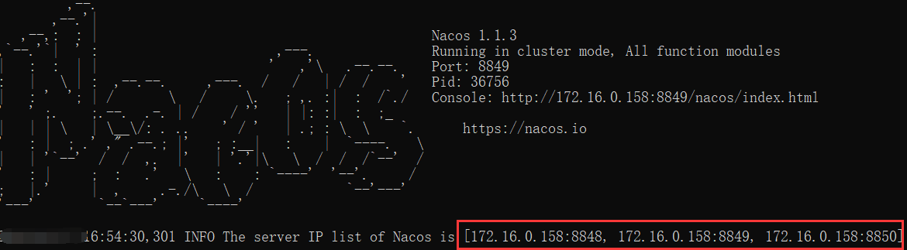

在任意一个nacos的控制台中，可以看到如下内容：

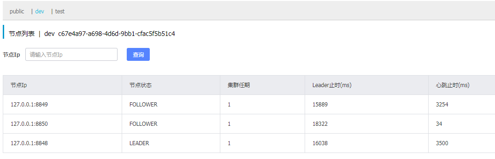

#### **5.3.2** 客户端配置

所有客户端，分别指定nacos集群中的若干节点：

测试，使用快速上手的例子：

（1）关掉127.0.0.1:8848 nacos Leader实例，发现Leader被成功选举至127.0.0.1:8850

（2）紧接着重新启动Provider，这时马上请求consumer的/service出现错误，发现consumer与provider通信已 经出现问题。但经过短暂的时间后，通信恢复。

通过测试，我们可以看到，通过以上的集群部署已经达到了高可用的效果。

#### **5.3.3** 生产环境部署建议

下图是官方推荐的集群方案，通过域名 + VIP模式的方式来实现。客户端配置的nacos，当Nacos集群迁移时，客 户端配置无需修改。

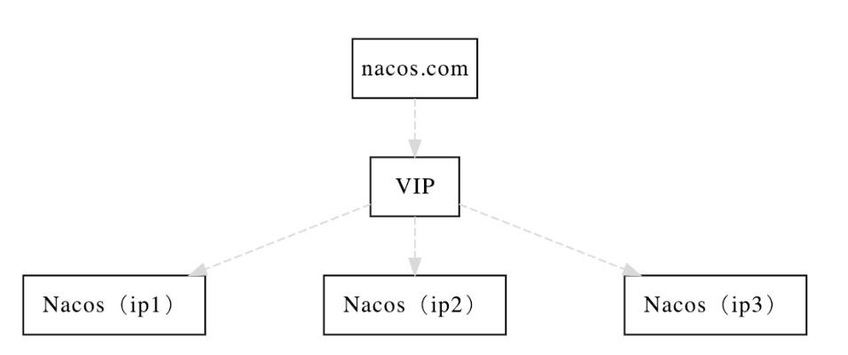{width="6.778170384951881in" height="2.8333333333333335in"}

至于数据库，生产环境下建议至少主备模式。通过修改${nacoshome}/conf/application.properties文件，能够使

nacos拥有多个数据源。

```properties
spring.datasource.platform=mysql
db.num=2
db.url.0=jdbc:mysql://127.0.0.1:3306/nacos_config?characterEncoding=utf8&autoReconnect=true
db.url.1=jdbc:mysql://127.0.0.1:3306/nacos_config?characterEncoding=utf8&autoReconnect=true
db.user=root
db.password=root
```

# 三、Nacos配置（简要说明）

## 1 摘自博客

[https://blog.csdn.net/jx520/article/details/114156339](https://blog.csdn.net/jx520/article/details/114156339)

## 2 各类型配置文件常规用法

bootstrap.yml ： 指定服务名称、nacos地址等，连接nacos 和读取配置必须的参数。
application.yml ： 本地配置信息。一些常规的配置。
${spring.application.name}-${profile}.${file-extension:properties} ： nacos上配置，覆盖本地配置。放一些有动态调整需求的配置比如：数据源配置、redis地址等。

### 2.1 基本概念
| 关键词 | 中文名字 | 默认值 | 说明 |
| --- | --- | --- | --- |
| namespace | 命名空间 | public | 习惯上用于区分开发环境 |
| group | 组 | DEFAULT_GROUP | 习惯上用于区分项目，同一个项目放在一组 |
| Data Id | 配置文件唯一标识 | 应用名称+扩展名 | 对应配置文件名称。`注意扩展名保持一致否则读不到。` |


### 2.2 推荐用法

1. 官方推荐用 `Namespace` 区分环境，用 `Group` 分组管理业务。
2. 在启动参数中传入`-Dspring.profiles.active=dev|test|prod` 指定环境。

## 3 Nacos 配置加载规则

### 3.1 指定加载

`bootstrap.yml` 比较常见的写法。

```yaml
spring:
  application:
    name: spring-cloud-alibaba-nacos-config # 应用名称
  cloud:
    nacos:
      config:
        server-addr: 127.0.0.1:8848 # nacos 地址。端口不能省略。
        file-extension: yml #配置文件扩展名
```

#### 3.1.1 dataID 默认

默认拼接：`${spring.cloud.nacos.config.prefix}`-`${spring.profile.active}`.`${spring.cloud.nacos.config.file-extension}`

- 配置前缀 `spring.cloud.nacos.config.prefix` 默认值 `spring.application.name`（服务名）。
- 当前环境 默认值 `spring.profiles.active` 。为空时链接符号`-`会自动去掉。
- 配置格式 `spring.cloud.nacos.config.file-extension` 默认 `properties`。

简化后，有`profile`：`${spring.application.name}-${spring.profile.active}.properties`
简化后，无`profile`：`${spring.application.name}.properties`

#### 3.1.2 group 默认

- `group` 默认为 `DEFAULT_GROUP`，可通过 `spring.cloud.nacos.config.group` 配置。

#### 3.1.3 namespace 默认

- `namespace` 默认 `Public`, 可通过 `spring.cloud.nacos.config.namespace` 配置。

### 3.2 加载多个

#### 3.2.1 扩展配置

让应用加载多个配置

- `**Deprecated**`
`spring.cloud.nacos.config.ext-config`：以数组方式指定配置
- `spring.cloud.nacos.config.extension-configs`：以数组方式指定配置

#### 3.2.2 共享配置

让多个应用共享配置（比如一些相同的公共配置）

- `**Deprecated**` 
   - 只认 DEFAULT_GROUP
   spring.cloud.nacos.config.shared-dataids：设置要加载的配置，多个用逗号分隔
   spring.cloud.nacos.config.refreshable-dataids：设置要自动刷新的配置，多个用逗号分隔。不设默认不自动刷新。
- `spring.cloud.nacos.config.shared-configs`：以数组方式指定配置

#### 3.2.3 配置例子

官方参考：[spring-cloud-alibaba - nacos-config-example - bootstrap.properties](https://github.com/alibaba/spring-cloud-alibaba/blob/29b955fffb1edbef552ed8a44b1b72dde7318a45/spring-cloud-alibaba-examples/nacos-example/nacos-config-example/src/main/resources/bootstrap.properties)

```yaml
spring:
  application:
    name: spring-cloud-alibaba-nacos-config # 应用名称
  cloud:
    nacos:
      config:
        server-addr: 127.0.0.1:8848 # nacos 地址
        namespace: 993d636c-2d9c-4485-9bd3-d2de4ba14f63 #  这里指定test。不填默认空就是 public
#        group: DEFAULT_GROUP # 默认 DEFAULT_GROUP 可以省
        prefix: log # 配置前缀
        file-extension: properties #配置文件扩展名
#        file-extension: yml #配置文件扩展名
#        file-extension: yaml #配置文件扩展名

       # 设置多个配置
        extension-configs[0]:
          dataid: config-4.yml
          group: TEST_GROUP
          refresh: true # 自动刷新
        extension-configs[1]:
          dataid: config-5.yml
          group: TEST_GROUP
          refresh: true
        extension-configs[2]:
          dataid: config-6.yml
          group: TEST_GROUP
          refresh: true

        # 共享配置
        shared-configs:
          - dataid: config-1.yml
            refresh: true # 自动刷新
          - dataid: config-2.yml
            refresh: true
          - dataid: config-3.yml
            refresh: true
```

## 4 配置 - 优先级

### 1. spring.profiles.active

注意： `bootstrap` 正好与 `application` **相反**
**文件名.profile**：带 `profile` > 不带 `profile` 的优先级：`bootstrap-dev.yaml` > `application.yaml`

### 2. 按位置 - 优先级

`线上nacos`> `线下jar外` > `线下jar内`

线下`jar包内外`的优先级详见：**四、SpringBoot 配置文件基础知识**

### 3. 按类型 - 优先级

先加载 `bootstrap` 后加载 `application`

| 优先级 | 配置 |
| --- | --- |
| Top 1 | nacos上：`${spring.application.name}`
-`${profile}`
.`${file-extension:properties}` |
| Top 2 | application.properties |
| Top 3 | application.yml |
| Top 4 | application.yaml |
| Top 5 | bootstrap.properties |
| Top 6 | bootstrap.yml |
| Top 7 | bootstrap.yaml |


虽然这里列出来的很花哨，但正常来说项目中我们不可能这样混着写。

### 4. 按方式 - 优先级

从高到底：

1. `${spring.application.name}-${profile}.${file-extension}` 内置规则（此级别中类型优先级如上）
2. 扩展配置 `spring.cloud.nacos.config.extension-configs` 数组索引`大`的优先`高`
3. 共享配置 `spring.cloud.nacos.config.shared-configs` 数组索引`大`的优先`高`

[Spring Cloud Alibaba Nacos Config 目前提供了三种配置能力从 Nacos 拉取相关的配置](https://github.com/alibaba/spring-cloud-alibaba/wiki/Nacos-config#%E9%85%8D%E7%BD%AE%E7%9A%84%E4%BC%98%E5%85%88%E7%BA%A7)

## 5 动态刷新

### 方案一、通过 `ConfigurableApplicationContext` 上下文

```java
@Autowired
private ConfigurableApplicationContext context; // 就是启动类中 SpringApplication.run() 返回的对象。
...
System.out.println("动态更新配置 > "+ context.getEnvironment().getProperty("配置文件中的key") );
```

### 方案二、`@RefreshScope` 注解

在类上添加 `@RefreshScope` 开启内置配置自动刷新

### 方案三、`扩展配置、共享配置`

通过配置项`refresh = true` 开启。

# 四、SpringBoot 配置文件基础知识

## 1 SpringBoot 配置文件

### 1.1 配置文件格式

SpringBoot默认支持加载：`.properties`、`.yaml`和`.yml` 。

### 1.2 配置文件名

#### 1.2.1 配置文件名（默认）

SpringBoot默认支持加载文件名：application.properties 和 application.yaml 。

> 提醒： bootstrap.properties 和 bootstrap.yml 是 SpringCloud 配置文件。需要 spring-cloud-context依赖。
详情看文档： Spring Cloud Context: [Spring Cloud Context: Application Context Services](https://cloud.spring.io/spring-cloud-commons/multi/multi__spring_cloud_context_application_context_services.html)


#### 1.2.2 配置文件名（自定义）

如果不喜欢默认配置文件名`application`，可以指定配置文件名 `--spring.config.name=文件名` 。

### 1.3 配置优先级

#### 1.3.1 原则：

> 1. 先入为主
> 2. 由外而内
> 3. 相同属性，高级覆盖低级


#### 1.3.2 内外顺序：(TODO)

TODO

### 1.4 配置文件优先级

从上到到，从左到右，依次递减：

- 按文件位置：(指定)外部配置文件 > (默认)外部配置文件 > 内部配置文件
- 文件名.profile：不带 profile > 带 profile 的优先级：application.yaml > application-dev.yaml
- 文件格式： properties > yaml > yml

### 1.5 内部配置文件（默认位置）

- `SpringBoot`默认的全局配置文件在`src/main/resources`目录下。

### 1.6 外部配置文件（默认位置）

除了默认的全局配置文件以外SpringBoot项目默认会扫描以下位置，加载外部配置文件，优先级从低到高：

1. classpath根目录
2. classpath下的/config目录
3. 当前文件夹
4. 当前文件夹下的/config目录
5. 当前文件夹下的/config目录的直接子目录

`SpringBoot`启动后会按此列表顺序加载文件。如果有相同属性，后加载的覆盖前面的，所以在后面的优先级高。

### 1.7、外部配置文件（修改位置）

这里会用到命令行属性语法：`--` 如：`--<name>=<value>`
指定外部配置文件 `--spring.config.location`=`配置文件路径`

#### 例子：注意路径斜杠

绝对路径：java -jar demo.jar --spring.config.location=C:/application.yaml
父文件夹：java -jar demo.jar --spring.config.location=../application.yaml
当前路径：java -jar demo.jar --spring.config.location=application.yaml
子文件夹：java -jar demo.jar --spring.config.location=config/application.yaml
**多个路径可以用逗号**`**,**`**分隔**
`java -jar demo.jar --spring.config.location`=`myconfig1.yaml`,`../myconfig2.yaml`,`../myconfig3.yaml`

### 1.8 外部配置文件（添加位置）

--spring.config.location 后 **默认配置文件** 就 **失效** 了 。
如果不想修改，只想添加可以使用：spring.config.additional-location=配置文件路径

### 1.9 设置为可选项

java -jar demo.jar --spring.config.location=myconfig1.yaml
如果 myconfig1.yaml 不存在会报错提示：

```
Check that the value '../myconfig1.yaml' is correct, or prefix it with 'optional:'
```

如此我们添加上optional:即可让其不存时，也不会报错了。
`java -jar demo.jar --spring.config.location=optional:myconfig1.yaml`

### 1.10 启动参数

#### -D 配置系统属性

语法：**-D=**
覆盖指定值，在启动时通过**-D**传参覆盖 **hero.name** 的值
例子：java -jar -Dhero.name=李四 demo.jar

#### – 命令行属性

命令行属性语法：-- 如：--=

### SpringBoot 默认配置（文档）

[2.1.0.BUILD-SNAPSHOT](https://docs.spring.io/spring-boot/docs/2.1.0.BUILD-SNAPSHOT/reference/htmlsingle/#common-application-properties)
[2.1.8.RELEASE](https://docs.spring.io/spring-boot/docs/2.1.8.RELEASE/reference/htmlsingle/#common-application-properties)

[2.2.0.BUILD-SNAPSHOT](https://docs.spring.io/spring-boot/docs/2.2.0.BUILD-SNAPSHOT/reference/htmlsingle/#appendix)
[2.2.0.M6](https://docs.spring.io/spring-boot/docs/2.2.0.M6/reference/htmlsingle/#appendix)

# 五 Nacos config

## 官网地址

[https://github.com/alibaba/spring-cloud-alibaba/wiki/Nacos-config](https://github.com/alibaba/spring-cloud-alibaba/wiki/Nacos-config)

## Spring Cloud Alibaba Nacos Config

Nacos 提供用于存储配置和其他元数据的 key/value 存储，为分布式系统中的外部化配置提供服务器端和客户端支持。使用 Spring Cloud Alibaba Nacos Config，您可以在 Nacos Server 集中管理你 Spring Cloud 应用的外部属性配置。

Spring Cloud Alibaba Nacos Config 是 Config Server 和 Client 的替代方案，客户端和服务器上的概念与 Spring Environment 和 PropertySource 有着一致的抽象，在特殊的 bootstrap 阶段，配置被加载到 Spring 环境中。当应用程序通过部署管道从开发到测试再到生产时，您可以管理这些环境之间的配置，并确保应用程序具有迁移时需要运行的所有内容。

### 快速开始

##### Nacos 服务端初始化

1、启动Nacos Server。启动方式可见 [Nacos 官网](https://nacos.io/zh-cn/docs/quick-start.html)

2、启动好Nacos之后，在Nacos添加如下的配置：

```
Data ID:    nacos-config.properties

Group  :    DEFAULT_GROUP

配置格式:    Properties

配置内容：   user.name=nacos-config-properties
            user.age=90
```
| Note | 注意dataid是以 properties(默认的文件扩展名方式)为扩展名。 |
| --- | --- |


##### 客户端使用方式

如果要在您的项目中使用 Nacos 来实现应用的外部化配置，使用 group ID 为 `com.alibaba.cloud` 和 artifact ID 为 `spring-cloud-starter-alibaba-nacos-config` 的 starter。

```xml
<dependency>
    <groupId>com.alibaba.cloud</groupId>
    <artifactId>spring-cloud-starter-alibaba-nacos-config</artifactId>
</dependency>
```

现在就可以创建一个标准的 Spring Boot 应用。

```java
@SpringBootApplication
public class ProviderApplication {

    public static void main(String[] args) {
        ConfigurableApplicationContext applicationContext = SpringApplication.run(ProviderApplication.class, args);
        String userName = applicationContext.getEnvironment().getProperty("user.name");
        String userAge = applicationContext.getEnvironment().getProperty("user.age");
        System.err.println("user name :"+userName+"; age: "+userAge);
    }
}
```

在运行此 Example 之前， **必须使用 bootstrap.properties 配置文件来配置Nacos Server 地址**，例如：

bootstrap.properties

```properties
spring.application.name=nacos-config
spring.cloud.nacos.config.server-addr=127.0.0.1:8848
```
| Note | 注意当你使用域名的方式来访问 Nacos 时，`spring.cloud.nacos.config.server-addr`
 配置的方式为 `域名:port`
。 例如 Nacos 的域名为abc.com.nacos，监听的端口为 80，则 `spring.cloud.nacos.config.server-addr=abc.com.nacos:80`
。 注意 80 端口不能省略。 |
| --- | --- |


启动这个 Example，可以看到如下输出结果：

```verilog
2018-11-02 14:24:51.638  INFO 32700 --- [main] c.a.demo.provider.ProviderApplication    : Started ProviderApplication in 14.645 seconds (JVM running for 15.139)
user name :nacos-config-properties; age: 90
2018-11-02 14:24:51.688  INFO 32700 --- [-127.0.0.1:8848] s.c.a.AnnotationConfigApplicationContext : Refreshing org.springframework.context.annotation.AnnotationConfigApplicationContext@a8c5e74: startup date [Fri Nov 02 14:24:51 CST 2018]; root of context hierarchy
2018-11
```

### 基于 dataid 为 yaml 的文件扩展名配置方式

spring-cloud-starter-alibaba-nacos-config 对于 yaml 格式也是完美支持的。这个时候只需要完成以下两步：

1、在应用的 bootstrap.properties 配置文件中显示的声明 dataid 文件扩展名。如下所示

bootstrap.properties

```properties
spring.cloud.nacos.config.file-extension=yaml
```

2、在 Nacos 的控制台新增一个dataid为yaml为扩展名的配置，如下所示：

```yaml
# Data ID:        nacos-config.yaml

# Group  :        DEFAULT_GROUP

# 配置格式:        YAML

# 配置内容:        
user.name: nacos-config-yaml
user.age: 68
```

这两步完成后，重启测试程序，可以看到如下输出结果。

```verilog
2018-11-02 14:59:00.484  INFO 32928 --- [main] c.a.demo.provider.ProviderApplication:Started ProviderApplication in 14.183 seconds (JVM running for 14.671)
user name :nacos-config-yaml; age: 68
2018-11-02 14:59:00.529  INFO 32928 --- [-127.0.0.1:8848] s.c.a.AnnotationConfigApplicationContext : Refreshing org.springframework.context.annotation.AnnotationConfigApplicationContext@265a478e: startup date [Fri Nov 02 14:59:00 CST 2018]; root of context hierarchy
```

### 支持配置的动态更新

spring-cloud-starter-alibaba-nacos-config 也支持配置的动态更新，启动 Spring Boot 应用测试的代码如下：

```java
@SpringBootApplication
public class ProviderApplication {

    public static void main(String[] args) {
        ConfigurableApplicationContext applicationContext = SpringApplication.run(ProviderApplication.class, args);
        while(true) {
            //当动态配置刷新时，会更新到 Enviroment中，因此这里每隔一秒中从Enviroment中获取配置
            String userName = applicationContext.getEnvironment().getProperty("user.name");
            String userAge = applicationContext.getEnvironment().getProperty("user.age");
            System.err.println("user name :" + userName + "; age: " + userAge);
            TimeUnit.SECONDS.sleep(1);
        }
    }
}
```

如下所示，当变更user.name时，应用程序中能够获取到最新的值：

```verilog
user name :nacos-config-yaml; age: 68
user name :nacos-config-yaml; age: 68
user name :nacos-config-yaml; age: 68
2018-11-02 15:04:25.069  INFO 32957 --- [-127.0.0.1:8848] o.s.boot.SpringApplication               : Started application in 0.144 seconds (JVM running for 71.752)
2018-11-02 15:04:25.070  INFO 32957 --- [-127.0.0.1:8848] s.c.a.AnnotationConfigApplicationContext : Closing org.springframework.context.annotation.AnnotationConfigApplicationContext@10c89124: startup date [Fri Nov 02 15:04:25 CST 2018]; parent: org.springframework.context.annotation.AnnotationConfigApplicationContext@6520af7
2018-11-02 15:04:25.071  INFO 32957 --- [-127.0.0.1:8848] s.c.a.AnnotationConfigApplicationContext : Closing org.springframework.context.annotation.AnnotationConfigApplicationContext@6520af7: startup date [Fri Nov 02 15:04:24 CST 2018]; root of context hierarchy
//从 Enviroment 中 读取到更改后的值
user name :nacos-config-yaml-update; age: 68
user name :nacos-config-yaml-update; age: 68
```
| Note | 你可以通过配置 `spring.cloud.nacos.config.refresh.enabled=false`
 来关闭动态刷新 |
| --- | --- |


### 可支持profile粒度的配置

spring-cloud-starter-alibaba-nacos-config 在加载配置的时候，不仅仅加载了以 dataid 为 `${spring.application.name}.${file-extension:properties}` 为前缀的基础配置，还加载了dataid为 `${spring.application.name}-${profile}.${file-extension:properties}` 的基础配置。在日常开发中如果遇到多套环境下的不同配置，可以通过Spring 提供的 `${spring.profiles.active}` 这个配置项来配置。

```
spring.profiles.active=develop
```
| Note | ${spring.profiles.active} 当通过配置文件来指定时必须放在 bootstrap.properties 文件中。 |
| --- | --- |


Nacos 上新增一个dataid为：nacos-config-develop.yaml的基础配置，如下所示：

```yaml
# Data ID:        nacos-config-develop.yaml

# Group  :        DEFAULT_GROUP

# 配置格式:        YAML

# 配置内容:        
current.env: develop-env
```

启动 Spring Boot 应用测试的代码如下：

```java
@SpringBootApplication
public class ProviderApplication {

    public static void main(String[] args) {
        ConfigurableApplicationContext applicationContext = SpringApplication.run(ProviderApplication.class, args);
        while(true) {
            String userName = applicationContext.getEnvironment().getProperty("user.name");
            String userAge = applicationContext.getEnvironment().getProperty("user.age");
            //获取当前部署的环境
            String currentEnv = applicationContext.getEnvironment().getProperty("current.env");
            System.err.println("in "+currentEnv+" enviroment; "+"user name :" + userName + "; age: " + userAge);
            TimeUnit.SECONDS.sleep(1);
        }
    }
}
```

启动后，可见控制台的输出结果：

```verilog
in develop-env enviroment; user name :nacos-config-yaml-update; age: 68
2018-11-02 15:34:25.013  INFO 33014 --- [ Thread-11] ConfigServletWebServerApplicationContext : Closing org.springframework.boot.web.servlet.context.AnnotationConfigServletWebServerApplicationContext@6f1c29b7: startup date [Fri Nov 02 15:33:57 CST 2018]; parent: org.springframework.context.annotation.AnnotationConfigApplicationContext@63355449
```

如果需要切换到生产环境，只需要更改 `${spring.profiles.active}` 参数配置即可。如下所示：

```
spring.profiles.active=product
```

同时生产环境上 Nacos 需要添加对应 dataid 的基础配置。例如，在生成环境下的 Naocs 添加了dataid为：nacos-config-product.yaml的配置：

```yaml
# Data ID:        nacos-config-product.yaml

# Group  :        DEFAULT_GROUP

# 配置格式:        YAML

# 配置内容:        
current.env: product-env
```

启动测试程序，输出结果如下：

```verilog
in product-env enviroment; user name :nacos-config-yaml-update; age: 68
2018-11-02 15:42:14.628  INFO 33024 --- [Thread-11] ConfigServletWebServerApplicationContext : Closing org.springframework.boot.web.servlet.context.AnnotationConfigServletWebServerApplicationContext@6aa8e115: startup date [Fri Nov 02 15:42:03 CST 2018]; parent: org.springframework.context.annotation.AnnotationConfigApplicationContext@19bb07ed
```
| Note | 此案例中我们通过 `spring.profiles.active=<profilename>`
 的方式写死在配置文件中，而在真正的项目实施过程中这个变量的值是需要不同环境而有不同的值。这个时候通常的做法是通过 `-Dspring.profiles.active=<profile>`
 参数指定其配置来达到环境间灵活的切换。 |
| --- | --- |


### 支持自定义 namespace 的配置

首先看一下 Nacos 的 Namespace 的概念， [Nacos 概念](https://nacos.io/zh-cn/docs/concepts.html)

> 用于进行租户粒度的配置隔离。不同的命名空间下，可以存在相同的 Group 或 Data ID 的配置。Namespace 的常用场景之一是不同环境的配置的区分隔离，例如开发测试环境和生产环境的资源（如配置、服务）隔离等。


在没有明确指定 `${spring.cloud.nacos.config.namespace}` 配置的情况下， 默认使用的是 Nacos 上 Public 这个namespae。如果需要使用自定义的命名空间，可以通过以下配置来实现：

```
spring.cloud.nacos.config.namespace=b3404bc0-d7dc-4855-b519-570ed34b62d7
```
| Note | 该配置必须放在 bootstrap.properties 文件中。此外 `spring.cloud.nacos.config.namespace`
 的值是 namespace 对应的 id，id 值可以在 Nacos 的控制台获取。并且在添加配置时注意不要选择其他的 namespae，否则将会导致读取不到正确的配置。 |
| --- | --- |


### 支持自定义 Group 的配置

在没有明确指定 `${spring.cloud.nacos.config.group}` 配置的情况下， 默认使用的是 DEFAULT_GROUP 。如果需要自定义自己的 Group，可以通过以下配置来实现：

```properties
spring.cloud.nacos.config.group=DEVELOP_GROUP
```
| Note | 该配置必须放在 bootstrap.properties 文件中。并且在添加配置时 Group 的值一定要和 `spring.cloud.nacos.config.group`
 的配置值一致。 |
| --- | --- |


### 支持自定义扩展的 Data Id 配置

Spring Cloud Alibaba Nacos Config 从 0.2.1 版本后，可支持自定义 Data Id 的配置。关于这部分详细的设计可参考 [这里](https://github.com/spring-cloud-incubator/spring-cloud-alibaba/issues/141)。 一个完整的配置案例如下所示：

```properties
spring.application.name=opensource-service-provider
spring.cloud.nacos.config.server-addr=127.0.0.1:8848

# config external configuration
# 1、Data Id 在默认的组 DEFAULT_GROUP,不支持配置的动态刷新
spring.cloud.nacos.config.extension-configs[0].data-id=ext-config-common01.properties

# 2、Data Id 不在默认的组，不支持动态刷新
spring.cloud.nacos.config.extension-configs[1].data-id=ext-config-common02.properties
spring.cloud.nacos.config.extension-configs[1].group=GLOBALE_GROUP

# 3、Data Id 既不在默认的组，也支持动态刷新
spring.cloud.nacos.config.extension-configs[2].data-id=ext-config-common03.properties
spring.cloud.nacos.config.extension-configs[2].group=REFRESH_GROUP
spring.cloud.nacos.config.extension-configs[2].refresh=true
```

可以看到:

- 通过 `spring.cloud.nacos.config.extension-configs[n].data-id` 的配置方式来支持多个 Data Id 的配置。
- 通过 `spring.cloud.nacos.config.extension-configs[n].group` 的配置方式自定义 Data Id 所在的组，不明确配置的话，默认是 DEFAULT_GROUP。
- 通过 `spring.cloud.nacos.config.extension-configs[n].refresh` 的配置方式来控制该 Data Id 在配置变更时，是否支持应用中可动态刷新， 感知到最新的配置值。默认是不支持的。
| Note | 多个 Data Id 同时配置时，他的优先级关系是 `spring.cloud.nacos.config.extension-configs[n].data-id`
 其中 n 的值越大，优先级越高。 |
| --- | --- |

| Note | `spring.cloud.nacos.config.extension-configs[n].data-id`
 的值必须带文件扩展名，文件扩展名既可支持 properties，又可以支持 yaml/yml。 此时 `spring.cloud.nacos.config.file-extension`
 的配置对自定义扩展配置的 Data Id 文件扩展名没有影响。 |
| --- | --- |


通过自定义扩展的 Data Id 配置，既可以解决多个应用间配置共享的问题，又可以支持一个应用有多个配置文件。

为了更加清晰的在多个应用间配置共享的 Data Id ，你可以通过以下的方式来配置：

```properties
# 配置支持共享的 Data Id
spring.cloud.nacos.config.shared-configs[0].data-id=common.yaml

# 配置 Data Id 所在分组，缺省默认 DEFAULT_GROUP
spring.cloud.nacos.config.shared-configs[0].group=GROUP_APP1

# 配置Data Id 在配置变更时，是否动态刷新，缺省默认 false
spring.cloud.nacos.config.shared-configs[0].refresh=true
```

可以看到：

- 通过 `spring.cloud.nacos.config.shared-configs[n].data-id` 来支持多个共享 Data Id 的配置。
- 通过 `spring.cloud.nacos.config.shared-configs[n].group` 来配置自定义 Data Id 所在的组，不明确配置的话，默认是 DEFAULT_GROUP。
- 通过 `spring.cloud.nacos.config.shared-configs[n].refresh` 来控制该Data Id在配置变更时，是否支持应用中动态刷新，默认false。

### 配置的优先级

Spring Cloud Alibaba Nacos Config 目前提供了三种配置能力从 Nacos 拉取相关的配置。

- A: 通过 `spring.cloud.nacos.config.shared-configs[n].data-id` 支持多个共享 Data Id 的配置
- B: 通过 `spring.cloud.nacos.config.extension-configs[n].data-id` 的方式支持多个扩展 Data Id 的配置
- C: 通过内部相关规则(应用名、应用名+ Profile )自动生成相关的 Data Id 配置

当三种方式共同使用时，他们的一个优先级关系是:A < B < C

### 完全关闭配置

通过设置 spring.cloud.nacos.config.enabled = false 来完全关闭 Spring Cloud Nacos Config
