# 二、Nacos - 服务发现

> **教学目标**


1）理解什么是微服务

2）能够说出服务发现的概念以及使用场景

3）了解主流的服务发现中心

4）掌握Nacos作为服务发现中心的快速入门方法

5）理解Nacos服务发现的核心概念及数据模型

6）掌握使用Nacos控制台管理服务的操作方法

7）了解Nacos服务发现API的使用方式

8）掌握Spring cloud alibaba实际项目架构案例

9）掌握Nacos与dubbo集成方式

## 1 概览

### 1.1 从单体架构到微服务

#### 1.1.1 单体架构

Web应用程序发展的早期，大部分web工程师将所有的功能模块打包到一起并放在一个web容器中运行，所有功能 模块使用同一个数据库，同时，它还提供API或者UI访问的web模块等。


尽管也是模块化逻辑，但是最终它还是会打包并部署为单体式应用，这种将所有功能都部署在一个web容器中运行 的系统就叫做**单体架构**（也叫：巨石型应用）。

单体架构有很多好处：

**开发效率高**：模块之间交互采用本地方法调用，并节省微服务之间的交互讨论时间与开发成本。

**容易测试**：IDE都是为开发单个应用设计的、容易测试------在本地就可以启动完整的系统。

**容易部署**：运维成本小，直接打包为一个完整的包，拷贝到web容器的某个目录下即可运行。 但是，上述的好处是有条件的，它适用于小型简单应用，对于大规模的复杂应用，就会展现出来以下的不足：

**复杂性逐渐变高，可维护性逐渐变差** ：所有业务模块部署在一起，复杂度越来越高，修改时牵一发动全身。

**版本迭代速度逐渐变慢**：修改一个地方就要将整个应用全部编译、部署、启动时间过长、回归测试周期过长。

**阻碍技术创新**：若更新技术框架，除非你愿意将系统全部重写，无法实现部分技术更新。

**无法按需伸缩**：通过冗余部署完整应用的方式来实现水平扩展，无法针对某业务按需伸缩。

### 1.1.2 微服务

许多大型公司，通过采用微服务架构解决了上述问题。其思路不是开发一个巨大的单体式的应用，而是将应用分解 为小的、互相连接的微服务。

一个微服务一般完成某个特定的功能，比如订单服务、用户服务等等。每一个微服务都是完整应用，都有自己的业 务逻辑和数据库。一些微服务还会发布API给其它微服务和应用客户端使用。

比如，一个前面描述系统可能的分解如下：

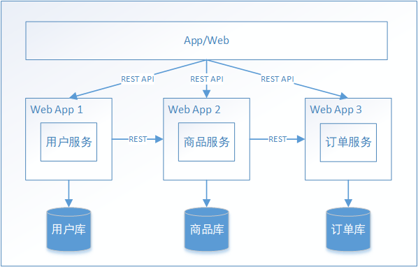

每一个业务模块都使用独立的服务完成，这种微服务架构模式也影响了应用和数据库之间的关系，不像传统多个业 务模块共享一个数据库，微服务架构每个服务都有自己的数据库。

微服务架构的好处：

- 分而治之，职责单一；易于开发、理解和维护、方便团队的拆分和管理
- 可伸缩；能够单独的对指定的服务进行伸缩
- 局部容易修改，容易替换，容易部署，有利于持续集成和快速迭代
- 不会受限于任何技术栈

## 1.2 什么是服务发现

在微服务架构中，整个系统会按职责能力划分为多个服务，通过服务之间协作来实现业务目标。这样在我们的代码 中免不了要进行服务间的远程调用，服务的消费方要调用服务的生产方，为了完成一次请求，消费方需要知道服务 生产方的网络位置(IP地址和端口号)。

我们的代码可以通过读取配置文件的方式读取服务生产方网络位置，如下：

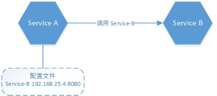

我们通过Spring boot技术很容易实现：

#### Service B（服务生产者）

Service B是服务的生产方，暴露/service服务地址，实现代码如下：

```java
@SpringBootApplication
@RestController
public class SpringRestProviderBootstrap {
    public static void main(String[] args) {
        SpringApplication.run(SpringRestProviderBootstrap.class, args);
    }
    
    @GetMapping(value = "/service") //暴露服务
    public String service(){
    	return "provider invoke";
    }
}
```

配置文件：

```properties
server.port = 56010
```

#### Service A（服务消费者）

实现代码：

```java
@SpringBootApplication
@RestController
public class SpringRestConsumerBootstrap {
    public static void main(String[] args) {
    	SpringApplication.run(SpringRestConsumerBootstrap.class, args);
    }
    @Value("${provider.address}")
    private String providerAddress;
    @GetMapping(value = "/service")
    public String service(){
        RestTemplate restTemplate = new RestTemplate();
        //调用服务
        String providerResult = restTemplate.getForObject("http://" + providerAddress +
        "/service",String.class);
        return "consumer invoke | " + providerResult;
    }
}
```

配置文件：

```properties
server.port = 56020
# 服务生产方地址
provider.address = 127.0.0.1:56010
```

访问[http://127.0.0.1:56020/service](http://127.0.0.1:56020/service)，输出以下内容：

看上去很完美，但是，仔细考虑以下，此方案对于微服务应用而言行不通。

首先，微服务可能是部署在云环境的，服务实例的网络位置或许是动态分配的。另外，每一个服务一般会有多个实 例来做负载均衡，由于宕机或升级，服务实例网络地址会经常动态改变。再者，每一个服务也可能应对临时访问压 力增加新的服务节点。正如下图所示：

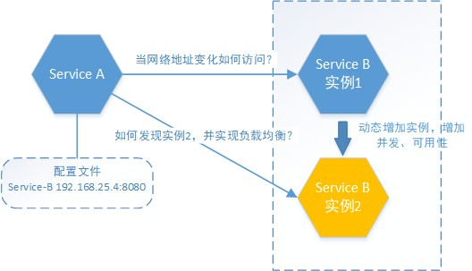

基于以上的问题，服务之间如何相互感知？服务如何管理？这就是服务发现的问题了。如下图：

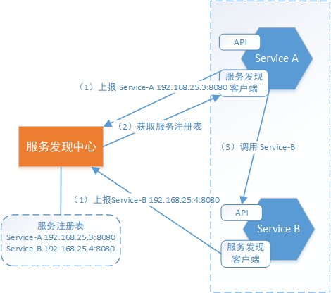

上图中服务实例本身并不记录服务生产方的网络地址，所有服务实例内部都会包含**服务发现客户端**。

（1）在每个服务启动时会向**服务发现中心**上报自己的网络位置。这样，在服务发现中心内部会形成一个**服务注册 表**，**服务注册表**是服务发现的核心部分，是包含所有服务实例的网络地址的数据库。

（2）**服务发现客户端**会定期从**服务发现中心**同步**服务注册表** ，并缓存在客户端。

（3）当需要对某服务进行请求时，服务实例通过该注册表，定位目标服务网络地址。若目标服务存在多个网络地 址，则使用负载均衡算法从多个服务实例中选择出一个，然后发出请求。

**总结一下**，在微服务环境中，由于服务运行实例的网络地址是不断动态变化的，服务实例数量的动态变化 ，因此无法使用固定的配置文件来记录服务提供方的网络地址，必须使用动态的服务发现机制用于实现微服务间的**相互感 知**。各服务实例会上报自己的网络地址，这样服务中心就形成了一个完整的服务注册表，各服务实例会通过**服务发现中心**来获取访问目标服务的网络地址，从而实现**服务发现**的机制。

## 1.3 主流服务发现与配置中心对比

目前市面上用的比较多的服务发现中心有：Nacos、Eureka、Consul和Zookeeper。

| 对比项目 | Nacos | Eureka | Consul | Zookeeper |
| --- | --- | --- | --- | --- |
| 一致性协议 | 支持AP和CP模型 | AP模型 | CP模型 | CP模型 |
| 健康检查 | TCP/HTTP/MYSQL/Client Beat | Client Beat | TCP/HTTP/gRPC/Cmd | Keep Alive |
| 负载均衡策略 | 权重/metadata/Selector | Ribbon | Fabio | - |
| 雪崩保护 | 有 | 有 | 无 | 无 |
| 自动注销实例 | 支持 | 支持 | 不支持 | 支持 |
| 访问协议 | HTTP/DNS | HTTP | HTTP/DNS | TCP |
| 监听支持 | 支持 | 支持 | 支持 | 支持 |
| 多数据中心 | 支持 | 支持 | 支持 | 不支持 |
| 跨注册中心同步 | 支持 | 不支持 | 支持 | 不支持 |
| SpringCloud集成 | 支持 | 支持 | 支持 | 不支持 |
| Dubbo集成 | 支持 | 不支持 | 不支持 | 支持 |
| k8s集成 | 支持 | 不支持 | 支持 | 不支持 |


从上面对比可以了解到，Nacos作为服务发现中心，具备更多的功能支持项，且从长远来看Nacos在以后的版本会支持SpringCloud+Kubernetes的组合，填补 2 者的鸿沟，在两套体系下可以采用同一套服务发现和配置管理的解决方案，这将大大的简化使用和维护的成本。另外，Nacos 计划实现 Service Mesh，也是未来微服务发展的趋势。

## Nacos简介

{width="2.6872648731408573in" height="0.6041666666666666in"}

Nacos是阿里的一个开源产品，它是针对微服务架构中的服务发现、配置管理、服务治理的综合型解决方案。 官方介绍是这样的：

> Nacos 致力于帮助您发现、配置和管理微服务。Nacos 提供了一组简单易用的特性集，帮助您快速实现动态服务发现、服务配置、服务元数据及流量管理。
>  
> Nacos 帮助您更敏捷和容易地构建、交付和管理微服务平台。 Nacos 是构建以“服务”为中心的现代应用架构 (例如微服务范式、云原生范式) 的服务基础设施。


官网地址：[https://nacos.io/zh-cn/](https://nacos.io/zh-cn/)

## Nacos特性

> Nacos主要提供以下四大功能：
>  
> -  **服务发现和服务健康监测**
Nacos 支持基于 DNS 和基于 RPC 的服务发现。服务提供者使用 [原生SDK](https://nacos.io/zh-cn/docs/sdk.html)、[OpenAPI](https://nacos.io/zh-cn/docs/open-api.html)、或一个[独立的Agent TODO](https://nacos.io/zh-cn/docs/other-language.html)注册 Service 后，服务消费者可以使用[DNS TODO](https://nacos.io/zh-cn/docs/xx) 或[HTTP&API](https://nacos.io/zh-cn/docs/open-api.html)查找和发现服务。
Nacos 提供对服务的实时的健康检查，阻止向不健康的主机或服务实例发送请求。Nacos 支持传输层 (PING 或 TCP)和应用层 (如 HTTP、MySQL、用户自定义）的健康检查。 对于复杂的云环境和网络拓扑环境中（如 VPC、边缘网络等）服务的健康检查，Nacos 提供了 agent 上报模式和服务端主动检测2种健康检查模式。Nacos 还提供了统一的健康检查仪表盘，帮助您根据健康状态管理服务的可用性及流量。 
> -  **动态配置服务**
动态配置服务可以让您以中心化、外部化和动态化的方式管理所有环境的应用配置和服务配置。
动态配置消除了配置变更时重新部署应用和服务的需要，让配置管理变得更加高效和敏捷。
配置中心化管理让实现无状态服务变得更简单，让服务按需弹性扩展变得更容易。
Nacos 提供了一个简洁易用的UI ([控制台样例 Demo](http://console.nacos.io/nacos/index.html)) 帮助您管理所有的服务和应用的配置。Nacos 还提供包括配置版本跟踪、金丝雀发布、一键回滚配置以及客户端配置更新状态跟踪在内的一系列开箱即用的配置管理特性，帮助您更安全地在生产环境中管理配置变更和降低配置变更带来的风险。 
> -  **动态 DNS 服务**
动态 DNS 服务支持权重路由，让您更容易地实现中间层负载均衡、更灵活的路由策略、流量控制以及数据中心内网的简单DNS解析服务。动态DNS服务还能让您更容易地实现以 DNS 协议为基础的服务发现，以帮助您消除耦合到厂商私有服务发现 API 上的风险。
Nacos 提供了一些简单的 [DNS APIs TODO](https://nacos.io/zh-cn/docs/xx) 帮助您管理服务的关联域名和可用的 IP:PORT 列表. 
> -  **服务及其元数据管理**
Nacos 能让您从微服务平台建设的视角管理数据中心的所有服务及元数据，包括管理服务的描述、生命周期、服务的静态依赖分析、服务的健康状态、服务的流量管理、路由及安全策略、服务的 SLA 以及最首要的 metrics 统计数据。 
> -  [更多的特性列表 ...](https://nacos.io/zh-cn/docs/roadmap.html) 


这里1、3、4说明了服务发现的功能特性。

# 2 Nacos 服务发现快速入门

> 本小节，我们将演示如何使用**Spring Cloud Alibaba Nacos Discovery**为**Spring cloud** 应用程序与 Nacos 的无 缝集成。 通过一些原生的**spring cloud**注解，我们可以快速来实现Spring cloud微服务的服务发现机制，并使用 Nacos Server作为服务发现中心，统一管理所有微服务。


## Spring Cloud服务协作流程

现在，我们对Spring cloud内的一些组件还不了解，为了能够完全理解快速入门程序，我们需要学习以下内容。 Spring Cloud 常见的集成方式是使用Feign+Ribbon技术来完成服务间远程调用及负载均衡的，如下图：

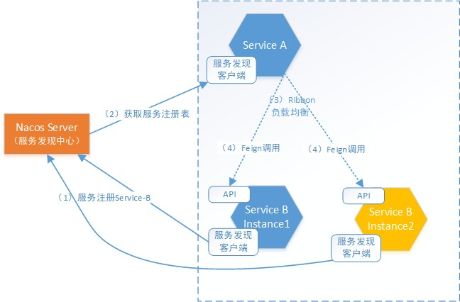

（1）在微服务启动时，会向服务发现中心上报自身实例信息，这里ServiceB 包含多个实例。 每个实例包括：IP地址、端口号信息。

（2）微服务会定期从Nacos Server(服务发现中心)获取服务实例列表。

（3）当ServiceA调用ServiceB时，ribbon组件从本地服务实例列表中查找ServiceB的实例，如获取了多个实例如Instance1、Instance2。这时ribbon会通过用户所配置的**负载均衡策略**从中选择一个实例。

（4）最终，Feign组件会通过ribbon选取的实例发送http请求。

采用Feign+Ribbon的整合方式，是由Feign完成远程调用的整个流程。而Feign集成了Ribbon，Feign使用Ribbon 完成调用实例的负载均衡。

### 2.1.1 负载均衡的概念

在SpringCloud服务协议流程中，ServiceA通过负载均衡调用ServiceB，下边来了解一下**负载均衡**：

**负载均衡**就是将用户请求（流量）通过一定的策略，分摊在多个服务实例上执行，它是系统处理高并发、缓解网络 压力和进行服务端扩容的重要手段之一。它分为**服务端负载均衡**和**客户端负载均衡**。

#### 服务器端负载均衡：

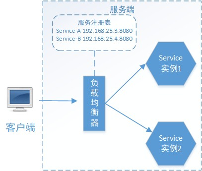

在负载均衡器中维护一个可用的服务实例清单，当客户端请求来临时，负载均衡服务器按照某种配置好的规则(**负载均衡算法**)从可用服务实例清单中选取其一去处理客户端的请求。这就是服务端负载均衡。

> 例如Nginx，通过Nginx进行负载均衡，客户端发送请求至Nginx，Nginx通过负载均衡算法，在多个服务器 之间选择一个进行访问。即在服务器端再进行负载均衡算法分配。


#### 客户端服务负载均衡：

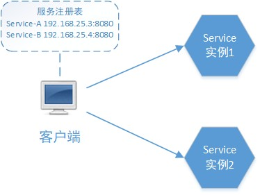

> 我们接下来要讲的Ribbon，就属于客户端负载均衡。在ribbon客户端会有一个服务实例地址列表，在发送请 求前通过负载均衡算法选择一个服务实例，然后进行访问，这是客户端负载均衡。即在客户端就进行负载均 衡算法分配。


Ribbon是一个客户端负载均衡器，它的责任是从一组实例列表中挑选合适的实例，如何挑选？取决于**负载均衡策略** 。

Ribbon核心组件IRule是负载均衡策略接口，它有如下实现，大家仅做了解：

- RoundRobinRule(默认):轮询，即按一定的顺序轮换获取实例的地址。
- RandomRule:随机，即以随机的方式获取实例的地址。
- AvailabilityFilteringRule: 会先过滤掉由于多次访问故障而处于断路器跳闸状态的服务,以及并发的连接数量
超过阈值的服务,然后对剩余的服务列表按照轮询策略进行访问;
- WeightedResponseTimeRule: 根据平均响应时间计算所有服务的权重,响应时间越快,服务权重越大,被选中的
机率越高; 
   - 刚启动时,如果统计信息不足,则使用RoundRobinRule策略,等统计信息足够时,会切换到
WeightedResponseTimeRule
- RetryRule: 先按照RoundRobinRule的策略获取服务,如果获取服务失败,则在指定时间内会进行重试,获取可用
的服务;
- BestAvailableRule: 会先过滤掉由于多次访问故障而处于断路器跳闸状态的服务,然后选择一个并发量最小的
服务;
- ZoneAvoidanceRule: 默认规则,复合判断server所在区域的性能和server的可用性选择服务器;

可通过下面方式在spring boot 配置文件中修改默认的负载均衡策略：

```properties
account-service.ribbon.NFLoadBalancerRuleClassName=com.netflix.loadbalancer.RandomRule
```

> account-service 是调用的服务的名称，后面的组成部分是固定的。


### 2.1.2 Feign 介绍

Feign是Netflix开发的声明式、模板化的HTTP客户端， Feign可以帮助我们更快捷、优雅地调用HTTP API。Feign

的英文表意为"假装，伪装，变形"， 可以理解为将HTTP报文请求方式伪装为简单的java接口调用方式。

参考第1章节的ServiceA调用ServiceB的例子，我们使用Feign实现这个过程，代码如下：

Service B暴露"/service"服务端点，如下：

#### Feign调用方式如下：

```java
@SpringBootApplication
@RestController
public class SpringRestProviderBootstrap {
    public static void main(String[] args) {
    SpringApplication.run(SpringRestProviderBootstrap.class, args);
    }
    
    @GetMapping(value = "/service") //暴露服务
    public String service(){
    	return "provider invoke";
    }
}
```

（1）声明Feign客户端

```java
@FeignClient(value = "serviceB")
public interface ServiceBAgent {
    /**
    * 根据用户名查询账号信息
    * @param username 用户名
    * @return 账号信息
    */
    @GetMapping(value = "/service") 
    public String service();
}
```

（2）业务调用

```java
@Autowired
private ServiceBAgent serviceBAgent.;
//....略
serviceBAgent.service();
//....略
```

是不是非常简单？并且在业务调用时，减少了与业务无关的http请求相关代码的编写，使业务逻辑清晰。咱们分析 一下Feign帮我们做了哪些事儿：

-  在 声明Feign客户端 之后，Feign会根据@FeignClient注解使用java的动态代理技术生成代理类，在这里我们 指定[@FeignClient ](/FeignClient ) value为serviceB，则说明这个类的远程目标为spring cloud的服务名称为serviceB的微服务。  
-  serviceB的具体访问地址，Feign会交由ribbon获取，若该服务有多个实例地址，ribbon会采用指定的负载均 衡策略选取实例。 
-  Feign兼容spring的web注解（如：@GetMapping），它会分析声明Feign客户端方法中的Spring注解，得出 Http请求method、参数信息以及返回信息结构。 
-  当业务调用Feign客户端方法时，会调用代理类，根据以上分析结果，由代理类完成实际的参数封装、远程 http请求，返回结果封装等操作。 

另外，别忘了，若在在Spring cloud中使用Feign，需要引入以下依赖：

```xml
<!-- https://mvnrepository.com/artifact/org.springframework.cloud/spring-cloud-starter-openfeign -->
<dependency>
    <groupId>org.springframework.cloud</groupId>
    <artifactId>spring-cloud-starter-openfeign</artifactId>
</dependency>
```

> Feign默认集成了Ribbon，可以直接使用。


还需要在spring cloud 启动类中标注@EnableFeignClients，表明此项目开启Feign客户端:

```java
@SpringBootApplication
@EnableDiscoveryClient
@EnableFeignClients
public class SpringRestConsumerBootstrap {
    public static void main(String[] args) {
    	SpringApplication.run(SpringRestConsumerBootstrap.class, args);
    }
...
```

**总结：**通过上面的学习，我们已经了解Spring cloud的微服务是如何协作的，通过哪些组件的配合能够完成服务间协作？我们了解了什么是负载均衡，Feign用于服务间Http调用，Ribbon用于执行负载均衡算法选取访问实例，而Ribbon的实例列表来源是由Spring cloud的服务发现中心提供（当前实现为Nacos），更详细的内容请学习`Spring Cloud的相关课程`。

## 2.2 搭建Nacos服务端

略...

## 2.3 创建父工程 nacos-discovery

为了规范依赖的版本，这里创建父工程，指定依赖的版本。 父工程pom.xml如下：

```xml
<?xml version="1.0" encoding="UTF-8"?>
<project xmlns="http://maven.apache.org/POM/4.0.0"
         xmlns:xsi="http://www.w3.org/2001/XMLSchema-instance"
         xsi:schemaLocation="http://maven.apache.org/POM/4.0.0 http://maven.apache.org/xsd/maven-4.0.0.xsd">
    <modelVersion>4.0.0</modelVersion>

    <groupId>cn.lyf</groupId>
    <artifactId>nacos-discovery</artifactId>
    <version>1.0.0-SNAPSHOT</version>
    <packaging>pom</packaging>

    <properties>
        <maven.compiler.source>8</maven.compiler.source>
        <maven.compiler.target>8</maven.compiler.target>
        <project.build.sourceEncoding>UTF-8</project.build.sourceEncoding>
        <project.reporting.outputEncoding>UTF-8</project.reporting.outputEncoding>
        <java.version>1.8</java.version>

        <spring-cloud-alibaba-dependencies.version>2021.1</spring-cloud-alibaba-dependencies.version>
        <spring-cloud-dependencies.version>2021.0.2</spring-cloud-dependencies.version>
        <spring-boot-dependencies.version>2.7.0</spring-boot-dependencies.version>
    </properties>

    <dependencies>
        <dependency>
            <groupId>org.projectlombok</groupId>
            <artifactId>lombok</artifactId>
            <optional>true</optional>
        </dependency>
    </dependencies>

    <dependencyManagement>
        <dependencies>
            <dependency>
                <groupId>com.alibaba.cloud</groupId>
                <artifactId>spring-cloud-alibaba-dependencies</artifactId>
                <version>${spring-cloud-alibaba-dependencies.version}</version>
                <type>pom</type>
                <scope>import</scope>
            </dependency>
            <dependency>
                <groupId>org.springframework.cloud</groupId>
                <artifactId>spring-cloud-dependencies</artifactId>
                <version>${spring-cloud-dependencies.version}</version>
                <type>pom</type>
                <scope>import</scope>
            </dependency>
            <dependency>
                <groupId>org.springframework.boot</groupId>
                <artifactId>spring-boot-dependencies</artifactId>
                <version>${spring-boot-dependencies.version}</version>
                <type>pom</type>
                <scope>import</scope>
            </dependency>
        </dependencies>
    </dependencyManagement>

    <build>
        <plugins>
            <plugin>
                <groupId>org.springframework.boot</groupId>
                <artifactId>spring-boot-maven-plugin</artifactId>
                <configuration>
                    <excludes>
                        <exclude>
                            <groupId>org.projectlombok</groupId>
                            <artifactId>lombok</artifactId>
                        </exclude>
                    </excludes>
                </configuration>
            </plugin>
        </plugins>
    </build>

</project>
```

## 2.4 服务生产者 nacos-provider

以下步骤演示了如何将一个服务生产者注册到 Nacos。

1、pom.xml的配置。

包括Spring Cloud Feign组件、Spring Cloud Alibaba Nacos Discovery组件以及Spring boot web相关组件依赖。

```xml
<?xml version="1.0" encoding="UTF-8"?>
<project xmlns="http://maven.apache.org/POM/4.0.0"
         xmlns:xsi="http://www.w3.org/2001/XMLSchema-instance"
         xsi:schemaLocation="http://maven.apache.org/POM/4.0.0 http://maven.apache.org/xsd/maven-4.0.0.xsd">
    <parent>
        <artifactId>nacos-discovery</artifactId>
        <groupId>cn.lyf</groupId>
        <version>1.0.0-SNAPSHOT</version>
    </parent>
    <modelVersion>4.0.0</modelVersion>

    <artifactId>nacos-provider</artifactId>

    <properties>
        <maven.compiler.source>8</maven.compiler.source>
        <maven.compiler.target>8</maven.compiler.target>
    </properties>

    <dependencies>
        <dependency>
            <groupId>com.alibaba.cloud</groupId>
            <artifactId>spring-cloud-starter-alibaba-nacos-discovery</artifactId>
        </dependency>

        <dependency>
            <groupId>org.springframework.boot</groupId>
            <artifactId>spring-boot-starter-web</artifactId>
        </dependency>

        <dependency>
            <groupId>org.springframework.cloud</groupId>
            <artifactId>spring-cloud-starter-openfeign</artifactId>
        </dependency>
    </dependencies>

</project>
```

2、application.yaml配置。一些关于 Nacos 基本的配置也必须在application.yaml(也可以是application.properties) 配置，如下所示： application.yaml

```yaml
server:
  port: 56100 # 启动端口
spring:
  application:
    name: nacos-provider
  cloud:
    nacos:
      discovery:
        server-addr: 192.168.125.134:8848
logging:
  level:
    root: info
    org.springframework: info
```

> Note: spring.cloud.nacos.discovery.server-addr 指定了Nacos Server的网络地址和端口号。


3、Provider(生产者)服务实现

```java
package cn.lyf.nacos.controller;

import lombok.extern.slf4j.Slf4j;
import org.springframework.web.bind.annotation.GetMapping;
import org.springframework.web.bind.annotation.RestController;

/**
 * @author lyf
 * @version 1.0
 * @classname ProviderController
 * @description
 * @since 2022/6/13 10:59
 */
@Slf4j
@RestController
public class ProviderController {

    @GetMapping(value = "/service")
    public String service() {
        log.info("provider invoke");
        return "provider invoke";
    }
}
```

4、启动Provider(生产者)

```java
package cn.lyf.nacos;

import lombok.extern.slf4j.Slf4j;
import org.springframework.boot.SpringApplication;
import org.springframework.boot.autoconfigure.SpringBootApplication;
import org.springframework.cloud.client.discovery.EnableDiscoveryClient;
import org.springframework.cloud.openfeign.EnableFeignClients;

/**
 * @author lyf
 * @version 1.0
 * @classname NacosProviderApplication
 * @description
 * @since 2022/6/13 10:57
 */
@Slf4j
@SpringBootApplication
@EnableDiscoveryClient // 启用服务发现
@EnableFeignClients // 启用OpenFeign
public class NacosProviderApplication {
    public static void main(String[] args) {
        SpringApplication.run(NacosProviderApplication.class, args);
    }
}
```

> Note: @EnableDiscoveryClient 在spring cloud项目中表明此项目是一个注册发现客户端，这里注册服务发 现使用的是Nacos
>  
> Note: [@EnableFeignClients ](/EnableFeignClients ) 开启FeignClient 


#### 启动成功去nacos服务列表查看

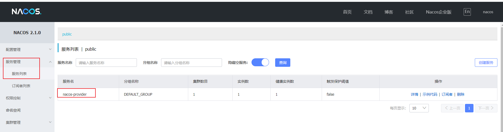

## 2.5 服务消费者

以下步骤演示了如何结合Nacos对spring cloud rest接口进行消费。

1、pom.xml的配置。

```xml
<?xml version="1.0" encoding="UTF-8"?>
<project xmlns="http://maven.apache.org/POM/4.0.0"
         xmlns:xsi="http://www.w3.org/2001/XMLSchema-instance"
         xsi:schemaLocation="http://maven.apache.org/POM/4.0.0 http://maven.apache.org/xsd/maven-4.0.0.xsd">
    <parent>
        <artifactId>nacos-discovery</artifactId>
        <groupId>cn.lyf</groupId>
        <version>1.0.0-SNAPSHOT</version>
    </parent>
    <modelVersion>4.0.0</modelVersion>

    <artifactId>nacos-consumer</artifactId>

    <properties>
        <maven.compiler.source>8</maven.compiler.source>
        <maven.compiler.target>8</maven.compiler.target>
    </properties>

    <dependencies>
        <dependency>
            <groupId>com.alibaba.cloud</groupId>
            <artifactId>spring-cloud-starter-alibaba-nacos-discovery</artifactId>
        </dependency>

        <dependency>
            <groupId>org.springframework.boot</groupId>
            <artifactId>spring-boot-starter-web</artifactId>
        </dependency>

        <dependency>
            <groupId>org.springframework.cloud</groupId>
            <artifactId>spring-cloud-starter-openfeign</artifactId>
        </dependency>
    </dependencies>
</project>
```

2、application.yaml配置

```yaml
server:
  port: 56200 # 启动端口
spring:
  application:
    name: nacos-consumer
  cloud:
    nacos:
      discovery:
        server-addr: 192.168.125.134:8848
logging:
  level:
    root: info
    org.springframework: info
```

3、Provider(生产者)远程代理定义

```java
package cn.lyf.nacos.feign;

import org.springframework.cloud.openfeign.FeignClient;
import org.springframework.web.bind.annotation.GetMapping;

/**
 * @author lyf
 * @version 1.0
 * @classname ProviderClient
 * @description
 * @since 2022/6/13 11:06
 */
@FeignClient(name = "nacos-provider")
public interface ProviderClient {
    @GetMapping(value = "/service")
    String service();
}
```

4、Consumer(消费者)服务实现

```java
package cn.lyf.nacos.controller;

import cn.lyf.nacos.feign.ProviderClient;
import lombok.extern.slf4j.Slf4j;
import org.springframework.beans.factory.annotation.Autowired;
import org.springframework.web.bind.annotation.GetMapping;
import org.springframework.web.bind.annotation.RestController;

/**
 * @author lyf
 * @version 1.0
 * @classname ProviderController
 * @description
 * @since 2022/6/13 10:59
 */
@Slf4j
@RestController
public class ConsumerController {
    @Autowired
    private ProviderClient providerClient;

    @GetMapping(value = "/service")
    public String service() {
        log.info("consumer invoke");
        String providerResult = providerClient.service();
        return "consumer invoke" + "|" + providerResult;
    }
}
```

5、启动Consumer(消费者)

```java
package cn.lyf.nacos;

import lombok.extern.slf4j.Slf4j;
import org.springframework.boot.SpringApplication;
import org.springframework.boot.autoconfigure.SpringBootApplication;
import org.springframework.cloud.client.discovery.EnableDiscoveryClient;
import org.springframework.cloud.openfeign.EnableFeignClients;

/**
 * @author lyf
 * @version 1.0
 * @classname NacosProviderApplication
 * @description
 * @since 2022/6/13 10:57
 */
@Slf4j
@SpringBootApplication
@EnableDiscoveryClient // 启用服务发现
@EnableFeignClients // 启用OpenFeign
public class NacosConsumerApplication {
    public static void main(String[] args) {
        SpringApplication.run(NacosConsumerApplication.class, args);
    }
}
```

访问地址： [http://localhost:56200/service](http://localhost:56200/service)

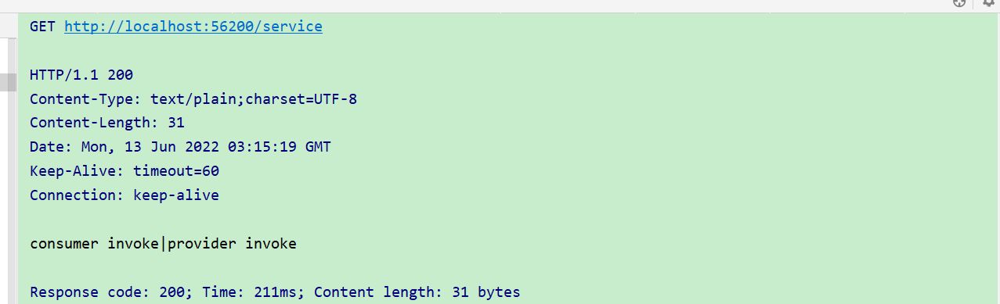

调用成功。

浏览器访问 [http://192.168.125.134:8848/nacos](http://192.168.125.134:8848/nacos) ，打开nacos控制台，并点击菜单**服务管理->服务列表**，可展示出刚刚注 册的两个服务：

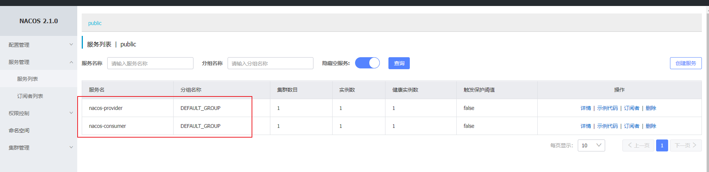

## 2.6 测试多实例负载均衡

修改nacos-provider工程的application.yaml，实现port动态传入：

```yaml
server:
  port: ${port:56100} # 启动端口
spring:
  application:
    name: nacos-provider
  cloud:
    nacos:
      discovery:
        server-addr: 192.168.125.134:8848
logging:
  level:
    root: info
    org.springframework: info
```

设置启动参数：

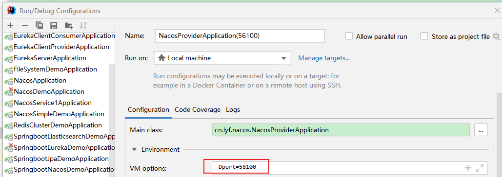

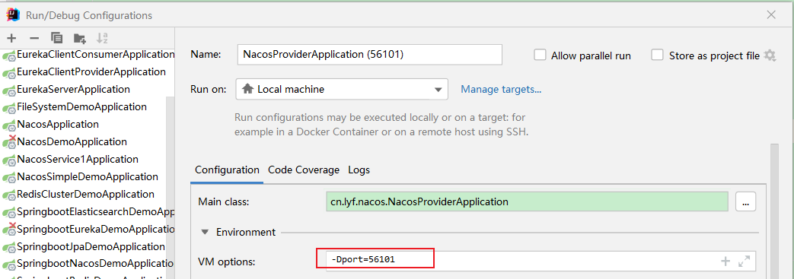

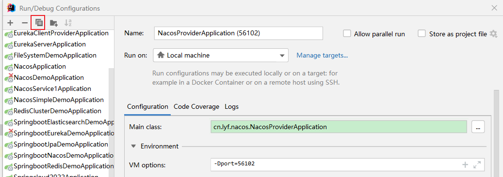

启动nacos-provider三个实例。

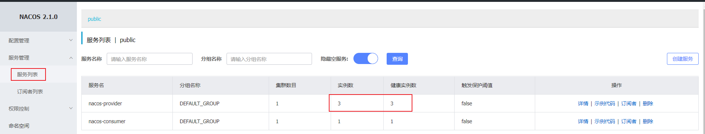

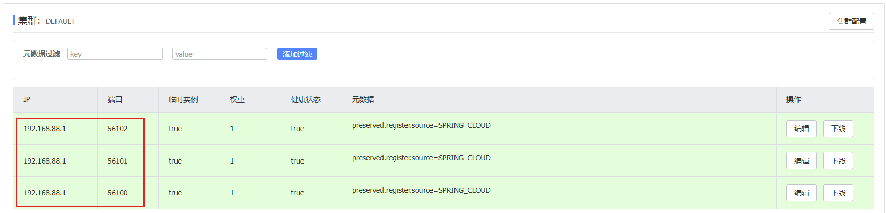

请求 [http://localhost:56200/service](http://localhost:56200/service)  测试负载均衡。

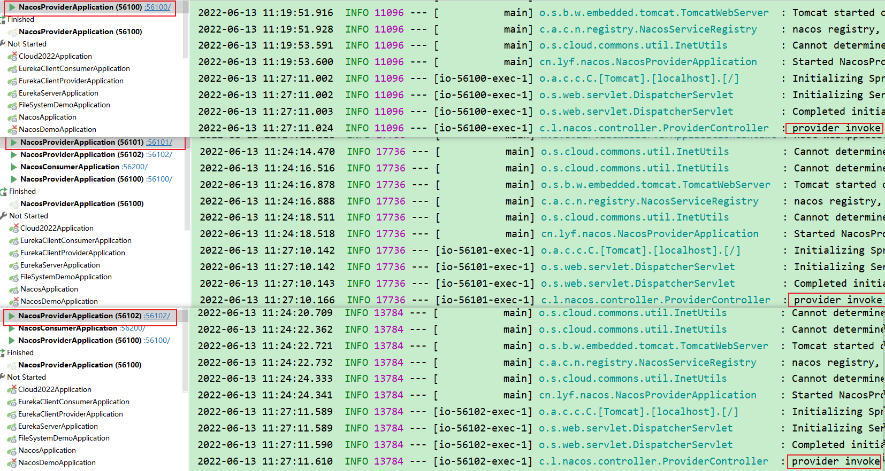

跟踪nacos-provider三个实例的控制台的日志输出，默认负载均衡策略是轮询。

# 3 Nacos服务发现基础应用

## 3.1 服务发现数据模型

Nacos在经过阿里内部多年生产经验后提炼出的数据模型，则是一种服务-集群-实例的三层模型，这样基本可以满 足服务在所有场景下的数据存储和管理。

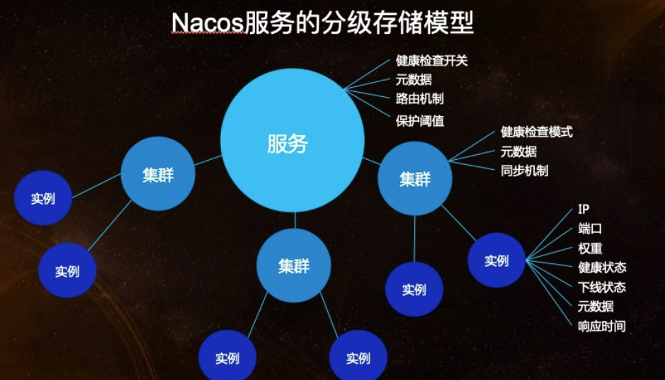{width="6.841797900262467in" height="3.9156244531933506in"}

#### 命名空间(Namespace)

用于进行租户粒度的配置隔离，命名空间不仅适用于nacos的配置管理，同样适用于服务发现。Namespace 的常 用场景之一是不同环境的配置的区分隔离，例如开发测试环境和生产环境的资源（如配置、服务）隔离等。

**服务**

提供给客户端的软件功能，通过预定义接口网络访问。

**服务名**

服务提供的标识，通过该标识可以唯一确定其指代的服务。

**实例**

提供一个或多个服务的具有可访问网络地址（IP:Port）的进程，启动一个服务，就产生了一个服务实例。

**元信息**

Nacos数据（如配置和服务）描述信息，如服务版本、权重、容灾策略、负载均衡策略、鉴权配置、各种自定义标 签 (label)，从作用范围来看，分为服务级别的元信息、集群的元信息及实例的元信息。

#### 集群

服务实例的集合，服务实例组成一个默认集群, 集群可以被进一步按需求划分，划分的单位可以是虚拟集群，相同 集群下的实例才能相互感知。

应用通过Namespace、Service、Cluster(DEFAULT)的配置，描述了该服务向哪个环境（如开发环境）的哪个集群

注册实例。

> Note: 集群作为实例的隔离，相同集群的实例才能相互感知。
>  
> Note: namespace、cluster-name若不填写都将采取默认值，namespace的默认是public命名空间， cluster-name的默认值为DEFAULT集群。


## 3.2 服务管理

开发者或者运维人员往往需要在服务注册后，通过友好的界面来查看服务的注册情况，包括当前系统注册的所有服 务和每个服务的详情。并在有权限控制的情况下，进行服务的一些配置的编辑操作。Nacos在目前最新版本开放的 控制台的服务发现部分，主要就是提供用户一个基本的运维页面，能够查看、编辑当前注册的服务，这些功能集中 在Nacos控制台的**服务管理**一级菜单内。

### 3.2.1 服务列表管理

服务列表帮助用户以统一的视图管理其所有的微服务以及服务健康状态。整体界面布局是左上角有服务的搜索框和 搜索按钮，页面中央是服务列表的展示。服务列表主要展示服务名、集群数目、实例数目、健康实例数目和详情按 钮五个栏目。


在服务列表页面点击详情，可以看到服务的详情。可以查看服务、集群和实例的基本信息。

### 3.2.2 服务流量权重支持及流量保护

Nacos 为用户提供了流量权重控制的能力，同时开放了服务流量的阈值保护，以帮助用户更好的保护服务服务提 供者集群不被意外打垮。如下图所以，可以点击实例的编辑按钮，修改实例的权重。如果想增加实例的流量，可以 将权重调大，如果不想实例接收流量，则可以将权重设为0。

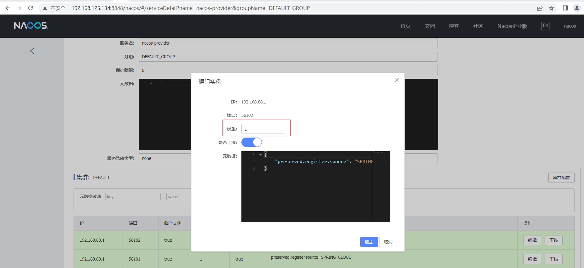

### 3.2.3 服务元数据管理

Nacos提供多个维度的服务元数据的暴露，帮助用户存储自定义的信息。这些信息都是以K-V的数据结构存储，在 控制台上，会以k1=v1,k2=v2这样的格式展示。类似的，编辑元数据可以通过相同的格式进行。例如服务的元数据 编辑，首先点击服务详情页右上角的"编辑服务"按钮，然后在元数据输入框输入：version=1.0.0

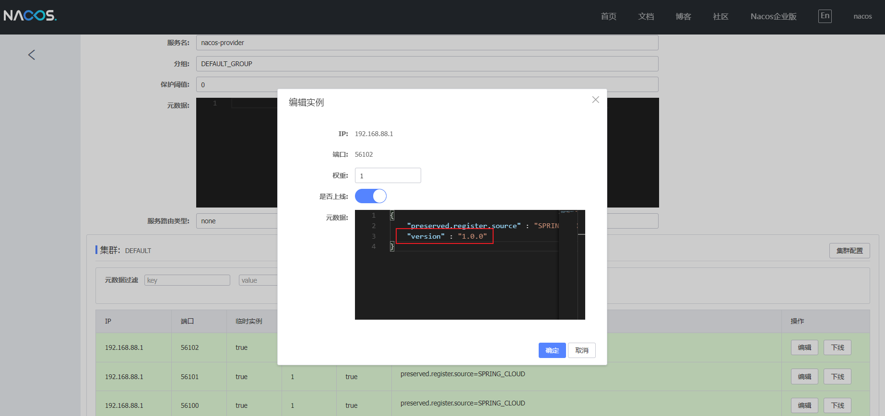

点击确认，就可以在服务详情页面，看到服务的元数据已经更新了。

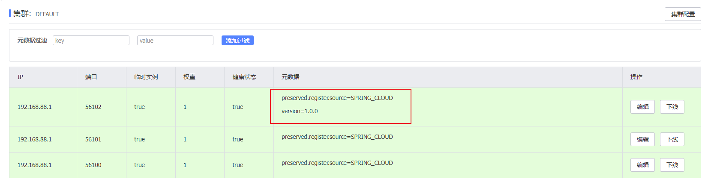

### 3.2.4 服务优雅上下线

Nacos还提供服务实例的上下线操作，在服务详情页面，可以点击实例的"上线"或者"下线"按钮，被下线的实例， 将不会包含在健康的实例列表里。

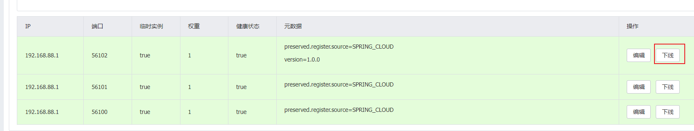

上下线测试：

（1）分别启动快速上手中的nacos-consumer与nacos-provider工程，更改nacos-provide中的启动 端口，再次启动nacos-provider，让quickstart-provider服务拥有三个实例。

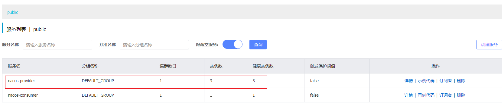

（2）多次访问 [http://localhost:56200/service](http://localhost:56200/service) ，让consumer调用provider时触发负载均衡。

（3）观察provider的3个实例控制台，可发现实例调用被均匀负载。

（4）在provider的服务详情页面，让某实例下线。

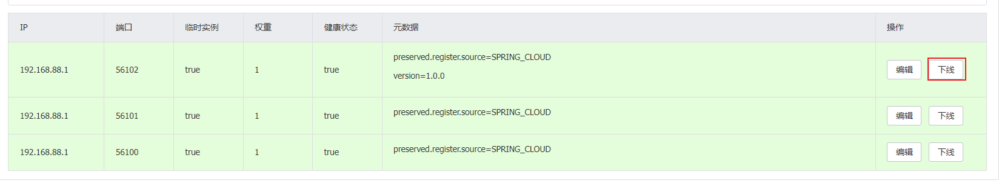

（5）多次访问 http://localhost:56200/service，观察控制台，发现下线的实例已不再接收流量。

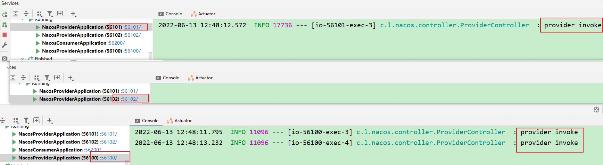

（6）在provider的服务详情页面，让该实例恢复上线状态。

（7）多次访问http://localhost:56200/service，观察控制台，发现恢复上线的实例已恢复流量访问。

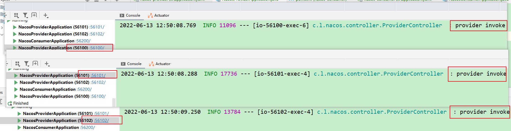

# 4 Spring Cloud Alibaba 综合集成架构演示

前面说到，Spring Cloud是一个较为全面的微服务框架集，集成了如服务注册发现、配置中心、消息总线、负载均 衡、断路器、API网关等功能实现。而在网上经常会发现Spring Cloud与阿里巴巴的Dubbo进行选择对比，这样做 其实不是很妥当，前者是一套较为完整的架构方案，而Dubbo只是服务治理与RPC实现方案。

Dubbo在国内有着非常大的用户群体，但是其周边设施与组件相对来说并不那么完善。很多开发者用户又很希望享 受Spring Cloud的生态，因此也会有一些Spring Cloud与Dubbo一起使用的案例与方法出现，但是一直以来大部分 Spring Cloud整合Dubbo的使用方案都不完善。直到Spring Cloud Alibaba的出现，才得以解决这样的问题。

在此之前，我们已经学了如何使用Spring Cloud Alibaba来集成Nacos与Spring Cloud应用，并且在此之下可以如 传统的Spring Cloud应用一样地使用Ribbon或Feign来微服务之间的协作。由于Feign是基于Http Restful的调用， 在高并发下的性能不够理想，RPC方案能否切换为Dubbo？Spring Cloud与阿里系的若干组件能否完美集成呢？

可以！本章内容将指引大家集成一个微服务的基础架构，并讨论其合理性。

## 4.1 总体结构

系统架构图如下：

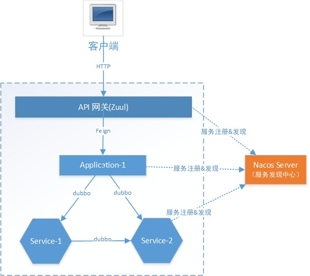

组件说明：

**API网关** ：系统统一入口，屏蔽架构内部结构，统一安全拦截，采用Zuul实现。

**application-1** ：应用1，模拟应用，提供http接口服务。

**service-1** ：微服务1，模拟微服务，提供dubbo接口服务。

**service-2** ：微服务2，模拟微服务，提供dubbo接口服务。 调用流程：

所有访问系统的请求都要经过网关，网关转发Http请求至application-1，application-1使用dubbo调用service1完 成自身业务，而后sevice1调用service2完成自身业务。至此，完成所有组件贯穿。

架构中application与sevice的区别是什么？

-  service提供了基础服务功能；application组装基础服务功能，提供给用户直接可用的业务。 
-  service服务粒度小、功能基础，不易发生改变；application提供上游业务功能，紧贴业务需求，容易发生改变。 
-  形成service支撑application的整体架构，增加多变的application甚至不需要变动service。 

## 4.3 工程结构说明

采用maven工程，结构如下：

```
nacos-micro-service 整体父工程
├─api-gateway API网关，端口：56010

├─application-1 应用1，端口：56020

├─service-1 服务1父工程
│ 	├─service-1-api 服务1API
│ 	└─service-1-server 服务1实现，端口：56030

└─service-2 服务2父工程
    ├─service-2-api 服务2API
    └─service-2-server 服务2实现，端口：56040
```

## 4.4 创建父工程

创建 artifactId 名为`nacos-micro-service`的 Maven 工程，此父工程继承`nacos-discovery`父工程，间接指定
了Spring boot、spring cloud 以及spring-cloud-alibaba的依赖版本。

```xml
<?xml version="1.0" encoding="UTF-8"?>
<project xmlns="http://maven.apache.org/POM/4.0.0"
         xmlns:xsi="http://www.w3.org/2001/XMLSchema-instance"
         xsi:schemaLocation="http://maven.apache.org/POM/4.0.0 http://maven.apache.org/xsd/maven-4.0.0.xsd">
    <parent>
        <artifactId>nacos-discovery</artifactId>
        <groupId>cn.lyf</groupId>
        <version>1.0.0-SNAPSHOT</version>
    </parent>
    <modelVersion>4.0.0</modelVersion>

    <artifactId>nacos-micro-service</artifactId>
    <packaging>pom</packaging>
    <modules>
        <module>application-1</module>
        <module>service-1</module>
        <module>service-2</module>
        <module>api-gateway</module>
    </modules>

    <properties>
        <maven.compiler.source>8</maven.compiler.source>
        <maven.compiler.target>8</maven.compiler.target>
    </properties>

</project>
```

### nacos-discovery的pom

```xml
<?xml version="1.0" encoding="UTF-8"?>
<project xmlns="http://maven.apache.org/POM/4.0.0"
         xmlns:xsi="http://www.w3.org/2001/XMLSchema-instance"
         xsi:schemaLocation="http://maven.apache.org/POM/4.0.0 http://maven.apache.org/xsd/maven-4.0.0.xsd">
    <modelVersion>4.0.0</modelVersion>

    <groupId>cn.lyf</groupId>
    <artifactId>nacos-discovery</artifactId>
    <version>1.0.0-SNAPSHOT</version>
    <modules>
        <module>nacos-provider</module>
        <module>nacos-consumer</module>
        <module>nacos-micro-service</module>
    </modules>
    <packaging>pom</packaging>

    <properties>
        <maven.compiler.source>8</maven.compiler.source>
        <maven.compiler.target>8</maven.compiler.target>
        <project.build.sourceEncoding>UTF-8</project.build.sourceEncoding>
        <project.reporting.outputEncoding>UTF-8</project.reporting.outputEncoding>
        <java.version>1.8</java.version>

        <spring-cloud-alibaba-dependencies.version>2021.1</spring-cloud-alibaba-dependencies.version>
        <spring-cloud-dependencies.version>2021.0.2</spring-cloud-dependencies.version>
        <spring-boot-dependencies.version>2.7.0</spring-boot-dependencies.version>
    </properties>

    <dependencies>
        <dependency>
            <groupId>org.projectlombok</groupId>
            <artifactId>lombok</artifactId>
            <optional>true</optional>
        </dependency>
    </dependencies>

    <dependencyManagement>
        <dependencies>
            <dependency>
                <groupId>com.alibaba.cloud</groupId>
                <artifactId>spring-cloud-alibaba-dependencies</artifactId>
                <version>${spring-cloud-alibaba-dependencies.version}</version>
                <type>pom</type>
                <scope>import</scope>
            </dependency>
            <dependency>
                <groupId>org.springframework.cloud</groupId>
                <artifactId>spring-cloud-dependencies</artifactId>
                <version>${spring-cloud-dependencies.version}</version>
                <type>pom</type>
                <scope>import</scope>
            </dependency>
            <dependency>
                <groupId>org.springframework.boot</groupId>
                <artifactId>spring-boot-dependencies</artifactId>
                <version>${spring-boot-dependencies.version}</version>
                <type>pom</type>
                <scope>import</scope>
            </dependency>
        </dependencies>
    </dependencyManagement>

    <build>
        <plugins>
            <plugin>
                <groupId>org.springframework.boot</groupId>
                <artifactId>spring-boot-maven-plugin</artifactId>
                <configuration>
                    <excludes>
                        <exclude>
                            <groupId>org.projectlombok</groupId>
                            <artifactId>lombok</artifactId>
                        </exclude>
                    </excludes>
                </configuration>
            </plugin>
        </plugins>
    </build>

</project>
```

## 4.5 实现application-1

application1属于应用层，提供http接口服务。

**（1）初始化**`**application-1**`**Maven 工程**

```xml
<?xml version="1.0" encoding="UTF-8"?>
<project xmlns="http://maven.apache.org/POM/4.0.0"
         xmlns:xsi="http://www.w3.org/2001/XMLSchema-instance"
         xsi:schemaLocation="http://maven.apache.org/POM/4.0.0 http://maven.apache.org/xsd/maven-4.0.0.xsd">
    <parent>
        <artifactId>nacos-micro-service</artifactId>
        <groupId>cn.lyf</groupId>
        <version>1.0.0-SNAPSHOT</version>
    </parent>
    <modelVersion>4.0.0</modelVersion>

    <artifactId>application-1</artifactId>

    <properties>
        <maven.compiler.source>8</maven.compiler.source>
        <maven.compiler.target>8</maven.compiler.target>
    </properties>

    <dependencies>
        <dependency>
            <groupId>com.alibaba.cloud</groupId>
            <artifactId>spring-cloud-starter-alibaba-nacos-discovery</artifactId>
        </dependency>

        <dependency>
            <groupId>com.alibaba.cloud</groupId>
            <artifactId>spring-cloud-starter-alibaba-nacos-config</artifactId>
        </dependency>

        <dependency>
            <groupId>org.springframework.boot</groupId>
            <artifactId>spring-boot-starter-web</artifactId>
        </dependency>

        <dependency>
            <groupId>org.springframework.cloud</groupId>
            <artifactId>spring-cloud-starter-openfeign</artifactId>
        </dependency>

        <!--
            进行Feign远程调用的化，需要加上此依赖，否则会抛出以下异常
            Caused by: java.lang.IllegalStateException:
                No Feign Client for loadBalancing defined.
                Did you forget to include spring-cloud-starter-loadbalancer?
        -->
        <dependency>
            <groupId>org.springframework.cloud</groupId>
            <artifactId>spring-cloud-starter-loadbalancer</artifactId>
        </dependency>
        <!-- 若bootstrap配置不生效，加入以下依赖 -->
        <dependency>
            <groupId>org.springframework.cloud</groupId>
            <artifactId>spring-cloud-starter-bootstrap</artifactId>
        </dependency>

        <!--引入service-1-api-->
        <dependency>
            <groupId>cn.lyf</groupId>
            <artifactId>service-1-api</artifactId>
            <version>1.0.0-SNAPSHOT</version>
        </dependency>

        <!--引入dubbo服务依赖-->
        <dependency>
            <groupId>com.alibaba.cloud</groupId>
            <artifactId>spring-cloud-starter-dubbo</artifactId>
        </dependency>
        <!--dubbo依赖包-->
        <dependency>
            <groupId>org.apache.commons</groupId>
            <artifactId>commons-lang3</artifactId>
        </dependency>
    </dependencies>
</project>
```

**（2）实现**`**application1**`** 功能**

```java
package cn.lyf.nacos.controller;

import cn.lyf.nacos.service.ConsumerService;
import lombok.extern.slf4j.Slf4j;
import org.apache.dubbo.config.annotation.DubboReference;
import org.apache.dubbo.config.annotation.DubboService;
import org.springframework.web.bind.annotation.GetMapping;
import org.springframework.web.bind.annotation.RestController;

/**
 * @author lyf
 * @version 1.0
 * @classname Application1Controller
 * @description
 * @since 2022/6/13 13:04
 */
@Slf4j
@RestController
public class Application1Controller {

    @DubboReference
    private ConsumerService consumerService;

    @GetMapping("/service")
    public String service(){
        log.info("test\t{}", consumerService.service());
        return "test\t" + consumerService.service() ;
    }
}
```

**（3） application1 配置**

纯粹的dubbo服务消费者，配置看起来更简单。 定义bootstrap.yaml

```yaml
server:
  port: 40100
  servlet:
    context-path: /application1
spring:
  application:
    name: application1
  main:
    allow-bean-definition-overriding: true # 允许bean重写
    allow-circular-references: true # 解决SpringBoot2.6 及之后版本的循环依赖问题
  cloud:
    nacos:
      discovery:
        server-addr: 192.168.125.133:8848
        namespace: 92ad01c5-f1f7-4497-95a6-64f306e49f48
        cluster-name: DEFAULT
        group: NACOS_MICROSERVICE_GROUP # 业务组
      config:
        prefix: application1
        server-addr: 192.168.125.133:8848
        file-extension: yaml
        namespace: 92ad01c5-f1f7-4497-95a6-64f306e49f48
        group: NACOS_MICROSERVICE_GROUP # 业务组
logging:
  level:
    root: info
    org.springframework: info
```

#### （4） application1 启动

```java
package cn.lyf.nacos;

import lombok.extern.slf4j.Slf4j;
import org.springframework.boot.SpringApplication;
import org.springframework.boot.autoconfigure.SpringBootApplication;
import org.springframework.cloud.client.discovery.EnableDiscoveryClient;
import org.springframework.cloud.openfeign.EnableFeignClients;

/**
 * @author lyf
 * @version 1.0
 * @classname Application1Application
 * @description
 * @since 2022/6/13 13:05
 */
@Slf4j
@SpringBootApplication
@EnableDiscoveryClient
@EnableFeignClients
public class Application1Application {
    public static void main(String[] args) {
        SpringApplication.run(Application1Application.class, args);
    }
}
```

当服务启动后，应用`Application1`

将出现在 Nacos 控制台界面。

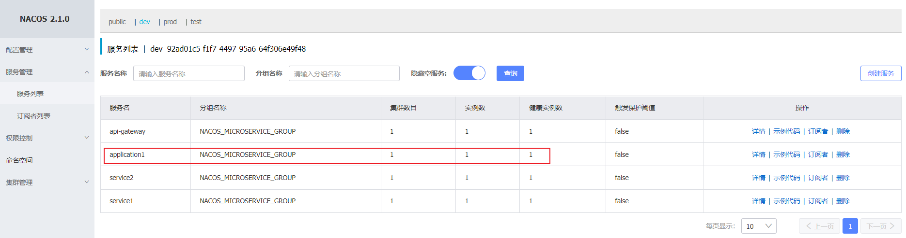

## 4.6 实现 Service1

### 4.6.1 定义父工程

定义service1父工程，pom.xml如下：

```xml
<?xml version="1.0" encoding="UTF-8"?>
<project xmlns="http://maven.apache.org/POM/4.0.0"
         xmlns:xsi="http://www.w3.org/2001/XMLSchema-instance"
         xsi:schemaLocation="http://maven.apache.org/POM/4.0.0 http://maven.apache.org/xsd/maven-4.0.0.xsd">
    <parent>
        <artifactId>nacos-micro-service</artifactId>
        <groupId>cn.lyf</groupId>
        <version>1.0.0-SNAPSHOT</version>
    </parent>
    <modelVersion>4.0.0</modelVersion>

    <artifactId>service-1</artifactId>
    <packaging>pom</packaging>
    <modules>
        <module>service-1-api</module>
        <module>service-1-server</module>
    </modules>

    <properties>
        <maven.compiler.source>8</maven.compiler.source>
        <maven.compiler.target>8</maven.compiler.target>
    </properties>


</project>
```

### 定义service-1-api

为了方便其它服务调用dubbo服务，专门定义api工程，此工程将作为jar被其它工程依赖。 定义service-1-api工程，pom.xml如下：

```xml
<?xml version="1.0" encoding="UTF-8"?>
<project xmlns="http://maven.apache.org/POM/4.0.0"
         xmlns:xsi="http://www.w3.org/2001/XMLSchema-instance"
         xsi:schemaLocation="http://maven.apache.org/POM/4.0.0 http://maven.apache.org/xsd/maven-4.0.0.xsd">
    <parent>
        <artifactId>service-1</artifactId>
        <groupId>cn.lyf</groupId>
        <version>1.0.0-SNAPSHOT</version>
    </parent>
    <modelVersion>4.0.0</modelVersion>

    <artifactId>service-1-api</artifactId>

    <properties>
        <maven.compiler.source>8</maven.compiler.source>
        <maven.compiler.target>8</maven.compiler.target>
    </properties>

</project>
```

定义服务接口：

```java
package cn.lyf.nacos.service;

/**
 * @author lyf
 * @version 1.0
 * @classname ConsumerService
 * @description
 * @since 2022/6/13 17:09
 */
public interface ConsumerService {
    String service();
}
```

### 实现service-1-server

#### （1）初始化

##### pom.xml

```xml
<?xml version="1.0" encoding="UTF-8"?>
<project xmlns="http://maven.apache.org/POM/4.0.0"
         xmlns:xsi="http://www.w3.org/2001/XMLSchema-instance"
         xsi:schemaLocation="http://maven.apache.org/POM/4.0.0 http://maven.apache.org/xsd/maven-4.0.0.xsd">
    <parent>
        <artifactId>service-1</artifactId>
        <groupId>cn.lyf</groupId>
        <version>1.0.0-SNAPSHOT</version>
    </parent>
    <modelVersion>4.0.0</modelVersion>

    <artifactId>service-1-server</artifactId>

    <properties>
        <maven.compiler.source>8</maven.compiler.source>
        <maven.compiler.target>8</maven.compiler.target>
    </properties>

    <dependencies>
        <dependency>
            <groupId>cn.lyf</groupId>
            <artifactId>service-1-api</artifactId>
            <version>1.0.0-SNAPSHOT</version>
        </dependency>

        <dependency>
            <groupId>cn.lyf</groupId>
            <artifactId>service-2-api</artifactId>
            <version>1.0.0-SNAPSHOT</version>
        </dependency>
        <dependency>
            <groupId>com.alibaba.cloud</groupId>
            <artifactId>spring-cloud-starter-alibaba-nacos-config</artifactId>
        </dependency>
        <dependency>
            <groupId>com.alibaba.cloud</groupId>
            <artifactId>spring-cloud-starter-alibaba-nacos-discovery</artifactId>
        </dependency>
        <dependency>
            <groupId>com.alibaba.cloud</groupId>
            <artifactId>spring-cloud-starter-dubbo</artifactId>
        </dependency>

        <!--
           进行Feign远程调用的化，需要加上此依赖，否则会抛出以下异常
           Caused by: java.lang.IllegalStateException:
               No Feign Client for loadBalancing defined.
               Did you forget to include spring-cloud-starter-loadbalancer?
       -->
        <dependency>
            <groupId>org.springframework.cloud</groupId>
            <artifactId>spring-cloud-starter-loadbalancer</artifactId>
        </dependency>

        <!-- 若bootstrap配置不生效，加入以下依赖 -->
        <dependency>
            <groupId>org.springframework.cloud</groupId>
            <artifactId>spring-cloud-starter-bootstrap</artifactId>
        </dependency>

        <dependency>
            <groupId>org.apache.commons</groupId>
            <artifactId>commons-lang3</artifactId>
        </dependency>
    </dependencies>
</project>
```

#### （2）实现 Dubbo 服务

```java
package cn.lyf.nacos.service.impl;

import cn.lyf.nacos.service.ConsumerService;
import cn.lyf.nacos.service.ProviderService;
import lombok.extern.slf4j.Slf4j;
import org.apache.dubbo.config.annotation.DubboReference;
import org.apache.dubbo.config.annotation.DubboService;

/**
 * @author lyf
 * @version 1.0
 * @classname ConsumerServiceImpl
 * @description
 * @since 2022/6/13 17:10
 */
@Slf4j
@DubboService // 这是个dubbo微服务
public class ConsumerServiceImpl implements ConsumerService {

    @DubboReference
    private ProviderService providerService;

    @Override
    public String service() {
        return "Consumer invoke\t" + providerService.service();
    }
}
```

#### （3）配置 Dubbo 服务

##### bootstrap.yaml

```yaml
server:
  port: ${port:40200} # 启动端口 命令行注入
spring:
  application:
    name: service1
  main:
    allow-bean-definition-overriding: true # 允许bean重写
    allow-circular-references: true # 解决SpringBoot2.6 及之后版本的循环依赖问题
  cloud:
    nacos:
      discovery:
        server-addr: 192.168.125.133:8848
        namespace: 92ad01c5-f1f7-4497-95a6-64f306e49f48
        cluster-name: DEFAULT
        group: NACOS_MICROSERVICE_GROUP # 业务组
      config:
        prefix: service1
        server-addr: 192.168.125.133:8848
        file-extension: yaml
        namespace: 92ad01c5-f1f7-4497-95a6-64f306e49f48
        group: NACOS_MICROSERVICE_GROUP # 业务组
dubbo:
  scan:
    base-packages: cn.lyf.nacos.service # dubbo 配置服务扫描基准包
  protocol:
    name: dubbo # 配置dubbo协议
    port: ${dubbo_port:20881}
  registry:
    address: nacos://192.168.125.133:8848
  application:
    qos-enable: false # dubbo 运维服务是否开启
  consumer:
    check: false # 启动时是否检查依赖的服务是否存在
logging:
  level:
    root: info
    org.springframework: info
```

以上 YAML 内容，dubbo开头的为dubbo服务 的配置：

- `dubbo.scan.base-packages`: 指定 Dubbo 服务实现类的扫描基准包，将@org.apache.dubbo.config.annotation.DubboReference注解标注的service暴露为dubbo服务。
- `dubbo.protocol` : Dubbo 服务暴露的协议配置，其中子属性 `name` 为协议名称，`port` 为dubbo协议端口
可以指定多协议，如：dubbo.protocol.rmi.port=1099
- `dubbo.registry` : Dubbo 服务注册中心配置，其中子属性 address 的值 "nacos://192.168.125.133:8848"，说明dubbo服务注册到nacos
相当于原生dubbo的xml配置中的 <dubbo:registry address="10.20.153.10:9090" />

上半部分为SpringCloud的相关配置：

- `spring.application.name` : Spring 应用名称，用于 Spring Cloud 服务注册和发现。 
   - 该值在 Dubbo Spring Cloud 加持下被视作 `dubbo.application.name` ，因此，无需再显示地配置
   `dubbo.application.name`
- `spring.cloud.nacos.discovery`: Nacos 服务发现与注册配置，其中子属性 server-addr 指定 Nacos 服务器
主机和端口
- `spring.cloud.nacos.config` : Nacos 配置中心配置，其中子属性 server-addr 指定 Nacos 服务器主机和端
口。

#### （4）启动服务消费方应用

```java
package cn.lyf.nacos;

import lombok.extern.slf4j.Slf4j;
import org.springframework.boot.SpringApplication;
import org.springframework.boot.autoconfigure.SpringBootApplication;
import org.springframework.cloud.client.discovery.EnableDiscoveryClient;

/**
 * @author lyf
 * @version 1.0
 * @classname Service1Bootstrap
 * @description
 * @since 2022/6/13 17:35
 */
@Slf4j
@SpringBootApplication
@EnableDiscoveryClient
public class Service1Bootstrap {
    public static void main(String[] args) {
        SpringApplication.run(Service1Bootstrap.class, args);
    }
}
```

当 `Service1Bootstrap` 启动后，应用 `service1` 将出现在 Nacos 控制台界面。
启动成功，观察nacos服务列表

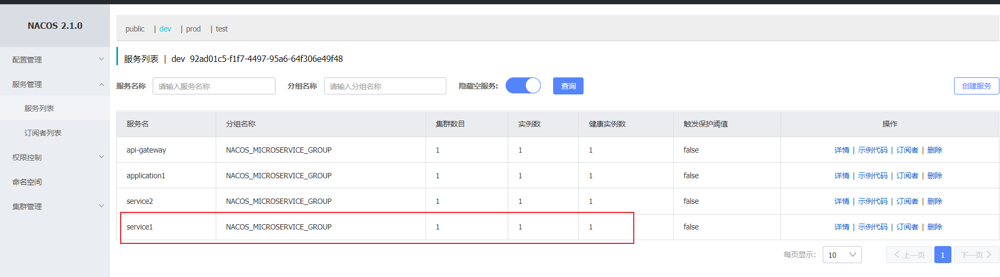

## 4.7 实现 application1调用Service1

现在service1已暴露dubbo服务并注册到nacos中，下边实现application1调用service1

### 4.7.1 引用service1

下边在application1中引用service1

在pom.xml中引入service-1-api的依赖

```xml
<dependency>
    <groupId>cn.lyf</groupId>
    <artifactId>service-1-api</artifactId>
    <version>1.0.0-SNAPSHOT</version>
</dependency>
```

引入 spring-cloud-starter-dubbo依赖，它会根据接口生成代理对象

```xml
 <!--引入dubbo服务依赖-->
<dependency>
    <groupId>com.alibaba.cloud</groupId>
    <artifactId>spring-cloud-starter-dubbo</artifactId>
</dependency>
<!--dubbo依赖包-->
<dependency>
    <groupId>org.apache.commons</groupId>
    <artifactId>commons-lang3</artifactId>
</dependency>
```

### 4.7.2 实现远程调用

```java
package cn.lyf.nacos.controller;

import cn.lyf.nacos.service.ConsumerService;
import lombok.extern.slf4j.Slf4j;
import org.apache.dubbo.config.annotation.DubboReference;
import org.apache.dubbo.config.annotation.DubboService;
import org.springframework.web.bind.annotation.GetMapping;
import org.springframework.web.bind.annotation.RestController;

/**
 * @author lyf
 * @version 1.0
 * @classname Application1Controller
 * @description
 * @since 2022/6/13 13:04
 */
@Slf4j
@RestController
public class Application1Controller {

    @DubboReference
    private ConsumerService consumerService;

    @GetMapping("/service")
    public String service(){
        log.info("test\t{}", consumerService.service());
        return "test\t" + consumerService.service() ;
    }
}
```

测试： 请求：[http://localhost:40100/application1/service](http://localhost:40100/application1/service)

consumerService正常生成代理对象，service1被调用。

## 4.8 实现 Service2

如上面设计所示，Service2需要暴露dubbo接口以供service1消费，若想在Spring cloud Alibaba中集成并使用 dubbo。

### 4.8.1 定义父工程

定义service2父工程，pom.xml如下：

```xml
<?xml version="1.0" encoding="UTF-8"?>
<project xmlns="http://maven.apache.org/POM/4.0.0"
         xmlns:xsi="http://www.w3.org/2001/XMLSchema-instance"
         xsi:schemaLocation="http://maven.apache.org/POM/4.0.0 http://maven.apache.org/xsd/maven-4.0.0.xsd">
    <parent>
        <artifactId>nacos-micro-service</artifactId>
        <groupId>cn.lyf</groupId>
        <version>1.0.0-SNAPSHOT</version>
    </parent>
    <modelVersion>4.0.0</modelVersion>

    <artifactId>service-2</artifactId>
    <packaging>pom</packaging>
    <modules>
        <module>service-2-api</module>
        <module>service-2-server</module>
    </modules>

    <properties>
        <maven.compiler.source>8</maven.compiler.source>
        <maven.compiler.target>8</maven.compiler.target>
    </properties>

</project>
```

### 4.8.2 定义service-2-api

定义service-2-api工程，pom.xml如下：

```xml
<?xml version="1.0" encoding="UTF-8"?>
<project xmlns="http://maven.apache.org/POM/4.0.0"
         xmlns:xsi="http://www.w3.org/2001/XMLSchema-instance"
         xsi:schemaLocation="http://maven.apache.org/POM/4.0.0 http://maven.apache.org/xsd/maven-4.0.0.xsd">
    <parent>
        <artifactId>service-2</artifactId>
        <groupId>cn.lyf</groupId>
        <version>1.0.0-SNAPSHOT</version>
    </parent>
    <modelVersion>4.0.0</modelVersion>

    <artifactId>service-2-api</artifactId>

    <properties>
        <maven.compiler.source>8</maven.compiler.source>
        <maven.compiler.target>8</maven.compiler.target>
    </properties>

</project>
```

并定义服务接口，Dubbo 服务接口是服务提供方与消费方的远程通讯契约，通常由普通的 Java 接口（interface）

来声明，如`ProviderService`接口：

```java
package cn.lyf.nacos.service;

/**
 * @author lyf
 * @version 1.0
 * @classname ProviderService
 * @description
 * @since 2022/6/13 17:57
 */
public interface ProviderService {
    /**
     * 服务接口
     *
     * @return 服务信息
     */
    String service();
}
```

### 4.5.3 实现service-2-server

#### （1）初始化 service-2-server Maven 工程

首先，创建 artifactId 名为 `service-2-server` 的 Maven 工程，并在其 pom.xml 文件中增添 Dubbo SpringCloud 必要的依赖：

```xml
<?xml version="1.0" encoding="UTF-8"?>
<project xmlns="http://maven.apache.org/POM/4.0.0"
         xmlns:xsi="http://www.w3.org/2001/XMLSchema-instance"
         xsi:schemaLocation="http://maven.apache.org/POM/4.0.0 http://maven.apache.org/xsd/maven-4.0.0.xsd">
    <parent>
        <artifactId>service-2</artifactId>
        <groupId>cn.lyf</groupId>
        <version>1.0.0-SNAPSHOT</version>
    </parent>
    <modelVersion>4.0.0</modelVersion>

    <artifactId>service-2-server</artifactId>

    <properties>
        <maven.compiler.source>8</maven.compiler.source>
        <maven.compiler.target>8</maven.compiler.target>
    </properties>

    <dependencies>
        <dependency>
            <groupId>cn.lyf</groupId>
            <artifactId>service-2-api</artifactId>
            <version>1.0.0-SNAPSHOT</version>
        </dependency>
        <dependency>
            <groupId>com.alibaba.cloud</groupId>
            <artifactId>spring-cloud-starter-alibaba-nacos-config</artifactId>
        </dependency>
        <dependency>
            <groupId>com.alibaba.cloud</groupId>
            <artifactId>spring-cloud-starter-alibaba-nacos-discovery</artifactId>
        </dependency>
        <dependency>
            <groupId>com.alibaba.cloud</groupId>
            <artifactId>spring-cloud-starter-dubbo</artifactId>
        </dependency>

        <!--
           进行Feign远程调用的化，需要加上此依赖，否则会抛出以下异常
           Caused by: java.lang.IllegalStateException:
               No Feign Client for loadBalancing defined.
               Did you forget to include spring-cloud-starter-loadbalancer?
       -->
        <dependency>
            <groupId>org.springframework.cloud</groupId>
            <artifactId>spring-cloud-starter-loadbalancer</artifactId>
        </dependency>

        <!-- 若bootstrap配置不生效，加入以下依赖 -->
        <dependency>
            <groupId>org.springframework.cloud</groupId>
            <artifactId>spring-cloud-starter-bootstrap</artifactId>
        </dependency>

        <dependency>
            <groupId>org.apache.commons</groupId>
            <artifactId>commons-lang3</artifactId>
        </dependency>
    </dependencies>
</project>
```

以上依赖 artifact 说明如下：

- `service-2-api` : 提供 `ProviderService` 接口的 artifact
- `spring-boot-starter-web` : Spring Boot starter `artifact` ，间接引入 `spring-boot` artifact`spring-cloud-starter-dubbo` : Dubbo Spring Cloud Starter artifact ，间接引入 `dubbo-spring-bootstarter`
等 artifact
- `spring-cloud-starter-alibaba-nacos-discovery` : Nacos Spring Cloud 服务注册与发现 artifact

#### （2）实现 Dubbo 服务

ProviderService 作为暴露的 Dubbo 服务接口，服务提供方 service-2-server 需要将其实现：

```java
package cn.lyf.nacos.service.impl;

import cn.lyf.nacos.service.ProviderService;
import lombok.extern.slf4j.Slf4j;
import org.apache.dubbo.config.annotation.DubboService;

/**
 * @author lyf
 * @version 1.0
 * @classname ProviderServiceImpl
 * @description
 * @since 2022/6/13 17:57
 */
@Slf4j
@DubboService
public class ProviderServiceImpl implements ProviderService {
    /**
     * 服务接口
     *
     * @return 服务信息
     */
    @Override
    public String service() {
        return "Provider invoke";
    }
}
```

#### （3）配置 Dubbo 服务

在暴露 Dubbo 服务方面，推荐开发人员外部化配置的方式，即指定 Java 服务实现类的扫描基准包。
Dubbo Spring Cloud 继承了 Dubbo Spring Boot 的外部化配置特性，也可以通过标注
`@DubboComponentScan` 来实现基准包扫描。

```yaml
server:
  port: ${port:40300} # 启动端口 命令行注入
spring:
  application:
    name: service2
  main:
    allow-bean-definition-overriding: true # 允许bean重写
    allow-circular-references: true # 解决SpringBoot2.6 及之后版本的循环依赖问题
  cloud:
    nacos:
      discovery:
        server-addr: 192.168.125.133:8848
        namespace: 92ad01c5-f1f7-4497-95a6-64f306e49f48
        cluster-name: DEFAULT
        group: NACOS_MICROSERVICE_GROUP # 业务组
      config:
        prefix: service2
        server-addr: 192.168.125.133:8848
        file-extension: yaml
        namespace: 92ad01c5-f1f7-4497-95a6-64f306e49f48
        group: NACOS_MICROSERVICE_GROUP # 业务组
dubbo:
  scan:
    base-packages: cn.lyf.nacos.service # dubbo 配置服务扫描基准包
  protocol:
    name: dubbo # 配置dubbo协议
    port: ${dubbo_port:20891} # dubbo 协议端口（ ‐1 表示自增端口，从 20880 开始）
  registry:
    address: nacos://192.168.125.133:8848
  application:
    qos-enable: false # dubbo 运维服务是否开启
  consumer:
    check: false # 启动时是否检查依赖的服务是否存在
logging:
  level:
    root: info
    org.springframework: info
```

#### （4）启动服务提供方应用

Dubbo Spring Cloud 引导类与普通 Spring Cloud 应用并无差别，如下所示：

```java
package cn.lyf.nacos;

import lombok.extern.slf4j.Slf4j;
import org.springframework.boot.SpringApplication;
import org.springframework.boot.autoconfigure.SpringBootApplication;
import org.springframework.cloud.client.discovery.EnableDiscoveryClient;

/**
 * @author lyf
 * @version 1.0
 * @classname Service2Bootstrap
 * @description
 * @since 2022/6/13 17:58
 */
@Slf4j
@SpringBootApplication
@EnableDiscoveryClient
public class Service2Bootstrap {
    public static void main(String[] args) {
        SpringApplication.run(Service2Bootstrap.class, args);
    }
}
```

在引导 Service2Bootstrap 之前，请提前启动 Nacos 服务器。 当 Service2Bootstrap 启动后，应用 service2将出现在 Nacos 控制台界面。

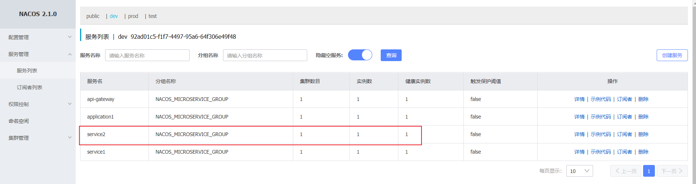

## 实现service1调用service2

### 引用service2

在service1中添加service2的依赖：

```xml
 <dependency>
     <groupId>cn.lyf</groupId>
     <artifactId>service-2-api</artifactId>
     <version>1.0.0-SNAPSHOT</version>
</dependency>
```

### 4.9.2 实现远程调用

```java
package cn.lyf.nacos.service.impl;

import cn.lyf.nacos.service.ConsumerService;
import cn.lyf.nacos.service.ProviderService;
import lombok.extern.slf4j.Slf4j;
import org.apache.dubbo.config.annotation.DubboReference;
import org.apache.dubbo.config.annotation.DubboService;

/**
 * @author lyf
 * @version 1.0
 * @classname ConsumerServiceImpl
 * @description
 * @since 2022/6/13 17:10
 */
@Slf4j
@DubboService // 这是个dubbo微服务
public class ConsumerServiceImpl implements ConsumerService {

    @DubboReference
    private ProviderService providerService;

    @Override
    public String service() {
        return "Consumer invoke\t" + providerService.service();
    }
}
```

测试：

请求：[http://localhost:40100/application1/service](http://localhost:40100/application1/service)

application1调用service1，service1调用service2


## 4.10 实现api-gateway

### 4.10.1 Zuul介绍

什么是网关？

原来的单体架构，所有的服务都是本地的，UI可以直接调用，现在按功能拆分成独立的服务，跑在独立的一般都在 独立的虚拟机上的 Java进程了。客户端UI如何访问？他的后台有N个服务，前台就需要记住管理N个服务，一个服 务下线/更新/升级，前台就要重新部署，这明显不服务我们拆分的理念，特别当前台是移动应用的时候，通常业务 变化的节奏更快。另外，N个小服务的调用也是一个不小的网络开销。

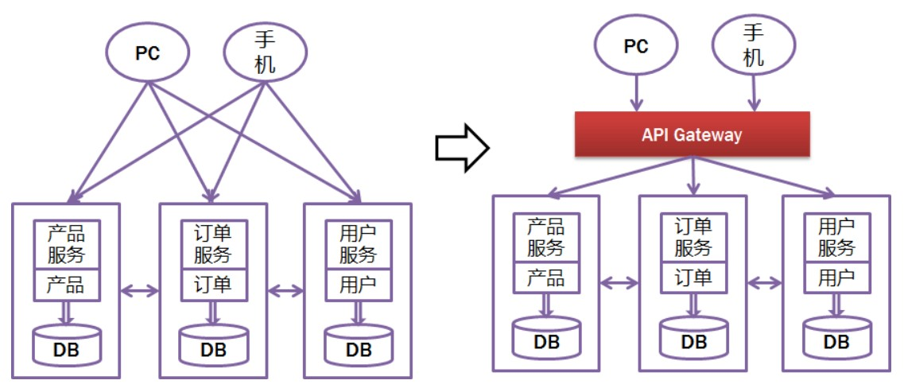

有了网关作为服务统一入口，就可以避免上述问题，不仅如此，服务网关是在微服务前边设置一道屏障，请求先到 服务网关，网关会对请求进行过虑、校验、路由等处理。有了服务网关可以提高微服务的安全性，网关校验请求的 合法性，请求不合法将被拦截，拒绝访问。

- 提供统一服务入口，让微服务对前台透明
- 聚合后台的服务，节省流量，提升性能
- 提供安全，过滤，流控等API管理功能

什么是Zuul？

Spring Cloud Zuul是整合Netflix公司的Zuul开源项目实现的微服务网关，它实现了请求路由、负载均衡、校验过 虑等 功能。

官方：[https://github.com/Netflix/zuul](https://github.com/Netflix/zuul)

Zuul与Nginx怎么配合使用？

Zuul与Nginx在实际项目中需要配合使用，如下图，Nginx的作用是反向代理、负载均衡，Zuul的作用是保障微服 务的安全访问，拦截微服务请求，校验合法性及负载均衡。

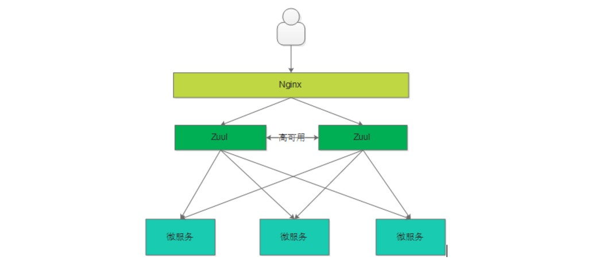

### 4.10.2 搭建网关工程

初始化`api-gateway` Maven 工程

```xml
<?xml version="1.0" encoding="UTF-8"?>
<project xmlns="http://maven.apache.org/POM/4.0.0"
         xmlns:xsi="http://www.w3.org/2001/XMLSchema-instance"
         xsi:schemaLocation="http://maven.apache.org/POM/4.0.0 http://maven.apache.org/xsd/maven-4.0.0.xsd">
    <parent>
        <artifactId>nacos-micro-service</artifactId>
        <groupId>cn.lyf</groupId>
        <version>1.0.0-SNAPSHOT</version>
    </parent>
    <modelVersion>4.0.0</modelVersion>

    <artifactId>api-gateway</artifactId>

    <properties>
        <maven.compiler.source>8</maven.compiler.source>
        <maven.compiler.target>8</maven.compiler.target>
    </properties>

    <dependencies>
        <dependency>
            <groupId>com.alibaba.cloud</groupId>
            <artifactId>spring-cloud-starter-alibaba-nacos-discovery</artifactId>
        </dependency>

        <dependency>
            <groupId>com.alibaba.cloud</groupId>
            <artifactId>spring-cloud-starter-alibaba-nacos-config</artifactId>
        </dependency>

        <dependency>
            <groupId>org.springframework.boot</groupId>
            <artifactId>spring-boot-starter-web</artifactId>
        </dependency>

        <dependency>
            <groupId>org.springframework.cloud</groupId>
            <artifactId>spring-cloud-starter-openfeign</artifactId>
        </dependency>

        <!--
            进行Feign远程调用的化，需要加上此依赖，否则会抛出以下异常
            Caused by: java.lang.IllegalStateException:
                No Feign Client for loadBalancing defined.
                Did you forget to include spring-cloud-starter-loadbalancer?
        -->
        <dependency>
            <groupId>org.springframework.cloud</groupId>
            <artifactId>spring-cloud-starter-loadbalancer</artifactId>
        </dependency>

        <!-- 若bootstrap配置不生效，加入以下依赖 -->
        <dependency>
            <groupId>org.springframework.cloud</groupId>
            <artifactId>spring-cloud-starter-bootstrap</artifactId>
        </dependency>


        <!--引入zuul 依赖-->
        <dependency>
            <groupId>org.springframework.cloud</groupId>
            <artifactId>spring-cloud-starter-netflix-zuul</artifactId>
            <version>2.2.10.RELEASE</version>
            <exclusions>
                <exclusion>
                    <groupId>com.google.guava</groupId>
                    <artifactId>guava</artifactId>
                </exclusion>
            </exclusions>
        </dependency>

        <dependency>
            <groupId>com.google.guava</groupId>
            <artifactId>guava</artifactId>
            <version>14.0.1</version>
        </dependency>
    </dependencies>
</project>
```

### 4.8.3 api-gateway配置

```yaml
server:
  port: ${port:40400} # 启动端口 命令行注入
spring:
  application:
    name: api-gateway
  main:
    allow-bean-definition-overriding: true # 允许bean重写
    allow-circular-references: true # 解决SpringBoot2.6 及之后版本的循环依赖问题
  cloud:
    nacos:
      discovery:
        server-addr: 192.168.125.133:8848
        namespace: 92ad01c5-f1f7-4497-95a6-64f306e49f48
        cluster-name: DEFAULT
        group: NACOS_MICROSERVICE_GROUP # 业务组
      config:
        prefix: api-gateway
        server-addr: 192.168.125.133:8848
        file-extension: yaml
        namespace: 92ad01c5-f1f7-4497-95a6-64f306e49f48
        group: NACOS_MICROSERVICE_GROUP # 业务组
        refresh-enabled: true
logging:
  level:
    root: info
    org.springframework: info
ribbon:
  eureka:
    enabled: false
```

网关的**路由配置**采用nacos远程配置，在nacos控制台**开发环境**中新增`api-gateway.yaml`配置集，配置组为`NACOS_MICROSERVICE_GROUP`，配置内容如下：

```yaml
nacos:
  zuul:
    routes:
      application1: 
        stripPrefix: false
        path: /application1/**
        serviceId: application1
```

将请求为 /application1/ 开头的请求路由至 application1 服务，保留请求url中的 /application1/ 。

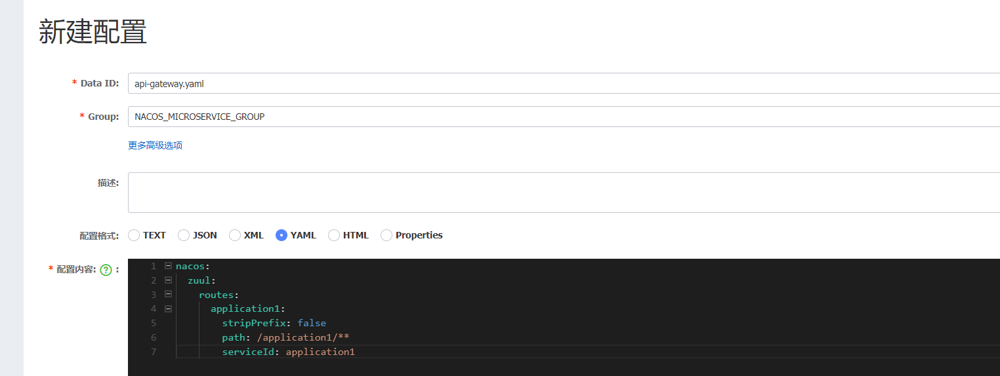

#### (4) 解决 com.netflix.client.ClientException: Load balancer does not have available server for client: application1

```java
package cn.lyf.nacos.config;

import com.alibaba.cloud.nacos.NacosDiscoveryProperties;
import com.alibaba.cloud.nacos.NacosServiceManager;
import com.alibaba.nacos.api.exception.NacosException;
import com.alibaba.nacos.api.naming.pojo.Instance;
import com.netflix.client.config.IClientConfig;
import com.netflix.loadbalancer.AbstractLoadBalancerRule;
import com.netflix.loadbalancer.DynamicServerListLoadBalancer;
import com.netflix.loadbalancer.Server;
import lombok.extern.slf4j.Slf4j;
import org.springframework.beans.factory.annotation.Autowired;
import org.springframework.context.annotation.Configuration;

/**
 * 解决spring-cloud-alibaba 2021.1 Naco 2.1.0 作为注册中心，Zuul作为网关，使用Ribbon进行负载均衡时
 * Caused by: com.netflix.client.ClientException: Load balancer does not have available server for client:的异常问题
 *
 * @author lyf
 * @since 2022-06-14
 */
@Slf4j
@Configuration
public class NacosLoadBalancerRule extends AbstractLoadBalancerRule {
    @Autowired
    private NacosDiscoveryProperties discoveryProperties;

    @Autowired
    private NacosServiceManager nacosServiceManager;

    @Override
    public Server choose(Object key) {
        DynamicServerListLoadBalancer loadBalancer = (DynamicServerListLoadBalancer) getLoadBalancer();
        String name = loadBalancer.getName();
        try {
            // Instance selectOneHealthyInstance(String serviceName) throws NacosException;
            // 会使用默认的Group DEFAULT_GROUP
            // Instance selectOneHealthyInstance(String serviceName, String groupName) throws NacosException;
            // 如果已经定义了微服务的Group，需要加上此参数
            Instance instance = nacosServiceManager.getNamingService(discoveryProperties.getNacosProperties())
                    .selectOneHealthyInstance(name, discoveryProperties.getGroup());

            // NacosServer 在Nacos 2.x版本已经移除，所以替换为new Server(instance.getIp(), instance.getPort())
            return new Server(instance.getIp(), instance.getPort());
        } catch (NacosException e) {
            log.error("", e);
            return null;
        }
    }

    @Override
    public void initWithNiwsConfig(IClientConfig iClientConfig) {
    }
}
```

#### (5) api-gateway启动

注意在启动类上使用@EnableZuulProxy注解标识此工程为Zuul网关，启动类代码如下：

```java
package cn.lyf.nacos;

import lombok.extern.slf4j.Slf4j;
import org.springframework.boot.SpringApplication;
import org.springframework.boot.autoconfigure.SpringBootApplication;
import org.springframework.cloud.client.discovery.EnableDiscoveryClient;
import org.springframework.cloud.netflix.zuul.EnableZuulProxy;

/**
 * @author lyf
 * @version 1.0
 * @classname ApiGatewayBootstrap
 * @description
 * @since 2022/6/13 19:04
 */
@Slf4j
@SpringBootApplication
@EnableDiscoveryClient
@EnableZuulProxy
public class ApiGatewayBootstrap {
    public static void main(String[] args) {
        SpringApplication.run(ApiGatewayBootstrap.class, args);
    }
}
```

当服务启动后，应用`api-gateway`将出现在 Nacos 服务列表中。

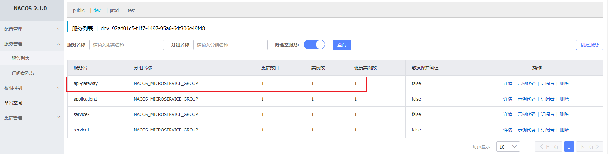

测试：

通过网关（api-gateway）请求Application1应用，Application1的业务实现又贯穿service1、service2，访问 http://localhost:40400/application1/service，将得到如下结果：


## 4.11 完整项目

[https://gitee.com/liuyangfang/nacos-zuul.git](https://gitee.com/liuyangfang/nacos-zuul.git)

# 5 附： Spring Cloud Nacos discovery Starter配置项信息说明

## Nacos 2.x 之前配置项

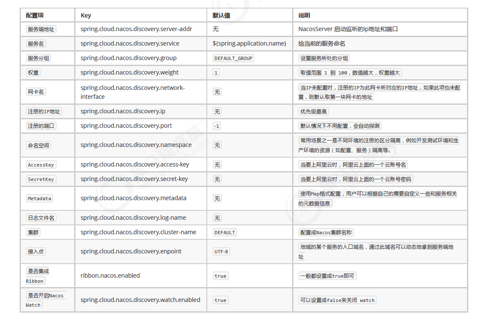

## Nacos 2.x版本配置项
| 配置项 | key | 默认值 | 说明 |
| --- | --- | --- | --- |
| 服务端地址 | spring.cloud.nacos.config.server-addr |  |  |
| DataId前缀 | spring.cloud.nacos.config.prefix |  | spring.application.name |
| Group | spring.cloud.nacos.config.group | DEFAULT_GROUP |  |
| dataID后缀及内容文件格式 | spring.cloud.nacos.config.file-extension | properties | dataId的后缀，同时也是配置内容的文件格式，目前只支持 properties |
| 配置内容的编码方式 | spring.cloud.nacos.config.encode | UTF-8 | 配置的编码 |
| 获取配置的超时时间 | spring.cloud.nacos.config.timeout | 3000 | 单位为 ms |
| 配置的命名空间 | spring.cloud.nacos.config.namespace |  | 常用场景之一是不同环境的配置的区分隔离，例如开发测试环境和生产环境的资源隔离等。 |
| AccessKey | spring.cloud.nacos.config.access-key |  |  |
| SecretKey | spring.cloud.nacos.config.secret-key |  |  |
| 相对路径 | spring.cloud.nacos.config.context-path |  | 服务端 API 的相对路径 |
| 接入点 | spring.cloud.nacos.config.endpoint | UTF-8 | 地域的某个服务的入口域名，通过此域名可以动态地拿到服务端地址 |
| 是否开启监听和自动刷新 | spring.cloud.nacos.config.refresh-enabled | true |  |

