# 一. Nacos Config实现原理解析

首先，Nacos Config针对配置的管理提供了4种操作）：

- 获取配置，从Nacos Config Server中读取配置。
- 监听配置：订阅感兴趣的配置，当配置发生变化的时候可以收到一个事件。
- 发布配置：将配置保存到Nacos Config Server中。
- 删除配置：删除配置中心的指定配置。

而从原理层面来看，可以归类为两种类型：配置的CRUD和配置的动态监听。

## 1.1 配置的CRUD操作

对于Nacos Config来说，**主要是提供了配置的集中式管理功能，然后对外提供CRUD的访问接口使得应用系统可以完成配置的基本操作。**

- 对于服务端来说：需要考虑的是配置如何存储，是否需要持久化。
- 对于客户端来说：需要考虑的是通过接口从服务器查询得到相应的数据然后返回。

关系如下：
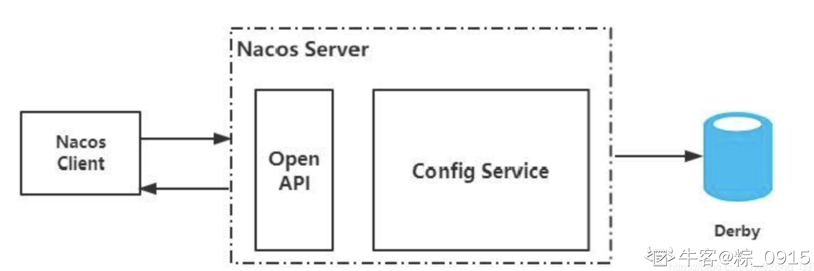
注意：

- Nacos服务端的数据存储默认采用的是Derby数据库（也支持Mysql）。

## 1.2 配置的动态监听

Nacos的客户端和服务端之间存在着数据交互的一种行为（不然怎么做到实时的更新和数据的查询呢），而对于这种交互行为共有两种方式：

- Pull模式：表示客户端从服务端主动拉取数据。

> Pull模式下，客户端需要定时从服务端拉取一次数据，由于定时带来的时间间隔，**因此不能保证数据的实时性**，**并且在服务端配置长时间不更新的情况下，客户端的定时任务会做一些无效的Pull操作。**


- Push模式：服务端主动把数据推送到客户端。

> Push模式下，**服务端需要维持与客户端的长连接**，**如果客户端的数量比较多，那么服务端需要耗费大量的内存资源来保存每个资源**，并且为了检测连接的有效性，还需要心跳机制来维持每个连接的状态。


Nacos采用的是Pull模式（Kafka也是如此），并且**采用了一种长轮询机制**。客户端采用长轮询的方式定时的发起Pull请求，去检查服务端配置信息是否发生了变更，如果发生了变更，那么客户端会根据变更的数据获得最新的配置。

> 长轮询：客户端发起轮询请求后，服务端如果有配置发生变更，**就直接返回。**

如下图：
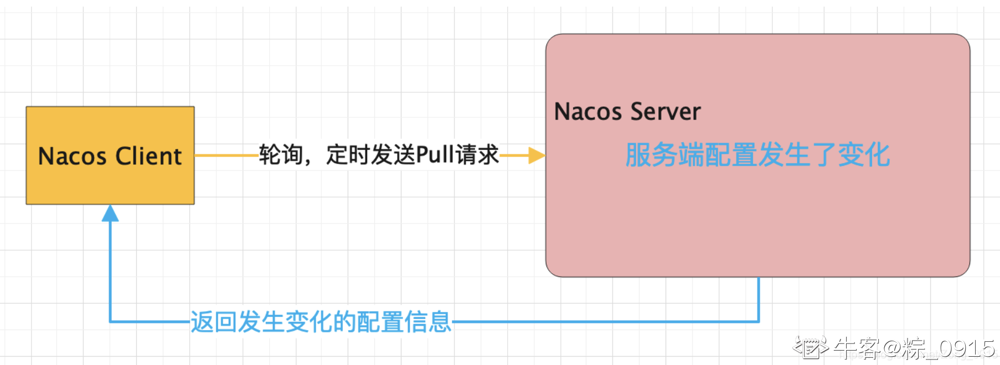
详细地来说：

1. 如果客户端发起Pull请求后，发现服务端的配置和客户端的配置是保持一致的，那么服务端会“Hold”住这个请求。（**服务端拿到这个连接后在指定的时间段内不会返回结果，直到这段时间内的配置发生变化**）
2. 一旦配置发生了变化，服务端会把原来“Hold”住的请求进行返回。

工作流程图如下：
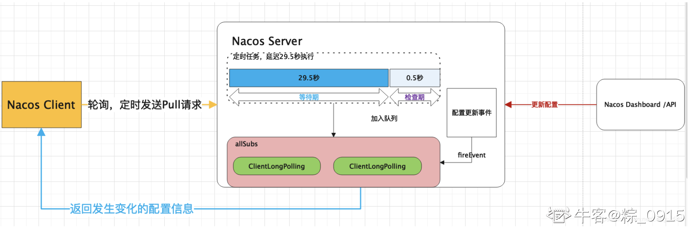

对于流程图解释如下：

Nacos服务端收到请求后，会检查配置是否发生了变更，**如果没有，那么设置一个定时任务，延期29.5秒执行。**同时并且**把当前的客户端长轮询连接加入到allSubs队列。** 这时候有两种方式触发该连接结果的返回：

- 第一种：等待29.5秒（长连接保持的时间）后触发自动检查机制，**这时候不管配置有无发生变化，都会把结果返回给客户端。**
- 第二种：在29.5秒内的任意一个时刻，通过Nacos控制台或者API的方式对配置进行了修改，**那么触发一个事件机制，监听到该事件的任务会遍历allSubs队列，找到发生变更的配置项对应的ClientLongPolling任务，将变更的数据通过该任务中的连接进行返回，即完成了一次推送操作。**

# 二. Nacos配置中心源码分析

## 2.1 Config实现配置的加载

首先需要了解到，SpringCloud是基于Spring来扩展的，而Spring本身就提供了`Environment`，用来表示Spring应用程序的环境配置（包括外部环境），并且提供了统一访问的方法`getProperty（String key）`来获取配置。

对于SpringCloud而言，要实现统一配置管理并且动态的刷新配置，需要解决两个问题：

1. 如何将远程服务器上的配置（Nacos Config Server）加载到`Environment`上。
2. 配置变更时，如何将新的配置更新到`Environment`中。

对于配置的加载而言，需要牵扯到SpringBoot的自动装配，进行环境的准备工作：

### 2.1.1 环境的准备

1.在SpringBoot启动的时候，`SpringApplication.run()`方法进行环境准备的工作，来看下该方法（只显示和环境配置相关的代码）

```java
public ConfigurableApplicationContext run(String... args) {
    // .....代码省略
    SpringApplicationRunListeners listeners = this.getRunListeners(args);
    listeners.starting();
    // .....代码省略
    try {
        ApplicationArguments applicationArguments = new DefaultApplicationArguments(args);
        // 环境的准备工作
        ConfigurableEnvironment environment = this.prepareEnvironment(listeners, applicationArguments);
        // 将环境的相关信息进行封装
        this.configureIgnoreBeanInfo(environment);
        // .....代码省略
    } catch (Throwable var10) {
        this.handleRunFailure(context, var10, exceptionReporters, listeners);
        throw new IllegalStateException(var10);
    }
    // .....代码省略
}
```

2.重点来看`this.prepareEnvironment(listeners, applicationArguments)`这个方法：

```java
private ConfigurableEnvironment prepareEnvironment(SpringApplicationRunListeners listeners, ApplicationArguments applicationArguments) {
    // .....代码省略
    // 该方法中，主要会发布一个ApplicationEnvironmentPreparedEvent事件
    // 而BootstrapApplicationListener监听器会监听这一类的事件，并作出响应的处理
    listeners.environmentPrepared((ConfigurableEnvironment)environment);
    // .....代码省略
    return (ConfigurableEnvironment)environment;
}
```

3.监听事件后的处理，进行了自动装配：

```java
public class BootstrapApplicationListener implements ApplicationListener, Ordered {

    public void onApplicationEvent(ApplicationEnvironmentPreparedEvent event) {
        // .....代码省略
        // onApplicationEvent（）方法都是监听器监听到某个事件后，需要执行的方法，即后续处理的逻辑。
        // 这里调用了bootstrapServiceContext（）方法
        context = this.findBootstrapContext((ParentContextApplicationContextInitializer)initializer, configName);
        // .....代码省略
    }
    private ConfigurableApplicationContext bootstrapServiceContext(ConfigurableEnvironment environment, final SpringApplication application, String configName) {
        // .....代码省略
        // 进行自动装配，BootstrapImportSelectorConfiguration作为一个配置类
        builder.sources(new Class[]{BootstrapImportSelectorConfiguration.class});
        // .....代码省略
    }
}
```

4.自动装配的类`BootstrapImportSelectorConfiguration`：

```java
@Configuration(
    proxyBeanMethods = false
)
@Import({BootstrapImportSelector.class})
public class BootstrapImportSelectorConfiguration {
    public BootstrapImportSelectorConfiguration() {
    }
}
```

5.通过@Import导入了`BootstrapImportSelector`类，负责自动配置信息的加载。（我在Nacos注册中心原理篇中讲到过，spring.factories的作用，这里就不在多说，只把涉及到的相关类列举出来）
这里有`spring-cloud-alibaba-nacos-config`包
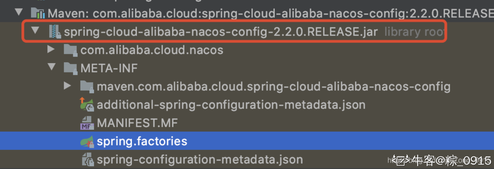
下的`NacosConfigBootstrapConfiguration`
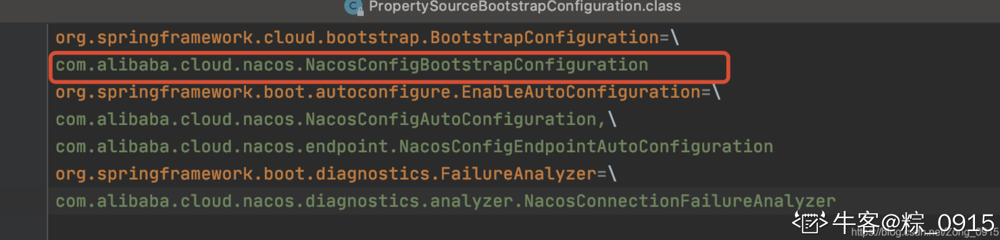
以及`spring-cloud-context`包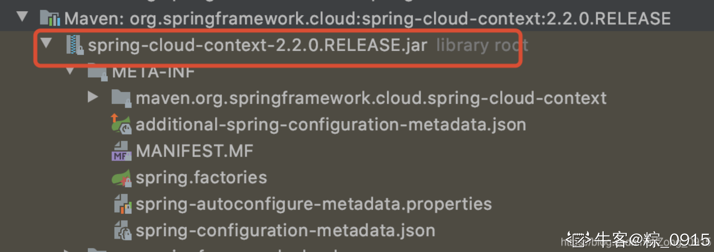
下的`PropertySourceBootstrapConfiguration`：
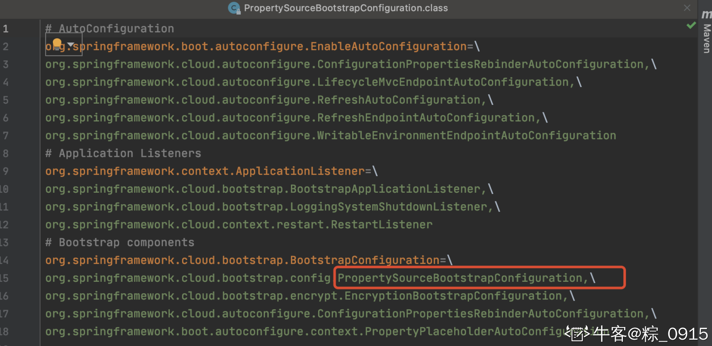
那么会对这两个类进行自动装载。

6.回到步骤中，到这里，`SpringApplication.run（）`中的环境准备已经完成了，那么和我们的服务加载有啥关系嘞？环境的准备完成了，意味着相对应的类已经完成了初始化，**而其中有一个类就叫做**`**PropertySourceBootstrapConfiguration**`**，他是一个启动环境配置类，他的初始化就是通过上述自动装配来完成的！**

7.而`PropertySourceBootstrapConfiguration`类中就有一个`initialize（）`方法调用`PropertySourceLocators.locate()`来获取远程配置信息，那么接下来就开始讲环境的加载

### 2.1.2 环境的加载

1.上文`SpringApplication.run()`方法中已经介绍完了环境的准备工作，接下里就要进行配置的加载了，继续从该方法出发（**tips：这里和上文的区别，多了一行代码**`**this.prepareContext（）**`**，同样为了方便，把不必要的代码省去了**）：

```java
public ConfigurableApplicationContext run(String... args) {
    // .....代码省略
    SpringApplicationRunListeners listeners = this.getRunListeners(args);
    listeners.starting();
    // .....代码省略
    try {
        ApplicationArguments applicationArguments = new DefaultApplicationArguments(args);
        // 环境的准备工作
        ConfigurableEnvironment environment = this.prepareEnvironment(listeners, applicationArguments);
        // 将环境的相关信息进行封装
        this.configureIgnoreBeanInfo(environment);
        // .....代码省略
        // 开始刷新应用上下文的准备阶段。
        this.prepareContext(context, environment, listeners, applicationArguments, printedBanner);
        // .....代码省略
    } catch (Throwable var10) {
        this.handleRunFailure(context, var10, exceptionReporters, listeners);
        throw new IllegalStateException(var10);
    }
    // .....代码省略
}
```

2.`prepareContext()`方法主要是进行应用上下文的一个准备：

```java
private void prepareContext(ConfigurableApplicationContext context, ConfigurableEnvironment environment, SpringApplicationRunListeners listeners, ApplicationArguments applicationArguments, Banner printedBanner) {
        // .....代码省略
        this.applyInitializers(context);
}      

// 该方法主要是执行容器中的ApplicationContextInitilaizer，作用是在应用程序上下文初始化的时候做一些额外的操作
// 挺像那个SpringBean初始化后还可以做一些额外操作的意思
protected void applyInitializers(ConfigurableApplicationContext context) {
    Iterator var2 = this.getInitializers().iterator();

    while(var2.hasNext()) {
        ApplicationContextInitializer initializer = (ApplicationContextInitializer)var2.next();
        Class requiredType = GenericTypeResolver.resolveTypeArgument(initializer.getClass(), ApplicationContextInitializer.class);
        Assert.isInstanceOf(requiredType, context, "Unable to call initializer.");
        initializer.initialize(context);
    }

}
```

3.第二步代码中出现了一个接口：`ApplicationContextInitializer`，那么最终代码的实现肯定是要跑其子类的代码，

```java
public interface ApplicationContextInitializer {
    void initialize(C var1);
}
```

4.回到重点：`PropertySourceBootstrapConfiguration`实现了`ApplicationContextInitializer`接口。因此上面的方法在执行时，会执行`PropertySourceBootstrapConfiguration`的`initialize()`方法
来看下其方法，关注类`PropertySourceLocator`：

```java
public void initialize(ConfigurableApplicationContext applicationContext) {
    // .....代码省略
    while(var5.hasNext()) {
        PropertySourceLocator locator = (PropertySourceLocator)var5.next();
        PropertySource source = null;
        source = locator.locate(environment);
        if (source != null) {
            logger.info("Located property source: " + source);
            composite.addPropertySource(source);
            empty = false;
        }
    }
    // .....代码省略
}
```

5.`PropertySourceLocator`接口的主要作用：**实现应用外部化配置可动态加载**，而`NacosPropertySourceLocator`实现了该接口。因此最终会调用`NacosPropertySourceLocator`中的`locate()`方法，实现把Nacos服务上的代码进行加载。

6.`NacosPropertySourceLocator.locate()`方法最终得到配置中心上的配置并通过对象封装来返回：

```java
public PropertySource locate(Environment env) {
    this.nacosConfigProperties.setEnvironment(env);
    ConfigService configService = this.nacosConfigManager.getConfigService();
    if (null == configService) {
        log.warn("no instance of config service found, can't load config from nacos");
        return null;
    } else {
        long timeout = (long)this.nacosConfigProperties.getTimeout();
        this.nacosPropertySourceBuilder = new NacosPropertySourceBuilder(configService, timeout);
        // 读取一些配置文件，这里有我们属性的应用名称、DataId的设置
        String name = this.nacosConfigProperties.getName();
        String dataIdPrefix = this.nacosConfigProperties.getPrefix();
        if (StringUtils.isEmpty(dataIdPrefix)) {
            dataIdPrefix = name;
        }

        if (StringUtils.isEmpty(dataIdPrefix)) {
            dataIdPrefix = env.getProperty("spring.application.name");
        }
        // 用于存储Nacos Config Server上配置信息的一个实例对象
        CompositePropertySource composite = new CompositePropertySource("NACOS");
        // loadxxx（）方法开始进行配置的加载这是共享配置
        this.loadSharedConfiguration(composite);
        // 通过spring.cloud.nacos.config.ext-config[0].data-id=myTest.properties这种方式配置的配置文件
        // 加载扩展配置
        this.loadExtConfiguration(composite);
        // 加载应用名称对应的配置
        this.loadApplicationConfiguration(composite, dataIdPrefix, this.nacosConfigProperties, env);
        // 返回配置信息实例对象
        return composite;
    }
}
```

到这里，配置的加载流程也就完成了，**对于具体加载的内容（也就是**`**this.loadxxx()**`**方法的具体实现）放在2.2节详细介绍**，接下来通过案例来再一次理解这个过程。

### 2.1.3 案例1：通过Debug来理解Config的配置加载

1.容器启动后，执行`SpringApplication.run()`方法：
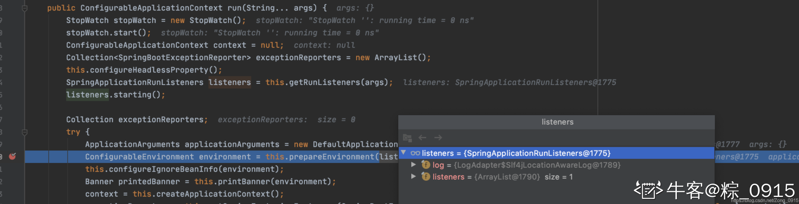
2.开始准备环境：
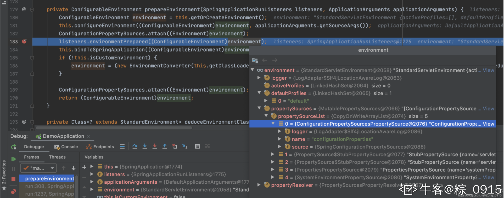
3.此时`BootstrapApplicationListener`类监听到事件（**这个事件指的是环境准备事件**），执行`onApplicationEvent（）`方法：
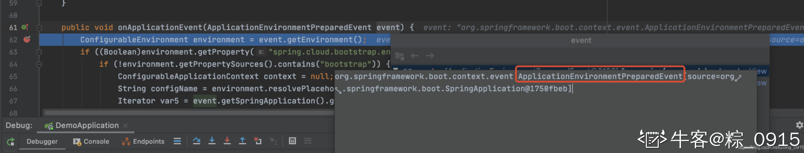
4.该方法最后会执行`builder.sources（）`，引入选择器Selector：
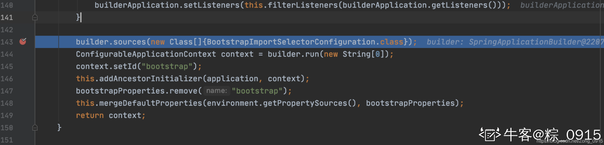
5.环境准备完毕，开始准备应用上下文的信息：
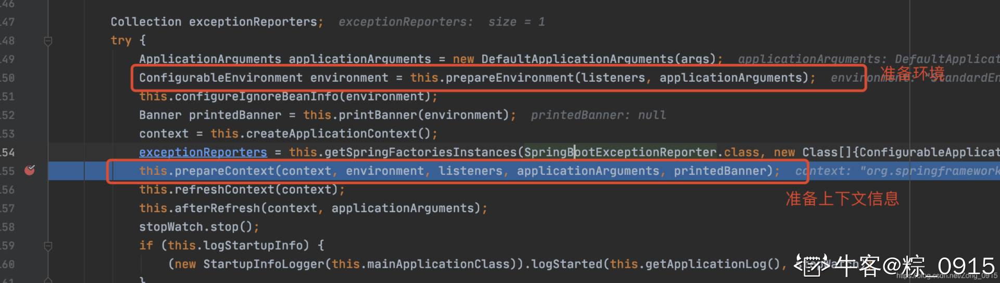
6.执行`applyInitializers（）`方法，最终调用到`PropertySourceBootstrapConfiguration`的`initialize（）`方法，这里则调用了Nacos相关的配置类的初始化。
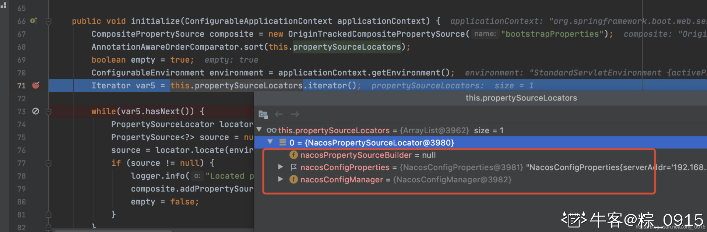
6.由于`NacosPropertySourceLocator`实现了`PropertySourceLocator`接口，因此调用其`locate（）`方法，将从Nacos Config Server获得的配置封装成`CompositePropertySource`对象进行返回。
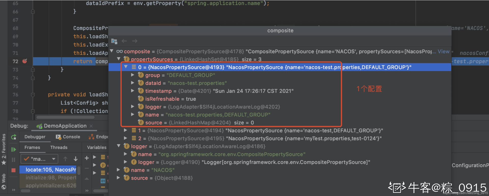

### 2.1.4 小总结1☆

Nacos Config的配置加载过程如下：

1.  SpringBoot项目启动，执行`SpringApplication.run()`方法，**先对项目所需的环境做出准备** 
2.  `BootstrapApplicationListener`监听器监听到环境准备事件，**对需要做自动装配的类进行载入。**导入`BootstrapImportSelectorConfiguration`配置类，该配置类引入`BootstrapImportSelector`选择器，**完成相关的初始化操作。** 
3.  环境准备完成后（所需的相关配置类也初始化完成），执行方法`this.prepareContext（）`**完成上下文信息的准备。** 
4.  `this.prepareContext（）`需要对相关的类进行初始化操作。由于`PropertySourceBootstrapConfiguration`类实现了`ApplicationContextInitializer`接口。因此调用其`initialize（）`方法，完成初始化操作。 
5.  对于`PropertySourceBootstrapConfiguration`下的初始化操作，**需要实现应用外部化配置可动态加载**，而`NacosPropertySourceLocator` 实现了`PropertySourceLocator`接口，故执行他的`locate（）`方法。 
6.  最终`NacosPropertySourceLocator`的`locate（）`方法完成从Nacos Config Server上加载配置信息。 

写到这里，其实目前为止主要讲的是SpringCloud项目从启动到执行方法获取配置的这么一个过程，而对于具体获取远程配置的代码实现并没有深入去讲解。即上文的`locate（）`方法，而该方法还涉及到配置更新时，Nacos如何去做到监听的操作，因此准备将这一块内容另起一节来讲解。

## 2.2 Config配置加载核心代码分析

1.这里我们从`NacosPropertySourceLocator`类下的`locate（）`方法开始分析：

```java
public PropertySource locate(Environment env) {
    this.nacosConfigProperties.setEnvironment(env);
    // 初始化ConfigService对象，这是Nacos客户端提供的用于访问实现配置中心基本操作的类
    // 可以把它类比于RedisTemplate这种操作类
    ConfigService configService = this.nacosConfigManager.getConfigService();
    if (null == configService) {
        log.warn("no instance of config service found, can't load config from nacos");
        return null;
    } else {
        // ....代码省略
        CompositePropertySource composite = new CompositePropertySource("NACOS");
        // 按照顺序分别加载共享配置、扩展配置。应用名称对应的配置。
        this.loadSharedConfiguration(composite);
        this.loadExtConfiguration(composite);
        this.loadApplicationConfiguration(composite, dataIdPrefix, this.nacosConfigProperties, env);
        return composite;
    }
}
```

2.因为一般来说我们都是根据应用名称来获取配置，所以这里以`loadApplicationConfiguration（）`方法为例来说。

```java
private void loadApplicationConfiguration(CompositePropertySource compositePropertySource, String dataIdPrefix, NacosConfigProperties properties, Environment environment) {
    // ....代码省略
    this.loadNacosDataIfPresent(compositePropertySource, dataIdPrefix, nacosGroup, fileExtension, true);
}

private void loadNacosDataIfPresent(final CompositePropertySource composite, final String dataId, final String group, String fileExtension, boolean isRefreshable) {
    // ....代码省略
    NacosPropertySource propertySource = this.loadNacosPropertySource(dataId, group, fileExtension, isRefreshable);          
}

private NacosPropertySource loadNacosPropertySource(final String dataId, final String group, String fileExtension, boolean isRefreshable) {
    return NacosContextRefresher.getRefreshCount() != 0L && !isRefreshable ? 
    NacosPropertySourceRepository.getNacosPropertySource(dataId, group) : 
    this.nacosPropertySourceBuilder.build(dataId, group, fileExtension, isRefreshable);
}

NacosPropertySource build(String dataId, String group, String fileExtension, boolean isRefreshable) {
    Map p = this.loadNacosData(dataId, group, fileExtension);
    // ....代码省略
}

// 关注这个方法
private Map loadNacosData(String dataId, String group, String fileExtension) {
    String data = null;

    try {
        // 最终的数据存放于Map当中，而data数据可以发现是调用ConfigService.getConfig()方法从配置中心上加载配置进行填充的。
        data = this.configService.getConfig(dataId, group, this.timeout);
        // ....代码省略
}
```

这里总结下方法的执行流程（**关注最后的方法即可！，这里列出流程中所有涉及到的步骤是为了怕大家不清楚方法的调用顺序**）：

```
loadApplicationConfiguration（）`--->`loadNacosDataIfPresent（）`--->`NacosPropertySource.loadNacosPropertySource（）`
--->`NacosPropertySource.build（）`--->`loadNacosData（）
```

到这一步我们只需了解到，加载的具体操作是交给`ConfigService`（当然，它是个接口，具体实现交给`NacosConfigService`来完成）来加载配置的。（后面会Debug来具体查看）

接下来主要开始说明NacosConfig的事件订阅机制的实现，分为多个角度结合上文的图来进行说明：
在这里插入图片描述,
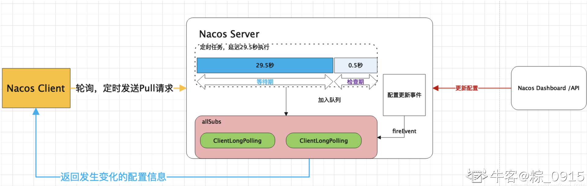

- 如何监听到事件的变更。
- `NacosConfigService`的初始化。（配置加载方法的执行者）
- `ClientWorker`。（因为根据上文的说法，Nacos会有一个定时调度的任务存在，而其具体的实现是NacosConfigService）
- `ClientLongRunnable`类有什么用。
- 服务端的长连接实现
- `ClientLongPolling`是什么。

接下来的内容可能比较多，也希望大家能够耐心的看下去，我最后还会进行一个大总结，将核心代码进行一个梳理。

### 2.2.1 事件订阅机制的实现

我在2.1节讲到了SpringBoot在启动的时候，会执行**准备上下文**的这么一个操作。而Nacos有一个类叫做`NacosContextRefresher`，它实现了`ApplicationListener`，即他是一个监听器，**负责监听准备上下文的事件**，我们来看下他的结构：

```java
// 这里监听的是ApplicationReadyEvent，也就是在上下文准备完毕的时候，会触发这个事件，执行onApplicationEvent（）方法。
public class NacosContextRefresher implements ApplicationListener, ApplicationContextAware {
    public void onApplicationEvent(ApplicationReadyEvent event) {
        if (this.ready.compareAndSet(false, true)) {
            //这个方法主要用来实现Nacos事件监听的注册            
            this.registerNacosListenersForApplications();
        }
    }
}
```

紧接着来看下它的事件监听注册方法：

```java
private void registerNacosListenersForApplications() {
    // 代码省略    
    this.registerNacosListener(propertySource.getGroup(), dataId);
}

private void registerNacosListener(final String groupKey, final String dataKey) {
    String key = NacosPropertySourceRepository.getMapKey(dataKey, groupKey);
    Listener listener = (Listener)this.listenerMap.computeIfAbsent(key, (lst) -> {
        return new AbstractSharedListener() {
            public void innerReceive(String dataId, String group, String configInfo) {
                // 代码省略

                // 当收到配置变更的回调后，会通过publishEvent（）发布一个RefreshEvent事件
                // 而该事件的监听，其实现在RefreshEventListener这个监听器中
                NacosContextRefresher.this.applicationContext.publishEvent(new RefreshEvent(this, (Object)null, "Refresh Nacos config"));
                 // 代码省略
            }
        };
    });
    // 代码省略
}
```

监听刷新事件的监听器：

```java
public class RefreshEventListener implements SmartApplicationListener {
    public void handle(RefreshEvent event) {
        if (this.ready.get()) {
            log.debug("Event received " + event.getEventDesc());
            // 调用refresh.refresh()方法来完成配置的更新和应用
            Set keys = this.refresh.refresh();
            log.info("Refresh keys changed: " + keys);
        }
    }
}
```

### 2.2.2 NacosConfigService

先来看一下`NacosConfigService`的构造：

```java
public NacosConfigService(Properties properties) throws NacosException {
    String encodeTmp = properties.getProperty("encode");
    if (StringUtils.isBlank(encodeTmp)) {
        this.encode = "UTF-8";
    } else {
        this.encode = encodeTmp.trim();
    }

    this.initNamespace(properties);
    // 这里初始化了一个HttpAgent，用到了装饰器模式
    // 即实际工作的类是ServerHttpAgent，增加监控统计的信息
    this.agent = new MetricsHttpAgent(new ServerHttpAgent(properties));
    this.agent.start();
    // 而这个ClientWorker是客户端的一个工作类，agent作为参数传入其中，即利用HttpAgent来做一些远程相关的事情。
    this.worker = new ClientWorker(this.agent, this.configFilterChainManager, properties);
}
```

竟然都提到了装饰器模式了，那我也啰嗦几句吧🤣，讲一讲什么是装饰器模式：

> 按照单一职责原则，某一个对象只专注于干一件事，而如果要扩展其职能的话，不如想办法分离出一个类来“包装”这个对象，而这个扩展出的类则专注于实现扩展功能。装饰器模式就可以将新功能动态地附加于现有对象而不改变现有对象的功能。


而Java当中的IO流就普遍使用了装饰器模式，例如`BufferedInputStream`类，那么怎么个包装法呢，即**通常将基本流作为高级流构造器的参数传入，将其作为高级流的一个关联对象，从而对其功能进行扩展和装饰。**
例如：

```java
new BufferedInputStream(new InputStream())；
```

### 2.2.3 ClientWorker

同样的，我们来看下其构造函数，**其主要作用是构建两个定时调度的线程池，并且启动一个定时任务。**

```java
public ClientWorker(final HttpAgent agent, ConfigFilterChainManager configFilterChainManager, Properties properties) {
    this.agent = agent;
    this.configFilterChainManager = configFilterChainManager;
    this.init(properties);
    // 第一个线程池executor：可以发现其核心线程数为1。
    // 每10秒会执行一次checkConfigInfo（）方法，即检查一次配置信息（参考this.executor.scheduleWithFixedDelay）
    this.executor = Executors.newScheduledThreadPool(1, new ThreadFactory() {
        public Thread newThread(Runnable r) {
            Thread t = new Thread(r);
            t.setName("com.alibaba.nacos.client.Worker." + agent.getName());
            t.setDaemon(true);
            return t;
        }
    });
    // 第二个线程池executorService只完成了初始化，这里并没有启动，他主要用于实现客户端的定时长轮询功能。
    this.executorService = Executors.newScheduledThreadPool(Runtime.getRuntime().availableProcessors(), new ThreadFactory() {
        public Thread newThread(Runnable r) {
            Thread t = new Thread(r);
            t.setName("com.alibaba.nacos.client.Worker.longPolling." + agent.getName());
            t.setDaemon(true);
            return t;
        }
    });
    this.executor.scheduleWithFixedDelay(new Runnable() {
        public void run() {
            try {
                ClientWorker.this.checkConfigInfo();
            } catch (Throwable var2) {
                ClientWorker.LOGGER.error("[" + agent.getName() + "] [sub-check] rotate check error", var2);
            }

        }
    }, 1L, 10L, TimeUnit.MILLISECONDS);
}
```

紧接着我们来看下启动的定时任务中，执行的**checkConfigInfo（）** 方法：

```java
public void checkConfigInfo() {
    // 1.分配任务
    // cacheMap：是用来存储监听变更的缓存集合，Key：根据dataId/group/tenant(租户)拼接的值
    // Value：对应的存储在Nacos服务器上的配置文件的内容。
    int listenerSize = ((Map)this.cacheMap.get()).size();
    // 2.通过向上取整，取得的数值为批数
    // 默认情况下，每个长轮询LongPollingRunnable任务处理3000个监听配置集
    // 如果超过3000个，则需要启动多个LongPollingRunnable去执行
    int longingTaskCount = (int)Math.ceil((double)listenerSize / ParamUtil.getPerTaskConfigSize());
    if ((double)longingTaskCount > this.currentLongingTaskCount) {
        for(int i = (int)this.currentLongingTaskCount; i < longingTaskCount; ++i) {
            // 这里则是搭建一个长轮询机制，去监听变更的数据。
            this.executorService.execute(new ClientWorker.LongPollingRunnable(i));
        }

        this.currentLongingTaskCount = (double)longingTaskCount;
    }

}
```

上面方法中，总结就是启动一个定时任务，然后通过线程池去建立长轮询连接，检查/更新方法的配置。而具体的任务都在`LongPollingRunnable`类中了。

### 2.2.4 LongPollingRunnable

`LongPollingRunnable`**本质上是一个线程**，因此直接看他的`run（）`方法。

```java
public void run() {
    List cacheDatas = new ArrayList();
    ArrayList inInitializingCacheList = new ArrayList();

    try {
        // 遍历cacheDatas，检查本地配置
        Iterator var3 = ((Map)ClientWorker.this.cacheMap.get()).values().iterator();

        while(var3.hasNext()) {
            CacheData cacheData = (CacheData)var3.next();
            //属于当前长轮询任务的
            if (cacheData.getTaskId() == this.taskId) {
                cacheDatas.add(cacheData);

                try {
                    //1\. 检查本地配置
                    ClientWorker.this.checkLocalConfig(cacheData);
                    if (cacheData.isUseLocalConfigInfo()) {
                        cacheData.checkListenerMd5();//有改变的话则通知
                    }
                } catch (Exception var13) {
                    ClientWorker.LOGGER.error("get local config info error", var13);
                }
            }
        }

        // 2.和服务端建立长轮询机制，从服务端获取发生变更的数据
        // 即通过长轮询请求检查服务端对应配置是否发生了变更
        List changedGroupKeys = ClientWorker.this.checkUpdateDataIds(cacheDatas, inInitializingCacheList);
        Iterator var16 = changedGroupKeys.iterator();
        // 3.遍历变更数据集合changedGroupKeys，调用getServerConfig（）方法，
        // 根据DataId、Group？Tenant（租户）去服务端读取对应的配置信息并保存到本地文件中。
        while(var16.hasNext()) {
            String groupKey = (String)var16.next();
            String[] key = GroupKey.parseKey(groupKey);
            String dataId = key[0];
            String group = key[1];
            String tenant = null;
            if (key.length == 3) {
                tenant = key[2];
            }

            try {
                String content = ClientWorker.this.getServerConfig(dataId, group, tenant, 3000L);
                CacheData cache = (CacheData)((Map)ClientWorker.this.cacheMap.get()).get(GroupKey.getKeyTenant(dataId, group, tenant));
                cache.setContent(content);//设置配置内容
                ClientWorker.LOGGER.info("[{}] [data-received] dataId={}, group={}, tenant={}, md5={}, content={}", new Object[]{ClientWorker.this.agent.getName(), dataId, group, tenant, cache.getMd5(), ContentUtils.truncateContent(content)});
            } catch (NacosException var12) {
                String message = String.format("[%s] [get-update] get changed config exception. dataId=%s, group=%s, tenant=%s", ClientWorker.this.agent.getName(), dataId, group, tenant);
                ClientWorker.LOGGER.error(message, var12);
            }
        }

        var16 = cacheDatas.iterator();
        // 触发事件的通知
        while(true) {
            CacheData cacheDatax;
            do {
                if (!var16.hasNext()) {
                    inInitializingCacheList.clear();
                    //继续定时的执行当前的线程                    
                    ClientWorker.this.executorService.execute(this);
                    return;
                }

                cacheDatax = (CacheData)var16.next();
            } while(cacheDatax.isInitializing() && !inInitializingCacheList.contains(GroupKey.getKeyTenant(cacheDatax.dataId, cacheDatax.group, cacheDatax.tenant)));

            cacheDatax.checkListenerMd5();
            // 请求过了后就设置为不在初始化中，这样就会被挂起，如果服务器配置有更新，就会立即返回
            // 这样就可以实现动态配置更新，又不会太多的空轮询消耗，解决Pull模式下的空轮询消耗问题。
            cacheDatax.setInitializing(false);
        }
    } catch (Throwable var14) {
        ClientWorker.LOGGER.error("longPolling error : ", var14);
        ClientWorker.this.executorService.schedule(this, (long)ClientWorker.this.taskPenaltyTime, TimeUnit.MILLISECONDS);
    }
}
```

上述方法总结就是：

1. 根据`taskId`对`cacheMap`进行数据的分割，再比较本地配置的数据是否存在变更。
2. 如果存在变更，则直接触发通知。
3. 对于配置的比较，需要注意：在`${user}\nacos\config\`目录下会缓存一份服务端的配置信息，而`checkLocalConfig（）`方***和本地磁盘中的文件内容进行比较。
4. 接下来调用的`checkUpdateDataIds（）`方法，则基于长连接的方式来监听服务端配置的变化，最后根据变化数据的key来去服务端获取最新的数据。（key是**dataId/group/租户**）

那么接下来再重点讲一讲`checkUpdateDataIds（）`方法，该方法最终会调用`checkUpdateConfigStr（）`方法：

```java
List checkUpdateConfigStr(String probeUpdateString, boolean isInitializingCacheList) throws IOException {
    List params = Arrays.asList("Listening-Configs", probeUpdateString);
    List headers = new ArrayList(2);
    headers.add("Long-Pulling-Timeout");
    headers.add("" + this.timeout);
    if (isInitializingCacheList) {
        headers.add("Long-Pulling-Timeout-No-Hangup");
        headers.add("true");
    }

    if (StringUtils.isBlank(probeUpdateString)) {
        return Collections.emptyList();
    } else {
        try {
            // 通过调用agent.httpPost（）方法，调用/v1/cs/configs/listener这个接口实现长轮询的请求
            // 长轮询请求在实现的层面，设计了一个超时时间，也就是30秒
            HttpResult result = this.agent.httpPost("/v1/cs/configs/listener", headers, params, this.agent.getEncode(), this.timeout);
            // 如果服务端的数据发生了变更，客户端会收到一个HttpResult，而服务端返回的是存在数据变更的一个Key
            // 这个key也就是DataId、Group、Tenant（租户），获得这些信息后，LongPollingRunnable这个线程会调用getServerConfig（）方法
            // 也就是去Nacos服务器上读取具体的配置内容
            if (200 == result.code) {
                this.setHealthServer(true);
                return this.parseUpdateDataIdResponse(result.content);
            }

            this.setHealthServer(false);
            LOGGER.error("[{}] [check-update] get changed dataId error, code: {}", this.agent.getName(), result.code);
        } catch (IOException var6) {
            this.setHealthServer(false);
            LOGGER.error("[" + this.agent.getName() + "] [check-update] get changed dataId exception", var6);
            throw var6;
        }

        return Collections.emptyList();
    }
}

// 去Nacos服务器上读取配置内容，竟然是去Nacos上读取的话，那必然获得的配置也是最新的。
public String getServerConfig(String dataId, String group, String tenant, long readTimeout) throws NacosException {
    if (StringUtils.isBlank(group)) {
        group = "DEFAULT_GROUP";
    }

    HttpResult result = null;

    try {
        List params = null;
        if (StringUtils.isBlank(tenant)) {
            params = Arrays.asList("dataId", dataId, "group", group);
        } else {
            params = Arrays.asList("dataId", dataId, "group", group, "tenant", tenant);
        }

        result = this.agent.httpGet("/v1/cs/configs", (List)null, params, this.agent.getEncode(), readTimeout);
        // 省略。。。
```

### 2.2.5 服务端长连接处理机制

tips：这里我去Github上摘抄的代码，地址给大家：Nacos-Server，建议大家下载过来，在Idea中直接看比较方便。

前面主要是讲了事件的订阅、WorkClient创建出的线程池干了什么、以及长连接的建立，**但是这些都是面向客户端的**，因此接下来从服务端的角度来看一看长连接的处理机制。

在Nacos-config模块下，controller包下有一个类叫做`ConfigController`，**专门用来实现配置的基本操作**，其中有一个`/listener`接口，是客户端发起数据监听的接口。

```java
@PostMapping("/listener")
@Secured(action = ActionTypes.READ, parser = ConfigResourceParser.class)
public void listener(HttpServletRequest request, HttpServletResponse response)
        throws ServletException, IOException {
    request.setAttribute("org.apache.catalina.ASYNC_SUPPORTED", true);
    String probeModify = request.getParameter("Listening-Configs");
    if (StringUtils.isBlank(probeModify)) {
        throw new IllegalArgumentException("invalid probeModify");
    }

    probeModify = URLDecoder.decode(probeModify, Constants.ENCODE);

    Map clientMd5Map;
    try {
        //获取客户端需要监听的可能发生变化的配置，并计算其MD5值。
        clientMd5Map = MD5Util.getClientMd5Map(probeModify);
    } catch (Throwable e) {
        throw new IllegalArgumentException("invalid probeModify");
    }

    // 执行长轮询的请求。
    inner.doPollingConfig(request, response, clientMd5Map, probeModify.length());
}
```

主要干两件事：

1. 获取客户端需要监听的可能发生变化的配置，并计算其MD5值。
2. `inner.doPollingConfig（）`开始执行长轮询的请求。

接下来来看一下处理长轮询的方法`doPollingConfig（）`：

```java
public String doPollingConfig(HttpServletRequest request, HttpServletResponse response,
            Map clientMd5Map, int probeRequestSize) throws IOException {

    // 首先判断当前请求是否为长轮询，如果是，则调用addLongPollingClient（）方法
    if (LongPollingService.isSupportLongPolling(request)) {
        longPollingService.addLongPollingClient(request, response, clientMd5Map, probeRequestSize);
        return HttpServletResponse.SC_OK + "";
    }

    // 兼容短轮询的逻辑
    List changedGroups = MD5Util.compareMd5(request, response, clientMd5Map);

    // 兼容短轮询的结果
    String oldResult = MD5Util.compareMd5OldResult(changedGroups);
    String newResult = MD5Util.compareMd5ResultString(changedGroups);
    // 省略。。
}

//addLongPollingClient（）方法
public void addLongPollingClient(HttpServletRequest req, HttpServletResponse rsp, Map clientMd5Map,
            int probeRequestSize) {
    //获取客户端设置的请求超时时间
    String str = req.getHeader(LongPollingService.LONG_POLLING_HEADER);
    String noHangUpFlag = req.getHeader(LongPollingService.LONG_POLLING_NO_HANG_UP_HEADER);
    String appName = req.getHeader(RequestUtil.CLIENT_APPNAME_HEADER);
    String tag = req.getHeader("Vipserver-Tag");
    int delayTime = SwitchService.getSwitchInteger(SwitchService.FIXED_DELAY_TIME, 500);

    // Add delay time for LoadBalance, and one response is returned 500 ms in advance to avoid client timeout.
    // 意思是提前500ms返回响应，为了避免客户端超时
    long timeout = Math.max(10000, Long.parseLong(str) - delayTime);
    // 判断是否为混合连接，如果是，那么定时任务将在30秒后开始执行
    if (isFixedPolling()) {
        timeout = Math.max(10000, getFixedPollingInterval());
        // Do nothing but set fix polling timeout.
    } else {
        // 如果不是，29.5秒后开始执行，也就是所谓的等待期
        long start = System.currentTimeMillis();
        // 和服务端的数据进行MD5对比，如果发生变化则直接返回
        List changedGroups = MD5Util.compareMd5(req, rsp, clientMd5Map);
        if (changedGroups.size() > 0) {
            generateResponse(req, rsp, changedGroups);
            LogUtil.CLIENT_LOG.info("{}|{}|{}|{}|{}|{}|{}", System.currentTimeMillis() - start, "instant",
                    RequestUtil.getRemoteIp(req), "polling", clientMd5Map.size(), probeRequestSize,
                    changedGroups.size());
            return;
        } else if (noHangUpFlag != null && noHangUpFlag.equalsIgnoreCase(TRUE_STR)) {
            LogUtil.CLIENT_LOG.info("{}|{}|{}|{}|{}|{}|{}", System.currentTimeMillis() - start, "nohangup",
                    RequestUtil.getRemoteIp(req), "polling", clientMd5Map.size(), probeRequestSize,
                    changedGroups.size());
            return;
        }
    }
    String ip = RequestUtil.getRemoteIp(req);

    // Must be called by http thread, or send response.
    // 一定要由HTTP线程调用，否则离开后容器会立即发送响应
    final AsyncContext asyncContext = req.startAsync();

    // AsyncContext.setTimeout() is incorrect, Control by oneself
    asyncContext.setTimeout(0L);
    // 执行ClientLongPolling线程
    ConfigExecutor.executeLongPolling(
            new ClientLongPolling(asyncContext, clientMd5Map, ip, probeRequestSize, timeout, appName, tag));
}
```

即将客户端的长轮询请求封装成`ClientLongPolling`交给`scheduler`执行。

### 2.2.6 ClientLongPolling

`ClientLongPolling`同样是一个线程，因此也看他的`run（）`方法：
主要做四件事情：

```java
@Override
public void run() {
    // 1.创建一个调度的任务，调度的延时时间为 29.5s
    asyncTimeoutFuture = ConfigExecutor.scheduleLongPolling(new Runnable() {
        @Override
        public void run() {
            try {
                getRetainIps().put(ClientLongPolling.this.ip, System.currentTimeMillis());

                // 3.延时时间到了之后，首先将该 ClientLongPolling 自身的实例从 allSubs 中移除
                allSubs.remove(ClientLongPolling.this);

                if (isFixedPolling()) {
                    LogUtil.CLIENT_LOG
                            .info("{}|{}|{}|{}|{}|{}", (System.currentTimeMillis() - createTime), "fix",
                                    RequestUtil.getRemoteIp((HttpServletRequest) asyncContext.getRequest()),
                                    "polling", clientMd5Map.size(), probeRequestSize);
                    // 4.获取服务端中保存的对应客户端请求的groupKeys，判断是否变更，并将结果写入response，返回给客户端
                    List changedGroups = MD5Util
                            .compareMd5((HttpServletRequest) asyncContext.getRequest(),
                                    (HttpServletResponse) asyncContext.getResponse(), clientMd5Map);
                    if (changedGroups.size() > 0) {
                        sendResponse(changedGroups);
                    } else {
                        sendResponse(null);
                    }
                } else {
                    LogUtil.CLIENT_LOG
                            .info("{}|{}|{}|{}|{}|{}", (System.currentTimeMillis() - createTime), "timeout",
                                    RequestUtil.getRemoteIp((HttpServletRequest) asyncContext.getRequest()),
                                    "polling", clientMd5Map.size(), probeRequestSize);
                    sendResponse(null);
                }
            } catch (Throwable t) {
                LogUtil.DEFAULT_LOG.error("long polling error:" + t.getMessage(), t.getCause());
            }

        }

    }, timeoutTime, TimeUnit.MILLISECONDS);
    // 2.将ClientLongPolling自身的实例添加到一个allSubs中
    // 他是一个队列ConcurrentLinkedQueue
    allSubs.add(this);
}
```

这里可以这么理解：

1. `allSubs`这个队列和`ClientLongPolling`之间维持了一种订阅关系，而`ClientLongPolling`是属于被订阅的角色。
2. 那么一旦订阅关系删除后，订阅方就无法对被订阅方进行通知了。
3. 服务端直到调度任务的延时时间用完之前，`ClientLongPolling`都不会有其他的事情可以做，因此这段时间内`allSubs`队列会处理相关的逻辑。

为了我们在客户端长轮询期间，一旦更改配置，客户端能够立即得到响应数据，因此这个事件的触发肯定需要发生在服务端上。看下`ConfigController`下的`publishConfig（）`方法
我在这里直接以截图的形式来展示重要的代码逻辑：
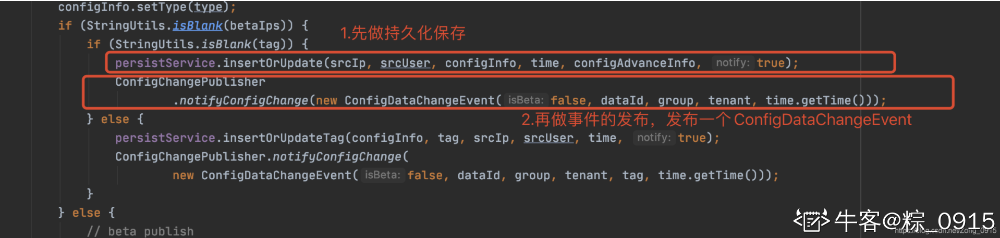
其实老版本的话，这里的代码写的是（当然我们并不会关注老版本，所以大家了解下就是)：

```java
EventDispatcher.fireEvent(new ConfigDataChangeEvent（）)；
```

也因此，上文的图中，有一个`fireEvent`这么一个字段。

到这里，如果我们从Nacos控制台上更新了某个配置项后，这里会调用`LongPollingService`的`onEvent（）`方法：

```java
 public LongPollingService() {
    allSubs = new ConcurrentLinkedQueue();

    ConfigExecutor.scheduleLongPolling(new StatTask(), 0L, 10L, TimeUnit.SECONDS);

    // Register LocalDataChangeEvent to NotifyCenter.
    NotifyCenter.registerToPublisher(LocalDataChangeEvent.class, NotifyCenter.ringBufferSize);

    // Register A Subscriber to subscribe LocalDataChangeEvent.
    NotifyCenter.registerSubscriber(new Subscriber() {

        @Override
        public void onEvent(Event event) {
            if (isFixedPolling()) {
                // Ignore.
            } else {
                if (event instanceof LocalDataChangeEvent) {
                    LocalDataChangeEvent evt = (LocalDataChangeEvent) event;
                    ConfigExecutor.executeLongPolling(new DataChangeTask(evt.groupKey, evt.isBeta, evt.betaIps));
                }
            }
        }

        @Override
        public Class subscribeType() {
            return LocalDataChangeEvent.class;
        }
    });

}
```

意思就是通过`DataChangeTask`这个任务来通知客户端：”服务端的数据已经发生了变更！“，接下来看下这个任务干了什么：

```java
class DataChangeTask implements Runnable { 
    @Override
    public void run() {
        try {
            ConfigCacheService.getContentBetaMd5(groupKey);
            // 1.遍历allSubs队列，该队列中维持的是所有客户端的请求任务
            // 那么需要找到与当前发生变更的配置项的groupKey相等的ClientLongPolling任务
            for (Iterator iter = allSubs.iterator(); iter.hasNext(); ) {
                ClientLongPolling clientSub = iter.next();
                if (clientSub.clientMd5Map.containsKey(groupKey)) {
                    // If published tag is not in the beta list, then it skipped.
                    if (isBeta && !CollectionUtils.contains(betaIps, clientSub.ip)) {
                        continue;
                    }

                    // If published tag is not in the tag list, then it skipped.
                    if (StringUtils.isNotBlank(tag) && !tag.equals(clientSub.tag)) {
                        continue;
                    }

                    getRetainIps().put(clientSub.ip, System.currentTimeMillis());
                    iter.remove(); // 删除订阅关系
                    LogUtil.CLIENT_LOG
                            .info("{}|{}|{}|{}|{}|{}|{}", (System.currentTimeMillis() - changeTime), "in-advance",
                                    RequestUtil
                                            .getRemoteIp((HttpServletRequest) clientSub.asyncContext.getRequest()),
                                    "polling", clientSub.clientMd5Map.size(), clientSub.probeRequestSize, groupKey);
                    // 2.找到对应的ClientLongPolling任务后，将发生变更的groupKey通过该ClientLongPolling写入到响应对象中，即完成一次数据变更的推送操作。
                    clientSub.sendResponse(Arrays.asList(groupKey));
                }
            }
        } catch (Throwable t) {
            LogUtil.DEFAULT_LOG.error("data change error: {}", ExceptionUtil.getStackTrace(t));
        }
    }
}

void sendResponse(List changedGroups) {

    // Cancel time out task.
    // 如果说DataChangeTask完成了数据的推送，ClientLongPolling中的调度任务又开始执行了，那么会发生冲突
    // 因此在进行推送操作之前，现将原来等待执行的调度任务取消掉
    // 这样就可以防止推送操作完成后，调度任务又去写响应数据，造成冲突。
    if (null != asyncTimeoutFuture) {
        asyncTimeoutFuture.cancel(false);
    }
    generateResponse(changedGroups);
}
```

### 2.2.7 小总结2☆☆

首先请原谅我可能写的有点乱，所以这里先做个小总结对上文做一个归纳。
首先我想先说明一点：

- 为什么更改了配置信息后客户端会立即得到响应？

> 1.首先每个配置在服务端都封装成一个ClientLongPolling对象。其存储于队列当中。
2.客户端和服务端会建立起一个长连接，并且维持29.5秒的等待时间，**这段时间内除非配置发生更改，请求是不会返回的。**
3.其次服务端一旦发现配置信息发生更改，在更改了配置信息后，会找到对应的ClientLongPolling任务，并将其更改后的groupKey写入到响应对象中response，**进行立刻返回。**
4.之所以称之为实时的感知，是因为**服务端主动**将变更后的数据通过HTTP的response对象写入并且立刻返回。
5.而服务端说白了，**就是做了一个定时调度任务**，在等待调度任务执行的期间（29.5秒）若发生配置变化，则立刻响应，否则等待30秒去返回配置数据给客户端。


接下来开始说Nacos Config实时更新的一个原理：
这里，我同样的准备从多个方面来进行阐述，毕竟内容比较多，也怕大家搞混。

---

首先，**对于客户端而言，如何感知到服务端配置的变更呢？**

1. 同样的，当SpringBoot项目启动的时候，会执行”**准备上下文**“的这么一个事情。此时`NacosContextRefresher`会监听到这个事件，**并且注册一个负责监听配置变更回调的监听器**`registerNacosListener`。
2. registerNacosListener一旦收到配置变更的回调，**则发布一个RefreshEvent事件**，**对应的**`**RefreshEventListener**`**监听器检测到该事件后，将调用**`**refresh.refresh()**`**方法来完成配置的更新。**

---

一旦发现服务端配置的变更，那么客户端肯定是要再进行配置的加载（`locate（）`）的，而其最终通过`NacosConfigService.getConfig()`方法来实现，**在调用这个方法之前，必定要完成**`**NacosConfigService**`**的初始化操作。** 因此这个初始化过程做了什么？

1. 根据`NacosConfigService`的构造函数，其做了两件事：**初始化并启动一个HttpAgent**（在Client端用来管理链接的持久性和重用的工具），**初始化一个ClientWorker。**
2. 初始化`ClientWorker`的过程中，构建了两个定时调度的线程池`executor`和`executorService`，并且启动executor线程池，负责定时调度`checkConfigInfo（）`方法，**即检查一次配置信息**。
3. `checkConfigInfo（）`方法中，使用了第二步的`executorService`线程池，**负责搭建一个长轮询机制，去监听变更的数据**。而这个任务通过`LongPollingRunnable`类来实现。
4. LongPollingRunnable是一个线程任务，通过调用`checkUpdateDataIds（）`方法，基于长连接的方式来监听服务端配置的变化 ，**同时，如果发生配置的变更，则触发一个个事件，那么上述的监听器发现后，则调用refresh()方法更新配置。**
5. `checkUpdateDataIds（）`方法中，**建立的长连接时长30秒，并且一旦服务端发生数据变更，客户端则收到一个HttpResult，里面保存的是这个变更配置的最新key**。那么客户端则**根据最新配置的key去服务端获取配置。**

---

到这里为止，客户端的实时更新配置的原理已经讲完了，接下来总结服务端的原理：

1. 首先`ConfigController`下有一个监听器相关的接口，是客户端发起数据监听的接口，主要做两件事：**获取客户端需要监听的可能发生变化的配置，并计算其MD5值**。**执行长轮询的请求**。
2. 将长轮询请求封装成`ClientLongPolling`，交给线程池去执行。
3. 执行过程中，可以理解为一个配置为一个长轮询请求，也就对应一个`ClientLongPolling`，将其放在一个队列`allSubs`当中，并且任务总共有29.5秒的等待时间。
4. 如果某一个配置发生改变，会调用`LongPollingService`的`onEvent（）`方法**来通知客户端服务端的数据已经发生了变更。**
5. 这里所谓的通知也就是从队列中找到变更配置对应的`ClientLongPolling`对象，将发生变更的`groupKey`通过该`ClientLongPolling`写入到响应对象`response`中。
6. 那么客户端收到了`respones`后，自然可以得到更改配置的`groupKey`，然后去Nacos上查询即可。

# 三. 用流程图来解释Nacos-Config的实现原理

本篇文章先是讲了客户端方面如何执行远程配置的加载，再从加载的具体实现细节来一一详解。**而这个实现细节也就包括了Nacos-Config如何实现配置的实时更新。**

其实讲到这里已经是写完了（累🤣），但是我还是挺怕大家看到这里还是不理解，也怕自己水平有限导致写的文章并不是很好，因此还是以自己的理解整了这么一个流程图给大家：
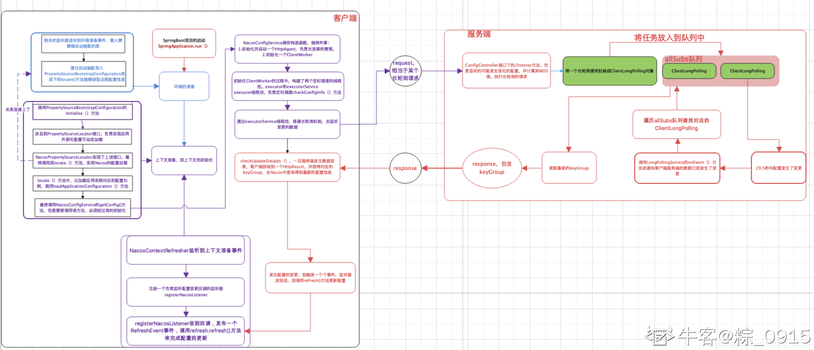

## 3.1 客户端部分流程图

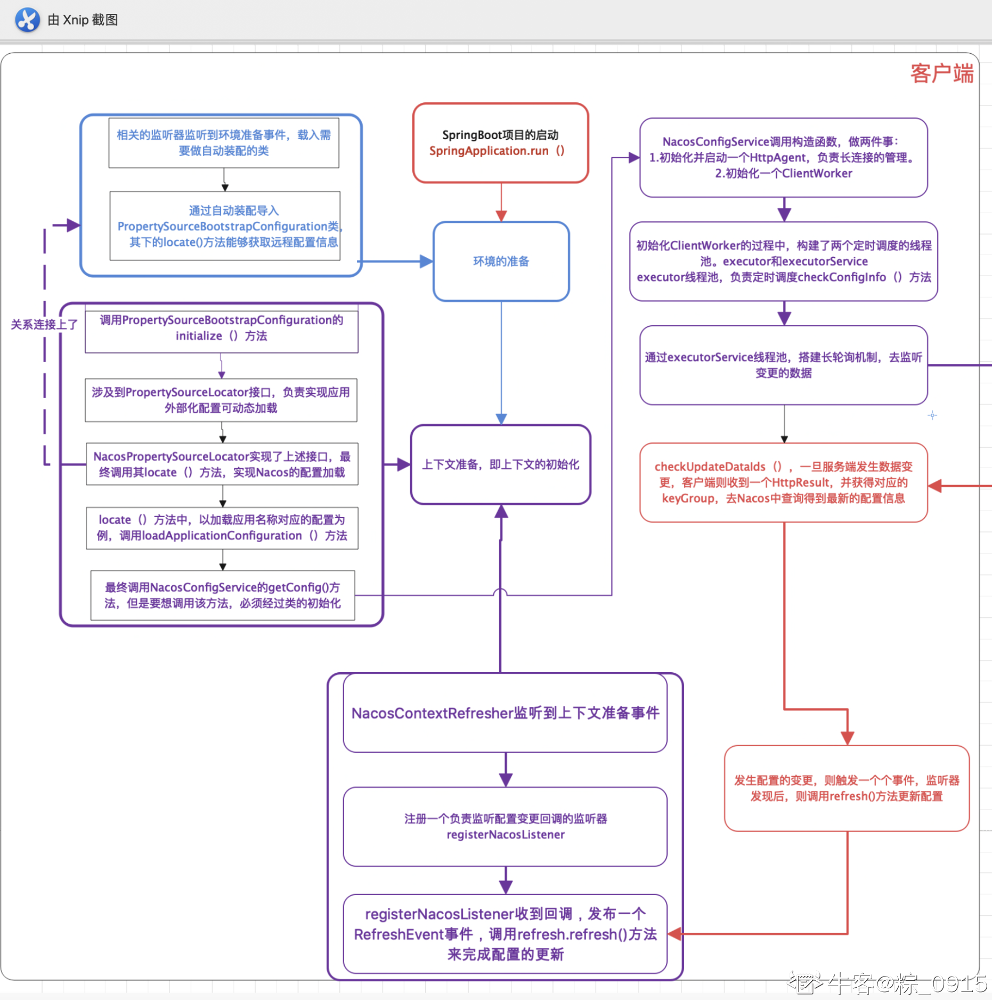

## 3.2 服务端部分流程图

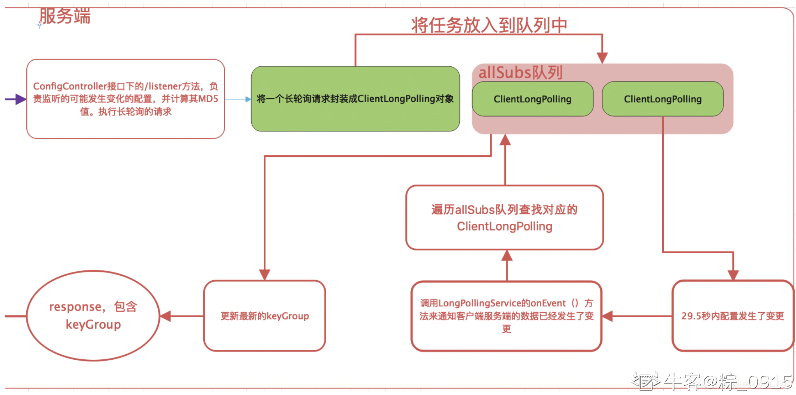

流程图我真的尽力画了，**只是做一个参考**，建议以文章的内容为主（**重点于小总结**），也希望能够帮到大家理解。

关于Nacos具体的加载流程、事件的监听、长连接的处理我就不通过Debug来展示了。感兴趣的小伙伴可以自己Debug下，去官网把Nacos相关的代码下载下来，远程Remote下打个断点试试。

最后，非常感谢所有能够读到这里的读者！（写的可能不是很好，若哪里写的不对，还望大家指出，我及时更正）
