# Seata的Saga模式使用详解

> 本文转载自：
>
> https://cloud.tencent.com/developer/article/2130947

## 1 前言

目前业界公认 Saga 是作为长事务的解决方案。而seata作为目前最流行的分布式事物解决方案也提供了Saga的支持。而采用Seata的Saga模式进行事物控制，核心就是通过状态机来进行控制，本文重点介绍Seata Saga状态机[设计](https://javaforall.cn/tag/设计)器的使用实战。

------

## 2 为什么要研究Seata Saga状态机设计器？

saga提供了两种实现方式，一种是编排，另一种是控制。seata的实现方式是后者。seata的控制器使用状态机驱动事务执行。 同AT模式，在saga模式下，seata也提供了RM、TM和TC三个角色。TC也是位于sever端，RM和TM位于客户端。TM用于开启全局事务，RM开启分支事务，TC监控事务运行。

Seata Saga 采用了状态机+DSL 方案来实现，原因有以下几个：

状态机+DSL 方案在实际生产中应用更广泛； 可以使用 Actor 模型或 SEDA 架构等异步处理引擎来执行，提高整体吞吐量； 通常在核心系统以上层的业务系统会伴随有“服务编排”的需求，而服务编排又有事务最终一致性要求，两者很难分割开，状态机+DSL 方案可以同时满足这两个需求；

由于 Saga 模式在理论上是不保证隔离性的，在极端情况下可能由于脏写无法完成回滚操作，比如举一个极端的例子, [分布式事务](https://cloud.tencent.com/product/dtf?from=10680)内先给用户 A 充值，然后给用户 B 扣减余额，如果在给 A 用户充值成功，在事务提交以前，A 用户把线消费掉了，如果事务发生回滚，这时则没有办法进行补偿了，有些业务场景可以允许让业务最终成功，在回滚不了的情况下可以继续重试完成后面的流程，状态机+DSL 的方案可以实现“向前”恢复上下文继续执行的能力, 让业务最终执行成功，达到最终一致性的目的。

>  在不保证隔离性的情况下：业务流程设计时要遵循“宁可长款, 不可短款”的原则，长款意思是客户少了线机构多了钱，以机构信誉可以给客户退款，反之则是短款，少的线可能追不回来了。所以在业务流程设计上一定是先扣款。 

## 3 Seata Saga状态机设计器实战

在使用saga模式前，我们需要先定义好状态机，seata提供了网址可以可视化编辑状态机： http://seata.io/saga_designer/index.html 网上很多地方说通过编辑器编辑后导出的状态机json无法使用，还需要手动编辑。而官网又导出的json可以直接使用，引擎能自动解析，但是又没有给出一个可以参考允许的json。 seata本来是非常优秀的框架，但是真的感觉毁在了文档上，可参考运行的demo实在有限。

在saga模式下，一个状态机实例就是一个全局事务，状态机中的每个状态是分支事务。

### 3.1 状态机流程图

下面给出一个可运行实例： 

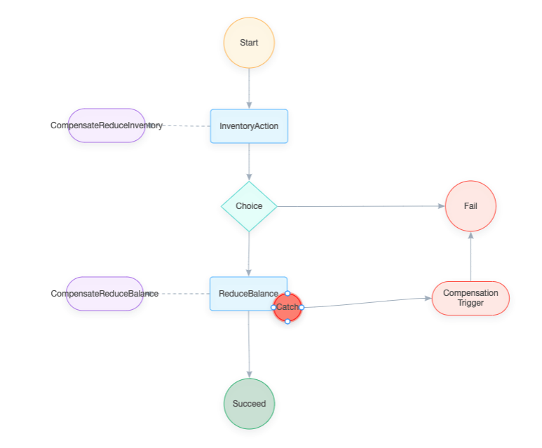

 **说明：** 业务逻辑还是使用官网的例子，InventoryAction是库存服务，BalanceAction是账户服务。两个参与都有一个reduce方法，表示库存扣减或余额扣减，还有一个compensateReduce方法，表示补偿扣减操作。

### 3.2 状态机完整json

对应的完整状态机json：

```javascript
{
    "nodes" : [
        {
            "type" : "node",
            "size" : "72*72",
            "shape" : "flow-circle",
            "color" : "#FA8C16",
            "label" : "Start",
            "stateId" : "Start",
            "stateType" : "Start",
            "stateProps" : {
                "StateMachine" : {
                    "Name" : "reduceInventoryAndBalance",
                    "Comment" : "reduce inventory then reduce balance in a transaction",
                    "Version" : "0.0.1"
                },
                "Next" : "InventoryAction"
            },
            "x" : 467.875,
            "y" : 53,
            "id" : "973bd79e",
            "index" : 9
        },
        {
            "type" : "node",
            "size" : "110*48",
            "shape" : "flow-rect",
            "color" : "#1890FF",
            "label" : "InventoryAction",
            "stateId" : "InventoryAction",
            "stateType" : "ServiceTask",
            "stateProps" : {
                "Type" : "ServiceTask",
                "ServiceName" : "inventoryAction",
                "Next" : "ChoiceState",
                "ServiceMethod" : "reduce",
                "Input" : [
                    "$.[businessKey]",
                    "$.[count]"
                ],
                "Output" : {
                    "reduceInventoryResult" : "$.#root"
                },
                "Status" : {
                    "#root == true" : "SU",
                    "#root == false" : "FA",
                    "$Exception{java.lang.Throwable}" : "UN"
                },
                "CompensateState" : "CompensateReduceInventory",
                "Retry" : [ ]
            },
            "x" : 467.875,
            "y" : 172,
            "id" : "e17372e4",
            "index" : 10
        },
        {
            "type" : "node",
            "size" : "110*48",
            "shape" : "flow-rect",
            "color" : "#1890FF",
            "label" : "ReduceBalance",
            "stateId" : "ReduceBalance",
            "stateType" : "ServiceTask",
            "stateProps" : {
                "Type" : "ServiceTask",
                "ServiceName" : "balanceAction",
                "ServiceMethod" : "reduce",
                "CompensateState" : "CompensateReduceBalance",
                "Input" : [
                    "$.[businessKey]",
                    "$.[amount]",
                    {
                        "throwException" : "$.[mockReduceBalanceFail]"
                    }
                ],
                "Output" : {
                    "compensateReduceBalanceResult" : "$.#root"
                },
                "Status" : {
                    "#root == true" : "SU",
                    "#root == false" : "FA",
                    "$Exception{java.lang.Throwable}" : "UN"
                },
                "Next" : "Succeed"
            },
            "x" : 467.125,
            "y" : 411,
            "id" : "a6c40952",
            "index" : 11
        },
        {
            "type" : "node",
            "size" : "110*48",
            "shape" : "flow-capsule",
            "color" : "#722ED1",
            "label" : "CompensateReduceInventory",
            "stateId" : "CompensateReduceInventory",
            "stateType" : "Compensation",
            "stateProps" : {
                "Type" : "Compensation",
                "ServiceName" : "inventoryAction",
                "ServiceMethod" : "compensateReduce",
                "Input" : [
                    "$.[businessKey]"
                ]
            },
            "x" : 264.875,
            "y" : 171,
            "id" : "3b348652",
            "index" : 12
        },
        {
            "type" : "node",
            "size" : "110*48",
            "shape" : "flow-capsule",
            "color" : "#722ED1",
            "label" : "CompensateReduceBalance",
            "stateId" : "CompensateReduceBalance",
            "stateType" : "Compensation",
            "stateProps" : {
                "Type" : "Compensation",
                "ServiceName" : "inventoryAction",
                "ServiceMethod" : "compensateReduce",
                "Input" : [
                    "$.[businessKey]"
                ]
            },
            "x" : 262.125,
            "y" : 411,
            "id" : "13b600b1",
            "index" : 13
        },
        {
            "type" : "node",
            "size" : "72*72",
            "shape" : "flow-circle",
            "color" : "#05A465",
            "label" : "Succeed",
            "stateId" : "Succeed",
            "stateType" : "Succeed",
            "x" : 468.125,
            "y" : 568,
            "id" : "690e5c5e",
            "stateProps" : {
                "Type" : "Succeed"
            },
            "index" : 14
        },
        {
            "type" : "node",
            "size" : "110*48",
            "shape" : "flow-capsule",
            "color" : "red",
            "label" : "Compensation\nTrigger",
            "stateId" : "CompensationTrigger",
            "stateType" : "CompensationTrigger",
            "x" : 783.625,
            "y" : 417.5,
            "id" : "757e057f",
            "stateProps" : {
                "Type" : "CompensationTrigger",
                "Next" : "Fail"
            },
            "index" : 15
        },
        {
            "type" : "node",
            "size" : "72*72",
            "shape" : "flow-circle",
            "color" : "red",
            "label" : "Fail",
            "stateId" : "Fail",
            "stateType" : "Fail",
            "stateProps" : {
                "Type" : "Fail",
                "ErrorCode" : "PURCHASE_FAILED",
                "Message" : "purchase failed"
            },
            "x" : 783.625,
            "y" : 286,
            "id" : "0131fc0c",
            "index" : 16
        },
        {
            "type" : "node",
            "size" : "80*72",
            "shape" : "flow-rhombus",
            "color" : "#13C2C2",
            "label" : "Choice",
            "stateId" : "ChoiceState",
            "stateType" : "Choice",
            "x" : 467.875,
            "y" : 286.5,
            "id" : "c11238b3",
            "stateProps" : {
                "Type" : "Choice",
                "Choices" : [
                    {
                        "Expression" : "[reduceInventoryResult] == true",
                        "Next" : "ReduceBalance"
                    }
                ],
                "Default" : "Fail"
            }
        },
        {
            "type" : "node",
            "size" : "39*39",
            "shape" : "flow-circle",
            "color" : "red",
            "label" : "Catch",
            "stateId" : "Catch",
            "stateType" : "Catch",
            "x" : 522.625,
            "y" : 430.5,
            "id" : "053ac3ac"
        }
    ],
    "edges" : [
        {
            "source" : "973bd79e",
            "sourceAnchor" : 2,
            "target" : "e17372e4",
            "targetAnchor" : 0,
            "id" : "f0a9008f",
            "index" : 1
        },
        {
            "source" : "a6c40952",
            "sourceAnchor" : 2,
            "target" : "690e5c5e",
            "targetAnchor" : 0,
            "id" : "da5a6275",
            "index" : 2
        },
        {
            "source" : "e17372e4",
            "sourceAnchor" : 3,
            "target" : "3b348652",
            "targetAnchor" : 1,
            "id" : "52a2256e",
            "style" : {
                "lineDash" : "4"
            },
            "index" : 3
        },
        {
            "source" : "a6c40952",
            "sourceAnchor" : 3,
            "target" : "13b600b1",
            "targetAnchor" : 1,
            "id" : "474512d9",
            "style" : {
                "lineDash" : "4"
            },
            "index" : 4
        },
        {
            "source" : "757e057f",
            "sourceAnchor" : 0,
            "target" : "0131fc0c",
            "targetAnchor" : 2,
            "id" : "1abf48fa",
            "index" : 5
        },
        {
            "source" : "e17372e4",
            "sourceAnchor" : 2,
            "target" : "c11238b3",
            "targetAnchor" : 0,
            "id" : "cd8c3104"
        },
        {
            "source" : "c11238b3",
            "sourceAnchor" : 2,
            "target" : "a6c40952",
            "targetAnchor" : 0,
            "id" : "e47e49bc",
            "stateProps" : { },
            "label" : "",
            "shape" : "flow-smooth"
        },
        {
            "source" : "c11238b3",
            "sourceAnchor" : 1,
            "target" : "0131fc0c",
            "targetAnchor" : 3,
            "id" : "e3f9e775",
            "stateProps" : { },
            "label" : "",
            "shape" : "flow-smooth"
        },
        {
            "source" : "053ac3ac",
            "sourceAnchor" : 1,
            "target" : "757e057f",
            "targetAnchor" : 3,
            "id" : "3f7fe6ad",
            "stateProps" : {
                "Exceptions" : [
                    "java.lang.Throwable"
                ],
                "Next" : "CompensationTrigger"
            },
            "label" : "",
            "shape" : "flow-smooth"
        }
    ]
}
```

### 3.3 细节说明

#### 3.3.1 开始节点Start

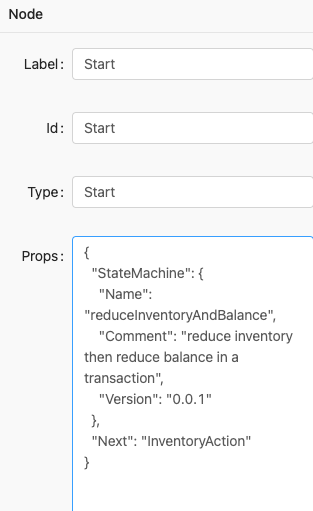

 说明： StateMachine下配置的是”状态机” 属性:

- Name: 表示状态机的名称，必须唯一
- Comment: 状态机的描述
- Version: 状态机定义版本

Next指定下一个节点的ID。

#### 3.3.2 任务节点ServiceTask

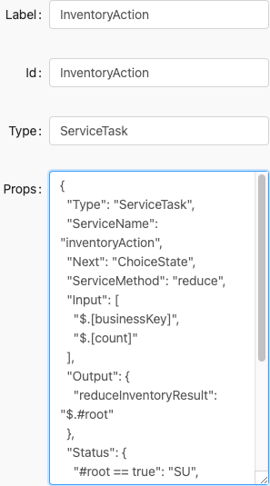

 完整Props内容：

```javascript
{
    "Type" : "ServiceTask",
    "ServiceName" : "inventoryAction",
    "Next" : "ChoiceState",
    "ServiceMethod" : "reduce",
    "Input" : [
        "$.[businessKey]",
        "$.[count]"
    ],
    "Output" : {
        "reduceInventoryResult" : "$.#root"
    },
    "Status" : {
        "#root == true" : "SU",
        "#root == false" : "FA",
        "$Exception{java.lang.Throwable}" : "UN"
    },
    "CompensateState" : "CompensateReduceInventory",
    "Retry" : [ ]
}
```

说明： 1、需要采用Next配置指定状态机下一个节点。 2、ServiceTask节点必须配置对应的状态补偿节点CompensateState 3、Input: 调用服务的输入参数列表, 是一个数组, 对应于服务方法的参数列表, 通过金钱符号获取参数

>  $.表示使用表达式从状态机上下文中取参数 

表达使用的SpringEL, 如果是常量直接写值即可。 4、Output: 将服务返回的参数赋值到状态机上下文中, 是一个map结构，key为放入到状态机上文时的key（状态机上下文也是一个map），

>  value中$.是表示SpringEL表达式，表示从服务的返回参数中取值，#root表示服务的整个返回参数 

5、Status: 服务执行状态映射，框架定义了三个状态，SU 成功、FA 失败、UN 未知, 我们需要把服务执行的状态映射成这三个状态，帮助框架判断整个事务的一致性，是一个map结构，key是条件表达式，一般是取服务的返回值或抛出的异常进行判断，默认是SpringEL表达式判断服务返回参数，带$Exception{开头表示判断异常类型。value是当这个条件表达式成立时则将服务执行状态映射成这个值

#### 3.3.3 选择节点Choice

用来对状态机执行链路的多条件分支判断。 

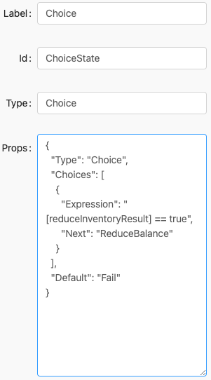

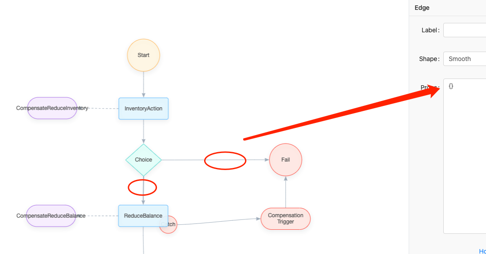

 **说明：** 1、Choice类型的”状态”是单项选择路由 Choices: 可选的分支列表, 只会选择第一个条件成立的分支 Expression: SpringEL表达式 Next: 当Expression表达式成立时执行的下一个”状态” 2、Choices属性下可以配置多个判断分支 3、Default属性指定默认的下一个节点的ID 4、这里一定要注意，对Choice节点发散出去的带箭头线条上面的判定属性的配置。如果在Choices属性下已经将分支判定属性配置清楚，那么一定要将这些发散出去线条的默认属性置空，配置成{}，否则会出现如下异常： Caused by: java.lang.ClassCastException: java.lang.Boolean cannot be cast to java.lang.String

下面是choice线条默认的属性，如果不修改配置会出现异常。 

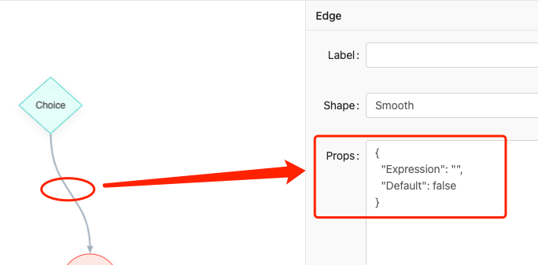

#### 3.3.4 异常捕捉节点Choice

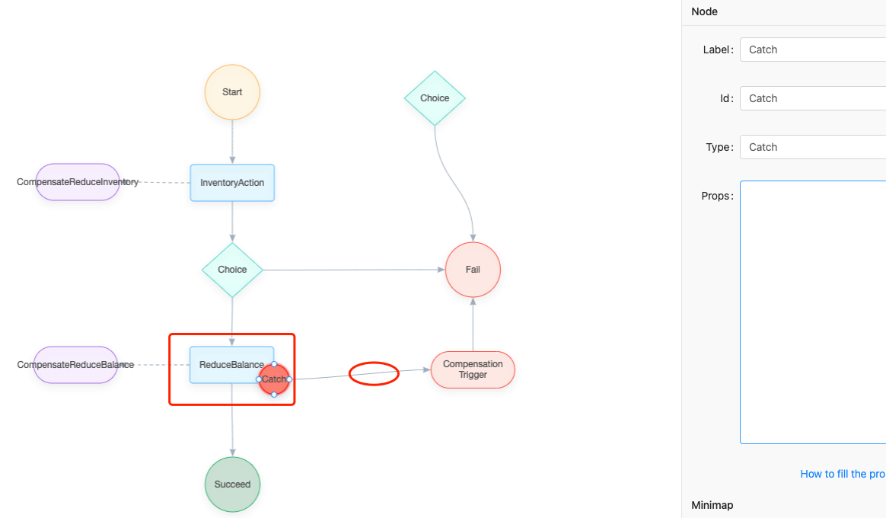

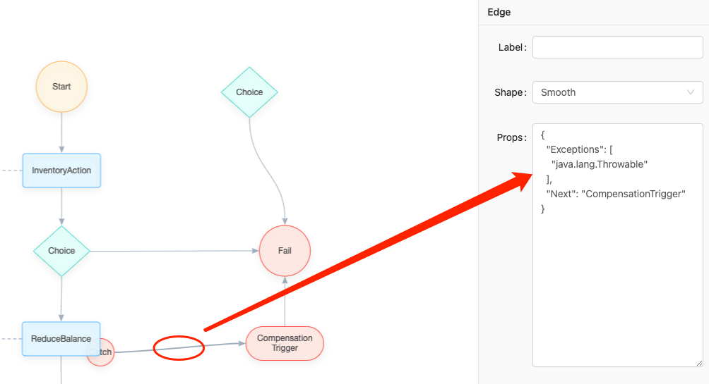

**说明：** 1、异常捕捉节点要通过图形覆盖在状态任务节点的图形上，实现2者之间的关联。 比如上图中，Catch节点就是针对ReduceBalance节点进行异常捕获。 2、通过对Catch节点发散出去的箭头线上的属性配置，指定对什么异常进行捕获，以及捕获到对应的异常后下一个流转节点的名称。

#### 3.3.4 成功节点Succeed

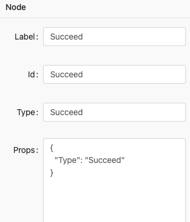

运行到”Succeed状态”表示状态机正常结束, 正常结束不代表成功结束, 是否成功要看每个”状态”是否都成功

#### 3.3.5 失败节点Fail

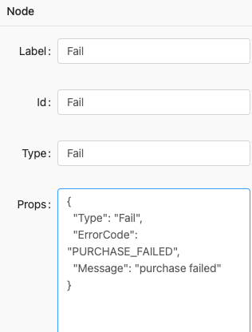

运行到”Fail状态”状态机异常结束, 异常结束时可以配置ErrorCode和Message, 表示错误码和错误信息, 可以用于给调用方返回错误码和消息

#### 3.3.6 补偿触发节点CompensationTrigger

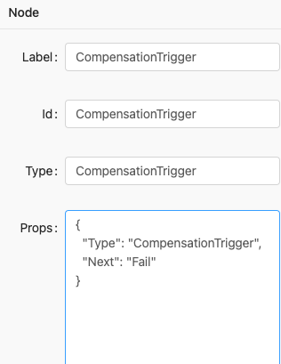

 CompensationTrigger类型的state是用于触发补偿事件, 回滚分布式事务 Next: 补偿成功后路由到的state。

## 4 状态机的使用

总体例子还是参考官网的local-saga项目，在其基础上做了一些补充完善。 

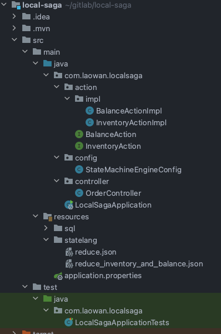

### 4.1 seata属性配置

```javascript
seata.enabled=true
seata.tx-service-group=local_saga
seata.service.vgroup-mapping.local_saga=seata-server
seata.service.grouplist.seata-server=127.0.0.1:8091
```

### 4.2 状态机json配置

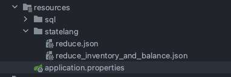

 将设计好的Saga状态机的json文件导出，存放在/resource/statelang/目录下。

### 4.3 配置状态机

```javascript
import io.seata.saga.engine.config.DbStateMachineConfig;
import io.seata.saga.engine.impl.ProcessCtrlStateMachineEngine;
import io.seata.saga.rm.StateMachineEngineHolder;
import lombok.extern.slf4j.Slf4j;
import org.springframework.beans.factory.annotation.Autowired;
import org.springframework.context.annotation.Bean;
import org.springframework.context.annotation.Configuration;
import org.springframework.core.io.ClassPathResource;
import org.springframework.core.io.Resource;
import org.springframework.scheduling.concurrent.ThreadPoolTaskExecutor;

import javax.sql.DataSource;
import java.util.concurrent.ThreadPoolExecutor;

@Slf4j
@Configuration
public class StateMachineEngineConfig {
    @Autowired
    private DataSource dataSource;

    @Bean
    public DbStateMachineConfig dbStateMachineConfig() {
        DbStateMachineConfig stateMachineConfig = new DbStateMachineConfig();
        stateMachineConfig.setDataSource(dataSource);
        Resource resource = new ClassPathResource("statelang/reduce.json");
        stateMachineConfig.setResources(new Resource[]{resource});
        stateMachineConfig.setEnableAsync(true);
        stateMachineConfig.setThreadPoolExecutor(threadExecutor());
        return stateMachineConfig;
    }

    @Bean
    public ProcessCtrlStateMachineEngine stateMachineEngine() {
        ProcessCtrlStateMachineEngine processCtrlStateMachineEngine = new ProcessCtrlStateMachineEngine();
        processCtrlStateMachineEngine.setStateMachineConfig(dbStateMachineConfig());
        return processCtrlStateMachineEngine;
    }

    @Bean
    public StateMachineEngineHolder stateMachineEngineHolder() {
        StateMachineEngineHolder engineHolder = new StateMachineEngineHolder();
        engineHolder.setStateMachineEngine(stateMachineEngine());
        return engineHolder;
    }

    @Bean
    public ThreadPoolExecutor threadExecutor() {
        ThreadPoolTaskExecutor executor = new ThreadPoolTaskExecutor();
        //配置核心线程数
        executor.setCorePoolSize(1);
        //配置最大线程数
        executor.setMaxPoolSize(20);
        //配置队列大小
        executor.setQueueCapacity(10000);
        //配置线程池中的线程的名称前缀
        executor.setThreadNamePrefix("SAGA_ASYNC_EXE_");
        // 设置拒绝策略：当pool已经达到max size的时候，如何处理新任务
        // CALLER_RUNS：不在新线程中执行任务，而是有调用者所在的线程来执行
        executor.setRejectedExecutionHandler(new ThreadPoolExecutor.CallerRunsPolicy());
        //执行初始化
        executor.initialize();
        return executor.getThreadPoolExecutor();
    }
}

```

### 4.4 下订单接口

```javascript

import io.seata.saga.engine.StateMachineEngine;
import io.seata.saga.statelang.domain.ExecutionStatus;
import io.seata.saga.statelang.domain.StateMachineInstance;
import lombok.extern.slf4j.Slf4j;
import org.springframework.beans.factory.annotation.Autowired;
import org.springframework.web.bind.annotation.GetMapping;
import org.springframework.web.bind.annotation.RestController;

import java.math.BigDecimal;
import java.util.HashMap;
import java.util.Map;

@RestController
@Slf4j
public class OrderController {

    @Autowired
    StateMachineEngine stateMachineEngine;

    /**
     * 用户用这个路径进行访问： * http://localhost:8080/create * @return
     */
    @GetMapping("/create")
    public String create() {

        log.info("=========开始创建订单============");
        Map<String, Object> startParams = new HashMap<>(3);
        //唯一健
        String businessKey = String.valueOf(System.currentTimeMillis());
        startParams.put("businessKey", businessKey);
        startParams.put("count", 10);
        startParams.put("amount", new BigDecimal("400"));
        //同步执行
        StateMachineInstance inst = stateMachineEngine.startWithBusinessKey("reduceInventoryAndBalance", null, businessKey, startParams);
        if (ExecutionStatus.SU.equals(inst.getStatus())) {

            log.info("创建订单成功,saga transaction execute Succeed. XID: " + inst.getId());
            return "创建订单成功";
        } else {

            log.info("创建订单失败 ,saga transaction execute failed. XID: " + inst.getId());
            return "创建订单失败";
        }
    }
}
```

### 4.5 启动项目

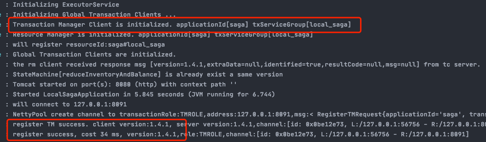

 初始化TM，TM注册成功。 初始化RM，RM注册成功

### 4.6 发起下订单请求

发起请求：http://localhost:8080/create 

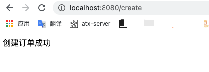

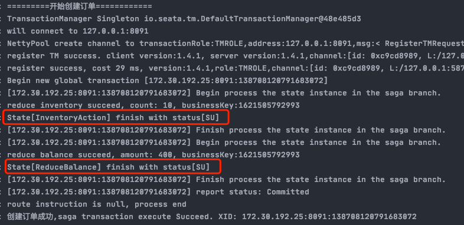

 说明： 扣减库存服务InventoryAction和扣减余额服务ReduceBalance都成功，成功创建订单。

### 4.7 模拟扣减余额失败

在BalanceActionImpl类扣减余额方法中，主动抛出异常。

```javascript
    @Override
    @Transactional(rollbackFor = Exception.class)
    public boolean reduce(String businessKey, BigDecimal amount, Map<String, Object> params) {

        if (params != null && "true".equals(params.get("throwException"))) {

            throw new RuntimeException("reduce balance failed");
        }
        if (Math.random() < 0.9999) {

            throw new RuntimeException("模拟随机异常，扣减账户余额失败");
        }
        LOGGER.info("reduce balance succeed, amount: " + amount + ", businessKey:" + businessKey);
        return true;
    }
```


发起请求：http://localhost:8080/create 

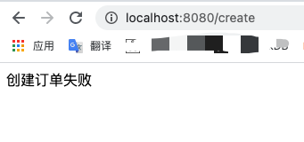

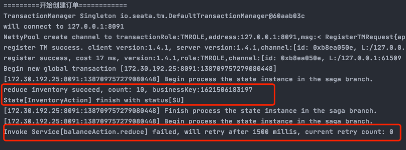

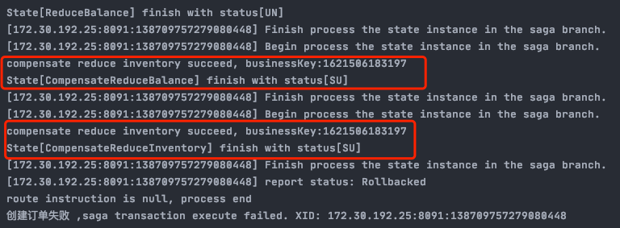

 说明： 1、扣减库存动作执行成功 2、扣减余额失败，开始进行重试，重试次数3次 3、重试结束，扣减余额失败，异常被catch动作捕获，触发补偿触发节点CompensationTrigger的事件。 4、触发compenstate状态补偿事件CompensateReduceBalance和CompensateReduceInventory 5、状态机引擎执行结束，创建订单失败

## 5 遇到的问题记录

**问题一：** io.seata.saga.engine.exception.EngineExecutionException: State[Compensation1] is not exist 状态节点的补偿状态节点不存在。 

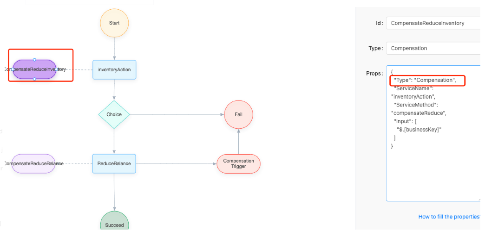

 1、ServiceTask节点一定配置CompensateState属性，指定状态补偿节点。 2、Compensation节点属性中一定要包含 “Type”: “Compensation”属性

**问题二：** Caused by: java.lang.IllegalStateException: No node 

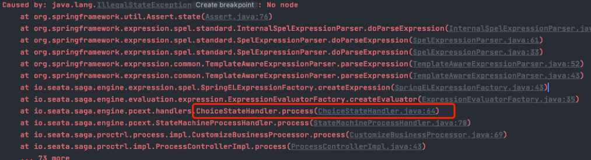

 根据异常日志，判定是choice判定节点的配置出现异常。 **原因：** 没有对Choice节点的发散出去的箭头上的判断添加进行重新配置。 这样的默认条件，状态机引擎无法识别下一个节点。 注意： Expression中的判断条件正确 Next指定下一个节点的id Default指定默认的下一个节点的id，值类型是字符串。 


问题三： Caused by: java.lang.ClassCastException: java.lang.Boolean cannot be cast to java.lang.String at io.seata.saga.statelang.parser.impl.ChoiceStateParser.parse(ChoiceStateParser.java:55) 

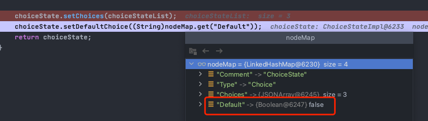

 choice节点属性：Default属性要指定下个节点的名称，不能使用boolean类型。 

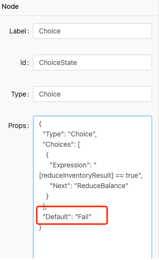

问题四： Caused by: java.lang.RuntimeException: ‘Catch’ node[053ac3ac] is not attached on a ‘ServiceTask’ or ‘ScriptTask’

**Catch节点一定要放在ServiceTask节点上，这样就会自动和ServiceTask进行关联。而不能采用带箭头线条进行关联。**

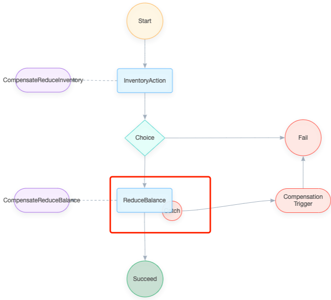

问题五： InventoryActionImpl.reduce执行失败不停重试的问题 模拟InventoryActionImpl.reduce执行失败后，扣减库存动作不停的重试。

```javascript
@Override
@Transactional(rollbackFor = Exception.class)
public boolean reduce(String businessKey, int count) { 

    LOGGER.info("reduce inventory succeed, count: " + count + ", businessKey:" + businessKey);
    
    if (Math.random() < 0.9999) { 
    	throw new RuntimeException("模拟随机异常，扣减库存失败");
    }
    return true;
}
```


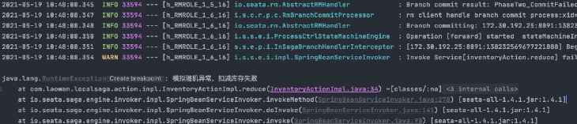

 改进： 针对InventoryAction节点，也添加异常捕获。 

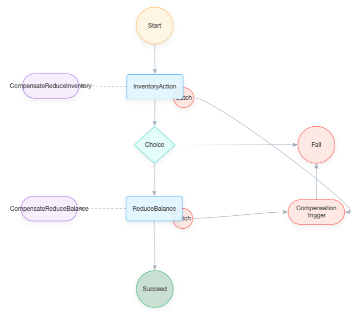

问题六： 服务端一直出现：Failed to commit SAGA global[172.30.192.25:8091:138343622889181184], will retry later. 这个主要是由于InventoryAction节点抛出了异常，但是没有捕获处理，导致分支事务的状态上报一直失败。 导致TC一直发起globalstatus commitrestrying。 解决： 1、停止seata server服务 2、rm -fr sessionStore 3、重启服务 4、状态机的任务节点都配置异常捕获 5、重启项目再次发起请求。

## 6 项目地址

项目地址：https://github.com/StarlightWANLI/local-saga.git

## 7 总结

业界公认 Saga 是作为长事务的解决方案，而要使用好Saga熟练使用状态机设计器设计相应业务流程执行的状态机引擎至关重要。 希望通过本文大家能掌握Saga状态机设计器的基本使用。

版权声明：本文内容由互联网用户自发贡献，该文观点仅代表作者本人。本站仅提供信息存储空间服务，不拥有所有权，不承担相关法律责任。如发现本站有涉嫌侵权/违法违规的内容， 请发送邮件至 举报，一经查实，本站将立刻删除。 